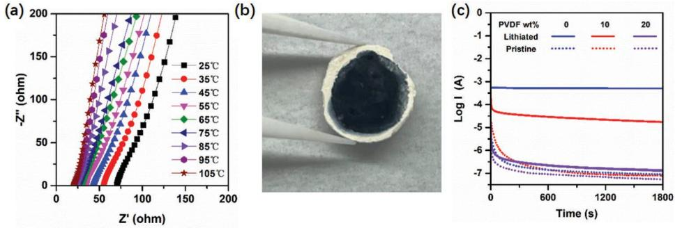
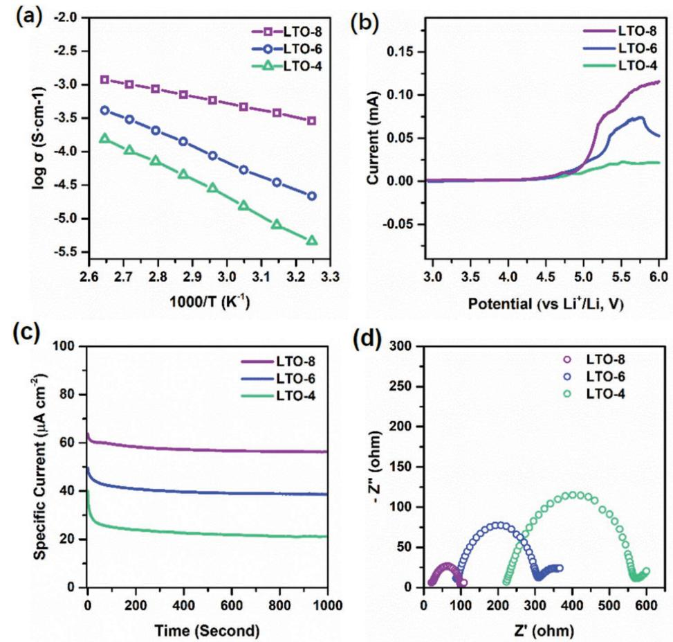
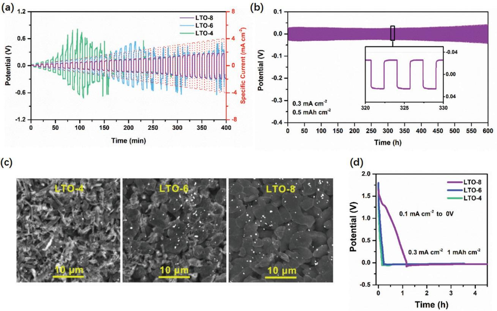
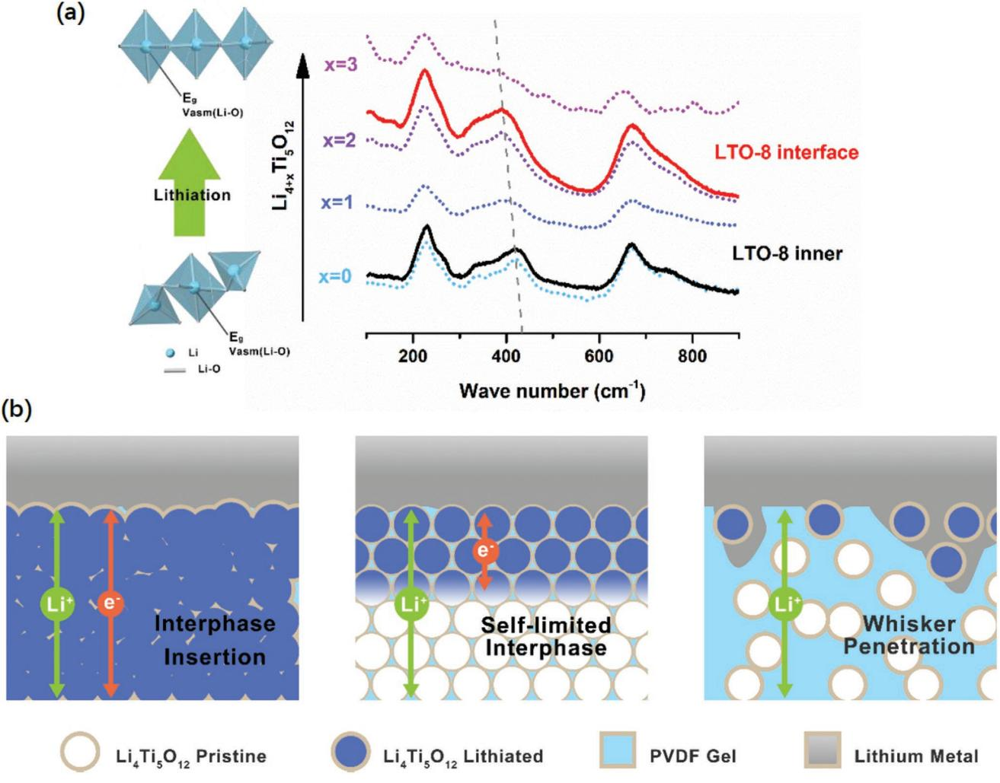
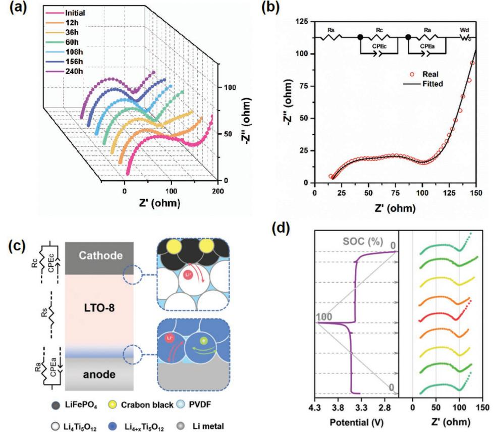
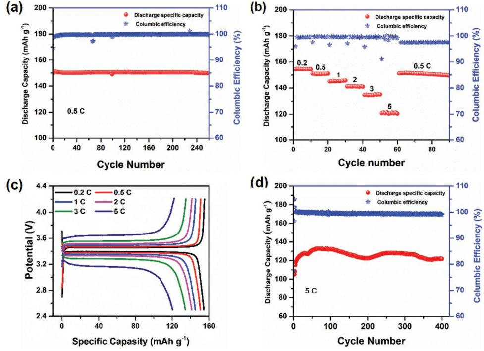

# **A Solid Electrolyte Based on Electrochemical Active Li4Ti5O12 with PVDF for Solid State Lithium Metal Battery**

*Qi Zhou, Xiaoyan Yang, Xiaosong Xiong, Qianyu Zhang,\* Bohao Peng, Yuhui Chen, Zhaogen Wang, Lijun Fu, and Yuping Wu\**

**In parallel with researches unveiling the nature and mechanism in solid state battery, numbers of investigations have been pursuing methods to stabilize their performance as well as to reduce the cost. Simple preparation and earth-abundant ingredients are preconditions for a solid state electrolyte to be suitable for scalable production. In this work, a commercial anode active material, spinel Li4Ti5O12, is introduced for the first time, which has high ionic conductivity to sustain high rate charge/discharge with considerable high performance/cost ratio, into poly(vinylidene fluoride) to achieve a composite solid electrolyte. The membrane solid electrolyte containing 80 wt% of the Li4Ti5O12 (LTO-8) shows outstanding ionic conductivity of 2.87 × 10−4 S cm−1 at 35 °C and inhibits electronic conductive network. The self-sacrificed interface contributes to the stabilized performance of the composite. Li**||**LiFePO4 cells with LTO-8 present a discharge specific capacity of 150 mAh g−1 at 0.5C and a considerable average specific capacity of 119 mAh g−1 under 5C in 400 cycles, demonstrating its excellent working performance. This investigation provides promising application of Li4Ti5O12 for solid state electrolytes, which is superior to the reported solid state electrolytes in comprehensive performance, and surely paves another commercial way to solid state batteries.**

# **1. Introduction**

In wave of sustainable economics, lithium ion batteries, which have achieved great success in the portable equipment industries because of its high energy density, are attracting more interests for their crucial roles in electric vehicles and renewable energy systems.[1] Along with the pursuit to higher energy

Q. Zhou, X. Yang, X. Xiong, B. Peng, Y. Chen, Z. Wang, L. Fu, Y. Wu State Key Laboratory of Materials-oriented Chemical Engineering School of Energy Science and Engineering Nanjing Tech University Nanjing, Jiangsu 211816, China E-mail: wuyp@fudan.edu.cn Q. Zhang College of Materials Science and Engineering Sichuan University Chengdu, Sichuan 610064, China E-mail: zhangqianyu@scu.edu.cn Y. Wu School of Energy and Environment South East University Nanjing, Jiangsu 211189, China The ORCID identification number(s) for the author(s) of this article can be found under https://doi.org/10.1002/aenm.202201991.

**DOI: 10.1002/aenm.202201991**

density and larger battery pack, difficulty of battery management accompanied with safety issues also emerges, drawing great concerns of public to solid state batteries (SSBs).[2] By replacing the ignitable organic liquid electrolytes (LE) with solid state electrolytes (SSEs), flammability of devices is supposed to be largely eliminated.[3,4] Besides, bipolar-stacked design with lithium anode realized by SSEs with a high mechanical strength could further burst the energy density of SSBs.[5]

However, prior to implementation of solid-state batteries, inadequate properties and complicated manufacture process of SSEs remain issues to overcome.[6] Other than ionic conductivity that inferior to liquid electrolytes, performances of SSEs are greatly restricted by undesirable electrode/electrolyte interfacial nature, in either chemistry or physics.[7] Numerous researchers have discussed poor stability of oxide-type SSEs against lithium metal anode.[8,9] Transition element containing

SSEs like Li3*x*La(2/3−*x*)TiO3 (LLTO)[10] and Li1+*x*Al*x*Ge2−*x*(PO4)3 (LAGP)[11] could undergo a fast and constant reduction to form an inserting interphase consisting of ionic/electronic mixed conductive species, followed with short circuit or physical deform of SSEs causing cell failure.[12] Garnet-type Li7La3Zr2O12 (LLZO) was found electrochemically stable against lithium metal, but suffers from contact losing with anode because its rigidity and lithiophobic surface.[13] Sulfide-based SSEs like thiophosphates (Li2S-P2S5) mostly suffers from undesired performance at cathode side caused by chemical deterioration and the space charge effect.[14]

As incompetent nature of SSE materials themselves, many efforts were made to build an ideal system with heterogeneous interface. Surface treatments by vapor deposition, magnetron sputtering,[15] chemical soaking[16] or physical coating[17] were conducted to form an artificial layer on SSEs. The interphase that consist of Al,[18] Ge,[19] liquid alloy,[20,21] graphite,[22] ZnO[23] or C3N4 [24] could change the surface to lithiophilic and thus improve Li|SSE contact. The compounds including ionic liquids,[25] conductive polymers[26] and salts like LiF,[27] exhibiting thermodynamic stability against the electrodes, were considered ideal interphase to inhibit electrochemical decomposition of SSEs. Element doping coupled with hierarchy design also achieved visible enhancements with less side effect on ion transport.[28,29]

**Figure 1.** a) EIS plot of pure Li4Ti5O12 pellet under different temperature; b) the digital photo of Li4Ti5O12 after contacting with lithium metal foil; c) chronoamperometry curve of pristine/lithiated pellets with PVDF addition under 0.5 V.

Though massive strategies were explored so far, the feasibility of a SSE system is confined by not only its electrochemical property, but also the dilemma between performance and cost.[30] Expensive raw materials, strict synthesis/storage condition, including high temperature sintering and inert gas protection, have kept the high cost of SSEs and a complicate surface treatment could raise the price further.[31]

Composite solid electrolytes (CSEs) are a feasible strategy to address interfacial issues and cost dilemma as well. Although most polymer electrolytes such as poly(ethylene oxide) (PEO),[32] poly(vinylidene fluoride) (PVDF)[33] or polyacrylonitrile (PAN)[34] exhibit high ionic conductivity at room temperature by modification, this drawback is less important compared to interface contact.[35] With rational design, polymers with electronic insolation and electrochemical inertness could avoid materials like LATP,[36] LLTO,[37] LPS[38] from interfacial reaction by serving as a protective interlayer. Various structures like asymmetry, hierarchy, 3D scaffold and alignment were designed to improve interface nature, meanwhile maintain high ionic conductivity and thermal stability of CSEs.[39–41]

In this work, a rare-noticed inorganic conductive material, spinel lithium titanate Li4Ti5O12, was for the first time investigated as an SSE through a simple compositing strategy. Widely applied as commercial anode active material, pristine Li4Ti5O12 can undergo fast charge and discharge even without carbon coating and owns low cost and good chemical stability under ambient atmosphere.[42] In comparison with solid state electrolytes material like LLZO, whose price could be over 2000 \$ kg−1 , Li4Ti5O12 is much cheaper, about 50 \$ kg−1 . The electrochemical activity of Li4Ti5O12 under negative potential induced a mixed conductive interphase, which largely improved electrochemical behavior at anode interface. The composite membrane with optimal Li4Ti5O12 loading not only exhibited a high ionic conductivity but also formed stable interface with electrodes. The Li|LiFePO4 cell applying the composite solid state electrolyte attained an outstanding cycling stability and high rate performance. This work provides an easy and practical way to produce SSE and SSBs.

#### **2. Results and Discussion**

#### **2.1. Nature of Li4Ti5O12**

The ion transport ability of Li4Ti5O12 were first test on the pellet consisted of pure powder, showing a considerable room temperature conductivity of 3.67 × 10−4 S cm−1 (**Figure 1**a). Similar to LLTO and LATP, the electrochemical active Li4Ti5O12 could be easily reduced to electronic conductive Ti(III) species.[43] Electronic conductivity could boost further electrochemical reaction, forming an inserting interphase that could penetrate the bulk electrolytes and result in cell failure.[44] The pellet made of pure Li4Ti5O12 undergoes fast reduction upon contact with lithium metal as observed from appearance, the contact area turns to deep blue (Figure 1b). The lithium metal cell applying pure Li4Ti5O12 as SSEs leads to immediate short circuit because the electronic conductive Li4+*x*Ti5O12 phase will be produced soon and expand to the whole Li4Ti5O12 pellet resulting in an electronic conductive path.

To restrain the reaction, PVDF was added into the pellet by physical mixing and the electronic conductivity of the sample was evaluated by the chronoamperometry under 0.5 V (Figure 1c). PVDF could deliver considerable film-formation ability, electronic insulation and chemical stability, and acted as a favorable choice for this research. Pure Li4Ti5O12 exhibits the steady current that ascent serval 5 orders of magnitude after contacting with lithium metal foil for 24 h, shifting from electronic isolative to semi conductive. The 10 wt% of PVDF could reduce the electronic conductivity from 10−4 to 10−6 S cm−1 for lithiated state. The pellet with 20 wt% of PVDF has less rise on electronic conductivity and still could be regard as isolator after contact with lithium metal (2.8 × 10−9 S cm−1 ). PVDF was confirmed to suppress interphase insertion of Li4Ti5O12. Of course, its influence to electrochemical property will be studied further.

#### **2.2. Characterization of the CSEs**

Hence, to further investigate the practicability of Li4Ti5O12 and effect of PVDF polymer, CSEs consisting of 80, 60, and 40 wt% of Li4Ti5O12 with PVDF, labeled LTO-8, LTO-6 and LTO-4, respectively, were synthesized by a simple casting method (**Figure 2**a). XRD pattern of samples (Figure S1, Supporting Information) shows sharp crystalline peaks that could be indexed to spinel lithium titanium oxide Li4Ti5O12 (PDF#72-0426) and two weak broad lumps nearing 20.3° and 39.0° that correspond to PVDF.

The thermal stability could be visually compared from the appearance of LTO-X during heating treatment (Figure 2b). After 10 min of heating under 120 °C, slight deformation started

**Figure 2.** a) Preparation process of LTO-X, b) appearance evolution after heating test, and c) SEM images at surface and cross section.

to occur for LTO-4 and LTO-6. When temperature further rises to 180 °C, LTO-4 shows server shrinkage as PVDF starts to melt, while LTO-8 barely changes after heating. The enhancement of thermal tolerance could originate from high content of LTO, also acting as an inorganic filler in the composite.

SEM graphs (Figure 2c) of LTO-4 with relatively less Li4Ti5O12 loading shows a typical polymer-dominant dispersion with smooth surface where particles uniformly dispersed in PVDF matrix. Variously, surface and inner of LTO-6 still maintained a particle-in-polymer inner section with a higher Li4Ti5O12 concentration. As the particle further increased, LTO-8 becomes a ceramic-dominant composite, in which PVDF mainly served as binder to fill the gaps of compacted particles, forming a rough particle-rich surface.

Ion transport ability was first evaluated by EIS test on SS|LTO-X|SS cells (Figure S2, Supporting Information). A drop of LE (10 µL, mass ratio 0.6:1 to the LTO film) was added to wet the electrode/CSE interface and gel PVDF to make Li+ cation transportable. The conductivity of LTO-X shows an exponentially rising trend when Li4Ti5O12 loading is increased from 40 to 80 wt%, as presented in Arrhenius plot (**Figure 3**a). The LTO-8 exhibits the highest conductivity, reaching 2.87 × 10−4 S cm−1 at 35 °C, which is an order of magnitude higher than LTO-6 (2.18 × 10−5 S cm−1 ), while LTO-4 only shown a conductivity of 4.56 × 10−6 S cm−1 The monotonic trend in slope could be also observed in Arrhenius plot of LTO-4, LTO-6 and LTO-8, of which the activation energy was estimated to be 0.258, 0.189 and 0.086 eV, respectively. especially at lower temperature. In CSEs with high polymer content, the lithium migration mainly occurs in polymer phase.[45,46] Inorganic fillers have been proposed to enhance ion transport in polymer region by improving chain mobility and ionic dissociation, which supports the enhancement in ionic conductivity from LTO-4 to LTO-6.[47,48] With further increasing of inorganic conductor, the migration in polymer could be physically block and ion transport mechanism would convert from polymer-dominated to ceramic-dominated.[33,49] Ionic conductivity of LTO-8 reaches to the same order of magnitude of pure Li4Ti5O12, implying that a solid phase path via the inorganic conductors is more efficient for ionic conduction than polymer electrolyte.[50]

The linear sweep voltammetry (LSV) curve (Figure 3b) shows a similar electrochemical window of LTO-X. No obvious current peak is observed until potential reached 5 V, which is adequate for cooperating with LiFePO4 cathode (LFP) with a cutoff voltage of 4.2 V (vs Li+/Li) was carried to reveal the ion transfer behavior at lithium-electrolyte interface. The Li+ transfer numbers (tLi+) from chronoamperometry method (Figure 3c) were estimated to be 0.53, 0.77, and 0.87 in LTO-4, LTO-6, and LTO-8, respectively. The interaction between Li4Ti5O12 and ions in the PVDF gel is supposed to enhance transfer selective by restrain anion motivation. As the content of Li4Ti5O12 increases, the transport mechanism tends to be single Li+ ion conductor, making Li+ transfer number closer to 1.

In the EIS plots of Li|LTO-X|Li cells, the semicircles corresponding to charge transfer behavior enlarged with increasing PVDF polymer (Figure 3d). The decreased Li|CSEs interface impedance with increasing Li4Ti5O12 could indicates a more intimate interface contact or faster lithium transfer for Li4Ti5O12-dominating surface compared to PVDF gel dominating, which is also confirmed form Tafel curve (Figure S3,

**Figure 3.** Electrochemical characteristics of LTO-X. a) Arrhenius plot, b) liner scanning curve, c) chronoamperometry curve under 10 mV, and d) EIS plots of Li|Li symmetric cells.

Supporting Information). The exchange current density (*i*o) was estimated to be 0.26, 0.23, and 0.15 µA cm−2 for LTO-8/6/4, respectively, supporting the inference that charge transfer kinetics could be accelerated with high content of Li4Ti5O12.

Over all, the significant role Li4Ti5O12 participate in ion conduction is proven, and the optimal results on ionic conductivity and transport selectivity are achieved by LTO-8. So far maximizing inorganic proportion could be the optimal strategy to boost electrochemical property, however, remaining the stability uncertified. As previously mentioned, Li4Ti5O12 is a vulnerable material, and its concentration could make CSEs easily short circuit when employing lithium metal anode. It is necessary to verify the tolerance with lithium metal and the role of Li4Ti5O12 in interface construction.

#### **2.3. Li Metal Anode Interface**

Symmetric Li/LTO-X/Li cells were shortly cycled with step rising current (**Figure 4**a). The sudden drops of voltage profile suggest the cell failure of LTO-4 and LTO-6 under the critical current 0.9 and 2.3 mA cm−2 , respectively, while LTO-8 shows an ordered profile as specific current density reaching 4 mA cm−2 .

In galvanostatically symmetric Li stripping/plating process (Figure 4b), LTO-X with less LTO underwent a faster failure. Voltage profile of Li|LTO-4|Li exhibits strong turbulence before its total failure (Figure S4, Supporting Information). Li|LTO-6|Li has relatively smaller polarization, but also meets a sudden voltage drop in 20 h. The fast short circuit could be attributed to lithium penetration fostered by large over potentials in LTO-4/6,[51] indicating the negligible effect of scatted Li4Ti5O12 particles on dendrite suppression. In contrast, cells with LTO-8 behaved steadily with a stable over-voltage of only 40 mV in 500 h.

The result opposite to previous intuition that the composite solid electrolytes with richest vulnerable material were supposed to be less stable, but shows the best stability and sustains the largest current with lithium anode.

To unveil the impact of Li4Ti5O12 to lithium metal anode interface, Li|LTO-X|Cu were assembly and discharged to reach certain lithium loading. Some Li4Ti5O12 particles appeared as the light points on Li surface due to their intimate contact to lithium metal and the production of electronic conduction Li4+*x*Ti5O12 phase (Figure 4c). Applying LTO-4, the surface of copper foil was covered with numerous lithium needles. It could also be observed that similar lithium needles taking roots in gap of loose lithium clump on copper foil with LTO-6. The

**Figure 4.** Electrochemical characterizations on Li|LTO-X interface. a) Voltage profile of symmetric cells with LTO-X cycled under step rising current density and b) profile of LTO-8 in galvanostatical cycling, c) lithium-deposited morphology, and d) voltage profiles of Cu|LTO-X|Li cells during lithium plating.

dendrites could dissociate interface contact and deteriorate field distribution, resulting to enlarged interface resistance. Poor ionic conductivity and inhomogeneous electrical field originating from uneven contact surface could promotes deeper penetration of lithium whisker into the electrolyte, ending in cell short circuit. As cells with LTO-6 exhibited a mitigated condition compared to LTO-4, richer Li4Ti5O12 content could improve lithium-plating behaviour, but still failed to prevent whisker penetrating. In comparison, LTO-8 attained densely packed deposition that ellipsoid-like lithium laid intimately on copper collector with spherical nucleus rather than dendritelike lithium observed by the edge of bulks.

The difference on initial lithium plating process offered a clue. LTO-4 and LTO-6 spent 8 min and 13 min to reach 0 V, while a 1.25 V plateau last more than 1 h is observed for LTO-8 (Figure 4d). One reasonable explanation for long activation time before lithium plating could be the electrochemical reduction of Li4Ti5O12 (from Ti4+ to Ti3+) driven by electric field at Cu|LTO-8 interface, as Li4Ti5O12 could also act as electrochemical active material with a plateau about 1.55 V versus Li+/Li. For LTO-4/6, Li4Ti5O12 phase is insulated in PVDF matrix and only surface particles that directly contact with Li electrode would be lithiated, making the plateaus too short to be observed. However, highly concentrated Li4Ti5O12 could adjoin to each other in LTO-8, which make it possible to transport lithium ion as well as electron through solid-solid contact between particles. Through electronic conductive path, the electric field could extend across the interface, resulting to a little larger activation capacity for lithium insertion.

Raman spectra could provide an evidence (**Figure 5**a). First, Li4Ti5O12 samples were lithiated to certain lithium loading to standardize the chemical state (SI). The spectra of pristine Li4Ti5O12 shows five characteristic peaks corresponding to five Raman-active modes (A1g + Eg + 3F2g) of Fd3\_m space group. Three major Raman bands at 230, 421, and 670 cm−1 could be assigned to bending vibration of TiO bonds (F2g), asymmetric stretching vibration of the LiO bonds (Eg), and symmetric vibration of TiO bonds (A1g), respectively.[52] With increasing lithium insertion, LiO bond length is decreased and local structural changes of LiO6 octahedron is induced, resulting to evolution of Eg mode.[53] The Eg peak shifts toward red direction from 420 cm−1 for Li4Ti5O12 to 380 cm−1 for Li7Ti5O12 with decreasing intensity, which could regard as a reference for Li4+*x*Ti5O12 state. Raman spectra for LTO-8 disassembled from discharged Cu|Li cells were tested to verify Li4Ti5O12 state at the surface and the inner of the LTO-4,6, and 8 electrolytes. Li4Ti5O12 at anode-electrolyte interface was lithiated to the state between Li6Ti5O12 to Li7Ti5O12, while the bulk has spectra closer to pristine state. The Raman spectra indicate that lithiation in LTO-8 is still confined at interface region, which could attributed to electric field distribution across electrolyte bulk. In consequence of semi conductivity of lithiated species and

**Figure 5.** a) Raman spectra and schematic illustration of local structure evolution of Li-O in Li4Ti5O12 during lithiation; b) schematic illustration about the influence of Li4Ti5O12 density to Li|LTO-X interface.

inert PVDF phase, electric potential rises with increase depth, until it is insufficient to reach reduction potential of Li4Ti5O12. Assuming Li6Ti5O12 is the average state of lithiated phase, 0.1 mAh cm−2 of activation capacity is estimated to convert 5% of overall Li4Ti5O12 to mixed ionic/electronic interphase, which accounts for about 2 µm thickness in LTO-8.

It has been widely proposed that an artificial interlayer with mixed ionic/electronic conductivity could greatly improve interface between electrode and SSEs.[54,55] In LTO-X, lithiated Li4Ti5O12 could serves as mixed conductive phase, but only effective at particular proportion (Figure 5b). Excessive Li4Ti5O12 concentration could cause constant insertion of lithiated reaction because inadequate resistance, resulting short circuit after full penetration. In low Li4Ti5O12 content CSEs, particles are separated in polymer matrix and could not form a continue phase for ion or electron transport. Only when Li4Ti5O12 is in an appropriate range, 80 wt% in this work, the lithiated interphase could form and be limited at surface region and work as a functional interlayer in contact with lithium metal anode. Electrochemical activity of the interphase could enlarge the charge transfer area, which explain reduced interface resistance with increasing Li4Ti5O12. The interlayer with mixed ionic/electronic conductivity could redistribute electric flux along the interface, guarantee homogeneous electrical field that promotes uniform lithium plating,[56] thus sustaining intimate Li|LTO-8 contact that reduce interface impedance and restrain dendrite growth.[57]

#### **2.4. SSBs Performances**

The promotional effect of Li4Ti5O12 on cathode performance was reported to stabilize interface chemistry and reduce interface impedance.[58] Researchers also found Li4Ti5O12 interposing layer could mitigate the space charge layer between LiCoO2 and sulfide solid electrolytes by its electronic insulation and intermediate chemical potential.[59] As LTO-8 has achieve acceptable stability against Li metal anode, it is supposed to work in SSBs coupling LiFePO4 cathode.

**Figure 6.** EIS characterization of Li|LTO-8|LFP cells. a) Impedance spectra during aging; b) equivalent circuit model and c) its schematic illustration; d) evolution of the cell impedance in different state of SOC.

The cyclic voltammetry curves of Li|LTO-8|LFP cell (Figure S5a, Supporting Information) show one couple of typical redox peaks of LiFePO4 at 3.31 and 3.58 V, providing a considerable reaction reversibility.

The EIS plot of just assembled Li|LTO-8|LFP cells is similar to the typical model of lithium metal batteries. The curve includes a diagonal straight line at low frequency, semicircles at intermediate frequency and the intercepts at high frequency, respectively, corresponding to Warburg diffusion, interface impedance and bulk resistance (**Figure 6**a). During first 12 h, the semicircle shrined from 128 to 118 Ω, because of the formation of mixed conductive interphase that improved Li|LTO-8 contact. For the following 200 h, the impedance slightly increased to 120 Ω due to erosion of the added liquid electrolyte and possible interphase reactions.[60]

The interface impedance are fitted into two elements in equivalent circuit model (Figure 6b). The semicircles at higher frequency (103 Hz) are assumed to be cathode interface impedance and the one at lower frequency (102 Hz) present anode side (Figure 6c). From impedance plots at different state of charge (SOC), a constant bulk resistance is sustained, indicating the lithiated interphase is still confined under negative current. (Figure 6d).[61] In the half cycle, total interface resistance declined from 73 to 68 Ω, and recovered to original value in succeeding discharge. The evolution of charge transfer impendence could be described by synergy of changes on solid state diffusion, state of active material as well as contact area changing.[61,62] The second semicircle mainly contributed to the impendency change according to fitted results (details presented in the Supporting Information), which could ascribe to interface regenerate during lithium plating and striping at anode interface.[63] The impedance fluctuation in different SOC is quite small and reversible, stating a stable working state of LTO-8 so far.

The long-term performance of the cells is in line of our exception (**Figure 7**a), maintained a stable specific capacity of 150 mAh g−1 over 250 cycles with a high columbic efficiency above 99.7% at 0.5C (assuming 1C = 170 mA g−1 ). Changes of voltage profile are ignorable after 10th cycle, performing an outstanding redox reversibility with a steady voltage hysteresis of 60 mV (Figure S5b, Supporting Information). Cells with LTO-6 and LTO-4 were assembled and tested as well, showing undesired performance and fast cell failure as the result of high resistance and interface degradation (Figure S6, Supporting Information).

The cell applying LTO-8 cycled under 0.2C, 0.5C, 1C, 2C, 3C, and up 5C deliver considerable discharge capacities of 154, 150, 145, 141, 135, and 121 mAh g−1 , respectively (Figure 7b), with the potential hysteresis ramping from 60 to 480 mV (Figure 7c). The high rate working performance of the cell could be endued by the fast ion transport and interface behavior that moderate electrode polarization in particular of LTO-8.

**Figure 7.** Galvanostatic cycling performance of Li|LTO-8|LFP cells at 35 °C, discharge capacity and columbic efficiency at a) 0.5C; b) capacity and c) potential profiles at different rate; d) cycling performance at 5C.

The Li|LTO-8|LFP cell were then cycled under 5C (Figure 7d). The capacity curve with wavy fluctuation delivers a considerable average specific capacity of 119 mAh g−1 in 400 cycles. High current density could impose a larger overpotential and increase inhomogeneity of Li stripping/plating behavior at Li|LTO-8 interface. A redistribution of the mixed conductive interlayer is induced by greater electric field changes during charging/discharging and its hysteresis might account for capacity floating. A high columbic efficiency is sustained regardless capacity fluctuation, showing the electrochemical behavior still exhibits high reversibility.

Overall, LTO-8 containing highly concentrated Li4Ti5O12 exhibited adequate high ionic conductivity. Its electrochemical activity builds an asymmetric structure that achieved good electrochemical stability against either anode or cathode. With the rational Li4Ti5O12 proportion, LTO-8 presented a considerable excellent working performance in Li||LFP solid state cells such as cycling and rate behaviors.

# **3. Conclusions**

In summary, we investigated the electrochemical behavior of Li4Ti5O12 based SSEs incorporating with PVDF, and ensuring the optimal proportion of 80 wt% with stable performance. It is found that the ionic conductivity (2.87 × 10−4 S cm−1 at 35 °C) and ionic transfer number (0.87) are improved as Li4Ti5O12 content increases to 80 wt%. The spontaneously formed interlayer at anode side achieves an asymmetry structure that adapts to electrode behavior, resulting to an outstanding interface stability. Li||LFP cells employing the LTO-8 with 80 wt% of Li4Ti5O12 show superior performance of 250 cycles with a stable discharge capacity of 150 mAh g−1 under 0.5C, and a considerable average specific capacity of 119 mAh g−1 under 5C in 400 cycles. Though dynamic evolution and theoretical mechanism, which could be verified by in-situ characterization and computational simulation, were less discussed in this work, the study puts forward another fresh point of view in the application promise of SSEs consisting of a considerable low cost, commercialized electrode material, Li4Ti5O12, and the true commercialization of SSBs will come soon.

### **4. Experimental Section**

*Electrolyte Synthesis*: Spinel-type Li4Ti5O12 (no carbon coating, white) with an average diameter of 500 nm was mixed with PVDF (130 000 wt) physically in different proportion, followed by ball milling at 500 rpm after the addition of isopropanol. Dimethylformamide (DMF) solvent was added into the as-dried mixture, and became homogeneous slurry after 6 h of vigorous stirring. The slurry was plate-coated on a PET released film, and dried in vacuum oven at 80 °C. The membrane removed from the substrate was cut into pieces for further characterization.

LFP cathode preparation: LiFePO4, PVDF and acetylene black mixed with a weight ratio of 8:1:1 were added into N-methyl-2-pyrrolidene (NMP). The slurry was magnetically stirred for 6 h and blade coated on aluminum foil. After placed in vacuum oven at 80 °C overnight, the cathode was cut into 10 mm diameter pieces, weighted, then stored in Argon-filled glove box.

*Characterization*: X-ray diffraction (XRD) was carried with Rigaku SmartLab3KW emitting Cu K*α* radiation over a 2*θ* range of 10–90°. The structures of inner and surface of SSEs, as well as the lithium deposition morphology were photoed by the Philips scanning electron microscopy (SEM) XL70 with a voltage of 15 kV.

Raman spectra were recorded on a HORIBA Xplora Plus Raman microscope, employing an excitation wavelength of 532 nm. The acquisition time was 100 s for each Raman spectrum,

The coin cells were assembled in Argon-filled glove box. In case of pure PVDF, a drop of conventional nonaqueous carbonate electrolyte (LB315, 10 µL) was added during cell assembly to gelatinize polymer and wet the interface for further electrochemical test.

Solartron Analytical 1287A electrochemical workstation was used to test ionic conductivity of SSEs by AC electrochemical impedance spectroscopy (EIS) with an AC amplitude of 10 mV within the frequency from 1 MHz to 0.1 Hz. The test was conducted in temperature from 35 to 105 °C to estimate activation energy. The ionic conductivity and activation energy were calculated using the following equation:

$$
\sigma = \frac{L}{RS} = A \exp \frac{-E_a}{TK_b} \tag{1}
$$

where *S* is contact area of the SSE and electrode; *L* is thickness of the SSE; *R* is impedance between the SSE and block electrode; *E*a is ion transport activation energy; *A* is pre-exponential factor; *T* is absolute temperature; and *K*b is Boltzmann constant.

Electrochemical window of SSEs was tested by liner sweep scanning (LSV) from 0 to 6 V on Li|SSE|stainless steel (SS) cell. The Li+ transfer number (*t*Li+) was obtained through potentiostatic experiment, in which 10 mV of step potential was applied on symmetry Li|SSE|Li cells for 1000 s to obtain initial and steady currents for calculation. Lithium stripping/plating behavior was characterized through galvanostatic experiment under 0.3 mA cm−2 and critical current test under a lifting current density from 0.2 to 4 mA cm−2 on Li|SSE|Li cells. Li|SSE|Cu cells were charged to 0 V at 0.1 mA cm−2 , followed by 0.3 mA cm−2 until the capacity reach 1 mAh cm−2 .

Li|SSE|LFP cells were assembled to evaluate electrochemical performance by a LAND CT2001A battery test system at 35 °C. The longterm working stability was tested at 0.5C and 5C. The rate capability was tested from 0.2 C to 5 C within a potential range of 2.5 to 4.2 V. To get EIS plot changes in a cycle, the cell was tested for each 30 min or at 100% of SOC, and was left standing for 20 min before the measurement.

# **Supporting Information**

Supporting Information is available from the Wiley Online Library or from the author.

#### **Acknowledgements**

The authors gratefully acknowledge the financial support from the National Key R & D Program of China (2021YFB2400200), the National Natural Science Foundation Committee of China (Key Project No. 52131306, Distinguished Youth Scientists Project No. 51425301), State Key Lab Research Foundation (ZK201805 and ZK201717), and Postgraduate Research & Practice Innovation Program of Jiangsu Province (KYCX20\_1072).

### **Conflict of Interest**

The authors declare no conflict of interest.

### **Data Availability Statement**

The data that support the findings of this study are available from the corresponding author upon reasonable request.

#### **Keywords**

high ionic conductivity, Li4Ti5O12, solid state battery, solid state electrolytes

> Received: June 13, 2022 Revised: July 22, 2022 Published online: August 25, 2022

- [1] X. Zhang, Q. Xiang, S. Tang, A. Wang, X. Liu, J. Luo, *Nano Lett.* **2020**, *20*, 2871.
- [2] P. G. Balakrishnan, R. Ramesh, T. Prem Kumar, *J. Power Sources* **2006**, *155*, 401.
- [3] J. Tippens, J. C. Miers, A. Afshar, J. A. Lewis, F. J. Q. Cortes, H. Qiao, T. S. Marchese, C. V. Di Leo, C. Saldana, M. T. McDowell, *ACS Energy Lett.* **2019**, *4*, 1475.
- [4] C. Sun, J. Liu, Y. Gong, D. P. Wilkinson, J. Zhang, *Nano Energy* **2017**, *33*, 363.
- [5] H. Chang, Y.-R. Wu, X. Han, T.-F. Yi, *Energy Mater.* **2021**, *1*, 100003.
- [6] D. Cai, X. Qi, J. Xiang, X. Wu, Z. Li, X. Luo, X. Wang, X. Xia, C. Gu, J. Tu, *Chem. Eng. J.* **2022**, *435*, 135030.
- [7] Y. Zhu, X. He, Y. Mo, *J. Mater. Chem. A* **2016**, *4*, 3253.
- [8] J. A. Lewis, F. J. Q. Cortes, M. G. Boebinger, J. Tippens, T. S. Marchese, N. Kondekar, X. Liu, M. Chi, M. T. McDowell, *ACS Energy Lett.* **2019**, *4*, 591.
- [9] B. Gao, R. Jalem, Y. Tateyama, *ACS Appl. Mater. Interfaces* **2020**, *12*, 16350.
- [10] J. Lu, Y. Li, Y. Ding, *Ceram. Int.* **2020**, *46*, 7741.
- [11] J. Zhu, J. Zhao, Y. Xiang, M. Lin, H. Wang, B. Zheng, H. He, Q. Wu, J. Y. Huang, Y. Yang, *Chem. Mater.* **2020**, *32*, 4998.
- [12] J. D. Howard, G. Evmenenko, J. J. Kim, R. E. Warburton, S. Patel, T. T. Fister, D. B. Buchholz, J. Greeley, L. A. Curtiss, P. Fenter, *ACS Appl. Mater. Interfaces* **2022**, *14*, 7428.
- [13] J.-F. Wu, B.-W. Pu, D. Wang, S.-Q. Shi, N. Zhao, X. Guo, X. Guo, *ACS Appl. Mater. Interfaces* **2019**, *11*, 898.
- [14] J. Zhang, C. Zheng, L. Li, Y. Xia, H. Huang, Y. Gan, C. Liang, X. He, X. Tao, W. Zhang, *Adv. Energy Mater.* **2020**, *10*, 1903311.
- [15] M. Müller, J. Schmieg, S. Dierickx, J. Joos, A. Weber, D. Gerthsen, E. Ivers-Tiffée, *ACS Appl. Mater. Interfaces* **2022**, *14*, 14739.
- [16] M. Cai, J. Jin, T. Xiu, Z. Song, M. E. Badding, Z. Wen, *Energy Storage Mater.* **2022**, *47*, 61.
- [17] M. Du, Y. Sun, B. Liu, B. Chen, K. Liao, R. Ran, R. Cai, W. Zhou, Z. Shao, *Adv. Funct. Mater.* **2021**, *31*, 2101556.
- [18] S. Kim, H. Kim, K. Thomas-Alyea, G. Yoon, B. Kim, M. Badding, Z. Song, J. Chang, J. Kim, D. Im, K. Kang, *Adv. Energy Mater.* **2020**, *10*, 1903993.
- [19] Y. Liu, C. Li, B. Li, H. Song, Z. Cheng, M. Chen, P. He, H. Zhou, *Adv. Energy Mater.* **2018**, *8*, 1702374.
- [20] R. J. Y. Park, C. M. Eschler, C. D. Fincher, A. F. Badel, P. Guan, M. Pharr, B. W. Sheldon, W. C. Carter, V. Viswanathan, Y.-M. Chiang, *Nat. Energy* **2021**, *6*, 314.
- [21] J. Meng, Y. Zhang, X. Zhou, M. Lei, C. Li, *Nat. Commun.* **2020**, *11*, 3716.
- [22] Y. Shao, H. Wang, Z. Gong, D. Wang, B. Zheng, J. Zhu, Y. Lu, Y.-S. Hu, X. Guo, H. Li, *ACS Energy Lett.* **2018**, *3*, 1212.
- [23] Y. Zhong, Y. Xie, S. Hwang, Q. Wang, J. J. Cha, D. Su, H. Wang, *Angew. Chem., Int. Ed.* **2020**, *59*, 14003.
- [24] H. Huo, Y. Chen, R. Li, N. Zhao, J. Luo, J. G. Pereira da Silva, R. Mücke, P. Kaghazchi, X. Guo, X. Sun, *Energy Environ. Sci.* **2020**, *13*, 127.
- [25] J. Xu, Y. Meng, Q. Ding, R. Wang, T. Gan, J. Zhang, Z. Lin, J. Xu, *J. Mater. Chem. A* **2022**, *10*, 4402.

**www.advancedsciencenews.com www.advenergymat.de**

- [26] S. Li, J. Lu, Z. Geng, Y. Chen, X. Yu, M. He, H. Li, *ACS Appl. Mater. Interfaces* **2022**, [https://doi.org/10.1021/acsami.1c21804.](https://doi.org/10.1021/acsami.1c21804)
- [27] P. Jiang, J. Cao, B. Wei, G. Qian, S. Wang, Y. Shi, G. Du, X. Lu, C. Ouyang, F. Cao, X. Lu, *Energy Storage Mater.* **2022**, *48*, 145.
- [28] H. Kim, C. Im, S. Ryu, Y. J. Gong, J. Cho, S. Pyo, H. Yun, J. Lee, J. Yoo, Y. S. Kim, *Adv. Funct. Mater.* **2021**, *32*, 2107555.
- [29] L. Ye, X. Li, *Nature* **2021**, *593*, 218.
- [30] J. Wu, L. Yuan, W. Zhang, Z. Li, X. Xie, Y. Huang, *Energy Environ. Sci.* **2020**, *14*, 12.
- [31] Y. Lu, C.-Z. Zhao, H. Yuan, J.-K. Hu, J.-Q. Huang, Q. Zhang, *Matter* **2022**, *5*, 876.
- [32] W. Zhang, J. Nie, F. Li, Z. L. Wang, C. Sun, *Nano Energy* **2018**, *45*, 413.
- [33] S. H. Siyal, S. S. A. Shah, T. Najam, M. S. Javed, M. Imran, J.-L. Lan, *ACS Appl. Energy Mater.* **2021**, *4*, 8604.
- [34] L. Shen, S. Deng, R. Jiang, G. Liu, J. Yang, X. Yao, *Energy Storage Mater.* **2022**, *46*, 175.
- [35] Q. Yi, W. Zhang, T. Wang, J. Han, C. Sun, *Energy Environ. Mater.* **2022**, [https://doi.org/10.1002/eem2.12289.](https://doi.org/10.1002/eem2.12289)
- [36] X. Ban, W. Zhang, N. Chen, C. Sun, *J. Phys. Chem. C* **2018**, *122*, 9852.
- [37] J. Bi, D. Mu, B. Wu, J. Fu, H. Yang, G. Mu, L. Zhang, F. Wu, *J. Mater. Chem. A* **2020**, *8*, 706.
- [38] D. Li, L. Chen, T. Wang, L.-Z. Fan, *ACS Appl. Mater. Interfaces* **2018**, *10*, 7069.
- [39] W. Fitzhugh, X. Chen, Y. Wang, L. Ye, X. Li, *Energy Environ. Sci.* **2021**, *14*, 4574.
- [40] E. Yi, H. Shen, S. Heywood, J. Alvarado, D. Y. Parkinson, G. Chen, S. W. Sofie, M. M. Doeff, *ACS Appl. Energy Mater.* **2020**, *3*, 170.
- [41] Y. Li, D. Cao, W. Arnold, Y. Ren, C. Liu, J. B. Jasinski, T. Druffel, Y. Cao, H. Zhu, H. Wang, *Energy Storage Mater.* **2020**, *31*, 344.
- [42] C. Han, Y.-B. He, S. Wang, C. Wang, H. Du, X. Qin, Z. Lin, B. Li, F. Kang, *ACS Appl. Mater. Interfaces* **2016**, *8*, 18788.
- [43] H.-K. Tian, R. Jalem, B. Gao, Y. Yamamoto, S. Muto, M. Sakakura, Y. Iriyama, Y. Tateyama, *ACS Appl. Mater. Interfaces* **2020**, *12*, 54752.
- [44] Z. Lu, J. Yu, J. Wu, M. B. Effat, S. C. T. Kwok, Y. Lyu, M. M. F. Yuen, F. Ciucci, *Energy Storage Mater.* **2019**, *18*, 311.
- [45] D. Zhang, X. Xu, X. Huang, Z. Shi, Z. Wang, Z. Liu, R. Hu, J. Liu, M. Zhu, *J. Mater. Chem. A* **2020**, *8*, 18043.
- [46] Z. Xu, T. Yang, X. Chu, H. Su, Z. Wang, N. Chen, B. Gu, H. Zhang, W. Deng, H. Zhang, W. Yang, *ACS Appl. Mater. Interfaces* **2020**, *12*, 10341.
- [47] S.-S. Chi, Y. Liu, N. Zhao, X. Guo, C.-W. Nan, L.-Z. Fan, *Energy Storage Mater.* **2019**, *17*, 309.
- [48] Z. Wan, D. Lei, W. Yang, C. Liu, K. Shi, X. Hao, L. Shen, W. Lv, B. Li, Q. H. Yang, *Adv. Funct. Mater.* **2019**, *29*, 1805301.
- [49] H. Huo, Y. Chen, J. Luo, X. Yang, X. Guo, X. Sun, *Adv. Energy Mater.* **2019**, *9*, 1804004.
- [50] C. Wang, Q. Sun, Y. Liu, Y. Zhao, X. Li, X. Lin, M. N. Banis, M. Li, W. Li, K. R. Adair, D. Wang, J. Liang, R. Li, L. Zhang, R. Yang, S. Lu, X. Sun, *Nano Energy* **2018**, *48*, 35.
- [51] Z. Hong, V. Viswanathan, *ACS Energy Lett.* **2018**, *3*, 1737.
- [52] K. Mukai, Y. Kato, H. Nakano, *J. Phys. Chem. C* **2014**, *118*, 2992.
- [53] L. Aldon, P. Kubiak, M. Womes, J. C. Jumas, J. Olivier-Fourcade, J. L. Tirado, J. I. Corredor, C. Pérez Vicente, *Chem. Mater.* **2004**, *16*, 5721.
- [54] Y. Chen, Z. Wang, X. Li, X. Yao, C. Wang, Y. Li, W. Xue, D. Yu, S. Y. Kim, F. Yang, *Nature* **2020**, *578*, 251.
- [55] X. Xiong, W. Yan, Y. Zhu, L. Liu, L. Fu, Y. Chen, N. Yu, Y. Wu, B. Wang, R. Xiao, *Adv. Energy Mater.* **2022**, *12*, 2103112.
- [56] Z. Li, S. Zhang, K. Qian, P. Nie, S. Chen, X. Zhang, B. Li, T. Li, G. Wei, F. Kang, *iScience* **2020**, *23*, 101636.
- [57] J. Gao, J. Zhu, X. Li, J. Li, X. Guo, H. Li, W. Zhou, *Adv. Funct. Mater.* **2021**, *31*, 2001918.
- [58] T. Zeng, X. Hu, P. Ji, B. Shang, Q. Peng, Y. Zhang, R. Song, *J. Power Sources* **2017**, *359*, 250.
- [59] N. Ohta, K. Takada, L. Zhang, R. Ma, M. Osada, *Adv. Mater.* **2006**, 2226.
- [60] J. Liu, X. Gao, G. O. Hartley, G. J. Rees, C. Gong, F. H. Richter, J. Janek, Y. Xia, A. W. Robertson, L. R. Johnson, P. G. Bruce, *Joule* **2020**, *4*, 101.
- [61] J. Illig, M. Ender, T. Chrobak, J. P. Schmidt, D. Klotz, E. Ivers-Tiffée, *J. Electrochem. Soc.* **2012**, *159*, A952.
- [62] J. P. Schmidt, T. Chrobak, M. Ender, J. Illig, D. Klotz, E. Ivers-Tiffée, *J. Power Sources* **2011**, *196*, 5342.
- [63] P. Shafiei Sabet, D. U. Sauer, *J. Power Sources* **2019**, *425*, 121.