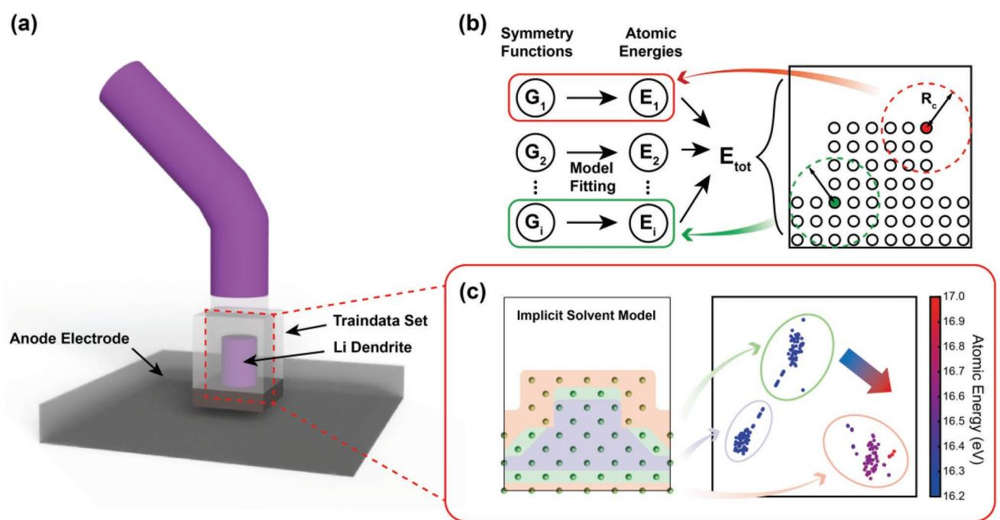
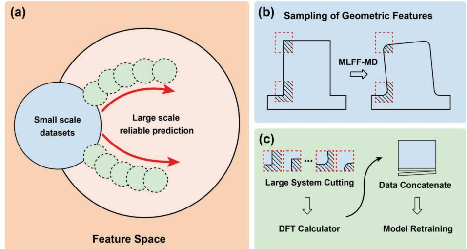
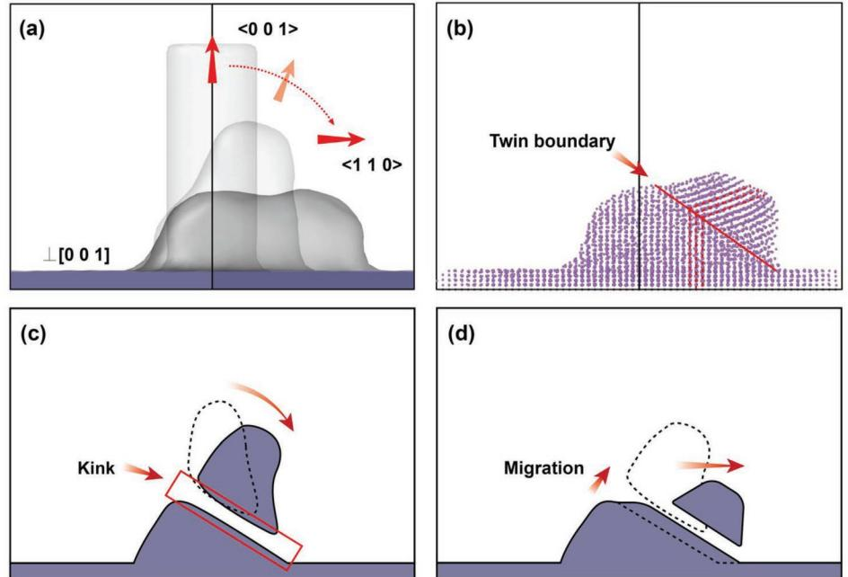
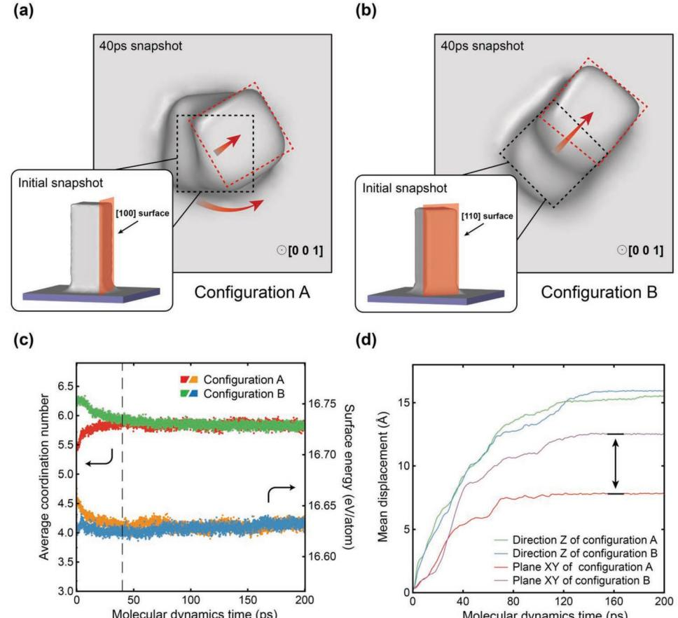

# **Revealing Morphology Evolution of Lithium Dendrites by Large-Scale Simulation Based on Machine Learning Force Field**

*Wentao Zhang, Mouyi Weng, Mingzheng Zhang, Yaokun Ye, Zhefeng Chen, Simo Li, Shunning Li, Feng Pan,\* and Lin-wang Wang\**

**Solving the dendrite growth problem is critical for the development of lithium metal anode for high-capacity batteries. In this work, a machine learning force field model in combination with a self-consistent continuum solvation model is used to simulate the morphology evolution of dendrites in a working electrolyte environment. The dynamic evolution of the dendrite morphology can be described in two stages. In the first stage, the energy reduction of the surface atoms induces localized reorientation of the originally single-crystal dendrite and the formation of multiple domains. In the second stage, the energy reduction of internal atoms drives the migration of grain boundaries and the slipping of crystal domains. The results indicate that the formation of multiple domains might help to stabilize the dendrite, as a higher temperature trajectory in a single crystal dendrite without domains shows a higher dendrite collapsing rate. Several possible modes of morphological evolutions are also investigated, including surface diffusion of adatoms and configuration twists from [100] exposed surfaces to [110] exposed surfaces. In summary, reducing the surface and grain boundary energy drives the morphology evolution. Based on the analysis of these driving forces, some guidelines are suggested for designing a more stable lithium metal anode.**

# **1. Introduction**

Lithium-ion batteries are widely used in electric vehicles and large-scale energy storage systems due to their high energy densities.[1–5] To further increase the specific energy density of

The ORCID identification number(s) for the author(s) of this article can be found under https://doi.org/10.1002/aenm.202202892.

#### **DOI: 10.1002/aenm.202202892**

batteries, lithium metal anode could be an essential part of the next-generation batteries by offering both the lowest electrochemical potential and a high capacity.[1,6,7] However, problems including dendrite growth and significant volume change during cycling severely jeopardize the applications of lithium metal anodes.[6–9] Under actual working conditions, the growth of lithium dendrites on the anode will significantly reduce the battery's Coulombic efficiency, energy density, and stability. After the dendrite grows to a certain length, it can pierce the separator and touch the cathode, resulting in a short circuit and possible serious accidents like fires.

With the development of experimental technology, the specific morphology and phase structure of lithium dendrites can now be directly observed by the transmission electron microscopy (TEM).[10–12] However, due to the resolution limit of existing observation methods, the kinetic

process of dendritic morphology evolution is still unclear. Existing simulation studies on lithium dendrites are usually carried out using methods based on phase field[13,14] and empirical force fields.[15,16] The low accuracy of these methods makes it difficult to predict the actual morphological characteristics of the dendrites. Atomic-level accuracy is needed for large-scale morphology simulations. The application of machine learning techniques based on quantum chemical calculations provides an approach that combines precision and speed.[17–19] Machine learning force field (ML-FF) models trained on high-accuracy datasets of small systems have been shown to have the potential to scale to mesoscopic and even macroscopic scales in alkali metals[20–24] and other materials.[25–30] Furthermore, the datadriven construction of the machine learning based potential energy surface (PES) allows us to use multiple density functional theory (DFT) data sets, including the one for lithium atoms in the implicit electrolyte environment.[31] This allows us to simulate the lithium dendrite evolution in a realistic environment.

Based on the implicit solvent model, we investigate the morphology evolution of lithium dendrites in the electrolyte environment by ML-FF-based molecular dynamics (MLFF-MD) simulation. During the simulation, we observed slipping

W. Zhang, M. Weng, M. Zhang, Y. Ye, Z. Chen, S. Li, S. Li, F. Pan School of Advanced Materials Peking University Shenzhen Graduate School, Shenzhen 518055, P. R. China E-mail: panfeng@pkusz.edu.cn M. Weng Theory and Simulation of Materials (THEOS) École Polytechnique Fédérale de Lausanne (EPFL) Lausanne CH-1015, Switzerland L.-w. Wang Institute of Semiconductors Chinese Academy of Sciences Beijing 100083, P. R. China E-mail: lwwang@semi.ac.cn

between internal crystal domains, followed by the formation of grain boundaries, which resulted in kinks in the overall shape. MLFF-MD result shows a rearrangement trend toward coherent alignment of the grain boundaries, eventually forming a single crystal. The morphology evolution consists of two stages, driven by the changes of the energy at the surface and in the bulk, respectively. The surface energy reduction drives the first stage of morphology change, signifying an internal crystal reorientation and the formation of grain boundaries. In the second stage, crystal domains slip along the grain boundary, and the rearrangement of atoms at the grain boundary reduces the bulk atomic energy. The rearranged grain boundaries show good coherence. Through kinetic simulations at different temperatures, we noticed that dendrites tend to collapse rapidly at a high temperature without forming crystal domains and grain boundaries. The lack of pinning caused by the grain boundaries results in rapid diffusion of lithium atoms across the surface, preventing the continued growth of dendrite. By constructing initial cuboid dendrite structures with different exposed surfaces, we further investigate the effect of the surface orientation. The result suggests that the exposed surface tends to change from the high-energy [100] planes to the low-energy [110] planes, causing twists of different domains, and the formation of the grain boundaries. During the simulation, we also observed adatom diffusion along the structure surface, and the surface morphology significantly influences the dynamics of the entire dendrite morphology change.

In general, surface energy is the initial driving force of the entire morphology evolution. All changes, including the kink formation caused by the sliding between multiple domains, and dendrite broadening along a specific direction (e.g., <110> direction), are to lower the surface energy. However, different initial surface energies show different effects on the morphology change. These observations indicate that modifying the surface energies (e.g., by using different electrolytes) can have a major impact on the dendrite morphology change, which is in agreement with recent experimental observations.[32]

Due to the difficulty of verifying large-scale system data directly with DFT calculations, we propose a procedure of active learning and verification strategies based on cutting off a small system from the large system and energy decomposition method. With our vector–vector (VV) fitting method, the active learning strategy demonstrates a high general performance and iteration efficiency. This general procedure can be applied to the studies of other large-scale dynamics phenomena.

# **2. Results and Discussion**

#### **2.1. Model Building for the Lithium Dendrite**

Various growth patterns of dendrites have been experimentally observed. Among them, needle-like dendrites growing along an 1D direction up to tens of micrometers are commonly observed.[9] In constructing the data set and studying the morphology change of lithium dendrite, we mainly focused on this type of needle-like dendrite pattern. Under the framework of existing machine learning force field methods, a pre-calculated data set based on the DFT method is necessary. To provide sufficient sampling information, we constructed a class of initial configurations as scaled-down models of the needle-like dendrite, as shown in **Figure 1**a. For the electrolyte, we chose a standard mixed organic electrolyte system, PC-DME, as the growth of lithium dendrites is a common problem in such mixed organic electrolytes. The effects of electrolytes, however, are modeled implicitly with dielectric constants of the electrolyte as input. Detailed training data set and solvent model parameters are described in the Experimental Section and Supporting Information.

A commonly recognized problem for the construction of ML-FF models is the requirement of enormous initial DFT data generation, usually long-time ab initio molecular dynamics (AIMD) results. The researchers have proposed various solutions for the pre-training model[33,34] and initial configuration screening to overcome this problem.[35–37] Another idea is to obtain the atomic energy by decomposing the DFT total energy,[29] which significantly expands the dataset's size. Such atomic energy is essential when the system is heterogeneous, containing multiple local environments. The labels of atomic energy can help the model directly construct a descriptoratomic energy relationship, as shown in Figure 1b. To intuitively understand the inference relationship between descriptors and atomic energies, we project the features of a 230 atoms bcc phase dendrite configuration, and reduce them into a 2D plane for visual analysis of different atomic environments. As shown in Figure 1c, different atomic environments aggregate into different clusters in the 2D space, and the atomic energy obtained by energy decomposition is directly related to these atomic environments. The traditional DFT calculation method cannot directly get the atomic energy, so the ML-FF model has to use total energy as a bridge to infer the relationship between the features and the atomic energies. Without direct reference data, it is difficult to ensure that the correct relationship between atomic environment and atomic energy can be learned quickly. In our ML-FF training process, we have used total energy, atomic energy, and atomic force as the training labels.

#### **2.2. Active Learning for the Large-Scale Simulation**

Transferability is a common problem both in the potential energy surface and machine learning models, while it is crucial for cross-scale morphology simulations, due to the existence of different local geometries. A comparison of feature space is shown in Figure S5 (Supporting Information), and large-scale structure exhibits a wide distribution of geometric features. In order to ensure the transferability of machine learning models, an active learning strategy through active sampling and continuous iterative learning is commonly used.[38–40] However, existing sampling strategies do not deal with the issue of crossscale local geometric changes. We propose an active learning scheme for large-scale structures, as shown in **Figure 2**. This scheme consists of three steps: sampling, labeling, and training. The most critical part of this scheme is how to sample largescale structures. In this work, we focused on local configurations that change significantly during MLFF-MD simulation. As shown in Figure 2b, the columnar dendrite in the configuration exhibits a distinct tilting phenomenon during the MLFF-MD

**Figure 1.** Schematic diagram of dataset configuration and model, and analysis of structural features. a) Configuration used in the small-scale dendrite data set. b) Architecture of ML-FF Models. The local environment in *R*cut corresponding to different atom i is described by symmetry function values G. For various local environments of columnar dendrite morphology, different symmetry function values determine the atomic energy. c) Sectional view of bcc phase configuration and a 2D feature plane obtained by projection. According to the Euclidean distance between features in the 2D feature space, the features can be classified into three categories, corresponding to the surface (red region), subsurface (green region), and bulk phase (purple region) in the configuration. The projection exhibits an intrinsic correlation between the symmetry functions distribution and the atomic energy, which shows an increasing trend from the bulk to the surface corresponding to the direction of the arrow.

process, accompanied by significant morphology changes at the bottom and top. To cover the feature space in the large-scale structure, we extracted such unique parts of the configuration by cutting out small systems from the large-scale structure, and using DFT calculations to generate data for these cut-out small systems. The efficiency of the sampling techniques is discussed in the Supporting Information. The small local systems were calculated as labeling and concatenated with the initial data, followed by retraining of the ML-FF model. This forms an active learning loop, as shown in Figure 2c. After such a loop, we

**Figure 2.** Schematic of active learning method for cross-scale simulation. a) Schematic of data sampling to expand the range of models from active learning. b) Sampling the critical parts of changes during MLFF-MD by cutting. Throughout the process, MLFF-MD is applied as a feature space sampler. c) Retraining the model using the dataset concatenated with the cutting part, the DFT calculator is used to obtain accurate labels.

found that the ML-FF model achieved better prediction results, as shown in Figure S6 (Supporting Information). This results in significant better prediction accuracy on key configurations with limited DFT data generation. Combined with the subsequent model accuracy verification described below, this active learning strategy effectively improves the general performance for modeling large-scale complex structures. The details of the active learning scheme are described in the Supporting Information.

#### **2.3. The Morphology Simulation of Lithium Dendrite**

#### *2.3.1. The Morphology Change Dynamics of Dendrite*

To simulate the changing morphology of needle-like dendrites, we first constructed a circular columnar dendrite shape with a bcc phase consistent with the experiment and performed MLFF-MD simulations. A circular column was used to average out the surface orientation dependence, and a low temperature of 250 K was first used. Two different characteristics describe the overall morphology. The first is the internal crystal structure and orientation, as described below, which can change during the morphology evolution. The second is the overall shape of the dendrite. The entire morphology change process consists of two stages. During the first 25 ps, the top part of the structure undergoes severe relaxation, rapidly collapses into the fcc and hcp phases, and then gradually transforms back into the bcc phase but with a different orientation, as shown in Figures S10 and S11b (Supporting Information). Corresponding to the formation of this new crystal domain at the top of the dendrite, a grain boundary is formed between the top and bottom domain, as shown in **Figure 3**c, with the bottom part still in coherence with the anode substrate lattice. As shown in Figure 3d, the top phase slides downward along the grain boundary in a subsequent stage. The sliding atoms also promote the growth of the bottom crystal domain along the <110> direction, making it broader in the <110> direction. The whole structure becomes stable when the top crystal domain shrinks to a certain extent. The stabilized twin grain boundary shows the characteristics of a coherent interface with no defects, as shown in Figure 2b, in consistent with the experimental results.[10] The MLFF-MD simulation shows that the formation of twin boundaries is a spontaneous behavior of lithium metal in a solvated environment. To test the reliability of our results, an accuracy verification based on energy decomposition scheme is shown in Supporting Information.

We now analyze the driving force for the above morphology changes. To find the driving force, we determine the atom coordination number using a bond cutoff distance of 3.45 Å. As the dendrite structure shows a significant bcc phase tendency in Figure S10 (Supporting Information), we classify atoms as being on the surface if their coordination number is <8, and as being in the bulk if the coordination number is >8. The bulk atoms can be further divided into atoms inside domains and at grain boundaries between domains. The classification strategy is validated in Supporting Information. During the initial stage from the beginning of the simulation to about 12.5 ps, the energy reduction of surface atoms provides the main driving force for the morphology change. We observed a reduction in surface atomic energy accompanied by an increased coordination number of surface atoms, as shown in Figure S11a

**Figure 3.** Morphology change of a circular columnar configuration. a) Orientation change of the columnar configuration during the 200 ps MLFF-MD simulation. The three configurations that change from the direction of <001> to the direction of <110> represent the initial structure, after 20 and 200 ps MLFF-MD simulation. b) Atomic arrangement of the configuration after 100 ps MLFF-MD simulation. A twin boundary can be observed. Schematic of c) the first stage and d) the second stage in changing morphology.

(Supporting Information). This happens while the crystal orientation of the top part of the dendrite is changing. During this change, the bottom part of the dendrite keeps lattice coherence with the substrate anode. This hence causes the formation of a grain boundary between the top and bottom parts. The initial grain boundary has irregular atomic arrangements at the interface with relatively high atomic energies, as shown in Figure S12a (Supporting Information). This however initiates a subsequent self-healing process, resulting in the internal crystal domains sliding along the grain boundary, as shown in Figure 3c and Figure S11b–d (Supporting Information). This sliding is accompanied by a reduction of the atomic energy at the grain boundary. After this sliding, the surface atomic energy also tends to be stabilized. At this stage, a distinct kink characteristic can be observed on the dendrite shape, consistent with the experimental observations.

In the later stage, the reduction of the grain boundary and surface energy provides the driving forces for the sliding between internal crystal domains. The simulation from 12.5–25 ps showed a decrease in the grain boundary energy accompanied by the rearrangement of grain boundary atoms. However, after the rearrangement, the atoms at the grain boundary still show higher energy. It can be observed that part of the atoms shows higher energy as red regions in the crosssectional view of the grain boundary, as shown in Figure S12b (Supporting Information). Figure S13a (Supporting Information) provides a cross-sectional view of the structure along the [110] plane, which shows that the energies of some atoms at the grain boundary are significantly higher than their counter parts in crystal domains. We assume this is due to the incoherent matching at the grain boundary. As the internal crystal domains slide, the grain boundary migrates and self-heals during the 25–200 ps time period, the grain boundary energy further decreases, as shown in Figure S12d (Supporting Information), during which the number of high-energy atoms (with red marks) reduces. It can be observed from Figure S13b (Supporting Information) that eventually the atoms at the grain boundary show coherent matching, the grain boundary tends to be stable, and the grain boundary atomic energy after stabilization is similar to that in the single crystal domain. During the morphology change, the internal energy of the domains seems to be stable, as shown in Supporting Information. It is worth noting that we observed the emergence of new grain boundaries during the sliding process. In the simulated process of 33.55–41.25 ps, part of the atoms in the top crystal domain undergoes orientation transformation again, accompanied by forming two new grain boundaries at a certain angle to the sliding plane. This is accompanied by a significant decrease in the average displacement rate along the XY plane (as shown in Figure S11a, Supporting Information), which is probably due to the new grain boundaries' hindering or say pinning effect along the sliding direction. As shown in Figure S11f (Supporting Information), the top grain boundary moved along the sliding direction during the 41.25–50 ps simulations. The new phase rapidly shrank, the top part of the configuration reverted to its original orientation, and the pinning effect was released, as shown in Figure S11g (Supporting Information).

The temperature effect has received extensive attention due to its significant influence on dendrite growth. Previous works have mainly analyzed the inhibitory effect of temperature from the perspective of charge and ion transport, and the reaction of the solid electrolyte interface (SEI) layer formation.[41] The phenomenon of sliding along grain boundaries in dendritic morphology provides a new angle to observe the influence of temperature. As studied above, at the lower temperature, we can observe prominent grain boundary formation and sliding during the change of dendrite morphology. On the other hand, for the same initial structure, the morphology collapses rapidly into a hemispherical convex hull at a higher temperature of 350 K, and no grain boundary formation is observed throughout the collapse. Note that internally the atoms are still in the bcc structure, and there is no multi-crystal domain. Thus, in the absence of the barrier for grain boundary sliding, dendrites tend to collapse rapidly along the morphology axis, exhibiting a faster rate of structural change in all configurations than at lower temperatures, as shown in Figure S16 (Supporting Information).

In another simulation, we tested the adsorption mechanism of adatoms by the dendritic morphology. To avoid the morphology change of the smaller dendritic configuration obscuring the observation of adatoms, we constructed a larger circular columnar dendritic structure. At a temperature of 350 K, we observed the same absorption process for adatoms on the top and side surfaces of the dendrites, as shown in Figure S17 (Supporting Information). The adatoms diffuse along the surface, and the dendritic configuration exhibits sufficient stability without regrowth along the adatom direction.

#### *2.3.2. The Effect of Different Exposed Surfaces*

We next further tested the effect of different exposed crystal surfaces on the morphology change. Two initial cuboid dendrite configurations were constructed by exposing the [100] surface and the [110] surface as the side surfaces, corresponding to configurations A and B, respectively. More complicated morphology changes happen compared with the circular column cases. First, similar to the circular column case, a top domain is formed with a different orientation. Interestingly, in both configurations A and B, the top domains have an [110] outside surface shape after 40 ps MLFF-MD simulation. As a result, for configuration A, as the top domain grows, we observed a torsion process of the orientation rotation from the original [100] cubic to [110] cubic (as shown in **Figure 4**a). For configuration B, we did not observe torsion, and the structure slips along the <110> direction, consistent with the circular columnar case described above, as shown in Figure 4b. During this rotation process, configuration A exhibits a continuous increase in the surface average coordination number accompanied by a decrease in the surface atomic energy. In contrast, configuration B shows a continuous decrease in the surface average coordination number, but it eventually converges to the same surface average coordination number as configuration A. As configuration B changes, the energy of the surface atoms tends to remain unchanged, as shown in Figure 4c. Internally, the cuboid configurations exhibit more phase (crystal orientation) transitions during the entire trajectory process than the circular columnar configurations. Besides top and bottom domains, there are also multiple

**Figure 4.** Morphologies changes of cuboid configurations with different exposed surfaces. Top view of cuboid configuration with a) [100] exposed plane and b) [110] exposed plane. In this figure, the black dotted line marks the top surface shapes of the initial configurations, and thumbnails depicting the initial configurations have been displayed. The red dotted line marks the top domain shapes formed after 40 ps MLFF-MD simulation. Note the top domain is always with an [110] orientation, and even in configuration B, without a shape rotation, a separated top domain will be formed. c) Statistics changes of surface atoms and d) mean displacement of configurations during MLFF-MD simulation.

intermediate domains. They exhibit frequent sliding in the *x* and *y* directions, manifested as slope changes in mean displacement, as shown in Figure S14a (Supporting Information). The two configurations exhibit similar final surface atomic situations but different morphology changes. In the *z*-direction, the two cases show similar degrees of collapse, but configuration A exhibits a smaller displacement in the XY plane, as shown in Figure 4d. One possible reason is that the appearance of the twist boundary in configuration A provides an impediment to sliding, which reduces its overall atomic displacement. We compared the whole changing process parameters of the three configurations (circular column, cuboid configuration A and B), including surface energy, bulk energy, surface atomic number, and surface atomic coordination number (as shown in Figure S15, Supporting Information). Although the surface average coordination numbers have different initial values, they tend to converge to the same value at the end, showing that initial configurations with different surface energies may reach a common thermodynamic stable state. Also, interestingly, the surface energy can initially decrease, then increase a little bit accompanied by a decrease of the internal atomic energy. This suggests that the surface energy is the initial driving force for the small needle-like dendrite morphology change, followed by the healing of the internal grain boundary atomic arrangement (which could be accompanied by a small increase of the surface energy). This picture seems to apply to different dendrite shapes.

### **3. Conclusion**

We constructed a set of ML-FF models incorporating the continuum solvation model and applied the ML-FF models to the dynamics of lithium dendrite morphology changes. By decomposing the DFT total energy into each atom, we improved the inference ability of the model through an end-to-end data-driven method, and developed a set of active learning and model verification schemes for large-scale morphology simulation based on this energy decomposition scheme. In the DFT calculations, we used the implicit solvent model to represent the solvation effects. These schemes enabled us to observe in situ dynamic morphology change of lithium dendrites at an atomic level. We drew the following conclusions in regard to the morphology change with an initial needle-like dendrite structure: 1) A kink-like overall shape is observed, in agreement with the experimental results; 2) The morphology evolution process can be divided into two stages; 3) In the first stage, the surface energy is the driving force, which induces a formation of a top domain in different crystal phase or orientation to that of the bottom domain, thus forming a grain boundary; 4) In the second stage, the top domain can slide along the grain boundary, and meanwhile heal the initial grain boundary, making it atomically coherent at the interface. This eventually leads to the formation of a kink shape. For an initial cuboid dendrite, a shape rotation might appear due to the formation of a top cubic shape with different orientations, and the growth of the top domain. The dynamics of different initial morphologies share some common themes: a) for both circular column and cubic column dendrites, multiple domains can form with complex internal domain dynamics; b) in all cases, the first stage is driven by surface energy reduction, and the second stage is driven by internal energy (mainly grain boundary energy) reduction. For the higher temperature case (*T* = 350 K), there is no internal domain formation. As a result, the whole structure collapses into a convex hull quickly, in the meanwhile the internal structure is still in the bcc crystal phase.

In the process of morphology evolution, we observed three energy factors: surface energy, internal domain energy, and grain boundary energy. The reductions of surface energy and grain boundary energy drive the morphology evolution. For clarity, we defined bulk energy as the combination of internal domain energy and grain boundary energy. We have the following conclusions about these three types of energy: 1) The surface energy is mainly determined by the surface orientation, coordination number, and surface atom number. The high-surface energy of the initial configuration provides the initial driving force to kick start the entire morphology evolution process. One part of the structure tends to change orientation (domain rotation) to lower the surface energy, leading to the generation of different internal domains separated by grain boundaries. On the other hand, the dendrite sliding and broadening in a specified direction (e.g., <110> direction) reduces the number of surface atoms, which also leads to a decrease in surface energy; 2) The internal energy of a single domain is roughly unchanged during the morphology change process. It is noted that even the internal energies of different domains have similar values, the different crystal orientations for the bcc structure do not affect the internal domain energy; 3) The grain boundary energy is the main reason for the change in the statistical value of bulk energy. The initial incoherence between different domains leads to high grain boundary energy. However, with time a self-healing mechanism accompanied by the sliding of domains changes the initial incoherence grain boundary to a coherence boundary, thus reducing the grain boundary energy.

The appearance of multiple domains and grain boundaries were observed in MLFF-MD trajectories of different initial configurations at room temperature, which means that this is a common characteristic of lithium metal in the solvent environment. However, this characteristic might have prevented the further collapse of the dendrite, by creating some energy barriers due to some interlocking/pinning effects. This can be seen from the higher temperature (*T* = 350 K) case, where there is no domain and grain boundary formation, and its collapsing rate is much faster. Moreover, the pinning effect can also be proved by the decrease in collapse rate after the new domains and grain boundaries form. Thus, we hypothesize that the formation of the multiple domains and the grain boundaries actually helps to stabilize the dendrite, preventing it from quickly collapsing into a convex hull. How to prevent such multiple domains and grain boundary forming can thus be a strategy to prevent the stable dendrite. Constructing glassy lithium (thus no multiple domains) to grow into large grains has been proven to be one of the solutions to avoid dendrite formation.[42]

This work also demonstrates how the MLFF model can be used to study large-scale morphology problems, especially using the DFT calculations with energy decomposition method. The MLFF-MD simulation with an implicit solvent model shows a good match to the experiment, and explains the underlying mechanism of the kink phenomenon, which is experimentally observed to occur in a solvation environment. Finally, we note that dendrite growth is also related to multiple growth stages,[42,43] thermodynamic properties,[43–46] electrode potential,[44,46] and explicit solvent molecules.[44,47,48] These effects will affect the dynamics of morphology change, and might be needed to represent some other in situ phenomena, such as the generation of the SEI layer.[47] We plan to further consider these effects by re-training the model with relevant data, such as the AIMD results calculated by the grand canonical fixed potential method or with explicit solvent molecules. A fixed potential method[49] has been implemented in the PWmat code, the DFT calculator, we used in this work, will allow us to apply the above training strategy to the computational data generated under the fixed potential method.

# **4. Experimental Section**

*DFT Calculations*: The ab initio molecular dynamics (AIMD) and selfconsistent field (SCF) results were performed via PWmat code,[50,51] which is a plane wave pseudopotential package based on DFT and accelerated by graphics processing unit (GPU) architecture. The Perdew–Burke–Ernzerhof (PBE)[52] generalized gradient approximation (GGA) functional and NCPP-SG15-PBE pseudopotential[53,54] were used. The electron wave functions were expanded by plane waves with cutoff energies of 60 Ryd. The convergence tolerance for total energy and atomic force during the AIMD calculation was set to 10−10 eV and 0.02 eV Å−1 . In all the AIMD for ML-FF training, the Brillouin zone was sampled by a k-point grid with 2 × 2 × 2 points for a typical 100 atom supercell. The atomic energy decomposition algorithm was implemented in the PWmat code as reported in Ref. [55].

*Molecular Dynamics Simulations*: The NVT ensemble with the Berendsen dynamics was used in all molecular dynamics simulations. A time step of 2 fs was used in all the simulations. All visualizations of the molecular dynamics trajectory were performed with the OVITO program,[56] and the a-CNA method[57] was used to identify the phase composition change.

*Implicit Solvent Model*: The implicit solvent model was used during the AIMD calculations via PWmat code, which followed the work of the selfconsistent continuum solvation model.[31] The dielectric constant and surface tension was set as 35.5 and 32.5 dyn cm−1 referring to the experiment,[58,59] and the sum of neutral atomic charge density was set to control the dielectric function profile. The linearized Poisson–Boltzmann equation was used for the implicit solvent model, and the inverse deby length square in the linearized Poisson–Boltzmann equation was set to 0.081/Bohr2 .

*Training and Testing Models*: The feature proposed by Huang et al.[29] was used as the input for the models, and a nonlinear fitting model

VV was used for fitting the model (see Supporting Information for more detail). The PWmat-MLFF package was used for training ML-FF models, which has been released at github.com/LonxunQuantum/MLFF. In order to verify the generalization performance of the model in large-scale configurations, a sampling strategy based on energy decomposition is used, and the detail has been shown in the Supporting Information. All feature projection analyses were performed using the t-SNE method.[60]

#### **Supporting Information**

Supporting Information is available from the Wiley Online Library or from the author.

#### **Acknowledgements**

This work was financially supported by Soft Science Research Project of Guangdong Province (No. 2017B030301013), The Shenzhen Science and Technology Research Grant (No. JCYJ20200109140416788), and the Major Science and Technology Infrastructure Project of Material Genome Bigscience Facilities Platform supported by Municipal Development and Reform Commission of Shenzhen; and the key research program of the Chinese Academy of Sciences, grant No. ZDBS-SSW-WHC002.

# **Conflict of Interest**

The authors declare no conflict of interest.

# **Data Availability Statement**

The data that support the findings of this study are available from the corresponding author upon reasonable request.

# **Keywords**

active learning, force fields, large-scale simulations, lithium dendrites, machine learning

> Received: August 24, 2022 Revised: November 22, 2022 Published online: December 8, 2022

- [1] J. M. Tarascon, M. Armand, *Nature* **2001**, *414*, 359.
- [2] D. Larcher, J. M. Tarascon, *Nat. Chem.* **2015**, *7*, 19.
- [3] T. Liu, J. Liu, L. Li, L. Yu, J. Diao, T. Zhou, S. Li, A. Dai, W. Zhao, S. Xu, Y. Ren, L. Wang, T. Wu, R. Qi, Y. Xiao, J. Zheng, W. Cha, R. Harder, I. Robinson, J. Wen, J. Lu, F. Pan, K. Amine, *Nature* **2022**, *606*, 305.
- [4] Y. Lu, X. Chen, C. Z. Zhao, Q. Zhang, *Chinese J. Struct. Chem.* **2020**, *39*, 8.
- [5] Y. F. Yang, J. L. Yang, F. Pan, Y. Cui, *Chinese J. Struct. Chem.* **2020**, *39*, 16.
- [6] W. Xu, J. Wang, F. Ding, X. Chen, E. Nasybulin, Y. Zhang, J. G. Zhang, *Energy Environ. Sci.* **2014**, *7*, 513.
- [7] D. Lin, Y. Liu, Y. Cui, *Nat. Nanotechnol.* **2017**, *12*, 194.
- [8] Y. Métivier, G. Richomme, in *STACS 94*, (Eds.: P. Enjalbert, E. W. Mayr, K. W. Wagner), SpringerBerlin Heidelberg, Berlin, Heidelberg **1994**, pp. 339–352.
- [9] X. B. Cheng, R. Zhang, C. Z. Zhao, Q. Zhang, *Chem. Rev.* **2017**, *117*, 10403.
- [10] Y. Li, Y. Li, A. Pei, K. Yan, Y. Sun, C. L. Wu, L. M. Joubert, R. Chin, A. L. Koh, Y. Yu, J. Perrino, B. Butz, S. Chu, Y. Cui, *Science* **2017**, *358*, 506.
- [11] J. Steiger, D. Kramer, R. Mönig, *J. Power Sources* **2014**, *261*, 112.
- [12] W. Zhai, B. Yuan, Y. Fan, Y. Zhang, X. Zhang, Y. Ma, W. Liu, Y. Yu, *J. Am. Chem. Soc.* **2022**, *144*, 4124.
- [13] T. Takaki, *ISIJ Int.* **2014**, *54*, 437.
- [14] R. Kobayashi, *Phys. D Nonlinear Phenom.* **1993**, *63*, 410.
- [15] M. Yang, Y. Liu, A. M. Nolan, Y. Mo, *Adv. Mater.* **2021**, *33*, 2008081.
- [16] A. Aryanfar, T. Cheng, A. J. Colussi, B. V. Merinov, W. A. Goddard, M. R. Hoffmann, *J. Chem. Phys.* **2015**, *143*, 134701.
- [17] K. T. Schütt, P. J. Kindermans, H. E. Sauceda, S. Chmiela, A. Tkatchenko, K. R. Müller, *Adv. Neural Inf. Process Syst.* **2017**, *30*, 992.
- [18] J. Behler, M. Parrinello, *Phys. Rev. Lett.* **2007**, *98*, 146401.
- [19] A. P. Bartók, M. C. Payne, R. Kondor, G. Csányi, *Phys. Rev. Lett.* **2010**, *104*, 136403.
- [20] J. Jiao, G. Lai, L. Zhao, J. Lu, Q. Li, X. Xu, Y. Jiang, Y. B. He, C. Ouyang, F. Pan, H. Li, J. Zheng, *Adv. Sci.* **2022**, *9*, 2105574.
- [21] Q. Hu, M. Weng, X. Chen, S. Li, F. Pan, L. W. Wang, *J. Phys. Chem. Lett.* **2020**, *11*, 1364.
- [22] H. Eshet, R. Z. Khaliullin, T. D. Kühne, J. Behler, M. Parrinello, *Phys. Rev. B* **2010**, *81*, 184107.
- [23] H. Eshet, R. Z. Khaliullin, T. D. Kühne, J. Behler, M. Parrinello, *Phys. Rev. Lett.* **2012**, *108*, 115701.
- [24] Y. Zuo, C. Chen, X. Li, Z. Deng, Y. Chen, J. Behler, G. Csányi, A. V. Shapeev, A. P. Thompson, M. A. Wood, S. P. Ong, *J. Phys. Chem. A* **2020**, *124*, 731.
- [25] J. Huang, L. Zhang, H. Wang, J. Zhao, J. Cheng, E. Weinan, *J. Chem. Phys.* **2021**, *154*, 094703.
- [26] F. C. Mocanu, K. Konstantinou, T. H. Lee, N. Bernstein, V. L. Deringer, G. Csányi, S. R. Elliott, *J. Phys. Chem. B* **2018**, *122*, 8998.
- [27] G. C. Sosso, G. Miceli, S. Caravati, J. Behler, M. Bernasconi, *Phys. Rev. B* **2012**, *85*, 174103.
- [28] L. Miao, L. W. Wang, *J. Chem. Phys.* **2020**, *153*, 074501.
- [29] Y. Huang, J. Kang, W. A. Goddard, L. W. Wang, *Phys. Rev. B* **2019**, *99*, 064103.
- [30] B. Zhang, M. Asta, L. W. Wang, *Comput. Mater. Sci.* **2022**, *214*, 111709.
- [31] O. Andreussi, I. Dabo, N. Marzari, *J. Chem. Phys.* **2012**, *136*, 064102.
- [32] D. T. Boyle, S. C. Kim, S. T. Oyakhire, R. A. Vilá, Z. Huang, P. Sayavong, J. Qin, Z. Bao, Y. Cui, *J. Am. Chem. Soc.* **2022**, *144*, 20717.
- [33] C. Chen, S. P. Ong, *NPJ Comput Mater* **2021**, *7*, 173.
- [34] W. Hu, B. Liu, J. Gomes, M. Zitnik, P. Liang, V. Pande, J. Leskovec, *Int. Conf. Learn. Represent.* **2020**, [https://openreview.net/](https://openreview.net/forum?id=HJlWWJSFDH) [forum?id=HJlWWJSFDH.](https://openreview.net/forum?id=HJlWWJSFDH)
- [35] D. Yoo, J. Jung, W. Jeong, S. Han, *NPJ Comput Mater* **2021**, *7*, 131.
- [36] M. L. Paleico, J. Behler, *J. Chem. Phys.* **2020**, 152, 094109.
- [37] C. Shang, X. J. Zhang, Z. P. Liu, *Phys. Chem. Chem. Phys.* **2014**, *16*, 17845.
- [38] Y. Zhang, H. Wang, W. Chen, J. Zeng, L. Zhang, H. Wang, W. E., *Comput. Phys. Commun.* **2020**, *253*, 107206.
- [39] Y. Kim, Y. Kim, C. Yang, K. Park, G. X. Gu, S. Ryu, *NPJ Comput Mater* **2021**, *7*, 140.
- [40] C. T. Chen, G. X. Gu, *Adv. Sci.* **2020**, *7*, 1902607.
- [41] R. Akolkar, *J. Power Sources* **2014**, *246*, 84.
- [42] X. Wang, G. Pawar, Y. Li, X. Ren, M. Zhang, B. Lu, A. Banerjee, P. Liu, E. J. Dufek, J. G. Zhang, J. Xiao, J. Liu, Y. S. Meng, B. Liaw, *Nat. Mater.* **2020**, *19*, 1339.
- [43] G. Choi, Y. Kim, J. Choi, D. Kim, *Adv. Energy Mater.* **2022**, *12*, 2201428.
- [44] A. Hagopian, M. L. Doublet, J. S. Filhol, *Energy Environ. Sci.* **2020**, *13*, 5186.

- [45] M. Jäckle, A. Groß, *J. Chem. Phys.* **2014**, *141*, 174710.
- [46] A. Hagopian, D. Kopač, J. S. Filhol, A. K. Lautar, *Electrochim. Acta* **2020**, *353*, 136493.
- [47] H. G. Lee, S. Y. Kim, J. S. Lee, *NPJ Comput Mater* **2022**, *8*, 103.
- [48] A. Eilmes, P. Kubisiak, *J. Phys. Chem. B* **2015**, *119*, 11708.
- [49] G. Gao, L. W. Wang, *J. Catal.* **2020**, *391*, 530.
- [50] W. Jia, Z. Cao, L. Wang, J. Fu, X. Chi, W. Gao, L. W. Wang, *Comput. Phys. Commun.* **2013**, *184*, 9.
- [51] W. Jia, J. Fu, Z. Cao, L. Wang, X. Chi, W. Gao, L. W. Wang, *J. Comput. Phys.* **2013**, *251*, 102.
- [52] J. P. Perdew, K. Burke, M. Ernzerhof, *Phys. Rev. Lett.* **1996**, *77*, 3865.
- [53] D. R. Hamann, *Phys. Rev. B Condens. Matter Mater. Phys.* **2013**, *88*, 085117.
- [54] M. Schlipf, F. Gygi, *Comput. Phys. Commun.* **2015**, *196*, 36.
- [55] J. Kang, L. W. Wang, *Phys. Rev. B* **2017**, *96*, 020302.
- [56] A. Stukowski, *Model. Simul. Mater. Sci. Eng.* **2010**, *18*, 015012.
- [57] A. Stukowski, *Model. Simul. Mater. Sci. Eng.* **2012**, *20*, 045021.
- [58] V. García-Melgarejo, J. Alejandre, E. Núñez-Rojas, *J. Phys. Chem. B* **2020**, *124*, 4741.
- [59] M. Ue, S. Mori, *J. Electrochem. Soc.* **1995**, *142*, 2577.
- [60] C. R. García-Alonso, L. M. Pérez-Naranjo, J. C. Fernández-Caballero, *Ann. Oper. Res.* **2014**, *219*, 187.