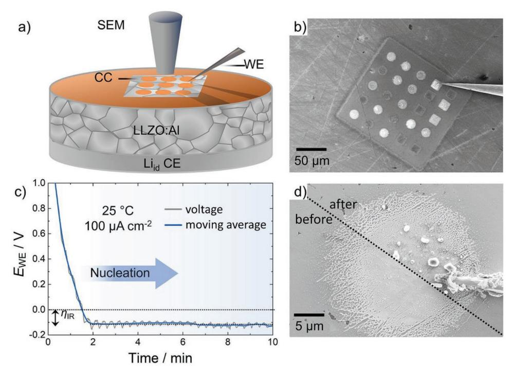
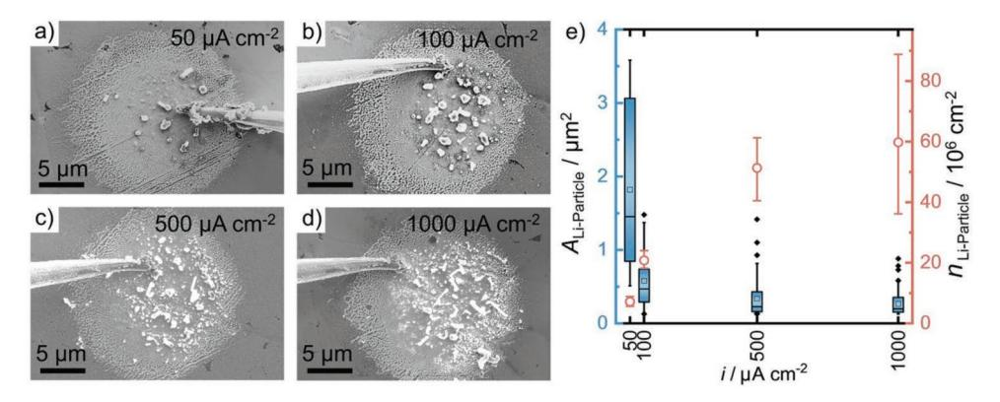
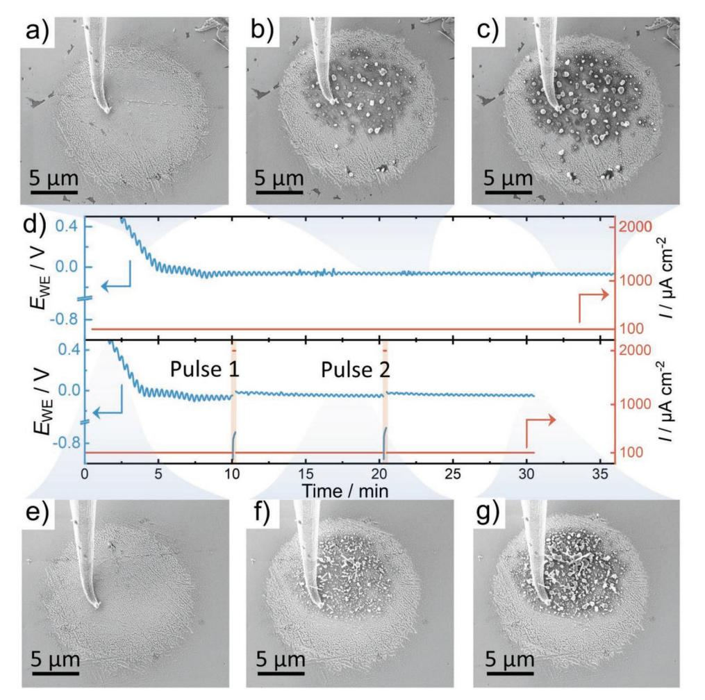
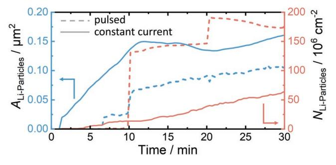
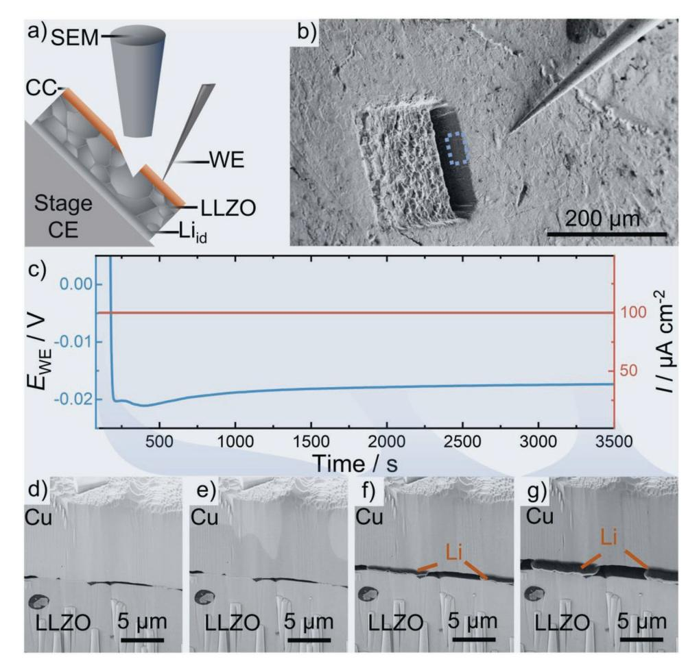
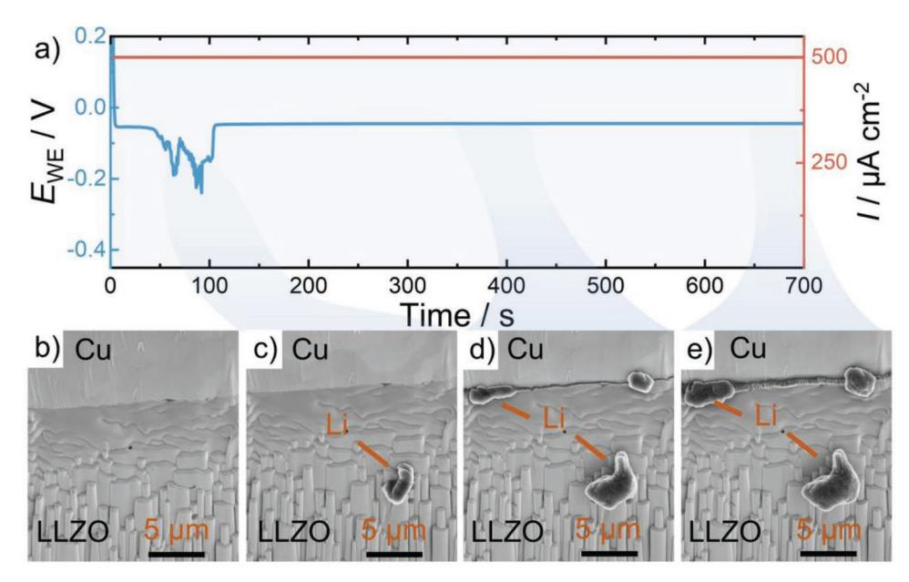
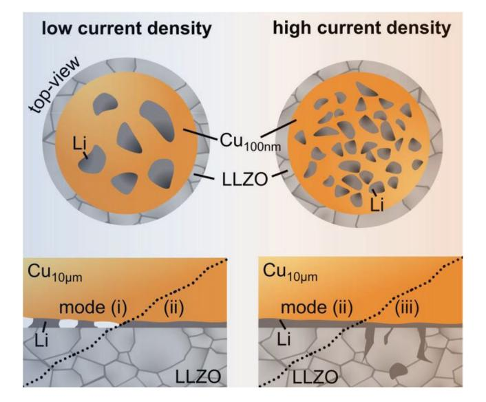

# **Current-Dependent Lithium Metal Growth Modes in "Anode-Free" Solid-State Batteries at the Cu**|**LLZO Interface**

*Till Fuchs, Juri Becker, Catherine G. Haslam, Christian Lerch, Jeff Sakamoto, Felix H. Richter,\* and Jürgen Janek\**

**Controlling the lithium growth morphology in lithium reservoir-free cells (RFCs), so-called "anode-free" solid-state batteries, is of key interest to ensure stable battery operation. Despite several benefits of RFCs like improved energy density and easier fabrication, issues during the charging of the cell hinder the transition from lithium metal batteries with a lithium reservoir layer to RFCs. In RFCs, the lithium metal anode is plated during the first charging step at the interface between a metal current collector and the solid electrolyte, which is prone to highly heterogeneous growth instead of the desired homogeneous film-like growth. Herein, the lithium morphology during the first charging step in RFCs is explored as a function of current density and current collector thickness. Using operando scanning electron microscopy, an increase in the lithium particle density is observed with increasing current density at the Cu|Li6.25Al0.25La3Zr2O12 interface. This observation is then applied to improve the area coverage of lithium by pulsed plating. It is also shown that thin current collectors (***d* **= 100 nm) are unsuited for RFCs, as lithium whiskers penetrate them, resulting in highly heterogeneous interfaces. This suggests the use of thicker metal layers (several µm) to mitigate whisker penetration and facilitate homogeneous lithium plating.**

T. Fuchs, J. Becker, C. Lerch, F. H. Richter, J. Janek Institute of Physical Chemistry Justus-Liebig-University Giessen 35392 Giessen, Germany E-mail: Juergen.Janek@phys.Chemie.uni-giessen.de T. Fuchs, J. Becker, C. Lerch, F. H. Richter, J. Janek Center for Materials Research (ZfM) Justus-Liebig-University Giessen 35392 Giessen, Germany E-mail: Felix.H.Richter@pc.jlug.de

C. G. Haslam, J. Sakamoto Department of Materials Science and Engineering University of Michigan Ann Arbor, MI 48109, USA

C. G. Haslam, J. Sakamoto Department of Mechanical Engineering University of Michigan Ann Arbor, MI 48109, USA

The ORCID identification number(s) for the author(s) of this article can be found under https://doi.org/10.1002/aenm.202203174.

© 2022 The Authors. Advanced Energy Materials published by Wiley-VCH GmbH. This is an open access article under the terms of the Creative Commons Attribution-NonCommercial-NoDerivs License, which permits use and distribution in any medium, provided the original work is properly cited, the use is non-commercial and no modifications or adaptations are made.

#### **DOI: 10.1002/aenm.202203174**

**1. Introduction**

Lately, solid-state batteries (SSBs) generated increasing attention as they hold the potential to outperform lithium-ion batteries (LIBs) as energy storage devices.[1,2] Although they are expected to fulfill higher safety standards,[3] their main benefit is the use of lithium metal as the anode material, which could be enabled by the use of solid electrolytes (SE).[4,5] The lithium metal anode is an appealing target for next-generation lithium batteries due to its low redox potential of −3.04 V and high theoretical specific capacity of 3861 mAh g−1 . [6,7]

The high reactivity of lithium metal, however, poses a number of challenges during the handling of lithium foils and fabricating low-resistance interfaces to SEs.[8–11] Lithium usually has a thin surface passivation layer consisting of mainly Li2CO3, LiOH, and Li2O even when stored under an argon atmosphere with a low amount of H2O and O2. [8] This passiva-

tion layer depends strongly on the exact storage conditions and is difficult to analyze and predict in detail. Therefore, tedious preparation steps are needed to fabricate low-resistance interfaces to SEs, which include mechanical processing of lithium, polishing of SEs, high pressures (3–300 MPa), and heat treatments.[9,10,12–14] While these methods work well on the laboratory scale, they are not suitable for large-scale fabrication of cells.

Lithium-reservoir-free cells (RFCs) provide an elegant way to circumvent the aforementioned challenges.[3,15,16] After assembly, the simplest RFC consists of a separator with a cathode on one side and a current collector (CC) attached to the other side. As cathode materials like LiNi*x*Mn*y*Co*z* are typically fabricated in the discharged (lithiated) state,[17,18] it is possible to extract lithium from the cathode and deposit it as lithium metal onto the current collector in the first charging step.[15,19–21] During subsequent cycling, the lithium metal can either be formed anew in every charging step or a small reservoir of lithium may be left during discharge. The superior method depends on the employed cell design and formation step of the lithium metal.

Several advantages are gained by eliminating the need of handling lithium metal during cell fabrication. First, by avoiding the excess lithium present in an SSB the cell energy density increases significantly[21] as all lithium needed for cycling is introduced with the lithiated CAM during cell assembly.[15] Additionally, lithium metal may be the battery component most sensitive to trace amounts of water, oxygen, and nitrogen in the atmosphere it is processed in. Therefore, the fabrication of RFCs may open a variety of processing techniques, like solvent or heat treatments, previously rendered impossible by lithium metal. Also, the handling and storage of RFCs prior to the formation step of lithium metal is safer as an RFC prior to charging cannot short circuit.

The key challenge that currently hinders the development of RFCs is the non-uniform morphology of plated lithium after the formation step. Ideally, a lithium film is uniformly deposited in a layer-by-layer manner. The formation of isolated islands, dendrites, or whiskers must be avoided as they lead to a high interface resistance due to low contact area, current focusing, and nucleation sites for dendrites. It is still elusive, how external parameters like applied stack pressure, current density, and temperature influence the lithium metal morphology at the CC|SE interface.

A clear influence of temperature and current density on the plating morphology of lithium at Cu|LIPON and Cu|liquid electrolyte (LE) interfaces have already been observed.[19,22,23] Comparing the Cu|LIPON and Pt|LIPON interfaces, it seems that a high overvoltage during nucleation leads to more, but also smaller, particulates of lithium at the copper CC.[23,24] Wang et al. additionally propose that a higher overvoltage results in smaller critical radii of forming lithium nucleates.[15] A high overvoltage can thereby be achieved either by applying a high current density or by decreasing the temperature. Vice versa, applying low current densities at high temperatures (100 °C) leads to only a few but larger particulates of lithium,[23] which means that the interface is more heterogeneous.

It is, however, not clear how well these results on lithium nucleation translate to cells using the Cu|Li6.25Al0.25La3Zr2O12 (LLZO) interface. While LIPON is an amorphous and defectfree SE, LLZO is polycrystalline and has a variety of surfaces defects, like grain boundaries, pinholes, dislocations, and different crystallographic facets, which can act as preferential nucleation sites.[16] Kazyak et al. already observed the positive effect of pressure on controlling the growth of lithium after nucleation using operando optical microscopy.[25] We believe that our work employing operando SEM can further elucidate the factors that affect homogeneous anode formation, especially during the nucleation and the very beginning of the deposition of lithium particles. Therefore, this paper focuses on the lithium plating as a function of the current density and current collector thickness at the Cu|LLZO interface and shows a strong dependence of the obtained lithium microstructure on the applied current density.

# **2. Results and Discussion**

#### **2.1. Using Operando SEM Plating to Study the Growth at Thin Cu-CC Films**

To investigate the lithium deposition at metal CCs as a function of the applied current density, galvanostatic experiments were carried out on Liid|LLZO|Cufilm cells while under observation with an SEM. This cell configuration was deliberately chosen as the employed Liid counter electrode does not show any impedance contribution during the experiment,[9,26,27] which means that changes in resistance can solely be attributed to current constriction at the Cufilm|LLZO interface.[28,29] LLZO was chosen because of its practical stability to lithium metal, which makes it well suited for this model system.[5,30,31] The metal current collector was a 100 nm thin copper film, which was deposited via thermal vapor deposition on the LLZO pellet. This allows the observation of lithium nucleation from above through the current collector as deposited lithium deforms this film. Copper was chosen as the current collector material as it is known to have a low lithium solubility at room temperature to prevent the possibility of alloy formation that could influence the deposition.[32]

The working principle of the herein-used setup is schematically depicted in **Figure 1**a. A Liid|LLZO|Cufilm cell was prepared as described above. Subsequently, a microscopic electrode pattern was cut into the 100 nm thin copper current collector film with a FIB. This enables the measurement of several different spots with very similar interface properties. Additionally, a measurement with an electrode covering the size of the whole pellet would lead to large defects, such as holes or polishing lines being contacted, which would distort the results. Also, the patterned electrode with a size of around 15 µm in diameter still includes several grains with different orientations and grain boundaries as the mean grain size for this material is around 4 µm. Such a pattern is visible in the low magnification image in Figure 1b, where one current collector spot is electrically contacted with the tungsten microelectrode.

The voltage profile shown in Figure 1c is obtained when plating lithium with a current density of 100 µA cm−2 at a single copper current collector patch. It can be seen that *E*WE decreases until around −100 mV, at which point lithium nucleation sets in with an ohmic overvoltage *η*IR of around −100 mV. Usually, a nucleation overpotential *η*nuc is expected, which manifests itself in a minimum in the potential profile,[15,23] but is not present herein. Possibly *η*nuc is overshadowed by the oscillation of *E*WE induced by the scanning procedure. However, this limits the maximum value of *η*nuc to around 50 mV in this case.

As depicted in the split image in Figure 1d, the plated lithium morphology can then be monitored in situ and directly correlated with electrochemical findings. The lithium breaks through the copper CC, which allows an assessment of nucleation density at a certain current density. At 100 µA cm−2 , small and separate lithium columns grow and do not form a conformal film. The necessity to grow a conformal film is clear when the plated electrode is subject to discharge/stripping. Figure S1, Supporting Information shows an in situ plated lithium electrode before and after stripping was performed. Due to the low areal coverage, high local current densities are present at the lithium particles, which lead to a fast progression of pore formation and therefore, low Coulomb efficiency. After a successful proof of principle, this setup is therefore used to investigate the relationship between deposition morphology and current density, as described in the next chapter.

**www.advancedsciencenews.com www.advenergymat.de**

**Figure 1.** a) Schematic of the operando SEM setup used to characterize lithium plating in a Liid|LLZO|Cufilm cell stack. b) SEM overview of the investigated microscopic current collector patches as prepared via FIB patterning. c) Voltage profile when plating lithium with this setup. Note that the strong oscillations in this profile occur because of the SEM electron beam scanning, thus interfering with the measurement at very low currents. d) Magnified image of the same contacted copper current collector patch before and after lithium plating. Note that the frayed edge is an effect induced by the FIB cutting. Additionally, the material on the needle sides is thought to be dust particulates that do not influence the measurement.

#### **2.2. Influence of Current Density on Lithium Growth Morphology**

The in situ SEM plating technique described above is now used to characterize lithium plating with different current densities. While higher current densities lead to more lithium particles per area for Cu|LIPON and Cu|LE,[22,23] it was hitherto unknown what happens at the interface to a polycrystalline ceramic SE. To be able to compare our findings with the literature, the same current densities as in the work of Motoyama et al. were investigated herein.[23] **Figure 2**a–d, therefore, shows SEM images of 16 µAh cm−2 lithium plated with 50, 100, 500, and 1000 µA cm−2 .

The micrographs in Figure 2a–d show a clear change in size, shape, and density of the lithium particles plated at the Cu|LLZO interface. With increasing current density, the shape of the lithium nucleation spots is increasingly heterogeneous. For example, lithium plated with 50–100 µA cm−2 is nearly spherical in shape but for higher current densities, elongated lithium nucleates are plated. Moreover, the overall lithium

**Figure 2.** SEM micrographs of lithium plated at the Cu|LLZO interface with a) 50, b) 100, c) 500, and d) 1000 µA cm−2. In each case, the amount of lithium or charge plated was 16 µAh cm−2, corresponding to a thickness of 77 nm, if plated homogeneously. The projected size *A*Li-Particle of each lithium particle and the particle density *n*Li-Particle are depicted in (e). The distribution of lithium particle sizes is presented as a box plot, comprising 11 (50 µA cm−2), 32 (100 µA cm−2 ), 79 (500 µA cm−2 ), and 92 (1000 µA cm−2 ) particles, respectively. The average *A*Li-Particle is shown as a square inside each box plot. *n*Li-Particle is represented as the orange data points.

particle density *n*Li-Particle seems to be a lot higher for 500 and 1000 µA cm−2 . Unlike observed by Wang et al.,[15] no coalescence of lithium nuclei/particles to form a continuous film was observed herein, which most likely would require applied stack pressure or thicker CCs or both.[25]

To quantitatively compare the nucleation for Cu|LLZO and Cu|LIPON interfaces, image analysis was carried out of the size and morphology of lithium particles in Figure 2a–d. The projected size of each lithium particle *A*Li-Particle and *n*Li-Particle are depicted in Figure 2e. As the plated charge is the same for all herein depicted experiments, lower *A*Li-Particle values are expected for higher current densities with larger *n*Li-Particle. This is confirmed by digital image analysis, which shows that *A*Li-Particle decreases from around 4 µm2 at 50 µA cm−2 to only 0.5 µm2 at 1000 µA cm−2 . Interestingly, the spread of *A*Li-Particle also decreases for higher current densities according to the box plots in Figure 2e. A six-fold increase of the lithium particle number is obtained from 11 per current collector area at 50 µA cm−2 to around 92 per current collector area at 1000 µA cm−2. As the current collector area is approximately 150 µm2, *n*Li-Particle is between 10 × 106 cm−2 at 50 µA cm−2 and 60 × 106 cm−2 at 1000 µA cm−2, confirming the observation previously made directly from the images. Note that the particle area is only a projection of its shape onto the copper current collector as the topology could not be quantified with SEM.

The nucleation densities observed for Cu|LLZO are quite similar to what Motoyama et al. observed for Cu|LIPON.[23] This is interesting, as, unlike LIPON, LLZO shows various surface defects, for example, grain boundaries and dislocations, within the current collector area. These defects may facilitate the nucleation of lithium as observed before.[16,33] To better understand the influence of surface defects on the large-scale nucleation at interfaces, similar plating experiments were carried out on single-crystalline Cu|LLZOsc interfaces.

Using an LLZO pellet with a grain size larger than the 15 µm wide copper current collector spot generates a Cu|LLZOsc interface mostly free of surface defects, that mimics a single crystal experiment. For this experiment, 100 nm of copper were deposited on a freshly broken cross-section of large-grained LLZO, which was thereafter patterned via FIB for microelectrode preparation. The micrographs in Figure S2a–d, Supporting Information show the lithium grown after plating at these Cu|LLZOsc interfaces with 50 to 1000 µA cm−2 . A clear difference is observed compared to the polycrystalline material regarding *n*Li-Particle. For the defect-free LLZO, lithium plating is solely observed at one spot in the vicinity of the microelectrode contact, independent of the applied current density. Furthermore, *η*nuc is larger than at polycrystalline surfaces, for example, 200 mV (Cu|LLZOsc) versus < 50 mV (Cu|LLZO). This highlights the necessity for surface defects to facilitate homogeneous and planar lithium growth at the Cu|LLZO interface. However, the grain orientation was not determined, which may have a strong impact on the nucleation of lithium at the interface.

Generally, the herein obtained results for polycrystalline LLZO in contact with copper current collector films confirm the current density-dependent nucleation observed at the Cu|LIPON interface. This is remarkable as LLZO is a polycrystalline material, which exhibits surface defects. While LIPON is an amorphous and basically defect-free material,[34] LLZO shows grain boundaries, grain orientations, pores, dislocations, and other defects such as scratches induced by polishing. Possibly, local variations in density act as nucleation sites in LIPON, which is why it performs similarly to polycrystalline LLZO instead of LLZOsc.

#### **2.3. Advanced Charging Protocol to Obtain a Favorable Lithium Morphology**

While high current densities lead to a beneficial higher density of lithium particles, continuous charging with high current densities is detrimental to the overall cell properties. Not only do high charge currents lead to (chemo)-mechanical issues like contact loss at the cathode interface,[17,35,36] dendrite and filament growth are facilitated as well.[14,37] However, a combination of high and low current densities could be an optimal charging protocol for the plating of a homogeneous lithium film. To test this hypothesis, continued plating with low current densities (100 µA cm−2) was interrupted repeatedly by high current pulses (1000 µA cm−2 ). A control experiment was carried out in which the same amount of charge was plated with a continuous and uninterrupted current of 100 µA cm−2 . The respective voltage profiles and morphology evolutions are depicted in **Figure 3**.

SEM micrographs were acquired during the plating with 100 µA cm−2 and are depicted in Figure 3a–c. They respectively show the beginning, middle, and end of the lithium growth process. The images are linked to the respective voltage profile depicted in Figure 3d. Similarly, Figure 3e,f show the lithium morphology during growth after the first pulse and after the end of the process.

After the same amount of charge was plated in both experiments, clear differences in lithium morphology and particle density are observed. Figure 3c shows that a rather defined space between different lithium particles is present, with lithium growing similar in size up to around 0.5–1.0 µm, not covering the whole Cu|LLZO interface. However, as depicted in Figure 3g, more and smaller lithium particles nucleate when short pulsing steps are incorporated into the growth process. Additionally, the spacings between the particles appear shorter with less Cu|LLZO interface uncovered.

A different lithium coverage of the Cu|LLZO interface also manifests itself in the lower *η*IR seen while plating. While a constant *η*IR of around −65 mV is observed after nucleation occurred for the control experiment, *η*IR decreases from around −65 mV (before the 1st pulse) to −42 mV (after 1st pulse) and finally to around −35 mV (after 2nd pulse) for the advanced plating process. This means that more lithium is in contact with the SE after the pulsing steps. This also explains the voltage profile during the pulses, which are depicted in Figure S3, Supporting Information. Here, a *η*nuc of −30 mV is observed, which means that particles nucleate additionally during the pulse besides lithium already being present.

**Figure 4** displays the particle density and size thereof during the pulse experiment and the constant current control experiment. In the control experiment with continuous plating, a continuous but slow increase in *n*Li-Particle up to 60 × 106 cm−2

**Figure 3.** a–c) SEM micrographs at different stages during lithium plating with 100 µA cm−2. The corresponding voltage and current profiles are depicted in the top part of (d). The bottom part of (d) shows the voltage and current profiles during plating with 100 µA cm−2 and interrupting current pulses of 2000 µA cm−2. Note that the oscillations of the voltage profiles are induced by the scanning of the electron beam. The respective SEM micrographs during different stages of the plating are visible in (e–g). Videos of both experiments can be found in Video S1, Supporting Information.

is observed. When pulses are utilized within the plating, sharp jumps in *n*Li-Particle are observed during the pulses, corresponding well to the observation of a nucleation overvoltage present during the pulse and the nucleation of additional particles. After the same charge of 60 µAh cm−2 is plated, *n*Li-Particle is

**Figure 4.** Evolution of lithium particle density and projected area as a function of the plating time for the pulsed measurement and the control experiment with a constant current density as depicted in Figure 3.

around 170 × 106 cm−2 , which is nearly three times higher than in the continuous plating experiment.

Furthermore, the average projected area of the nuclei is analyzed and depicted in Figure 4. For the control experiment without current pulses, a steady and mostly linear increase in particle area up to 0.15 µm2 is observed in the first 10 minutes, followed by stagnation of average particle area, explained by the simultaneous growth of few but very small lithium particles. The pulsed plating shows a more tentative growth at the beginning, followed by a step increase during the first pulse up to around 0.06 µm2. Afterward, the projected area slowly increases up to 0.10 µm2 . Interestingly, no step change is observed for the second pulse, which may be explained by the high number of particles already present.

The size distribution of particles at different points during plating is additionally shown in Figure S4, which confirms a sharper size distribution of grown lithium particles for the pulsed plating. For better visualization of the process, the reader is referred to Video S1, Supporting Information of the plating process.

Interestingly, during all plating experiments, a change of image contrast happens prior to and during the nucleation of lithium particles. This darkening may be caused by lithium being reduced at the Cu|LLZO interface and diffusion at the surface of the Cu current collector. This lowers the average electron density of the material, thus appearing darker when observed with an SEM. Copper supposedly is able to alloy with up to 14 at.% of lithium,[38,39] as measured by reacting fine copper powder with lithium.[32] This and time-of-flight secondary ion mass spectrometry (ToF-SIMS) analyses suggest very strong lithium diffusion along copper grain boundaries when present.[40,41] However, even if the maximum amount of 14 at% of lithium is alloying with the CC, this still only amounts to 1.5 wt%. Consequently, no amount of lithium significant enough to change our morphological analysis is lost within the copper CC, but still enough to change the contrast as observed via SEM.

All of the above experiments were conducted using thin copper electrodes with a thickness of around 100 nm. Clear trends are observed, showing that the plating morphology can be controlled by current density. However, lithium breaking through the current collector layer is not beneficial for practical application, as it inhibits the growth of a lithium film and renders the application of stack pressure useless. Therefore, thicker metal layers of several micrometers are needed to assess the nucleation and growth of lithium in practically relevant systems. In this case, our top-view in situ method cannot be applied and it is yet unclear, how the morphology and interface between LLZO and thick copper foils evolve during lithium growth.[15]

### **2.4. Operando Study of Lithium Growth at Thick Cu-CC Foils**

In the following, lithium nucleation and growth were investigated at Cufoil|LLZO interfaces. As it is not possible to see any deformation at this buried interface during plating, operando experiments were carried out at cross-sections, which were prepared prior to the experiment by a focused ion beam. It is expected that lithium is not able to penetrate through a thick copper foil in the same way it does when using thin copper films. When using thick (≈10 µm) metal foils, three different modes of growth at the CCfoil|LLZO interface have been proposed.[15] These are 1) CC|LLZO separation and gap formation by vertical whisker growth of lithium; 2) horizontal growth or creep induced by stack pressure opening the CC|LLZO interface without gap formation, and 3) plating at the nucleate edges into the solid electrolyte, forming dendrites. The second growth mode is the preferred option to obtain large-area lithium electrodes without severe mechanical degradation or dendrite formation. However, it is still unknown how these processes depend on current density, current collector thickness, and applied pressure.

Therefore, operando experiments at Cufoil|LLZO interfaces were carried out by looking at the cross-section during lithium plating with different current densities. **Figure 5**a depicts a schematic of the herein-used operando setup for cross-sectional analysis. A low-magnification image of the whole prepared crater and micromanipulator used as the working electrode is visible in Figure 5b with the analyzed area marked with a blue dashed line.

Interestingly, when plating with 100 µA cm−2 the voltage profile shown in Figure 5c shows two minima, which may arise from a convolution of two separate contributions. One minimum is caused by *η*nuc, typically observed for Cu|SE interfaces,[15,16,23] the other one could be caused by the subsequent opening of the interface by lithium growth, temporarily reducing the effective electrode area. Afterward, the plating is quite stable and only shows a small decrease in *η*IR, caused by the increasing electrode area by lateral lithium growth.

The evolution of the interface during plating is shown in Figure 5d–g and Video S2, Supporting Information. The pristine interface shows a heterogeneous distribution of contact spots, with some areas showing direct contact and others showing that thin gaps (< 1 µm) are still present. At the beginning, where the potential is still falling and nucleation has not occurred yet (Figure 5e), a darkening of the copper current collector is observed like in previous experiments. As a full lithiation of the copper CC (14 at% or 1.5 wt% of Li) would take around 5 h with 100 µA cm−2, this can be ruled out. The color change, therefore, is most likely explained by the fast surface diffusion of lithium along the copper CC, changing the electronic properties enough to result in a slightly different SEM image contrast.

After nucleation, lithium growth is observed at a previous contact spot between copper and LLZO. These small islands then get thicker and also slowly grow laterally while simultaneously opening the gap between copper and LLZO to around 2 µm at the end of the experiment. What follows is that at 100 µA cm−2 and no applied pressure, a combination of growth mechanisms 1) and 2) occurs. The lateral growth of lithium and closing of pores is especially interesting, as previously this was only expected when stack pressure is applied. A reason could be that the force induced only by the deformation of the copper foil is enough for the deformation of small lithium pillars.[25] A similar experiment was carried out with 50 µA cm−2 , which is shown in Figure S5, Supporting Information and shows the same trends as plating with 100 µA cm−2. Interestingly, contrary to what was stated by Kazyak et al., lithium does not start to nucleate at the pore walls in the free space at the interface, but rather at the direct contact spots between Cu and LLZO – highlighting that a pore-free CC|LLZO interface is favorable for Li plating.

Similarly, plating with 500 µA cm−2 was carried out at a Cufoil|LLZO cross-section with the respective voltage profile displayed in **Figure 6**a. Several SEM images linked to different stages in the plating progress are depicted in Figure 6b–e. While the pristine interface of the image area seems to be in better contact than in the previous measurement, the overall contact area seems to be quite similar for all investigated cross-sections as depicted in low-magnification SEM images in Figure S6, Supporting Information.

Due to a large overvoltage induced by the higher current density, the minima in the voltage profile are not as pronounced as they are in the previous measurement with 100 µA cm−2. After a stable initiation of the plating process, large voltage fluctuations occur, which correspond well to the growth of lithium within the solid electrolyte away from the interface as seen in Figure 6c.[46] This is direct evidence of lithium penetration into the solid electrolyte and dendrite

**Figure 5.** a) Schematic setup used to observe lithium plating with 100 µA cm−2 at the interface at Cufoil|LLZO. Due to the high electronic conductivity of both tungsten and copper, the point contact between the micromanipulator and copper foil is not relevant to the experiment. A low-magnification SEM image of the setup is shown in (b). The voltage profile during plating is depicted in (c). Several screenshots of the video during plating were taken at different stages, which are shown in (d–g). Note that some of the remaining lines and pillars are due to "curtaining" and "rippling", which frequently occurs during the FIB-cutting process.[42–45]

growth. Still, upon further plating, a homogenous film grows at the Cufoil|LLZO interface. At a later stage, also large protrusions of lithium are visible at the interface. These, however, may not be representative of the growth occurring at the buried interface due to more space being available where some of the material was removed to be able to observe the process in cross-section.

The growth occurring with 500 µA cm−2 can overall be classified to growth mode 3), showing that even though a very thin layer of metal is plated at the interface, the majority of plated lithium is deposited as filaments and dendrites in the bulk of the solid electrolyte.

A similar cross-sectional experiment was carried out with thin Cu400 nm current collectors and a current density of 20 µA cm−2 . The breakthrough process of a lithium whisker through the copper can easily be observed therein as depicted in Figure S7, Supporting Information. This furthermore highlights the necessity of a thick CC as a means to suppress lithium breaking through the metal layer. The exact thickness needed to suppress whisker penetration depends on various factors, like current density used for plating, if a foil or deposited film is used, conformity of the CC|SE interface and applied pressure. In the case of vapor-deposited films onto LLZO, we found that 5 µm of copper is sufficiently mechanically stable to suppress whisker penetration through itself as depicted in Figure S8, Supporting Information.

#### **2.5. Summarizing the Different Growth Modes of Lithium at Cu**|**LLZO Interfaces**

The different lithium growth modes discussed by Wang et al. are also observed within this work and were investigated regarding their occurrence under different interface conditions and current densities as summarized in **Figure 7**. As we observed the simultaneous occurrence of different growth modes, this chapter aims to give guidelines on how to control the lithium growth morphology within RFCs.

By investigating thin copper films (*d* = 100 nm), it was possible to quantify the lithium particle density as a function of the applied current density. A strong increase in particle density and area coverage of lithium is observed for higher current

**Figure 6.** a) Voltage profile during plating with 500 µA cm−2 . Screenshots of a video recorded during the plating and lithium growth process are depicted in (b–e) with their respective time indicated by a marking in the voltage profile.

densities as shown in Figure 7. However, as high current densities facilitate the growth of dendrites in RFCs, as seen in Figure 6, we propose using only a very short initial pulse of high current density to spawn a large number of lithium particles. This could be expanded to using current pulses as an interruption to low current plating as depicted in Figure 5.

Despite a conformal initial contact of thin vapor deposited metal films (*d* = 0.1–1 µm) on the SE, which is evident from

**Figure 7.** Schematic explaining the occurrence of different lithium growth modes when using thin current collector films (top) or thick current collector foils (bottom) when different current densities are applied. Note that in the herein analyzed experiments, usually a combination of growth modes was observed.

the impedance shown for Cufilm|LLZO|Li in Figure S9a, Supporting Information, thin current collector films are not suitable for long-term plating of µm-thick lithium films as they offer no mechanical stability. During the initial plating, lithium penetrates such thin current collector films, which facilitates the vertical growth of whiskers instead of films. Even if pressure is applied in our particular case, lithium is just flattened above the current collector films after whisker penetration, which offers no beneficial increase in the contact area between lithium and the SE. This evolution is evident from the resistance evolution shown in Figure S9b, Supporting Information and proven by the SEM images shown in Figure S8c,d, Supporting Information. As no new contact area between lithium and the SE is formed, *R*int is converging to a certain value of several 100 Ω cm2 despite a continuous growth of lithium.

Therefore, we propose the use of thicker metal CCs, such as Cufoil (*d* = 10 µm) or Cufilm (*d* = 5 µm) to suppress the penetration of the metal. In this case, three different growth modes can be identified, namely, i) the vertical growth of whiskers where the current collector was in contact with the SE, ii) a desired film-like growth, and iii) the growth of lithium into the SE as dendrites. As summarized in Figure 7, we could observe the simultaneous occurrence of different growth modes, however, their contributions can be tuned by plating with different current densities.

At low current densities (< 100 µA cm−2 ), a mixture between whisker growth and film growth could be observed, depending on the local microstructure and interface properties of the analyzed system. A more conformal contact and stiffer current collector would therefore rather shift the balance to the desired film growth, whereas a current collector foil without conformal contact facilitates the growth of whiskers. At high current densities (> 500 µA cm−2 ), an overlap between film and dendrite growth was observed. This balance is expected to depend strongly on the SE microstructure, with denser SEs being able to suppress dendrites better than porous variants.

The influence of pressure on the lithium growth morphology is also very important and was recently investigated by Kazyak et al. using operando video microscopy.[25] Based on their results of lithium blisters getting flattened by pressure in the range of 1–5 MPa, it is expected that the balance of growth modes is shifted to the desired film growth already at moderate pressures and that dendritic growth is favored at very high pressures.

# **3. Conclusion**

In this study, we investigated the current density-dependent lithium growth morphology and particle density at Cu|LLZO interfaces by contacting small current collector patches or interface cross-sections (prepared by FIB patterning) in an SEM. With this novel technique, a strong increase in lithium particle density and current collector coverage was observed with increasing current density. Our experiments show that – while thin metal films as CCs are good model systems to observe lithium growth underneath – a thicker and more mechanically stable current collector foil is needed to suppress the detrimental penetration of lithium whiskers through the CC. Three different lithium growth modes were observed without the application of stack pressure in Cufoil|LLZO systems: i) vertical whisker growth, ii) film growth, and iii) dendritic growth. Usually, a combination of these growth modes is observed with a strong dependence on local microstructure and conformity of the Cufoil|LLZO interface. A general shift from whisker growth to film or dendritic growth occurs with increasing current densities when plating. Therefore, we suggest not only using thick CCs (several µm) to suppress its penetration by whiskers, but also carefully choosing the current density and plating protocol to optimize the electrode system for growing homogeneous lithium films with respect to the presented findings.

## **4. Experimental Section**

*Preparation of Solid Electrolytes*: The formal composition of the LLZO:Al prepared within this work was Li6.25Al0.25La3Zr2O12. At first, Li2CO3 (> 99.0%, Sigma-Aldrich), ZrO2 (99.9%, Sigma-Aldrich), La(OH)3 (99.9%, Sigma-Aldrich), and Al2O3 (99.8%, abcr) were homogenized using a planetary ball-mill two times (10 min with 20 min pause at 350 rpm for 24 cycles). Thereafter, calcination (4 h at 1000 °C) of 25 mm diameter pellets was carried out in MgO-crucibles under 150 sccm O2 flow. The samples were subsequently handled exclusively under an argon environment (MBraun, *p*(H2O)/*p* < 1.0 ppm, *p*(O2)/*p* < 0.1 ppm).

To obtain LLZO powder with a smaller particle size, the above mixture was ball-milled with the same parameters for 40 cycles. Sintering was then carried out with pellets isostatically pressed beforehand at 380 MPa under O2 flow in MgO crucibles with mother powder (calcined LLZO powder). The heating procedure was as follows. Samples were first heated for 9 h to 900 °C, which was held for 5 h. Afterward, the temperature was increased for 2 h to 1100 °C and again held for 5 h. The temperature was then increased again to 1230 °C in 1 h and held for 4 h, followed by natural cooling.

For cells utilizing a thick (10 µm) copper foil laminated on the electrolyte surface, LLZO:Ta with a composition of Li6.5Ta0.5La3Zr1.5O12

was synthesized through a solid-state method. The powders were densified into billets (diameter 12.7 mm) using rapid-induction hotpressing.[47] The dense pellets (>96% relative density) were ground with sandpaper up to 1200 grit, followed by polishing using diamond paste up to a final step of 0.1 µm.

*Cell Assembly and Electrochemical Characterization*: Cells were assembled by polishing the garnet pellets with grit P1000 SiC-paper and subsequent electrode attachment. As a counter electrode, a resistancefree ideal electrode Liid was prepared according to previous publications utilizing high isostatic pressure (380 MPa for 30 min).[9,26] The foil used for Liid electrodes was prepared by removing surface degradation layers from a lithium chunk with a ceramic knife and subsequently pressing it into a thin foil directly before attaching it to the pellet.

Thin copper electrodes of approximately 100 nm thickness were deposited onto LLZO under vacuum using a homemade thermal evaporation system attached to a glovebox with a rate of 0.2 nm s−1 , which was controlled by an oscillating quartz sensor. The patterning of small Cu patches (*A* ≈ 150 µm2 ) was achieved by cutting with a plasma-FIB. Thick (10 µm) copper foils were laminated onto LLZO:Ta by hot-pressing as described in the works of Wang et al. and Kazyak et al.,[15,25] which resulted in good conformal contact between the foil and pellet.

Electrochemical characterization was carried out using a VMP300 potentiostat (BioLogic) in combination with the software EC-Lab (ver. 11). Temperature-dependent measurements were carried out in a climate chamber WKL 64 (Weiss Technik GmbH). For electrochemical measurements, cells were contacted with nickel current collector tabs and sealed in pouch cells. The current collector tabs are fixed using tape.

If not stated otherwise, potentiostatic electrochemical impedance spectroscopy (PEIS) measurements were carried out in a frequency range between 7 MHz and 100 mHz. Galvanostatic EIS (GEIS) measurements were carried out in a different frequency range, 7 MHz to 1 Hz, as the acquisition of one spectrum needs to be faster in this measuring mode to not disturb the DC current. Usually, 10% of the DC current is used as amplitude to measure the impedance response of the cell. Impedance data interpretation as well as fitting thereof was carried out by RelaxIS 3 (RhD Instruments).

*FIB–SEM Measurements*: Focused-ion-beam (FIB)-cutting imaging was carried out using a XEIA3 GMU SEM/Plasma-FIB (Tescan) in combination with a Leica VCT500 transfer module at room temperature. SEM imaging was carried out using a Zeiss Merlin HRSEM.

*Operando Scanning Electron Microscopy (SEM)*: For the microelectrode measurements (prober module, Kammrath & Weiss GmbH) with tungsten micromanipulators (Simac Masic & TSS bv) were attached to the sample stage of the Zeiss Merlin HRSEM. The microelectrodes then acted as a working electrode, whereas the counter electrode was contacted via the sample stage itself. When measuring cross-sections, the sample was tilted by 45° to obtain a view into the crater, which was previously prepared under a 90° angle with a FIB.

*Digital Image Analyses*: The acquired SEM images were graphically analyzed using the open-source software *Fiji* and a trainable *Weka* segmentation. The area of analysis was determined with *Fiji* and the first criteria to distinguish between lithium particles and the current collector surface were manually specified to train the *Weka* segmentation. Using a machine learning approach, *Weka* generates selection criteria, such as contrast or shape. Based on the selection criteria learned, *Weka* can segment further images and differentiate between lithium particles and the surrounding environment. Particle size and particle count were then obtained by processing the segmented image with *Fiji*. In order to avoid too large errors, the smallest analyzed particle size was set to *A*Li-Particle,min = 0.02 µm2. This lower limit was chosen because particles with a size > 0.02 µm2 were still easily visible in the micrographs. Thus, it is possible to control the analyzed images and doublecheck the selection of the *Weka* segmentation. Due to the variety of shapes of the particles, the circularity was set to be between zero and one. Therefore, all particles in between a perfect circle (circularity = 1) and largely elongated particles (circularity = 0) were considered.

**www.advancedsciencenews.com www.advenergymat.de**

# **Supporting Information**

Supporting Information is available from the Wiley Online Library or from the author.

# **Acknowledgements**

T.F. and J.B. contributed equally to this work. The authors want to thank Pascal Schweitzer for fruitful scientific discussions. We further want to thank Elisa Monte for her support with designing our ToC image. This work was conducted as part of the US-German joint collaboration on "Interfaces and Interphases in Rechargeable Li-metal based Batteries" supported by the US Department of Energy (DOE) and German Federal Ministry of Education and Research (BMBF). This work has been partly funded by the German Federal Ministry of Education and Research (BMBF) under the projects "LiSI", grant identifier 03XP0224E and "LiSI2", grant identifier 03XP0509B.

Open access funding enabled and organized by Projekt DEAL.

# **Conflict of Interest**

The authors declare no conflict of interest.

### **Data Availability Statement**

The data that support the findings of this study are available from the corresponding author upon reasonable request.

## **Keywords**

anode-free-cell, kinetics, Li-metal, morphology, operando SEM

Received: September 19, 2022 Revised: October 12, 2022

Published online: November 7, 2022

- [1] J. Janek, W. G. Zeier, *Nat. Energy* **2016**, *1*, 16141.
- [2] S. Randau, D. A. Weber, O. Kötz, R. Koerver, P. Braun, A. Weber, E. Ivers-Tiffée, T. Adermann, J. Kulisch, W. G. Zeier, F. H. Richter, J. Janek, *Nat. Energy* **2020**, *5*, 259.
- [3] Y. Lee, S. Fujiki, C. Jung, N. Suzuki, N. Yashiro, R. Omoda, D. Ko, T. Shiratsuchi, T. Sugimoto, S. Ryu, J. H. Ku, T. Watanabe, Y. Park, Y. Aihara, D. Im, I. T. Han, *Nat. Energy* **2020**, *5*, 299.
- [4] T. Krauskopf, F. H. Richter, W. G. Zeier, J. Janek, *Chem. Rev.* **2020**, *120*, 7745.
- [5] Y. Zhu, X. He, Y. Mo, *ACS Appl. Mater. Interfaces* **2015**, *7*, 23685.
- [6] Y. Chen, Z. Wang, X. Li, X. Yao, C. Wang, Y. Li, W. Xue, D. Yu, S. Y. Kim, F. Yang, A. Kushima, G. Zhang, H. Huang, N. Wu, Y. W. Mai, J. B. Goodenough, J. Li, *Nature* **2020**, *578*, 251.
- [7] C. Niu, H. Lee, S. Chen, Q. Li, J. Du, W. Xu, J. G. Zhang, M. S. Whittingham, J. Xiao, J. Liu, *Nat. Energy* **2019**, *4*, 551.
- [8] S. K. Otto, Y. Moryson, T. Krauskopf, K. Peppler, J. Sann, J. Janek, A. Henss, *Chem. Mater.* **2021**, *33*, 859.
- [9] T. Krauskopf, H. Hartmann, W. G. Zeier, J. Janek, *ACS Appl. Mater. Interfaces* **2019**, *11*, 14463.
- [10] A. Sharafi, E. Kazyak, A. L. Davis, S. Yu, T. Thompson, D. J. Siegel, N. P. Dasgupta, J. Sakamoto, *Chem. Mater.* **2017**, *29*, 7961.
- [11] S. K. Otto, T. Fuchs, Y. Moryson, C. Lerch, B. Mogwitz, J. Sann, J. Janek, A. Henss, *ACS Appl. Energy Mater.* **2021**, *4*, 12798.
- [12] F. Flatscher, M. Philipp, S. Ganschow, H. M. R. Wilkening, D. Rettenwander, *J. Mater. Chem. A* **2020**, *8*, 15782.
- [13] N. J. Taylor, S. Stangeland-Molo, C. G. Haslam, A. Sharafi, T. Thompson, M. Wang, R. Garcia-Mendez, J. Sakamoto, *J. Power Sources* **2018**, *396*, 314.
- [14] E. Kazyak, R. Garcia-mendez, W. S. Lepage, A. Sharafi, A. L. Davis, A. J. Sanchez, K. Chen, C. Haslam, J. Sakamoto, N. P. Dasgupta, *Matter* **2020**, *2*, 1025.
- [15] M. J. Wang, E. Carmona, A. Gupta, P. Albertus, J. Sakamoto, *Nat. Commun.* **2020**, *11*, 1.
- [16] T. Krauskopf, R. Dippel, H. Hartmann, K. Peppler, B. Mogwitz, F. H. Richter, W. G. Zeier, J. Janek, *Joule* **2019**, *3*, 2030.
- [17] R. Koerver, I. Aygün, T. Leichtweiß, C. Dietrich, W. Zhang, J. O. Binder, P. Hartmann, W. G. Zeier, J. Janek, *Chem. Mater.* **2017**, *29*, 5574.
- [18] F. Strauss, L. de Biasi, A.-Y. Kim, J. Hertle, S. Schweidler, J. Janek, P. Hartmann, T. Brezesinski, *ACS Mater. Lett.* **2020**, *2*, 84.
- [19] B. J. Neudecker, N. J. Dudney, J. B. Bates, *J. Electrochem. Soc.* **2000**, *147*, 517.
- [20] A. J. Louli, M. Genovese, R. Weber, S. G. Hames, E. R. Logan, J. R. Dahn, *J. Electrochem. Soc.* **2019**, *166*, A1291.
- [21] R. Weber, M. Genovese, A. J. Louli, S. Hames, C. Martin, I. G. Hill, J. R. Dahn, *Nat. Energy* **2019**, *4*, 683.
- [22] A. Pei, G. Zheng, F. Shi, Y. Li, Y. Cui, *Nano Lett..* **2017**, *17*, 1132.
- [23] M. Motoyama, M. Hirota, T. Yamamoto, Y. Iriyama, *ACS Appl. Mater. Interfaces* **2020**, *12*, 38045.
- [24] M. Motoyama, M. Ejiri, T. Yamamoto, Y. Iriyama, *J. Electrochem. Soc.* **2018**, *165*, A1338.
- [25] E. Kazyak, M. J. Wang, K. Lee, S. Yadavalli, A. J. Sanchez, M. D. Thouless, J. Sakamoto, N. P. Dasgupta, *Matter* **2022**, *5*, 3912.
- [26] T. Fuchs, B. Mogwitz, S. Otto, S. Passerini, F. H. Richter, J. Janek, *Batteries Supercaps* **2021**, *4*, 1145.
- [27] T. Krauskopf, B. Mogwitz, C. Rosenbach, W. G. Zeier, J. Janek, *Adv. Energy Mater.* **2019**, *9*, 1902568.
- [28] J. K. Eckhardt, P. J. Klar, J. Janek, C. Heiliger, *ACS Appl. Mater. Interfaces* **2022**, *14*, 35545.
- [29] J. K. Eckhardt, T. Fuchs, S. Burkhardt, P. J. Klar, J. Janek, C. Heiliger, *ACS Appl. Mater. Interfaces* **2022**, *14*, 42757.
- [30] Y. Zhu, J. G. Connell, S. Tepavcevic, P. Zapol, R. Garcia-Mendez, N. J. Taylor, J. Sakamoto, B. J. Ingram, L. A. Curtiss, J. W. Freeland, D. D. Fong, N. M. Markovic, *Adv. Energy Mater.* **2019**, *9*, 1.
- [31] J. G. Connell, T. Fuchs, H. Hartmann, T. Krauskopf, Y. Zhu, J. Sann, R. Garcia-mendez, J. Sakamoto, S. Tepavcevic, J. Janek, *Chem. Mater.* **2020**, *32*, 10207.
- [32] W. Klemm, B. Volavsek, *Z. Anorg. Allg. Chem.* **1958**, *296*, 184.
- [33] K. Peppler, M. Pölleth, S. Meiss, M. Rohnke, J. Janek, *Z. Phys. Chem.* **2006**, *220*, 1507.
- [34] J. D. LaCoste, A. Zakutayev, L. Fei, *J. Phys. Chem. C* **2021**, *125*, 3651.
- [35] S. H. Jung, U. H. Kim, J. H. Kim, S. Jun, C. S. Yoon, Y. S. Jung, Y. K. Sun, *Adv. Energy Mater.* **2020**, *10*, 1903360.
- [36] R. Koerver, W. Zhang, L. De Biasi, S. Schweidler, A. O. Kondrakov, S. Kolling, T. Brezesinski, P. Hartmann, W. G. Zeier, J. Janek, *Energy Environ. Sci.* **2018**, *11*, 2142.
- [37] P. Bai, J. Li, F. R. Brushett, M. Z. Bazant, *Energy Environ. Sci.* **2016**, *9*, 3221.
- [38] S. Lv, T. Verhallen, A. Vasileiadis, F. Ooms, Y. Xu, Z. Li, Z. Li, M. Wagemaker, *Nat. Commun.* **2018**, *9*, 1.
- [39] H. Okamoto, *J. Phase Equilib. Diffus.* **2011**, *32*, 172.
- [40] R. Rupp, B. Caerts, A. Vantomme, J. Fransaer, A. Vlad, *J. Phys. Chem. Lett.* **2019**, *10*, 5206.
- [41] D. Rehnlund, Z. Wang, L. Nyholm, *Adv. Mater.* **2022**, *34*, 2108827.
- [42] T. H. Loeber, B. Laegel, S. Wolff, S. Schuff, F. Balle, T. Beck, D. Eifler, J. H. Fitschen, G. Steidl, *J. Vac. Sci. Technol., B: Nanotechnol. Microelectron.: Mater., Process., Meas., Phenom.* **2017**, *35*, 06GK01.
- [43] S. Liu, L. Sun, J. Gao, K. Li, *J. Microsc.* **2018**, *272*, 3.

**www.advancedsciencenews.com www.advenergymat.de**

- [44] D. P. Adams, T. M. Mayer, M. J. Vasile, K. Archuleta, *Appl. Surf. Sci.* **2006**, *252*, 2432.
- [45] I. Koponen, M. Hautala, O. P. Sievänen, *Phys. Rev. Lett.* **1997**, *78*, 2612.
- [46] Z. Ning, D. S. Jolly, G. Li, R. De Meyere, S. D. Pu, Y. Chen, J. Kasemchainan, J. Ihli, C. Gong, B. Liu, D. L. R. Melvin, A. Bonnin,
- O. Magdysyuk, P. Adamson, G. O. Hartley, C. W. Monroe, T. J. Marrow, P. G. Bruce, *Nat. Mater.* **2021**, *20*, 1121.
- [47] B. Kinzer, A. L. Davis, T. Krauskopf, H. Hartmann, W. S. LePage, E. Kazyak, J. Janek, N. P. Dasgupta, J. Sakamoto, *Matter* **2021**, *4*, 1947.