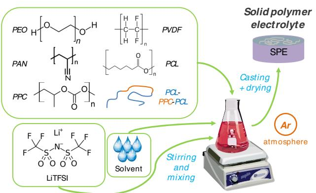
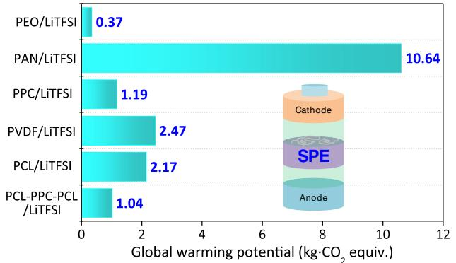
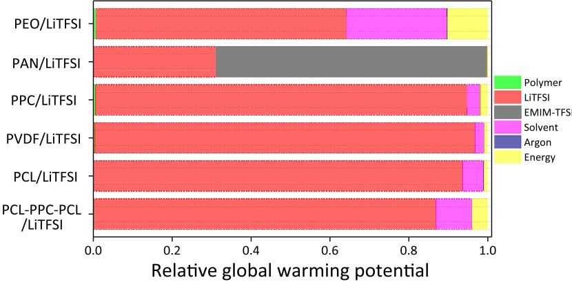
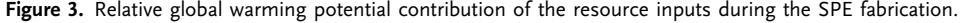
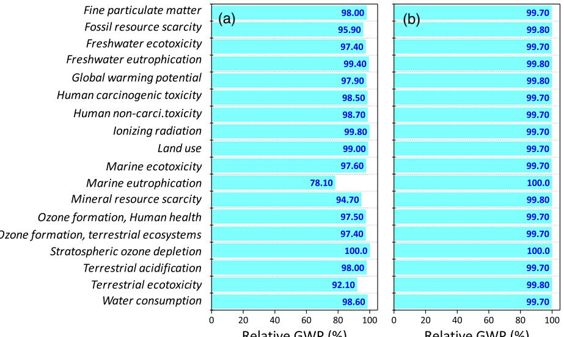

[www.advenergysustres.com](http://www.advenergysustres.com)

# Environmental Impact Assessment of Solid Polymer Electrolytes for Solid-State Lithium Batteries

Alain Larrabide, Irene Rey, and Erlantz Lizundia\*

Solid-state batteries play a pivotal role in the next-generation batteries as they satisfy the stringent safety requirements for stationary or electric vehicle applications. Notable efforts are devoted to the competitive design of solid polymer electrolytes (SPEs) acting as both the electrolyte and the separator. Although particular efforts to attain acceptable ionic conductivities and wide electrochemical stability widows are carried out, the environmental sustainability is largely neglected. To address this gap, here the cradle-to-gate environmental impacts of the most representative SPEs using life cycle assessment (LCA) are quantified. Raw material extraction and electrolyte fabrication are considered. Global warming potential values of 0.37–10.64 kg CO2 equiv. gelectrolyte-1 are achieved, where PEO/LiTFSI presents the lower environmental burdens. A minor role of the polymer fraction on the total impacts is observed, with a maximum CO2 footprint share of 0.61%. Following ecodesign approaches, a sensitivity analysis is performed to simulate industrial-scale fabrication processes and explore environmentally friendlier scenarios. The electrochemical performance of SPEs is further analyzed into Li/LiFePO4 solid lithium metal battery cell configuration. Overall, these results are aimed to guide the ecologically sustainable design of SPEs and facilitate the implementation of next-generation sustainable batteries.

# 1. Introduction

Since the commercial implementation of lithium-ion batteries (LIBs), the dependence on batteries to power consumer electronic devices, electric vehicles, or store the intermittent energy

A. Larrabide, I. Rey, E. Lizundia Life Cycle Thinking Group Department of Graphic Design and Engineering Projects University of the Basque Country (UPV/EHU) Plaza Ingeniero Torres Quevedo 1, 48013 Bilbao, Biscay, Spain E-mail: [erlantz.liizundia@ehu.eus](mailto:erlantz.liizundia@ehu.eus)

E. Lizundia

BCMaterials Basque Center for Materials, Applications and Nanostructures

Edif. Martina Casiano, Pl. 3 Parque Científico UPV/EHU Barrio Sarriena, 48940 Leioa, Biscay, Spain

The ORCID identification number(s) for the author(s) of this article can be found under [https://doi.org/10.1002/aesr.202200079.](https://doi.org/10.1002/aesr.202200079)

© 2022 The Authors. Advanced Energy and Sustainability Research published by Wiley-VCH GmbH. This is an open access article under the terms of the [Creative Commons Attribution](http://creativecommons.org/licenses/by/4.0/) License, which permits use, distribution and reproduction in any medium, provided the original work is properly cited.

#### DOI: 10.1002/aesr.202200079

generated from renewable resources has increased significantly.[1,2] Nowadays, batteries hold a pivotal role in transitioning away from our dependence on fossil fuels and are destined to play a pivotal role in the coming decade. Conventional LIBs comprise two electrodes physically separated by a separator–electrolyte pair.[3] Upon charging, the positive electrode or the cathode gets oxidized and the negative electrode or the anode gets lithiated. During discharge, Liþ is extracted from the anode and is inserted into the cathode in a (theoretically) reversible fashion. While lithium transition metal oxides (LiCoO2, LiMn2O4, LiFePO4, LiNixMnyCozO2, LiNixCoyAlzO2) are the most widely applied cathodes in LIBs, graphite, lithium alloys, or lithium metal are commonly used as the anode. Regarding the separator–electrolyte pair, a microporous membrane soaked into an organic solvent-based liquid electrolyte is mostly used.[4] In spite of the large ionic conductivity and adequate electrode wetting offered by liquid electrolytes, the presence of liquids often leads to a series of

drawbacks including poor energy densities,[5] short operating lifespans due to a capacity fade from liquid electrolyte side reactions,[6] and questionable safety originating from fire and explosion hazards upon battery overcharging or short circuit.[7]

An elegant approach to tackle these issues is to replace the flammable organic-based liquid electrolyte by a solid material acting as both the electrolyte and the separator. These solid electrolytes are key enablers of solid-state lithium batteries, which outperform conventional LIBs in terms of energy density, operating lifespan, safety, and cost. Solid electrolytes enable the use of high-capacity Li metal anode, which has a ten-times larger specific capacity than graphite (3860 vs. 372 mA h-1 ), enlarging the energy and power density of the batteries.[8] As a result, solid-state lithium batteries are attractive contenders to satisfy the stringent requirements for stationary or electric vehicle applications.[9] The early development of solid electrolytes dates back to 1960s, when the term "solid-state ionics" was coined. A β-alumina material was applied into high-temperature sodium–sulfur batteries as one of the early examples of solid electrolytes.[10,11] The discovery in 1973 of an ionically conducting solid electrolyte based on poly(ethylene oxide) (PEO) opened the path to the development of solid polymer electrolytes (SPEs).[12] Nowadays, both inorganic (Liþ conducting ceramics) and organic (Liþ conducting polymers) electrolytes are being

investigated and applied into solid-state lithium batteries. When compared with inorganic electrolytes, SPEs show insufficient room-temperature ionic conductivities often limited to the 10-5 –10-3 S cm-1 range at room temperature (as compared with the 10-2 S cm-1 of the conventional organic liquid electrolytes)[13] and relatively narrow electrochemical windows (often up to 4.2 V vs. Li/Liþ). However, SPEs are often preferred over inorganic solid electrolytes given their improved mechanical flexibility. This characteristic enables an intimate contact with the electrodes during operation, which is translated into reduced electrode/electrolyte interfacial resistance and efficient accommodation of electrode volume changes upon lithiation/delithiation.[14] As a result, larger cycling stabilities are achieved. SPEs also simplify battery assembly by ensuring an adequate contact between battery components.[5]

SPEs are composed of polymer hosts bearing Li salt which acts as a solid solvent.[15] Taking the example of PEO/lithium bis(trifluoromethanesulfonyl)imide (LiTFSI) as a reference, which shows a good balance of Liþ conductivity and stability in the presence of Li metal, a series of polymers have been explored as solid electrolytes. The most relevant examples include polyacrylonitrile (PAN), polyvinylidene fluoride (PVDF) and its copolymers,[16] polycarbonates, or polyesters.[17] Although attaining acceptable ionic conductivities, a wide electrochemical stability widow, and good thermal/mechanical stability has been considered as the main target in SPEs, their practical implementation requires further characteristics. In this sense, the environmental friendliness of the electrolytes has been recently underlined by Manthiram et al. as one of the key indicators, although no further details regarding sustainability are given.[9] However, few works have been devoted to the environmental impact determination of solid electrolytes. Troy et al. investigated the impacts of an all-solid state battery having a lithium lanthanum zirconate (LLZ) electrolyte[18] and observed that the LLZ contributed by 83.0% to both the cumulative energy demand and global warming potential of the solid-state battery. With a 98.9% share on the cumulative energy demand and 99.0% of the global warming potential, the electricity consumption is the main impact driver for the laboratory-scale production of the LLZ. Additionally, Latoskie and Dai studied the environmental impacts of solid-state batteries bearing a lithium phosphorus oxynitrite (Li3.3PO3.8N0.24, LiPON) glass-ceramic electrolyte,[19] concluding that solid-state thin-film LIBs may become environmentally preferred over conventional batteries given the higher attainable energy density. Remarkably, to the best of our knowledge, no works have compared the impacts of the most representative SPEs.

There is thus an urgent need to evaluate the environmental impacts of SPEs. In this context, the life cycle assessment (LCA) methodology is a widely accepted and versatile approach to quantify the environmental impacts of a material, product, technology, or a service through its different life cycle stages.[20,21] The number of publications supported by LCA to disclose the impacts of the energy storage field have increased over the last years, denoting the potential of this methodology in the battery field.[22–24] As 80% of all product-related environmental impacts are determined during the design phase, the implementation of laboratory-scale LCA provides further guidance on ecologically sustainable design regarding SPEs.[25] In

this sense, the transparent, reliable, and comparable disclosure of the environmental impacts related to SPE production provides battery scientists and industry the means to design more environmentally sustainable batteries and advance toward "Affordable and clean energy" and "Responsible production and consumption," Sustainable Development Goals 7 and 12, respectively.[26] In addition, performing environmental impact assessments according to the standardized LCA methodology following the ISO 14 040 series standards can support follow-up works and enable future comparison.[27]

This work analyzes the cradle-to-gate environmental impacts of six representative laboratory-scale SPEs. Raw material extraction and component fabrication are considered and 18 impact indicator categories including global warming, ozone layer depletion potential, ecotoxicity, eutrophication, or acidification are studied. The materials and energy inventory (input and output) is disclosed for future comparison. A sensitivity analysis is carried out considering industrial fabrication processes to explore environmentally friendlier scenarios. To enable comparison regarding electrochemical performance, the results are also analyzed considering the implementation of the SPEs, into a Li/LiFePO4 solid lithium metal battery cell. The results here disclose the implementation of circular economy approaches in the next-generation batteries providing guidance on their environmentally sustainable design. However, further follow-up works are required to better understand the environmental feasibility of different SPE options. As a less intensively studied configuration, all-solid-state sodium-ion batteries bearing SPEs with Na-based salts may emerge in the near future as sustainable battery choices that rely on Earth-abundant materials.[28]

# 2. Experimental Section

### 2.1. Goal, Scope, and Life Cycle Inventory

The goal of this work was to apply the cradle-to-gate LCA methodology to quantify and compare the environmental impacts of six representative SPEs applied into solid-state lithium batteries. LCA studies were performed following the ISO 14 040 and ISO 14 044 international standards which provided the structure and guidelines to develop LCAs.[27] The material and energy input and outputs needed for solid electrolyte fabrication were calculated and publicly disclosed for future follow-up works. This included raw material extraction and synthetic processes of laboratory-scale studies. Following a cradle-to-gate approach, all material quantities for production, the electricity for on-site production, and the emissions during fabrication were considered. Upstream production was also considered by the database. Inorganic solid electrolytes were not considered because previous studies suggested that these systems presented large environmental impacts mostly related to the use of critical materials of electricity to power high-temperature syntheses. This way, six representative state-of-the-art SPEs from recently published investigations were analyzed.

Based on the ReCiPe 2016 Midpoint (H), 18 environmental impact indicators are considered. As one of the most widely accepted methods,[29] the ReCiPe 2016 provides further environmental metrics in comparison to other methods such

as the CML baseline, which groups the results into 11 indicators. Considering its key role to establish climate targets, the global warming potential (GWP) [g CO2 equiv] was used to compare the impacts between different fabrication stages.

According to the ISO 1440, the life cycle inventory (LCI) consists of the collection and calculation of all the relevant data on the material and energy inputs/outputs of the investigated system.[27] The LCI corresponding to 1 kg of SPE is disclosed in Table 1. This table summarizes the required material and energy and has been constructed according to secondary data obtained from the published manuscripts. To enable future follow-up works, additional details with specific flowcharts for each of the SPE fabrication and extended inventory data are provided in the Supporting Information (Figure S1–S7, Table S1–S13). Specifications for the instruments used are shown in Supporting Information too. To extrapolate obtained results into Europe, the electricity mix of the European Network of Transmission System Operators (ENTSO-E) accounting for the electricity from 35 countries across Europe has been used in the ecoinvent v3.8 database.

### 2.2. Life Cycle Impact Assessment and Data Interpretation

The life cycle impact assessment (LCIA) was performed to translate the LCI into environmental effects or impact categories. To do so, OpenLCA software coupled with ecoinvent v3.8 was used. A cradle-to-gate perspective was applied to focus on the SPE fabrication, keeping away its recycling (not enough details on the recycling of SPEs are present at the moment in the literature). This enables obtaining accurate information on how the different steps during SPE synthesis affected their environmental footprint. The constructed model considered a pilot-scale fabrication of 1 kg of material from laboratory-scale quantities. To do so, the amount of the reagents used was proportional to that reported for laboratory-scale processes (typically in the range of few grams).

To scale up the energy demand, the energy requirements of pilot-scale equipment were used (further experimental details are provided in Supporting Information). Reaction volumes with a security factor of 2 were considered. Although not all the analyzed synthetic procedures were performed under a moisturefree environment using an inert gas flow, all analyses considered that SPE fabrication was performed under argon atmosphere to get realistic results.

The functional unit (FU) determination results were cumbersome as the impacts had to be standardized for a given unit. As the electrochemical performance of the assembled solid-state battery largely depended on certain parameters not directly related to the SPEs (cathode selection and its mass loading, current collector thickness…), it made sense to normalize the impacts solely considering the SPE. The amount of electrolyte used in common coin cells (13 mm in diameter) was first considered as a possible FU. However, as the thickness varied from a minimum of 30 μm for the PAN electrolyte,[30] to the 200 μm of the PPC electrolyte,[31] notable differences on the amount of SPE were observed. Therefore, to normalize the environmental impacts, one gram (1 g) of SPE was set as FU. This mass allocation enabled comparison between the different SPEs with virgin-grade individual polymers.

#### 2.3. Sensitivity Analysis

Two alternative scenarios were considered to assess how the fabrication of SPEs could be improved. Accordingly, a sensitivity analysis was performed to consider the prospective impacts of an industrial-scale production and quantitatively compare the results in a predictive way.[32] During the transition from pilotto industrial-scale, several improvements were made. First, Scenario 1 considered that the released volatile solvents were collected, and subsequently recycle was considered (solvents were not released to the atmosphere and were considered as avoided materials). Second, Scenario 2 hypothesized an improved energy

Table 1. Material and energy inventory for the fabrication of 1 kg of SPE. Quantities are reported in g if not stated otherwise.

|          | PEO       |            | PAN       |           | PPC       |           | PVDF      |           | PCL       |           | PCL-PPC-PCL |            |
|----------|-----------|------------|-----------|-----------|-----------|-----------|-----------|-----------|-----------|-----------|-------------|------------|
|          | Material  | Quantity   | Material  | Quantity  | Material  | Quantity  | Material  | Quantity  | Material  | Quantity  | Material    | Quantity   |
|          | PE        | 947.37     | PAM       | 265.96    | PC        | 751.88    | PVDF      | 471.54    | PLA       | 550.00    | PLA         | 552.72     |
|          | LiTFSI    | 52.63      | LiTFSI    | 734.04    | LiTFSI    | 248.12    | LiTFSI    | 528.48    | LiTFSI    | 450.00    | PE          | 247.28     |
|          | ACN       | 19 000.00  | EMIM-TFSI | 1 930.51  | ACN       | 7 860.00  | DMF       | 19 000.00 | THF       | 19 000.00 | LiTFSI      | 200.00     |
| Inputsa) | Ar (liq.) | 460.27     | NMP       | 1 329.79  | Ar (liq.) | 256.89    | Ar (liq.) | 192.67    | Ar (liq.) | 192.67    | ACN         | 19 000.00  |
|          |           |            | Acetone   | 1 329.79  |           |           |           |           |           |           | Ar (liq.)   | 385.34     |
|          |           |            | Ar (liq.) | 107.04    |           |           |           |           |           |           |             |            |
|          | Energy    | 101 284 Wh | Energy    | 23 768 Wh | Energy    | 57 984 Wh | Energy    | 54 492 Wh | Energy    | 54 492 Wh | Energy      | 108 984 Wh |
|          | ACN       | 19 000.00  | EMIM-TFSI | 1 930.51  | ACN       | 7 860.00  | DMF       | 19 000.00 | THF       | 19 000.00 | ACN         | 19 000.00  |
| Output   |           |            | NMP       | 1 329.79  |           |           |           |           |           |           |             |            |
|          |           |            | Acetone   | 1 329.79  |           |           |           |           |           |           |             |            |

a)PE: polyethylene, PAM: polyacrylamide, PC: polycarbonate, PVDF: polyvinylidene fluoride, PLA: polylactide, LiTFSI: lithium bis(trifluoromethanesulfonyl)imide, DMF: dimethylformamide, THF: tetrahydrofuran, EMIM-TFSI: 1-Ethyl-3-methylimidazolium bis(trifluoromethylsulfonyl)imide, ACN: acetonitrile, NMP: N-Methyl-2-pyrrolidone. Ar (liq.): liquid argon.

[www.advancedsciencenews.com](http://www.advancedsciencenews.com) [www.advenergysustres.com](http://www.advenergysustres.com)

efficiency and scale-up, and the electricity demand was estimated to be reduced by 30%.[18]

# 3. Results and Discussion

#### 3.1. SPE selection

Conventional LIBs use microporous polyolefin membranes soaked into lithium conducting liquid electrolyte. The liquid electrolyte is composed by a lithium salt, usually lithium hexafluorophosphate (LiPF6) dissolved in an organic solvent such as ethylene carbonate, ethylmethyl carbonate, or dimethyl carbonate.[33] The common negative electrode (anode) is graphite, and a lithium transition metal oxide is used as a positive electrode (cathode). Under this configuration, the practical energy density is limited to ≤250 Wh kg-1 . To enhance the energy density, pure Li metal can be applied as the anode instead of graphite. The metallic dendrite formation in battery designs having a conventional separator–electrolyte pair (usually polypropylene Celgard or glass microfiber Whatman) results in early short circuit of the battery.[34] On the contrary, SPEs show an enhanced resistance against dendrites, enabling the implementation of lithium metal batteries with increased energy densities and longer operating lifespans (the degradation of liquid electrolyte often increases cell resistance and lowers delivered capacity).[35] In addition, the evaporation of the liquid solvent at temperatures above 70 ºC or possible leakage events of the flammable and toxic electrolytes are avoided using SPEs.

Generally, SPEs are fabricated upon the incorporation of lithiumcontaining salts into a polymeric host to reach room-temperature ionic conductivities of 10-6 –10-5 S cm-1 (1–5 10-3 S cm-1 for conventional separator–electrolyte pairs).[15] Figure 1 schematically summarizes the six state-of-the-art SPEs analyzed here, while the short LCI is disclosed in Table 1 and details are disclosed in Figure S1–S7, Table S1–S13, Supporting Information. Among the available lithium salts, this work focuses on lithium bis(trifluoromethanesulfonyl)imide (LiTFSI) given its wide presence in the SPE development. This salt presents large and bulky anions which can be readily delocalized to facilitate dissociation and solubility into polymeric matrices, while fulfilling the additional stringent requirements of chemical and thermal stability.[36] All the SPE preparations are performed under argon to ensure a moisture-free atmosphere.

Figure 1. Summary of analyzed SPEs prepared under argon atmosphere.

Among SPEs, PEO-based ones are the most extensively studied given the fast polymer dynamics of PEO, its ability to solvate salts, and its remarkably low glass transition temperature (Tg) of -50 ºC.[37] However, the linear chain structure of PEO often results in crystallinities exceeding 60% (which hinders ion transport), while the strong coordination of ether oxygen with Liþ results in poor Li transference numbers (tLiþ). In this work, PEO/LiTFSI electrolyte developed by the traditional solution casting method has been taken as a representative example to study the impacts of PEO-based SPEs.[38] As the room-temperature ionic conductivity of PEO complexed with Li salts results in 10-6 S cm-1 (3–4 orders of magnitude lower than separator–electrolyte pairs bearing liquid electrolytes),[39] and the electrochemical stability window of PEO somehow narrows due to its reactive terminal –OH group,[40] the SPE research has explored additional polymer chemistries.

In this sense, PAN, a semicrystalline polymer with a Tg of 80–110 ºC, shows promising properties to develop SPEs. In spite of this relatively high Tg, the polar side-chain nitrile groups of PAN have the ability to dissociate salts, where the strongly electronegative nitrogen atom coordinates with Liþ (in the presence of LiTFSI) to reach satisfactory room-temperature ionic conductivity values.[41] A PAN/LiTFSI electrolyte is selected as a representative example.[30] Polycarbonates are also interesting given their high dielectric constant that facilitates Li salt dissolution. The oxygen atoms in the carbonyl and alkoxy group in PC weakly coordinate with Liþ, yielding large tLiþ values. However, the Tg of unmodified PC is above 100 ºC, yielding poor room-temperature ionic conductivities. Therefore, modifications of PC have been explored, where poly(propylene carbonate) is a relevant example given its highly amorphous nature, local relaxation, and segmental motion (PPC/LiTFSI).[31] PVDF-based SPEs are good contenders for solid-state batteries considering the high polarity (good Li salt dissociation ability), good thermomechanical properties, and wide electrochemical stability window of PVDF. Accordingly, here PVDF/LiTFSI electrolyte prepared by doctorblade casting and vacuum drying is analyzed.[42]

Poly(ϵ-caprolactone) is a biodegradable polyester with a Tg value at -60 ºC, an elastomeric mechanical performance at room temperature, and a large electrochemical stability window up to 5 V versus Li/Liþ. Interestingly, this polymer shows enlarged ionic conductivities when comparing with PEO after the inclusion of a lithium salt (PCL/LiTFSI).[43] To reduce the crystallinity degree of PCL and enhance the ionic conductivity, Zhang et al. developed a BAB-type triblock copolymer bearing a PPC A-block and a PCL B-block. As a result, a remarkable ionic conductivity and tLi þ were obtained (PCL-PPC-PCL/LiTFSI).[44] It is worth to note that this work quantifies the environmental impacts of six different SPE designs generally composed of a polymer matrix and the LiTFSI salt. However, due to data scarcity, the majority of the analyzed SPE designs is extracted from manuscripts focused on the development of hybrid electrolytes containing a polymeric matrix, a salt, and a reinforcing filler such as Li0.33La0.557TiO3 (for PEO),[38] SiO2 (for PAN),[30] Li1.5Al0.5Ge1.5(PO4)3 (for PPC),[31] Li6.4La3Zr1.4Ta0.6O12 (for PVDF),[42] and Li1.5Al0.5Ge1.5 (PO4)3 (for PCL).[43] Accordingly and for the sake of comparison, the samples not containing inorganic fillers have been solely selected to construct the LCI (these samples have been mostly synthesized as a reference for the obtained new materials).

#### 3.2. Global Warming Potential of SPE Fabrication

LCA studies of battery components in their early development are considered meaningful toward subsequent scaling up as possible obstacles to develop environmentally sustainable materials can be identified.[18] As the emitted greenhouse gases (GHGs) are nowadays considered major impact indicators to reach the climate goals,[45] the GWP of six representative SPEs is first analyzed. As shown in Figure 2, values from 0.37 to 10.64 kg CO2 equiv. per 1 g of SPE are obtained. It is difficult to compare obtained data with literature due to the scarce LCA studies developed in the field. However, a comparison with neat polymers can guide the reader to understand the magnitude of obtained impacts. In fact, pure polymers such as polylactide or PVDF show GWP values ranging from 1.72 to 7.40 kg CO2-equiv. kg-1 , respectively, which are three orders of magnitude smaller than the SPE counterparts. This notable increase in the CO2 footprint may arise from the additional processing required, which involves energy consumption to stir/heat the mixtures and uses additional materials including the LiTFSI salt, solvents, and noble gases, which encompass large embodied environmental impacts.

This preliminary data provide meaningful information on the environmental impacts of SPEs. With a GWP value of 0.37 kg CO2-equiv. gSPE-1 , the PEO/LiTFSI SPE is considered

Figure 2. Global warming potential of six state-of-the-art SPEs standardized to 1 g of material.

as the most environmentally suitable choice, followed by the PCL-PPC-PCL/LiTFSI and PPC/LiTFSI SPEs (1.04 and 1.19 kg CO2-equiv. gSPE-1 , respectively). On the opposite corner, the PAN/LiTFSI bears the largest burden with a GWP value of 10.64 kg CO2-equiv. gSPE-1 . This large footprint may originate from EMIM-TFSI and LiTFSI. These results indicate that the use of bio-based and biodegradable polymers as in the case of PPC and PCL-based electrolytes is not directly translated into SPEs with reduced CO2 footprint values. Conversely, the petroleum-based PEO/LiTFSI seems to be the preferable choice to reduce the impacts of SPEs. However, as these results rely on secondary data and pilot-scale productions (1 kg of material), the numbers here reported should be taken as a guide for further follow-on works and not as definitive results.

#### 3.3. Impact Distribution Throughout the Fabrication

To identify the environmental hotspots during SPE fabrication, the relative environmental impact distribution during each process is analyzed. The study of how the equivalent CO2 emissions (GWP category) for specific fabrication steps provide guidance for future optimization and the results are summarized in Figure 3. Strikingly, the polymer accounts for less than 0.61% of the total GPW of the SPEs, indicating minor relevance of the polymeric matrix when designing environmentally sustainable SPEs. This fact also justifies the lower CO2 footprint of the PCL-PPC-PCL/LiTFSI over PPC/LiTFSI and PCL/LiTFSI, where the multistage and more energy-intensive production of the PCL-PPC-PCL is not translated into overall larger impacts. On the contrary, the additives to boost Liþ conductivity, either the lithium-containing LiTFSI salt or the EMIM-TFSI ionic liquid, are the main contributors in all the studied SPEs (average contribution of 89.1%). In fact, the activities linked to LiTFSI production involve a synthetic route from trifluorometansulfonyl fluoride (further produced through electrochemical fluorination of methanesulfonyl chloride with liquid hydrofluoric acid), which is a notable driver of impacts due to the generation of hydrogen fluoride and 3.57 g of hazardous wastes per gram of salt.[46] In addition, 25.5% of the GWP in PEO/LiTFSI SPE arises from the solvent use (acetonitrile), while argon, a notable source of environmental burdens,[47] accounts for a maximum of 0.17%

of the GWP in the studied SPEs (PEO/LiTFSI has the largest argon share).

#### 3.4. Environmental Impacts in 18 Categories

To get further insights into the environmental impacts associated with SPEs, the cradle-to-gate environmental impacts per 1 g of material grouped into 18 indicators are shown in Table 2. As known for the GWP, significant differences are observed depending on the SPE formulation. However, these results cannot be compared with other studies given the lack of publicly disclosed data. Generally, the PEO/LiTFSI, PPC/LiTFSI, and PCL-PPC-PCL/LiTFSI SPEs show the lowest environmental burdens. On the contrary, PAN/LiTFSI has the largest impacts in 17 of the 18 analyzed categories. These results can be explained by the differences on the Li salt, as it turns out that the PAN-based electrolyte has 734 g of LiTFSI per kg of SPE, while the environmentally friendlier electrolytes present a LiTFSI amount below 250 g kg-1 . As shown in Figure 2, several impact categories are largely driven by the Li salt. In particular, the ozone depletion and marine eutrophication categories are largely contributed by LiTFSI. In addition, during the SPE synthesis, inert atmosphere using argon is required, increasing the environmental burdens in the categories of eutrophication, ozone depletion, human carcinogenic toxicity, human noncarcinogenic toxicity, and ecotoxicity.[47]

Decoupling forms the use of potentially critical raw materials in the battery industry, which is increasingly being pursued to secure supply resilience. In this sense, the mineral resource scarcity is a relevant driver within the battery industry considering the large amounts of critical raw materials used in conventional LIBs.[48,49] In this sense, with a mineral resource scarcity value of

0.000461 kg Cu equiv., the PEO/LiTFSI is the preferred solution. In contrast, the SPE based on PAN has the higher dependence on key and scarce raw materials, rendering an impact of 0.011762 kg Cu equiv. (a 26-fold increase over the PEO-based one). It should be considered that overall polymeric solid electrolytes are preferred over inorganic solid electrolytes regarding the use scarce materials because the latter often require near-critical elements such as lanthanum (for LLZ).[50] In addition, inorganic solid electrolytes also bear large impacts in categories including eutrophication, particulate matter, ozone formation, human toxicity, ionizing radiation, ozone depletion, resource depletion, and acidification,[18] making polymer-based electrolytes interesting for environmentally sustainable solid-state batteries.

Considering studied SPEs are performed at a laboratory scale, there is room for optimization in material and energy use. Two main strategies are envisaged to reduce the environmental footprint. First, process upscaling can lower the energy consumption per mass of electrolyte, thereby reducing the contribution of the electricity to the impacts of GWP, air pollution, water pollution, or solid waste disposal (for instance, manufacture energy requirements have been highlighted as a main driver of the GWP during battery production).[51] Second, green chemistry principles should be considered, where safer chemicals are encouraged.[52] This particularly applies to the Liþ source, where heavily environmentally persistent and fluorinated toxic salts such as LiTFSI (LD50: 160 mg kg-1 , oral rat) should be avoided.[53] Novel alternatives such as the non-fluorinated 4,5-dicyano-1,2,3-triazolate are available nowadays.[54] The solvent is another potential source of environmental burden as certain polymers are poorly soluble in common solvents. For instance, PAN processing is carried out using the high-boiling-point dipolar aprotic N-methyl-2-pyrrolidone (NMP) solvent together with formic acid.[30] The toxicity of these

Table 2. Cradle-to-gate environmental impacts for the fabrication of 1 g of SPE.

| Impact category                         | PEO      | PAN       | PPC      | PVDF     | PCL      | PCL-PPC-PCL | Units              |
|-----------------------------------------|----------|-----------|----------|----------|----------|-------------|--------------------|
| Fine particulate matter                 | 0.000497 | 0.01522   | 0.001678 | 0.003525 | 0.003128 | 0.001453    | kg PM2.5 equiv     |
| Fossil resource scarcity                | 0.120489 | 2.814843  | 0.321159 | 0.664673 | 0.582399 | 0.295580    | kWh equiv          |
| Freshwater ecotoxicity                  | 0.010861 | 0.341969  | 0.037458 | 0.079706 | 0.070152 | 0.032321    | kg 1,4-DCB         |
| Freshwater eutrophication               | 0.000299 | 0.010933  | 0.001181 | 0.002493 | 0.002151 | 0.000987    | kg P equiv         |
| Global Warming Potential                | 0.373000 | 10.637424 | 1.185036 | 2.465140 | 2.165484 | 1.038949    | kg CO2 equiv       |
| Human carcinogenic toxicity             | 0.020532 | 0.688626  | 0.075084 | 0.158516 | 0.138067 | 0.06377     | kg 1,4-DCB         |
| Human non-carci.toxicity                | 0.392245 | 13.38179  | 1.454828 | 3.077700 | 2.682320 | 1.232598    | kg 1,4-DCB         |
| Ionizing radiation                      | 0.146223 | 5.560013  | 0.598743 | 1.264254 | 1.083758 | 0.496087    | kBq Co-60 equiv    |
| Land use                                | 0.007429 | 0.263488  | 0.028530 | 0.060340 | 0.053511 | 0.024262    | m2 a crop equiv |
| Marine ecotoxicity                      | 0.014853 | 0.470854  | 0.051543 | 0.109558 | 0.096417 | 0.044397    | kg 1,4-DCB         |
| Marine eutrophication                   | 0.000102 | 0.000803  | 0.000119 | 0.000237 | 0.000156 | 0.000152    | kg N equiv         |
| Mineral resource scarcity               | 0.000461 | 0.011762  | 0.001318 | 0.002824 | 0.002541 | 0.001195    | kg Cu equiv        |
| Ozone formation, Human health           | 0.000600 | 0.017580  | 0.001949 | 0.004087 | 0.003648 | 0.001703    | kg NOx equiv       |
| Ozone formation, terrestrial ecosystems | 0.000614 | 0.017790  | 0.001974 | 0.004138 | 0.003697 | 0.001729    | kg NOx equiv       |
| Stratospheric ozone depletion           | 5.29E-06 | 0.000234  | 2.48E-05 | 5.28E-05 | 4.5E-05  | 2.00E-05    | kg CFC11 equiv     |
| Terrestrial acidification               | 0.001351 | 0.037136  | 0.004151 | 0.008592 | 0.007578 | 0.003683    | kg SO2 equiv       |
| Terrestrial ecotoxicity                 | 0.408052 | 9.566675  | 1.080647 | 2.363729 | 2.232912 | 1.001707    | kg 1,4-DCB         |
| Water consumption                       | 0.006482 | 0.201113  | 0.022076 | 0.046132 | 0.045011 | 0.019122    | m3                 |

compounds should be also considered as NMP presents an NFPA 704 (Standard System for the Identification of the Hazards of Materials for Emergency Response) rating of 2 in health, 2 in flammability, and 1 in instability (4 accounting for the most hazardous). The polar aprotic acetonitrile is also used to process PPC, PEO, PCL-PPC-PCL (NFPA 704 of 2-2-1), while dimethylformamide (NFPA 704 of 1-2-0) is used for PVDF, and tetrahydrofuran (NFPA 704 of 2-3-1) is used for PCL. Not only replacing these often hazardous solvents by a more sustainable alternatives could lower the impacts, but also pursuing enhanced efficiency of resources (solvents included), which in fact represents one of the cornerstones of the circular economy, can reduce the overall environmental footprint of SPEs.

### 3.5. Sensitivity Analysis

To simulate the possible environmental impact reduction upon scaling up SPE fabrication from pilot to industrial scale, a sensitivity analysis is performed for the PVDF-based SPE considering two scenarios. First, 90% of the solvent (DMF) is assumed to be recovered through recirculation and subsequently recycled. In a second scenario, a 30% decrease in energy consumption is assumed. The new modeled LCIs are disclosed in Table S13, Supporting Information, and the results are summarized in Figure 4 in the form of relative contribution over the original scenario (for the sake of clarity). Small changes are observed in most of the categories when either solvent recovery (Scenario 1) or energy efficiency (Scenario 2) measures are taken. For Scenario 1, although the amount of released DMF is lowered, the increased energy consumption due to the need to power recirculation equipment that recover the volatilized solvents results in small impact decreases, with a GWP reduction of 2.1%. A notable reduction of 21.9% is observed for the marine eutrophication category given the reduction on the use of DMF, where its nitrogen content is a source of eutrophication in

marine ecosystems. For Scenario 2, smaller reductions are observed in most of the categories when energy efficiency measures are implemented (the GWP remains barely unchanged), indicating that a reduction on the solvent use is preferred over less energy-intensive processes to lower the environmental impacts. The obtained small impact variations in both of the analyzed scenarios are ascribed to the low contribution of solvent and energy to the overall GWP footprint of the PVDF/LiTFSI SPE (relative contribution of 0.8% according to Figure 3). Therefore, other measures having a larger share should be considered to lower the environmental impacts of SPEs. Among them, the replacement of conventional Liþ conducting additives seems to be the route with brightest potential.

#### 3.6. Electrochemical Performance

The next-generation batteries should meet stringent safety and performance requisites (large energy densities and enhanced battery safety). In this sense, the electrolyte plays a vital role as it largely defines the operating temperature range, the battery stability, and operating lifespan. There are some examples in which SPEs have been commercially implemented. For example, the Bolloré Bluecar, a small four-seat electric car, used a PEObased electrolyte. However, operating temperature was several tens of degrees above room temperature to ensure adequate ionic conductivity.[55] Recently, Toyota announced its first massproduced electric vehicle powered by a solid-state battery by 2025,[56] so it remains clear the bright future that SPEs present. To obtain practically viable SPEs, their electrochemical performance should be assessed. Accordingly, this section discloses the electrochemical performance of the six analyzed SPEs when assembled into a Li/LiFePO4 configuration, which is one of the preferred configurations to study the electrochemical performance of SPEs.[57] Table 3 summarizes observed results, keeping the data corresponding to room-temperature testing when possible. The ionic conductivity is regarded as the main prerequisite

Figure 4. Sensitivity analysis for the scenarios envisaged: a) solvent recovery and b) reduced energy consumption.

Table 3. Electrochemical performance of representative state-of-the-art SPEs into Li/LiFePO4 cells. Targeted values correspond to room-temperature tests. When not available, high-temperature conditions are shown. At some specific cases, it is difficult to understand whether or not the tests are performed at room temperature so results may be subjected to small changes. N. R.: not reported.

| Matrix      | Salt   | tLi þ      | σLi þ 1 [mS cm ] | Electrochem. stab. window (V vs Liþ/Li) | Specific capacity 1 [mAh g ] | Cycling stability        |
|-------------|--------|---------------|------------------------------|--------------------------------------------|---------------------------------------|--------------------------|
| PEO         | LiTFSI | 0.152 (60 ºC) | 0.011/0.265/0.317            | 4.25                                       | 123/103/90                            | 90.6 % (60 ºC)           |
|             |        |               | (20/60/80 °C)                |                                            | @0.1/0.5C/1C/60 ºC                    | @0.5C for 100 cycles     |
| PAN         | LiTFSI | 0.240         | 0.048/0.710 (20/80 ºC)       | 4.80                                       | 141.2/105/60                          | 92/37.5 %                |
|             |        |               |                              |                                            | @0.1/0.5C/1C                          | @0.5C for 50/200 cycles  |
|             |        |               |                              |                                            | 25 ºC                                 |                          |
| PPC         | LiTFSI | 0.740 (60 ºC) | 0.22 (60 °C)                 | 4.50 @ 60 ºC                               | 138/104/40                            | 83.5 % (60 ºC)           |
|             |        |               |                              |                                            | @0.1/0.5C/1C/60 ºC                    | @0.1C for 50 cycles      |
| PVDF        | LiTFSI | 0.330         | 0.09 (25 ºC)                 | 4.58                                       | 100/88/72                             | 92/68 %                  |
|             |        |               |                              |                                            | @0.1/0.5C/1C                          | @0.1C for 50/200 cycles  |
|             |        |               |                              |                                            | 25 ºC                                 |                          |
| PCL         | LiTFSI | 0.230 (30 ºC) | 0.117 (25 ºC)                | 5.0                                        | N.R.                                  | 16 % (30 ºC)             |
|             |        |               |                              |                                            |                                       | @0.1C for 50 cycles      |
| PCL-PPC-PCL | LiTFSI | 0.400         | 0.03/0.27 (20/70 °C)         | 5.0                                        | 161/123                               | 100/109%                 |
|             |        |               |                              |                                            | @0.1/0.5C 70 ºC                       | @0.05C for 50/100 cycles |

toward practical implementation. The ionic conductivity in SPEs is closely related to the segmental motion of the macromolecules above the Tg as this chain motion creates the free volume that enables Liþ hopping.[58] In this regard, with a value of 0.117 mS cm-1 , the largest room-temperature (20 ºC) ionic conductivity is obtained for the PCL/LiTFSI, thanks to the presence of a Lewis base (ester oxygen) that can coordinate cations and its segmental motion at room temperature (Tg as low as -60 ºC).[59] At a higher temperature of 80 ºC, the PAN/LiTFSI reaches up to 0.710 mS cm-1 (0.048 mS cm-1 at 20 ºC), thanks to its enhanced chain mobility character.

Among the studied SPEs, PEO/LiTFSI displays the poorest tLiþ with a value of 0.152. This low result is commonly found for PEObased SPEs (0.163 for a PEO/LiClO4, for instance),[60] indicating a small presence of mobile Liþ in the material. PVDF, PAN, PCL, and PCL-PPC-PCL offer increased tLiþ numbers, even though they are relatively small (from 0.240 to 0.400). It is interesting to note the large tLiþ of 0.740 achieved for the PPC/LiTFSI SPE (at 60 ºC), which is the largest among the studied ones. This large value originates from the oxygen atoms in the carbonyl and alkoxy groups that weakly coordinate with Liþ. [41] Interestingly, electrolytes having a near unity tLiþ avoid overpotential concentration during cycling, ensuring smooth Li metal deposition and stable operation of Li/LiFePO4 cells.[61] The relative narrow electrochemical stability windows of conventional SPEs remain a challenge and limit the practical implementation of solid-state batteries. For instance, PEO/LiTFSI is solely stable up to 4.25 V versus Liþ/Li, limiting its use into low-voltage cathodes. On the contrary, PAN/LiTFSI, and specially PCL/LiTFSI and PCL-PPC-PCL/LiTFSI, show good anodic stability above 4.8 V versus Liþ/Li. This characteristic enables their implementation not just for LiFePO4, but also for highvoltage cathodes such as LiNi1/3Mn1/3Co1/3O2 (which are being now implemented in electric vehicles).

These characteristics of the SPEs should be translated into a dendrite-free and stable Liþ plating and stripping during operation. To verify the prospective operation of developed SPEs into batteries, the galvanostatic charge–discharge tests over a voltage range of 2.8–3.8 V are analyzed at different C rates (1C ¼ 170 mAh g-1 ). The PAN/LiTFSI shows the largest room-temperature discharge capacities with values of 141.2 and 105 mAh g-1 at 0.1 and 0.5C, respectively. This remarkable result is ascribed to the very stable voltage polarization originating from the excellent reversibility of electrochemical reaction provided by the PAN electrolyte. When the temperature is increased and the ionic conductivity through the electrolyte is enhanced, the PCL-PPC-PCL/LiTFSI delivers the largest specific capacity, with remarkable values of 161 and 123 mAh g-1 at 0.1 and 0.5C, respectively (70 ºC). The PPC/LiTFSI SPE also displays remarkable values of 138 and 104 mAh g-1 at 0.1 and 0.5C, respectively (60 ºC). When addressing the operating lifespan, a prime requisite is toward final environmental sustainability as it determines the life cycle of the assembled battery. PAN/LiTFSI and PVDF/LiTFSI are preferred with capacity retentions above 90% after 50 cycles, PCL/LiTFSI being the one with the lowest performance. The PCL-PPC-PCL/LiTFSI shows promising results (it should be considered that testing is performed at a low rate of 0.05C and certain cell instability could be denoted due to the nonstable discharge capacity). In any case, considering the electrochemical and environmental impact performance, the PVDF/LiTFSI at room temperature and the PCL-PPC-PCL/LiTFSI at high temperature emerges, within the studied formulations, as the most promising SPEs, respectively.

### 3.7. A Perspective into SPEs with Enhanced Energy Density and Safety

The SPE designs here rely on thicknesses ranging from 30 to 200 μm. However, it should be noted that, based on the conclusions drawn by Zhao et al., future research works should ideally

focus on SPEs having thicknesses below 20 μm to reach batteries having practical energy densities of 500 Wh kg-1 . [62] To reach such conclusion, a battery consisting of a 50-μm Li anode, a LiNi0.8Co0.1Mn0.1O2 cathode (3.8 V, 200 mAh g-1 , 4 mAh cm-2 ) deposited onto an aluminum foil (2 mg cm-2 ), and 5 wt.% packaging were considered. Another aspect that needs special attention is the safety of the batteries. Lithium metal batteries present serious safety hazards originating from the occurrence of internal short circuits (and possible combustion or explosion) due to dendrite formation or thermal runway as a result of the electrolyte decomposition at the solid electrolyte interface. Although SPEs generally succeed in protecting against dendrite piercing, they cannot avoid electrolyte decomposition reactions at the SEI during elevated temperatures. To protect batteries against undesired hazardous side effects, new electrolytes are being developed, which include the use of thermally responsive polymer electrolytes,[63] the incorporation of inorganic phases,[64] or the fabrication of polymer electrolytes with thermally induced interfacial ion-blocking functions.[65]

# 4. Conclusion

Although solid-state batteries present a bright horizon in the future electrochemical energy storage landscape, further advances in the field are required to enable their practical implementation. As the environmental sustainability of the SPE has been neglected so far, this work quantifies and compares the environmental impacts originating from six representative state-of-theart SPEs using a cradle-to-gate LCA methodology. The analysis of pilot-scale electrolytes via LCA provides cues to transfer these innovative materials into environmentally friendly commercialized products. The environmental impacts are disclosed into 18 standardized indicators, covering fine particulate matter formation, fossil resource scarcity, ecotoxicity, eutrophication, global warming, toxicity, mineral resource scarcity, acidification, and others. In particular, global warming values ranging from 0.37 to 10.64 kg CO2 equiv. per 1 g of SPE are obtained. We found that the use of bio-based and biodegradable polymers is not directly translated into SPEs with reduced CO2 footprint values. In fact, this work indicates the minor role the polymer fraction has in designing environmentally sustainable SPEs as it solely accounts for <0.6% of the total GPW. A sensitivity analysis is carried out to explore the potential room for improvement. A GWP reduction of 2.1% is achieved upon the implementation of solvent recovery, with a notable reduction on marine eutrophication. The electrochemical performance of SPEs is also compared to provide further cues toward the fabrication of electrochemically efficient environmentally sustainable alternatives. This work highlights that further optimization is needed to reduce the environmental impacts of SPEs and make these materials a viable alternative to environmentally sustainable energy storage systems.

# Supporting Information

Supporting Information is available from the Wiley Online Library or from the author.

# Acknowledgements

The authors gratefully acknowledge support from Siemens Gamesa (Students4Sustainability Grant) and 4GUNE (Clúster de Ingeniería, Ciencia y Tecnología de Euskadi). The authors are also grateful for the Open Access funding provided by the University of Basque Country (UPV/EHU).

# Conflict of Interest

The authors declare no conflict of interest.

# Data Availability Statement

The data that support the findings of this study are available in the supplementary material of this article. Additional calculations performed to obtain the full inventory are available from the corresponding author upon reasonable request.

## Keywords

environmental impacts, life cycle assessments, solid polymer electrolytes, solid-state batteries, sustainable batteries

> Received: May 21, 2022 Revised: July 8, 2022 Published online: July 31, 2022

- [1] Y. Liu, R. Zhang, J. Wang, Y. Wang, iScience 2021, 24, 102332.
- [2] A. Manthiram, Nat. Commun. 2020, 11, 1550.
- [3] N. Nitta, F. Wu, J. T. Lee, G. Yushin, Mater. Today 2015, 18, 252.
- [4] C. M. Costa, E. Lizundia, S. Lanceros-Méndez, Prog. Energy Combust. Sci. 2020, 79, 100846.
- [5] X. Wang, R. Kerr, F. Chen, N. Goujon, J. M. Pringle, D. Mecerreyes, M. Forsyth, P. C. Howlett, Adv. Mater. 2020, 32, 1905219.
- [6] Y. Xiao, Y. Wang, S.-H. Bo, J. C. Kim, L. J. Miara, G. Ceder, Nat. Rev. Mater. 2020, 5, 105.
- [7] R. D. McKerracher, J. Guzman-Guemez, R. G. A. Wills, S. M. Sharkh, D. Kramer, Adv. Energy Sustainability Res. 2021, 2, 2000059.
- [8] D. Luo, M. Li, Y. Zheng, Q. Ma, R. Gao, Z. Zhang, H. Dou, G. Wen, L. Shui, A. Yu, X. Wang, Z. Chen, Adv. Sci. 2021, 8, 2101051.
- [9] A. Manthiram, X. Yu, S. Wang, Nat. Rev. Mater. 2017, 2, 16103.
- [10] R. Knödler, J. Appl. Electrochem. 1984, 14, 39.
- [11] J. T. Kummer, N. Weber, US Patent, 1969.
- [12] D. E. Fenton, J. M. Parker, P. V. Wright, Polymer 1973, 14, 589.
- [13] C. Sun, J. Liu, Y. Gong, D. P. Wilkinson, J. Zhang, Nano Energy 2017, 33, 363.
- [14] K. Takada, Acta Mater. 2013, 61, 759.
- [15] D. Karabelli, K. P. Birke, M. Weeber, Batter 2021, 7, 18.
- [16] W. Zhang, J. Nie, F. Li, Z. L. Wang, C. Sun, Nano Energy 2018, 45, 413.
- [17] J. Mindemark, M. J. Lacey, T. Bowden, D. Brandell, Prog. Polym. Sci. 2018, 81, 114.
- [18] S. Troy, A. Schreiber, T. Reppert, H.-G. Gehrke, M. Finsterbusch, S. Uhlenbruck, P. Stenzel, Appl. Energy 2016, 169, 757.
- [19] C. M. Lastoskie, Q. Dai, J. Cleaner Prod. 2015, 91, 158.
- [20] M. D. Bovea, V. Pérez-Belis, J. Cleaner Prod. 2012, 20, 61.
- [21] M. Iturrondobeitia, O. Akizu-Gardoki, O. Amondarain, R. Minguez, E. Lizundia, Adv. Sustainable Syst. 2021, 6, 2100308.
- [22] I. Rey, M. Iturrondebeitia, O. Akizu-Gardoki, R. Minguez, E. Lizundia, Adv. Energy Sustainability Res. 2022, 2200049.

[www.advancedsciencenews.com](http://www.advancedsciencenews.com) [www.advenergysustres.com](http://www.advenergysustres.com)

- [23] Y. Deng, L. Ma, T. Li, J. Li, C. Yuan, ACS Sustainable Chem. Eng. 2019, 7, 599.
- [24] M. A. Rajaeifar, M. Raugei, B. Steubing, A. Hartwell, P. A. Anderson, O. Heidrich, J. Ind. Ecol. 2021, 25, 1560.
- [25] M.-M. Titirici, Adv. Energy Mater. 2021, 11, 2003700.
- [26] E. Sanyé-Mengual, S. Sala, Integr. Environ. Assess. Manage. 2022, [https://doi.org/10.1002/ieam.4586.](https://doi.org/10.1002/ieam.4586)
- [27] A. Laurent, B. P. Weidema, J. Bare, X. Liao, D. Maia de Souza, M. Pizzol, S. Sala, H. Schreiber, N. Thonemann, F. Verones, J. Ind. Ecol. 2020, 24, 986.
- [28] H. Hou, Q. Xu, Y. Pang, L. Li, J. Wang, C. Zhang, C. Sun, Adv. Sci. 2017, 4, 1700072.
- [29] V. Prado, M. Cinelli, S. F. Ter Haar, D. Ravikumar, R. Heijungs, J. Guinée, T. P. Seager, Int. J. Life Cycle Assess. 2020, 25, 2393.
- [30] M. Yao, Q. Ruan, T. Yu, H. Zhang, S. Zhang, Energy Storage Mater. 2022, 44, 93.
- [31] B.-J. Sung, P. N. Didwal, R. Verma, A.-G. Nguyen, D. R. Chang, C.-J. Park, Electrochim. Acta 2021, 392, 139007.
- [32] A. Hospido, J. Davis, J. Berlin, U. Sonesson, Int. J. Life Cycle Assess. 2010, 15, 44.
- [33] E. Lizundia, D. Kundu, Adv. Funct. Mater. 2021, 31, 2005646.
- [34] X. Casas, M. Niederberger, E. Lizundia, ACS Appl. Mater. Interfaces 2020, 12, 29264.
- [35] R. Hausbrand, G. Cherkashinin, H. Ehrenberg, M. Gröting, K. Albe, C. Hess, W. Jaegermann, Mater. Sci. Eng., B 2015, 192, 3.
- [36] W. Gorecki, M. Jeannin, E. Belorizky, C. Roux, M. Armand, J. Phys.: Condens. Matter 1995, 7, 6823.
- [37] J. Lopez, D. G. Mackanic, Y. Cui, Z. Bao, Nat. Rev. Mater. 2019, 4, 312.
- [38] L. Zhu, P. Zhu, Q. Fang, M. Jing, X. Shen, L. Yang, Electrochim. Acta 2018, 292, 718.
- [39] N. Mittal, A. Ojanguren, N. Cavasin, E. Lizundia, M. Niederberger, Adv. Funct. Mater. 2021, 31, 2101827.
- [40] X. Yang, M. Jiang, X. Gao, D. Bao, Q. Sun, N. Holmes, H. Duan, S. Mukherjee, K. Adair, C. Zhao, J. Liang, W. Li, J. Li, Y. Liu, H. Huang, L. Zhang, S. Lu, Q. Lu, R. Li, C. V. Singh, X. Sun, Energy Environ. Sci. 2020, 13, 1318.
- [41] L. Han, M. L. Lehmann, J. Zhu, T. Liu, Z. Zhou, X. Tang, C.-T. Heish, A. P. Sokolov, P. Cao, X. C. Chen, T. Saito, Front. Energy Res. 2020, 8, 202.
- [42] S. Zhang, Z. Li, Y. Guo, L. Cai, P. Manikandan, K. Zhao, Y. Li, V. G. Pol, Chem. Eng. J. 2020, 400, 125996.
- [43] B. Zhang, Y. Liu, J. Liu, L. Sun, L. Cong, F. Fu, A. Mauger, C. M. Julien, H. Xie, X. Pan, J. Energy Chem. 2021, 52, 318.
- [44] B. Zhang, Y. Liu, X. Pan, J. Liu, K. Doyle-Davis, L. Sun, J. Liu, X. Jiao, J. Jie, H. Xie, X. Sun, Nano Energy 2020, 72, 104690.
- [45] M. Jonas, R. Bun, Z. Nahorski, G. Marland, M. Gusti, O. Danylo, Mitigation Adapt. Strategies Global Change 2019, 24, 839.
- [46] Y. Deng, J. Li, T. Li, X. Gao, C. Yuan, J. Power Sources 2017, 343, 284.
- [47] A. L. Hicks, A. D. Dysart, V. G. Pol, Environ. Sci. Nano 2018, 5, 1237.
- [48] E. A. Olivetti, G. Ceder, G. G. Gaustad, X. Fu, Joule 2017, 1, 229.
- [49] J. Song, W. Yan, H. Cao, Q. Song, H. Ding, Z. Lv, Y. Zhang, Z. Sun, J. Cleaner Prod. 2019, 215, 570.
- [50] M. A. de Boer, K. Lammertsma, ChemSusChem 2013, 6, 2045.
- [51] G. Majeau-Bettez, T. R. Hawkins, A. H. Strømman, Environ. Sci. Technol. 2011, 45, 4548.
- [52] P. Anastas, N. Eghbali, Chem. Soc. Rev. 2010, 39, 301.
- [53] X. He, B. Yan, X. Zhang, Z. Liu, D. Bresser, J. Wang, R. Wang, X. Cao, Y. Su, H. Jia, C. P. Grey, H. Frielinghaus, D. G. Truhlar, M. Winter, J. Li, E. Paillard, Nat. Commun. 2018, 9, 5320.
- [54] J.-P. Hoffknecht, J. Atik, C. Krause, J. Thienenkamp, G. Brunklaus, M. Winter, E. Paillard, Green Chem. 2021, 23, 9935.
- [55] R. Chen, Q. Li, X. Yu, L. Chen, H. Li, Chem. Rev. 2020, 120, 6820.
- [56] TopElectricSUV, [https://topelectricsuv.com/news/toyota/toyota](https://topelectricsuv.com/news/toyota/toyota-electric-car-solid-state-battery/)[electric-car-solid-state-battery/](https://topelectricsuv.com/news/toyota/toyota-electric-car-solid-state-battery/) (accessed: May 2022).
- [57] Q. Yi, W. Zhang, T. Wang, J. Han, C. Sun, Energy Environ. Mater. 2021, [https://doi.org/10.1002/eem2.12289.](https://doi.org/10.1002/eem2.12289)
- [58] Z. Xue, D. He, X. Xie, J. Mater. Chem. A 2015, 3, 19218.
- [59] H. J. Woo, S. R. Majid, A. K. Arof, Solid State Ionics 2013, 252, 102.
- [60] X. Ban, W. Zhang, N. Chen, C. Sun, J. Phys. Chem. C 2018, 122, 9852.
- [61] C. Hänsel, E. Lizundia, D. Kundu, ACS Appl. Energy Mater. 2019, 2, 5686.
- [62] Q. Zhao, S. Stalin, C.-Z. Zhao, L. A. Archer, Nat. Rev. Mater. 2020, 5, 229.
- [63] T. Yu, P. Xue, S. Ma, Y. Gu, Y. Wang, X. Xu, ChemistrySelect 2022, 7, e202104499.
- [64] J. Cui, Z. Zhou, M. Jia, X. Chen, C. Shi, N. Zhao, X. Guo, Polymers 2020, 12, 1324.
- [65] H. Zhang, L. Huang, H. Xu, Z. Zhang, Z. Chen, C. Gao, C. Lu, Z. Liu, M. Jiang, G. Cui, eScience 2022, 2, 201.