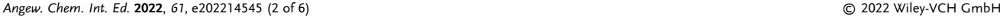
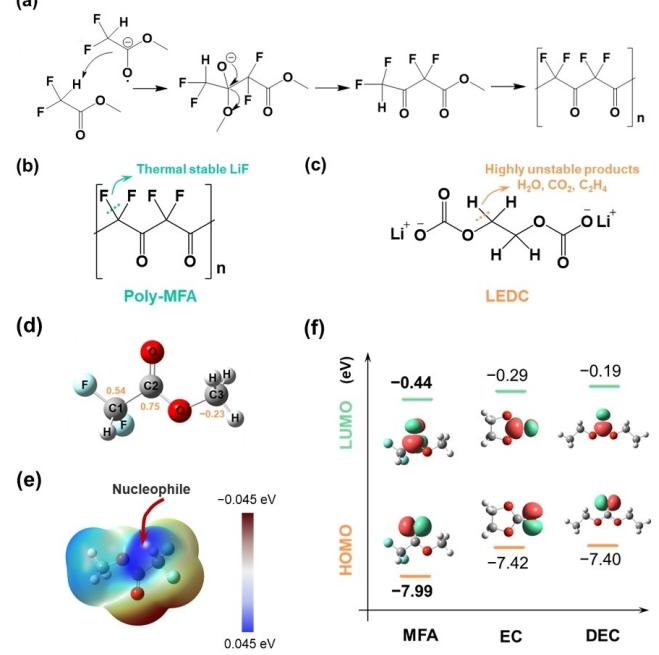
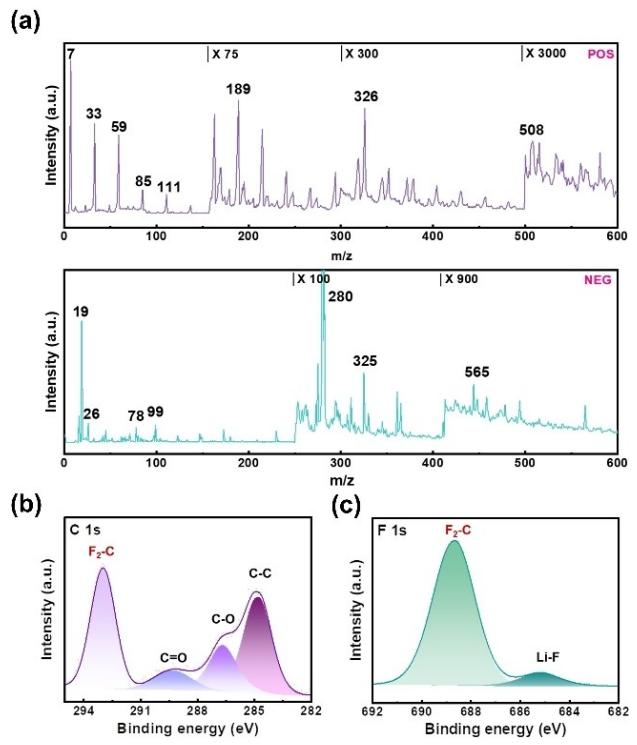
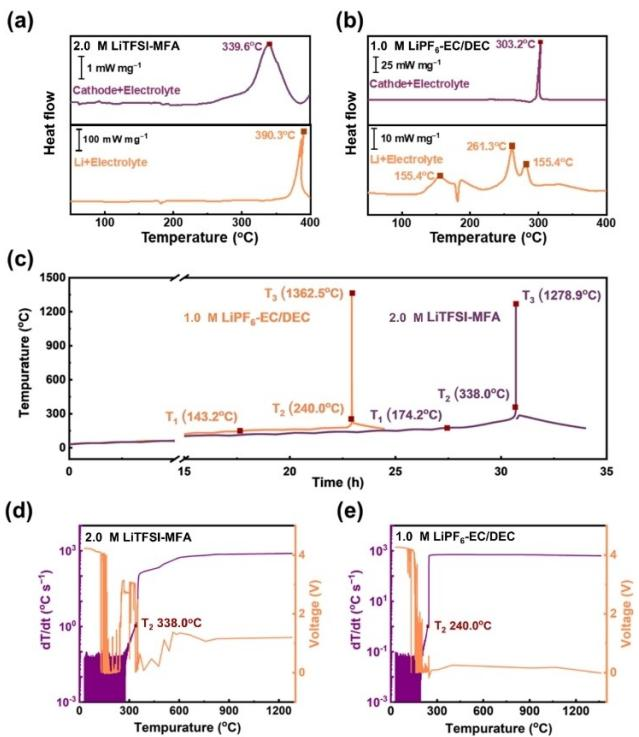

*Communications*

*Angewandte Chemie* www.angewandte.org

## *Li Metal Batteries Very Important Paper*

How to cite: *Angew. Chem. Int. Ed.* **2022,** *61,* e202214545 International Edition: [doi.org/10.1002/anie.202214545](https://doi.org/10.1002/anie.202214545) German Edition: [doi.org/10.1002/ange.202214545](https://doi.org/10.1002/ange.202214545)

# **Thermally Stable Polymer-Rich Solid Electrolyte Interphase for Safe Lithium Metal Pouch Cells**

*Shi-Jie Yang, Nan Yao, Feng-Ni Jiang, Jin Xie, Shu-Yu Sun, Xiang Chen, Hong Yuan, Xin-Bing Cheng,\* Jia-Qi Huang,\* and Qiang [Zhang](http://orcid.org/0000-0002-3929-1541)\**

**Abstract:** Serious safety risks caused by the high reactivity of lithium metal against electrolytes severely hamper the practicability of lithium metal batteries. By introducing unique polymerization site and more fluoride substitution, we built an in situ formed polymer-rich solid electrolyte interphase upon lithium anode to improve battery safety. The fluorine-rich and hydrogen-free polymer exhibits high thermal stability, which effectively reduces the continuous exothermic reaction between electrolyte and anode/cathode. As a result, the critical temperature for thermal safety of 1.0 Ah lithium-LiNi0.5Co0.2Mn0.3O2 pouch cell can be increased from 143.2°C to 174.2°C. The more dangerous "ignition" point of lithium metal batteries, the starting temperature of battery thermal runaway, has been dramatically raised from 240.0°C to 338.0°C. This work affords novel strategies upon electrolyte design, aiming to pave the way for high-energy-density and thermally safe lithium metal batteries.

[\*] S.-J. Yang, Prof. Dr. H. Yuan, Prof. Dr. J.-Q. Huang School of Materials Science & Engineering, Beijing Institute of Technology Beijing 100081 (China) E-mail: jqhuang@bit.edu.cn S.-J. Yang, Prof. Dr. H. Yuan, Prof. Dr. J.-Q. Huang Advanced Research Institute of Multidisciplinary Science, Beijing Institute of Technology Beijing 100081 (China) N. Yao, F.-N. Jiang, Dr. J. Xie, S.-Y. Sun, Dr. X. Chen, Prof. Dr. Q. Zhang Beijing Key Laboratory of Green Chemical Reaction Engineering and Technology, Department of Chemical Engineering, Tsinghua University Beijing 100084 (China) E-mail: zhang-qiang@mails.tsinghua.edu.cn F.-N. Jiang College of Chemical Engineering and Technology, Taiyuan University of Technology Taiyuan 030024, Shanxi (China) Prof. Dr. X.-B. Cheng Key Laboratory of Energy Thermal Conversion and Control of Ministry of Education, School of Energy and Environment, Southeast University Nanjing 211189, Jiangsu (China)

*T*he success of lithium-ion batteries (LIBs) has boosted the flourishing of electric devices and transportation systems over the past decades.[1] High energy density and thermal safety are two important requirements for advanced rechargeable batteries due to the poor durability and frequent safety incidents.[2] Lithium (Li) metal is an excellent alternative to routine graphite anode because of its ultrahigh theoretical capacity (3860 mAhg 1 versus 372 mAhg 1 of graphite) and the most anode potential ( 3.040 V).[3] However, the growth of Li dendrites with ultrahigh specific surface area and the high reactivity of Li metal seriously shorten the lifespan and deteriorate the safety performance of working Li metal batteries (LMBs).[4]

Several attempts have been devoted to inhibit the growth of Li dendrites, such as constructing stable functional separators, 3D host design and solid electrolyte interphase (SEI) layers.[5] Among them, interfacial modifications are strongly considered recently.[6] The uniform and dense SEI with high mechanical strength can restrict the growth of Li dendrites by promoting the homogeneous transportation of Li ions and the deposition of Li metal. As a result, the uniform morphology of Li deposits can reduce its contact area with organic electrolyte and the subsequent side reactions.[7] However, dangerous exothermic reactions between Li metal and electrolytes under elevated temperature are frequently observed in working LMBs.[8] The low thermal stability of conventional SEI is prone to decompose at high temperature, resulting in losing its protective effect on Li metal.[9] It is of critical importance, but quite challenging to design a robust SEI, which can not only suppress dendrite growth at room temperature but also simultaneously delay the heat generation between Li metal and electrolyte.

The electrochemical and thermal stability of the electrolyte decomposition products, as the components of SEI, strongly determine the cycling performance and safety of LMBs.[10] Most solvents hold poor stability to Li metal, because their reaction products exhibit poor thermal stability and cannot effectively passivate Li anode during charging/discharging processes and at high temperature. In order to elevate the intrinsic safety and lifespan of LMBs, fundamentally regulating the main electrolyte formula is required to inhibit the further decomposition of lithium salt and solvent, and enhance the interfacial stability of the anode/cathode surface.

In this contribution, a polymer-rich SEI upon the Li anode is constructed by the in situ polymerization of methyl

E-mail: chengxb@seu.edu.cn

difluoroacetate (MFA) with the assistance of its unique molecular configuration and dual fluorine atoms. Both the Li dendrite growth and side reactions between Li and electrolyte at both room and high temperature are significantly reduced due to its unique molecular configuration and dual fluorine atoms. Solid polymer electrolytes exhibit high thermal stability to Li metal compared with routine liquid electrolytes.[11] The excellent thermal performance of the proposed SEI directly increases the critical temperature for thermal safety of 1.0 Ah Li-LiNi0.5Co0.2Mn0.3O2 (NCM523) pouch cells from 143.2°C to 174.2°C and the thermal runaway temperature from 240.0°C to 338.0°C compared with a routine cell. Furthermore, fluorinated reagents are widely considered to improve the electrochemical stability of SEI by increasing LiF content.[12] Subsequent X-ray photoelectron spectroscopy (XPS) depth tests exhibit that LiF-rich SEI generates on the near-surface of the Li metal. Its flexibility also plays a key role in restraining the growth of Li dendrites and improving the interfacial cyclic stability of Li metal anode, promoting the high capacity retention (92.93% after 65 cycles).[13] This contribution proposes a protection strategy for the Li metal anode during both high-temperature and room-temperature cycling processes, which is expected to promote the practical application of LMBs.

Introducing flexible layer upon Li anode in situ is one of the efficient strategies to inhibit the side reactions and increase thermal safety of LMBs.[14] Nevertheless, most of film-forming additives (e.g. vinyl ethylene carbonate and vinylene carbonate) are easy to be oxidized with highvoltage cathode material.[12a] Carboxylic ester reagents containing *α*-hydrogen can undergo classical Claison ester condensation reaction under the attack of nucleophile, which is promising to be used as film-forming electrolyte for its strong oxidation resistance.[15] However, the reported carboxylic ester solvents such as methyl acetate do not render surface film-forming properties.[16] The absence of nucleophiles in electrolyte and the high difficulty of polycondensation hinder the practical application of this strategy.

Based on the theoretical considerations, MFA is designed to ensure the thermal and electrochemical stability. In details, MFA can form a polymer-rich layer on the surface of Li anode through the typical Claison ester condensation reaction in situ (Figure 1a). The C=O group of MFA, the lowest unoccupied molecular orbital (LUMO) orbital (Figure 1f), receives electron from Li metal when it's reduced, producing carbon anion that can act as nucleophiles.[17] The carbon anion is going to attack the *α*hydrogen of another MFA molecule as the nucleophile, resulting in its polycondensation. The fluorinated polymers can provide the working interfaces with extremely high thermal stability. Due to the small van der Waals radius of the fluorine atom and the strong C F bond, the C F bond in MFA polymerization products is less likely to break than the C H bond in other polymers, which can reduce unexpected thermal hazards.[18] The LiF produced by thermal decomposition also exhibits good thermal stability to inhibit the further reaction between Li metal and electro-

*Figure 1.* Polymerization and molecular characteristics of MFA. a) Polyymerization processes. After receiving an electron, the C positive center in CHF2 of MFA attacks the carbonyl carbon of the neighboring MFA, initiating polymerization between the two molecules. Comparison of pol-MFA thermal stability with LEDC. b) Poly-MFA and c) LEDC. The C F bond is stronger than C H bond and the decomposition product of poly-MFA is more stable LiF. d) The charge distribution of different carbon atoms in MFA. The blue and brown regions represent the positive and negative parts of orbitals, respectively (isovalue=0.05). e) The electrostatic potential of MFA. The difluorination of C atom lowers the barrier of nucleophile attack on *α*-active hydrogen of CF2H group. (f) LUMO and HOMO of MFA, EC, and DEC. Color mapping for atoms: H white, C gray, O red, and F cyan.

lyte (Figure 1b).[19] On the contrary, traditional organic components of SEI, such as Li ethylene decarbonate (LEDC), are easily decomposed due to the fracture of C H bond produces. Gaseous unstable products (H2O, C2H4, etc.) are also produced, which can induce severe safety hazards (Figure 1c).[9,20] The unique molecular configuration design of MFA makes it more prone to be condensed. The difluorine substitution gives the carbon (C1) of more positive charge, so that the *α*-hydrogen prefers to be attacked by the nucleophilic carbon anion (Figure 1d & e). Consequently, F atom substitution in MFA molecule increases its oxidation stability that can help to resist the reaction with the oxygen produced by the decomposition of cathodes.[21] The highest occupied molecular orbital (HOMO) of MFA ( 7.99 eV) is lower than those of ester solvents, including ethylene carbonate (EC, 7.42 eV) and diethyl carbonate (DEC, 7.40 eV), indicating that the MFA is more antioxidant (Figure 1f). Overall, the distinct properties of MFA can generate a layer of polymer with high fluorine content in situ on the surface of Li metal rapidly, which holds great potential to improve the thermal and electrochemical stability of LMBs.

Heat treatment of Li metal and MFA is used to prove the polymerization mechanism and thermal stability of the polymer-rich layer. High temperature is beneficial to the condensation process, allowing MFA to quickly produce a protective polymer layer on the surface of Li metal, which maintains good structural integrity even heated at 250.0°C for 10 min (Figure S1). The surface products of Li metal after heating treatment confirm the dual-molecules polycondensation of MFA (ion mass charge ratio (*m*/*z*)=189, H(CF2CO)2OCH3) through mass spectrum (MS) (Figure 2a). This confirms MFA can undergo further condensation polymerizations to form polymers of higher molecular weight (325, (CF2CO)4C; 508, CCO(CF2CO)6, etc.), which is beneficial to avoid the further reactions of Li metal with electrolyte to generate by-products and enormous heat. Subsequent XPS tests also showed obvious F2 C and C=O signals, which proved the species of the polymerization products further (Figure 2b & c).

The in situ formed polymer-rich SEI film renders excellent electrochemical performance of LMBs due to its high fluorine content and flexibility. The monolayer Li-NCM523 pouch cell (�80.0 mAh) has a significantly extended cycle life of more than 65 cycles with 92.93% capacity retention using 2.0 M LiTFSI-MFA electrolyte, versus 12 cycles with routine electrolyte (1.0 M LiPF6-EC/ DEC (1 :1 by vol.%)) (Figure 3a & b). The excellent electrochemical performance is realized by the outstanding protection of Li anode by MFA. On the one hand, the uniform and dense polymer can suppress the Li dendrite growth and consumption of Li (Figure 3c & d). This method of in situ polymerization by MFA electrolyte is more excellent compared to the artificial SEI. This feature helps suppress the thickness of the Li anode by nearly half from 328 to 173 μm. After cycling in the MFA electrolyte, a protective film is formed on the surface of the Li anode, which effectively inhibits the continuous growth of Li dendrites and dead Li metal (Figure S2).

The higher fluoride degree of the polymer is expected to form abundant LiF on the surface of working Li metal anode. In-depth XPS tests show the polymer layer ( CF2: C 1s, 292.9 eV; F 1s 688.7 eV) is achieved near the electrolyte side, and high-content LiF (F 1s 685.0 eV) is formed near the Li metal side.[22] This typical bilayer structure of SEI can restrain the volume deformation and the LiF-rich SEI can reduce the diffusion energy barrier of Li-ions at the interface of the Li anode.[23] There, the polymer in situ generated by MFA on the surface of Li anode can effectively inhibit the pulverization of Li by virtue of its good density and high LiF

*Figure 2.* Validation of MFA polymerization products. a) The degree and mechanism of polymerization reaction products were verified by MS tests. Ion mass charge ratio: 7-Li; 19-F; 26-LiF; 33-CFH; 59- COOCH3; 78-CF2CO; 85-CF2COLi; 99-COCCOOCH3; 111-MFA; 189- H(CF2CO)2OCH3; 280-TFSI ; 325-(CF2CO)4C; 326-(CF2CO)4O; 508- CCO(CF2CO)6; 565-H(CF2CO)5O. b) C 1s and c) F 1s spectra of XPS results of MFA polymerization products. The signals of dual/multiple molecules polymerization products in MS tests and extremely high F2 C signal confirm the efficient polymerization of MFA.

*Figure 3.* Cycling performance of Li-NCM523 pouch cell with MFA electrolyte. a) Discharging capacity and Coulombic efficiency of pouch cells with different electrolytes. b) Capacity-voltage curves of pouch cells with different electrolytes (routine electrolyte: 1.0 M LiPF6-EC/ DEC, MFA electrolyte: 2.0 M LiTFSI-MFA). SEM images of cycled Li anode in c) 2.0 M LiTFSI-MFA after 65th cycle and d) 1.0 M LiPF6-EC/ DEC after 20th cycle. XPS depth information of cycled Li anode in 2.0 M LiTFSI-MFA after 65th cycle: e) C 1s and f) F 1s spectra.

content, which is beneficial to improving the electrochemical performance of LMBs.

The safety enhancement of the MFA electrolyte on LMBs was demonstrated by differential scanning calorimetry (DSC) and adiabatic rate calorimeter (ARC) tests. 1.0 Ah pouch cells were fully charged after four cycles for subsequent thermal safety tests to ensure Li dendrite formation and adequate electrolyte retention (Figure S3; Figure S4). DSC tests were employed to characterize the thermal stability of the electrolyte and cell components to screen out the chemical reactions inside the battery within thermal runaway (Figure 4a & b). Due to the high reactivity of Li and the low thermal stability of SEI, the exothermic reaction between Li and routine electrolyte is very strong. At 155.4°C, the decomposition of SEI occurs, leading to the exposure of fresh Li metal in the electrolyte and weak exothermic reaction between them. The corresponding heat production rate of 4.3 mWmg 1 is sufficient to cause the cell to self-heat.[8,9] As the temperature rises toward the melting point of Li metal, this reaction is intensified and a peak rises at 261.3°C (20.7 mWmg 1 ) is observed, which is strong enough to trigger thermal runaway. The polymer SEI layer with high thermal stability introduced by MFA can greatly suppress this hazard and the reaction temperature of Li and MFA electrolyte can be raised to 390.3°C. Contrarily, both the routine SEI and LiTFSI salt break down and undergo a

*Figure 4.* Thermal safety verification of 1.0 Ah Li-NCM523 pouch cell of MFA electrolyte. DSC results of anode and cathode composite with different electrolytes: a) 2.0 M LiTFSI-MFA, b) 1.0 M LiPF6-EC/DEC. c) ARC results of pouch cells with different electrolytes and d)– e) corresponding heating rate and voltage curves: d) 2.0 M LiTFSI-MFA, e) 1.0 M LiPF6-EC/DEC.

*Angew. Chem. Int. Ed.* **2022**, *61*, e202214545 (4 of 6) © 2022 Wiley-VCH GmbH

severe exothermic reaction with Li metal at such a high temperature.[24]

*Angewandte*

*Chemie*

Moreover, the release of oxygen from the NCM523 cathode at high temperature is also a key factor affecting the thermal stability of LMBs.[25] Benefiting from the high oxidation resistance of MFA due to its low HOMO energy level, the exothermic reaction temperature between oxygen and MFA electrolyte is increased from 303.2°C (routine electrolyte) to 339.6°C. Even so, this exothermic reaction is still earlier than the reaction between Li metal and MFA electrolyte. There is no new exothermal peak of the reaction when Li+electrolyte+cathode are combined (Figure S5). For MFA electrolyte, oxygen produced by cathode decomposition reacts with electrolyte firstly and then Li reacts with electrolyte further. As for the routine electrolyte, Li anode and oxygen released from the cathode both react with electrolytes which produces vast gas, resulting in the leakage of the crucible. This hazard is enormously easy to induce the deflagration and ejection of batteries in the actual thermal runaway process, aggravating the safety risk of the battery. The reactions between Li metal and oxygen can produce dense oxide layer which restrain further reactions, so that there is no obvious exothermic phenomenon between them in our results.[26]

ARC tests further demonstrate the enhancement of thermal performance for the working cells (Figure 4c). LMBs show significant thermal runaway and combustion in ARC tests. All the battery components are burned due to the high energy density (Figure S6). Attentions should be paid to the three key temperatures in the thermal runaway process: T1, when the self-heating rate of the battery is greater than 0.02 °Cmin 1 , representing the critical temperature for thermal safety of the battery. When the battery temperature exceeds T1, the chemical reactions inside the battery will elevate the battery temperature automatically, so that the battery cannot be safely operated or stored; T2, when the battery generates heat vigorously and starts the thermal runaway (self-heating rate *>*60 °Cmin 1 ). The battery will ignite within few seconds after reaching T2, so that "ignition" temperature is used to refer to thermal runaway temperature; T3, when the battery reaches the maximum temperature during the thermal runaway. The heat release rate of all reactions inside the battery reaches the maximum value, reflecting the power of a single battery thermal runaway.

The higher T1 of LMB with MFA electrolyte indicates fewer interfacial chemical reactions (174.2 °C versus 143.2°C of the routine cell), which proves the high thermal stability of the MFA polymerization layer at Li metal interfaces. The extremely high T2 of 338.0°C demonstrates that the thermal runaway of LMB with MFA electrolyte is caused by the reaction between oxygen, the product of cathode decomposition, and electrolyte, which successfully delays the thermal safety risk caused by Li metal with routine electrolyte (240.0°C). The low heating rate at early stage before 400 °C also attributes to the protection of MFA on Li anode (Figure 4d & e). ARC results can perfectly match DSC results to prove the identification of the thermal runaway process of the MFA electrolyte based LMB. The maximum temperature of thermal runaway also reduces from 1362.5°C to 1278.9 °C. As T3 is closely related to the capacity of the battery, there is only little difference in the maximum temperature after complete combustion for cells of the same capacity compared with these of T1 and T2. Therefore, the reaction of Li with the electrolyte is greatly delayed using MFA solvent. These results further prove that the thermal safety of Li metal and electrolyte can be improved by introducing a polymer layer with uniform and high thermal stability on the surface of Li metal. Meanwhile, compared with the reported improvement of the thermal stability between electrolyte and Li metal, the interfacial film designed here can significantly improve the battery safety (Table S1).

The efficient molecular design of the electrolyte has enabled a new polymerization idea to be successfully applied to Li metal anode. While the design of nucleophilic site promotes the polymerization of the electrolyte, the thermal stability of the interface is improved by high fluoride substitution. A more thermal stable electrolyte-Li metal interface increases the critical temperature for thermal safety of the battery, leaving more room for safe operation and timely warning. Moreover, the extremely high battery "ignition" temperature (338.0 °C) proves that the risk of Li metal anode can be successfully reduced by effective interfacial control. The effectiveness of interface polymerization in improving thermal safety can also be effectively utilized in other energy storage systems.

#### *Acknowledgements*

This work is funded by National Key Research and Development Program (2021YFB2500300), National Natural Science Foundation of China (22179070, 22109086, 22075029, U1932220, and M-0240), Beijing Municipal Natural Science Foundation (Z200011), the Natural Science Foundation of Jiangsu Province (BK20220073), and the Fundamental Research Funds for the Central Universities (2242022R10082).

### *Conflict of Interest*

The authors declare no conflict of interest.

#### *Data Availability Statement*

The data that support the findings of this study are available from the corresponding author upon reasonable request.

**Keywords:** Electrolyte **·** Lithium Metal Anode **·** Pouch Cell **·** Safety **·** Thermal Runaway

[1] a) D. Larcher, J. M. Tarascon, *Nat. [Chem.](https://doi.org/10.1038/nchem.2085)* **2015**, *7*, 19; b) R. Schmuch, R. Wagner, G. Hörpel, T. Placke, M. Winter, *[Nat.](https://doi.org/10.1038/s41560-018-0107-2) [Energy](https://doi.org/10.1038/s41560-018-0107-2)* **2018**, *3*, 267; c) N. Yao, X. Chen, Z. H. Fu, Q. Zhang,

*Angew. Chem. Int. Ed.* **2022**, *61*, e202214545 (5 of 6) © 2022 Wiley-VCH GmbH

*[Chem.](https://doi.org/10.1021/acs.chemrev.1c00904) Rev.* **2022**, *122*, 10970; d) M. Li, J. Lu, Z. Chen, K. Amine, *Adv. Mater.* **2018**, *30*, [1800561](https://doi.org/10.1002/adma.201800561); e) X. Q. Xu, F. N. Jiang, S. J. Yang, Y. Xiao, H. Liu, F. Y. Liu, L. Liu, X. B. Cheng, *[J.](https://doi.org/10.1016/j.jechem.2022.01.019) [Energy](https://doi.org/10.1016/j.jechem.2022.01.019) Chem.* **2022**, *69*, 205.

- [2] a) J. Liu, Z. Bao, Y. Cui, E. J. Dufek, J. B. Goodenough, P. Khalifah, Q. Li, B. Y. Liaw, P. Liu, A. Manthiram, Y. S. Meng, V. R. Subramanian, M. F. Toney, V. V. Viswanathan, M. S. Whittingham, J. Xiao, W. Xu, J. Yang, X. Q. Yang, J. G. Zhang, *Nat. [Energy](https://doi.org/10.1038/s41560-019-0338-x)* **2019**, *4*, 180; b) F. N. Jiang, S. J. Yang, H. Liu, X. B. Cheng, L. Liu, R. Xiang, Q. Zhang, S. Kaskel, J. Q. Huang, *[SusMat](https://doi.org/10.1002/sus2.37)* **2021**, *1*, 506; c) Y. Q. Chen, Y. Q. Kang, Y. Zhao, L. Wang, J. L. Liu, Y. X. Li, Z. Liang, X. M. He, X. Li, N. Tavajohi, B. Li, *J. [Energy](https://doi.org/10.1016/j.jechem.2020.10.017) Chem.* **2021**, *59*, 83; d) S. J. Yang, N. Yao, X. Q. Xu, F. N. Jiang, X. Chen, H. Liu, H. Yuan, J. Q. Huang, X. B. Cheng, *J. [Mater.](https://doi.org/10.1039/D1TA02615A) Chem. A* **2021**, *9*, 19664; e) X. N. Feng, M. G. Ouyang, X. Liu, L. G. Lu, Y. Xia, X. M. He, *Energy [Storage](https://doi.org/10.1016/j.ensm.2017.05.013) Mater.* **2018**, *10*, 246.
- [3] a) S. J. Yang, X. Shen, X. B. Cheng, F. N. Jiang, R. Zhang, H. Liu, L. Liu, H. Yuan, *J. [Energy](https://doi.org/10.1016/j.jechem.2021.12.049) Chem.* **2022**, *69*, 70; b) G. M. Hobold, J. Lopez, R. Guo, N. Minafra, A. Banerjee, Y. Shirley Meng, Y. Shao-Horn, B. M. Gallant, *Nat. [Energy](https://doi.org/10.1038/s41560-021-00910-w)* **2021**, *6*, [951;](https://doi.org/10.1038/s41560-021-00910-w) c) H. Liu, X. B. Cheng, Y. Chong, H. Yuan, J. Q. Huang, Q. Zhang, *[Particuology](https://doi.org/10.1016/j.partic.2020.12.003)* **2021**, *57*, 56.
- [4] a) X. Y. Huang, M. Xiao, D. M. Han, J. J. Xue, S. J. Wang, Y. Z. Meng, *J. Power [Sources](https://doi.org/10.1016/j.jpowsour.2021.229503)* **2021**, *489*, 229503; b) P. Shi, L. P. Hou, C. B. Jin, Y. Xiao, Y. X. Yao, J. Xie, B. Q. Li, X. Q. Zhang, Q. Zhang, *J. Am. [Chem.](https://doi.org/10.1021/jacs.1c08606) Soc.* **2022**, *144*, 212; c) T. Nakajima, Y. Hirobayashi, Y. Takayanagi, Y. Ohzawa, *[J.](https://doi.org/10.1016/j.jpowsour.2013.05.138) Power [Sources](https://doi.org/10.1016/j.jpowsour.2013.05.138)* **2013**, *243*, 581; d) X. Chen, Q. Zhang, *[Acc.](https://doi.org/10.1021/acs.accounts.0c00412) [Chem.](https://doi.org/10.1021/acs.accounts.0c00412) Res.* **2020**, *53*, 1992.
- [5] a) Z. Liu, Q. Hu, S. Guo, L. Yu, X. Hu, *Adv. [Mater.](https://doi.org/10.1002/adma.202008088)* **2021**, *33*, [2008088](https://doi.org/10.1002/adma.202008088); b) H. Liu, T. Li, X. Q. Xu, P. Shi, X. Q. Zhang, R. Xu, X. B. Cheng, J. Q. Huang, *Chin. J. [Chem.](https://doi.org/10.1016/j.cjche.2021.03.021) Eng.* **2021**, *37*, [152](https://doi.org/10.1016/j.cjche.2021.03.021); c) Q. Zhao, S. Stalin, C. Z. Zhao, L. A. Archer, *Nat. [Rev.](https://doi.org/10.1038/s41578-019-0165-5) [Mater.](https://doi.org/10.1038/s41578-019-0165-5)* **2020**, *5*, 229.
- [6] a) S. S. Qian, C. Xing, M. T. Zheng, Z. Su, H. Chen, Z. Z. Wu, C. Lai, S. Q. Zhang, *Adv. Energy Mater.* **2022**, *12*, [2103480;](https://doi.org/10.1002/aenm.202103480) b) B. Horstmann, J. Shi, R. Amine, M. Werres, X. He, H. Jia, F. Hausen, I. Cekic-Laskovic, S. Wiemers-Meyer, J. Lopez, D. Galvez-Aranda, F. Baakes, D. Bresser, C. C. Su, Y. Xu, W. Xu, P. Jakes, R.-A. Eichel, E. Figgemeier, U. Krewer, J. M. Seminario, P. B. Balbuena, C. Wang, S. Passerini, Y. Shao-Horn, M. Winter, K. Amine, R. Kostecki, A. Latz, *[Energy](https://doi.org/10.1039/D1EE00767J) [Environ.](https://doi.org/10.1039/D1EE00767J) Sci.* **2021**, *14*, 5289; c) X. Q. Xu, R. Xu, X. B. Cheng, Y. Xiao, H. J. Peng, H. Yuan, F. Y. Liu, *J. [Energy](https://doi.org/10.1016/j.jechem.2020.08.029) Chem.* **2021**, *56*, [391](https://doi.org/10.1016/j.jechem.2020.08.029).
- [7] a) J. F. Qian, W. A. Henderson, W. Xu, P. Bhattacharya, M. Engelhard, O. Borodin, J. G. Zhang, *Nat. Commun.* **2015**, *6*, 6362; b) X. Q. Zhang, T. Li, B. Q. Li, R. Zhang, P. Shi, C. Yan, J. Q. Huang, Q. Zhang, *[Angew.](https://doi.org/10.1002/anie.201911724) Chem. Int. Ed.* **2020**, *59*, 3252; *[Angew.](https://doi.org/10.1002/ange.201911724) Chem.* **2020**, *132*, 3278.
- [8] X. Q. Xu, X. B. Cheng, F. N. Jiang, S. J. Yang, D. S. Ren, P. Shi, H. Hsu, H. Yuan, J. Q. Huang, M. Ouyang, Q. Zhang, *[SusMat](https://doi.org/10.1002/sus2.74)* **2022**, *2*, 435.
- [9] T. Yoon, M. S. Milien, B. S. Parimalam, B. L. Lucht, *[Chem.](https://doi.org/10.1021/acs.chemmater.7b00454) [Mater.](https://doi.org/10.1021/acs.chemmater.7b00454)* **2017**, *29*, 3237.
- [10] a) Z. R. Lu, L. Yang, Y. J. Guo, *J. Power [Sources](https://doi.org/10.1016/j.jpowsour.2005.05.085)* **2006**, *156*, [555](https://doi.org/10.1016/j.jpowsour.2005.05.085); b) P. Ping, Q. S. Wang, J. H. Sun, H. F. Xiang, C. H. Chen, *J. [Electrochem.](https://doi.org/10.1149/1.3473789) Soc.* **2010**, *157*, A1170.
- [11] a) A. Mirsakiyeva, M. Ebadi, C. M. Araujo, D. Brandell, P. Broqvist, J. Kullgren, *J. Phys. [Chem.](https://doi.org/10.1021/acs.jpcc.9b07712) C* **2019**, *123*, 22851; b) K. Murata, *[Electrochim.](https://doi.org/10.1016/0013-4686(95)00160-G) Acta* **1995**, *40*, 2177.
- [12] a) K. Xu, *[Chem.](https://doi.org/10.1021/cr030203g) Rev.* **2004**, *104*, 4303; b) J. G. Zhang, W. Xu, J. Xiao, X. Cao, J. Liu, *[Chem.](https://doi.org/10.1021/acs.chemrev.0c00275) Rev.* **2020**, *120*, 13312.
- [13] a) H. Wang, L. Sheng, G. Yasin, L. Wang, H. Xu, X. He, *Energy [Storage](https://doi.org/10.1016/j.ensm.2020.08.014) Mater.* **2020**, *33*, 188; b) J. Zhang, J. Yang, T.

Dong, M. Zhang, J. Chai, S. Dong, T. Wu, X. Zhou, G. Cui, *Small* **2018**, *14*, [1800821.](https://doi.org/10.1002/smll.201800821)

- [14] a) Q. Zhao, X. T. Liu, S. Stalin, K. Khan, L. A. Archer, *[Nat.](https://doi.org/10.1038/s41560-019-0349-7) [Energy](https://doi.org/10.1038/s41560-019-0349-7)* **2019**, *4*, 365; b) B. Zhu, Y. Jin, X. Hu, Q. Zheng, S. Zhang, Q. Wang, J. Zhu, *Adv. Mater.* **2017**, *29*, [1603755](https://doi.org/10.1002/adma.201603755).
- [15] D. W. van Krevelen, *[Polymer](https://doi.org/10.1016/0032-3861(75)90157-3)* **1975**, *16*, 615.
- [16] a) N. Kim, Y. Myung, H. Kang, J. W. Lee, M. Yang, *[ACS](https://doi.org/10.1021/acsami.9b09373) Appl. Mater. [Interfaces](https://doi.org/10.1021/acsami.9b09373)* **2019**, *11*, 33844; b) J. Li, H. Y. Li, X. W. Ma, W. Stone, S. Glazier, E. Logan, E. M. Tonita, K. L. Gering, J. R. Dahn, *J. [Electrochem.](https://doi.org/10.1149/2.0861805jes) Soc.* **2018**, *165*, A1027.
- [17] a) L. Bouveault, G. Blanc, *Bull. Soc. Chim. Fr.* **1903**, *136*, 1676; b) L. Bouveault, G. Blanc, *Bull. Soc. Chim. Fr.* **1904**, *31*, 1210.
- [18] Z. Cui, E. Drioli, Y. M. Lee, *Prog. [Polym.](https://doi.org/10.1016/j.progpolymsci.2013.07.008) Sci.* **2014**, *39*, 164.
- [19] a) Y. Lee, T. K. Lee, S. Kim, J. Lee, Y. Ahn, K. Kim, H. Ma, G. Park, S.-M. Lee, S. K. Kwak, N.-S. Choi, *Nano [Energy](https://doi.org/10.1016/j.nanoen.2019.104309)* **2020**, *67*, [104309](https://doi.org/10.1016/j.nanoen.2019.104309); b) S. Y. Li, L. Fan, Y. Y. Lu, *Energy [Storage](https://doi.org/10.1016/j.ensm.2018.09.015) Mater.* **[2019](https://doi.org/10.1016/j.ensm.2018.09.015)**, *18*, 205.
- [20] M. Y. Nie, D. Chalasani, D. P. Abraham, Y. J. Chen, A. Bose, B. L. Lucht, *J. Phys. [Chem.](https://doi.org/10.1021/jp3118055) C* **2013**, *117*, 1257.
- [21] K. An, Y. H. T. Tran, S. Kwak, J. Han, S. W. Song, *Adv. [Funct.](https://doi.org/10.1002/adfm.202106102) Mater.* **2021**, *31*, [2106102.](https://doi.org/10.1002/adfm.202106102)
- [22] a) D. Aurbach, E. Markevich, G. Salitra, *J. Am. [Chem.](https://doi.org/10.1021/jacs.1c11315) Soc.* **2021**, *143*, [21161;](https://doi.org/10.1021/jacs.1c11315) b) X. Cao, X. Ren, L. Zou, M. H. Engelhard,

W. Huang, H. Wang, B. E. Matthews, H. Lee, C. Niu, B. W. Arey, Y. Cui, C. Wang, J. Xiao, J. Liu, W. Xu, J. G. Zhang, *Nat. [Energy](https://doi.org/10.1038/s41560-019-0464-5)* **2019**, *4*, 796.

- [23] a) D. Gunceler, K. Letchworth-Weaver, R. Sundararaman, K. A. Schwarz, T. A. Arias, *Model. Simul.* **2013**, *21*, [074005;](https://doi.org/10.1088/0965-0393/21/7/074005) b) S. Shi, P. Lu, Z. Liu, Y. Qi, L. G. Hector Jr., H. Li, S. J. Harris, *J. Am. [Chem.](https://doi.org/10.1021/ja305366r) Soc.* **2012**, *134*, 15476.
- [24] a) J.-I. Yamaki, I. Yamazaki, M. Egashira, S. Okada, *J. [Power](https://doi.org/10.1016/S0378-7753(01)00805-9) [Sources](https://doi.org/10.1016/S0378-7753(01)00805-9)* **2001**, *102*, 288; b) T. Tanaka, T. Doi, S. Okada, J. I. Yamaki, *Fuel [Cells](https://doi.org/10.1002/fuce.200800085)* **2009**, *9*, 269.
- [25] a) J. Y. Li, H. M. Hua, X. B. Kong, H. Y. Yang, P. P. Dai, J. Zeng, J. B. Zhao, *Energy [Storage](https://doi.org/10.1016/j.ensm.2022.01.007) Mater.* **2022**, *46*, 90; b) S. M. Bak, E. Hu, Y. Zhou, X. Yu, S. D. Senanayake, S. J. Cho, K. B. Kim, K. Y. Chung, X. Q. Yang, K. W. Nam, *ACS Appl. [Mater.](https://doi.org/10.1021/am506712c) [Interfaces](https://doi.org/10.1021/am506712c)* **2014**, *6*, 22594.
- [26] M. Schiemann, J. Bergthorson, P. Fischer, V. Scherer, D. Taroata, G. Schmid, *Appl. [Energy](https://doi.org/10.1016/j.apenergy.2015.10.172)* **2016**, *162*, 948.

Manuscript received: October 3, 2022 Accepted manuscript online: October 24, 2022 Version of record online: November 17, 2022

