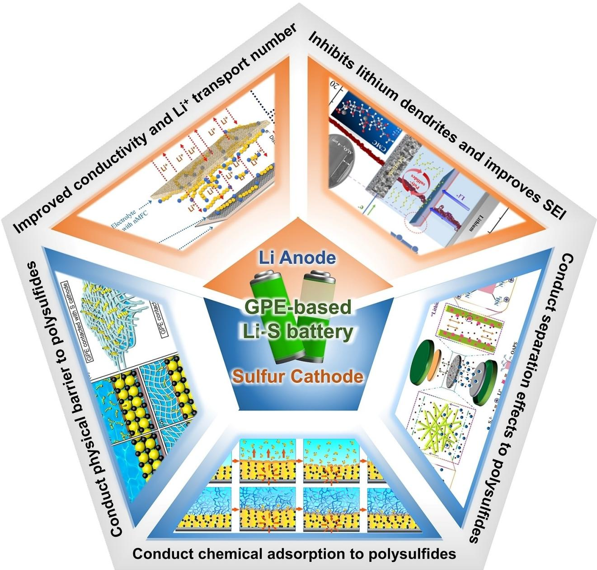
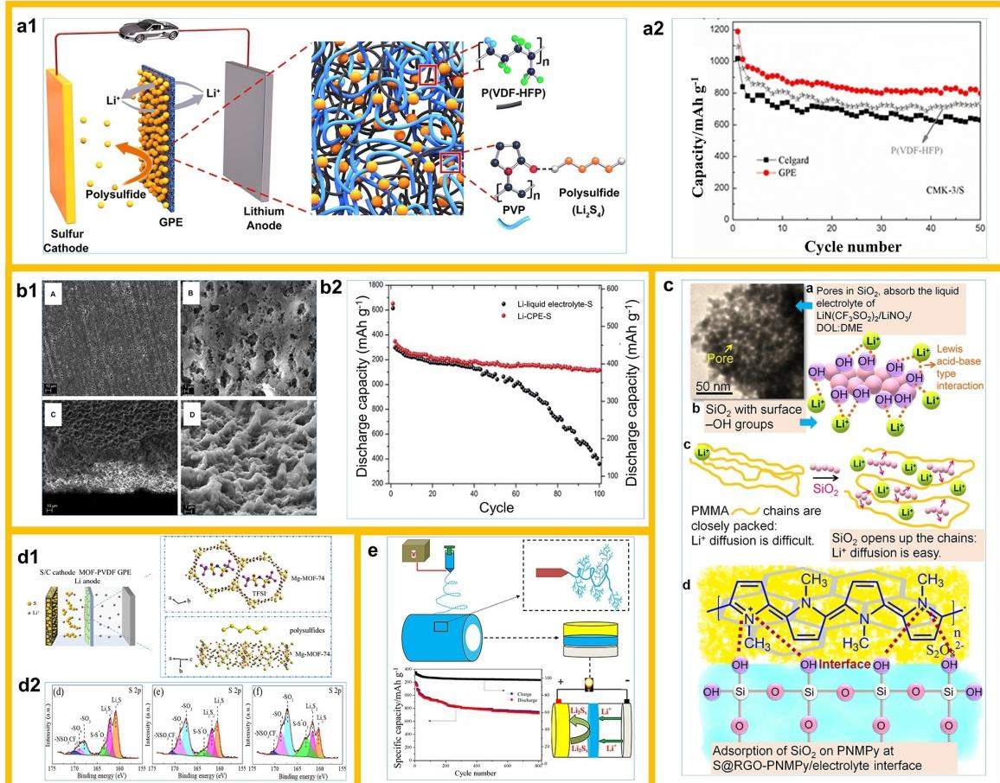
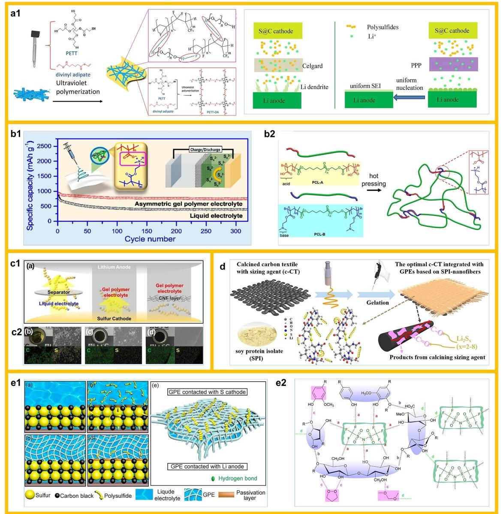
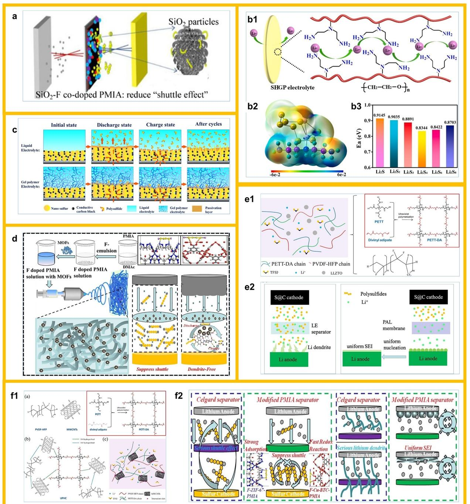
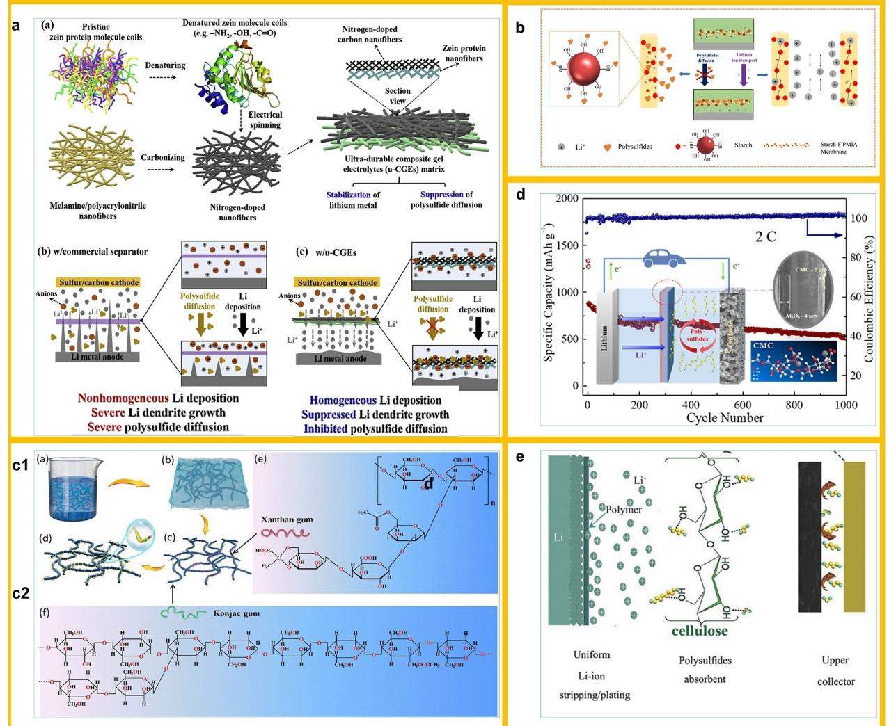
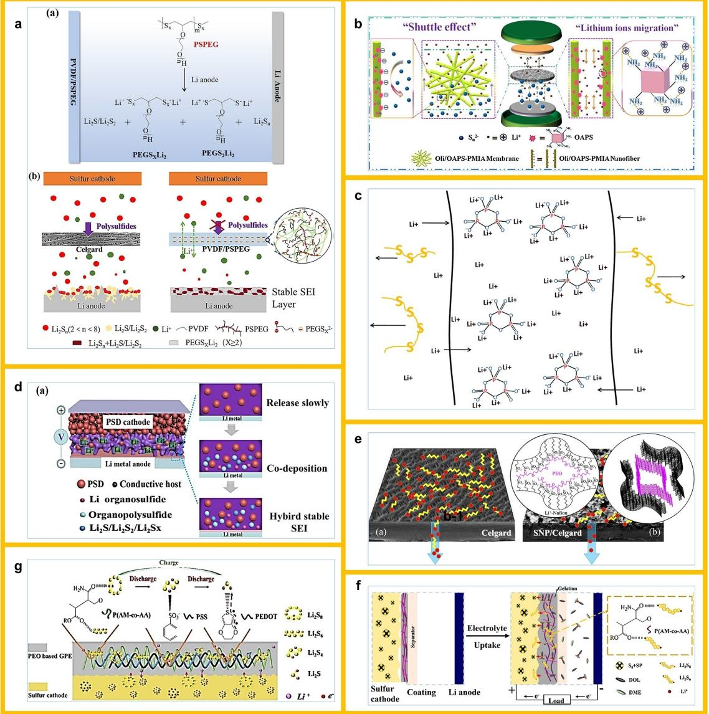
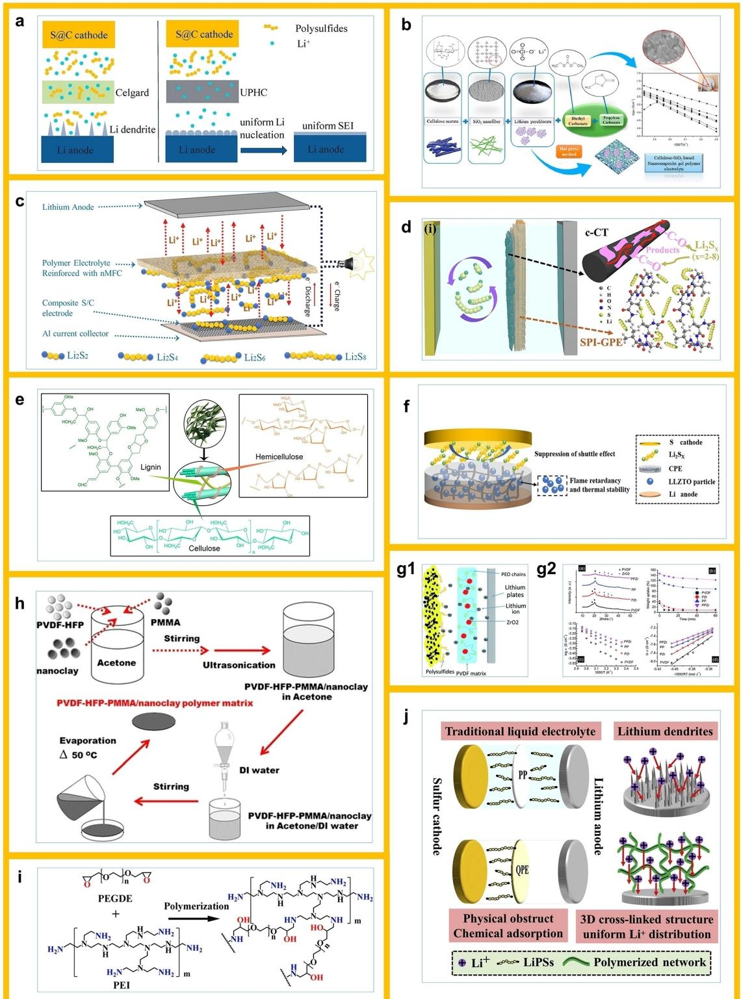
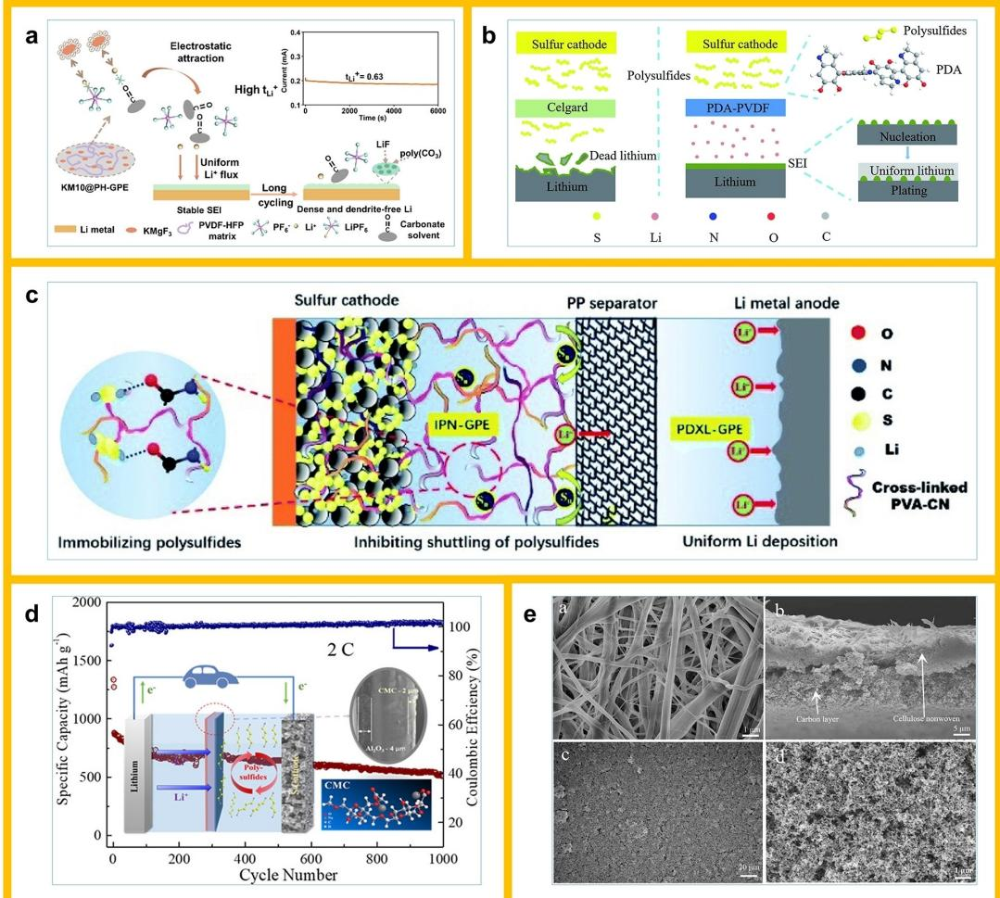

## **Emerging Strategies for Gel Polymer Electrolytes with Improved Dual-Electrode Side Regulation Mechanisms for Lithium-Sulfur Batteries**

Yingyue Cui,[a, b, c] Jin Li,[a, b, c] Xuedi Yuan,[e] Jiaxin Liu,[f] Haitao Zhang,[a, b, c, d] Hui Wu,[a, c] and [Yingjun](http://orcid.org/0000-0002-1933-302X) Cai\*[a, c]

**Abstract:** Although GPE still has the risk of shuttling due to the incomplete removal of liquid electrolytes compared to SPE, which has the most promise of eliminating polysulfide shuttling, researchers have made abundant efforts to eliminate as much of the polysulfide shuttling effect as possible while retaining the unique advantages of GPE. For example, physical barrier to polysulfides by improving the pore size of GPE or fabricating multidimensional structures by different preparation methods. Further chemical adsorption of polysulfides by adding nanofillers to increase polar sites to create polar-polar interactions with polysulfides or to create Lewis acid-base interactions. However, although chemical adsorption can indeed highly immobilize polysulfides, it still brings disadvantages such as loss of active material. Therefore, other researchers have employed GPE with ion-selective permeability that has electrostatic repulsive force or steric hindrance to polysulfides to better inhibit polysulfide shuttling. However, modifying only the cathode side is not enough to enhance this overall properties of Li S cells. These problems of poor Li+ transport, lithium dendrite growth, and poor SEI due to uneven lithium ion deposit on Li anode side still affect the overall performance of Li S cells. Therefore, a GPE to improve these problems on the Li anode side is summarized

Lithium-sulfur (Li S) batteries, known for its high energy density, are limited in practical application by lithium dendrite growth, polysulfide "shuttle effect", and safety issues. Gel polymer electrolytes that combine high ionic conductivity and safety are the key to solving these problems. Based on the special reaction mechanism of Li S batteries, this paper summarizes in detail the GPE types for different key problems

| [a] Y. Cui, J. Li, H. Zhang, H. Wu, Y. Cai Beijing Key Laboratory of Ionic Liquids Clean Process Institute of Process Engineering Chinese Academy of Sciences, Beijing, 100190 (P. R. China) E-mail: yjcai@ipe.ac.cn |
|----------------------------------------------------------------------------------------------------------------------------------------------------------------------------------------------------------------------------------|
| [b] Y. Cui, J. Li, H. Zhang School of Chemical Engineering University of Chinese Academy of Sciences Beijing, 100049 (P. R. China)                                                                                      |
| [c] Y. Cui, J. Li, H. Zhang, H. Wu, Y. Cai Institute of Process Engineering Chinese Academy of Sciences Beijing, 100049 (P. R. China) E-mail: yjcai@ipe.ac.cn                                                        |
| [d] H. Zhang Henan Key Laboratory of Energy Storage Materials and Processes Zhengzhou Institute of Emerging Industrial Technology Zhengzhou, 450003 (P. R. China)                                                       |
| [e] X. Yuan School of Henan Institute of Advanced Technology Zhengzhou University Zhengzhou 450002 (P. R. China)                                                                                                        |

[f] *J. Liu College of Chemical Engineering Shenyang University of Chemical Technology Shenyang, 110142 (P. R. China)*

*This manuscript is part of a special collection on Gel Electrolytes: Chemistry and Applications. Click here to visit the special [collections](http://ChemAsianJ.org/collections) page of the [journal](http://ChemAsianJ.org/collections).*

*Chem Asian J.* **2022**, *17*, e202200746 (2 of 21) © 2022 Wiley-VCH GmbH

below. Compared with an all-solid electrolyte, GPE, which has a partially liquid electrolyte, clearly has advantages such as strong interfacial contact, good anode interface compatibility, and high flexibility. However, it is still not comparable to the ionic conductivity, etc. of pure liquid electrolyte only. Therefore, the problems on the lithium metal anode side are mainly focused on the lithium ion transport problems and the problems of lithium dendrite growth and inhomogeneous SEI at the lithium anode interface. Facing the problems in these two aspects, researchers have given many improvement solutions respectively. For the lithium ion transport problem, researchers have instead provided pathways for lithium ion transport by adding amorphous nanofibers or nanofillers to reduce the crystallinity of the polymer and improve the ionic conductivity. Alternatively, the migration number of lithium ions can be increased by limiting the anions in the electrolyte. As for the interfacial problems of lithium anodes, researchers have effectively suppressed the growth of lithium dendrites or inhomogeneous lithium plating/stripping phenomena mainly by adding nanofillers to increase the mechanical strength of GPE or by participating in the generation of SEI.

existing in cathodes and anodes, and discusses their corresponding action mechanisms and improvement methods. Finally, the current challenges and future development direction of GPEs for Li S batteries are summarized and prospected.

## **Introduction**

With the quick development of society and intensification of resource shortage, the demand for energy storage devices is increasing in many fields.[1] Although existing intercalated lithium-ion batteries are widely used with the advantages of long cycle life and environmental friendliness, they still face the key bottleneck of energy density deficiency.[1a] In contrast, Li S batteries, which employ a multi-phase conversion reaction mechanism, are one of the hopes for a new generation of energy storage devices because of their extremely high energy density.[2] The conventional Li S cell consists of sulfur cathode, membrane, and Li anode, bathed in an electrolyte solution. The working principle and faced problems of Li S cells is shown in Figure 1. The Li anode becomes Li+ and transfers to the cathode side during the discharge. S8 on the cathode side gains electrons and undergoes a ring opening reaction and is gradually reduced to lithium polysulfide Li2Sx (x=8, 6, 4).[3] The first discharge plateau is obtained at 2.4–2.1 V. Further reactions followed to produce Li2S2 and Li2S, and a second discharge plateau is obtained at 2.1–1.8 V. While during the charging process, Li+ returns to the anode, Li2S and Li2S2 are converted to lithium polysulfide eventually forming a ring S8, and the charging plateau is obtained around 2.5–2.4 V.[4] However, due to the specificity of the reaction mechanism of Li S batteries,

there are unique problems (Figure 1). Firstly, S8 and the final solid by-products (Li2S and Li2S2) have very low electronic conductivity and large volume differences, so S8 cannot be used as a cathode independently and has to overcome a large volume expansion problem.[5] On the other hand, Li2Sx (2*<*x� 8), a by-product of the reaction process, is readily soluble in the solution and shuttles between electrodes due to the concentration gradient, forming the notorious "shuttle effect".[6] This obviously decreases the sulfur utilization and may cause dead lithium due to deposition at the anode, thus affecting the overall properties of the Li S cell.[7] Furthermore, the anode side of lithium metal still has the safety problem caused by lithium dendrites, which is a general problem of all lithium metal batteries.[8]

In response to these problems, researchers have conducted numerous studies and achieved progress in stages.[2a,9] By improving the cathode system and preparing sulfur host material with suitable pore size and high conductivity, the sulfur insulation and volume expansion problems are significantly improved.[10] In addition, researchers have tried to

*Yingyue Cui obtained her M.S. degree from Hebei university of technology in 2020. Then she started to pursue her Ph.D. degree under the supervision of Prof. Suojiang Zhang and Haitao Zhang at Institute of Process Engineering, Chinese Academy of Sciences. Her research is focused on the design and fabrication of novel carbonbased materials for highenergy-density lithium-sulfur batteries.*

*Jin Li received his B.S. degree in chemical engineering and technology from Qufu Normal University in 2018. He is currently pursuing his Ph.D. degree at Institute of process engineering, Chinese Academy of Sciences under the supervision of Prof. Suojiang Zhang and Haitao Zhang. His research focuses on the Design and performance study of solid-state electrolytes based on interface regulation.*

*Xuedi Yuan graduated from Henan University of Science and Technology with a Bachelor of Engineering degree in 2020. She then entered the Henan Institute of Advanced Technology of Zhengzhou University for her master's degree and is now working under Professor Haitao Zhang at the Institute of Process Engineering, Chinese Academy of Sciences, focusing on the solvent construction of lithium-rich manganese high voltage electrolytes.*

*Jiaxin Liu received her bachelor's degree in the Henan University of Technology University in 2016. She is currently studying as a Master's degree in Shenyang university of chemical technology. Her research interests focus on functional electrolytes for electrochemical energy storage systems, such as lithium-ion batteries and lithium metal batteries.*

*Haitao Zhang earned his Ph.D. degree from the University of Sciences and Technology of China in 2006. After that, he conducted his postdoctoral research in National University of Singapore and National Institute for Materials Science (NIMS, Japan). Since 2012 he has been assigned as a professor in the Institute of Process Engineering, Chinese Academy of Sciences. His current research interests focus on the new energy materials, energy storage techniques, and spent battery recyclization. He has authored or co-authored more than 90 papers in peer reviewed SCI journals, such as Adv. Mater., Phys. Rev. Lett., Energy Storage Mater, Adv. Funct. Materal, et al.*

*Hui Wu obtained her M.S. degree in Physical Chemistry from Taiyuan University of Technology. She joined institute of process engineering, Chinese Academy of Sciences in 2007. Her research interests mainly focus on physical properties and adsorption properties of ionic liquids, synthesis, and characterization of C1 chemical catalytic materials, nanomaterial chemistry, etc.*

*Dr Yingjun Cai is an associate professor in Institute of Process Engineering, Chinese academy of Sciences, received her Ph.D Degree from the department of chemical and biochemical engineering at Technical University of Denmark. Her main research interests include lithium batteries and Zinc air batteries devices, storage electrode materials, liquid and solid electrolytes, and synthesis of ionic liquids for electrochemistry.*

**Figure 1.** Schematic diagram of the working principle and problems of Li S battery.

suppress the shuttle phenomenon existing on the cathode side and the interfacial deposition problem on the anode side by various ways.[2b,11] Among them, the use of solid electrolyte instead of LE can not only solve the safety problems of lithium dendrite growth and electrolyte flammability, but also completely solve the shuttle problem.[12] This is obviously an excellent way to enhance the comprehensive properties of Li S cells. Solid electrolytes have been broadly classified in three kinds: solid inorganic electrolytes (SIE),[13] solid polymer electrolytes (SPE)[14] and solid composite electrolyte (SCE). While solid polymer electrolyte can be further classified into all-solid-state polymer electrolyte and gel polymer electrolytes (GPE).[6]

SIE has excellent electrical conductivity and safety, and can fundamentally eliminate the shuttle effect.[15] However, its poor mechanical flexibility and the interfacial impedance of solidsolid contact hinder its further application in Li S batteries.[16] Despite its good flexibility, SPE still has the problem of high impedance at the solid-solid interface, low conductivity and high temperature limitation.[17] The above problems have been significantly improved and widely reported in their respective fields.[18] Compared with SIE and SPE, GPE, which is a compromise between liquid electrolyte and all-solid-state polymer electrolyte, not only has the advantages of high ionic conductivity and low impedance close to LE, but also has the safety and inhibition of polysulfide shuttle of solid electrolyte, which is hoped to solve this key problems of Li S cells.[19]

Typically, LEs containing lithium salts and organic solvent or plasticizers are captured in a solid polymer matrix by some means to form a gel-like GPE that is intermediate between a liquid and a solid.[20] Thanks to the existence of the liquid phase, GPE can effectively suppress lithium dendrites and mitigate large volume changes in the electrode material.[21] On the other hand, the solid polymer matrix, provides a good mechanical strength and suppresses polysulfide shuttling.[22] Inevitably, GPE's ability to capture polysulfide and improved Li-dendrite growth are somewhat compromised due to the special structure of the gel state. To address this issue, researchers have used various methods such as adding fillers to improve the comprehensive performance of GPE in Li S cells.[16] Polymer substrates commonly used in GPE include poly(ethylene oxide) (PEO),[23] polyacrylonitrile (PAN),[24] Poly(vinylidene fluoride) (PVDF),[25] poly(vinylidene fluoride)-hexafluoropropylene (P(VDF-

*Chem Asian J.* **2022**, *17*, e202200746 (4 of 21) © 2022 Wiley-VCH GmbH

HFP)),[26] and poly(methyl methacrylate) (PMMA),[27] etc. Several recently published reviews are devoted to a systematic summary and review of GPE for Li S cells from perspective of classification of different polymer matrices.[12a,18,20–21,28]

In this paper, based on the special mechanism of action and specific problems of Li S batteries, we will summarize in detail the GPE types for different key problems existing in cathodes and anodes, respectively, and the corresponding means of action. For the key issue of polysulfide shuttle present on the cathode side, GPE is classified according to different means of action. Similarly, GPE is classified according to different improvement directions for the key problems on the anode side, and is outlined and discussed. Finally, based on the existing theoretical techniques, the challenges of GPE for Li S cells are concluded, and its future directions and perspectives are outlined.

## **GPE for Li S batteries**

Despite the high energy density of Li S cells, the industrialization of Li S cells remains hindered by many problems associated with their complex multiphase reaction mechanism. Among them, the severe polysulfide shuttle problem in Li S cell system using LEs has been the key to limit its performance. However, the solid Li S cell system also fails to meet the requirements of practical applications due to problems such as poor ionic conductivity and large resistance at the interface between SIE and the lithium anode. Therefore, to improve these significant limitations of LE and SPE, intermediate state GPE is expected for improving the comprehensive properties of Li S cells. Previously, GPE has long been widely used in lithium-ion batteries due to its ionic conductivity close to LE at room temperature and good interfacial contact properties, excellent mechanical properties and high safety. However, for Li S cells with very different mechanisms of action, the ideal GPE still needs to meet several requirements:[5] (1) certain active sites or physical barrier mechanisms to hinder the shuttle of polysulfides; (2) excellent chemical stability and thus withstanding the damage of corrosive polysulfides; (3) good mechanical properties to adapt to the volume expansion of cathode and improve the interfacial compatibility of the lithium metal anode side and inhibit lithium dendrites; (4) good lithium ion transport properties at room temperature to achieve better rate performance; (5) High electrolyte uptake, etc. It is noted that a review on the classification by polymer matrix type has been reported several times and is readily available. Therefore, this paper will summarize the different GPE-based improvement strategies used for the critical problems of Li S batteries on both sides of the cathode and anode.

#### **GPEs for solving critical problems on the cathode side**

In the complex multiphase reaction process of sulfur cathode, the intermediate product lithium polysulfide (Li2Sx (2*<*x�8)) is easily soluble in the electrolyte and has a large concentration

gradient. Li2Sx is shuttled to the anode during charging and discharging to reduce to Li2S solid by-products that cover the Li anode surface, which may lead to severe sulfur losses and the formation of dead lithium. Therefore, it is urgent to improve the notorious polysulfide "shuttle effect". However, the liquid fraction present in GPE is still not friendly enough for polysulfides, and proper electrolyte design becomes particularly important. Researchers have proposed many GPEs modification directions for the cathodic polysulfide shuttle problem, which can be broadly classified into physical barrier, chemical adsorption and separation effect.

#### **Physical barrier**

GPE has some physical barrier to polysulfides due to its inherent gel state nature, but the liquid electrolyte still present can also lead to polysulfide shuttling.[29] This problem can be solved to a large extent by optimizing the electrolyte system, for example, the use of composite polymer matrix can combine the advantages of multiple substrates to achieve the problem of polysulfide shuttle inhibition.[30] Yuan et al.[31] synthesized a novel composite GPE (CGPE) composed of (P(VDF-HFP)/ poly(vinylpyrrolidone) ((P(VDF-HFP))/PVP) by phase transfer method for inhibiting the migration of soluble polysulfides.The polymer matrix was shown to have microporous and mesoporous structures as well as unique C=O group sites that can effectively trap and anchor polysulfides (Figure 2a). It also has a high liquid absorption rate of 320% and an electrochemical window of 4.7 V. Thus, a high reversible capacity of ~800 mAhg 1 was obtained after 50 cycles of the cell using this GPE. In addition, the addition of nanoparticle fillers in GPE is a common strategy to improve mechanical strength and impede polysulfide shuttling. For example, SiO2 is a common nano-filler. Jeddi et al.[32] added mesoporous silica (MPS) to an electrolyte matrix mixed with P(VDF-HFP) and functionalized polymethyl methacrylate (f-PMMA) to obtain CGPE for Li S batteries. Among them, nanoscale particles MPS formed a homogeneous

**Figure 2.** a1) Schematic illustration of the structure of P(VDF-HFP)/PVP polymer membrane and work mechanism of Li/GPE/S cell loading the membrane; a2) cycle performance of the Li/LE or GPE/S cell employing CMK-3/S cathode. (Reprinted with permission from Ref. [31]). b1) SEM images of the surface and crosssection of the composite polymer electrolyte; b2) Discharge capacity versus cycles of the battery cells at 0.2 C rate. (Reprinted with permission from Ref. [32]). c) Role of SiO2: TEM image of SiO2 shows the pores for electrolyte absorption; Lewis acid-base type interaction between SiO2 and Li-ions; SiO2 particles assist in creating free spaces between polymer chains; SiO2 adsorption at the cathode/electrolyte interface. (Reprinted with permission from Ref. [33]). d1) Schematic illustration of MOF PVDF GPE with polysulfide immobilized for the lithium-sulfur battery; d2) S2p characteristic peaks of XPS spectra of the Li anodes of the cells using Celgard 2325, bare PVDF GPE, and MOF-modified GPE after cycling for 100 times. (Reprinted with permission from Ref. [36]). e) Schematic diagram of a F-doped tree-like nanofiber structural poly-m-phenyleneisophthalamide separator. (Reprinted with permission from Ref. [41]).

porous network in the electrolyte, which not only provided a pathway for lithium ions, but also effectively inhibited polysulfide shuttling. Thus, a high reversible capacity of 1143 mA h g 1 was obtained after 100 cycles at 0.2 C, indicating that the MPS can effectively improve the overall performance of the battery (Figure 2b). In addition, Mukkabla et al.[33] incorporated fumed silica (SiO2) nanoparticles in a polymethyl methacrylate (PMMA) matrix for use in Li S batteries with modified cathodes via poly(N-methylpyrrole) (PNMPy) polymer coatings. Relying on electrostatic adsorption between the anionic polysulfide and the cationic polymer matrix in the PNMPy coating and synergistic interaction with the Li+/PMMA/SiO2 gel electrolyte to construct a solid physical barrier and inhibit polysulfide shuttling. As a result, the cell maintains 100% CE after 500 cycles and has excellent electrochemical stability and safety (Figure 2c). The composite gel polymer electrolyte (CGPE) was prepared in situ by adding 50% (wt.) inorganic SiO2 filler to PEO-based GPE for Li S cells by Zhang et al.[34] The composite film of 50%PEO-50%SiO2 (wt.) has superb electrolyte absorption capability. The large amount of SiO2 can also absorb and immobilize the polysulfide to serve the purpose of inhibiting its shuttle. Meanwhile, the composite film can be coated on the cathode side to prepare integrated devices or used as a diaphragm alone, which offers a new way of thinking for the preparation of Li S cell with GPEs. However, the intense binding of polysulfides by SiO2 and high GPE viscosity lead to capacity loss of ~200 mAh/g, which is clearly unfavorable. Addition of pore-formers is also a means to capture polysulfides. Therefore the latest improvement based on this defect was carried out by Zhang et al.[35] The commercial diaphragm was modified by filling the PEO matrix with elemental sulfur as a pore-formers to improve the wettability to the liquid electrolyte. Moreover, the porous PEO S composite also provides additional sulfur, which is hoped to compensate for the capacity loss. The results showed that the cell obtained a super high capacity. In addition to SiO2, MOF materials are increasingly used as porogenic agents in GPE. For example, Han et al.[36] used Mg MOF-74 material with enriched Lewis acidic sites and pore size of 10.2 Å to modify GPE and use it in Li S cells. MOF can effectively inhibit the shuttle of polysulfides by anchoring polysulfide anions through the pore structure, thus maintaining high coulombic efficiency (CE) (Figure 2d).

In addition to adding nano-fillers[37] or porogenic agents,[38] designing multidimensional structures to regulate the pore space of electrolytes is a key strategy to block polysulfides.[39] Among them, the multi-dimensional fibrous GPE prepared by electrostatic spinning method has the advantages of uniform pore space, good liquid absorption and high specific surface area.[40] F-doped poly(m-phenylene dicarboxamide) (PMIA) films were prepared by adding tetrabutylammonium chloride (TBAC) to the spinning solution using electrostatic spinning technique by Deng et al.[41] The dendritic nanofiber structure not only can effectively limit the domain polysulfide and obtain excellent liquid absorption ability, but also has good thermal stability and resistance to shrinkage.

Thus the Li S cell with PMIA obtained 745.7 mAhg 1 reversible capacity after 800 cycles at 0.5 C rate, the CE remained at 97.97% (Figure 2e). In addition, there are many researchers making more improvements on the basis of electrostatic spinning, such as adding functional coatings or incorporating bio-based materials to form composite structures. For example, Rao et al.[42] prepared mechanical support PI membranes with fibrous morphology and high porosity using electrostatic spinning technique, and obtained higher electrolyte absorption (220%) and ionic conductivity (~3.0× 10 3 S cm 1 ) after P(VDF-HFP) activation. The subsequently coated nano-Al2O3 layers even reduced the polysulfide shuttle together with the fibrous matrix. The results show that the Li S batteries using PI/P(VDF-HFP)/Al2O3 system has a discharge specific capacity of 820 mAhg 1 after 100 cycles at 0.1 C. Wang et al.[43] prepared 3D structured GPE for Li S cells by in situ UV polymerizing of pentaerythritol tetraalkyl divinyl adipate (PETT-DA) layers on the basis of PEO-modified P(VDF-HFP) electrospun films. Among them, the hydrogen bonding effect between PEO and P(VDF-HFP) can effectively regulate the diameter and porosity of nanofibers and effectively barrier polysulfides. Also the carbonyl group in PETT-DA coating can inhibit polysulfide shuttle by bonding with lithium polysulfide (Figure 3a). Therefore, the battery with this GPE has a steady CE of 99.5~100.0% after 300 cycles at 2 C, and has a capacity maintenance rate of 87.1%. Kuo et al.[44] used electrostatic spinning to coat two thermoplastic triblock copolymers on the sulfur cathode surface. The polymers based on ɛ-caprolactone acidic (PCL A) and basic (PCL B) were prepared by atom transfer radical polymerization (ATRP) and culminated in an ionic cross-linked network structure (Figure 3b). The cell with this asymmetric GPE obtained reversible specific capacity (750 mAhg 1 ) and CE (99.5%) after 320 cycles at 0.5 C.

From the above, chemical cross-linking method is a common way to prepare 3D structures. Choi et al.[45] synthesized a self-supported trimethylpropane polyoxyethylene ether triacrylate GPE/CNF film with a carbon nanofiber (CNF) intercalated layer using a chemical cross-linking method for Li S cells (Figure 3c). This composite GPE can effectively inhibit polysulfide shuttle and retain up to 95% of geometry at 130°C. As a result, a reversible specific capacity of 790 mAhg 1 after 100 cycles was obtained for Li S cells using this GPE/CNF film. Yang et al.[46] prepared composite GPE for Li S batteries by coating an acetylene black layer on the surface of PMMA-based nonporous support layer. This acetylene black layer can effectively inhibit the polysulfides shuttle, while the nonporous layer inhibits the lithium dendrites growth, so the cell with this GPE obtain good cycling and rate performance, and the reversible capacity can be 657.5 mAhg 1 at 3 C.

Bio-based materials are also widely used in GPE because of their lower cost, environmental friendliness, and high porosity. For example, Zhu et al.[12a] prepared GPE layers containing soybean protein isolate (SPI) by electrostatic spinning on calcined commercial carbon textiles (c-CT) to obtain OCT-GPE composite films (Figure 3d). Among them, CT with abundant polar sites and SPI with a large number of amide groups can not only anchor polysulfides effectively, but also achieve further catalytic conversion. The results show that this OCT-GPE-based Li S battery shows high ionic conductivity of 2.3×10 3 S cm 1

**Figure 3.** a1) Hydrogen bonds between PVDF-HFP and PEO within fibers, and the forming process of the outside PETT-DA layer and ultraviolet polymerization between PETT and divinyl adipate. a2) Schematic illustration of the difference about the diffusion of Li+ and polysulfides during charge-discharge process in LSBs assembled with Celgard and PPP membrane. (Reprinted with permission from Ref. [43]). b1) Schematic diagram of Two thermoplastic triblock copolymers of poly(ɛ-caprolactone)-based acidic (PCL A) and basic (PCL B) polymers used in lithium-sulfur batteries; b2) Schematics of ionically cross-linked poly(ɛcaprolactone)-based polymers using acid-base interaction. (Reprinted with permission from Ref. [44]). c1) Schematic illustration showing the suppression of polysulfide shuttle effects by GPE or GPE/CNF membranes. c2) Digital photos, top view of SEM images and EDS mapping images of elemental sulfur and carbon within three electrodes with liquid electrolyte, GPE and GPE/CNF membrane. (Reprinted with permission from Ref. [45]). d) Schematic representation of the manufacturing process of OCT-GPE and the mechanism of interaction with polysulfides. (Reprinted with permission from Ref. [12a]). e1) The immobilization mechanism for polysulfides: Li/LE/S and Li/G2/S cell at the initial state and after charge-discharge cycles, and the hydrogen bonding between H O and part of polysulfides ( SO4, SO3 and SO2) on the surface of G2 contact with sulfur cathode; e2) The hydrogen bonds among anion of lithium salt, LC matrixes and organic solvent. (Reprinted with permission from Ref. [47]).

and maintains a reversible capacity of 289.2 mAhg 1 after 500 cycles at 0.5 C, compared with that the common diaphragm. Electrostatic spinning technology is gradually being used in the preparation of GPE due to its good polymer processing properties. And electrostatic spinning technology is an ideal preparation method not only for obtaining enhanced mechanical strength and providing good lithium ion transport paths, but also for having ultra-high electrolyte absorption rate. It may be one of the many preparation methods to be used for commercial GPE in the future, after overcoming the harsh constraints on objective parameters such as temperature and humidity. Song et al.[47] prepared GPE for Li S batteries using biogenous lignocellulose (LC) as substrate. The unique fiber structure in GPE obtained not only a high electrolyte absorption rate of 428%, but also a high tensile strength and ionic conductivity. The LC not only immobilizes the polysulfide by forming hydrogen bonds with a lot of active functional groups, but also forms a thin and uniform passivation surface on the sulfur cathode to decrease the resistance at the interface, thus achieving good cycle life and CE (Figure 3e).

Despite the efforts of researchers in physical barrier and the fact that polysulfides can indeed be blocked to some extent. However, due to the characteristics of liquid electrolyte in GPE, a single physical barrier does not completely solve the problem of shuttle effect of polysulfide. Therefore, more and more researchers are looking to a combination of physical and chemical approaches to improve the polysulfide shuttle problem.

#### **Chemical adsorption**

Although the physical barrier has been enhanced by researchers by various measures, it is still not enough to compensate for the polysulfide shuttle problem caused by the presence of liquid electrolyte in GPE. Therefore, researchers hope to hinder the dissolution and shuttling of polysulfides more effectively by means of chemical adsorption. Chemisorption means that electron transfer, exchange or sharing occurs between atoms (or molecules) of the GPE surface and polysulfides, resulting in the formation of chemical bonds.[20] The common chemical adsorption interactions between polysulfides and GPE can be broadly classified into polar-polar bonding and Lewis acid-base interactions, etc.[19] In practical applications, due to the gel state of GPE itself and the presence of fibrous fillers or coatings, both the physical barrier and chemisorption frequently work in concert.

Since polysulfides are polar molecules, and in polar molecules, the charge distribution of the whole molecule is not uniformly presented asymmetrically due to the non-coincidence of positive and negative charge centers, so it is easy to form polar covalent bonds.[48] Thus polar-polar bonding is commonly used to capture polysulfides. For example, Chiu et al.[28] prepared GPE containing 90 wt.% PMMA and 10 wt.% lithium bis(trifluoromethanesulfonyl)imide (LiTFSI) for high sulfurloaded Li S cells. The carbonyl group in polymer matrix PMMA can strongly chemically bond with the polysulfide, thus inhibiting the dissolution and diffusion of the polysulfide. Stable electrochemical properties and thermal stability were also obtained. In addition the GPE at 4, 8 and 10 mg cm 2 sulfur loadings obtained reversible specific capacities of 641 mAhg 1 , 502 and 515 mAhg 1 after 100 cycles, respectively. Deng et al.[49] prepared a bilayer composite diaphragm of F-doped PMIA and silicon dioxide (SiO2) F co-doped PMIA film for Li S cells by electrostatic spinning. On the one hand, this composite GPE can physically limit the polysulfide by 3D nanofiber network. And on the other hand, it can chemisorbed the polysulfide by the added F and SiO2, thus effectively inhibiting the shuttle of polysulfide (Figure 4a). In addition, this functionalized GPE has a very high liquid absorption and retention capacity, and shows outstanding thermal stability. Thus, Li S cells using the prepared film with this GPE obtained a reversible specific capacity of 814.8 mAhg 1 , and CE of 98.42% after

600 cycles at 0.5 C. Zhou et al.[50] produced ultra-high ionization ionomer (UHI) GPE by adding PEGDE and PEI additives to PEO conductive polymer (SHGP) GPE and used in Li S cells. This nitrogen donor atoms in the epoxy groups and amino groups enriched in the functional SHGP electrolyte can effectively adsorb polysulfides, thus inhibit polysulfide shuttling (Figure 4b). DFT calculations and in-situ UV as well as adsorption and nucleation experiments demonstrated the excellent ability of SHGP to capture polysulfides. Thus the Li S battery containing SHGP electrolyte obtained 98% capacity retention after 100 cycles at 0.5 C and achieved 400 reversible cycles at 1.5 C. Liu et al.[51] constructed in-situ PETEA-based GPE for use in flexible Li S batteries employing a bare S cathode. The oxygen donor atom in the C=O group of the polymerized PETEA has a strong interaction with the polysulfide, resulting in its high immobilization and low cathode/electrolyte interfacial resistance (Figure 4c).

MOF materials have also been widely used to capture polysulfides because of the presence of abundant active sites.[36] For example, Deng et al.[37] addedZIF-67 (3 wt%) and Cu BTC (HKUST-1) (3 wt%) as additives to the F-PMIA solution and prepared GPE fibrous membranes by electrostatic spinning and used them in Li S batteries. ZIF-67 and Cu BTC (HKUST-1) with abundant active sites can not only produce strong chemisorption of polysulfides through Co N or Cu O bonds, but also effectively catalyze the redox of polysulfides, thus reducing the dissolution of polysulfides (Figure 4d). In conclusion, the cells with ZIF-67-F-PMIA and Cu BTC(HKUST-1)-F-PMIA modified GPE showed excellent reversible specific capacities of 698.1 and 752.6 mAhg 1 after 500 cycles at 0.5 C, as well as obtained ultra-high CE of 99.75% and 99.82%, respectively.

In addition, electron-giving groups are often used to capture polysulfides because they can form lithium bonds with lithium polysulfides. For example, Xia et al.[52] incorporated PETT as an additive into P(VDF-HFP) to form a new 3D network GPE for Li S batteries by UV photopolymerization. These polymers with electron-giving functional groups can adsorb polysulfides through effective binding sites, thus reducing polysulfide solubilization and shuttling. And this GPE has high electrochemical stability thermal, stability as well as mechanical stability. Thus, this Li S battery obtained 69.1% capacity preservation rate after 300 cycles at 0.5 C. Hao et al.[53] prepared GPE for Li S cells by adding PETT-DA and LLZTO nano-fillers on the basis of P(VDF-HFP). Similar to action mechanism of PETT, PETT-DA undergoes polymerization under UV light, where the electron-giving group C=O can capture polysulfides (Figure 4e). The Li S cell achieves excellent mechanical properties and thermal stability along with good electrochemical performance. The battery has a capacity retention rate of 88.6% after 300 cycles at 1 C. And the same strategy was used by Wang et al. to try to inhibits the shuttling of polysulfides. The difference is that Wang et al.[54] incorporated MWCNTs into GPEs, which can not only improve the mechanical strength and toughness of GPEs, but also act as a barrier to polysulfides from the physical layer (Figure 4f). Also the intermolecular hydrogen bonding caused by MWCNTs can decrease the film crystallinity. Therefore, this capacity retention of the battery using this GPE

**Figure 4.** a) Schematic diagram of on lithium polysulfides suppression and regulation in a working lithium sulfur battery. (Reprinted with permission from Ref. [49]). b1) The schematic illustration and the working principle of high ionic conductive SHGP gel electrolyte; b2) Probability of electron cloud density distribution of Li S composites on a reducible molecular structure of SHGP; b3) The exact adsorption binding energies at six different lithiation stages. (Reprinted with permission from Ref. [50]). c) The immobilization mechanism for polysulfides by capitalizing on PETEA-based GPE as electrolyte. (Reprinted with permission from Ref. [51]). d) The schematic illustration of the as-obtained multifunctional MOFs nanoparticles (ZIF-67 and Cu-BTC (HKUST-1))-modified PMIA membrane on the preparation process, catalytic conversion, "shuttle effect" of lithium polysulfides suppression and anode protection in working Li S battery. (Reprinted with permission from Ref. [37]). e1) Schematic of interactions between different compositions within polymer network of PAL; e2) Schematic illustration of the difference about the diffusion of Li+ and polysulfides during charge-discharge process in LSBs assembled with Celgard and PAL membrane. (Reprinted with permission from Ref. [53]). f1) Schematic of the 3D polymer network of UPHC formed by the intermolecular hydrogen bonding effect; f2) The schematic diagrams of the effect of Celgard separator and the F-MOFs-co-doped PMIA nanofiber separators on "shuttle effect" of lithium polysulfides. (Reprinted with permission from Ref. [54]).

is 85.4% after 300 cycles at 0.5 C. It is worth noting that there may be a risk of short circuiting of the battery when MWCNTs are used improperly as conductive materials. Wang et al. apparently also considered this issue and showed that the

content of MWCNTs even up to 2.5 wt% its electronic conductivity is almost negligible and thus no short circuiting occurs. On the contrary, MWCNTs can also provide significant advantages such as reduced crystallinity.

Biomass-based materials are widely used for GPE modification because of the existence of a lot of polar groups.[55] For example, Ding et al.[56] used corn alcohol soluble protein nanofibers and ultra-flexible nitrogen-doped carbon nanofibers to prepare an asymmetric porous matrix u-CGE for Li S batteries. The matrix has superb mechanical properties and ultra-high liquid absorption capacity. Thanks to the pyrrole/pyridine nitrogen on the carbon structure and the polar groups of the maize alcohol soluble protein nanofibers, u-CGE can effectively capture polysulfides (Figure 5a). Thus, the cell showed good cycling stability and good rate properties, and a reversible specific capacity of 953 mAhg 1 was obtained at 2 A/g. Yang et al.[57] prepared GPE for Li S cells by incorporating starch granules as fillers into the fluorinated PMIA polymer matrix, where the presence of fluorinated solution and starch enhanced the mechanical properties, thermal stability, and liquid absorption rate of GPE. The hydroxyl ( OH) functional group in the starch can chemically bond with the polysulfide to effectively reduce the shuttle effect (Figure 5b). As a result, the reversible specific capacity of the cell with this GPE is as high as 667.4 mAhg 1 after 500 cycles at 0.5 C. Jiang et al.[58] using natural polymers xanthan gum and konjac gum as polymer matrices, and subsequently prepared carbon nanotube biomass gel foams (CNT biomass gels) by hydrogen bonding wrapped around the surface of carbon nanotubes and used in Li S batteries. And the abundant polar oxygen-containing functional groups ( OH, CO and COOH, etc.) in xanthan gum and konjac gum can have strong interactions with polysulfides, as well as functions such as lowering the reaction energy barrier and promoting polysulfide conversion (Figure 5c). Therefore, the

**Figure 5.** a) Fabrication of u-CGE and their contribution to Li deposition and trapping polysulfide. (Reprinted with permission from Ref. [56]). b) Schematic illustration of Starch-F PMIA membrane working in the lithium-sulfur battery. (Reprinted with permission from Ref. [57]). c) Schematic drawing of CNT-biomass gel. Two molecular unit chemical formulas of xanthan gum and konjac gum. (Reprinted with permission from Ref. [58]). d) Schematic illustration of a Li S battery with an Al2O3 PE-CMC separator, simultaneously adsorbing polysulfides and inhibiting polysulfides shuttle. (Reprinted with permission from Ref. [60]). e) Schematic illustration of interaction mechanism between polysulfides and NCP-CPE. (Reprinted with permission from Ref. [61]).

shuttling of polysulfides can be inhibited together with the carbon fiber barrier. Thus, this average capacity decay rate of this cell using this composite interlayer is about 0.078% for 200 cycles at 0.5 C. And the cell has a high sulfur loading capacity, which can be cycled more than 150 times at 3.0 mg cm 2 .

Futhermore, researchers have mostly used composite structures in the form of gel polymer interlayers to target the main problems existing at different interfaces. Yang et al.[59] prepared the PVDF/PMMA/PVDF sandwich structure of GPE for Li S cells. The PVDF polymer can enhance the Li+ migration. The PMMA interlayer can capture polysulfides by strong chemical bonding between carbonyl groups and polysulfides. Thus, the average capacity decay rate of this cell with this GPE is as low as 0.1847% after 300 cycles of 200 mA/g. A novel gelpolymer-inorganic diaphragm for Li S cells were prepared by Wang et al.[60] Sodium carboxymethyl cellulose (CMC), which is rich in hydroxyl, carboxyl, and other oxygen-containing functional groups, was coated on the cathode side of polyethylene (PE) with strong anchoring effect on polysulfide, and Al2O3 particle was coated on the anode side, which effectively alleviate its critical problems (Figure 5d). The cell showed 718.2 mAhg 1 reversible specific capacity after 500 cycles at 0.5 C and only 0.04% average capacity decay rate after 1000 cycles at 2 C. In addition, Qu et al.[61] produced sandwichstructured GPE for Li S batteries using nanocarbon black, cellulose nonwoven fabric, and PEG-PPG-PEG. Among them, the nano-carbon black coating can physically barrier the passage of polysulfides, while the abundant oxygen-containing functional groups in cellulose can react with polysulfides for their chemisorption (Figure 5e). In contrast, PEG-PPG-PEG has significant advantages for the anode. The average capacity degradation of Li S cells with this composite electrolyte is only 0.039% after 1500 cycles at 0.5 C.

Due to the polysulfide anion (Sx 2 , 2*<*x�8) exhibits Lewis basicity during the cycle.And Lewis bases are electron donors can form ligand covalent bonds with Lewis acids of electrophile reagents, i. e., Lewis acid-base interactions occur. Therefore, researchers have tried to add Lewis acidic materials to GPE to effectively capture polysulfides. For example, Han et al.[55] prepared a multifunctional composite multifunctional GPE with PDA polymerized on the surface. And the pyrrole nitrogen structure of PDA makes it Lewis acidic, so that it can interact with Lewis basic polysulfide anions, thus effectively reducing the shuttle effect. The battery has an average capacity decay rate of 0.14% after 200 cycles at 0.1 C, and achieves 98% CE. Jin et al.[62] incorporated polyethylene glycol-borate (PEG B) with Lewis acidity as a plasticizer into GPE and used it in Li S batteries. PEG B can react with and capture polysulfide anions as an anion acceptor.

Researchers have attempted to chemically bind polysulfides, including by adding various polar sites to GPE, to more efficiently inhibit the shuttle effect. However, the problem of difficulty in quantifying the adsorption capacity easily leads to the phenomenon that polysulfides are difficult to be separated from GPE, which eventually results in the loss of active sulfur. Therefore, some researchers have tried to improve this problem by preparing GPE for Li S batteries using materials with selective permeability or repulsive effects on polysulfides.

#### **Separation effect**

Although chemical adsorption is commonly used as a means to anchor polysulfides, it is prone to loss of active material due to the bonding that leads to the anchoring of polysulfides in GPE and thus the inability to perform subsequent reactions. In contrast, the lesser mentioned separation effect is apparently a more effective mechanism to inhibit polysulfide shuttling. The separation effect refers to the use of materials with ion-selective permeation properties and used in the GPE of Li S batteries so that Li+ can pass smoothly but hinder the passage of polysulfide anions, thus achieving the effect of inhibiting the shuttle effect without causing the loss of active sulfur.[19] The separation effect can be roughly divided into electrostatic repulsive force and steric hindrance, etc.

Electrostatic repulsion refers to the addition of molecules with the same charge as the polysulfide anion (Sx 2 ) to the GPE to create electrostatic repulsion to block the passage of polysulfide and also will be more favorable for Li+ transport. For example, Shen et al.[63] added organic polysulfide polymers (PSPEG) with selective permeability to PVDF-based GPE for Li S batteries. In this case, the Sx bond in PSPEG polymer produced negatively charged organic units (PEGSx 2 , x�2)) after the reaction during charging and discharging (Figure 6a). And due to the electrostatic repulsion of PEGSx 2 to polysulfide anions, the passage of polysulfides is effectively prevented, thus effectively enhancing the comprehensive properties of Li S cells. Zhao et al.[64] prepared a GPE with superb ion selectivity based on PMIA. This presence of NH2 groups in the octyl(aminophenyl)sesquisiloxane (OAPS) nanoparticles can provide an electronegative environment, which results in an electrostatic shielding effect on polysulfides (Figure 6b). Therefore, the capacity degradation rate of this cell using PMAI-based GPE is only 0.057% after 800 cycles at 0.5 C rate. In addition, Li et al.[65] STMP was added to PVDF-based GPE and used in Li S cells. This hexameric ring of STMP exhibits strong electronegativity and the ability to chelate metal cations, so the shuttle effect will be inhibited (Figure 6c). And this GPE with ion-selective ability can effectively enhance this comprehensive properties of this cell and maintain almost 100% CE at different current densities.

Unlike electrostatic repulsion, steric hindrance refers to the mechanism by which different molecules repel each other due to different spatial configurations. Since long-chain polysulfides are much larger in size than lithium ions, there is a situation where the passage of polysulfides is prevented by steric hindrance while lithium ions are not affected. For example, Wang et al.[66] prepared the GCME for Li S batteries using LAGP as an inorganic filler incorporated into a PEO-based GPE. Among them, LAGP acts as an inorganic NASICON-type lithium ion conductor, which can allow the passage of lithium ions but will act as a hindrance to polysulfides, thus inhibiting this shuttle of polysulfides (Figure 6d). The cell maintains a rever-

**Figure 6.** a) The functional diagram of the PVDF/PSPEG GPE in a Li S cell (PEGSxLi2 stands for organo-polysulfides, PEGS2Li2 stands for organo-sulfides). (Reprinted with permission from Ref. [63]). b) Schematic illustration of Oli/OAPS-PMIA separator on lithium polysulfides suppression and lithium ions migration in a working Li S battery. (Reprinted with permission from Ref. [64]). c) Schematic diagram of the motion paths of Li+ cations and polysulfide anions in GPE L. (Reprinted with permission from Ref. [65]). d) Schematic illustration of interaction mechanism between P(VDF-HFP) with PSD and Li metal. (Reprinted with permission from Ref. [66]). e) Schematic presentation of Celgard and SNP/Celgard membranes when charging. (Reprinted with permission from Ref. [67]). f) Schematic work mechanism of the Li S battery equipped with GPEC cathode. (Reprinted with permission from Ref. [68]). g) Schematic illustration for work mechanism of the novel gel coating in this study. (Reprinted with permission from Ref. [69]).

sible specific capacity of 700 mAhg 1 after 300 cycles at 0.5 C. Cai et al.[67] used Li+-Nafion diaphragms together with PEO and super P carbon to prepare GPE for Li S batteries (Figure 6e). Among them, the shuttle effect can be effectively inhibited due to the cation exchange property of Li+-Nafion, which has the ion selectivity of passing lithium ions while hindering polysulfide anions. The final cell with this diaphragm has a very high rate properties, reaching a reversible specific capacity of 690 mAhg 1 at 10 C.

#### **Others**

In addition to the aforementioned mechanisms to inhibit the shuttle, some researchers have also adopted some other novel improvements to hinder the polysulfide shuttle, such as those combined with cathode material interface improvements. For example, Jiang et al.[26] used the organic sulfide polysulfide PSD as cathode material while also incorporating it into PVDF-HFPbased GPE for lithium-sulfur batteries by a reverse vulcanization method. This strategy has obtained an improved cathode/ electrolyte interface and a reduced polysulfide shuttle. The battery has good cycling properties and a reversible specific capacity of 780 mAhg 1 was obtained after 200 cycles at 0.1 C. In addition, the combination of gel electrolyte and cathode interface coating is often used to inhibit polysulfide shuttling. For example, Yuan et al.[68] introduced P(AM-co-AA) as a polymer electrolyte layer to cathode surface of Li S batteries to prepare gel polymer electrolyte coated cathodes (GPEC). The composite structure effectively improves the interfacial stability and reduces the interfacial resistance and cell polarization. In addition, P (AM-co-AA), which is rich in polar functional groups, can anchor polysulfides at the cathode interface, thus inhibiting polysulfide shuttle and active sulfur loss at the root (Figure 6f). The cell has a reversible specific capacity of 822 mAhg 1 after 100 cycles at 0.2 C. Moreover, these cells have the advantage of being easy to prepare. In addition, the team further improved this method by adding PEDOT:PSS as a layer on the cathode surface, except for PEO and P (AM-co-AA).[69] The newly added PEDOT: PSS can act as a collector to improve the sulfur availability in addition to catalyze the conversion of polysulfides to improve the reaction kinetics (Figure 6g). Yu et al.[70] formed a gel coating of P(VDF-HFP)-based gel electrolyte on sulfur cathode by phase separation method, and subsequently added carbon nanotubes (CNTs) to the coating as a conductive backbone to finally prepare a composite cathode. This composite structure has a good cathode/electrolyte contact interface, which can alleviate the volumetric expansion of cathode and significantly reduce this shuttle effect of polysulfide. As a result, the average capacity decay rate of this cell is 0.179% after 105 cycles at 0.5 C.

#### **GPEs for solving critical problems on the lithium anode side**

Due to the complex reaction mechanism, the focus of researchers for Li S batteries has been on the sulfur cathode side. However, as with many lithium metal secondary batteries, the anode side of lithium metal suffers from problems that seriously affect battery safety and efficiency,[55] such as poor SEI[71] due to uneven exfoliation and lithium dendrite growth.[72,73] GPE is widely used to solve the problem of lithium metal anode side because it has the advantages of both high ionic conductivity of liquid electrolyte and inhibition of lithium dendrites by all-solid electrolyte.[74] However, the ionic conductivity and the ability of GPE to inhibit lithium dendrite growth still have much room for improvement. Therefore, researchers have proposed various GPE improvement means to solve the problems existing on the anode side of Li S batteries. The improvement means can be divided into two main aspects: first, to improve the lithium ion transport performance, i. e., to increase the ionic conductivity and lithium ion migration number (tLi+) of GPE.[8] The second is to ensure the interfacial stability, i.e., to guide the uniform deposition of lithium, form a uniform SEI, and inhibit the growth of lithium dendrites.

#### **Improving Li**+ **transport performance**

When a large number of connected micropores are present in the GPE polymer films, a large amount of electrolyte can be captured, so the ionic conductivity of the gel polymer electrolyte depends mainly on the nature of the liquid electrolyte. If there is no continuous pore in the polymer film, the Li+ transfer depends mainly on the crystallinity of the polymer itself. Therefore, the Li+ transfer performance and conductivity in semi-solid Li S batteries can be effectively improved by increasing the pore structure of GPE or decreasing the crystallinity of the polymer matrix. Various methods have been employed by researchers to improve the properties of the anode side of lithium metal. Among them, the use of carbon nanotube fibers as well as biomass-based cellulose as a substrate for GPE to reduce the crystallinity of the polymer is widely used.

For example, Wang et al.[54] used UV in situ polymerized PETT-DA, P(VDF-HFP) and MWCNTs as nanofillers to prepare 3D structure GPE for Li S batteries. Among them, MWCNTs can form intermolecular hydrogen bonds with polymers to reduce the crystallinity of 3D films and increase the ionic conductivity (Figure 3f and 7a). In addition, the 3D network structure of the PETT-DA can effectively inhibit the growth of lithium dendrites. As a result, the cell with this polymer film exhibits excellent ionic conductivity of up to 1.1×10 3 S cm 1 and transference number of 0.64 Li+, while significantly reduces the growth of lithium dendrites. The cell exhibited a capacity retention of 85.4% after 300 cycles at 0.5 C. Huang et al.[75] modified lignocellulose (LC) with NaOH and urea solution and used it in GPE matrix for Li S batteries. The LC matrix GPE not only possesses good liquid absorption ability, but also has excellent mechanical properties, which can effectively inhibit the growth of lithium dendrites. Importantly, the increase of this amorphous cellulose can reduce the crystallinity of the gel polymer electrolyte, which effectively promotes ion transport and increases ionic conductivity. The results show that the GPE has a lithium ion transference number of up to 0.74 and an ionic conductivity of 2.42×10 3 S cm 1 at room temperature. Therefore, the Li S battery using this GPE exhibits good rate and cycling performance. Borah et al.[76] synthesized NCGPE by adding SiO2 nanofibers and LiClO4 salt solution to pristine cellulose acetate and used it for Li S batteries (Figure 7b). Where the addition of SiO2 nanofibers in the polymer provided a transport pathway for lithium ions and effectively reduced the crystallinity of the polymer, so that the highest ionic conductivity of 8×10 4 S cm 1 was obtained when 5 wt.% of nanofibers were added. So the addition of SiO2 nanofibers obtained good interfacial stability and electrochemical properties, while an electrochemical window of 4.7 V.

Nair et al.[77] similarly incorporated nanoscale microfibrillated cellulose into GPE and used it in Li S batteries. The addition of cellulose can effectively improve the crystallinity of the crosslinked network and increase the liquid absorption and retention capacity as well as the mechanical properties of the electrolyte (Figure 7c). As a result, the cell has a conductivity greater than 1.2×10 3 S cm 1 and good anode interface compatibility. In

**Figure 7.** a) Schematic illustration of Li nucleation and PSs diffusion in S@C/LE/Li and S@C/UPHC/Li. (Reprinted with permission from Ref. [54]). b) Schematic diagram of the process for the synthesis of nanocomposite gel polymer electrolytes based on cellulose acetate using SiO2 nanofibers. (Reprinted with permission from Ref. [76]). c) Schematic representation of the action of a green polymer electrolyte consisting of a methacrylate-based polymer matrix and nanoscale microfibrillated cellulose. (Reprinted with permission from Ref. [77]). d) Schematic illustration of interaction mechanism between polysulfides and OCT-GPE. (Reprinted with permission from Ref. [12a]). e) The connection and structure among lignin, hemicellulose and cellulose. (Reprinted with permission from Ref. [47]). f) Schematic illustration of the corresponding mechanism for blocking polysulfides by CPE-based Li S batteries. (Reprinted with permission from Ref. [78]). g1) The illustration of Li+ ion transport and polysulfide blocking mechanism for the membrane of PPZr-GPE; g2) XRD patterns of membranes, the electrolyte retention times, the Arrhenius plots, and the graphs of lnσ versus ( 1000/RT) of PVDF-, PZr-, PP-, PPZr-GPEs. (Reprinted with permission from Ref. [81]). h) Schematics of the preparation of PVDF-HFP/PMMA/MMT polymer matrix. (Reprinted with permission from Ref. [82]). i) Synthesis scheme of the polar polymer by polymerization of PEGDE and PEI. (Reprinted with permission from Ref. [50]). j) Schematic of QPE-based Li S batteries for inhibiting shuttle effect. (Reprinted with permission from Ref. [84]).

*Chem Asian J.* **2022**, *17*, e202200746 (14 of 21) © 2022 Wiley-VCH GmbH

addition, Zhu et al.[12a] prepared OCT-GPE for Li S batteries by electrospinning a polymer matrix with biodegradable soybean isolate protein (SPI) on carbon fiber (CT). Among them, SPI not only immobilizes polysulfide but also facilitates lithium ion transport due to its large number of amide groups (Figure 3d and 7d). Thus, the resulting GPEs have a high ionic conductivity of 2.3×10 3 S cm 1 and a lithium ion transfer number of 0.56 as well as good electrochemical properties. In contrast, Song et al.[47] added biomass LC to GPE for Li S batteries (Figure 7e). The GPE not only has a sufficiently high liquid electrolyte absorption (428 wt.%) and good mechanical properties, but more importantly, it has an excellent ionic conductivity of 4.52×10 3 S cm 1 and an excellent lithium ion mobility of 0.79 at room temperature and an ultra-wide electrochemical window of 5.3 V. Therefore, this GPE has good compatibility with lithium electrodes to form a stable passivation layer on the electrode surface. In addition to the addition of nanofibers in the polymer matrix, the addition of nanofillers can also effectively improve the electrical conductivity and lithium ion mobility number of GPE. For example, Hao et al.[53] incorporated nanoparticles Li6.4La3Zr1.4Ta0.6O12 (LLZTO) on top of PETT-DA and P(VDF-HFP) (Figure 4e). The addition of nanofillers provides lithium ion transport sites and reduces the crystallinity of the polymer, resulting in an ionic conductivity of about 8.74×10 4 S cm 1 and a lithium ion mobility number of 0.69 and showing a wide electrochemical window. Ultimately, the cell achieved 88.6% capacity retention even after 300 cycles at 1 C conditions. Similarly, Shao et al.[78] incorporated LLZTO as a nanofiller into poly(ethylene glycol diacrylate) (PEGDA)-based GPE. the addition of LLZTO not only improved the flame retardancy and thermal stability of GPE, but also generated a stable interface at the lithium anode, thus inhibiting lithium dendrite growth (Figure 7f). Importantly, LLZTO can strongly interact with a large number of anions due to its Lewis acid property, which promotes lithium ion transport, so this GPE has a high lithium ion transfer number of 0.72 when containing 50 wt.% LLZTO. In addition, this GPE has an ionic conductivity of 1.34×10 3 S cm 1 and 1.83×10 3 S cm 1 at 30°C and 70°C, respectively. Xia et al.[79] doped active Li1.5Al0.5Ti1.5 (PO4)3 (LATP) nanoparticles in P(VDF-HFP)-based GPE and used in Li S batteries. The addition of LATP ceramic particles with plasticizing properties can effectively reduce the crystallinity of the polymer, thus exhibiting an enhanced ionic conductivity of 7.41×10 4 S cm 1 . In addition, the addition of LATP also obtained a higher lithium ion transfer number of 0.51 and enhanced mechanical stability. Nagajothi et al.[80] added chitosan as a filler in GPE can effectively reduce the crystallinity of the polymer, and therefore effectively promote the lithium ion transport. Eventually, high conductivity and good interfacial stability with lithium anode were obtained.

Gao et al.[81] doped zirconium dioxide (ZrO2) nanofillers in PVDF/PEO-based electrolytes and used them in Li S batteries (Figure 7g). The Li+ as Lewis acid group can interact with the ether oxygen atoms in PEO and oxygen atoms on the surface of ZrO2 nano-metal oxide, so that the lithium ion mobility of this GPE is as high as 0.71. In addition, this GPE has a high electrolyte absorption and liquid retention capacity of 147.3%. The cell containing PPZr-GPE has an average capacity decay rate of 0.05% after 500 cycles of 1 C and has good high loading performance. Mukkabla et al.[33] incorporated SiO2 as a nanofiller in PMMA-based GPE and used it in Li S batteries. the addition of SiO2 not only prevented polymer chain aggregation by weakening the polymer cohesion, but also enhanced dissociation through Lewis acid-base type interactions between the OH polar functional groups on the surface and Li+. As a result, the PMMA/SiO2-based GPE has increased ionic conductivity, ranging from 2.6×10 3 to 8.6×10 2 S cm 1 for liquid-like ionic conductivity at 5–75°C, respectively. The GPE also has high liquid absorption and retention capacity as well as strong mechanical properties. In addition, nanoclays (layered silicates) have also been investigated as nanofillers for GPE. For example, P(VDF-HFP)/PMMA/MMT-based GPE for Li S batteries was prepared by mixing montmorillonite nanoclay (MMT) in P(VDF-HFP)/PMMA by Zhang et al (Figure 7h).[82] The lamellar structure of the nanoclay allows the polymer chains to be embedded between the layers, thus effectively reducing the crystallinity of GPE. Thus GPE containing 5 wt.% MMT can obtain ionic conductivity up to 3.06×10 3 S cm 1 at room temperature. The Li S cell with P(VDF-HFP)/PMMA/MMT-based GPE still achieves a reversible specific capacity of 1,071 mAhg 1 and a high CE close to 100% after 100 cycles at 0.1 C.

In addition to adding functional fillers to GPE to improve the crystallinity of the polymer, the ionic conductivity of GPE can also be improved by the interaction between the functional groups of the polymer itself and lithium ions. For example, Zhou et al.[50] prepared a super high ion-conducting gel polymer (SHGP) electrolyte for Li S batteries by a ring-opening polymerization reaction between polyethylene glycol diglycidyl ether (PEGDE) and polyethyleneimine branched chains (PEI) (Figure 3b and 7i). The GPE effectively provides a good pathway for lithium ion transport through the strong interaction between the ether chains and lithium ions, and the formation of lithium ion coordination bonds by the nitrogen lone pair electrons of the amino groups in the cross-linked polymer matrix. Thus, the GPE exhibits ionic conductivity of 0.75×10 3 S cm 1 and 2.2× 10 3 S cm 1 at 30°C and 60°C, respectively. Jin et al.[83] prepared a lithium perfluorosulfonyl dicyanomethyl (Li-PFSD)-based ionomer GPE for Li S batteries by replacing the lithium sulfonate functional group with a lithium sulfonyl dicyanomethanide functional group to improve their ionic conductivity. The Li/S cell with Li-PFSD ionomer exhibited better rate performance than the Li-Nafion ionomer. Ye et al.[84] prepared a new poly(vinyl carbonate-co-butyl acrylate) QPE (PEGDA P (VCA-co-BA)) with a 3D cross-linked network, which not only can effectively trap polysulfides but also improve the lithium ion transport performance through the movement of chain segments (Figure 7j). As a result, the GPE achieves a high lithium ion tranfer number of 0.63 and a high ionic conductivity of 2.9× 10 3 S cm 1 . The cell has a reversible specific capacity of 715 mAhg 1 after 500 cycles at 0.1 C, and a high specific capacity of 628 mAhg 1 is still obtained at 2 C.

The previously mentioned GPE with ion selectivity can chelate metal cations while repelling polysulfide anions, thus effectively improving the transport of lithium ions. For example,

Li et al.[65] added the sodium trimetaphosphate (STMP) with strongly electronegative to the PVDF-based GPE, which effectively reduced the crystallinity of the polymer and obtained a high ionic conductivity of up to 2.6×10 3 S cm 1 . In addition the GPE obtained a stable electrochemical window of up to 5.4 V and good thermal and electrochemical stability. Zhao et al.[64] prepared GPE with superb ion selectivity by incorporating fluorinated emulsions and OAPS nanoparticles in PMIA matrix (Figure 6b). The electronegative group ( NH2) in OAPS effectively facilitates the lithium ion transport in addition to hindering the passage of polysulfides, thus obtaining an ionic conductivity of up to 2.39×10 3 S cm 1 . In addition, this GPE exhibits excellent mechanical properties, thermal stability, and good interfacial impedance and stable cycling performance.

#### **Improved lithium anode interface stability**

In addition to improving the lithium ion transport performance, how to improve the interfacial stability of lithium anodes has also been widely studied, broadly including improvements such as generating stable SEI layers or inhibiting the growth of lithium dendrites. For example, Zhang et al.[85] attempted to promote the uniform deposition of Li+ in Li anodes by adding a novel KMgF3 nanofiller to GPE (Figure 8a). KMgF3 not only induces the uniform deposition of lithium ions during the reaction, but also participates in the preparation of the SEI layer, and the resulting SEI composition is rich in dense LiF, which can inhibit the growth of lithium dendrites. In addition, the flexible polycarbonate (poly (CO3)) generated during the reaction can also withstand the volume change on the anode side. Importantly, the addition of KMgF3 enabled GPE to obtain a high lithium ion mobility of 0.63 and ionic conductivity of 1.63×10 3 S cm 1 at room temperature. Ultimately, the lithium symmetric battery employing this GPE achieves an ultra-long

**Figure 8.** a) Schematic diagram of KM10@PH-GPE in lithium-sulfur batteries. (Reprinted with permission from Ref. [85]). b) Schematic of the multifunction of PDA PVDF for quasi-solid-state Li S battery. (Reprinted with permission from Ref. [55]). c) Schematic diagram of the LijIPN-GPE j S battery with the asymmetric GPE network. (Reprinted with permission from Ref. [87]). d1) Schematic illustration of a Li S battery with an Al2O3 PE-CMC separator, simultaneously adsorbing polysulfides and inhibiting polysulfides shuttle. (Reprinted with permission from Ref. [60]). e) Typical SEM images of cellulose nonwoven; Cross-section SEM image of NCP-CPE; Top-view SEM image of NCP-CPE (500×) and NCP-CPE (10000×). (Reprinted with permission from Ref. [61]).

cycle performance of more than 1400 h at 1 mAh cm 2 . Han et al.[55] prepared a composite GPE by self-polymerization of PDA on the PVDF surface to improve the anode stability of Li S batteries (Figure 8b). PDA is considered to be lithium-friendly due to its pyrrole-nitrogen structure, and thus can effectively promote uniform lithium ion deposition and accelerate lithium plating/exfoliation. Finally, the surface of the lithium anode with this PDA-GPE remains smooth and free of dead lithium after long-term cycling, and a dense and uniform SEI is formed. As a result, the battery with PDA-GPE achieved a reversible specific capacity of 868.8 mAhg 1 after 200 cycles at 0.1 C.

Shen et al.[63] then blended organic polysulfide polymers (PSPEG) in PVDF to improve the lithium anode performance in Li S batteries. During cycling of, organic polysulfide ( Sx ) bonds on the PSPEG main chain and low molecular weight ethylene oxide groups on the PSPEG side chains generate inorganic units (Li2S/Li2S2) and organic units (organic sulfide, PEGSx 2 , x�2) on the anode surface to form a stable SEI layer. The negative organic polysulfide anion (PEGSx 2 , x�2), is selectively permeable and further facilitates the transport of lithium ions. Jiang et al.[26] by adding 10% of the organic sulfide poly(sulfur-1,3-diisopropenylbenzene) (PSD) to the P(VDF-HFP) based electrolyte not only inhibited the shuttle of polysulfide, but also protected the lithium anode by continuously generating a stable SEI layer during cycling (Figure 6d). Therefore, the Li S cell using (P(VDF-HFP))-10% PSD obtained an ultra-high ionic conductivity of 2.27×10 3 S cm 1 and a lithium ion transfer number of 0.53 at room temperature above that of the liquid electrolyte. As a result, the cell can provide a reversible specific capacity of 780 mAhg 1 after 200 cycles under combined action. Han et al.[36] prepared GPE with anion immobilization by adding Mg(II)-based MOF material (Mg MOF-74) to PVDF base and used it in Li S batteries (Figure 2d). The prepared GPE promotes uniform lithium ion flux and uniform lithium ion deposition at the anode by immobilizing large size polysulfide anions. Ultimately, the Li S battery with this GPE exhibited a smooth surface and uniformly dense SEI on the lithium anode surface after long cycling, and showed good cycling stability and high rate performance. Similarly, Deng et al.[37] prepared GPE for Li S batteries based on the addition of Mn3O4, ZIF-67, and Cu BTC (HKUST-1) to fluorine-doped PMIA (Figure 4f). where the addition of functional MOFs nanoparticles ZIF-67 and Cu BTC (HKUST-1) alleviated the growth of lithium dendrites and promoted the transport properties of lithium ions. Lei et al.[86] incorporated fumed alumina (M Al2O3) nanoparticles into GPE to improve the performance of lithium anodes in Li S batteries. The addition of fumed alumina can generate a favorable SEI layer containing LiAlF4 on the lithium anode surface, which can effectively reduce the interfacial impedance and inhibit the growth of lithium dendrites. The cell with this GPE exhibits uniform deposition of lithium without dendrites, lower over potential, and better cycling stability. The cell achieves an ultra-high capacity retention of 95.1% at 1 C and 300 cycles, respectively, and 76.5% specific capacity at 1 C at 10 C. Ding et al.[56] integrated corn alcohol soluble protein nanofibers on ultra-flexible nitrogen-doped carbon nanofibers to prepare GPE for Li S batteries with superb mechanical properties and excellent liquid absorption and retention properties (Figure 5a). The pyrrole/pyridine nitrogen in the corn alcohol protein nanofibers can effectively inhibit the growth of lithium dendrites on the lithium anode and promote the lithium ion transport. Therefore, this GPE exhibits a high ionic conductivity of 2.1×10 3 S cm 1 and a high lithium ion transfer number of 0.68 as well as good lithium-anode interfacial compatibility. An asymmetric bifunctional IPN-GPE with interpenetrating network was prepared by cross-linking for Li S batteries by Yang et al.[87] The polyvinyl alcohol cyanoethyl (PVA-CN) prepared on the cathode side can effectively suppress polysulfides, while the 1,3-dioxolane (DOL) (PDXL) by in-situ cationic polymerization can effectively promote the uniform deposition of lithium on the anode side (Figure 8c). As a result, the IPN-GPE achieves a high ionic conductivity of 3.23× 10 3 S cm 1 and a high lithium transfer number of 0.81 at 25°C, and exhibits stable lithium plating/exfoliation behavior and a homogeneous anode interface layer. Ultimately, a reversible specific capacity of 807 mAhg 1 and a high CE of ~99.6% were obtained after 500 cycles at 0.5 C with this IPN-GPE cell. In contrast, Wang et al.[60] effectively improved the comprehensive performance of Li S batteries by preparing a composite multilayer GPE with sodium carboxymethyl cellulose (CMC) PE Al2O3 particles asymmetry (Figure 8d). The Al2O3 coating facing the anode side can effectively promote uniform lithium deposition and inhibit the growth of lithium dendrites. The the Li S cell with this composite GPE obtained an average capacity decay rate of only 0.04% after 1000 cycles at 2 C. In addition, Qu et al.[61] similarly prepared a composite multilayer sandwich structure GPE of nanocarbon black/cellulose nonwoven/PEG-PPG-PEG for Li S batteries (Figure 5e and 8e). Among them, the PEG-PPG-PEG coated on the anode facing side is an amphiphilic triblock copolymer that can effectively improve the toughness and viscosity of the polymer. Therefore, the use of this coating can effectively promote the uniform plating/exfoliation of lithium ions and can inhibit the growth of lithium dendrites to obtain a stable anode interface. The results show that the Li S battery with this GPE can be stabilized for more than 1500 cycles and can also obtain a reversible specific capacity of 594 mAhg 1 at 4 C.

## **Conclusions and Perspectives**

Li S batteries have been touted as the hope for nextgeneration energy storage batteries due to their extremely high theoretical energy density. However, the system of Li S battery using LEs is difficult to commercialize on account of its notorious polysulfide "shuttle effect" and lithium dendrite growth and safety issues. Therefore, the development of functional GPEs is a key means to simultaneously address the polysulfide shuttle as well as ionic conductivity and battery safety issues. Several published reviews on GPE in Li S batteries have been devoted to a systematic summary and review of the effects of GPE in different matrices on the overall performance of Li S batteries from the perspective of polymer matrix classification. Thus in this review, we outline several improve-

|      | Table 1. Physical and electrochemical properties of GPEs for lithium sulfur batteries. |                           |               |               |                                     |                                   |       |                                   |                                              |                           |
|------|----------------------------------------------------------------------------------------|---------------------------|---------------|---------------|-------------------------------------|-----------------------------------|-------|-----------------------------------|----------------------------------------------|---------------------------|
| Ref. | Electrolyte composition                                                                | ) S loading (mgcm 2 | C-rate        | Cycle life | ) Capacity (mAhg 1 Initial | ) Capacity (mAhg 1 Final | CE    | Ion conductivity ) σ(S cm 1 | lithium ion migration number (tLi+) | uptake (%) Electrolyte |
| 24   | PAN-PEO-LATP(PPL-PL)                                                                   | 1.0–1.3                   | 0.1 C         | 100           | 903.5                               | 714.1                             | 99.6  | 3.52×10 4                         | 0.55                                         | –                         |
| 26   | PVDF/PSPEG                                                                             | 2.0                       | 0.5 C         | 300           | 843                                 | 484                               | 99    | 1.15×10 3                         | 0.58                                         | 210.8                     |
| 28   | PMMA                                                                                   | 4–10                      | 0.1 C         | 200           | 1038                                | 471                               | –     | 2.44×10 2                         | –                                            | –                         |
| 29   | Mg MOF-74-PVDF                                                                         | 0.8–1.2                   | 0.1/1 C       | 200/250       | 1383.1/-                            | 981.1/778.4                       | –/–   | 6.72×10 4                         | 0.66                                         | 256.1                     |
| 31   | P(VDF-HFP)/PVP                                                                         | 1.8                       | -             | 100           | ~800                                | 440                               | –     | 1.32×10 3                         | –                                            | 320                       |
| 33   | PMMPy                                                                                  | 1.0–1.24                  | 0.1 C         | 500           | 1197                                | 476                               | 90    | 3.8×10 2                          | –                                            | –                         |
| 37   | Oli/OAPS2-PMIA                                                                         | –                         | 0.5 C         | 800           | 851.1                               | 458.3                             | –     | 2.39×10 3                         | –                                            | –                         |
| 41   | F-doped PMIA/5%TBAC                                                                    | –                         | 0.5 C         | 800           | 1222.5                              | 745.7                             | 97.97 | -                                 | –                                            | –                         |
| 42   | PI/PVDF-HFP/Al2O3                                                                      | –                         | 0.1 C         | 100           | 1140                                | 820                               | –     | 3.0×10 3                          | –                                            | 220                       |
| 43   | (PVDF-HFP)/PEO-(PETT-DA)                                                               | 2.0–2.5                   | 2.0 C         | 300           | 543                                 | 473                               | 99.5  | 9.64×10 4                         | 0.71                                         | 279.8                     |
| 44   | PCL A/PCL B/PP                                                                         | –                         | 0.5 C         | 320           | 944                                 | 750                               | 99.5  | 1.0×10 3                          | –                                            | –                         |
| 45   | GPE/CNF                                                                                | 1.0                       | 1.0 C 0.5/ | 100/300       | 1177/800                            | 790/485                           | 81    | 4.6×10 4                          | –                                            | –                         |
|      | PMMA-DMAC                                                                              |                           | 1.0 C         |               |                                     |                                   |       | 1.11×10 3                         |                                              |                           |
| 46   |                                                                                        | 1.0—1.3                   |               | 200           | 994.5                               | 600                               | 97    |                                   | –                                            | –                         |
| 49   | SiO2 F-PMIA                                                                            | 2.1                       | 0.5 C         | 600           | 1274.8                              | 814.8                             | 98.42 | -                                 | –                                            | 428                       |
| 50   | PEGDE-PEI                                                                              | 2.5                       | 0.5 C         | 100           | 720                                 | 715                               | –     | 7.5×10 4                          | –                                            | –                         |
| 51   | PETEA                                                                                  | 1.2–1.5                   | 0.5 C         | 400           | 687.2                               | 529.7                             | –     | 1.13×10 2                         | 0.47                                         | –                         |
| 52   | PVDF-HFP-PETT                                                                          | 1.2                       | 0.5 C         | 300           | 722                                 | 499                               | 96    | 3.39×10 4                         | 0.39                                         | –                         |
| 53   | (PVDF-HFP)/LLZTO/(PETT-DA)                                                             | 2.0                       | 0.2/1 C       | 500/300       | 910/630                             | 782/558                           | –     | 8.74×10 4                         | 0.69                                         | 198.3                     |
| 54   | PVDF-HFP/MWCNTs                                                                        | 1.5–2                     | 0.5 C         | 300           | 704.5                               | 608.8                             | 99.5  | 1.1×10 3                          | 0.64                                         | 291.3                     |
| 55   | PDA-modified PVDF                                                                      | 1.0–1.3                   | 0.1 C         | 200           | 1164.8                              | 868.8                             | 98    | -                                 | –                                            | 282.8                     |
| 56   | zein-based N CNF                                                                       | 3.0                       | 1 A g-1       | 400           | 940                                 | 630                               | –     | 2.1×10 3                          | 0.68                                         | 592                       |
| 68   | PEG-PPG-PEG                                                                            | 1.5–4.9                   | 0.5 C         | 1500          | 1146                                | 460                               | 95.3  | -                                 | –                                            | –                         |
| 70   | PVDF/PSPEG                                                                             | 2                         | 0.5 C         | 300           | 843                                 | 484                               | 99    | 1.15×10 3                         | 0.58                                         | 210.8                     |
| 71   | Oli/OAPS-PMIA                                                                          |                           | 0.5 C         | 800           | 851.1                               | 458.3                             | –     | -                                 | –                                            | –                         |
| 73   | PEO-LAGP                                                                               | –                         | 0.5 C         | 300           | 725                                 | 700                               | 100   | 1.15×10 3                         | 0.28                                         | –                         |
| 75   | P(AM-co-AA))                                                                           | –                         | 0.2 C         | 100           | 1101                                | 822                               | –     | 1.12×10 3                         | –                                            | 335.6                     |
| 76   | PEO-(P (AM-co-AA))-(PEDOT:PSS)                                                         | 1.8–2                     | 0.2 C         | 200           | 900                                 | 618.6                             | –     | 5.48×10 3                         | –                                            | 317.2                     |
| 77   | P(VDF-HFP)-CNTs                                                                        | 1.1                       | 0.5 C         | 105           | 1004                                | 813                               | 99.5  | -                                 | –                                            | –                         |
| 82   | lignocellulose (LC)  NaOH                                                              | –                         | 0.05 C        | 50            | -                                   | 408                               | –     | 2.42×10 3                         | 0.74                                         | 144                       |
| 84   | PEGDA P(VCA-co-BA) QPE                                                                 | 4.53                      | 0.1           | 500           | 1080                                | 715                               | 100   | 2.9×10 3                          | 0.63                                         | –                         |
| 85   | KM10@PVDF-HFP                                                                          | 1.0                       | 1             | 250           | 1400                                | 986.1                             | 99.6  | 5.02×10 4                         | 0.63                                         | –                         |
| 87   | polymerization of 1,3-dioxolane (DOL) (PDXL)                                           | 1.5                       | 0.5           | 500           | 1063                                | 807                               | 99.6  | 3.23×10 3                         | 0.81                                         | –                         |
|      |                                                                                        |                           |               |               |                                     |                                   |       |                                   |                                              |                           |

*Chem Asian J.* **2022**, *17*, e202200746 (18 of 21) © 2022 Wiley-VCH GmbH

**Review**

ment strategies for the core problems existing on the sulfur cathode side and the lithium anode side, respectively, based on the special reaction mechanism of Li S batteries. The solutions and results of different improvement means for targeted problems in Li S batteries are summarized and reviewed according to the classification of improvement means.

The by-product polysulfide (Li2Sx (2*<*x�8)) produced by the sulfur cathode during the reaction is easily shuttled between the cathode and anode due to the large concentration gradient inside the cell, thus causing serious effects. Based on recent advances, we classify GPEs that address key issues on the sulfur cathode side into three main types according to the means of improvement: inhibition of polysulfide shuttling by means of physical barrier; chemical adsorption; and separation effects. Physical barrier to polysulfide by adjusting the pore size structure of GPE or adopting a composite three-dimensional structure is the most basic mechanism to inhibit polysulfide shuttle. However, it cannot solve the fundamental problem of polysulfide dissolution in liquid electrolyte. By increasing the polar or Lewis acidic sites in GPE, the polar-polar bonding and Lewis acid-base interactions can chemisorption of polysulfides and thus effectively hinder the dissolution of polysulfides. However, the polysulfide is highly anchored after bonding and the adsorption energy is difficult to quantify, which leads to the inability of the subsequent polysulfide reaction to proceed and ultimately to the loss of active sulfur. These problems can be avoided by using ion-selective GPE to hinder the polysulfide by electrostatic repulsive force or steric hindrance effects. In addition, we summarize the physical and electrochemical properties of some GPEs for lithium-sulfur batteries in Table 1 for a more visual comparison.

As similar to other lithium metal secondary batteries, Li S batteries are plagued by problems such as poor lithium ion transport performance, poor SEI due to uneven stripping, and lithium dendrite growth on the anode side of lithium metal that seriously affect battery safety and efficiency. Based on the latest progress, we divide the GPE for improving the key issues on the lithium anode side into two directions according to the means of improvement: First, to improve the lithium ion transport performance, i.e., to improve the ionic conductivity and lithium ion migration number (t Li+) of GPE. Another is to ensure the interfacial stability, i. e., to guide the uniform deposition of lithium, form a uniform SEI, and inhibit the growth of lithium dendrites. The lithium ion transport problem is mainly improved by increasing the pore structure of GPE or decreasing the crystallinity of the polymer matrix. As for the interfacial problems of lithium anodes, the growth of lithium dendrites or uneven lithium plating/stripping is effectively suppressed by adding nano-fillers to increase the mechanical strength of GPE or by participating in the generation of SEI.

It is worth mentioning that for a more accurate overview of the specific role and improvement of GPE in lithium-sulfur batteries, this paper provides a detailed classification based on the mechanism of action and means of improvement. However, this does not mean that relying on a single improvement means alone can effectively improve the comprehensive performance of lithium-sulfur batteries. In fact, improvements to the cathode and anode side cannot be made independently of improvements to the overall performance of lithium-sulfur batteries. Similarly, the improvement of the overall performance of lithium-sulfur batteries is not only attributed to one aspect of improvement, but a combination of all improvement strategies.

Based on the above progress, the commercialization of semi-solid-state Li S batteries is still a long way off, although the improved GPE can improve the critical problems in Li S batteries to some extent. This can be attributed mainly to the following reasons: (a) the liquid in the GPE is still at risk of leakage; (b) chemical anchoring is prone to sulfur loss and the separation effect still does not address the slowed lithium ion transport rate caused by the polysulfide dissolved in the electrolyte; (c) the ionic conductivity still has a significant gap with the liquid electrolyte; (d) very few means to solve simultaneously the critical problems existing on the cathode and anode side. In the future, in order to accelerate the commercialization of Li S batteries, the following points can be considered: (a) Although the ability of polymers to absorb and retain liquid has become an important audit criterion, there is still the safety issue of liquid leakage, so the use of lowflammable plasticizers such as ionic liquids is a good option for the future; (b) Improving the ionic conductivity of GPE in terms of improving the direction of interfacial contact or seeking more advanced conductivity theory calculations to accurately predict and optimize the selection of suitable fillers; (c) A single modified GPE cannot comprehensively solve all problems, and an integrated modification combined with the selection of cathode host and modified anode interface is the key to the development of Li S batteries; (d) Many of the improved mechanisms published today are not yet clear, and more advanced in situ techniques will be used to test the reactions in the future to better understand and apply the superior means of action.

## *Acknowledgements*

*This work was financially supported by the Science and Technology Service Network Initiative program of CAS (No.KFJ-STS-QYZD-2021-02-002) and the Major Program of National Natural Science Foundation of China (No. 21890762).*

## *Conflict of Interest*

*The authors declare no conflict of interest.*

**Keywords:** gel polymer electrolytes **·** inhibit the "shuttle effect" of polysulfides **·** lithium-sulfur batteries **·** lithium dendrite **·** solid electrolyte interface

[1] a) J. Cabana, L. Monconduit, D. Larcher, M. R. Palacin, *Adv. Mater.* **2010**, *22*, E170–192; b) Y. Zhuang, J. Ma, J. Chen, Z. Shi, F. Leng, W. Feng, *Appl. Surf. Sci.* **2021**, *545*, 148936.

- [2] a) P. Zeng, C. Yuan, J. An, X. Yang, C. Cheng, T. Yan, G. Liu, T.-S. Chan, J. Kang, L. Zhang, X. Sun, *Energy Storage Mater.* **2022**, *44*, 425–432; b) C. X. Zhao, X. Y. Li, M. Zhao, Z. X. Chen, Y. W. Song, W. J. Chen, J. N. Liu, B. Wang, X. Q. Zhang, C. M. Chen, B. Q. Li, J. Q. Huang, Q. Zhang, *J. Am. Chem. Soc.* **2021**, *143*, 19865–19872.
- [3] S. Hong, Y. Wang, N. Kim, S. B. Lee, *J. Mater. Sci.* **2021**, *56*, 8358–8382.
- [4] X. Wang, N. Deng, L. Wei, Q. Yang, H. Xiang, M. Wang, B. Cheng, W. Kang, *Chem. Asian J.* **2021**, *16*, 2852–2870.
- [5] E. Umeshbabu, B. Zheng, Y. Yang, *Electrochem. Energy Rev.* **2019**, *2*, 199– 230.
- [6] a) K. Deng, Q. Zeng, D. Wang, Z. Liu, Z. Qiu, Y. Zhang, M. Xiao, Y. Meng, *J. Mater. Chem. A* **2020**, *8*, 1557–1577; b) J. Zhu, J. Zou, H. Cheng, Y. Gu, Z. Lu, *Green Energy & Environ.* **2019**, *4*, 345–359; c) B. He, M. Feng, X. Chen, J. Sun, *Green Energy & Environ.* **2021**, *6*, 823–845.
- [7] Y. Cao, P. Zuo, S. Lou, Z. Sun, Q. Li, H. Huo, Y. Ma, C. Du, Y. Gao, G. Yin, *J. Mater. Chem. A* **2019**, *7*, 6533–6542.
- [8] X. Xiong, W. Yan, C. You, Y. Zhu, Y. Chen, L. Fu, Y. Zhang, N. Yu, Y. Wu, *Front. Chem.* **2019**, *7*, 827.
- [9] C. Yan, Y. Zhou, H. Cheng, R. Orenstein, P. Zhu, O. Yildiz, P. Bradford, J. Jur, N. Wu, M. Dirican, X. Zhang, *Energy Storage Mater.* **2022**, *44*, 136– 144.
- [10] a) Y. Li, Z. Zhang, J. Sheng, S. Zhu, G. Jia, H. Liu, *Acta Chim. Sin.* **2022**, *80*; b) D. Luo, C. Li, Y. Zhang, Q. Ma, C. Ma, Y. Nie, M. Li, X. Weng, R. Huang, Y. Zhao, L. Shui, X. Wang, Z. Chen, *Adv. Mater.* **2022**, *34*, e2105541; c) H. Li, Y. Chen, Q. Jin, W. Xiang, B. Zhong, X. Guo, B. Wang, *Green Energy & Environ.* **2021**, *6*, 506–516.
- [11] a) X. Zhang, G. Li, Y. Zhang, D. Luo, A. Yu, X. Wang, Z. Chen, *Nano Energy* **2021**, *86*; b) X. Q. Zhang, Q. Jin, Y. L. Nan, L. P. Hou, B. Q. Li, X. Chen, Z. H. Jin, X. T. Zhang, J. Q. Huang, Q. Zhang, *Angew. Chem. Int. Ed. Engl.* **2021**, *60*, 15503–15509; c) X. Zhou, T. Liu, G. Zhao, X. Yang, H. Guo, *Energy Storage Mater.* **2021**, *40*, 139–149; d) Y. Li, T. Gao, D. Ni, Y. Zhou, M. Yousaf, Z. Guo, J. Zhou, P. Zhou, Q. Wang, S. Guo, *Adv. Mater.* **2022**, *34*, e2107638.
- [12] a) X. Zhu, W. Jiang, S. Zhao, R. Huang, M. Ling, C. Liang, L. Wang, *Nano Energy* **2022**, *96*, 107093; b) H. Wang, X. Cao, W. Liu, X. Sun, *Front. Energy Res.* **2019**, *7*, 122.
- [13] Y. Wang, T. Liu, L. Estevez, J. Kumar, *Energy Storage Mater.* **2020**, *27*, 232–243.
- [14] Y. Zhao, Y. Zhang, D. Gosselink, T. N. Doan, M. Sadhu, H. J. Cheang, P. Chen, *Membranes* **2012**, *2*, 553–564.
- [15] N. Angulakshmi, R. B. Dhanalakshmi, S. Sathya, J. H. Ahn, A. M. Stephan, *Batteries & Supercaps* **2021**, *4*, 1064–1095.
- [16] Y.-Z. Sun, J.-Q. Huang, C.-Z. Zhao, Q. Zhang, *Sci. China Chem.* **2017**, *60*, 1508–1526.
- [17] H. Li, Z. Xu, J. Yang, J. Wang, S.-I. Hirano, *Sustain. Energy Fuels* **2020**, *4*, 5469–5487.
- [18] J. Qian, B. Jin, Y. Li, X. Zhan, Y. Hou, Q. Zhang, *J. Energy Chem.* **2021**, *56*, 420–437.
- [19] S. Li, W. Zhang, J. Zheng, M. Lv, H. Song, L. Du, *Adv. Energy Mater.* **2020**, *11*, 2000779.
- [20] Q. Yang, N. Deng, J. Chen, B. Cheng, W. Kang, *Chem. Eng. J.* **2021**, *413*, 127427.
- [21] D. Zhou, D. Shanmukaraj, A. Tkacheva, M. Armand, G. Wang, *Chem* **2019**, *5*, 2326–2352.
- [22] L. Wang, Y. Ye, N. Chen, Y. Huang, L. Li, F. Wu, R. Chen, *Adv. Funct. Mater.* **2018**, *28*, 1800919.
- [23] S. S. Jeong, Y. T. Lim, Y. J. Choi, G. B. Cho, K. W. Kim, H. J. Ahn, K. K. Cho, *J. Power Sources* **2007**, *174*, 745–750.
- [24] X. Wang, X. Hao, Y. Xia, Y. Liang, X. Xia, J. Tu, *J. Membr. Sci.* **2019**, *582*, 37–47.
- [25] Y. Wu, Y. Li, Y. Wang, Q. Liu, Q. Chen, M. Chen, *J. Energy Chem.* **2022**, *64*, 62–84.
- [26] J.-H. Jiang, A.-B. Wang, W.-K. Wang, Z.-Q. Jin, L.-Z. Fan, *J. Energy Chem.* **2020**, *46*, 114–122.
- [27] Y. Li, K. W. Wong, Q. Dou, W. Zhang, K. M. Ng, *ACS Appl. Energ. Mater.* **2018**, *1*, 2664–2670.
- [28] a) L.-L. Chiu, S.-H. Chung, *J. Mater. Chem. A* **2022**, *10*, 13719–13726; b) J. Li, F. Li, L. Zhang, H. Zhang, U. Lassi, X. Ji, *Green Chem.* **2021**, *2*, 253–265.
- [29] H. Chen, Y. Xiao, C. Chen, J. Yang, C. Gao, Y. Chen, J. Wu, Y. Shen, W. Zhang, S. Li, F. Huo, B. Zheng, *ACS Appl. Mater. Interfaces* **2019**, *11*, 11459–11465.
- [30] W. Chen, T. Lei, C. Wu, M. Deng, C. Gong, K. Hu, Y. Ma, L. Dai, W. Lv, W. He, X. Liu, J. Xiong, C. Yan, *Adv. Energy Mater.* **2018**, *8*, 1702348.
- [31] Y. Yuan, D. Zheng, Z. Fang, H. Lu, X. Gou, H. Liu, M. Liu, *Ionics* **2018**, *25*, 17–24.
- [32] K. Jeddi, K. Sarikhani, N. T. Qazvini, P. Chen, *J. Power Sources* **2014**, *245*, 656–662.
- [33] R. Mukkabla, M. Ojha, M. Deepa, *Electrochim. Acta* **2020**, *334*, 135571.
- [34] S. S. Zhang, *J. Electrochem. Soc.* **2013**, *160*, A1421–A1424.
- [35] S. S. Zhang, D. T. Tran, *J. Mater. Chem. A* **2014**, *2*, 7383–7388.
- [36] D. D. Han, Z. Y. Wang, G. L. Pan, X. P. Gao, *ACS Appl. Mater. Interfaces* **2019**, *11*, 18427–18435.
- [37] N. Deng, L. Wang, Y. Feng, M. Liu, Q. Li, G. Wang, L. Zhang, W. Kang, B. Cheng, Y. Liu, *Chem. Eng. J.* **2020**, *388*, 124241.
- [38] P. Chiochan, X. Yu, M. Sawangphruk, A. Manthiram, *Adv. Energy Mater.* **2020**, *10*, 2001285.
- [39] Y. Chen, T. Wang, H. Tian, D. Su, Q. Zhang, G. Wang, *Adv. Mater.* **2021**, *33*, e2003666.
- [40] B. Zhang, F. Kang, J.-M. Tarascon, J.-K. Kim, *Prog. Mater. Sci.* **2016**, *76*, 319–380.
- [41] N. Deng, Y. Wang, J. Yan, J. Ju, Z. Li, L. Fan, H. Zhao, W. Kang, B. Cheng, *J. Power Sources* **2017**, *362*, 243–249.
- [42] M. Rao, X. Li, Y. Liao, X. Li, W. Li, *Ionics* **2015**, *21*, 1937–1943.
- [43] X. Wang, X. Hao, Z. Hengjing, X. Xia, J. Tu, *Electrochim. Acta* **2020**, *329*, 135108.
- [44] T. C. Kuo, J. C. Hsueh, C. Y. Chiou, C. H. Su, J. T. Lee, *ACS Macro Lett.* **2021**, *10*, 110–115.
- [45] S. Choi, J. Song, C. Wang, S. Park, G. Wang, *Chem. Asian J.* **2017**, *12*, 1470–1474.
- [46] D. Yang, L. He, Y. Liu, W. Yan, S. Liang, Y. Zhu, L. Fu, Y. Chen, Y. Wu, *J. Mater. Chem. A* **2019**, *7*, 13679–13686.
- [47] A. Song, Y. Huang, X. Zhong, H. Cao, B. Liu, Y. Lin, M. Wang, X. Li, *J. Membr. Sci.* **2018**, *556*, 203–213.
- [48] X. Gao, X. Zheng, J. Wang, Z. Zhang, X. Xiao, J. Wan, Y. Ye, L. Y. Chou, H. K. Lee, J. Wang, R. A. Vila, Y. Yang, P. Zhang, L. W. Wang, Y. Cui, *Nano Lett.* **2020**, *20*, 5496–5503.
- [49] N. Deng, E. B. Ticha, L. Wang, Q. Li, H. Zhao, L. Gao, M. Liu, Y. Liu, W. Kang, B. Cheng, *ChemElectroChem* **2019**, *6*, 4817–4830.
- [50] J. Zhou, H. Ji, J. Liu, T. Qian, C. Yan, *Energy Storage Mater.* **2019**, *22*, 256– 264.
- [51] M. Liu, D. Zhou, Y.-B. He, Y. Fu, X. Qin, C. Miao, H. Du, B. Li, Q.-H. Yang, Z. Lin, T. S. Zhao, F. Kang, *Nano Energy* **2016**, *22*, 278–289.
- [52] Y. Xia, Y. F. Liang, D. Xie, X. L. Wang, S. Z. Zhang, X. H. Xia, C. D. Gu, J. P. Tu, *Chem. Eng. J.* **2019**, *358*, 1047–1053.
- [53] X. Hao, H. Wenren, X. Wang, X. Xia, J. Tu, *J. Colloid Interface Sci.* **2020**, *558*, 145–154.
- [54] X. Wang, X. Hao, D. Cai, S. Zhang, X. Xia, J. Tu, *Chem. Eng. J.* **2020**, *382*, 122714.
- [55] a) D.-D. Han, S. Liu, Y.-T. Liu, Z. Zhang, G.-R. Li, X.-P. Gao, *J. Mater. Chem. A* **2018**, *6*, 18627–18634; b) X. Meng, Y. Xu, H. Cao, X. Lin, P. Ning, Y. Zhang, Y. G. Garcia, Z. Sun, *Green Energy & Environ.* **2020**, *5*, 22–36.
- [56] C. Ding, L. Huang, Y. Guo, J.-L. Lan, Y. Yu, X. Fu, W.-H. Zhong, X. Yang, *Energy Storage Mater.* **2020**, *27*, 25–34.
- [57] Q. Yang, C. Yan, X. Wang, H. Xiang, J. Chen, G. Wang, L. Wei, B. Cheng, N. Deng, Y. Zhao, W. Kang, *Journal of The Electrochem. Soc.* **2021**, *168*, 070505.
- [58] H. Jiang, J. Guo, J. Tao, X. Li, W. Zheng, G. He, Y. Dai, *ACS Appl. Energ. Mater.* **2022**, *5*, 2308–2317.
- [59] W. Yang, W. Yang, J. Feng, Z. Ma, G. Shao, *Electrochim. Acta* **2016**, *210*, 71–78.
- [60] P. Wang, J. Bao, K. Lv, N. Zhang, Z. Chang, P. He, H. Zhou, *ACS Appl. Mater. Interfaces* **2019**, *11*, 35788–35795.
- [61] H. Qu, J. Zhang, A. Du, B. Chen, J. Chai, N. Xue, L. Wang, L. Qiao, C. Wang, X. Zang, J. Yang, X. Wang, G. Cui, *Adv. Sci.* **2018**, *5*, 1700503.
- [62] Z. Jin, K. Xie, X. Hong, Z. Hu, *J. Power Sources* **2013**, *242*, 478–485.
- [63] Y.-Q. Shen, F.-L. Zeng, X.-Y. Zhou, A.-B. Wang, W.-K. Wang, N.-Y. Yuan, J.- N. Ding, *J. Energy Chem.* **2020**, *48*, 267–276.
- [64] H. Zhao, N. Deng, W. Kang, G. Wang, Y. Hao, Y. Zhang, B. Cheng, *Chem.*
- *Eng. J.* **2020**, *381*, 122715. [65] L. Li, Y. Chen, X. Guo, B. Zhong, *Polym. Chem.* **2015**, *6*, 1619–1626.
- [66] Q. Wang, Z. Wen, J. Jin, J. Guo, X. Huang, J. Yang, C. Chen, *Chem. Commun. (Camb.)* **2016**, *52*, 1637–1640.
- [67] W. Cai, G. Li, F. He, L. Jin, B. Liu, Z. Li, *J. Power Sources* **2015**, *283*, 524– 529.
- [68] Y. Yuan, D. Zheng, H. Lu, Z. Li, Y. Dang, Z. Fang, *J. Electrochem. Soc.* **2020**, *167*, 100550.
- [69] Y. Yuan, D. Zheng, H. Lu, Y. Zhu, Z. Li, F. Qin, K. Zhang, *Appl. Surf. Sci.* **2020**, *533*, 147490.
- [70] J. Yu, S. Liu, G. Duan, H. Fang, H. Hou, *Compos. Commun.* **2020**, *19*, 239– 245.

*Chem Asian J.* **2022**, *17*, e202200746 (20 of 21) © 2022 Wiley-VCH GmbH

## **Review**

- [71] S. A. Pervez, B. P. Vinayan, M. A. Cambaz, G. Melinte, T. Diemant, T. Braun, G. Karkera, R. J. Behm, M. Fichtner, *J. Mater. Chem. A* **2020**, *8*, 16451–16462.
- [72] L. Fan, S. Chen, J. Zhu, R. Ma, S. Li, R. Podila, A. M. Rao, G. Yang, C. Wang, Q. Liu, Z. Xu, L. Yuan, Y. Huang, B. Lu, *Adv. Sci.* **2018**, *5*, 1700934.
- [73] H. Cheng, J. G. Shapter, Y. Li, G. Gao, *J. Energy Chem.* **2020**, *08*, 056. [74] L.-P. Hou, L.-Y. Yao, C.-X. Bi, J. Xie, B.-Q. Li, J.-Q. Huang, X.-Q. Zhang, *J.*
- *Energy Chem.* **2022**, *68*, 300–305. [75] W. Huang, Y. Li, H. Gu, J. Wang, Q. Zhong, *ChemistrySelect* **2020**, *5*,
- 13461–13468.
- [76] S. Borah, M. Deka, *Mater. Chem. Phys.* **2020**, *252*, 123218.
- [77] J. R. Nair, F. Bella, N. Angulakshmi, A. M. Stephan, C. Gerbaldi, *Energy Storage Mater.* **2016**, *3*, 69–76.
- [78] D. Shao, L. Yang, K. Luo, M. Chen, P. Zeng, H. Liu, L. Liu, B. Chang, Z. Luo, X. Wang, *Chem. Eng. J.* **2020**, *389*, 124300.
- [79] Y. Xia, X. Wang, X. Xia, R. Xu, S. Zhang, J. Wu, Y. Liang, C. Gu, J. Tu, *Chem.* **2017**, *23*, 15203–15209.
- [80] A. J. Nagajothi, R. Kannan, S. Rajashabala, *Polym. Bull.* **2017**, *74*, 4887– 4897.
- [81] S. Gao, K. Wang, R. Wang, M. Jiang, J. Han, T. Gu, S. Cheng, K. Jiang, *J. Mater. Chem. A* **2017**, *5*, 17889–17895.
- [82] Y. Zhang, Y. Zhao, Z. Bakenov, D. Gosselink, P. Chen, *J. Solid State Electrochem.* **2014**, *18*, 1111–1116.
- [83] Z. Jin, K. Xie, X. Hong, *RSC Adv.* **2013**, *3*, 8889.
- [84] B. Ye, X. Cai, D. Wang, P. Saha, G. Wang, *Electrochim. Acta* **2020**, *332*, 135463.
- [85] H. Zhang, H. Lu, J. Chen, Y. Nuli, J. Wang, *ACS Appl. Mater. Interfaces* **2021**, *13*, 48622–48633.
- [86] B. Lei, J. Yang, Z. Xu, S. Su, D. Wang, J. Jiang, J. Feng, *Chem. Commun. (Camb.)* **2018**, *54*, 13567–13570.
- [87] Y.-J. Yang, R. Wang, J.-X. Xue, F.-Q. Liu, J. Yan, S.-X. Jia, T.-Q. Xiang, H. Huo, J.-J. Zhou, L. Li, *J. Mater. Chem. A* **2021**, *9*, 27390–27397.

Manuscript received: July 15, 2022 Revised manuscript received: August 27, 2022 Accepted manuscript online: August 28, 2022 Version of record online: September 22, 2022