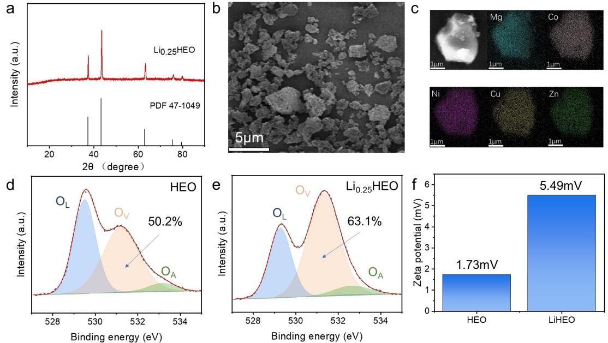
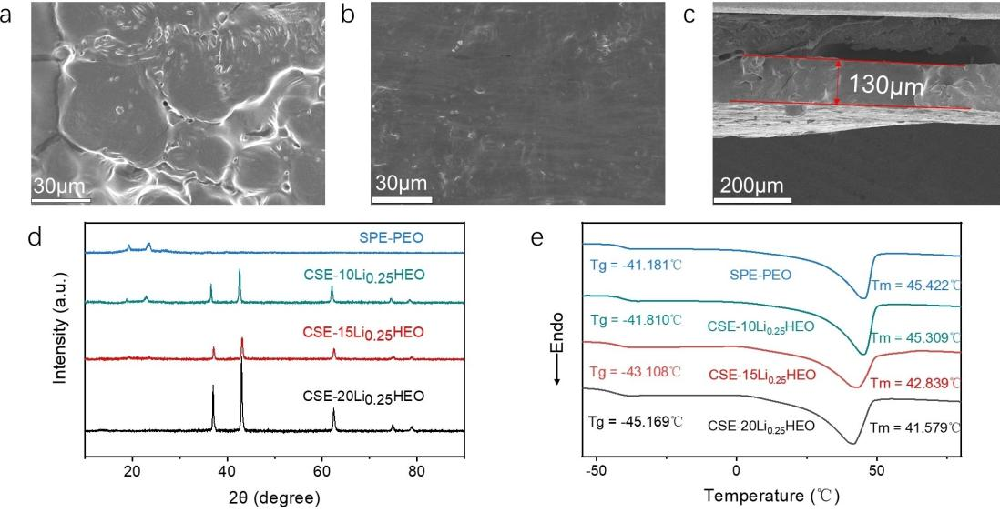
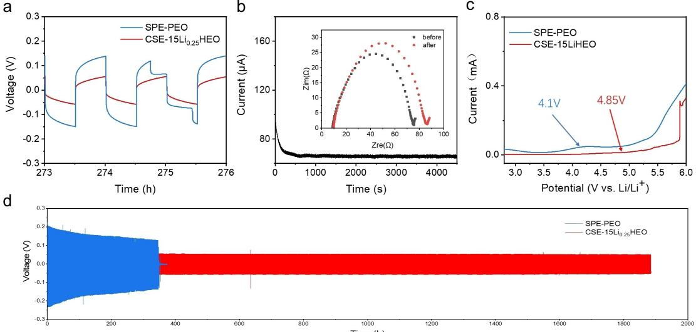
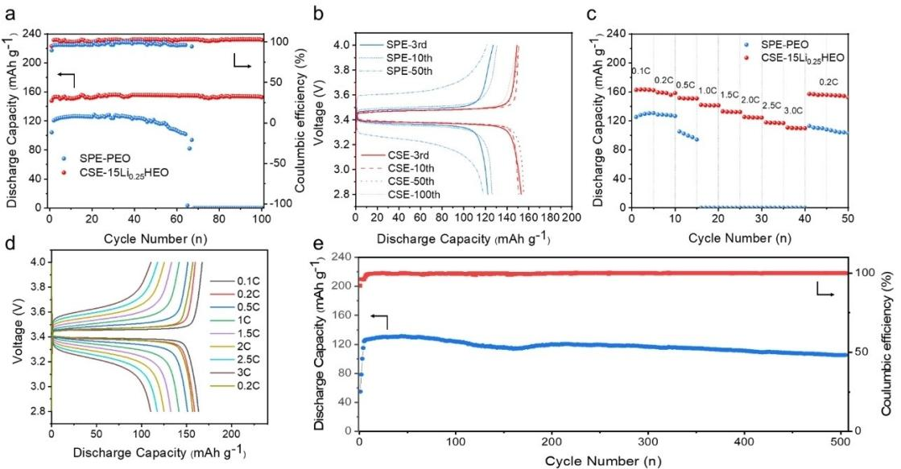

# **Poly(ethylene oxide)-Based Composite Electrolyte with Lithium-Doped High-Entropy Oxide Ceramic Enabled Robust Solid-State Lithium-Metal Batteries**

Weijie Liu,[a] Jianbo Jiang,[b] Zhihao Yang,[a] Yang Liu,[a] Zhengfei Yang,[a] Manman Bu,[a] Shuangxiong Liao,[a] Weiying Wu,[a] Tieqi Huang,[a] Shangbin Sang,[a] and [Hongtao](http://orcid.org/0000-0002-1459-778X) Liu\*[a]

**Abstract:** Solid polymer electrolytes using poly(ethylene oxide) (PEO) as matrix are mostly applied due to the superior Li+ transfer ability of oxyethyl chain. However, the high crystallinity, low oxidation potential window, and insufficient mechanical strength hinder PEO deployment in solid-state batteries. Here, a novel composite solid electrolyte combined PEO with a lithium-doped high-entropy oxide (Li0.25HEO) ceramic powder is presented, which exhibits excellent properties for solid-state lithium metal battery applications. On one hand, the rich oxygen vacancies of Li0.25HEO surface are favorable to capturing anionic groups (e.g. TFSI ),

## **Introduction**

Lithium metal has an extra high theoretical specific capacity (3860 mAhg 1 ) and the lowest standard electrode potential ( 3.04 V), which makes lithium mental batteries (LMBs) one of the most promising next-generation high-energy-density electrochemical energy storage devices.[1–4] As the key material of LMBs, the electrolyte to a large extent affects the macroscopic electrochemical performance of the battery, such as energy density, service life, safety, charge-discharge performance and so on.[5–8] However, the metallic Li anode readily reacts with commercial liquid organic electrolytes to form an unstable solid electrolyte interphase (SEI) layer, which decreases the service life of the batteries.[9,10] Solid-state lithium metal batteries (SSLMBs) use Li+-conducting solid-state electrolytes (SSEs) to replace conventional liquid electrolytes, which can largely suppress undesirable interface reactions and improve cyclic stability and battery safety. Besides acceptable Li+ conductivity, good SSEs can inhibit the growth of lithium dendrites and are compatible with high-voltage cathodes.[11–14] Solid polymer electrolytes (SPEs) as a representative of SSEs show substantial

[b] *Prof. J. Jiang*

reinforcing the Li+ dissociation. On the other hand, Li0.25HEO with abundant Lewis acid sites markedly promotes the PEO oxidation potential window. Additionally, the incorporation of Li0.25HEO ceramic powder can effectively inhibit the PEO crystallization and enhance the mechanic strength of the composite electrolyte as well. The assembled solid-state lithium metal battery based on the composite solid electrolyte exhibits high rate capacity and durable cycle performance, showing potential development and application prospects.

advantages in the application of ASSLMBs because of their facile fabrication, low cost, and superior compatibility with electrodes.[15–18]

PEO is the most commonly used matrix in SPEs.[19–21] However, PEO is easy to crystallize, which limits the chain swing, resulting in poor ionic conductivity at room temperature (10 6~ 10 8 S cm 1 ). Further, it has a narrow electrochemical window and is unable to couple with high-voltage cathodes.[22–24] It was found that some inert inorganic fillers (e.g. SiO2, Al2O3) could not only improve the mechanical strength of PEO-based composite solid electrolytes (CSEs), but also restrain the PEO crystallization and enhance the ionic conductivity of CSEs.[25,26] Recently, several fast Li+ conductors such as LATP, LLZTO, LLTO, etc. have been used as active fillers to incorporate into polymer matrices, which could further promote the ionic conductivity of CSEs.[27–29] For example, Erqing et al.[30] prepared a CPE by doping nano LATP into the PEO matrix, which exhibited a high ionic conductivity of 5.24×10 4 S cm 1 at 55°C. The assembled Lij j LiFePO4 cell with the CPE could deliver a discharge capacity of 151.69 mAhg 1 at 0.5 C. Nevertheless, the solid-state cell presented a capacity decay of ~14% during 100 cycles, attributable to the negative effect of movable anions. In fact, the fillers stated above could not validly inhibit anionic migration under the electrical field, consequently, inducing an unceasing accumulation of counter anions at the electrolyte/ electrode interface, resulting in interfacial instability. Lately, Wang et al.[31] found that flyash could serve as an efficient filler for the PEO-based CPE because its rich surface oxygen vacancies were capable of fixing free anions. This alleviated the interface deterioration caused by irreversible oxidative decomposition of anions accumulating on the cathode surface. Since flyash is an inert filler, it is possible to design a novel active filler

[a] *W. Liu, Z. Yang, Y. Liu, Z. Yang, M. Bu, S. Liao, W. Wu, Dr. T. Huang, Prof. S. Sang, Prof. H. Liu Hunan Provincial Key Laboratory of Chemical Power Sources, College of Chemistry and Chemical Engineering, Central South University, Changsha 410083 (P. R. China) E-mail: liuht@csu.edu.cn*

*College of Chemistry and Chemical Engineering, Jishou University, Xiangxi Tujia and Miao Autonomous Prefecture, Jishou 416000 (P. R. China)*

*Supporting information for this article is available on the WWW under <https://doi.org/10.1002/asia.202200839>*

*This manuscript is part of a special collection on Gel Electrolytes: Chemistry and Applications.*

with rich surface oxygen vacancies to further improve the property of the PEO-based CSEs.

The concept of high entropy oxides (HEO) comes from high entropy alloys. At the earliest, Rost et al.[32] discovered the possibility of incorporating five different cations in equiatomic ratios into a single-phase oxide system. Single-phase HEO contains multiple cations components, whose properties can be easily tailored by modifying cation species. B'erardan et al.[33] attempted to dope Li in HEO and obtained a room temperature superionic Lix(MgCoNiCuZn)1-xO conductor. It was observed when x was 0.3, the conductor Li0.3HEO contained plentiful surface oxygen vacancies, which created efficient Li-ion transport pathways. Benefiting from this, the Li0.3HEO showed a high ion conductivity of 10 3 S cm 1 . Nicolas et al.[34] further investigated the LixHEO and found the generated oxygen vacancies were used for the charge compensation as the molar fraction of Li was over 0.21. Inspired by the flexible properties of LixHEO facilitating the Li+ conduction, it is expected that LixHEO embedded in the PEO matrix would greatly promote the electrochemical performance of the PEO-based CSE.

In this contribution, we prepared a partially Li-doping HEO (Li0.25HEO) as the filler for the PEO-based CSE. The structural and electrochemical properties were fully characterized. The ratio of Li0.25HEO in the CSE was optimized and found the CSE-15Li0.25HEO (15 wt%) sample showed a high conductivity of 1.1×10 3 S cm 1 (at 60°C) and an extended oxidation potential window over 4.85 V (vs Li). Both the assembled symmetrical Lij j Li and the asymmetrical Lij j LiFePO4 cells using the CSE-15Li0.25HEO electrolyte exhibited superior electrochemical performance. Based on these findings, the proposed CSE composed of PEO and Li-HEO shows great potential in solid-state lithium metal battery applications.

## **Results and Discussion**

The crystal structure of the prepared Li0.25HEO was studied by XRD. As shown in Figure 1a, the diffraction peaks at 37.5°, 43.5°, 63.2°, 75.7° and 79.7° are corresponding to the (111), (200), (220), (310) and (222) planes, consistent with the standard card (PDF#47-1049).[35] The sample presents a rock salt structure and belongs to the Fm-3m space group. There is no impurity peak in the XRD pattern, implying the high purity. It is noted that the diffraction peaks of the Li0.25HEO sample have a small shift toward high angle, which can be ascribed to the Li doping. As the univalent Li+ cations partially replace the divalent cations of the HEO crystal, the lattice cell parameters will become smaller and extra positive charge compensation (i. e. oxygen vacancy) tends to occur.[36,37]

The microscopic morphology of the Li0.25HEO sample was characterized by SEM. In Figure 1b, the sample presents irregular submicron aggregates, and the particle sizes range from 500 nm to 5 μm. The elemental distribution of Mg, Co, Ni, Cu and Zn was imaged by EDS mapping. As shown in Figure 1c, the five transition metal elements are uniformly distributed without visible element separation. The ICP spectrometry was applied to check the contents of the metal elements in the Li0.25HEO sample. The result was listed in Table S1. The molar percent content of Li is ~25% and each of other metal elements has a ~15% composition contribution. This actually confirms the Li0.25HEO sample with Li0.25Mg0.15Co0.15Ni0.15Cu0.15Zn0.15O1-x configurations. It should be mentioned that the charge imbalance caused by Li doping is compensated through generation of oxygen vacancies.[38] All composited elements could also be identified by XPS spectra shown in Figure S1. To verify surface oxygen vacancies of the high-entropy oxides, the O1s XPS spectra of HEO (Figure 1d) and Li0.25HEO (Figure 1e)

**Figure 1.** (a) XRD, (b) SEM, and (c) elemental mapping of the Li0.25HEO sample. O1s XPS spectra of (d) HEO and (e) Li0.25HEO. (f) Zeta potential compare of HEO and Li0.25HEO.

*Chem Asian J.* **2022**, *17*, e202200839 (2 of 7) © 2022 Wiley-VCH GmbH

were analyzed. The three peaks located at 529.28 eV, 531.31 eV, and 532.65 eV were assigned to lattice oxygen (OL), vacancy oxygen (OV), and adsorbed water (OA), respectively.[39,40] Obviously, both HEO and Li0.25HEO contain a high proportion of surface oxygen vacancies, exceeding 50% of the total oxygen amount, and the OV content of Li0.25HEO even reaches 63.1%. This confirms that rational Li doping can efficiently increase surface oxygen vacancies of divalent metal-based high-entropy oxide. From Zeta potential measurements shown in Figure 1f, both samples show positive surface charge, verifying existence of oxygen vacancies. The Zeta potential of Li0.25HEO reaches 5.49 eV, implying high-centration surface positive charge, advantageous to the attraction of negatively charged anions and facilitating the dissociation of lithium salts.

Both PEO-based SPE without high-entropy oxide (SPE-PEO) and PEO-base CSE with Li0.25HEO (CSE-Li0.25HEO) were fabricated into films by casting method. Compared to the SPE-PEO film (Figure 2a), the CSE-Li0.25HEO film (Figure 2b) presents a smoother surface, implying good compatibility of Li0.25HEO with PEO. The thickness of the CSE-Li0.25HEO film is 130 μm (Figure 2c) and Li0.25HEO is uniformly distributed in the PEO matrix (Figure S2), which support the CSE-Li0.25HEO film required mechanical strength and consistent properties.

Figure 2d shows the XRD patterns of CSEs with different Li0.25HEO contents. The peaks at 19.4° and 23.5° are the characteristic diffractions of PEO, corresponding to (120) and (112) crystalline planes, respectively.[41] The intensities of the PEO peaks were significantly decreased with the increase of the Li0.25HEO contents, indicative of reduced crystallinity. By fitting the XRD patterns, the crystallinity of the electrolyte films can be estimated. As shown in Figure S3, a 50% crystallinity for SPE-PEO has decreased to 27% for CSE-10Li0.25HEO. The lowering PEO crystallinity is supposed to improve the Li+ transference in the CSE.

DSC curves shown in Figure 2e reveal the effects of Li0.25HEO amount on glass transition temperature (Tg) and melting point (Tm). It is clear that both Tg and Tm tend to shift towards the low temperature direction as the content of Li0.25HEO increases. This implies that Li0.25HEO can substantially reinforce the motility of PEO chains and enable efficient Li+ transference in broader temperature ranges.

The ionic conductivities of CSEs were measured by EIS. Shown in Figure 3a, all CSEs with Li0.25HEO doping illustrate higher conductivities than the SPE-PEO without Li0.25HEO, and CSE-15Li0.25HEO exhibits the best conductive capability. A noteworthy observation is that the conductivity of CSE-20Li0.25HEO is lower than that of CSE-15Li0.25HEO when the temperature is higher than Tm. This can be accounted for the agglomeration of Li0.25HEO particles at the Li0.25HEO/PEO interface, to some extent impeding the Li+ percolation. From the Nyquist plots shown in Figure 3b, the bulk impedance of CSE-15Li0.25HEO from 30°C to 60°C could be obtained from the intersection to the x-axis. Further the ionic conductivities were computed according to Eq. (1) depicted in Experimental Section. CSE-15Li0.25HEO presents satisfactory ionic conductivity of 8.9×10 5 S cm 1 at 30°C and 1.1×10 3 S cm 1 at 60°C. Interestingly, the relationships of ionic conductivity and temperature are distinct with Tm temperature as the critical point. As shown in Figure 3c. the ionic conductivity complies with the Arrhenius formula when the temperature is lower than Tm. The corresponding activation energies (Ea) calculated are 0.53 eV for SPE-PEO and 0.43 eV for CSE-15Li0.25HEO, respectively. The Ea values above Tm can be calculated according to Volgel-Tamman-Fulcher (VTF) equation[42,43], 0.15 eV for SPE-PEO and 0.14 eV for CSE-15Li0.25HEO, respectively. Considering the active chain swing capability and fast ionic diffusion above Tm, the apparent Ea reduction is verified.

High-entropy oxide materials with rock-salt structure usually have a high dielectric constant[44,45] that is advantageous to the

**Figure 2.** SEM images of (a) SPE-PEO (surface), (b) CSE-15Li0.25HEO (surface), and (c) CSE-15Li0.25HEO (cross-section). (d) XRD patterns of CSEs with different Li0.25HEO contents. (e) DSC curves of CSEs with different Li0.25HEO contents at temperatures varied from 55 to 80°C.

**Figure 3.** (a) EIS of CSEs with different Li0.25HEO contents. (b) Nyquist plots of CSE-15Li0.25HEO at different temperatures. (c) Relationship between conductivity and temperature of SPE-PEO (blue) and CSE-15Li0.25HEO (red). (d) Raman spectra of SPE-PEO (upper) and CSE-15Li0.25HEO (bottom). (e) Schematic diagram of the SSB and interaction between Li0.25HEO and LiTSFI.

dissociation of Li-salt and the increase of free Li+ concentration. Besides, Li0.25HEO with more surface oxygen vacancies reinforces the interaction with TFSI anions via electrostatic attraction, which further promotes the dissociation of Li-salts. Raman spectrum is highly sensitive to distinguish TFSI anion from LiTFSI entity in the polymer matrix.[46,47] As demonstrated in Figure 3d, the peak at 740 cm 1 is assigned to free TFSI anion and the peak at a higher wavenumber (e.g.745 cm 1 ) can be ascribed to coordinated LiTFSI.[46] By fitting the Raman spectra of SPE-PEO and CSE-15Li0.25HEO, one can see that about 85% LiTFSI salts were dissociated in the SPE-PEO electrolyte; however, the free TFSI anions even reached 91.5% of total LiTFSI salts in the CSE-15Li0.25HEO electrolyte. The Raman outcomes further confirmed the great contribution of Li0.25HEO to the lithium salt dissociation.

Lij j Li symmetrical cells were assembled to detect Li/SSE interface stability and Li-ion transference number. The typic lithium stripping/plating curves at 0.05 mAcm 2 at 45°C are shown in Figure 4a. The symmetrical cell using the CSE-15Li0.25HEO electrolyte presents a smaller polarization, hinting a better ionic transport capability. The Li+ transference number (tLi+) can be computed according to Eq. (2) in the Experimental

**Figure 4.** (a) Typic lithium stripping/plating curves performed on Lij Li symmetrical cells at 0.05 mAcm 2 at 45°C. (b) DC polarization curve (inset are EIS plots before and after the polarization experiment) of the Lij Li symmetrical cell using CSE-15Li0.25HEO at 10 mV. (c) LSV curves of Lij SS cells swept from 2.8 V to 6.0 V. (d) Long-term cycles of Lij Li symmetrical cells at current density of 50 μA cm 2 at 45°C.

**Research Article**

Section in combination with DC polarization curves and EIS plots before and after the polarization (Figure 4b and Figure S4). The measured data and computed results are listed in Table S2. The tLi+ of CSE-15Li0.25HEO is 0.41, significantly higher than that of SPE-PEO (0.18). The high tLi+ infers to efficient Li+ deposition, beneficial to forming stable electrolyte/electrode interfaces [31]. In fact, the improved tLi+ can be attributed to Li0.25HEO with abundant surface oxygen vacancies enhancing the adsorption of TFSI anions. LSV was conducted to measure electrochemical stability windows of SSEs based on Lij j SS cells.[48–52] During the oxidation process from 2.8 V to 6.0 V, the first apparent current increment for the cell occurred at 4.10 V with the SPE-PEO electrolyte while at 4.85 V using the CSE-Li0.25HEO electrolyte, indicating that CSE-Li0.25HEO possessed a higher electrochemical oxidation window, matchable to high-voltage cathodes. Compared to SPE-PEO, the Lewis acid-base interactions between metal sites of Li0.25HEO and EO segments of PEO can improve the electronic transfer capability of the polymer chain, thus alleviating the polarization and enhancing the antioxidation performance. The Lij Li symmetrical cell using CSE-15Li0.25HEO also shows excellent cycling stability. It is observed in Figure 4d that the cell using SPE-PEO suffers a fatal short circuit after 350 h of operation, while the cell using CSE-15Li0.25HEO is capable of cycling for 1900 h without any short circuit. It is supposed that the short circuit is commonly caused by continuous growth of dendritic lithium that depends more on critical current density (CCD). When the applied current density is higher than the CCD, there will raise uneven lithium plating, which tends to further develop into lithium dendrites. The symmetrical cell using SPE-PEO presented a CCD of 0.25 mAcm 2 (Figure S5a), while using CSE-15Li0.25HEO could run normally even at 0.40 mAcm 2 (Figure S5b), demonstrating superior lithium dendrite resistance of CSE-15Li0.25HEO.

The solid-state Lij LiFePO4 cells using both SPE-PEO and CSE-15Li0.25HEO electrolytes were assembled and tested. As illustrated in Figure 5a, the cell based on CSE-15Li0.25HEO exhibited a maximum discharge capacity of 155 mAhg 1 with average coulomb efficiency exceeded 99.5% during 100 cycles at 0.2 C. But the cell using SPE-PEO could only deliver a discharge capacity less than 130 mAhg 1 , and occurred a short circuit at the 66th cycle. From the charge/discharge curves shown in Figure 5b, it is seen that the voltage gap between charge flat and discharge flat for the CSE-15Li0.25HEO-based cell remains consistent while that for the cell using SPE-PEO presents an incessantly increase trend upon cycling. This indicates that the electrode/electrolyte interfaces are durable and steady in the CSE-15Li0.25HEO-based Lij LiFePO4 cell, reflecting its interfacial enhancement effect of Li0.25HEO. Figure 5c shows the rate performance of the Lij LiFePO4 cells using SPE-PEO and CSE-15Li0.25HEO, respectively. The capacity of the Lij LiFePO4 cell using SPE-PEO is ~130 mAhg 1 at the low current density (i.e 0.1 C and 0.2 C), and suddenly decreases to ~100 mAhg 1 at 0.5 C and then fails to cycle at the current density higher than 1 C. However, the cell can recover its cycling when using a small current (e.g. 0.2 C). These outcomes imply that SPE-PEO is only suitable for the low-rate cell. As for the Lij LiFePO4 cell with CSE-15Li0.25HEO electrolyte, the discharge capacity is 163.2, 159.2, 151.5, 142.1, 133.0, 125.4, 117.8 and 110.7 mAhg 1 at 0.1, 0.2, 0.5, 1.0, 1.5, 2.0, 2.5 and 3 C, respectively. The cell exhibits superior high-rate performance, which is relevant to the small polarization increment (Figure 5d). The Lij LiFePO4 cell using CSE-15Li0.25HEO was performed long-term cycles with 2 C shown in Figure 5e. The cell could discharge a maximum capacity of 133.4 mAhg 1 and had a capacity retention of 80.3% during 500 cycles.

**Figure 5.** (a) Cycling performance at 0.2 C, (b) charge/discharge curves at 0.2 C, and (c) rate performance of the Lij LiFePO4 cell using either SPE-PEO or CSE-15Li0.25HEO electrolyte. (d) Charge/discharge curves at various rates and (e) cycle performance at 2 C of the Lij LiFePO4 cell using CSE-15Li0.25HEO.

## **Conclusion**

Li-doped high entropy oxides have been successfully synthesized and are incorporated into PEO matrix for solid-state lithium metal battery applications. The Li0.25HEO sample with 63.1% surface oxygen vacancies is highly compatible with PEO and LiTFSI. The optimal CSE-15Li0.25HEO electrolyte shows a high conductivity of 1.1×10 3 S cm 1 (at 60°C) with tLi+ 0.41 and an extended oxidation potential window over 4.85 V (vs Li). The rich oxygen vacancies enhance the interaction between Li0.25HEO and TFSI anion, thus promoting the Li+ dissociation. Meantime, Li0.25HEO can efficiently reduce the PEO crystallization, improving the Li+ transfer capability. The Lij Li symmetrical cell exhibit excellent cycling stability without any short circuit, confirming the immunity of Li0.25HEO to lithium dendrites. The Lij LiFePO4 cell using CSE-15Li0.25HEO electrolyte can release a 2 C-rate capacity of 133.4 mAhg 1 and have the capacity retention of 80.3% during 500 cycles, showing outstanding rate performance. Based on the findings above, the novel CSE composed of PEO and Li-doped HEO is expected to be developed for advanced solid-state lithium metal battery applications.

## **Experimental Section**

### **Materials preparation**

Preparation of Li0.25HEO powder: Li0.25HEO was prepared by conventional solid phase synthesis method. 30 mmol MgO (Aladdin, 99.9%), 10 mmol Co3O4 (Aladdin, 99.9%), 30 mmol NiO (Aladdin, 99.9%), 30 mmol CuO (Aladdin, 99.9%), 30 mmol ZnO (Aladdin,99.9%), and 27 mmol Li2CO3 (Aladdin,99.9%) were mixed in 50 ml ethanol, and an extra 10% Li2CO3 were also added to compensate possible Li loss during the thermal treatment process. After being ground with a planetary ball mill at a rate of 400 r.p.m. for 6 h, the mixture was dried in an oven at 60°C for 12 h, followed by sintering in a tubular furnace at 950°C for 12 h. The collected solids were ground into fine powder for use.

Preparation of composite solid electrolytes: The composite solid electrolytes were prepared by solution casting. Definitely, PEO powder (Mw=600000, Aladdin)and LiTFSI (purity�99.9 wt%, Macklin, [EO] / Li+ =16 in molar) were dissolved into an anhydrous acetonitrile (Aladdin) and stirred for 10 h. Then, the Li0.25HEO powder was dispersed into another anhydrous acetonitrile. The Li0.25HEO dispersion was slowly injected into the PEO solution under vigorous stirring. After 12 h's reaction, the dispersion was cast onto a polytetrafluoroethylene (PTFE) plate and transferred into a vacuum drying oven at 60°C for one night to remove acetonitrile. The formed electrolyte film was cut into disks with a diameter of 16 mm and stored in the argon-filled glove box (H2O *<*0.1 ppm and O2 *<*0.1 ppm) for later use.

## **Physical characterizations**

The microscopic morphologies of materials were observed by scanning electron microscopy (SEM, JSM-7610FPlus) with an accelerating voltage between 8 and 15 kV. The elemental compositions were investigated by Inductively Coupled Plasma Optical Emission Spectrometer (ICP-OES, PerkinElmer Avio500). The crystalline structures of materials were analyzed by X-ray diffraction (XRD, D/ruax2550PC, Japan) using Cu Kα (λ=1.5418 Å) with 2θ angle varied from 10° to 90° at the scan rate of 5° min 1 . Chemical states of elements were studied by X-ray photoelectron spectroscopy (XPS, Thermo Scientific K-Alpha+, USA) with a monochromatic Al Kα X-ray source (energy 1486.68 eV). The dissociation of Li salts was analyzed via Raman spectra (inVia Reflex, Renishaw) with a 532 nm laser wavelength and 0.5% strength. The thermal properties of materials were evaluated by thermogravimetric analyzer (TGA, METTLER TOLEDO/TGA2) and differential scanning calorimetry (DSC, NETZSCH STA 449 F3 Jupiter) with a heating rate of 5°C/min under nitrogen flow.

#### **Electrochemical measurements**

The CR2025 coin-type cells were assembled in the glove box filled with argon. Before electrochemical tests, the cells were placed in a 60°C thermotank for 12 h. The electrochemical measurements were conducted on the DH-7000 electrochemical workstation (DongHua Analytical, China).

Electrochemical impedance spectroscopy (EIS) was obtained with 10 mV amplitude at the frequency range from 1 MHz to 0.1 Hz. The ionic conductivity(σ) was calculated according to the following equation (Eq. (1)):

$$
\sigma = \frac{L}{R \times 5} \tag{1}
$$

where *L* and *S* are the thickness and the cross-section area of the electrolyte film, *R* is the bulk resistance extracted from the EIS plots.

The electrochemical oxidation windows of electrolytes were measured via linear sweep voltammogram (LSV) using Lij j Stainless Steel (SS) CR2025 coin-type cells at 60°C with the scan rate of 10 mVs 1 .

Li+ transference number (tLi +) was obtained by means of AC impedance and DC polarization techniques using the Lij j Li symmetric CR2025 coin-type cell. The tLi + was calculated according to the equation (Eq. (2)):

$$
t_{L^{j+}} = \frac{I_5(\Delta V - I_0 R_0)}{I_0(\Delta V - I_5 R_5)}
$$
(2)

Where Δ*V* is the DC polarization voltage (10 mV), *I*0 and *IS* are initial and steady current, respectively. *R*0 and *RS* represent the corresponding interfacial resistance before and after DC polarization.

The Lij j Li symmetric CR2025 coin-type cells were tested at the current densities varied from 50 to 300 μA cm 2 at 45°C. The Lij j LiFePO4 (LFP) CR2025 coin-type cells were cycled between 2.8 and 4 V at 45°C. The cathode was composed of LFP, polyvinylidene fluoride (PVDF) binder and super P with the weight ratio of 8:1:1. The anode is a metal lithium wafer with the diameter of 15.6 mm and the thickness of 0.4 mm.

## *Acknowledgements*

*This work was financially supported by the National Key R&D Program of China (No. 2019YFA0210300), the National Natural Science Foundation of China (No. 52174284, 21905133), and the Hunan Provincial Natural Science Foundation of China (No. 2019JJ40359).*

## *Conflict of Interest*

*The authors declare no conflict of interest.*

# **Data Availability Statement**

The data that support the findings of this study are available from the corresponding author upon reasonable request.

**Keywords:** composite solid electrolyte **·** high-entropy oxide **·** oxygen vacancy **·** poly(ethylene oxide) **·** lithium metal battery

- [1] Y. Li, Y. Li, A. Pei, K. Yan, Y. Sun, C.-L. Wu, L.-M. Joubert, R. Chin, A. L. Koh, Y. Yu, J. Perrino, B. Butz, S. Chu, Y. Cui, *Science* **2017**, *358*, [506–510.](https://doi.org/10.1126/science.aam6014)
- [2] J. Liu, Z. Bao, Y. Cui, E. J. Dufek, J. B. Goodenough, P. Khalifah, Q. Li, B. Y. Liaw, P. Liu, A. Manthiram, Y. S. Meng, V. R. Subramanian, M. F. Toney, V. V. Viswanathan, M. S. Whittingham, J. Xiao, W. Xu, J. Yang, X.-Q. Yang, J.-G. Zhang, *Nat. Energy* **2019**, *4*, [180–186](https://doi.org/10.1038/s41560-019-0338-x).
- [3] D. Lin, Y. Liu, Y. Cui, *Nat. [Nanotechnol.](https://doi.org/10.1038/nnano.2017.16)* **2017**, *12*, 194–206.
- [4] J. M. Tarascon, M. Armand, *Nature* **2001**, *414*, [359–367](https://doi.org/10.1038/35104644).
- [5] G. Qiu, C. Sun, *New J. Chem.* **2020**, *44*, [1817–1824](https://doi.org/10.1039/C9NJ04897A).
- 
- [6] Z. Yang, H. Yuan, C. Zhou, Y. Wu, W. Tang, S. Sang, H. Liu, *[Chem.](https://doi.org/10.1016/j.cej.2019.123650) Eng. J.* **2020**, *392*, [123650.](https://doi.org/10.1016/j.cej.2019.123650)
- [7] Z. Zhang, Y. Huang, J. Yan, C. Li, X. Chen, Y. Zhu, *Appl. Surf. Sci.* **[2019](https://doi.org/10.1016/j.apsusc.2018.12.161)**, *473*, [266–274.](https://doi.org/10.1016/j.apsusc.2018.12.161)
- [8] C. Chen, Y. Huang, Z. Meng, Z. Xu, P. Liu, T. Li, *J. [Energy](https://doi.org/10.1016/j.jechem.2020.06.025) Chem.* **2021**, *54*, [482–492](https://doi.org/10.1016/j.jechem.2020.06.025).
- [9] J. B. Goodenough, K.-S. Park, *J. Am. Chem. Soc.* **2013**, *135*,1167–1176.
- [10] A. Manthiram, X. Yu, S. Wang, *Nat. Rev. Mater.* **2017**, *2*, 16103.
- [11] J. Maier, *Angew. Chem. Int. Ed.* **2013**, *52*, [4998–5026](https://doi.org/10.1002/anie.201205569); *[Angew.](https://doi.org/10.1002/ange.201205569) Chem.* **2013**, *125*, [5100–5131](https://doi.org/10.1002/ange.201205569).
- [12] J. B. Goodenough, K.-S. Park, *J. Am. Chem. Soc.* **2013**, *135*, [1167–1176](https://doi.org/10.1021/ja3091438).
- [13] N. Kamaya, K. Homma, Y. Yamakawa, M. Hirayama, R. Kanno, M. Yonemura, T. Kamiyama, Y. Kato, S. Hama, K. Kawamoto, A. Mitsui, *[Nat.](https://doi.org/10.1038/nmat3066) Mater.* **2011**, *10*, [682–686](https://doi.org/10.1038/nmat3066).
- [14] M. Armand, J.-M. Tarascon, *Nature* **2008**, *451*, [652–657.](https://doi.org/10.1038/451652a)
- [15] H. Yuan, J. Luan, Z. Yang, J. Zhang, Y. Wu, Z. Lu, H. Liu, *ACS Appl. [Mater.](https://doi.org/10.1021/acsami.9b20436) Interfaces* **2020**, *12*, [7249–7256.](https://doi.org/10.1021/acsami.9b20436)
- [16] J. C. Bachman, S. Muy, A. Grimaud, H.-H. Chang, N. Pour, S. F. Lux, O. Paschos, F. Maglia, S. Lupart, P. Lamp, L. Giordano, Y. Shao-Horn, *[Chem.](https://doi.org/10.1021/acs.chemrev.5b00563) Rev.* **2016**, *116*, [140–162.](https://doi.org/10.1021/acs.chemrev.5b00563)
- [17] S. Li, S.-Q. Zhang, L. Shen, Q. Liu, J.-B. Ma, W. Lv, Y.-B. He, Q.-H. Yang, *Adv. Sci.* **2020**, *7*, [1903088.](https://doi.org/10.1002/advs.201903088)
- [18] J. Lopez, D. G. Mackanic, Y. Cui, Z. Bao, *Nat. Rev. [Mater.](https://doi.org/10.1038/s41578-019-0103-6)* **2019**, *4*, 312– [330](https://doi.org/10.1038/s41578-019-0103-6).
- [19] X. Wang, H. Zhai, B. Qie, Q. Cheng, A. Li, J. Borovilas, B. Xu, C. shi, T. Jin, X. Liao, Y. Li, X. He, S. Du, Y. Fu, M. Dontigny, K. Zaghib, Y. Yang, *[Nano](https://doi.org/10.1016/j.nanoen.2019.03.051) Energy* **2019**, *60*, [205–212.](https://doi.org/10.1016/j.nanoen.2019.03.051)
- [20] K. Liu, R. Zhang, J. Sun, M. Wu, T. Zhao, *ACS Appl. Mater. [Interfaces](https://doi.org/10.1021/acsami.9b16936)* **2019**, *11*, [46930–46937.](https://doi.org/10.1021/acsami.9b16936)
- [21] Z. Xue, D. He, X. Xie, *J. Mater. Chem. A* **2015**, *3*, [19218–19253.](https://doi.org/10.1039/C5TA03471J)
- [22] F. Capuano, F. Croce, B. Scrosati, *J. [Electrochem.](https://doi.org/10.1149/1.2085900) Soc.* **1991**, *138*, 1918– [1922.](https://doi.org/10.1149/1.2085900)
- [23] S. Liu, N. Imanishi, T. Zhang, A. Hirano, Y. Takeda, O. Yamamoto, J. Yang, *J. [Electrochem.](https://doi.org/10.1149/1.3473790) Soc.* **2010**, *157*, A1092.
- [24] M. Rosso, C. Brissot, A. Teyssot, M. Dollé, L. Sannier, J.-M. Tarascon, R. Bouchet, S. Lascaud, *[Electrochim.](https://doi.org/10.1016/j.electacta.2006.02.004) Acta* **2006**, *51*, 5334–5340.

- [25] D. Lin, W. Liu, Y. Liu, H. R. Lee, P.-C. Hsu, K. Liu, Y. Cui, *[Nano](https://doi.org/10.1021/acs.nanolett.5b04117) Lett.* **2016**, *16*, [459–465](https://doi.org/10.1021/acs.nanolett.5b04117).
- [26] H. M. J. C. Pitawala, M. A. K. L. Dissanayake, V. A. Seneviratne, *Solid [State](https://doi.org/10.1016/j.ssi.2007.04.008) Ionics* **2007**, *178*, [885–888.](https://doi.org/10.1016/j.ssi.2007.04.008)
- [27] Z. Yao, K. Zhu, X. Li, J. Zhang, J. Li, J. Wang, K. Yan, J. Liu, *ACS [Appl.](https://doi.org/10.1021/acsami.0c22532) Mater. Interfaces* **2021**, *13*, [11958–11967](https://doi.org/10.1021/acsami.0c22532).
- [28] Z. Huang, W. Pang, P. Liang, Z. Jin, N. Grundish, Y. Li, C.-A. Wang, *[J.](https://doi.org/10.1039/C9TA03395E) Mater. Chem. A* **2019**, *7*, [16425–16436.](https://doi.org/10.1039/C9TA03395E)
- [29] C. R. M. Pila, E. P. Cappe, N. D. S. Mohallem, O. L. Alves, M. A. A. Frutis, N. Sánchez-Ramírez, R. M. Torresi, H. L. Ramírez, Y. M. Laffita, *Solid State Sci.* **2019**, *88*, 41–47.
- [30] E. Zhao, Y. Guo, Y. Xin, G. Xu, X. Guo, *Int. J. [Energy](https://doi.org/10.1002/er.6278) Res.* **2021**, *45*, 6876– [6887.](https://doi.org/10.1002/er.6278)
- [31] X. Wang, C. Fu, Z. Feng, H. Huo, X. Yin, G. Gao, G. Yin, L. Ci, Y. Tong, Z. Jiang, J. Wang, *Chem. Eng. J.* **2022**, *428*, [131041.](https://doi.org/10.1016/j.cej.2021.131041)
- [32] C. M. Rost, E. Sachet, T. Borman, A. Moballegh, E. C. Dickey, D. Hou, J. L. Jones, S. Curtarolo, J.-P. Maria, *Nat. Commun.* **2015**, *6*, 8485.
- [33] D. Bérardan, S. Franger, A. K. Meena, N. Dragoe, *J. [Mater.](https://doi.org/10.1039/C6TA03249D) Chem. A* **2016**, *4*, [9536–9541](https://doi.org/10.1039/C6TA03249D).
- [34] N. Osenciat, D. Bérardan, D. Dragoe, B. Léridon, S. Holé, A. K. Meena, S. Franger, N. Dragoe, *J. Am. Ceram. Soc.* **2019**, *102*, [6156–6162](https://doi.org/10.1111/jace.16511).
- [35] J. Wei, K. Rong, X. Li, Y. Wang, Z. Qiao, Y. Fang, S. Dong, *[Nano](https://doi.org/10.1007/s12274-021-3860-7) Res.* **2022**, *15*, [2756–2763.](https://doi.org/10.1007/s12274-021-3860-7)
- [36] J. Wang, D. Stenzel, R. Azmi, S. Najib, K. Wang, J. Jeong, A. Sarkar, Q. Wang, P. A. Sukkurji, T. Bergfeldt, M. Botros, J. Maibach, H. Hahn, T. Brezesinski, B. Breitung, *Electrochemistry* **2020**, *1*, 60–74.
- [37] D. Bérardan, S. Franger, A. K. Meena, N. Dragoe, *J. [Mater.](https://doi.org/10.1039/C6TA03249D) Chem. A* **2016**, *4*, [9536–9541](https://doi.org/10.1039/C6TA03249D).
- [38] N. Osenciat, D. Bérardan, D. Dragoe, B. Léridon, S. Holé, A. K. Meena, S. Franger, N. Dragoe, *J. Am. Ceram. Soc.* **2019**, *102*, [6156–6162](https://doi.org/10.1111/jace.16511).
- [39] K. Jirátová, J. Mikulová, J. Klempa, T. Grygar, Z. Bastl, F. Kovanda, *[Appl.](https://doi.org/10.1016/j.apcata.2009.04.004) Catal. A* **2009**, *361*, [106–116.](https://doi.org/10.1016/j.apcata.2009.04.004)
- [40] Y. Wang, L. Chen, H. Gao, Z. Chi, C. Chen, X. Duan, Y. Xie, F. Qi, W. Song, J. Liu, S. Wang, *Appl. Catal. B* **2019**, *245*, [546–554](https://doi.org/10.1016/j.apcatb.2019.01.025).
- [41] K. K. Kumar, M. Ravi, Y. Pavani, S. Bhavani, A. K. Sharma, V. V. R. N. Rao, *[J.](https://doi.org/10.1016/j.memsci.2013.12.022) Membr. Sci.* **2014**, *454*, [200–211.](https://doi.org/10.1016/j.memsci.2013.12.022)
- [42] N. A. Stolwijk, M. Wiencierz, C. Heddier, J. Kösters, *J. Phys. [Chem.](https://doi.org/10.1021/jp2111956) B* **2012**, *116*, [3065–3074.](https://doi.org/10.1021/jp2111956)
- [43] K. M. Diederichsen, H. G. Buss, B. D. McCloskey, *[Macromolecules](https://doi.org/10.1021/acs.macromol.7b00423)* **2017**, *50*, [3831–3840.](https://doi.org/10.1021/acs.macromol.7b00423)
- [44] D. Bérardan, S. Franger, D. Dragoe, A. K. Meena, N. Dragoe, *Phys. [Status](https://doi.org/10.1002/pssr.201600043) Solidi RRL* **2016**, *10*, [328–333.](https://doi.org/10.1002/pssr.201600043)
- [45] D. Bérardan, A. K. Meena, S. Franger, C. Herrero, N. Dragoe, *J. Alloys Compd.* **2017**, *704*, 693–700.
- [46] L. Edman, *J. Phys. Chem. B* **2000**, *104*, [7254–7258.](https://doi.org/10.1021/jp000082d)
- [47] D. Sharon, P. Bennington, M. A. Webb, C. Deng, J. J. de Pablo, S. N. Patel, P. F. Nealey, *J. Am. Chem. Soc.* **2021**, *143*, [3180–3190.](https://doi.org/10.1021/jacs.0c12538)
- [48] X. Fu, Y. Li, C. Liao, W. Gong, M. Yang, R. K. Y. Li, S. C. Tjong, Z. Lu, *[Compos.](https://doi.org/10.1016/j.compscitech.2019.107863) Sci. Technol.* **2019**, *184*, 107863.
- [49] R. Fan, C. Liu, K. He, S. H. Cheng, D. Chen, C. Liao, R. K. Y. Li, J. Tang, Z. Lu, *ACS Appl. Mater. Interfaces* **2020**, *12*, [7222–7231](https://doi.org/10.1021/acsami.9b20104).
- [50] Z. Sun, F. Lv, L. Cao, L. Liu, Y. Zhang, Z. Lu, *[Angew.](https://doi.org/10.1002/anie.201502228) Chem. Int. Ed.* **2015**, *54*, [7944–7948;](https://doi.org/10.1002/anie.201502228) *Angew. Chem.* **2015**, *127*, [8055–8059](https://doi.org/10.1002/ange.201502228).
- [51] W. Wen, Q. Zeng, P. Chen, Z. Li, Y. Liu, J. Guan, A. Chen, W. Liu, L. Zhang, *Nano Res.* **2022**, https://doi.org/10.1007/s12274-022-4523-z.
- [52] H. Zhang, L. Huang, H. Xu, X. Zhang, Z. Chen, C. Gao, C. Lu, Z. Liu, M. Jiang, G. Cui, *eScience* **2022**, *2*, [201–208](https://doi.org/10.1016/j.esci.2022.03.001).

Manuscript received: August 12, 2022 Revised manuscript received: September 11, 2022 Accepted manuscript online: September 13, 2022 Version of record online: October 5, 2022