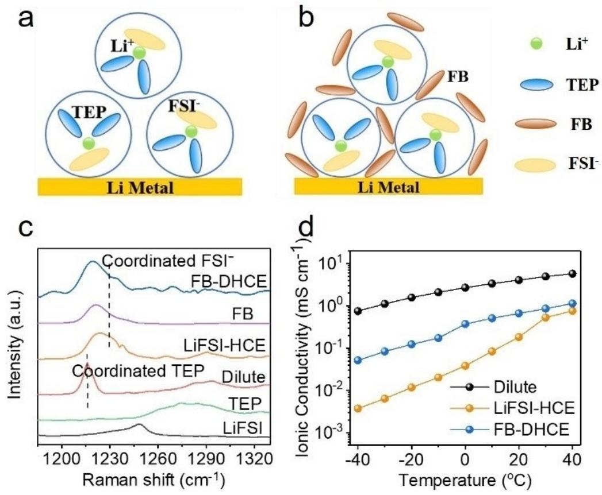
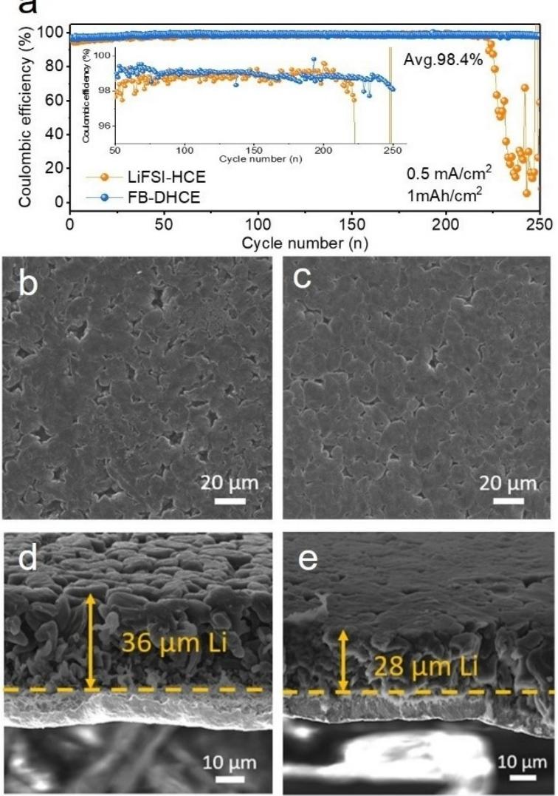
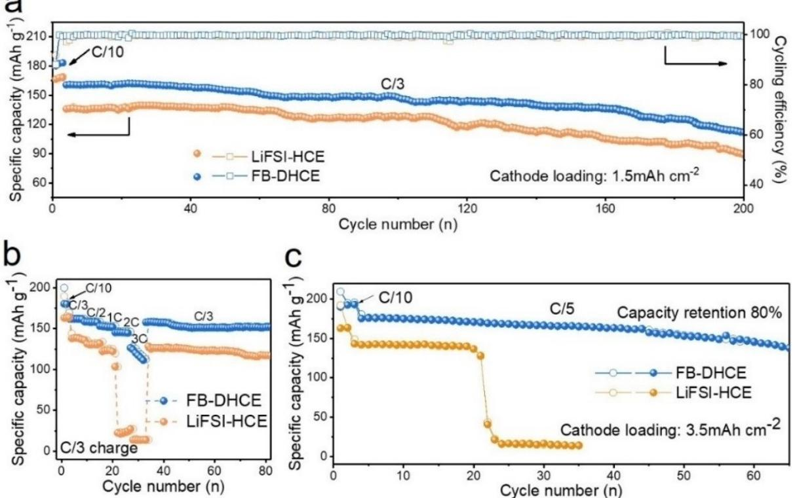
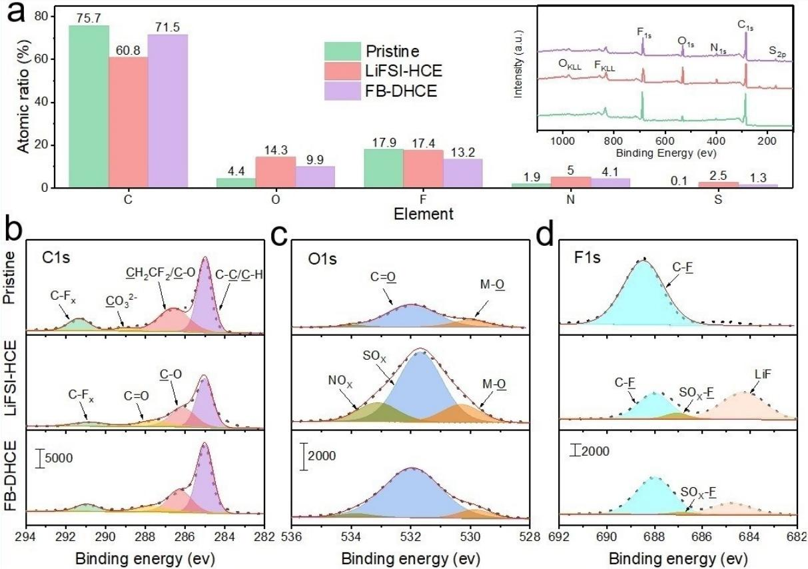

# **Diluted High-Concentration Electrolyte Based on Phosphate for High-Performance Lithium-Metal Batteries**

Mengchuang Liu,[a, b] Xing Li,[c] Baoyu Zhai,[c] Ziqi Zeng,\*[a] Wei Hu,[a] Sheng Lei,[a, d] Han Zhang,[a, d] Shijie Cheng,[a] and Jia [Xie\\*](http://orcid.org/0000-0002-8731-295X)[a]

Lithium (Li) metal is an ultra-high specific capacity and low potential ''holy grail'' anode for developing high energy density rechargeable Li metal batteries (LMBs), but its practical application suffers from the low Coulombic efficiency (CE) and dendritic lithium growth due to its thermodynamic instability to organic solvents. Here, we report a new diluted high concentration electrolyte (DHCE) containing lithium

## **Introduction**

Lithium metal is an ideal ''holy grail'' anode material for advanced high energy density secondary battery owing to its ultra-high theoretical specific capacity, light weight, and low electrochemical redox potential.[1–3] However, metallic Li is thermodynamic instable to almost all reported organic solvents, leading to continuous side reaction between it and electrolyte. The resulting low Coulombic efficiency (CE) and dendritic lithium growth of lithium metal anode (LMA) seriously hinders the practical applications of rechargeable Li metal batteries (LMBs).[4–6] According to the current researches, constructing an effective solid electrolyte interphase (SEI) on the LMA surface is essential to inhibit its dendritic growth and adverse reactions with the electrolyte.[7–9] Therefore, developing new solvents and electrolytes can possibly achieve stable operation of LMAs.[10–12]

| [a] M. Liu, Z. Zeng, W. Hu, S. Lei, H. Zhang, Prof. S. Cheng, Prof. J. Xie Huazhong University of Science and Technology State Key Laboratory of Advanced Electromagnetic Engineering and Tech nology, School of Electrical and Electronic Engineering No.1037, Luoyu Road, Wuhan 430074, China E-mail: ziqizeng@hust.edu.cn xiejia@hust.edu.cn |
|-------------------------------------------------------------------------------------------------------------------------------------------------------------------------------------------------------------------------------------------------------------------------------------------------------------------------------------------------------------------|
| [b] M. Liu                                                                                                                                                                                                                                                                                                                                                        |
| Huazhong University of Science and Technology                                                                                                                                                                                                                                                                                                                     |
| School of Chemistry and Chemical Engineering                                                                                                                                                                                                                                                                                                                      |
| No.1037, Luoyu Road, Wuhan 430074, China                                                                                                                                                                                                                                                                                                                          |
| [c] X. Li, B. Zhai                                                                                                                                                                                                                                                                                                                                                |
| Xinjiang Key Laboratory of Whole Process Simulation for Power System State Grid Xinjiang Electric Power Research Institute, State Grid Xinjiang Electric Power Co., LTD                                                                                                                                                                                     |
| Urumqi 830011, China                                                                                                                                                                                                                                                                                                                                              |
| [d] S. Lei, H. Zhang                                                                                                                                                                                                                                                                                                                                              |
| State Key Laboratory of Materials Processing and Die & Mould Technology School of Materials Science and Engineering, Huazhong University of Sci ence and Technology                                                                                                                                                                                         |
| No.1037, Luoyu Road, Wuhan 430074, China                                                                                                                                                                                                                                                                                                                          |
| Supporting information for this article is available on the WWW under https://doi.org/10.1002/batt.202100407                                                                                                                                                                                                                                                   |

bis(fluorosulfonyl)imide, triethyl phosphate and fluorobenzene cosolvent, which not only guarantees lithium metal anode (LMA) with an 98.4% high average CE over 250 cycles but greatly improves Lij jNMC622 cells property (70% capacity retention after 200 cycles at C/3 current density). Therefore, this new electrolyte can provide more possibilities for developing high-energy-density LMBs.

In recent years, highly concentrated electrolytes (HCEs) have made particularly prominent progress in stabilizing LMA, because increasing the molar ratio of salt to solvent can greatly reduce the number of free solvent molecules, meanwhile promoting the formation of excellent SEI film on the LMA surface.[13–16] Based on this principle, the highly concentrated electrolytes consisting of lithium bis(fluorsulfonyl)imide (LiFSI) and 1,2-dimethoxyethane (DME) or triethyl phosphate (TEP) all showed non-dendritic lithium deposits with high CE.[17,18] However, the universal disadvantages associated with HCE, including high cost, poor wettability to thick electrodes and separators, and high freezing point limit its expended application.[3,7]

To give full play to the advantages of HCE and minimize its shortcomings, diluted high-concentration electrolytes (DHCEs) have been developed by introducing various co-solvents in the HCEs.[7] Both of Wang's group and Zhang's group have done generous and excellent research work in this regard. Various fluoro-ether co-solvents have been developed and used to dilute highly concentrated LiFSI-DME systems, such as 1H,1H,5H-octafluoropentyl-1,1,2,2-tetrafluoroethyl ether (OFE),[19] bis(2,2,2-trifluoroethyl) ether (BTFE),[20,21]1,1,2,2-tetrafluoroethyl-2,2,3,3-tetrafluoropropyl-ether (TTE),[22,23] and tris(2,2,2-trifluoroethyl) orthoformate (TFEO).[5,24] And the LMAs have achieved excellent electrochemical performance. However, all these fluoro-ether co-solvents have high-density and high-production cost due to their high fluorination degree. Considering their large amount in the DHCE, the energy density of LMBs will be partly reduced while its cost is also promoted. To solve this problem, our group develops fluorobenzene as a cosolvent with low cost, low density and widely used in industry.[25,26] Similarly, LMAs also obtain stable long cycling in LiFSI-DME systems.

Although DME-based electrolytes show better compatibility with LMA than the other electrolytes (such as carbonate and sulfones), their applicability are still affected owing to the poor withstand high-voltage characteristic.[22] In addition, its easily

explosive properties when exposed to the air or encountering fire may also be a stumbling block for its use in battery systems. Recently, Zhang's group reported that TEP-based electrolyte system with high stability can realize stable cycle for high-voltage cathodes, and its compatibility with Li metal is second only to DME electrolyte.[27–29] Therefore, in this paper, we combining the TEP with FB solvents to develop a new FB-DHCE with a universal molar ratio of LiFSI: 1.2 TEP: 3 FB (LiFSI-1.2TEP-3FB), making LMAs achieve more than 250 cycles stable long-term cycling with an 98.4% high average CE, and analysing the interface chemical characteristic on the LMA and NMC622 cathode surfaces in this new electrolyte. To the best of our knowledge, this is the first time for the clever combination of the TEP with FB solvents. The relative results offer significant enlighten for the design of new electrolyte.

## **Results and Discussion**

#### **Solvation structure and physical properties**

As schematic illustration in Figure 1(a), the LiFSI-HCE was prepared by mixing LiFSI salt and TEP solvent according to the molar ratio of 1:1.2, while FB-DHCE was obtained by adding the FB into HCE based on the 1:3 molar ratio of LiFSI to FB (Figure 1b). The dissolution optical experiment results also proved it again that FB could be used as diluent in this system (Figure S1).[7,25] Furthermore, the Raman spectra was conducted to evaluate the solvation structure characteristics of diluted electrolyte (1 M), LiFSI-HCE and FB-DHCE. As displayed in the Figure 1(c) and S2, the pure TEP solvent shows a broad peak at between 1,270 and 1,320 cm 1 , relating to stretching vibrations of P=O bond in free TEP.[18,30] When the LiFSI salt is added into the TEP solvent, the amount of free TEP decrease, simultaneously the Li+-TEP solvation structure forms. In addition, FB-DHCE delivers the same characteristic peak as LiFSI-HCE, suggesting FB has slight effect on the HCE solvation structure and that the Li+-FSI -TEP solvates remains still well. Despite this, the change of electrolyte's concentration lead to their different physical properties. FB-DHCE exhibits higher ion conductivity than LiFSI-HCE at selected temperature, especially, at low temperatures. And FB-DHCE also delivers excellent wettability to diaphragm than LiFSI-HCE (Figure S3), which is properly attributed to the decrease of viscosity in LiFSI-HCE.

#### **The Li-metal anode performance and anode-electrolyte interface**

For the LMBs, the stabilities of electrolyte to anode are very important for the cycle life of the battery. The low CE of Li plating-stripping will results in rapid failure of LMB.[31] Consider-

**Figure 1.** The electrolyte characteristic. The schematic illustration of the solvation structure in a) LiFSI-HCE and b) FB-DHCE; c) Raman spectra of studied electrolyte systems and corresponding pure components; d) ionic conductivity of various electrolytes at the selected temperatures.

ing the impact of this, the CE of LMA in various electrolytes were evaluated by Lij jCu half-cells. In diluted electrolyte (1 M), the Lij jCu half-cell shows large overpotential (Figure S4a) due to the continuous consumption of electrolyte, which can be related to the non-uniform Li deposition (Figure S4b). Comparing to the dilute electrolyte, there are almost no free TEP solvent molecules in LiFSI-HCE, which suppresses the side reactions between Li-metal and TEP molecules, thereby improving the stability of the electrolyte to Li metal and achieving reversible Li plating-stripping behaviour. However, the low ionic conductivity and poor wettability of LiFSI-HCE makes its Lij jCu cell has larger overpotential of Li deposition than that of FB-DHCE (Figure S5). Similarly, the rate performance of Lij j Cu cell assembled with LiFSI-HCE and FB-DHCE are also in agreement with this result. The voltage polarization of Lij jCu cell in FB-DHCE is always lower than that of LiFSI-HCE system at selected current density (Figure S6).

The Li-CE was studied by depositing 1 mAhcm 2 Li on the bare copper (Cu) foil substrate and then stripping to the cut-off potential of 1 V. The current density is 0.5 mAcm 2 over prolonged long cycling. In the LiFSI-HCE, the average Li CE can reach to 97.5% and remains stable for more than 220 cycles, whereas the Lij jCu cell of FB-DHCE can remain stable for over 250 cycles with an 98.4% average CE (Figure 2a). And by the close inspection of the voltage profiles of both Lij jCu cells (Figure S7), we find that the overpotential of FB-DHCE increases much slower than that of LiFSI-HCE over cycling. When the current density increases to 1 mAcm 2 during Li depositionstripping, the difference in electrochemical performance of the both Lij jCu cells is more obvious (Figure S8), which agrees well with the results of electrochemical impedance spectroscopy (EIS) (Figure S9). These results indicate that compared to the LiFSI-HCE, the FB-DHCE improves effectively LMA stability, which is possibly related to the change of Li-depositing behavior.

**Figure 2.** Electrochemical properties of Lij jCu cells in different electrolytes. a) Li deposition CE measured by controlling the condition of 0.5 mAcm 2 , 1 mAhcm 2 . Morphologies of Li deposition on Cu substrate in different electrolytes. b, c) top-view and d, e) cross-section images are shown: b, d) LiFSI-HCE, c, e) FB-DHCE. (Experimental condition: 0.5 mAcm 2 , 5 mAhcm 2 )

To prove the above conjecture, the growth behaviour of Li metal in LiFSI-HCE and FB-DHCE were analysed by scanning electron microscope (SEM). As shown in Figure 2(b) and S10 (a), a non-uniformly deposited Li film is obtained in LiFSI-HCE, and it has high porosity with an average thickness of 36 μm (Figure 2d). In contrast, in FB-DHCE, more uniform and denser Li depositionmorphology can be obtained (Figure 2c and S10b) and the average cross-section thickness of Li film is 28 μm (Figure 2e). The relatively dense Li deposition can effectively reduce the side reaction of the metal Li against the electrolyte, improving the CE and cycling stability of the LMA.[32,33] This observation agrees well with the performance of Lij jCu halfcell and the above conjecture (Figure 2a). Furthermore, SEI layer's characteristic on the LMA surface were measured by EPMA (Figure S11). The results show SEI film can form more uniformly in FB-DHCE during the initial Li deposition to blocked direct contact between metallic Li and electrolyte, which is benefit from the improved wettability of FB-DHCE (Figure S3).

In addition, the top-view and cross-section morphologies of Li metal after 50 cycles are also revealed by SEM (Figure S12). As seen in (Figure S12a and b), the surface of LMA in LiFSI-HCE emerges cracks with high porous structure, while the one in FB-DHCE remains relatively flat with no obvious cracks (Figure S12d and e). Meanwhile, the cross-section images indicate that the LMA in LiFSI-HCE suffers larger volume expansion than that in FB-DHCE (Figure S12c and f). This can be attributed to non-uniform deposited Li film in LiFSI-HCE during cycling (Figure 2b).

#### **The cathode performance and cathode-electrolyte interface**

HCE can inhibit the corrosion of aluminium foil collector under high potential.[34] Generally, this process is evaluated by linear scanning voltammetry (LSV).[21] As shown in Figure S13, when scanning to 5 V, both of LiFSI-HCE and FB-DHCE show negligible oxidation current, indicating their good stability to aluminium foil. Lij jNMC622 cells (areal loading of 1.5 mAhcm 2 , 450 μm metal Li and 40 μL electrolyte) are assembled and tested at a high voltage of 4.3 V during the experiment. The cell in FB DHCE delivers more excellent cycling stability in comparison to that in HCE (Figure 3a). When cycled at C/3 charge and C/3 discharge, the NMC622 cathode can maintain 87% retention of the initial capacity after 150 cycles, even after 200 cycles, the capacity retention can still reach 70%, whereas the NMC622 in LiFSI-HCE remains only 79% and 65% of its initial capacity after the same cycles. By carefully inspection of the potential profiles of both cells (Figure S14), we observe that the overpotential of the NMC622 cathode in FB-DHCE increases much slower than that of LiFSI-HCE during long-term cycling, which is probably related to cathode electrolyte interface (CEI) film on NMC622 electrode surface. In addition to the excellent cycling capability, the rate capabilities

**Figure 3.** The Electrochemical Performance of Lij jNMC622 cells. a) Long-term cycling property in different electrolytes at C/3 charge and C/3 discharge rates (1 C=180 mAg 1 of NMC622 or 1.5 mAcm 2 ). b) Discharge rate capability at various current density from C/3 to 3 C. c) Long-term cycling property in different electrolytes at C/5 current density (1 C=180 mAg 1 of NMC622 or 3.5 mAcm 2 ).

*Batteries & Supercaps* **2022**, *5*, e202100407 (4 of 7) © 2022 Wiley-VCH GmbH

of FB-DHCE cell are also more outstanding than that of LiFSI-HCE cell. At 3 C current density, FB-DHCE cell exhibits 70% of initial capacity, while LiFSI-HCE cell has almost no capacity (Figure 3b). When matching with high load positive electrode (3.5 mAhcm 2 ), FB-DHCE cell can deliver 80% capacity retention after 65 cycles, better than LiFSI-HCE cell performance (Figure 3c), which is attributed to the improvement of electrolyte ionic conductivity (Figure 1d).

X-ray photoelectron spectroscopy (XPS) testing was conducted on the cycled NMC622 cathodes to reveal the CEI characteristic. Compared to the pristine NMC622, the surface element signals from the conductive carbon (C C/C H, C1s) and binder PVDF (CH2 CF2/C O, C1s; C F*x*, C1s and F1s) appears to weaken in LiFSI-HCE and FB-DHCE, while NO*x*, SO*x* and LiF signals become stronger due to the decomposition of LiFSI salt anion (Figures 4 and S14).[23] However, it is worth noting that the signals of NO*x*, SO*x* and LiF in LiFSI-HCE are obviously higher than that in FB-DHCE (Figures 4d and S15), suggesting that the salt anion has more consumption in LiFSI-HCE. When a large amount of lithium salt is consumed, the electrolyte's concentration will inevitably decrease and the content of free solvent molecules will increase, resulting in more side reactions occurs. And the M O signal is very well corroborated this point of view (Figure 4c). The M O signal in LiFSI-HCE is stronger than that in FB-DHCE, suggesting the dissolution of transition metal is possibly more serious in LiFSI-HCE,[28] This suggests that FB co-solvent possibly participates in the CEI formation of NMC622 surface to prevent the decomposition of lithium salt, which is similar to the results reported in the literature,[23,34] and is also well consistent with the Lij j NMC622 cells performance (Figure 3a).

## **Conclusion**

In summary, we firstly have developed a new FB-DHCE (LiFSI-1.2TEP-3FB) that guarantees the over 250 cycles stable longterm cycling of LMAs with an 98.4% high average CE and greatly improves Lij jNMC622 cells property (70% capacity retention after 200 cycles at C/3 current density). The introduction of FB dilute not only has ameliorated cost, viscosity, and wettability of LiFSI-HCE, but changed the interface chemical reaction process in the cathode and anode surfaces, suppressing undesirable side reactions. Although the battery performance is still far from being practical, we still believe that our research work can provide meaningful guidance for the development of high energy density LMBs or lithium-ion battery.

**Figure 4.** The cathode interface CEI film analysis of NMC622 electrodes. a) XPS atomic ratios of different elements of the pristine NMC622 electrode, as well as the cathodes after five cycles at 4.3 V in LiFSI-HCE electrolyte and FB-DHCE electrolyte, the inset is XPS full spectrum of the CEI layer; and corresponding element spectrogram b) C 1s, c) O 1s and c) F 1s spectra of the CEI layer.

*Batteries & Supercaps* **2022**, *5*, e202100407 (5 of 7) © 2022 Wiley-VCH GmbH

## **Experimental Section**

### **Materials**

Li-metal foils (diameter: 1.4 cm; thickness: 450 μm) were purchased from China Energy Lithium Co., Ltd. The high load NCM622 electrode (3.5 mAhcm 2 ) was obtained from Guoxuan Technology Co., Ltd, and the slurry contains 96 wt% active material, 2 wt% super P carbon black, and 2 wt% Poly (vinylidene fluoride) binder (PVDF), while the low load NCM622 electrode (1.5 mAhcm 2 ) was fabricated by mixing 90 wt% active material, 5 wt% super P carbon black, and 5 wt% PVDF in N-methyl pyrrolidone to form slurry and then the slurry was coated on Al foil and dried at 100 °C for overnight. The electrode containing only Super P carbon black and PVDF binder (1:1 weight ratio) was prepared for LSV tests. Battery grade lithium bis (fluorsulfonyl) imide (LiFSI, Dodo Chem, Suzhou, China), Triethyl phosphate (TEP, Aladdin), fluorobenzene (FB, Aladdin), 1,2-dimethoxyethane (DME, Sigma-Aldrich) were purchased, and all these materials were dried before use. All disassembled electrodes (lithium anode or NMC622 cathode) were cleaned with DME before characterization.

## **Electrolyte**

The diluted electrolyte (1 M LiFSI-TEP) was prepared by mixing 0.01 mol LiFSI and 10 mL TEP solvent, the LiFSI-HCE electrolyte was get by mixing LiFSI and TEP solvent according to the 1:1.2 mole ratio, and the FB-DHCE electrolyte was prepared by mixing LiFSI-TEP-FB according to the 1:1.2:3 mole ratio.

## **Electrochemical measurements**

CR2032 coin cells were used for electrochemical test, and they all were assembled in a glove box with O2/H2O content of less than 0.1 ppm. The Lij jCu cells were assembled using the Cu foil, Limetal foil and separator (Celgard 2400). For Lij jNCM cells, Li-metal foil, separator, and NCM electrode were assembled, while the Lij j SP-PVDF cells were assembled by using SP-PVDF electrode to replace NCM disk. 40 μL electrolyte was added to each coin-cell if not specified. Galvanostatic charge-discharge tests were conducted on a NEWARE CT4008 cycler at 30°C and the potential windows of both coin-cell and pouch battery for Lij jNCM was set as 2.8–4.3 V. For CE-testing of Lij jCu cells, 1 mAhcm 2 lithium metal was deposited onto the bare Cu foil at current of 0.5 mAcm 2 or 1 mAcm 2 , and then completely stripped up to 1 V for each cycle.

## **Characterizations**

The materials morphological were collected by EPMA-8050G (SHIMADZU-KRATOS. Co., Ltd.). X-ray photoelectron spectroscopy (XPS) was conducted on AXIS-ULTRA DLD-600W (SHIMADZU-KRATOS. Co., Ltd.). Raman spectra testing were carried out using a 785 nm laser on Lab RAM HR800 (HORIBA Jobin Yvon IBH Ltd.). KRUSS DSA100 was used to evaluate the electrolyte wettability. The electrolytes ionic conductivities were collected by DDS-307A (INESA Scientific Instrument Co., Ltd., Shanghai, China) at the selected temperatures.

## *Acknowledgements*

*This work was supported by Science and Technology Project of State Grid Corporation of China 5230DK20005D "Key technologies for networked control of high-safety lithium battery energy* *storage Techniques and applications". We gratefully acknowledge the Analytical and Testing Centre of HUST for allowing us to use its facilities and Shiyanjia Lab ([www.shiyanjia.com\)](http://www.shiyanjia.com) for the XPS analysis.*

# *Conflict of Interest*

The authors declare no conflict of interest.

# **Data Availability Statement**

The data that support the findings of this study are available from the corresponding author upon reasonable request.

**Keywords:** diluted high-concentration electrolyte **·** fluorobenzene cosolvent **·** high energy density **·** lithium-metal batteries **·** triethyl phosphate

- [1] C. Niu, D. Liu, J. A. Lochala, C. S. Anderson, X. Cao, M. E. Gross, W. Xu, J. G. Zhang, M. S. Whittingham, J. Xiao, J. Liu, *Nat. [Energy](https://doi.org/10.1038/s41560-021-00852-3)* **2021**, *6*, 723– [732](https://doi.org/10.1038/s41560-021-00852-3).
- [2] P. Albertus, S. Babinec, S. Litzelman, A. Newman, *Nat. [Energy](https://doi.org/10.1038/s41560-017-0047-2)* **2018**, *3*, [16–21.](https://doi.org/10.1038/s41560-017-0047-2)
- [3] H. Wu, H. Jia, C. Wang, J. G. Zhang, W. Xu, *Adv. [Energy](https://doi.org/10.1002/aenm.202003092) Mater.* **2021**, *11*, [2003092.](https://doi.org/10.1002/aenm.202003092)
- [4] D. Aurbach, E. Zinigrad, Y. Cohen, H. Teller, *Solid State [Ionics](https://doi.org/10.1016/S0167-2738(02)00080-2)* **2002**, *148*, [405–416.](https://doi.org/10.1016/S0167-2738(02)00080-2)
- [5] X. Cao, X. Ren, L. Zou, M. H. Engelhard, W. Huang, H. Wang, B. E. Matthews, H. Lee, C. Niu, B. W. Arey, Y. Cui, C. Wang, J. Xiao, J. Liu, W. Xu, J. G. Zhang, *Nat. Energy* **2019**, *4*, [796–805](https://doi.org/10.1038/s41560-019-0464-5).
- [6] J. Liu, Z. Bao, Y. Cui, E. J. Dufek, J. B. Goodenough, P. Khalifah, Q. Li, B. Y. Liaw, P. Liu, A. Manthiram, Y. S. Meng, V. R. Subramanian, M. F. Toney, V. V. Viswanathan, M. S. Whittingham, J. Xiao, W. Xu, J. Yang, X.-Q. Yang, J.-G. Zhang, *Nat. Energy* **2019**, *4*, [180–186](https://doi.org/10.1038/s41560-019-0338-x).
- [7] J.-G. Zhang, W. Xu, J. Xiao, X. Cao, J. Liu, *Chem. Rev.* **2020**, *120*, [13312–](https://doi.org/10.1021/acs.chemrev.0c00275) [13348.](https://doi.org/10.1021/acs.chemrev.0c00275)
- [8] S. Zhang, G. Yang, Z. Liu, X. Li, X. Wang, R. Chen, F. Wu, Z. Wang, L. Chen, *Nano Lett.* **2021**, *21*, [3310–3317.](https://doi.org/10.1021/acs.nanolett.1c00848)
- [9] Y. Jie, X. Ren, R. Cao, W. Cai, S. H. Jiao, *Adv. Funct. [Mater.](https://doi.org/10.1002/adfm.201910777)* **2020**, *30*, [1910777.](https://doi.org/10.1002/adfm.201910777)
- [10] Z. Yu, H. Wang, X. Kong, W. Huang, Y. Tsao, D. G. Mackanic, K. Wang, X. Wang, W. Huang, S. Choudhury, Y. Zheng, C. V. Amanchukwu, S. T. Hung, Y. Ma, E. G. Lomeli, J. Qin, Y. Cui, Z. Bao, *Nat. [Energy](https://doi.org/10.1038/s41560-020-0634-5)* **2020**, *5*, [526–533.](https://doi.org/10.1038/s41560-020-0634-5)
- [11] J. Holoubek, H. Liu, Z. Wu, Y. Yin, X. Xing, G. Cai, S. Yu, H. Zhou, T. A. Pascal, Z. Chen, P. Liu, *Nat. Energy* **2021**, *6*, [303–313](https://doi.org/10.1038/s41560-021-00783-z).
- [12] Y. Jie, X. Liu, Z. Lei, S. Wang, Y. Chen, F. Huang, R. Cao, J.-G. Zhang, S. H. Jiao, *Angew. Chem. Int. Ed.* **2020**, *59*, [3505–3510](https://doi.org/10.1002/anie.201914250); *[Angew.](https://doi.org/10.1002/ange.201914250) Chem.* **2020**, *132*, [3533–3538](https://doi.org/10.1002/ange.201914250).
- [13] Y. Yamada, J. Wang, S. Ko, E. Watanabe, A. Yamada, *Nat. [Energy](https://doi.org/10.1038/s41560-019-0336-z)* **2019**, *4*, [269–280.](https://doi.org/10.1038/s41560-019-0336-z)
- [14] O. Borodin, J. Self, K. A. Persson, C. Wang, K. Xu, *Joule* **2020**, *4*, [69–100.](https://doi.org/10.1016/j.joule.2019.12.007)
- [15] S. H. Jiao, X. D. Ren, R. G. Cao, M. H. Engelhard, Y. Z. Liu, D. H. Hu, D. H. Mei, J. M. Zheng, W. G. Zhao, Q. Y. Li, N. Liu, B. D. Adams, C. Ma, J. Liu, J G. Zhang, W. Xu, *Nat. Energy* **2018**, *3*, [739–746](https://doi.org/10.1038/s41560-018-0199-8).
- [16] S.H Jiao, J. Zheng, Q. Li, X. Li, M. H. Engelhard, R.G Cao, J.-G. Zhang, W. Xu, *Joule* **2018**, *2*, [110–124](https://doi.org/10.1016/j.joule.2017.10.007).
- [17] J. Qian, W. A. Henderson, W. Xu, P. Bhattacharya, M. Engelhard, O. Borodin, J.-G. Zhang, *Nat. Commun.* **2015**, *6*, 6362.
- [18] Z. Zeng, V. Murugesan, K. S. Han, X. Jiang, Y. Cao, L. Xiao, X. Ai, H. Yang, J.-G. Zhang, M. L. Sushko, J. Liu, *Nat. Energy* **2018**, *3*, [674–681.](https://doi.org/10.1038/s41560-018-0196-y)
- [19] J. Zheng, G. Ji, X. Fan, J. Chen, Q. Li, H. Wang, Y. Yang, K. C. Demella, S. R. Raghavan, C. Wang, *Adv. Energy Mater.* **2019**, *9*, [1803774](https://doi.org/10.1002/aenm.201803774).
- [20] S. Chen, J. Zheng, D. Mei, K. S. Han, M. H. Engelhard, W. Zhao, W. Xu, J. Liu, J.-G. Zhang, *Adv. Mater.* **2018**, *30*, [1706102](https://doi.org/10.1002/adma.201706102).

- [21] S. Chen, J. Zheng, L. Yu, X. Ren, M. H. Engelhard, C. Niu, H. Lee, W. Xu, J. Xiao, J. Liu, J.-G. Zhang, *Joule* **2018**, *2*, [1548–1558](https://doi.org/10.1016/j.joule.2018.05.002).
- [22] X. Ren, S. Chen, H. Lee, D. Mei, M. H. Engelhard, S. D. Burton, W. Zhao, J. Zheng, Q. Li, M. S. Ding, M. Schroeder, J. Alvarado, K. Xu, Y. S. Meng, J. Liu, J.-G. Zhang, W. Xu, *Chem* **2018**, *4*, [1877–1892](https://doi.org/10.1016/j.chempr.2018.05.002).
- [23] X. Ren, L. Zou, X. Cao, M. H. Engelhard, W. Liu, S. D. Burton, H. Lee, C. Niu, B. E. Matthews, Z. Zhu, C. Wang, B. W. Arey, J. Xiao, J. Liu, J.-G. Zhang, W. Xu, *Joule* **2019**, *3*, [1662–1676](https://doi.org/10.1016/j.joule.2019.05.006).
- [24] Y. Zheng, F. A. Soto, V. Ponce, J. M. Seminario, X. Cao, J.-G. Zhang, P. B. Balbuena, *J. Mater. Chem. A* **2019**, *7*, [25047–25055.](https://doi.org/10.1039/C9TA08935G)
- [25] Z. Jiang, Z. Zeng, X. Liang, L. Yang, W. Hu, C. Zhang, Z. Han, J. Feng, J. Xie, *Adv. Funct. Mater.* **2021**, *31*, [2005991.](https://doi.org/10.1002/adfm.202005991)
- [26] Z. Jiang, Z. Zeng, B. Y. Zhai, X. Li, W. Hu, H. Zhang, S. J. Cheng, J. Xie, *[J.](https://doi.org/10.1016/j.jpowsour.2021.230086) Power Sources* **2021**, *506*, [230086.](https://doi.org/10.1016/j.jpowsour.2021.230086)
- [27] X. Cao, P. Gao, X. Ren, L. Zou, M. H. Engelhard, B. E. Matthews, J. Hu, C. Niu, D. Liu, B. W. Arey, C. Wang, J. Xiao, J. Liu, W. Xu, J.-G. Zhang, *[Proc.](https://doi.org/10.1073/pnas.2020357118) Nat. Acad. Sci.* **2021**, *118*, [e2020357118](https://doi.org/10.1073/pnas.2020357118).
- [28] X. Ren, P. Gao, L. Zou, S. Jiao, X. Cao, X. Zhang, H. Jia, M. H. Engelhard, B. E. Matthews, H. Wu, H. Lee, C. Niu, C. Wang, B. W. Arey, J. Xiao, J. Liu, J.-G. Zhang, W. Xu, *Proc. Nat. Acad. Sci.* **2020**, *117*, [28603–28613](https://doi.org/10.1073/pnas.2010852117).
- [29] X. Cao, Y. Xu, L. Zhang, M. H. Engelhard, L. Zhong, X. Ren, H. Jia, B. Liu, C. Niu, B. E. Matthews, H. Wu, B. W. Arey, C. Wang, J.-G. Zhang, W. Xu, *ACS Energy Lett.* **2019**, *4*, [2529–2534.](https://doi.org/10.1021/acsenergylett.9b01926)
- [30] Y. Yamada, A. Yamada, *J. Electrochem. Soc.* **2015**, *162*, A2406-A2423.
- [31] B. D. Adams, J. Zheng, X. Ren, W. Xu, J.-G. Zhang, *Adv. [Energy](https://doi.org/10.1002/aenm.201702097) Mater.* **2018**, *8*, [1702097.](https://doi.org/10.1002/aenm.201702097)
- [32] Z. Jiang, Z. Zeng, W. Hu, Z. Han, S. Cheng, J. Xie, *Energy [Storage](https://doi.org/10.1016/j.ensm.2021.01.008) Mater.* **2021**, *36*, [333–340](https://doi.org/10.1016/j.ensm.2021.01.008).
- [33] R. Xu, Y. Xiao, R. Zhang, X. B. Cheng, C. Z. Zhao, X. Q. Zhang, C. Yan, Q. Zhang, J. Q. Huang, *Adv. Mater.* **2019**, *31*, [1808392.](https://doi.org/10.1002/adma.201808392)
- [34] J. Wang, Y. Yamada, K. Sodeyama, C. H. Chiang, Y. Tateyama, A. Yamada, *Nat. Commun.* **2016**, *7*, 12032.

Manuscript received: December 21, 2021 Revised manuscript received: January 10, 2022 Accepted manuscript online: January 23, 2022 Version of record online: February 11, 2022