# **Strategies towards High Performance Lithium-Sulfur Batteries**

[Misganaw](http://orcid.org/0000-0003-4891-8526) Adigo Weret,[a] [Wei-Nien](http://orcid.org/0000-0003-1494-2675) Su,[b] and Bing Joe [Hwang\\*](http://orcid.org/0000-0002-3873-2149)[a, c]

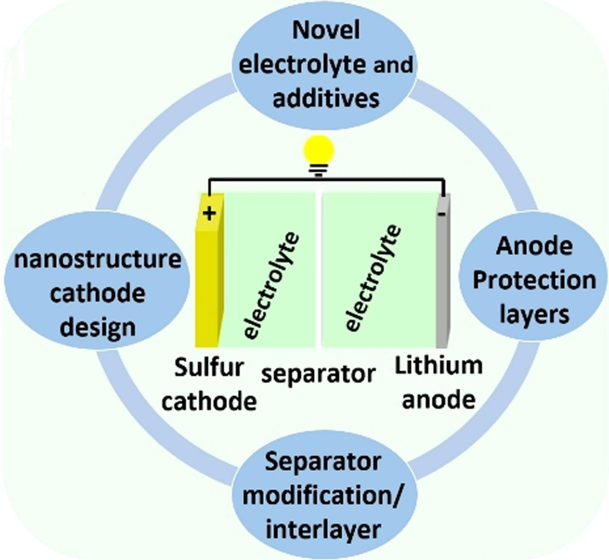

Rechargeable Lithium-sulfur batteries (LSBs) have been considered as a potential candidate for next-generation energy storage technologies because of ultrahigh-energy density (2600 Whkg 1 ) and being lightweight. However, the practical applications of LSBs are currently limited by lithium polysulfides (LiPSs) shuttle, continuous electrolyte decomposition, and lithium anode corrosion. These challenges are mainly related to the cathode structure framework, the reactive nature of lithium anode, and the redox reactions occurring at the electrodeelectrolyte interfaces. Proper cathode architecture design, development of novel electrolytes, and anode protection have been developed to improve the electrochemical performance

# **1. Introduction**

The sustainable development of a modern global economy is closely related to the innovation and widespread utilization of electrochemical energy storage technologies.[1] Since Sony's first successful commercialization of lithium-ion batteries (LIBs), electric vehicles, modern smart electronics, and smart grid energy storages have passed through a fast development track.[2] The Nobel Prize in Chemistry 2019 was awarded jointly to John B. Goodenough, M. Stanley Whittingham, and Akira Yoshino for their contributions to the development of LIBs. Consequently, the rapid advancement of LIBs has significantly revolutionized the growth of energy storage technologies and benefited the global human daily life.[3] However, the energy densities of LIBs are approaching a theoretical limit of ~350 Whkg 1 . Current battery research aims to develop a high energy density (*>*500 Whkg 1 ) beyond the LIBs.[4] The everincreasing demands of electric transportation and grid energy storage are gradually demanding high energy density, fast charging, high safety, long life, and low cost.[5] Among various promising candidates, owing to the high theoretical energy density (2600 Whkg 1 ), LSBs have recently gained tremendous attention as potential alternatives to replace state-of-the-art LIBs.[6] In addition, the LSBs with sulfur (~\$150 per ton) will be much lower cost than LIBs with LiCoO2 (~\$10000 per ton). Furthermore, a sulfur cathode is environmentally safe compared to transition metal cathodes.[7]

| [a] Dr. M. A. Weret, Prof. B. J. Hwang                                                    |
|-------------------------------------------------------------------------------------------|
| Nanoelectrochemistry Laboratory,                                                          |
| Department of Chemical Engineering,                                                       |
| National Taiwan University of Science and Technology,                                     |
| Taipei, Taiwan                                                                            |
| E-mail: bjh@mail.ntust.edu.tw                                                             |
| [b] Prof. W.-N. Su                                                                        |
| Nanoelectrochemistry Laboratory,                                                          |
| Graduate Institute of Applied Science and Technology,                                     |
| National Taiwan University of Science and Technology,                                     |
| Taipei, Taiwan                                                                            |
| [c] Prof. B. J. Hwang                                                                     |
| National Synchrotron Radiation Research Center,                                           |
| Hsin-Chu, Taiwan                                                                          |
| An invited contribution to a Special Collection dedicated to Lithium-Sulfur Batteries. |

*Batteries & Supercaps* **2022**, *5*, e202200059 (2 of 32) © 2022 Wiley-VCH GmbH

of LSBs. In this review, the working principles and challenges of LSBs are briefly introduced. The strategies to overcome the challenges of LSBs, such as electrode design and modification, development of novel electrolytes, separator modification/functional interlayer insertion, and protection of lithium anode are systematically discussed. The advanced *in situ*/operando characterization techniques deployed to reveal the redox chemistries of LSBs also summarized. Finally, a summary and future perspective for developing electrode structure, electrolyte engineering, functional interlayers/separators, and anode protection for the practical application of LSBs are provided.

LSBs which couple a high capacity sulfur cathode (1672 mAhg 1 ) and lithium metal anode (3860 mAhg 1 ), deliver a remarkably high theoretical energy density (2600 Whkg 1 and 2800 WhL 1 ) with an operating cell voltage of 2.24 V vs. Li+/Li.[8] Sulfur is abundant, generally non-toxic, low cost, and environmentally friendly.[9] Consequently, LSBs emerged as the most promising next-generation electrochemical energy storage system to meet the high energy demands of portable electronics, electric vehicles, and smart grids. More importantly, LSBs are considered lightweight battery alternatives for aviation technologies, particularly in high-altitude long-endurance, high-altitude pseudo-satellites, and vertical take-off and landing technologies.[9b,10]

Despite these attractive benefits, the practical applications of LSBs have been impeded by various fundamental electrochemical issues associated with the low conductivity of the final charge (S8) and discharge (Li2S/Li2S2) products, lithium polysulfides (LiPSs) shuttle effect, and large volume changes for both electrodes upon (de)lithiation.[11] Accordingly, tremendous research efforts have been devoted to developing the components of LSB over the past decades. The pioneering work in each component of LSB is presented in Figure 1. In particular, innovative nanostructure cathode materials,[12] novel electrolytes,[13] electrolyte additive,[14] interlayers,[15] and new cell design[16] have been reported for minimizing the polysulfide shuttle effect, protecting lithium anode, and improving the performance of LSBs.

# **2. Electrochemical Working Principles**

A typical LSBs contain a sulfur cathode, a porous polymer separator soaked in an organic liquid electrolyte, and a lithium metal anode, as shown in Figure 2(a). The two electrodes are separated by a porous polymer separator soaked in an organic liquid electrolyte that prevents short circuits. Aluminum (Al) current collectors improve the current distribution from or to the sulfur cathode. 1 M lithium bis(trifluoromethane-sulfonyl) imide in equal ratio of 1,2-dimethoxyethane and 1,3-dioxolane (1 M LiTFSI in DME/DOL) have been commonly utilized etherbased electrolytes in LSBs. In nanostructured sulfur cathode, sulfur exists in either elemental sulfur state (S8) or short-chain

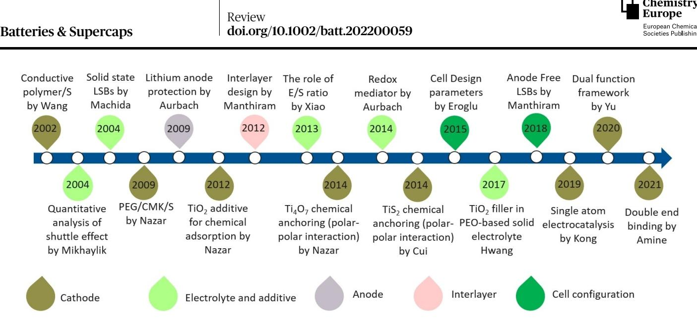

**Figure 1.** A brief roadmap for the pioneering works in the development of LSBs.

sulfur molecules or chemically bonded organosulfur compound,[17] which is lithium-free.[18] Thus, the active sulfur cathode requires a lithium source to be lithiated. As a result, the electrochemical working principles of the LSBs operation start with the discharge process. The LSB shows a maximum electrochemical cell voltage at the open-circuit voltage (OCV) due to the potential difference between the lithium anode and the sulfur cathode. During the discharging process, lithium metal is oxidized to yield lithium-ion (Li-ion) and an electron (e ) at the anode (negative electrode). The generated Li-ion moves internally through the organic electrolytes to the sulfur cathode (positive electrode) while the electrons transport through the external circuit, and thus an electrical current is produced.

When the Li-ion and electrons reach the cathode, sulfurs start to reduce to yield the discharge products through

Prof. Bing Joe Hwang studied Chemical Engineering and received his Ph.D. in 1987 at the National Cheng Kung University, Taiwan. Since 2006, he has served as chair professor at National Taiwan University of Science and Technology (Taiwan Tech). His research work has spanned a wide range of subjects from electrochemistry to spectroscopy, interfacial phenomena, materials science, and theoretical chemistry. He has established both experimental and computational strategies for the development of new electrochemical energy systems. His work has led to a better understanding of reaction mechanisms and interfacial phenomena of new electrochemical energy reactions and an improved ability to predict the properties of potential new materials for batteries, anode-free batteries, fuel cells, and green fuel production.

as a postdoctoral researcher since February 2021 at the Nano-Electrochemistry Laboratory, Chemical Engineering Department, National Taiwan University of Science and Technology, Taiwan. Before he rejoined professor Hwang's research group, he has worked as an assistant professor at Debre Markos University, Ethiopia. He received his Ph.D. from Materials Science and Engineering Department, National Taiwan University of Science and Technology, Taipei, Taiwan in 2019. He obtained his Master of Science in Organic Chemistry from University of Gondar, Gondar, and Bachelor of Science in Applied Chemistry from Arbaminch University, Arbaminch, Ethiopia. His current research interest focuses on Lithium-Sulfur Batteries, Lithiumion Batteries, Solid-State Electrolytes, and Anode Free Batteries.

Dr. Misganaw Adigo Weret is currently working

Prof. Wei-Nien Su is a full professor at the Graduate Institute of Applied Science and Technology, National Taiwan University of Science and Technology, Taipei, Taiwan. His research interests are rooted in materials synthesis and characterization of nanocatalysts for various electrochemical devices and energy applications. Prof. Su is currently involved in various international and national research programs. He received his Ph.D. from the Wolfson School, Loughborough University (UK), and his Diplom-Ing. in Chemical Engineering from Universität Stuttgart (Germany).

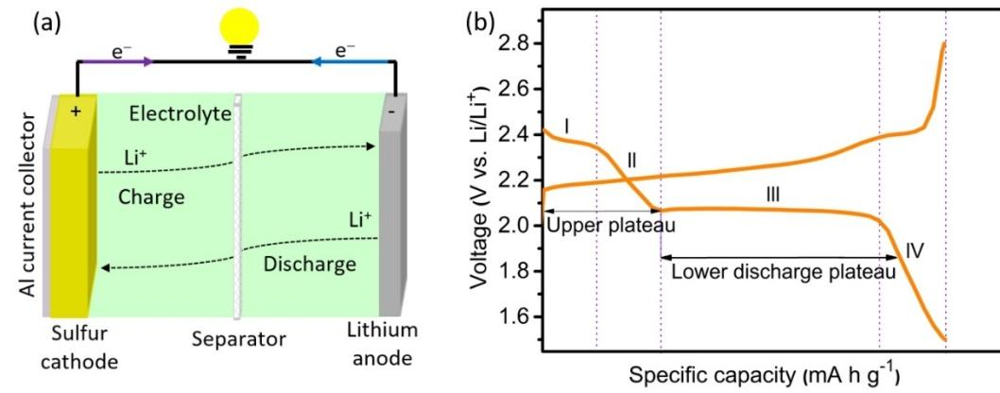

**Figure 2.** a) Schematic representation of a charge/discharge mechanism, b) voltage profile of typical LSBs in 1 M LiTFSI/DOL: DME (1:1 v/v).

multiphase conversion reactions such as solid-liquid [region I, Equation (1)], liquid-liquid [region II and III Equations (2–4)], liquid-solid [Equation (5, 6)], and solid-solid [region IV and Equation (7)). The anodic reaction that takes place at the positive electrode is the oxidation of lithium, while the cathodic reaction at the negative electrode is the reduction of sulfur upon discharging.

**Anodic reaction**:

Li ! Liþ þ e

**Cathodic reaction**:

$$
S_8(s) + 2Li^+ + 2e^- \to Li_2S_8(l) \tag{1}
$$

$$
3Li_2S_8(l) + 2Li^+ + 2e^- \to 4Li_2S_6(l) \tag{2}
$$

$$
Li_2S_8(I) + 2Li^+ + 2e^- \to 2Li_2S_4(I)
$$
 (3)

$$
2Li_2S_6(I) + 2Li^+ + 2e^- \to 3Li_2S_4(I)
$$
\n(4)

$$
Li_2S_4(I) + 2Li^+ + 2e^- \to 2Li_2S_2(s)
$$
 (5)

$$
Li2S4(I) + 6Li+ + 6e- \rightarrow 4Li2S(s)
$$
 (6)

$$
Li_2S_2(s) + 2Li^+ + 2e^- \rightarrow 2Li_2S(l) \tag{7}
$$

# **Overall reaction**:

$$
S_8(s) + 16Li^+ + 16e^- \rightarrow 8Li_2S(s)
$$
 (8)

The reduction process is proceeded by a decrease in cathode electrochemical potential until the battery reaches the terminal voltage. The opposite reaction (charging) arises when an external electric field with a specific potential difference is applied, leading to the oxidation of Li2S to LiPSs and then to sulfur. However, the insulating and nonconductive Li2S2 or Li2S do not fully oxidize to long-chain LiPSs due to high activation energy and poor electron/ion conductivity. During the charging process of LSBs, the electrochemical voltage gradually increases up to the maximum cell voltage, as shown in Figure 2(b). It is

*Batteries & Supercaps* **2022**, *5*, e202200059 (4 of 32) © 2022 Wiley-VCH GmbH

known that LSBs are a promising electrochemical energy storage system that stores energy in sulfur electrodes. Therefore, energy is stored in the bulk volume of the sulfur cathode and enables high energy densities.

# **3. Challenges of Lithium-Sulfur Batteries**

## **3.1. Insulating nature**

Both sulfur (conductivity ~10 30 S cm 2 ) and its end discharge product Li2S (conductivity ~10 13 S cm 2 ) are insulating for electrons and Li-ions.[19] Because of the low conductivity of sulfur and Li2S, the full utilization of sulfur and Li2S cathode is impossible. The limiting problems of high sulfur or Li2S content cathodes are low specific discharge capacity due to the poor conductivities of sulfur or Li2S and poor stability caused by the high concentration of soluble LiPS intermediates.[20] Therefore, the addition of conductive materials is inevitable though the content of sulfur or Li2S in the cathode decreases. However, the addition of a large amount of conductive materials sacrifices the energy densities of the LSBs.[21] Consequently, an even distribution of sulfur or Li2S into the optimized amount of the conductive host materials and excellent electrical contacts are essential for the relatively higher conversion of sulfur or Li2S to LiPSs.

#### **3.2. Volume expansion of sulfur cathode**

The sulfur cathodes exhibit volumetric changes (~80%) due to the density differences of final redox products (density S8= 2.07 gcm 3 , Li2S=1.66 gcm 3 , and 1 mole of sulfur yields about 8 mole of Li2S) during battery operation. During the discharge process of LSBs, the volume of the sulfur cathode expands since the solid discharge products (Li2S/Li2S2) precipitated in the cathode structure. The expansion of sulfur cathode also occurs upon an intake of the electrolytes and induces mechanical stress in the cathode matrix. The expansion of sulfur cathode might cause contact loss between active

materials and conductive carbon, leading to degradation of the cathode morphology.[5]

The volume expansion of sulfur cathode in high-capacity pouch cells and solid-state LSBs (SSLSBs) is more pronounced than in coin cells. Since multiple layers of electrodes stack together in pouch cells, the lithiation/delithiation process leads to huge volume expansion and shrinkage during cell operation.[22] The huge volume change forms cracks and fissures on both electrodes structure. The continuous volume changes of electrodes result in fast capacity fading of the pouch cell.[10c,23] The volume expansion and contraction of the sulfur cathode in SSLSBs cause the microcracking formation and chemomechanical separation leading to high impedance, fast capacity decay, and short cycle life of the SSLSBs.

## **3.3. Polysulfides shuttle effect**

The redox shuttle effect is the major drawback that hinders the practical utilization of LSBs. During electrochemical cycling of LSBs, the intermediate LiPSs species are formed in the cathode, as shown in Equations (1–4). Higher-order LiPSs intermediates (Li2S*x*, 4�*x*�8) are highly soluble in commonly used ether electrolytes. The soluble LiPSs diffuse from the cathode into the electrolytes and migrate to the anode side. Then, the ions diffuse back to the cathode side and are reoxidized to higher ordered LiPSs. The back and forward diffusion of LiPSs between the two electrodes is termed as "shuttle effect", as demonstrated in Figure 3(a). This process may be continuous and leads to deposition of insulating Li2S2/Li2S on the lithium surface, poor active materials utilization, uncontrolled Li/ electrolyte interface, and severe lithium anode corrosion.[13a] The deposition of Li2S2/Li2S on the lithium anode surface causes an irreversible loss of active materials, rapid capacity fading, high internal resistance, and low coulombic efficiency.[24]

## **3.4. Lithium anode corrosion**

One of the key features of LSB chemistry is the use of the lithium metal anode. Lithium anode boosts the cell capacity because of its high theoretical specific capacity (3861 mAhg 1 ), low gravimetric density (0.59 gcm 3 ), and lowest negative redox potential ( 3.040 V vs. standard hydrogen electrode).[25]

However, the use of lithium anode has various limitations. The high reactivity of lithium with electrolytes under battery operation conditions causes the consumption of active lithium and electrolytes.[26] Lithium anode suffers from severe morphology changes that lead to uneven deposition of lithium and dendrite growth (not common in the presence of LiPSs), ultimately causing dead lithium formation and degradation of lithium anode structure, as shown in Figure 3(b). The direct reaction of the lithium anode and polysulfides results in an insulating Li2S2/Li2S deposit on the lithium anode. The accumulation of Li2S/Li2S2 on the lithium anode surface passivates the electrode/electrolyte interface and leads to lithium anode corrosion. This insulating passivating layer causes sluggish redox kinetics, leading to capacity fading and ultimately shortening the cell's cycle life.[27]

To solve these drawbacks, several strategies have been developed. The most significant research developments have been done on the design of nanostructure cathode materials such as physical confinement of sulfur with in porous carbonaceous materials, chemical interactions of sulfur with conductive host materials, and the combination of two or more of these approaches together, as shown in Figure 4. Various novel electrolytes ranging from liquid organic electrolytes to solidstate electrolytes have been developed to improve the electrochemical performance of LSBs. Promising lithium anode protection strategies including the addition of passivating filmforming electrolyte additives, modification of separators/insertion of interlayers, and modification of lithium anode have been developed to improve the performance of LSBs. Therefore, considering the interaction of LiPSs with the host materials and the stabilities of electrolyte/electrode interfaces are beneficial to enhance the performance of LSBs.

# **4. Strategies to Improve the Performance of Lithium-Sulfur Batteries**

The performance of LSBs further enhanced by the proper design of battery components and efficient materials utilization. Several approaches have been developed to boost the

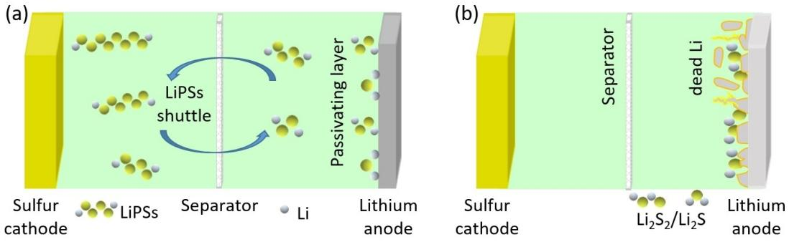

**Figure 3.** Schematic demonstration of a) shuttle mechanism of LiPSs redox species, b) lithium anode corrosion.

Review doi.org/10.1002/batt.202200059

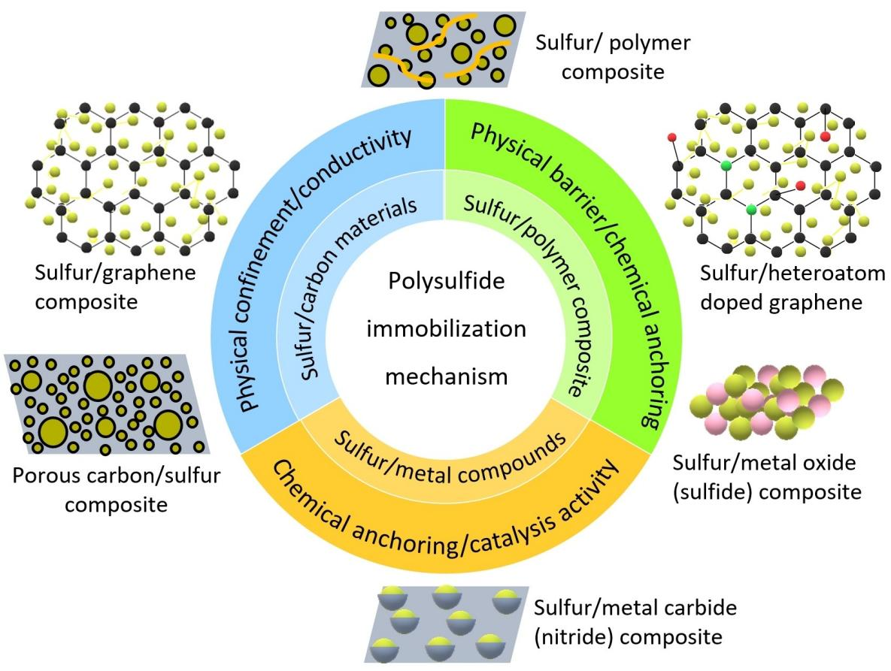

**Figure 4.** Schematic illustrations of representative nanostructured cathode materials and polysulfide immobilization mechanism in LSBs.

electrochemical performance of LSBs. The major strategies are (1) nanostructure cathode materials design, (2) development of novel electrolytes and electrolyte additives, (3) utilization of multifunctional separators and interlayers, and (4) protection of lithium metal anode.

#### **4.1. Nanostructure cathode materials design**

Designing an appropriate nanostructured cathode material is an effective approach for developing high-performance LSBs.[28] Since sulfur and Li2S are insulating, conductive nanostructure host materials are often required to effectively encapsulate the sulfur species in the cathode architecture to facilitate the electrochemical redox reactions.

## *4.1.1. Carbon-based sulfur cathode materials*

During the past decades, various types of conductive nanostructure carbon materials[29] such as porous (micro/meso) carbon,[30] hollow porous carbon spheres,[31] graphene/graphene oxide,[32] and carbon nanotubes/nanofibers[33] were developed as host materials for the sulfur cathode. Conductive porous carbons with excellent conductivity, high chemical stability, and good adsorption ability are introduced as conductive matrices to encapsulate the active sulfur.[34] The porous carbon host with various pore structures accommodates the large volume changes, improves the conductivity of both S8 and Li2S2/Li2S, and suppresses the diffusion of the soluble LiPSs. However, it has been observed that the capacity of LSBs gradually decreases as the cycle life increases due to the weak interaction between polar LiPSs and non-polar carbon materials.

Coating the sulfur cathode with conductive materials is another alternative method to confine LiPSs in the cathode structure through physical blocking barriers while still allowing infiltration of the electrolyte into the cathode architecture.[9b] Keeping LiPSs within the cathode area effectively suppress the shuttle effect and enhance battery cycling performance.[24] Therefore, proper designing and coating strategies of cathode materials that possess favorable electrolyte infiltration, polysulfide blocking, high electron, and Li-ion conductivity are important.

Graphene is a monolayer of 2D honeycomb sp2 carbon atoms. Graphene has been utilized for coating several materials because of its high surface area, chemical stability, mechanical strength, and flexibility.[9b,35] Wang et al. reported a sulfur/ graphene composite (S/GNS) prepared by the melting impregnation method. The S/GNS cathode exhibited a higher initial discharge capacity. However, severe capacity fading occurred in the following cycles.[36] Dai and coworkers introduced

graphene to wrap sulfur particles. Briefly, sulfur particles were dispersed in poly(ethylene glycol) (PEG) solution and then coated with a graphene oxide film, as shown in Figure 5(b). The graphene coating layer improves the conductivity of the sulfur cathode and confines the LiPSs in the cathode structure during electrochemical cycling. PEG coating also accommodates the volume expansion from sulfur cathode during electrochemical reactions. The graphene-coated sulfur cathode displayed high cycle stability with a specific discharge capacity of ~600 mAhg 1 over 100 cycles.[37] Li et al. reported reduced graphene oxide (rGO) modified graphene nanosheet (TG)/sulfur composite. The rGO coating effectively confined sulfur and LiPSs in the conductive carbon framework. The rGO coated TG/ S composite (rGO-TG/S) possesses a reversible capacity of 667 mAhg 1 after 200 cycles at 0.95 C.[38] Liu group reported graphene wrapped sulfur/carbon nanofiber (G/S/CNF) coaxial structured composite with sulfur sandwiched between graphene and CNFs. Both graphene and CNF are good conductors that improve the cathode's conductivity. The G-S-CNFs cathode shows a discharge capacity of 273 mAhg 1 at 1 C after 1500 cycles.[39]

Porous carbon encapsulated sulfur in a strong shell but was not flexible. The hierarchical structure obtained by embedded porous carbon with graphene sheets provided the nanostructure cathode with better flexibility and created a conductive framework while maintaining a high sulfur loading. Manthiram and coworkers prepared dual confined sulfur encapsulated by nitrogen-doped double-shelled hollow carbon spheres (NDHCSs) followed by graphene wrapping (G-NDHCS-S). The nitrogen heteroatoms doped into the HCS enhance reactive sites, facilitate charge transfer, and improve the containment of the LiPSs in the cathode structure.[40] A flexible and robust G-NDHCS-S cathode with a high sulfur loading was prepared via filtration and drying. The prepared free-standing G-NDHCS-S cathode delivers high electrochemical performance in LSBs. The G-NDHCS-S cathode showed a discharge capacity of 520 mAhg 1 at 1 C after 200 cycles.[41] Our group also reported dual-confined sulfur encapsulated in microporous carbon (MC) cores and embedded in graphene (G) shells. The nanostructure G@MC/S contains a large amount of sulfur (72.5 wt%) and accommodates the cathode volume change during (de)lithiation reaction. The graphene shells improve the intimate contact of sulfur within the cathode structure, facilitate the electron transfer, and trap the soluble LiPSs in the cathode. The hierarchical pores and void spaces created by G@MC/S embedded graphene provide rapid Li-ion diffusion and improve electrolyte infiltration. Consequently, the nanostructured G@MC/S cathode exhibited a stable electrochemical cycling performance. The prepared G@MC/S cathode showed an initial discharge capacity of 886 mAhg 1 and a reversible capacity of 601 mAhg 1 after 500 cycles at 0.5 C.[32b]

The physical adsorption property of the carbon host material is unsatisfactory to limit the diffusion of LiPSs. Later, researchers understood the introduction of polar host materials required to immobilize the soluble LiPSs in the cathode structure through chemical interaction. Thus, modification of

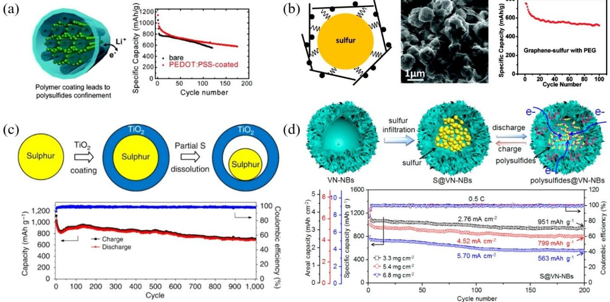

**Figure 5.** Schematic illustrations for a) polymer coating materials applied on sulfur composites and corresponding electrochemical performance. Reproduced with permission from Ref. [46]. Copyright (2011) American Chemical Society. b) Graphene coating materials applied on sulfur composites and corresponding electrochemical cycling performance. Reproduced with permission from Ref. [37]. Copyright (2011) American Chemical Society. c) Metal oxide/composites and corresponding electrochemical cycling performance. Reproduced with permission from Ref. [53]. Copyright (2013) Nature Publishing Group. d) Metal nitride/ sulfur composites and corresponding electrochemical cycling performance. Reproduced with permission from Ref. [54]. Copyright (2017) American Chemical Society.

*Batteries & Supercaps* **2022**, *5*, e202200059 (7 of 32) © 2022 Wiley-VCH GmbH

porous carbon host materials with heteroatoms (B, N, F, O, S, and P) doping,[42] incorporation of polymer or inorganic (metal oxides, metal sulfides, metal carbide, and metal nitrides) materials[43] can also show significant LiPSs adsorption capacities and mitigate the shuttle effect, which ultimately improves the cyclability of LSBs.[44] The heteroatom doped carbon materials provide strong electrostatic interaction between the doped atoms and LiPSs. The polar inorganic compounds such as metal oxides offer strong LiPSs adsorption but poor electronic conductivity. Moreover, metal nitrides such as TiN, VN, and Mo2N endow high electronic conductivity strong LiPSs chemisorption and facilitate the conversion of LiPSs to Li2S and vice versa.

# *4.1.2. Sulfur/conductive polymer composite cathodes*

The high conductivity and good compatibility nature of conductive polymer made a good alternative candidate for fabricating sulfur-polymer composite.[12a,45] The preparation of nanocomposites of sulfur with porous carbon and a conductive polymer would be an alternative way to enhance the electrochemical performance of LSBs. In this regard, Nazar and coworkers reported a pioneer work on the PEG modification of the CMK-3/S composite. The polymer modification of the carbon surface provides both the physical and chemical barrier to LiPSs diffusion from the cathode towards the electrolytes. The confinement of active materials within the nanostructure of the cathode improved the reversible capacity of the cell up to 1,320 mAhg 1 . [12b] Cui et al. modified the CMK-3/S composite with a poly(3,4-ethylenedioxythiophene)-poly(styrene sulfonate) (PEDOT:PSS) based conductive polymer, as shown in Figure 5(a). The PEDOT:PSS coating on the surface of CMK-3/S composite effectively trapped LiPSs, reduced the soluble LiPSs migration towards the electrolyte, and minimized the loss of active materials, which leads to an improvement of the LSBs performance. The PEDOT:PSS-coated cathode exhibited a discharge capacity of 600 mAhg 1 at 0.5 C after 150 cycles.[46]

Polyaniline (PANi),[47] Polythiophene (PTh),[48] polypyrrole (PPy),[49] and polyacrylonitrile[50] are the frequently used conductive polymers for the modification of sulfur cathode materials. The conductive polymer modification of sulfur cathode was mostly prepared by chemical polymerization in a mild reaction condition which endows a uniform coating layer on sulfur composite. Wang et al. prepared a sulfur/PPy composite by the chemical polymerization on the surface of sulfur using pyrrole, sodium p-toluene sulphonate (dopant), 4 styrenesulphonic sodium salts (surfactant), and FeCl3 oxidant. The PPy coating enhances the particle to particle contact of sulfur, the conductivity of the cathode, and the cycle stability of LSBs.[49a] However, this approach utilized sulfur with a large particle size and irregular shape, making the interior bulk sulfur inaccessible to electrons and the electrolyte. Manthiram's group prepared bipyramidal-shaped sulfur particles in the presence of decyltrimethylammonium bromide aqueous solution cationic surfactant, *in situ* coated by a layer of conductive PPy nanospheres forming a conductive nanolayer. The conductive PPy coating on the sulfur particles facilitates efficient transport of electrons and protects LiPSs dissolution. The S/PPy cathode shows better electrochemical performance.[49b]

Polythiophene (PTh) coating on sulfur cathode was introduced by Wu and coworkers who reported the core-shell architecture sulfur/PTh composites. The core-shell architecture S/PTh composites were prepared by *in situ* chemical oxidative polymerization of thiophene with iron chloride oxidant and chloroform solvent at a low temperature (0°C). The conductive PTh coating layer improves the conductivity of the sulfur cathode and confines the LiPSs inside the cathode structure. The core-shell S/PTh cathode shows an initial discharge capacity of 1119.3 mAhg 1 and a reversible capacity of 830.2 mAhg 1 after 80 cycles.[48b]

Polyaniline (PANi) is a well-known conductive polymer to form a strong affinity to sulfur and polysulfides. PANi has been successfully utilized as a conductive matrix, a soft framework to modify the carbon surface and accommodate the volumetric change during the electrochemical cycling of the battery.[47d] PANi is widely used to improve the electrochemical properties of LSBs due to its facile synthesis process, good electrical conductivity, and environmental stability. Wu and coworkers synthesized PANi via rapid *in situ* chemical oxidation polymerization of the aniline monomer in the presence of ammonium persulfate oxidant and dilute hydrochloric acid (HCl) solution on the surface of S/MWCNT to form core-shell structures. PANi shell prevents the dissolution of LiPSs and improves the Li-ion mobility to the cathode structure. The core-shell PANi-S/ MWCNT cathode delivered an initial discharge capacity of 1334.4 mAhg 1 and retained a reversible capacity of 932.4 mAhg 1 after 80 cycles.[47a] Gao et al. also applied a PANi coating layer on sulfur/carbon (PANi@S/C) composites to improve the rate performance of sulfur cathode. The good electrical conductivity from both the conductive carbon black in the matrix and the PANi coating of the PANi@S/C cathode improves the performance of LSBs. The PANi@S/C cathode showed an initial discharge capacity of 635.5 mAhg 1 and retained a reversible capacity ~382 mAhg 1 after 200 cycles at 10 C.[47c] Self-assembled PANi nanotubes (NT) interact with sulfur to form a three-dimensional (3-D) interconnected network PANi-NT/S composite through *in situ* vulcanization process. The conductive 3-D PANi-NT/S polymer framework provides a strong physical barrier and chemical interaction to the LiPSs and achieves high cycling performance in LSBs. The PANi-NT/S cathode retained a discharge capacity of 432 mAhg 1 after 500 cycles at a 1 C with a 76% capacity retention.[47b] Cui and coworkers systematically studied the role of three different conductive polymer coating materials such as PEDOT, PPy, and PANi coated on the monodispersed sulfur nanosphere via polymerization reaction. High specific capacity and excellent cycle stability were demonstrated by PEDOT-coated hollow sulfur nanospheres. The improving capability of these conductive coating materials on the electrochemical performance of the sulfur cathodes increases as follows: PANi*<*PPy*<* PEDOT.[51] Recently, Zubair et al. investigated an alternative method for the polymerization of PANi using formic acid instead of dilute HCl during the polymerization process. This

*Batteries & Supercaps* **2022**, *5*, e202200059 (8 of 32) © 2022 Wiley-VCH GmbH

study reports that PANi synthesized in formic acid displayed higher electrical conductivity than in HCl and a greater doping degree. Formic acid PANi doping avoids chloride ions that promote the pitting corrosion of Al current collectors, enabling direct casting of active material slurries. The PANi@C/S cathode exhibited an initial discharge capacity of 944 mAhg 1 at 0.2 C with stable cycle stability for 200 cycles.[52]

Sulfur is well known as a dehydrogenating agent. Conductive sulfurized polyacrylonitrile (SPAN) is prepared by calcination of the sulfur and polyacrylonitrile mixture from 300–450°C.[12a,55] SPAN cathode deciphered polysulfide dissolution and shuttle problem and showed promising electrochemical performance.[56] The SPAN composite materials promoted their application to various sulfur composites like porous carbon/S composites,[57] multiwall carbon nanotubes (MWCNT)/S composites,[50c] and graphene (GNS)/S composites.[58] Wang and coworkers prepared SPAN@MWCNT core-shell composite by *in situ* polymerization of acrylonitrile on the surface of MWCNT and sulfurization processes. The SPAN@MWCNT composite provides an electronically conductive network and reinforces the structural stability, restricts the dissolution of LiPSs, and leads to high electrochemical performances.[50c] The same group in the same year prepared SPAN/GNS composite with similar methods. The SPAN/GNS cathode with a GNS content of ~4 wt% exhibited an initial discharge capacity of 1500 mAhg 1 at 0.1 C and retained a discharge capacity of 1200 mAhg 1 after 100 cycles.[50b] Our group reported SPAN/porous carbon (SP) composite prepared using a dissolution/reprecipitation method followed by sulfurization process.[50a] The high surface area SPAN@SP facilitates the electrolyte infiltration and improves the conductivity of the cathode. The prepared S-SP@SPAN cathode showed good cycle stability and a high-rate capability of 492 mAhg 1 at a high rate (10 C).

## *4.1.3. Sulfur/metal compounds cathode materials*

The poor electronic conductivity of sulfur and Li2S imposes a large impedance in LSBs. The redox reaction of LSB forms insulating deposits of sulfur and Li2S. Consequently, redox reaction promotors or electrocatalysts are introduced to facilitate the redox kinetics for sulfur and Li2S-based cathodes. Electrocatalysts are distributed in the cathode structure to bind with the polysulfides and promote the LiPS conversion by facilitating electron transfer in the cathode and to the current collector. Recent reports show that polar materials such as transition metal oxides, nitrides, and sulfides immobilize LiPSs in the cathode structure through strong polar-polar interactions and facilitate the conversion reaction kinetics of sulfur species. In addition, metal nanosheet catalysts (Fe N C, Co N C, Mo N, Ti N, V N, etc.)[12h,43b,59] are incorporated into the host materials to immobilize soluble LiPSs by the strong binding ability of metal atoms with LiPSs via Lewis acid-base interaction.[12j] As a result, both polar materials and metal nanosheet catalysts have been considered as alternative polysulfide adsorbents and introduced into sulfur host materials.[60] In this regard, Cui and co-workers designed and synthesized S/TiO2 yolk-shell nanostructure composite as cathode materials for LSBs. The yolk-shell nanostructure has internal void space, accommodating the volume change during the lithiation reaction. Moreover, the high adsorptive nature of TiO2 inhibits the LiPSs migration toward electrolytes. Figure 5(c) shows that the S/TiO2 yolk-shell nanostructure cathode provided an initial discharge capacity of 1030 mAhg 1 and retained a reversible discharge capacity of ~700 mAhg 1 after 1,000 cycles at 0.5 C.[53] Zhang et al. reported PPy-MnO2 coaxial nanotubes encapsulated sulfur. The PPy-MnO2 nanotubes were synthesized through a facile *in situ* polymerization of pyrrole using MnO2 nanowires as both template and oxidation initiator. The polar MnO2 provides strong interaction with polysulfides through chemisorption, while PPy serves as a conductive network to tolerate volume change and facilitates electron transport. Furthermore, the S/PPy-MnO2 cathode delivered an initial capacity of 1420 mAhg 1 at 0.2 C and retained a reversible capacity of 985 mAhg 1 after 200 cycles.[61] Nazar and coworkers prepared a core-shell S/MnO2 with high sulfur content (~80 wt%) as a cathode to confine the soluble LiPSs in the cathode structure. The MnO2 shells formed *in situ* as coating materials on the sulfur particles. The nanostructure MnO2 shell facilitates electron transport, provides a physical barrier, and forms strong chemical interaction with LiPSs in the cathode, ultimately leading to the stable cycling performance of LSBs. Consequently, the core-shell S/MnO2 cathode delivered an initial discharge capacity of 1000 mAhg 1 and retained a reversible capacity of 315 mAhg 1 after 1700 cycles at 2 C.[62] However, the limited conductivity of metal oxides eventually limited the electron and Li-ion conductivity leading to poor rate capability.

Recently, transition metal nitrides like Titanium nitrides (TiN)[63] and vanadium nitride (VN)[64] have been used as anchoring materials because of the high conductivity and strong chemical adsorption for polysulfides. Jin and coworkers prepared porous-shell vanadium nitride nanobubbles (VN-NBs) through a two-step organometallic compound conversion and thermal nitridation process. The hollow porous VN shell has strong chemical LiPSs adsorption ability, high electrical conductivity, and catalytic effect. Figure 5(d) illustrates that sulfur is infiltrated into hallow porous nanobubbles via a melt-diffusion method. The large void space of VN-NBs completely absorbs high sulfur contents through capillary action and can accommodate the volume expansion upon lithiation. Furthermore, the interior void space of VN-NBs is used as an efficient host for the electrochemical conversion of active materials. The hollow porous shell provides a physical confinement barrier while the polar VN-NBs nanostructure shows a strong LiPSs adsorption capability. The porous shell VN-NBs provide an excellent catalytic efficiency which facilitates the electrochemical conversion kinetics of LiPSs. Benefiting from these advantages, the S@VN-NBs cathodes with higher areal sulfur loading of 3.3, 5.4, and 6.8 mgcm 2 provide high discharge capacities of 1214, 1089, and 812 mAhg 1 at 0.2 C, respectively.[54] Goodenough and coworkers used zinc titanate (ZnTiO3) as a precursor to prepare mesoporous TiN by a solid-solid phase separation

method. The ZnTiO3 was then heated under an ammonia gas flow at 900°C; the Zn2+ was reduced to metallic Zn and sublimed out of ZnTiO3 while the oxide was reduced to form a black porous TiN nanocomposite. The robust mesoporous nanostructure of TiN-S endows good stability and better conductivity. Moreover, the TiN-S composite captures the soluble LiPS intermediate species by 2–5 nm mesopores and strong N S surface bonding. TiN-S electrode delivered the initial discharge capacities of 988 mAhg 1 and retained a reversible discharge capacity of 644 mAhg 1 after 500 cycles at 0.5 C.[63] Yao et al. designed a conductive framework by integrating the flexible carbon nanofibers with embedded TiN-VN heterostructures (TiN-VN@CNFs) as active materials host for both electrodes. The well-dispersed TiN-VN heterostructures nanoparticles provide high conductivity and surface LiPSs adsorption capability. Moreover, the TiN-VN@CNFs deploy as a host material for both electrodes, providing robust integrities and decisive flexibilities for both lithium and sulfur electrodes. The TiN-VN@CNFs cathode host provides strong affinity and high conductivity to inhibit LiPSs shuttle effect and facilitate the efficient conversion of LiPSs. The lithiophilic TiN-VN heterostructures reduced lithium nucleation overpotential and delivered homogeneous lithium deposition as the anode host. As a result, the coupled LSBs revealed enhanced sulfur utilization and highly reversible lithium stripping/plating, leading to remarkable electrochemical performance. The S/TiN-VN@CNFs j j Li/TiN-VN@CNFs cell shows a high initial discharge capacity of 1388 mAhg 1 at 0.2 C and a high reversible capacity of 576 mAhg 1 after 600 cycles at 2 C.[12i] Sun and coworkers report a free-standing MoS2/MoN heterostructure grown on CNT arrays as a cathode for high-performance LSBs. In the heterostructure cathode, MoN serves as the electrons conduction matrices to promote LiPSs redox reaction while the MoS2 with 2D layered structure serves as a Li+ diffusion channel. Benefiting the synergistic advantage of the MoN/MoS2 heterostructure free-standing cathode effectively confines LiPSs in the cathode structure and prevents the LiPSs diffusion into the electrolyte. The LSBs with the free-standing MoS2/MoN heterostructure cathode delivered initial discharge capacities of 872.8/778 mAhg 1 at 0.5 C retained the high reversible capacities of 520/459 mAhg 1 after 1000 cycles at 1 C and 2 C, respectively. Moreover, the free-standing MoS2/MoN heterostructure cathode showed a high initial areal capacity of 13.3 mAhcm 2 under a low E/S ratio of 6.3 μLg 1 . [43b] Inspired by pioneering studies, many researchers developed various host materials to modify sulfur composite cathodes to demonstrate a stable electrochemical performance in LSBs, as illustrated in Table 1.

To sum up, sulfur cathode materials modifications developed by polymer coating, doping of heteroatoms, graphene wrapping, polar metal oxides, metal nitride, or metal carbides greatly improve the cycle life of LSBs. Sulfur cathode modifications are required to provide a physical barrier, form strong chemical interaction with soluble LiPSs in the nanostructure of the cathode host materials, and protect diffusion of LiPSs into the electrolytes. Furthermore, the protecting layer on the sulfur cathode structure creates an internal void space to buffer volume expansion during the lithiation process. Moreover, recent reports revealed that polar metal oxides, sulfides, carbides, and nitride heterostructure cathode materials facilitate the conversion rate of sulfur into Li2S and vice versa.

In addition, the sulfur content (wt%) and areal sulfur loading (mgcm 2 ) are important parameters for the practical application of LSBs. Recently, a high areal sulfur loading cathode has been reported without considering the sulfur content in the composite. The high areal sulfur loading with low sulfur content in the composite may scarify the energy density of the LSBs. A high sulfur content (*>*70 wt%) and areal sulfur loading (*>*5 mgcm 2 ) need to be considered simultaneously for future research. Therefore, the active materials to inactive host materials (not provide capacity) ratio in the sulfur cathode need to be prudently designed to achieve high both gravimetric and volumetric energy density. Uniform distribution of the active materials through the conductive multifunctional nanocomposite host materials needs to be considered to achieve high active materials utilization in the LSBs.

## *4.1.4. Lithium sulfide cathode*

The fully lithiated sulfur (Li2S) is an alternative cathode material because of the high theoretical specific capacity of ~1166 mAhg 1 and low-cost relative to transition metal-based cathodes. Li2S cathode can couple with lithium-free anodes such as graphite, tin, silicon, and bare current collector (in the case of an anode-free LSB). Therefore, the application of Li2S cathode is a more attractive prospect for safety issues. Moreover, Li2S has a high melting point (938°C) and lower density (1.66 gcm 3 ). Although the high melting point of Li2S widens the operational temperature range and makes multiple high temperature mechanical and chemical processes accessible to synthesize Li2S-based composite cathode, its air and moisture sensitivity needs dry room for Li2S cathode fabrication. The fully lithiated low-density Li2S cathode avoids the volumetric expansion during the cycling of the LSBs.[79] However, the application of Li2S cathode is hindered by its low conductivity (electric conductivity ~10 9 S cm 1 and ionic conductivity ~10 13 S cm 1 ) and shuttle effect.[80] Furthermore, commercial Li2S is electrochemically inactive and requires high activation overpotential during an initial charging process. Yang et al. reported that applying a high cutoff voltage (~4 V) was needed to overcome the activation barrier of bulk Li2S cathode. However, a high charge voltage causes electrolyte decomposition, low initial coulombic efficiency, and poor cycle life.[81] To reduce the activation overpotential of bulk Li2S cathode, considerable research efforts have been implemented over the last few years.

Electrocatalysts and redox mediators are commonly utilized to reduce the activation barrier of Li2S cathode. Electrocatalysts reduce the Li2S cathode charge overpotentials by improving charge transfer or enhancing ion transport. Transition-metal sulfides,[82] oxides, phosphides,[83] and carbides[84] electrocatalysts are introduced for activating Li2S cathodes. Zhou et al. investigated the catalytic role of several metal sulfides (VS2,

*Batteries & Supercaps* **2022**, *5*, e202200059 (10 of 32) © 2022 Wiley-VCH GmbH

|                                                    | Table 1. Summary of electrochemical performances of LSBs with different nanostructure materials applied for sulfur cathodes. |                                                            |                                                          |                                                          |                                                                                                                                                                                                                                                                                                                                                                     |                                                                        |
|----------------------------------------------------|------------------------------------------------------------------------------------------------------------------------------|------------------------------------------------------------|----------------------------------------------------------|----------------------------------------------------------|---------------------------------------------------------------------------------------------------------------------------------------------------------------------------------------------------------------------------------------------------------------------------------------------------------------------------------------------------------------------|------------------------------------------------------------------------|
| Composite materials                                | Cathode composite                                                                                                            | Sulfur content [wt%]                                    | Sulfur loading ] [mgcm 2                           | Coating thickness [nm]                                | Cycling performance                                                                                                                                                                                                                                                                                                                                                 | Ref.                                                                   |
| polyaniline                                        | PANi-S/MWCNT HPC/S@-PANi S/PANI@KB PANI-NT/S PANI@S/C PANi@C/S S-PANi                                      | 43.7 65.2 70 62 82 55 57                 | N/A N/A 1.21 1.2 2.1 2 3               | 5–10 N/A N/A N/A 150 20 15             | 932 mAhg 1 after 80 cycles at 100 mAg 1 494.5 mAhg 1 after 500 cycles at 2 Ag 1 596 mAhg 1 after 100 cycles at 0.1 C 837 mAhg 1 after 100 cycles at 0.1 C 765 mAhg 1 after 200 cycles at 0.2 C 702 mAhg 1 after 500 cycles at 0.2 C 675 mAhg 1 after 200 cycles at 0.1 C                                                                          | [47b] [47d] [47a] [47c] [52] [65] [66]               |
| polypyrrole                                        | S/PPy-MWCNT S/T-PPy@SnO2 PPY@CMK-8/S S/PPy-MnO2 S/PPy/GNS S/PPy/TiO2 S-PPy S-PPy S-PPy               | 53.7 64.7 64.6 63.3 64 50 70 52 70 | 1–2 mg N/A N/A N/A 0.6 1.8 2 2 1 | N/A N/A N/A N/A 100 100 50 40 30 | 600 mAhg 1 after 20 cycles at 50 mAg 1 873.2 mAhg 1 after 200 cycles at 0.2 C 1150 mAhg 1 after 100 cycles at 0.1 C 860 mAhg 1 after 100 cycles at 0.2 C. 985 mAhg 1 after 200 cycles at 0.2 C. mAhg 1 after 40 cycles at 0.1 C. 634 mAhg 1 after 50 cycles at 0.2 C 400 mAhg 1 after 50 cycles at 2 C 725.8 mAhg 1 after 100 cycles 641 | [49b] [49a] [67] [68] [69] [70] [61] [71] [72] |
| Other multifunctional conducting polymer        | S-PANi, S-PEDOT, S-PPy S-PANi, S-PEDOT, S-PPy PETT-EO                                                                  | 74-78 N/A 75                                         | 3.97 1.5 1.5                                       | 6–20 N/A 20                                        | and 923 mAhg 1 for S-PPy after 100 cycles at 0.2 C 900 mAhg 1 for S-PANi, 800 mAhg 1 for S-PEDOT, 876 mAhg 1 for S-PANi, 800 mAhg 1 for S-PEDOT, and 1100 mAhg 1 for S-PPy after 100 cycles 600 mAhg 1 after 200 cycles at 0.5 C                                                                                                                        | [73] [51] [74]                                                   |
| polythiophene PEG and G graphene graphene | sulfur/PTh G@S/CNF G@S GO                                                                                           | 71.9 50 33 70                                     | N/A N/A 0.4 0.8                                 | 20-30 N/A N/A N/A                               | 800 mAhg 1 after 1000 cycles at 1 Ag 1 830 mAhg 1 after 80 cycles at 0.1 Ag 1 600 mAhg 1 after 100 cycles at 0.2 C 273 mAhg 1 after 1500 cycles at 1 C                                                                                                                                                                                                     | [48b] [75] [39] [37]                                          |
| Metal oxide                                        | hybrid MC-Meso C doped TiO2/S MOx-coated CMK-3/S Sulfur/TiO2 yolk-shell core-shell S/MnO2 S@γ-MnO2               | 60–70 61.04 80 71 61                           | 0.4 1.5 0.7 0.3 2                            | 500–600 N/A 15 5                                | 700 mAhg 1 after 1000 cycles at 0.5 C 500 mAhg 1 after 100 cycles at 0.1 C 578 mAhg 1 after 140 cycles at 0.1 C 802 mAhg 1 after 300 cycles at 0.5 C 315 mAhg 1 after 1700 cycles at 2 C                                                                                                                                                                | [30a] [53] [62] [76] [77]                                  |
| Metal nitride, carbide, and sulfide             | S/TiN-VN@CNFs P-Fe N@NPG/S TiN/2H-MoS2 4                                                                            | N/A 73 80                                            | 1.7 1.1 2                                          | 30–50 20–40 N/A                                    | 417.4 mAhg 1 after1000 cycles at 1 C 459 mAhg 1 after 800 cycles at 1 C 459 mAhg 1 after 800 cycles at 1 C                                                                                                                                                                                                                                                    | [42b] [12i] [78]                                                 |
| =not available; G=graphene. Note: N/A           |                                                                                                                              |                                                            |                                                          |                                                          |                                                                                                                                                                                                                                                                                                                                                                     |                                                                        |

*Batteries & Supercaps* **2022**, *5*, e202200059 (11 of 32) © 2022 Wiley-VCH GmbH

CoS2, TiS2, FeS, SnS2, and Ni2S3) for activating Li2S cathode by combining experimental and theoretical methods. The authors report that VS2, TiS2, and CoS2-based cathodes exhibit higher binding energy, lower diffusion, and lower activation energy barriers, resulting in improved capacity and cycling stability. The Li2S dissociation is related to the binding energies between isolated Li-ion and sulfur in metal sulfides.[82] Liang et al. introduced a multilayer Ti3C2 for activation of the Li2S cathode. The multilayer Ti3C2 structure enhances the conductivity of the Li2S cathode and promotes the oxidation of Li2S by forming Ti S bonds. As a result, the activation overpotential of the Ti3C2/Li2S cathode was reduced from ~3.5 to ~2.8 V.[84] Yuan et al. investigated the catalytic role of various metal phosphides (Ni2P, Co2P, and Fe2P) for reducing the activation barrier of Li2S cathode. The authors reported that the introduced metal phosphides reduced the activation barrier to 2.4–2.6 V.[83]

Redox mediators (RMs) are commonly used as the charge shuttle that mediates and promotes the charge transfer between current collectors and electrode materials. RMs are added to the electrolyte to reduce the activation overpotential of the Li2S cathode. RMs reduce the activation barrier of Li2S cathode by the redox reaction between the RMs and Li2S to form soluble LiPS. Aurbach group introduced redox mediators such as decamethylferrocene, lithium iodide, and ferrocene as an additive in the commonly used ether-based electrolyte. The authors reported that the introduced redox mediators reduced the activation barrier to *<*3.0 V.[12c] Tsao et al. introduced quinone-based redox mediators into electrolytes. The quinonebased redox mediators reduced the activation overpotential to *<*2.5 V at 0.5 C.[85] Generally, RM addition is an effective strategy for activating the Li2S cathode and suppressing the shuttle effect of LSBs.

# **4.2. Development of novel electrolytes**

The electrolyte chemistry and the ability to stabilize LiPSs species play an indispensable role in improving the performances of LSBs. There are four major types of electrolytes commonly used in LSBs such as organic liquid electrolytes,[86] polymer electrolytes,[87] inorganic solid-state electrolytes,[88] and organic/inorganic composite electrolytes,[89] as shown in Figure 6(a).

## *4.2.1. Liquid organic carbonate electrolytes*

Liquid organic carbonate (carbonate ester) electrolytes have been used in commercial LIBs for more than 30 years. Carbonate ester electrolytes may be cyclic like ethylene carbonate (EC), vinylene carbonate, and propylene carbonate (PC), or acyclic like ethylene methylene carbonate (EMC), diethylene carbonate (DEC), and dimethylene carbonate (DMC).

These electrolytes provide high Li-ion conductivity, broad electrochemical stability, wide operating temperature window, and successful graphite anode passivation film for commercial LIBs.[90] Consequently, carbonate ester electrolytes are considered as the most feasible alternatives to replace ether-based electrolytes in LSBs due to their safety. However, carbonate ester electrolytes are not chemically compatible with the common sulfur electrode because of the irreversible nucleophilic reaction of lithium polysulfide species with the carbonyl group of carbonate ester solvents through nucleophilic addition and/or nucleophilic substitution reaction during the first discharge, as shown in Scheme 1.[91] These severe reactions induce consumption of electrolyte solvents and loss of active sulfur species resulting immediate capacity loss of LSBs.

However, carbonate ester electrolytes require a unique sulfur cathode structure. The strong chemically bonded sulfur species on a polymeric composite[56a] and confined small sulfur species in a microporous host material[92] show high compatibility with carbonate ester electrolytes. These sulfur cathodes show a single discharge plateau in carbonate ester electrolytes instead of two discharge voltage plateaus commonly displayed in ether-based electrolytes.[93] A single discharge plateau profile suggests the direct solid-phase conversion of sulfur species to Li2S/Li2S2 and vice versa. The absence of soluble LiPS intermediates eliminates the severe nucleophilic addition and/or

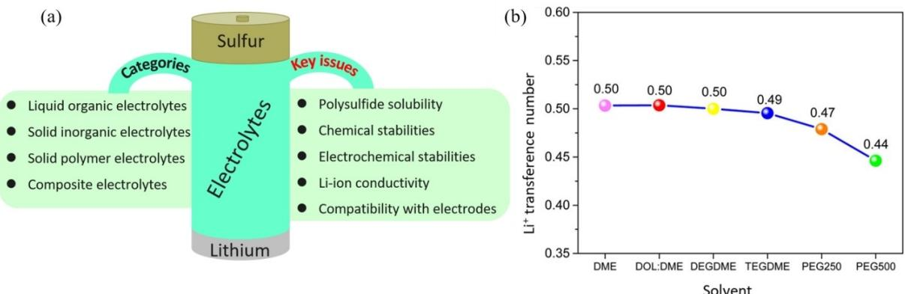

**Figure 6.** a) Categories and key issues of electrolytes commonly used in lithium-sulfur batteries. b) Li-ion transference number of the ether-based electrolytes at room temperature. The values have been obtained as the ratio of the self-diffusion coefficient of Li-ion with respect to that of overall charge carriers, that is, Li+ and CF3SO3 measured at 25°C by NMR. Reproduced with permission from Ref. [100]. Copyright (2015) American Chemical Society.

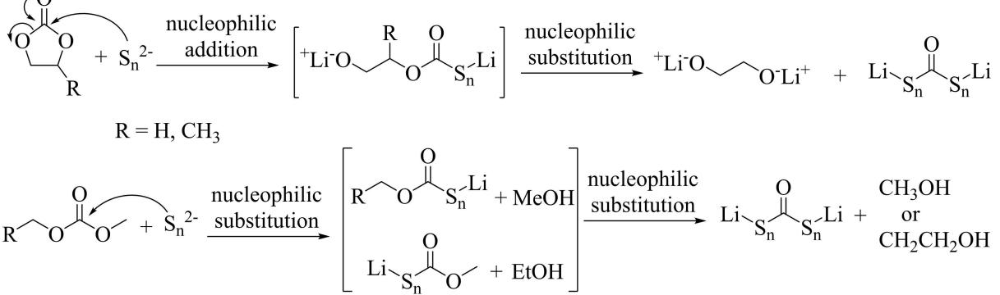

**Scheme 1.** Plausible reaction mechanism for cyclic and acyclic carbonate ester with soluble polysulfide ions. Reproduced with permission from Ref. [91b]. Copyright (2013) Elsevier Inc.

nucleophilic substitution reaction of polysulfides anions with carbonate ester solvents. Furthermore, the LiPS shuttle effect observed in ether-based electrolytes was eliminated.[94] As a result, LSBs with carbonate ester electrolytes show stable electrochemical performance with high coulombic efficiency compared to LSBs in ether-based electrolytes.

Nevertheless, the confined sulfur species within a microporous structure and strong chemical bonding sulfur species to a polymeric host result in limited sulfur content in the composite (mostly *<*50 wt%) and low areal active materials loading that decrease the energy density of LSBs.[95] Consequently, more efforts should be devoted to developing carbonate ester electrolyte compatible sulfur cathodes with high sulfur content and areal active materials loading.

## *4.2.2. Liqiud organic ether electrolytes*

An organic ether solvents such as DME, di (ethylene glycol) dimethyl ether (DEGDME, diglyme, G2), tri (ethylene glycol) dimethyl ether (triglyme, G3), tetra (ethylene glycol) dimethyl ether (TEGDME, tetraglyme, G4), poly (ethylene glycol) dimethyl ether (PEGDME), DOL, Hexyl methyl ether (HME), tetrahydrofuran (THF), etc are commonly used in ether-based electrolytes for LSBs.[96] The liquid organic electrolytes mainly consist of solvents, salts, and sometimes additives to optimize the important parameters like viscosity, Li-ion conductivity, wettability, wide temperature stability, flammability, inertness to other battery components (separator, current collector, etc.), and low cost. The electrochemical potential window in LSB system is mostly lower than 3 V vs. Li/Li+, which allows the use of various organic liquid electrolytes. However, the electrochemical reaction intermediate (polysulfide ions and sulfur radicals) reacts with carbonate-based electrolytes, making these electrolytes not commonly used in LSBs.[91b] The reactivities of intermediate polysulfide anions and sulfur radicals limit the selection of organic electrolytes into the ether-based liquid electrolyte. Therefore, the selection and formulation of liquid organic electrolytes for LSBs depend on the solubilities of LiPSs and stability with sulfur species in addition to fundamental electrolyte characteristics.[97]

Most ether solvents are stable over a wide range of temperatures and have low viscosity, leading to high ionic conductivity. Furthermore, ether solvents are relatively stable with polysulfide anions or sulfur radicals during the charging and discharging processes. As a result, ether-based electrolytes are suitable for the LSB system. Ether solvents such as DME, DEGDME, TEGDME, PEGDME, DOL, and THF have been widely investigated due to their high sulfur cathode wettability and excellent chemical stability. The linear ether solvent (DME) possesses relatively high polysulfides solubility, which provides fast conversion kinetics for the multiphase polysulfides redox reactions. TEGDME and PEGDME have a high solvation ability to dissociate lithium salts and provide an advantageous effect on discharge capacity.[98] The cyclic ether solvent (DOL) is used as a co-solvent owing to its lower viscosity, lower polysulfides solubilities, and ability to form a protective solid electrolyte interface (SEI) on lithium anode through ring-opening polymerization.[99] The flexible protective polymeric film formed on the lithium surface accommodates the morphological changes of lithium anode during lithium deposition/dissolution processes).[14]

Li-ion mobility in ether solvents has been studied by varying the chain-length of the solvents (i. e., DME, DOL/DME, DEGDME, TEGDME, PEGDME) via combining the electrochemical performance and NMR techniques. The mobility of Li-ion is influenced by the chain length of ether solvents which directly correlated with the electrochemical performance of LSBs. Longchain glymes show poor Li-ion mobility compared to shortchain glymes, as shown in Figure 6(b).[100]

A single solvent may not satisfy the requirements of suitable electrolytes for the LSB system. Consequently, the binary solvent system such as DME/DOL with LiTFSI salt is commonly used as an electrolyte in LSBs. The LSBs with the conventional binary solvent system (LiTFSI in DME/DOL) delivered high discharge capacity and longer cycle life. The dissolution of LiPSs in DME/DOL-based electrolytes increases active materials accessibility in the entire cathode structure. On the other hand, the high solubility of LiPSs in these binary solvents causes capacity fading during long-term cycling performance.[101] However, LiPSs dissolution and diffusion into electrolytes cause polysulfide shuttle, resulting in poor coulom-

*Batteries & Supercaps* **2022**, *5*, e202200059 (13 of 32) © 2022 Wiley-VCH GmbH

bic efficiency and lithium anode corrosion during long-term cycling performance. The coulombic efficiency and cycle stability is improved by introducing lithium nitrate (LiNO3) additives in short-chain ethers solvent while maintaining high species mobility. Thus, the LSBs in ether-based electrolytes with LiNO3 additives showed stable cycling performance and small polarization. Furthermore, incorporating LiNO3 additive improves the SEI composition formed on the surface of lithium metal anode.[14]

Fluorinated ether solvents are introduced as a cosolvent in ether-based electrolytes for the LSB system to change the composition of SEI, reduce LiPSs solubility, optimize the viscosity of the electrolyte, and improve the cell performance.[102] Amine and coworkers designed partially fluorinated ether base electrolyte by substitute DME with 1,1,2,2-tetrafluoro-3-(1,1,2,2-tetrafluoroethoxy)-propane (TTE). LSBs with the designed fluorinated electrolyte (1 M LiTFSI/ DOL : TTE) delivered a high initial discharge capacity of 1195 mAhg 1 and a reversible discharge capacity of 836 mAhg 1 after 100 cycles.[103] The improved capacity and cycle stability are maintained using a manageable polysulfide solubility. Azimi et al. investigated the effect of fluorinated cosolvent on the solubility of LiPSs in the LSB system. The higher-order LiPSs are highly soluble in conventional DME/ DOL-based electrolytes and shuttle between the two electrodes, as shown in Figure 7(a). The electrolyte substitution is an alternative approach to reduce the solubility of LiPSs into the electrolytes. The role of fluorinated solvent on the performance of LSBs investigated by using fluorinated electrolytes with different ratios of TTE and DOL with 1 M LiTFSI salt. The LSBs with DOL : TTE (1:2) electrolytes show the highest discharge capacity and retention capacity after 50 cycles, as displayed in Figure 7(b). The higher-order LiPSs intermediates show low solubility in the DOL: TTE based electrolytes, suppressing LiPSs diffusion into electrolytes. As shown in Figure 7(c), electrolyte with a higher ratio of TTE displays less LiPSs dissolution and thus suppress their shuttle behavior.[102a] The ability for the rational development of new functional electrolytes is an

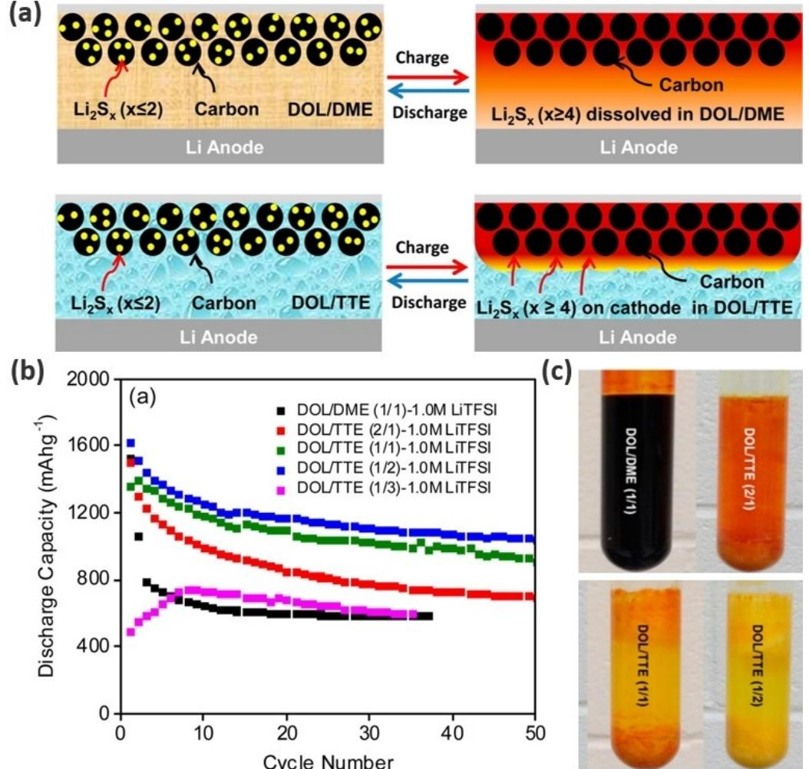

**Figure 7.** Schematic illustration of discharge and charge process in LSB with a) baseline electrolyte 1 M LiTFSI in DOL :DME and fluorinated electrolyte 1 M LiTFSI in DOL : TTE, b) discharge capacity retention of LSBs, and c) polysulfide solubility tests in fluorinated electrolyte solvents: 1 M Li2S8 (based on stoichiometric amounts of Li2S and sulfur) dissolved in baseline solvent DOL :DME and fluorinated solvents with different DOL : TTE volumetric ratios. Reproduced with permission from Ref. [102a]. Copyright (2015) American Chemical Society.

exciting prospect, noting that such efforts can also complement the identification of new solvents and salts.

The soluble LiPSs have a significant role in improving the rate of conversion reaction in LSBs. Optimized amounts of polysulfides in the electrolytes play a critical role in forming Li2S rich solid electrolyte protecting layer on the lithium anode. Therefore, managing the soluble LiPSs in the cathode structure and optimizing the composition of polysulfides in the electrolyte are indispensable approaches to enhance the cycle life of LSBs.

Several fluorinated ethers (Scheme 2) including bis(2,2,2 trifluoroethyl) ether (BTFE),[104] 1,1,2,2-tetrafluoroethyl-2,2,2-trifluoroethyl ether (TFETFE),[105] ethyl-1,1,2,2-tetrafluoroethyl ether (ETFE),[106] and TTE[107] are introduced instead of DME in the ether-based electrolyte system. Mandal et al. synthesized and investigated several fluorinated ethers as cosolvents in ether-based electrolytes for LSBs. The fluorinated solvents with CF3 group show lower viscosity compared to CF2CF2H group.[108] Recently, Amine group proposed a selection rule for fluorinated ether solvents based on their lithium solvating ability, conductivity, and solubility of LiPSs. The fluorinated ether solvents with α and β' substituted fluoroalkyl group (TTE and TFETFE) show the highest ability to suppress LiPSs solubility but the lowest lithium solvating power. Contrary, the fluorinated ether solvents with β and β' substituted fluoroalkyl group (BTFE) show the lowest ability to suppress LiPS solubility but the highest lithium solvating power. Furthermore, BTFE delivers the highest conductivity, making it suitable as a cosolvent in electrolyte formulation, mainly aiming at a high charge rate. LSBs with the various formulated electrolytes such as 1 M LiTFSI in 1:1 (v/v) DOL : TTE, DOL : TFETFE, DOL :TFEPE, DOL : TFEiBE, and DOL :BTFE cycled from 1.5 to 2.8 V at 0.1 C for 80 cycles. The cells with TTE-, TFETFE-, TFEPE-, and TFEiBEbased electrolytes all exhibited a high initial specific discharge capacity of ~1500 mAhg 1 and the reversible discharge capacity of ~600 mAhg 1 after 80 cycles. However, BTFE-based electrolyte cells delivered a lower initial discharge capacity with better capacity retention.[109]

The amount of electrolyte to the sulfur ratio (E/S) influences the discharge capacities and cycle stabilities of the LSBs. In most LSB research, excess electrolytes (E/S *>*10 μLmg 1 ) are used to ensure high discharge capacity and long cycle stability significantly.[110] However, flood electrolytes extremely reduce the practical energy density of the LSBs. Moreover, the E/S ratio determines the physicochemical properties of the cells like solubility, diffusion, and migration of LiPSs, viscosity, and ionic conductivity of electrolytes which extremely influence the electrochemical performance of LSBs. Therefore, the utilization of excessive electrolytes becomes a severe limitation to the commercialization of LSBs.[21] Therefore, a low E/S ratio withdraws considerable attention for developing high energy density LSBs.[110,111] However, using a low E/S ratio reduces the LiPSs redox mediator formation, eventually leading to sluggish redox kinetics, poor active materials accessibility, large polarization, and poor reversibility of the LSB.[112] Since concerns of E/S are being recognized by researchers, several strategies have been developed for the practical application of LSBs.[113] In this regard, Manthiram's group reported a LSBs configured sulfur cathode with a high sulfur loading (57.6 mgcm 2 ) and low E/S ratios (6.0–4.2 μLmg 1 ) of 1.85 M LiTFSI/DOL :DME with 0.2 M LiNO3. The designed LSBs display high gravimetric, volumetric, and areal capacities of 408 mAhg 1 , 523 mAhcm 3 , and 31 mAhcm 2 , respectively.[114] Nazar and co-workers reported a networked electrolyte structure by tuning electrolyte using a diglyme (G2) solvent with a saturated LiTFSI salt (G2: LiTFSI, 0.8:1) for LSBs. The designed electrolyte shows sparing LiPSs solubility and low reactivity with lithium metal anode that delays electrolyte depletion at a low E/S ratio. The LSBs with the designed electrolyte deliver a stable reversible discharge capacity of 720 mAhg 1 at a low E/S ratio of 5 μLmg 1 after 100 cycles.[115] Shin et al. developed a fluorinated ether electrolyte using TFETFE as a co-solvent to LiFSI/DME for the LSBs. The designed hybrid electrolytes (LiFSI/DME:TFETFE) promote the formation of LiF-rich SEI on the lithium anode surface. Furthermore, the TFETFE based electrolyte improves the wettability of the cathode and promotes electrolyte uptake under lean-electrolyte. The LSBs with a hybrid sulfur cathode (VS2 mixed with the composite of ZnS-Li2S@graphene) and limited lithium anode (N/P ratio of 2) at an E/S=2 delivered a high energy density of 483 Whkg 1 based on the mass of both electrodes and electrolyte.[116]

The electrolyte composition plays a significant role in regulating the dissolution of polysulfides intermediates, suppressing the shuttle effect, and ultimately improving the

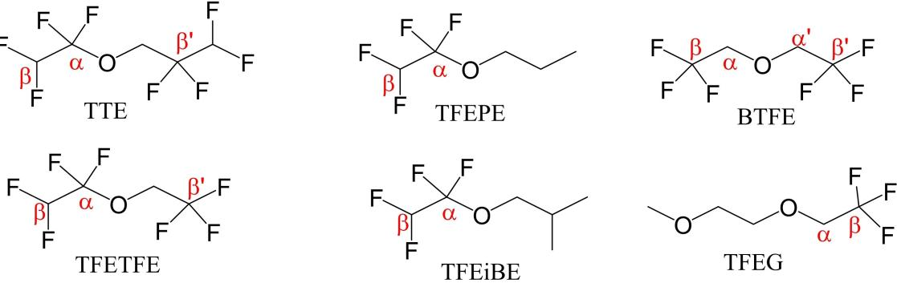

**Scheme 2.** The chemical structures of some fluorinated ether solvents.

performance of LSBs. The advantage and disadvantage of commonly used electrolytes in LSBs are summarized in Table 2. Therefore, the selection and optimization of electrolytes should receive tremendous attention for the practical application of LSBs.

# *4.2.3. Gel-polymer electrolytes*

Liquid organic electrolytes are widely used in LSBs. However, easy leakage and flammability of liquid electrolytes cause safety hazards for practical application. Furthermore, the redox LiPS intermediates dissolve and migrate towards ether-based liquid electrolytes. The diffused LiPS results in the shuttle effect and leads to fast capacity fading and low CE. On the contrary, gelpolymer electrolytes (GPEs) are considered the most viable options to replace liquid electrolytes due to their high operational safety, great wettability, and thermal stability. GPEs are prepared by incorporating small amounts of organic liquid electrolytes into the polymer matrix. GPEs provide high safety compared to liquid electrolytes, high ionic conductivities, and low interfacial resistance compared to SPEs.[117] GPEs suppress LiPS dissolution, immobilize LiPS in the polymer matrix, and alleviate the shuttle effect.

Kang et al. reported an *in situ* formed pentaerythritol tetraacrylate (PETEA)-based GPE with high ionic conductivity (1.13×10 2 S cm 1 ). The (PETEA)-based GPE immobilizes the soluble polysulfides and forms a robust and flexible electrode/ electrolyte passivation layer. As a result, LSBs assembled with the PETEA-based GPE exhibited low electrode/electrolyte interfacial resistance, higher rate capacity of ~601.2 mAhg 1 at 1 C, and improved capacity retention of ~81.9% after 400 cycles at 0.5 C.[118]

Poly(ethylene oxide) (PEO) can readily swell in ether-based electrolytes because of its good affinity with the electrolytes. Li et al. prepared PEO-based GPEs by soaking the PEO membrane in an ether-based liquid electrolyte (1 M LiTFSI/DME :DOL+ 2 wt% LiNO3). The addition of organic liquid solution as plasticizers provides high ionic conductivity of ~1.76× 10 3 S cm 1 at 25°C by decreasing the crystallinity of PEO. Moreover, LSBs with PEO-based GPEs showed improved cycle stability and capacity retention compared with liquid electrolytes.[119]

Poly(vinylidene fluoride) (PVDF)-based gel-polymer electrolytes are widely employed in LSBs. PVDF acts as a lithium salt solvating medium due to the strongly electron-withdrawing C F bonds and high dielectric constant (*ɛ*=8.4). Han et al. fabricated lithiophilic GPEs via the self-polymerization of polydopamine (PDA) on the surface of PVDF-based GPE. The lithiophilic GPEs regulate the nucleation and lithiation/delithiation process of the lithium anode, leading to a smooth anode surface with a stable SEI during the cycling of LSBs. Furthermore, PDA forms strong interaction with polysulfides and reduces the diffusion of LiPSs to the anode surface. LSBs assembled with the lithiophilic GPEs delivered a high rate capacity of ~747.1 mAhg 1 at 2 C and maintained a capacity of ~868.8 mAhg 1 after 200 cycles at 0.1 C.[120]

# *4.2.4. Solid-state electrolytes*

Solid-state electrolytes (SSEs) have emerged as alternatives to liquid organic electrolytes.[121] Substituting liquid organic electrolytes with solid electrolytes in LSBs provides high specific energy density, wide operating temperature, and safety.[122] Recently, several types of SSEs, including solid polymer electrolytes (SPEs), solid inorganic electrolytes (SIEs), and solid

| Table 2. Summary of advantages and disadvantages of electrolytes commonly used in LSBs. |                                                                                                                                                         |                                                                                                                 |
|-----------------------------------------------------------------------------------------|---------------------------------------------------------------------------------------------------------------------------------------------------------|-----------------------------------------------------------------------------------------------------------------|
| Electrolyte                                                                             | Advantage                                                                                                                                               | Disadvantage                                                                                                    |
| Liquid organic electrolytes                                                             | * High ionic conductivity * Wide potential window * Low interfacial resistance                                                                    | * High flammability * High LiPSs solubility and shuttle effect * Severe lithium anode corrosion           |
| Solid polymer electrolytes                                                              | * High flexibility * Good contact with electrodes * High thermal stability * Good processibility (film formability) * Wide potential window | * Low ionic conductivity * Poor mechanical strength                                                          |
| Solid inorganic electrolytes-oxide                                                      | * Good ionic conductivity * High mechanical stability * High thermal stability                                                                    | * Poor flexibility * High grain boundary resistance * Mismatch between electrolyte/electrode interface    |
| Solid inorganic electrolytes-sulfide                                                    | * High ionic conductivity * Moderate mechanical stability                                                                                            | * Narrow potential window * Interfacial instability * Chemical instability (sensitive to moisture and O2) |
| Solid polymer/inorganic composite electrolytes                                          | * Good ionic conductivity * Good flexibility * Favorable mechanical strength * High thermal stability * Close contact with electrodes       | * Interfacial resistance between electrolyte layers * Aggregation of inorganic particles                     |

composite electrolytes (SCEs) have been reported. The working mechanism of SSLSBs is not only different from the liquid organic-based LSBs but also varies with different SSLSBs. For example, the discharge mechanism of SSLSBs using polymer electrolytes follows a multi-step discharge mechanism, which passes through the formation of LiPSs. Thus, the shuttle effect yet remains a challenging issue in polymer-based SSLSBs. On the other hand, the discharge mechanism of SSLSBs with inorganic solid electrolytes follows a one-step (i. e., solid-tosolid) reaction mechanism.[123] In SSLSBs, since all components are solid, a significant fraction of solid electrolytes is incorporated in the cathode layer to provide Li-ion conductive pathway. The transport of Li-ion needs a smooth Li-ion conductive pathway through the cathode layer, bulk electrolyte, and electrolyte/electrodes interface.

Solid polymer electrolytes show remarkable advantages such as a simple manufacturing process, good flexibility, good compatibility with electrodes, and high chemical stability compared to SIEs.[124] However, SPEs show low ionic conductivity and poor mechanical stability.[125] SPEs commonly prepared through uniform dispersion of salts in the polymer matrices. The most frequently used polymers for SPEs include poly- (ethylene oxide) (PEO), poly(acrylonitrile) (PAN), poly(vinyl alcohol) (PVA), poly(vinylidene fluoride) (PVDF), poly(vinylidene fluoride-hexafluoropropylene) (PVDF-HFP), and poly(methyl methacrylate) (PMMA).[124]

Among these SPEs, PEO-based SPEs show good interfacial compatibility with electrodes and favorable electrochemical stability but low ionic conductivity at room temperature. To increase the ionic conductivities and mechanical strengths, inorganic fillers like metal oxides and sulfides are introduced into PEO-based electrolytes. In this regard, our group incorporated nanosized TiO2 filler into LiClO4/PEO solid electrolytes, as shown in Figure 8(a). The polar nanosized TiO2 filler improves the ionic conductivity and immobilizes LiPSs through the polarpolar interaction. The modified PEO/TiO2 electrolyte shows high ionic conductivity and improved electrochemical performance. The LSB with PEO/TiO2 electrolyte delivers a high initial capacity of 1450 mAhg 1 with an 87% capacity retention after 100 cycles at 0.1 C.[87]

SIEs are promising electrolytes alternatives for safe and high-energy LSBs. SIEs eliminate LiPSs shuttle effect and suppress lithium dendrite growth. SIEs show high Li-ion conductivities, thermal stability, and high mechanical strength.[126] SIEs are employed as a physical barrier to restrict the LiPSs shuttle effect. Several types of solid inorganic electrolytes (SIEs) are used in LSBs. Among SIEs, oxide and sulfide electrolytes are commonly employed in LSBs.

Oxide electrolytes may be further classified into sodium superionic conductor (NASICON) type (Li1+xAlxGe2 x(PO4)3, LAGP) and garnet (Li7La3Zr2O12, LLZO).[127] However, oxide-based SIEs exhibit grain boundary resistance and poor interfacial contact with electrode materials. To improve the electrode/ oxide-based SIEs interfacial contact, liquid electrolytes or SPEs are commonly combined with oxide-based SIEs. Wei et al. introduced copper fluoride (CuF2) additive in liquid electrolytes to form stable interphase between Li1.5Al0.5Ge1.5(PO4)3 (LAGP) SIE and Li metal for quasi-solid-state LSBs. The LAGP SIEs physical barrier effectively suppresses the LiPSs shuttle effect, and the CuF2 additive forms LiF/Cu interphase layer between LAGP and Li anode. As a result, the fabricated quasi-solid LSB provides stable cycling performance for 50 cycles with high coulombic efficiency of ~99.5%.[128]

Wang et al. reported a dual-phase electrolyte (different liquid organic electrolytes in each electrode compartment) separated by a ceramic lithium superionic conductor film of Li1+*x*+*y*Al*x*Ti2 *x*Si*y*P3 *y*O12 (LATP) to utilize Li2S cathode efficiently. The protective LATP film is permeable to Li-ions while impermeable to soluble LiPSs and retains the soluble LiPSs on the Li2S cathode side. C Consequently, the parasitic reactions associated with the soluble LiPSs shuttle effect were eliminated successfully. Moreover, the constrained soluble LiPSs serves as a redox mediator and facilitate the oxidation of micro-size Li2S cathode. As a result, the designed cell shows a stable discharge capacity of ~900 mAhg 1 and ~100% coulombic efficiency for 150 cycles at 0.05 C.[129]

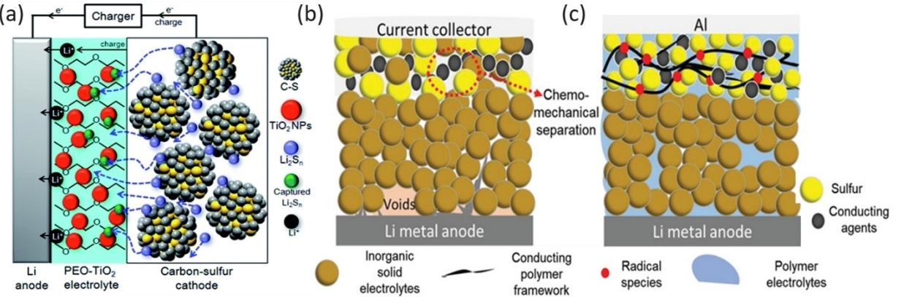

**Figure 8.** A schematic illustration of solid-state lithium-sulfur batteries with a) polymer Reproduced with permission from Ref. [87]. Copyright (2017) Royal Society of Chemistry. b) Inorganic, and c) composite electrolytes. Reproduced with permission from Ref. [125]. Copyright (2020) The Authors. Published by WILEY-VCH.

Garnet-type oxide electrolytes show high ionic conductivity (10 4 S cm 1 ) at room temperature and superior chemical stability towards lithium metal and LiPS intermediates compared to other oxide electrolytes.[130] Hitz et al. reported SSLSBs fabricated using a trilayer porous-dense-porous structured LLZO membrane with dense SIE in contact with Li metal and high surface area SIE contact with active material. The trilayer cell fabrication strategies constrain the LiPS intermediates and enable good stability during cell electrochemical cycling. As a result, the fabricated cell with an ionic liquid electrolyte added to the cathode side delivered a high discharge capacity of 1244 mAhg 1 at 0.22 mAcm 2 . [131]

Sulfide electrolytes (SEs) attracted major attention due to their good compatibility with sulfur cathodes. However, SEs suffer from grain boundary resistance, high interfacial resistance, and moisture/air sensitivity. Moreover, the sulfur cathodes show huge volume change during the discharge and charge process, which causes contact loss between active materials, SEs, and conductive additives. This process is called chemomechanical separation, as shown in Figure 8(b). Chemomechanical separation leads to high resistance, fast capacity decay, and short cycle life of the SSLSBs. Since all components are solid, intimate contacts of the active materials, electrolytes, and conductive carbon additives are required. However, the close contact of the high surface area conductive carbons with the SEs leads to decomposition of the SEs by oxidation during the charging process. This phenomenon results in poor coulombic efficiency, especially in the initial cycles until an insulating passivation layer is formed. The sulfur coating on conductive carbons improves the close contacts of the cathode components and suppresses the chemo-mechanical separation. In this regard, Yao et al. report SSLSBs using Li10GeP2S12 electrolyte and amorphous sulfur coated rGO cathode. The SSLSBs delivered a discharge capacity of 1500 mAhg 1 at 0.05 C after 30 cycles at 60°C. The amorphous sulfur coating layer on the electronically conductive rGO sheets enables good contact with the ionically conductive Li10GeP2S12 electrolyte, which endows to form a good conduction network and facilitate both the Liion and electron transport in the composite cathode. Moreover, amorphous coating on the rGO sheet reduces the decomposition of SEs during oxidation.[132] Recently, Nazar group reported SSLSBs composed of β-Li3PS4 and core-shell structure S/VS2 cathode composite. The core-shell structure of the S/VS2 composite enables the coating of electronic conductive VS2 by insulating sulfur active materials and reducing the decomposition of SEs through oxidation during charging. Moreover, the ductility nature of Li3PS4 enables intimate contact between the SEs and the cathode composites via physical blending during the fabrication of the SSLSBs.The SSLSBs provided a reversible specific capacity of 1444 mAhg 1 sulfur.[6]

Solid composite electrolytes combine the benefits of both inorganic and polymer electrolytes to surpass the bottlenecks of single SSEs. The inorganic materials enhance ionic conductivity and mechanical strength, while polymer materials provide structural stability and low interfacial resistance in SCEs.[124] Oxide SIEs are frequently introduced to the polymer matrix as a filler to enhance the ionic conductivity and transference number of the composite electrolytes. Oxide SIE filler decreases the crystallinity of the polymer matrix and induces percolation behavior at the polymer/inorganic interface. Moreover, the oxide SIEs fillers are involved in enhancing total ionic conductivity by creating the Li+ mobility pathway along/near the oxide SIE/SPE interfaces.[133] For example, Wang et al. compared the role of oxide fillers on the conductivity of SCEs by introducing three different fillers such as LATP, TiO2, and fumed silica nanoparticles dispersed in PEO matrices. Among the three SCEs examined, LATP/PEO electrolyte with 10 wt% LiClO4 showed the highest ionic conductivity and degrees of crystallinity.[134]

Tao et al. introduced LLZO filler to construct LLZO-PEO-LiClO4 SCE-based SSLSBs. The introduced active oxide SIE filler enhances the conductivity of the SCEs. As a result, the fabricated SSLSBs exhibited good cycle stability with ~98.7% capacity retention after 90 cycles and coulombic efficiency of ~100% for 200 cycles at 0.05 mAcm 2 at 37°C.[135]

Li et al. reported a SSLSB fabricated using a Li3.25Ge0.25P0.75S4 (LGPS)/PEO composite electrolyte and sulfur/PEO composite cathode, as shown in Figure 8(c). The addition of PEO electrolyte in the cathode composite enhanced the cathode electrolyte interface and suppressed electrolyte decomposition during charging.[125] The SSLSB provided an initial discharge capacity of 1772 mAhg 1 and retained 588 mAhg 1 after 50 cycles at 0.1 C.

#### **4.3. Separator modification and interlayer insertion**

#### *4.3.1. Separator modification*

The separator is an indispensable component in the LSBs.[136] It is a nanoporous polymer membrane with a porosity that serves as a channel to allow the diffusion of Li-ions and an electron insulating barrier to prevent short circuits.[137] The frequently used polyolefin separators in LSBs are polyethylene (PE), polypropylene (PP), and a multilayered PP/PE composite. These series of polyolefin separators have the advantages of being lightweight, having excellent chemical stability, and outstanding electrical insulating properties. The commercial PE, PP, or PP/PE separators have large pores and poor ion selectivity. Consequently, the soluble LiPSs diffuse into the electrolytes and easily pass through the pores of the separators causing severe LiPSs shuttle effect. The shuttled LiPSs intermediates react with lithium anode leads to insulating Li2S2/Li2S passivation and ultimately corrosion of lithium anode. Therefore, the commercial separator modification or an interlayer insertion is an effective approach to restrict the dissolved LiPSs intermediates on the cathode side and enable reutilization of the trapped active LiPSs intermediate species.[138]

The functional coating on the separator plays a significant role by tuning the pore size, interfacial properties, wettability with electrolytes, porosity, and inner structure of the separator.[139] Furthermore, the functional coating layer/multifunctional interlayers/improves the selective ion transport of separators, regulates the LiPSs intermediates via physical and chemical confinement, and provides a sufficient active site for

LiPSs intermediates anchoring and conversion. The functionally decorated separator blocks the infiltration of dissolved LiPSs intermediates toward the anode side. Various materials have been developed to modify separators, including carbon materials,[140] organic polymer materials,[141] inorganic oxide materials, and other novel functional materials.[142]

Recently, Sun's group reported a multifunctional carbon/ molybdenum carbide (KB/Mo2C) coated separator for LSBs and investigated the role of the Mo2C on the conversion of soluble LiPSs. The polar Mo2C decorated separator exhibits strong LiPSs anchoring ability and facilitates the conversion kinetics of LiPSs intermediates. Hence, the Mo2C coated separator effectively mitigates the LiPSs shuttle and improves the electrochemical performance of LSBs. The LSBs with the KB/Mo2C modified separator show electrochemical cycle stability for 600 cycles at 1 C.[143] Ma et al. prepared a single-atom (SA) Fe and polar Fe2N co-embedded in nitrogen-doped graphene (SA Fe/Fe2N@NG) and applied it to modify the commercial PP separator for LSBs. The SA Fe/Fe2N@NG coating layer exhibited strong LiPSs adsorption, suppressed shuttle effect, and facilitated the conversion of sulfur to LiPSs to Li2S and vice versa. Subsequently, the LSBs with SA Fe/Fe2N@NG modified separator provide an initial discharge capacity of 1242.4 mAhg 1 at 0.2 C and retain reversible capacities of 801.3 mAhg 1 at 1 C and 604.7 mAhg 1 at 4 C after 500 cycles, as shown in Figure 9(a).[43c]

Mo2C is deployed as an electrocatalyst for sulfur conversion reaction due to its good electrical conductivity (1.41× 104 S cm 1 ), superior polysulfide anchoring, and catalytic ability. Qian et al. prepared a hierarchical Mo2C nanocluster/carbon nanosheets hybrid-based hollow spherical conductive polar mediator (Mo2C/CHS) to improve the performance of LSBs. The CHS material facilitates the electrolyte infiltration, while the conductive Mo2C nanocrystal active sites anchor LiPSs, and show catalytic activity to convert LiPSs to Li2S. Benefitting from the synergistic effects, Mo2C/CHS greatly promotes electrochemical kinetics in LSBs, as shown in Figure 9(b). The LSBs with Mo2C/CHS modified separator provide a reversible discharge capacity of 784.8 mAhg 1 with a capacity decay of 0.06% per cycle over 300 cycles at 1 C and the coulombic efficiency of almost ~100% throughout cycling.[144]

## *4.3.2. Multifunctional interlayer insertion*

An interlayer insertion between separator and electrode, as shown in Figure 10(a). Functional interlayers provide an alternative approach to improving the electrochemical performance of LSBs. Functional interlayers are inserted into LSBs to inhibit the shuttle of LiPSs, provide a Li-ion mobility channel, promote the LiPSs redox kinetics, and ultimately improve active materials utilization and cycling performance.[145]

Several multifunctional interlayers are constructed from various nanostructure carbon materials such as porous carbons,[146] CNT,[147] carbon nanofibers (CNF),[148] graphene,[149] and graphene oxides.[150] Nanostructure carbon-based interlayers serve as a physical barrier to limit the diffusion of soluble higher-order LiPSs into the anode side. Manthiram's group prepared a functional interlayer from microporous carbon paper and inserted it between the cathode and separator in LSBs. The inserted interlayer reduces the internal charge transfer resistance and blocks the migration of soluble LiPSs species into the anode. Consequently, the microporous carbon paper interlayer enhances the performance of LSBs.[146a] Gu et al. reported porous nitrogen and phosphorus dual doped graphene (p-NP-G) interlayer for LSBs. The p-NP-G interlayer show high electrical conductivity and strong higher-order LiPSs adsorption capability. As a result, LSBs with p-NP-G interlayer show an initial discharge capacity of 1158 mAhg 1 and retain a high reversible capacity of 638.0 mAhg 1 after 500 cycles at

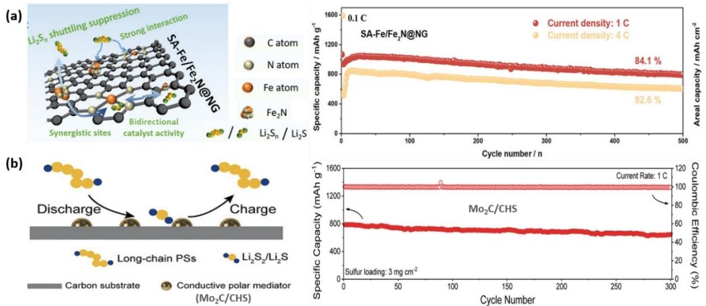

**Figure 9.** Schematics illustrating of conductive polar mediator in improving the electrochemical performance of LSBs. a) SA Fe/Fe2N@NG coated separator. Reproduced with permission from Ref. [43c]. Copyright (2021) Wiley-VCH GmbH. b) Mo2C/CHS coated separator. Reproduced with permission from Ref. [144]. Copyright (2021) Wiley-VCH GmbH.

*Batteries & Supercaps* **2022**, *5*, e202200059 (19 of 32) © 2022 Wiley-VCH GmbH

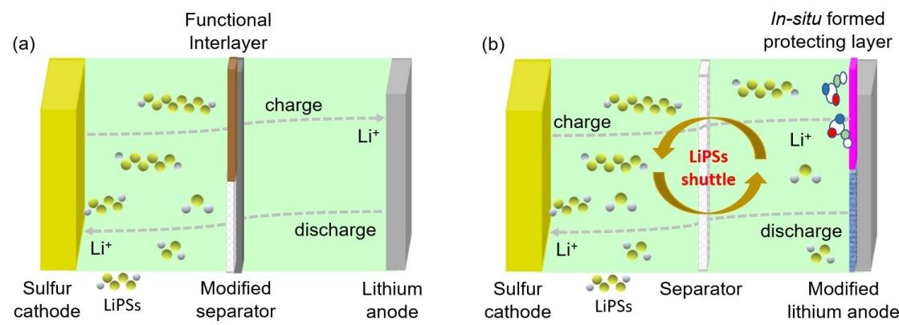

**Figure 10.** Schematic of the design of LSB configurations with; a) modified separator/functional interlayer, b) modified lithium anode.

1 C.[149b] However, nanostructure carbon materials interlayers restrict soluble LiPSs through relatively weak van der Waal's nonpolar to polar interactions, leads to unsatisfactory cycling performance.

In recent years, various novel polar nanostructure materials have been developed as interlayers to improve the performance of LSBs. The developed polar nanostructure interlayers block the diffusion of soluble LiPSs through a strong chemical interaction. Furthermore, most polar nanostructure interlayers provide an active catalytic site and facilitate the conversion of higher-order LiPSs into Li2S2/Li2S, ultimately increasing the active materials utilization and reversible capacity of LSBs. Yang and coworkers designed a twinborn TiO2-TiN heterostructure loaded on a graphene interlayer to realize the trapping and conversion of LiPSs for high-performance LSBs. Benefiting from the synergistic advantage of the strong LiPSs anchoring capability of TiO2 and catalytic LiPSs to Li2S conversion effect of TiN heterostructure, LSBs with the multifunctional interlayer retain reversible discharge capacities of 704, 503, and 331 mAhg 1 with sulfur loadings of 1.2, 3.1, and 4.3 mgcm 2 after 2000 cycles at 1 C, respectively.[60b] Similarly, a selfstanding hollow carbonized cotton cloth (CCC) decorated with TiO2-TiN heteronanowires (CCC@TiO2-TiN) was developed by Xi and coworkers. One side of the CCC@TiO2-TiN heterostructure serves as a current-collector and a sulfur host (CCC@TiO2-TiN/S), while the other side acts as an interlayer to inhibit the shuttle effect. The integrated heterostructure interlayer/current collector cathode provides 3D electrons/Li-ion conduction channels, strong chemical anchoring sites, and active catalytic sites for redox conversion of LiPSs to Li2S2/Li2S and vice versa. Consequently, the integrated interlayer/cathode of CCC@TiO2-TiN/S achieves a high sulfur loading of 13 mgcm 2 and delivers a capacity of 9.09 mAhcm 2 under the ultralow E/S ratio of 4.6 μLmg 1 . [151] However, the high catalytic activities of the polar interlayer materials may aggravate an electrolyte decomposition to gaseous products.[152]

The insertion of interlayers scarifies the energy density of the LSBs since interlayers cannot contribute to the discharge capacity of the batteries. Therefore, the chemical composition, mass, and thickness of functional interlayers should be wisely optimized to improve the performance of LSBs. Several separators coating/interlayer materials with the corresponding electrochemical performance in LSBs are illustrated in Table 3.

#### **4.4. Protection of lithium metal anode**

In LSBs, soluble polysulfides diffuse into the electrolyte and react with lithium forming an insulating Li2S2/Li2S on the surface of the lithium anode. The accumulation of an insulating passivation layer on the surface of lithium anode reduces the Li-ion conductivity. During continuous charge/discharge, the volume expansion of lithium anode results in SEI fracture and exposes the fresh lithium surface to react with electrolyte, leading to consumption of active lithium and electrolyte depletion. Consequently, the consumption of both the active Li/Li+ and the electrolyte ultimately results in a low coulombic efficiency and poor cyclability.[167] Several strategies have been developed to protect lithium anode structure in LSBs,[168] including *in situ* interfacial modification of lithium anode by tuning electrolyte composition and an artificial coating layer before battery assembly, as shown in Figure 10(b).

#### *4.4.1.* **In situ** *lithium anode protection*

The reaction of the lithium anode and the electrolyte components *in situ* form an SEI passivating film. The pioneering work by E. Peled revealed that the SEI layer could protect the surface of lithium anode. The SEI passivating layer slows down the further reaction of electrolyte components and lithium anode, reduces lithium anode's corrosion, and enhances the cycle life of LSBs.[169] The composition and properties of the SEI layer are critical to the electrochemical performance of the lithium anode. Therefore, the rational design of the electrolyte compositions such as stable solvents, salts, and reactive functional additives can regulate the stability and microstructure of the protective layer (SEI).[170] An ideal SEI formed on the lithium anode surface should have high ionic conductivity, electronically insulating properties, dense and uniform morphology, and good flexibility during the lithiation and delithiation process.[171] Regulating the quality of SEI without introducing additional

*Batteries & Supercaps* **2022**, *5*, e202200059 (20 of 32) © 2022 Wiley-VCH GmbH

SCOF

=Sulfonate Covalent organic frameworks

| Chemistrv <b>Europe</b>                |
|-------------------------------------------|
| European Chemical Societies Publishing |

|                           | Table 3. Summary of electrochemical performances of LSBs with different modified separators and functional freestanding interlayers. |                      |                         |                                |                           |                              |                                                        |        |
|---------------------------|--------------------------------------------------------------------------------------------------------------------------------------|----------------------|-------------------------|--------------------------------|---------------------------|------------------------------|--------------------------------------------------------|--------|
| materials Coating      | separator/interlayer Modified                                                                                                     | composite Cathode | content [wt%] Sulfur | Sulfur loading ] [mgcm 2 | thickness [μm] Coating | Mass loading ] [mgcm 2 | Cycling performance                                    | Ref.   |
| B-rGO                     | B-rGO coated PP                                                                                                                      | CNT/S                | 56                      | 1.45                           | 25                        | 0.3                          | 593 mAhg 1 after 100 cycles at 2 C                     | [153]  |
| Co/mSiO2-NCNTs            | Co/mSiO2/NCNTs coated PP                                                                                                             | S/Super P            | 80                      | 1.15                           | 11.3                      | 0.25                         | 774 mAhg 1 after 250 cycles at 1 C                     | [154]  |
| g-C N3 4                  | g-C-coated PP                                                                                                                        | C/S                  | 54                      | 1.7                            | 26                        | 1.5                          | 732.7 mAhg 1 after 500 cycles at 1 C                   | [155]  |
| graphene                  | G@PP separator                                                                                                                       | CB/S                 | 70                      | 2.1–2.8                        | 20                        | 1.3                          | 1000 mAhg 1 after 100 cycles at 0.46 C                 | [156]  |
| iCON on Ti3C2             | coated PP Ti3C @iCON 2                                                                                                         | CNT/S                | 61-72                   | 1.2                            | 6                         | 0.1                          | 706 mAhg 1 after 2000 cycles at 2 C                    | [157]  |
| Ion-selective film        | TpPa-SO3Li@PP                                                                                                                        | CNT/S                | 56                      | 5.4                            | 0.23                      | 0.37                         | 639 mAhg 1 after 100 cycles at 0.2 C                   | [158]  |
| Mo2C/CHS                  | Mo2C/CHS coated PP                                                                                                                   | CNT/S                | ~70                     | 3                              | 6                         | 0.2                          | 384.8 mAhg 1 after 300 cycles at 1 C                   | [144]  |
| MoS2                      | MoS2 coated PP                                                                                                                       | CB/S                 | 65                      | N/A                            | 350 nm                    | N/A                          | mAhg 1 after 600 cycles at 0.5 C 401                | [159]  |
| Fe/Fe N@NG 2  SA | coated PP Fe/Fe N@NG 2  SA                                                                                               | SA Fe/Fe N@NG/S 2 | ~80                     | 1.5                            | 5                         | 0.1                          | mAhg 1 after 500 cycles at 1 C 801                  | [43c]  |
| SCOF                      | SCOF-2@PP                                                                                                                            | S/CB                 | 75                      | 1.5                            | 6                         | 0.15                         | 497 mAhg 1 after 800 cycles at 1 C                     | [160]  |
| TiO2-TiN@graphene         | TiO2-TiN@G coated PP                                                                                                                 | G/S                  | ~70                     | 3.1                            | 9 μm                      | 0.23                         | 503 mAhg 1 after 2000 cycles at 1 C                    | [60b]  |
| O2 @PANI 5 V        | coated PP V O2 @PANI 5                                                                                                         | C/S                  | 76                      | 1.2                            | 8                         | 0.2                          | 585.8 mAhg 1 after 1000 cycles at 1 C                  | [161]  |
| ZnS-SnS @NC 2          | ZnS-SnS@NC coated PP                                                                                                                 | CNT/S                | 78                      | 2.0–2.2                        | 10                        | 0.5                          | 632 mAhg 1 after 2000 cycles at 4 C                    | [43a]  |
| CCC@TiO2-TiN              | TiO2-TiN interlayer                                                                                                                  | CCC@TiO2-TiN/S       | 60                      | 1.2                            | N/A                       | 3.64 mg                      | 690 mAhg 1 after 500 cycles at 2 C                     | [151]  |
| CCI/WS2                   | CCI/WS2 interlayer                                                                                                                   | S/WS2                | 70                      | 3.0 mg                         | N/A                       | N/A                          | 1000 mAhg 1 after 500 cycles at 0.5 C                  | [162]  |
| CNT/MoP2                  | CNT/MoP2 interlayer                                                                                                                  | S/Super P            | 50                      | 1.2                            | N/A                       | 0.34                         | 543 mAhg 1 after 500 cycles at 0.1 C                   | [163]  |
| CNT/MoS2                  | CNT/MoS2 interlayer                                                                                                                  | S/Super P            | 50                      | 1.4                            | 2                         | 0.25                         | 648 mAhg 1 after 500 cycles at 0.5 C                   | [164]  |
| 5 RSL O2 CNTs/V     | 5 RSL O2 CNTs/V                                                                                                                | S/CB                 | 50                      | 2                              | 17                        | 0.4                          | 939 mAhg 1 after 250 cycles at 1 C                     | [165]  |
| G/M@CNT                   | G/M@CNT interlayer                                                                                                                   | o-CNT/S              | 65                      | 1.11                           | 2                         | 0.1                          | mAhg 1 after 200 cycles at 0.5 C 841                | [166]  |
| p-NP-G                    | p-NP-G interlayer                                                                                                                    | CB/S                 | 70                      | N/A                            | N/A                       | 1                            | 638 mAhg 1 after 500 cycles at 1 C                     | [149b] |
| =carbon CCI Note:   | g=graphene; cloth interlayer;                                                                                                     | G/M@CNT=Ultrathin    | MnO2/graphene           | nanotube; oxide/carbon      | available; =not N/A | =separator; PP            | polysulfide-scavenging layers; =regenerative RSL |        |

weight or volume is a significant approach to enhance the performance LSBs. Accordingly, electrolyte designing strategies have been extensively investigated in developing favorable *in situ* lithium protection layers.[172] The electrolyte/electrode interface in LSBs is frequently stabilized by tuning the SEI composite with novel electrolyte or electrolyte additives.

The electrochemical reductive decomposition of ether electrolytes provides a flexible oligomer-rich SEI layer that strongly adheres to lithium surface by the alkoxy O Li group.[173] The SEI composition formed from the decomposition of various electrolyte constituents (solvents, salts, and additives) is given in Scheme 3. As shown in Scheme 3(a–c), DOL undergoes ring-opening polymerization on the surface of lithium anode to produce lithium alkoxide (ROLi) species, oligomers with OLi edge groups, and release ethane, ethene, and CH2O gases. Furthermore, the decomposition of LiTFSI salt enhances the formation of salt-initiated SEI components. The LiTFSI molecules reduce on the surface of the lithium anode and form Li*x*NSO2CF3 and Li*x*SO2CF3 species. These species further react with the LiOR species (from the decomposed DOL) and produce Li*x*N, Li*x*O, Li*x*CF*y*, Li*x*NO*y*, Li*x*SO*y*, and Li2S SEI components. In addition, the Li*x*SO2CF3 was reduced further on the lithium metal to yield Li*x*O, Li*x*N, and Li*x*F SEI composition.[174]

The electrolyte additives are directly incorporated into electrolytes to modify the SEI composition and stability, which eventually regulates the lithium deposition morphology and mitigates lithium anode corrosion upon continuous (de) lithiation, which ultimately improves the performance of LSBs. Inspired by the pioneer report of Aurbach's group, various types of electrolyte additives are introduced in LSBs.[14] Several metal nitrates (MNO3, where M=Li, Na, K, Cs, La),[175] polysulfides,[176] sulfur-rich polymers,[177] etc., are extensively investigated as electrolyte additives to improve the cycle stability of LSBs.[178] The functional additives directly participate in forming stable SEI passivating film on lithium metal anode. The resulting SEI film prevents the reduction of LiPSs on the surface of the lithium anode.

Zhang investigated the role of LiNO3 electrolyte additive on the performance of LSB by adding 0.2 M LiNO3 as a co-salt into LiTFSI/DOL :DME electrolyte. The LiNO3 co-salt forms a stable SEI layer on the lithium anode surface, but the thickness of the resulting film increases indefinitely with the continuous consumption of LiNO3. Contrary, LiNO3 reduces on sulfur cathode ~1.6 V in the first discharge and forms an irreversible reduction product which adversely affects the performance of the LSBs. By limiting the irreversible reduction of LiNO3 on the sulfur cathode, the LSB with the modified electrolyte showed a stable discharge capacity of 500 mAhg 1 after 110 cycles in the potential range of 1.7–2.8 V.[179] Liang et al. prepared a modified electrolyte by adding the proper amount of LiNO3 additive into 0.5 M LiCF3SO3/DOL : TEGDME electrolyte. The LSBs with the modified electrolyte improve cycling stability and stable reversible discharge capacity of ~527 mAhg 1 after 50 cycles.[180] Jia et al. reported the high reversible discharge capacity of 687 mAhg 1 after 100 cycles by adding KNO3

*Batteries & Supercaps* **2022**, *5*, e202200059 (21 of 32) © 2022 Wiley-VCH GmbH

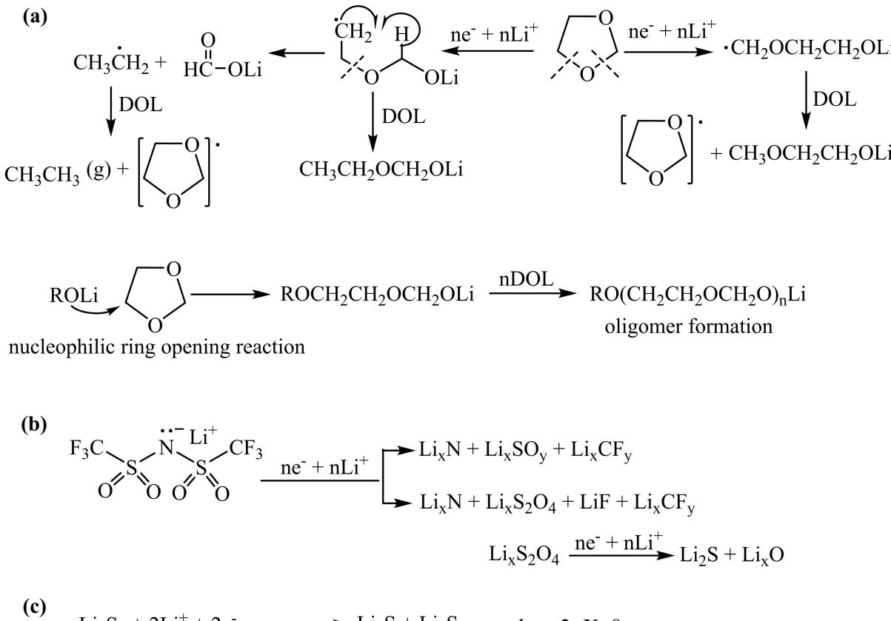

(d) 
$$
LiNO_3 + nLi^+ ne^- \longrightarrow Li_x NO_y + Li_x N + N_2
$$

**Scheme 3.** The SEI composition is derived from the decomposition of electrolyte constituents (solvents, salts, and additives) on the surface of Li-metal anodes. a) Oligomer-rich SEI formation, b) LiTFSI derived SEI formation, c) sulfide-rich SEI formations, d) LiNO3 based SEI formation. Reproduced with permission from Ref. [14]. Copyright (2009) Electrochemical Society.

additive into 1 M LiTFSI/DOL :DME electrolyte in the LSB system.[175]

Polysulfide additives introduce in ether electrolytes to enable sulfide-rich SEI on the surface of lithium anode. Cui group utilized lithium polysulfide (Li2S8) and LiNO3 additives in the ether-based electrolytes. The Li2S8 additive reduces to Li2S2/ Li2S and forms sulfide-rich SEI on the surface of a lithium anode, which effectively suppresses the growth of lithium dendrites. The synergetic effect of both additives forms a stable and dense SEI layer on the lithium surface that minimizes electrolyte decomposition and prevents dendrites growth.[181] Xiong et al. utilized Li2S6 and LiNO3 additives in the DOL/DME electrolyte to investigate the structure and component of SEI film formed on the lithium anode surface. The reduction of both additives on the surface of lithium anode forms a dual-layer inorganic (LiN*x*O*y*, Li2S/Li2S2) SEI components. The deposition of LiN*x*O*y* and Li2S/Li2S2 leads to a smooth and compact SEI layer. This dual-layer SEI film effectively stabilizes lithium anode.[176]

Manthiram and coworkers introduce tellurium (Te) as a cathode additive into LSBs. The Te additive oxidizes in the presence of LiPSs at the cathode and forms soluble polytellurosulfide species (Li2Te*x*S*y*). The soluble Li2Te*x*S*y* diffused into the anode, reduced to lithium thiotellurate (Li2TeS3) and lithium telluride (Li2Te) species forming a bilayer SEI on the surface of the lithium anode. Furthermore, Te forms more polarizable ions due to its lower electronegativity than S, larger size, and higher shielding effect that enables higher Li-ion conductivity of the *in situ* formed bilayer SEI on the lithium anode surface. The Li2S cathode with Te additive retains a high reversible discharge capacity of 620 mAhg 1 (2.45 mAhcm 2 ) at 0.2 C after 240 cycles, as shown in Figure 11(a).[182]

Huang et al. introduced a sulfur-rich aromatic polymer (poly(sulfur-random-1,3-diisopropenylbenzene) (PSD) additive in ether electrolyte to extend the cycle life of LSB. The electrochemical decomposition of PSD additive on the surface of lithium anode formed an aromatic organic component (lithium organosulfides and lithium organopolysulfides) and inorganic components (Li2S2 and Li2S) hybrid flexible and robust SEI layer. The π-π interactions in aromatic organic components facilitated the formation of a flexible, robust, and uniform SEI Review doi.org/10.1002/batt.202200059

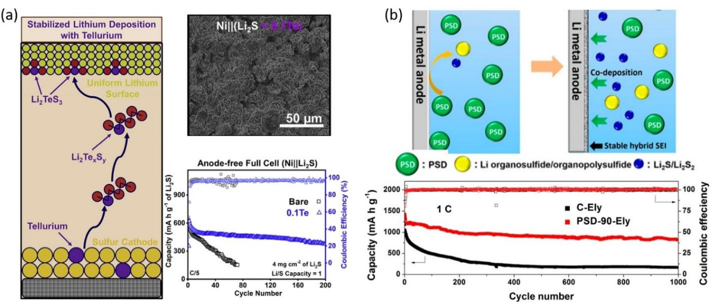

**Figure 11.** The protection of lithium anode in LSBs by *in situ* formed SEI layer and effects on the performance of LSBs. a) Te additive. Reproduced with permission from Ref. [182]. Copyright (2020) Elsevier Inc. b) PSD additive. Reproduced with permission from Ref. [177]. Copyright (2018) American Chemical Society.

layer, while the inorganic components provided Li-ion conductive pathways and mechanical strength. The hybrid flexible and tough SEI protective layer formed on lithium anode improved the electrochemical performance of LSBs. The LSBs with PSD additive exhibited high capacity retention and coulombic efficiency after 1000 cycles at 1 C, as shown in Figure 11(b).[177]

Additives with relatively acidic properties also stabilize the soluble LiPSs in LSBs. Accordingly, alkali metal cations show relatively acidic properties that effectively stabilize soluble polysulfides. Ammonium salts (such as NH4TFSI, NH4I, and NH4NO3) are also used as additives to facilitate the stability of low-order polysulfides and even solid Li2S due to the strong interaction between NH4 + and S*x* 2 . Shao et al. introduce NH4TFSI additive in the electrolyte solution to mitigate the irreversible accumulation of Li2S and increase the cycle life of LSBs. The NH4TFSI additive promotes the dissociation of Li2S2/ Li2S and effectively maintains the redox reaction in the sulfur cathode. The passivation effect of Li2S in the cathode is greatly suppressed due to the uniform distribution of Li2S, enabling much-improved cycle life under lean electrolyte conditions. In addition, the NH4TFSI additive in electrolyte enables a homogeneous morphology of lithium anode and robust SEI layer during long-term cycling, which endows the extended cycle life of LSBs.[27]

Manthiram's group introduced a copper acetate additive to stabilize the surface of lithium anode in LSBs. The copper acetate additive forms a heterogeneous sulfide matrix such as Li2S/Li2S2/CuS/Cu2S stable, protective layer that improves the surface chemistry of lithium anode. The *in situ* formed passivating layer protects the lithium anode from further parasitic reactions with the liquid electrolyte and migrating LiPSs. Furthermore, the passivating layer controls the lithium deposition site and improves the lithium deposition morphology. Consequently, the robust passivating layer endows the cell dendrite-free lithium anode morphology, revealed by stable electrochemical cyclability and low battery resistance.[183]

The electrolyte additives are consumed gradually upon extended cycling of LSBs. Furthermore, the SEI passivating layer formed may not fully accommodate the volume change of lithium anode during de(lithiation) processes.

## *4.4.2. Artificial funational layer for lithium anode protection*

In addition to electrolyte additives, various functional protecting layers are utilized to stabilize the lithium anode interfaces. A dense and stable protective layer for lithium anode can be constructed by *ex situ* methods before cell assembly. An ideal protecting layer should have good chemical/electrochemical stability, high ionic conductivity, and accommodate the volume changes of the lithium anode during the cycling of LSBs. An efficient protective layer prevents the side reactions between lithium anode and LiPSs, reduces the consumption of electrolytes, and inhibits lithium dendrite growth during cycling. Many encouraging outcomes were reported by modifying a current collector with robust artificial solid electrolyte interphase and lithiophilic matrix to realize uniform lithium deposition in anode free lithium metal batteries.[25c,184] Sulfurized polyacrylonitrile (SPAN) is well known organosulfur material,[185] which contains an abundance of sulfide chains that are anchored by covalent bonds and pyridinic backbones that have a strong Liion affinity (serve as lithiophilic matrix). Considering the advantages of SPAN, Jiang et al. prepared a SPAN-protected ultrathick lithium metal anode (LiSPAN@Cu-LMA) through overlithiation (deep discharge) strategy, which forms a Li2S-rich SEI over deposited lithium on the surface of the copper current collector. The synergistic effect of the lithiophilic pyridinic

matrix and a robust Li2S rich SEI enables a dense deposition of lithium metal. Consequently, as shown in Figure 12(a), LiS-PAN@Cu-LMA anode enables the LSBs with sulfur (Se0.05S0.95PAN) cathode to deliver high areal capacity (12 mAhcm 2 ) and stable cycle stability for 100 cycles with 70% capacity retention with an E/S of 2.2 μLmg 1 . [186]

Zhang and coworkers prepared selectively permeable Li-ion channels on the lithium metal surface through a direct reaction of lithium metal anode, and the lithiophilic aminopropyl terminated Polydimethylsiloxane (AT-PDMS). The coating permeable layer allows the mobility of lithium ions through the channels by electrochemical overpotential but blocks the polysulfides effectively due to the larger steric hindrance, as shown in Figure 12(b). The LSBs with AT-PDMS modified Li anode pouch cell retained 80% capacity with 99% coulombic efficiency after 75 cycles at 0.1 C with an E/S ratio of 5:1.[187]

Guo et al. introduced robust biphasic surface layers (BSLs) on lithium metal by a solution pretreatment method with a solution of metal fluorides (SnF2)/dimethylsulfoxide, as shown in Figure 12(c). The *in situ* formed BSLs comprised of lithiophilic alloy (Li*x*M) and LiF phases on lithium metal showed a high Liion conductivity and good mechanical strength. The *in situ* formed BSLs (Li5Sn2/LiF) inhibited dendrite growth and shielded the lithium anodes from corrosive reaction with LiPSs. LSBs with BSLs-lithium anodes showed excellent cycle stability over 1000 cycles at 1 C, maintained a specific capacity of 511 mAhg 1 , and a high coulombic efficiency of 98.2%.[188]

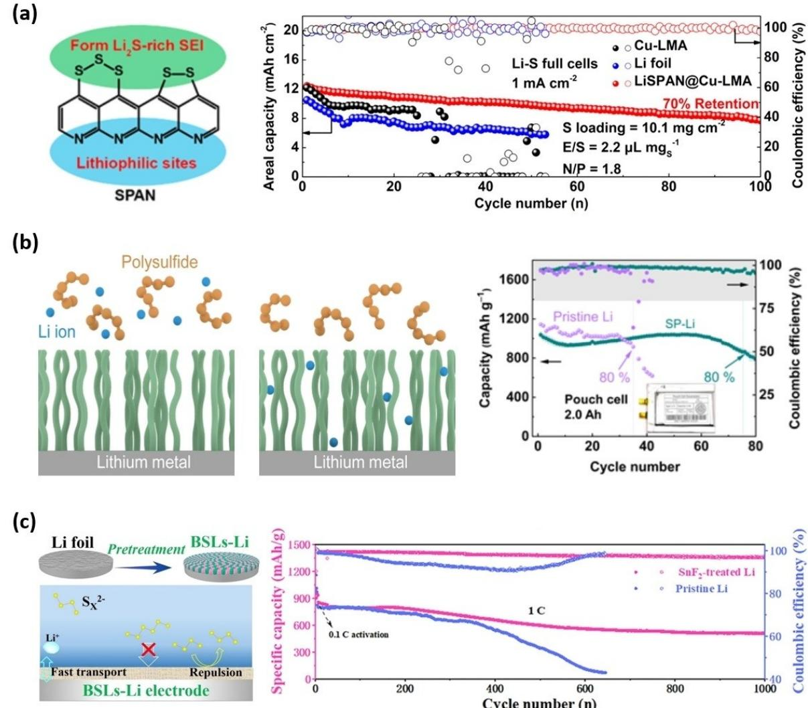

**Figure 12.** a) Schematic illustration of the advantages of SPAN as a coating layer on Li metal and the cycle performance of LSBs with different anodes. Reproduced with permission from Ref. [186]. Copyright (2020) American Chemical Society. b) Schematic illustration of the diffusion behavior of lithium ions through ordered selective permeable polymer interphase and the cycle performance of LSBs pouch cell at 0.1 C. Reproduced with permission from Ref. [187]. Copyright (2021) Wiley-VCH. c) Schematic illustration of the robust BSLs on the lithium metal electrodes and the cycling performance of LSBs with the pristine and SnF2-treated lithium anodes at 1 C. Reproduced with permission from Ref. [188]. Copyright (2020) Wiley-VCH.

*Batteries & Supercaps* **2022**, *5*, e202200059 (24 of 32) © 2022 Wiley-VCH GmbH

# **5. Advanced** *in situ***/***in-operando* **Analytical Techniques**

The advanced characterization techniques have an inevitable advantage for developing and optimizing LSBs with effective electrochemical performance.[189] The rapid development of numerous material characterization and electrochemical analysis techniques makes it possible to observe the electrodes structure and electrochemical performance of LSBs. During the past years, *ex situ*, *in situ*, and in-operando characterization tools have also been developed for an in-depth understanding of LSB systems. The *ex situ* characterization tools are used to probe the pristine electrode structure, electrolyte components, and post-mortem analysis of electrode and electrolyte components. Furthermore, *in situ* and in-operando characterization techniques are used to explore the electrode structure evolution, interfacial process, and redox mechanism of LSBs under operating conditions.[190]

The electrode structures, interfacial process, and redox mechanism of LSBs are closely related to the electrochemical performance of the LSBs including the energy density, rate capability, and cycle life. In-depth understanding of these relationships is indispensable to designing and developing LSBs with high electrochemical performance. The crystalline structural change and morphological evolution of electrodes during electrochemical reactions of LSBs investigated using Xray diffraction (XRD). Yu et al. visualized the sulfur cathode morphology changes and phase transformation of sulfur species by integrating in-operando X-ray techniques such as XRD and X-ray tomography during the electrochemical cycling of LSBs.[191] The first cycle discharge profile, operando XRD patterns, and X-ray microscopy (XRM) images of the sulfur cathode at different depths of discharge (DOD) are presented in Figure 13(a–d). The typical discharge curve of sulfur cathode exhibited two voltage plateaus, as shown in Figure 13(a). The operando XRD patterns of sulfur cathode and the integrated intensities of diffraction peaks for S8 and Li2S at different DOD are displayed in Figure 13(b and c), respectively. The intensity

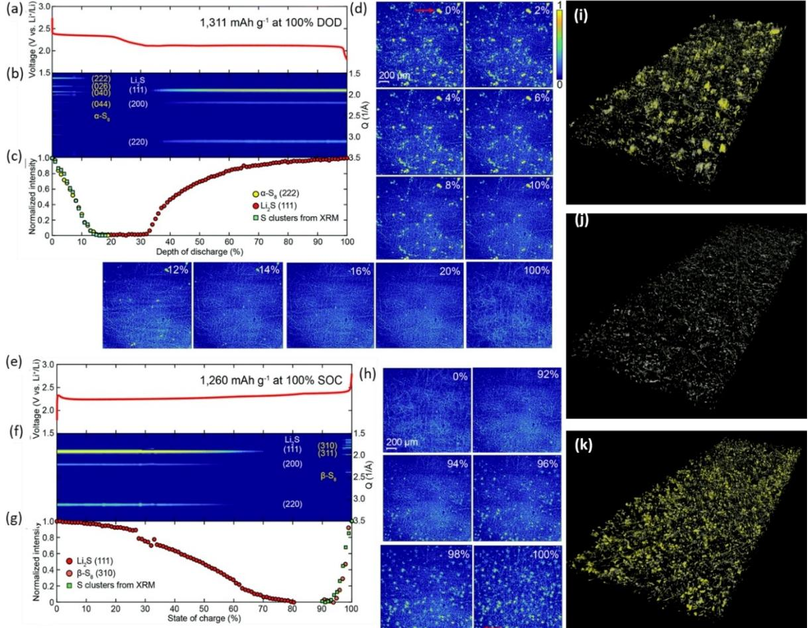

**Figure 13.** Operando XRD patterns and XRM images of LSBs during the initial cycle: a) discharge and e) charge voltage profile at a rate of 0.1 C and the operando XRD pattern during b) discharge and f) charge. The normalized intensities of α-S8 and Li2S diffraction patterns of the sulfur cathode during c) discharge and g) charge. Operando XRM images of a sulfur electrode at different d) DOD (%) and h) SOC (%). X-ray tomography of i) pristine sulfur cathode, j) after the first discharge, and k) after the first charge. Yellow represents sulfur particles, and grey represents carbon species. Reproduced with permission from Ref. [191]. Copyright (2018) The Royal Society of Chemistry.

of the α-S8 diffraction peaks reduce quickly and disappear around the end of the upper voltage plateau during the first discharge. Conversely, the Li2S diffraction peaks start to appear at the beginning of the lower voltage plateau and gradually increase to their maximum value at the end of the discharge. The first cycle charge profile, operando XRD patterns, and XRM images of the sulfur cathode at different states of charge (SOC) are presented in Figure 13(e–h). The potential barrier is observed at the beginning of charging due to the activation energy required to convert insulating Li2S to LiPSs, as shown in Figure 13(e). The operando XRD patterns of sulfur cathode and the integrated intensities of diffraction peaks for both S8 and Li2S at different SOC are displayed in Figure 13(f and g), respectively. During charging, the intensity of the Li2S diffraction peaks gradually reduces and disappears at ~80% SOC, and the diffraction peaks of β-S8 start to emerge around 90% SOC.

In the XRM images shown in Figure 13(d and h), the bright yellow clusters are sulfur, while the thread-like features are for the carbon fibers used as the current collector. As illustrated in Figure 13(i and k), X-ray tomography reveals that the initial distribution of sulfur in the pristine cathode is different from the location of reformed sulfur after charging that confirms the nucleation and growth sites of sulfur particles varied in each cycle. As shown in Figure 13(j), only the morphology of carbon fibers is observed after discharging, which indicates sulfur species completely reduced upon discharging process.

Understanding the interfacial chemistries becomes crucial to develop appropriate strategies for these challenging issues.[192] In LSB, the interfacial redox kinetics are determined by (1) the binding energy that allows adsorption with sufficient surface coverage and (2) charges transfer rate at the phase boundaries during the redox reactions.[12j] Zhao et al. revealed both the phase transformation and interfacial chemistries using *in situ* high energy X-ray diffraction (HEXRD). As shown in Figure 14(a), the HEXRD peaks observed at 2.05°, 2.37°, 3.35°, and 3.92° confirming the formation of the Li2S phase started to emerge at the discharge point A (2.14 V). The peak intensities for the deposition of Li2S particles have increased further upon lithiation to 1.8 V, indicating the continuous growth of Li2S particles during the discharge process.[12j] Furthermore, another four peaks ~2.02°, 2.18°, 3.4°, and 3.96° are appeared at the discharge point B (2.13 V) and slightly disappeared at point C (2.10 V) that confirmed the formation of Li2S2 precipitates and its conversion to Li2S during discharge. The intensities of the Li2S HEXRD peaks decrease gradually and disappear after charging to point D (2.30 V).

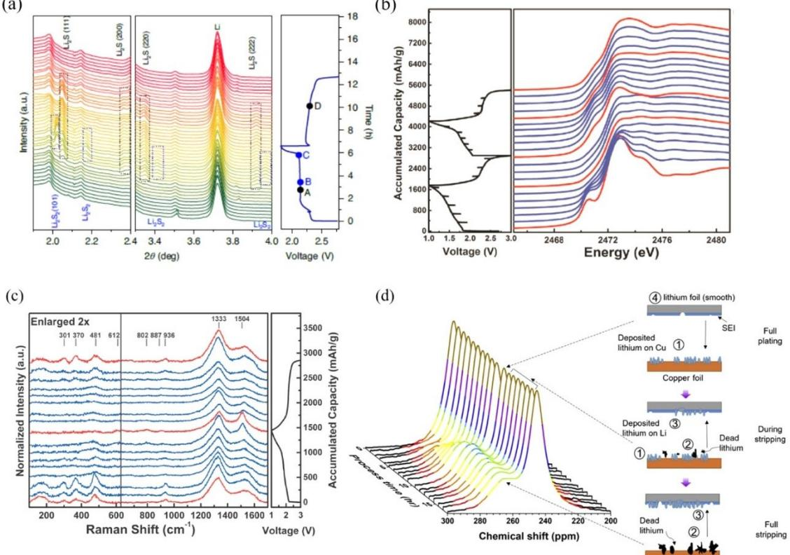

**Figure 14.** Phase transformation and interphase characterization. a) (Dis)charge curve of the 3D-ordered mesoporous sulfur host /ZnS, Co N C/S cathode at 0.1 C and the corresponding *in situ* HEXRD patterns. Points A/D and B/C indicate the critical voltage point of the appearance/disappearance of Li2S (marked by the black boxes in HEXRD) and Li2S2 (marked by the blue boxes in HEXRD), respectively. Reprinted with permission from Ref. [12j]. Copyright (2020) Nature Publishing Group. b) Evolution of S K-edge XANES during electrochemical cycling. c) (Dis)charge curve of the S-cPAN at 0.1 C and the corresponding *in situ* Raman spectra. Reprinted with permission from Ref. [185c]. Copyright (2021) Elsevier Inc. d) 7 Li Static *in situ* NMR spectra and schematic visualization of deposited lithium and dead lithium for 1 cycle plating and stripping at a current density of 0.2 mAcm 2 for 38,580 s. Reprinted with permission from Ref. [193]. Copyright (2020) Elsevier Inc.

*Batteries & Supercaps* **2022**, *5*, e202200059 (26 of 32) © 2022 Wiley-VCH GmbH

Sulfur K-edge XAS is a powerful characterization technique to provide complete redox chemistries and oxidation states during the (dis)charging process. In sulfur K-edge spectra, the energy position of the oxidized sulfur (Li2S2/Li2S) species shifts to higher values compared with sulfur because of their variation in their chemical state and local environment. The characteristic energy of the sulfur K-edge is 2472 eV, while the corresponding value for Li2S is 2476 eV. Furthermore, the shape of the sulfur peaks (edge and pre-edge resonances) acts as a characteristic fingerprint of different sulfur compounds.[194] Hwang et al. revealed the sulfur redox reaction chemistry using in-operando X-ray absorption near-edge structure (XANES) during the (di)charge mechanism of LSBs, as shown in Figure 14(b). The intense peak observed at 2472.9 eV (peak A) assigned to the S S bonds exists in both SPAN and LiPSs intermediates but disappears at the end of the discharge state. The pre-edge peak at 2469.0 eV starts to appear in upper plateaus and increases gradually to the beginning of lower plateaus, indicating LiPSs intermediates' formation. The intensity of this peak gradually decreases to the end of the lower plateaus and disappears at the end of discharge, confirms the conversion of lower-order LiPSs to Li2S.[185c]

*In situ* Raman spectroscopy is a nondestructive characterization technique capable of characterizing the composition and structural changes in both the liquid and solid phases by detecting their vibrational frequencies during the electrochemical cycling of LSBs. In this regard, our group investigated the redox reaction mechanism of covalently bonded sulfur species using *in situ* Raman and *in situ* XANES techniques.[185c] The intensity of sulfur Raman peaks gradually decreases and disappears at the end during the discharging process, as shown in Figure 14(c). These peaks remerge during the charging process confirming the conversion of covalently bonded sulfur species into Li2S and vice versa.

Stabilizing the lithium anode /electrolyte interface is the major challenge to enhance the cycle life of the LSBs. *In situ* NMR spectroscopy is a nondestructive powerful spectroscopic technique that provides information on the electronic/chemical structure of an atom, molecules, and compounds on crystalline or amorphous phases during the electrochemical cycling of batteries.[195] In LSBs, both soluble LiPSs and solid sulfide species containing 7 Li, 6 Li, and 33S can be studied by *in situ* NMR. Accordingly, *in situ* NMR spectroscopy provides significant real-time information about lithium-dendrite growth,[193] LPSs formation,[196] and sequential migration in the LSBs. In the 7 Li-NMR spectra, the Li-ion signal in electrolyte and SEI components appeared at a chemical shift of ~0 ppm, while the metallic lithium signal was observed at a higher chemical shift of ~250 ppm. Moreover, the lithium deposits with mossy morphologies showed a signal at higher chemical shifts in the range of 260–300 ppm.[197] In this respect, Hsieh et al. develop a protocol for quantifying irreversible lithium losses due to SEI and dead lithium formation using *in situ* NMR techniques during the cycling of the batteries. The spectral region from 200–300 ppm is mainly considered for quantifying dead lithium. As shown in Figure 14(d), a single peak is observed at ~245 ppm indicating the pristine "smooth" lithium foil electrode in the beginning (at *t*=0 s). Upon plating, a signal at ~263 ppm starts to increase and reach maximum peak intensity after complete plating, which indicates the formation of inhomogeneous lithium deposits. During stripping, actively deposited lithium was stripped back from the copper electrode, and dead lithium was formed simultaneously. The dead lithium remained on the copper foil even after complete stripping.[193]

Generally, *in situ*/in-operando analytical techniques enable an in-depth understanding of the dynamic changes involved in the electrodes in LSBs during cell operation. Therefore, these advanced characterization techniques are crucial for designing, optimizing, and developing LSBs with promising electrochemical performance.

# **6. Conclusion and Perspectives**

LSBs are considered the most promising energy storage materials for electric vehicles and aviation technologies owing to their lightweight and high energy densities. Although the multi-electron redox reaction of LSBs yields high discharge capacity, its mechanism is yet complex, which causes various imminent challenges. In this review, we systematically discussed the fundamental working mechanism of LSB chemistries and the strategies developed to improve the performance of LSBs, including cathode materials design, development of novel electrolytes, separator modification/interlayer insertion, and lithium anode protection. Furthermore, advanced *in situ*/inoperando characterization techniques providing detailed insight into the electrochemical reaction mechanism of LSBs are discussed.

Although remarkable achievements have been gained in the past decades, further improvements are still required for the practical application of LSBs. Achieving high areal capacity (�6 mAhcm 2 ) with stable cyclability up to ~1000 cycles while using high areal sulfur loading �5 mgcm 2 , high sulfur content �70 wt%, limited lithium, and low E/S ratio �3 μLmg 1 are requested for practical application of LSBs. Although realizing all these parameters simultaneously is still very challenging, we provide some future directions for developing high-performance practical LSBs.

## **6.1. Cathode materials**

Due to the insulating nature of active materials (sulfur and Li2S), the cathode composite mainly contains a conductive host material. To achieve the LSBs with high areal capacity, volumetric capacity and rate performance, the composite cathode comprising of novel multifunctional host materials with low content, high conductivity, high LiPSs interaction and excellent conversion ability should be further developed.

*Batteries & Supercaps* **2022**, *5*, e202200059 (27 of 32) © 2022 Wiley-VCH GmbH

# **6.2. Electrolyte design and development**

To reach the high energy density of LSBs (*>*500 Whkg 1 , low electrolyte amount is an important parameter that needs to focus on in future research development. Meanwhile, new electrolytes including liquid electrolytes, solid electrolytes and gel polymer electrolytes, should be designed and developed by the consideration of the electrolyte/electrode interface stabilities, their ionic conductivity, and the amount liquid electrolyte or thickness of solid electrolyte films developed in the future.

Solid electrolytes are a promising alternative to resolve the LiPSs shuttle effect. However, the research and development of solid-state LSBs are still in the infant stage. Further investigations are recommended in the future to improve the electrode/ electrolyte stability, the Li-ion mobility, and the mechanical strength of electrolytes in solid-state LSBs.

# **6.3. Separator modification/interlayer insertion**

Separator modification/interlayer insertion increased the weight of the inactive materials and scarify the energy density of LSBs. The electrochemical inactive materials weight in LSBs needs to be further reduced. Therefore, the functional coating layer should be very thin, mechanically strong, have good wettability with electrolytes, catalyze and prevent soluble LiPS infiltration, and provide fast Li-ion transport channels.

# **6.4. Lithium metal anode protection**

The utilization of lithium metal anode in LSBs causes lithium corrosion and severe reaction with the electrolytes. Consequently, protecting lithium anode with a thin protecting layer is considered a promising approach that should be further investigated. Since the protection of lithium anode may sacrifice the energy density and increase the fabrication cost, the thickness and mechanical strength of the protecting layer should be further considered.

Furthermore, surface defects of lithium anode like slip lines aggravate lithium anode corrosion. To achieve high energy density LSB, the thickness of lithium anode should be *<*50 μm. Therefore, a controllable lithium anode processing method (rolling) for minimizing the thickness and diminishing the slip lines should be considered. Moreover, developing scalable, low-cost, and manageable electrode production methods should be considered.

# **6.5. Anode-free lithium-sulfur battery**

The anode-free LSBs cell configuration did not contain excess lithium source during the initial cell assembly. The exciting opportunity of anode-free batteries reduces the anode fabrication cost and procedure. However, the challenge is to develop scalable approach to get *in situ* plating lithium metals on the current collector without dendrite and dead lithium formation. Moreover, the lithium source for anode-free LSBs is Li2S cathode. Since bulk Li2S is electrochemically inert, designing and developing of Li2S composite cathode remains yet challenging. Therefore, scientific research on designing nanostructure Li2S cathode with minimum Li2S barrier and fast redox kinetics, developing anode-free LSBs configuration, and improving the reversibility of *in situ* plated lithium anode is encouraging future research.

Moreover, the research effort using pouch cell is more encouraged and bring it a close step for the practical applications of LSBs.

### **6.6. Advanced** *in situ* **characterization techniques**

*In situ* characterization techniques provide real-time information crucial for revealing the reaction mechanism of LSBs. Each technique provides significant evidence. For example, *in situ* XRD techniques provide the crystalline structural change and morphological evolution of sulfur cathode. *In situ* XAS probes the changes in the sulfur cathode redox chemistry. *In situ* NMR shows real-time information about lithium anode morphology. Therefore, the integrated information from two or more *in situ* characterization is highly recommended to provide an insightful understanding of the entire process in real-time analysis of LSBs. The in-depth understanding of the redox mechanism of LSBs plays a significant role in rational designing, optimizing, and developing electrodes, electrolytes, and the overall cell components and ultimately improving the electrochemical performance of LSBs.

# *Acknowledgements*

*Financial support from the Ministry of Science and Technology of Taiwan (MOST 110-2639-E-011-001-ASP, 110-3116-F-011-003, 110-3116-F-011-004, 110-2923-E-011-002, 109-2124-M-002-008, 109-2923-E-011-009), the Ministry of Education of Taiwan (MOE U2RSC program 1080059), Taiwan's Deep Decarbonization Pathways toward a Sustainable Society Project (AS-KPQ-106- DDPP) from Academia Sinica as well as the supporting facilities from National Taiwan University of Science and Technology (NTUST) and National Synchrotron Radiation Research Centre (NSRRC) are all gratefully acknowledged.*

# *Conflict of Interest*

The authors declare no conflict of interest.

**Keywords:** analytical characterization techniques **·** lithium anode **·** lithium sulfide **·** lithium-sulfur battery **·** sulfur cathode

[1] P. Han, S.-H. Chung, A. Manthiram, *Energy Storage Mater.* **2019**, *17*, 317–324.

*Batteries & Supercaps* **2022**, *5*, e202200059 (28 of 32) © 2022 Wiley-VCH GmbH

- [2] a) M. S. Whittingham, *Chem. Rev.* **2004**, *104*, 4271–4302; b) A. S. Aricò, P. Bruce, B. Scrosati, J.-M. Tarascon, W. van Schalkwijk, *Nat. Mater.* **2005**, *4*, 366–377.
- [3] W.-P. Wang, J. Zhang, J. Chou, Y.-X. Yin, Y. You, S. Xin, Y.-G. Guo, *Adv. Energy Mater.* **2021**, *11*, 2000791.
- [4] M. Ue, K. Sakaushi, K. Uosaki, *Mater. Horiz.* **2020**, *7*, 1937–1954.
- [5] P. Wang, B. Xi, M. Huang, W. Chen, J. Feng, S. Xiong, *Adv. Energy Mater.* **2021**, *11*, 2002893.
- [6] S. Xu, C. Y. Kwok, L. Zhou, Z. Zhang, I. Kochetkov, L. F. Nazar, *Adv. Funct. Mater.* **2021**, *31*, 2004239.
- [7] a) Q. Pang, C. Y. Kwok, D. Kundu, X. Liang, L. F. Nazar, *Joule* **2019**, *3*, 136–148; b) G. Li, Z. Chen, J. Lu, *Chem* **2018**, *4*, 3–7.
- [8] H.-J. Peng, J.-Q. Huang, X.-B. Cheng, Q. Zhang, *Adv. Energy Mater.* **2017**, *7*, 1700260.
- [9] a) N. Angulakshmi, R. B. Dhanalakshmi, S. Sathya, J.-H. Ahn, A. M. Stephan, *Batteries & Supercaps* **2021**, *4*, 1064–1095; b) S. Evers, L. F. Nazar, *Acc. Chem. Res.* **2013**, *46*, 1135–1143.
- [10] a) M.-T. Lee, H. Liu, D. Brandell, *Batteries & Supercaps* **2020**, *3*, 1370– 1376; b) S. Dörfler, S. Walus, J. Locke, A. Fotouhi, D. J. Auger, N. Shateri, T. Abendroth, P. Härtel, H. Althues, S. Kaskel, *Energy Technol.* **2021**, *9*, 2000694; c) S. Dörfler, H. Althues, P. Härtel, T. Abendroth, B. Schumm, S. Kaskel, *Joule* **2020**, *4*, 539–554.
- [11] Q. Pang, X. Liang, C. Y. Kwok, L. F. Nazar, *Nat. Energy* **2016**, *1*, 16132.
- [12] a) J. Wang, J. Yang, J. Xie, N. Xu, *Adv. Mater.* **2002**, *14*, 963–965; b) X. Ji, K. T. Lee, L. F. Nazar, *Nat. Mater.* **2009**, *8*, 500; c) S. Meini, R. Elazari, A. Rosenman, A. Garsuch, D. Aurbach, *J. Phys. Chem. Lett.* **2014**, *5*, 915– 918; d) S. Evers, T. Yim, L. F. Nazar, *J. Phys. Chem. C* **2012**, *116*, 19653– 19658; e) J. Zheng, D. Lv, M. Gu, C. Wang, J.-G. Zhang, J. Liu, J. Xiao, *J. Electrochem. Soc.* **2013**, *160*, A2288–A2292; f) Q. Pang, D. Kundu, M. Cuisinier, L. F. Nazar, *Nat. Commun.* **2014**, *5*, 4759; g) Z. W. Seh, J. H. Yu, W. Li, P.-C. Hsu, H. Wang, Y. Sun, H. Yao, Q. Zhang, Y. Cui, *Nat. Commun.* **2014**, *5*, 5017; h) Z. Du, X. Chen, W. Hu, C. Chuang, S. Xie, A. Hu, W. Yan, X. Kong, X. Wu, H. Ji, L.-J. Wan, *J. Am. Chem. Soc.* **2019**, *141*, 3977–3985; i) Y. Yao, H. Wang, H. Yang, S. Zeng, R. Xu, F. Liu, P. Shi, Y. Feng, K. Wang, W. Yang, X. Wu, W. Luo, Y. Yu, *Adv. Mater.* **2020**, *32*, 1905658; j) C. Zhao, G.-L. Xu, Z. Yu, L. Zhang, I. Hwang, Y.-X. Mo, Y. Ren, L. Cheng, C.-J. Sun, Y. Ren, X. Zuo, J.-T. Li, S.-G. Sun, K. Amine, T. Zhao, *Nat. Nanotechnol.* **2021**, *16*, 166–173.
- [13] a) Y. V. Mikhaylik, J. R. Akridge, *J. Electrochem. Soc.* **2004**, *151*, A1969– A1976; b) N. Machida, K. Kobayashi, Y. Nishikawa, T. Shigematsu, *Solid State Ionics* **2004**, *175*, 247–250.
- [14] D. Aurbach, E. Pollak, R. Elazari, G. Salitra, C. S. Kelley, J. Affinito, *J. Electrochem. Soc.* **2009**, *156*, A694.
- [15] Y.-S. Su, A. Manthiram, *Nat. Commun.* **2012**, *3*, 1166.
- [16] a) D. Eroglu, K. R. Zavadil, K. G. Gallagher, *J. Electrochem. Soc.* **2015**, *162*, A982-A990; b) S. Nanda, A. Gupta, A. Manthiram, *Adv. Energy Mater.* **2018**, *8*, 1801556.
- [17] M. E. Bhosale, S. Chae, J. M. Kim, J. Y. Choi, *J. Mater. Chem. A* **2018**, *6*, 19885–19911.
- [18] A. Manthiram, Y. Fu, S.-H. Chung, C. Zu, Y.-S. Su, *Chem. Rev.* **2014**, *114*, 11751–11787.
- [19] R. Fang, S. Zhao, Z. Sun, D.-W. Wang, H.-M. Cheng, F. Li, *Adv. Mater.* **2017**, *29*, 1606823.
- [20] Z. Li, B. Y. Guan, J. Zhang, X. W. Lou, *Joule* **2017**, *1*, 576–587.
- [21] S.-H. Chung, C.-H. Chang, A. Manthiram, *Adv. Funct. Mater.* **2018**, *28*, 1801188.
- [22] M. Shaibani, M. S. Mirshekarloo, R. Singh, C. D. Easton, M. D. Cooray, N. Eshraghi, T. Abendroth, S. Dörfler, H. Althues, S. Kaskel, *Sci. Adv.* **2020**, *6*, eaay2757.
- [23] S. Waluś, G. Offer, I. Hunt, Y. Patel, T. Stockley, J. Williams, R. Purkayastha, *Energy Storage Mater.* **2018**, *10*, 233–245.
- [24] C. Hu, H. Chen, Y. Shen, D. Lu, Y. Zhao, A.-H. Lu, X. Wu, W. Lu, L. Chen, *Nat. Commun.* **2017**, *8*, 479.
- [25] a) X.-B. Cheng, H.-J. Peng, J.-Q. Huang, F. Wei, Q. Zhang, *Small* **2014**, *10*, 4257–4263; b) T. M. Hagos, H. K. Bezabh, C.-J. Huang, S.-K. Jiang, W.-N. Su, B. J. Hwang, *Acc. Chem. Res.* **2021**, *54*, 4474–4485; c) N. T. Temesgen, W. A. Tegegne, K. N. Shitaw, F. W. Fenta, Y. Nikodimos, B. W. Taklu, S.-K. Jiang, C.-J. Huang, S.-H. Wu, W.-N. Su, B. J. Hwang, *J. Inst. Chem.* **2021**, *128*, 87–97; d) B. Thirumalraj, T. T. Hagos, C.-J. Huang, M. A. Teshager, J.-H. Cheng, W.-N. Su, B.-J. Hwang, *J. Am. Chem. Soc.* **2019**, *141*, 18612–18623; e) C.-J. Huang, B. Thirumalraj, H.-C. Tao, K. N. Shitaw, H. Sutiono, T. T. Hagos, T. T. Beyene, L.-M. Kuo, C.-C. Wang, S.- H. Wu, W.-N. Su, B. J. Hwang, *Nat. Commun.* **2021**, *12*, 1452; f) K. N. Shitaw, S.-C. Yang, S.-K. Jiang, C.-J. Huang, N. A. Sahalie, Y. Nikodimos,

*Batteries & Supercaps* **2022**, *5*, e202200059 (29 of 32) © 2022 Wiley-VCH GmbH

H. H. Weldeyohannes, C.-H. Wang, S.-H. Wu, W.-N. Su, B. J. Hwang, *Adv. Funct. Mater.* **2021**, *31*, 2006951.

- [26] a) J.-G. Zhang, W. Xu, J. Xiao, X. Cao, J. Liu, *Chem. Rev.* **2020**, *120*, 13312–13348; b) B. A. Jote, K. N. Shitaw, M. A. Weret, S.-C. Yang, C.-J. Huang, C.-H. Wang, Y.-T. Weng, S.-H. Wu, W.-N. Su, B. J. Hwang, *J. Power Sources* **2022**, *532*, 231303.
- [27] H. Pan, K. S. Han, M. H. Engelhard, R. Cao, J. Chen, J.-G. Zhang, K. T. Mueller, Y. Shao, J. Liu, *Adv. Funct. Mater.* **2018**, *28*, 1707234.
- [28] S. Rehman, K. Khan, Y. Zhao, Y. Hou, *J. Mater. Chem. A* **2017**, *5*, 3014– 3038.
- [29] L. Borchardt, H. Althues, S. Kaskel, *Curr. Opin. Green Sustain. Chem.* **2017**, *4*, 64–71.
- [30] a) T. A. Zegeye, C.-F. J. Kuo, A. S. Wotango, C.-J. Pan, H.-M. Chen, A. M. Haregewoin, J.-H. Cheng, W.-N. Su, B.-J. Hwang, *J. Power Sources* **2016**, *324*, 239–252; b) B. Zhang, X. Qin, G. R. Li, X. P. Gao, *Energy Environ. Sci.* **2010**, *3*, 1531–1537; c) P. Strubel, H. Althues, S. Kaskel, *Carbon* **2016**, *107*, 705–710; d) C. Kensy, D. Leistenschneider, S. Wang, H. Tanaka, S. Dörfler, K. Kaneko, S. Kaskel, *Batteries & Supercaps* **2021**, *4*, 612–622.
- [31] Y. J. Liu, H. Guo, B. H. Zhang, G. Y. Wen, R. Vajtai, L. Wu, P. M. Ajayan, L. Wang, *Batteries & Supercaps* **2020**, *3*, 1201–1208.
- [32] a) T. A. Zegeye, M.-C. Tsai, J.-H. Cheng, M.-H. Lin, H.-M. Chen, J. Rick, W.-N. Su, C.-F. J. Kuo, B.-J. Hwang, *J. Power Sources* **2017**, *353*, 298–311; b) T. A. Zegeye, C.-F. J. Kuo, H.-M. Chen, A. M. Tripathi, M.-H. Lin, J.-H. Cheng, A. D. Duma, W.-N. Su, B.-J. Hwang, *ChemElectroChem* **2017**, *4*, 636–647.
- [33] a) Y. Liao, J. Xiang, L. Yuan, Z. Hao, J. Gu, X. Chen, K. Yuan, P. K. Kalambate, Y. Huang, *ACS Appl. Mater. Interfaces* **2018**, *10*, 37955– 37962; b) T. Boenke, P. Härtel, S. Dörfler, T. Abendroth, F. Schwotzer, H. Althues, S. Kaskel, *Batteries & Supercaps* **2021**, *4*, 989–1002.
- [34] G. He, S. Evers, X. Liang, M. Cuisinier, A. Garsuch, L. F. Nazar, *ACS Nano* **2013**, *7*, 10920–10930.
- [35] a) S. Evers, L. F. Nazar, *Chem. Commun.* **2012**, *48*, 1233–1235; b) A. A. Assegie, C.-C. Chung, M.-C. Tsai, W.-N. Su, C.-W. Chen, B.-J. Hwang, *Nanoscale* **2019**, *11*, 2710–2720; c) G.-P. Hao, C. Tang, E. Zhang, P. Zhai, J. Yin, W. Zhu, Q. Zhang, S. Kaskel, *Adv. Mater.* **2017**, *29*, 1702829.
- [36] J.-Z. Wang, L. Lu, M. Choucair, J. A. Stride, X. Xu, H.-K. Liu, *J. Power Sources* **2011**, *196*, 7030–7034.
- [37] H. Wang, Y. Yang, Y. Liang, J. T. Robinson, Y. Li, A. Jackson, Y. Cui, H. Dai, *Nano Lett.* **2011**, *11*, 2644–2647.
- [38] N. Li, M. Zheng, H. Lu, Z. Hu, C. Shen, X. Chang, G. Ji, J. Cao, Y. Shi, *Chem. Commun.* **2012**, *48*, 4106–4108.
- [39] S. Lu, Y. Cheng, X. Wu, J. Liu, *Nano Lett.* **2013**, *13*, 2485–2489.
- [40] a) S. Dörfler, P. Strubel, T. Jaumann, E. Troschke, F. Hippauf, C. Kensy, A. Schökel, H. Althues, L. Giebeler, S. Oswald, S. Kaskel, *Nano Energy* **2018**, *54*, 116–128; b) C. Kensy, P. Härtel, J. Maschita, S. Dörfler, B. Schumm, T. Abendroth, H. Althues, B. V. Lotsch, S. Kaskel, *Carbon* **2020**, *161*, 190–197.
- [41] G. Zhou, Y. Zhao, A. Manthiram, *Adv. Energy Mater.* **2015**, *5*, 1402263.
- [42] a) Q. Pang, J. Tang, H. Huang, X. Liang, C. Hart, K. C. Tam, L. F. Nazar, *Adv. Mater.* **2015**, *27*, 6021–6028; b) M. Zhang, L. Wang, B. Wang, B. Zhang, X. Sun, D. Wang, Z. Kong, L. Xu, *J. Mater. Chem. A* **2021**, *9*, 6538–6546; c) X. Zhou, J. Tian, Q. Wu, J. Hu, C. Li, *Energy Storage Mater.* **2020**, *24*, 644–654.
- [43] a) W. Yao, W. Zheng, J. Xu, C. Tian, K. Han, W. Sun, S. Xiao, *ACS Nano* **2021**, *15*, 7114–7130; b) S. Wang, S. Feng, J. Liang, Q. Su, F. Zhao, H. Song, M. Zheng, Q. Sun, Z. Song, X. Jia, J. Yang, Y. Li, J. Liao, R. Li, X. Sun, *Adv. Energy Mater.* **2021**, *11*, 2003314; c) C. Ma, Y. Zhang, Y. Feng, N. Wang, L. Zhou, C. Liang, L. Chen, Y. Lai, X. Ji, C. Yan, W. Wei, *Adv. Mater.* **2021**, *33*, 2100171.
- [44] Y. Lin, K. J. Jones, L. C. Greenburg, J.-W. Kim, L. Hu, J. W. Connell, *Batteries & Supercaps* **2019**, *2*, 774–783.
- [45] a) J. Wang, J. Yang, C. Wan, K. Du, J. Xie, N. Xu, *Adv. Funct. Mater.* **2003**, *13*, 487–492; b) S. Yang, Q. Liu, Q. Lu, E. Zhang, U. S. Arrozi, H. Li, S. Kaskel, F. Xu, H. Wang, *Energy Technol.* **2019**, *7*, 1900583; c) E. Troschke, C. Kensy, F. Haase, S. Dörfler, Y. Joseph, B. V. Lotsch, S. Kaskel, *Batteries & Supercaps* **2020**, *3*, 1069–1079.
- [46] Y. Yang, G. Yu, J. J. Cha, H. Wu, M. Vosgueritchian, Y. Yao, Z. Bao, Y. Cui, *ACS Nano* **2011**, *5*, 9187–9193.
- [47] a) F. Wu, J. Chen, L. Li, T. Zhao, R. Chen, *J. Phys. Chem. C* **2011**, *115*, 24411–24417; b) L. Xiao, Y. Cao, J. Xiao, B. Schwenzer, M. H. Engelhard, L. V. Saraf, Z. Nie, G. J. Exarhos, J. Liu, *Adv. Mater.* **2012**, *24*, 1176–1181; c) G.-C. Li, G.-R. Li, S.-H. Ye, X.-P. Gao, *Adv. Energy Mater.* **2012**, *2*, 1238– 1245; d) W. Zhou, Y. Yu, H. Chen, F. J. DiSalvo, H. D. Abruña, *J. Am. Chem. Soc.* **2013**, *135*, 16736–16743.

- [48] a) F. Wu, S. Wu, R. Chen, J. Chen, S. Chen, *Electrochem. Solid-State Lett.* **2010**, *13*, A29; b) F. Wu, J. Chen, R. Chen, S. Wu, L. Li, S. Chen, T. Zhao, *J. Phys. Chem. C* **2011**, *115*, 6057–6063.
- [49] a) J. Wang, J. Chen, K. Konstantinov, L. Zhao, S. H. Ng, G. X. Wang, Z. P. Guo, H. K. Liu, *Electrochim. Acta* **2006**, *51*, 4634–4638; b) Y. Fu, A. Manthiram, *J. Phys. Chem. C* **2012**, *116*, 8910–8915.
- [50] a) C. F. J. Kuo, M. A. Weret, H. Y. Hung, M. C. Tsai, C. J. Huang, W. N. Su, B. J. Hwang, *J. Power Sources* **2019**, *412*, 670–676; b) L. Yin, J. Wang, F. Lin, J. Yang, Y. Nuli, *Energy Environ. Sci.* **2012**, *5*, 6966–6972; c) L. Yin, J. Wang, J. Yang, Y. Nuli, *J. Mater. Chem.* **2011**, *21*, 6807–6810.
- [51] W. Li, Q. Zhang, G. Zheng, Z. W. Seh, H. Yao, Y. Cui, *Nano Lett.* **2013**, *13*, 5534–5540.
- [52] U. Zubair, D. Versaci, M. Umer, J. Amici, C. Francia, S. Bodoardo, *Mater. Today Commun.* **2021**, *26*, 101970.
- [53] Z. Wei Seh, W. Li, J. J. Cha, G. Zheng, Y. Yang, M. T. McDowell, P.-C. Hsu, Y. Cui, *Nat. Commun.* **2013**, *4*, 1331.
- [54] L. Ma, H. Yuan, W. Zhang, G. Zhu, Y. Wang, Y. Hu, P. Zhao, R. Chen, T. Chen, J. Liu, Z. Hu, Z. Jin, *Nano Lett.* **2017**, *17*, 7839–7846.
- [55] S. Wei, L. Ma, K. E. Hendrickson, Z. Tu, L. A. Archer, *J. Am. Chem. Soc.* **2015**, *137*, 12143–12152.
- [56] a) M. A. Weret, C.-F. Jeffrey Kuo, T. S. Zeleke, T. T. Beyene, M.-C. Tsai, C.-J. Huang, G. B. Berhe, W.-N. Su, B.-J. Hwang, *Energy Storage Mater.* **2020**, *26*, 483–493; b) X. Wang, Y. Qian, L. Wang, H. Yang, H. Li, Y. Zhao, T. Liu, *Adv. Funct. Mater.* **2019**, *29*, 1902929; c) C.-J. Huang, K.-Y. Lin, Y.-C. Hsieh, W.-N. Su, C.-H. Wang, G. Brunklaus, M. Winter, J.-C. Jiang, B. J. Hwang, *ACS Appl. Mater. Interfaces* **2021**, *13*, 14230–14238.
- [57] Z. Wen, D. Lu, *J. Electrochem. Soc.* **2013**, *160*, A2311–A2314. [58] J. Li, K. Li, M. Li, D. Gosselink, Y. Zhang, P. Chen, *J. Power Sources* **2014**,
- *252*, 107–112. [59] G. Zhou, S. Zhao, T. Wang, S.-Z. Yang, B. Johannessen, H. Chen, C. Liu,
- Y. Ye, Y. Wu, Y. Peng, C. Liu, S. P. Jiang, Q. Zhang, Y. Cui, *Nano Lett.* **2020**, *20*, 1252–1261.
- [60] a) X. Liu, J.-Q. Huang, Q. Zhang, L. Mai, *Adv. Mater.* **2017**, *29*, 1601759; b) T. Zhou, W. Lv, J. Li, G. Zhou, Y. Zhao, S. Fan, B. Liu, B. Li, F. Kang, Q.- H. Yang, *Energy Environ. Sci.* **2017**, *10*, 1694–1703.
- [61] J. Zhang, Y. Shi, Y. Ding, W. Zhang, G. Yu, *Nano Lett.* **2016**, *16*, 7276– 7281.
- [62] X. Liang, L. F. Nazar, *ACS Nano* **2016**, *10*, 4192–4198.
- [63] Z. Cui, C. Zu, W. Zhou, A. Manthiram, J. B. Goodenough, *Adv. Mater.* **2016**, *28*, 6926–6931.
- [64] Y. Zhong, D. Chao, S. Deng, J. Zhan, R. Fang, Y. Xia, Y. Wang, X. Wang, X. Xia, J. Tu, *Adv. Funct. Mater.* **2018**, *28*, 1706391.
- [65] F. Wu, S. Zhao, L. Chen, Y. Lu, Y. Su, J. Li, L. Bao, J. Yao, Y. Zhou, R. Chen, *Electrochim. Acta* **2018**, *292*, 199–207.
- [66] X. Zhao, H.-J. Ahn, K.-W. Kim, K.-K. Cho, J.-H. Ahn, *J. Phys. Chem. C* **2015**, *119*, 7996–8003.
- [67] Y. Fu, Y.-S. Su, A. Manthiram, *J. Electrochem. Soc.* **2012**, *159*, A1420– A1424.
- [68] G. Ma, Z. Wen, J. Jin, Y. Lu, K. Rui, X. Wu, M. Wu, J. Zhang, *J. Power Sources* **2014**, *254*, 353–359.
- [69] X. Liang, Z. Wen, Y. Liu, H. Zhang, J. Jin, M. Wu, X. Wu, *J. Power Sources* **2012**, *206*, 409–413.
- [70] Y. Zhang, Y. Zhao, A. Konarov, D. Gosselink, H. G. Soboleski, P. Chen, *J. Power Sources* **2013**, *241*, 517–521.
- [71] W. Wei, J. Li, Q. Wang, D. Liu, J. Niu, P. Liu, *ACS Appl. Mater. Interfaces* **2020**, *12*, 6362–6370.
- [72] Y. Zhao, W. Zhu, G. Z. Chen, E. J. Cairns, *J. Power Sources* **2016**, *327*, 447–456.
- [73] A. B. Puthirath, A. Baburaj, K. Kato, D. Salpekar, N. Chakingal, Y. Cao, G. Babu, P. M. Ajayan, *Electrochim. Acta* **2019**, *306*, 489–497.
- [74] K. Park, J. H. Cho, J.-H. Jang, B.-C. Yu, A. T. De La Hoz, K. M. Miller, C. J. Ellison, J. B. Goodenough, *Energy Environ. Sci.* **2015**, *8*, 2389–2395.
- [75] J. Rong, M. Ge, X. Fang, C. Zhou, *Nano Lett.* **2014**, *14*, 473–479.
- [76] K. T. Lee, R. Black, T. Yim, X. Ji, L. F. Nazar, *Adv. Energy Mater.* **2012**, *2*, 1490–1496.
- [77] L. Ni, Z. Wu, G. Zhao, C. Sun, C. Zhou, X. Gong, G. Diao, *Small* **2017**, *13*, 1603466.
- [78] K. Liu, X. Zhang, F. Miao, Z. Wang, S. Zhang, Y. Zhang, P. Zhang, G. Shao, *Small* **2021**, *17*, 2100065.
- [79] H. Ye, M. Li, T. Liu, Y. Li, J. Lu, *ACS Energy Lett.* **2020**, *5*, 2234–2245.
- [80] S. Choi, I. Yoon, W. T. Nichols, D. Shin, *Ceram. Int.* **2018**, *44*, 7450–7453. [81] Y. Yang, G. Zheng, S. Misra, J. Nelson, M. F. Toney, Y. Cui, *J. Am. Chem. Soc.* **2012**, *134*, 15387–15394.
- [82] G. Zhou, H. Tian, Y. Jin, X. Tao, B. Liu, R. Zhang, Z. W. Seh, D. Zhuo, Y. Liu, J. Sun, *Proc. Nat. Acad. Sci.* **2017**, *114*, 840–845.

[83] H. Yuan, X. Chen, G. Zhou, W. Zhang, J. Luo, H. Huang, Y. Gan, C. Liang, Y. Xia, J. Zhang, J. Wang, X. Tao, *ACS Energy Lett.* **2017**, *2*, 1711– 1719.

- [84] X. Liang, J. Yun, K. Xu, H. Xiang, Y. Wang, Y. Sun, Y. Yu, *J. Energy Chem.* **2019**, *39*, 176–181.
- [85] Y. Tsao, M. Lee, E. C. Miller, G. Gao, J. Park, S. Chen, T. Katsumata, H. Tran, L.-W. Wang, M. F. Toney, Y. Cui, Z. Bao, *Joule* **2019**, *3*, 872–884.
- [86] L. Kong, L. Yin, F. Xu, J. Bian, H. Yuan, Z. Lu, Y. Zhao, *J. Energy Chem.* **2021**, *55*, 80–91.
- [87] F. Lee, M.-C. Tsai, M.-H. Lin, Y. L. Ni'mah, S. Hy, C.-Y. Kuo, J.-H. Cheng, J. Rick, W.-N. Su, B.-J. Hwang, *J. Mater. Chem. A* **2017**, *5*, 6708–6715.
- [88] S. Ohno, W. G. Zeier, *Acc. Mater. Res.* **2021**, *2*, 869–880. [89] G. F. Dewald, S. Ohno, J. G. C. Hering, J. Janek, W. G. Zeier, *Batteries & Supercaps* **2021**, *4*, 183–194.
- [90] K. Xu, *Chem. Rev.* **2004**, *104*, 4303–4418.
- [91] a) S. Zhang, K. Ueno, K. Dokko, M. Watanabe, *Adv. Energy Mater.* **2015**, *5*, 1500117; b) T. Yim, M.-S. Park, J.-S. Yu, K. J. Kim, K. Y. Im, J.-H. Kim, G. Jeong, Y. N. Jo, S.-G. Woo, K. S. Kang, I. Lee, Y.-J. Kim, *Electrochim. Acta* **2013**, *107*, 454–460.
- [92] S. Xin, L. Gu, N.-H. Zhao, Y.-X. Yin, L.-J. Zhou, Y.-G. Guo, L.-J. Wan, *J. Am. Chem. Soc.* **2012**, *134*, 18510–18513.
- [93] X. Li, M. Banis, A. Lushington, X. Yang, Q. Sun, Y. Zhao, C. Liu, Q. Li, B. Wang, W. Xiao, C. Wang, M. Li, J. Liang, R. Li, Y. Hu, L. Goncharova, H. Zhang, T.-K. Sham, X. Sun, *Nat. Commun.* **2018**, *9*, 4509.
- [94] Y. Chen, T. Wang, H. Tian, D. Su, Q. Zhang, G. Wang, *Adv. Mater.* **2021**, *33*, 2003666.
- [95] Y.-X. Yin, S. Xin, Y.-G. Guo, L.-J. Wan, *Angew. Chem. Int. Ed.* **2013**, *52*, 13186–13200; *Angew. Chem.* **2013**, *125*, 13426–13441.
- [96] a) Y. He, Z. Chang, S. Wu, H. Zhou, *J. Mater. Chem. A* **2018**, *6*, 6155– 6182; b) C. Weller, J. Pampel, S. Dörfler, H. Althues, S. Kaskel, *Energy Technol.* **2019**, *7*, 1900625.
- [97] M. R. Kaiser, S. Chou, H.-K. Liu, S.-X. Dou, C. Wang, J. Wang, *Adv. Mater.* **2017**, *29*, 1700449.
- [98] C. Barchasz, J.-C. Leprêtre, S. Patoux, F. Alloin, *Electrochim. Acta* **2013**, *89*, 737–743.
- [99] L. Wang, Y. Ye, N. Chen, Y. Huang, L. Li, F. Wu, R. Chen, *Adv. Funct. Mater.* **2018**, *28*, 1800919.
- [100] L. Carbone, M. Gobet, J. Peng, M. Devany, B. Scrosati, S. Greenbaum, J. Hassoun, *ACS Appl. Mater. Interfaces* **2015**, *7*, 13859–13865.
- [101] J. Scheers, S. Fantini, P. Johansson, *J. Power Sources* **2014**, *255*, 204– 218.
- [102] a) N. Azimi, Z. Xue, I. Bloom, M. L. Gordin, D. Wang, T. Daniel, C. Takoudis, Z. Zhang, *ACS Appl. Mater. Interfaces* **2015**, *7*, 9169–9177; b) C. Weller, S. Thieme, P. Härtel, H. Althues, S. Kaskel, *J. Electrochem. Soc.* **2017**, *164*, A3766–A3771; c) M. Piwko, C. Weller, F. Hippauf, S. Dörfler, H. Althues, S. Kaskel, *J. Electrochem. Soc.* **2018**, *165*, A1084– A1091.
- [103] W. Weng, V. G. Pol, K. Amine, *Adv. Mater.* **2013**, *25*, 1608–1615.
- [104] S. Chen, Z. Yu, M. L. Gordin, R. Yi, J. Song, D. Wang, *ACS Appl. Mater. Interfaces* **2017**, *9*, 6959–6966.
- [105] H. Lu, Y. Yuan, K. Zhang, F. Qin, Y. Lai, Y. Liu, *J. Electrochem. Soc.* **2015**, *162*, A1460–A1465.
- [106] H. Lu, K. Zhang, Y. Yuan, F. Qin, Z. Zhang, Y. Lai, Y. Liu, *Electrochim. Acta* **2015**, *161*, 55–62.
- [107] N. Azimi, W. Weng, C. Takoudis, Z. Zhang, *Electrochem. Commun.* **2013**, *37*, 96–99.
- [108] Z. Yue, H. Dunya, S. Aryal, C. U. Segre, B. Mandal, *J. Power Sources* **2018**, *401*, 271–277.
- [109] C.-C. Su, M. He, R. Amine, K. Amine, *Angew. Chem. Int. Ed.* **2019**, *58*, 10591–10595; *Angew. Chem.* **2019**, *131*, 10701–10705.
- [110] M. Zhao, B.-Q. Li, H.-J. Peng, H. Yuan, J.-Y. Wei, J.-Q. Huang, *Angew. Chem. Int. Ed.* **2020**, *59*, 12636–12652; *Angew. Chem.* **2020**, *132*, 12736–12753.
- [111] F. Schmidt, S. Ehrling, K. Schönherr, S. Dörfler, T. Abendroth, H. Althues, S. Kaskel, *Energy Technol.* **2022**, *10*, 2100721.
- [112] Y. Zhao, J. Zhang, J. Guo, *ACS Appl. Mater. Interfaces* **2021**, *13*, 31749– 31755.
- [113] J. Guo, H. Pei, Y. Dou, S. Zhao, G. Shao, J. Liu, *Adv. Funct. Mater.* **2021**, *31*, 2010499.
- [114] S.-H. Chung, A. Manthiram, *Joule* **2018**, *2*, 710–724.
- [115] Q. Pang, A. Shyamsunder, B. Narayanan, C. Y. Kwok, L. A. Curtiss, L. F. Nazar, *Nat. Energy* **2018**, *3*, 783–791.
- [116] W. Shin, L. Zhu, H. Jiang, W. F. Stickle, C. Fang, C. Liu, J. Lu, X. Ji, *Mater. Today* **2020**, *40*, 63–71.

- [117] Q. Zhang, Q. Huang, S.-M. Hao, S. Deng, Q. He, Z. Lin, Y. Yang, *Adv. Sci.* **2022**, *9*, 2103798.
- [118] M. Liu, D. Zhou, Y.-B. He, Y. Fu, X. Qin, C. Miao, H. Du, B. Li, Q.-H. Yang, Z. Lin, T. S. Zhao, F. Kang, *Nano Energy* **2016**, *22*, 278–289.
- [119] W. Li, Y. Pang, T. Zhu, Y. Wang, Y. Xia, *Solid State Ionics* **2018**, *318*, 82– 87.
- [120] D.-D. Han, S. Liu, Y.-T. Liu, Z. Zhang, G.-R. Li, X.-P. Gao, *J. Mater. Chem. A* **2018**, *6*, 18627–18634.
- [121] D. Lei, K. Shi, H. Ye, Z. Wan, Y. Wang, L. Shen, B. Li, Q.-H. Yang, F. Kang, Y.-B. He, *Adv. Funct. Mater.* **2018**, *28*, 1707570.
- [122] Y. Ji, K. Yang, M. Liu, S. Chen, X. Liu, B. Yang, Z. Wang, W. Huang, Z. Song, S. Xue, Y. Fu, L. Yang, T. S. Miller, F. Pan, *Adv. Funct. Mater.* **2021**, *31*, 2104830.
- [123] X. Yang, J. Luo, X. Sun, *Chem. Soc. Rev.* **2020**, *49*, 2140–2195.
- [124] G. Xi, M. Xiao, S. Wang, D. Han, Y. Li, Y. Meng, *Adv. Funct. Mater.* **2021**, *31*, 2007598.
- [125] M. Li, J. E. Frerichs, M. Kolek, W. Sun, D. Zhou, C. J. Huang, B. J. Hwang, M. R. Hansen, M. Winter, P. Bieker, *Adv. Funct. Mater.* **2020**, *30*, 1910123.
- [126] a) Y. Nikodimos, C.-J. Huang, B. W. Taklu, W.-N. Su, B. J. Hwang, *Energy Environ. Sci.* **2022**, *15*, 991-1033; b) B. W. Taklu, W.-N. Su, Y. Nikodimos, K. Lakshmanan, N. T. Temesgen, P.-X. Lin, S.-K. Jiang, C.-J. Huang, D.-Y. Wang, H.-S. Sheu, S.-H. Wu, B. J. Hwang, *Nano Energy* **2021**, *90*, 106542.
- [127] R. Wei, S. Chen, T. Gao, W. Liu, *Nano Select* **2021**, *2*, 2256–2274.
- [128] Y. Wei, F. Hu, Y. Li, J. Yang, W. Wang, L. Yuan, W. Zhang, Z. Li, Y. Huang, *ACS Appl. Mater. Interfaces* **2020**, *12*, 39335–39341.
- [129] L. Wang, Y. Wang, Y. Xia, *Energy Environ. Sci.* **2015**, *8*, 1551–1558.
- [130] K. K. Fu, Y. Gong, S. Xu, Y. Zhu, Y. Li, J. Dai, C. Wang, B. Liu, G. Pastel, H. Xie, Y. Yao, Y. Mo, E. Wachsman, L. Hu, *Chem. Mater.* **2017**, *29*, 8037– 8041.
- [131] S. Luo, F. Wu, G. Yushin, *Mater. Today* **2021**, *49*, 253-270.
- [132] X. Yao, N. Huang, F. Han, Q. Zhang, H. Wan, J. P. Mwizerwa, C. Wang, X. Xu, *Adv. Energy Mater.* **2017**, *7*, 1602923.
- [133] B. Ding, J. Wang, Z. Fan, S. Chen, Q. Lin, X. Lu, H. Dou, A. Kumar Nanjundan, G. Yushin, X. Zhang, Y. Yamauchi, *Mater. Today* **2020**, *40*, 114–131.
- [134] W. Wang, E. Yi, A. J. Fici, R. M. Laine, J. Kieffer, *J. Phys. Chem. C* **2017**, *121*, 2563–2573.
- [135] X. Tao, Y. Liu, W. Liu, G. Zhou, J. Zhao, D. Lin, C. Zu, O. Sheng, W. Zhang, H.-W. Lee, Y. Cui, *Nano Lett.* **2017**, *17*, 2967–2972.
- [136] S. S. Zhang, *J. Power Sources* **2007**, *164*, 351–364.
- [137] H. Yao, K. Yan, W. Li, G. Zheng, D. Kong, Z. W. Seh, V. K. Narasimhan, Z. Liang, Y. Cui, *Energy Environ. Sci.* **2014**, *7*, 3381–3390.
- [138] Y. C. Jeong, J. H. Kim, S. Nam, C. R. Park, S. J. Yang, *Adv. Funct. Mater.* **2018**, *28*, 1707411.
- [139] M. Li, Y. Wan, J.-K. Huang, A. H. Assen, C.-E. Hsiung, H. Jiang, Y. Han, M. Eddaoudi, Z. Lai, J. Ming, L.-J. Li, *ACS Energy Lett.* **2017**, *2*, 2362–2367.
- [140] S.-H. Chung, A. Manthiram, *Adv. Funct. Mater.* **2014**, *24*, 5299–5306.
- [141] S. H. Chung, A. Manthiram, *Adv. Mater.* **2014**, *26*, 7352–7357.
- [142] Y. Pang, J. Wei, Y. Wang, Y. Xia, *Adv. Energy Mater.* **2018**, *8*, 1702288. [143] M. He, X. Li, W. Li, M. Zheng, J. Wang, S. Ma, Y. Ma, G. Yin, P. Zuo, X.
- Sun, *Chem. Eng. J.* **2021**, *411*, 128563. [144] J. Qian, Y. Xing, Y. Yang, Y. Li, K. Yu, W. Li, T. Zhao, Y. Ye, L. Li, F. Wu, R.
- Chen, *Adv. Mater.* **2021**, *33*, 2100810.
- [145] D. Zhu, T. Long, B. Xu, Y. Zhao, H. Hong, R. Liu, F. Meng, J. Liu, *J. Energy Chem.* **2021**, *57*, 41–60.
- [146] a) Y.-S. Su, A. Manthiram, *Nat. Commun.* **2012**, *3*, 1–6; b) C. Zu, Y.-S. Su, Y. Fu, A. Manthiram, *Phys. Chem. Chem. Phys.* **2013**, *15*, 2291–2297.
- [147] a) Y.-S. Su, A. Manthiram, *Chem. Commun.* **2012**, *48*, 8817–8819; b) H. M. Kim, J.-Y. Hwang, A. Manthiram, Y.-K. Sun, *ACS Appl. Mater. Interfaces* **2016**, *8*, 983–987.
- [148] a) R. Singhal, S.-H. Chung, A. Manthiram, V. Kalra, *J. Mater. Chem. A* **2015**, *3*, 4530–4538; b) J. Wang, Y. Yang, F. Kang, *Electrochim. Acta* **2015**, *168*, 271–276.
- [149] a) G. Zhou, L. Li, D. W. Wang, X. y Shan, S. Pei, F. Li, H. M. Cheng, *Adv. Mater.* **2015**, *27*, 641–647; b) X. Gu, C.-j. Tong, C. Lai, J. Qiu, X. Huang, W. Yang, B. Wen, L.-m. Liu, Y. Hou, S. Zhang, *J. Mater. Chem. A* **2015**, *3*, 16670–16678.
- [150] M. Shaibani, A. Akbari, P. Sheath, C. D. Easton, P. C. Banerjee, K. Konstas, A. Fakhfouri, M. Barghamadi, M. M. Musameh, A. S. Best, *ACS Nano* **2016**, *10*, 7768–7779.
- [151] N. Li, L. Yu, J. Xi, *Small* **2021**, *17*, 2103001.
- [152] M. Liu, Y.-B. He, W. Lv, C. Zhang, H. Du, B. Li, Q.-H. Yang, F. Kang, *J. Power Sources* **2014**, *268*, 882–886.

*Batteries & Supercaps* **2022**, *5*, e202200059 (31 of 32) © 2022 Wiley-VCH GmbH

- [153] F. Wu, J. Qian, R. Chen, Y. Ye, Z. Sun, Y. Xing, L. Li, *J. Mater. Chem. A* **2016**, *4*, 17033–17041.
- [154] D. Fang, Y. Wang, X. Liu, J. Yu, C. Qian, S. Chen, X. Wang, S. Zhang, *ACS Nano* **2019**, *13*, 1563–1573.
- [155] C.-Y. Fan, H.-Y. Yuan, H.-H. Li, H.-F. Wang, W.-L. Li, H.-Z. Sun, X.-L. Wu, J.-P. Zhang, *ACS Appl. Mater. Interfaces* **2016**, *8*, 16108–16115.
- [156] G. Zhou, L. Li, D.-W. Wang, X.-y. Shan, S. Pei, F. Li, H.-M. Cheng, *Adv. Mater.* **2015**, *27*, 641–647.
- [157] P. Li, H. Lv, Z. Li, X. Meng, Z. Lin, R. Wang, X. Li, *Adv. Mater.* **2021**, *33*, 2007803.
- [158] Y. Cao, H. Wu, G. Li, C. Liu, L. Cao, Y. Zhang, W. Bao, H. Wang, Y. Yao, S. Liu, F. Pan, Z. Jiang, J. Sun, *Nano Lett.* **2021**, *21*, 2997–3006.
- [159] Z. A. Ghazi, X. He, A. M. Khattak, N. A. Khan, B. Liang, A. Iqbal, J. Wang, H. Sin, L. Li, Z. Tang, *Adv. Mater.* **2017**, *29*, 1606817.
- [160] J. Xu, S. An, X. Song, Y. Cao, N. Wang, X. Qiu, Y. Zhang, J. Chen, X. Duan, J. Huang, W. Li, Y. Wang, *Adv. Mater.* **2021**, *33*, 2105178.
- [161] K. Chen, G. Zhang, L. Xiao, P. Li, W. Li, Q. Xu, J. Xu, *Small Methods* **2021**, *5*, 2001056.
- [162] J. Park, B.-C. Yu, J. S. Park, J. W. Choi, C. Kim, Y.-E. Sung, J. B. Goodenough, *Adv. Energy Mater.* **2017**, *7*, 1602567.
- [163] Y. Luo, N. Luo, W. Kong, H. Wu, K. Wang, S. Fan, W. Duan, J. Wang, *Small* **2018**, *14*, 1702853.
- [164] L. Yan, N. Luo, W. Kong, S. Luo, H. Wu, K. Jiang, Q. Li, S. Fan, W. Duan, J. Wang, *J. Power Sources* **2018**, *389*, 169–177.
- [165] F. Liu, Q. Xiao, H. B. Wu, F. Sun, X. Liu, F. Li, Z. Le, L. Shen, G. Wang, M. Cai, Y. Lu, *ACS Nano* **2017**, *11*, 2697–2705.
- [166] W. Kong, L. Yan, Y. Luo, D. Wang, K. Jiang, Q. Li, S. Fan, J. Wang, *Adv. Funct. Mater.* **2017**, *27*, 1606663.
- [167] Z. Han, C. Zhang, Q. Lin, Y. Zhang, Y. Deng, J. Han, D. Wu, F. Kang, Q.- H. Yang, W. Lv, *Small Methods* **2021**, *5*, 2001035.
- [168] C. Sun, X. Huang, J. Jin, Y. Lu, Q. Wang, J. Yang, Z. Wen, *J. Power Sources* **2018**, *377*, 36–43.
- [169] E. Peled, *J. Electrochem. Soc.* **1979**, *126*, 2047.
- [170] D. Aurbach, Y. Ein-Ely, A. Zaban, *J. Electrochem. Soc.* **1994**, *141*, L1–L3.
- [171] Y. Zhao, Y. Ye, F. Wu, Y. Li, L. Li, R. Chen, *Adv. Mater.* **2019**, *31*, 1806532.
- [172] a) B. A. Jote, T. T. Beyene, N. A. Sahalie, M. A. Weret, B. W. Olbassa, Z. T. Wondimkun, G. B. Berhe, C.-J. Huang, W.-N. Su, B. J. Hwang, *J. Power Sources* **2020**, *461*, 228102; b) N. A. Sahalie, A. A. Assegie, W.-N. Su, Z. T. Wondimkun, B. A. Jote, B. Thirumalraj, C.-J. Huang, Y.-W. Yang, B.- J. Hwang, *J. Power Sources* **2019**, *437*, 226912; c) T. T. Beyene, H. K. Bezabh, M. A. Weret, T. M. Hagos, C.-J. Huang, C.-H. Wang, W.-N. Su, H. Dai, B.-J. Hwang, *J. Electrochem. Soc.* **2019**, *166*, A1501–A1509; d) W.-J. Chen, C.-X. Zhao, B.-Q. Li, Q. Jin, X.-Q. Zhang, T.-Q. Yuan, X. Zhang, Z. Jin, S. Kaskel, Q. Zhang, *Energy Environ. Mater.* **2020**, *3*, 160–165.
- [173] Y. Lin, S. Huang, L. Zhong, S. Wang, D. Han, S. Ren, M. Xiao, Y. Meng, *Energy Storage Mater.* **2021**, *34*, 128–147.
- [174] S. Duangdangchote, A. Krittayavathananon, N. Phattharasupakun, N. Joraleechanchai, M. Sawangphruk, *Chem. Commun.* **2019**, *55*, 13951– 13954.
- [175] W. Jia, C. Fan, L. Wang, Q. Wang, M. Zhao, A. Zhou, J. Li, *ACS Appl. Mater. Interfaces* **2016**, *8*, 15399–15405.
- [176] S. Xiong, K. Xie, Y. Diao, X. Hong, *J. Power Sources* **2014**, *246*, 840–845. [177] G. Li, Q. Huang, X. He, Y. Gao, D. Wang, S. H. Kim, D. Wang, *ACS Nano*
- **2018**, *12*, 1500–1507.
- [178] J.-S. Kim, D.-J. Yoo, J. Min, R. A. Shakoor, R. Kahraman, J. W. Choi, *ChemNanoMat* **2015**, *1*, 240–245.
- [179] S. S. Zhang, *Electrochim. Acta* **2012**, *70*, 344–348.
- [180] X. Liang, Z. Wen, Y. Liu, M. Wu, J. Jin, H. Zhang, X. Wu, *J. Power Sources* **2011**, *196*, 9839–9843.
- [181] W. Li, H. Yao, K. Yan, G. Zheng, Z. Liang, Y.-M. Chiang, Y. Cui, *Nat. Commun.* **2015**, *6*, 7436.
- [182] S. Nanda, A. Bhargav, A. Manthiram, *Joule* **2020**, *4*, 1121–1135.
- [183] C. Zu, A. Manthiram, *J. Phys. Chem. Lett.* **2014**, *5*, 2522–2527.
- [184] a) Z. T. Wondimkun, W. A. Tegegne, J. Shi-Kai, C.-J. Huang, N. A. Sahalie, M. A. Weret, J.-Y. Hsu, P.-L. Hsieh, Y.-S. Huang, S.-H. Wu, W.-N. Su, B. J. Hwang, *Energy Storage Mater.* **2021**, *35*, 334–344; b) N. A. Sahalie, Z. T. Wondimkun, W.-N. Su, M. A. Weret, F. W. Fenta, G. B. Berhe, C.-J. Huang, Y.-C. Hsu, B. J. Hwang, *ACS Appl. Energ. Mater.* **2020**, *3*, 7666–7679; c) Z. T. Wondimkun, T. T. Beyene, M. A. Weret, N. A. Sahalie, C.-J. Huang, B. Thirumalraj, B. A. Jote, D. Wang, W.-N. Su, C.-H. Wang, *J. Power Sources* **2020**, *450*, 227589.
- [185] a) T. S. Zeleke, M.-C. Tsai, M. A. Weret, C.-J. Huang, M. K. Birhanu, T.-C. Liu, C.-P. Huang, Y.-L. Soo, Y.-W. Yang, W.-N. Su, B.-J. Hwang, *ACS Nano* **2019**, *13*, 6720–6729; b) G. B. Berhe, W.-N. Su, C.-J. Huang, T. M. Hagos,

T. T. Hagos, H. K. Bezabh, M. A. Weret, L. H. Abrha, Y.-W. Yang, B.-J. Hwang, *J. Power Sources* **2019**, *434*, 126641; c) C.-J. Huang, J.-H. Cheng, W.-N. Su, P. Partovi-Azar, L.-Y. Kuo, M.-C. Tsai, M.-H. Lin, S. Panahian Jand, T.-S. Chan, N.-L. Wu, P. Kaghazchi, H. Dai, P. M. Bieker, B.-J. Hwang, *J. Power Sources* **2021**, *492*, 229508.

- [186] Z. Jiang, H.-J. Guo, Z. Zeng, Z. Han, W. Hu, R. Wen, J. Xie, *ACS Nano* **2020**, *14*, 13784–13793.
- [187] P.-Y. Chen, C. Yan, P. Chen, R. Zhang, Y.-X. Yao, H.-J. Peng, L.-T. Yan, S. Kaskel, Q. Zhang, *Angew. Chem. Int. Ed.* **2021**, *60*, 18031–18036.
- [188] W. Guo, Q. Han, J. Jiao, W. Wu, X. Zhu, Z. Chen, Y. Zhao, *Angew. Chem. Int. Ed.* **2021**, *60*, 7267–7274.
- [189] E. Talaie, P. Bonnick, X. Sun, Q. Pang, X. Liang, L. F. Nazar, *Chem. Mater.* **2017**, *29*, 90–105.
- [190] E. Zhao, K. Nie, X. Yu, Y.-S. Hu, F. Wang, J. Xiao, H. Li, X. Huang, *Adv. Funct. Mater.* **2018**, *28*, 1707543.
- [191] S.-H. Yu, X. Huang, K. Schwarz, R. Huang, T. A. Arias, J. D. Brock, H. D. Abruña, *Energy Environ. Sci.* **2018**, *11*, 202–210.
- [192] D. Lin, Y. Liu, Y. Cui, *Nat. Nanotechnol.* **2017**, *12*, 194–206.
- [193] Y.-C. Hsieh, M. Leißing, S. Nowak, B.-J. Hwang, M. Winter, G. Brunklaus, *Cell Rep. Phys. Sci.* **2020**, *1*, 100139.
- [194] T. Li, X. Bai, U. Gulzar, Y.-J. Bai, C. Capiglia, W. Deng, X. Zhou, Z. Liu, Z. Feng, R. Proietti Zaccaria, *Adv. Funct. Mater.* **2019**, *29*, 1901730.
- [195] a) M. Li, Z. Amirzadeh, R. De Marco, X. F. Tan, A. Whittaker, X. Huang, R. Wepf, R. Knibbe, *Small Methods* **2018**, *2*, 1800133; b) J. Z. Hu, N. R. Jaegers, M. Y. Hu, K. T. Mueller, *J. Phys. Condens. Matter.* **2018**, *30*, 463001.
- [196] H. Wang, N. Sa, M. He, X. Liang, L. F. Nazar, M. Balasubramanian, K. G. Gallagher, B. Key, *J. Phys. Chem. C* **2017**, *121*, 6011–6017.
- [197] a) V. Küpers, M. Kolek, P. Bieker, M. Winter, G. Brunklaus, *Phys. Chem. Chem. Phys.* **2019**, *21*, 26084–26094; b) S. Klamor, K. Zick, T. Oerther, F. Schappacher, M. Winter, G. Brunklaus, *Phys. Chem. Chem. Phys.* **2015**, *17*, 4458–4465; c) F. S. Reuter, C.-J. Huang, Y.-C. Hsieh, S. Dörfler, G. Brunklaus, H. Althues, M. Winter, S. D. Lin, B.-J. Hwang, S. Kaskel, *Batteries & Supercaps* **2021**, *4*, 347–358.

Manuscript received: January 31, 2022 Revised manuscript received: April 18, 2022 Accepted manuscript online: May 10, 2022 Version of record online: June 14, 2022