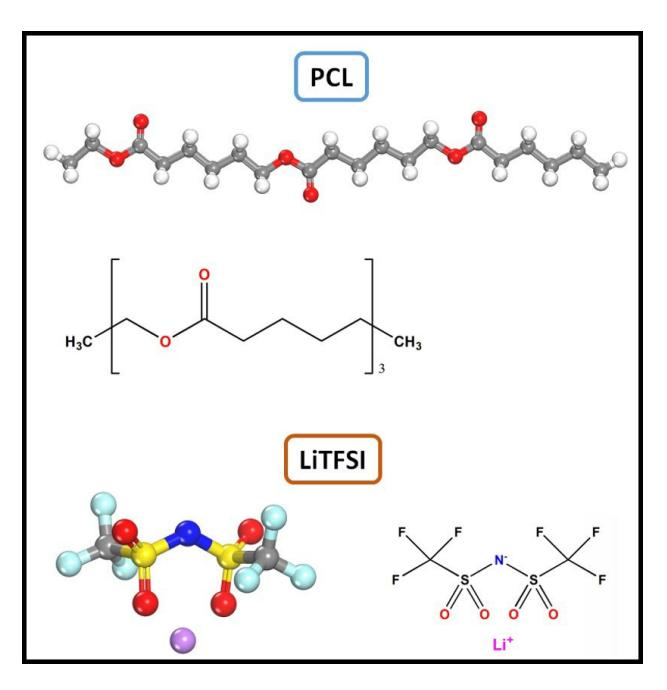
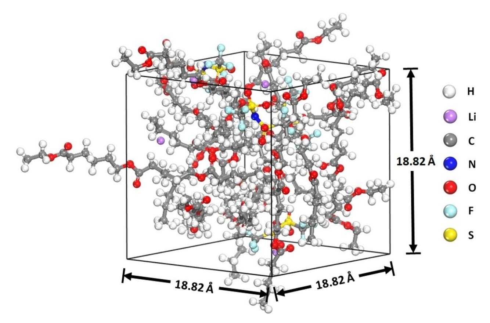
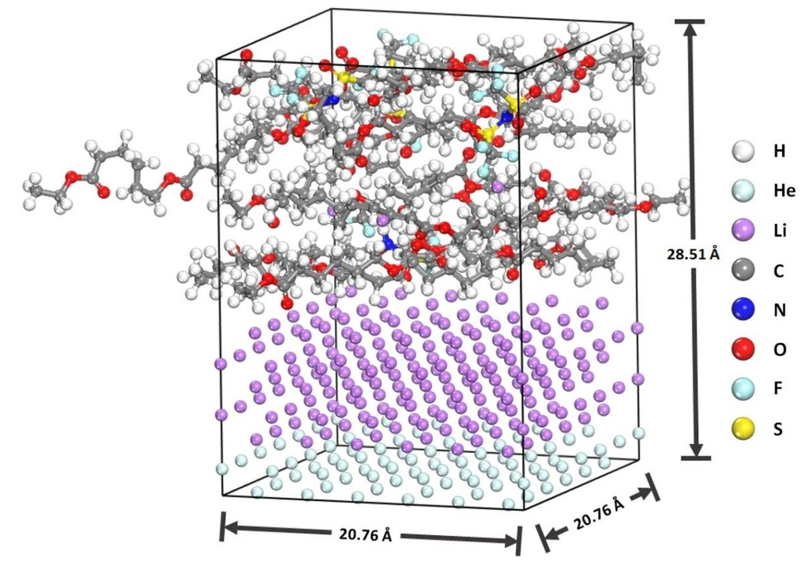
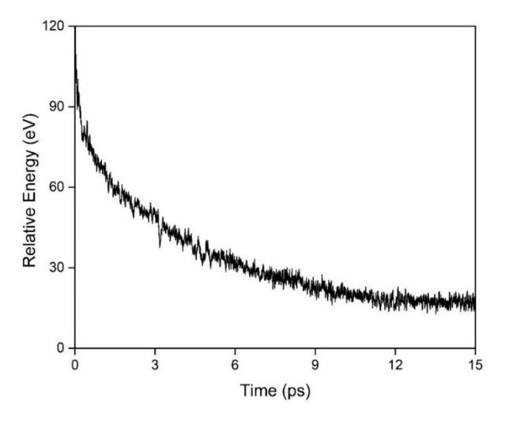
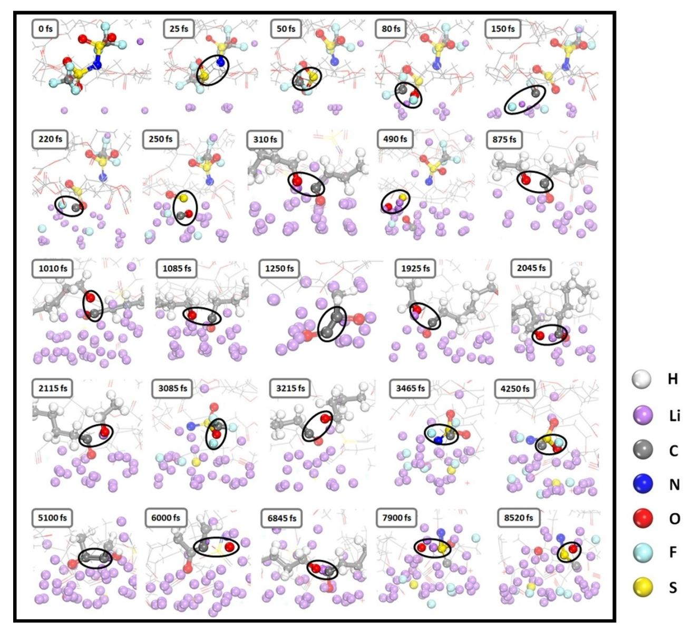
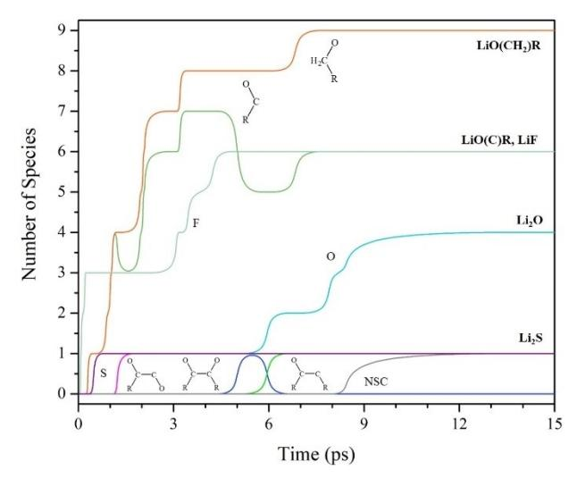
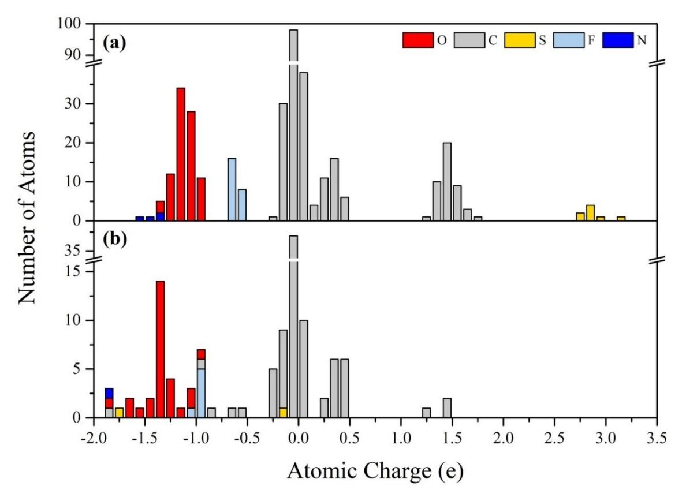
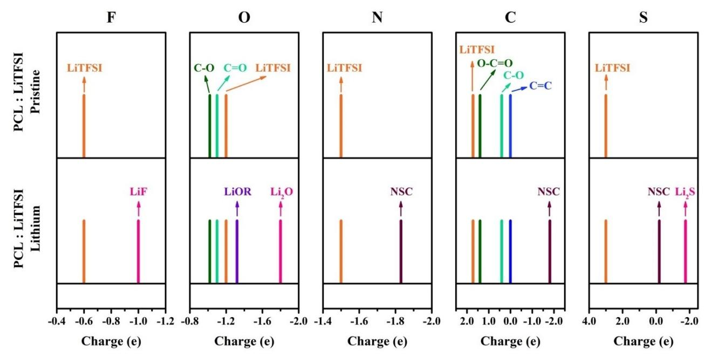
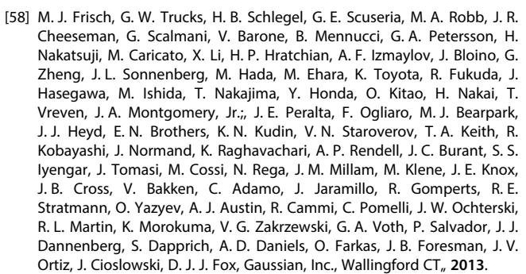

# **Prediction of SEI Formation in All-Solid-State Batteries: Computational Insights from PCL-based Polymer Electrolyte Decomposition on Lithium-Metal**

Liang-Ting Wu+,[a] Santhanamoorthi Nachimuthu+,[a] Daniel Brandell,[b] and Jyh-Chiang Jiang\*[a]

Identifying the solid electrolyte interphase (SEI) components in all-solid-state lithium batteries (ASSLBs) is essential when developing strategies for improving this battery technology. However, a comprehensive understanding of the interfacial stability and decomposition reactions of solid polymer electrolyte with lithium metal anode remains a challenge, not least outside the dominating poly(ethylene oxide)-based materials. Here, we report the reactivity of an electrolyte system composed of a polyester (poly- $\varepsilon$ -caprolactone, PCL) and lithium bis(trifluoromethanesulfonyl)imide (LiTFSI) salt on Li (100) surface, and the subsequent SEI formation, using ab initio

# **Introduction**

The demand for high-energy-density lithium-ion batteries (LIBs) is constantly rising, owing to the massive expansion of the consumer electronics market and increased vehicle electrification in modern society.[1-5] In the development of nextgeneration energy-dense LIBs, the use of lithium metal anode is now widely regarded as one of the most promising candidates due to its low redox potential ( $-3.04$  V vs. standard hydrogen electrode) and ultrahigh theoretical capacity  $(3862 \text{ mAh g}^{-1})$ .[6-9] However, efforts to improve the energy density of LIBs by implementation of Li-metal anodes have lagged far behind the rate of progress in their commercialization,[10,11] primarily because conventional lithium metal batteries (LMBs) use organic liquid electrolytes, which generate serious safety concerns due to electrochemical instabilities and risk of explosion.[12-14] Development of highly secure batteries is becoming increasingly important to push electrification further.

Solid polymer electrolytes (SPEs) have attracted great interest in recent years as a potential alternative for all-solid-

| [a] L.-T. Wu, + Dr. S. Nachimuthu, + Prof. J.-C. Jiang Department of Chemical Engineering, |
|---------------------------------------------------------------------------------------------------------------------|
| National Taiwan University of Science and Technology,                                                               |
| Taipei 106, Taiwan, R.O.C.                                                                                          |
| E-mail: jcjiang@mail.ntust.edu.tw                                                                                   |
| [b] Prof. D. Brandell                                                                                               |
| Department of Chemistry – Ångström Laboratory,                                                                      |
| Uppsala University,                                                                                                 |
| Box 538, 75121, Uppsala, Sweden                                                                                     |
| [ + ] These authors contributed equally to this work.                                                    |
| Supporting information for this article is available on the WW                                                      |
|                                                                                                                     |

W under https://doi.org/10.1002/batt.202200088

molecular dynamics (AIMD) simulations. The step-by-step electrolyte decomposition on the anode surface is monitored, and the resultant major SEI components are analyzed by Bader charges to correlate with X-ray photoelectron (XPS) signal. The presence of PCL at the Li surface promotes a rapid initial reduction of LiTFSI salt via cleavage of S-N and C-S bonds, and its complete dissociation and formation of major SEI components such as LiF, Li2O, Li2S, and C-containing species. Furthermore, a computational analysis of relevant XPS spectra is performed to support the degradation compounds.

state lithium batteries (ASSLBs), which could offer an appealing way to access both high energy density and improved safety.[15-17] Originally, Fenton et al. developed the first SPE based on poly(ethylene oxide) (PEO), which had ionic conductivities of the order of  $10^{-8}$  S cm-1.[18] Since then, the development of SPEs has increased with the increase in demand for high-performance batteries, and several types of SPEs have been developed, including polycarbonates, polymeric siloxanes, polyphosphazenes, plastic crystals based electrolytes, etc.,[19-23] However, the poor ionic conductivity at room temperature, poor interfacial compatibility with electrodes, and poor mechanical strengths have severely limited their further use in most practical applications.[24–26]

SPEs based on aliphatic polyesters have recently been developed to address those thorny issues.[27-32] Among them, a biodegradable, linear aliphatic semi-crystalline polyester, polyε-caprolactone (PCL), exhibits adequate ionic conductivity at room temperature.[33-35] PCL is similar to PEO in that it is semicrystalline below  $T_m$  and has a fairly low glass transition temperature ( $T_a$ ) of -60 °C, but also generally possess a higher Li-ion transference number.[36,37] Despite such beneficial features, some significant drawbacks of SPEs based on PCL cannot be overlooked, specifically, a rather poor rate performance in ASSLBs.[35] Among all the known causes of poor rate performance, interfacial instability between electrolytes and electrodes is regarded as a significant issue, resulting in an unstable solid electrolyte interphase (SEI) layer.[38-40] Hence, understanding the complex interfacial reactions generating SEI layers is essential to gain knowledge of these fundamental microscopic processes and develop strategies for improving the PCL based electrolytes.

In recent years, the unprecedented ability of computations and advancements in atomic-scale simulation have made it possible to probe and analyze such experimentally complicated mechanisms.[41–47] In this context, *ab initio* molecular dynamics simulations (AIMD) have been widely used to investigate the initial reactions involved in SEI formation and electrolyte degradation.[44,48–50] Recently, Ebadi et al. considered different SPEs, including PCL and PEO, and explored their stability and the electronic structure at the Li metal anode surface using density functional theory (DFT) calculations.[51] While they considered only polymeric SPE host systems that interacted with the Li metal surface, the electrolyte formulation includes both polymers and Li salts, and it is highly imperative to also include the salt since the nature of the SEI layer is determined by the degradation reduction reactions of several electrolyte components.[52,53] Thus, we herein investigate an electrolyte system composed of PCL polymer and LiTFSI salt, and explore the reaction mechanisms leading to SEI formation using a combination of DFT calculations and AIMD simulations. Additionally, we perform a theoretical analysis of the representative atomic X-ray photoelectron spectroscopy (XPS) spectra to support the computational results through comparisons with previous experiments on degradation compounds.

# **Computational Methods**

The main calculations in this paper were performed with DFT as implemented in Vienna ab initio Simulation Package (VASP) 6.1.1,[54,55] employing the projector-augmented wave (PAW)[56] method. The Kohn-Sham equations were solved within the generalized gradient approximation (GGA), using the Perdew– Burke–Ernzerhof (PBE) exchange-correlation functional.[57] In order to include the van der Waals (vdW) correction, the optB86b-vdW method was used. The cut-off for the plane wave energy was set to 550 eV, and the Brillouin zone was sampled with a 2×2×1 Monkhorst-Pack k-point set. The electronic energy convergence was set to 10 4 eV, and the geometry optimization was converged when the Hellman–Feynman forces acting on each atom was less than 0.01 eVÅ 1 . The 6×6 Li (100) surface was modeled using a supercell with the optimized Li bulk structure, consisting of 7 layers, in which He atoms replaced the bottom two layers to prevent the electrolyte interaction between the neighboring slabs. A vacuum layer of ~18 Å was added above the Li metal surface in the zdirection, which provides space for the electrolyte. The optimized Li (100) surface slab model and its dimension are shown in Figure S1. The monomers of the polymeric host PCL and lithium bis(trifluoromethanesulfonyl)imide (LiTFSI) salt were optimized at the M06-2X/6-31G\* level of theory using Gaussian 09 package,[58–60] and then the optimized electrolyte components (PCL and LiTFSI) were randomly placed on the Li (100) anode surface. The interaction between the electrolyte and Li anode surface was explored using AIMD simulations. We performed AIMD simulations with VASP using the PBE functional for a simulation time of 15 ps with a time step of 1 fs in the canonical ensemble (NVT). The Nosé–Hoover thermostat[61,62] was employed to maintain an average temperature of 450 K. The electronic charges were calculated using Bader charge analysis.[63–65]

# **Results and Discussion**

### **Electrolyte model**

In this work, we considered an electrolyte mixture composed of PCL and LiTFSI salt adsorbed on the Li anode surface and investigated its decomposition reactions. In this study, a PCL oligomer with three monomeric units with terminal alkyl groups ( CH3) was considered, similar to Ebadi et al., where it was demonstrated that the frontier orbital energy has a very weak dependence on oligomer chain length variation.[51] Unless otherwise stated, the results reported here are for PCL oligomers with three monomeric units. Figure 1 depicts the PCL and LiTFSI salt studied in this work.

We first explored the reactivity, structural rearrangements, and decomposition reaction(s) of the electrolyte mixture before exposing it to the Li anode surface. Thereby, twelve PCL and four LiTFSI salt molecules were added to the simulation box to meet the total density of 1.4 gcm 3 , and the resulting simulation box and its dimensions are shown in Figure 2. The initial structures were generated and pre-equilibrated with classical MD simulations with the Forcite module of the Materials Studio code.[66]

Classical MD simulations were performed using COMPASS II force-field for 10 ps at 450 K, which can efficiently perform energy minimization for different conformations of electrolyte structures.[67,68] After this step, the energy fluctuations were minor, and the final configurations of the classical MD were

**Figure 1.** The molecular structures of poly(ɛ -caprolactone) (PCL), and lithium bis(trifluoromethanesulfonyl)imide (LiTFSI) salt.

**Figure 2.** AIMD simulation box for PCL-LiTFSI electrolyte corresponding to total density of 1.4 gcm 3 (PCL12LiTFSI4).

therefore used for AIMD simulations. A single AIMD run may not justify the quantitative predictions of electrolyte decomposition reactions. However, performing multiple runs of AIMD simulations and averaging them is computationally very demanding. Our results in this study are based on the single run of AIMD simulations, as in the recent theoretical studies.[69–71] The structural stability of the electrolyte mixture is analyzed using the evolution of the total energy during the simulation time. Figure S2 shows the variation of the total energy versus the dynamic step in AIMD simulations at 450 K for the pure electrolyte mixture. The electrolyte mixture well maintains its structure at 450 K with a small energy fluctuation, as shown in Figure S2, indicating that no significant geometrical distortions or degradation reactions occurred during simulations. This is further confirmed by analyzing the snapshots of the electrolyte mixture extracted at regular intervals of simulation times ranging from 0 to 15 ps (Figure S3), as no significant electrolyte decomposition was observed.

#### **Electrolyte decomposition on a Li (100) surface**

To investigate the stability of electrolyte mixture on the Li anode surface, the modeled electrolyte, consisting of twelve PCL oligomers and four LiTFSI salt molecules with a total density of 1.1 gcm 3 , was added into the simulation cell, which contained an optimized Li (100) surface (five Li and two He layers). The electrolyte mixture was placed such that there is a gap of ~1 Å between the top layer of the anode surface slab and the electrolyte and the resulting simulation box size was 20.76×20.76×28.51 Å, in which the bottom four layers (two Li and two He) of the slab were fixed during the AIMD simulations, as depicted in Figure 3. As like pure electrolyte mixture, the initial structures were pre-equilibrated with classical MD simulations up to 10 ps, and the final configurations were used for AIMD simulations to investigate how the electrolyte structural degradation is initiated when exposed to the anode surface. To explore the chemical interactions of the electrolyte mixture with the anode surface, we first extracted the total energy variations over simulation times, as shown in Figure 4. As soon as the simulation begins, there is a large drop in energy, which continues to decrease significantly with fluctuations and reaches equilibrium first at the end of the simulation, indicating a strong reactivity of the electrolyte mixture with the anode surface.

To illustrate some representative insights about the corresponding reactions, snapshots of the electrolyte mixture on the anode surface were extracted at different simulation times, and are shown in Figure 5. In each snapshot, the molecules undergoing degradation reactions are highlighted as ball and stick models, while the rest of the unreacted system is depicted as a wireframe. It can be noticed that a total of four PCL oligomers and one TFSI anion out of twelve and four, respectively, in the simulation cell undergoes reduction during the AIMD simu-

**Figure 3.** AIMD simulation box for PCL-LiTFSI electrolyte on the Li (100) anode surface.

**Figure 4.** The energy fluctuations over the simulation time for the electrolyte exposed at Li metal anode surface.

lations. The step-by-step electrolyte decomposition on the anode surface is monitored in Figure 5 and discussed further in detail. The rapid initial decomposition of the TFSI anion can be seen within the first ~25 fs and continues as the simulation progresses. The reduction of LiTFSI salt begins *via* cleavage of the S N bond, followed by breaking the C S bond at 50 fs, forming three fragments. The initial bond breaking mechanisms (C S and S N) of the salt anion are consistent with the previous findings,[72–74] which initiate further reduction of the salt anion on the Li surface. Furthermore, three of the six C F bonds of salt anion are broken within short times (~220 fs), thereafter yielding fragments such as NSO2CF3, SO2, carbon, and three F ions on the anode surface. The detached F ions are bonded with the Li ions and form LiF, which is known to be one of the major components of the SEI layer.[75,76] Following this step, the S O bond in the SO2 fragment breaks at 250 fs and forms a carbonyl group (C=O) with the cleaved C atom on the surface. In comparison to corresponding conventional electrolyte mixture (LiTFSI with organic liquid solvents), the presence of the polymeric host PCL actually accelerates TFSI anion degradation and LiF formation on the Li metal anode surface (within 1 ps), where the LiF formation is observed during the simulation time of 6.0–11.0 ps.[77] Balbuena's group[78] previously reported that the LiTFSI salt begins to decompose first at 5.1 ps when exposed to Li metal together with DME solvent, and did not find any LiF formation before the end of the simulation.

Our results show that the first polymeric host PCL begins to decompose at 310 fs via cleavage of one of its C O bonds, yielding two alkoxide species on the surface. Subsequently, the S O bond of the salt fragment is reduced at 490 fs, leaving only S and O atoms. It is seen that the second PCL oligomer undergoes breaking of two of its C O bonds at 875 and 1010 fs, resulting in three alkoxide species that remain on the surface alongside the other decomposition products. This is followed by the cleavage of the second C O bond from the

**Figure 5.** Snapshots of the electrolyte PCL-LiTFSI at the Li metal anode surface extracted from AIMD simulations at various times.

first PCL oligomer at 1085 fs. At 1250 fs, the detached carbonyl group from the salt coupled with one of the alkoxide species forms an OC C(O)R fragment. The third PCL oligomer is found to be reduced at 1925 fs by breaking one of its C O bonds, yielding two alkoxide species. Furthermore, we observed that the final (third) C O bond of the first and second PCL oligomers broke at ~2100 fs. The fourth PCL oligomer, like the other three, was reduced via cleavage of one of its C O bonds, resulting in two alkoxide species formed at 3215 fs that remained stable on the surface (no further reduction). Moreover, the decomposition fragment NSO2CF3 starts to defluorinate during 3–5 ps, and the detached F ions migrate toward the anode surface, where LiF are formed. Following that, the two alkoxide species of PCL undergo C C coupling at 5100 fs and forms an R(O)C C(O)R fragment, which is further reduced via C O bond breaking at 6 ps, resulting in R(O)C CR and Li2O species on the surface. This is followed by breaking the second C O bond from the third PCL at 6845 fs. Furthermore, the S O bonds break off from the NSO2C fragment of salt during 7900– 8520 fs, leaving NSC and Li2O species on the surface. These results show that during the simulation, the electrolyte components (PCL and LiTFSI) undergo multiple reduction reactions, generating both small and larger C-containing fragments of SEI components. Table 1 lists the observed complete decomposition reactions of LiTFSI and PCL molecules along with the time scale, and their respective resultant SEI components are illustrated in Figure 6. As shown in Figure 6, electrolyte decomposition results in the formation of six LiF and Li (O)C R, nine Li (O)CH2 R, four Li2O, one Li2S, one NSC, one R(O)C CR, and one OC C(O)R species on the anode surface, all of which are important SEI components in LIBs. The resultant SEI components observed in our AIMD simulations are

| Table 1. Catalog of electrolyte decomposition reactions and the approximate time they occurred during AIMD simulations. |           |                           |             |             |  |
|-------------------------------------------------------------------------------------------------------------------------|-----------|---------------------------|-------------|-------------|--|
| Species                                                                                                                 | Time [fs] | Reaction                  | Broken bond | Formed bond |  |
| 1st PCL                                                                                                                 | 310       | R COO R'!R CO+R' O        | C O         |             |  |
|                                                                                                                         | 1085      | R COO R'!R CO+R' O        | C O         |             |  |
|                                                                                                                         | 2115      | R COO R'!R CO+R' O        | C O         |             |  |
| 2nd PCL                                                                                                                 | 875       | R COO R'!R CO+R' O        | C O         |             |  |
|                                                                                                                         | 1010      | R COO R'!R CO+R' O        | C O         |             |  |
|                                                                                                                         | 2045      | R COO R'!R CO+R' O        | C O         |             |  |
| 3rd PCL                                                                                                                 | 1925      | R COO R'!R CO+R' O        | C O         |             |  |
|                                                                                                                         | 6845      | R COO R'!R CO+R' O        | C O         |             |  |
| 4th PCL                                                                                                                 | 3215      | R COO R'!R CO+R' O        | C O         |             |  |
| TFSI                                                                                                                    | 25        | N(SO2CF3)2!NSO2CF3+SO2CF3 | N S         |             |  |
|                                                                                                                         | 50        | SO2CF3!SO2+CF3            | S C         |             |  |
|                                                                                                                         | 80        | CF3!CF2+F                 | C F         |             |  |
|                                                                                                                         | 150       | CF2!CF+F                  | C F         |             |  |
|                                                                                                                         | 220       | CF!C+F                    | C F         |             |  |
|                                                                                                                         | 250       | SO2+C!SO+CO               | S O         | C O         |  |
|                                                                                                                         | 490       | SO!S+O                    | S O         |             |  |
|                                                                                                                         | 3085      | NSO2CF3!NSO2CF2+F         | C F         |             |  |
|                                                                                                                         | 3465      | NSO2CF2!NSO2CF+F          | C F         |             |  |
|                                                                                                                         | 4250      | NSO2CF!NSO2C+F            | C F         |             |  |
|                                                                                                                         | 7900      | NSO2C!NSOC+O              | S O         |             |  |
|                                                                                                                         | 8520      | NSOC!NSC+O                | S O         |             |  |
| Alkoxide                                                                                                                | 1250      | CO+R CO!OC C(O)R          |             | C C         |  |
|                                                                                                                         | 5100      | R CO+R CO!R(O)C C(O)R     |             | C C         |  |
|                                                                                                                         | 6000      | R(O)C C(O)R!R(O)C CR+O    | C O         |             |  |

**Figure 6.** Summary of the resulting SEI components obtained during decomposition reactions of LiTFSI and PCL molecules at the Li metal surface along with the time scale.

closely matched with those previously reported in experimental results of PCL : LiTFSI and lithium metal.[79]

#### **Charge population analysis**

To further validate the interfacial electrolyte decomposition reactions and the resultant SEI components, we performed Bader charge analysis on the electrolyte mixture before and

*Batteries & Supercaps* **2022**, *5*, e202200088 (6 of 10) © 2022 Wiley-VCH GmbH

after it was exposed to the Li metal anode surface. The atomic charge was used to quantify the electron variation on atoms, which is an intuitive description of charge distribution in the electrolyte decomposition products. Hence, the atomic charges of pure electrolyte mixture and electrolyte mixture on Li (100) surface are calculated based on the final configurations (15 ps) from our AIMD simulations. Before analyzing the electrolyte decomposition products, the atomic charges of individual PCL and LiTFSI molecules are calculated to compare the different atomic environments in the electrolyte mixture, as shown in Figure S4. As illustrated in Figure S4, PCL has two types of oxygen environments (C O and C=O), with atomic charges of 1.03 and 1.09j ej, respectively. It also has three different types of C environments: sp2 (C=O), sp3 (C with oxygen), and sp3 (C C), with atomic charges of approximately 1.43, 0.38, and 0.0je j, respectively. In TFSI, the atomic charges of S, F, and N atoms are 3.03, 0.60, and 1.56j ej, respectively. Figure 7 compares the atomic charges of representative atoms in a pure electrolyte mixture with those on the Li (100) surface. The unreactive atoms in the electrolyte mixture on the Li (100) surface are ignored in Figure 7 for clarity; thus, the number of atoms in both cases is not equal. The atomic charges of representative atoms (O, F, C, S, N) in the pure electrolyte mixture (12 PCL and 4 LiTFSI) are fairly consistent with those of individual PCL and LiTFSI molecules. As shown in Figure 7(a), the F ions in the pure electrolyte mixture have atomic charges of approximately 0.6j e j, which significantly gains electrons (~1.0j ej) after exposure to the Li anode surface, confirming their interaction with surface Li cations. Similarly, the atomic charges of O atoms (O C) in the electrolyte mixture are largely

**Figure 7.** Atomic charges of the representative atoms in a) a pure electrolyte mixture and b) the electrolyte mixture at Li anode surface.

downshifted (negatively) compared to those in pure electrolyte mixture, whereas the charges of the carbonyl oxygen atoms (C=O) are nearly the same in both cases, implying that the C=O group does not participate in PCL reduction. Furthermore, it is seen that the charges of all carbon atoms (except one) remain unchanged after the electrolyte is exposed to the anode surface. In contrast, the S and N atoms of LiTFSI salt gain electrons, with S atoms reducing more than other atoms on the anode surface, as their charges shifted from ~ +3.0 to 0.2 and 1.75j ej (Figure 7), revealing their obvious reduction during electrolyte decomposition and thereby the formation of SEI component NSC.

#### **X-ray photoelectron spectroscopy**

In addition to the computational results of Ebadi et al.[51], Andersson et al.,[79] very recently investigated the initial degradation reactions of an electrolyte mixture consisting of PCL and LiTFSI on Li anode and identified the degradation compounds in the interphase region using soft X-rays photoelectron spectroscopy (SOXPES). Therefore, in order to benchmark our calculations, we also predicted the representative XPS spectra. Because the complete system (electrolyte and anode) is computationally challenging, we only considered isolated PCL as a model system and simulated its XPS spectra. The calculation of the binding energy of atoms is typically used to assign the experimental XPS peaks.[80] Therefore, the binding energies (BEs) of representative atoms in the isolated PCL molecule are calculated at DFT level with the Generalized Gradient Approximation (GGA) with PBEsol functional by the ADF program[81,82] and are summarized along with the experimental results in Table 1S of supplementary information. The basis function TZ2P is used for representative atoms in the XPS spectra simulation, while TZP is used for the remaining atoms. As can be seen, the calculated BE values are fairly close to the experimental results, and qualitative assessments can thereby be made.[79] The estimated BEs clearly define the different groups of C and O atoms; for instance, the more positive C atom (C1s (O C=O)) has a higher binding energy than the negative one, and the more negative carbonyl oxygen (C=O) has a lower BE than the oxygen in C O. The atomic charges of electrolyte components and their degradation products determined from the above Bader charge analysis (Figure 7) are supported by these XPS data. Therefore, we compared the different SEI components and their environments reported by previous XPS results[79] using the calculated atomic charges (F, O, N, C, and S) of both pure electrolyte and the electrolyte at the anode surface, as illustrated in Figure 8. The additional atomic charge peaks that appear after electrolyte exposure to the anode surface are assigned with previous XPS binding energy and discussed below.

As can be seen in Figure 8, the new fluorine peak at 1.0j ej is associated with LiF formation upon salt degradation,

**Figure 8.** Bader charges of F, O, N, C, S atoms for pure electrolyte (PCL : LiTFSI) and the electrolyte on the Li metal anode surface (PCL : LiTFSI Lithium).

which agrees with the XPS peak assigned to LiF at lower BE ~684 eV than the pure salt atom. Two additional peaks for the O atoms are observed at 1.4 and 1.8j ej, which in turn are associated with the LiOR and Li2O species appearing in the XPS spectra at 530 and 528 eV, respectively. Upon electrolyte exposure to the anode, new charge peaks emerge also for the N and C atoms, which correspond to the NSC component. Similarly, two new peaks appear for the S atom, one at 0.2 and another at 1.75j ej, which agree well with the peaks assigned to NSC and Li2S in the previous experimental XPS spectra, where the more negative S atom ( 1.75j ej) has a lower binding energy of ~161 eV. The AIMD results and the atomic charge analysis shown in previous sections of the present work thus allow us to identify the ion-conducting polymer electrolyte degradation in the interphase region and further confirms with the previously reported degradation compounds.

### **Conclusion**

The degradation mechanisms of solid polymer electrolytes on the Li metal anode surface have been investigated using ab initio molecular dynamics simulations. In particular, the reduction of the polymeric host (PCL) and the LiTFSI salt have been considered. Our simulation results show that the presence of the polymeric host PCL accelerates salt TFSI anion degradation and LiF formation on the Li metal anode surface, which happens within 1 ps. The analysis of AIMD snapshots clearly demonstrates the C O bond breaking of PCL and the formation of alkoxide fragments. We find that the electrolyte components (PCL and LiTFSI) undergo multiple reduction reactions, producing both small and larger fragments of SEI components; the resultant species are stable on the anode surface for the remaining time scale of the simulation (15 ps). Atomic charges are then used to quantify the variation in electron distribution on the atoms during electrolyte decomposition on the surface. Furthermore, the XPS spectra for isolated PCL are simulated using the DFT method, and our results agree reasonably well with experimental results on the corresponding system. Thereby, the AIMD simulations and atomic charge analysis allow us to identify and confirm ion-conducting polymer electrolyte degradation in the interphase region. Taken together, this study provides an atomistic understanding of the decomposition mechanisms of solid polymer electrolytes on the anode surface and a computational strategy for confirming the experimentally reported SEI components, which could serve as a guide for developing potential polymer electrolytes in allsolid-state lithium batteries.

## **Supporting Information**

Optimized Li (100) surface slab model, energy fluctuations over the simulation time for the pure electrolyte, the snapshots of the pure electrolyte PCL-LiTFSI extracted from AIMD simulations at various times, calculated atomic charges of individual PCL and LiTFSI molecules, and calculated and experimental binding energy and atomic charges of representative atoms of PCL.

### *Acknowledgements*

*This work was financially supported by the Ministry of Science and Technology, Taiwan (MOST 110-2923-M-011-002 and MOST*

*Batteries & Supercaps* **2022**, *5*, e202200088 (8 of 10) © 2022 Wiley-VCH GmbH

*110-2639-E-011-001-ASP) and the Swedish Foundation for Strategic Research, Sweden Taiwan Research Projects (ST19-0095, SOLID ALIBI). The authors thank the Taiwan National Center of High-Performance Computing (NCHC) for computing resources.*

### *Conflict of Interest*

The authors declare that they have no known competing financial interests or personal relationships that could have appeared to influence the work reported in this paper.

### **Data Availability Statement**

The data that support the findings of this study are available from the corresponding author upon reasonable request.

**Keywords:** all-solid-state lithium battery **·** DFT/AIMD **·** lithium metal anode **·** polymer electrolyte **·** SEI components

- [1] A. Manthiram, *ACS Cent. Sci.* **2017**, *3*, [1063–1069,](https://doi.org/10.1021/acscentsci.7b00288) DOI: 10.1021/ [acscentsci.7b00288](https://doi.org/10.1021/acscentsci.7b00288).
- [2] M. D. Gao, H. Li, L. Xu, Q. Xue, X. N. Wang, Y. Bai, C. Wu, *J. [Energy](https://doi.org/10.1016/j.jechem.2020.11.034) Chem.* **2021**, *59*, 666–687, DOI: [10.1016/j.jechem.2020.11.034.](https://doi.org/10.1016/j.jechem.2020.11.034)
- [3] A. Manthiram, *Nat. Commun.* **2020**, *11*, 1550, DOI: 10.1038/s41467-020- 15355–0.
- [4] J. W. Choi, D. Aurbach, *Nat. Rev. Mater.* **2016**, *1*, 16013, DOI: 10.1038/ natrevmats.2016.13.
- [5] D. Larcher, J. M. Tarascon, *Nat. Chem.* **2015**, *7*, 19–29, DOI: [10.1038/](https://doi.org/10.1038/nchem.2085) [Nchem.2085.](https://doi.org/10.1038/nchem.2085)
- [6] X. B. Cheng, R. Zhang, C. Z. Zhao, Q. Zhang, *[Chem.](https://doi.org/10.1021/acs.chemrev.7b00115) Rev.* **2017**, *117*, 10403–10473, DOI: [10.1021/acs.chemrev.7b00115.](https://doi.org/10.1021/acs.chemrev.7b00115)
- [7] Q. Y. Wang, B. Liu, Y. H. Shen, J. K. Wu, Z. Q. Zhao, C. Zhong, W. B. Hu, *Adv. Sci.* **2021**, *8*, 2101111, DOI: 10.1002/advs.202101111.
- [8] D. C. Lin, Y. Y. Liu, Y. Cui, *Nat. [Nanotechnol.](https://doi.org/10.1038/nnano.2017.16)* **2017**, *12*, 194–206, DOI: 10. [1038/Nnano.2017.16.](https://doi.org/10.1038/nnano.2017.16)
- [9] Y. Zhang, T. T. Zuo, J. Popovic, K. Lim, Y. X. Yin, J. Maier, Y. G. Guo, *Mater. Today* **2020**, *33*, 56–74, DOI: [10.1016/j.mattod.2019.09.018](https://doi.org/10.1016/j.mattod.2019.09.018).
- [10] A. Mauger, M. Armand, C. M. Julien, K. Zaghib, *J. Power [Sources](https://doi.org/10.1016/j.jpowsour.2017.04.018)* **2017**, *353*, 333–342, DOI: [10.1016/j.jpowsour.2017.04.018](https://doi.org/10.1016/j.jpowsour.2017.04.018).
- [11] J. M. Tarascon, M. Armand, *Nature* **2001**, *414*, [359–367,](https://doi.org/10.1038/35104644) DOI: Doi 10. [1038/35104644](https://doi.org/10.1038/35104644).
- [12] Y. Chen, Y. Shi, Y. Liang, H. Dong, F. Hao, A. Wang, Y. Zhu, X. Cui, Y. Yao, *ACS Appl. Energ. Mater.* **2019**, *2*, [1608–1615.](https://doi.org/10.1021/acsaem.8b02188)
- [13] H. Chen, T. N. Cong, W. Yang, C. Tan, Y. Li, Y. Ding, *Prog. Nat. Sci.* **[2009](https://doi.org/10.1016/j.pnsc.2008.07.014)**, *19*, [291–312](https://doi.org/10.1016/j.pnsc.2008.07.014).
- [14] H. N. Chen, G. T. Cong, Y. C. Lu, *J. Energy Chem.* **2018**, *27*, [1304–1325,](https://doi.org/10.1016/j.jechem.2018.02.009) DOI: [10.1016/j.jechem.2018.02.009.](https://doi.org/10.1016/j.jechem.2018.02.009)
- [15] L. Fan, S. Wei, S. Li, Q. Li, Y. Lu, *Adv. Energy Mater.* **2018**, *8*, [1702657.](https://doi.org/10.1002/aenm.201702657)
- [16] Q. Zhao, X. T. Liu, S. Stalin, K. Khan, L. A. Archer, *Nat. [Energy](https://doi.org/10.1038/s41560-019-0349-7)* **2019**, *4*, 365–373, DOI: [10.1038/s41560-019-0349-7.](https://doi.org/10.1038/s41560-019-0349-7)
- [17] Q. L. Wang, H. R. Zhang, Z. L. Cui, Q. Zhou, X. H. Shangguan, S. W. Tian, X. H. Zhou, G. L. Cui, *Energy Storage Mater.* **2019**, *23*, [466–490,](https://doi.org/10.1016/j.ensm.2019.04.016) DOI: 10. [1016/j.ensm.2019.04.016](https://doi.org/10.1016/j.ensm.2019.04.016).
- [18] D. Fenton, *[Polymer](https://doi.org/10.1016/0032-3861(73)90146-8)* **1973**, *14*, 589.
- [19] W. Q. Ding, F. Lv, N. Xu, M. T. Wu, J. Liu, X. P. Gao, *ACS Appl. [Energ.](https://doi.org/10.1021/acsaem.1c00216) Mater.* **2021**, *4*, 4581–4601, DOI: [10.1021/acsaem.1c00216](https://doi.org/10.1021/acsaem.1c00216).
- [20] J. J. Zhang, J. F. Yang, T. T. Dong, M. Zhang, J. C. Chai, S. M. Dong, T. Y. Wu, X. H. Zhou, G. L. Cui, *Small* **2018**, *14*, 1800821, DOI: 10.1002/ smll.201800821.
- [21] Y. Tominaga, V. Nanthana, D. Tohyama, *Polym. J.* **2012**, *44*, [1155–1158,](https://doi.org/10.1038/pj.2012.97) DOI: [10.1038/pj.2012.97](https://doi.org/10.1038/pj.2012.97).
- [22] B. Y. Wang, G. X. Wang, P. G. He, L. Z. Fan, *J. Membr. Sci.* **2022**, *642*, DOI: 10.1016/j.memsci.2021.119952.
- [23] Y. Zhang, L. P. Yu, J. R. Wang, S. Q. Li, H. H. Gan, Z. G. Xue, *J. [Membr.](https://doi.org/10.1016/j.memsci.2021.119210) Sci.* **2021**, *626*, 119210, DOI: [10.1016/j.memsci.2021.119210.](https://doi.org/10.1016/j.memsci.2021.119210)

- [24] L. Y. Yang, D. X. Wei, M. Xu, Y. F. Yao, Q. Chen, *[Angew.](https://doi.org/10.1002/anie.201307423) Chem. Int. Ed.* **2014**, *53*, 3631–3635, DOI: [10.1002/anie.201307423.](https://doi.org/10.1002/anie.201307423)
- [25] H. J. Ha, E. H. Kil, Y. H. Kwon, J. Y. Kim, C. K. Lee, S. Y. Lee, *Energy [Environ.](https://doi.org/10.1039/c2ee03025j) Sci.* **2012**, *5*, 6491–6499, DOI: [10.1039/c2ee03025j](https://doi.org/10.1039/c2ee03025j).
- [26] K. H. Choi, S. J. Cho, S. H. Kim, Y. H. Kwon, J. Y. Kim, S. Y. Lee, *Adv. [Funct.](https://doi.org/10.1002/adfm.201301345) Mater.* **2014**, *24*, 44–52, DOI: [10.1002/adfm.201301345.](https://doi.org/10.1002/adfm.201301345)
- [27] L. Zhang, S. Wang, J. Y. Li, X. Liu, P. P. Chen, T. Zhao, L. Y. Zhang, *[J.](https://doi.org/10.1039/C9TA00180H) Mater. Chem. A* **2019**, *7*, 6801–6808, DOI: [10.1039/c9ta00180h](https://doi.org/10.1039/C9TA00180H).
- [28] S. Wang, A. L. Wang, X. Liu, H. Xu, J. Chen, L. Y. Zhang, *[Electrochim.](https://doi.org/10.1016/j.electacta.2017.10.163) Acta* **2018**, *259*, 213–224, DOI: [10.1016/j.electacta.2017.10.163](https://doi.org/10.1016/j.electacta.2017.10.163).
- [29] H. Xu, J. Xie, Z. Liu, J. Wang, Y. Deng, *MRS Energy Sustainability* **2020**, *7*, E2, DOI: 10.1557/mre.2020.3.
- [30] T. Eriksson, J. Mindemark, M. Yue, D. Brandell, *[Electrochim.](https://doi.org/10.1016/j.electacta.2019.01.117) Acta* **2019**, *300*, 489–496, DOI: [https://doi.org/10.1016/j.electacta.2019.01.117.](https://doi.org/10.1016/j.electacta.2019.01.117)
- [31] A. Bergfelt, M. J. Lacey, J. Hedman, C. Sangeland, D. Brandell, T. Bowden, *RSC Adv.* **2018**, *8*, 16716–16725, DOI: [10.1039/c8ra00377g](https://doi.org/10.1039/C8RA00377G).
- [32] A. Bergfelt, G. Hernandez, R. Mogensen, M. J. Lacey, J. Mindemark, D. Brandell, T. M. Bowden, *ACS Appl. Polym. Mater.* **2020**, *2*, [939–948,](https://doi.org/10.1021/acsapm.9b01142) DOI: [10.1021/acsapm.9b01142](https://doi.org/10.1021/acsapm.9b01142).
- [33] C. Y. Chiu, H. W. Chen, S. W. Kuo, C. F. Huang, F. C. Chang, *[Macro](https://doi.org/10.1021/ma0488156)molecules* **2004**, *37*, 8424–8430, DOI: [10.1021/ma0488156](https://doi.org/10.1021/ma0488156).
- [34] C. P. Fonseca, S. Neves, *J. Power Sources* **2006**, *159*, 712–716, DOI: 10.1016/j.jpowsour.2005.10.095.
- [35] C. Zuo, G. Chen, Y. Zhang, H. Gan, S. Li, L. Yu, X. Zhou, X. Xie, Z. Xue, *[J.](https://doi.org/10.1016/j.memsci.2020.118132) [Membr.](https://doi.org/10.1016/j.memsci.2020.118132) Sci.* **2020**, *607*, 118132.
- [36] C. P. Fonseca, D. S. Rosa, F. Gaboardi, S. Neves, *J. Power [Sources](https://doi.org/10.1016/j.jpowsour.2005.05.004)* **2006**, *155*, 381–384, DOI: [10.1016/j.jpowsour.2005.05.004.](https://doi.org/10.1016/j.jpowsour.2005.05.004)
- [37] M. P. Rosenwinkel, R. Andersson, J. Mindemark, M. Schonhoff, *J. [Phys.](https://doi.org/10.1021/acs.jpcc.0c08369) Chem. C* **2020**, *124*, 23588–23596, DOI: [10.1021/acs.jpcc.0c08369](https://doi.org/10.1021/acs.jpcc.0c08369).
- [38] B. K. Zhang, Z. Lin, H. B. Chen, L. W. Wang, F. Pan, *J. [Mater.](https://doi.org/10.1039/C9TA10170E) Chem. A* **2020**, *8*, 2613–2617, DOI: [10.1039/c9ta10170e.](https://doi.org/10.1039/C9TA10170E)
- [39] L. Xu, S. Tang, Y. Cheng, K. Wang, J. Liang, C. Liu, Y.-C. Cao, F. Wei, L. Mai, *Joule* **2018**, *2*, [1991–2015](https://doi.org/10.1016/j.joule.2018.07.009).
- [40] O. Borodin, X. M. Ren, J. Vatamanu, A. V. Cresce, J. Knap, K. Xu, *[Acc.](https://doi.org/10.1021/acs.accounts.7b00486) Chem. Res.* **2017**, *50*, 2886–2894, DOI: [10.1021/acs.accounts.7b00486.](https://doi.org/10.1021/acs.accounts.7b00486)
- [41] J. S. Young, M. Smeu, *J. Phys. Chem. Lett.* **2018**, *9*, [3295–3300,](https://doi.org/10.1021/acs.jpclett.8b01261) DOI: 10. [1021/acs.jpclett.8b01261](https://doi.org/10.1021/acs.jpclett.8b01261).
- [42] J. Young, P. M. Kulick, T. R. Juran, M. Smeu, *ACS Appl. Energ. [Mater.](https://doi.org/10.1021/acsaem.8b01707)* **2019**, *2*, 1676–1684, DOI: [10.1021/acsaem.8b01707](https://doi.org/10.1021/acsaem.8b01707).
- [43] J. Forero-Saboya, C. Davoisne, R. Dedryvere, I. Yousef, P. Canepa, A. Ponrouch, *Energy Environ. Sci.* **2020**, *13*, [3423–3431,](https://doi.org/10.1039/D0EE02347G) DOI: 10.1039/ [d0ee02347g.](https://doi.org/10.1039/D0EE02347G)
- [44] S. Nachimuthu, Z. J. Tai, G. Brunklaus, J. C. Jiang, *J. Phys. [Chem.](https://doi.org/10.1021/acs.jpcc.0c07224) C* **2020**, *124*, 23523–23531, DOI: [10.1021/acs.jpcc.0c07224](https://doi.org/10.1021/acs.jpcc.0c07224).
- [45] G. Agarwal, J. D. Howard, V. Prabhakaran, G. E. Johnson, V. Murugesan, K. T. Mueller, L. A. Curtiss, R. S. Assary, *ACS Appl. Mater. [Interfaces](https://doi.org/10.1021/acsami.1c07864)* **2021**, *13*, 38816–38825, DOI: [10.1021/acsami.1c07864.](https://doi.org/10.1021/acsami.1c07864)
- [46] C. Sangeland, J. Mindemark, R. Younesi, D. Brandell, *Solid State Ionics* **2019**, *343*, 115068, DOI: 10.1016/j.ssi.2019.115068.
- [47] C. F. N. Marchiori, R. P. Carvalho, M. Ebadi, D. Brandell, C. M. Araujo, *Chem. Mater.* **2020**, *32*, 7237–7246, DOI: [10.1021/acs.chemmater.](https://doi.org/10.1021/acs.chemmater.0c01489) [0c01489](https://doi.org/10.1021/acs.chemmater.0c01489).
- [48] A. P. Wang, S. Kadam, H. Li, S. Q. Shi, Y. Qi, *Npj Comput. Mater.* **2018**, *4*, 15, DOI: 10.1038/s41524-018-0064-0.
- [49] E. P. Kamphaus, S. Angarita-Gomez, X. P. Qin, M. H. Shao, M. Engelhard, K. T. Mueller, V. Murugesan, P. B. Balbuena, *ACS Appl. Mater. [Interfaces](https://doi.org/10.1021/acsami.9b07587)* **2019**, *11*, 31467–31476, DOI: [10.1021/acsami.9b07587](https://doi.org/10.1021/acsami.9b07587).
- [50] Y. Zheng, P. B. Balbuena, *J. Chem. Phys.* **2021**, *154*, 104702, DOI: 10.1063/5.0042896.
- [51] M. Ebadi, C. Marchiori, J. Mindemark, D. Brandell, C. M. Araujo, *J. [Mater.](https://doi.org/10.1039/C8TA12147H) Chem. A* **2019**, *7*, 8394–8404, DOI: [10.1039/c8ta12147h.](https://doi.org/10.1039/C8TA12147H)
- [52] V. A. Agubra, J. W. Fergus, *J. Power Sources* **2014**, *268*, [153–162,](https://doi.org/10.1016/j.jpowsour.2014.06.024) DOI: 10. [1016/j.jpowsour.2014.06.024.](https://doi.org/10.1016/j.jpowsour.2014.06.024)
- [53] G. Ramos-Sanchez, F. A. Soto, J. M. M. de la Hoz, Z. Liu, P. P. Mukherjee, F. El-Mellouhi, J. M. Seminario, P. B. Balbuena, *J Electrochem. Energy* **2016**, *13*, 031002, DOI: 10.1115/1.4034412.
- [54] G. Kresse, J. Furthmuller, *Comput. Mater. Sci.* **1996**, *6*, 15–50, DOI: Doi 10.1016/0927-0256(96)00008-0.
- [55] G. Kresse, J. Furthmuller, *Phys. Rev. B* **1996**, *54*, [11169–11186,](https://doi.org/10.1103/PhysRevB.54.11169) DOI: DOI [10.1103/PhysRevB.54.11169](https://doi.org/10.1103/PhysRevB.54.11169).
- [56] P. E. Blöchl, *Physical Review B: [Condensed](https://doi.org/10.1103/PhysRevB.50.17953) Matter* **1994**, *50*, 17953– 17979, DOI: [10.1103/physrevb.50.17953](https://doi.org/10.1103/PhysRevB.50.17953).
- [57] J. P. Perdew, K. Burke, M. Ernzerhof, *Phys. Rev. Lett.* **1996**, *77*, [3865–](https://doi.org/10.1103/PhysRevLett.77.3865) 3868, DOI: DOI [10.1103/PhysRevLett.77.3865](https://doi.org/10.1103/PhysRevLett.77.3865).

*Batteries & Supercaps* **2022**, *5*, e202200088 (9 of 10) © 2022 Wiley-VCH GmbH

- [59] Y. Zhao, D. G. Truhlar, *J. Chem. Phys.* **2006**, *125*, 194101, DOI: 10.1063/ 1.2370993.
- [60] Y. Zhao, D. G. Truhlar, *Theor. Chem. Acc.* **2008**, *120*, [215–241,](https://doi.org/10.1007/s00214-007-0310-x) DOI: 10. [1007/s00214-007-0310-x.](https://doi.org/10.1007/s00214-007-0310-x)
- [61] S. Nosé, *Mol. Phys.* **1984**, *52*, [255–268,](https://doi.org/10.1080/00268978400101201) DOI: 10.1080/ [00268978400101201.](https://doi.org/10.1080/00268978400101201)
- [62] W. G. Hoover, *Phys. Rev. A* **1985**, *31*, 1695–1697, DOI: [10.1103/physreva.](https://doi.org/10.1103/PhysRevA.31.1695) [31.1695](https://doi.org/10.1103/PhysRevA.31.1695).
- [63] W. Tang, E. Sanville, G. Henkelman, *J. Phys. [Condens.](https://doi.org/10.1088/0953-8984/21/8/084204) Matter* **2009**, *21*, [084204.](https://doi.org/10.1088/0953-8984/21/8/084204)
- [64] E. Sanville, S. D. Kenny, R. Smith, G. Henkelman, *J. [Comput.](https://doi.org/10.1002/jcc.20575) Chem.* **2007**, *28*, 899–908, DOI: [10.1002/jcc.20575.](https://doi.org/10.1002/jcc.20575)
- [65] G. Henkelman, A. Arnaldsson, H. Jonsson, *[Comput.](https://doi.org/10.1016/j.commatsci.2005.04.010) Mater. Sci.* **2006**, *36*, 354–360, DOI: [10.1016/j.commatsci.2005.04.010](https://doi.org/10.1016/j.commatsci.2005.04.010).
- [66] BIOVIA, Dassault Systèmes, San Diego: Dassault Systèmes" **2004**.
- [67] J. M. Haile, *Molecular Dynamics Simulation: Elementary Methods*, Wiley, **1992**.
- [68] D. Frenkel, B. Smit, *Understanding Molecular Simulation: From Algorithms to Applications*, Elsevier Science, **2001**.
- [69] D. Kuai, P. B. Balbuena, *ACS Appl. Mater. Interfaces* **2022**, *14*, [2817–2824,](https://doi.org/10.1021/acsami.1c20487) DOI: [10.1021/acsami.1c20487.](https://doi.org/10.1021/acsami.1c20487)
- [70] E. P. Kamphaus, P. B. Balbuena, *J. Power Sources* **2021**, *485*, 229289, DOI: <https://doi.org/10.1016/j.jpowsour.2020.229289>.
- [71] M. Ezzedine, M.-R. Zamfir, F. Jardali, L. Leveau, E. Caristan, O. Ersen, C.-S. Cojocaru, I. Florea, *ACS Appl. Mater. Interfaces* **2021**, *13*, [24734–24746,](https://doi.org/10.1021/acsami.1c03302) DOI: [10.1021/acsami.1c03302.](https://doi.org/10.1021/acsami.1c03302)

- [72] X. Chen, T. Z. Hou, B. Li, C. Yan, L. Zhu, C. Guan, X. B. Cheng, H. J. Peng, J. Q. Huang, Q. Zhang, *Energy Storage Mater.* **2017**, *8*, [194–201,](https://doi.org/10.1016/j.ensm.2017.01.003) DOI: 10. [1016/j.ensm.2017.01.003.](https://doi.org/10.1016/j.ensm.2017.01.003)
- [73] M. Salama, I. Shterenberg, H. Gizbar, N. N. Eliaz, M. Kosa, K. Keinan-Adamsky, M. Afri, L. J. W. Shimon, H. E. Gottlieb, D. T. Major, Y. Gofer, D. Aurbach, *J. Phys. Chem. C* **2016**, *120*, [19586–19594,](https://doi.org/10.1021/acs.jpcc.6b07733) DOI: 10.1021/acs. [jpcc.6b07733.](https://doi.org/10.1021/acs.jpcc.6b07733)
- [74] J. Alvarado, M. A. Schroeder, T. P. Pollard, X. F. Wang, J. Z. Lee, M. H. Zhang, T. Wynn, M. Ding, O. Borodin, Y. S. Meng, K. Xu, *Energy [Environ.](https://doi.org/10.1039/C8EE02601G) Sci.* **2019**, *12*, 780–794, DOI: [10.1039/c8ee02601g.](https://doi.org/10.1039/C8EE02601G)
- [75] N. W. Li, Y. X. Yin, C. P. Yang, Y. G. Guo, *Adv. [Mater.](https://doi.org/10.1002/adma.201504526)* **2016**, *28*, 1853– 1858, DOI: [10.1002/adma.201504526](https://doi.org/10.1002/adma.201504526).
- [76] S. Menkin, D. Golodnitsky, E. Peled, *[Electrochem.](https://doi.org/10.1016/j.elecom.2009.07.019) Commun.* **2009**, *11*, 1789–1791, DOI: [10.1016/j.elecom.2009.07.019](https://doi.org/10.1016/j.elecom.2009.07.019).
- [77] Y. Liu, P. P. Yu, Y. Wu, H. Yang, M. Xie, L. Y. Huai, W. A. Goddard, T. Cheng, *J. Phys. Chem. Lett.* **2021**, *12*, 1300–1306, DOI: [10.1021/acs.](https://doi.org/10.1021/acs.jpclett.0c03720) [jpclett.0c03720.](https://doi.org/10.1021/acs.jpclett.0c03720)
- [78] L. E. Camacho-Forero, T. W. Smith, P. B. Balbuena, *J. Phys. [Chem.](https://doi.org/10.1021/acs.jpcc.6b10774) C* **2017**, *121*, 182–194, DOI: [10.1021/acs.jpcc.6b10774.](https://doi.org/10.1021/acs.jpcc.6b10774)
- [79] E. K. W. Andersson, C. Sangeland, E. Berggren, F. O. L. Johansson, D. Kuhn, A. Lindblad, J. Mindemark, M. Hahlin, *J. [Mater.](https://doi.org/10.1039/D1TA05015J) Chem. A* **2021**, *9*, 22462–22471, DOI: [10.1039/d1ta05015j.](https://doi.org/10.1039/D1TA05015J)
- [80] C. Grazioli, O. Baseggio, M. Stener, G. Fronzoni, M. de Simone, M. Coreno, A. Guarnaccio, A. Santagata, M. D'Auria, *J. [Chem.](https://doi.org/10.1063/1.4974841) Phys.* **2017**, *146*, 054303, DOI: [10.1063/1.4974841](https://doi.org/10.1063/1.4974841).
- [81] G. te Velde, F. M. Bickelhaupt, E. J. Baerends, C. F. Guerra, S. J. A. Van Gisbergen, J. G. Snijders, T. Ziegler, *J. [Comput.](https://doi.org/10.1002/jcc.1056) Chem.* **2001**, *22*, 931–967, DOI: DOI [10.1002/jcc.1056](https://doi.org/10.1002/jcc.1056).
- [82] T. ADF, Vrije Universiteit, Amsterdam, **2014**.

Manuscript received: February 25, 2022 Revised manuscript received: May 6, 2022 Accepted manuscript online: May 13, 2022 Version of record online: June 7, 2022