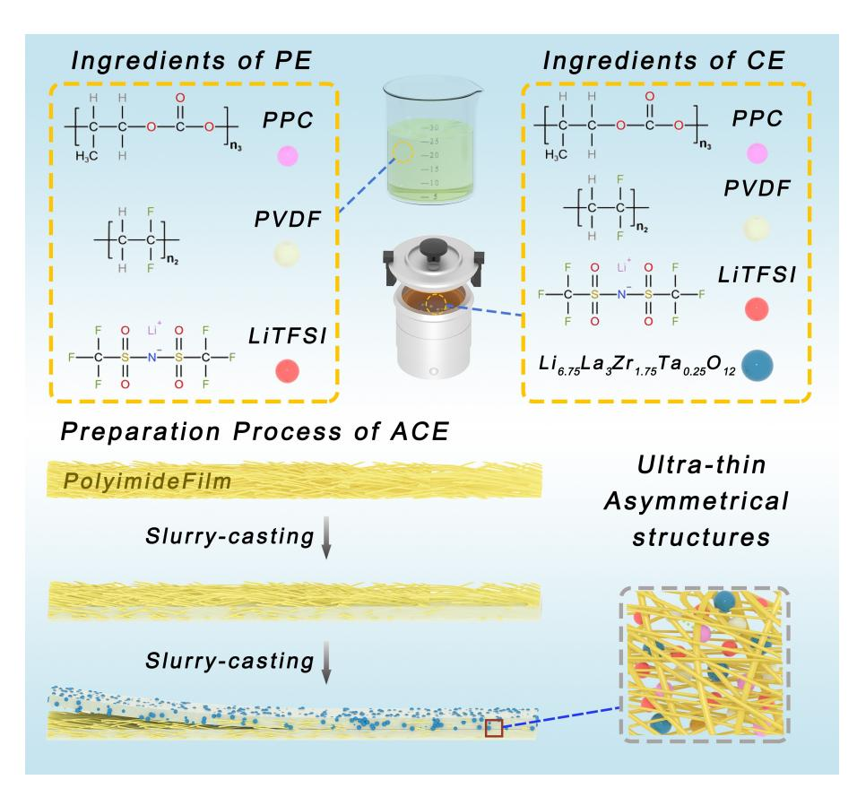
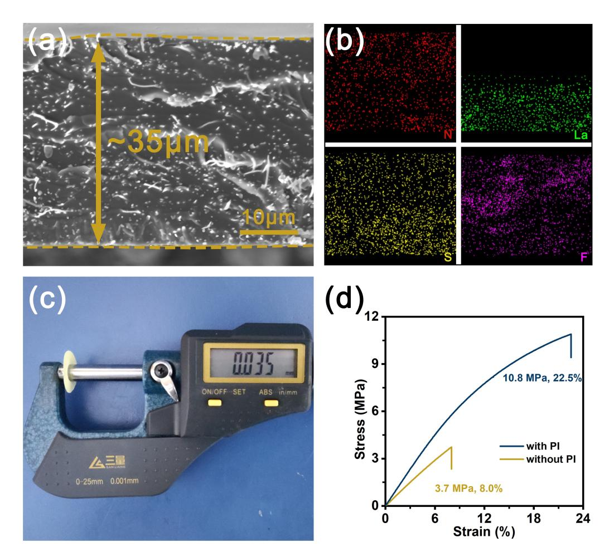
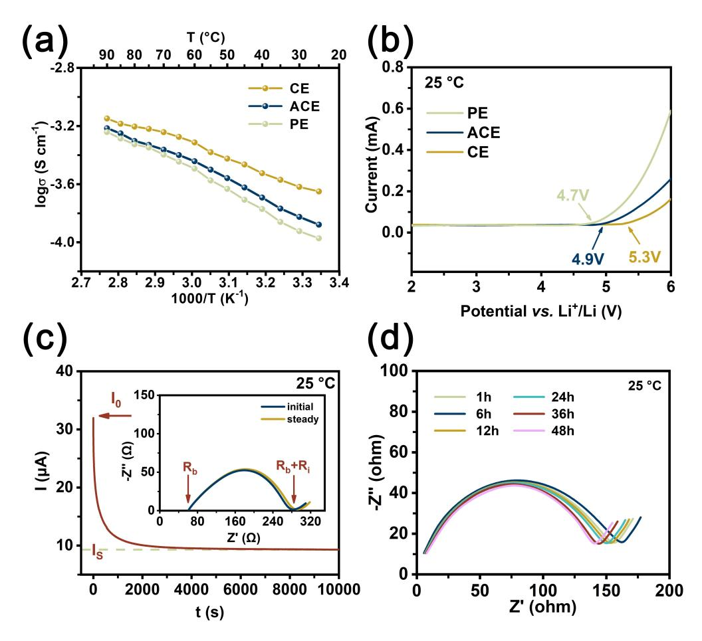
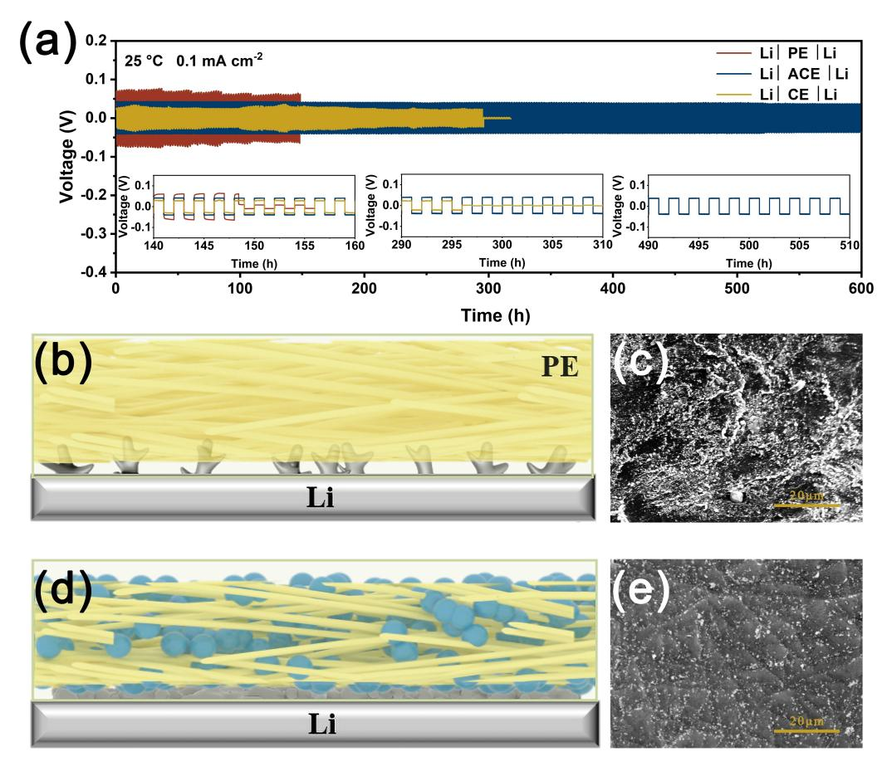
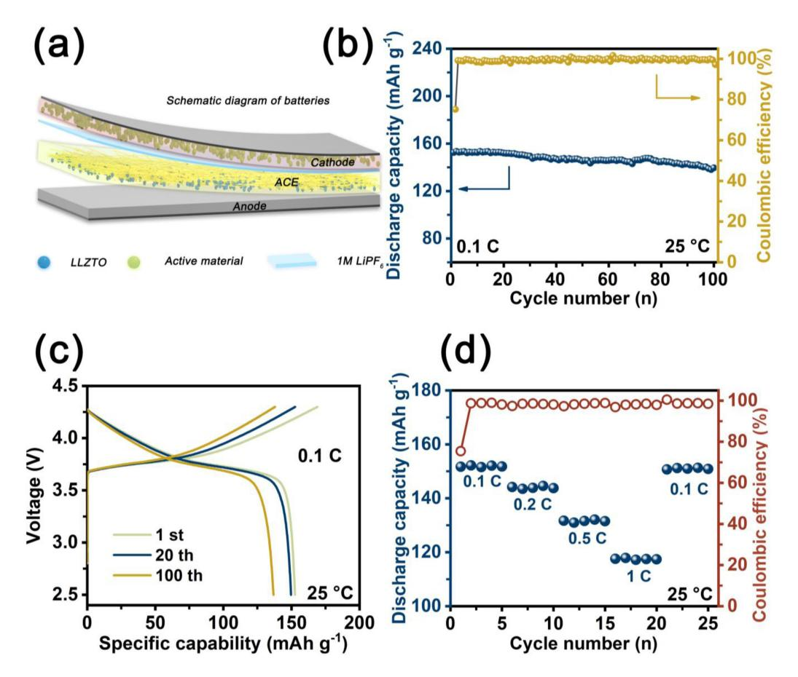
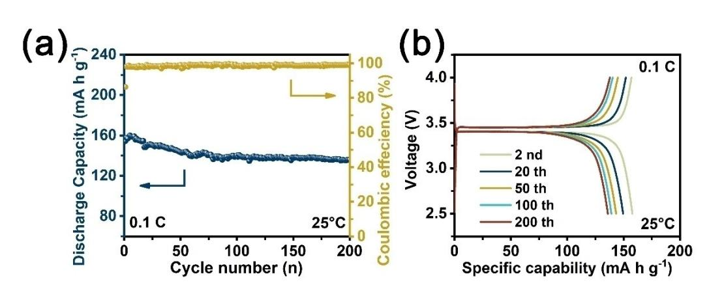

# **Ultra-Thin Asymmetric Composite Electrolyte Addresses the Out-of-Sync Requirements of Lithium Batteries Interfaces**

Yang Li,[a] Guoxu Wang,[a] and [Li-Zhen](http://orcid.org/0000-0003-2270-4458) Fan\*[a]

All-solid-state lithium batteries with solid-state electrolytes (SSEs) have gained worldwide attention due to their intrinsic safety and high energy density. However, there is no single electrolyte that can satisfy the out-of-sync requirements of both the anode and cathode interface. Herein, an ultrathin asymmetric composite electrolyte (ACE) is prepared by a simple slurrycasting method, in which a Li6.75La3Zr1.75Ta0.25O12 (LLZTO) enrichment layer with high modulus is used to match the lithium

## **Introduction**

All-solid-state batteries (ASSBs) have attracted growing attention due to the advantages of high energy density, high stability and safety.[1] Lithium metal with high theoretical specific capacity (3860 mAhg 1 ) and low electrochemical potential ( 3.04 V vs. SHE) is expected to be used as anode material in ASSBs.[2] However, if the solid-state electrolytes (SSEs) do not have sufficient mechanical strength to inhibit the uncontrolled growth of lithium dendrites during lithium deposition/exfoliation, it can lead to rapid cell failure or pose a safety risk.[3] For example, solid polymer electrolytes (SPEs) with low mechanical modulus usually cannot inhibit the growth of lithium dendrites. Inorganic ceramic electrolytes (ICEs) show high room temperature ionic conductivity, broad electrochemical windows and excellent mechanical properties, but poor interfacial solid-solid contact between electrolyte and electrodes, which causes large interfacial resistance and limited Li+ ions transport.[4] Thus, an ideal electrolyte should possess high mechanical modulus to prevent the growth of lithium dendrites and soft feature to maintain intimate contact with electrodes for fast ions transport.[5] The out-of-sync requirements for both anode and cathode interface properties are hardly satisfied by single-layer electrolytes simultaneously, which prevents the practical application of solid electrolytes in ASSBs.[6]

To meet those asynchronous demands, an asymmetric solid-state electrolyte (ASSE) with more than one layer of electrolyte is an effective strategy to solve those problems, in

[a] *Y. Li, G. Wang, Prof. Dr. L.-Z. Fan Beijing Advanced Innovation Center for Materials Genome Engineering, Institute of Advanced Materials and Technology University of Science and Technology Beijing Beijing 100083, China E-mail: fanlizhen@ustb.edu.cn* Supporting information for this article is available on the WWW under

<https://doi.org/10.1002/batt.202200212> *An invited contribution to a Special Collection dedicated to the 5-Year Anniversary of Batteries & Supercaps.*

anode and a polymer layer with high electrochemical stability is formed at the cathode. Meanwhile, a polyimide (PI) film is used as a scaffold to improve the mechanical properties of the electrolyte. As a result, the ACE with a thickness of 35 μm exhibits an ionic conductivity of 1.34×10 4 S cm 1 at room temperature. Furthermore, both the LiNi0.5Co0.2Mn0.3O2/ACE/Li and LiFePO4/ACE/Li full cells exhibit excellent electrochemical performances.

which the flexible layer improves the stability of the interface and the high modulus layer inhibits the growth of lithium dendrites.[7] By designing ASSE with an asymmetric structure, it is not only possible to meet the special requirements of the cathode and anode interfaces, but also to compensate for the shortcomings of a single electrolyte.[8] Meanwhile, the advantages of each electrolyte are fully exploited to achieve the superior electrochemical performance of ASSBs.[9] Zhao et al. designed an asymmetric polymer electrolyte, in which the polypropylene carbonate layer with sufficient viscosity and flexibility was used on the side of the cathode to reduce the interfacial resistance and a high mechanical strength polyethylene oxide layer modified with hexagonal boron nitride was used on the side of the anode to inhibit the growth of lithium dendrites.[10] Moreover, some ASSEs were proposed which usually include an inorganic layer for inhibiting the growth of lithium dendrites and a soft polymer for improving the stability of the interface with the cathode.[11] Sun et al. constructed an asymmetric solid electrolyte with ceramic enrichment layer and polymer layer to overcome the lithium dendrite growth at anode side, and large resistance and electrochemical stability at the cathode side simultaneously.[12] Inspired by these pioneering works and considering that interfacial stability and lithium dendrites have a significant impact on the cells, we believe that an asymmetric electrolyte with different hybrid organic/inorganic layers will not only inhibit the growth of lithium dendrites but also have important significance for improving the interface stability.[13] In addition, most of the asymmetric electrolytes prepared by the researchers are relatively thick, which ultimately affects the impedance and energy density of the battery.[14] Therefore, it is particularly important to prepare ultra-thin asymmetric composite electrolytes.

In this work, we have fabricated an ultra-thin asymmetric composite electrolyte (ACE) by a rational design to satisfy the specific requirements of the interface and electrolyte. The materials design strategy is described as follows: (i) polypropylene carbonate (PPC), an amorphous structure and a flexible

molecular chain with carbonyl oxygen in the main chain,[15] was added into the electrolyte to solve the poor film-forming ability of the polyvinylidene fluoride (PVDF). The obtained PVDF@PPC layer was prepared to boost the interfacial connection between cathode particles and ACE, which formed a three-dimensional cross-linked structure to enhance mechanical properties and improved lithium-ion transport capacity.[16] (ii) Li6.75La3Zr1.75Ta0.25O12 (LLZTO) powders were selected as inorganic fillers into the PVDF@PPC layer toward the anode side. The LLZTO@PVDF@PPC layer exhibits high mechanical strength that can effectively inhibit the growth of lithium dendrites during the charging/discharging process, in which the LLZTO can also promote the ionic conductivity of the layer.[17] (iii) The addition of the PI film substantially improves the mechanical properties and the thickness of the ACE.[18] As a result, the ACE exhibits good thermal and chemical stability, high ionic conductivity (1.34×10 4 S cm 1 ) and a wide electrochemical window (4.9 V). Li/ACE/Li can be stably cycled for 600 h at 0.1 mAcm 2 (0.1 mAhcm 2 ) with a low charge voltage polarization. In addition, both the LiNi0.5Co0.2Mn0.3O2/ACE/Li full cells and LiFePO4/ACE/Li full cells exhibit superior cycling stability and excellent electrochemical.

## **Results and Discussion**

The schematic of the preparation process of ACE is illustrated in Scheme 1. To meet the demand for interfacial solid-solid contact of the cathode, it is proposed to use a soft polymer electrolyte (PE) layer consisting of PPC, PVDF and LiTFSI. PPC is an aliphatic polyester synthesized from carbon dioxide and propylene oxide. And it has an amorphous structure and flexible molecular chains with carbonyl oxygen, which leads to the low glass transition temperature, high flexibility and high dielectric constant. Such properties allow it to effectively solve interfacial contact problems and improve the performance of solid-state electrolytes. On the anode side, a high mechanical strength composite electrolyte (CE) composed of LLZTO powders, PPC, PVDF, and LiTFSI is used to inhibit the growth of lithium dendrites. As to the polymer electrolytes, lithium dendrites form and spread rapidly during the charging and discharging, eventually penetrating the polymer electrolyte and causing a short circuit in the cell. The introduction of LLZTO powders into the dual-matrix electrolyte could inhibit the growth of lithium dendrites to some extent. In addition, the dual-matrix acted as a soft component to accommodate fluctuations in the interfacial volume as well as to ensure a tightly contacted interface and sufficient channels for Li+ transport. In addition, the porous PI film provides mechanical support for the ACE.

**Scheme 1.** Schematic of the fabrication process of ACE.

It is the zirconium-based LLZO electrolyte with the garnettype structure that has excellent electrochemical properties and stability to Lithium, so Li7 *x*La3Zr2 *x*Ta*x*O12 (*x*=0.25) was selected and prepared as an inorganic electrolyte filler in this work. The XRD pattern of LLZTO powders is shown in Figure S1(a). Compared with the standard card of LLZTO (JCPDF 80–0457), the XRD pattern of LLZTO powders matches it without observing any other impurity peaks, which indicates the relatively high purity of LLZTO. From Figure S1(b), it can be found that LLZTO solid electrolyte exhibits good ionic conductivity (1.12×10 4 S cm 1 ) at room temperature due to its special garnet-type structure. Figure S2a shows the microstructure and morphological characteristics of LLZTO powder, and it can be seen that LLZTO powders after ball milling exhibited a uniform particle size. Moreover, Figure S2(b) demonstrates the particle size distribution of LLZTO powder, which further proves that LLZTO powder mainly possesses a particle size of around 468 nm. To evaluate the ratio of LLZTO, PPC@PVDF, and LiTFSI in the CE membranes, we systematically investigated the effects of different contents of ceramics and polymers on the ionic conductivity of the ACE. By comparison, it can be found that CE with 50% LLZTO content exhibits the highest ionic conductivity of 2.24×10 4 S cm 1 at 25°C (as shown in Figure S3). The ionic conductivities of CE with different contents of LLZTO particles (from 0 to 80 wt%) firstly increase and then decrease with the increased content of LLZTO particles. The improved performance is attributed to the highly conductive interphase between LLZTO and polymer electrolyte. After exceeding 50 wt% of LLZTO, the conductivity begins to decrease owing to the LLZTO particles' agglomeration at high concentration, which reduces the volume fraction of interphase and destroys the percolated network of interphase. Therefore, considering the effect of ionic conductivity on battery performance, CE membranes prepared according to LLZTO:PPC@PVDF : LiTFSI mass ratio of 1:1 :1 were selected in this work.

From Figure S4(a and b), it is can be observed that the dimensionally controllable ACE has excellent flexibility. The cross-section SEM image of the ACE is presented in Figure 1(a), which indicates that the thickness of the composite electrolyte is approximately 35 μm (coinciding with the thickness measured via the vernier caliper in Figure 1b) and demonstrates that the ACE has a sandwiched structure. The EDS images (Figure 1c) further reveal a sandwiched element distribution in which PI (with C N bonds) is the main source of nitrogen (N) elements, LLZTO provides lanthanum (La) elements, PVDF

**Figure 1.** a) The cross-section SEM image of ACE and b) the corresponding EDS element mappings of N, La, S and F; c) the digital camera image of ACE to indicate its thickness; d) stress-strain curves of the electrolyte with PI and the electrolyte without PI.

contains fluorine (F) elements, and sulfur (S) elements are present in LiTFSI. From Figure S5(a), it can be observed that the PE layer of ACE has a relatively dense and smooth surface, and Figure S5(b) demonstrates that the components of PE are uniformly distributed. The SEM image (Figure S6a) and EDS mapping images (Figure S6b) demonstrate the relatively homogeneous dispersion of the substance in the CE layer of the ACE. As depicted in Figure 1(d), the tensile strengths of ACE without PI film are 3.7 MPa. However, the mechanical performance of ACE containing PI film is significantly enhanced with a tensile strength of up to 10.8 MPa. The improved mechanical property of ACE can provide a high level of safety against short-circuiting during the charging/discharging process of lithium metal batteries. Moreover, digital photographs of the PP separator and ACE before and after storage at 150°C for 1 h have been exhibited in Figure S7, indicating that the commercial PP separator suffers a severe shape shrinkage, while ACE remains the same shape under condition. The result demonstrates that ACE can effectively eliminate the safety threat posed by internal short circuits and improve battery performance in high-temperature environments.

The ionic conductivity, electrochemical window and Li+ transference number of ACE were tested and the related results are shown in Figure 2. For comparison, the ionic conductivities of PE, CE and ACE were tested under the same conditions as displayed in Figure 2(a). CE exhibits good ionic conductivity (2.24×10 4 S cm 1 ) at room temperature due to the incorporation of LLZTO which can effectively promote the transport of lithium ions in the electrolyte. Compared to CE, it is evident that the ionic conductivity of the ACE containing the PI film (1.34×10 4 S cm 1 ) has decreased, but it is still higher than that of PE (1.07×10 4 S cm 1 ). It is not difficult to notice from Figure S8 that the introduction of the PI film has a small effect on the ionic conductivity of the ACE. Meanwhile, the electrochemical stability of the ACE was investigated by LSV. Figure 2(b) depicts the LSV curves of PE, CE and ACE. Compared with the electrochemical window of PE (4.7 V) and CE (5.3 V), the ACE is stable under 4.9 V, which demonstrates the high suitability of ACE for application in higher-voltage batteries. Furthermore, the lithium transference number (*t*Li+) acts as an important factor in assessing the mobility of lithium ions. As illustrated in Figure 2(c), ACE exhibits a significantly high *tLi* + of 0.43, which is similar to that of CE (*t*Li+ =0.40, Figure S9**)**. The higher value of *t*Li+, which is expected to reduce polarization and improve the rate performance of solid-state batteries, is related to the fact that the interaction between LLZTO and

**Figure 2.** a) Arrhenius plots of ion conductivity for ACE, PE, and CE; b) LSV curves of ACE, PE, and CE; c) current variation with time of a symmetrical Li/ACE/Li battery at 10 mVs 1 (the inset show EIS variation before and after polarization); d) impedance plots of Li/ACE/Li symmetric cell taken at different storage time at 25 °C.

*Batteries & Supercaps* **2022**, *5*, e202200212 (4 of 8) © 2022 Wiley-VCH GmbH

polymers can greatly restrict the movement of the anion.[17a] Moreover, the ACE was tested with the AC impedance method assembled in a symmetrical lithium battery to investigate the interfacial stability between the electrodes and the electrolyte. As seen in Figure 2(d), the interfacial resistance shows a few variations in the initial period and then it remains at a relatively constant value as time evolves, indicating that the ACE is well contacted with the lithium metal surface.

To demonstrate the stability of the ACE, symmetric lithium batteries assembled in a glove box were systematically tested. As illustrated in Figure 3(a), the battery with CE was shortcircuited only after 296 h of cycling at 0.1 mAcm 2 for the area capacity of 0.1 mAhcm 2 . In contrast with this, the battery with ACE can present stable cycling for over 600 h under the same conditions. Figure S10 shows the critical current density for testing Li/ACE/Li symmetric batteries in the current density range of 0.02 to 1.0 mAcm 2 . Initially, the lithium plating/ stripping overpotential of the battery with ACE gradually increased as the current density increased progressively. When the current density rises to 0.7 mAcm 2 , the Li/ACE/Li symmetric battery showed a rapid increase in overpotential during the charging process, which may lead to a short circuit in the battery, indicating that the critical value of current density has been reached. The lithium plating/stripping processes for symmetric battery were further investigated and the relevant results are presented in Figure 3(c–f). Before cycling, the surface of the lithium metal anode is smooth and dense (Figure S11). As shown in Figure 3(c and d), the PE containing PI can inhibit the growth of lithium dendrites to a certain extent during the cycling process, and the surface of the lithium metal anode suffers from the obvious appearance of dendrites and becomes rough. In sharp contrast, lithium dendrites rarely appear on the surface of the lithium metal anode after cycling due to the mechanical strength of the CE, which effectively inhibits the formation of lithium dendrites and regulates uniform lithium deposition. In addition, the basic properties of ACE and other representative ACEs are summarized in Table S1, which indicates that the ACE is a promising electrolyte.

To confirm the improvement of interfacial solid-solid contact by ACE, three full cells containing respectively PE, ACE, and CE were prepared and tested for their impedances as shown in Figure S12. It can be seen that the impedance of the full cell containing CE is extremely high. In contrast, the impedance of the full cell containing ACE is significantly lower. Thus, it can be inferred that the addition of PE allows for a more stable interfacial solid-solid contact of the electrolyte. To evaluate the applicability of ACE in high energy density battery, Al2O3@NCM/Li battery based on ACE was assembled in the

**Figure 3.** a) Galvanostatic cycling curves of the symmetric batteries with ACE and CE at current densities of 0.1 mAcm 2 for 0.1 mAhcm 2 ; Schematic illustrations of b) Li/PE/Li and d) Li/CE/Li after cycling, SEM images of the Li surface obtained from lithium symmetrical cells assembled with c) PE and e) CE after cycling at 0.1 mAcm 2 and 25°C, respectively.

*Batteries & Supercaps* **2022**, *5*, e202200212 (5 of 8) © 2022 Wiley-VCH GmbH

glove box to be tested and its electrochemical performance is illustrated in Figure 4. Figure 4(a) represents the schematic diagram of the battery with ACE. Compared to the previous report (displayed in Table S2), the amount of electrolyte added to ACE is very little. As shown in Figure 4(b and c), the Al2O3@NCM/Li battery with ACE had a high initial discharge capacity of 152.6 mAhg 1 and kept stable for 100 cycles which indicated high circulation stability of the ACE. The low initial coulombic efficiency of the Al2O3@NCM/Li battery with ACE can be explained as follows: in NCM/ACE/Li battery, NCM cathode will undergo irreversible structural changes resulting in loss of discharge capacity. Therefore, during the first cycle of charge and discharge, the discharge specific capacity is lower than the charge specific capacity. As a result, the coulombic efficiency is low in the first cycle. The charge/discharge curves of Al2O3@NCM/Li batteries with ACE at various rates ranging from 0.1 to 0.5 C were shown in Figure 4(d). The discharge capacity is progressively reduced as the rate increases. At room temperature, the Al2O3@NCM/Li cell with ACE provided an initial discharge capacity of 151.7 mAhg 1 at 0.1 C and it still had a high capacity of 117.6 mAhg 1 when the rate increased to 1 C. It is worth observing that as the rate returned to 0.1 C, the discharge capacity recovered to a similar level as before highrate cycling.

Figure 5(a and b) displays that the LiFePO4/Li battery with ACE had a high initial discharge capacity of 155.4 mAhg 1 and remained stable for 200 cycles, which was tested at a rate of 0.1 C and the room temperature. The rate performance of LFP/ Li batteries with ACE at various rates ranging from 0.1 to 1 C is shown in Figure S13. Retained discharging capacities of 157.8, 154.5, 146.5, 135.4 and 117.9 mAhg 1 are obtained at the rate of 0.1, 0.2, 0.3, 0.5 and 1 C, respectively, and once the rate back to 0.1 C, the capacity is near to 158.1 mAhg 1 . The excellent rate performance of batteries with ACE meant that fast ion transport kinetics can be achieved, particularly at high current rates, due to excellent interface compatibility.

#### **Conclusion**

In summary, we propose a rational strategy to construct an asymmetric electrolyte that has high safety and good electrochemical properties at room temperature by the method of pouring and forming. This unique structure contains a layer with high inorganic content, a PI film and a polymer layer to achieve a dendrite-free lithium anode and low interfacial resistance. At room temperature, the ACE exhibits good room temperature ionic conductivity of 1.34×10 4 S cm 1 , a wide

**Figure 4.** a) Schematic diagram of batteries; b) cycling stability and Coulombic efficiency under 0.1 C of Al2O3@NCM/ACE/Li solid-state battery at 25 °C; c) charge and discharge voltage profiles of ACE-based Al2O3@NCM/Li at different cycles with 0.1 C at 25°C; d) rate capability of Al2O3@NCM/ACE/Li solid-state batteries.

*Batteries & Supercaps* **2022**, *5*, e202200212 (6 of 8) © 2022 Wiley-VCH GmbH

**Figure 5.** a) Cycling stability and coulombic efficiency under 0.1 C of LFP/ACE/Li solid-state battery; b) charge and discharge voltage profiles of ACE-based LFP/Li at different cycles with 0.1 C at 25°C.

electrochemical stability window (4.9 V) and a high lithium-ion transfer number (0.43). The battery with ACE can present stable cycling for over 600 h at 0.1 mAcm 2 for the area capacity of 0.1 mAhcm 2 . In addition, batteries assembled by Al2O3@NCM/ ACE/Li and LFP/ACE/Li both exhibit good rate performance, outstanding cyclic stability, and high safety. All present results indicate that the ACE is suitable for application in safe, durable, high-voltage and high-energy density LIBs and it provides a new idea for the design of functionalized electrolytes.

#### **Experimental Section**

The Experimental Section is available in the Supporting information.

### *Acknowledgements*

*This work was supported by the National Natural Science Foundation of China (U21 A2080 & 51872027) and Beijing Natural Science Foundation (Z200011).*

## *Conflict of Interest*

The authors declare no conflict of interest.

## **Data Availability Statement**

The data that support the findings of this study are available from the corresponding author upon reasonable request.

**Keywords:** asymmetric structure **·** lithium battery **·** solid electrolyte

- [1] a) M. Tang, H. Li, E. Wang, C. Wang, *Chin. Chem. Lett.* **2018**, *29*, [232–244;](https://doi.org/10.1016/j.cclet.2017.09.005) b) X.-B. Cheng, C.-Z. Zhao, Y.-X. Yao, H. Liu, Q. Zhang, *[Chem](https://doi.org/10.1016/j.chempr.2018.12.002)* **2019**, *5*, [74–96.](https://doi.org/10.1016/j.chempr.2018.12.002)
- [2] a) P. Albertus, S. Babinec, S. Litzelman, A. Newman, *Nat. Energy* **2017**, *3*, 16–21; b) S.-S. Chi, Y. Liu, W.-L. Song, L.-Z. Fan, Q. Zhang, *Adv. [Funct.](https://doi.org/10.1002/adfm.201700348) Mater.* **2017**, *27*, [1700348](https://doi.org/10.1002/adfm.201700348); c) Y. Zhang, T.-T. Zuo, J. Popovic, K. Lim, Y.-X. Yin, J. Maier, Y.-G. Guo, *Mater. Today* **2020**, *33*, [56–74;](https://doi.org/10.1016/j.mattod.2019.09.018) d) T. S. Wang, X. Liu, Y. Wang, L.-Z. Fan, *Adv. Funct. Mater.* **2020**, *31*, 2001973.
- [3] a) S.-S. Chi, Y. Liu, N. Zhao, X. Guo, C.-W. Nan, L.-Z. Fan, *Energy [Storage](https://doi.org/10.1016/j.ensm.2018.07.004) Mater.* **2019**, *17*, [309–316;](https://doi.org/10.1016/j.ensm.2018.07.004) b) S. Huang, H. Yang, J. Hu, Y. Liu, K. Wang, H. Peng, H. Zhang, L.-Z. Fan, *Small* **2019**, *15*, e1904216; c) C. Yang, K. Fu, Y. Zhang, E. Hitz, L. Hu, *Adv. Mater.* **2017**, *29*, [1701169;](https://doi.org/10.1002/adma.201701169) d) Q. Lu, Y. B. He, Q. Yu, B. Li, Y. V. Kaneti, Y. Yao, F. Kang, Q. H. Yang, *Adv. [Mater.](https://doi.org/10.1002/adma.201604460)* **2017**, *29*, [1604460.](https://doi.org/10.1002/adma.201604460)
- [4] a) H. Yuan, J. Liu, Y. Lu, C. Zhao, X. Cheng, H. Nan, Q. Liu, J. Huang, Q. Zhang, *Chem. Res. Chin. Univ.* **2020**, *36*, [377–385](https://doi.org/10.1007/s40242-020-0103-5); b) J.-S. Lee, K. Heo, H.- S. Kim, M.-Y. Kim, J. Kim, S.-W. Kang, J. Lim, *J. Alloys [Compd.](https://doi.org/10.1016/j.jallcom.2018.12.025)* **2019**, *781*, [553–559;](https://doi.org/10.1016/j.jallcom.2018.12.025) c) X. Zhu, T. Zhao, P. Tan, Z. Wei, M. Wu, *Nano [Energy](https://doi.org/10.1016/j.nanoen.2016.06.010)* **2016**, *26*, [565–576](https://doi.org/10.1016/j.nanoen.2016.06.010); d) P. Shi, J. Ma, Y. Huang, W. Fu, S. Li, S. Wang, D. Zhang, Y.-B. He, F. Kang, *J. Mater. Chem. A* **2021**, *9*, [14344–14351.](https://doi.org/10.1039/D1TA03059K)
- [5] a) H. Ling, L. Shen, Y. Huang, J. Ma, L. Chen, X. Hao, L. Zhao, F. Kang, Y. B. He, *ACS Appl. Mater. Interfaces* **2020**, *12*, [56995–57002](https://doi.org/10.1021/acsami.0c16390); b) W. Zhou, Z. Wang, Y. Pu, Y. Li, S. Xin, X. Li, J. Chen, J. B. Goodenough, *Adv. Mater.* **2019**, *31*, e1805574; c) J. Gai, F. Ma, Z. Zhang, D. Sun, Y. Jin, Y. Guo, W. Kim, *ACS Sustainable Chem. Eng.* **2019**, *7*, [15896–15903](https://doi.org/10.1021/acssuschemeng.9b01869).
- [6] a) Q. Ma, X. X. Zeng, J. Yue, Y. X. Yin, T. T. Zuo, J. Y. Liang, Q. Deng, X. W. Wu, Y. G. Guo, *Adv. Energy Mater.* **2019**, *9*; b) R. Sudo, Y. Nakata, K. Ishiguro, M. Matsui, A. Hirano, Y. Takeda, O. Yamamoto, N. Imanishi, *Solid State Ionics* **2014**, *262*, [151–154](https://doi.org/10.1016/j.ssi.2013.09.024); c) Y. Ren, Y. Shen, Y. Lin, C.-W. Nan, *[Electrochem.](https://doi.org/10.1016/j.elecom.2015.05.001) Commun.* **2015**, *57*, 27–30; d) J. Huang, J. Liu, J. He, M. Wu, S. Qi, H. Wang, F. Li, J. Ma, *Angew. Chem. Int. Ed.* **2021**, *60*, [20717–](https://doi.org/10.1002/anie.202107957) [20722.](https://doi.org/10.1002/anie.202107957)
- [7] a) Y. Ruan, Y. Lu, Y. Li, C. Zheng, J. Su, J. Jin, T. Xiu, Z. Song, M. E. Badding, Z. Wen, *Adv. Funct. Mater.* **2020**, *31*; b) H. L. Guo, H. Sun, Z. L. Jiang, J. Y. Hu, C. S. Luo, M. Y. Gao, J. Y. Cheng, W. K. Shi, H. J. Zhou, S. G. Sun, *ACS Appl. Mater. Interfaces* **2019**, *11*, [46783–46791](https://doi.org/10.1021/acsami.9b16312); c) Y. Lu, X. Zhang, C. Xue, C. Xin, M. Li, C.-w. Nan, Y. Shen, *Mater. Today* **2020**, *18*, 100522.
- [8] a) M. Jia, Z. Bi, C. Shi, N. Zhao, X. Guo, *ACS Appl. Mater. [Interfaces](https://doi.org/10.1021/acsami.0c14211)* **2020**, *12*, [46231–46238;](https://doi.org/10.1021/acsami.0c14211) b) W. Zhou, Y. Zhu, N. Grundish, X. Sen, S. Wang, Y. You, N. Wu, J. Gao, Z. Cui, Y. Li, J. B. Goodenough, *Nano [Energy](https://doi.org/10.1016/j.nanoen.2018.09.004)* **2018**, *53*, [926–931;](https://doi.org/10.1016/j.nanoen.2018.09.004) c) Q. Wang, H. Wang, Y. Liu, K. Wu, W. Liu, H. Zhou, *[Chem.](https://doi.org/10.1039/D0CC03032E) Commun.* **2020**, *56*, [7195–7198.](https://doi.org/10.1039/D0CC03032E)
- [9] a) H. Duan, Y. X. Yin, Y. Shi, P. F. Wang, X. D. Zhang, C. P. Yang, J. L. Shi, R. Wen, Y. G. Guo, L. J. Wan, *J. Am. [Chem.](https://doi.org/10.1021/jacs.7b10864) Soc.* **2018**, *140*, 82–85; b) H. Duan, M. Fan, W. P. Chen, J. Y. Li, P. F. Wang, W. P. Wang, J. L. Shi, Y. X. Yin, L. J. Wan, Y. G. Guo, *Adv. Mater.* **2019**, *31*, e1807789; c) F. Li, J. Liu, J. He, Y. Hou, H. Wang, D. Wu, J. Huang, J. Ma, *Angew. Chem. Int. Ed.* **2022**, e202205091.
- [10] B. Zhao, L. Ma, K. Wu, M. Cao, M. Xu, X. Zhang, W. Liu, J. Chen, *[Chin.](https://doi.org/10.1016/j.cclet.2020.10.045) Chem. Lett.* **2021**, *32*, [125–131.](https://doi.org/10.1016/j.cclet.2020.10.045)
- [11] a) J. Y. Liang, X. X. Zeng, X. D. Zhang, T. T. Zuo, M. Yan, Y. X. Yin, J. L. Shi, X. W. Wu, Y. G. Guo, L. J. Wan, *J. Am. [Chem.](https://doi.org/10.1021/jacs.9b03517) Soc.* **2019**, *141*, 9165–

[9169;](https://doi.org/10.1021/jacs.9b03517) b) X. Yu, J. Li, A. Manthiram, *ACS [Materials](https://doi.org/10.1021/acsmaterialslett.9b00535) Lett.* **2020**, *2*, 317–324; c) K. Yang, L. Chen, J. Ma, C. Lai, Y. Huang, J. Mi, J. Biao, D. Zhang, P. Shi, H. Xia, G. Zhong, F. Kang, Y. B. He, *[Angew.](https://doi.org/10.1002/anie.202110917) Chem. Int. Ed.* **2021**, *60*, [24668–24675.](https://doi.org/10.1002/anie.202110917)

- [12] J. Sun, C. He, X. Yao, A. Song, Y. Li, Q. Zhang, C. Hou, Q. Shi, H. Wang, *Adv. Funct. Mater.* **2021**, *31*, [2006381](https://doi.org/10.1002/adfm.202006381).
- [13] K. Fu, Y. Gong, G. T. Hitz, D. W. McOwen, Y. Li, S. Xu, Y. Wen, L. Zhang, C. Wang, G. Pastel, J. Dai, B. Liu, H. Xie, Y. Yao, E. D. Wachsman, L. Hu, *Energy Environ. Sci.* **2017**, *10*, [1568–1575.](https://doi.org/10.1039/C7EE01004D)
- [14] a) B. Li, Q. Su, L. Yu, S. Dong, M. Zhang, S. Ding, G. Du, B. Xu, *J. [Membr.](https://doi.org/10.1016/j.memsci.2020.118734) Sci.* **2021**, *618*, [118734;](https://doi.org/10.1016/j.memsci.2020.118734) b) J. Wan, J. Xie, X. Kong, Z. Liu, K. Liu, F. Shi, A. Pei, H. Chen, W. Chen, J. Chen, X. Zhang, L. Zong, J. Wang, L. Q. Chen, J. Qin, Y. Cui, *Nat. [Nanotechnol.](https://doi.org/10.1038/s41565-019-0465-3)* **2019**, *14*, 705–711.
- [15] a) Z. Zhang, J.-H. Lee, S.-H. Lee, S.-B. Heo, C. U. Pittman, *[Polymer](https://doi.org/10.1016/j.polymer.2008.04.034)* **2008**, *49*, [2947–2956;](https://doi.org/10.1016/j.polymer.2008.04.034) b) J. Zhang, J. Zhao, L. Yue, Q. Wang, J. Chai, Z. Liu, X. Zhou, H. Li, Y. Guo, G. Cui, L. Chen, *Adv. Energy Mater.* **2015**, *5*; c) X. Ma, P. R. Chang, J. Yu, N. Wang, *[Carbohydr.](https://doi.org/10.1016/j.carbpol.2007.05.033) Polym.* **2008**, *71*, 229–234.
- [16] X. Huang, S. Zeng, J. Liu, T. He, L. Sun, D. Xu, X. Yu, Y. Luo, W. Zhou, J. Wu, *J. Phys. Chem. C* **2015**, *119*, [27882–27891.](https://doi.org/10.1021/acs.jpcc.5b09130)
- [17] a) X. Zhang, T. Liu, S. Zhang, X. Huang, B. Xu, Y. Lin, B. Xu, L. Li, C.-W. Nan, Y. Shen, *J. Am. Chem. Soc.* **2017**, *139*, [13779–13785](https://doi.org/10.1021/jacs.7b06364); b) J. Zhang, N. Zhao, M. Zhang, Y. Li, P. K. Chu, X. Guo, Z. Di, X. Wang, H. Li, *[Nano](https://doi.org/10.1016/j.nanoen.2016.09.002) Energy* **2016**, *28*, [447–454.](https://doi.org/10.1016/j.nanoen.2016.09.002)
- [18] a) T. Wang, F. Sun, H. Wang, S. Yang, L. Fan, *[Polymer](https://doi.org/10.1016/j.polymer.2012.05.049)* **2012**, *53*, 3154– [3162](https://doi.org/10.1016/j.polymer.2012.05.049); b) M. Nagasaki, K. Kanamura, *ACS Appl. Energ. [Mater.](https://doi.org/10.1021/acsaem.9b00537)* **2019**, *2*, [3896–3903](https://doi.org/10.1021/acsaem.9b00537).

Manuscript received: May 10, 2022 Revised manuscript received: June 13, 2022 Accepted manuscript online: June 20, 2022 Version of record online: July 12, 2022