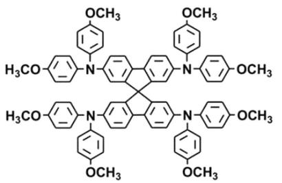
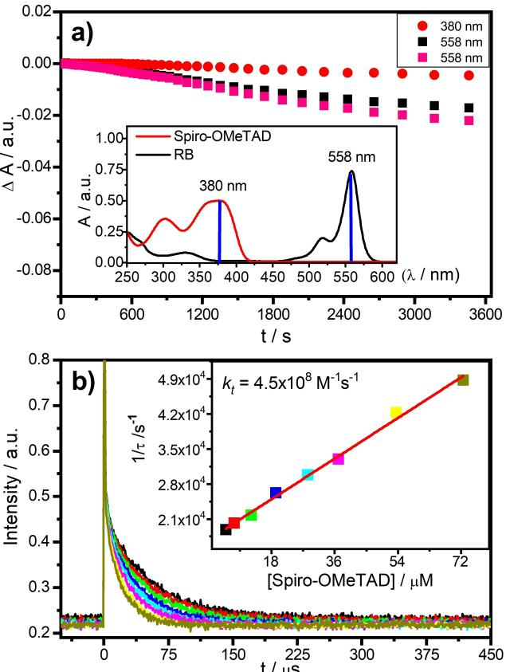
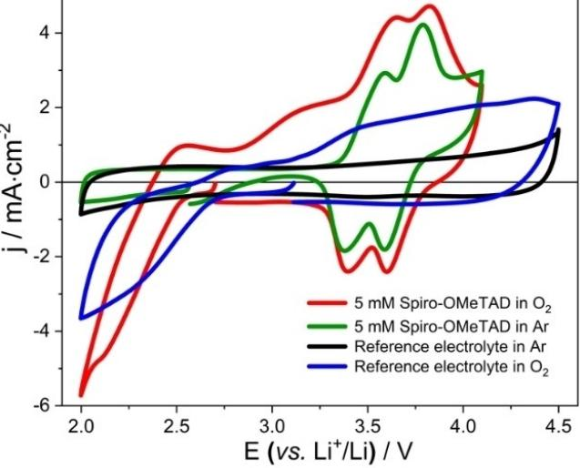
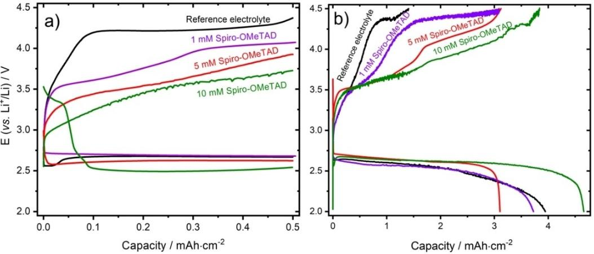
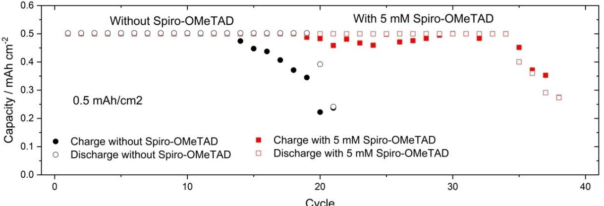
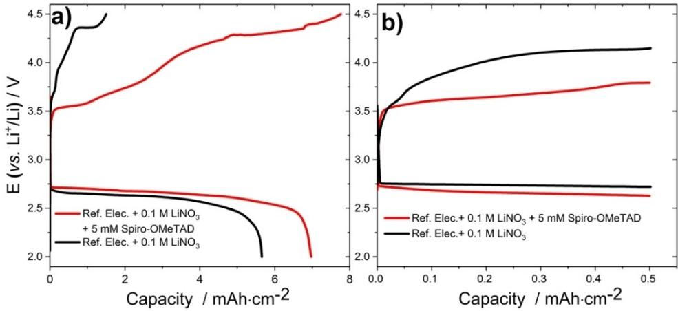
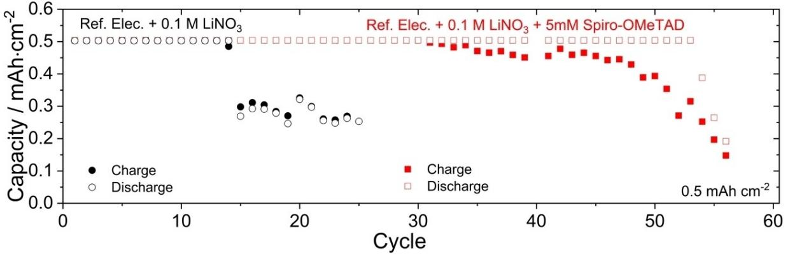

# *Spiro-***OMeTAD as Redox Mediator and Singlet Oxygen Scavenger in Lithium-Oxygen Batteries**

David I. [Possetto,](http://orcid.org/0000-0001-5307-9048)[a] [Walter](http://orcid.org/0000-0002-2311-8365) R. Torres,[b] Héctor Rueda,[a] [Fernando](http://orcid.org/0000-0003-3291-0829) Fungo,\*[a] and [Alvaro](http://orcid.org/0000-0001-9004-5947) Y. Tesio\*[b]

Lithium-oxygen batteries (LOBs) are considered one of the new alternatives to lithium-ion batteries mainly due to its high energy density. Several strategies are pursued in order to avoid parasitic reactions that fade the battery capacity. In this work, it was carried out a photochemical and electrochemical characterization of *Spiro*-OMeTAD working as a redox mediator (RM) in the LOBs. By using the Time Resolved Phosphorescence Detection (TRPD) technique together with Rose Bengal, we

# **Introduction**

The great growth of renewable energy sources, including solar and wind energy production, requires the parallel development of sustainable energy storage systems due to their intermittent production. Additionally, the automotive industry is moving year by year towards fully electric vehicles, displacing internal combustion engines that produce a large carbon footprint.[1] That is one of the main reasons why more efficient and lighter batteries are necessary. Even the lithium-ion battery, the most extensively used battery on the planet, is reaching its technological limit, and it is not enough to meet the increasingly demanding requirements from both industry and users. In this context, the lithium-oxygen battery (Li-O2), with its impressive theoretical energy density of 3505 Whkg 1 appears as one of the most promising technologies to face this problem.[2]

Although the Li-O2 battery has this great advantage in terms of capacity, it still suffers from many problems that must be solved, which come from the sluggish oxygen reduction/ evolution kinetics; the accumulation of Li2O2 (electrical insulator) on the cathode materials and the high charge overpotential that produces low Coulombic efficiency and critical parasitic reactions of solvents and cathodes. In order to avoid

| [a] Dr. D. I. Possetto, H. Rueda, Dr. F. Fungo                            |
|---------------------------------------------------------------------------|
| Instituto de Investigaciones en Tecnologías Energéticas y Materiales Avan |
| zados                                                                     |
| (UNRC-CONICET) Departamento de Química                                    |
| Universidad Nacional de Río Cuarto                                        |
| Agencia Postal 3, X5804BYA Río Cuarto, Argentina                          |
| E-mail: ffungo@exa.unrc.edu.ar                                            |
| [b] Dr. W. R. Torres, Dr. A. Y. Tesio                                     |
| Centro de Investigación y Desarrollo en Materiales Avanzados y Almace     |
| namiento de Energía de Jujuy (CIDMEJu)                                    |
| Centro de Desarrollo Tecnológico General Manuel Savio                     |
| Av. Martijena W/N, Y4612 Palpalá, Argentina                               |
| E-mail: atesio@cidmeju.unju.edu.ar                                        |
|                                                                           |

*Batteries & Supercaps* **2022**, *5*, e202200283 (1 of 8) © 2022 Wiley-VCH GmbH

demonstrate that RM can deactivate the singlet oxygen produced in the cell, decreasing its performance. A concentration of 5 mM *Spiro*-OMeTAD in the electrolyte avoids solubility problems, maximizes its catalytic effects during the charge, and is still enough to act as a singlet oxygen scavenger. Finally, lithium nitrate was added to the electrolyte to passivate the metallic lithium anode with the aim to prevent the RM decomposition and the increase of LOBs performance.

these issues in a comprehensive way, several soluble redox mediators were proposed, starting with Bruce and Aurbach's works, ten years ago.[3]

The physicochemical requirements for these redox mediators must be analyzed in light of the charge and discharge Li-O2 battery processes. Basically, the redox mediators in the charging process should help to reversibly oxidize the Li2O2 deposit on the electrode surface, while in the battery discharge, it should catalyze the O2 reduction and/or improve Li2O2 deposition processes.[3a,c,4] In the battery charging, the mediators' redox potential should be higher than the thermodynamic oxygen evolution reaction (OER) potential of the Li2O2 oxidation, but lower than ~4.0 V,[5] which is the usual electrochemical window of battery electrolytes.[6] Ideally, it should have the lowest possible potential, so as to avoid charge overpotential that imply extra energy and possible unwanted reactions.[7] On the other hand, in the Li-O2 battery discharging, the oxygen reduction reaction (ORR) is the main operative process producing, as a final product, lithium peroxide (Li2O2) that precipitates on the cathode surface. In the Li-O2 battery setting, the ORR is a complex electrochemical reaction that involves multiple steps and even today it is not fully understood the relation between the mediator molecular structure and its catalytic effect.[8] A good approach is to associate the knowledge of the classical ORR catalysis, thus materials derived from Pt (nanoparticles, complexes, etc.),[9] non-precious transition metals (e.g., Fe,[10] Co,[11] or Mn,[12]) and metal-free organic materials rich in heteroatoms, such as N, B, S, or P,[13] are good candidates as a redox mediator for the Li-O2 battery discharge catalysis. On the other hand, parasitic reactions occur during both charge and discharge battery processes mainly associated to the singlet oxygen (O2( 1 Δg)) formation, a very reactive species that can attack the battery components.[14] In the battery discharge, surface superoxide ion pair is generated, which can suffer disproportionation to produce singlet oxygen (O2( 1 Δg)).[14,15] Several authors have proved that the singlet

oxygen is one of the main reasons of parasitic reactions, which diminished the reversibility of Li-O2 battery.[16] Therefore, this deleterious process also imposes conditions that must be fulfilled: redox mediators must be chemically stable in the presence of the oxygen reactive species or able to quench their formation. In addition, other desired properties of the redox mediators are good solubility in the mili-molar order and fast diffusivity.[17]

Taking into account all the aforementioned aspects, 2,2',7,7'-tetrakis[N,N-di-4-methoxyphenylamino)-9,9'-Spirobifluorene (*Spiro*-OMeTAD, Figure 1) appears as a possible candidate to be used as a redox mediator in Li-O2 batteries. The bridging of two chromophores perpendicularly via a *sp3* hybridized atom into a spiro configuration allows the constitution of a kind of π-system that has that has several benefits. It allows to retain the chromophores' individual electronic properties (e.g., absorption and emission characteristics) and suppresses intermolecular interactions, diminishing the aggregate formation and increasing solubility regarding their single components.[18] Molecules with a spirobifluorene core and tailor-made optical and redox properties are widely used in organic optoelectronics.[18a,19] For example, *Spiro*-OMeTAD is one of the most efficient organic hole transporters known and it has been extensively studied in the fields of polymer based organic solar cells (OSCs),[20] solid-state dyesensitized solar cells (DSSC),[21] perovskite solar cells (PSCs),[22] and organic light-emitting diodes (OLED).[23]

It has been found that lithium bis(trifluoromethylsulfonyl) imide (Li-TFSI) salts increase 5–10 fold the hole mobility of *Spiro-*OMeTAD films.[21b,24] Although initially the Li-TFSI additive was considered an electrochemically inactive species, then Abate et al. showed that Li+ has an active redox role in the free holes formation in the *Spiro-*OMeTAD organic matrix, where Li+ is consumed in the presence of oxygen.[21b] The reason that leads the lithium salts to behave as an effective p-dopant in the presence of oxygen is the *spiro-*OMeTAD's low ionization potential (*E*0=0.63 V vs. NHE or 3.7 V vs. Li+/Li under the experimental conditions used in this work)[21c,22b] and the oxygen's high electron affinity. Allowing an electron transfer between both molecules, which leads to a weakly bound donor–acceptor complex [see Eq. (1).] However, in the presence of Li+ ions, lithium oxide complexes are irreversibly formed, displacing the equilibrium in the direction of the oxidized *Spiro-*OMeTAD by consuming O2, as it is shown in Equation (2):

$$
Spiro-OMeTAD + o2 \rightleftharpoons Spiro-OMeTAD^{*+} + o2++
$$
 (1)

$$
Spiro-OMeTAD^{*+} + o_2^{*+} + \text{Li}_{TFSI}
$$
  
\n
$$
\rightarrow (Spiro-OMeTAD^{*+}TFSI^{-}) + \text{Li}_xO_y
$$
 (2)

In summary, *Spiro-*OMeTAD has high solubility in organic solvents, it is chemically stable, it has low oxidation potential and the capacity to interact with molecular oxygen catalyzing lithium oxides formation. Thus, *Spiro-*OMeTAD shows several characteristics required for a Li-O2 battery redox mediator, which could influence both the ORR and OER reaction, catalyzing the Li2O2 formation and its decomposition. Moreover, it could also suppress parasitic reactions produced by the oxygen singlet.

Herein we report for the first time at the best of our knowledge, the utilization of the very well-known electroactive molecule *Spiro-*OMeTAD in a Li-O2 battery achieving improvements in terms of recharging and cyclability.

# **Results and Discussion**

#### **Photochemical assays**

The chemical degradation of *spiro*-OMeTAD induced by O2( 1 Δg), was studied by employing RB as photosensitizers for the efficient generation of O2( 1 Δg). When RB is irradiated with light of wavelength 515 nm in the presence of oxygen, an energy zone where *spiro*-OMeTAD does not absorb light (see inset in Figure 2a), RB efficiently produces O2( 1 Δg) with a quantum yield of 0.8.[25] After 60 min of irradiation, the *spiro*-OMeTAD and RB mixture spectra showed very small changes. This is better shown by plotting the light absorption changes against the irradiation time at 380 nm and 558 nm where only *Spiro*-OMeTAD and RB absorb light, respectively. Figure 2(a) shows negligible changes in light absorption (~0.01) after one hour of exposure to O2( 1 Δg), for both molecules. Even more important is to notice that *Spiro*-OMeTAD shows light absorption changes smaller than RB, which indicates that *Spiro-*OMeTAD has exceptionally high chemical stability in the presence of high reactive O2( 1 Δg) species.

On the other hand, the TRPD technique was used in ACN solution by means of RB an O2( 1 Δg) generator to investigate the *Spiro-*OMeTAD's O2( 1 Δg) quenching capability. Time-resolved decay of the O2( 1 Δg) phosphorescence at different concentrations of *Spiro-*OMeTAD was measured and the *overall rate constant* (*k*t=*k*r+*k*q) values were determined employing Stern– Volmer plots as shown in Figure 2(b). A lifetime of 70 μs was obtained for O2( 1 Δg) in the absence of the *Spiro-*OMeTAD and a *k*t value of 4.54×108 M 1 s 1 was obtained indicating a faster quenching for *Spiro-*OMeTAD. This value of *k*t indicates that *Spiro-*OMeTAD behaves as a strong deactivator of O2( 1 Δg). Assuming that there are no associated chemical reactions between *Spiro-*OMeTAD and O2( 1 Δg), as it was previously shown, we can despise the value of *kr* in the overall equation, which would allow affirming that the deactivation of O2( 1 Δg) **Figure 1.** Molecular structure of *Spiro-*OMeTAD.

**Figure 2.** a) difference absorbance at 380 and 558 nm measured at different times for the photodegradation of mixture of *Spiro-*OMeTAD (5×10 5 M) and RB (\*, &) and only RB photodegradation (&). Inset: Absorption spectrum of *Spiro-*OMeTAD 5×10 5 M (red line) and mixture of RB which *Spiro-*OMeTAD 5×10 5 M in ACN (black line). b) time-resolved decay of the O2( 1 Δg) phosphorescence at different concentrations of *Spiro-*OMeTAD. Inset: Stern– Volmer plots for the O2( 1 Δg) quenching by *Spiro-*OMeTAD in ACN.

only occurs by the physical route. This behavior is in accordance with *Spiro-*OMeTAD molecular structure, it is known that efficiently induced physical quenching of O2( 1 Δg) is favored in aromatic amines and electron-rich polycyclic aromatic hydrocarbon.[26] Therefore, *Spiro-*OMeTAD has O2( 1 Δg) scavenger capabilities, which is a desired property in a redox mediator of the lithium oxygen battery that could be extending its useful life, avoiding parallel reactions and cathode and solvent decomposition.

#### **Electrochemical characterization**

In order to know the electrochemical behavior of *Spiro-*OMeTAD in the battery cell, it was analysed 1 M LiTFSI in DEGDME solution without and with 5 mM *Spiro-*OMeTAD with cyclic voltammetry at a scan rate 0.02 Vs 1 . The corresponding cyclic voltammograms (CV) are shown in Figure 3. In the free *Spiro-*OMeTAD and Ar fulfilled cell no evidence of reduction/ oxidation peaks are observed at the potential windows used and even reaching 4.5 V.[27] On the contrary, the expected electrochemical behavior for *Spiro-*OMeTAD in argon is ob-

**Figure 3.** Cyclic voltammetries of reference electrolyte solution (1 M LiTFSI in DEGDME) in argon and reference electrolyte solution with 5 mM *Spiro-*OMeTAD in argon and in oxygen.

served, where two reversible redox waves centered at 3.5 and 3.7 V (vs. Li+/Li) corresponding to the di(cation radicals) formation are detected.[28] There is the third known oxidation process at 4.3 V (not shown in Figure 3) where *Spiro*-OMeTAD forms a less stable oxidized state that is not useful from the redox mediator role point of view since the formation potential is too high.[2b,3a,28] *Spiro*-OMeTAD diffusion coefficient value of 2.35×10 6 cm2 s 1 was measured by cyclic voltammetry, which is in the same range of other redox mediator.[29] After passing oxygen through the battery with *Spiro*-OMeTAD, the ORR takes place and its complementary oxidation peaks are observed. The potential peaks values and the cyclic voltammetry shape (see in Figure 3 the potential zone between 2.7 and 2.0 V) resemble what was previously reported by several authors in Li-O2 batteries under similar experimental conditions.[3a,25] Here, the formation of solid Li2O2 from O2 reduction proceeds by solution pathway mainly due to the influence of the solvent donor number on the solubility of the LiO2 intermediate; which seems to indicate the addition of 5 mM *Spiro*-OMeTAD does not affect the ORR process.

On the other hand, in the presence of oxygen molecules, the *Spiro*-OMeTAD voltammetric waves remain at the same potential values, but now a notable increase in the current peak values is observed regarding the argon atmosphere solution (see in Figure 3). The observed current increment of the voltametric wave in the presence of O2 is evidence that *Spiro*-OMeTAD cation radical can induce the chemical oxidations of the lithium peroxide (deposited on the electrode) and it manifests as a catalytic effect in the *Spiro*-OMeTAD's voltammetric behavior.

*Batteries & Supercaps* **2022**, *5*, e202200283 (3 of 8) © 2022 Wiley-VCH GmbH

#### **Battery test**

Solutions of *Spiro-*OMeTAD were tested as redox mediators for the charge of Li-O2 batteries in home-made prototype cells. Typical galvanostatic discharge and charge profiles are reported in Figure 4. Figure 4(a) shows the first full discharge/ charge cycles for different *Spiro-*OMeTAD concentrations using a cut-off potential of 2.0–4.5 V and an applied current of 0.1 mAcm 2 for both processes (without capacity limitation). Note that while capacity discharge values are between 3.1 and 4.6 mAhcm 2 , no correlation between these values and *Spiro*-OMeTAD concentrations could be found, which indicates that *Spiro-*OMeTAD does not evidently affect the ORR. Even more important is to notice that charge capacity increases from 1.4 mAhcm 2 in the battery without redox mediator, to 4 mAhcm 2 with the highest concentration of *Spiro-*OMeTAD (i. e., 10 mM). This capacity increment is also accompanied with a lowering of the charge potential which reaches a plateau at 3.5 V. This behavior confirms that *Spiro-*OMeTAD has the potential to affect the cell performance by decreasing the gap potential between charge and discharge processes. After it was first confirmation that *Spiro-*OMeTAD is an active redox couple on the battery operation, limited capacity cycles experiments were performed to reach a deeper characterization on the *Spiro-*OMeTAD behavior, and the obtained results are shown in Figure 4(b). Note that in the discharge/charge profiles shown in Figure 4(b), the discharge plateaus of *Spiro-*OMeTAD at 0 mM, 1 mM and 5 mM reached a similar potential around 2.6 V vs. Li+ /Li, while the 10 mM *Spiro-*OMeTAD solution showed a different behavior. At the highest concentration, initially the discharge process has a shoulder at 3.3 V and then reaches a lower plateau at 2.5 V. On the other hand, in the battery limited charge process, it is detected that the potential profiles at different *Spiro-*OMeTAD concentrations follow the same beneficial trend observed in the full charge test shown in Figure 4(a). In this case, an increase in the concentration of *Spiro-*OMeTAD produces lower charge potential values, modifying this from 4.4 V for 0 mM to 3.7 V for 10 mM (the potential value was measured at the end of the capacity cut-off). At this point, it is clear that the electrochemical activity of *Spiro*-OMeTAD acts as RM lowering the Li-O2 battery's charging voltage. It is possible to see how the increase of the *Spiro-*OMeTAD concentrations changes the charge efficiency, increasing from 35, 83, 100 and 82%, for 0, 1, 5 and 10 mM, respectively. As previously shown in Figure 4(b), the limited discharge profiles to 0.5 mAhcm 2 capacity show that solubility issues are probably present at 10 mM. For this reason, 5 mM was the concentration chosen to carry out the following experiments.

In order to prove that the use of S*piro-*OMeTAD can improve not only the charge potential, but also the cycling life, a series of discharge/charge cycles were carried out using 5 mM *Spiro-*OMeTAD in the battery's electrolyte. The results of these experiments are depicted in Figure 5, where it can be observed that the battery with 5 mM S*piro-*OMeTAD cycled 34 times before beginning to decay in both charge and discharge capacity. On the other hand, under the same conditions, the reference battery only performed 19 discharges up to the set capacity, but in cycle 14th its charge began to be incomplete, which is why the battery was later unable to perform the following discharges. This also demonstrates that the S*piro-*OMeTAD has an active role as redox mediator in the charge processes.

Since the *Spiro-*OMeTAD molecule could be undergoing decomposition reactions in contact with metallic lithium, LiNO3 was added to the electrolyte with the aim of passivating its surface, and thus extending the life of the *Spiro-*OMeTAD in solution.[32] Full discharge/charge and capacity limited to 0.5 mAhcm 2 showed in Figure 6(a and b), respectively, evidence small improvements in both discharge profiles and potential plateau values for batteries with LiNO3 (compared with the experiments of Figure 4). In addition, in comparison with Figure 4(a), it is observed that charge profiles are improved both in charge capacity and charge potential values when a combination of LiNO3 and *Spiro-*OMeTAD was used. On the other hand, the reference battery (without *Spiro*-OMeTAD)

**Figure 4.** Discharge/charge profiles of reference electrolyte solution (1 M LiTFSI in DEGDME) and reference electrolyte solution with different concentrations of *Spiro-*OMeTAD in oxygen at 0.1 mAcm 2 . a) Capacity limited to 0.5 mAhcm 2 , b) full discharge/charge.

Research Article doi.org/10.1002/batt.202200283

**Figure 5.** Comparison of cycling performance at capacity limited to 0.5 mAhcm 2 for batteries with a without *Spiro-*OMeTAD at a current density of 0.1 mAcm 2 .

**Figure 6.** Discharge/charge profiles of reference electrolyte solution (1 M LiTFSI in DEGDME)+0.1 M LiNO3 and reference electrolyte solution+5 mM *Spiro-*OMeTAD+0.1 M LiNO3 in oxygen. Current density: 0.1 mAcm 2 . a) Full discharge/charge with cut-off of 2.0 and 4.5 V. b) Discharge and charge capacity limited to 0.5 mAhcm 2 .

is not affected by LiNO3 showing both a similar low charge capacity ~1 mAhcm 2 (see Figures 4a and 6a).

Similarly, when discharge/charge cycles are performed, it can be seen that the battery with the reference electrolyte in the presence of 0.1 M of LiNO3 starts to decline at 14th cycle, which is similar to the previous case (without LiNO3) shown in Figure 5. In contrast, the battery with 5 mM *Spiro-*OMeTAD and 0.1 M LiNO3 improves achieving 54 cycles before its capacity values begins to drop, tripling the obtained previously cycling (see Figure 7).

In summary, *Spiro-*OMeTAD is an active redox mediator in the battery charge processes and its cation radical has the ability to regenerate through the Li2O2 oxidation at a lower OER potential, which impacts by increasing the battery cycling life.

# **Conclusion**

We have studied the effect of the use of *Spiro-*OMeTAD in a Li-O2 battery. CV experiments demonstrate that their electrochemical characteristics are adequate to act as redox mediator without affecting the rest of the reactions of interest in the battery and through photochemical techniques we demonstrate the *Spiro-*OMeTAD's robustness against reactive oxygen species.

According to the electrochemical galvanostatic charge/ discharge cycles studies, it is possible to affirm that the recharging potential of the battery is successfully decreased, which indicates that *Spiro-*OMeTAD is an active redox mediator in the charge processes.

This fact, added to the ability of *Spiro-*OMeTAD to neutralize singlet oxygen without affecting the ORR, makes it possible to increase the cycling of a lithium-oxygen battery. Through the use of different concentrations of *Spiro-*OMeTAD it was found that the concentration of 5 mM is optimal to maximize its effects, avoiding solubility problems. On the other hand, evidence found indicates that probably one of the main unwanted (and irreversible) reactions that *Spiro-*OMeTAD suffers in the cell is with the anode contact. We managed to reduce this process through the addition of a well-known

**Figure 7.** Comparison of cycling performance at capacity limited to 0.5 mAhcm 2 for batteries with and without *Spiro-*OMeTAD at a current density of 0.1 mAcm 2 and 0.1 M LiNO3.

lithium anode passivator, such as lithium nitrate. The improvement achieved was clear, increasing the cycling by more than 50% with the presence of the passivator, which triples the initial cycling value (without RM and without anode passivator). However, to exclude other possibilities that could drive to the battery performance degradation, the morphologies of insoluble discharge products and its evolution through the galvanostatic cycling still await detailed investigation. This could also shed light on the reaction mechanism of the catalytic process and contribute to a fuller understanding of the whole system.

Finally, we can say that a material widely-used as hole transport in others field, *Spiro-*OMeTAD in DEGDME electrolyte provides a new promising charge redox mediator and singlet oxygen scavenger to improve the cycling of lithium-oxygen batteries. Further fine-tuning of battery building is necessary to achieve a fully optimized battery cycling.

# **Experimental Section**

#### **Reagents**

Anhydrous diethylene glycol dimethyl ether (DEGDME) 99.9% (GELON), lithium bis(trifluoromethanesulfonyl)imide battery grade (LiTFSI), 99.99% trace metals basis (ALDRICH), Lithium Nitrate (GELON), were stored in the argon filled MBRAUN glove box with oxygen content lower than 0.1 ppm and water content below 1 ppm. DEGDME was dried for several days over 3 Å molecular sieves, (SIGMA–ALDRICH); Rose Bengal (RB) (Merk), *Spiro-*OMeTAD solutions were prepared by dissolving *Spiro-*OMeTAD (Sigma Aldrich) in DEGDME with the addition of 1 M LiTFSI (and 0.1 M LiNO3 depending on the experiment). All solutions were prepared inside the glove box and the water content was measured using the Karl Fischer 831 KF Coulometer (Metrohm). Solutions were found to contain initially around 50 ppm of water.

#### **Photochemical assays**

A homemade photoreactor equipped with four LEDs of 20 mW emitting at 515 nm, coupled to an Agilent HP 8453 UV–Visible diode-array spectrophotometer, was used to evaluate the chemical degradation of Spiro-OMeTAD by O2( 1 Δg). RB sensitizer has the ability to generate O2( 1 Δg) by absorbing visible light, in this region of the electromagnetic spectrum, *Spiro-*OMeTAD does not absorb radiation (see inset in Figure 2a). Thus, the photodegradation rate of *Spiro-*OMeTAD was determined on a typical stationary photolysis experiment following the absorbance change of *Spiro-*OMeTAD absorption at 380 nm, where RB does not absorb light. The exposure time to (O2( 1 Δg)) was 60 min, taking absorption spectra every 2 min. On the other hand, in order to investigate the *Spiro*-OMeTAD's quenching capability of O2( 1 Δg), the overall rate constant for deactivation of O2( 1 Δg) by *Spiro-*OMeTAD (*k*t=*k*r+*k*q, where *k*r and *k*q are chemical and physical quenching rate constants, respectively) was determined by using the TRPD technique in the experimental setup previously described.[25] Briefly, the O2( 1 Δg) phosphorescence at 1270 nm, generated by the excitation of RB with the 532-nm emission Nd:YAG laser (Spectron), was detected/ by means of an amplified Judson J16/8Sp germanium detector at 90°, after passing through the appropriate filters. The detector output was coupled to an Agilent Technologies DSO 6012 A digital oscilloscope and a personal computer for signal processing. In general, 3–5 shots were averaged so as to achieve a good signal/ noise ratio, where the decay curve was obtained from. Airequilibrated solutions were employed in all cases. In the dynamic determinations, solutions of RB (Abs532=0.25) in CH3CN were used to extend the lifetime of O2( 1 Δg).[30] From a first order fitting of the decay, the lifetime of O2( 1 Δg) was evaluated in the presence (τ) and absence (τ0) of *Spiro-*OMeTAD, and the data was plotted as a function of *Spiro-*OMeTAD concentration, according to a simple Stern-Volmer treatment: 1/τ=1/τ0+*kt* [*Spiro-*OMeTAD].[25b]

#### **Electrochemical test**

Cyclic voltammetry tests were carried out between 2.0 to 4.1 or 4.5 V at 0.02 Vs 1 . In order to determine the useful life of the battery, successive cycles at constant current with a fixed cut-off in potential or capacity were performed. During discharge, a negative current (reduction current) was applied until the potential of the cell between the electrodes reached 2.0 V, or until the capacity of the cell reached 0.5 mAhcm 2 . Then, the charge was carried out applying a positive current (oxidation current), until the potential of the cell reached 4.5 V, or until the capacity of the cell reached 0.5 mAhcm 2 . *Spiro-OMeTAD* diffusion coefficient was determined in a standard three electrochemical cell with a gold electrode and the DEGDME-LiTFSI electrolyte by cyclic voltammetry.[31] The potential scan rate was varied and one transferred electron in the first step reaction was used in the Randles–Sevcik equation.[31]

### **Li-O2 battery**

The electrochemical cell was a home-made Teflon body closed with standard high vacuum components and based on the Giessen battery.[28] The cell ensures a uniform and fixed pressure, simple cell assembly, easy gas flow around the electrodes during the addition of oxygen and enough volume oxygen.

The battery was assembled with an anode consisting of a Li metal foil (Gelon Energy Co., surface area of 0.8 cm2 and 0.45 mm thickness), 1 M LiTFSI (lithium bis-(trifluoromethanesulfonyl)-imide, 99.95%, Sigma-Aldrich) in DEGDME as electrolyte, a fiberglass separator (FilterLab MFV1, 260 μm thick) wetted with 0.1 mL of electrolyte and a sheet of carbon clothe with a deposit layer of mesoporous carbon (size 6×6 mm, thickness 0.41 mm, basic weight 180 g m 2 ) as a cathode. Stainless-steel mesh and disc were used as a current collector for the cathode and anode, respectively. All Li-O2 cells were assembled in an argon-filled glove box (MBraun Unilab Pro SP) with O2 and H2O levels *<*0.1 ppm and *<*1 ppm, respectively. All electrochemical measurements were made by means of a Bio-Logic multi-channel VMP3 potentiostat. Initially, the cells were analyzed in an Ar atmosphere and then, in O2. Oxygen was forced to pass through the cell for 60 s before starting electrochemical measurements. Tests were done at room temperature.

# *Acknowledgements*

*Financial support from Secretaría de Ciencia y Técnica, Universidad Nacional de Río Cuarto (SECyT-UNRC), Universidad Nacional de Jujuy, Consejo Nacional de Investigaciones Científicas y Técnicas (CONICET) and Agencia Nacional de Promoción Científica y Tecnológica (ANPCYT) of Argentina, W. R. T., F. F. and A. Y. T. are Scientific Members of CONICET. D. P. and H. R. thanks CONICET for a research fellowship.*

# *Conflict of Interest*

The authors declare no conflict of interest.

# **Data Availability Statement**

The data that support the findings of this study are available from the corresponding author upon reasonable request.

**Keywords:** lithium-oxygen batteries **·** organic redox mediators **·** singlet oxygen **·** *Spiro-*OMeTAD

- [1] D. Castelvecchi, *Nature* **2021**, *5967872*, [336–339](https://doi.org/10.1038/d41586-021-02222-1).
- [2] a) P. G. Bruce, S. A. Freunberger, L. J. Hardwick, J.-M. Tarascon, *[Nat.](https://doi.org/10.1038/nmat3191) [Mater.](https://doi.org/10.1038/nmat3191)* **2012**, *11*, 19–29; b) J. Christensen, P. Albertus, R. S. Sanchez-Carrera, T. Lohmann, B. Kozinsky, R. Liedtke, J. Ahmed, A. Kojic, *[J.](https://doi.org/10.1149/2.086202jes) [Electrochem.](https://doi.org/10.1149/2.086202jes) Soc.* **2011**, *159*, R1–R30; c) W.-J. Kwak, Rosy, D. Sharon, C. Xia, H. Kim, L. R. Johnson, P. G. Bruce, L. F. Nazar, Y.-K. Sun, A. A. Frimer, M. Noked, S. A. Freunberger, D. Aurbach, *[Chem.](https://doi.org/10.1021/acs.chemrev.9b00609) Rev.* **2020**, *120*, 6626– [6683.](https://doi.org/10.1021/acs.chemrev.9b00609)
- [3] a) W.-J. Kwak, H. Kim, H.-G. Jung, D. Aurbach, Y.-K. Sun, *J. [Electrochem.](https://doi.org/10.1149/2.0901810jes) Soc.* **2018**, *165*, [A2274–A2293](https://doi.org/10.1149/2.0901810jes); b) J.-B. Park, S. H. Lee, H.-G. Jung, D. Aurbach, Y.-K. Sun, *Adv. Mater.* **2018**, *30*, [1704162](https://doi.org/10.1002/adma.201704162); c) X. Shen, S. Zhang,

Y. Wu, Y. Chen, *[ChemSusChem](https://doi.org/10.1002/cssc.201802007)* **2019**, *12*, 104–114; d) H.-D. Lim, B. Lee, Y. Zheng, J. Hong, J. Kim, H. Gwon, Y. Ko, M. Lee, K. Cho, K. Kang, *Nat. Energy* **2016**, *1*, 16066.

- [4] W. Zhao, X. Mu, P. He, H. Zhou, *Batteries & [Supercaps](https://doi.org/10.1002/batt.201900045)* **2019**, *2*, 803–819.
- [5] M. Balaish, A. Kraytsberg, Y. Ein-Eli, *Phys. [Chem.](https://doi.org/10.1039/c3cp54165g) Chem. Phys.* **2014**, *16*, [2801–2822](https://doi.org/10.1039/c3cp54165g).
- [6] A. A. Franco, K.-H. Xue, *ECS J. Solid State Sci. [Technol.](https://doi.org/10.1149/2.012310jss)* **2013**, *2*, M3084– [M3100](https://doi.org/10.1149/2.012310jss).
- [7] Q. Zhang, Y. Zhou, W. Dai, X. Cui, Z. Lyu, Z. Hu, W. Chen, *[Batteries](https://doi.org/10.1002/batt.202000198) & [Supercaps](https://doi.org/10.1002/batt.202000198)* **2021**, *4*, 232–239.
- [8] Y. Ko, H. Park, B. Kim, J. S. Kim, K. Kang, *Trends Chem.* **2019**, *1*, [349–360.](https://doi.org/10.1016/j.trechm.2019.03.016) [9] A. Morozan, B. Jousselme, S. Palacin, *Energy [Environ.](https://doi.org/10.1039/c0ee00601g) Sci.* **2011**, *4*, 1238–
- [1254](https://doi.org/10.1039/c0ee00601g). [10] S. Pérez-Rodríguez, D. Sebastián, C. Alegre, T. Tsoncheva, N. Petrov, D. Paneva, M. J. Lázaro, *[Electrochim.](https://doi.org/10.1016/j.electacta.2021.138490) Acta* **2021**, *387*, 138490.
- [11] H. Park, S. Oh, S. Lee, S. Choi, M. Oh, *Appl. Catal. B* **2019**, *246*, [322–329.](https://doi.org/10.1016/j.apcatb.2019.01.083) [12] Q. Dong, H. Wang, S. Ji, X. Wang, Q. Liu, D. J. L. Brett, V. Linkov, R.
- Wang, *Adv. [Sustainable](https://doi.org/10.1002/adsu.201900085) Syst.* **2019**, *3*, 1900085. [13] a) J. Quílez-Bermejo, E. Morallón, D. Cazorla-Amorós, *[Carbon](https://doi.org/10.1016/j.carbon.2020.04.068)* **2020**, *165*, [434–454;](https://doi.org/10.1016/j.carbon.2020.04.068) b) C. Hu, L. Dai, *Angew. Chem. Int. Ed.* **2016**, *55*, [11736–11758;](https://doi.org/10.1002/anie.201509982) *Angew. Chem.* **2016**, *128*, [11910–11933;](https://doi.org/10.1002/ange.201509982) c) L. Yang, J. Shui, L. Du, Y. Shao, J. Liu, L. Dai, Z. Hu, *Adv. Mater.* **2019**, *31*, [1804799](https://doi.org/10.1002/adma.201804799).
- [14] a) N. Mahne, B. Schafzahl, C. Leypold, M. Leypold, S. Grumm, A. Leitgeb, G. A. Strohmeier, M. Wilkening, O. Fontaine, D. Kramer, C. Slugovc, S. M. Borisov, S. A. Freunberger, *Nat. Energy* **2017**, *2*, 17036; b) Y. Wang, Y.-C. Lu, *Energy Storage Mater.* **2020**, *28*, [235–246;](https://doi.org/10.1016/j.ensm.2020.03.007) c) R. Cao, E. D. Walter, W. Xu, E. N. Nasybulin, P. Bhattacharya, M. E. Bowden, M. H. Engelhard, J.- G. Zhang, *[ChemSusChem](https://doi.org/10.1002/cssc.201402315)* **2014**, *7*, 2436–2440; d) F. Li, J. Chen, *[Adv.](https://doi.org/10.1002/aenm.201602934) Energy Mater.* **2017**, *7*, [1602934.](https://doi.org/10.1002/aenm.201602934)
- [15] M. Hong, H. R. Byon, *Batteries & [Supercaps](https://doi.org/10.1002/batt.202000210)* **2021**, *4*, 286–293.
- [16] a) D. Córdoba, H. B. Rodríguez, E. J. Calvo, *ChemSelect* **2019**, *4*, 12304– 12307; b) J. Hassoun, F. Croce, M. Armand, B. Scrosati, *[Angew.](https://doi.org/10.1002/anie.201006264) Chem. Int. Ed.* **2011**, *50*, [2999–3002](https://doi.org/10.1002/anie.201006264); *Angew. Chem.* **2011**, *123*, [3055–3058](https://doi.org/10.1002/ange.201006264); c) N. Mahne, O. Fontaine, M. O. Thotiyl, M. Wilkening, S. A. Freunberger, *Chem. Sci.* **2017**, *8*, [6716–6729.](https://doi.org/10.1039/C7SC02519J)
- [17] S. Matsuda, K. Hashimoto, S. Nakanishi, *J. Phys. [Chem.](https://doi.org/10.1021/jp504894e) C* **2014**, *118*, [18397–18400](https://doi.org/10.1021/jp504894e).
- [18] a) T. P. I. Saragi, T. Spehr, A. Siebert, T. Fuhrmann-Lieker, J. Salbeck, *Chem. Rev.* **2007**, *107*, [1011–1065](https://doi.org/10.1021/cr0501341); b) F. M. Rombach, S. A. Haque, T. J. Macdonald, *Energy Environ. Sci.* **2021**, *14*, [5161–5190](https://doi.org/10.1039/D1EE02095A); c) Z. Hawash, L. K. Ono, Y. Qi, *Adv. Mater. [Interfaces](https://doi.org/10.1002/admi.201700623)* **2018**, *5*, 1700623.
- [19] a) F. Fungo, K.-T. Wong, S.-Y. Ku, Y.-Y. Hung, A. J. Bard, *J. Phys. [Chem.](https://doi.org/10.1021/jp045548x) B* **2005**, *109*, [3984–3989;](https://doi.org/10.1021/jp045548x) b) J. Natera, L. Otero, F. D'Eramo, L. Sereno, F. Fungo, N.-S. Wang, Y.-M. Tsai, K.-T. Wong, *[Macromolecules](https://doi.org/10.1021/ma801865y)* **2009**, *42*, [626–635;](https://doi.org/10.1021/ma801865y) c) P. Zabel, T. Dittrich, Y.-L. Liao, C.-Y. Lin, K.-T. Wong, F. Fungo, L. Fernandez, L. Otero, *Organic Electron.* **2009**, *10*, [1307–1313;](https://doi.org/10.1016/j.orgel.2009.07.007) d) D. Heredia, L. Fernandez, L. Otero, M. Ichikawa, C.-Y. Lin, Y.-L. Liao, S.- A. Wang, K.-T. Wong, F. Fungo, *J. Phys. Chem. C* **2011**, *115*, [21907–](https://doi.org/10.1021/jp205053b) [21914](https://doi.org/10.1021/jp205053b); e) S. Orlandi, G. Pozzi, M. Cavazzini, D. Minudri, M. Gervaldo, L. Otero, F. Fungo, *[Macromolecules](https://doi.org/10.1021/acs.macromol.5b00845)* **2015**, *48*, 4364–4372; f) D. Minudri, S. Orlandi, M. Cavazzini, S. Rossi, G. Marzari, P. Cavallo, L. Fernandez, F. Fungo, G. Pozzi, *Eur. J. Org. Chem.* **2021**, *2021*, 671–682; g) G. Grancini, D. Viola, Y. Lee, M. Saliba, S. Paek, K. T. Cho, S. Orlandi, M. Cavazzini, F. Fungo, M. I. Hossain, A. Belaidi, N. Tabet, G. Pozzi, G. Cerullo, M. K. Nazeeruddin, *[ChemPhysChem](https://doi.org/10.1002/cphc.201700492)* **2017**, *18*, 2381–2389.
- [20] X. Liu, Y. Zhang, J. Wu, Y. Ma, K. K. T. Lau, J. Fang, C.-Q. Ma, Y. Lin, *[J.](https://doi.org/10.1021/acs.joc.1c02848) Organic Chem.* **2022**, *87*, [5057–5064](https://doi.org/10.1021/acs.joc.1c02848).
- [21] a) C.-Y. Hsu, Y.-C. Chen, R. Y.-Y. Lin, K.-C. Ho, J. T. Lin, *Phys. [Chem.](https://doi.org/10.1039/c2cp41326d) Chem. Phys.* **2012**, *14*, [14099–14109;](https://doi.org/10.1039/c2cp41326d) b) A. Abate, T. Leijtens, S. Pathak, J. Teuscher, R. Avolio, M. E. Errico, J. Kirkpatrik, J. M. Ball, P. Docampo, I. McPherson, H. J. Snaith, *Phys. Chem. Chem. Phys.* **2013**, *15*, [2572–2579;](https://doi.org/10.1039/c2cp44397j) c) W. H. Nguyen, C. D. Bailie, E. L. Unger, M. D. McGehee, *J. Am. [Chem.](https://doi.org/10.1021/ja504539w) Soc.* **2014**, *136*, [10996–11001.](https://doi.org/10.1021/ja504539w)
- [22] a) G. Tumen-Ulzii, T. Matsushima, C. Adachi, *[Energy](https://doi.org/10.1021/acs.energyfuels.1c02190) Fuels* **2021**, *35*, [18915–18927](https://doi.org/10.1021/acs.energyfuels.1c02190); b) Z. Hawash, L. K. Ono, Y. Qi, *Adv. Mater. [Interfaces](https://doi.org/10.1002/admi.201600117)* **2016**, *3*, [1600117](https://doi.org/10.1002/admi.201600117); c) M. Saliba, S. Orlandi, T. Matsui, S. Aghazada, M. Cavazzini, J.-P. Correa-Baena, P. Gao, R. Scopelliti, E. Mosconi, K.-H. Dahmen, F. De Angelis, A. Abate, A. Hagfeldt, G. Pozzi, M. Graetzel, M. K. Nazeeruddin, *Nat. Energy* **2016**, *1*, 15017.
- [23] W. Zhang, Q. Zhang, Y. Zhang, F. Li, C. Chang, H. Sun, M. Yang, S. Yanto, Z. Zhang, L. Yang, *IEEE Trans. Electron Devices* **2019**, *66*, 4901–4906.
- [24] H. J. Snaith, M. Grätzel, *Appl. Phys. Lett.* **2006**, *89*, [262114.](https://doi.org/10.1063/1.2424552)
- [25] a) S. Criado, D. Mártire, P. Allegretti, J. Furlong, S. G. Bertolotti, E. L. Falce, N. A. García, *[Photochem.](https://doi.org/10.1039/B203359C) Photobiol. Sci.* **2002**, *1*, 788–792; b) D.

*Batteries & Supercaps* **2022**, *5*, e202200283 (7 of 8) © 2022 Wiley-VCH GmbH

Possetto, A. Reynoso, J. Natera, W. A. Massad, *J. [Photochem.](https://doi.org/10.1016/j.jphotochem.2021.113416) Photobiol. A* **2021**, *418*, [113416.](https://doi.org/10.1016/j.jphotochem.2021.113416)

- [26] C. Schweitzer, R. Schmidt, *Chem. Rev.* **2003**, *103*, [1685–1758.](https://doi.org/10.1021/cr010371d)
- [27] C. L. Bender, P. Hartmann, M. Vračar, P. Adelhelm, J. Janek, *Adv. [Energy](https://doi.org/10.1002/aenm.201301863) Mater.* **2014**, *4*, [1301863.](https://doi.org/10.1002/aenm.201301863)
- [28] C. O. Laoire, S. Mukerjee, K. M. Abraham, E. J. Plichta, M. A. Hendrickson, *J. Phys. Chem. C* **2010**, *114*, [9178–9186.](https://doi.org/10.1021/jp102019y)
- [29] D. Kundu, R. Black, B. Adams, L. F. Nazar, *ACS Cent. Sci.* **[2015](https://doi.org/10.1021/acscentsci.5b00267)**, *1*, 510– [515](https://doi.org/10.1021/acscentsci.5b00267).
- [30] F. Amat-Guerri, M. M. C. López-González, R. Martínez-Utrilla, R. Sastre, *[J.](https://doi.org/10.1016/1010-6030(90)87124-T) [Photochem.](https://doi.org/10.1016/1010-6030(90)87124-T) Photobiol. A* **1990**, *53*, 199–210.
- [31] W. Zhang, L. Wang, Y. Guo, B. Zhang, V. Leandri, B. Xu, Z. Li, J. M. Gardner, L. Sun, L. Kloo, *Chem. Commun.* **2020**, *56*, [1589–1592.](https://doi.org/10.1039/C9CC09270F)
- [32] D. Sharon, D. Hirsberg, M. Afri, F. Chesneau, R. Lavi, A. A. Frimer, Y.-K. Sun, D. Aurbach, *ACS Appl. Mater. Interfaces* **2015**, *7*, [16590–16600.](https://doi.org/10.1021/acsami.5b04145)

Manuscript received: June 23, 2022 Revised manuscript received: September 28, 2022 Accepted manuscript online: September 28, 2022 Version of record online: October 27, 2022