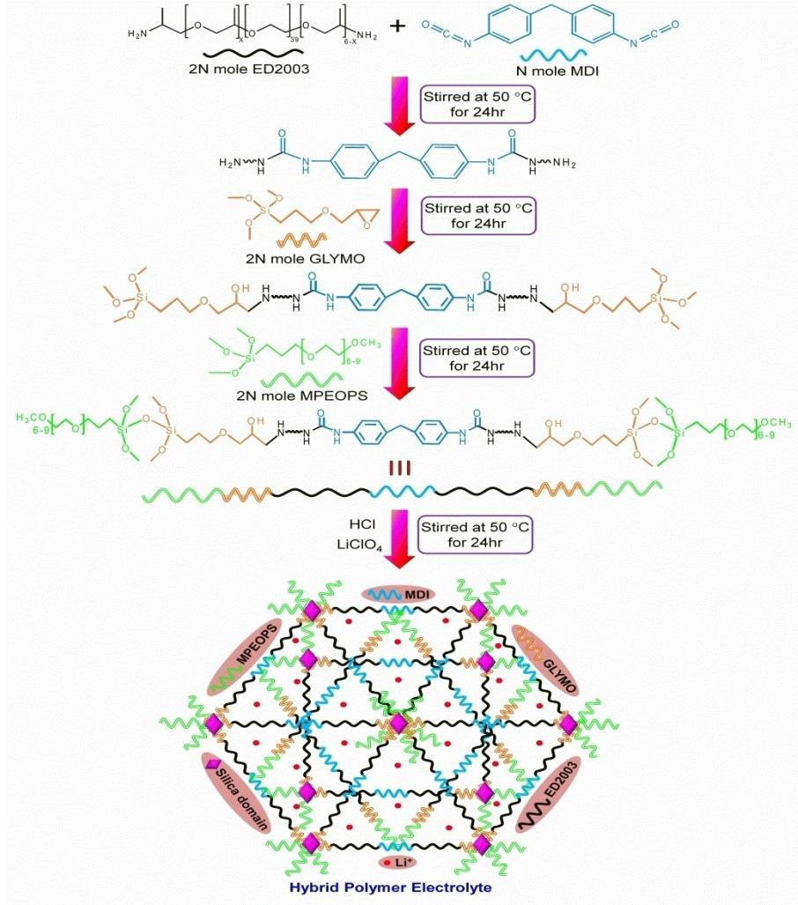
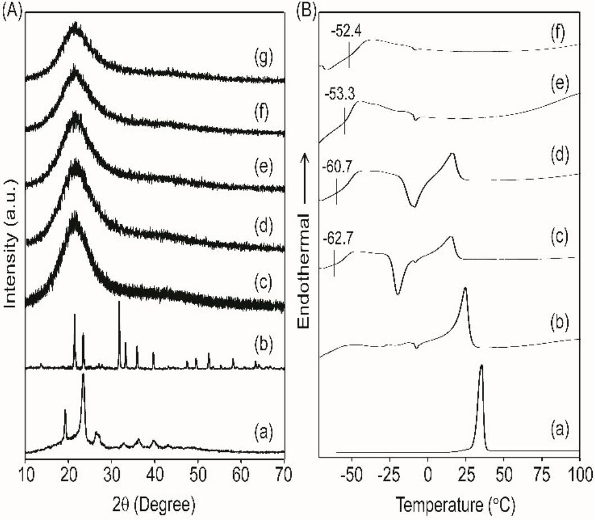
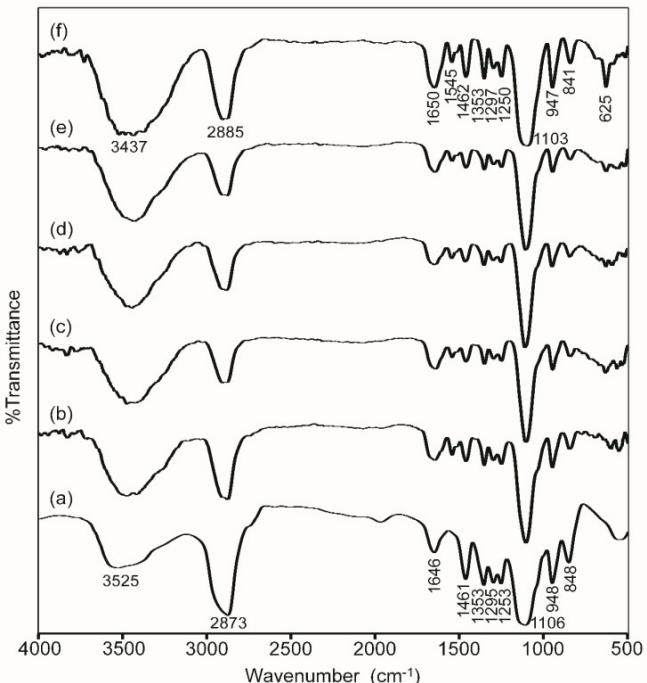
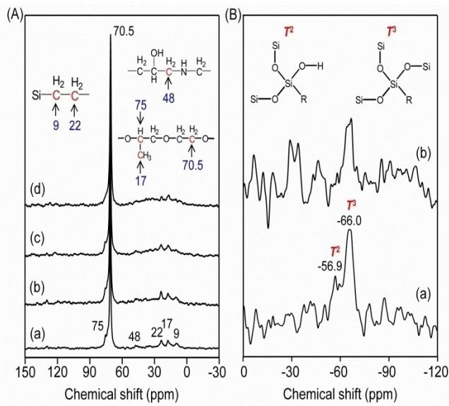
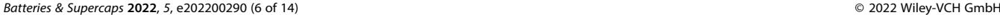
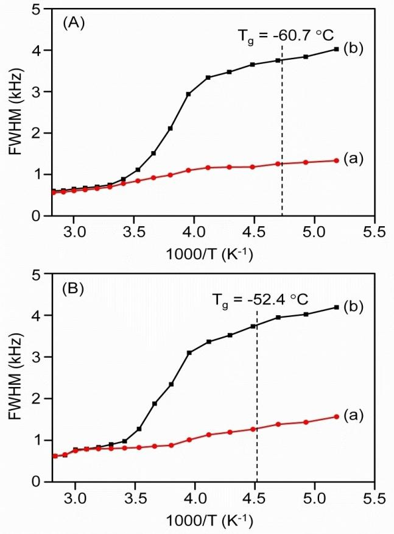
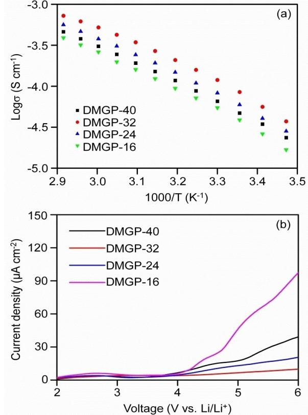
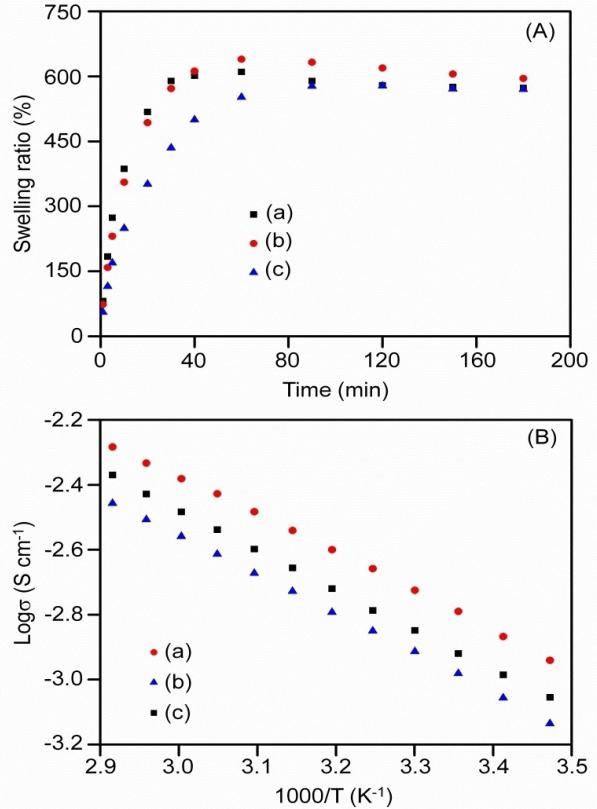
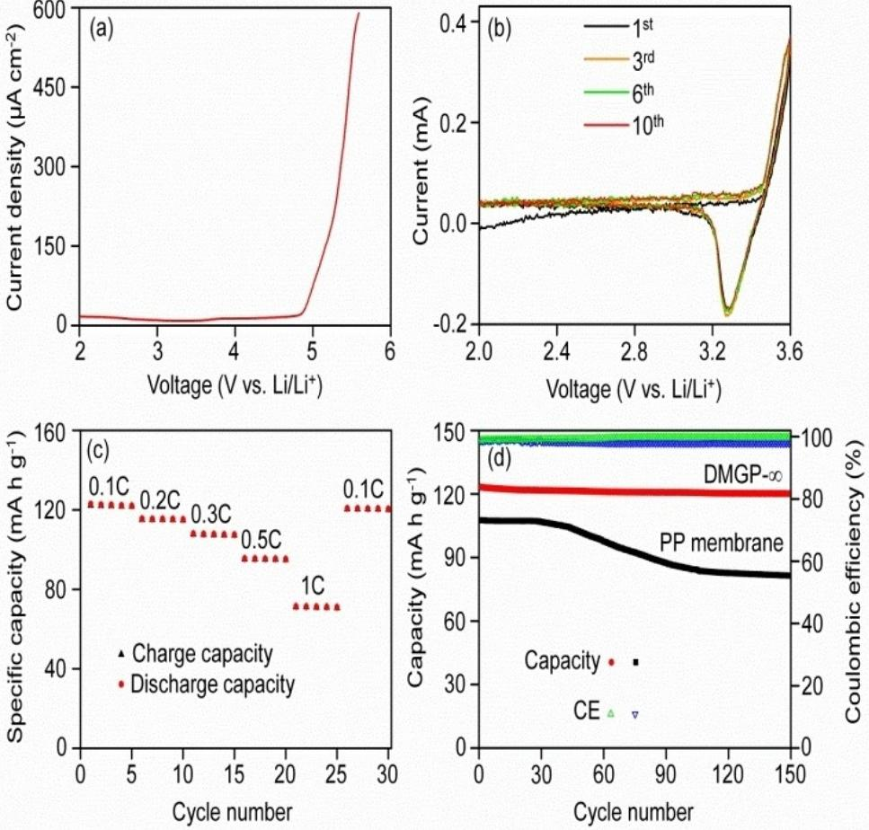
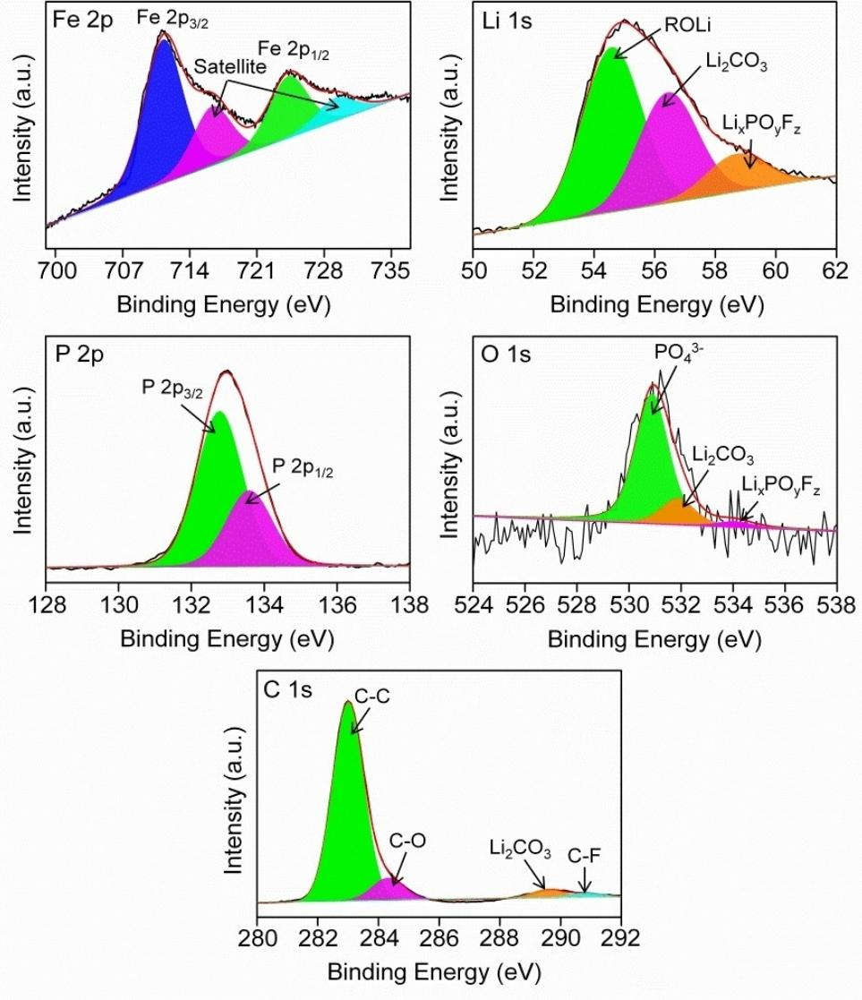

# **Development of a New Crosslinked Highly Conductive Hybrid Electrolyte based on Polyetherdiamine, Diphenylmethane Diisocyanate and Organosilanes for Efficient Lithium-Metal Battery**

[Diganta](http://orcid.org/0000-0003-0256-5884) Saikia,[a] Juti Rani [Deka,](http://orcid.org/0000-0003-3710-2281)[b] Yu-Hao Zeng,[a] Yi-Ching Chen,[a] [Hsien-Ming](http://orcid.org/0000-0002-4144-3890) Kao,\*[a] and [Yung-Chin](http://orcid.org/0000-0002-0545-789X) Yang\*[b]

In this study, a new crosslinked organic-inorganic hybrid polymer electrolyte membrane is developed by first reacting polyetherdiamine with diphenylmethane diisocyanate, followed by addition of organosilane precursors 3-(glycidyloxypropyl) trimethoxysilane and 2-[methoxy(polyethyleneoxy) propyl] trimethoxysilane and LiClO4 salt. Various characterization methods are employed to probe the crystallinity behavior, morphology, ionic interactions, thermal stability, architectural durability and dynamic performance of the hybrid solid polymer electrolyte (HSPE) membranes. Among the electrolytes, the HSPE membrane with [EO]/[Li] ratio of 32 delivers the excellent ionic conductivity value of 1.2×10 4 S cm 1 at 30°C. When the hybrid

## **Introduction**

With rising environmental concern on fossil fuels consumption and impact of climate change, the rechargeable batteries have shown significant potentials to be used as alternative power sources. Amongst the rechargeable batteries, lithium-ion batteries (LIBs) have emerged as the best choice for high energy and power density battery system that can be used in compact electronic gadgets to electric vehicles.[1–3] However, the wide use of LIB system in devices also raises the safety issues as it commonly uses liquid electrolytes, which are vulnerable for fire and explosion hazard under abnormal conditions, such as overcharge, short-circuit or physical damages.[4,5] Lithium-metal batteries (LMBs) show great promise for high energy density batteries as the lithium anode has higher theoretical capacity (~3860 mAhg 1 ) than graphite (~372 mAhg 1 ).[6] However, dendrite growth on lithium anode can rupture the separator membrane to cause short-circuit.[7] In this regard, polymer

| [a] Dr. D. Saikia, Y.-H. Zeng, Y.-C. Chen, Prof. H.-M. Kao                                                      |
|-----------------------------------------------------------------------------------------------------------------|
| Department of Chemistry National Central University                                                          |
| Zhongli, 320317, Taiwan                                                                                         |
| E-mail: hmkao@cc.ncu.edu.tw                                                                                     |
| [b] Dr. J. R. Deka, Prof. Y.-C. Yang                                                                            |
| Institute of Materials Science and Engineering                                                                  |
| National Taipei University of Technology                                                                        |
| Taipei 106, Taiwan                                                                                              |
| E-mail: ycyang@ntut.edu.tw                                                                                      |
| Supporting information for this article is available on the WWW under https://doi.org/10.1002/batt.202200290 |

*Batteries & Supercaps* **2022**, *5*, e202200290 (1 of 14) © 2022 Wiley-VCH GmbH

membrane without salt is plasticized with various electrolyte solvents, the ionic conductivity enhances significantly to values in the range of 1.2 to 1.8×10 3 S cm 1 at 30°C. The lithium metal battery (LMB) assembled with the gel polymer electrolyte (GPE), lithium anode and LiFePO4 cathode provides excellent rate and cycle performances. The LMB delivers very stable discharge capacity of 121.1 mAhg 1 after 150 cycles at the rate of 0.1 C with 97.6% capacity holding compared to first cycle and exhibits above 99% Coulombic efficiency values. The present crosslinked hybrid polymer electrolytes are potentially promising for the future development of high performance lithium-metal batteries.

electrolytes have demonstrated great promise for LMBs as these are flexible, leak proof, increased resistance to the volume changes in the electrodes at the time of the chargedischarge process and possess good interfacial properties.[8,9] Besides, polymer electrolytes can suppress or reduce the lithium dendrite growth subject to some specific considerations.[10] Amongst the polymer electrolytes, solid polymer electrolytes (SPEs) are advantageous as they are free from any organic solvents and just composed of lithium salts and polymer matrices. Polyethylene oxide (PEO) based solid polymer electrolytes are substantially studied from the beginning due to its facile solvation property with the lithium salts.[11–13] However, ionic conductivity of 10 4 S cm 1 at ambient temperature is hardly achievable with this type of electrolytes because of crystallization effect and thus reduces the possibility of using them in LMBs. Therefore, a variety of modified polymer electrolytes, such as blend based, branched polymer based, semi-interpenetrating networked based, block co-polymer based and composite polymer electrolytes made with micron or nanosized filler particles have been synthesized with the aims of enhancing the ionic conductivity.[14–18] However, the disadvantages associated with some of the SPEs, such as poor mechanical property and electrochemical stability, and particle aggregation in composite polymer electrolytes, prohibit their practical use in LMBs. Therefore, there is a growing interest to develop a SPE free from these drawbacks. One of the effective strategies in this regard is the development of organicinorganic hybrid polymer electrolytes owing to their improved ionic conductivity, better mechanical property and considerable

electrochemical stability.[19–21] The advantage of design flexibility by varying the organic and inorganic fractions in accordance with demand makes the hybrid polymer electrolytes unique among the other electrolytes. In addition, degree of functionalization can be easily controlled due to the sol-gel synthesis procedures. Moreover, in-situ formed ceramic oxide particles from hydrolysis and condensation reactions produce a composite character to the hybrid SPEs (HSPEs). As a result, both characteristic features of organic and inorganic portions collectively create a mechanically strong and flexible hybrid membrane. These organic-inorganic hybrid electrolytes possess good interfacial contact with electrode because of flexibility and adhesiveness and can effectively endure the volume change of electrode during charge-discharge process. Another noticeable feature is that the preformed HSPEs can be easily transformed into gel polymer electrolytes (GPEs) by soaking up the membrane in organic solvents without compromising the mechanical stability. The resulting GPEs can retain the electrolyte solutions effectively within the pores of the polymeric network architecture without any leak and consequently avert short-circuit, fire or explosion threats during battery glitch. Good performance with the electrodes and wide electrochemical stability value of GPEs provide an edge over other electrolytes. Additionally, these GPEs possess ionic conductivity in the order of 10 3 S cm 1 or higher at room temperature, and have been demonstrated to have good performances in electrochemical devices.[22,23]

Herein, we have reported a new flexible and crosslinked organic-inorganic hybrid solid polymer electrolyte developed by reaction of polyetherdiamine (ED2003) with methylene diphenyl diisocyanate (MDI), followed by reaction with two organosilanes, namely (3-glycidyloxypropyl) trimethoxysilane (GLYMO) and 2-[methoxy(polyethyleneoxy)propyl] trimethoxysilane (MPEOPS) and LiClO4 salt. The synthesis procedure of the HSPEs is shown schematically in Figure 1. The N=C=O functional groups of MDI react with the NH2 group of ED2003 to configure the building block. The NH2 end groups then react with the epoxy ring of GLYMO to obtain an organic-inorganic hybrid structure. Further addition of MPEOPS to react with GLYMO helps in increasing the chain length of the ethylene oxide (EO) part as well as the formation of silica domains. As the EO fraction helps in the lithium-ion transportation and the

**Figure 1.** Schematic illustration of the preparation of hybrid solid polymer electrolyte membranes (HSPEs).

silica domains provide in-situ silica particles, the hybrid polymer electrolyte thus obtained possesses improved ionic conductivity as well as mechanical properties. The flexible hybrid structure can effectively withstand the volume change of lithium metal during charge-discharge process. A series of HSPEs are prepared by varying the concentration of lithium salt. Moreover, the hybrid membrane without salt is used to develop the GPEs by swelling in several electrolyte solvents. The physical, thermal and chemical characteristics of HSPEs are investigated with XRD, DSC, TGA and FTIR measurements. The architectural and motional behaviors of the HSPEs are evaluated with 13C, 29Si and 7 Li solid-state NMR spectroscopy. Ionic conductivity is assessed by AC impedance method while linear sweep voltammetry (LSV) is used to evaluate the electrochemical stability of the HSPEs. To the end, ionic conductivity and electrochemical stability of GPEs are measured and LMB is fabricated. Cyclic voltammetry (CV), rate capability and long term cycle performance of the LMB are measured by considering LiFePO4 as cathode and lithium as anode.

## **Results and Discussion**

### **Phase and thermal properties analysis of HSPEs**

The variation in crystalline or amorphous phases of the DMGP-*X* HSPEs with different [EO]/[Li] ratios is explored by the WAXRD analysis. The WAXRD patterns of pristine ED2003 and DMGP-*X* HSPEs are shown in Figure 2(A). The WAXRD pattern of ED2003 exhibits seven distinct peaks at 2*θ*=19.2°, 23.4°, 26.4°, 32.9°, 36.3°, 39.7° and 43.1°, suggesting crystalline structure of ED2003 (Figure 2A\_a). The LiClO4 salt also displays crystalline phase behavior with strong peaks centered at 2*θ*=21.3°, 23.3°, 31.6°, 33.1°, 35.8°, 39.5°, 47.3°, 49.4°, 52.4°, 57.9° and 63.2°. [23] The crystallinity drops drastically with the formation of the organic-inorganic hybrid structure to provide semi-crystalline characteristics. When LiClO4 salt with varied [EO]/[Li] ratios are added to the hybrid, the semi-crystalline structure starts to reduce continuously, evidenced by the observation of a broad peak at 2θ=15°–30°, with the increase in the salt amount. The absence of any LiClO4 peaks in the hybrid suggests nearly complete dissolution of the salt in the hybrid. The peak becomes broader for [EO]/[Li]=24 and [EO]/[Li]=16, suggest-

**Figure 2.** A) WAXRD patterns of (a) ED2003, (b) LiClO4 (c) DMGP-∞ membrane, and HSPEs with various salt amounts: (d) DMGP-40, (e) DMGP-32, (f) DMGP-24, and (g) DMGP-16. B) DSC thermograms of (a) ED2003, (b) DMGP-∞ membrane, and HSPEs with various salt amounts: (c) DMGP-40, (d) DMGP-32, (e) DMGP-24 and (f) DMGP-16.

*Batteries & Supercaps* **2022**, *5*, e202200290 (3 of 14) © 2022 Wiley-VCH GmbH

ing almost amorphous structure for DMGP-24 and DMGP-16 HSPEs. The polymer-salt interactions with the increase in salt concentration enhance some connections in the polymer matrix, raising the portions of amorphous phase in the DMGP-*X* HSPEs.

DSC analysis is carried out to gather the information on the degree of structural order and glass transition temperature (*T*g) of the DMGP-*X* HSPEs. The DSC thermograms of ED2003, DMGP hybrid membrane and the DMGP-*X* HSPEs with varying LiClO4 concentrations are shown in Figure 2B. The pristine ED2003 exhibits a melting peak at 35.5°C while it shifts to 24.9°C for the DMGP hybrid membrane without salt (i. e., DMGP-∞). With the addition and increase in LiClO4 salt concentrations, the melting peak shifts to lower temperature and found to be around 15.8°C for DMGP-32 HSPE. The melting transition is not observed for DMGP-24 and DMGP-16 HSPEs with higher salt concentrations. As the degree of crystallinity (*χ*c) is associated with the melting transition, the disappearance of the melting peak at higher salt concentrations suggest that crystalline phase is transformed to amorphous phase for DMGP-24 and DMGP-16 HSPEs because the addition of lithium salt can inhibit the crystallization. The degree of crystallinity (*χ*c) can be evaluated from the area underneath the melting peak by using Equation (1):

$$
\chi_{c} = \frac{\Delta H_{\text{HSPE}}}{\Delta H_{\text{ED2003}}} \times 100\,\%
$$
\n(1)

where Δ*HED2003* and Δ*HHSPE* are the heats of fusion of the pristine ED2003 and the HSPEs, respectively. Taking 100% crystallinity for the pristine ED2003, the degree of crystallinity of the HSPEs with different salt amounts is evaluated and the results are presented in Table 1. As observed in Table 1, the endothermic heat decreases with the increase in salt concentrations. The DMGP-∞ HSPE (i. e., without salt doping) exhibits a relative crystallinity of 45.6% as the formation of the hybrid reduces crystallinity. With the addition of LiClO4 salt, relative crystallinities of the DMGP-40 and DMGP-32 HSPEs further decrease to 40.9 and 26.9%, respectively. The samples with higher salt doping, for example, DMGP-24 and DMGP-16, possess mostly amorphous phases. Therefore, the DMGP-*X* HSPE transforms from semi-crystalline to nearly amorphous state with the rise in salt amounts. The growing interactions between oxygen atoms from polymer segments and Li+-ions from LiClO4 curtail the rearrangement of polymer chains or disrupt the crystallized framework, resulting in the decline in crystallinity.[24] A small exothermic peak is observed around

| Table 1. Glass transition temperature (Tg), melting temperature (Tm), heat of fusion (ΔH) and degree of crystallinity (χc) of DMGP-X HSPEs. |                                        |                                        |                                        |                                       |  |  |
|------------------------------------------------------------------------------------------------------------------------------------------------|----------------------------------------|----------------------------------------|----------------------------------------|---------------------------------------|--|--|
| Sample                                                                                                                                         | Tg [°C]                                | Tm [°C]                                | ΔH [J g 1 ]                         | χc [%]                                |  |  |
| Pristine ED2003 DMGP-∞ DMGP-40 DMGP-32 DMGP-24 DMGP-16                                                                          | – – 62.7 60.7 53.3 52.4 | 35.5 24.9 16.3 15.8 – – | 96.3 43.9 39.4 25.9 – – | 100 45.6 40.9 26.9 – – |  |  |

 7 °C for the DMGP-∞ HSPE membrane due to recrystallization. With the addition of LiClO4 salt, this exothermic peak become intense and is observed at 18.8°C for DMGP-40 HSPE. However, the intensity of the peak is started to reduce and shifted to 7.9°C for DMGP-32 and 7.2°C for DMGP-24 HSPEs. At a greater salt amount of [EO]/[Li]=16, the DMGP-16 HSPE membrane shows almost negligible exothermic peak, suggesting complete suppression of recrystallization. The restructuring of some polymeric chains create this recrystallization peak at lower salt amounts while greater salt amounts impede the recrystallization.

The glass transition temperature (*T*g) determines the elasticity or rigidity of the membrane at a specific temperature. The *T*g of the DMGP-*X* HSPEs is shown in Figure 2B. The DMGP-40 HSPE exhibits *T*g value of 62.7°C, while it shifts to higher values of 60.7, 53.3 and 52.4°C for DMGP-32, DMGP-24 and DMGP-16, respectively, with increase in the LiClO4 concentrations. The *T*g of DMGP-∞ hybrid membrane and pristine ED2003 are not possible to determine in the measured temperature range, suggesting much lower *T*g values for these materials. It is assumed that oxygen atoms in the polymer segments interact with the Li+-ions which increases with rise in the salt amount resulting gradual surge in the *T*g values and polymer chain rigidness.[25] The lower *T*g values of present DMGP-*X* HSPEs suggest that membranes are quite flexible at room temperature.

The thermal endurance of the DMGP-*X* HSPEs is assessed by the thermogravimetric analysis (TGA). The TGA thermograms of DMGP-*X* HSPEs are exhibited in Figure S1 (Supporting Information, SI). The weight loss of around 2%–10% observed initially up to 150°C for DMGP-*X* HSPEs is due to the evaporation of physisorbed water and some chemical residues. The weight loss gradually increases with rising in temperature and at 250°C further weight loss of 1%–2% is observed for DMGP HSPEs with [EO]/[Li]=∞ to 16. The onset of the decomposition of ethylene oxide and propylene oxide segments from polyether diamine and MPEOPS causes this weight loss. From 250 to 470°C, the maximum weight loss of 79%–89% takes place owing to total decomposition of the polymeric segments. It is seen that weight loss enhances with increase in LiClO4 amounts in this temperature range. The association of lithium cations with oxygen atoms reduces the electron density and that may break the C O bonds, resulting rapid weight loss with increase in the LiClO4 concentrations.[26] The remaining weights of 5% for DMGP-∞ membrane at 870°C and 13%– 17% for DMGP-*X* HSPEs with [EO]/[Li]=40–16 at 900°C are attributed to the silica particles/domains that have been formed in-situ in the hybrid structure. The aforementioned results obviously suggest that the DMGP-*X* HSPEs are almost thermally steady until 250°C devoid of any significant deterioration and appropriate for use in batteries at higher temperatures.

#### **Structural evidence from FTIR**

FTIR spectroscopy is performed to explore different chemical interactions in the structure of HSPEs. The FTIR spectra of pristine ED2003 and DMGP-*X* HSPEs are displayed in Figure 3. The broad band noticed in the DMGP-*X* HSPEs around 3437 cm 1 is accounted for the N H stretching vibration.[27] In the pristine ED2003, the same band is observed around 3525 cm 1 because of overlapping of O H and N H stretching.[27] The band observed at 1646 cm 1 in pristine ED2003 is ascribed to the C N stretching vibration.[28] In the HSPEs, the bands observed at 2885 and 1650 cm 1 are attributed to CH2 stretching and C=O stretching vibrations from amides, respectively.[29,30] The band at 1545 cm 1 is related to amide II, consisting of N H bending and C N stretching.[31] The IR peaks at 1462, 1353, 1250 and 841 cm 1 are attached to CH2 scissoring, CH2 wagging, CH2 twisting and CH2 rocking vibrations, respectively.[30,32] The peak at 1297 cm 1 is related to the C N stretching while the C O C vibration gives rise to a peak at 1103 cm 1 . [32,33] Since the stretching vibrations attached to Si O C and Si O Si linkages, which are generated from hydrolysis of GLYMO and MPEOPS, are also observed in the frequency domain of 1120–1050 cm 1 , it is difficult to identify correctly because of overlapping with C O C vibration. The non-condensed Si OH band is obtained at 947 cm 1 . [34] It is likely because of incomplete silicon condensation as the deficient hydrolysis and condensation of GLYMO and MPEOPS produces Si OH. The band found at 625 cm 1 is designated to *ν*(ClO4 ) modes of LiClO4. [30,32] Since most of the peaks in DMGP-*X* HSPEs are slightly shifted in

**Figure 3.** FTIR spectra of (a) ED2003, and DMGP-*X* HSPEs with *X*=(b) ∞, (c) 40, (d) 32, (e) 24 and (f) 16.

comparison to those of pristine ED2003, it suggests that the hybrids form complexation with LiClO4 salt.

The vibration band of *ν*(ClO4 ) mode is responsible for the variations in the ion-ion interactions in the HSPEs. Deconvolution of the FTIR peaks in the wavenumber range of 650 to 600 cm 1 for DMGP-*X* HSPEs gives two peaks centered at 635 and 625 cm 1 , which are ascribed to Li+ClO4 contact ion pairs and free ClO4 anions, respectively (Figure S2, Supporting Information).[35,36] The DMGP-40 HSPE with a lower salt loading exhibits 84% free ClO4 ions, while the percentage of free ClO4 ions decreases with the increase in the salt amounts. Thus, DMGP-32, DMGP-24 and DMGP-16 HSPEs display 77%, 70% and 68% free ClO4 ions, respectively. On the other hand, the percentages of contact ion-pairs increase with the rise in the salt amounts. As numerous Li+-ions and ClO4 -ions are generated at higher salt concentrations, many Li+ClO4 contact ion-pairs can be formed due to higher ion densities resulting from opposite ions in adjacent locations. Therefore, more Li+ ions can move freely at lower salt loadings as compared to the cases of higher salt doping.

#### **Structure investigation by 13C and 29Si SS NMR**

The backbone structure of the organic-inorganic hybrids can be examined by 13C and 29Si CPMAS NMR spectroscopy. Figure 4(A) presents the 13C CPMAS NMR spectra of DMGP-*X* HSPEs. The sharp peak observed at 70.5 ppm for all the HSPE membranes is attributed to the carbon atoms binding with the oxygen atoms of ethylene oxide (EO) segments of ED2003 and MPEOPS.[37] The minor shoulder peak at 75 ppm can be assigned to carbon atoms linked to oxygen atoms from propylene oxide (PO) segments of ED2003. The carbons from

**Figure 4.** A) 13C CPMAS NMR spectra of (a) DMGP-40, (b) DMGP-32, (c) DMGP-24 and (d) DMGP-16 HSPEs. B) 29Si CPMAS NMR spectra of (a) DMGP-32 and (b) DMGP-16 HSPEs.

CH3 groups of PO segments appear at 17 ppm, whereas nitrogen substituted carbons from ED2003 generate a small peak at 48 ppm. The methylene carbons ( CH2) from the 1st and 2nd places to the silicon atom in GLYMO and MPEOPS exhibit respective peaks at 9 and 22 ppm. The presence of specific peaks from the various carbon atoms indicates the effective development of the hybrid framework that is in agreement with the structure presented in Figure 1.

The silicate structure inside the hybrid can be examined with 29Si CPMAS NMR measurements, although the silicon content is much less than the polymer backbone. The 29Si CPMAS NMR spectra of DMGP-32 and DMGP-16 HSPEs are shown in Figure 4B. Two types of silicon groups, namely *T*3 [RSi(OSi)3, R – alkyl group] and *T*2 [RSi(OSi)2(OH)], are observed at 66.0 and 56.9 ppm, respectively, for the HSPEs. The appearance of *T* groups in HSPEs gives direct supports for the successful development of silicate domains/particles inside the hybrid structure. As the intensity of *T*3 is relatively larger than *T*2 , it suggests that the most of the organosilanes are condensed with Si OH groups that are remained in HSPEs.

#### **Morphological investigation of the HSPE membranes**

The composite nature of the HSPE membranes is explored by SEM measurements to ascertain the dispersion of silica particles. The SEM images and Si mapping of DMGP-*X* HSPEs are displayed in Figure S3 (Supporting Information). Although the SEM images display almost uniform surface layers of the HSPE membranes, a close examination of the images do show small sub-micron sized silica particles on the surfaces. While the DMGP-∞ membrane (i. e., without salt) shows slightly rough surfaces with some aggregated particles, the surfaces are more uniform for DMGP-*X* (*X*=40, 32, 24 and 16) HSPE membranes with LiClO4 salt. However, DMGP-24 and DMGP-16 HSPEs with higher LiClO4 loadings exhibit some aggregated silica particles as observed in Figure S3(d, e). It can be inferred that the distribution of silica particles in the HSPEs can be influenced by the relationship of salt with the silica domains and polymer matrix. The elemental mapping of Si demonstrates the uniform dispersion of silica particles on the surfaces of all the DMGP-*X* HSPE membranes. The results reveal the composite nature of the present DMGP-*X* HSPEs with micron-sized silica particles embedded in the membranes.

#### **Studies of dynamic behavior and Li**+ **local environments of HSPEs by 7 Li SS NMR**

The movement of Li-ion is studied by evaluating the linewidth of 7 Li central transitions as functions of LiClO4 concentration and temperature. The 7 Li linewidths of DMGP-32 and DMGP-16 HSPEs are measured with and without proton decoupling from –80 to +80°C and shown in Figure 5. As displayed in Figure 5, two distinct different temperature regions are found in the HSPE samples without proton decoupling. At temperature below 70°C, broader linewidths with FWHM (i. e., full width at

**Figure 5.** Temperature dependence of the 7 Li static linewidths of A) DMGP-32 and B) DMGP-16 HSPEs, measured (a) with and (b) without proton decoupling.

half maximum) of 4 kHz are obtained. At such a low temperature, most of the lithium-ions are not movable so that quadrupolar and/or internuclear dipole-dipole interactions make significant contribution to the observed linewidths. The linewidths are continuously reduced with increasing sample temperature and suddenly drop around the *T*g of HSPEs. At 50°C, the values of linewidths for DMGP-32 and DMGP-16 are found to be 3.6 and 3.7 kHz, respectively. Two major interactions, i. e., 7 Li 1 H dipolar interactions and 7 Li 7 Li homonuclear interactions are responsible for the linewidths. Once the proton decoupling scheme is applied to remove the 7 Li 1 H interactions, the linewidths are effectively reduced to 1.18 and 1.26 kHz for DMGP-32 and DMGP-16 HSPEs, respectively, at the same temperature of 50°C. Therefore, 7 Li 1 H interactions are responsible for about 2.42 and 2.44 kHz to the total linewidths for DMGP-32 and DMGP-16 HSPEs, respectively. In other words, about 66% linewidth is due to 7 Li 1 H dipolar interactions and the rest of 34% is resulted from 1 Li 1 Li homonuclear interactions in the DMGP-32 and DMGP-16 HSPEs. These values are comparable to other 7 Li static NMR results on SPEs.[38,39] When the sample temperature is increased, the linewidths become narrower and exhibit linewidths of 0.56 and 0.62 kHz for DMGP-32 and DMGP-16 HSPEs, respectively. The motional narrowing of 7 Li static linewidths happens when the electric field gradients

or the interactions of local dipolar fields are analogous to the rigid lattice linewidths of the 7 Li nucleus.[40] So, lithium ions are extremely movable at the onset temperature of motional narrowing. The activation energy (*E*a) of the HSPEs can be estimated from the line narrowing data by Equations (2) and (3),[40]

$$
\tau_{\rm c} = \frac{\alpha}{\Delta_{\rm HT}} \tan \left[ \frac{\pi}{2} \left( \frac{\Delta_{\rm HT}}{\Delta_{\rm RL}} \right)^2 \right]
$$
 (2)

$$
\tau_{\rm c} = \tau_0 \exp(E_a/kT) \tag{3}
$$

where *τ*c denotes the correlation time, *Δ*HT and *Δ*RL are the FWHMs at a certain temperature and in the rigid lattice, respectively, and *α* is a constant (=1). Viewing the onset temperature of rigid lattice linewidth around 40°C and using Equations (2) and (3), the activation energy (*E*a) values are estimated to be 0.19 and 0.2 eV for the DMGP-32 and DMGP-16 HSPEs, respectively. It is found that with rise in salt amount, the *E*a values improve marginally. These *E*a values are smaller or comparable to other published values on SPEs.[23,38,41]

7 Li { 1 H} (i. e., proton decoupled) MAS NMR analysis is carried out on DMGP-32 and DMGP-16 HSPEs with varying temperature from 80 to +80°C at a spinning speed of 3 kHz to investigate local environments of the Li+-ions in the hybrid electrolytes. As displayed in Figure S4 (Supporting Information), a sharp 7 Li resonance peak at 1.03 ppm for both the HSPEs is observed due to coordination of Li+-ions with the ether oxygen atoms of PEO/PPO chains. The linewidths of lithium-ions vary from 1.56 and 0.68 kHz at 80°C to 0.59 and 0.61 kHz at +80°C, respectively, for DMGP-32 and DMGP-16 HSPEs, indicating that Li+-ions are highly mobile at higher temperatures.

#### **Ionic conduction, transference number and electrochemical endurance of HSPEs**

The temperature dependence of ionic conductivities of DMGP-*X* HSPEs with different [EO]/[Li] ratios are displayed in Figure 6(a). The ionic conductivity is continuously enhanced for all the HSPEs when the sample temperature is increased. At higher temperatures, not only Li+-ions can move easily, but also the polymer backbone becomes more flexible. As a result, more free volumes are formed. Therefore, the ions and polymer portions can penetrate to the free volume with generation of numerous conductive pathways that are beneficial for the improvement of ionic conductivity.[42] The Arrhenius plots of ionic conductivity shown in Figure 6(a) indicate that plots are curved in nature, suggesting the Vogel-Tamman-Fulcher (VTF) behavior of ionic conductivity is followed. This suggests that the major contributions of ionic movements come from polymer segmental motion, whereas ionic hopping has a minimal effect on ionic conductivity. As observed from Figure 6(a), the ionic conductivity of the HSPEs increases with the increase in the salt amount in the beginning and achieves the highest value for DMGP-32. However, further rise in the salt

**Figure 6.** a) Ionic conductivity and (b) linear sweep voltammetry curves of DMGP-40, DMGP-32, DMGP-24 and DMGP-16 HSPEs.

amount decreases the ionic conductivities for DMGP-24 and DMGP-16 HSPEs. Among the HSPEs, the DMGP-32 possesses the highest ionic conductivity of 1.2×10 4 S cm 1 at 30°C and 7.2×10 4 S cm 1 at 70°C. The present ionic conductivity data are greater or equivalent to the data published in literature on the similar class of hybrid electrolytes.[20,21,43–45] Such ionic conductivity values for the HSPEs can be ascribed to a variety of factors. Normally, ionic conductivity (*σ*) of the electrolytes can be expressed as Equation (4):

$$
\sigma(T) = \sum_{i} n_{i} q_{i} \mu_{i} \tag{4}
$$

where *ni* represents the number of charge carriers, *qi* denotes the charge on each carrier and *μi* indicates the mobility of charge carrier *i.* In general, ionic conductivity increases with the increase in charge carrier concentration, which is directly related to the salt concentration. However, DMGP-24 and DMGP-16 HSPEs with higher salt loadings possess lower ionic conductivities than DMGP-32 HSPE with a medium salt loading. As DMGP-24 and DMGP-16 have higher numbers of charge carriers, it is clear that anionic and cationic charge carriers reside close to each other raising the possibility of formation of the increased numbers of Li+ClO4 contact-ion pairs, which is also confirmed by the FTIR analysis. Besides, higher numbers of charge carrier reduce the charge movement. Therefore, both the increased numbers of contact-ion pairs and aggregates and the reduced movement of charged ions hinder the availability of actual charge carriers at higher salt amounts, and thus result in lower ionic conductivities. Consequently, the DMGP-32 HSPE with a medium salt loading may provide the optimal effective charge carriers, leading to the highest ionic conductivity among the HSPEs investigated. There is also a role of glass transition temperature on achieving high ionic conductivity for DMGP-32 HSPE. The *T*g value for DMGP-32 was 60.7°C, while DMGP-24 and DMGP-16 HSPEs exhibit *T*g values of 53.3 and 52.4°C, respectively. With lower *T*g values, polymer chains become more flexible at room temperature, leading to formation of free volumes. It can be anticipated that the HSPEs with lower *T*g values have increased and facile movements of polymer segments and ions. Therefore, DMGP-32 HSPE exhibits the highest ionic conductivity values at ambient temperature or beyond. However, with increasing the LiClO4 salt amount, the *T*g values start to increase, resulting in a more rigid polymer network. It is suggested that inter and intramolecular interaction of ether dipoles with the charge carriers may behave as crosslinking sites, causing the increase in the *T*g values. Consequently, ionic conductivity decreases because the increased *T*g limits the movement of polymer segments and thus reduces free volumes. As a result, DMGP-24 and DMGP-16 HSPEs exhibit lower ionic conductivity than DMGP-32 HSPE.

One more interesting investigation is that the HSPE membranes can work as composite SPEs as well because of utilization of GLYMO and MPEOPS to generate in-situ silica particles inside the hybrid architecture. As depicted in the SEM images and EDS Si mapping, the sub-micronic silica particles are dispersed uniformly in the HSPE membranes. The in-situ formed silica particles help to minimize the interactions between polymer and cations, expand the amorphous phase and eventually improves the ionic conductivity.[46] Moreover, the interactions between polymer and silica produce conducting interface layers.[47] These interface layers or grain boundaries act as channels for the prompt transportation of ions, resulting in the enhancement of ionic conductivity.[48] Additionally, there may be some effects from the Lewis acid/base reactions amongst PEO/PPO portions, silica particles and ClO4 ions on the observed ionic conductivity.[49,50] The SiO2 particles with OH surface groups act as Lewis acid sites to coordinate with ether oxygen atoms, the Lewis base centers of PEO/PPO parts and ClO4 ions of LiClO4 salt. The Lewis acid-base interactions can increase the amorphous phase in the hybrid electrolytes by limiting the rearrangement of PEO/PPO segments and reducing the movement of ClO4 ions, and thereby assist in the development of Li+-ion conducting passageways on SiO2 surfaces. As the interconnections of OH groups with ClO4 ions decrease the mobility of ClO4 ions and lower ionic coupling, more Li+ ions can move freely to result in the enhancement of ionic conductivity.[50] Hence, the present DMGP-*X* HSPEs possess comparatively high room temperature ionic conductivity in the order of 10 4 S cm 1 .

The Li-ion transference number (*t*+) of DMGP-*X* HSPEs was evaluated by using the equation,[51]

$$
t_{+} = \frac{I_{s}(\Delta V - I_{0}R_{0})}{I_{0}(\Delta V - I_{s}R_{s})}
$$
\n(5)

Here, ΔV is the applied voltage, *I*0 – the initial dc current, *Is* – the steady-state dc current, *R*0 – the initial resistance and *Rs* – the steady-state resistance of the passivation layer. The typical depolarization curve of the DMGP-16 HSPE membrane is displayed in Figure S5 (SI). An extension of the low frequency semi-circle is witnessed from the figure due to surge in the interfacial resistance, which is attached with the development of passivation layer on the lithium electrode.[52] The passive film formed on the lithium electrode might comprise the product of the corrosion reaction among the Li electrode and the polymer, salt and additional impurities. The formation of a concentration polarization of anions and the growth of passivation films finally stabilizes the current. The transference numbers for DMGP-40, DMGP-32, DMGP-24 and DMGP-16 are calculated to be 0.25, 0.34, 0.29 and 0.21, respectively. As the lithium-ions can interact with ether oxygen atoms of PEG and PPG units along with oxygen atoms of ClO4 , the movement of Li+-ions is limited, leading to lower *t*+ values in the present HSPE samples. The lower transference number values (*<*0.5) suggest anionic groups are dominant in contributing to the total ionic conductivity.

The electrochemical stability windows of DMGP-*X* HSPE membranes are measured to find out voltage threshold of the electrolytes that can be endured when used in LMBs. Figure 6(b) shows the linear sweep voltammetry curves of DMGP-*X* HSPEs, where *X*=40, 32, 24 and 16, in the voltage range of 0 to 6 V. A low background current is detected in the voltage range between 2 and 4.1 V because of alteration of stainless steel electrode surface.[53] A small hump between 2 and 3 V corresponds to oxidation of some trace impurities present in the HSPE membranes.[54] The flowing of current starts to increase quickly after passing over the 4.1 V voltage limit as HSPE membranes begin to decompose. This suggests that DMGP-*X* HSPE membranes are electrochemically steady up to 4.1 V. The presence of in-situ silica particles in the HSPE membranes helps to achieve such a value by protecting the membranes from lithium corrosion.[55]

#### **Conversion of HSPEs to GPEs**

As DMGP-*X* HSPE membranes can achieve room temperature ionic conductivity in the order of 10 4 S cm 1 , they are only able to deliver inferior cycle performances at ambient temperature while using as an electrolyte in LMBs. However, the hybrid membrane is still capable of providing robust structural integrity after soaking in organic solvents. Therefore, the pristine DMGP-∞ membrane (salt-lacking) is soaked in electrolyte solvents to convert it to hybrid "gel" polymer electrolytes (i. e., GPEs) with enhanced ionic conductivity values and then use in LMBs. Further electrochemical characterizations of the GPE membranes are performed to assess their accomplishments in LMBs.

*Batteries & Supercaps* **2022**, *5*, e202200290 (8 of 14) © 2022 Wiley-VCH GmbH

#### **Porosity, swelling responses and ionic conductivity of GPEs**

The porosity of the DMGP-∞ membrane was measured by soaking the membrane in n-butanol for 1 h and then evaluated by using Equation (6),[56]

$$
P = \frac{m_a/\rho_a}{m_a/\rho_a + m_p/\rho_p} \tag{6}
$$

where *m*a and *m*p are the mass of wet and dry membranes, respectively, while *1*a and *1*p are the corresponding densities of n-butanol and the dry membrane. The values are measured (*m*a=0.1066 g; *m*p=0.0389 g, *1*a=0.8092 gcm 3 , *1*p= 1.032 gcm 3 ) and the porosity of the hybrid structure is calculated to be 78%.The obtained porosity value suggests the good porous structure of the DMGP-∞ membrane.

The pristine DMGP-∞ membrane is immersed separately in three different electrolytes, namely 1 M LiClO4 in EC/PC, 1 M LiCF3SO3 in EC/PC and 1 M LiPF6 in EC/DEC, to measure the swelling ratio (SR) of the membrane as a function of time by Equation (7):

$$
SR\ (\%) = \frac{W_i - W_d}{W_d} \times 100\tag{7}
$$

where *w*d and *w*i denote the weights of the membrane before (i. e., dry) and after soaking in electrolytes, respectively. The swelling responses of the DMGP-∞ membrane in these three electrolytes are displayed in Figure 7(A). As seen in Figure 7(A), the swollen DMGP-∞ membrane with 1 M LiCF3SO3 in EC/PC exhibits the maximum swelling ratio of 639% after the membrane is immersed in electrolyte solvent for 60 min. For the same duration, the DMGP-∞ membrane with 1 M LiClO4 in EC/PC has the swelling ratio of 610%. However, the maximum swelling value of 578% is achieved for the DMGP-∞ membrane with 1 M LiPF6 in EC/DEC after 90 min. The high values of swelling ratios also suggest that the prepared DMGP-∞ membrane is adequately porous in nature. After reaching the maximum swelling ratio values at 60 min, the values decrease to some extents for DMGP-∞ membranes with 1 M LiCF3SO3 in EC/PC and 1 M LiClO4 in EC/PC because of the extrusion of the electrolyte solvents from the hybrid membrane. After 180 min, for example, the swelling ratios drop to 595% and 573% for DMGP-∞ membranes with 1 M LiCF3SO3 in EC/PC and 1 M LiClO4 in EC/PC, respectively. On the other hand, the extrusion of electrolyte solvent from DMGP-∞ membrane with 1 M LiPF6 in EC/DEC is not significant because the swelling ratio is reduced from 578% to 571% after 180 min. The changes in the swelling ratio values with various electrolyte solvents indicate that the viscosity and molecular size of the solvents affect the absorption of electrolyte solvents by the membrane. From the above results, it is found that the DMGP-∞ membrane with 1 M LiPF6 in EC/DEC is more stable than the DMGP-∞ membranes with 1 M LiCF3SO3 in EC/PC and 1 M LiClO4 in EC/PC by retaining the electrolytes more effectively in the pores for an extended time without significant electrolyte extrusion.

**Figure 7.** A) Swelling ratio and B) ionic conductivity of the DMGP-∞ GPEs in various electrolyte solvents: (a) 1 M LiClO4 in EC/PC, (b) 1 M LiCF3SO3 in EC/ PC, (c) 1 M LiPF6 in EC/DEC.

Ionic conductivity is one of the foremost factors of the GPE membrane to determine its applicability in LMBs. The temperature dependence of ionic conductivities of the DMGP-∞ GPE membrane immersed in 1 M LiCF3SO3 in EC/PC, 1 M LiClO4 in EC/PC and 1 M LiPF6 in EC/DEC are measured and the results are shown in Figure 7(B). To keep the membrane mechanically stable, the immersion time of the DMGP-∞ GPE membrane in electrolyte solvents is fixed at 40 min with the swelling ratio values obtain between 500 and 600% for all three samples. The linear plots of ionic conductivity data suggests that the ionic conductivity increases with the rise in temperature by following the Arrhenius behavior as the movement of ions mainly dominate by thermally activated ionic hopping rather than the segmental movement of polymer chains. The DMGP-∞ GPEs exhibit good ionic conductivities of 1.8×10 3 S cm 1 with 1 M LiClO4 in EC/PC, 1.2×10 3 S cm 1 with 1 M LiCF3SO3 in EC/PC and 1.4×10 3 S cm 1 with 1 M LiPF6 in EC/DEC at 30°C. The ionic conductivities increase to 5.1×10 3 , 3.5×10 3 and 4.3× 10 3 S cm 1 for DMGP-∞ GPEs with 1 M LiClO4 in EC/PC, 1 M LiCF3SO3 in EC/PC and 1 M LiPF6 in EC/DEC, respectively, at 70°C. The higher ionic conductivities of DMGP-∞ GPEs with different electrolyte solvents are mainly ascribed to substantial amounts of the electrolyte uptake by the membrane. Initially, the pores in the membrane help to absorb the organic electrolyte and afterwards the electrolyte permeates slowly into the polymer chains and the amorphous regions of the hybrid

*Batteries & Supercaps* **2022**, *5*, e202200290 (9 of 14) © 2022 Wiley-VCH GmbH

structure.[57,58] As the carbonyl groups are favorable for binding with Li+-cations, the substantial amounts of the absorbed electrolytes in the pores of the membrane assist in the rapid movement of free Li+-cations through the pores, swollen amorphous areas and numerous ion channels in the hybrid network structure, leading to such high ionic conductivity values. In addition, the viscosity and dielectric constants of the organic solvents also play a significant role in achieving different ionic conductivities with various organic electrolyte solvents.

### **Electrochemical stability, CV, rate, cycle performance of GPE, lithium morphology and surface chemical analysis of LFP cathode after cycling**

As observed in the swelling ratio measurements, the DMGP-∞ membrane with 1 M LiPF6 in EC/DEC is more stable than the other two kinds of electrolyte solvents. Besides, its ionic conductivity value (1.4×10 3 S cm 1 ) is also comparable with the value obtained with 1 M LiClO4 in EC/PC (1.8×10 3 S cm 1 ) at 30°C. Therefore, the 1 M LiPF6 in EC/DEC electrolyte is employed for further electrochemical characterizations.

The electrochemical stability window of DMGP-∞ GPE with 1 M LiPF6 in EC/DEC is measured in the voltage range of 0 to 6 V. The LSV curve of the GPE membrane is displayed in Figure 8(a). The curve shows that an extremely low current flows through the cell between 2 and 4.8 V. When the potential is crossed over 4.8 V, the current appears to increase exponentially because of beginning of the deterioration process of the GPE membrane. Thus, the present DMGP-∞ HPPE membrane with 1 M LiPF6 in EC/DEC is electrochemically stable up to 4.8 V, which is appropriate for use as both electrolyte and separator in LMBs. The existence of Si OH groups in the membrane may create a slim protective film on the surface of lithium electrode and prohibits the GPE membrane from deterioration. Moreover, efficient absorption and confining the organic electrolyte within the pores of the GPE membrane is beneficial for holding it electrochemically steady up to 4.8 V since there is basically no leaked electrolyte to react with the lithium metal.

The CV curves of the fabricated Li/DMGP-∞ GPE/LiFePO4 cell for the chosen first ten cycles are presented in Figure 8(b) in the voltage range of 2 to 3.6 V at a scan rate of 0.1 mVs 1 .

**Figure 8.** a) Linear sweep voltammetry, b) CV and c) rate capability of DMGP-∞ membrane plasticized with 1 M LiPF6 in EC/DEC. d) Capacity and Coulombic efficiency of Li/DMGP-∞/LFP and Li/PP/LFP cells at a current rate of 0.1 C.

*Batteries & Supercaps* **2022**, *5*, e202200290 (10 of 14) © 2022 Wiley-VCH GmbH

**Figure 9.** High resolution XPS spectra of Fe 2p, Li 1s, P 2p, O 1s and C 1s components for cycled LiFePO4 cathode.

Two characteristic peaks, one oxidation and the other reduction peak are observed at 3.59 and 3.27 V, respectively. The oxidation peak denotes the Li+-ions withdrawal from LiFePO4, while the reduction peak corresponds to the insertion of Li+ -ions into the LiFePO4. [59] The good reversibility of the CV curves, except the first cycle, demonstrates remarkable electrochemical stability between LiFePO4 and DMGP-∞ GPE with 1 M LiPF6 in EC/DEC. It also demonstrates superior insertion and extraction of lithium ions, which are beneficial for enhancing the cycle performances.

The rate capability of Li/DMGP-∞ GPE/LiFePO4 cell is displayed in Figure 8(c). The cell delivers discharge capacities of 124, 115, 107, 95 and 71 mAhg 1 at corresponding current rates of 0.1 C, 0.2 C, 0.3 C, 0.5 C and 1 C. Upon reversing the current rate to 0.1 C after 25 cycles, the cell yet provides discharge capacity of 121 mAhg 1 , almost similar capacity value with the former one. Consequently, the cell can preserve nearly 97.6% discharge capacity after 30 cycles at 0.1 C. The results thus obtained indicate sturdiness and suitability of the GPE membrane with the electrodes despite cycled at a high rate. The excellent electrode/electrolyte interfacial connection may further assist in ameliorating the chemical reaction rates and attaining steady rate capabilities.

The cycle performance of the cell assembled with DMGP-∞ GPE with 1 M LiPF6 in EC/DEC, lithium anode and LiFePO4 cathode is measured in the voltage range of 2 to 3.6 V at the current rate of 0.1 C. Polypropylene (PP) separator, which is normally employed in commercial lithium-ion batteries, is also used to compare the cycle performance. The discharge capacities and coulombic efficiencies of the cells fabricated with DMGP-∞ GPE and PP membranes are displayed in Figure 8(d). The DMGP-∞ GPE and PP membranes provide the 1st cycle discharge capacities of 124 and 107.6 mAhg 1 , respectively, which drop correspondingly to 121.1 and

81.4 mAhg 1 after 150 cycles. The fading of the discharge capacity values is attributed to deterioration of electrolyte and development of solid electrolyte interface (SEI) film at lithium electrode/electrolyte contact.[60] Although the SEI film on the surface of the electrode restricts normal movement of mass and charge and absorbs portion of the electrode capacity to result in irreversible capacity loss, but it shields the GPE membrane from more damage by the lithium anode and supports in achieving stable capacity. After 150 cycles, the DMGP-∞ GPE membrane can retain 97.6% of initial discharge capacity in comparison to 75.6% of the PP separator. Thereby, the capacity of the cell with DMGP-∞ GPE membrane is 1.5 times greater than the cell with PP separator after 150 cycles. The DMGP-∞ GPE and the PP membranes exhibit almost similar first cycle Coulombic efficiency (CE) values of 98.7 and 98.8%, respectively, which are increased to above 99% after the 8th cycle. Afterwards, the CE values of DMGP-∞ GPE increase slightly and maintain almost similar values up to the 150th cycle with a value of 99.8%. However, the CE values for the PP membrane fluctuate between 98.7 and 99.2% from the 9th to 19th cycles and then gradually reduce to 97.9% at the 150th cycle. The observation of higher CE values for the cell with DMGP-∞ GPE membrane in comparison to the cell with PP separator suggests efficient reversible charge transfer reactions at the electrode/electrolyte junction.

To analyze how efficiently the synthesized DMGP-∞ GPE with 1 M LiPF6 in EC/DEC inhibits the lithium dendrite, the morphology and microstructure of the cycled lithium electrode are measured by SEM and TEM. Figure S6 (Supporting Information) displays the SEM and TEM images of the cycled lithium electrode. As seen in Figure S6(a), there is no obvious lithium dendrite formation or spongy lithium on the surface of the electrode. Instead, lithium deposit acquired from the DMGP-∞ GPE shows almost uniform solid particle like morphology. To further gain an understanding on the structure of the lithium deposit, TEM measurements are carried out. A uniform SEI layer on the surface of the electrode is observed in Figure S6(b). In one part of the surface, a lithium hump is observed though it is not converted to needle-like dendrite to penetrate the SEI layer. The unique surface chemistry and better interfacial properties of DMGP-∞ GPE assist to nearly restrict the dendrite formation on the surface of lithium electrode.

The surface chemical components of the cycled LiFePO4 cathode were studied by XPS and displayed in Figure 9. The high resolution XPS spectra of Fe 2p shows two peaks at 724.5 eV and 710.9 eV for Fe 2p1/2 and Fe 2p3/2, respectively. Two satellite peaks are also observed at 729.6 eV for Fe 2p3/2 and 716.4 eV for Fe 2p1/2. The characteristic peaks suggest the presence of Fe2+ oxidation state in the cycled LiFePO4 cathode.[61] The deconvoluted Li 1s spectrum displays three peaks at 54.6, 56.5 and 58.8 eV, corresponding to ROLi, Li2O3 and Li*x*PO*y*F*z*, indicating the formation of these species on the surface of LiFePO4. [62] The deconvoluted P 2p spectrum shows two peaks at 132.8 eV and 133.6 eV for P 2p3/2 and P 2p1/2, respectively, which divulges 5+ valence state of P.[63] The high resolution O 1s spectrum depicts three deconvoluted peaks

## **Conclusion**

In summary, a new crosslinked organic-inorganic hybrid polymer electrolyte membrane is developed by reacting polyetherdiamine with diphenylmethane diisocyanate, followed by two organosilanes GLYMO and MPEOPS and LiClO4 salt. The crystallinity behavior, degree of crystallinity, ionic interactions, thermal stability and structural integrity of the hybrid are systematically investigated. The dynamic behavior and Li+ local environments of the HSPE membranes are explored with 7 Li solid state NMR spectroscopy. The synthesized hybrid material can be utilized as dual-purpose medium to prepare both solid and gel polymer electrolytes. The HSPE membrane with [EO]/ [Li] ratio of 32 exhibits the highest ionic conductivity of 1.2× 10 4 S cm 1 at 30°C and 7.2×10 4 S cm 1 at 70°C. After plasticization with 1 M LiPF6 in EC/DEC, the GPE membrane exhibits higher ionic conductivity of 1.4×10 3 and 4.3× 10 3 S cm 1 at 30 and 70°C, respectively, with an electrochemical stability value of 4.8 V. The good reversibility of the cyclic voltammetry curves demonstrates better electrochemical stability between LiFePO4 and the DMGP-∞ GPE membrane. The lithium metal battery assembled with lithium anode, DMGP-∞ GPE membrane with 1 M LiPF6 in EC/DEC and LiFePO4 cathode delivers better rate and cycle performances than the commercial PP separator. The cell delivers excellent discharge capacity of 121.1 mAhg 1 after 150 cycles at a current rate of 0.1 C with capacity retention of 97.6% and coulombic efficiency value of over 99%. Compared to the cell with the commercial PP separator, the cell with DMGP-∞ GPE membrane delivers 1.5 times higher capacity at the 150th cycle. The DMGP-∞ GPE membrane can effectively inhibit the dendrite growth on the lithium electrode. Moreover, the SEI layer formation on LiFePO4 cathode shows the association of different chemical species. The attractive properties of the present organic-inorganic hybrid electrolytes reveal its prospective applications in lithium metal batteries and other electrochemical devices.

## **Experimental Section**

#### **Development of HSPEs**

The synthesis process of the HSPEs is shown schematically in Figure 1. The crosslinked HSPEs were prepared by dissolving 1 mmol (4.2 wt.%) of 4,4'-methylene diphenyl diisocyanate (MDI, Aldrich) and 2 mmol (67.8 wt.%) of amine ended block polypropylene glycol-polyethylene glycol copolymer (ED2003, Aldrich) into

around 530.9, 531.9 and 534 eV for PO4 3 , Li2CO3 and Li*x*PO*y*F*z*, respectively.[62] The high resolution C 1s spectrum shows four peaks around 283, 284.3 289.6 and 290.9 eV, which are ascribed to sp2 coordinated carbon (C C) atoms, carbon attached with carboxylic groups (C O), Li2CO3 and C F, respectively.[62,64] Li2CO3 is formed from the decomposition of the organic solvent, while the C F bond forms from the PVdF. The present results suggest the SEI layer formation on the surface of LiFePO4.

15 mL tetrahydrofuran (THF) individually and subsequently combined and kept stirred for 24 h at 50°C to finish the reaction. The successful completion of the reaction was confirmed from the FTIR spectrum (Figure S7a, Supporting Information) as there was no peak around 2270 cm 1 for N=C=O. Instead, a peak at 1689 cm 1 for C=O from amide group was observed, which suggest the linking of MDI with ED2003. After that, 2 mmol (8 wt.%) of (3 glycidyloxypropyl) trimethoxysilane (GLYMO, Aldrich) was put in the above solution and kept stirring for 24 h at 50°C to link the inorganic silane portion to the polymeric networks. Figure S7(b) confirmed the successful linking of the alkoxysilane to amine end groups of the ED2003 as the peak for the epoxy ring (915 cm 1 ) was absent from the FTIR spectrum, which suggested the epoxy ring opening and reaction with amine end groups. Additionally, a new peak was observed around 948 cm 1 for non-condensed Si OH groups. Next, 2 mmol (20 wt.%) of 2-[methoxy(polyethyleneoxy)propyl] trimethoxysilane (MPEOPS, Gelest) was poured into the reaction product and kept stirring for 24 h at 50°C to add further EO and silane units to develop the organicinorganic hybrid polymer structure (Figure 3b). Then, 0.4 mL of 1 M HCl was added to the solution and kept stirring for 3 h to initiate the hydrolysis and condensation reactions of the organosilanes for the creation of silicate architecture within the polymeric framework. Afterwards, LiClO4 salt (Aldrich) with chosen [EO]/[Li] ratios was added to the mixed solution and stirred at 50°C for 24 h. Finally, the resulting viscous solution was poured onto the Teflon plates and dried under hood for 12 h. The Teflon plates were then transferred to a vacuum oven and dried at 70°C to entirely remove the THF and thus flexible and crosslinked HSPEs with the thickness of around 90 μm were obtained. The HSPEs are denoted as DMGP-*X*, where D describes ED2003, M for MDI, G stands for GLYMO, P represents MPEOPS and *X* corresponds to [EO]/[Li] ratio determined by contemplating the number of ether oxygens (from polymeric part) per Li+ cations.

#### **Development of GPEs**

Although HSPEs can deliver ionic conductivity in the order of 10 4 S cm 1 at room temperature, it shows poor electrochemical performances while used as electrolyte in lithium-metal battery (LMB) at room temperature. Thus, the salt-free hybrid membrane (i.e., DMGP-∞) was used to prepare the gel polymer electrolytes, namely GPEs, by swelling the membrane in several electrolyte solvents, such as 1 M LiClO4 in EC/PC (ethylene carbonate/ propylene carbonate, 1:1, v/v), 1 M LiCF3SO3 in EC/PC (1:1, v/v) and 1 M LiPF6 in EC/diethyl carbonate (DEC) (1:1, v/v) to improve the ionic conductivity. The GPE membrane works both as separator and electrolyte and used to fabricate the LMBs.

#### **Assembling of lithium-metal battery**

To fabricate the LMB, the DMGP-∞ membrane with 1 M LiPF6 in EC/DEC (1:1, v/v) was used as the electrolyte, which was purchased from Tomiyama pure chemicals, Japan and 99.9% pure. The DMGP- ∞ membrane was soaked into electrolyte containing 1 M LiPF6 in EC/DEC for 40 min to enhance the electrolyte uptake. The GPEs with other electrolyte solvents were not used to fabricate batteries since the electrolytes were prepared in the laboratory and had the possibility of more water content in the materials. The fabrication of the LMB was accomplished inside a glove box (Innovative technology) in argon environment with less than 1 ppm water. Lithium foil (Aldrich) was considered as anode. Cathode was obtained by incorporating 80 wt.% LiFePO4, 10 wt.% Super P carbon and 10 wt.% PVdF in N-methyl-2-pyrrolidone (NMP) solution and then coated on aluminum foil with a doctor blade succeeded by drying at 100 °C. Subsequently, a circular disc was cut out from the dried coated foil to use as cathode. Finally, 2032 coin cell was assembled by placing the DMGP-∞ GPE membrane between lithium anode and LiFePO4 cathode. The characterization methods are presented in the supporting information.

## *Acknowledgements*

*The financial support of this work by the Ministry of Science and Technology of Taiwan (Grant number: MOST 110–2113-M-008- MY3), NCU-Covestro Research Center and National Taipei University of Technology, Taiwan is gratefully acknowledged. Authors also acknowledge the NCU valuable instrument center for FESEM, DSC and TGA measurements.*

## *Conflict of Interest*

The authors declare no conflict of interest.

## **Data Availability Statement**

The data that support the findings of this study are available from the corresponding author upon reasonable request.

**Keywords:** crosslinked organic-inorganic hybrid electrolyte **·** diphenylmethane diisocyanate **·** electrochemical stability **·** ionic conductivity **·** lithium-metal battery

- [1] T. Kim, W. Song, D.-Y. Son, L. K. Ono, Y. Qi, *J. [Mater.](https://doi.org/10.1039/C8TA10513H) Chem. A* **2019**, *7*, [2942–2964](https://doi.org/10.1039/C8TA10513H).
- [2] N. Boaretto, L. Meabe, M. Martinez-Ibañez, M. Armand, H. Zhang, *[J.](https://doi.org/10.1149/1945-7111/ab7221) [Electrochem.](https://doi.org/10.1149/1945-7111/ab7221) Soc.* **2020**, *167*, 070524.
- [3] J. Duan, X. Tang, H. Dai, Y. Yang, W. Wu, X. Wei, Y. Huang, *[Electrochem.](https://doi.org/10.1007/s41918-019-00060-4) [Energy](https://doi.org/10.1007/s41918-019-00060-4) Rev.* **2020**, *3*, 1–42.
- [4] P. G. Balakrishnan, R. Ramesh, T. Prem Kumar, *J. Power [Sources](https://doi.org/10.1016/j.jpowsour.2005.12.002)* **2006**, *155*, [401–414](https://doi.org/10.1016/j.jpowsour.2005.12.002).
- [5] J. Wen, Y. Yu, C. Chen, *Mater. Express* **2012**, *2*, 197–212.
- [6] D. Lin, Y. Liu, Y. Cui, *Nat. [Nanotechnol.](https://doi.org/10.1038/nnano.2017.16)* **2017**, *12*, 194–206.
- [7] X. Yang, J. Luo, X. Sun, *Chem. Soc. Rev.* **2020**, *49*, [2140–2195](https://doi.org/10.1039/C9CS00635D).
- [8] X. Ji, S. Li, M. Cao, R. Liang, L.-L. Xiao, K. Yue, S. Liu, X. Zhou, Z.-H. Guo, *Batteries & Supercaps* **2022**, *5*, e202100319.
- [9] J. Castillo, A. Santiago, X. Judez, I. Garbayo, J. A. C. Clemente, M. C. Morant-Miñana, A. Villaverde, J. A. González-Marcos, H. Zhang, M. Armand, C. Li, *Chem. Mater.* **2021**, *33*, [8812–8821](https://doi.org/10.1021/acs.chemmater.1c02952).
- [10] L. Long, S. Wang, M. Xiao, Y. Meng, *J. Mater. Chem. A* **2016**, *4*, [10038–](https://doi.org/10.1039/C6TA02621D) [10069](https://doi.org/10.1039/C6TA02621D).
- [11] D. E. Fenton, J. M. Parker, P. V. Wright, *[Polymer](https://doi.org/10.1016/0032-3861(73)90146-8)* **1973**, *14*, 589.
- [12] M. B. Armand, J. M. Chabagno, M. J. Duclot, Fast ion transport in solids, P. Vashishta, J. N. Mundy, G. K. Shenoy (Eds.), North Holland, New York, USA, **1979**.
- [13] A. R. Polu, H. W. Rhee, *J. Ind. Eng. Chem.* **2015**, *31*, [323–329.](https://doi.org/10.1016/j.jiec.2015.07.005)
- [14] L. Meabe, S. R. Peña, M. Martinez-Ibañez, Y. Zhang, E. Lobato, H. Manzano, M. Armand, J. Carrasco, H. Zhang, *J. Phys. [Chem.](https://doi.org/10.1021/acs.jpcc.0c04987) C* **2020**, *124*, [17981–17991](https://doi.org/10.1021/acs.jpcc.0c04987).
- [15] L. Bai, M. Webhi, G. Dolphijn, B. Améduri, J.-F. Gohy, *[Macromol.](https://doi.org/10.1002/macp.202000389) Chem. Phys.* **2021**, *222*, [2000389.](https://doi.org/10.1002/macp.202000389)
- [16] J.-Y. Lee, T.-Y. Yu, P.-H. Chung, W.-Y. Lee, S.-C. Yeh, N.-L. Wu, R.-J. Jeng, *ACS Appl. Energ. Mater.* **2021**, *4*, [2663–2671](https://doi.org/10.1021/acsaem.0c03222).
- [17] I. Aldalur, M. Martinez-Ibañez, M. Piszcz, H. Zhang, M. Armand, *Batteries & Supercaps* **2018**, *1*, 14–159.

- [18] S. Tang, W. Guo, Y. Fu, *Adv. Energy Mater.* **2021**, *11*, [2000802](https://doi.org/10.1002/aenm.202000802).
- [19] P. Liu, J. Zhang, L. Zhong, S. Huang, L. Gong, D. Han, S. Wang, M. Xiao, Y. Meng, *Small* **2021**, *17*, [2102454](https://doi.org/10.1002/smll.202102454).
- [20] J. Shim, D.-G. Kim, J. H. Lee, J. H. Baik, J.-C. Lee, *[Polym.](https://doi.org/10.1039/C4PY00123K) Chem.* **2014**, *5*, [3432–3442](https://doi.org/10.1039/C4PY00123K).
- [21] J. Mosa, J. F. Vélez, M. Aparicio, *[Membranes](https://doi.org/10.3390/membranes9090109)* **2019**, *9*, 109.
- [22] W. Zhang, D. Zhang, F. Shen, *J. Mater. Sci. Mater. [Electron.](https://doi.org/10.1007/s10854-021-06838-x)* **2021**, *32*, [23500–23512.](https://doi.org/10.1007/s10854-021-06838-x)
- [23] D. Saikia, Y.-J. Chang, J. Fang, H.-M. Kao, *J. Power [Sources](https://doi.org/10.1016/j.jpowsour.2018.04.028)* **2018**, *390*, 1– [12](https://doi.org/10.1016/j.jpowsour.2018.04.028).
- [24] J. Xi, X. Qiu, X. Ma, M. Cui, J. Yang, X. Tang, W. Zhu, L. Chen, *Solid [State](https://doi.org/10.1016/j.ssi.2005.02.016) Ionics* **2005**, *176*, [1249–1260.](https://doi.org/10.1016/j.ssi.2005.02.016)
- [25] J. F. Le Nest, A. Gandini, C. Schoenenberger, *Trends Polym. Sci.* **1994**, *2*, 432–437.
- [26] M. Digar, S. L. Hung, H. L. Wang, T. C. Wen, A. Gopalan, *[Polymer](https://doi.org/10.1016/S0032-3861(01)00655-3)* **2002**, *43*, [681–691](https://doi.org/10.1016/S0032-3861(01)00655-3).
- [27] M. M. Coleman, K. H. Lee, D. J. Skrovanek, P. C. Painter, *[Macromolecules](https://doi.org/10.1021/ma00162a008)* **1986**, *19*, [2149–2157.](https://doi.org/10.1021/ma00162a008)
- [28] T. Miyazawa, T. Shimanouchi, S.-I. Mizushima, *J. [Chem.](https://doi.org/10.1063/1.1742489) Phys.* **1956**, *24*, [408–418](https://doi.org/10.1063/1.1742489).
- [29] L. S. Teo, C. Y. Chen, J. F. Kuo, *[Macromolecules](https://doi.org/10.1021/ma961035f)* **1997**, *30*, 1793–1799.
- [30] D. L. Pavia, G. M. Lampman, G. S. Kriz, Introduction to Spectroscopy,
- Harcourt College Publication, USA, **2001**, pp. 15–84. [31] D. Saikia, H.-Y. Wu, C.-P. Lin, Y.-C. Pan, J. Fang, L.-D. Tsai, G. T. K. Fey, H.-
- M. Kao, *Polymer* **2012**, *53*, [6008–6020](https://doi.org/10.1016/j.polymer.2012.11.012). [32] P. Patnaik, Dean's Analytical Chemistry Handbook, second ed., McGraw-Hill, New York, **2004**, pp. 7.1-7.43.
- [33] A. Kioul, L. Mascia, *J. [Non-Cryst.](https://doi.org/10.1016/0022-3093(94)90009-4) Solids* **1994**, *175*, 169–186.
- [34] M. M. Silva, V. de Zea Bermudez, L. D. Carlos, A. P. P. de Almeida, M. J. Smith, *J. Mater. Chem.* **1999**, *9*, 1735–1740.
- [35] M. Salomon, M. Xu, E. M. Eyring, S. Petrucci, *J. Phys. [Chem.](https://doi.org/10.1021/j100084a047)* **1994**, *98*, [8234–8244](https://doi.org/10.1021/j100084a047).
- [36] H.-W. Chen, C.-Y. Chiu, H.-D. Wu, I.-W. Shen, F.-C. Chang, *[Polymer](https://doi.org/10.1016/S0032-3861(02)00326-9)* **2002**, *43*, [5011–5016.](https://doi.org/10.1016/S0032-3861(02)00326-9)
- [37] H.-M. Kao, T. T. Hung, G. T. K. Fey, *[Macromolecules](https://doi.org/10.1021/ma071541c)* **2007**, *40*, 8673–8683.
- [38] P. H. de Souza, R. F. Bianchi, K. Dahmouche, P. Judeinstein, R. M. Faria, T. J. Bonagamba, *Chem. Mater.* **2001**, *13*, [3685–3692](https://doi.org/10.1021/cm011023v).
- [39] A. C. Bloise, C. C. Tambelli, R. W. A. Franco, J. P. Donoso, C. J. Magon, M. F. Souza, A. V. Rosario, E. C. Pereira, *[Electrochim.](https://doi.org/10.1016/S0013-4686(00)00755-6) Acta* **2001**, *46*, 1571– [1579.](https://doi.org/10.1016/S0013-4686(00)00755-6)
- [40] S. H. Chung, K. R. Jeffrey, J. R. Stevens, *J. [Chem.](https://doi.org/10.1063/1.459954) Phys.* **1991**, *94*, 1803– [1811.](https://doi.org/10.1063/1.459954)
- [41] S. T. C. Ng, M. Forsyth, M. Garcia, D. R. MacFarlane, M. E. Smith, *[Electrochim.](https://doi.org/10.1016/S0013-4686(97)10052-4) Acta* **1998**, *43*, 1551–1556.
- [42] M. Ulaganathan, C. M. Mathew, S. Rajendran, *[Electrochim.](https://doi.org/10.1016/j.electacta.2013.01.100) Acta* **2013**, *93*, [230–235](https://doi.org/10.1016/j.electacta.2013.01.100).
- [43] P. C. Barbosa, M. M. Silva, M. J. Smith, A. Gonçalves, E. Fortunato, S. C. Nunes, V. de Zea Bermudez, *[Electrochim.](https://doi.org/10.1016/j.electacta.2008.08.023) Acta.* **2009**, *54*, 1002–1009.
- [44] C. Li, Y. Huang, X. Feng, Z. Zhang, H. Gao, J. Huang, *J. Colloid [Interface](https://doi.org/10.1016/j.jcis.2021.02.128) Sci.* **[2021](https://doi.org/10.1016/j.jcis.2021.02.128)**, *594*, 1–8.
- [45] J. Zhang, X. Li, Y. Li, H. Wang, C. Ma, Y. Wang, S. Hu, W. Wei, *Front. Chem.* **2018**, *6*, 186.
- [46] Y. Dai, S. Greenbaum, D. Golodnitsky, G. Ardel, E. Strauss, E. Peled, Y. Rosenberg, *Solid State Ionics* **1998**, *106*, [25–32](https://doi.org/10.1016/S0167-2738(97)00488-8).
- [47] C. W. Nan, D. M. Smith, *Mater. Sci. Eng. B* **1991**, *10*, [99–106.](https://doi.org/10.1016/0921-5107(91)90115-C)
- [48] J. Maier, Prog, *Solid State Chem.* **1995**, *23*, [171–263.](https://doi.org/10.1016/0079-6786(95)00004-E)
- [49] W. Wieczorek, J. R. Stevens, Z. Florjańczyk, *Solid State [Ionics](https://doi.org/10.1016/0167-2738(96)00042-2)* **1996**, *85*, [67–72.](https://doi.org/10.1016/0167-2738(96)00042-2)
- [50] F. Croce, L. Persi, B. Scrosati, F. Serraino-Fiory, E. Plichta, M. A. Hendrickson, *[Electrochim.](https://doi.org/10.1016/S0013-4686(01)00458-3) Acta* **2001**, *46*, 2457–2461.
- [51] J. Evans, C. A. Vincent, P. G. Bruce, *Polymer* **1987**, *28*, [2324–2328](https://doi.org/10.1016/0032-3861(87)90394-6).
- [52] D. Fauteux, *Solid State Ionics* **1985**, *17*, [133–138](https://doi.org/10.1016/0167-2738(85)90061-X).
- [53] A. C. Bloise, J. P. Donoso, C. J. Magon, A. V. Rosario, E. C. Pereira, *[Electrochim.](https://doi.org/10.1016/S0013-4686(03)00210-X) Acta* **2003**, *48*, 2239–2246.
- [54] Y. X. Jiang, Z. F. Chen, Q. C. Zhuang, J. M. Xu, Q. F. Dong, L. Huang, S. G. Sun, *J. Power Sources* **2006**, *160*, [1320–1328.](https://doi.org/10.1016/j.jpowsour.2006.02.029)
- [55] J. Zhou, P. S. Fedkiw, S. A. Khan, *J. [Electrochem.](https://doi.org/10.1149/1.1496483) Soc.* **2002**, *149*, A1121– [A1126.](https://doi.org/10.1149/1.1496483)
- [56] N. K. Chung, Y. D. Kwon, D. Kim, *J. Power Sources* **2003**, *124*, [148–154.](https://doi.org/10.1016/S0378-7753(03)00608-6)
- [57] Y. Saito, H. Kataoka, E. Quartarone, P. Mustarelli, *J. Phys. [Chem.](https://doi.org/10.1021/jp020633v) B* **2002**, *106*, [7200–7204](https://doi.org/10.1021/jp020633v).
- [58] Z. Li, G. Su, X. Wang, D. Gao, *Solid State Ionics* **2005**, *176*, [1903–1908.](https://doi.org/10.1016/j.ssi.2005.05.006)
- [59] F. Chen, C. Guo, H. Zhou, M. W. Shahzad, T. X. Liu, S. Oleksandr, J. Sun, S. Dai, B. B. Xu, *Small* **2022**, 2106352, DOI: 10.1002/smll.202106352.
- [60] H.-H. Kuo, W.-C. Chen, T.-C. Wen, A. Gopalan, *J. Power [Sources](https://doi.org/10.1016/S0378-7753(02)00214-8)* **2002**, *110*, [27–33.](https://doi.org/10.1016/S0378-7753(02)00214-8)
- [61] X. Li, F. Jiang, K. Qu, Y. Wang, Y. Pan, M. Wang, Y. Liu, H. Xu, J. Chen, Y. Huang, J. Zheng, P. Gao, M. Chen, J. Li, Y. Peng, D. Mitlin, *J. Phys. [Chem.](https://doi.org/10.1021/acs.jpclett.0c00317) Lett.* **2020**, *11*, [4608–4617](https://doi.org/10.1021/acs.jpclett.0c00317).
- [62] J. Zhang, H. Yu, X. Zhang, M. Xia, X. Zhang, L. Zhang, M. Shui, Y. Cui, J. Shu, *Ionics* **2021**, *27*, [31–37.](https://doi.org/10.1007/s11581-020-03814-z)
- [63] C. Gao, J. Zhou, G. Z. Liu, L. Wang, *Appl. Surf. Sci.* **2018**, *433*, [35–44.](https://doi.org/10.1016/j.apsusc.2017.10.034)
- [64] R. Dedryvère, M. Maccario, L. Croguennec, F. Le Cras, C. Delmas, D. Gonbeau, *Chem. Mater.* **2008**, *20*, [7164–7170](https://doi.org/10.1021/cm801995p).

Manuscript received: June 27, 2022 Revised manuscript received: August 26, 2022 Accepted manuscript online: September 1, 2022 Version of record online: September 19, 2022