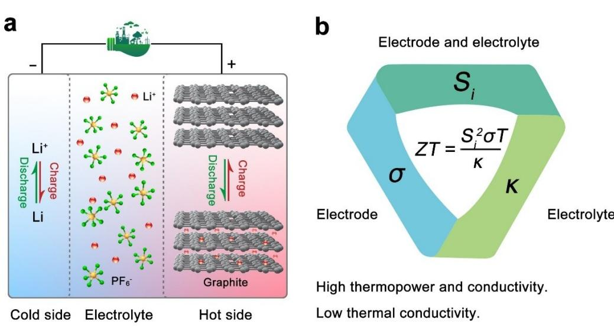
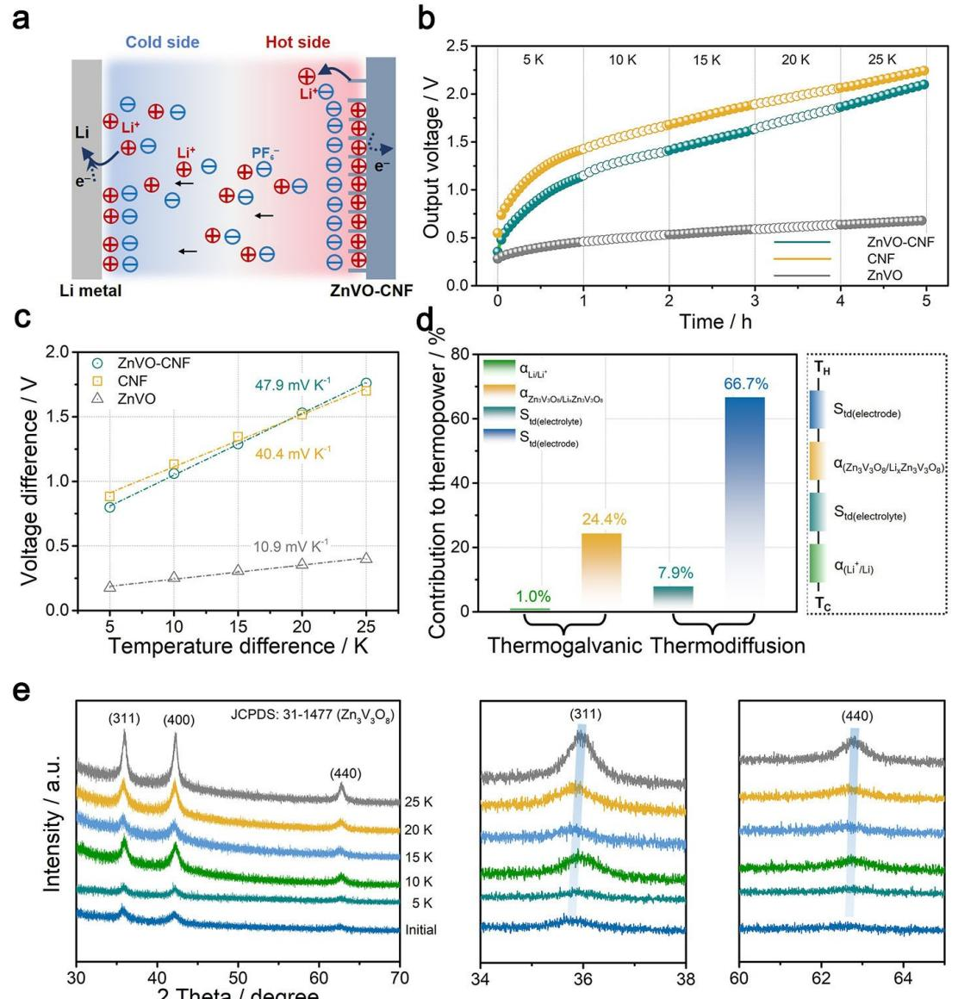
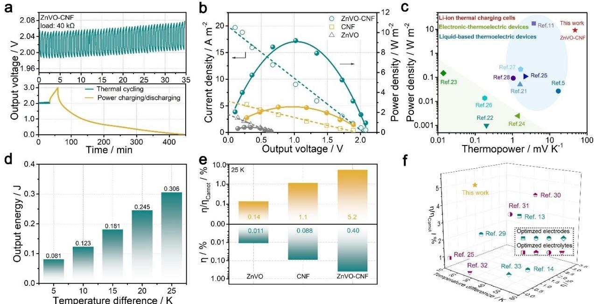
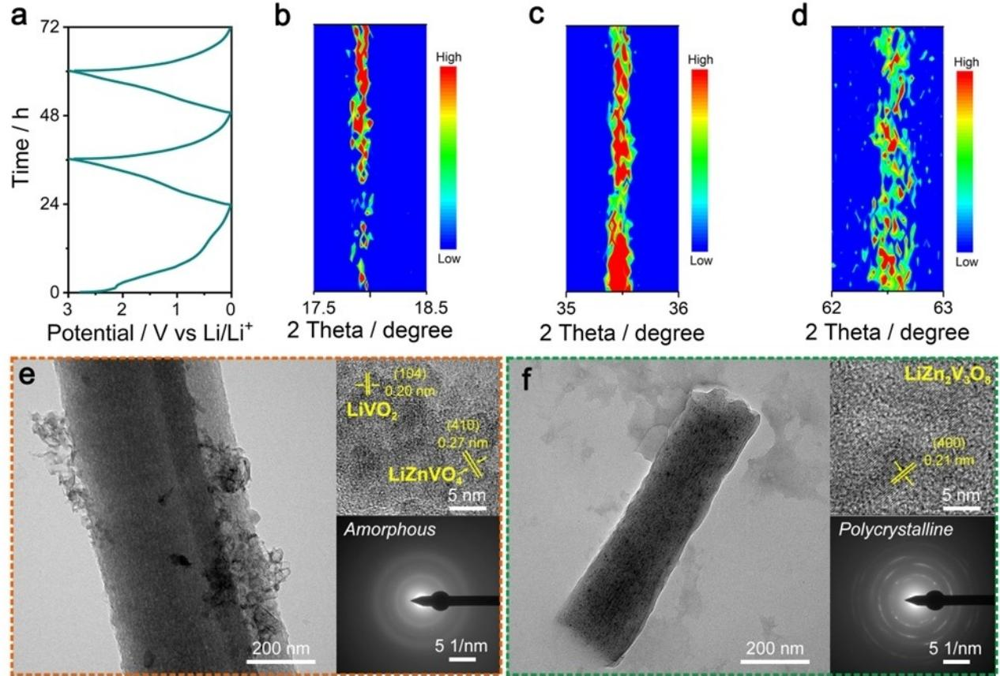
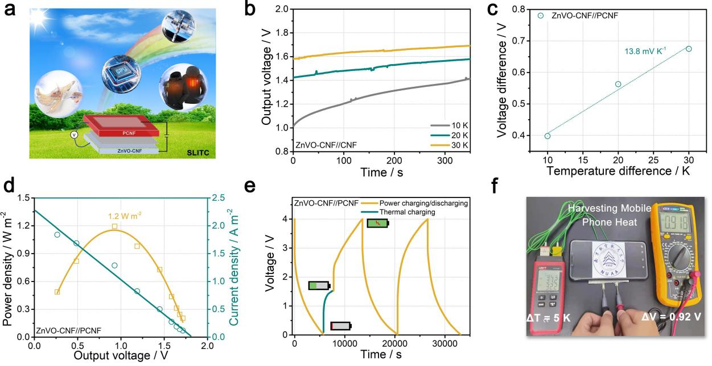

*Very Important Paper*

www.batteries-supercaps.org

# **Lithium-Ion Thermal Charging Cell with Giant Thermopower for Low-Grade Heat Harvesting**

Yinghong Xu+ , [a] Zhiwei Li+ , [a] Langyuan Wu,[a] Hui Dou,[a] and [Xiaogang](http://orcid.org/0000-0003-4464-672X) Zhang\*[a, b]

Liquid-based thermoelectric cells integrate energy harvesting and storage technology, becoming the focus of energy fields. However, the simultaneous implement of high output voltage and heat-to-electricity efficiency is still challenging. Herein, we propose a lithium-ion thermal charging cell using lithium anode and electrospun zinc vanadate@carbon nanofiber cathode. Benefitting from the superior performance of electrode and the significant difference between the size of cation and anion in electrolyte, such system can continuously realize the harvesting

# **Introduction**

Driven by the increasing scarcity of global energy and the emission of greenhouse gases with pollutants, the guidance of energy utilization towards sustainable energy development has taken by economic community.[1–3] Among them, rechargeable batteries with charge power from solar energy, thermal energy have attracted world-wide attention. In particular, the high value-added utilization of low-grade thermal energy (*<*100°C) has emerged as one of important strategies to alleviate the energy crisis due to the ubiquitous feature of low-grade heat in industrial process and environment. However, the devices for harvesting low-grade heat and converting heat into electricity still be confronted with challenges such as complex system, low conversion efficiency and high cost, which has required us to develop new thermoelectric systems to fulfill the requirements from heat to current conversion.[4–6]

Liquid-based thermoelectric cells (LTCs), delivering two different energy storage mechanisms of thermogalvanic effect and thermodiffusion effect, can harvest and convert thermal energy into electricity directly.[7–9] Typically, the output voltage can be generated by the potential difference caused by the temperature gradient between hot side and cold side. For instance, Zhang et al. reported a thermally chargeable supercapacitor based on the thermodiffusion of electrolyte ions, in

| [a] Dr. Y. Xu,+ Dr. Z. Li,+ Dr. L. Wu, Prof. H. Dou, Prof. X. Zhang   |
|-----------------------------------------------------------------------|
| Jiangsu Key Laboratory of Electrochemical Energy Storage Technologies |
| College of Materials Science and Technology                           |
| Nanjing University of Aeronautics and Astronautics                    |
| Nanjing 211106, Jiangsu, China                                        |
| E-mail: azhangxg@nuaa.edu.cn                                          |
| [b] Prof. X. Zhang                                                    |
| Integrated Energy Institute                                           |
| Nanjing University of Aeronautics and Astronautics                    |
| Nanjing 211106, Jiangsu, China                                        |
|                                                                       |

[ +] *These authors contributed equally to this work.* and conversion of low-grade heat into electricity. Consequently, an open-circuit voltage of about 2.1 V can be generated at a low temperature gradient of 25 K together with an ultrahigh thermopower of 47.9 mVK 1 and a remarkable power density of 9.2 Wm 2 . Moreover, an impressive Carnot-related efficiency (5.2%) can be achieved under same conditions. This work confirms the superiority of organic thermoelectric system and provides a new insight to develop promising thermal charging cell for sustainable applications.

which a high output voltage of 32.9 mV at a temperature difference of 45 K can be achieved with 1 mol L 1 KNO3 electrolyte.[10] Unfortunately, the results including obtained voltage and thermopower (Seebeck coefficient) are far away from the demands in our daily life. One of efficient approaches to improve the heat-to-current behaviour is introducing redox couples such as [Fe(CN)6] 3 /4 in typical aqueous electrolyte, which can greatly enhance the output voltage and power density based on the synergistic effect of thermodiffusion and thermogalvanic effect.[5] Introducing the chaotropic/host agents in redox systems can further enhance the thermoelectrochemical performances due to the change of ion concentration. As proposed by Zhou and co-workers, a highly enhanced Seebeck coefficient of ~3.73 mVK 1 can be achieved by the persistent concentration gradient of redox ions from 0.4 mol L 1 K3Fe- (CN)6/K4Fe(CN)6 aqueous electrolyte according to the reversible thermosensitive crystallization and dissolution processes.[11] Although great efforts have been made to realize high-efficient conversion of low-grade heat, the simultaneous achievement of high thermopower and power density in LTCs still are beset with difficulties.[12–15] To address such issues, the development of thermoelectric devices with organic electrolytes based on the synergic effects of diffusion and redox reaction in the harvesting of electricity under a certain temperature gradient emerge as potential candidate.

It is well known that lithium-ion battery (LIB) is one of the important non-aqueous candidates for energy storage applications owing to its inherent merits such as high energy, high power and ultralong cycle life.[16–18] With the development of electrode materials for Li+ storage, various charge storage mechanisms including intercalation/deintercalation and phase transition have been proposed. Graphite, as a typical electrode material of LIBs, can efficiently store charge by the de-/ intercalation of Li+ in the graphite layer. However, the relatively low theoretical capacity (~372 mAhg 1 ) still limits the construction of devices with high volume energy density. The introduction of high-performance metal oxide or metal vana-

Supporting information for this article is available on the WWW under <https://doi.org/10.1002/batt.202200331>

date may be a promising approach to improve the electrochemical behaviors of graphite. It is worth mentioning that the balance between graphite and metallic species shows a great effect on the performance. Inspired by the reversible energy storage process and thermodynamic response of ions, the lithium-ion thermal charging cell (LITC) can be reasonably developed by applying the temperature gradient (Figure 1a). During thermal charge process, the pre-inserted Li+ can be extracted from graphite and plating on the lithium electrode. Moreover, the Li+ stripped from lithium foil also can be intercalated into graphite layers by electrochemical discharge. According to this continuous procedure, low-grade heat can be efficiently converted into electricity based on the thermodiffusion entropy and thermo-extraction entropy. To our knowledge, the figure of merit (*ZT*) is the primary parameter of material or device performance.[19] As shown in Figures 1(b) and S1, the *ZT* is highly dependent on the electrical conductivity (*σ*), thermopower (*Si* ), and thermal conductivity (*ĸ*). Therefore, a high-performance LITC can be realized by employing hybrid electrode with high thermopower and conductivity and electrolyte with low thermal conductivity.

Herein, we have developed an organic LITC according to the design principle of LIB using Zn3V3O8@carbon nanofibers (ZnVO-CNF) electrode and LiPF6 electrolyte. The assembled LITC can harvest energy from environment by thermo-extraction and thermodiffusion of electrolyte ions without external power supply. Accordingly, the proposed system (ZnVO-CNF based LITC) yields an ultrahigh thermopower of 47.9 mVK 1 and impressive power density of 9.2 Wm 2 , which is extremely competitive in reported thermal devices. The results prove that the reasonable combination of porous nanofibers and electroactive species can facilitate the thermodiffusion kinetic of ion and enhance the charge storage behavior. Inspired by the superiority of as-constructed ZnVO-CNF based LITC, a pouch cell assembled with prelithiated ZnVO-CNF anode and PCNF cathode can generate an open-circuit voltage of 0.92 V under an incredibly low temperature gradient of ~5 K formed in the use of mobile phone, which provides new ideas for the development of hybrid energy storage.

# **Results and Discussion**

## **Preparation and characterization of ZnVO-CNF**

The ZnVO-CNF nanofibers was prepared via electrospinning, pre-oxidation and carbonization process. As presented in Figure S2, the binder-free ZnVO-CNF film holds excellent flexibility during rolling and bending, demonstrating its great promise in wearable applications. As investigated by fieldemission scanning electron microscope (FESEM) in Figure S3(a and d), the ZnVO shows large and irregular porous block. In contrast, the CNF (Figure S3b and e) and ZnVO-CNF (Figure S3c and f) deliver the three-dimensional (3D) braiding framework structures, in which ZnVO-CNF has a rough surface. The crystal structures of as-prepared samples were characterized by X-ray diffraction (XRD) technique (Figure S4). As profiled, a broad peak of (002) at 21.1° can be observed in CNF and ZnVO-CNF, which unequivocally indicates the existence of amorphous carbonaceous structure in ZnVO-CNF.[20] For ZnVO and ZnVO-CNF, the diffraction peaks are in good agreement with the typical cubic Zn3V3O8 phase (JCPDS: 31-1477). The thermogravimetric analysis (TGA) further confirms that the content of carbon in ZnVO-CNF is about 40.2 wt% (Figure S5). According to the transmission electron microscopy (TEM) image of ZnVO-CNF (Figure S6a), it is found that numerous Zn3V3O8 nanoparticles with diameter less than 20 nm are embedded in the carbon matrix. Moreover, the lattice spacing of 0.252 nm observed in the HRTEM of ZnVO-CNF can be well assigned to the (311) plane of Zn3V3O8 crystal, suggesting the preparation of ZnVO-CNF composite (Figure S6b). Apart from the homogeneous elemental distribution of C, O, V and Zn within ZnVO-

**Figure 1.** Construction of promising LITCs. a) Schematical illustration of lithium-ion thermal charging cell. b) Key parameters related in heat-to-current conversion.

CNF, the signal distinctions also can be identified *via* the energy dispersive X-ray spectrometry (EDS) mappings (Figure S6c).

## **Thermoelectric properties of LITCs**

To accurately determine the thermally charging performance, a nonisothermal cell with Li foil as anode and ZnVO-CNF as cathode was constructed (Figure 2a). The evolution of output voltage (OCV) under various temperatures difference (Δ*T*) for ZnVO, CNF and ZnVO-CNF based LITCs are depicted in Figure 2(b). The OCV gradually increases and reaches a stable state within 1 h as temperature goes up. Notably, the OCV of CNF and ZnVO-CNF LITCs increase strikingly under Δ*T* of 5 K. This interesting phenomenon can be corresponding to the 3D interconnected network structure of CNF and ZnVO-CNF electrodes with characteristics of high surface area and hierarchical porosity, which benefits for the desorption of ions in electrolyte to generate high output voltage. It is worth mentioning that the capability of ionic chemisorption/desorption of electrode are highly associated with the surface area as well as the electronic/ionic transport kinetics of bulk in electrode. On one hand, the rational large surface area of ZnVO-CNF can provide more active site for chemisorption during electrical discharging. On the other hand, the hierarchically porous carbon matrix is beneficial to shorten the diffusion pathway of ions, leading to high power density. As the heat input increasing, the temperature gradient and output voltage can achieve a series of steady states, where the sluggish

**Figure 2.** Thermally charging behaviour of LITCs. a) Working mechanism of non-isothermal cell during thermal charging process. b) The evolution of output voltage with various temperatures difference. c) The output voltage difference at different temperature gradients. d) Fractional contribution to thermopower of LITC. e) Ex-situ XRD patterns of ZnVO-CNF after thermal charging at different temperature difference.

extraction of ions from the highly ordered crystals dominates process instead of desorption of electrolyte ions. Here, the "thermopower (*Si* )" as a generic term to dictate the competence of LITC to arise thermo-voltage from temperature gradient on the basis of the thermodiffusion effect and the thermoextraction effect. In general, the *Si* value for all samples can be obtained by fitting Δ*V* against Δ*T* at equilibrium states (Figure 2c), which can be expressed by Equation (1):

$$
S_i = \frac{\Delta V}{\Delta T} \tag{1}
$$

Among them, the CNF and ZnVO-CNF LITCs have the similar *Si* of 40.4 and 47.9 mVK 1 , suggesting the decisive role of electrode structure to voltage generation. However, a low thermopower of ~11 mVK 1 can be retained by the pristine ZnVO electrode.

Considering the composition of ZnVO-CNF based LITC, the total thermopower can be written as Equation (2):

$$
\mathsf{S}_i = \alpha_{\mathsf{Li}/\mathsf{Li}^+} + \mathsf{S}_{\mathsf{td}(electrolyte)} + \mathsf{S}_{\mathsf{td}(electrode)} + \alpha_{\mathsf{Zn}_3\mathsf{V}_3\mathsf{O}_8/\mathsf{Li}_\mathsf{x}\mathsf{Zn}_3\mathsf{V}_3\mathsf{O}_8} \tag{2}
$$

where aLi*=*Liþ and aZn3V3O8 *=*Li*x*Zn3V3O8 are the contribution to thermopower from the redox reaction of Li+ +e \$Li and LixZn3V3O8 \$Zn3V3O8+*x*Li+ +*x*e , respectively. *S*td is the thermopower obtained from the thermodiffusion of ions in both electrolyte and electrode. Therefore, we have carried out four cells (Ptj LiPF6 jPt, Lij LiPF6 j Li, ZnVO-CNF j LiPF6 jZnVO-CNF, LixZn3V3O8-CNF j LiPF6 j LixZn3V3O8-CNF) to determine the individual contribution of each effect. As plotted in Figure S9, the thermopower from aLi*=*Liþ , aZn3V3O8*=*LixZn3V3O8 , *S*td(electrolyte) and *S*td- (electrode) are determined to be 0.5 mVK 1 , 11.7 mVK 1 , 3.8 mVK 1 and 31.9 mVK 1 , respectively. Consequently, the corresponding contribution for each part is about 1.0%, 24.4%, 7.9% and 66.7% in total thermopower (Figure 2d).

Moreover, the structural evolution of ZnVO-CNF electrode during the thermal charging process is detected by ex-situ XRD patterns. As shown in Figure 2e, the (311) and (440) planes assigned to the Zn3V3O8 are detected and undergo a shift towards high angle region with the temperature difference increasing, confirming the thermo-extraction process of Li+ from the lattice of prelithiated Zn3V3O8 crystals. Notably, the intensity and position of such two peaks after thermal charging at 5 K are nearly same with the initial state, meaning that the desorption of adsorbed ions on the ZnVO-CNF surface in this period does not impact the electrode structure.

The ion and electronic transport properties of ZnVO-CNF are further studied by the density functional theory (DFT) calculations. Obviously, the adsorption energy of Li+ on ZnVO-CNF is 3.99 eV, which are more negative than ZnVO ( 2.92 eV), implying the boosted Li+ adsorbed capability of ZnVO-CNF (Figure S10a and b). Besides, the electrostatic potential distribution has changed greatly with the integration of CNF and ZnVO, as depicted in Figure S10(c). Specifically, the surrounding charge depletion around Li atom and the excessive charge accumulation of nearby O atoms reflect that the electronegativity of ZnVO-CNF or the adsorption ability to

Based on above analyses, the possible mechanism about

capacitive performance.[46]

ZnVO-CNF based LITC is illustrated in Figure S11. During thermal charging procedure, a thermal-induced voltage is generated by three parts including a temperature-induced capacitance of ZnVO-CNF, thermo-extraction of Li+ from prelithiated ZnVO-CNF and the thermodiffusion of electrolyte ions, while Li anode is almost no contribution to the increase voltage. First, input of heat enhances the desorption of Li+ on the surface of ZnVO-CNF based on the entropy increase (Figure S11a). This rapid surface non-Faradaic process results in an electrochemical potential change of ZnVO-CNF, built up an OCV. Subsequently, the thermo-extraction of Li+ in ZnVO-CNF cathode and the reduction reaction of Li+ in Li anode (plating of Li+) can be triggered, by which the OCV can be further improved (Figure S11b).[8] In this process, the implementation of transfer electrons in open circuit requires the electrons to move on the electrode/electrolyte interface or switch between non-electronic and electronic states in chemical species.

Li+ have been enhanced, which can effectively facilitate the

### **Heat-to-electricity conversion of LITCs**

The stability of thermally rechargeable behavior for assembled ZnVO-CNF LITC was measured by a hybrid mode of load discharging and thermally charging (Figure 3a). Clearly, the average output voltage increases by about 1% after 50 hybrid cycles. It is worth mentioning that the slight increase of the average output voltage is mainly caused by the slight mismatch between thermal charging and load discharging. In fact, the hybrid cycling process is a quasi-continuous working mode, which shows little effect on the performance of the LITC. In a typical run, the thermally charged LITC discharges to a certain voltage within 20 s by connecting an external resistance of 40 kΩ. During this process, the electron flux transfers from the hot part to the cold part by the external circuit, leading to a decrease of internal electrostatic field and output voltage. Meanwhile, the corresponded current can be regarded as a synergistic result of redox couples and ions. Detailly, the contribution could be divided partially as the stripping process of lithium metal (Li e !Li+), thermo-insertion of Li+ in ZnVO-CNF (Zn3V3O8+*x*Li+ +*x*e !Li*x*Zn3V3O8) and the capacitive adsorption of electrolyte ions on ZnVO-CNF surface. And then the voltage recovers back within 20 s under open circuit at the same applied temperature difference. In detail, the diffusion of the Li+ and PF6 resupplies the consumed contents to the electrode, and the potential induced by concentration differences and redox reactions can be reestablished.[5] Meanwhile, the output voltage of LITC can be recovered, empowering to the next discharge cycle. Impressively, after the repeated load discharging/thermally cycling test, the ZnVO-CNF LITC still can be galvanostatically recharged/discharged from thermally charging state (2.05 V) to fully charged state (3.0 V) as well as discharged state (0.01 V), demonstrating the excellent reusability of ZnVO-CNF based LITC in electronics. According to Ohm law of closed circuit (*R*=*U*/*I*), the electric current decreases

**Figure 3.** Heat-to-electricity performance of LITCs. a) The discharging/thermally charging behaviour (green curves) at 25 K and galvanostatic charging/ discharging (orange curve) at 0.1 Ag 1 hybrid modes of ZnVO-CNF LITC. b, c) Power densities under various output voltages and the power density versus thermopower for LITCs with the state-of-art reported devices including TECs (green triangle) and LTCs (blue oval). d) The output energy of ZnVO-CNF under various temperatures difference. e) *η*E and Carnot-related efficiency (*η*E/*η*Carnot) for ZnVO, CNF and ZnVO-CNF. f) Comparison of the *η*E and *η*E/*η*Carnot of ZnVO-CNF with other reported values.

linearly with the increase of inter resistance at a fixed voltage. Notably, as-achieved voltage of CNF based LITC (1.94 V) is much higher than that of ZnVO based LITC (0.66 V). The current densities are 5.8 Am 2 and 3.4 Am 2 for CNF and ZnVO, respectively (Figure 3b). From this, the inter resistance of ZnVO-CNF based LITC is calculated to be 902.2 Ω, while that of ZnVO and CNF are 1726.8 Ω and 2954.8 Ω, respectively (Figure S12). Such significant differences between CNF and ZnVO based devices are mainly caused by their different energy conversion mechanisms. Moreover, the LITCs deliver the parabolic power density-voltage relationships, in which all sample have a crosssectional area of 1.13 cm 2 . The maximum power density of 9.2 Wm 2 can be obtained by ZnVO-CNF based LITC with the Δ*T* of 25 K, higher than that of ZnVO and CNF based LITCs. The output power versus thermopower is presented in Figure 3(c). Besides the ultrahigh thermopower, as-constructed LITCs exhibit superior output power over electronic-thermoelectric devices (TECs) and LTCs.[5,11,21–28]

To investigate the rate performance of as-constructed device, the galvanostatic discharge curves of ZnVO-CNF LITC after being thermally charging to various OCV states with different temperature gradients were recorded. As depicted in Figure S13, the OCV of the discharged ZnVO-CNF LITC can reach 1.10 V under the Δ*T* of 5 K and the corresponding galvanostatic discharge capacity is 148 mAhg 1 with a discharging current density of 0.1 Ag 1 . Notably, the OCV increases to 2.03 V along with increasing ΔT to 25 K, which also enhances the galvanostatic discharge capacity to a high value of 301 mAhg 1 . This significant result can be ascribed to the thermo-extraction of Li+ ions in prelithiated ZnVO-CNF cathode and extracted Li+ ion plating on the surface of Li foil with the existence of temperature gradient. Based on the above discharging curves, we can obtain the corresponding output energy in each temperature difference. As summarized in Figure 3(d), the output energy increases from 0.081 to 0.306 J with the temperature gradient enhanced from 5 to 25 K, suggesting good ability for the conversion of low-grade heat into sustainable electricity.

The conversion efficiency is one of key parameters to evaluate the performance of thermoelectric systems. It should point out that the effective thermal conductivity of LITC is performed by steady-state method used in previous report.[11] As shown in Figure S14, a value of 3.49 Wm 1K 1 can be obtained with a hot temperature of ~323 K. The LITCs obtain different energy conversion efficiency based on the two kinds of methods (Tables S1 and S2), which still is a subject of considerable debate in thermoelectric. Under this case, the *η*E of ZnVO-CNF based LITC reaches up to 0.40%. Besides, an ultrahigh Carnot-related efficiency (*η*E/*η*Carnot) of 5.2% can be achieved for ZnVO-CNF based LITC with a low temperature difference of 25 K (hot side temperature is 323.15 K) (Figure 3e), which has surpassed commercialization threshold of 5.0%. Such superior heat-to-current behavior displayed by LITC can be mainly attributed to the interconnected network, short diffusion pathway, and big size difference between anion and cation (~10 times). It is worth mentioning that such recorded efficiency value is among the highest level of currently existing thermoelectric setups for the conversion of low-grade heat

(Figure 3f).[13,14,25,29–33] In addition, the self-discharging process is conducted by surveying OCV curves after thermal charging with the temperature gradient eliminating (Figure S15). The gradual voltage growth during the self-discharge process with a Δ*T* of 0 K is related to the chemically self-charging behaviors. Differ to the voltage drop in ionic thermoelectric devices using metal electrodes, the voltage of LITC is generated by the synergistic effect of thermoextraction of ions from ZnVO-CNF electrode and themogalvanic effect of Li metal. Thus, asconstructed LITC still can operate for a relatively long-time duration although the thermal conductivity of electrolyte is relatively high.

## **Electrochemical performance of ZnVO-CNF based LIBs**

To evaluate the Li-ion storage performance of free-standing ZnVO-CNF, the electrodes were evaluated in the standard coin cells with the voltage range of 0.01–3.0 V. The cyclic voltammogram (CV) curves of ZnVO-CNF during initial three cycles are presented in Figure S16. During the initial cathodic scan, the board reduction peaks at 0.30 and 0.92 V can be assigned to the formation of SEI film and the intercalation of Li+ into the Zn3V3O8 to form Li Zn V alloy, respectively.[34] Meanwhile, two oxidation peaks around 0.26 V and 1.40 V upon the initial anodic scan can be associated with the reversible reaction between Li+ and Li Zn V alloy. In subsequent cycles, the CV curves display almost overlapping shape, implying the highly electrochemical reversibility of ZnVO-CNF electrode. As depicted in Figure S17(a–c), it can be observed that the initial Coulombic efficiency (ICE) of ZnVO-CNF (67.3%) surpasses CNF (54.4%) and ZnVO (28.2%), further confirming the good reversibility of as-designed ZnVO-CNF electrode. The rate performances of all sample are summarized in Figure S18a. Impressively, the average reversible capacity of ZnVO-CNF is 565.9 mAhg 1 at 0.05 Ag 1 , and can retain a capacity of 255.4 mAhg 1 at the current density up to 10.0 Ag 1 , suggesting a high capacity retention of ~45%. Encouragingly, such values are much higher than that of CNF (19.5%) and ZnVO (15.4%) as well as some previously reported anode of LIBs and LICs (Figure S18b).[35–45] When the current density returns to 0.1 Ag 1 , a high capacity of 570 mAhg 1 equivalent to the initial value still can be recovered, highlighting the excellent reversibility and structural stability. Cycling stability is an important parameter to keep in pace with the requirements for the development of durable energy storage materials. As displayed in Figure S19(a), ZnVO-CNF sustains a capacity retention as high as 72.6% over 1000 cycles, along with a Coulombic efficiency approaching 100%. The TEM and HRTEM images of ZnVO-CNF electrode after cycling test are shown in Figure S19(b). Obviously, the appearance of Zn3V3O8 and LiZn2V3O8 confirmed by their characteristic plane of (222) and (311) respectively can directly demonstrate the satisfying structural stability of ZnVO-CNF.

To our knowledge, CV is a useful approach to study the kinetics of electrode materials by adjusting the scan rates. As shown in Figure S20(b and c), the ZnVO-CNF electrode exhibits

*Batteries & Supercaps* **2023**, *6*, e202200331 (6 of 9) © 2022 Wiley-VCH GmbH

higher current response than the ZnVO electrode at each scan rate from 0.1 to 5.0 mVs 1 , suggesting that the ZnVO-CNF has high energy storage capability. Moreover, the *b* value of ZnVO and ZnVO-CNF can be determined as 0.74 and 0.89, respectively (Figure S21), implying the introduction of porous carbon can not only improve the conductivity of electrode but also enhance the electroactivity of ZnVO nanocrystals in hybrids. As profiled in Figure S22(a and b), about 62.1% of the capacitive contribution (orange region) can be obtained in ZnVO-CNF electrode at a scan rate of 1.0 mVs 1 , higher than that of ZnVO electrode (44.8%) at the same case. Upon the elevation of scan rates to 5.0 mVs 1 , the ratio of capacitive contribution of ZnVO-CNF achieves the highest value of 80.9%, which is still greater than ZnVO (70.6%) (Figure S22c). In addition, the galvanostatic intermittent titration technique (GITT) was employed to analyze the Li+ diffusion coefficient (*D*Li +) of as-developed electrode materials. As shown in Figure S23, a significantly high *D*Li + value ranging from 1×10 9 to 3×10 12 cm2 s 1 can be calculated for ZnVO-CNF, whereas the ZnVO delivers lower diffusion coefficient of 2×10 10–1×10 12 cm2 s 1 (calculation details in Figure S24).

#### **Energy storage mechanism**

The study about Li+ storage mechanism and the phase evolution of electrode is important to develop promising materials for energy conversion and storage. We have performed in-situ XRD and *ex-situ* HRTEM using coin-type cells to detect the structural change of ZnVO-CNF during electrochemical processes. Notably, the signal of LiVO2 (JCPDS: 47– 1182) appears at around 17.9° during the initial lithiation process. As the reaction proceeds, the peak intensity of the LiVO2 increase obviously, suggesting the presence of conversion reaction in the electrochemical reactions of ZnVO-CNF electrode (Figure 4b). In addition, the peaks at around 35.5° and 62.5° can be well indexed to predominant (311) and subordinate (440) plane of Zn3V3O8, respectively, appearing at the initial stage (JCPDS: 31–1477). As the lithiation continuous, the diffraction peaks of (311) and (400) planes both slightly shift toward to low degree regions (Figure 4c and d), indicating the expansion of interlayer spacing of Zn3V3O8 caused by Li+ intercalation. Following the delithation process, the (311) and (400) plane shift reversibly toward high degree regions, corresponding to the Li+ extraction from Zn3V3O8 layers. From HRTEM images, the lattice fringes with spacing of 0.20 and 0.27 nm belonging to (104) plane of LiVO2 and (410) plane of LiZnVO4 can be clearly observed at fully discharged state (Figure 4e). Reversibly, during the subsequent charge process, the lattice spaces of 0.21 nm can be ascribed to (400) plane of LiZn2V3O8 (Figure 4f). Owing to the poor collection efficiency in *in-situ* test device, the diffraction peaks for LiZnVO4 and LiZn2V3O8 are hard to be detected by in-situ XRD.[46,47] In combination with the above results and discussion, the overall charge storage mechanism is dominant intercalation process along with partially reversible conversion reaction, which can be described as follows:

Research Article doi.org/10.1002/batt.202200331

**Figure 4.** Electrochemical mechanism of Li/ZnVO-CNF batteries. a–d) In-situ XRD analysis of ZnVO-CNF at various charged and discharged states. e, f) TEM, HRTEM images and SAED pattern of ZnVO-CNF electrode at discharged state (~0.01 V) and fully charged state (~3.0 V), respectively.

Intercalation reaction:

$$
Zn_3V_3O_8 + xLi^+ + xe^- \leftrightarrow Li_x Zn_3V_3O_8 \tag{3}
$$

First discharge (conversion reaction):

Zn3V3O8 þ 3Liþ þ 3e ! LiZnVO4 þ 2LiVO2 þ 2Zn (4)

Following charge/discharge:

LiZnVO4 þ 2LiVO2 þ Zn \$ LiZn2V3O8 þ 2e þ 2Liþ (5)

## **Thermal charging performance of ZnVO-CNF//PCNF LITCs**

Considering such impressive performance of thermally chargeable Li-ion cells, we constructed a pouch battery (ZnVO-CNF// PCNF) using gel electrolyte to evaluate the heat-to-current signals in practical applications. To our knowledge, the safety of pristine lithium foil is one of key issues restricting the development of lithium-based devices. In this solid-state system, the pre-lithiated ZnVO-CNF is utilized as a promising cation reservoir to replace the typical metallic lithium, which can not only stably supply charge carriers for thermo-extraction

*Batteries & Supercaps* **2023**, *6*, e202200331 (7 of 9) © 2022 Wiley-VCH GmbH

and thermodiffusion, but also improve the safety of as-built devices (Figure 5a). It is worth mentioning that the PCNF electrode is employed as cathode according to the design principles of lithium-ion capacitors. As shown in Figure 5(b), the OCV value of ZnVO-CNF//PCNF still shows a positive correlation with the temperature gradient. Remarkably, a series of OCV value of 1.41 V, 1.58 V, and 1.69 V at applied Δ*T* of 10 K, 20 K, and 30 K can be generated, respectively. Under these results, a thermopower of 13.8 mVK 1 is reasonably achieved (Figure 5c). When comparing to the value (47.9 mVK 1 ) obtained by the Htype cell, such low value is highly caused by the cothermodiffusion of cations and anions in our ultrathin system under same temperature difference. Moreover, a satisfying power density (1.2 Wm 2 ) and short circuit current (2.3 Am 2 ) can be maintained with a Δ*T* of 30 K (Figure 5d).

Apart from the heat-to-current performances, the ZnVO-CNF//PCNF device is one of promising candidates for electricity energy storage with a stable electrochemical window of 0.01– 4.2 V (Figure S25a). As profiled in Figure S25(b), a high discharge capacity of 85.5 mAhg 1 can be recorded at a current density of 0.1 Ag 1 . Encouragingly, almost 34.7 mAhg 1 still can be retained even under a high current density of 10.0 Ag 1 , demonstrating the good rate capability of ZnVO-CNF//PCNF. Significantly, the ZnVO-CNF//PCNF exhibits a maximum energy density of 179 Whkg 1 at the power density of 101.2 Wkg 1 ,

**Figure 5.** Device performance and demonstration of ZnVO-CNF//PCNF. a) Schematic illustration of the ZnVO-CNF//PCNF LITC harvesting heat energy. b, c) Voltage curves and corresponding to the applied temperature difference. d) Current density-voltage curve and the corresponding power density. e) The thermally charging at 30 K or galvanostatic charging and discharging at 0.1 Ag 1 hybrid modes of ZnVO-CNF//PCNF LITC. f) Harvesting heat energy from the mobile phone.

whereas it can remain 53.8 Whkg 1 even at the highest power density of 20.2 kWkg 1 . To our knowledge, this energy/power density outperforms some of previously reported Li-based devices (Figure S25d).[37,43,48–52] In addition, a high capacity retention of 70.3% together with ~100% Coulombic efficiency can be obtained after a long-term test over 3000 cycles with a current density of 1.0 Ag 1 (Figure S26). Figure 5(e) shows the charging/discharging performances at hybrid charging modes. Astonishingly, the introduced thermally charging process has no obvious influence on the subsequent power charging and discharging procedures, which confirms the superior compatibility of as-constructed ZnVO-CNF//PCNF. As a proof-to-concept, we apply the ZnVO-CNF//PCNF device on a cell phone to harvest the escape heat during the use of mobile phone. As demonstrated in Figure 5(f), a temperature difference of 5 K can be formed between PCNF cathode and ZnVO-CNF anode. Under this case, a notable OCV of ~0.92 V can be realized, further suggesting the excellent behavior of ZnVO-CNF//PCNF during low-grade heat recovery with low operation temperature gradient.

# **Conclusion**

In this work, we have successfully proposed a LITC with lithium metal and ZnVO-CNF electrode in a LiPF6 electrolyte, which is firstly designed and applied into LTCs. It is found that the favorable porous nanofibers morphology, open three-dimensional framework endows ZnVO-CNF with the fast kinetic of ions thermo-extraction. As expected, the ZnVO-CNF//Li battery possesses a high reversible discharge capacity (565.9 mAhg 1 at 0.05 Ag 1 ), satisfied rate performance (255.4 mAhg 1 at 10.0 Ag 1 ). The in-situ XRD and ex-situ HRTEM identify the Li+ storage mechanism of ZnVO-CNF that is dominant intercalation process coexisted with slightly reversible conversion reaction. Thanks to such inspired results, Li+ can be thermoextracted from the ZnVO-CNF and thermodiffused to the surface of Li metal along with plating under the existence of temperature gradient, by which the low-grade heat can be converted into renewable electricity. It is worth mentioning that the ZnVO-CNF based LITC can be thermally charged to 2.08 V without any external power supply and deliver a superior thermopower of 47.9 mVK 1 as well as a high conversion efficiency of 0.40%. The practical application of ZnVO-CNF was demonstrated with a pouch cell that generate stable output voltage of 1.69 V under a low temperature gradient. In addition, this is first demonstration from low-grade heat to electricity with organic system. The further fundamental understanding of such LITCs is still in infant stage. Therefore, the development of organic/gel electrolyte and high-performance electrode materials in LITCs will improve the practical applications near room temperature.

# *Acknowledgements*

*Y. X. and Z. L. contributed equally to this work. This work was supported by the Leading Edge Technology of Jiangsu Province (BK20202008, BK20220009), National Natural Science Foundation of China (U1802256, 21773118, 21875107), Postgraduate Research & Practice Innovation Program of Jiangsu Province (KYCX21\_ 0204) and Priority Academic Program Development of Jiangsu Higher Education Institutions (PAPD). We thank Q. Zhu and X.*

*Wang (Nanjing University of Aeronautics and Astronautics) for their help. We thank the Center for Microscopy and Analysis at the Nanjing University of Aeronautics and Astronautics for advanced facilities.*

# *Conflict of Interest*

The authors declare no conflict of interest.

# **Data Availability Statement**

The data that support the findings of this study are openly available in Batteries&Supercaps at https://doi.org/10.1002/ batt.202200xxx, reference number 52.

**Keywords:** lithium-ion thermal charging cell **·** low-grade heat **·** porous nanofibers **·** reaction mechanism **·** thermoelectrochemical performance

- [1] A. Rubino, *Nat. Energy* **2017**, *2*, 17016.
- [2] N. Dean, *Nat. Energy* **2017**, *2*, 17013.
- [3] Z. Li, Y. Xu, L. Wu, Y. An, Y. Sun, T. Meng, H. Dou, Y. Xuan, X. Zhang, *Nat. Commun.* **2022**, *13*, 132.
- [4] J. He, T. M. Tritt, *Science* **2017**, *357*, 1369.
- [5] C. G. Han, X. Qian, Q. Li, B. Deng, Y. Zhu, Z. Han, W. Zhang, W. Wang, S. P. Feng, G. Chen, W. Liu, *Science* **2020**, *368*, [1091–1098](https://doi.org/10.1126/science.aaz5045).
- [6] M. Massetti, F. Jiao, A. J. Ferguson, D. Zhao, K. Wijeratne, A. Würger, J. L. Blackburn, X. Crispin, S. Fabiano, *Chem. Rev.* **2021**, *121*, [12465–12547.](https://doi.org/10.1021/acs.chemrev.1c00218)
- [7] G. Tan, L. D. Zhao, M. G. Kanatzidis, *Chem. Rev.* **2016**, *116*, [12123–12149.](https://doi.org/10.1021/acs.chemrev.6b00255) [8] X. Wang, Y. T. Huang, C. Liu, K. Mu, K. H. Li, S. Wang, Y. Yang, L. Wang,
- C. H. Su, S. P. Feng, *Nat. Commun.* **2019**, *10*, 4151. [9] A. Hartel, M. Janssen, D. Weingarth, V. Presser, R. van Roij, *Energy*
- *Environ. Sci.* **2015**, *8*, 2396–2401.
- [10] D. Chen, Z. Li, J. Jiang, J. Wu, N. Shu, X. Zhang, *J. Power [Sources](https://doi.org/10.1016/j.jpowsour.2020.228263)* **2020**, *465*, [228263](https://doi.org/10.1016/j.jpowsour.2020.228263).
- [11] B. Yu, J. Duan, H. Cong, W. Xie, R. Liu, X. Zhuang, H. Wang, B. Qi, M. Xu, Z. L. Wang, J. Zhou, *Science* **2020**, *370*, [342–346](https://doi.org/10.1126/science.abd6749).
- [12] L. Liang, H. Lv, X. Shi, Z. Liu, G. Chen, Z. Chen, G. Sun, *[Mater.](https://doi.org/10.1039/D1MH00775K) Horiz.* **2021**, *8*, [2750–2760.](https://doi.org/10.1039/D1MH00775K)
- [13] H. Im, T. Kim, H. Song, J. Choi, J. S. Park, R. Ovalle-Robles, H. D. Yang, K. D. Kihm, R. H. Baughman, H. H. Lee, T. J. Kang, Y. H. Kim, *Nat. Commun.* **2016**, *7*, 10600.
- [14] R. Hu, B. A. Cola, N. Haram, J. N. Barisci, S. Lee, S. Stoughton, G. Wallace, C. Too, M. Thomas, A. Gestos, M. E. dela Cruz, J. P. Ferraris, A. A. Zakhidov, R. H. Baughman, *Nano Lett.* **2010**, *10*, [838–846.](https://doi.org/10.1021/nl903267n)
- [15] D. Zhao, H. Wang, Z. U. Khan, J. C. Chen, R. Gabrielsson, M. P. Jonsson, M. Berggren, X. Crispin, *Energy Environ. Sci.* **2016**, *9*, [1450–1457](https://doi.org/10.1039/C6EE00121A).
- [16] H. Li, J. Lang, S. Lei, J. Chen, K. Wang, L. Liu, T. Zhang, W. Liu, X. Yan, *Adv. Funct. Mater.* **2018**, *28*, [1800757](https://doi.org/10.1002/adfm.201800757).
- [17] D. P. Dubal, O. Ayyad, V. Ruiz, P. Gomez-Romero, *[Chem.](https://doi.org/10.1039/C4CS00266K) Soc. Rev.* **2015**, *44*, [1777–1790.](https://doi.org/10.1039/C4CS00266K)
- [18] J. Sung, N. Kim, S. Kim, T. Lee, M. Yoon, J. Cho, *Batteries & Supercaps* **2022**, *7*, e202200136.
- [19] S. Chandra, P. Dutta, K. Biswas, *ACS [Nano](https://doi.org/10.1021/acsnano.1c10584)* **2022**, *16*, 7–14.
- [20] Z. Li, D. Chen, Y. An, C. Chen, L. Wu, Z. Chen, Y. Sun, X. Zhang, *[Energy](https://doi.org/10.1016/j.ensm.2020.01.028) Storage Mater.* **2020**, *28*, [307–314.](https://doi.org/10.1016/j.ensm.2020.01.028)
- [21] Z. Lei, W. Gao, P. Wu, *Joule* **2021**, *5*, [2211–2222.](https://doi.org/10.1016/j.joule.2021.06.003)
- [22] D. Qin, F. Pan, J. Zhou, Z. Xu, Y. Deng, *Nano Energy* **2021**, *89*, [106472.](https://doi.org/10.1016/j.nanoen.2021.106472)
- [23] J. Y. Oh, J. H. Lee, S. W. Han, S. S. Chae, E. J. Bae, Y. H. Kang, W. J. Choi, S. Y. Cho, J.-O. Lee, H. K. Baik, T. I. Lee, *Energy [Environ.](https://doi.org/10.1039/C5EE03813H) Sci.* **2016**, *9*, [1696–1705](https://doi.org/10.1039/C5EE03813H).
- [24] P. Yang, K. Liu, Q. Chen, X. Mo, Y. Zhou, S. Li, G. Feng, J. Zhou, *[Angew.](https://doi.org/10.1002/anie.201606314) Chem. Int. Ed.* **2016**, *55*, [12050–12053](https://doi.org/10.1002/anie.201606314); *Angew. Chem.* **2016**, *128*, [12229–](https://doi.org/10.1002/ange.201606314) [12232](https://doi.org/10.1002/ange.201606314).
- [25] J. Duan, G. Feng, B. Yu, J. Li, M. Chen, P. Yang, J. Feng, K. Liu, J. Zhou, *Nat. Commun.* **2018**, *9*, 5146.
- [26] B. Wu, Y. Guo, C. Hou, Q. Zhang, Y. Li, H. Wang, *Adv. Funct. [Mater.](https://doi.org/10.1002/adfm.201900304)* **2019**, *29*, [1900304.](https://doi.org/10.1002/adfm.201900304)
- [27] L. Liang, H. Lv, X. Shi, Z. Liu, G. Chen, Z. Chen, G. Sun, *[Mater.](https://doi.org/10.1039/D1MH00775K) Horiz.* **2021**, *8*, [2750–2760](https://doi.org/10.1039/D1MH00775K).
- [28] G. Wu, Y. Xue, L. Wang, X. Wang, G. Chen, *J. [Mater.](https://doi.org/10.1039/C7TA11146K) Chem. A* **2018**, *6*, [3376–3380](https://doi.org/10.1039/C7TA11146K).
- [29] M. S. Romano, N. Li, D. Antiohos, J. M. Razal, A. Nattestad, S. Beirne, S. Fang, Y. Chen, R. Jalili, G. G. Wallace, R. Baughman, J. Chen, *Adv. [Mater.](https://doi.org/10.1002/adma.201303295)* **2013**, *25*, [6602–6606.](https://doi.org/10.1002/adma.201303295)
- [30] H. Zhang, F. Zhang, J. Yu, M. Zhou, W. Luo, Y. M. Lee, M. Si, Q. Wang, *Adv. Mater.* **2021**, *33*, [2006234](https://doi.org/10.1002/adma.202006234).
- [31] S.-M. Jung, J. Kwon, J. Lee, K. Shim, D. Park, T. Kim, Y. H. Kim, S. J. Hwang, Y.-T. Kim, *ACS Appl. Energ. Mater.* **2020**, *3*, [6383–6390.](https://doi.org/10.1021/acsaem.0c00586)
- [32] K. Kim, H. Lee, *Phys. Chem. Chem. Phys.* **2018**, *20*, [23433–23440.](https://doi.org/10.1039/C8CP03155J)
- [33] W. Qian, M. Cao, F. Xie, C. Dong, *[Nano-Micro](https://doi.org/10.1007/s40820-016-0082-8) Lett.* **2016**, *8*, 240–246.
- [34] J. He, X. Liu, X. Chen, H. Zheng, C. Feng, *J. Alloys [Compd.](https://doi.org/10.1016/j.jallcom.2017.10.209)* **2018**, *741*, [315–322.](https://doi.org/10.1016/j.jallcom.2017.10.209)
- [35] Z. Wu, G. Liang, J. Wu, W. K. Pang, F. Yang, L. Chen, B. Johannessen, Z. Guo, *Adv. Energy Mater.* **2021**, *11*, [2100185](https://doi.org/10.1002/aenm.202100185).
- [36] P. Wu, X. Xu, Y. Wu, F. Xu, X. Wang, J. Meng, C. Han, X. Liu, Z. Zhu, L. Mai, *Adv. Energy Mater.* **2021**, *11*, [2003612.](https://doi.org/10.1002/aenm.202003612)
- [37] J. Wang, Z. Yan, G. Yan, H. Guo, X. Li, Z. Wang, X. Wang, Z. Yang, *[Energy](https://doi.org/10.1016/j.ensm.2021.03.030) Storage Mater.* **2021**, *38*, [528–534](https://doi.org/10.1016/j.ensm.2021.03.030).
- [38] L. Zhang, Z. Wei, S. Yao, Y. Gao, X. Jin, G. Chen, Z. Shen, F. Du, *[Adv.](https://doi.org/10.1002/adma.202100210) Mater.* **2021**, *33*, [2100210.](https://doi.org/10.1002/adma.202100210)
- [39] J. Wang, Y. Hu, B. Yang, X. Wang, J. Qin, M. Cao, *Nano [Energy](https://doi.org/10.1016/j.nanoen.2021.106053)* **2021**, *87*, [106053.](https://doi.org/10.1016/j.nanoen.2021.106053)
- [40] R. Wang, Q. Zhao, W. Zheng, Z. Ren, X. Hu, J. Li, L. Lu, N. Hu, J. Molenda, X. Liu, C. Xu, *J. Mater. Chem. A* **2019**, *7*, [19909–19921](https://doi.org/10.1039/C9TA06316A).
- [41] X. Wang, S. Zhang, Y. Shan, L. Chen, G. Gao, X. Zhu, B. Cao, X. He, *[Energy](https://doi.org/10.1016/j.ensm.2021.01.027) [Storage](https://doi.org/10.1016/j.ensm.2021.01.027) Mater.* **2021**, *37*, 55–66.
- [42] S. Yang, Y. Zhang, S. Wang, J. Shi, X. Liu, L. Li, *J. [Mater.](https://doi.org/10.1039/C9TA04516C) Chem. A* **2019**, *7*, [23886–23894](https://doi.org/10.1039/C9TA04516C).
- [43] Y. Bian, S. Wang, D. Jin, R. Wang, C. Chen, L. Zhang, *Nano [Energy](https://doi.org/10.1016/j.nanoen.2020.104935)* **2020**, *75*, [104935.](https://doi.org/10.1016/j.nanoen.2020.104935)
- [44] S. H. Lee, C. Huang, P. S. Grant, *Energy [Storage](https://doi.org/10.1016/j.ensm.2021.02.010) Mater.* **2021**, *38*, 70–79.
- [45] T. Li, G. Nam, K. Liu, J. Wang, B. Zhao, Y. Ding, L. Soule, M. Avdeev, Z. Luo, W. Zhang, T. Yuan, P. Jing, M. Kim, Y. Song, M. Liu, *Energy [Environ.](https://doi.org/10.1039/D1EE02664J) Sci.* **2022**, *15*, [254–264](https://doi.org/10.1039/D1EE02664J).
- [46] S. Geng, T. Zhou, M. Jia, X. Shen, P. Gao, S. Tian, P. Zhou, B. Liu, J. Zhou, S. Zhuo, F. Li, *Energy Environ. Sci.* **2021**, *14*, [3184–3193.](https://doi.org/10.1039/D1EE00193K)
- [47] S.-H. Yu, M. J. Zachman, K. Kang, H. Gao, X. Huang, F. J. DiSalvo, J. Park, L. F. Kourkoutis, H. D. Abruna, *Adv. Energy Mater.* **2019**, *9*, [1902773](https://doi.org/10.1002/aenm.201902773).
- [48] G. Li, Z. Yin, H. Guo, Z. Wang, G. Yan, Z. Yang, Y. Liu, X. Ji, J. Wang, *[Adv.](https://doi.org/10.1002/aenm.201802878) Energy Mater.* **2019**, *9*, [1802878.](https://doi.org/10.1002/aenm.201802878)
- [49] P. Chen, W. Zhou, Z. Xiao, S. Li, H. Chen, Y. Wang, Z. Wang, W. Xi, X. Xia, S. Xie, *Energy Storage Mater.* **2020**, *33*, [298–308](https://doi.org/10.1016/j.ensm.2020.08.017).
- [50] L. Shen, H. Lv, S. Chen, P. Kopold, P. A. van Aken, X. Wu, J. Maier, Y. Yu, *Adv. Mater.* **2017**, *29*, [1700142](https://doi.org/10.1002/adma.201700142).
- [51] S. Li, M. Zhang, Z. Feng, Y. Huang, T. Qian, H. Hu, X. Zheng, P. Liu, H. Liu, T. Xing, M. Wu, *Chem. Eng. J.* **2021**, *424*, [130315.](https://doi.org/10.1016/j.cej.2021.130315)
- [52] T. Yuan, S. Luo, L. Soule, J.-H. Wang, Y. Wang, D. Sun, B. Zhao, W. Li, J. Yang, S. Zheng, M. Lin, *Mater. Today* **2020**, *45*, 8–19.

Manuscript received: July 24, 2022

Revised manuscript received: August 28, 2022

Accepted manuscript online: August 29, 2022 Version of record online: September 22, 2022