# **Molecular/Ionic Designs in the Electrolyte and Interphases for Lithium Metal Anode**

Xiangkai Yin,[a, c] Xinyang Li,[b, c] Xiaofeng Cui,[a, c] Limin Liu,[b, c] Xianjun Weng,[b, c] Shujiang Ding,[a, b, c] and [Wei](http://orcid.org/0000-0001-8935-4689) Yu\*[b, c]

The undesirable interactions between the charge carriers (Li+) and various objects in the special microenvironment of batteries would cause uneven lithium (Li) metal deposition behavior, which severely impedes the application of Li metal batteries (LMBs). In recent years, many works focus on optimizing these interactions by functional molecules/ions modification. Nevertheless, related reviews are still absent. Here, this review introduces the regulation methods of Li metal deposition from molecular/ionic designs, which is a new

## **1. Introduction**

High energy density and extended lifespan batteries have become essential with the development of energy storage and electric vehicles.[1–3] Although Li-ion batteries (LIBs) are the most popular battery system, it is still challenging to meet application requirements because of their low theoretical energy density.[4–7] Li metal anodes are regarded as the "Holy Grail" of anodes since they have the lowest redox potential [ 3.040 V vs. standard hydrogen electrode (SHE)] and highest theoretical capacity (3860 mAhg 1 ).[8–10] When combined with lithium transition metal oxide (LMO), sulfur (S), or oxygen (O2) cathode, respectively, LMBs based on the Li metal anode can deliver high specific energy of *>*550, ~2600, and ~3505 Whkg 1 , dramatically increasing the energy density (Figure 1a).[1,8,11–16] Therefore, the Li metal anode is a promising substitute in the next-generation battery system.

In the charging process of the Li metal anode, Li+ will undergo mass transfer first and then reach the anode surface to be reduced by electrons (Figure 1b). However, during the mass transfer process, the undesirable interactions between Li+ and various objects in batteries would result in uneven Li metal deposition, which eventually causes serious thermal runaway.[9,13,18,19] The mass transfer process generally consists of three stages: i) Li+ diffuses in the bulk electrolyte; ii) solvated Li+ sheds its solvation sheath away on SEI; iii) Li+ diffuses through SEI.[20] In step (i), solvated Li+ needs to diffuse through the separator and reach the anode surface. The commercial polypropylene (PP)/polyethylene (PE) separators have heterogeneous pore structures and poor polarity, which will result in uneven Li+ flux. To solve this problem, the lithophilic molecular/ionic layers can be introduced to interact with Li+ at the anode/electrolyte interphase. Uneven Li+ flux can be also

|  | [a] Dr. X. Yin, Dr. X. Cui, Prof. S. Ding                                                  |
|--|--------------------------------------------------------------------------------------------|
|  | School of Future Technology                                                                |
|  | Xi'an Jiaotong University                                                                  |
|  | Xi An Shi, Xi'an 710049, China                                                             |
|  | [b] Dr. X. Li, Dr. L. Liu, Dr. X. Weng, Prof. S. Ding, Prof. W. Yu                         |
|  | School of Chemistry                                                                        |
|  | Xi'an Jiaotong University                                                                  |
|  | Xi An Shi, Xi'an 710049, China                                                             |
|  | E-mail: yuwei2019@mail.xjtu.edu.cn                                                         |
|  | [c] Dr. X. Yin, Dr. X. Li, Dr. X. Cui, Dr. L. Liu, Dr. X. Weng, Prof. S. Ding, Prof. W. Yu |
|  | Engineering Research Center of Energy Storage Materials and Chemistry                      |
|  | Universities of Shaanxi Province                                                           |

*Xi*'*an 710049, China*

perspective including Li+ flux homogenization, the de-solvation process regulation, optimizing the solid electrolyte interphase (SEI) in conventional solvation structure and anion-rich solvation structure. Also, the general design principles are studied in each mechanism and some suggestions are proposed in the prospective future directions, aiming to guide the development of molecular/ionic designs and the actual application of LMBs with high energy densities.

caused by the concentration of the electric field and temperature field on the local protrusion of the Li metal surface (Figure 1c).[21–24] This is a positive feedback process, which accumulates and leads to the formation of more dendrites. Introducing cationic protective layers on the protrusion can shield the local electric field effectively. And the local hot spot can be eliminated by the introduction of molecules with high thermal conductivity. In step (ii), Li+ escapes from the bondage of solvated molecules driven by the electric field force. The desolvation process is considered one of the rate-determining steps in LMBs, especially at low temperatures (Figure 1d).[25–28] The higher binding energy of the Li+-solvent will lead to more sluggish kinetics of the de-solvation process. Therefore, weakening ion-solvent interactions may be an effective approach to reducing the de-solvation barrier.[26] In step (iii), the molecular composition of the SEI layer has an important influence on the Li metal deposition behavior.[3,15,29–31] The SEI generated in traditional carbonate electrolytes is composed primarily of Li2CO3, Li2O, and Li alky carbonate (mosaic model, Figure 1e).[12,15,17,32] These components would not satisfy the demand of homogeneity, rapid ion transport, and mechanical strength (Figure 1f), which are needed to achieve high reversibility of Li metal anode.[29,33–35] Recent studies have shown that many inorganic molecules (LiF, Li3N, Li2S, etc.) can enhance these physical properties of SEI.[36–40] And electrolyte modification or the pretreatment of Li metal surface can form these conducive SEI components uniformly. Based on the above analysis, it is clear that various negative behaviors of molecules/ions result in uneven deposition of Li metal during the charging process, and molecular/ionic regulation can eliminate these issues fundamentally.

Particularly, molecular/ionic designs can efficiently regulate the Li metal deposition behavior with minimal loss of energy density, which is exciting for the development of practical LMBs. There are numerous works on molecular/ionic designs to regulate Li metal deposition behavior and achieve dendritefree growth, involving various objects (inorganic/organic molecules, ions, and Li+ solvation/de-solvation). But to the best of our knowledge, no review has been concluded from this aspect. In this review, the relationship between molecular/ionic designs and Li metal deposition behavior is comprehensively investigated from four aspects, including uniform Li+ flux, desolvation process regulation, optimizing the SEI in conventional solvation structure, and anion-rich solvation structure (Figure 2). Also, the principles, developments, and characteristics of

*Batteries & Supercaps* **2023**, *6*, e202200394 (2 of 25) © 2022 Wiley-VCH GmbH

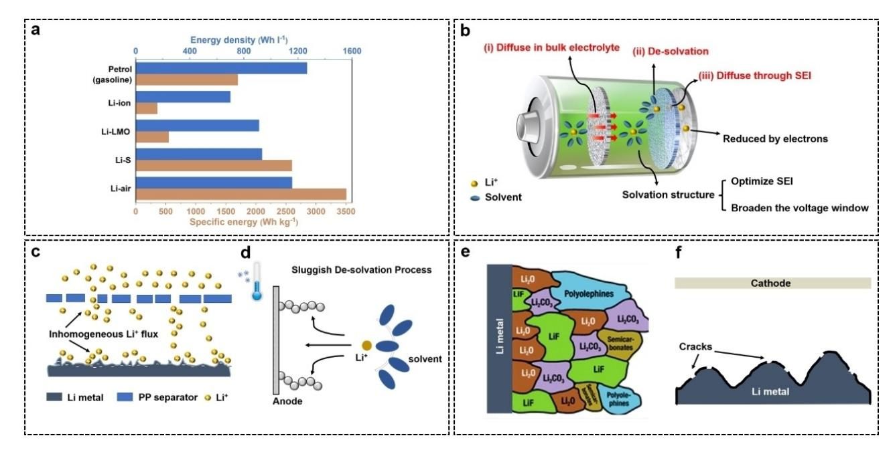

**Figure 1.** a) Specific energy of some rechargeable batteries. b) Electrochemical process existing on the anode during the charging process in LMBs. c) Inhomogeneous Li+ flux caused by the problems in the separators and Li metal. d) The sluggish de-solvation process at low temperatures. e) Mosaic model of SEI layer. Reproduced with permission from Ref. [17]. Copyright (2018) The Royal Society of Chemistry. f) Fragmentation of the fragile SEI during the Li deposition process.

the designs in each mechanism are studied in detail. The field of molecular/ionic designs still has a lot of untapped potential. Therefore, this review will end up proposing some potential development directions, aiming to provide inspiration to develop practical LMBs.

# **2. Uniform Li**+ **Flux**

Due to the disturbance of the non-polar separators and multiphysical fields (such as electric field, temperature field, stress field, etc.) during the mass transfer of Li+, the Li+ flux will be highly inhomogeneous.[23,41–43] This marks the start of uneven Li metal deposition.[23] The regulation of ion flux can directly influence the uniform deposition of Li metal. In addition, the uniform deposition of Li metal brought by the regulation of ion flux can alleviate the structural stress on the surface of Li metal, eliminate SEI fragmentation, and prevent the formation of dendrites along the subsequent diffusion path of Li+. [20,44] This method is more promising since the effect of uniform Li+ flux is sustained over extended cycles and does not reduce with cycling, unlike with certain SEI designs (e.g., additives for promoting SEI formation).[45–47]

In the design of uniform Li+ flux, the most direct method is to guide the Li metal deposition by uniformly distributing lithophilic functional groups at the separator, current collector, Li metal surface, or other sites. In addition, it is feasible to regulate multiphysical fields to homogenize ion flux. In this respect, most advanced molecular/ionic designs are around the electric field and temperature field. It is generally known that the "tip effect" will occur during the Li deposition process, resulting in the concentration of electric field near the tip, where the concentration of Li+ is enriched.[48,49] Numerous research groups implement ionic or molecular protective coatings at the tips, which can shield the strong local electrical field and prevent Li metal deposition at the tips.[48–51] Also, there are local temperature hotspots at these tips. The presence of local hot spots will also result in the concentration of Li+, which promotes the formation of Li dendrites even more.[52–54] By introducing materials with molecular structure that is condu-

Xiangkai Yin is a student at the School of Future Technology, Xi'an Jiaotong University and researching electrodes and electrolytes for Li metal batteries. His current research interests are the designs of electrolytes and electrodes for Li metal batteries in the special operating environment.

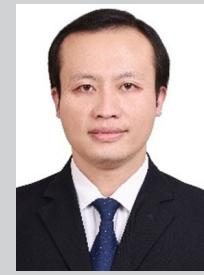

Wei Yu is an assistant professor at the School of Chemistry, Xi'an Jiaotong University. His research involves material preparation and 3D printing manufacturing process of solid-state batteries, Li metal batteries and micro batteries. He received his Ph.D. degree from the State Key Laboratory for Manufacturing Systems Engineering, Xi 'an Jiaotong University in 2019.

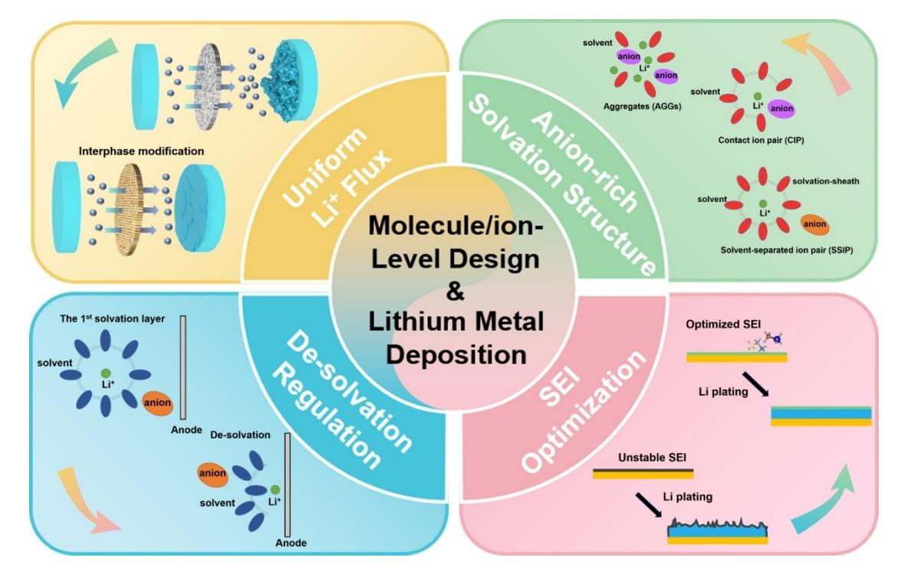

**Figure 2.** Overview of the different regulation mechanisms of molecular/ionic designs in LMBs.

cive to thermal conduction, it is possible to eliminate the local temperature hot spot at the tip.[52,53]

#### **2.1. Uniform Li**+ **flux by lithophilic functional groups**

Lithophilic functional groups are those that could interact with Li+. Lithophilic functional groups generally have atoms with high electronegativity and lone pair electrons, e.g., oxygen (O), nitrogen (N), fluorine (F), sulfur (S), which can interact with Li+ to enhance the rapid supply and uniform transport of Li+, thereby inhibiting the formation of Li dendrites. Placing uniformly distributed lithophilic functional groups on separators, Li metal anodes, or current collectors is the most direct and effective way to regulate the Li+ flux, and numerous designs of polymer and organic molecular groups have emerged in recent years to guide the uniform deposition of Li metal via this mechanism.[46,55–58]

The origin of the lithiophilicity can be explained by the Li bond. Li bond is the bond formed between Li+ and polar functional groups through intermolecular forces, which was first proposed by Shigorin in 1959 and subsequently comprehensively verified in Li batteries by Zhang's group.[59,60] The presence of Li bonds will affect the ion diffusion behavior, especially the transport path, which is related to the uniformity of ion flux and lower concentration polarization. Zhang et al. further revealed the lithiophilicity chemistry of heteroatom doping through density functional theory (DFT) and experiments, pointing out that lithiophilicity is related to electronegativity, local dipole, and charge transfer.[61]

Functional groups containing O and N atoms, such as carbonyl ( C=O) groups, imino ( NH ) groups, and carboxy ( COOH) bonds are typical lithophilic functional groups.[55–58,62–65] Because O atom (3.44) is more electronegative than Li atom (0.98), the interaction between O and Li atoms is very similar to the "Li bond" explained by Lewis acid-base theory.[61] For example, O atoms with an extra pair of electrons in the carboxyl functional group are expected to become electron-rich donors, acting as Lewis bases and strongly absorbing Lewis acidic Li+ through acid-base interaction. The mechanism of interaction between N and Li atoms is similar to that of O and Li atoms. Wu's group created a functional porous bilayer composite separator by simply scraping 2D molecular brushes (i. e., polyacrylamide grafted graphene oxide nanosheets, GO-g-PAM) onto the surface of the PP separator (Figure 3a).[62] The hairy PAM chains on the GO surface with a significant number of polar groups including C=O and N H bonds can offer a high concentration of functional sites for efficient attachment and uniform distribution of Li+. At the molecular level, the GO-g-PAM@PP separator produces a uniform and quick Li+ flux (Figure 3b). Furthermore, electrolyte diffusion is facilitated by the gaps between the 2D molecular brushes that are stacked. Li metal anode with GO-g-PAM@PP separator cycles for more than 1900 h at an ultra-high current density of 20 mAcm 2 and achieves dendrite-free uniform Li deposition at a high current density of 2 mAcm 2 , with high coulomb efficiency (98%) and ultra-long reversible plating/ stripping (over 2600 h). C=O and NH groups are also present in proteins and poly(N-isopropylacrylamide) (PNIPAM) polymer, allowing them to achieve uniform Li+ flux.[57,63] The O atoms in the COOH group are proved to have Li+ affinity,

*Batteries & Supercaps* **2023**, *6*, e202200394 (4 of 25) © 2022 Wiley-VCH GmbH

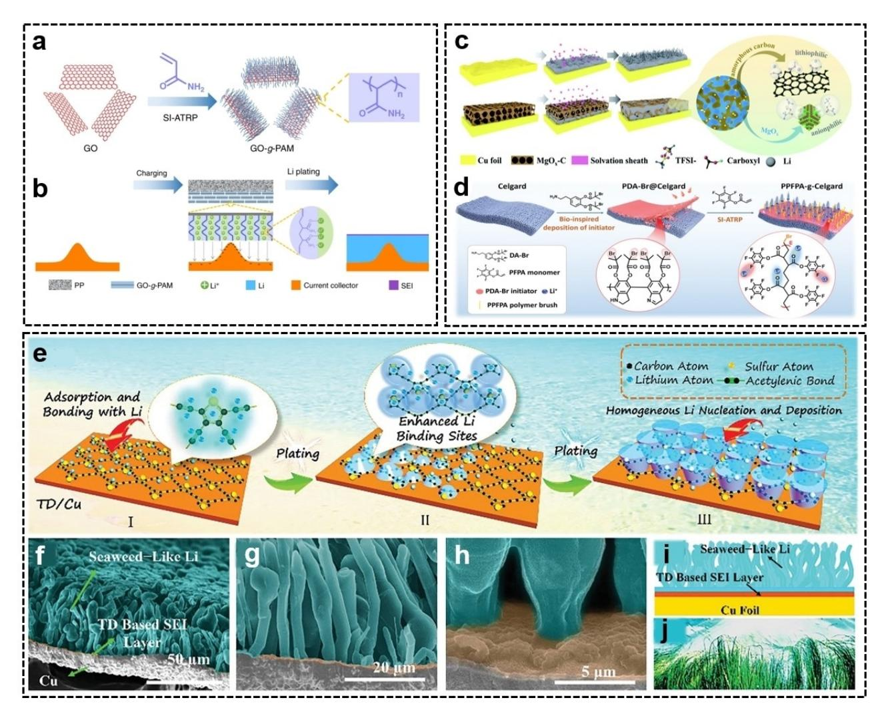

**Figure 3.** a) The synthesis of GO-g-PAM. b) Regulation mechanism of GO-g-PAM@PP separator. Reproduced with permission from Ref. [62]. Copyright (2019) The Author(s), published by Springer Nature. c) Schematic illustration of Li deposition behavior on Cu foil with and without MgO*x*-C coating. Reproduced with permission from Ref. [55]. Copyright (2021) Royal Society of Chemistry. d) The synthesis of the electronegative PPFPA polymer brushes on the separator. Reproduced with permission from Ref. [64]. Copyright (2022) Wiley-VCH. e) Schematic illustration of the Li deposition process. f–h) SEM images of TD-SW-Li cross-section and bottom parts. i) Schematic illustration of TD-SW-Li. j) SW-like Li metal. Reproduced with permission from Ref. [46]. Copyright (2021) Wiley-VCH.

which can facilitate uniform Li+ flux (Figure 3c).[55] Even under a high current density of 15 mAcm 2 , the resulting electrode with the COOH groups exhibited high Coulombic efficiency and low overpotential. In addition, the lithophilic functional groups exhibit varying Li+ adsorption abilities in different chemical conditions. For instance, the binding energy for Li atom and NH group in poly(5,6-indolequinone) is 3.02 eV, but it is 0.043 eV in poly(5,6-dihydroxyindole) calculated by density functional theory (DFT).[58] This result suggests that the adsorption capacity of the NH group in the same structural unit is closely related to the O-based groups.

F substituents have the highest electronegativity (3.98) and have also been shown to offer effective lithophilic sites. Zheng et al. developed electronegative poly(pentafluorophenyl acrylate) (PPFPA) polymer brush-grafted Celgard separator (PPFPA-g-Celgard) to create highly ordered ion transport nanochannels using polydopamine (PDA)-assisted surface-initiated ATRP (SI-ATRP) method (Figure 3d).[64] The most electronegative sites between F and O atoms on the surface of the polar PPFPA polymer chain enhance the electrolyte wettability and Li+ affinity of Celgard separators. It is preferable to achieve rapid and uniform Li+ transport and a low ion concentration gradient, which prevents the growth of Li dendrites. With varied current densities between 0.5 and 6 mAcm 2 , symmetric batteries containing PPFPA-g-Celgard achieved stable Li deposition/stripping. Lij j LiFePO4 batteries with PPFPA-g-Celgard can exhibit a high specific capacity of 150.2 mAhg 1 and maintain 83% capacity after 700 cycles.

S-containing functional groups can also interact with Li+ and have lithophilic properties. The Huang group prepared the thiophdiyne (TD) layer by connecting thiophene units and active acetylene bonds through molecular structure design.[46] And the TD-supported seaweed-like Li (TD-SW-Li) anode is generated directly on the surface of TD/Cu by inducing deposition to enhance the cycle stability of the LMBs (Figure 3e). By attaching the S-containing thiophene functional

group with a large electronegative and lithophilic effect to the alkyne bond, uniform nucleation and growth of Li metal can be achieved on the thiophene surface, and the seaweed-like (SW) Li metal constituted of vertical Li rods can be generated (Figure 3e-g). Theoretical calculations demonstrate that the synergistic effect created by S atoms in thiophene and alkyne bonds increases the interaction between Li+ and the nucleation active site and optimizes the uniform adsorption ability of the entire carbon skeleton region for Li+. Simultaneously, S atoms are employed to regulate the transfer and transport properties of charge at the interphase between Li+ and thiophene to reduce the Li nucleation overpotential, which ultimately results in uniform Li+ flux and induces uniform Li nucleation. The prepared TD-SW-Li has a lower nucleation overpotential and interfacial impedance than the bulk Li metal directly deposited on copper foil and demonstrates superior cycle stability in symmetric batteries. When assembled with TD-SW-Li and Li4Ti5O12, the full battery has a stable capacity retention rate even after 1000 cycles.

Among these functional groups, O/N-containing molecules generally are the most diverse and have the better lithophilic effect. Although the lithophilic functional groups containing F and S atoms have been reported in some literature, Zhang et al. calculated that these two atoms could not satisfactorily provide sufficient interaction with Li atoms, so the lithiophilicity of the two atoms still needs to be further verified.[60,61] Fcontaining molecules are generally costly, which is not conducive to large-scale industrial production. S-containing substances are cheaper, but sulfides can cause pollution to the environment, especially water, which needs further consideration in the application. At present, the majority of research focuses on  $-C=O$  and  $-NH-$ , and the types of functional groups with lithophilic properties are still limited, so there is a broad research space in the future.

#### 2.2. Uniform Li+ flux by multiphysical fields regulation

The Li metal deposition behavior is intrinsically related to multiphysical fields around the anode surface. In recent years, electric field (electron transfer and local electric potential) and temperature field (heat) regulation have been shown to be able to uniform Li+ flux, which includes many molecular/ionic designs. Since the battery is an electrochemical system, the electric field on the anode surface has been studied most extensively. It is well known that protrusion on the surface of the current collectors or Li metal can result in severe accumulation of electric charge ("tip effect"), which strengthens the local electric field there.[48] Therefore, rather than in the smooth area on the anode surface, Li+ prefers to cluster surrounding the tips and participate in the reduction process. This is a positive feedback process, and as it accumulates, more dendrites will grow.[66] To tackle this issue, ion or molecule protective layers are added at the tips to shield the strong electrical field and inhibit deposition.

Zhang's group initially employed electric field shielding to address the "tip effect" problem.[48] They plan to incorporate cations with a lower reduction potential than Li+. During the deposition process, Li+ will be reduced to Li metal, while these cations remain on the surface and are not reduced. This will result in negative feedback. More cations are present in areas with more negative charge, which balances the negative charge and inhibits the Li metal deposition at the tips. However, the reduction potential of Li $+$  ( $-3.040$  V vs. S.H.E.) is already quite low, making it difficult to find cations with a lower reduction potential. This is another design highlight of this work. Instead of focusing on cations with a lower potential, they selected cations with a similar Li+/Li potential: cesium ions (Cs+,  $-3.026$  V vs. S.H.E.). The potential can be diminished by decreasing the applied cation concentration. According to the Nernst equation [Eq. (1)]:

$$E_{\text{Red}} = E_{\text{Red}}^{\phi} - \frac{RT}{zF} \ln \frac{\alpha_{\text{Red}}}{\alpha_{\text{Ox}}}$$
 (1)

where  $E$  refers to reduction potential,  $R$  refers to the universal gas constant,  $T$  refers to the temperature,  $z$  refers to the number of moles of electrons transferred, F refers to the Faraday constant, and  $\alpha$  refers to the chemical activity. The reduction potential of Li $+$  at 1 M is  $-3.040$  V vs. S.H.E., which is higher than that of  $Cs^+$  at 0.05 M (-3.103 V vs. S.H.E.). Therefore, the  $Cs$ + will not be reduced at the reduction potential of Li deposition. In this way,  $Cs^+$  can play a role in electrostatic shielding at the tips and the Li deposition process with almost no dendrite is achieved. In this method,  $Cs^+$  can contribute to electrostatic shielding at the tips and Li can be deposited with nearly no dendrites (Figure 4a and b).

The great majority of cations have a higher reduction potential than Li+, making them simple to co-deposit during electrochemical deposition. For the rational design of the electrostatic shielding layer, it is of utmost importance to investigate how to reduce reduction potential via molecular structure design. The aromatic ring can be employed as a regulating knob to minimize the reduction potential of cationic polymers to accomplish the electrochemical stability of the electrostatic layer, as reported by the Song group.[49] Using a conventional radical polymerization reaction, a cationic polymer with two substituents (ethyl groups and phenyl groups) was produced (PVIB and PBM, Figure 4c). The reduction potential of PBM is  $-3.7$  V vs. S.H.E., while the reduction potential of PVIB is  $-2.9$  V vs. S.H.E. PBM has a lower reduction potential than the majority of known cations. This renders PBM electrochemically stable and resistant to reduction during Li deposition. The authors performed DFT calculations for PVIB and PBM to better understand the link between reduction potential and molecular structure (Figure 4d). The calculation indicates that the addition of phenyl groups alters the electron distribution of the entire molecule in comparison to the addition of ethyl groups. Also, the Hirshfeld charge of  $N^+$  on the PBM monomer (0.058) is observed to be less than that on the PVIB monomer (0.061). It indicates that  $N^+$  on the PBM is difficult to reduce by getting electrons, hence decreasing the PBM's reduction potential and enhancing its electrochemical stability. The authors developed 5.1 Ah pouch cells with

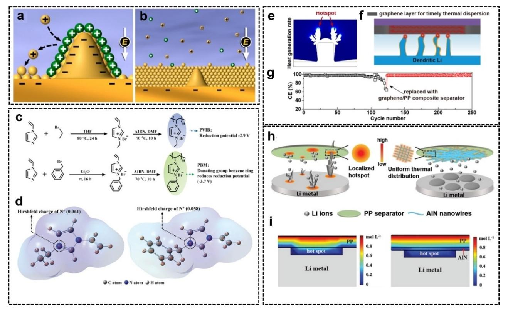

**Figure 4.** a,b) Schematic illustration of Li metal deposition behavior based on the self-healing electrostatic shield mechanism. Reproduced with permission from Ref. [48]. Copyright (2013) American Chemical Society. c) Synthesis routes and molecular structure of PVIB and PBM. d) The optimized structures of PVIB (left) and PBM (right) by DFT. Reproduced with permission from Ref. [49]. Copyright (2022) Wiley-VCH. e) Morphology evolution of Li dendrites under thermodynamic deposition conditions simulated in COMSOL. f) Schematic illustration of reinforced thermal diffusion effect of graphene@PP. g) CEs of Lij jCu cells with PP separator and reassembled with graphene@PP. Reproduced with permission from Ref. [52]. Copyright (2022) Wiley-VCH. h) Schematic illustration of Li metal deposition behavior with PP separator and AlN NW-PP composite separator. i) Finite element simulations of the Li+ concentration distribution. Reproduced with permission from Ref. [67]. Copyright (2022) The Author(s), published by Wiley-VCH.

418.7 Whkg 1 energy density and a steady cycle (0.011% decay/cycle). It has also been demonstrated that supramolecular complexes have modest reduction potentials. The Yang group developed a supramolecular strategy in which alkali metal cations and crown ethers follow the size-matching rules.[50] The positively charged supramolecular complex has a significantly lower reduction potential than the corresponding alkali metal cations, making it a suitable electrostatic shielding layer. In the situation of 200% excess Li, LijNMC811 cells with the crown-ether additives exhibited a high specific capacity of 2.6 mAhcm 2 over 100 cycles.

It is well known that protein molecules can spontaneously adsorb on the surface of inorganic or metallic materials because of the function of the polarity group, and that this adsorption process can be accelerated at the tips by electrostatic interaction and cooperative binding effect.[68] Moreover, proteins are effective insulators that can diminish the intensity of local electric fields. Therefore, protein molecules can serve as effective electrostatic shielding agents. The Wang group discovered that the addition of certain proteins to the electrolyte efficiently prevented and eliminated the formation of Li dendrites.[69] By imitating the biological immune system in nature, protein molecules added to the electrolyte can operate as "self-defense" agents, immediately adsorb to the surface of the Li metal anode, and alter the electric field distribution around the tips to produce uniform plating/stripping of Li metal. The Lij j LTO complete cells are capable of cycling over 2000 times. Zhong's group investigated further the impact of protein structure [poor relief configuration (PRC-Zein) and strong relief configuration (SRC-Zein)] on interphase shielding.[70] They discovered that SRC-Zein had greater electrolyte wettability, ionic conductivity, and Li+ migration number, and was more effective at inhibiting the formation of Li dendrites. This is because corn protein contains more than 50% polar amino acids, and the SRC-Zein can better expose these polar groups to the surface due to its more unfolded structural configuration, thereby enhancing the interaction with the electrolyte and the shielding effect against the concentrated electric field at the tips. Polymer like proteins exhibit effective shielding function. However, there are few related theories, and it's difficult to find similar polymer materials. Additionally, since this type of polymer does not conduct ions, the amount added must be strictly controlled; otherwise, it would separate the electrolyte from the electrode and increase the resistance of the electrodeposition process. It is also necessary to study these polymers' stability and dispersion in electrolytes.

Besides electric field concentration, local temperature hotspots at the tips of Li dendrites can also exacerbate the concentration of Li+ and promote the formation of Li dendrites.[52] The elimination of local temperature hot spots on the anode surface by the use of materials with molecular structures of high thermal conductivity is a new design concept. Initially, it was reported that high thermal conductivity separators and coating materials were advantageous for preventing dendrites, and later the self-thermal repair mechanism of Li was proposed to achieve dendrite-free Li deposition.[67,71-74] All of them imply that temperature and temperature gradient in Li metal anodes are crucial factors. However, there is still a lack of research explaining the detailed mechanism of effect between Li metal anode and temperature and the influence of a single temperature field factor on the uniform deposition of Li metal needs to be assessed further.

Graphene flakes have an exceptionally high thermal conductivity in the range of 3080–5150  $W m^{-1} K^{-1}$  due to their strong covalent bonds between carbon atoms and small carbon atom mass, which leads to a higher phonon speed. Tan's group developed a model of heat transfer and electrochemical deposition and studied the time-dependent power evolution of heat generation and Li+ distribution of the Li deposition system under various deposition currents and overpotentials.[52] The model demonstrates that there are local temperature hot spots on the tips of Li dendrites, and the presence of these local hot spots aggravates the uneven local Li deposition, hence promoting the growth of Li dendrites (Figure 4e). Employing a graphene-coated separator as an in situ thermal dispersion medium to minimize local temperature hot spots will effectively limit dendrite formation and promote uniform dense deposition morphology (Figure 4f). Even after 250 cycles at  $1 \text{ mA cm}^{-2}$ , the Li||Cu cells with composite separator remain at 95%. The composite separator can "recover" the coulomb efficiency of the Li metal anode to 95% after circulating under the standard PP separator (Figure 4g). In addition, Li | NCM811 cells with a composite separator and cathode loading of 30.06 mg  $\text{cm}^{-2}$  attained a stable cycle and high capacity retention.

The high transmission rate of phonons in AIN results in a high thermal conductivity of 320 Wm $-1$ K $-1$ , as predicted by theory. Therefore, AIN can be utilized to eliminate hot spots. The Wu group[67] fabricated a thermal conduction AIN network on a commercial PP separator (AIN NW-PP) using a simple vacuum filtering technique. The network creates a uniform temperature field, which is advantageous for the uniform Li+ flux and Li metal deposition (Figure 4h and i). It can cycle for more than 1000 h at ultra-high current density and surface capacity (80 mA cm $-2$ , 80 mAh cm $-2$ ), which is far greater than the level reported in the literature. Boron nitride (BN) is the most prevalent thermally conductive substance. Consequently, it can also have a positive impact on the uniform Li deposition. The Zhu group successfully stripped BN using sulfated lignin from trees and built a freeze-dried three-dimensional layered porous frame to stabilize the Li metal anode.[54] The stripped BN sheet can efficiently increase the frame's heat conductivity. The more uniform temperature distribution promotes the uniform

deposition and stripping of Li, creates stable SEI, and limits the formation of Li dendrites.

## 3. Regulate the De-solvation Process

When Li+ diffuses from the bulk electrolyte to the electrode/ electrolyte interphase, the de-solvation process will start. Similar to Li-ion batteries, in the de-solvation process of LMBs, Li+ will escape from the solvation structure, pass through the SEI layer, and then reach the anode surface under the influence of the electric field force (Figure 5a).[75] The de-solvated Li+ can only finish the electrochemical deposition process once the desolvation step has been completed. Therefore, a crucial step in the Li metal deposition is the process by which solvated Li+ sheds its solvation sheath on the surface of SEI. In addition, the de-solvation process is crucial to the overall resistance of LMBs and affects the performance of the electrolyte system.[25,76,77]

In general, electrolyte solvents with a high dielectric constant are preferable.[78] The dielectric constant of the solvent has a significant effect on the binding energy between the cation and anion of Li salts, according to the classical rules of physics:[79]

$$U_{cation-anion} = -\frac{1}{4\pi\epsilon} \times \frac{z_{cation}z_{anion}e^2}{r}$$
 (2)

where  $U_{\text{cation}-\text{anion}}$  refers to the binding energy between cations and anions of the Li salts,  $\boldsymbol{\epsilon}$  refers to the dielectric constant of the solvents, r refers to the distance between the ions,  $Z_{cation} \cdot e$ and  $Z_{\text{anion}}$  e refers to the charge on cations and anions, respectively. High dielectric constant solvent molecules can reduce the binding energy between cations and anions and facilitate the dissociation of Li salt. As a result, they can completely dissociate Li salt and have a higher affinity with Li+. For instance, ethylene carbonate (EC), which has a high dielectric constant and can effectively dissociate Li salts, is usually applied as the electrolyte's primary solvent. However, solvents with a high dielectric constant will also increase the binding energy between the cation and the solvent, inhibiting de-solvation kinetics.[26] And in a low-temperature environment, the de-solvation process is considered to be the most sluggish kinetic step.[75,80-83] The higher binding energy between the Li+ -solvent will result in a more difficult de-solvation process, resulting in the formation of Li filaments and dendrites as well as the poor electrochemical performance at low temperatures (Figure 5b and c).[26,78,80] Consequently, solvents with a high dielectric constant are unsuitable for low-temperature cells, and weakening ion-solvent interactions by molecular/ionic designs is an effective method for accelerating the de-solvation process. Nonetheless, it should be noted that reducing the binding force between the solvent and Li+ will also decrease the ionic conductivity and anti-oxidative stability of the electrolyte.[81] Therefore, it is also vital to balance this contradiction in practical design.

Introducing electron-absorbing functional groups on solvent molecules can effectively reduce the binding energy

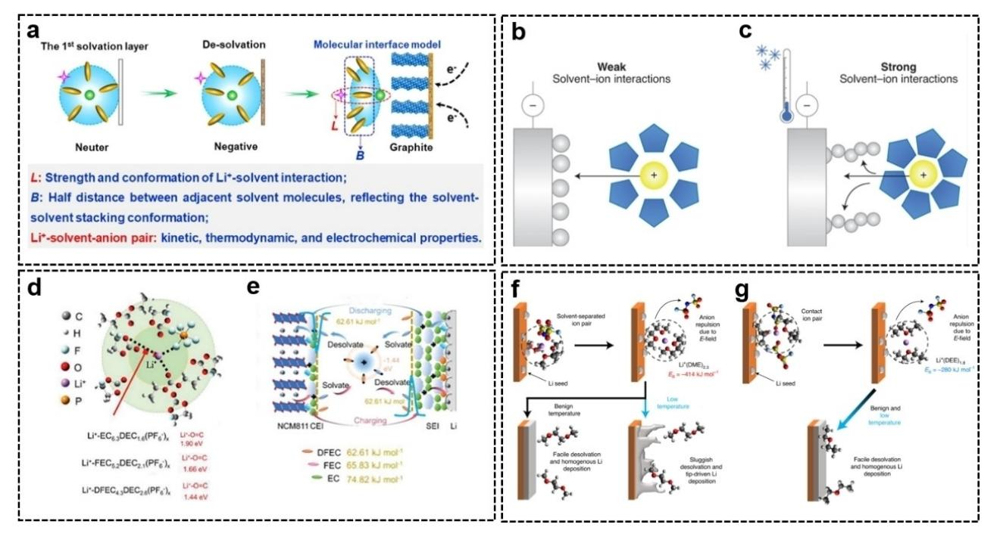

**Figure 5.** a) Schematic illustration of the de-solvation process. Reproduced with permission from Ref. [75]. Copyright (2022) American Chemical Society. Desolvation and Li metal deposition behavior with b) the weak interaction and c) the strong interaction between the solvent and Li+ at low temperatures. Reproduced with permission from Ref. [26]. Copyright (2021) The Author(s), under exclusive licence to Springer Nature Limited. Schematic illustration of d) the solvation structure in 1 M LiPF6-DFEC/DEC electrolytes and e) the solvation process and different de-solvation barriers. Reproduced with permission from Ref. [83]. Copyright (2021) Wiley-VCH. De-solvation mechanism and Li+/solvent binding energy in f) 1M LiFSI-DOL/DME and g) 1M LiFSI-DEE. Reproduced with permission from Ref. [25]. Copyright (2021) The Author(s), under exclusive licence to Springer Nature Limited.

between solvent molecules and Li+ and accelerate the desolvation process, hence regulating the behavior of Li metal deposition. Highly electronegative F atoms have the ability to absorb electrons. Therefore, the introduction of F atoms into the solvent can effectively lower the de-solvation barrier. Fluorinated ethyl acetate is a typical example.[81] The Xia group developed a novel ethyl trifluoroacetate (ETFA) electrolyte for low-temperature batteries.[82] Benefiting from the low polarity and high electronegativity brought by F atoms, the binding energy between ETFA and Li+ ( 10.06 kJmol 1 ) is less than that between DMC ( 19.07 kJmol 1 ) and EC ( 21.56 kJmol 1 ), allowing Li+ to be rapidly de-solvated in ETFA electrolyte. Lij j LTO batteries using ETFA electrolyte can retain 154 mAhg 1 at 50°C and 78 mAhg 1 at 70°C, respectively. To address the problem of strong binding energy between EC solvent and Li+, which results in poor de-solvation capacity at low temperatures, the Li group studied the effect of EC molecules with varying degrees of fluorination on the Li+ de-solvation process.[83] As the fluorination level raised, the Li+-dipole interaction strength steadily decreased (Figure 5d). This is because the substitution of F atoms reduced the overall dipole moment of EC molecules, hence decreasing the Li+-dipole interaction and de-solvation barriers (Figure 5e). At 20°C, the de-solvation rate of Li+ with difluoroethylene carbonate (DFEC) electrolyte increased sixfold. At 30°C, Lij jNCM811 batteries retained 45% of their capacity at room temperature.

Although fluorinated ester solvents can reduce the binding energy between Li+ and solvent to some degree, they cannot enable LMBs to function below 30°C.[28] Therefore, it is required to discover a novel method for decreasing the binding energy between Li+ and solvent. The introduction of highly fluorinated non-polar solvents has also been shown to reduce the Li+ de-solvation barrier. The Wang group dissolved the fluorinated electrolyte in a strongly fluorinated non-polar solvent, which decreased the interaction between Li+ and the solvent and accelerated the de-solvation process.[78] It can be utilized at temperatures ranging from 95 to +70°C. The binding energy between Li+ and solvent is decreased by the synergistic effect of the weak solvation ability of the fluorinated electrolyte LiFSI-FEC/FEMC and the highly fluorinated non-polar solvent. Even when cycled at 85°C, the Lij jNCA batteries can retain 50% of their room-temperature capacity.

The principle of decreasing the binding energy between Li+ and solvent to facilitate the de-solvation process is also mirrored in low-temperature LMBs based on ether solvents.[25,84] The Liu group discovered that although diethyl ether (DEE) electrolyte has a lower ionic conductivity than DOL/DME electrolyte, DEE electrolyte exhibited a higher CE and superior cycle capacity and lifetime at low temperatures.[25] It demonstrates that the de-solvation process may be more significant than conductivity in determining battery performance at low temperatures. The binding energies of Li(DEE)1.8 and Li(DME)2.3 complexes are 280 and 414 kJmol 1 , respectively, according to quantum chemistry simulations. Therefore, the DEE electrolyte enables Li+ to undergo a faster de-solvation process (Figure 5f and g). Lij j SPAN cells with high-loading sulfurized

polyacrylonitrile (SPAN) cathode of 3.5 mAhcm 2 retained 84% and 76% of their capacity at room temperature after 50 cycles at 40 and 60°C, respectively. Similarly, the Tao group developed a novel low-temperature electrolyte based on dimethoxymethane (DMM) for LMBs.[84] The results of density functional theory (DFT) calculations indicate that DMM solvent molecules have low de-solvation energy and a tendency to generate an inorganic-rich SEI on the Li metal anode. The experimental results demonstrate that more uniform and dense Li metal deposition can be detected in the DMM electrolyte and Lij jCu cells at temperatures ranging from room temperature to 40°C exhibit high levels of reversible Li plating/ stripping behavior. In addition, the Lij j SPAN battery demonstrated excellent performance at low temperatures, with a capacity retention rate of 63.8% after 120 cycles at 40°C.

## **4. Optimize the SEI in Conventional Solvation Structure**

When the Li metal anode comes into contact with the organic electrolyte, SEI will spontaneously form because of the thermodynamic instability of Li metal. SEI is an electronic insulator with a multilayer structure that can inhibit the further reaction between the Li metal anode and electrolyte, hence extending the lifespan of LMBs.[85] According to the mosaic model and XPS data, SEI is made up of the outer organic Li salts layer and the inner inorganic Li salts layer.[12,86,87] The following equations illustrate the reactions involved in SEI generation in common electrolytic liquid systems:[88]

$$\text{LiPF}_6 \rightleftharpoons \text{LiF} + \text{PF}_5 \tag{3}$$

LiPF6 þ H2O!LiFþPOF3þ2HF (4)

$$PC+2e^-+2Li^+\rightarrow Li_2CO_3 + CH_3CH=CH_2$$
 (5)

2PCþ2e þ2Li!CH3CHðOCO2LiÞCH2OCO2LiþCH3CH¼CH2 (6)

2ECþ2e þ2Li!ðCH2OCO2LiÞ2 þ CH2¼ CH2 (7)

DOLþ2e þ2Liþ!LiOCH2OLiþCH2¼ CH2 (8)

$$LiOCH2OLi+e-+2Li+\rightarrow Li2O+CH2OLi$$
 (9)

The native SEI is composed primarily of Li2CO3, Li2O and Li alky carbonate, which has poor mechanical strength.[34] As a result, the SEI will be continually broken and regrown in response to the volume change of the Li metal anode during cycling, following the formation of dendrites.[88] The mosaic model of the SEI structure indicates the molecular composition of the SEI layer is not homogeneous.[12] According to the Chazalviel Model, the current density at which the transition between mossy and dendritic Li growth occurs is:[89]

$$J_{\text{lim}} = 2zc_0FD(t_aL)^{-1}$$
 (10)

where *J*lim refers to the limiting current density, *z* refers to the charge number of Li+ (z=1), c0 refers to the Li salt concentration, *F* refers to the Faraday's constant, *D* refers to the apparent diffusion coefficient, ta refers to the transference numbers of anions and *L* refers to the distance between the two electrodes. Due to the inhomogeneity of SEI, the local current density is excessively high (over *J*lim), resulting in the formation of Li dendrites. In addition, the SEI layer lacks sufficient molecules capable of conducting ions. Based on the root growth mechanism of Li dendrites, the Li metal will only grow vertically as opposed to horizontally and form Li dendrites because of the low ion diffusion capacity of SEI.[90] Therefore, the initial SEI contains numerous defects, and it is important to modify its molecular composition to optimize SEI layers that are conducive to Li metal deposition.

The physical and chemical properties required for an ideal SEI can drive the optimization of molecular composition in the SEI layer. It has been observed that the growth of Li dendrites can be successfully inhibited if Young's modulus of the SEI layer is more than 10 GPa (about twice that of Li metal).[15,91] In addition, the SEI layer must possess both electronic insulation and ionic conductivity to ensure Li deposition behind the interphase layer. The inorganic components of SEI have a significant effect on ionic conductivity, electronic insulation, and mechanical strength. Lithium fluoride (LiF) is one of the most desirable inorganic SEI components due to its low solubility, high surface energy (73.28 meVÅ 2 ), wide electrochemical stability window (0–6.4 V), outstanding electrical insulation, and great mechanical strength (70 GPa shear modulus). Since Archer's group added LiF to the liquid electrolyte to increase the cycle lifespan of LMBs, it has become commonly employed in the Li metal anode interphase.[92] Other inorganic components (Li3N, Li2O, Li2S, Li3PO4, LiCl, etc.) were found to be efficient in controlling the Li metal deposition behavior. And Li alloy can lower nucleation overpotential and increase cycle lifetime by generating Li intermetallic compounds or solid solutions.[93] In addition, SEI should be more elastic and accommodating to an infinite Li anode volume expansion. The organic constituents of the SEI layer are very important for flexibility and resilience. And certain functional groups can react with Li metal to generate these organic constituents that are less brittle.[94–96]

Based on the SEI optimization mechanism, numerous molecular/ionic designs are implemented to regulate Li metal deposition behavior. Forming efficient SEI components through chemical/electrochemical reactions between molecules/ions and Li metal is the most direct method. In this method, the modification can be introduced in electrolyte formulation (such as the solvent, Li salt, and additions), the positions of the current collector, the anode interphase, and so on. Another approach is to create effective SEI components by inducing selective decomposition of original electrolyte components. The molecules/ions used in this method only interact with certain electrolyte components and they do not take part in chemical/electrochemical interactions.

*Batteries & Supercaps* **2023**, *6*, e202200394 (10 of 25) © 2022 Wiley-VCH GmbH

#### **4.1. Optimize the SEI by chemical/electrochemical reactions**

Forming effective SEI components via chemical/electrochemical reactions is the most prevalent way of regulating the Li metal deposition behavior. Molecular/ionic design has numerous applications in this field. Li metal can react with the vast majority of molecules/ions, hence providing potential for the construction of artificial SEI. In general, the molecules/ions that easily decompose into efficient SEI components can be employed to regulate the Li metal deposition behavior. Furthermore, the lowest unoccupied molecular orbital (LUMO) energy is a crucial component of frontier orbital theory and an important criterion for assessing the reduction ability of molecules/ions. The molecules/ions with a lower LUMO energy are more likely to receive electrons and react chemically/ electrochemically with Li metal.

Among the designs for optimizing the SEI, producing LiFrich SEI is the most comprehensive and has achieved outstanding results due to the above-mentioned benefits of LiF. And in recent years, fluorinated electrolytes initiated a boom in research represented by a series of fluorinated developed by Cui's group.[83,97–107] Compared to the production of LiF-rich SEI, relatively little research has been conducted on the formation of Li3N, Li2S, and B/Cl/P-containing SEI. For forming LiF-rich SEI, the design of molecules containing F atom has a significant effect. This section demonstrates how molecular/ionic designs can optimize SEI composition via chemical/electrochemical processes by focusing mostly on the LiF-forming strategy.

LiF can be created when F-containing substances are added to solvents, Li salts, additives, and the anode/electrolyte interphase. The solvent is the electrolyte's primary constituent. Compared to anion and free solvent, solvation-involved solvent molecules are more likely to decompose on the surface of the Li metal anode. Hence, the solvent dictates the predominant composition of SEI.[20] Consequently, fluorinated solvent molecules can be easily decomposed into LiF-rich SEI components. Traditional ether solvents are more compatible with Li metal anodes, resulting in superior cycle performance. However, compared to ester solvents, ether solvents have a small electrochemical window, and oxidation reactions generally occur above 4 V, making it challenging to match high-voltage cathodes. Excitingly, fluorinated ether solvents can create more advantageous SEI components and improve the high antioxidation stability, therefore it is expected that this will facilitate the practical application of Li metal batteries. The alkyl chain is extended to create 1,4-dimethoxylbutane (DMB) from commercial 1,2-dimethoxyethane (DME), and then the middle portion of the DMB backbone is fluorinated to create fluorinated 1,4-dimethoxylbutane (FDMB) (Figure 6a).[97] FDMB is stable towards Li metal and under high voltage, so it may be the suitable electrolyte for LMBs. With 1 M LiFSI/FDMB electrolyte, 50 μm-thick Lij jNMC batteries retain 90% capacity after 420 cycles between 3.0 and 4.2 V, with an average coulomb efficiency of 99.98%. The energy density of the industrial anode-free pouch battery is 325 Whkg 1 , and after 100 cycles, 80% of its capacity is retained. The Cheng group employed molecular dynamics simulation to calculate the SEI products and structures since the precise structure and reaction mechanism of SEI generation in this unique electrolyte remain unclear (Figure 6b).[102] They discovered that FDMB solvent molecules rapidly decompose in the presence of Li metal, releasing a large number of LiF and unsaturated carbon chain fragments. The HAIR package is utilized to accelerate the molecular dynamics simulation and realize the long-time simulation. It was found that the unsaturated chains generated by FDMB dissociation polymerize gradually to form the organic component of SEI, with N and S radicals from the FSI anion accelerating the reaction (Figure 6c).

Commercial ester solvents applied to LIBs have excellent high-voltage stability and can produce strong SEI with graphite anode. However, it has been discovered that the compatibility between the ester solvent and the Li metal anode is poor, resulting in a low coulombic efficiency. The fluorination of ester solvents can facilitate the production of LiF-rich SEI and enhance the electrochemical performance of the Li metal anode. Cheng's group reported a high-voltage resistant electrolyte (1 M LiPF6-FEC/BTC) synthesized using fluoroethylene carbonate (FEC) and bis(2,2,2-trifluoroethyl) carbonate (BTC) by fluorinated commercial solvents EC and DEC under the guidance of a theoretical calculation (Figure 6d).[103] These designed solvents contain low LUMO, allowing them to be reduced preferentially at the Li metal anode (Figure 6e). And the formation of LiF-rich SEI inhibits the growth of Li dendrites. Moreover, fluorination decreases the highest occupied molecular orbital (HOMO) energy level, hence enhancing the ultrahigh-voltage stability of electrolytes. Therefore, Lij j LiNi0.8Co0.1Mn0.1O2 (NCM811) cells can operate continuously from 30 to 70°C and retain 85.7% of their capacity after 100 cycles at a high cut-off voltage of 4.8 V.

In addition to the solvent, Li salt is another major component that has a significant impact on the composition of SEI. Anions in common Li salts (such as LiPF6, LiFSI, and LiTFSI) typically contain F atoms, but it is important to note that the decomposition activities of different anions are extremely different. The decomposition activity must be appropriate. Excessive decomposition activity may result in the formation of a thick LiF-rich SEI layer and the consumption of a substantial quantity of Li salts utilized for ion transport, both of which deteriorate the electrochemical performance of the Li metal anode. For example, LiFSI produces more LiF components in the SEI layer than LiTFSI because the S F bond is more unstable than the C F bond, which results in electrolyte and Li metal consumption and poor performance (Figure 7a).[108] The thick insulating electrolyte decomposition layer created by LiFSI decomposition not only results in the electrochemical inactivation of a part of Li metal but also in an uneven ion flux on the surface of Li metal. The double salts system is an excellent choice for retaining the appropriate Li salts' decomposition activity.[1,109–111] For example, it was previously reported that by adding 4.6 M LiFSI and 2.3 M LiTFSI to the DME, the slow reaction of TFSI can slow down the reduction decomposition of FSI by obtaining electrons from Li metal and replacing some FSI molecules on the anode surface.[112] Furthermore, Li salts and solvents can produce LiF-rich SEI through synergistic Review doi.org/10.1002/batt.202200394

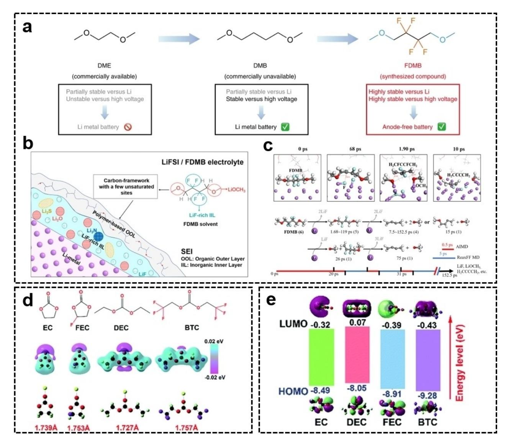

**Figure 6.** Molecular design of fluorinated solvent. a) Design scheme and molecular structures of FDMB. Reproduced with permission from Ref. [97]. Copyright (2020) The Author(s), under exclusive licence to Springer Nature Limited. b) The composition of the SEI and c) decomposition mechanisms of FDMB in LiFSI/ FDMB electrolyte. Reproduced with permission from Ref. [102]. Copyright (2022) American Chemical Society. d) Molecular structures, corresponding charge distributions of the solvents calculated by the electrostatic potential (ESP), and optimized structures of Li+ with different solvents. e) The LUMO and HOMO energies of the solvents were calculated by DFT. Reproduced with permission from Ref. [103]. Copyright (2022) The Royal Society of Chemistry.

effects. Lithium difluoro(oxalate)borate (LiDFOB), a new lithium borate salt, has good thermal stability and excellent ionic conductivity in a wide temperature region and it also can promote the formation of LiF-rich SEI.[113] Lij j SPAN cells with an electrolyte formulation of 1.0 M LiDFOB-EC/DMC/FEC had an initial capacity of 1400 mAhg 1 , and their capacity retention after 1100 cycles at 1.0 C was 89%. At the same time, the dendrite-free Li anode morphology was observed.[114] The enhanced performance is the result of LiDFOB and FEC's ability to build a unique SEI that enables uniform Li plating/stripping.

It is a simple and effective way to form LiF-rich SEI by introducing additives with easily reduced and decomposed molecular structures. The additive most widely used in this method is fluoroethylene carbonate (FEC).[119] When injected into the standard LiPF6-EC/DEC electrolyte, the FEC additive has a lower level of LUMO ( 0.87 eV) than the solvent molecule (EC: 0.33 eV, DEC: 0 eV), and the C F bond breaks at around 310 fs, indicating that FEC can preferentially decomposes and generates LiF-rich SEI (Figure 7b).[115] In addition to FEC, many fluoride compounds, such as tris(2,2,2-triflfluoroethyl)borate (TTFEB),[120] 2-fluoropyridine,[121] tris(4-fluorophenyl)phosphine (TFPP),[33] (CH3)3Si-N[(FSO2)(n-C4F9SO2)] (TMS-FNFSI),[122] N,N-diethyl-2,3,3,3-tetrafluoropropionamide (DETFP),[123] also have similar effects. The molecular design of additives is important. To increase the number of F atoms, the Zhang group[116] chose the all-fluorinated segment (CF2)*n* chain with a high F mass ratio of 76% as the F source for the fluorinated SEI. The C F bond needs to be activated because the conventional C F bond on the all-fluorinated chain is very stable due to its high binding energy (*>*400 kJmol 1 ) and short bond length (~1.4 Å). Direct C F cleavage is difficult by single-electron transfer reaction at the Li metal anode. However, the C F bond

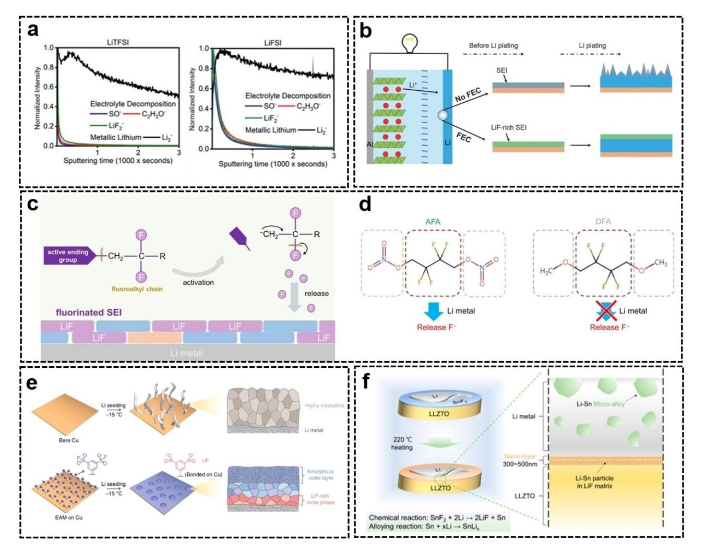

Figure 7. a) Depth profiles for the deposited Li metal in the Ni||Li5S cells with LiTFSI and LiFSI salts by time-of-flight secondary ion mass spectrometry (ToF-SIMS) and SO-, LiF2- and C2H3O- secondary ions correspond to Li2SxOw, LiF and ROLi, respectively. Reproduced with permission from Ref. [108]. Copyright (2021) Wiley-VCH. b) Scheme of the LiF-rich SEI by FEC additives. Reproduced with permission from Ref. [115]. Copyright (2017) Wiley-VCH. c) Schematic illustration of the molecular design of fluorinated molecule. d) Molecular design with active nitrate ending group and inert methoxyl on the side of fluorocarbon segment. Reproduced with permission from Ref. [116]. Copyright (2022) Wiley-VCH. e) Stable SEI is regulated by a self-assembled monolayer of 1,3-benzenedisulfonyl fluoride on Cu. Reproduced with permission from Ref. [117]. Copyright (2020) The Author(s), under exclusive licence to Springer Nature Limited. f) Alloy-type coating by replacement reaction. Reproduced with permission from Ref. [118]. Copyright (2022) American Chemical Society.

can be activated by the  $\beta$ -elimination reaction when there is an active terminal group attached to the  $\beta$ -site. When the active terminal group is attached to the  $\beta\mbox{-site}$  of the C–F bond, the degradation of fluorinated molecules starts from the  $\beta$ substituent to form free radicals or carbon anion intermediates, which further induce the removal of F atoms (Figure 7c). Finally, they designed an activated fluoroalkyl molecule, 2,2,3,3-tetraflurobutane-1,4-diol dinitrate (AFA), to construct a fluorinated SEI (Figure 7d). Fluorinated SEI can be formed in Li-S cells and uniform Li plating/stripping can be achieved by adding a small dose of 5 vol.% AFA to the electrolyte. Under demanding conditions with high-loading cathodes  $(4.0 \text{ mg cm}^{-2})$  and limited Li anodes (50  $\mu$ m), Li-S cells with AFA deliver 183 cycles, which is three times that with LiNO3. In addition, Li-S pouch batteries (360 Wh kg-1) with AFA can afford 25 cycles.

At the anode/electrolyte interphase, chemical groups with strong decomposition activity can also be anchored to

current collector. At  $-15$ °C, EAM produces multilayer SEI consisting of a LiF-rich inner phase and an amorphous outer layer (Figure 7e). This SEI is entirely distinct from the conventional low-temperature SEI, which is highly crystalline and Li2CO3-dominated. Han et al. fabricated a novel porous artificial SEI layer by grafting electrochemically active sulfuryl fluoride (-SO2F) groups onto an arranged polymer skeleton.[124] The -SO2F groups can react in situ with Li to produce -SO2Li and LiF. The SEI layer generated on the Li surface with high interfacial energy is capable of passivating the Li metal electrode and stabilizing the Li metal electrodeposition process. In addition, the ordered –SO2Li groups in the hexagonal pores

generate LiF-rich SEI. The Wang group reported an interphase

manipulation method to stabilize Li anodes at low

temperatures.[117] In this method, the SEI nanostructure is controlled by the self-assembly of an electrochemically active

monolayer (EAM) of 1,3-benzodisulfonyl fluoride on a copper

Chemistry Europe

European Chemical Societies Publishing

can effectively serve as ionic conducting sites to boost the Li+ affinity of the SEI layer and provide satisfactory ion redistribution at the interphase. The symmetric batteries with the SEI layer showed excellent cycle stability of more than 3530 h at 2 mAcm 2 .

In addition, the occurrence of displacement reactions between certain molecular/ionic compounds and Li metal can result in the formation of an artificial SEI layer made of metal alloy (Li13In3, Li-Zn, Li-Ag, Li-Sn, Li3Bi, Li-Mg, Li3As, etc.) and LiF.[20,118,125–127] The equation is as follows:

$$xLi+MF_x \rightarrow xLiF+M \ (M=In, Zn, Ag, Sn, etc.)$$
 (11)

The resulting metal is prone to spontaneously form alloys with Li metal. The alloy phase can exhibit accelerated Li+ transport ability.[128] Lee et al. coated the solid electrolyte with SnF2 particles, and SnF2 was transformed into a multifunctional interphase composed of LiF and Li-Sn alloy upon contact with Li metal (Figure 7f).[118] The solid-state cell with the multifunctional interphase achieves a high critical current density of up to 2.4 mAcm 2 at 25°C. The symmetric battery achieves a steady cycle of over 1000 h at 0.5 mAcm 2 . In addition, the full cell provides a robust lifespan of over 600 cycles at 1.0 mAcm 2 (equivalent to ~2 C), which is the highest performance reported at room temperature up to date.

Similar to the strategies used to form the LiF-rich SEI, there are also many strategies for forming SEI containing Li3N, Li2S, and B/Cl/P.[39,113,125,127,129–135] Compared with LiF-rich SEI, Li3N-rich SEI has a higher Li+ transportation property (5.02× 10 1 mScm 1 ), which may be beneficial to rate performance. For example, azido-trimethylsilane ((CH3)3SiN3) was introduced to produce Li3N-rich SEI, showing high stability and low ion diffusion impedance.[131] Li2S protective layer can passivate the current collector and balance the transport rate of Li+ and electrons, thereby alleviating the agglomerated Li deposition.[38] The Li2S-rich SEI also exhibits good mechanical strength. Dimethyl sulfate (DMS) could form Li2S-rich SEI, showing a high Young's modulus (~2.0 GPa), which was much higher than that of the control group (0.31 GPa).[39] SEI containing B/Cl/P is rarely reported, and its practical effect on the Li metal anode should be further verified. New lithium borate salts, lithium bis- (oxalato)borate (LiBOB), can preferentially decompose on the Li metal anode surface to form an SEI layer with boron species due to the higher reduction potential.[113,132,133] Long-term cycling performance of Lij j SPAN batteries with LiBOB has improved with a capacity decay of 0.05% per cycle.[136] Phosphate-containing additives can enhance the stability of electrolytes at high voltage. For example, tripropargyl phosphate (TPP) has high HOMO ( 7.89 eV) and low LUMO ( 1.42 eV), which can form high-quality CEI on the positive electrode of NMC532 and phosphatized SEI on the anode.[134]

As mentioned above, the molecular/ionic design occurs at solvents, Li salts, additives, and the anode/electrolyte interphase according to the principle of optimizing the SEI by chemical/electrochemical reactions. Molecular/ionic designs at different positions have different advantages and disadvantages. The modification of solvent has an obvious effect because the solvent occupies a large part of the electrolyte and solvation-involved solvent molecules are more likely to participate in the formation of SEI. The molecular design of the solvent can fundamentally change the physical and chemical properties of the electrolyte and may greatly improve the cycling performance of the Li metal anode. However, the design of solvents is more complex than others because many factors need to be considered, such as wettability, solubility, oxidation resistance, and SEI formation ability. The design of Li salt needs to pay attention to the decomposition activity, which may make the SEI too thick and reduce the reversibility of the cycle. The main problem with Li salt is that there are few kinds and the price is high, which is not conducive to large-scale application. Electrolyte additive is a method that is low cost and easy to apply. However, there is still a lack of uniform design principles for the molecular/ionic structure of additives. The anode/electrolyte interphase modification can maintain the energy density of the battery as much as possible. However, at present, the molecular/ionic design of the interface is relatively complex and few designs can be applied in practice.

#### **4.2. Optimize the SEI by inducing selective decomposition of electrolyte components**

Effective SEI components can be decomposed by the majority of conventional electrolytes. For example, LiTFSI in 1 M LITFSI-DOL/DME electrolyte can decompose LiF and Li3N. However, the influence of LiTFSI on SEI components is limited due to the low decomposition activity of LiTFSI and the easier decomposition of solvent molecules in the solvated sheath.[20] If changing the decomposition activity to enable selective decomposition of some components in the electrolyte by molecular/ionic designs, the SEI composition will be effectively optimized.

By altering the kinetics of electron transfer, polar groups such as carboxyl groups can facilitate the breaking of C F bonds in organic chemistry. Inspired by this, Tao's group designed self-assembled monolayers (SAMs) with high-density and long-range ordered polar carboxyl groups and attached them to an Al2O3-coated separator to accelerate the degradation kinetics of C F bond cleavage in LiTFSI (Figure 8a).[137] Molecular dynamics simulations revealed the critical role of ordered polar carboxyl groups in facilitating C F bond breaking to generate LiF-rich SEI (Figure 8b). It is beneficial to transfer more electrons from Al2O3 to the electrolyte because the dipole moment induced by the carboxyl group is stronger than that induced by the amino group. The same dipole orientation created by the ordered arrangement of polar functional groups on the surface of Al2O3 also accelerates this electron transport process. Therefore, these excess electrons facilitate the decomposition of LiTFSI into F-species. The symmetric batteries with SAM of carboxyl terminus delivered a stable cycling capability over 2500 h. Even after increasing the current density and area capacity to 5 mAcm 2 and 5 mAhcm 2 , respectively, the batteries could still cycle reliably for more than 600 h. The

*Batteries & Supercaps* **2023**, *6*, e202200394 (14 of 25) © 2022 Wiley-VCH GmbH

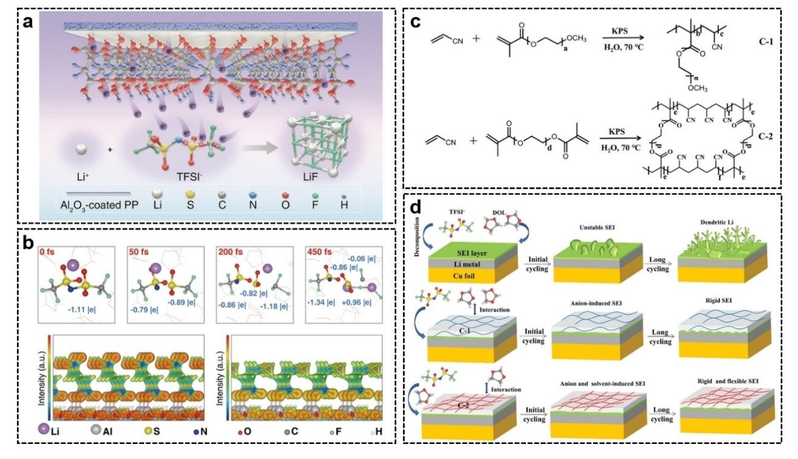

**Figure 8.** a) SAMs accelerate the decomposition from LiTFSI to LiF. b) Simulations of the decomposition mechanism of LiTFSI. Reproduced with permission from Ref. [137]. Copyright (2022) The American Association for the Advancement of Science. c) Synthesis illustration of C-1 and C-2. d) Schematic illustration of selective decomposition of electrolyte and formation of different SEI with different Cu foils. Reproduced with permission from Ref. [138]. Copyright (2022) Wiley-VCH.

capacity retention of Lij j LFP cells with SAM of carboxyl terminus can reach 92.8% after 1000 cycles.

## **5. Optimize the SEI in Anion-Rich Solvation Structure**

Certain polymers can promote selective electrolyte decomposition by interacting with different electrolyte constituents to change the SEI's fundamental structure. Since acrylonitrile monomer has a high dielectric constant and wide electrochemical window, and ester monomer can enhance the transport of Li+, Sun's group synthesized two polymers (one chain structure is labeled C-1 and the other cross-linked structure is labeled C-2, Figure 8c) by free radical polymerization of the two monomers.[138] Due to steric hindrance, the C-2 polymer with a cross-linked structure interacts more weakly with the solvent DOL than C-1, leading to a decrease in inorganic SEI components and an increase in organic SEI components (Figure 8d). Consequently, the SEI layer generated on the surface of C-2 modified copper foil exhibits both rigidity and flexibility. Due to the stronger interaction between C-1 and DOL, the SEI layer generated on the surface of C-1-modified copper foil is more rigid and has a higher content of inorganic components. The average coulombic efficiency of Lij jCu cells with C-2 modified copper foil achieved 98.7% after 550 cycles at 0.2 mAcm 2 . The capacity of Li-S batteries (N/P ratio is 2.5, 0.5 C) with C-2 modified copper foil retained higher than 500 mAhg 1 after 300 cycles, while that with C-1 modified Cu foil retained above 400 mAhg 1 .

Different from optimizing the SEI in conventional solvation structure, regulating the Li+ solvation structure is another important content to optimize the SEI. The SEI evolution has been heavily influenced by the Li+ solvation environment of electrolytes.[79,139] However, the majority of researchers only focus on the modifications in SEI produced by the changing of electrolytes and ignore the changes in the solvation structure of Li+ in the earlier study. Regulating Li+ solvation structure also increases the oxidation stability and wide-temperature stability of the electrolyte, which has become a prominent area of research in recent years and has promising application potential.

Compared with the free solvent and anion, the solvated sheath is more likely to participate in the reduction process and constitute the main components of SEI.[20,140] An increasing number of reports demonstrate the superiority of anionderived SEI over solvent-derived SEI.[75,81,141–143] Therefore, the anion-rich Li+ solvation structure is conducive to uniform Li metal deposition, which is the main strategy to adjust the structure of Li+ solvation. Optimizing the SEI in an anion-rich solvation structure is intrinsically different in principle from that in a conventional solvation structure and has extremely rich contents. Therefore, we will discuss it separately herein. At present, there are many methods to introduce anions into the solvated sheath, such as increasing the concentration of Li salts,

*Batteries & Supercaps* **2023**, *6*, e202200394 (15 of 25) © 2022 Wiley-VCH GmbH

adding diluents, reducing the coordination ability of the solvent, increasing the cation-anion interaction, adding additives to regulate the solvation behavior, and introducing electrode front-faces.

#### **5.1. Anion-rich solvation structure produced by designs of Li salts and solvents**

The coordination competition between the solvent molecules and anions with Li+ mainly exists in the electrolyte consisting of Li salts and organic solvents. This results in the formation of different kinds of complexes, such as solvent-separated ion pairs (SSIP), contact ion pairs (CIP), and aggregates (AGGs), which corresponds to the coordination of anions with 0, 1, and 2 or more Li+, respectively.[81] CIP and AGGs structures appear when the electrostatic interaction between anions and cations is stronger than that of solvent molecules. These complexes have a typical anion-rich Li+ solvation structure, which is conducive to the formation of more anion-derived SEI components and uniform Li metal deposition. Moreover, these complexes are more thermodynamically stable than free solvent molecules and can provide a wider operating temperature and electrochemical stability window.[75,81,141–144] In particular, AGGs are positively charged because cations are more than anions. As a result, more anions take part in the reduction process occurring on the Li anode surface and assist the generation of SEI under the effect of the electrostatic field.[145] However, there is a contradiction between the ionic conductivity and the solvation structure of the tightly coordinated anion with Li+. Strong polar solvents can fully dissociate Li salts to achieve higher ionic conductivity, while weak polar solvents can form more CIP and AGGs. Therefore, CIP and AGGs structures may result in poor rate performance because of the decreased ionic conductivity and inadequate Li salt dissociation.[146]

Under the condition of a high concentration of Li salts (�3.5 mol L 1 ), the free solvent molecules almost disappear. It is difficult for solvent molecules to completely occupy the solvated structure, resulting in anions being forced into the solvation structure and CIP and AGGs are abundant in the electrolyte.[81,147] This type of electrolyte with a specific solvation structure is referred to as a high concentration electrolyte (HCE). HCE requires Li salts with high solubility and ionization constant. In addition to imine anions, it is difficult to match the requirements for other Li salts (such as LiPF6, LiBF4, LiAsF6, and LiClO4).[148] Because the migration of anions in HCE is inhibited by participating in solvation, the transference number of Li+ is increased, thereby reducing the concentration polarization. In addition, HCE can prevent the corrosion of aluminum current collectors, extend the electrochemical stability window of electrolytes, limit the decomposition of solvents, improve safety, and inhibit the volatilization of flammable solvents.[1,142,149–153]

However, there are considerable challenges in large-scale commercial implementation. HCE is costly and has a high viscosity due to the short distance between cations and anions, resulting in poor wettability and ionic conductivity.[154] By adding diluents to HCE, it is possible to create a local highconcentration electrolyte (LHCE).[152,155–158] In LHCE, the diluent component that cannot dissolve Li salts but can be soluble with solvent is introduced, which cleverly solves problems existing in HCE and preserves important components of CIP and AGGs in HCE. LHCE provides a new approach to the research of LMBs and has significant application potential.

The preparation of LHCEs is generally divided into two steps: Firstly, solvents with high solubility are mixed with Li salts to form HCE; Secondly, the diluent is added to form LHCE (Figure 9a and b). The diluent is mutually soluble with solvent, but with very low solubility for Li salts in the electrolyte. Following the addition of diluent, Li salts and solvent will form clusters with the characteristic of high concentrations of electrolyte. When the electric field is added, Li+ will diffuse along the cluster to complete the ion transport (Figure 9c).[5] Different solvents in LHCE will affect the proportion of CIP and AGGs and the degree of anion decomposition.[159] For example, the Zhu Group found that since DOL has a weak solvation ability compared with DME, it can form more CIP and AGGs and form more anion-derived SEI components when combined with 1,1,2,2-tetrafluoroethyl-2,2,3,3-tetrafluoropropyl ether (TTE).[160] So Lij jCu cells with DOL exhibit higher coulombic efficiency compared with DME. Diluents in LHCE generally have the following basic requirements: i) low viscosity and high wettability; ii) low dielectric constant, low complexation ability, and can be solubilized with solvent without affecting the special coordination structure of Li salt and solvent in the original HCE; iii) conducive to the formation of a high-quality SEI. At present, the selection range of diluents is narrow. The different diluent molecules have a great influence on the performance of LHCE. For example, the Cao Group systematically studied different electrochemical behavior of TTE, (bis- (2,2,2-trifluoroethyl) ether) BTFE, fluorinated orthoformate [tris- (2,2,2-trifluoroethyl) orthoformate (TFEO), bis(2,2,2 trifluoroethyl) carbonate (BTFEC), tri(2,2,2-trifluoroethyl) borate (TFEB) in DME-based LHCE.[144] The poor performance of TFEBbased LHCEs is because the electron-deficient boron in TFEB accelerates the O2 escape from NCM811 and accelerates the degradation of the cathode. And the poor performance of BTFEC-based LHCEs is because that BTFEC is involved in the second solvation structure of Li+, which hinders the decomposition of FSI in LHCE.

In general, the preparation of LHCEs consists of two steps: First, high-solubility solvents are mixed with Li salts to produce HCE; then, the diluent is added to form LHCE (Figure 9a and b). Following the addition of diluent, Li salts and solvent will form clusters with the characteristic of HCE. Li+ will diffuse along the cluster to complete ion transport when an electric field is introduced (Figure 9c).[5] Different solvents in LHCE will affect the proportion of CIP and AGGs and the degree of anion decomposition.[159] For example, the Zhu Group found that since DOL has a weak solvation ability compared with DME, it can form more CIP and AGGs and form more anion-derived SEI components when combined with 1,1,2,2-tetrafluoroethyl-2,2,3,3-tetrafluoropropyl ether (TTE).[160] Therefore, Lij jCu cells

*Batteries & Supercaps* **2023**, *6*, e202200394 (16 of 25) © 2022 Wiley-VCH GmbH

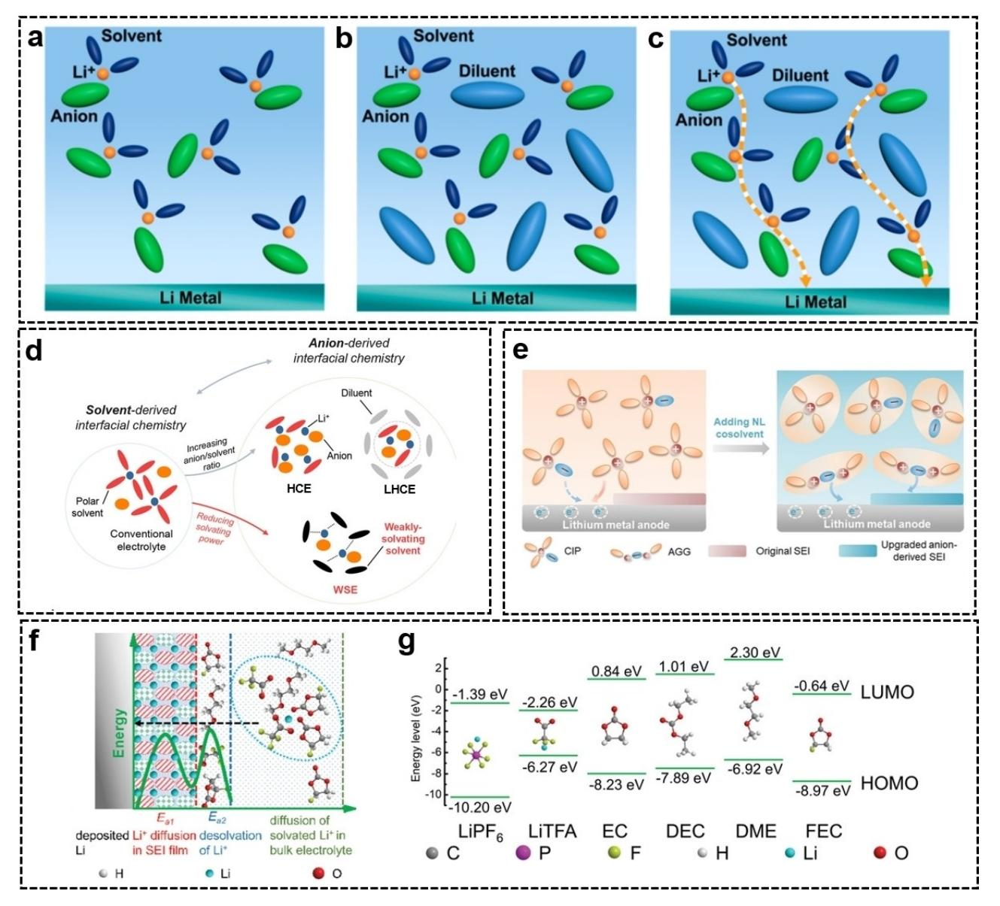

**Figure 9.** Schematic illustration of a) HCE, b) LHCE, and c) pathway of Li+ transport in LHCE. Reproduced with permission from Ref. [5]. Copyright (2020) American Chemical Society. d) Solvation structure of conventional electrolyte, HCE, LHCE, WSE. Reproduced with permission from Ref. [161]. Copyright (2020) Wiley-VCH. e) Effect of NL cosolvent in solvation structure and SEI formation. Reproduced with permission from Ref. [145]. Copyright (2021) Wiley-VCH. f) Deposition mechanism of Li+ in LiTFA-DME/FEC electrolyte. g) Molecular orbital energies of Li salts and solvents. Reproduced with permission from Ref. [77]. Copyright (2020) Wiley-VCH.

with DOL have greater coulombic efficiency than those with DME. In general, diluents for LHCE must meet the following requirements: i) low viscosity and good wettability; ii) low dielectric constant and low complexation ability; iii) conducive to the production of high-quality SEI. Currently, the selection of diluents is limited. Different diluent molecules have a substantial effect on LHCE performance. For example, the Cao Group systematically studied different electrochemical behavior of TTE, bis(2,2,2-trifluoroethyl) carbonate (BTFEC) and tri(2,2,2 trifluoroethyl) borate (TFEB) in DME-based LHCE.[144] they found that the poor performance of TFEB-based LHCEs is because the electron-deficient boron in TFEB accelerates the O2 escape from NCM811 and the cathode degradation. BTFEC is involved in the second solvation structure of Li+ and inhibits the decomposi-

tion of FSI in BTFEC-based LHCEs, resulting in poor performance.

A typical successful design in LHCE is 1.2 M LiFSI-DMC/BTFE by the Zhang Group.[152] Lij jCu cells achieved a Coulombic efficiency of 99.3%, which is one of the highest values in the LMBs area. After 700 cycles, the capacity retention Lij jNMC cells delivered over 80% of their capacity, and their coulombic efficiency was 99.5%. However, the electrolyte formulation exhibited poor performance under the condition of pouch cells. Based on this LHCE system, original electrolyte components were modified to improve battery performance.[155–158,162] Chen et al. developed a nonflammable electrolyte (1.2 M LiFSI-TEP/ BTFE) utilizing flame retardant solvent. Lij jCu cells have 99.2% coulombic efficiency and 5 V electrochemical stability

window.[155] After 200 cycles, Lij jNMC622 pouch cells (1.0 Ah, 300 Whkg 1 ) preserved over 86% of their original capacity.[163]

In addition to LHCE, some new methods have emerged to generate CIP and AGGs. For example, more CIP and AGGs can also be produced by introducing solvents with weak solvation ability. Zhang's Group reported a weakly solvating electrolyte (WSE) composed of pure nonpolar solvent [1,4-dioxane (1,4- DX)].[161] This WSE resulted in an unusual solvation structure, with large quantities of CIP and AGGs forming at conditions of low salt concentration (1.0 M) (Figure 9d). The difference between the Li+-anion binding energy and Li+-solvent binding energy in the WSE electrolyte is significantly higher than in the traditional electrolyte, which will lead to more anions involved in coordination based on thermodynamic enthalpy reduction rules. This is the reason why the WSE electrolyte produces more CIP and AGGs. Similar to this work, the Zhou Group selected dimethyl dimethoxy silicone as a new weak coordination solvent that could create a significant number of CIP and AGGs in dilute solution, thereby producing an SEI layer abundant in LiF, Li3N, Li2S, and other components.[164] The anion-derived SEI based on the regulation of the silicon-based weakly solvated electrolyte has better stability and higher Li+ transport ability. It not only has a lower activation energy of interfacial ion transport but also enables stable dendrite-free Li deposition in LMBs. Lij j LFP batteries (three times excess Li source) with the electrolyte still have 80% of the capacity retention after 110 cycles at 1 C. Incorporating non-solvated and low-dielectricity cosolvent (NL) into the electrolyte will also enhance the interaction between anions and cations, increasing CIP and AGGs. The Huang Group used benzene as NL cosolvent and observed that CIP and AGGs in the electrolyte increased significantly.[145] As shown in Figure 9(e), anions are repelled by the negatively charged surface of the Li metal anode. However, AGGs are positively charged due to a greater number of cations than anions. Therefore, more anions participate in the formation of SEI on the anode surface.

In addition to altering the solvent's coordination ability, the solvation structure can also be altered by substituting anions with different coordination abilities.[79] Li's Group regulated the solvated sheath with lithium trifluoroacetate (LiTFA) containing carbonyl ( C=O) and F (Figure 9f).[77] The carbonyl group was significantly blue-shifted in attenuated total reflection Fourier infrared transform spectrum (ATR-FTIR). It was proved that the carbonyl group in LiTFA had a strong coordination ability with Li+, resulting in TFA could modify the solvated sheath of Li+. As depicted in Figure 9(g), the LUMO of the TFA the molecule is less than that of the solvent molecule. Therefore, the TFA in the solvated sheath will preferentially decompose on the Li anode surface, followed by the production of an SEI film rich in inorganic substances such as LiF and Li2O, which effectively promotes uniform Li deposition and inhibits the formation of Li dendrites. The average coulomb efficiency of Lij jCu cells reached 98.8% for more than 500 cycles.

#### **5.2. Anion-rich solvation structure produced by additives**

Certain electrolyte additions can influence the solvated sheath of Li+ to generate an anion-rich solvation structure. There are two ways to change the solvation structure by additives. Some additives can enter the solvated structure, migrate to the anode surface with Li+, and contribute to the formation of SEI. In this case, the solvated structure contains anions of the additive. On the other hand, some additives can interact with certain electrolyte components, resulting in the formation of anion-rich solvation structure and the modification in the Li deposition behavior.

Some additives can enter the solvation structure and participate in the construction of SEI. For example, the NO3 2 anion affects the solvation structure of Li+ in 2 M LiFSI-DME electrolytes containing 0.20 M lithium nitrate (LiNO3).[165] By MD simulation, new peaks Li-O (1.7 Å) and Li-N (2.9 Å) appear, which proves that NO3 2 anion enters the solvated sheath (Figure 10a). NO3 2 can generate the beneficial SEI component LiN*x*O*y* as it enters the solvated sheath. And the FSI anions are polarized and more likely to break down because the presence of LiNO3 can significantly enhance ion-dipole interaction between Li+ and solvents.

Some additives can change the coordination relationship between Li+ and anions, which ultimately changes the ratio of CIP or AGGs and affects the Li metal deposition behavior. By using tris(pentafluorophenyl)borane (TPFPB) additive to regulate the interaction between Li+ and anions, the Zhang group increased the proportion of AGGs, resulting in the decomposition of more anions.[143] With the addition of TPFPB, the percentage of AGGs increased from 31% to 42% (Figure 10b and c). This is because the electron-deficient boron atoms act as an anion acceptor and interact with F or O atoms to reduce the electron cloud density of FSI , which will make FSI interact with more Li+ to form new AGGs (Figure 10d and e). FSI decomposed more Li2S and formed anion-derived SEI with higher stability. In addition to common additives dissolved in the electrolyte, the Cui Group reported that Li2O was used as an additive to construct a suspended electrolyte system, which can also be used to construct an anion-rich Li+ solvation structure.[139] It is found that Li2O changes the Li+ solvation environment through the interphase interaction between Li2O and the Li+ solvation sheath of the corresponding surrounding liquid electrolyte, resulting in a great influence on the electrochemical performance of the Li2O suspension electrolyte. As shown in Figure 10(f), the typical Li+ solvation structure comprises SSIP in liquid electrolyte. The SEI formation region exists on the surface of the Li metal anode. Polar solvent molecules dissolve rapidly in this region, and gradually lose their ability to dissociate/dissolve. The SSIP solvation structure will yield relatively thick organic-rich compact SEI. However, in the suspended electrolyte system (Figure 10g), Li2O will attract fluoride and facilitate the dissociation of Li+. In the altered solvation structure, dissociated Li+ will be weakly solvated by solvents and anion/fluorinated species are enriched. The modified solvation environment changes the SEI evolution that yields inorganic-rich SEI. Therefore, Li2O suspension can

Review doi.org/10.1002/batt.202200394

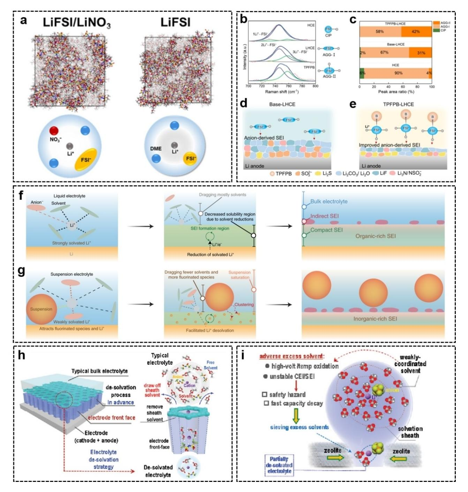

**Figure 10.** a) Schematic illustration of the effect of LiNO3 on alerting solvation structure. Reproduced with permission from Ref. [165]. Copyright (2019) American Chemical Society. b) Raman spectra of FSI and c) the ratio of CIP, AGG-I, and AGG-II in the different electrolytes. Schematic diagram of SEI formation mechanism in d) base-LHCE and e) TPFPB-LHCE. Reproduced with permission from Ref. [143]. Copyright (2021) Wiley-VCH. Schematic illustration of SEI evolution in f) conventional liquid electrolyte and g) suspension electrolyte. Reproduced with permission from Ref. [139] Copyright (2022) The Author(s), under exclusive licence to Springer Nature Limited. h) Schematic illustration of the effect of electrode front-faces on alerting de-solvation process. Reproduced with permission from Ref. [166]. Copyright (2022) Wiley-VCH. i) De-solvated aggregative electrolyte produced by Zeolite-based electrode front-face (3.0 Å window size). Reproduced with permission from Ref. [167]. Copyright (2021) Wiley-VCH.

improve the coulombic efficiency of the Li metal anode (~99.7%) and electrochemical performances of anode-free full cells (~70 cycles at 80% of initial capacity).

#### **5.3. Anion-rich Li**+ **solvation structure produced by electrode front-faces**

The applications of constructing front faces are an interesting method developed in recent years.[166] Similar to HCE/LHCE electrolytes, regulating the process of de-solvation by con-

*Batteries & Supercaps* **2023**, *6*, e202200394 (19 of 25) © 2022 Wiley-VCH GmbH

structing front-faces can maintain CIP-dominated electrolyte modes. Thus, the Li metal deposition behavior can be effectively regulated (Figure 10h).

In HCE/LHCE, the essence of preparing concentrated electrolytes is to minimize free solvent molecules and weakly coordinated solvation shells in bulk diluent electrolytes.[155,168–170] The electrolyte configuration in the concentrated electrolyte changes from SSIP dominant mode to CIP dominant state. The solvent sheath solvent molecules in CIP decrease, and the cation-solvent and cation-anion interactions become stronger.[141,166,171] Regulate the process of de-solvation by constructing electrode front-faces that can achieve a similar effect.[172–175] The Zhou Group placed the sieves with subnanometer screening ability on the surface of the cathode and anode closely to adjust the de-solvation process to occur on the surface of the sieves in advance.[166] The sub-nanometer sieves can be regarded as electrode front-faces. Metal-organic frameworks (MOFs), zeolite (Figure 10i), and other electrically insulating porous host materials have inherent sub-nanometer pore structures, which can be used as unique electrode frontfaces to eliminate various solvent decomposition problems.[167,176–180] The conventional de-solvation process, which should occur on the anode surface, occurs on the surface of the electrode front in advance because the electrode frontfaces are constructed on the surface of the anode. Under the effect of the electrode front-faces, the weakly coordinated solvent contained in the external solvation sheath and even part of the strongly coordinated solvent contained in the internal solvation sheath are expected to be depleted, and eventually, a de-solvated electrolyte with a more aggregate electrolyte configuration (rich in CIP) is formed.[166,181,182] The anion-rich solvation structure is conducive to the formation of good SEI components on the Li anode, and the enhanced interaction between metal ions and the remaining solvent makes the newly obtained electrolyte solvent more difficult to be oxidized after de-solvation.

The research of anion-rich Li+ solvation structure produced by electrode front-faces is in its initial study phase and there are still some challenges. It is necessary to develop more effective characterization methods to explore the specific desolvation process for different battery systems and the materials used to construct electrode front-faces. Moreover, the preparation of crack-free films composed of porous materials is difficult and few materials meet the conditions. The porous material used to construct the electrode front-faces should also have good mechanical stability, electrochemical stability and excellent ionic conductivity. In addition, these porous materials are currently expensive and low-cost materials for electrode front-faces should be developed in the future.

## **6. Other Mechanisms**

#### **6.1. Weakening local space charge field mechanism**

It is an important method to prolong the generation time of dendrites by introducing molecular/ionic structures interacting with anions and immobilizing anions in the electrolyte to inhibit the generation of the space charge region on the surface of the Li anode. The metal dendrite electrodeposition model proposed by Sand in 1901, which is a widely accepted mechanism of Li dendrite nucleation, indicates that the anion concentration near the anode will drop to zero (anion depletion region) at a given time (Sand's time), thereby breaking the neutrality of the local region of the double layer on the electrode surface.[183,184] Such a space charge region would generate a significant electric field at the electrode's surface, resulting in Li+ uneven aggregation and the rapid growth of dendrites.

At present, many methods are employed to improve the Li anode's electrochemical performance by increasing the Li+ migration number. One of the purposes of this method is to fix anions to weaken the space charge field. The Zhang Group constructed an ultrathin cationic selective (CS) functional separator, which is very effective in stabilizing Li anode and inhibiting dendrite growth.[22] CS separator (PVDF) has a very high transference number of Li+ (0.81). As shown in Figure 11(a), Li+ hardly has direct contact with PVDF chains, while the PF6 is surrounded by PVDF chains. And it results in Li+ passing smoothly through the CS separator and PF6 is severely confined by PVDF chains. This indicates that the CS separator can eliminate the space charge field and delay Li dendrite nucleation and growth by effectively inhibiting the transport of anions across the separator. At a high current density of 3 mAcm 2 , the CS separator facilitates a stable Li deposition/ stripping cycle of over 1000 h. Moreover, the space charge field can be eliminated by adding materials with anion-absorbing chemical groups to the electrolyte, which fixes the anion directly in the electrolyte. Xiong et al. adjusted the anion distribution by using ZIF-67 with unsaturated metal sites as an anionphilic additive, eliminating the anion depletion and promoting Li salt dissociation (Figure 11b).[185] Raman spectra and DFT calculations show that ZIF-67 has a strong adsorption ability for TFSI , which contributes to LiTFSI dissociation. The results show that the transference number of Li+ increases from 0.47 to 0.74. As shown in Figure 11(c and d), in situ Raman spectra further demonstrate the ion distribution and its variation at the electrochemical interphase. The intensities of the peak at 740 cm 1 represent anions without Li+ coordination. The results of in situ Raman spectra observe an obvious shake of intensity in the original electrolyte (Figure 11e), indicating ion depletion during plating. Steady signals in the modified electrolyte are observed (Figure 11f). It indicates that ZIF-67 can ensure anion supplement, thereby eliminating the ion depletion region.

#### **6.2. Li dendrite inhibition by high modulus layer**

The materials containing molecular/ionic structures of high modulus characteristics can effectively inhibit the growth of dendrites. According to the Monroe-Newman Model, Li dendrites can effectively be suppressed if the SEI layer with Young's modulus is beyond 10 GPa.[15,91] Using this principle, Review doi.org/10.1002/batt.202200394

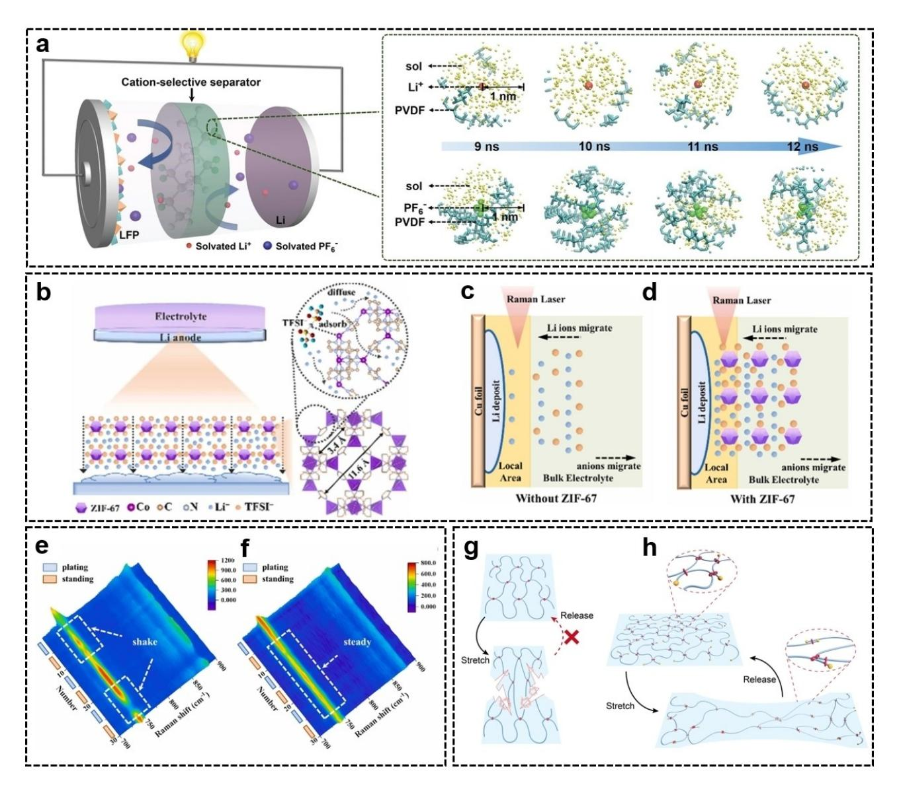

**Figure 11.** a) Schematic illustration of a Lij j LFP cell with the CS separator (left) and the environmental evolutions in the CS separator during the last 4 ns of energy equilibrium state by the simulation model. Reproduced with permission from Ref. [22]. Copyright (2022) Wiley-VCH. Schematic illustration of b) Li deposition behavior in ZIF-67-modified electrolyte and in situ Raman measurement c) without ZIF-67, d) with ZIF-67. Blue balls represent Li+ and orange balls represent TFSI . In situ Raman spectra results of electrolyte e) without ZIF-67, f) with ZIF-67 when plating at 2 mAcm 2 . Reproduced with permission from Ref. [185]. Copyright (2021) Elsevier. Schematic illustration of the stretching and releasing of polymer with g) conventional fixed crosslinks and h) movable crosslinks of PR-PAA. Reproduced with permission from Ref. [186]. Copyright (2021) Wiley-VCH.

Tang et al. inhibited the growth of Li dendrites by coating a layer of super-strong diamond-like carbon on the PP separator (DLC/PP).[187] The DLC/PP separator has a high modulus (~100 GPa) and inhibits the growth of Li dendrites well. The DLC/PP separator enables Li plating/stripping cycle over 4500 h at a high current density of 3 mAcm 2 . The Lij j LiNi0.5Co0.3Mn0.2O2 batteries with high-loading cathodes of 9 mgcm 2 active material and DLC/PP separators can steadily cycle more than 200 times at 0.2 C.

To inhibit the creation and evolution of Li dendrites, conventional polymers with fixed cross-links are commonly employed to increase Young's modulus. However, in traditional polymers with a fixed cross-linking network, there is a trade-off between Young's modulus and toughness, and the polymers may fracture during stretching (Figure 11g).[188] Polymers with moveable cross-links show their potential in artificial interphases by combining excellent fracture resistance with high toughness. Inspired by the magical properties of polymers with mobile cross-linking, Guo et al. improved the electrochemical performance of the Li anode by coating it with a highly flexible and elastic taxane-co-polyacrylic acid (PRPAA) polymer as an artificial SEI layer.[186] Some polyrotaxane (a-cyclodextrin) rings are covalently attached to the PAA chain and are free to move, thereby acting as a mobile pulley that significantly reduces the tension exerted by the entire polymer network (Figure 11h). In contrast to conventional cross-linked polymers, the PR-PAA polymer simultaneously demonstrates both great toughness and strong fracture resistance. As an artificial SEI layer, the

highly elastic PR-PAA exhibits good deformation ability, resists stress from Li dendrites, and effectively adapts to morphological changes caused by volume fluctuations of the Li anode. PR-PAA polymer's outstanding fatigue resistance enables it to respond rapidly to pressure and strain, hence potentially ensuring the long lifespan of Li anodes.

# **7. Summary and Perspective**

A series of problems in Li metal anode, such as uneven Li+ flux, sluggish de-solvation process, and brittle SEI fracture, are all related to molecules/ions. Therefore, the molecular/ionic designs will have an important influence on the Li metal deposition behavior. By reasonable molecular/ionic designs at the electrolyte, separator, and anode/electrolyte interphase, dendrite-free Li metal deposition can be achieved while maintaining the overall energy density of the battery. Herein, the relationship between molecular/ionic designs and Li metal deposition behavior is systematically summarized from four aspects of uniform Li+ flux, de-solvation process regulation, optimizing the SEI in conventional solvation structure, and optimizing the SEI in anion-rich solvation structure. For the problem of uneven Li+ flux from the separator to the anode surface, uniformly distributed lithophilic functional groups (such as CO NH , COOH, C=O, etc.) can directly guide the uniform deposition. For the concentration of Li+ caused by the electric field/temperature field at the tips, an ion/molecular protective layer can be introduced at the tip to carry out electric field shielding, or materials with a molecular structure of good thermal conductivity can be introduced to eliminate local temperature hot spots. For the growth of Li dendrites caused by the sluggish de-solvation process at low temperature, the de-solvation barrier can be mainly reduced by making ion-solvent interactions weaker. In the strategy of modifying SEI composition, the traditional solvation structure system and the anion-rich solvated structure system are introduced. In the traditional solvation structure system, novel solvent molecules, Li salts, additives, and molecular/ionic designs of the anode surface can produce SEI rich in beneficial components such as LiF and Li3N. In addition, some molecular/ ionic designs can be used to induce the selective decomposition of electrolytes to produce effective SEI components. In the system of anion-rich solvation structure, the key point of solvation modification is to allow the anion to enter the solvated structure. Anion-rich solvation structure, which can finally form anion-derived SEI, can be produced by HCE, LHCE, WSE, NL, additives, electrode leads, etc. In addition, the molecular/ionic designs also have the mechanism of weakening the local space charge field and physically inhibiting the growth of Li dendrite to guide the uniform Li metal deposition. The molecular/ionic design is in line with the design concept of high energy density batteries and should be paid more attention to in future research on Li metal anode.

Despite significant advances in molecular/ionic design over the past few years, the issues faced by Li metal anode in the actual process remain unresolved, requiring further research and development. The following development directions can be mentioned:

- 1) The mechanisms of various molecular/ionic designs are intertwined, and the exploration of multifunctional designs will be an important future trend. For example, the certain additive can achieve both electrostatic shielding and SEI modification at the same time, thus achieving better performance. Moreover, there are often a variety of action mechanisms for one design, which need to be explored by researchers.
- 2) It is vital to continue studying the regularity of the effect of various chemical groups on Li metal deposition. There is a lack of general design rules in many molecular/ionic designs, especially electrolyte additives. The discovery and summarization of the rules will reduce blind trial and speed up the development of new molecules/ions beneficial to the Li metal anode.
- 3) The molecular design of F-containing molecules necessitates further study and studying the chemical environment factors that affect fluoride group fracture is of great significance.
- 4) Moreover, in addition to fluorinated solvent, solvents containing N atoms, Cl atoms, S atoms, P atoms, and other atoms which are easy to form effective SEI components are rare and need to be further explored to expand the solvent system matching Li metal anode.
- 5) The research on Li+ solvation structure mostly focuses on the formation of anion-rich solvated sheath now, and other designs on solvation structure should also be explored.
- 6) The molecular/ionic design is quite complicated, and the process is insufficiently explained. Advanced characterization methods are needed to further study the design mechanism of different molecules/ions.
- 7) The successful case of regulating Li metal deposition can be extended to other metal anodes, such as sodium metal anodes, zinc metal anodes, potassium metal anodes, magnesium metal anodes, aluminum metal anodes, etc.

# *Acknowledgements*

*The authors appreciate the support from National Natural Science Foundation of China (52105587), Natural Science Foundation of Shaanxi Province (2021JQ-036), and Fundamental Research Funds for the Central Universities (xjh012020042).*

# *Conflict of Interest*

The authors declare no conflict of interest.

# **Data Availability Statement**

The data that support the findings of this study are available from the corresponding author upon reasonable request.

**Keywords:** de-solvation process **·** Li metal deposition **·** Li+ flux **·** molecular/ionic designs **·** solid electrolyte interphase

- [1] X. Zheng, L. Huang, X. Ye, J. Zhang, F. Min, W. Luo, Y. Huang, *Chem* **2021**, *7*, 2312–2346.
- [2] Y. Guo, H. Li, T. Zhai, *Adv. Mater.* **2017**, *29*, 1700007.
- [3] Y. Gao, Z. Yan, J. L. Gray, X. He, D. Wang, T. Chen, Q. Huang, Y. C. Li, H. Wang, S. H. Kim, T. E. Mallouk, D. Wang, *Nat. Mater.* **2019**, *18*, 384–389.
- [4] X. Shen, H. Liu, X.-B. Cheng, C. Yan, J.-Q. Huang, *Energy Storage Mater.* **2018**, *12*, 161–175.
- [5] J. G. Zhang, W. Xu, J. Xiao, X. Cao, J. Liu, *Chem. Rev.* **2020**, *120*, 13312– 13348.
- [6] H. Chen, Y. Yang, D. T. Boyle, Y. K. Jeong, R. Xu, L. S. de Vasconcelos, Z. Huang, H. Wang, H. Wang, W. Huang, H. Li, J. Wang, H. Gu, R. Matsumoto, K. Motohashi, Y. Nakayama, K. Zhao, Y. Cui, *Nat. Energy* **2021**, *6*, 790–798.
- [7] G. M. Hobold, J. Lopez, R. Guo, N. Minafra, A. Banerjee, Y. Shirley Meng, Y. Shao-Horn, B. M. Gallant, *Nat. Energy* **2021**, *6*, 951–960.
- [8] D. Lin, Y. Liu, Y. Cui, *Nat. Nanotechnol.* **2017**, *12*, 194–206.
- [9] H. Zhang, X. Liao, Y. Guan, Y. Xiang, M. Li, W. Zhang, X. Zhu, H. Ming, L. Lu, J. Qiu, Y. Huang, G. Cao, Y. Yang, L. Mai, Y. Zhao, H. Zhang, *Nat. Commun.* **2018**, *9*, 3729.
- [10] Y. Zhong, S. Zhou, Q. He, A. Pan, *Energy Storage Mater.* **2022**, *45*, 48– 73.
- [11] X. Zhang, Y. Yang, Z. Zhou, *Chem. Soc. Rev.* **2020**, *49*, 3040–3071.
- [12] X. B. Cheng, R. Zhang, C. Z. Zhao, Q. Zhang, *Chem. Rev.* **2017**, *117*, 10403–10473.
- [13] P. G. Bruce, S. A. Freunberger, L. J. Hardwick, J. M. Tarascon, *Nat. Mater.* **2011**, *11*, 19–29.
- [14] Q. Wang, B. Liu, Y. Shen, J. Wu, Z. Zhao, C. Zhong, W. Hu, *Adv. Sci.* **2021**, *8*, e2101111.
- [15] Q. Zhao, S. Stalin, L. A. Archer, *Joule* **2021**, *5*, 1119–1142.
- [16] J. I. Lee, G. Song, S. Cho, D. Y. Han, S. Park, *Batteries & Supercaps* **2020**, *3*, 828–859.
- [17] X. Yu, A. Manthiram, *Energy Environ. Sci.* **2018**, *11*, 527–543.
- [18] D. Kang, M. Xiao, J. P. Lemmon, *Batteries & Supercaps* **2020**, *4*, 445– 455.
- [19] Y. Liu, Q. Liu, L. Xin, Y. Liu, F. Yang, E. A. Stach, J. Xie, *Nat. Energy* **2017**, *2*, 17083.
- [20] S. Li, Z. Luo, L. Li, J. Hu, G. Zou, H. Hou, X. Ji, *Energy Storage Mater.* **2020**, *32*, 306–319.
- [21] Q.-K. Lei, Q. Zhang, X.-Y. Wu, X. Wei, J. Zhang, K.-X. Wang, J.-S. Chen, *Chem. Eng. J.* **2020**, *395*, 125187.
- [22] Q. Zhao, R. Zhou, C. Wang, J. Kang, Q. Zhang, J. Liu, Y. Jin, H. Wang, Z. Zheng, L. Guo, *Adv. Funct. Mater.* **2022**, *32*, 2112711.
- [23] P. Zou, Y. Sui, H. Zhan, C. Wang, H. L. Xin, H. M. Cheng, F. Kang, C. Yang, *Chem. Rev.* **2021**, *121*, 5986–6056.
- [24] B. Horstmann, J. Shi, R. Amine, M. Werres, X. He, H. Jia, F. Hausen, I. Cekic-Laskovic, S. Wiemers-Meyer, J. Lopez, D. Galvez-Aranda, F. Baakes, D. Bresser, C.-C. Su, Y. Xu, W. Xu, P. Jakes, R.-A. Eichel, E. Figgemeier, U. Krewer, J. M. Seminario, P. B. Balbuena, C. Wang, S. Passerini, Y. Shao-Horn, M. Winter, K. Amine, R. Kostecki, A. Latz, *Energy Environ. Sci.* **2021**, *14*, 602–642.
- [25] J. Holoubek, H. Liu, Z. Wu, Y. Yin, X. Xing, G. Cai, S. Yu, H. Zhou, T. A. Pascal, Z. Chen, P. Liu, *Nat. Energy* **2021**, *6*, 303–313.
- [26] K. B. Hatzell, *Nat. Energy* **2021**, *6*, 223–224.
- [27] N. Zhang, T. Deng, S. Zhang, C. Wang, L. Chen, C. Wang, X. Fan, *Adv. Mater.* **2022**, *34*, e2107899.
- [28] D. Luo, M. Li, Y. Zheng, Q. Ma, R. Gao, Z. Zhang, H. Dou, G. Wen, L. Shui, A. Yu, X. Wang, Z. Chen, *Adv. Sci.* **2021**, *8*, e2101051.
- [29] R. Xu, X.-B. Cheng, C. Yan, X.-Q. Zhang, Y. Xiao, C.-Z. Zhao, J.-Q. Huang, Q. Zhang, *Matter* **2019**, *1*, 317–344.
- [30] Z. Yu, D. G. Mackanic, W. Michaels, M. Lee, A. Pei, D. Feng, Q. Zhang, Y. Tsao, C. V. Amanchukwu, X. Yan, H. Wang, S. Chen, K. Liu, J. Kang, J. Qin, Y. Cui, Z. Bao, *Joule* **2019**, *3*, 2761–2776.
- [31] A. C. Thenuwara, P. P. Shetty, M. T. McDowell, *Nano Lett.* **2019**, *19*, 8664–8672.
- [32] E. Peled, D. Golodnitsky, G. Ardel, *J. Electrochem. Soc.* **1997**, *144*, L208- L210.
- [33] D. Wu, J. He, J. Liu, M. Wu, S. Qi, H. Wang, J. Huang, F. Li, D. Tang, J. Ma, *Adv. Energy Mater.* **2022**, *12*, 2200337.
- [34] K. Leung, F. Soto, K. Hankins, P. B. Balbuena, K. L. Harrison, *J. Phys. Chem. C* **2016**, *120*, 6302–6313.

- [35] M. Nojabaee, D. Kopljar, N. Wagner, K. A. Friedrich, *Batteries & Supercaps* **2021**, *4*, 909–922.
- [36] T. Liu, Z. Shi, H. Li, W. Xue, S. Liu, J. Yue, M. Mao, Y. S. Hu, H. Li, X. Huang, L. Chen, L. Suo, *Adv. Mater.* **2021**, *33*, e2102034.
- [37] J. Wang, M. Yang, G. Zou, D. Liu, Q. Peng, *Adv. Funct. Mater.* **2021**, *31*, 2101180.
- [38] P. Zhai, Y. Wei, J. Xiao, W. Liu, J. Zuo, X. Gu, W. Yang, S. Cui, B. Li, S. Yang, Y. Gong, *Adv. Energy Mater.* **2020**, *10*, 1903339.
- [39] G. Wan, F. Guo, H. Li, Y. Cao, X. Ai, J. Qian, Y. Li, H. Yang, *ACS Appl. Mater. Interfaces* **2018**, *10*, 593–601.
- [40] H. Wu, H. Jia, C. Wang, J. G. Zhang, W. Xu, *Adv. Energy Mater.* **2020**, *11*, 2003092.
- [41] S. Park, H. J. Jin, Y. S. Yun, *Adv. Mater.* **2020**, *32*, e2002193.
- [42] G. Li, *Adv. Energy Mater.* **2021**, *11*, 2002891.
- [43] C. Wang, A. Wang, L. Ren, X. Guan, D. Wang, A. Dong, C. Zhang, G. Li, J. Luo, *Adv. Funct. Mater.* **2019**, *29*, 1905940.
- [44] Y.-N. Li, C.-Y. Wang, R.-M. Gao, F.-F. Cao, H. Ye, *Energy Storage Mater.* **2021**, *38*, 262–275.
- [45] X. Li, L. Yuan, D. Liu, M. Liao, J. Chen, K. Yuan, J. Xiang, Z. Li, Y. Huang, *Adv. Funct. Mater.* **2021**, *31*, 2100537.
- [46] K. Wang, X. Li, J. Gao, Q. Sun, Z. Yang, J. He, S. Cui, C. Huang, *Adv. Funct. Mater.* **2021**, *31*, 2009917.
- [47] H. Wang, Z. Yu, X. Kong, S. C. Kim, D. T. Boyle, J. Qin, Z. Bao, Y. Cui, *Joule* **2022**, *6*, 1–29.
- [48] F. Ding, W. Xu, G. L. Graff, J. Zhang, M. L. Sushko, X. Chen, Y. Shao, M. H. Engelhard, Z. Nie, J. Xiao, X. Liu, P. V. Sushko, J. Liu, J. G. Zhang, *J. Am. Chem. Soc.* **2013**, *135*, 4450–6.
- [49] P. Z. Y. L. J. Song, *Adv. Energy Mater.* **2022**, *12*, 2200568.
- [50] Z. Lu, Y. Guo, S. Zhang, S. Wu, R. Meng, S. Hong, J. Li, H. Xue, B. Zhang, D. Fan, Y. Zhang, C. Zhang, W. Lv, Q. H. Yang, *Adv. Mater.* **2021**, *33*, e2101745.
- [51] Q. Peng, Z. Liu, L. Jiang, Q. Wang, *Adv. Energy Mater.* **2022**, *12*, 2104021.
- [52] D. Han, X. Wang, Y. N. Zhou, J. Zhang, Z. Liu, Z. Xiao, J. Zhou, Z. Wang, J. Zheng, Z. Jia, B. Tian, J. Xie, Z. Liu, W. Tang, *Adv. Energy Mater.* **2022**, *7*, 2201190.
- [53] D. Wang, Y. Liu, G. Li, C. Qin, L. Huang, Y. Wu, *Adv. Funct. Mater.* **2021**, *31*, 2106740.
- [54] D. Cao, Q. Zhang, A. M. Hafez, Y. Jiao, Y. Ma, H. Li, Z. Cheng, C. Niu, H. Zhu, *Small Methods* **2019**, *3*, 1800539.
- [55] Q. Wu, Z. Yao, A. Du, H. Wu, M. Huang, J. Xu, F. Cao, C. Li, *J. Mater. Chem. A* **2021**, *9*, 5606–5618.
- [56] Q. Dong, B. Hong, H. Fan, C. Gao, X. Huang, M. Bai, Y. Zhou, Y. Lai, *Energy Storage Mater.* **2022**, *45*, 1220–1228.
- [57] N. Li, Q. Ye, K. Zhang, H. Yan, C. Shen, B. Wei, K. Xie, *Angew. Chem. Int. Ed.* **2019**, *58*, 18246–18251; *Angew. Chem.* **2019**, *131*, 18414–18419.
- [58] M. Huang, Z. Yao, Q. Wu, Y. Zheng, J. Liu, C. Li, *ACS Appl. Mater. Interfaces* **2020**, *12*, 46132–46145.
- [59] D. N. Shigorin, *Spectrochim. Acta* **1959**, *14*, 198–212.
- [60] X. Chen, Y. K. Bai, C. Z. Zhao, X. Shen, Q. Zhang, *Angew. Chem. Int. Ed.* **2020**, *59*, 11192–11195; *Angew. Chem.* **2020**, *132*, 11288–11291.
- [61] X. Chen, X. Chen, T. Hou, B. Li, X. Cheng, R. Zhang, Q. Zhang, *Sci. Adv.* **2019**, *5*, eaau7728.
- [62] C. Li, S. Liu, C. Shi, G. Liang, Z. Lu, R. Fu, D. Wu, *Nat. Commun.* **2019**, *10*, 1363.
- [63] J. Zhi, S. Li, M. Han, P. Chen, *Sci. Adv.* **2020**, *6*, eabb1342.
- [64] S. Zheng, L. Mo, K. Chen, A. L. Chen, X. Zhang, X. Fan, F. Lai, Q. Wei, Y. E. Miao, T. Liu, Y. Yu, *Adv. Funct. Mater.* **2022**, 2201430.
- [65] G. Wang, C. Chen, Y. Chen, X. Kang, C. Yang, F. Wang, Y. Liu, X. Xiong, *Angew. Chem. Int. Ed.* **2020**, *59*, 2055–2060; *Angew. Chem.* **2020**, *132*, 2071–2076.
- [66] X. B. Cheng, T. Z. Hou, R. Zhang, H. J. Peng, C. Z. Zhao, J. Q. Huang, Q. Zhang, *Adv. Mater.* **2016**, *28*, 2888–95.
- [67] Y. Guo, Q. Wu, L. Liu, G. Li, L. Yang, X. Wang, Y. Ma, Z. Hu, *Adv. Sci.* **2022**, *9*, e2200411.
- [68] M. Mahmoudi, I. Lynch, M. R. Ejtehadi, M. P. Monopoli, F. B. Bombelli, S. Laurent, *Chem. Rev.* **2011**, *111*, 5610–37.
- [69] T. Wang, Y. Li, J. Zhang, K. Yan, P. Jaumaux, J. Yang, C. Wang, D. Shanmukaraj, B. Sun, M. Armand, Y. Cui, G. Wang, *Nat. Commun.* **2020**, *11*, 5429.
- [70] X. Fu, R. Odstrcil, M. Qiu, J. Liu, W.-H. Zhong, *Energy Storage Mater.* **2021**, *42*, 22–33.
- [71] R. Akolkar, *J. Power Sources* **2014**, *246*, 84–89.
- [72] W. Luo, L. Zhou, K. Fu, Z. Yang, J. Wan, M. Manno, Y. Yao, H. Zhu, B. Yang, L. Hu, *Nano Lett.* **2015**, *15*, 6149–54.

- [73] L. Li, S. Basu, Y. Wang, Z. Chen, P. Hundekar, B. Wang, J. Shi, Y. Shi, S. Narayanan, N. Koratkar, *Science* **2018**, *359*, 1513–1516.
- [74] L. L. Zuo, Q. Ma, S. C. Li, B. C. Lin, M. Fan, Q. H. Meng, X. W. Wu, Y. G. Guo, X. X. Zeng, *Adv. Energy Mater.* **2020**, *11*, 2003285.
- [75] H. Cheng, Q. Sun, L. Li, Y. Zou, Y. Wang, T. Cai, F. Zhao, G. Liu, Z. Ma, W. Wahyudi, Q. Li, J. Ming, *ACS Energy Lett.* **2022**, *7*, 490–513.
- [76] A. Gupta, A. Manthiram, *Adv. Energy Mater.* **2020**, *10*, 2001972.
- [77] Z. Wang, F. Qi, L. Yin, Y. Shi, C. Sun, B. An, H. M. Cheng, F. Li, *Adv. Energy Mater.* **2020**, *10*, 1903843.
- [78] X. Fan, X. Ji, L. Chen, J. Chen, T. Deng, F. Han, J. Yue, N. Piao, R. Wang, X. Zhou, X. Xiao, L. Chen, C. Wang, *Nat. Energy* **2019**, *4*, 882–890.
- [79] X. Chen, X.-Q. Zhang, H.-R. Li, Q. Zhang, *Batteries & Supercaps* **2019**, *2*, 128–131.
- [80] Q. Li, G. Liu, H. Cheng, Q. Sun, J. Zhang, J. Ming, *Chem. Eur. J.* **2021**, *27*, 15842–15865.
- [81] Z. Wang, H. Wang, S. Qi, D. Wu, J. Huang, X. Li, C. Wang, J. Ma, *EcoMat* **2022**, *4*, e12200.
- [82] Y. Yang, P. Li, N. Wang, Z. Fang, C. Wang, X. Dong, Y. Xia, *Chem. Commun.* **2020**, *56*, 9640–9643.
- [83] Z. Wang, Z. Sun, Y. Shi, F. Qi, X. Gao, H. Yang, H. M. Cheng, F. Li, *Adv. Energy Mater.* **2021**, *11*, 2100935.
- [84] T. Ma, Y. Ni, Q. Wang, W. Zhang, S. Jin, S. Zheng, X. Yang, Y. Hou, Z. Tao, J. Chen, *Angew. Chem. Int. Ed.* **2022**, *134*, e202207927.
- [85] J. B. Goodenough, Y. Kim, *Chem. Mater.* **2009**, *22*, 587–603.
- [86] T. E.-E. Doron Aurbach, A. Zaban, *J. Electrochem. Soc.* **1994**, *141*, L1.
- [87] B. Han, Z. Zhang, Y. Zou, K. Xu, G. Xu, H. Wang, H. Meng, Y. Deng, J. Li, M. Gu, *Adv. Mater.* **2021**, *33*, e2100404.
- [88] P. Zhai, L. Liu, X. Gu, T. Wang, Y. Gong, *Adv. Energy Mater.* **2020**, *10*, 2001257.
- [89] J. Chazalviel, *Phys. Rev. A* **1990**, *42*, 7355–7367.
- [90] A. Kushima, K. P. So, C. Su, P. Bai, N. Kuriyama, T. Maebashi, Y. Fujiwara, M. Z. Bazant, J. Li, *Nano Energy* **2017**, *32*, 271–279.
- [91] C. M. a J Newman, *J. Electrochem. Soc.* **2005**, *152*, A396.
- [92] Y. Lu, Z. Tu, L. A. Archer, *Nat. Mater.* **2014**, *13*, 961–969.
- [93] S. Zhang, G. Yang, Z. Liu, S. Weng, X. Li, X. Wang, Y. Gao, Z. Wang, L. Chen, *ACS Energy Lett.* **2021**, *6*, 4118–4126.
- [94] W. Zhang, H. L. Zhuang, L. Fan, L. Gao, Y. Lu, *Sci. Adv.* **2018**, *4*, eaar4410.
- [95] D. Kang, N. Hart, J. Koh, L. Ma, W. Liang, J. Xu, S. Sardar, J. P. Lemmon, *Energy Storage Mater.* **2020**, *24*, 618–625.
- [96] D. Kang, S. Sardar, R. Zhang, H. Noam, J. Chen, L. Ma, W. Liang, C. Shi, J. P. Lemmon, *Energy Storage Mater.* **2020**, *27*, 69–77.
- [97] Z. Yu, H. Wang, X. Kong, W. Huang, Y. Tsao, D. G. Mackanic, K. Wang, X. Wang, W. Huang, S. Choudhury, Y. Zheng, C. V. Amanchukwu, S. T. Hung, Y. Ma, E. G. Lomeli, J. Qin, Y. Cui, Z. Bao, *Nat. Energy* **2020**, *5*, 526–533.
- [98] Z. Yu, P. E. Rudnicki, Z. Zhang, Z. Huang, H. Celik, S. T. Oyakhire, Y. Chen, X. Kong, S. C. Kim, X. Xiao, H. Wang, Y. Zheng, G. A. Kamat, M. S. Kim, S. F. Bent, J. Qin, Y. Cui, Z. Bao, *Nat. Energy* **2022**, *7*, 94–106.
- [99] Y. Zhao, T. Zhou, T. Ashirov, M. E. Kazzi, C. Cancellieri, L. P. H. Jeurgens, J. W. Choi, A. Coskun, *Nat. Commun.* **2022**, *13*, 2575.
- [100] C. V. Amanchukwu, Z. Yu, X. Kong, J. Qin, Y. Cui, Z. Bao, *J. Am. Chem. Soc.* **2020**, *142*, 7393–7403.
- [101] L. Dong, Y. Liu, K. Wen, D. Chen, D. Rao, J. Liu, B. Yuan, Y. Dong, Z. Wu, Y. Liang, M. Yang, J. Ma, C. Yang, C. Xia, B. Xia, J. Han, G. Wang, Z. Guo, W. He, *Adv. Sci.* **2022**, *9*, e2104699.
- [102] P. Yu, Q. Sun, Y. Liu, B. Ma, H. Yang, M. Xie, T. Cheng, *ACS Appl. Mater. Interfaces* **2022**, *14*, 7972–7979.
- [103] P. Xiao, Y. Zhao, Z. Piao, B. Li, G. Zhou, H.-M. Cheng, *Energy Environ. Sci.* **2022**, *15*, 2435–2444.
- [104] W. Zhang, Y. Guo, T. Yang, Y. Wang, X. Kong, X. Liao, Y. Zhao, *Energy Storage Mater.* **2022**, *51*, 317–326.
- [105] C.-C. Su, M. He, R. Amine, T. Rojas, L. Cheng, A. T. Ngo, K. Amine, *Energy Environ. Sci.* **2019**, *12*, 1249–1254.
- [106] C.-C. Su, M. He, R. Amine, Z. Chen, R. Sahore, N. Dietz Rago, K. Amine, *Energy Storage Mater.* **2019**, *17*, 284–292.
- [107] C.-C. Su, M. He, M. Cai, J. Shi, R. Amine, N. D. Rago, J. Guo, T. Rojas, A. T. Ngo, K. Amine, *Nano Energy* **2022**, *92*, 106720.
- [108] S. Nanda, A. Manthiram, *Adv. Energy Mater.* **2021**, *11*, 2003293.
- [109] R. Miao, J. Yang, X. Feng, H. Jia, J. Wang, Y. Nuli, *J. Power Sources* **2014**, *271*, 291–297.
- [110] E. P. Kamphaus, S. A. Gomez, X. Qin, M. Shao, P. B. Balbuena, *ChemPhysChem* **2020**, *21*, 1310–1317.
- [111] J. Zheng, M. H. Engelhard, D. Mei, S. Jiao, B. J. Polzin, J.-G. Zhang, W. Xu, *Nat. Energy* **2017**, *2*, 17012.

- [112] J. Alvarado, M. A. Schroeder, T. P. Pollard, X. Wang, J. Z. Lee, M. Zhang, T. Wynn, M. Ding, O. Borodin, Y. S. Meng, K. Xu, *Energy Environ. Sci.* **2019**, *12*, 780–794.
- [113] W. J. Chen, B. Q. Li, C. X. Zhao, M. Zhao, T. Q. Yuan, R. C. Sun, J. Q. Huang, Q. Zhang, *Angew. Chem. Int. Ed.* **2020**, *59*, 10732–10745; *Angew. Chem.* **2020**, *132*, 10821–10834.
- [114] Z. X. Xu, J. L. Wang, J. Yang, X. W. Miao, R. J. Chen, J. Qian, R. R. Miao, *Angew. Chem. Int. Ed.* **2016**, *55*, 10372–10375.
- [115] X.-Q. Zhang, X.-B. Cheng, X. Chen, C. Yan, Q. Zhang, *Adv. Funct. Mater.* **2017**, *27*, 1605989.
- [116] J. Xie, S. Y. Sun, X. Chen, L. P. Hou, B. Q. Li, H. J. Peng, J. Q. Huang, X. Q. Zhang, Q. Zhang, *Angew. Chem. Int. Ed.* **2022**, *61*, e202204776.
- [117] Y. Gao, T. Rojas, K. Wang, S. Liu, D. Wang, T. Chen, H. Wang, A. T. Ngo, D. Wang, *Nat. Energy* **2020**, *5*, 534–542.
- [118] K. Lee, S. Han, J. Lee, S. Lee, J. Kim, Y. Ko, S. Kim, K. Yoon, J.-H. Song, J. H. Noh, K. Kang, *ACS Energy Lett.* **2021**, *7*, 381–389.
- [119] A. B. Gunnarsdóttir, S. Vema, S. Menkin, L. E. Marbella, C. P. Grey, *J. Mater. Chem. A* **2020**, *8*, 14975–14992.
- [120] Y. Ma, Z. Zhou, C. Li, L. Wang, Y. Wang, X. Cheng, P. Zuo, C. Du, H. Huo, Y. Gao, G. Yin, *Energy Storage Mater.* **2018**, *11*, 197–204.
- [121] Z. Xie, Z. Wu, X. An, X. Yue, A. Yoshida, X. Du, X. Hao, A. Abudula, G. Guan, *Chem. Eng. J.* **2020**, *393*, 124789.
- [122] B. Tong, J. Wang, Z. Liu, L. Ma, P. Wang, W. Feng, Z. Peng, Z. Zhou, *J. Power Sources* **2018**, *400*, 225–231.
- [123] P. Zhou, Y. Xia, W. H. Hou, S. Yan, H. Y. Zhou, W. Zhang, Y. Lu, P. Wang, K. Liu, *Nano Lett.* **2022**, *22*, 5936–5943.
- [124] Z. Li, X. Ding, W. Feng, B.-H. Han, *J. Mater. Chem. A* **2022**, *10*, 10474– 10483.
- [125] T. Liu, Q. Hu, X. Li, L. Tan, G. Yan, Z. Wang, H. Guo, Y. Liu, Y. Wu, J. Wang, *J. Mater. Chem. A* **2019**, *7*, 20911–20918.
- [126] R. Pathak, K. Chen, A. Gurung, K. M. Reza, B. Bahrami, J. Pokharel, A. Baniya, W. He, F. Wu, Y. Zhou, K. Xu, Q. Q. Qiao, *Nat. Commun.* **2020**, *11*, 93.
- [127] S. H. Lee, J. Y. Hwang, J. Ming, Z. Cao, H. A. Nguyen, H. G. Jung, J. Kim, Y. K. Sun, *Adv. Energy Mater.* **2020**, *10*, 2000567.
- [128] X. Liang, Q. Pang, I. R. Kochetkov, M. S. Sempere, H. Huang, X. Sun, L. F. Nazar, *Nat. Energy* **2017**, *2*, 17119.
- [129] G. Huang, J. Han, F. Zhang, Z. Wang, H. Kashani, K. Watanabe, M. Chen, *Adv. Mater.* **2019**, *31*, e1805334.
- [130] X. Zhang, F. Ma, K. Srinivas, B. Yu, X. Chen, B. Wang, X. Wang, D. Liu, Z. Zhang, J. He, Y. Chen, *Energy Storage Mater.* **2022**, *45*, 656–666.
- [131] M. Baloch, D. Shanmukaraj, O. Bondarchuk, E. Bekaert, T. Rojo, M. Armand, *Energy Storage Mater.* **2017**, *9*, 141–149.
- [132] F. Ding, W. Xu, X. Chen, J. Zhang, M. H. Engelhard, Y. Zhang, B. R. Johnson, J. V. Crum, T. A. Blake, X. Liu, J.-G. Zhang, *J. Electrochem. Soc.* **2013**, *160*, A1894–A1901.
- [133] H. Xiang, P. Shi, P. Bhattacharya, X. Chen, D. Mei, M. E. Bowden, J. Zheng, J.-G. Zhang, W. Xu, *J. Power Sources* **2016**, *318*, 170–177.
- [134] Y. Qian, Y. Kang, S. Hu, Q. Shi, Q. Chen, X. Tang, Y. Xiao, H. Zhao, G. Luo, K. Xu, Y. Deng, *ACS Appl. Mater. Interfaces* **2020**, *12*, 10443–10451.
- [135] S. Li, H. Dai, Y. Li, C. Lai, J. Wang, F. Huo, C. Wang, *Energy Storage Mater.* **2019**, *18*, 222–228.
- [136] H. Yang, Q. Li, C. Guo, A. Naveed, J. Yang, Y. Nuli, J. Wang, *Chem. Commun.* **2018**, *54*, 4132–4135.
- [137] Y. Liu, X. Tao, Y. Wang, C. Jiang, C. Ma, O. Sheng, G. Lu, X. W. D. Lou, *Science* **2022**, *375*, 739–745.
- [138] Q. Wang, J. Yang, X. Huang, Z. Zhai, J. Tang, J. You, C. Shi, W. Li, P. Dai, W. Zheng, L. Huang, S. Sun, *Adv. Energy Mater.* **2022**, *12*, 2103972.
- [139] M. S. Kim, Z. Zhang, P. E. Rudnicki, Z. Yu, J. Wang, H. Wang, S. T. Oyakhire, Y. Chen, S. C. Kim, W. Zhang, D. T. Boyle, X. Kong, R. Xu, Z. Huang, W. Huang, S. F. Bent, L.-W. Wang, J. Qin, Z. Bao, Y. Cui, *Nat. Mater.* **2022**, *21*, 445–454.
- [140] X. Q. Zhang, X. Chen, X. B. Cheng, B. Q. Li, X. Shen, C. Yan, J. Q. Huang, Q. Zhang, *Angew. Chem. Int. Ed.* **2018**, *57*, 5301–5305; *Angew. Chem.* **2018**, *130*, 5399–5403.
- [141] Y. Yamada, J. Wang, S. Ko, E. Watanabe, A. Yamada, *Nat. Energy* **2019**, *4*, 269–280.
- [142] X. Cao, H. Jia, W. Xu, J.-G. Zhang, *J. Electrochem. Soc.* **2021**, *168*, 010522.
- [143] T. Li, X. Q. Zhang, N. Yao, Y. X. Yao, L. P. Hou, X. Chen, M. Y. Zhou, J. Q. Huang, Q. Zhang, *Angew. Chem. Int. Ed.* **2021**, *60*, 22683–22687.
- [144] X. Cao, P. Gao, X. Ren, L. Zou, M. H. Engelhard, B. E. Matthews, J. Hu, C. Niu, D. Liu, B. W. Arey, C. Wang, J. Xiao, J. Liu, W. Xu, J. G. Zhang, *Proc. Nat. Acad. Sci.* **2021**, *118*, e2020357118.

- [145] J. F. Ding, R. Xu, N. Yao, X. Chen, Y. Xiao, Y. X. Yao, C. Yan, J. Xie, J. Q. Huang, *Angew. Chem. Int. Ed.* **2021**, *60*, 11442–11447.
- [146] L. Suo, Y. S. Hu, H. Li, M. Armand, L. Chen, *Nat. Commun.* **2013**, *4*, 1481.
- [147] Y. Zhang, M. Su, X. Yu, Y. Zhou, J. Wang, R. Cao, W. Xu, C. Wang, D. R. Baer, O. Borodin, K. Xu, Y. Wang, X. L. Wang, Z. Xu, F. Wang, Z. Zhu, *Anal. Chem.* **2018**, *90*, 3341–3348.
- [148] K. Xu, *Chem. Rev.* **2004**, *104*, 4303–4417.
- [149] Y. Zheng, F. A. Soto, V. Ponce, J. M. Seminario, X. Cao, J.-G. Zhang, P. B. Balbuena, *J. Mater. Chem. A* **2019**, *7*, 25047–25055.
- [150] Z. Yu, J. Zhang, T. Liu, B. Tang, X. Yang, X. Zhou, G. Cui, *Acta Chim. Sin.* **2020**, *78*, 114–124.
- [151] P. Cheng, H. Zhang, Q. Ma, W. Feng, H. Yu, X. Huang, M. Armand, Z. Zhou, *Electrochim. Acta* **2020**, *363*, 137198.
- [152] S. Chen, J. Zheng, D. Mei, K. S. Han, M. H. Engelhard, W. Zhao, W. Xu, J. Liu, J. G. Zhang, *Adv. Mater.* **2018**, *30*, e1706102.
- [153] Y. Liu, Y. Elias, J. Meng, D. Aurbach, R. Zou, D. Xia, Q. Pang, *Joule* **2021**, *5*, 2323–2364.
- [154] Y. Yamada, A. Yamada, *J. Electrochem. Soc.* **2015**, *162*, A2406-A2423.
- [155] S. Chen, J. Zheng, L. Yu, X. Ren, M. H. Engelhard, C. Niu, H. Lee, W. Xu, J. Xiao, J. Liu, J.-G. Zhang, *Joule* **2018**, *2*, 1548–1558.
- [156] X. Ren, S. Chen, H. Lee, D. Mei, M. H. Engelhard, S. D. Burton, W. Zhao, J. Zheng, Q. Li, M. S. Ding, M. Schroeder, J. Alvarado, K. Xu, Y. S. Meng, J. Liu, J.-G. Zhang, W. Xu, *Chem* **2018**, *4*, 1877–1892.
- [157] L. Yu, S. Chen, H. Lee, L. Zhang, M. H. Engelhard, Q. Li, S. Jiao, J. Liu, W. Xu, J.-G. Zhang, *ACS Energy Lett.* **2018**, *3*, 2059–2067.
- [158] X. Ren, L. Zou, X. Cao, M. H. Engelhard, W. Liu, S. D. Burton, H. Lee, C. Niu, B. E. Matthews, Z. Zhu, C. Wang, B. W. Arey, J. Xiao, J. Liu, J.-G. Zhang, W. Xu, *Joule* **2019**, *3*, 1662–1676.
- [159] T. Li, Y. Li, Y. Sun, Z. Qian, R. Wang, *ACS Materials Lett.* **2021**, *3*, 838– 844.
- [160] S. Zhu, J. Chen, *Energy Storage Mater.* **2022**, *44*, 48–56.
- [161] Y. X. Yao, X. Chen, C. Yan, X. Q. Zhang, W. L. Cai, J. Q. Huang, Q. Zhang, *Angew. Chem. Int. Ed.* **2021**, *60*, 4090–4097; *Angew. Chem.* **2021**, *133*, 4136–4143.
- [162] X. Cao, X. Ren, L. Zou, M. H. Engelhard, W. Huang, H. Wang, B. E. Matthews, H. Lee, C. Niu, B. W. Arey, Y. Cui, C. Wang, J. Xiao, J. Liu, W. Xu, J.-G. Zhang, *Nat. Energy* **2019**, *4*, 796–805.
- [163] C. Niu, H. Lee, S. Chen, Q. Li, J. Du, W. Xu, J.-G. Zhang, M. S. Whittingham, J. Xiao, J. Liu, *Nat. Energy* **2019**, *4*, 551–559.
- [164] J. Wu, T. Zhou, B. Zhong, Q. Wang, W. Liu, H. Zhou, *ACS Appl. Mater. Interfaces* **2022**, *14*, 27873–27881.
- [165] X.-Q. Zhang, X. Chen, L.-P. Hou, B.-Q. Li, X.-B. Cheng, J.-Q. Huang, Q. Zhang, *ACS Energy Lett.* **2019**, *4*, 411–416.
- [166] Z. Chang, H. Yang, Y. Qiao, X. Zhu, P. He, H. Zhou, *Adv. Mater.* **2022**, e2201339.
- [167] Z. Chang, Y. Qiao, H. Yang, X. Cao, X. Zhu, P. He, H. Zhou, *Angew. Chem. Int. Ed.* **2021**, *60*, 15572–15581.
- [168] L. Chen, X. Fan, E. Hu, X. Ji, J. Chen, S. Hou, T. Deng, J. Li, D. Su, X. Yang, C. Wang, *Chem* **2019**, *5*, 896–912.

- [169] X. Fan, L. Chen, X. Ji, T. Deng, S. Hou, J. Chen, J. Zheng, F. Wang, J. Jiang, K. Xu, C. Wang, *Chem* **2018**, *4*, 174–185.
- [170] F. Qiu, X. Li, H. Deng, D. Wang, X. Mu, P. He, H. Zhou, *Adv. Energy Mater.* **2018**, *9*, 1803372.
- [171] W. Xue, Z. Shi, M. Huang, S. Feng, C. Wang, F. Wang, J. Lopez, B. Qiao, G. Xu, W. Zhang, Y. Dong, R. Gao, Y. Shao-Horn, J. A. Johnson, J. Li, *Energy Environ. Sci.* **2020**, *13*, 212–220.
- [172] M. Li, C. Wang, Z. Chen, K. Xu, J. Lu, *Chem. Rev.* **2020**, *120*, 6783–6819.
- [173] J. Wang, Y. Yamada, K. Sodeyama, C. H. Chiang, Y. Tateyama, A. Yamada, *Nat. Commun.* **2016**, *7*, 12032.
- [174] S. Jurng, Z. L. Brown, J. Kim, B. L. Lucht, *Energy Environ. Sci.* **2018**, *11*, 2600–2608.
- [175] X. Q. Zhang, T. Li, B. Q. Li, R. Zhang, P. Shi, C. Yan, J. Q. Huang, Q. Zhang, *Angew. Chem. Int. Ed.* **2020**, *59*, 3252–3257; *Angew. Chem.* **2020**, *132*, 3278–3283.
- [176] Z. Chang, Y. Qiao, H. Yang, H. Deng, X. Zhu, P. He, H. Zhou, *Energy Environ. Sci.* **2020**, *13*, 4122–4131.
- [177] Z. Chang, Y. Qiao, H. Deng, H. Yang, P. He, H. Zhou, *Joule* **2020**, *4*, 1776–1789.
- [178] H. Yang, Z. Chang, Y. Qiao, H. Deng, X. Mu, P. He, H. Zhou, *Angew. Chem. Int. Ed.* **2020**, *59*, 9377–9381; *Angew. Chem.* **2020**, *132*, 9463– 9467.
- [179] X. Zhu, Z. Chang, H. Yang, Y. Qian, P. He, H. Zhou, *Energy Storage Mater.* **2022**, *44*, 360–369.
- [180] H. Yang, Y. Qiao, Z. Chang, H. Deng, X. Zhu, R. Zhu, Z. Xiong, P. He, H. Zhou, *Adv. Mater.* **2021**, *33*, e2102415.
- [181] S. Jiao, X. Ren, R. Cao, M. H. Engelhard, Y. Liu, D. Hu, D. Mei, J. Zheng, W. Zhao, Q. Li, N. Liu, B. D. Adams, C. Ma, J. Liu, J.-G. Zhang, W. Xu, *Nat. Energy* **2018**, *3*, 739–746.
- [182] C. Niu, D. Liu, J. A. Lochala, C. S. Anderson, X. Cao, M. E. Gross, W. Xu, J.-G. Zhang, M. S. Whittingham, J. Xiao, J. Liu, *Nat. Energy* **2021**, *6*, 723–732.
- [183] H. J. S. Sand, *Philos. Mag.* **1901**, *1*, 45–79.
- [184] P. Bai, J. Li, F. R. Brushett, M. Z. Bazant, *Energy Environ. Sci.* **2016**, *9*, 3221–3229.
- [185] Y. Li, Y. Liu, L. Xue, W. Chen, T. Lei, A. Hu, J. Huang, X. Wang, X. Wang, B. Chen, Y. Hu, C. Yang, J. Xiong, *Nano Energy* **2022**, *92*, 106708.
- [186] R. M. Gao, H. Yang, C. Y. Wang, H. Ye, F. F. Cao, Z. P. Guo, *Angew. Chem. Int. Ed.* **2021**, *60*, 25508–25513.
- [187] Z. Li, M. Peng, X. Zhou, K. Shin, S. Tunmee, X. Zhang, C. Xie, H. Saitoh, Y. Zheng, Z. Zhou, Y. Tang, *Adv. Mater.* **2021**, *33*, e2100793.
- [188] C. Liu, H. Kadono, K. Mayumi, K. Kato, H. Yokoyama, K. Ito, *ACS Macro Lett.* **2017**, *6*, 1409–1413.

Manuscript received: September 2, 2022

- Revised manuscript received: November 14, 2022
- Accepted manuscript online: November 15, 2022
- Version of record online: November 30, 2022