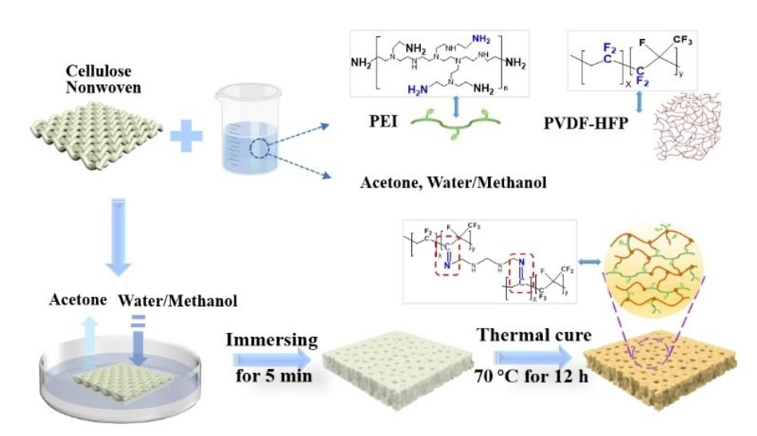
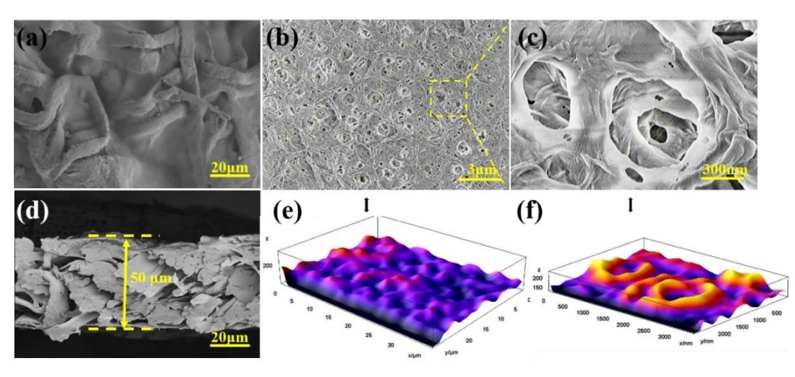
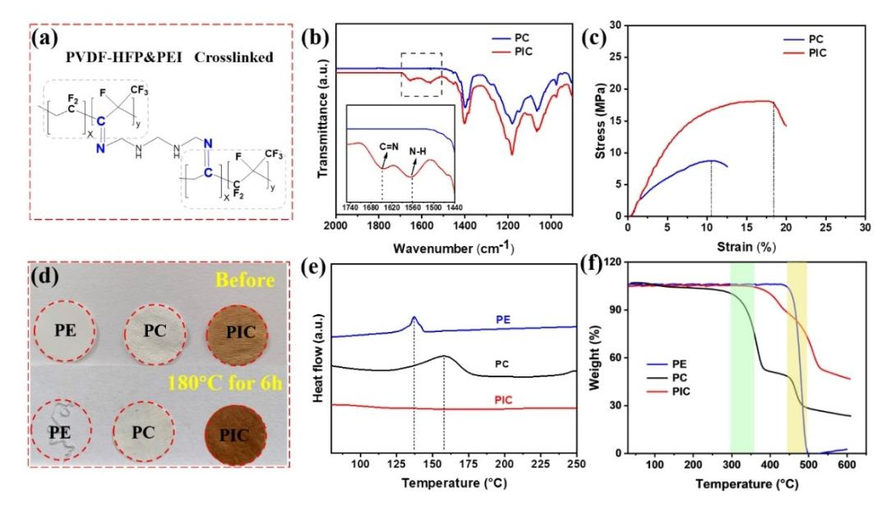
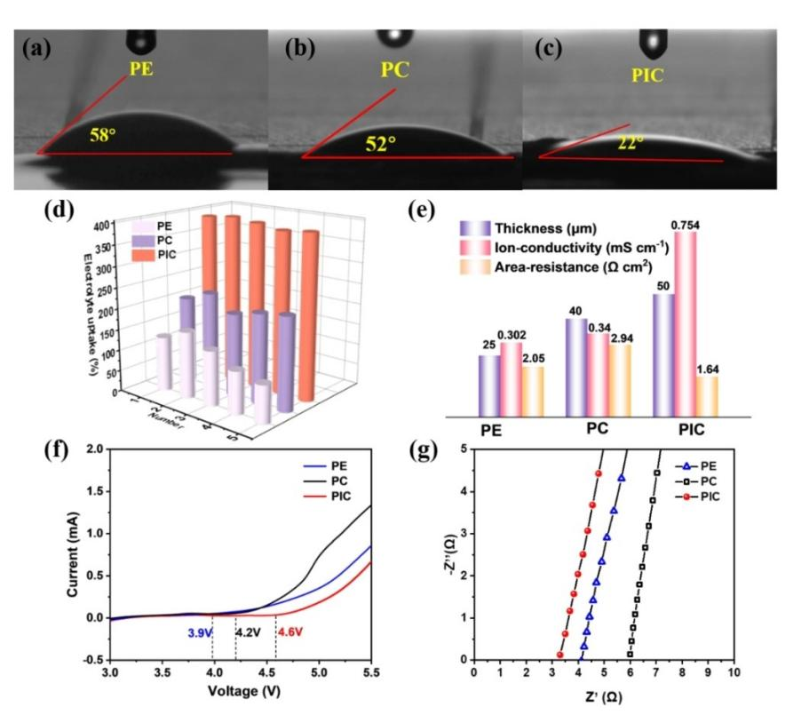
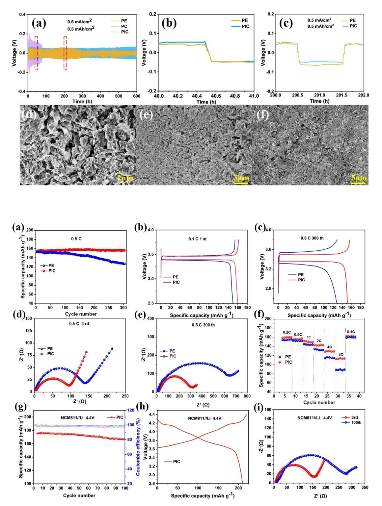

# **Enhancing Cellulose-Based Separator with Polyethyleneimine and Polyvinylidene Fluoride-Hexafluoropropylene Interpenetrated 3D Network for Lithium Metal Batteries**

Xin Yao,[a] [Xiaohui](http://orcid.org/0000-0003-2523-2556) Song,\*[a] Fan Zhang,[a] Jian Ma,[a] Hao Jiang,[a] Lulu Wang,[a] Yongchao Liu,[a] Edison [Huixiang](http://orcid.org/0000-0002-7869-268X) Ang,[b] and [Hongfa](http://orcid.org/0000-0002-6182-1932) Xiang\*[a]

Aside from the electrolyte, a separator is another important component in lithium-based batteries that has a direct impact on the safety feature and electrochemical performances. To overcome the thermal shrinkage and poor electrolyte affinity of commonly used polyolefin separators, cellulose-based separators are appealing due to their abundant polar functional groups, thermal stability, and environmental friendliness, especially for large-sized and high-energy-density batteries. Herein, a porous three-dimensional (3D) network of polymer cellulose-based separator (denoted as PIC) modified with polyethyleneimine (PEI) and polyvinylidene fluoride-hexafluoropropylene (PVDF-HFP) was prepared using a non-solvent induced phase separation approach. The lithium metal batteries

#### **Introduction**

Lithium metal batteries (LMBs) are becoming popular as energy storage devices owing to their high theoretical capacity of 3860 mAhg 1 . [1] As known, the separator in batteries prevents the anode and cathode from interacting, which may result in short-circuiting and thermal runaway. Therefore, it plays a significant role in the safety issue of rechargeable batteries.[2] The separator in the LMB is typically made of microporous polyolefin, but it has a low specific capacity due to poor electrolyte affinity and ion conductivity.[3] Its poor structural stability also cannot prevent the penetration of unavoidable lithium dendrites formed as a result of overcharging, raising safety concerns in current LMB technology.[4] Therefore, the

| [a] X. Yao, Prof. X. Song, F. Zhang, J. Ma, H. Jiang, L. Wang, Y. Liu, Prof. H. Xiang                        |
|-----------------------------------------------------------------------------------------------------------------|
| School of Materials Science and Engineering                                                                     |
| Anhui Provincial Key Laboratory of Advanced                                                                     |
| Functional Materials and Devices                                                                                |
| Hefei University of Technology                                                                                  |
| 230009 Hefei, P. R. China                                                                                       |
| E-mail: Xiaohuisong@hfut.edu.cn                                                                                 |
| hfxiang@hfut.edu.cn                                                                                             |
| [b] Prof. E. Huixiang Ang                                                                                       |
| Natural Sciences and Science Education,                                                                         |
| National Institute of Education,                                                                                |
| Nanyang Technological University                                                                                |
| 637616 Singapore, Singapore                                                                                     |
| Supporting information for this article is available on the WWW under https://doi.org/10.1002/celc.202200390 |

consisting of a PIC separator can deliver a specific capacity of up to 114 mAhg 1 even at a high C-rate of 8 C (1.36 Ag 1 ) after 300 cycles. Such superior performances of the lithium metal batteries can be attributed to the good wetting ability (390% electrolyte absorption) and high ionic conductivity (0.754 mS cm 1 ) of the as-prepared PIC separator. More importantly, the introduction of polyethyleneimine as a cross-linking agent significantly improves the mechanical strength of the separator, promotes the uniform deposition of lithium, and compatibility with high voltage (4.4 V) cathode materials LiNi0.8Mn0.1Co0.1O2. This work demonstrates a new strategy for the separator design for high-performance lithium metal battery applications.

exploration of new and robust separators is urgently needed to resolve this safety issue in LMB.

Cellulose is a promising candidate because of its unique advantages as a renewable, non-toxic, and environmentally friendly alternative to petroleum-based/nylon products.[5] Furthermore, cellulose-based separators have the advantages of low production cost, strong electrophilicity, and good electrochemical stability, all of which are advantageous for practical application as a separator substrate. The abundance of internal hydroxyl groups improves the wetting property between separator and electrolyte.[6] The cellulose nonwoven separator has recently become a popular research object in the LMB field due to its comprehensive characterization and feasibility.[7] More importantly, in contrast to two-dimensional (2D) polyolefin, the three-dimensional (3D) fiber structure is very useful for the structural stability of the separator, which greatly meets the needs of high-safety and high-power LMBs.[8] However, due to its large pore size and low mechanical strength, pristine cellulose nonwoven is not recommended for use in LMBs because Li dendrite can penetrate through it.[9] To narrow the pore size structure of the cellulose-based separator, some inorganic ceramic nanoparticles (Al2O3, SiO2) and polymers such as [polyvinylidene fluoride (PVDF), and polydopamine (PDA)] have been incorporated.[10] Despite this, the integrated nanoparticles tend to fall off the separator's surface, causing a rapid increase in internal resistance and degrading electrochemical performances of LMB.[11] There is a scarcity of literature on optimizing cellulose-based separators from the perspective of

cross-linking mechanisms to secure the composite materials' architecture.

As known, chemical reactions between different functional groups produce cross-linked polymers. Herein, we introduce linear polyvinylidene fluoride hexafluoride polymers (PVDF-HFP), cross-linking agent polyethyleneimine (PEI), and nonsolvent phase transition processes on the surface of the cellulose nonwoven by a simple dip-coating method, and such sample is denoted as PIC (PVDF-HFP, PEI, cellulose nonwoven) separator. The benefits of the cross-linked three-dimensional skeleton structure are used to mitigate the inherent disadvantages of cellulose nonwovens and significantly increase mechanical strength. The hydrogen bonds (H-bonds) of PEI can also interact with carbonate solvents, allowing more liquid electrolytes to be absorbed and permeated. Scanning electron microscopy (SEM) is used to confirm the uniform pore size and high symmetry of the microporous membrane prepared by the phase transition method. As a result, symmetric Lij j Li cell and Lij j LiFePO4 full cell designed with PIC separators exhibits excellent electrochemical performances with a specific capacity of 114 mAhg 1 even at a high C-rate of 8 C (1.36 Ag 1 ) after 300 cycles. In addition, such a functional composite separator can maintain the capacity retention of 93% after 100 cycles when using LiNi0.8Mn0.1Co0.1O2 as the cathode under a cut-off voltage of 4.4 V. Furthermore, cellulose-based separators retain all of the benefits of cellulose materials, such as low cost, strong electrophilicity, and good electrochemical stability. As a result, this research offers a new alternative to commercial polyolefin separators and contributes to the development of LMBs, which are in high demand.

#### **Results and Discussion**

The PIC separator was prepared using a simple dip-coating method, as shown in Figure 1. First, the cellulose nonwoven was immersed in a mixture solution containing polymer, solvent, non-solvent, and cross-linking agent in the proper proportions. The exchange of non-solvent (i. e., water and methanol) and solvent (i. e., acetone) induces a phase transition process, which results in porous structures, depending on the different solubility parameters (Table S1). After that, the cellulose nonwoven fabric was heated at 70°C under a vacuum to create a stable 3D cross-linked network structure.

The morphology of the membrane directly reflects its characteristics and is linked to the overall performance of LMB.[12] The nonwoven is made up of an abundant intricate arrangement of irregularly shaped fibers, as shown by the SEM image (Figure S1). The porous surface of the cellulose nonwoven separator could result in a short circuit of the battery if it is used directly as a separator for LMBs. To compensate for these inherent defects, the PIC separator in our work has enough nanopores that have been distributed uniformly on the surface of the nonwoven fabric attributed to the synergistic help of the phase separation technique, as shown in Figure 2b and Figure 2c. Furthermore, the combination of the two nonsolvents creates a hierarchical porous structure that is better suited to LMB separators.[13] It is worth noting that large pores can be obtained when the solubility parameter gap between the solvent and non-solvent mixture is large (e.g., acetone and water). When solvents with small solubility gaps (such as methanol and acetone) are used, the pores size value is smaller (see Figure S2).[14] Therefore, the mixing of different nonsolvents can synergistically affect the pore sizes of separators. The high-frequency morphology of the PIC separator is revealed in Figure 2c. There is an interconnected microporous structure within the separator domain which provides a three-dimensional skeleton (Figure 2e and f), indicating that the PIC separator could absorb more electrolytes compared with the two-dimensional PE separator (Celgard 2325). In general, excellent electrochemical performance relies on enough number of pores with appropriate distribution of pore size in the membrane. We make PIC separators with a certain pore size distribution and tortuous structure that allow a sufficient amount of liquid electrolyte to be trapped within the interconnected channels in the micropores and maintain high

**Figure 1.** Schematic illustration of the PIC separator preparation procedure.

**Figure 2.** (a) SEM images of PC separator. (b, c) SEM images of the PIC separator showing the surface porosity and skeleton under different magnification values. (d) Cross-sectional morphology of PIC separator. (e, f) 3D surface plots of the PIC separator corresponding to the separator 2D images as shown in a and b, respectively.

ionic conductivity. As shown in Figure S3, the pore diameter distribution of the PIC separator was gradually covered from nanoscale to microscale. Meanwhile, the cross section of the PIC separator is exposed in Figure2d and the nonwoven thicknesses before and after coating with polymers are 36�2 μm and 48� 2 μm respectively shown in Figure S4. For the non-solvent induced phase separation method, the non-solvent diffuses slowly in the membrane formation process and the mass transfer rate is very slow. The whole process can be regarded as a thermodynamic steady state. As a comparison, the SEM image of the PC separator (pure PVDF-HFP coated cellulose nonwoven separator) in Figure 2a identifies that the surface of the cellulose nonwoven is coated by a dense layer of polymer (PVDF-HFP). However, the dense surface layer of the PC separator inhibits the penetration of the electrolyte, which could reduce the ionic conductivity of the cell (seen in Figure 2a and Figure S5).

As shown in Figure 3a, because of the strong polarity of the C F bond and the multiple nucleophilic nature of NH2 in the PEI, the polymer PVDF-HFP can be easily defluorinated and between the PVDF-HFP chains by adding the cross-linking agent PEI, which then reacts to be cross-linked and forms C=N bonds. As the Fourier transform infrared (FT-IR) results are shown in Figure 3b, although the PIC separator exhibits an

**Figure 3.** (a) Cross-linked structure of PVDF-HFP and PEI. (b) The ATR-FTIR spectra of PC and PIC separators. (c) Comparison of stress-strain curves of the PC and PIC separators. (d) Pictures of the PE, PC, and PIC separators before and after thermal treatment at 180°C for 6 h. (e) DSC curves and (f) TG characterization of different separators (PE, PC, and PIC).

absorption band similar to the PC separator in the global spectrum, a different absorption band at 1650 cm 1 can be found in the PIC curve. This peak is due to the C=N stretching vibration, indicating a successful cross-linking reaction between PVDF-HFP and PEI on the nonwoven substrate. At the same time, different bands centered at 1560 cm 1 can be found, corresponding to the N H bending vibrations of the unreacted primary amine group in PEI. The infrared spectrum of PEI is shown in Figure S6.[15] Many parameters, such as thermal stability and mechanical strength of the separator design, were used to determine the safety of LMBs, according to reports.[16] The curves of stress-strain of PC and PIC separators (Figure 3c) show the mechanical property of the PIC separator. The maximum strain rates for PC and PIC separators are found to be 11% and 17%, respectively. The tensile strength (18 MPa) of the PIC separator is higher than that of the PC separator (8 MPa). The cross-linked polymer electrolyte network, as expected, not only improves mechanical properties but also contributes to the coating's strong bonding and stable electrolyte storage capacity, resulting in good electrochemical properties.[17]

The separator should have a certain degree of thermal stability, otherwise, the deformation and contraction at high temperatures will lead to the direct contact of cathode and anode. Such a short circuit may even lead to an explosion.[18] To test the thermal stability of the PIC separator, we placed the separators at 180°C to maintain 6 h, observing the size and color change of the different separators. We can see the PE separator completely shrunk and the color becomes transparent. While the PC and PIC composite separators still maintain their original size and smooth surface as shown in Figure 3d. It is observed that with the increase in temperature, the color of the PIC separator becomes darker, which may be caused by the decomposition of polymer molecules or the continued crosslinking reaction. The differential scanning calorimeter (DSC) curves of cellulose-based composite separators are plotted in Figure 3e. The PE separator presents an obvious thermal absorption peak at 135°C, which corresponds to the melting temperature (Tm) of the PE separator. In contrast, the PC separator showed an absorption peak at 158°C, corresponding to the Tm of PVDF-HFP, which disappeared in the PIC separator. It is shown that the cross-linking agent PEI can stabilize the dispersion state of the system, interfere with the ordered accumulation of polymer chains and reduce the crystal size, thus limiting the melting of the polymer.[19] Moreover, it can be seen from the thermogravimetric (TG) test result in Figure 3f, that the thermal weight loss of the PE separator reaches 100% when the temperature reaches 500°C, indicating that it is completely melted at this temperature. Two-step weight loss can be seen in the DSC curves of PC and PIC separators. The oxidative decomposition of cellulose causes the PC separator to begin to degrade at 370 °C (green region). In addition, secondary weight loss (yellow region) was observed, which corresponded to the decomposition of the blended polymers. The thermal weight loss of the PIC separator is only 55% due to the cross-linked polymers that stabilize the separator's surface. The PC separator, on the other hand, performs poorly in terms of thermal performance when compared to the PIC separator.

Furthermore, the thermal curing reaction of the polymers was performed by heating PVDF-HFP and PEI at 70°C for 0.5 h and 12 h, respectively. It can be seen from Figure S7 that after 0.5 h, the mixture solution turns into light yellow, and curing begins to appear but still has fluidity. And after 12 h, the mixture solution has completely cured, demonstrating that the cross-linking and curing effect of PEI can greatly improve the stability of the separator structure, which further increases the long cycle performance in LMBs.

The wettability of the separator has been shown to significantly affect the overall electrolyte fill time of LMBs.[20] Therefore, to evaluate the wettability of the separators, contact angle measurements were performed by placing drops of electrolyte on different separator surfaces. Results are displayed in Figure 4a to 4c. The PE and PC separators have not been quickly wetted by electrolyte and the contact angle is 58° and 52°, respectively. The contact angle of the PIC separator is 22°. This is due to the cross-linked polymer constructed on the cellulose nonwoven having a high electrolyte affinity. Nonsolvent-induced phase separation has resulted in a highly interconnected pore structure in the PIC composite separator. More liquid can be accommodated because of the 3D interconnected porous structure, allowing electrolytes to penetrate and diffuse more easily inside the separator. The electrolyte uptake of all the samples is tabulated based on Eq. 1 and summarized in Figure 4d. The electrolyte uptake of the PIC separator (390%) is much higher than the PC separator (180%). This indicates that the PIC separator exhibits superior wetting ability and a higher uptake rate when compared to the PC separator.

The Nyquist plot of a SSj j SS symmetrical cell assembled with the electrolyte-soaked separator is shown in Figure 4g. The ionic conductivity of the different separators can be calculated using Eq. (2). The results can be seen in Figure 4e. The PIC separator has the highest ionic conductivity (0.754 mScm 1 ) than that the PE separator (0.302 mScm 1 ) and PC separator (0.34 mScm 1 ). This is due to the synergistic effect of the phase separation process and the cross-linked structure, which is helpful to hinder the movement of the large anions (PF-6) in the electrolyte.[21] We also calculate that the PIC separator has a lower area resistance (1.64 Ωcm2 ) than other separators The separators must maintain a stable electrochemical window for the LMBs during charging and discharging.[22] Therefore, we conduct liner sweep voltammetry (LSV) measurements on different SSjseparatorsj Li cells, as displayed in Figure 4f. It can be observed that the PIC separator decomposes until the voltage increases to 4.6 V (vs. Li+/Li). In contrast, the PE separator starts to decompose at 3.9 V (vs. Li+/Li). This improvement is attributed to the interaction between the highly negatively charged F atoms in the C F polar group of PVDF-HFP and the electrolyte solvent molecules that form polymer gel, which inhibits the decomposition of the solvent molecules and thus enhances the oxidation resistance of the electrolyte.[23] In addition, the coating layer thickness was controlled by adjusting different immersing times, and PIC separators with

**Figure 4.** (a–c) Contact angle of the (a) PE, (b) PC, and (c) PIC separators. (d) The 3D columns showing electrolyte uptake of different separators. Note: there are five samples for each separator to do the survey. (e) Thickness, ion conductivity, and area resistance curves of different separators. (f) LSV curves of Lij j SS cells were fabricated by using different kinds of separators. (g) Nyquist plots of the SS j j SS batteries by using different kinds of separators (the PE, PC, and PIC separators).

different thickness values were used to compare the performance shown in Figure S8 and Table S2. We can see that the thickness of the separator is too thick will reduce the electrochemical performance of the battery while the tensile strength will increase. However, thinner separators do not achieve satisfactory surface modification requirements due to too little immersion time. Therefore, the selection of the appropriate thickness of the separator is critical to the battery's performance.

The cycling performance of the Lijseparatorsj Li symmetrical batteries was measured at 0.5 mAcm 2 to probe the deposition behavior on lithium metal surfaces (Figure 5). The symmetric LijPICj Li cell offers a stable overpotential for more than 600 h compared to LijPE j Li batteries. On contrary, the cellulose separator with pure PVDF-HFP has a large polarization voltage of 0.15 V and the cell becomes short circuit after 80 h, making it difficult to apply in LMB. The surface morphologies of lithium metal in LijPCj Li, LijPE j Li, and LijPICj Li symmetric batteries after 100 h of cycling are reflected in Figure 5d–f. The surface morphology of metal-based lithium on the PC separator shows a loose structure and uncontrolled dendrite growth. When PE is employed, it induces lithium deposition into a striped structure, which consumes a large amount of electrolyte to form the SEI layer. On the contrary, the PIC separator leads to the formation of lithium particles uniformly distributed on the surface of lithium metal. As shown in Figure S9, it was found that the solid electrolyte interface (SEI) layer on the Li metal anodes cycled with the PIC separator had been enriched with LiF (685.0 eV in F 1s spectra) compared with that from the PE separator, which was favorable for regulating the homogeneous deposition of Li+ ions on the surface of Li metal. The result demonstrates that the coating after PEI incorporation effectively prevents lithium dendrite growth and directs a uniform lithiumion flux, indicating superior compatibility with Li metal.[24]

Next, cycling performance and rate performance are quantified using Lij j LiFePO4 cells. The result of a long-cycle performance at 0.5 C is shown in Figure 6a. Cells with PIC separators display more stable cycling performance and better capacity retention (99.39%) than PE separators (82.83%).The initial charge/discharge curves at 0.1 C are presented in Figure 6b. The cell with a PIC separator has a higher initial discharge capacity (159.75 mAhg 1 ) than the PE separator (150.10 mAhg 1 ). In addition, the polarization voltage of the 300 cycles of the PIC separator is also lower (0.14 V) than the PE separator (0.24 V) (Figure 6c), which means that only a small amount of Li+ and electrolyte need to be consumed to form SEI.[25] This unique advantage of the PIC separator is essential for the capacity utilization and higher electrochemical performance of LMBs. Afterward, Nyquist plots are measured after activation (Figure 6d) and 300th cycle (Figure 6e) separately. The cells using PIC separators exhibit low cell resistance, which is consistent with their excellent electrochemical performance,

**Figure 6.** (a) Long-cycling performance profile of the Lij j LFP cell assembled by using PE and PIC separator at 0.5 C. (b, c) Charge/discharge curves of the first at 0.1 C and 300th at 0.5 C, respectively. (d, e) Nyquist spectra of PE and PIC separators in Lij j LFP cells after the 3rd and 300th cycles. (f) Rating performance at different current density. (g) The long-cycling performance profile of the Lij jNCM811 cell was assembled by a PIC separator at 1 C. (h) Initial charge/discharge curves at 0.1 C. (i) Nyquist spectra of PIC separator in Lij jNCM811 cells after the 3rd and 100th cycles.

see Table S3 for details. This result can be attributed to the stable cross-linked structure and interoperable pore shape constructed on the surface of the newly synthesized separator (PIC separator), which reduces charge transfer impedance and **Figure 5.** (a) Cycling performance for symmetric batteries of Lijseparatorsj Li at 0.5 mAcm 2 (d–f) SEM images of lithium metal surface after 100 h of cycling of LijPCj Li, LijPE j Li, and LijPICj Li symmetric batteries, respectively.

brings superior electrochemical performance. In contrast, the PE separator has inherent hydrophobicity, low surface energy, and poor affinity for polar liquid electrolytes, which limit the performance and cycle life of the LMBs.[26] As shown in Figure 6f, . (b, c) Partial enlargement of (a) at 40 h and 200 h, respetively.

it is obvious that with the gradual increase of current density, the discharge capacity decreases. At the same rate, the capacity of the battery fabricated with the PIC separator is superior to that of the PE separator. More specifically, when the current density increases to 1, 2, 4, and 8 C, the PIC separator still delivers higher capacities of 149.92 mAhg 1 (1 C), 141.89 mAhg 1 (2 C), 129.80 mAhg 1 (4 C) and 113.97 mAhg 1 (8 C), respectively, which is superior to the PE separator. Meanwhile, when the current density returns to the initial activation of 0.1 C, cells with both separators can maintain a similar capacity of 160 mAhg 1 . This is attributed to the PIC cross-linked composite separator made by phase transition which can absorb more electrolytes, have higher ionic conductivity, and thus accelerate the migration of Li+. [27] Then, details of the cycling and rate performance of PC separators are shown in Figure S10. In addition, we applied PIC separators to a high-voltage battery system and assembled Lij jNCM811 cells. LMB with PIC separator exhibits stable capacity retention of 93% at 4.4 V at 1 C after 100 cycles, as shown in Figure 6g. Meanwhile, the initial charge/discharge curve shows that the first discharge capacity reaches 210 mAhg 1 and 94% of the charge/discharge efficiency (see Figure 6h). The Nyquist spectra before and after the cycles are shown in Figure 6i, where *R*ct was increased by 100 Ω after 100 cycles. This demonstrates that porous cross-linked polymer cellulose-based separators can stabilize the cycling performance of high-voltage batteries, further enhancing the competitiveness of cellulose-based separators in the field of high-performance batteries.

## **Conclusion**

In summary, we demonstrated a new type of cellulose nonwoven separator using a non-solvent induced phase separation method that is homogeneous and easy to process by incorporating PEI into PVDF-HFP crosslinked into a kind of 3D network. When compared to pure PVDF-HFP coated separators and PE separators, the PIC composite separator has higher mechanical strength (tensile strength 18 MPa), better thermal stability even after 6 hours of treatment at 180°C, and excellent wettability (390% electrolyte absorption), which was attributed to the formation of 3D porous networks within the separator domain, as seen in SEM and X-ray photoelectron spectroscopy (XPS) characterization. The PIC separator demonstrated superior capacity values of 114 mAhg 1 at 8 C and 150 mAhg 1 capacity retention even after 300 cycles at 0.5 C when assembled in Lij j LFP cells. Ionic conductivity improvement (0.754 mScm 1 ) and an electrochemical stable window of 4.6 V (vs. Li+/Li) contribute to the excellent electrochemical capabilities. Meanwhile, the LMB with NMC811 as the cathode and PIC as separator had a cut-off voltage of 4.4 V and retains 93% of its capacity after 100 cycles. Given its abundant resources and low cost, the cellulose-based 3D porous separator developed in this study offers a novel path to developing next-generation separators for LMBs applications.

## **Experiment Section**

#### **Synthesis of PIC Separator**

PVDF-HFP was dissolved in the organic solvent acetone to form a solution with a concentration of 5 wt%. The optimal amount of non-solvent mixture consisting of deionized water (2 wt%) and methanol (3 wt%) solution was then added into acetone and stirred at 40°C for 6 h, until the polymer was completely dissolved. PEI with a mass ratio of 10 wt% of PVDF-HFP was then added to the above solution and stirred for 1 h at room temperature for uniform dispersion. Cellulose nonwoven was used as the coating substrate. Before being coated, the cellulose nonwoven was pressured under 20 MPa for 2 min to reduce its thickness to 36 μm. After pressure, the nonwoven was immersed in the resulting solution for 5 min and naturally dried for 30 min. Finally, the obtained separator (denoted as the PIC separator) was carried out in a vacuum drying oven at 70°C for 12 h to fully remove all residual solvents. As a control, a commercial PE separator (Celgard 2325) and pure PVDF-HFP coated cellulose nonwoven separator (denoted as PC separator) were used for comparison in the following experiments.

#### **Characterization**

FTIR was used to detect functional groups on the surface of the separator to verify the occurrence of cross-linking reactions. Surface element information of LiF was characterized by XPS (ESCALab250 using Al Kα radiation). SEM was applied for surface morphology analysis, and the surface of the separator needs to be sputtered with gold before testing. To study the thermal stability, shrinkage tests were conducted at 180°C for 6 h. DSC was used to test Tm of the separators. A TG analyzer was used to measure the thermal decomposition of separators with a sweep speed of 10°Cmin 1 at the range of 25°C–600 °C, under N2 atmosphere. An electronic strength tester was applied to measure the mechanical strength (stretch speed: 25 mmmin 1 ). The ability to the wet electrolyte of separators was characterized by using the contact angle tester. The following equation [Eq. (1)] is used to quantify the uptake of electrolytes:

$$
Update(\%) = \frac{W_{wet} - W_0}{W_0} \times 100\,\%
$$
\n(1)

where *W*wet is the weight of the wet separator after the incubation in the electrolyte and *W*0 is the weight of the pristine separator.

#### **Electrochemical Performance Measurements**

The cathode was composed of LiFePO4 (Gotion High-tech Power Energy Co., Ltd), conductive carbon additive, and polyvinylidenefluoride (8:1:1, w/w/w) in N-methyl-2-pyrrolidinone. After drying and pressing processes, the LiFePO4 cathode sheet was cut into a round electrode with a Φ14 mm diameter. The positive material LiNi0.8Mn0.1Co0.1O2 (NMC811) was made in a similar process The electrolyte was composed of 1 mol L 1 LiPF6 /EC+DEC (1 :1, w/w). The cell properties of the Lij j LiFePO4 (LFP) CR2023-type coin cells were measured at a voltage range of 2.5 to 3.8 V on a Netware battery text system (Lij jNMC811: 2.8 V–4.4 V). Different values of C-rates (0.2 C–8 C) were set to examine the rate capability while the 0.5 C current value was used to test the cycling charge-discharge ability of the cell. Moreover, stainless steel (SS) jseparatorj Li cells were assembled to measure LSV curves from 3.0 V to 5.5 V (scan rate: 1 mVs 1 ). The ionic conductivity (*σ*) could be calculated according to the following equation [Eq. (2)]:

$$
\sigma = \frac{d}{R_b \times S} \tag{2}
$$

where *R*b is the bulk resistance (intersection of the curve with the Xaxis in the AC impedance spectrum), *d* is the thickness and *S* is the area of the separator. Subsequently, AC impedance after cycling was measured by electrochemical impedance spectroscopy (EIS) with frequencies ranging from 100 kHz to 0.1 Hz

### *Acknowledgments*

*This research was financially supported by the following grant: the National Natural Science Foundation of China (Grant No. 52072105 and Grant No. 21676067) and the Key R&D Program of Anhui Province (Grant No. 202104a05020044). Dr. Xiang thanks the Anhui Provincial Natural Science Foundation (Grant No. 1908085QE178), the Major Science and Technology Projects in Anhui Province (Grant No. 2021e03020001), and the Fundamental Research Funds for the Central Universities (PA2021KCPY0028, JZ2020YYPY0109) for their support. Dr. Song thanks to the financial support of the Start-up grant from Hefei University of Technology (Grant number: 13020-03712021026).*

## *Conflict of Interest*

The authors declare no conflict of interest.

## **Data Availability Statement**

The data that support the findings of this study are available from the corresponding author upon reasonable request.

**Keywords:** cellulose-based separator **·** interpenetrated 3D network **·** lithium metal batteries **·** non-solvent induced phase separation **·** PVDF-HFP and PEI cross-linked

- [1] a) Z. Jiang, S. Wang, X. Chen, W. Yang, X. Yao, X. Hu, Q. Han, H. Wang, *Adv. Mater.* **2020**, *32*, [1906221;](https://doi.org/10.1002/adma.201906221) b) J. He, C. Lu, H. Jiang, F. Han, X. Shi, J. Wu, L. Wang, T. Chen, J. Wang, Y. Zhang, H. Yang, G. Zhang, X. Sun, B. Wang, P. Chen, Y. Wang, Y. Xia, H. Peng, *[Nature](https://doi.org/10.1038/s41586-021-03772-0)* **2021**, *597*, 57–63; c) L. Sheng, Q. Wang, X. Liu, H. Cui, X. Wang, Y. Xu, Z. Li, L. Wang, Z. Chen, G. L. Xu, J. Wang, Y. Tang, K. Amine, H. Xu, X. He, *Nat. Commun.* **2022**, *13*, 172.
- [2] a) M. Su, G. Huang, S. Wang, Y. Wang, H. Wang, *Sci. China [Chem.](https://doi.org/10.1007/s11426-021-1011-9)* **2021**, *64*, [1131–1156](https://doi.org/10.1007/s11426-021-1011-9); b) W. Yao, M. Xu, W. Qiu, J. Wang, Y. Sun, J. Xu, Q. Zhang, *[ChemElectroChem](https://doi.org/10.1002/celc.202100677)* **2021**, *8*, 2836–2845; c) Q. Wang, Y. Lu, J. Jin, C. Chen, Z. Wen, *[ChemElectroChem](https://doi.org/10.1002/celc.202001131)* **2020**, *7*, 4093–4100.
- [3] a) X. Huang, R. He, M. Li, M. O. L. Chee, P. Dong, J. Lu, *[Mater.](https://doi.org/10.1016/j.mattod.2020.07.015) Today* **2020**, *41*, [143–155;](https://doi.org/10.1016/j.mattod.2020.07.015) b) Z. Liu, Y. Jiang, Q. Hu, S. Guo, L. Yu, Q. Li, Q. Liu, X. Hu, *Energy Environ. Mater.* **2020**, *4*, 336–362; c) X. Chen, W. He, L.-X. Ding, S. Wang, H. Wang, *Energy Environ. Sci.* **2019**, *12*, [938–944](https://doi.org/10.1039/C8EE02617C).
- [4] a) H. Yang, X. Shi, S. Chu, Z. Shao, Y. Wang, *Adv. Sci.* **2021**, *8*, [2003096](https://doi.org/10.1002/advs.202003096); b) L. Zhang, X. Li, M. Yang, W. Chen, *Energy [Storage](https://doi.org/10.1016/j.ensm.2021.06.033) Mater.* **2021**, *41*, [522–545](https://doi.org/10.1016/j.ensm.2021.06.033); c) H. Jiang, X. Lin, C. Wei, J. Feng, X. Tian, *[Small](https://doi.org/10.1002/smll.202104264)* **2022**, *18*, [2104264](https://doi.org/10.1002/smll.202104264).
- [5] a) X. Zhang, Q. Sun, C. Zhen, Y. Niu, Y. Han, G. Zeng, D. Chen, C. Feng, N. Chen, W. Lv, W. He, *Energy Storage Mater.* **2021**, *37*, [628–647](https://doi.org/10.1016/j.ensm.2021.02.042); b) Y. Wang, X. Liu, J. Sheng, H. Zhu, R. Yang, *ACS [Sustainable](https://doi.org/10.1021/acssuschemeng.1c04350) Chem. Eng.*

**2021**, *9*, [14756–14765](https://doi.org/10.1021/acssuschemeng.1c04350); c) J. Wen, L. Huang, Y. Huang, W. Luo, H. Huo, Z. Wang, X. Zheng, Z. Wen, Y. Huang, *Energy [Storage](https://doi.org/10.1016/j.ensm.2021.12.033) Mater.* **2022**, *45*, 934– [940;](https://doi.org/10.1016/j.ensm.2021.12.033) d) D. Lasrado, S. Ahankari, K. Kar, *J. Appl. [Polym.](https://doi.org/10.1002/app.48959) Sci.* **2020**, *137*, [48959;](https://doi.org/10.1002/app.48959) e) J. Liu, X. Shi, B. Boateng, Y. Han, D. Chen, W. He, *[ChemSusChem](https://doi.org/10.1002/cssc.201802370)* **2019**, *12*, [908–914.](https://doi.org/10.1002/cssc.201802370)

- [6] a) E. Lizundia, D. Kundu, *Adv. Funct. Mater.* **2020**, *31*, 2005646; b) C. Qi, Z. Li, G. Wang, H. Yuan, C. Chen, J. Jin, Z. Wen, *Adv. [Energy](https://doi.org/10.1002/aenm.202102024) Mater.* **2021**, *11*, [2102024](https://doi.org/10.1002/aenm.202102024).
- [7] a) M.-L. Zhou, Z. Zhang, J. Xu, J. Wei, J. Yu, Z. Y. Yang, *J. [Electroanal.](https://doi.org/10.1016/j.jelechem.2020.114195) Chem.* **2020**, *868*, [114195;](https://doi.org/10.1016/j.jelechem.2020.114195) b) F. Zhang, X. Lan, H. Peng, X. Hu, Q. Zhao, *Adv. Funct. Mater.* **2020**, *30*, [2002169](https://doi.org/10.1002/adfm.202002169); c) Y. Roh, D. Jin, E. Kim, S. Byun, Y.- S. Lee, M. H. Ryou, Y. M. Lee, *Chem. Eng. J.* **2022**, *433*, [134501;](https://doi.org/10.1016/j.cej.2022.134501) d) J. Xiang, Y. Zhang, B. Zhang, L. Yuan, X. Liu, Z. Cheng, Y. Yang, X. Zhang, Z. Li, Y. Shen, J. Jiang, Y. Huang, *Energy Environ. Sci.* **2021**, *14*, [3510–3521.](https://doi.org/10.1039/D1EE00049G)
- [8] a) H. Jiang, Y. Wu, J. Ma, Y. Liu, L. Wang, X. Yao, H. Xiang, *J. [Membr.](https://doi.org/10.1016/j.memsci.2021.119840) Sci.* **2021**, *640*, [119840](https://doi.org/10.1016/j.memsci.2021.119840); b) J. F. Wu, R. Zhang, Q. F. Fu, J. S. Zhang, X. Y. Zhou, P. Gao, C. H. Xu, J. Liu, X. Guo, *Adv. Funct. Mater.* **2020**, *31*, 2008165; c) J. Wang, H. Yang, Z. Chen, L. Zhang, J. Liu, P. Liang, H. Yang, X. Shen, Z. X. Shen, *Adv. Sci.* **2018**, *5*, [1800621.](https://doi.org/10.1002/advs.201800621)
- [9] a) Y. Xu, J. W. Zhu, J. B. Fang, X. Li, M. Yu, Y.-Z. Long, *J. Nanomater.* **2020**, *2020*, 1–10; b) S. Luiso, J. J. Henry, B. Pourdeyhimi, P. S. Fedkiw, *[ACS](https://doi.org/10.1021/acsapm.1c00221) Appl. Polym. Mater.* **2021**, *3*, [3038–3048](https://doi.org/10.1021/acsapm.1c00221); c) D. Lv, J. Chai, P. Wang, L. Zhu, C. Liu, S. Nie, B. Li, G. Cui, *[Carbohydr.](https://doi.org/10.1016/j.carbpol.2020.116975) Polym.* **2021**, *251*, 116975; d) Q. Zhao, R. Zhou, C. Wang, J. Kang, Q. Zhang, J. Liu, Y. Jin, H. Wang, Z. Zheng, L. Guo, *Adv. Funct. Mater.* **2022**, *32*, [2112711.](https://doi.org/10.1002/adfm.202112711)
- [10] a) R. Liu, B. Yuan, S. Zhong, J. Liu, L. Dong, Y. Ji, Y. Dong, C. Yang, W. He, *Nano Select.* **2021**, *2*, [2308–2345;](https://doi.org/10.1002/nano.202100118) b) Z. Zhang, M. Zhou, J. Yu, J. Cai, Z. Yang, *Energy Environ. Mater.* **2020**, *4*, 664–670; c) Y. Wang, J. Luo, L. Chen, J. Long, J. Hu, L. Meng, *J. Power Sources* **2021**, *482*, [228899;](https://doi.org/10.1016/j.jpowsour.2020.228899) d) Q. Xu, Q. Kong, Z. Liu, J. Zhang, X. Wang, R. Liu, L. Yue, G. Cui, *RSC [Adv.](https://doi.org/10.1039/c3ra45879b)* **2014**, *4*, [7845–7850](https://doi.org/10.1039/c3ra45879b); e) S. Yuan, T. Kong, Y. Zhang, P. Dong, Y. Zhang, X. Dong, Y. Wang, Y. Xia, *Angew. Chem. Int. Ed.* **2021**, *60*, [25624–25638;](https://doi.org/10.1002/anie.202108397) f) P. Albertus, V. Anandan, C. Ban, N. Balsara, I. Belharouak, J. Buettner Garrett, Z. Chen, C. Daniel, M. Doeff, N. J. Dudney, B. Dunn, S. J. Harris, S. Herle, E. Herbert, S. Kalnaus, J. A. Libera, D. Lu, S. Martin, B. D. McCloskey, M. T. McDowell, Y. S. Meng, J. Nanda, J. Sakamoto, E. C. Self, S. Tepavcevic, E. Wachsman, C. Wang, A. S. Westover, J. Xiao, T. Yersak, *ACS Energy Lett.* **2021**, *6*, 1399–1404.
- [11] a) Y. Pang, J. Wei, Y. Wang, Y. Xia, *Adv. Energy Mater.* **2018**, *8*, [1702288;](https://doi.org/10.1002/aenm.201702288) b) G. R. Guillen, Y. Pan, M. Li, E. M. V. Hoek, *Ind. Eng. [Chem.](https://doi.org/10.1021/ie101928r) Res.* **2011**, *50*, [3798–3817;](https://doi.org/10.1021/ie101928r) c) Y. Zhu, L. Pei, J. Ambreen, C. He, T. Ngai, *[Macromol.](https://doi.org/10.1002/macp.202000023) Chem. Phys.* **2020**, *221*, [2000023;](https://doi.org/10.1002/macp.202000023) d) S. S. Zhang, X. Fan, C. Wang, *J. [Mater.](https://doi.org/10.1039/C8TA02804D) Chem. A* **2018**, *6*, [10755–10760;](https://doi.org/10.1039/C8TA02804D) e) Y. Zhang, Z. Wang, H. Xiang, P. Shi, H. Wang, *J. [Membr.](https://doi.org/10.1016/j.memsci.2016.02.047) Sci.* **2016**, *509*, 19–26.
- [12] Z. Wang, H. Xiang, L. Wang, R. Xia, S. Nie, C. Chen, H. Wang, *J. [Membr.](https://doi.org/10.1016/j.memsci.2018.02.040) Sci.* **2018**, *553*, [10–16.](https://doi.org/10.1016/j.memsci.2018.02.040)
- [13] a) J. U. Garcia, T. Iwama, E. Y. Chan, D. R. Tree, K. T. Delaney, G. H. Fredrickson, *ACS Macro Lett.* **2020**, *9*, [1617–1624;](https://doi.org/10.1021/acsmacrolett.0c00609) b) S. Ohno, I. Nakata, R. Nagumo, K. Akamatsu, X.-L. Wang, S.-I. Nakao, *Sep. Purif. [Technol.](https://doi.org/10.1016/j.seppur.2021.119331)* **2021**, *276*, [119331.](https://doi.org/10.1016/j.seppur.2021.119331)
- [14] a) M. Kim, J. K. Kim, J. H. Park, *Adv. Funct. Mater.* **2015**, *25*, [3399–3404;](https://doi.org/10.1002/adfm.201500758) b) R. l'Abee, F. DaRosa, M. J. Armstrong, M. M. Hantel, D. Mourzagh, *J. Power Sources* **2017**, *345*, 202–211.
- [15] a) L. Liang, W. Yuan, X. Chen, H. Liao, *Chem. Eng. J.* **2021**, *421*, [130000;](https://doi.org/10.1016/j.cej.2021.130000) b) C. Zhao, X. Yu, X. Da, M. Qiu, X. Chen, Y. Fan, *Sep. Purif. [Technol.](https://doi.org/10.1016/j.seppur.2021.118388)* **2021**, *263*, [118388](https://doi.org/10.1016/j.seppur.2021.118388).
- [16] M. Y. Zhang, M. X. Li, Z. Chang, Y. F. Wang, J. Gao, Y. S. Zhu, Y. P. Wu, W. Huang, *[Electrochim.](https://doi.org/10.1016/j.electacta.2017.05.154) Acta* **2017**, *245*, 752–759.
- [17] a) M. G. Gu, E. Song, S.-K. Kim, *[Macromol.](https://doi.org/10.1007/s13233-021-9025-4) Res.* **2021**, *29*, 211–216; b) S. Cui, X. Wu, Y. Yang, M. Fei, S. Liu, G. Li, X.-P. Gao, *ACS Energy Lett.* **2021**, *7*, 42–52.
- [18] J. Yan, F. Q. Liu, J. Gao, W. Zhou, H. Huo, J. J. Zhou, L. Li, *Adv. [Funct.](https://doi.org/10.1002/adfm.202007255) Mater.* **2021**, *31*, [2007255](https://doi.org/10.1002/adfm.202007255).
- [19] a) J. Zhang, C. Zhu, J. Xu, J. Wu, X. Yin, S. Chen, Z. Zhu, L. Wang, Z.-C. Li, *J. [Membr.](https://doi.org/10.1016/j.memsci.2019.117622) Sci.* **2020**, *597*, 117622; b) M. Hu, Q. Ma, Y. Yuan, Y. Pan, M. Chen, Y. Zhang, D. Long, *Chem. Eng. J.* **2020**, *388*, [124258](https://doi.org/10.1016/j.cej.2020.124258).
- [20] C. Zhu, J. Zhang, X. Zeng, J. Xu, L. Wang, Z. C. Li, *[ChemElectroChem](https://doi.org/10.1002/celc.202001232)* **2020**, *7*, [4492–4500.](https://doi.org/10.1002/celc.202001232)
- [21] a) C. F. J. Francis, I. L. Kyratzis, A. S. Best, *Adv. Mater.* **2020**, *32*, [1904205;](https://doi.org/10.1002/adma.201904205) b) M. R. Asghar, M. T. Anwar, A. Naveed, J. Zhang, *[Membranes](https://doi.org/10.3390/membranes9070078)* **2019**, *9*, [78–113](https://doi.org/10.3390/membranes9070078).
- [22] S. Tian, Y. Wang, T. Cai, D. Kong, D. Wang, H. Ren, W. Xing, *[Appl.](https://doi.org/10.1016/j.apsusc.2020.147635) Surf. Sci.* **2020**, *534*, [147635.](https://doi.org/10.1016/j.apsusc.2020.147635)
- [23] W.-W. Wang, Y. Gu, H. Yan, S. Li, J.-W. He, H. Y. Xu, Q.-H. Wu, J. W. Yan, B. W. Mao, *Chem.* **2020**, *6*, [2728–2745.](https://doi.org/10.1016/j.chempr.2020.07.014)

- [24] a) F. Zhu, J. Liu, H. Zhao, J. Li, Q. Li, Y. Xi, M. Liu, C. Wang, *[ChemElectroChem](https://doi.org/10.1002/celc.201900426)* **2019**, *6*, 2883–2890; b) J. Ryu, D. Y. Han, D. Hong, S. Park, *Energy Storage Mater.* **2022**, *45*, [941–951;](https://doi.org/10.1016/j.ensm.2021.12.046) c) Q. Zhao, R. Zhou, C. Wang, J. Kang, Q. Zhang, J. Liu, Y. Jin, H. Wang, Z. Zheng, L. Guo, *[Adv.](https://doi.org/10.1002/adfm.202112711) Funct. Mater.* **2022**, *32*, [2112711](https://doi.org/10.1002/adfm.202112711).
- [25] J. Zeng, Q. Liu, D. Jia, R. Liu, S. Liu, B. Zheng, Y. Zhu, R. Fu, D. Wu, *[Energy](https://doi.org/10.1016/j.ensm.2021.07.002) Storage Mater.* **2021**, *41*, [697–702.](https://doi.org/10.1016/j.ensm.2021.07.002)
- [26] K. Huang, S. Bi, B. Kurt, C. Xu, L. Wu, Z. Li, G. Feng, X. Zhang, *[Angew.](https://doi.org/10.1002/anie.202104671) Chem. Int. Ed.* **2021**, *60*, [19232–19240](https://doi.org/10.1002/anie.202104671).
- [27] B. Yuan, K. Wen, D. Chen, Y. Liu, Y. Dong, C. Feng, Y. Han, J. Han, Y. Zhang, C. Xia, A. Sun, W. He, *Adv. Funct. Mater.* **2021**, *31*, [2101420](https://doi.org/10.1002/adfm.202101420).

Manuscript received: April 8, 2022 Revised manuscript received: May 30, 2022 Accepted manuscript online: May 31, 2022