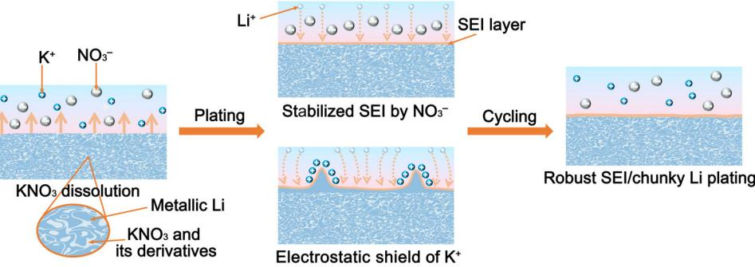
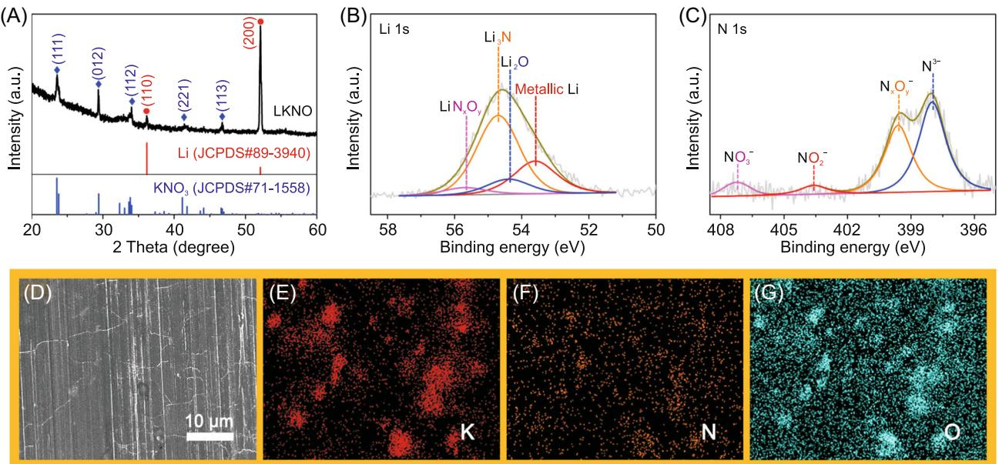
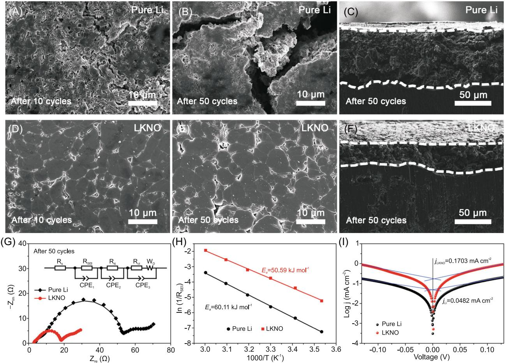
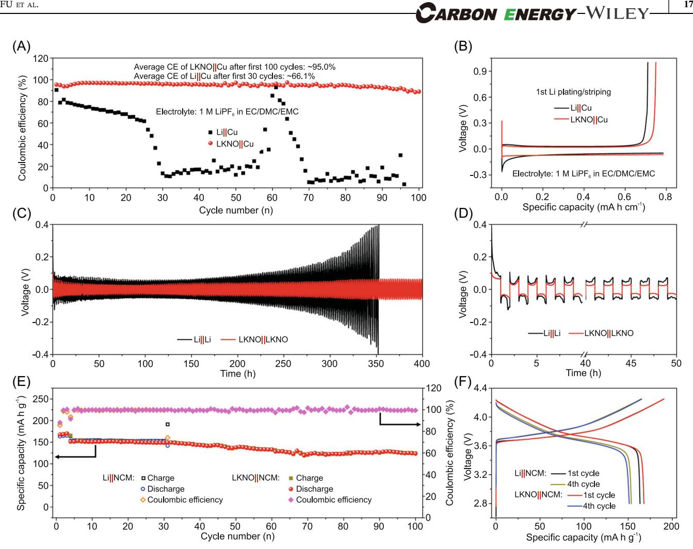

#### DOI: 10.1002/cey2.169

# Insights on "nitrate salt" in lithium anode for stabilized solid electrolyte interphase

Lin Fu1 | Xiancheng Wang1 | Zihe Chen1 | Yuanjian Li1 | Eryang Mao1 | Zhi Wei Seh2 | Yongming Sun1

1 Wuhan National Laboratory for Optoelectronics, Huazhong University of Science and Technology, Wuhan, China

2 Institute of Materials Research and Engineering, Agency for Science, Technology and Research (A\*STAR), Singapore, Singapore

#### Correspondence

Yongming Sun, Wuhan National Laboratory for Optoelectronics, Huazhong University of Science and Technology, 430074 Wuhan, China. Email: [yongmingsun@hust.edu.cn](mailto:yongmingsun@hust.edu.cn)

#### Abstract

A Li/KNO3 composite (LKNO), with KNO3 uniformly implanted in bulk metallic Li, is fabricated for battery anode via a facile mechanical kneading approach, which exhibits high Coulombic efficiency and prolonged cycle life. The mechanism behind the enhanced electrochemical performance of the "salt‐in‐metal" composite is investigated, where KNO3 in metallic Li composite electrode would be sustainably released into the electrolyte. The presence of NO3 – stabilizes the solid electrolyte interphase by producing functional Li3N, LiNxOy, and Li2O species. K+ from KNO3 also helps to form an electrostatic shield after its adsorption on the electrode protrusions, which suppresses the dendritic growth of metallic Li. With the above advantages, uniform Li plating with dense and planar structure is realized for the LKNO electrode. These findings reveal a deep understanding of the effect of the "salt‐ in‐metal" anode and provide new insights into the use of nitrate additives for high‐energy‐density Li metal batteries.

#### KEYWORDS

electrostatic shield, Li metal battery, Li/KNO3 composite, salt‐in‐metal, stabilized solid electrolyte interphase, sustained release

# 1 | INTRODUCTION

Metallic lithium (Li) has been regarded as one of the most promising anodes for next‐generation rechargeable batteries owing to its highest theoretical specific capacity (3860 mA h g–1 ) and lowest electrochemical potential (–3.04 V vs. standard hydrogen electrode).[1](#page-7-0)–5 However, the huge volume fluctuations, together with the high reactivity of metallic Li, can result in repeated cracking/ reformation of solid electrolyte interphase (SEI) and serious side reactions with electrolyte during the Li plating/stripping processes, thus leading to nonuniform Li plating/stripping behavior, low Coulombic efficiency (CE), short lifespan, and even safety hazards[.6](#page-7-1)–8 This process continuously consumes active Li and electrolyte, accompanied by quick SEI and dead Li accumulation. It has been verified that SEI plays a crucial role in determining the electrochemical performance of Li metal anode[.9](#page-7-2) An ideal SEI should enable uniform Li plating/ stripping and suppress the side reactions between

This is an open access article under the terms of the Creative Commons Attribution License, which permits use, distribution and reproduction in any medium, provided the original work is properly cited.

© 2022 The Authors. Carbon Energy published by Wenzhou University and John Wiley & Sons Australia, Ltd.

Lin Fu and Xiancheng Wang contributed equally to this study.

metallic Li and electrolytes[.10](#page-7-3) The structure and properties of SEI can be regulated by changing the components of electrolytes, which is feasible in practical industry application due to its facile preparation and low cost[.11](#page-7-4)

The introduction of functional electrolyte additive into conventional electrolytes helps to regulate the SEIs and has shown improvement in electrochemical performance of Li metal anode[.12](#page-7-5) The anions from additives can facilitate the solvation of Li+ in electrolytes, and they can be reduced by metallic Li to form an inorganic‐rich SEI layer on the electrode surface[.13,14](#page-7-6) Inorganic compounds in SEI decrease the bonding between Li metal anode and its surface SEI owing to their higher interfacial energy with metallic Li, directly resulting in Li preferential diffusion along the SEI/Li interface.[14,15](#page-7-7) Also, inorganic‐rich SEI has an improved mechanical strength, which can suppress Li dendrite growth[.16](#page-7-8) Nitrates are representative inorganic electrolyte additives.[17](#page-7-9)–19 The NO3 – can react with metallic Li to form inorganic Li3N, LiNxOy, and Li2O uniformly distributed in the SEI, which improves the Li plating/stripping behavior and enhances the electrochemical performance.[16,20](#page-7-8) With high Li+ conductivity and electronic resistivity, Li3N and LiNxOy can accelerate Li+ migration through the SEI layer, leading to uniform and fast Li plating/stripping[.21](#page-7-10)–23 The existence of Li2O can improve the mechanical strength of SEI and result in enhanced structural stability on cycling[.24,25](#page-7-11) However, nitrates possess ultralow solubility in carbonate electrolytes, which makes it difficult to directly introduce these nitrates in carbonate electrolytes.[26](#page-7-12)–28 In recent years, abundant studies have been devoted to addressing this issue, including loading nitrates between separator and electrode, in which nitrates can be released into electrolyte during cycling, and using solubilizers in the electrolyte to enhance the solubility of nitrates.[16,17,21,27](#page-7-8) In our previous work, we proposed a "salt‐in‐metal" concept: we designed metal/nitrate composite foils (such as Li/LiNO3 and Na/NaNO3) using a facile and low‐cost mechanical kneading approach at ambient temperature, and nitrates were successfully implanted in the electrode[.29,30](#page-7-13) Despite the significant improvement in electrochemical performance, the understanding of the mechanism/effect of nitrates on electrolytes and SEI is still lacking.

In this study, Li/KNO3 (LKNO) was fabricated as a model system to investigate the effect of nitrates in "salt‐ in‐metal" composite on the electrolyte, SEI, and electrochemical performance, where KNO3 particles were implanted uniformly within the metallic Li. Experimental results revealed that KNO3 in the LKNO composite could be released into the electrolyte and remained as a stable component on cycling, which could dynamically repair the SEI and stabilize the Li metal electrode on cycling. Importantly, K+ from KNO3 could adsorb on the protrusions of the electrode to form an electrostatic shield and

FU ET AL. | 13

suppress the dendritic growth[.31,32](#page-7-14) With these advantages, stable cycling in both LKNO||LKNO symmetric cells and LKNO||LiNi0.6Mn0.2Co0.2O2 (LKNO||NCM) full cells with high cathode loading (~15 mg cm–2 ) were realized. A deep understanding of the mechanism behind the enhanced electrochemical performance of nitrate additives and the exploration of advanced "salt‐in‐metal" composite anodes provide new insights for the realization of practical Li metal batteries and beyond.

# 2 | EXPERIMENTAL SECTION

# 2.1 | Materials synthesis

KNO3 powders and metallic Li foil were purchased from Aladdin reagent Co., Ltd. and China Energy Lithium Co., Ltd., respectively. LKNO composite material was synthesized via a simple mechanical kneading method in an Ar‐filled glovebox. First, KNO3 powders (25 wt% of the total weight of Li/KNO3 mixture) were spread uniformly on metallic Li foil, which was then folded to form a Li|KNO3 | Li sandwich. Then, this Li|KNO3 | Li sandwich was repeatedly rolled and folded to produce a homogeneous LKNO composite foil.

# 2.2 | Material characterization

The compositions and morphologies of metallic Li and LKNO composite electrodes were identified via X‐ray diffraction (XRD) patterns (Empyrean, PANalytical B.V.) with Cu‐Kα radiation (voltage of 40 kV and current of 40 mA), field emission scanning electron microscope (SEM, GeminiSEM300), and X‐ray photoelectron spectroscopy (XPS, AXIS‐ULTRA DLD‐600W). Before the characterization of cycled samples, the cycled cells were first disassembled, and the electrodes were rinsed using dimethyl carbonate (DMC) solvent and then dried in Ar‐ filled glovebox. All the samples for XRD, SEM, and XPS investigation were sealed in Ar‐filled glovebox before the measurement. The elements in electrolyte were detected by inductively coupled plasma optical mission spectrometry (ICP‐OES, ELAN DRC‐e) source mass spectrometer. Cells after storage for 8 h or after 10 Li plating/ stripping cycles at 1 mA cm−2 and 1 mA h cm−2 were disassembled, and the electrolyte was transferred to a vial and then diluted with water for ICP‐OES measurement.

# 2.3 | Electrochemical measurement

Coin‐type cells (CR2032) were assembled for all electrochemical tests. Electrolyte for full cells, Li||Cu cells, and

LKNO||Cu cells was 1 M LiPF6 in ethylene (EC)/ethyl methyl carbonate (EMC)/DMC with 5 wt% fluoroethylene carbonate (FEC) as additive, and for others was 1 M LiPF6 in EC/EMC/DMC. Electrochemical impedance spectroscopy (EIS) was collected on a Biologic VMP3 workstation with a frequency range from 100 kHz to 100 mHz. Exchange current density was calculated from the Tafel curves collected from the linear sweep voltammetry at the voltage range from −0.13 to 0.13 V with a sweep rate of 1 mV s–1 . Li metal full cells with NCM cathode were tested between 2.8 and 4.25 V for the initial three activation cycles at 0.1 C (1 C = 170 mA g–1 ) followed by cycling at 0.5 C. Li||LCoO2 and LKNO|| LCoO2 full cells were tested between 3 and 4.2 V, the current density was 0.1 C (1 C = 140 mA g–1 ) for the initial five activation cycles and 0.5 C for the subsequent cycling.

# 3 | RESULTS AND DISCUSSION

The LKNO composite electrode, featuring KNO3 particles uniformly embedded within metallic Li bulk, was realized using a mechanical kneading approach according to our previous study.[29](#page-7-13) The mechanism/effect of KNO3 on the electrochemical behavior of metallic Li is illustrated in Figure [1.](#page-2-0) When contacted with the electrolyte, KNO3 on the surface of the LKNO electrode was dissolved into the electrolyte in the forms of NO3 − and K+. NO3 − would be further reduced by metallic Li into Li3N, LiNxOy, and Li2O to construct stabilized SEI with high ionic conductivity and mechanical strength,[21,25,31](#page-7-10) while K+ tended to adsorb on the tips of pristine‐plated Li and formed an electrostatic shield to ensure the planar Li deposition.[26,31](#page-7-12) Note that the SEI would be broken during the Li stripping/plating process accompanied by a large volume change. KNO3 in the electrolyte could help to repair the SEI dynamically. Though KNO3 would be consumed during such SEI repairing process, its dissolution from the LKNO took place accompanied by the exposure of fresh KNO3 to liquid electrolyte during the electrochemical Li stripping process. Such a process ensured the long‐term existence of NO3 − and K+ with an adequate concentration in the electrolyte to enable a stable Li metal electrode. The as‐realized stable SEI with high ionic conductivity and mechanical strength could homogenize the Li plating/stripping processes and avoid the formation of dendritic deposits. Figure S1 schematically illustrates the cycling processes of pure Li and LKNO composite electrodes. Due to the formation of abundant mossy/dendritic Li with high surface area, SEI and "dead Li" would quickly accumulate on the surface of the pure Li electrode, which cut off the ionic transport and increased the cell impedance, finally leading to fast cell failure. Benefitting from the stabilized SEI with high ionic conductivity of the LKNO composite electrode, the growth of Li dendrites and inactive Li accumulation were suppressed, and thus superior cycling performance could be achieved.

LKNO composite electrode with 25 wt% KNO3 was used as a model example to investigate the effect of nitrates on the structure, property, and electrochemical performance of the electrode. Li3N and Li2O species could be produced due to the spontaneous reaction between metallic Li and partial KNO3. These species were uniformly distributed within the entire composite electrode, which enhanced the electrochemical stability of the Li metal electrode. The related reactions are as follow[s33:](#page-7-15)

$$
KNO_3 + 2Li \rightarrow KNO_2 + Li_2O
$$

$$
\Delta H_{calculated} = -407kJ \text{mol}^{-1},
$$

$$
2KNO_2 + 12Li \rightarrow 2Li_3N + 3Li_2O + K_2O
$$

$$
\Delta H_{calculated} = -1437kJ \text{mol}^{-1}.
$$

The as‐fabricated LKNO displayed a high specific capacity of ~2427.6 mA h g−1 according to the result of electrochemical Li stripping measurement of LKNO||Li

FIGURE 1 Schematics for dissolution process of KNO3 from LKNO electrode to electrolyte and effect of KNO3 on cycling

cell (Figure S2). The phase structure of the LKNO composite electrode was revealed by XRD. Coexistence of metallic Li and KNO3 was revealed in the LKNO composite (Figures [2A](#page-3-0) and S3). Note that the existence of KNO3 in the LKNO electrode provided sources for the continuous release of KNO3 for SEI repairing on cycling. The surface compositions of the LKNO composite electrode were further detected using XPS. High‐resolution Li 1s (Figure [2B\)](#page-3-0), N 1s (Figure [2C](#page-3-0)), and O 1s (Figure S4B) spectra revealed the existence of Li3N, LiNxOy, and Li2O components,[34](#page-7-16)–37 corresponding to the reduction products between KNO3 and metallic Li due to their spontaneous reaction. Besides the existence of these reduction products, the peak at 407.24 eV in the high‐resolution N 1s spectrum,[38](#page-8-0) and peaks at 292.95 and 295.75 eV in the high‐resolution K 2p spectrum correspond to the XPS results of KNO3 powders (Figure S5), suggesting the coexistence of KNO3 and its reduction products. SEM measurement was also conducted to explore the surface morphology of the LKNO composite electrode. Similar to metallic Li foil (Figure S6A), a smooth and flat surface was observed on the LKNO composite electrode, indicating the successful fabrication of high‐quality LKNO composite foil. The energy‐dispersive X‐ray spectroscopy (EDS) mapping images were also provided to analyze the surface element distribution of the LKNO composite electrode (Figure [2D](#page-3-0)–G). Compared with the pristine KNO3 particles with sizes above 50 μm (Figure S7), the elemental mapping images of K, N, and O obviously show the outlines of KNO3 particles (within 10 μm) after

FU ET AL. | 15

being embedded within the Li bulk. These results reveals the size reduction of KNO3 powders during the preparation process of LKNO composite, which is helpful for improving the mechanical strength and electrochemical performance.

To verify the dissolution of KNO3 from the LKNO composite electrode to the electrolyte, the concentration of K element in the electrolyte in LKNO||LKNO symmetric cells was measured by inductively coupled plasma optical emission spectrometry (ICP‐OES) test. The concentration of K in the electrolyte reached ~450 ppm for an LKNO||LKNO symmetric cell after storage for 8 h. The electrolyte contained ~620 ppm of K in LKNO||LKNO symmetric cells after 10 Li plating/stripping cycles at 1 mA cm−2 and 1 mA h cm−2 . These results indicate that the KNO3 in the LKNO composite can dissolve into the electrolyte during the cell resting and act as a supplement during the Li stripping/plating processes to replenish the irreversible consumption. The continued existence of KNO3 in the electrolyte can adjust the solvent sheath of Li+ in the electrolyte and stabilize the SEI, thus improving the Li stripping/plating behaviors.

To reveal the effect of KNO3 on the electrochemical properties of the LKNO electrode, Li stripping/plating behavior was investigated. After initial Li stripping at 1 mA cm−2 and 1 mA h cm−2 , large curves of >20 μm were observed for the pure Li electrode (Figure S8). In contrast, the LKNO electrode exhibited a more flat surface after initial Li stripping (Figure S9A,B), indicating more uniform Li stripping behavior due to the existence

FIGURE 2 (A) XRD pattern, high‐resolution (B) Li 1s, and (C) N 1s XPS spectra of LKNO composite. (D) SEM image of LKNO composite and (E–G) the corresponding EDS mapping images. EDS, energy‐dispersive X‐ray spectroscopy; SEM, scanning electron microscope; XPS, X‐ray photoelectron spectroscopy; XRD, X‐ray diffraction

of Li3N, LiNxOy, and Li2O‐rich SEI that promoted uniform Li+ diffusion through the SEI. The EDS mapping images of the LKNO electrode after Li stripping confirm the uniform distribution of KNO3 and its reduction products (Figure S9C–F), supporting the homogeneous Li stripping behavior. Figure S10 schematically illustrates the Li stripping behavior of pure Li and LKNO composite electrode. Ionically conductive species (Li3N and LiNxOy) in the LKNO electrode (interconnected KNO3 derivatives) ensured the fast and uniform charge transfer through the SEI as well as the even Li stripping behavior. In contrast, the uneven SEI on the pure Li induced inhomogeneous Li+ diffusion, thus leading to the severely uneven Li stripping behavior. Also, the morphology of Li dendrites was observed on the Li metal electrode after initial Li plating at 1 mA h cm−2 and 1 mA cm−2 (Figure S11). The synergistic effect of KNO3 enables stable Li plating behavior with chunky deposition (Figure S12), which is critical for the long‐term cycling of Li metal anode.

The structure of the pure Li and LKNO composite electrodes after different cycles was further investigated using SEM. The pure Li electrode showed a loose and porous structure after 10 cycles at 1 mA cm−2 and 1 mA h cm−2 (Figure [3A](#page-4-0)). The porous structure layer further evolved: micrometer‐sized cracks formed on the electrode surface (Figure [3B\)](#page-4-0) and the thickness of such a porous layer reached ~100 μm after 50 cycles (Figure [3C\)](#page-4-0). The reason for the formation of a loose and porous layer of pure Li metal electrode comes from continuous

FIGURE 3 Morphology evaluation of the pure Li and LKNO composite electrodes on cycling. For SEM measurement, Li||Li and LKNO||LKNO symmetric cells were disassembled after cycling at 1 mA cm−2 and 1 mA h cm−2 . (A) Top‐view SEM image of a pure Li electrode after 10 cycles. (B) Top‐view and (C) cross‐sectional SEM images of a pure Li electrode after 50 cycles. (D) Top‐view SEM image of the LKNO electrode after 10 cycles. (E) Top‐view and (F) cross‐sectional SEM images of a pure LKNO electrode after 50 cycles. (G) Nyquist plots of the pure Li and LKNO composite electrodes after 50 cycles. Rs, RSEI, Rrl, and Rct represent the solution, SEI layer, reaction layer, and charge transfer resistances, respectively. The inset shows an equivalent circuit model. (H) Activation energies of Li+ through the SEI layer for pure Li and LKNO composite electrodes. (I) Tafel curves of the Li||Li and LKNO||LKNO symmetric cells derived from linear sweep voltammetry tests. SEM, scanning electron microscope

FIGURE 4 (A) CE of Li||Cu and LKNO||Cu cells with the discharge capacity of 1 mA h cm−2 and charged to 1 V under 1 mA cm−2 , and (B) the corresponding voltage profiles. (C, D) Galvanostatic voltage profiles of Li||Li and LKNO||LKNO symmetric cells at 1 mA cm−2 and 1 mA h cm−2 . (E) Cycling performance of the Li||NCM and LKNO||NCM full cells at 0.1 C (the first three cycles) and 0.5 C (the following cycles), and (F) the corresponding voltage profiles. CE, Coulombic efficiency

dendritic Li growth and accumulation of "dead Li," accompanied with the consumption of electrolyte. In contrast, chunky Li plating with dense structure was realized for LKNO electrode after both 10 cycles (Figure [3D\)](#page-4-0) and 50 cycles (Figure [3E](#page-4-0)). Compared with the initial Li plating (Figure S9A,B), the improvement of morphology is consistent with the increase of KNO3 concentration in the electrolyte. Also, the thickness of the porous layer of the LKNO electrode was <50 μm, much smaller than that of the pure Li electrode (Figure [3F](#page-4-0)), showing the superiority of the LKNO electrode in regulating Li plating behavior and suppressing side reactions. EIS measurement was conducted to further investigate the evolution of electrode structure during cycling. Interface impedance of LKNO composite was significantly reduced compared with pure Li after 50 cycles (Figure [3G](#page-4-0)) due to the suppressed side reactions, leading to relatively uniform Li plating behavior. There could be two reasons for the improved Li stripping/plating behavior and reduced electrochemical impedance of the LKNO electrode. At the electrode side, the formation of Li3N, LiNxOy, and Li2O‐rich SEI could homogenize charge transfer and thus ensure uniform Li stripping/plating. At the electrolyte side, KNO3 that dissolved into electrolyte from the composite electrode could repair the SEI by reducing NO3 − with metallic Li and distributing electrostatic shield by K+ adsorbing on the tip of plated Li[,26,32](#page-7-12) leading to stable SEI and smooth Li plating on cycling.

The interface properties of the LKNO electrode were further evaluated by the Li+ diffusion energy barrier through SEI via EIS measurement at different temperatures. By fitting the Nyquist plots with the equivalent circuit (Figure S13), the value of RSEI (resistance from SEI) was obtained. The relationship between RSEI and temperature can be described using the Arrhenius formula: "RSEI−1 = Aexp(−Ea/RT)." By fitting ln(RSEI−1 )

with T−1 linearly (Figure [3H](#page-4-0)), the energy barrier Ea for Li+ diffusion through SEI was obtained. LKNO electrode showed obviously reduced value of Ea compared with pure Li electrode (50.59 vs. 60.11 kJ mol−1 ), indicating that Li+ diffusion through SEI was easier for the LKNO electrode.[30](#page-7-17) Exchange current density was also measured to compare the charge transfer kinetics for pure Li and LKNO composite electrodes. From the Tafel curves (derived using linear sweep voltammetry) in Figure [3I,](#page-4-0) exchange current densities were 0.1703 mA cm−2 for the LKNO electrode and 0.0482 mA cm−2 for the pure Li electrode, revealing the improved charge transfer kinetics for the LKNO composite electrode.[29](#page-7-13)

The electrochemical performance was evaluated to further show the superiority of the LKNO composite electrode. LKNO||Cu and Li||Cu cells were assembled, and their CE for electrochemical Li plating/stripping was compared. LKNO||Cu cell showed a high average CE of ~95.0% for 100 Li plating/stripping cycles (Li plating at 1 mA h cm−2 and 1 mA cm−2 , and stripping with the cutoff voltage of 1 V vs. Li+/Li at 1 mA cm−2 , Figure [4A\)](#page-5-0) in comparison to ~66.1% for the Li||Cu cell for 30 cycles (it failed after 30 cycles). Also, the LKNO||Cu cells displayed much smaller voltage polarization and nucleation overpotential than Li||Cu (Figure [4B\)](#page-5-0). FEC electrolyte additive can stabilize the SEI of Li metal through the formation of inorganic LiF with high interface energy in the SEI layer, which is similar to nitrates.[14,16](#page-7-7) Interestingly, introducing FEC as a solubilizer can enhance the solubility of nitrates in the carbonate electrolyte, and LiF, Li3N, and LiNxOy in the SEI have a synergistic effect in stabilizing Li metal anode.[39,40](#page-8-1) Therefore, with 5 wt% FEC addition in the electrolyte (Figure S14), LKNO||Cu cells showed an even higher average CE of 97.9%, in contrast to 91.8% for Li||Cu cells. The above results further verify the advanced "salt‐in‐metal" composite anode design utilizing the sustained release of nitrate into the electrolyte for stable cycling.

LKNO||LKNO and Li||Li symmetric cells were then assembled and cycled at 1 mA cm−2 and 1 mA h cm−2 (Figure [4C\)](#page-5-0). Supported by the enhanced charge transfer kinetics through the interface, the LKNO electrode showed flat and smooth voltage profiles with low overpotential (~0.06 V after 400 h) in sharp contrast to ~0.18 V of pure Li electrode after 300 h. The sustained release of KNO3 from LKNO into electrolyte ensured dynamic repairing of SEI by NO3 − and dense Li plating due to the electrostatic shield of K+ during long‐term cycling[.26,31,32](#page-7-12) As a comparison, a fast increase of voltage polarization occurred for pure Li electrode. In our previous reports, we have revealed that the coexistence of Li3N, LiNxOy, and Li2O components can adjust the pristine Li nucleation and reduce the nucleation overpotential[.29](#page-7-13) Same phenomenon was found in this LKNO composite electrode (0.1 V for LKNO compared with 0.38 V for metallic Li), further confirming the advancement of the "salt‐in‐metal" composite electrode structure (Figure [4D](#page-5-0)).

EIS results of the cells exhibit stable impedance of the LKNO electrode after resting for different times (6 and 12 h, Figure S15), indicating suppressed side reactions with electrolyte and superior interface stability of the LKNO composite electrode on cycling. The LKNO electrode is promising to improve the Li/solid electrolyte interface in solid‐state batteries due to its enhanced stability.[41](#page-8-2)–43 LKNO||NCM and Li||NCM full cells with a low negative/positive capacity ratio (<5) were investigated to explore the possibility for practical application of the LKNO electrode. Due to the suppressed side reactions of LKNO electrode with electrolyte, LKNO|| NCM full cells showed stable charge/discharge cycles up to 100 cycles with high capacity retention above 81.7% (Figure [4E,F\)](#page-5-0). In sharp contrast, the Li||NCM full cells failed at the 32th cycle, which may be caused by the fast exhaustion of electrolytes (Figure S16). The superior cycling stability of LKNO||LiCoO2 full cell compared with Li||LiCoO2 full cell further confirmed the promise of the "salt‐in‐metal" electrode design for practical application (Figure S17).

# 4 | CONCLUSION

In conclusion, an LKNO composite electrode featured with KNO3 embedded within the Li bulk was successfully synthesized, and the effect of nitrates of "salt‐in‐ metal" composite on electrolyte and SEI was investigated in detail. Sustained release of NO3 − from the electrode into electrolyte was realized, which stabilized the SEI. Also, K+ tended to adsorb on the tip of deposited Li and induce planar Li plating, leading to uniform Li plating/ stripping behavior of LKNO. The rational design of the "salt‐in‐metal" electrode and its synergistic effect for stable electrochemical cycling provide new insights for the application of functional additives in stabilizing alkali metal anodes.

#### ACKNOWLEDGMENTS

Y. Sun acknowledges the financial support of the National Natural Science Foundation of China (No. 52072137). Z. W. Seh acknowledges the support of the Singapore National Research Foundation (NRF‐NRFF2017‐04). Also, the authors would like to thank the Analytical and Testing Center of Huazhong University of Science and Technology as well as the Center for Nanoscale Characterization and Devices of Wuhan National Laboratory for FU ET AL. | 19

#### CONFLICT OF INTEREST

The authors declare no conflict of interest.

#### REFERENCES

- 1. Cheng XB, Zhang R, Zhao CZ, Zhang Q. Toward safe lithium metal anode in rechargeable batteries: a review. Chem Rev. 2017;117(15):10403‐10473.
- 2. Yan X, Lin L, Chen Q, et al. Multifunctional roles of carbon‐ based hosts for Li‐metal anodes: a review. Carbon Energy. 2021;3(2):303‐329.
- 3. Wang J, Kang Q, Yuan J, et al. Dendrite‐free lithium and sodium metal anodes with deep plating/stripping properties for lithium and sodium batteries. Carbon Energy. 2021;3(1): 153‐166.
- 4. Xu R, Shen X, Ma XX, et al. Identifying the critical anion‐ cation coordination to regulate the electric double layer for an efficient lithium‐metal anode interface. Angew Chem Int Ed. 2021;60(8):4215‐4220.
- 5. Fu L, Wan M, Zhang B, et al. A lithium metal anode surviving battery cycling above 200 °C. Adv Mater. 2020;32(29):2000952.
- 6. Lin D, Liu Y, Cui Y. Reviving the lithium metal anode for high‐energy batteries. Nat Nanotechnol. 2017;12(3):194‐206.
- 7. Jung JI, Park S, Ha S, Cho SY, Jin HJ, Yun YS. Effects of nanopores and sulfur doping on hierarchically bunched carbon fibers to protect lithium metal anode. Carbon Energy. 2021;3(5):784‐794.
- 8. Ding JF, Xu R, Yan C, Li BQ, Yuan H, Huang JQ. A review on the failure and regulation of solid electrolyte interphase in lithium batteries. J Energy Chem. 2021;59:306‐319.
- 9. Zheng J, Kim MS, Tu Z, Choudhury S, Tang T, Archer LA. Regulating electrodeposition morphology of lithium: towards commercially relevant secondary Li metal batteries. Chem Soc Rev. 2020;49(9):2701‐2750.
- 10. Liu W, Liu P, Mitlin D. Review of emerging concepts in SEI analysis and artificial SEI membranes for lithium, sodium, and potassium metal battery anodes. Adv Energy Mater. 2020; 10(43):2002297.
- 11. Zhang H, Eshetu GG, Judez X, Li C, Rodriguez‐Martinez LM, Armand M. Electrolyte additives for lithium metal anodes and rechargeable lithium metal batteries: progress and perspectives. Angew Chem Int Ed. 2018;57(46):15002‐15027.
- 12. Yasin G, Arif M, Mehtab T, et al. Understanding and suppression strategies toward stable Li metal anode for safe lithium batteries. Energy Storage Mater. 2020;25:644‐678.
- 13. Qiu F, Li X, Deng H, et al. A concentrated ternary‐salts electrolyte for high reversible Li metal battery with slight excess Li. Adv Energy Mater. 2018;9(6):1803372.
- 14. Fu J, Ji X, Chen J, et al. Lithium nitrate regulated sulfone electrolytes for lithium metal batteries. Angew Chem Int Ed. 2020;59(49):22194‐22201.
- 15. Yuan W, Chen J, Shi G. Nanoporous graphene materials. Mater Today. 2014;17(2):77‐85.
- 16. Liu S, Ji X, Piao N, et al. An inorganic‐rich solid electrolyte interphase for advanced lithium‐metal batteries in carbonate electrolytes. Angew Chem Int Ed. 2020;60(7):3661‐3671.
- 17. Jie Y, Liu X, Lei Z, et al. Enabling high‐voltage lithium metal batteries by manipulating solvation structure in ester electrolyte. Angew Chem Int Ed. 2020;59(9):3505‐3510.
- 18. Gu S, Zhang SW, Han J, et al. Nitrate additives coordinated with crown ether stabilize lithium metal anodes in carbonate electrolyte. Adv Funct Mater. 2021;31(28):2102128.
- 19. Lee SH, Hwang JY, Ming J, et al. Toward the sustainable lithium metal batteries with a new electrolyte solvation chemistry. Adv Energy Mater. 2020;10(20):2000567.
- 20. Wang X, Wang H, Liu M, Li W. In‐plane lithium growth enabled by artificial nitrate‐rich layer: fast deposition kinetics and desolvation/adsorption mechanism. Small. 2020;16(28): 2000769.
- 21. Shi Q, Zhong Y, Wu M, Wang H, Wang H. High‐capacity rechargeable batteries based on deeply cyclable lithium metal anodes. Proc Natl Acad Sci U S A. 2018;115(22):5676‐5680.
- 22. Lee D, Sun S, Kwon J, et al. Copper nitride nanowires printed Li with stable cycling for Li metal batteries in carbonate electrolytes. Adv Mater. 2020;32(7):1905573.
- 23. Yan C, Yuan H, Park HS, Huang JQ. Perspective on the critical role of interface for advanced batteries. J Energy Chem. 2020; 47:217‐220.
- 24. Wang J, Huang W, Pei A, et al. Improving cyclability of Li metal batteries at elevated temperatures and its origin revealed by cryo‐electron microscopy. Nat Energy. 2019;4(8): 664‐670.
- 25. Li S, Zhang W, Wu Q, et al. Synergistic dual‐additive electrolyte enables practical lithium‐metal batteries. Angew Chem Int Ed. 2020;59(35):14935‐14941.
- 26. Sahalie NA, Assegie AA, Su WN, et al. Effect of bifunctional additive potassium nitrate on performance of anode free lithium metal battery in carbonate electrolyte. J Power Sources. 2019;437:226912.
- 27. Liu Y, Lin D, Li Y, et al. Solubility‐mediated sustained release enabling nitrate additive in carbonate electrolytes for stable lithium metal anode. Nat Commun. 2018;9:3656.
- 28. Liu Y, Qin X, Zhou D, et al. A biscuit‐like separator enabling high performance lithium batteries by continuous and protected releasing of NO3 − in carbonate electrolyte. Energy Storage Mater. 2020;24:229‐236.
- 29. Fu L, Wang X, Wang L, et al. A salt‐in‐metal anode: stabilizing the solid electrolyte interphase to enable prolonged battery cycling. Adv Funct Mater. 2021;31(19):2010602.
- 30. Wang X, Fu L, Zhan R, et al. Addressing the low solubility of a solid electrolyte interphase stabilizer in an electrolyte by composite battery anode design. ACS Appl Mater Interfaces. 2021;13(11):13354‐13361.
- 31. Shuai Y, Zhang Z, Chen K, Lou J, Wang Y. Highly stable lithium plating by a multifunctional electrolyte additive in a lithium‐sulfurized polyacrylonitrile battery. Chem Commun. 2019;55(16):2376‐2379.
- 32. Jia W, Fan C, Wang L, et al. Extremely accessible potassium nitrate (KNO3) as the highly efficient electrolyte additive in lithium battery. ACS Appl Mater Interfaces. 2016;8(24): 15399‐15405.
- 33. The Materials Project. <https://www.materialsproject.org>. Accessed February 11, 2021.
- 34. Qi W, Ben L, Yu H, Zhan Y, Zhao W, Huang X. Improving the electrochemical cycling performance of anode materials via

facile in situ surface deposition of a solid electrolyte layer. J Power Sources. 2019;424:150‐157.

- 35. Wang Z, Yang K, Song Y, et al. Polymer matrix mediated solvation of LiNO3 in carbonate electrolytes for quasi‐solid high‐voltage lithium metal batteries. Nano Res. 2020;13(9): 2431‐2437.
- 36. Yan C, Yao YX, Chen X, et al. Lithium nitrate solvation chemistry in carbonate electrolyte sustains high‐voltage lithium metal batteries. Angew Chem Int Ed. 2018;57(43): 14055‐14059.
- 37. Fu L, Shang C, Li G, et al. Lithium pre‐cycling induced fast kinetics of commercial Sb2S3 anode for advanced sodium storage. Energy Environ Mater. 2019;2(3):209‐215.
- 38. Yan C, Cheng XB, Yao YX, et al. An armored mixed conductor interphase on a dendrite‐free lithium‐metal anode. Adv Mater. 2018;30(45):1804461.
- 39. Zhang XQ, Chen X, Cheng XB, et al. Highly stable lithium metal batteries enabled by regulating the solvation of lithium ions in nonaqueous electrolytes. Angew Chem Int Ed. 2018; 57(19):5301‐5305.
- 40. Piao N, Liu S, Zhang B, et al. Lithium metal batteries enabled by synergetic additives in commercial carbonate electrolytes. ACS Energy Lett. 2021;6(5):1839‐1848.
- 41. Ju J, Wang Y, Chen B, et al. Integrated interface strategy toward room temperature solid‐state lithium batteries. ACS Appl Mater Interfaces. 2018;10(16):13588‐13597.
- 42. Wang C, Zhang H, Dong S, et al. High polymerization conversion and stable high‐voltage chemistry underpinning an in situ formed solid electrolyte. Chem Mater. 2020;32(21): 9167‐9175.
- 43. Kong L, Tang C, Peng HJ, Huang JQ, Zhang Q. Advanced energy materials for flexible batteries in energy storage: a review. SmartMat. 2020;1(1):e1007.

#### SUPPORTING INFORMATION

Additional supporting information may be found in the online version of the article at the publisher's website.

How to cite this article: Fu L, Wang X, Chen Z, et al. Insights on "nitrate salt" in lithium anode for stabilized solid electrolyte interphase. Carbon Energy. 2022;4:12‐20. [doi:10.1002/cey2.169](https://doi.org/10.1002/cey2.169)