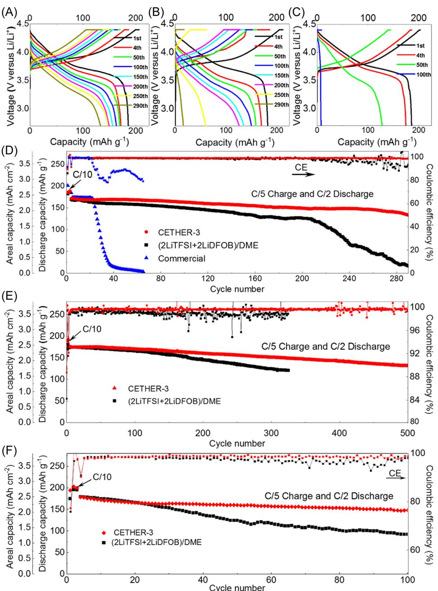
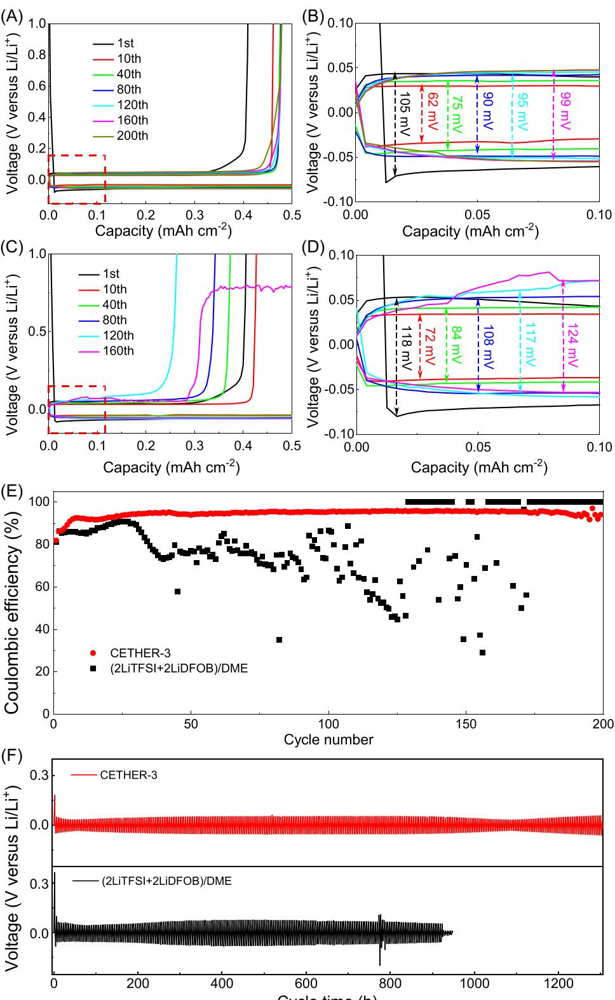
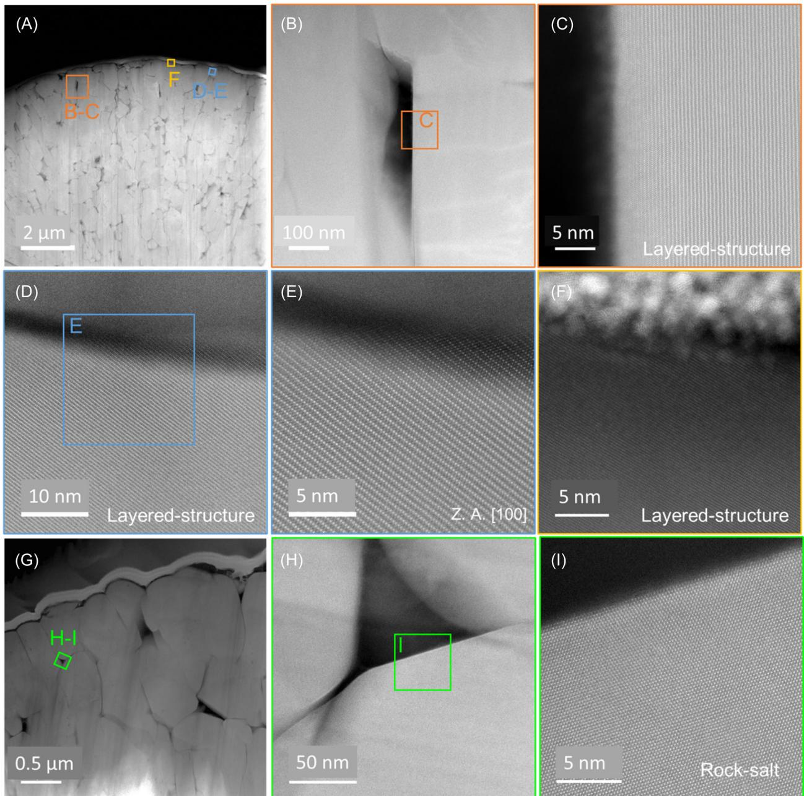
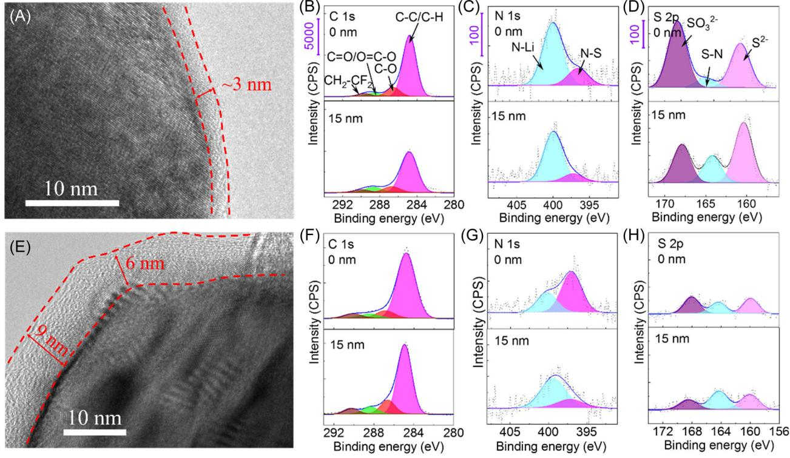
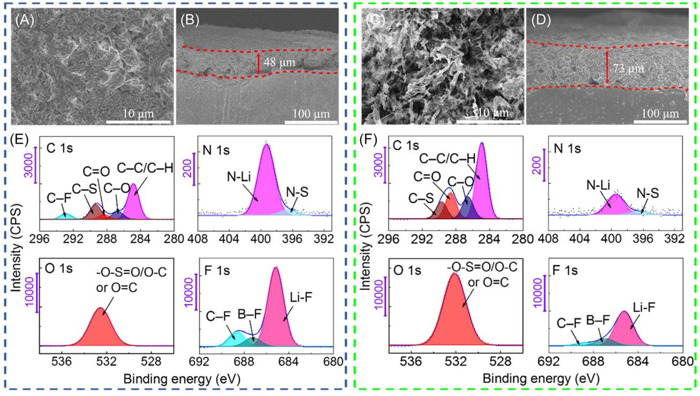
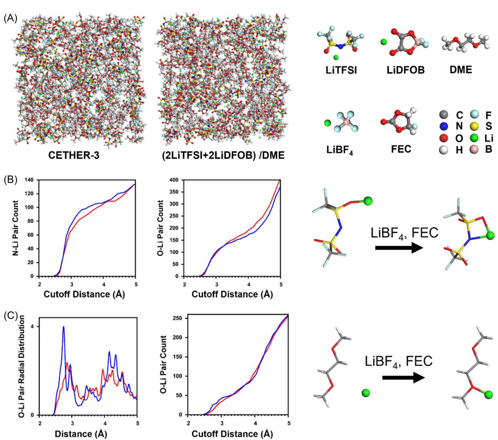

DOI: 10.1002/cey2.275

# Concentrated ternary ether electrolyte allows for stable cycling of a lithium metal battery with commercial mass loading high‐nickel NMC and thin anodes

Jun Yang1,2 | Xing Li1,2 | Ke Qu3,4 | Yixian Wang[5](http://orcid.org/0000-0001-6107-8352) | Kangqi Shen6 | Changhuan Jiang4 | Bo Yu1,2 | Pan Luo1,2 | Zhuangzhi Li1,2 | Mingyang Chen6,7 | Bingshu Guo1,2 | Mingshan Wang1,2 | Junchen Chen1,2 | Zhiyuan Ma1,2 | Yun Huang1,2 | Zhenzhong Yang4 | Pengcheng Liu5 | Rong Huang4 | Xiaodi Ren8 | David Mitlin[5](http://orcid.org/0000-0002-7556-3575)

1 School of New Energy and Materials, Southwest Petroleum University, Chengdu, China

2 Energy Storage Research Institute, Southwest Petroleum University, Chengdu, China

3 Shenzhen Key Laboratory of Nanobiomechanics, Shenzhen Institutes of Advanced Technology, Chinese Academy of Sciences, Shenzhen, China 4 China Key Laboratory of Polar Materials and Devices (MOE), Department of Electronics, East China Normal University, Shanghai, China 5 Materials Science Program and Texas Materials Institute, The University of Texas at Austin, Austin, Texas, USA

6 Beijing Computational Science Research Center, Beijing, China

7 School of Materials Science and Engineering Center for Green Innovation, University of Science and Technology Beijing, Beijing, China 8 Department of Materials Science and Engineering, Hefei National Research Center for Physical Sciences at the Microscale, University of Science and Technology of China, Hefei, Anhui, China

#### Correspondence

Xing Li, School of New Energy and Materials, Southwest Petroleum University, Chengdu, China. Email: [lixing198141@swpu.edu.cn](mailto:lixing198141@swpu.edu.cn)

Ke Qu, Shenzhen Key Laboratory of Nanobiomechanics, Shenzhen Institutes of Advanced Technology, Chinese Academy of Sciences, Shenzhen 518055, China. China Key Laboratory of Polar Materials and Devices (MOE) and Department of Electronics, East China Normal University, Shanghai 200062, China. Email: [ke.qu@siat.ac.cn](mailto:ke.qu@siat.ac.cn)

Mingyang Chen,Beijing Computational Science Research Center, Beijing 100193, China. Center for Green Innovation, School of Materials Science and Engineering, University of Science and Technology Beijing, Beijing 100083, China. Email: [mychen@ustb.edu.cn](mailto:mychen@ustb.edu.cn)

#### Abstract

A new concentrated ternary salt ether‐based electrolyte enables stable cycling of lithium metal battery (LMB) cells with high‐mass‐loading (13.8 mg cm−2 , 2.5 mAh cm−2 ) NMC622 (LiNi0.6Co0.2Mn0.2O2) cathodes and 50 μm Li anodes. Termed "CETHER‐3," this electrolyte is based on LiTFSI, LiDFOB, and LiBF4 with 5 vol% fluorinated ethylene carbonate in 1,2‐dimethoxyethane. Commercial carbonate and state‐of‐the‐art binary salt ether electrolytes were also tested as baselines. With CETHER‐3, the electrochemical performance of the full‐cell battery is among the most favorably reported in terms of high‐voltage cycling stability. For example, LiNixMnyCo1–x–yO2 (NMC)‐Li metal cells retain 80% capacity at 430 cycles with a 4.4 V cut‐off and 83% capacity at 100 cycles with a 4.5 V cut‐off (charge at C/5, discharge at C/2). According to simulation by density functional theory and molecular dynamics, this favorable performance is an outcome of enhanced coordination between Li+ and the solvent/salt molecules. Combining advanced microscopy (high‐resolution transmission electron microscopy, scanning electron microscopy) and surface

This is an open access article under the terms of the Creative Commons Attribution License, which permits use, distribution and reproduction in any medium, provided the original work is properly cited.

© 2022 The Authors. Carbon Energy published by Wenzhou University and John Wiley & Sons Australia, Ltd.

Rong Huang,China Key Laboratory of Polar Materials and Devices (MOE) and Department of Electronics, East China Normal University, Shanghai 200062, China.

Email: [rhuang@ee.ecnu.edu.cn](mailto:rhuang@ee.ecnu.edu.cn)

Xiaodi Ren,Hefei National Research Center for Physical Sciences at the Microscale, Department of Materials Science and Engineering, University of Science and Technology of China, Hefei, Anhui, 230026, China. Email: [xdren@ustc.edu.cn](mailto:xdren@ustc.edu.cn)

David Mitlin,Materials Science Program and Texas Materials Institute, The University of Texas at Austin, Austin, Texas 78712-1591, USA. Email: [david.mitlin2@utexas.edu](mailto:david.mitlin2@utexas.edu)

#### Funding information

National Natural Science Foundation of China, Grant/Award Numbers: 21905265, 52072322, U1930402, 61974042; National Science Foundation, Civil, Mechanical and Manufacturing Innovation, Grant/Award Number: 1911905; Fundamental Research Funds for the Central Universities, Grant/Award Number: WK2060140026; Department of Science and Technology of Sichuan Province, Grant/Award Numbers: 2019‐GH02‐00052‐HZ, 2019YFG0220; Scientific and Technological Innovation Foundation of Shunde Graduate School, Grant/Award Number: BK19BE024; National Key Research and Development Program of China, Grant/Award Number: 2017YFA0303403

## 1 | INTRODUCTION

The specific energy of conventional lithium‐ion batteries (LIBs) is developing in an incremental manner that may not keep pace with the emerging energy requirements for long‐range vehicular applications.1[–](#page-14-0)3 Lithium metal possesses an order of magnitude higher specific capacity versus graphite (3861 vs. 372 mAh g−1 ), as well as the lowest reoxidation reduction potential (−3.040 V vs. standard hydrogen electrode), making it attractive as a possible "beyond Li‐ion" anode material.[4](#page-14-1)–6 With the use of a lithium metal battery (LMB) with a capacity balanced metal anode and limited electrolyte content, it is possible to increase the cell energy by over 50% as compared to the same ceramic cathode but coupled with graphite. For example, when thin Li metal is coupled to advanced ceramic cathodes such as NMC622 and

science (X‐ray photoelectron spectroscopy, time‐of‐fight secondary ion mass spectroscopy, Fourier‐transform infrared spectroscopy, Raman spectroscopy), it is demonstrated that a thinner and more stable cathode electrolyte interphase (CEI) and solid electrolyte interphase (SEI) are formed. The CEI is rich in lithium sulfide (Li2SO3), while the SEI is rich in Li3N and LiF. During cycling, the CEI/SEI suppresses both the deleterious transformation of the cathode R‐3m layered near‐surface structure into disordered rock salt and the growth of lithium metal dendrites.

#### KEYWORDS

concentrated electrolyte, density functional theory, ether electrolyte, high‐nickel cathode, high‐voltage battery, molecular dynamics

> NMC811 (LiNixMnyCo1−x−yO2), the cell's specific energy may, in principle, reach 500 Wh kg−1 . 7[–](#page-14-2)9 Rechargeable LMBs have been studied since the 1970s, with early commercial embodiments predating LIBs. However, metal dendrite growth and associated catastrophic failure of LMBs have largely hindered their commercialization as an alternative to LIBs.[10](#page-14-3)–14 Recent rapid commercial advancement of electric vehicles and hybrid electric vehicles has initiated a renaissance in LMB research.15–[18](#page-14-4) As dendrites are nearly unavoidable in conventional carbonate‐based electrolytes, it is evident that alternative electrolyte formulations are necessary for the success of LMBs[.19](#page-14-5)–29

> As outlined in Pang et al.,[30](#page-15-0) electrochemically stable interphases between the electrolyte and the anode/ cathode are essential for achieving cycling stability of alkali metal batteries. Ether‐based solvents have a higher

lowest unoccupied molecular orbital than carbonate‐ based solvents, leading to a more stable solid electrolyte interphase (SEI) with the Li metal.[31](#page-15-1)–34 Increasing the lithium salt concentration in ether electrolytes has been demonstrated to further stabilize the SEI structure and inhibit dendrite growth.[27,35](#page-14-6)–38 The oxidation stability of ether electrolytes is less than 4.0 V, resulting in irreversible reactions at the ceramic cathodes during charging, especially when NMC622 or 811 is used.[35,39](#page-15-2)–43 A high salt concentration is known to significantly improve the operating voltage window of the cells.[34,44,45](#page-15-3) This is explained by the formation of a lithium ion sheath that reduces the amount of free ether molecules, which lowers the highest occupied molecular orbital (HOMO) energy level of the solvent.[46,47](#page-15-4) Researchers have used high‐concentration bis(trifluoromethanesulfonyl)imide (LiTFSI) and lithium difluoro(oxalato)borate (LiDFOB) dual salt in 1,2‐dimethoxyethane (DME) with an LMB based on NMC333 to achieve 78.9% capacity retention after 500 cycles.[48](#page-15-5) The cell was cycled at C/3 charge and 1C discharge with an upper cut‐off voltage of 4.3 V. In another study, researchers used a high‐concentration lithium bis(fluorosulfonyl)imide (LiFSI) and LiTFSI dual salt in DME with NMC622, achieving 88% capacity retention after 300 cycles when cycled at C/3 with a cut‐ off voltage of 4.4 V.[36](#page-15-6)

A high‐concentration LiFSI salt in DME allowed an NMC333 cell to have 92% capacity retention after 500 cycles, with C/3 charge and 1C discharge and a cut‐off voltage of 4.3 V[.37](#page-15-7) In another study, local high‐ concentration electrolyte LiFSI in DME and 1,1,2,2‐ tetrafluoroethyl‐2,2,3,3‐tetrafluoropropylether allowed an NMC811 cell to work for 300 cycles with a capacity retention of 90%, when tested at C/3 and 4.4 V[.49,50](#page-15-8) LiFSI in fluoro‐ether of fluorinated 1,4‐dimethoxylbutane allowed cycling of NMC532 420 times with 90% retention, when tested at C/3 and 4.2 V[.51,52](#page-15-9) A detailed comparison of the previously reported LMB results with ether‐based electrolytes is presented in Table S1. [27,34,38](#page-14-6)–42,49–56 The reports are listed in chronological order so as to highlight the progression from 2011 up to the present. One state‐of‐the‐ art system is 2 M LiTFSI + 2 M LiDFOB in DME ([2LiTF-SI + 2LiDFOB]/DME for short), which has been shown to be highly effective with NMC333.[48](#page-15-5) However, LiDFOB decomposes above 4.3 V, because of which it is not fully compatible with modern high‐nickel ceramic cathodes such as NMC622 and NMC811[.26,37,57](#page-14-7) The electrochemical results for the electrolyte used in this study (CETHER‐3) are listed in the bottom of the table.

The huge challenge is to create ether‐based electrolyte systems containing salt combinations with improved high‐voltage oxidation stability, likely being a combination of thermodynamic (HOMO energy level of salt) and kinetic (additives for the SEI structure) factors. Among the lithium salts, LiBF4 shows a low HOMO energy level of −10.11 eV, which indicates good oxidation stability.[58](#page-15-10) In parallel, fluorinated ethylene carbonate (FEC) is known to be a key additive for SEI stabilization, yielding a tough LiF‐based layer near the metal interface.[59](#page-15-11) With such considerations in mind, we created a new electrolyte based on a concentrated ternary salt (LiTFSI, LiDFOB, and LiBF4) in a DME solvent with FEC as an additive. Termed "CETHER‐3" (concentrated ether with three components), this electrolyte synergizes the thermodynamic and kinetic improvements associated with each addition. Optimized CETHER‐3 allows for stable cycling of an LMB based on a thin lithium metal anode (a challenge onto itself) and an NMC622 cathode, using cut‐off voltages of 4.4 and 4.5 V. Analytical techniques combined with simulation are used to identify the structure of both the anode and the cathode during cycling and to provide fundamental insight into the structures of the liquid and the SEI/CEI layers.

## 2 | EXPERIMENTAL SECTION

## 2.1 | Materials

A commercial‐grade cathode based on 96 wt% NMC622 (LiNi0.6Co0.2Mn0.2O2), 2 wt% conductive black, and a 2 wt % polyvinylidene fluoride (PVDF) binder was supplied by Jiangxi Batway New Energy Co., Ltd. Before being tested in full LMB cells, the cathodes were cut into 14 mm diameter discs and dried at 60°C under vacuum for 24 h. The active material loading was ∼13.8 mg cm−2 (∼2.5 mAh cm−2 ). Lithium disks with 16 mm in diameter and 50 or 600 μm in thickness were purchased from China Energy Lithium Co., Ltd. Cu foil current collectors and Fe foils were purchased from China Energy Lithium Co., Ltd. Battery‐grade LiTFSI, LiDFOB, LiBF4, DME, and FEC were purchased from BASF. DME and FEC were used in the as‐received condition, while lithium salts were dried at 60°C under vacuum overnight before use. These chemicals were stored and handled in a glovebox with both the H2O and O2 contents being less than 1 ppm. All electrolytes were fabricated inside the glovebox. The target electrolyte CETHER‐3 has the composition: 2 M LiTFSI + 1.5 M LiDFOB + 0.5 M LiBF4 + 5 vol% FEC in DME. As one baseline, analogous full cells were analyzed using a recently published high‐ performance concentrated binary electrolyte with 2 M LiTFSI + 2 M LiDFOB in DME[.48](#page-15-5) It was fabricated in an analogous manner to the original reference and will be referred to as "(2LiTFSI + 2LiDFOB)/DME" throughout the study. A commercial battery electrolyte of 1 M LiPF6

in ethylene carbonate (EC), dimethyl carbonate (DMC), and methyl ethyl carbonate (EMC) (1:1:1 in volume) with 1 vol% vinylene carbonate (VC) was also tested. That electrolyte was supplied by the Shenzhen Capchem Technology Co., Ltd. (CAPCHEM). As it is used in commercial batteries, it will be referred to as "Commercial" throughout the study.

## 2.2 | Electrochemical measurements

Electrochemical performance was measured using CR2032 coin‐type batteries supplied by Canrd New Energy Technology Co., Ltd. The LMBs were assembled in four parts: an NMC622 cathode disc (∼13.8 mg cm−2 , 2.5 mAh cm−2 ), a Celgard 3501 polypropylene (PP) membrane separator, the prepared electrolytes (70 μL), and a Li anode (50 or 600 μm in thickness; 16 mm in diameter). The assembled Li||NMC622 batteries were tested using a Galvanostatic BTS‐5V10mA battery tester (NEWARE Electronics Co., Ltd.) within a voltage range of 2.7–4.4 or 2.7–4.5 V versus Li/Li+. The batteries were first charged and discharged at C/10 (1 C = 180 mA g−1 ) for three cycles, followed by a regiment of charging at C/5 and discharging at C/2. This rate protocol is in accordance with the general battery testing approach outlined in the report of Zheng et al.[,60](#page-15-12) aimed at achieving an inorganic salt‐rich SEI structure that is stable under extended cycling. Electrochemical impedance spectroscopy (EIS) was conducted using CH Instruments CHI660D. Measurement was performed in the charged state of 4.1 V, at frequencies ranging from 105 to 10−2 Hz, with an amplitude of 10 mV.

Lithium metal against an iron foil (Li||Fe) was used to check the electrochemical stability window of the prepared electrolytes. As Fe is electrocatalytic towards a range of oxidation and reduction reactions, it was used as the working electrode. The electrolyte oxidation voltage on Fe was tested by cyclic voltammetry (CV) on a CHI760D electrochemical workstation. A slow scan rate of 0.1 mV/s was used to maximize the sensitivity and minimize the kinetic effects in electrolyte decomposition.[61](#page-15-13) The Li||Fe system was also assembled in CR2032 coin‐type batteries, based on a 600 μm Li disk, a PP separator, 75 μL of prepared electrolyte, and an Fe foil with a thickness of 1 mm and a diameter of 16 mm. To test the Coulombic efficiency (CE) of Li–Cu half‐cells, a modified Aurbach's protocol was used.[59,62](#page-15-11) The Li||Cu half‐cells had the same parameters as Li||Fe, but with an 18 mm‐diameter Cu foil. Testing of Li||Cu was performed according to the following protocol: a lithium film with 4 mAh cm−2 capacity was first electrodeposited onto a Cu foil and then stripped to a 1 V anodic limit. This was followed by the deposition of 4 mAh cm−2 , followed by cycling of 0.4 mAh cm−2 (i.e., one‐tenth of capacity) between stripping and plating over dozens of cycles. In the last stage, the entire Li film was stripped to the 1 V limit. A current density of 0.4 mA cm−2 was used for this test. In another test, 0.5 mAh cm−2 was plated and then stripped during each cycle using the 1 V cut‐off. A current density of 0.25 mA cm−2 was used for this test. Symmetrical Li||Li cells were assembled using the same conditions as above and tested at 0.5 mA cm−2 to a plating/striping capacity of 1 mAh cm−2 .

## 2.3 | Analytical characterization

For analyses, the cycled cells were disassembled in a glovebox, with the residual electrolyte washed off by DME solvent before natural drying. The samples were sealed in a plastic bag inside the glovebox before transfer, which minimized oxidation. The cycled anodes and NMC622 cathodes were characterized by scanning electron microscopy (SEM; ZEISS‐ EVOMA15) equipped with an energy‐dispersive X‐ray spectroscopy (EDXS) detector. High‐resolution transmission electron microscopy (HRTEM; JEOL 2100F) was used for the analysis of LiNixMnyCo1–x–yO2 (NMC), and the cathode electrolyte interphase (CEI). A probe aberration‐corrected JEM Grand ARM300 300 kV scanning transmission electron microscope (STEM) was used for the high‐angle annular dark field (HAADF) analysis. The near‐surface chemical composition and bonding of the cycled lithium metal anodes and NMC622 cathodes were analyzed using X‐ray photoelectron spectroscopy (XPS; Phi 5000 VersaProbe III, ULVAC‐PHI) with an Al Kα source. Time‐of‐fight secondary ion mass spectroscopy (TOF‐SIMS, PHI nano TOF II) was also used to determine the near‐ surface composition of the cycled Li. Raman spectroscopy was performed using a Horiba Scientific LabRAM HR Evolution (532 nm). Fourier‐transform infrared spectroscopy was performed using a Nicolet 6700.

## 2.4 | Molecular dynamics simulation

Electrolyte models were used to simulate the structure of (2LiTFSI + 2LiDFOB)/DME and CETHER‐3 electrolytes. The model of (2LiTFSI + 2LiDFOB)/DME electrolyte contained 100 of LiTFSI, 100 of LiDFOB, and 235 of DME molecules. The model of CETHER‐3 electrolyte contained 100 of LiTFSI, 75 of LiDFOB, 25 of LiBF4, 4 of FEC, and 210 of DME molecules. The number of molecules in the models was set according to the real components in (2LiTFSI + 2LiDFOB)/DME and CETHER‐3. Molecular dynamics (MDs) simulations with the (2LiTFSI + 2LiDFOB)/DME and CETHER‐3 models were performed using COMPASS II force field potentials.[63](#page-15-14) First, an equilibrium simulation with an isothermal–isobaric ensemble (NPT) was carried out for these two‐electrolyte systems for 2 ns, where the time step was set to 1 fs, the pressure was set to 0.1 GPa, and the temperature was set to 298 K. The NPT simulation optimized the simulation box volume for the two‐ electrolyte model, yielding a cell length of a = b = c = 52.2 Å and a density of 0.75 g cm−3 for 2LiTFSI + 2 LiDFOB)/DME and a cell length of a = b = c = 52.0 Å and a density of 0.72 g cm−3 for CETHER‐3. Next, MDs with the canonical ensemble (NVT) of the NPT‐relaxed (2LiTFSI + 2LiDFOB)/DME and CETHER‐3 systems were carried out for 2 ns, with a time step of 1 fs and a MDs temperature of 298 K.

## 2.5 | Density functional theory

The geometry and electronic structures of the electrolyte molecules were determined using density functional theory (DFT) with the B3LYP exchange‐correlation functional[64](#page-15-15) and the cc‐pVDZ basis set (correlation‐ consistent double‐zeta basis set)[.65,66](#page-15-16) Simple clusters were also constructed to study the electronic structure of the electrolyte molecules when they interact with other electrolyte molecules in the electrolyte system. This includes a dimer cluster of DME and LiTFSI with Li complexed with an O of DME (denoted as "DME + LiTFSI"), and a trimer cluster of DME, LiTFSI, and LiBF4 with the two Li+ complexed with the two O atoms of DME (denoted "DME + LiTFSI + LiBF4"). To determine the correlation between the electronic structure of the electrolyte molecules (such as the HOMO energy level) and the electrolyte–Li+ coordination distance, Li+ was placed at several different distances from the Lewis base site of the DME + LiTFSI cluster, namely, O of DME and N of TFSI. Constrained geometry optimization calculations were performed by fixing the Li–O (of DME) or the Li–N (of TFSI) distance and fully relaxing the other geometry parameters. This procedure produced a set of optimized DME + LiTFSI clusters with Li–O (of DME) lengths of 1.88, 2.38, 2.88, 3.38, 3.88, 4.38, and 4.88 Å, and optimized DME + LiTFSI clusters with Li–N lengths of 1.98, 2.48, 2.98, 3.48, 3.98, 4.48, and 4.98 Å. For each cluster system, partial density of states analysis was carried out, yielding ionization potentials for the electrolyte molecules and the individual atom sites. All of the DFT calculations were performed using the Gaussian 09 software package.[63](#page-15-14)

YANG ET AL. | 5 of 17

## 3 | RESULTS AND DISCUSSION

A series of electrochemical experiments were performed to optimize the CETHER‐3 formulation, with 2 M LiTFSI + 1.5 M LiDFOB + 0.5 M LiBF4 + 5 vol% FEC in DME being the final ratio. Electrolyte optimization included time–voltage diagrams of Li||Cu cells using the modified Aurbach's method to test the CE of different electrolytes, as, for example, shown in Figure S1. Table S2 shows the measured CE of (2 M LiTFSI + 1.5 M LiDFOB + 0.5 M LiBF4)/DME electrolyte with different amounts of FEC. Optimization also included determination of the NMC622‐based cell cyclability with varying amounts of LiBF4 added, as shown in Figures S2 and S3, for example. Through such testing, it was concluded that 5 vol% FEC and 0.5 M LiBF4 yielded the best overall performance with a ternary electrolyte. Figure S2 shows the cycling results for (2 M LiTFSI + 2‐n M LiDFOB)/ DME + n M LiBF4), with n being 0.2, 0.5, and 1. The 0.5 M LiBF4 additive is the most effective, with the 1 M of the additive yielding inferior cycling stability. As a baseline, Table S3 shows the CE of (2 M LiTFSI + 2 M LiDFOB)/ DME with different amounts of FEC. In this case, adding FEC from 5% up to 30% does not improve the CE at all. It may therefore be concluded that there is a unique synergy between LiBF4 and FEC that makes this combination most effective in stabilizing the half‐cell and full‐cell cycling behavior. The role of these electrolyte components in the formation of stable SEI and CEI layers will be further discussed throughout the study in relation to the analytical and simulation results.

Figure S4 shows the thermal gravimetric analysis results for the three electrolytes: CETHER‐3 (2 M LiTFSI + 1.5 M LiDFOB + 0.5 M LiBF4 + 5 vol% FEC in DME), (2LiTFSI + 2LiDFOB)/DME, and a commercial electrolyte (1 M LiPF6 in EC, DMC, and EMC [1:1:1 in volume] with 1 vol% VC). Testing was conducted in an argon atmosphere at a 5°C min−1 heating rate. It may be observed that both CETHER‐3 and baseline (2LiTFSI + 2LiDFOB)/DME have lower vapor pressures than the baseline commercial electrolyte (1 M LiPF6 in EC, DMC, and EMC (1:1:1 in volume) with 1 vol% VC). At 150°C, the commercial electrolyte is nearly fully volatilized, with ∼10% remaining, as shown in Figure S4C. By contrast, over 70% of CETHER‐3 and (2LiTFSI + 2LiD-FOB)/DME electrolytes still remain at 150°C. These data are shown in Figure S4B,D). These results indicate that the CETHER‐3 and (2LiTFSI + 2LiDFOB)/DME electrolytes show improved thermal stability compared with the carbonate‐based commercial electrolyte. Flammability tests of the three electrolytes were also conducted, as shown in Figure S5. Combustion of the commercial electrolyte is the most fierce, with the limited volume

FIGURE 1 (A–C) Galvanostatic profiles of Li||NMC622 cells with CETHER‐3, (2LiTFSI + 2LiDFOB)/DME, and a commercial electrolyte, respectively. The cells with a 50 μm Li anode were tested between 2.7 and 4.4 V. (D) Associated cycling performance of the three cells. (E) Cycling performance with a 600 μm Li anode, 2.7–4.4 V (Discharge cut‐off voltage 2.7 V, charge cut‐off voltage 4.4 V). (F) Cycling performance with a 50 μm Li anode, 2.7–4.5 V (Discharge cut‐off voltage 2.7 V, charge cut‐off voltage 4.5 V). In all cases, cells were charged–discharged at C/10 (1 C = 180 mA g−1 ) for three cycles, followed by charging at C/5 and discharging at C/2. The NMC loading was 13.8 mg cm−2 , corresponding to 2. 5 mAh cm−2 . CETHER‐3, 2 M LiTFSI + 1.5 M LiDFOB + 0.5 M LiBF4 + 5 vol% FEC in DME. DME, 1,2‐dimethoxyethane; FEC, fluorinated ethylene carbonate; LiDFOB, lithium difluoro(oxalato)borate; LiTFSI, lithium bis(trifluoromethanesulfonyl)imide.

being fully burned after 7 s. Another baseline conventional concentration (1 M) DME‐based electrolyte also burns fiercely, and the electrolyte is exhausted after 14 s. For the high concentration of the CETHER‐3 electrolyte, the combustion flame is the smallest. This indicates that the high‐concentration strategy will reduce an electrolyte's flammability and improve battery safety.

Figure [1A](#page-5-0)–C shows the galvanostatic profiles of Li|| NMC622 cells with CETHER‐3, (2LiTFSI + 2LiDFOB)/ DME, and commercial electrolytes. It should be noted that according to Table S1, (2LiTFSI + 2LiDFOB)/DME has a highly favorable electrochemical performance. This baseline therefore represents the state of the art in concentrated electrolytes. Figure [1D](#page-5-0) shows the associated cycling stability with the three electrolytes. The cell with CETHER‐3 shows a capacity retention rate of 80% after 285 cycles. The cell with (2LiTFSI + 2LiDFOB)/DME retains 80% capacity after 150 cycles, while for the cell with the commercial electrolyte, the capacity effectively reaches zero after 65 cycles. With CETHER‐3, the cycle 1 CE is 89.7%, with (2LiTFSI + 2LiDFOB)/DME, the CE is 85.9%, and with the commercial electrolyte, it is 91.5%. The reason why both CETHER‐3 and (2LiTFSI + 2LiD-FOB)/DME show an incrementally lower cycle 1 CE than the commercial electrolyte is due to the greater SEI formed initially. However, as will be demonstrated, the SEIs generated with CETHER‐3 and (2LiTFSI + 2LiDFOB)/ DME are more stable during subsequent cycling, and the former is the most stable. The average CEs during cycling are 99.2% with CETHER‐3, 98.4% with (2LiTFSI + 2LiD-FOB)/DME, and 88.1% with the commercial electrolyte. With the use of CETHER‐3, there is less electrode polarization than that with the use of (2LiTFSI + 2LiD-FOB)/DME. With CETHER‐3, polarization (defined as the voltage difference at 50% capacity) at the 1st, 4th, 50th, 100th, 200th, and 290th cycle is 0.13, 0.18, 0.34, 0.38, 0.53, and 0.70 V, respectively, as shown in Figure [1A.](#page-5-0) With (2LiTFSI + 2LiDFOB)/DME, polarization at the 1st, 4th, 50th, 100th, 200th, and 280th cycle is 0.13, 0.43, 0.48, 0.59, 0.81, and 1.05 V, respectively, as shown in Figure [1B.](#page-5-0) The cell with the commercial electrolyte is unstable, with the large polarization progressively increasing until early failure. Since all the other battery and testing parameters are kept the same, the difference in the electrochemical cycling behavior is directly attributed to the electrolytes.

Figure [1E](#page-5-0) shows the cycling stability of identically tested CETHER‐3 and (2LiTFSI + 2LiDFOB)/DME cells, with a 4.4 V anodic cut‐off, but with a thick 600 μm Li anode. The associated raw galvanostatic data are presented in Figure S6. With the use of CETHER‐3, the cycle 1 CE is 88.8%, while with the use of (2LiTFSI + 2 LiDFOB)/DME, it is 84.2%. The average CEs during cycling are 99.6% with CETHER‐3 and 98.6% with (2LiTFSI + 2LiDFOB)/DME. The cell with CETHER‐3 shows 80% capacity retention after 430 cycles. By comparison, the cell with (2LiTFSI + 2LiDFOB)/DME retains 71.2% capacity after 300 cycles. Again, with the use of CETHER‐3, there is markedly less electrode polarization than that with the use of (2LiTFSI + 2 LiDFOB)/DME. Figure [1F](#page-5-0) shows the cycling stability with a 4.5 V anodic cut‐off and a thin 50 μm Li metal anode. The associated galvanostatic data are presented in Figure S7. With CETHER‐3, the cycle 1 CE is 77.3%, while with (2LiTFSI + 2LiDFOB)/DME, it is 75.8%. The average CEs during cycling are 99.2% for CETHER‐3 and 97.3% for (2LiTFSI + 2LiDFOB)/DME. The cell with CETHER‐3 retains 83.2% capacity after 100 cycles. The

YANG ET AL. | 7 of 17

less electrode polarization than that with the use of (2LiTFSI + 2LiDFOB)/DME. As shown in Figure S8, the NMC622 fast charge performance with CETHER‐3 is superior to identical cells with (2LiTFSI + 2LiDFOB)/ DME, and the difference increases with the charging rate, with the highest value at 2 C. Overall, CETHER‐3 yields significantly more stable cycling behavior at a 4.4 V cut‐off and a 4.5 V cut‐off, with a thin and a thick Li metal anode. Based on an extensive literature survey of concentrated electrolytes presented in Table S1, it may be concluded that CETHER‐3 is among the most favorable systems, being perhaps the most stable system reported to date.

Figure S9 shows the EIS results for cells (at 4.4 V) after 3 and 50 cycles with CETHER‐3 and with (2LiTFSI + 2LiDFOB)/DME). It may be observed that (2LiTFSI + 2LiDFOB)/DME) shows larger RSEI and RCT and lower DLi +. Figure S9A,B shows the Nyquist plots along with the models that were used for the curve fits. The fit results are shown in Table S4. After three cycles, for CETHER‐3, RSEI (higher frequency semicircle) is 105.6 Ω and RCT (lower frequency semicircle) is 167.0, while for (2LiTFSI + 2LiDFOB)/DME), these values are 109.0 and 220.7 Ω, respectively. After 50 cycles, for CETHER‐3, RSEI is 79.7 Ω and RCT is 35.6 Ω, while for (2LiTFSI + 2LiDFOB)/DME), these values are 92.3 and 63.6 Ω, respectively.

The DLi + is calculated based on the Warburg impedance coefficient (σw) using Equations ([1](#page-6-0)) and [\(2](#page-6-1)),[60,67](#page-15-12)

$$
Z_{\rm re} = (R_{\rm sf} + R_{\rm ct} + \sigma_{\rm w} \omega^{-1/2}), \tag{1}
$$

$$
D_{\text{Li}}^{+} = R^{2}T^{2}/\left(2A^{2}n^{4}F^{4}C^{2}\sigma_{w}^{2}\right),\tag{2}
$$

where R is the gas constant, T is the absolute temperature, A is the area of the electrode, n is the number of electrons transferred, F is the Faraday constant, and C is the concentration of Li+. The Warburg impedance coefficient σw could be determined from the slope of Zre as a function of ω−1/2. After three cycles, DLi + for CETHER‐3 is 7.3 × 10−12 cm2 s −1 , while for (2LiTFSI + 2 LiDFOB)/DME, it is 6.6 × 10−12 cm2 s −1 . After 50 cycles, DLi + for CETHER‐3 is 7.2 × 10−12 cm2 s −1 , while for (2LiTFSI + 2LiDFOB)/DME, it is 4.3 × 10−12 cm2 s −1 . Advanced analytical methods will be used to probe the origin of the differences in DLi +, RSEI, and RCT with the two electrolytes, and the former is primarily a cathode crystal structure effect, while the latter two are primarily surface reactivity effects. The decrease in RSEI and RCT is attributed to the continuous activation of the interface

FIGURE 2 Cycling behavior of Li||Cu with CETHER‐3 and with (2LiTFSI + 2LiDFOB)/DME, tested at 0.25 mA cm−2 and a capacity of 0.5 mAh cm−2 per cycle. (A) CETHER‐3 plating/stripping profiles at different cycle numbers. (B) Enlarged portion of (A) identified by a dashed rectangle, with the overpotential at a given cycle number labeled. (C,D) Same analysis, but this is for (2LiTFSI + 2LiDFOB)/DME. (E) Comparison of CEs extracted from the cycling data. (F) Cycling performance of Li–Li symmetrical cells with the two electrolytes, tested at 0.5 mA cm−2 and a capacity of 1 mAh cm−2 per cycle. CETHER‐3, 2 M LiTFSI + 1.5 M LiDFOB + 0.5 M LiBF4 + 5 vol% FEC in DME. DME, 1,2‐dimethoxyethane; FEC, fluorinated ethylene carbonate; CE, Coulombic efficiency LiDFOB, lithium difluoro(oxalato)borate; LiTFSI, lithium bis(trifluoromethanesulfonyl)imide.

and the progressive formation of inorganic components such as Li3N, LiF, and lithium sulfide (Li2SO3) within the SEI and CEI. Figure S10A,B shows the CV curves of Li|| Fe CETHER‐3 and (2LiTFSI + 2LiDFOB)/DME systems, respectively. A scan rate of 0.1 mV s−1 was used. The anodic current of the (2LiTFSI + 2LiDFOB)/DME electrolyte increases significantly at 4.4 V, indicating that the electrolyte is rapidly oxidized. The oxidation current is markedly lower with the use of CETHER‐3, even at 4.5 V. This indicates that the electrolyte itself is more stable at the voltages relevant to charging of NMC and other ceramic cathodes.

Figure [2](#page-7-0) shows the cycling behavior of Li–Cu half‐ cells and Li–Li symmetric cells tested in CETHER‐3 and (2LiTFSI + 2LiDFOB)/DME. The half‐cell results are shown in Figure [2A](#page-7-0)–E, while the symmetric cell results are shown in Figure [2F](#page-7-0). Figure [2A](#page-7-0) shows the Li plating/ stripping profiles at different cycle numbers with CETHER‐3. Figure [2B](#page-7-0) shows the enlarged portion of Figure [2A,](#page-7-0) identified by a dashed rectangle, with the overpotential (difference between plating and stripping voltage) at a given cycle number being labeled. Figure [2C,D](#page-7-0) displays an analogous analysis, but it was for (2LiTFSI + 2LiDFOB)/DME. For the half‐cells, a capacity of 0.5 mAh cm−2 was directly deposited on the blanket Cu current collector and then stripped to an anodic limit of 1 V. A current density of 0.25 mA cm−2 was used. With (2LiTFSI + 2LiDFOB)/DME, the CE increases from 81.2% at cycle 1 to 90.0% at 25 cycles, after which point, it decreases and ultimately becomes unstable. By contrast, with CETHER‐3, the CE increases from 81.9% at cycle 1 to 95.0% at cycle 30, remaining stable afterward. With CETHER‐3, there is no evidence of electrical shortcircuit, which would suddenly yield a CE of 100%. Such shortcircuit failure is first observed with (2LiTFSI + 2LiDFOB)/DME at cycle 125. It may be observed that the average overpotentials with CETHER‐3 are consistently lower throughout cycling, which is indicative of a thinner and more stable SEI.[53,68](#page-15-17) Figure [2E](#page-7-0) presents a comparison of CEs extracted from the cycling data. It may be observed that the CEs for CETHER‐3 increases during early cycles. This process can be ascribed to the cycling‐induced formation of a stable SEI on the surface of lithium metal during cycling; the SEI structure is analyzed in detail later in the study. In Figure [2F,](#page-7-0) it is comparison of the cycling performance of Li–Li symmetrical cells with the two electrolytes. CETHER‐3 consistently yields a lower overpotential, while (2LiTFSI + 2LiDFOB)/DME appears to be electrically shortcircuit at a cycle time of 920 h. These results are consistent with the half‐cell data.

It is known that during cycling, the electrolyte penetrates into the NMC particle, resulting in intergranular cracking[.69](#page-16-0) This deleterious process is reduced when using CETHER‐3, likely due to the associated CEI structure discussed later. SEM was used to analyze the cycled NMC622 cathode; the results are shown in Figure S11. A micron‐scale crack through the NMC particle with 2(LiTFSI + 2LiDFOB)/DME is shown as an arrow in Figure S11E,F. Overall, the cathode cycled with CETHER‐3 shows less cracking than that with (2LiTFSI + 2LiDFOB)/DME. Figure S12A,B shows the cross‐section STEM images of the post‐cycled NMC622 cathodes in CETHER‐3 and (2LiTFSI + 2LiDFOB)/DME, respectively. The NMC622 particle in (2LiTFSI + 2LiDFOB)/DME undergoes more grain boundary separation because of the penetration of the electrolyte into the structure.

Figure [3A](#page-9-0) shows the cross‐section STEM images of cycled NMC622 with CETHER‐3, with Figure [3B](#page-9-0)–F showing the HAADF‐STEM images of the square areas in Figure [3A.](#page-9-0) It may be observed that with CETHER‐3, the cathode retains R‐3m‐layered structure near the internal pores present between individual crystallites and near the electrolyte‐exposed surface. Figure [3G](#page-9-0)–I shows analogous cross‐section STEM and HAADF‐STEM images of cycled NMC622 with (2LiTFSI + 2LiDFOB)/ DME. The structure around the pore that constitutes a three‐grain intersection is degraded to rock salt. Analogous degradation to rock salt is also observed around a pore deep in the interior of the NMC622 particle, as shown in Figure S13. As shown in Figure S14 and Table S5, X‐ray diffraction and its refinement results also demonstrate that NMC622 cycled with CETHER‐3 shows a lower degree of cation mixing than that with (2LiTFSI + 2LiDFOB)/DME.

Such localized phase transformation due to cycling of a high‐nickel cathode in an ether electrolyte is in agreement with previous reports.[69](#page-16-0) It has been demonstrated that rock‐salt structure may form near the surfaces and grain boundaries of layered cathodes, which will lead to the degradation of plateau voltage and reversible capacity, in turn cause the loss of fast Li ion diffusivity paths.[67,70](#page-16-1) The above microscopy results also explain the differences in the solid‐state Li+ diffusivities measured by EIS. Transformation into disordered rock salt is known to be associated with the loss of transition‐ metal species from the structure into the electrolyte and ultimately to the anode.[67,70,71](#page-16-1) Internal surfaces such as pores act as fast paths for such motion, preferentially depleting the surrounding crystal. A stable CEI layer that would minimize the loss of cathode elements would reduce the degree of transition‐metal loss. The enhanced stability of the NMC622 with CETHER‐3 may be rationalized along the following lines: At the anodic voltages, the surface of high‐nickel cathodes is electrocatalytic towards oxidation of various organic

FIGURE 3 (A) Cross‐section STEM images of cycled NMC622 with CETHER‐3. (B–F) HAADF‐STEM images of the square areas in (A). The R‐3m layered structure is viewed along the [100] zone axis. (G) Cross‐section STEM of the identically cycled NMC622 cathode in (2LiTFSI + 2LiDFOB)/DME. (H,I) HAADF‐STEM images of the square areas in (G). The testing condition for the analyses presented in the microscopy section was 50 cycles at 2.7–4.4 V, with C/5 charge and C/2 discharge rates. CETHER‐3, 2 M LiTFSI + 1.5 M LiDFOB + 0.5 M LiBF4 + 5 vol% FEC in DME. DME, 1,2‐dimethoxyethane; FEC, fluorinated ethylene carbonate; HAADF, high‐angle annular dark field; LiDFOB, lithium difluoro(oxalato)borate; LiTFSI, lithium bis(trifluoromethanesulfonyl)imide; STEM, scanning transmission electron microscopy.

electrolytes, including the free ether molecules in the concentrated electrolytes. This generates acidic species that attack the cathode surface.[40,72](#page-15-18) The ether molecules in (2LiTFSI + 2LiDFOB)/DME are more easily oxidized than that in CETHER‐3; hence, there is more of the acidic species leaching the cathode during cycling.

The Raman spectra of the (2LiTFSI + 2LiDFOB)/ DME and CETHER‐3 are shown in Figure S15. The results show that the vibration band of the solvating DME in CETHER‐3 is shifted upward in (2LiTFSI + 2 LiDFOB)/DME as compared to CETHER‐3: 875.0 versus 874.3 cm−1 . This indicates enhancement of the coordination between Li+ and DME in CETHER‐3. The MD simulations presented later in the study show enhanced DME–Li coordination in CETHER‐3, but this is absent in (2LiTFSI + 2LiDFOB)/DME. The enhanced coordination of DME to Li+ (which is a strong Lewis acid) induces partial donation of an electron. This will lower the HOMO level and thus enhance the oxidation stability.[34,73](#page-15-3) According to the DFT simulations also presented later, DME in CETHER‐3 does show a lower HOMO level than that in (2LiTFSI + 2LiDFOB)/DME, being −9.2 versus −7.8 eV. As shown in Figure S15, the vibration bands of the solvating TFSI− and DFOB− also shift upward. The change is from 748.0 and 720.3 cm−1 in (2LiTFSI + 2LiDFOB)/DME) to 749.0 and 721.7 cm−1 in CETHER‐3. This indicates that the coordination between Li+ and TFSI−/DFOB− in CETHER‐3 is also enhanced, leading to an improvement in oxidation stability.

Figure [4A,E](#page-10-0) shows HRTEM images of the postcycled NMC622 cathode surfaces with CETHER‐3 and with (2LiTFSI + 2LiDFOB)/DME. The HRTEM results indicate that with CETHER‐3, there is a thinner CEI layer on the postcycled NMC622 cathode surface than that with (2LiTFSI + 2LiDFOB)/DME. Argon‐ion (Ar+) deep sputtering XPS is used to further analyze the surface compositions of CEI. Figure [4B](#page-10-0)–D shows the XPS analysis of the postcycled CEI compositions with CETHER‐3. The XPS results show the C 1s, N 1s, and S 2p high‐resolution spectra at sputtering depths of 0 and 15 nm. Figure [4F](#page-10-0)–H shows the same analysis, but this is for (2LiTFSI + 2LiDFOB)/DME. The C 1s spectra reveal that the CEI layer consists of the CH2–CF2 group (∼290 eV, coming from PVDF),[48](#page-15-5) the C═O/O–C═O group (∼288.5 eV), the polyether carbon group (CH2O, ∼286.5 eV),[74](#page-16-2) and the hydrocarbon compound (C–C/ C–H, ∼285 eV).[75](#page-16-3) The N 1s and the S 2p spectra confirm the existence of N–Li (∼400 eV), N–S (∼396 eV), S2O4 2−/ SO3 2− (∼168 eV), S–N (∼164 eV), and S2−(∼160 eV) in the CEI. The intensity of C–C/C–H mainly originates from the decomposition of DME. This intensity is substantially stronger with (2LiTFSI + 2LiDFOB)/DME than that with CETHER‐3, indicating that more DME solvent is oxidized. Extensive DME decomposition on the cathode with (2LiTFSI + 2LiDFOB)/DME has been demonstrated to correspond to a thicker CEI.[72](#page-16-4) The C═O/O–C═O signal with (2LiTFSI + 2LiDFOB)/DME is marginally more intense, indicating that more DFOB− is involved in the

FIGURE 4 (A,E) HRTEM images of the postcycled NMC622 cathode surfaces with CETHER‐3 and with (2LiTFSI + 2LiDFOB)/DME. (B–D) XPS analysis of the postcycled CEI compositions highlighting the C 1s, N 1s, and S 2p high‐resolution spectra at sputtering depths of 0 and 15 nm with CETHER‐3. (F–H) Same analysis, but this is for (2LiTFSI + 2LiDFOB)/DME. NMC622, LiNi0.6Co0.2Mn0.2O2; CETHER‐3, 2 M LiTFSI + 1.5 M LiDFOB + 0.5 M LiBF4 + 5 vol% FEC in DME. DME, 1,2‐dimethoxyethane; FEC, fluorinated ethylene carbonate; HRTEM, high‐resolution transmission electron microscopy; LiDFOB, lithium difluoro(oxalato)borate; LiTFSI, lithium bis (trifluoromethanesulfonyl)imide.

formation of the CEI. This can be attributed to enhanced coordination between Li+ and DME/DFOB− in CETHER‐3, which lowers its HOMO level and improves its oxidation stability. It also agrees with MD and DFT simulations presented in the next section.

In the N 1s and S 2p XPS spectra, the intensities of the N–Li, S2−, and SO3 2− peaks are significantly higher with CETHER‐3. The N–Li, S2−, and SO3 2− peaks mainly emerge from the decomposition of LiTFSI,[38](#page-15-19) which indicates its greater participation in the CEI formation process. Based on the MD and DFT simulations, the coordination between Li+ and DME/DFOB−/TSFI− is enhanced and the HOMO level is reduced. According to DFT calculations, in CETHER‐3, the DME shows a lower HOMO level than LiTFSI (−9.2 vs. −8.3 eV). This would cause preferential oxidation of LiTFSI over DME to form the CEI layer, promoting the formation of the Li2SO3 phase. It is known that Li2SO3 is an electrical insulator that allows for fast lithium‐ion diffusion[.74,76](#page-16-2) A CEI rich in this phase will stabilize the cathode structure while allowing for facile ion transport during charging and discharging. According to Figure S5, at sputtering depths of 0 and 15 nm, the Li–F signal is relatively stronger with CETHER‐3 than that with (2LiTFSI + 2LiDFOB)/DME. This can be attributed to the decomposition of FEC in CETHER‐3 to LiF. It is well known that the LiF phase promotes cycling stability in a range of SEI and CEI structures.[53,77](#page-15-17) Figure S17 presents the Fourier‐transform infrared spectroscopy analysis of the cycled NMC622 with CETHER‐3 and with (2LiTFSI + 2LiDFOB)/DME. The O═C–O and C–O–C vibration absorption peaks originate from the decomposition of LiDFOB and DME. These peaks are stronger with (2LiTFSI + 2LiDFOB)/ DME, indicating greater decomposition. The B–O peak is also stronger, further confirming more extensive LiDFOB decomposition. A signal peak located at 1080 cm−1 is attributed to the stretching vibration of C–F and originates from the decomposition of TFSI−. It is more intense with CETHER‐3, indicating that relatively more LiTFSI is decomposed.

Figure [5](#page-11-0) shows the SEM and XPS analyses performed on the postcycled Li metal anodes. Figure [5A](#page-11-0) shows the SEM analysis, which indicates that with CETHER‐3, the postcycled Li metal surface is relatively flat and is dendrite‐free. Figure [5B](#page-11-0) shows a cross‐sectional SEM image of the postcycled anode. A distinct 48 µm‐thick layer is present on top of pristine (uncycled) Li metal. This layer is primarily Li metal that is interspersed with

FIGURE 5 SEM top view, SEM cross‐sectional view, and XPS analysis of the postcycled Li metal anodes. The high‐resolution XPS spectra shown are C 1s, N 1s, O 1s, and F 1s. (A, B, and E) CETHER‐3; (C, D, and F) (2LiTFSI + 2LiDFOB)/DME. CETHER‐3, 2 M LiTFSI + 1.5 M LiDFOB + 0.5 M LiBF4 + 5 vol% FEC in DME. DME, 1,2‐dimethoxyethane; FEC, fluorinated ethylene carbonate; LiDFOB, lithium difluoro(oxalato)borate; LiTFSI, lithium bis(trifluoromethanesulfonyl)imide; SEM, scanning electron microscopy; XPS, X‐ray photoelectron spectroscopy.

FIGURE 6 (A) CETHER‐3 and (2LiTFSI + 2LiDFOB)/DME simulated using NVT‐MD for 2 ns. (B) Comparison of TFSI–Li coordination between CETHER‐3 (blue line) and (2LiTFSI + 2LiDFOB)/DME (red line). (C) Comparison of DME–Li coordination between CETHER‐3 (blue line) and (2LiTFSI + 2LiDFOB)/DME (red line). CETHER‐3, 2 M LiTFSI + 1.5 M LiDFOB + 0.5 M LiBF4 + 5 vol% FEC in DME. DME, 1,2‐dimethoxyethane; FEC, fluorinated ethylene carbonate; LiDFOB, lithium difluoro(oxalato)borate; LiTFSI, lithium bis (trifluoromethanesulfonyl)imide.

some pores and covered by SEI. Figure [5C](#page-11-0) shows the surface of the Li foil cycled in (2LiTFSI + 2LiDFOB)/ DME, indicating that the cycled metal is highly dendritic and porous. As shown in Figure [5D,](#page-11-0) the cycled metal–pore–SEI structure is 73 µm‐thick, with pristine Li metal underneath. Figure [5E,F](#page-11-0) shows the high‐ resolution C 1s, O 1s, N 1s, and F 1s XPS spectra for CETHER‐3 and (2LiTFSI + 2LiDFOB)/DME. Additional high‐resolution B 1s and S 2p spectra are shown in Figure S18. According to the C 1s spectra, the SEI components include the C–F group (∼293 eV), C–S (∼289 eV), C═O (∼288.5 eV), polyether carbon (C–O, ∼286.5 eV), and hydrocarbon (C–C/C–H, ∼285 eV).[74](#page-16-2) In the N 1s spectra, N–Li (∼399 eV) is also present, and in the F 1s spectra, C–F (∼688.5 eV), B–F (∼687.5 eV), and Li–F (∼685 eV) are present.

The C–C/C–H peak with (2LiTFSI + 2LiDFOB)/DME has a higher intensity than that with CETHER‐3. This indicates that CETHER‐3 inhibits the decomposition of the DME solvent on the lithium metal surface. The C═O signal with (2LiTFSI + 2LiDFOB)/DME is also relatively more intense, which indicates that more DFOB− is decomposed. As shown in Figure S18A, the relative intensity of the B–O peak further confirms preferential DFOB− decomposition. With (2LiTFSI + 2LiDFOB)/ DME, the stronger C 1s, O 1s, and B 1s intensities show

that more DME or LiDFOB is reduced to Li2O or Li2CO3, Li alkyl carbonates, and Li alkoxides, all of which irreversibly consume active Li.[78](#page-16-5)

Figure [5E,F](#page-11-0) shows the N 1s and F 1s peaks, while Figure S18B shows the S 2p spectra for the two electrolytes. It may be observed that there are more Li3N and SO3 2− species in the SEI with CETHER‐3 than that with (2LiTFSI + 2LiDFOB)/DME. This in turn indicates that proportionally, more TFSI− is involved in the SEI formation. More LiF is also formed with CETHER‐3, which can be attributed to the addition of FEC. Li3N has a high ionic conductivity ranging from 2 × 10−4 to 4 × 10−4 S cm−1 , [74,79](#page-16-2)–82 which will promote fast ion diffusion through the SEI layer[.30](#page-15-0) Li2S and LiF are electrical insulators, which also promote Li+ diffusion. Figure S19 shows the normalized TOF‐SIMS depth profiles of the cycled anodes. The TOF‐SIMS data are qualitatively consistent with the XPS results in terms of showing relatively more N, F, and S present in the CETHER‐3 SEI. Moreover, within the 200 nm of sputtering, the F content is uniform. When performing the TOF‐ SIMS analysis, we did not look for cross‐over transition‐ metal species. Consequently, unlike the XPS results, the TOF‐SIMS data do not capture this information. Figure S20 shows the SEM EDXS analysis of the postcycled anodes. The anode cycled with CETHER‐3 is richer in N (0.708 wt% vs. 0), F (48.913 vs. 36.489 wt%), and S (6.950 vs. 1.701 wt%) than that with the baseline. It is known that the addition of FEC to an electrolyte will result in a stable and mechanically tough SEI, caused by the decomposition of FEC to form electrochemically stable LiF on the anode surface.[83](#page-16-6)–85 The presence of LiF, Li3N, and Li2SO3 within the SEI is the key reason for Li metal stability with CETHER‐3.

The two electrolyte systems CETHER‐3 and (2LiTFSI + 2LiDFOB)/DME were simulated using the atomistic MDs method and higher‐level DFT calculations. Figure [6A](#page-12-0) shows the CETHER‐3 and (2LiTFSI + 2LiDFOB)/DME systems simulated using NVT‐MD. The coordination of TFSI− and DME with Li+ for the two systems was investigated by comparing the N–Li and O–Li pair counts as a function of the cut‐off distance. These results are shown in Figure [6B,C,](#page-12-0) respectively. According to the detailed description (extended discussion of the simulation results), it is concluded that both the TFSI−–Li and the DME–Li coordination are enhanced in the CETHER‐3 system. Due to the computational complexity, the coordination between Li+ with DFOB− is not treated through simulation. However, according to the Raman analysis presented earlier, this coordination is enhanced as well.

According to the DFT calculations shown in Figure S22A, with the DME solvent and lithium salt molecules, the HOMO energy levels in the clusters are comparable with the corresponding HOMO energy levels of the stand‐alone molecules. For DME which does not contain Li, the HOMO level changes drastically when the number of O sites complexed with lithium salts is changed. The isolated DME molecule shows the lowest negative HOMO energy level (−6.89 eV) among the electrolyte molecules under study (LiTFSI: −8.27, LiDFOB: −8.64, LiBF4: −9.70, and FEC: −8.47 eV), and thus is the most susceptible to electrochemical oxidation. When one O site of DME is complexed with a Li+, the HOMO level of DME becomes slightly lower than the HOMO level of LiTFSI. In such cases, DME can show similar or slightly lower stability than LiTFSI. When both O sites of DME are complexed with lithium salts, the HOMO level of DME (−9.2 eV) is found to be considerably lower than that of LiTFSI (−8.3 eV). Therefore, in the CETHER‐3 system, the 2‐Li+‐ coordinated DME is expected to have higher electrochemical stability than LiTFSI. More extended series of DFT calculations and the associated discussions are presented in the Supporting Information.

## 4 | CONCLUSIONS

In summary, this study demonstrates a new concentrated ternary salt ether‐based electrolyte termed CETHER‐3, which combines LiTFSI, LiDFOB, LiBF4, and FEC. It is demonstrated that CETHER‐3 promotes exceptional electrochemical performance of full cells, which is one of the most favorable high‐voltage cycling stabilities reported in the literature. CETHER‐3 also enables stable cycling of cells with near‐industrial‐level high‐mass‐ loading NMC622 cathodes and thin 50 μm Li anodes. DFT and MDs simulations reveal that CETHER‐3 enhances the coordination between Li+ and the solvent/salt molecules. In‐depth analytical results indicate that the CEI formed is rich in Li2SO3, while the SEI formed is rich in Li3N and LiF. Such attributes of the electrolyte and of the CEI effectively suppress the cycling‐induced deleterious transformation near NMC622 cathode's surface and grain boundaries of its R‐3m layered structure to a disordered rock salt structure. The cycling‐induced growth of dendrites on the Li metal anode is also suppressed due to the stable inorganics‐rich SEI. These combined experimental and theoretical findings may pave the way for radically improved high‐voltage LMBs.

#### ACKNOWLEDGMENTS

Jun Yang, Bingshu Guo, Mingshan Wang, Junchen Chen, Pengcheng Liu, Zhuangzhi Li, Zhiyuan Ma, Yun Huang, and Xing Li were supported by the National Natural Science Foundation of China (Grant No. 52072322) and the Department of Science and Technology of Sichuan Province (CN) (Grant No. 2019YFG0220, 2019‐GH02‐00052‐HZ). Mingyang Chen and Kangqi Shen were supported by the National Natural Science Foundation of China (Grant No. U1930402) and the Scientific and Technological Innovation Foundation of Shunde Graduate School, USTB (BK19BE024). Xiaodi Ren was supported by the National Natural Science Foundation of China (Grant No. 21905265) and the Fundamental Research Funds for the Central Universities (WK2060140026). Yixian Wang, Pan Luo, and David Mitlin (co‐conception and guidance of research, preparation of manuscript) were supported by the National Science Foundation, Civil, Mechanical and Manufacturing Innovation (CMMI), Award Number 1911905. Ke Qu, Changhuan Jiang, Zhenzhong Yang, and Rong Huang were supported by the National Key Research and Development Program of China (2017YFA0303403) and the National Natural Science Foundation of China (Grant No. 61974042). Jun Yang, Ke Qu, and Kangqi Shen contributed equally to this study.

#### CONFLICTS OF INTEREST

The authors declare no conflicts of interest.

#### ORCID

Yixian Wang <http://orcid.org/0000-0001-6107-8352> David Mitlin <http://orcid.org/0000-0002-7556-3575>

#### REFERENCES

- 1. Liu J, Bao Z, Cui Y, et al. Pathways for practical high‐energy long‐ cycling lithium metal batteries. Nat Energy. 2019;4(3):180‐186.
- 2. Li H, Wang H, Chan D, et al. Nature‐inspired materials and designs for flexible lithium‐ion batteries. Carbon Energy. 2022;4(5):878‐900.
- 3. Chen H, Zheng M, Qian S, et al. Functional additives for solid polymer electrolytes in flexible and high‐energy‐ density solid‐state lithium‐ion batteries. Carbon Energy. 2021;3(6):929‐956.
- 4. Li S, Huang Y, Luo C, et al. Stabilize lithium metal anode through constructing a lithiophilic viscoelastic interface based on hydroxypropyl methyl cellulose. Chem Eng J. 2020;399: 125687‐125695.
- 5. Cresce A, Xu K. Aqueous lithium‐ion batteries. Carbon Energy. 2021;3(5):721‐751.
- 6. Li K, Shen W, Xu T, et al. Fibrous gel polymer electrolyte for an ultrastable and highly safe flexible lithium‐ion battery in a wide temperature range. Carbon Energy. 2021;3(6):916‐928.
- 7. Li W, Erickson EM, Manthiram A. High‐nickel layered oxide cathodes for lithium‐based automotive batteries. Nat Energy. 2020;5(1):26‐34.
- 8. Chang Z, Qiao Y, Yang H, et al. Beyond the concentrated electrolyte: further depleting solvent molecules within a Li+ solvation sheath to stabilize high‐energy‐density lithium metal batteries. Energy Environ Sci. 2020;13(11):4122‐4131.

YANG ET AL. | 15 of 17

- 9. Wu F, Liu M, Li Y, et al. High‐mass‐loading electrodes for advanced secondary batteries and supercapacitors. Electrochem Energy Rev. 2021;4(2):382‐446.
- 10. Fang C, Li J, Zhang M, et al. Quantifying inactive lithium in lithium metal batteries. Nature. 2019;572(7770):511‐515.
- 11. Xiang J, Yang L, Yuan L, et al. Alkali‐metal anodes: from lab to market. Joule. 2019;3(10):2334‐2363.
- 12. Liu H, Di J, Wang P, et al. A novel design of 3D carbon host for stable lithium metal anode. Carbon Energy. 2022;4(4):654‐664.
- 13. Su S, Ma J, Zhao L, et al. Progress and perspective of the cathode/electrolyte interface construction in all‐solid‐state lithium batteries. Carbon Energy. 2021;3(6):866‐894.
- 14. Yan X, Lin L, Chen Q, et al. Multifunctional roles of carbon‐ based hosts for Li‐metal anodes: a review. Carbon Energy. 2021;3(2):303‐329.
- 15. Zheng J, Kim MS, Tu Z, et al. Regulating electrodeposition morphology of lithium: towards commercially relevant secondary Li metal batteries. Chem Soc Rev. 2020;49(9):2701‐2750.
- 16. Cai W, Yao YX, Zhu GL, et al. A review on energy chemistry of fast‐charging anodes. Chem Soc Rev. 2020;49(12):3806‐3833.
- 17. Yue X‐Y, Li X‐L, Wang W‐W, et al. Wettable carbon felt framework for high loading Li‐metal composite anode. Nano Energy. 2019;60:257‐266.
- 18. Ming J, Cao Z, Li Q, et al. Molecular‐scale interfacial model for predicting electrode performance in rechargeable batteries. ACS Energy Lett. 2019;4(7):1584‐1593.
- 19. Li M, Wang C, Chen Z, Xu K, Lu J. New concepts in electrolytes. Chem Rev. 2020;120(14):6783‐6819.
- 20. Yan C, Xu R, Xiao Y, et al. Toward critical electrode/ electrolyte interfaces in rechargeable batteries. Adv Funct Mater. 2020;30(23):1909887.
- 21. Xue W, Shi Z, Huang M, et al. FSI‐inspired solvent and "full fluorosulfonyl" electrolyte for 4 V class lithium‐metal batteries. Energy Environ Sci. 2020;13(1):212‐220.
- 22. Lee SH, Hwang JY, Ming J, et al. Toward the sustainable lithium metal batteries with a new electrolyte solvation chemistry. Adv Energy Mater. 2020;10(20):2000567.
- 23. Borodin O, Self J, Persson KA, Wang C, Xu K. Uncharted waters: super‐concentrated electrolytes. Joule. 2020;4(1): 69‐100.
- 24. Yang Y, Davies DM, Yin Y, et al. High‐efficiency lithium‐ metal anode enabled by liquefied gas electrolytes. Joule. 2019;3(8):1986‐2000.
- 25. Yamada Y, Wang J, Ko S, Watanabe E, Yamada A. Advances and issues in developing salt‐concentrated battery electrolytes. Nat Energy. 2019;4(4):269‐280.
- 26. Weber R, Genovese M, Louli AJ, et al. Long cycle life and dendrite‐free lithium morphology in anode‐free lithium pouch cells enabled by a dual‐salt liquid electrolyte. Nat Energy. 2019;4(8):683‐689.
- 27. Fan X, Chen L, Ji X, et al. Highly fluorinated interphases enable high‐voltage Li‐metal batteries. Chem. 2018;4(1): 174‐185.
- 28. Hao F, Verma A, Mukherjee PP. Mechanistic insight into dendrite–SEI interactions for lithium metal electrodes. J Mater Chem A. 2018;6(40):19664‐19671.
- 29. Wang J, Kang Q, Yuan J, et al. Dendrite‐free lithium and sodium metal anodes with deep plating/stripping properties for lithium and sodium batteries. Carbon Energy. 2021;3(1):153‐166.

- 30. Pang Y, Pan J, Yang J, Zheng S, Wang C. Electrolyte/electrode interfaces in all‐solid‐state lithium batteries: a review. Electrochem Energy Rev. 2021;4(2):169‐193.
- 31. Park MS, Ma SB, Lee DJ, et al. A highly reversible lithium metal anode. Sci Rep. 2014;4(1):3815.
- 32. Miao R, Yang J, Xu Z, et al. A new ether‐based electrolyte for dendrite‐free lithium‐metal based rechargeable batteries. Sci Rep. 2016;6(1):21771.
- 33. Aurbach D, Zaban A, Gofer Y, Abramson O, Ben‐Zion M. Studies of Li anodes in the electrolyte system 2Me‐THF/ THF/Me‐Furan/LiAsF6. J Electrochem Soc. 2019;142(3): 687‐696.
- 34. Yoshida K, Nakamura M, Kazue Y, et al. Oxidative‐stability enhancement and charge transport mechanism in glyme‐ lithium salt equimolar complexes. J Am Chem Soc. 2011;133 (33):13121‐13129.
- 35. Beyene TT, Bezabh HK, Weret MA, et al. Concentrated dual‐ salt electrolyte to stabilize Li metal and increase cycle life of anode free Li‐metal batteries. J Electrochem Soc. 2019;166(8): A1501‐A1509.
- 36. Alvarado J, Schroeder MA, Pollard TP, et al. Bisalt ether electrolytes: a pathway towards lithium metal batteries with Ni‐rich cathodes. Energy Environ Sci. 2019;12(2):780‐794.
- 37. Ren X, Zou L, Jiao S, et al. High‐concentration ether electrolytes for stable high‐voltage lithium metal batteries. ACS Energy Lett. 2019;4(4):896‐902.
- 38. Suo L, Hu YS, Li H, Armand M, Chen L. A new class of solvent‐in‐salt electrolyte for high‐energy rechargeable metallic lithium batteries. Nat Commun. 2013;4:1481.
- 39. Qiu F, Li X, Deng H, et al. A concentrated ternary‐salts electrolyte for high reversible Li metal battery with slight excess Li. Adv Energy Mater. 2018;9(6):1803372.
- 40. Hayashi K, Nemoto Y, Tobishima S‐i, Yamaki J‐i. Mixed solvent electrolyte for high voltage lithium metal secondary cells. Electrochim Acta. 1999;44(14):2337‐2344.
- 41. Fang Z, Ma Q, Liu P, et al. Novel concentrated Li[(FSO2)(n‐ C4F9SO2)N]‐based ether electrolyte for superior stability of metallic lithium anode. ACS Appl Mater Interfaces. 2017;9(5): 4282‐4289.
- 42. Assegie AA, Chung CC, Tsai MC, et al. Multilayer‐graphene‐ stabilized lithium deposition for anode‐free lithium‐metal batteries. Nanoscale. 2019;11(6):2710‐2720.
- 43. Beyene TT, Jote BA, Wondimkun ZT, et al. Effects of concentrated salt and resting protocol on solid electrolyte interface formation for improved cycle stability of anode‐free lithium metal batteries. ACS Appl Mater Interfaces. 2019; 11(35):31962‐31971.
- 44. Qian J, Henderson WA, Xu W, et al. High rate and stable cycling of lithium metal anode. Nat Commun. 2015;6:6362.
- 45. Wang J, Yamada Y, Sodeyama K, et al. Superconcentrated electrolytes for a high‐voltage lithium‐ion battery. Nat Commun. 2016;7(1):12032.
- 46. Chao D, Qiao S‐Z. Toward high‐voltage aqueous batteries: super‐ or low‐concentrated electrolyte? Joule. 2020;4(9): 1846‐1851.
- 47. Xiang L, Ou X, Wang X, et al. Highly concentrated electrolyte towards enhanced energy density and cycling life of dual‐ion battery. Angew Chem Int Ed. 2020;59(41):17924‐17930.
- 48. Jiao S, Ren X, Cao R, et al. Stable cycling of high‐voltage lithium metal batteries in ether electrolytes. Nat Energy. 2018;3(9):739‐746.
- 49. Ren X, Zou L, Cao X, et al. Enabling high‐voltage lithium‐metal batteries under practical conditions. Joule. 2019;3(7):1662‐1676.
- 50. Ren X, Gao P, Zou L, et al. Role of inner solvation sheath within salt‐solvent complexes in tailoring electrode/electrolyte interphases for lithium metal batteries. Proc Natl Acad Sci USA. 2020;117(46):28603‐28613.
- 51. Yu Z, Wang H, Kong X, et al. Molecular design for electrolyte solvents enabling energy‐dense and long‐cycling lithium metal batteries. Nat Energy. 2020;5(7):526‐533.
- 52. Wang H, Yu Z, Kong X, et al. Dual‐solvent Li‐ion solvation enables high‐performance Li‐metal batteries. Adv Mater. 2021;33(25):2008619.
- 53. Fan X, Wang C. High‐voltage liquid electrolytes for Li batteries: progress and perspectives. Chem Soc Rev. 2021; 50(18):10486‐10566.
- 54. Cao X, Ren X, Zou L, et al. Monolithic solid–electrolyte interphases formed in fluorinated orthoformate‐based electrolytes minimize Li depletion and pulverization. Nat Energy. 2019;4(9):796‐805.
- 55. Ren X, Zhang X, Shadike Z, et al. Designing advanced in situ electrode/electrolyte interphases for wide temperature operation of 4.5 V Li||LiCoO2 batteries. Adv Mater. 2020;32(49):2004898.
- 56. Cao X, Zou L, Matthews BE, et al. Optimization of fluorinated orthoformate based electrolytes for practical high‐voltage lithium metal batteries. Energy Storage Mater. 2021;34:76‐84.
- 57. Louli AJ, Eldesoky A, Weber R, et al. Diagnosing and correcting anode‐free cell failure via electrolyte and morphological analysis. Nat Energy. 2020;5(9):693‐702.
- 58. Dimar J, Bisson EF, Dhall S, et al. Dual‐salt‐additive electrolyte enables high‐voltage lithium metal full batteries capable of fast‐charging ability. Nano Energy. 2021;89:106353.
- 59. Li X, Zheng J, Ren X, et al. Dendrite‐free and performance‐ enhanced lithium metal batteries through optimizing solvent compositions and adding combinational additives. Adv Energy Mater. 2018;8(15):1703022.
- 60. Zheng J, Yan P, Mei D, et al. Highly stable operation of lithium metal batteries enabled by the formation of a transient high‐concentration electrolyte layer. Adv Energy Mater. 2016;6(8):1502151.
- 61. Fan X, Chen L, Borodin O, et al. Non‐flammable electrolyte enables Li‐metal batteries with aggressive cathode chemistries. Nat Nanotechnol. 2018;13(8):715‐722.
- 62. Adams BD, Zheng J, Ren X, Xu W, Zhang JG. Accurate determination of Coulombic efficiency for lithium metal anodes and lithium metal batteries. Adv Energy Mater. 2017;8(7):1702097.
- 63. Sun H. COMPASS: an ab initio force‐field optimized for condensed‐phase applications—overview with details on alkane and benzene compounds. J Phys Chem B. 1998;102(38): 7338‐7364.
- 64. Becke AD. Density‐functional thermochemistry. III. The role of exact exchange. J Chem Phys. 1993;98(7):5648‐5652.
- 65. Dunning TH. Gaussian basis sets for use in correlated molecular calculations. I. The atoms boron through neon and hydrogen. J Chem Phys. 1989;90(2):1007‐1023.
- 66. Woon DE, Dunning TH. Gaussian basis sets for use in correlated molecular calculations. III. The atoms aluminum through argon. J Chem Phys. 1993;98(2):1358‐1371.
- 67. Li X, Zhang K, Mitlin D, et al. Fundamental insight into Zr modification of Li‐ and Mn‐rich cathodes: combined transmission electron microscopy and electrochemical impedance spectroscopy study. Chem Mater. 2018;30(8):2566‐2573.
- 68. Banerjee A, Wang X, Fang C, Wu EA, Meng YS. Interfaces and interphases in all‐solid‐state batteries with inorganic solid electrolytes. Chem Rev. 2020;120(14):6878‐6933.
- 69. Yan P, Zheng J, Liu J, et al. Tailoring grain boundary structures and chemistry of Ni‐rich layered cathodes for enhanced cycle stability of lithium‐ion batteries. Nat Energy. 2018;3(7):600‐605.
- 70. Li X, Zhang K, Mitlin D, et al. Li‐rich Li[Li1/6Fe1/6Ni1/6Mn1/2]O2 (LFNMO) cathodes: atomic scale insight on the mechanisms of cycling decay and of the improvement due to cobalt phosphate surface modification. Small. 2018;14(40):e1802570.
- 71. Tornheim A, Sharifi‐Asl S, Garcia JC, et al. Effect of electrolyte composition on rock salt surface degradation in NMC cathodes during high‐voltage potentiostatic holds. Nano Energy. 2019;55:216‐225.
- 72. Jang DH, Oh SM. Electrolyte effects on spinel dissolution and cathodic capacity losses in 4 V Li/LixMn2O4 rechargeable cells. J Electrochem Soc. 2019;144(10):3342‐3348.
- 73. Ko S, Yamada Y, Yamada A. A 4.8 V reversible Li2CoPO4/ graphite battery enabled by concentrated electrolytes and optimized cell design. Batteries Supercaps. 2020;3(9):910‐916.
- 74. Cheng X‐B, Yan C, Chen X, et al. Implantable solid electrolyte interphase in lithium‐metal batteries. Chem. 2017;2(2):258‐270.
- 75. Zheng J, Engelhard MH, Mei D, et al. Electrolyte additive enabled fast charging and stable cycling lithium metal batteries. Nat Energy. 2017;2(3):17012‐17019.
- 76. Ren X, Chen S, Lee H, et al. Localized high‐concentration sulfone electrolytes for high‐efficiency lithium‐metal batteries. Chem. 2018;4(8):1877‐1892.
- 77. Han J‐G, Lee JB, Cha A, et al. Unsymmetrical fluorinated malonatoborate as an amphoteric additive for high‐energy‐density lithium‐ion batteries. Energy Environ Sci. 2018;11(6):1552‐1562.
- 78. Liu W, Xia Y, Wang W, et al. Pristine or highly defective? Understanding the role of graphene structure for stable lithium metal plating. Adv Energy Mater. 2018;9(3):1802918.
- 79. Lapp T, Skaarup S. Ionic conductivity of pure and doped Li3N. Solid State Ion. 1983;11(2):97‐103.
- 80. Ji X, Hou S, Wang P, et al. Solid‐state electrolyte design for lithium dendrite suppression. Adv Mater. 2020;32(46):2002741.
- 81. von Aspern N, Roschenthaler GV, Winter M, Cekic‐Laskovic I. Fluorine and lithium: ideal partners for high‐performance rechargeable battery electrolytes. Angew Chem Int Ed. 2019;58(45):15978‐16000.
- 82. Fu L, Wang X, Chen Z, et al. Insights on "nitrate salt" in lithium anode for stabilized solid electrolyte interphase. Carbon Energy. 2022;4(1):12‐20.
- 83. Liu Y, Wang M, Chen J, et al. Performance enhanced high‐nickel lithium metal batteries through stable cathode and anode electrolyte interfaces. Sustainable Energy Fuels. 2020;4(6): 2875‐2883.
- 84. Ren X, Zhang Y, Engelhard MH, et al. Guided lithium metal deposition and improved lithium Coulombic efficiency through synergistic effects of LiAsF6 and cyclic carbonate additives. ACS Energy Lett. 2017;3(1):14‐19.
- 85. Li T, Zhang X‐Q, Shi P, Zhang Q. Fluorinated solid‐electrolyte interphase in high‐voltage lithium metal batteries. Joule. 2019;3(11):2647‐2661.

#### SUPPORTING INFORMATION

Additional supporting information can be found online in the Supporting Information section at the end of this article.

How to cite this article: Yang J, Li X, Qu K, et al. Concentrated ternary ether electrolyte allows for stable cycling of a lithium metal battery with commercial mass loading high‐nickel NMC and thin anodes. Carbon Energy. 2023;5:e275. [doi:10.1002/cey2.275](https://doi.org/10.1002/cey2.275)