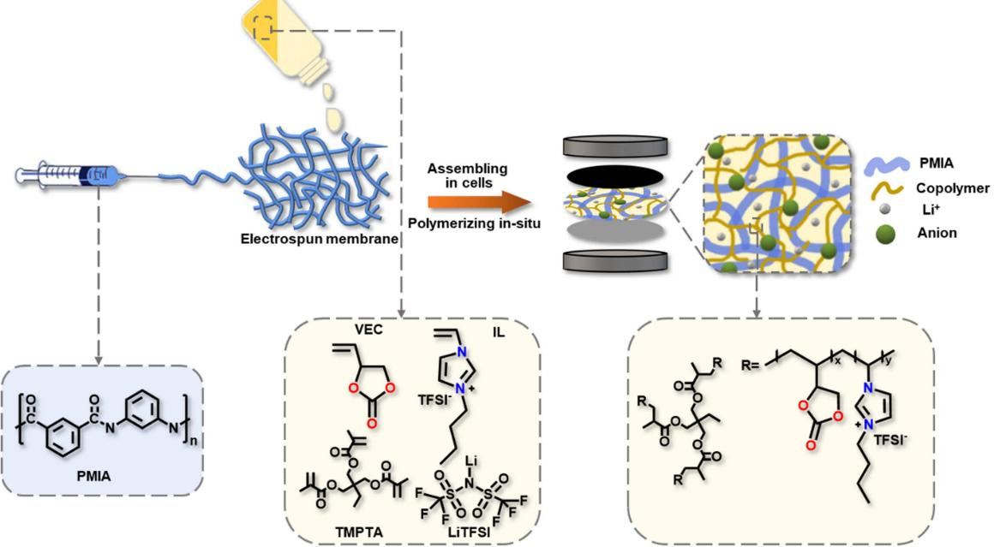
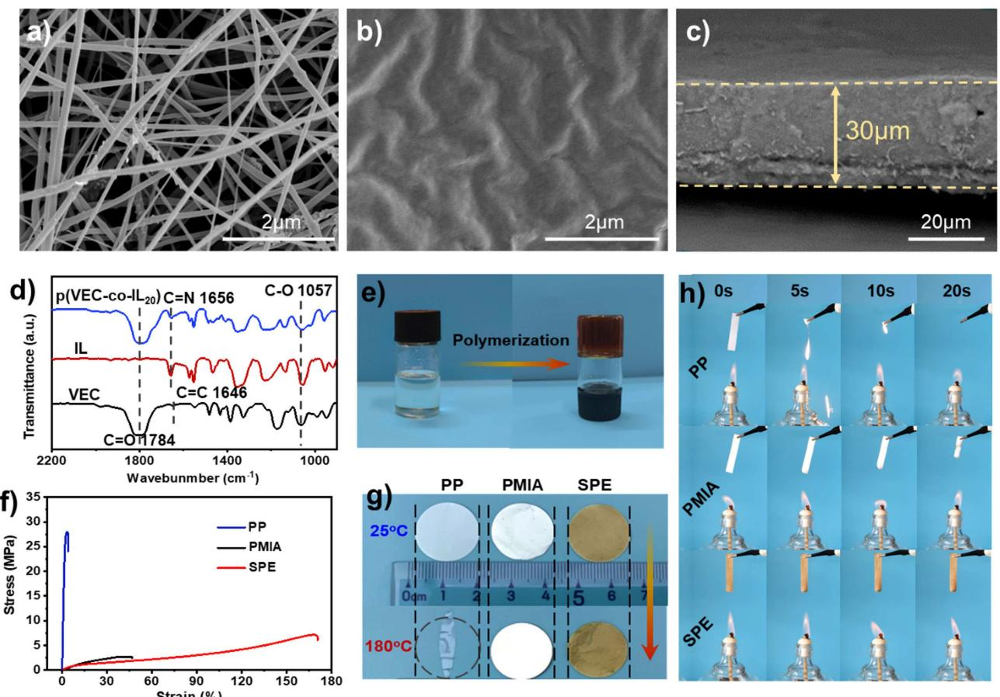
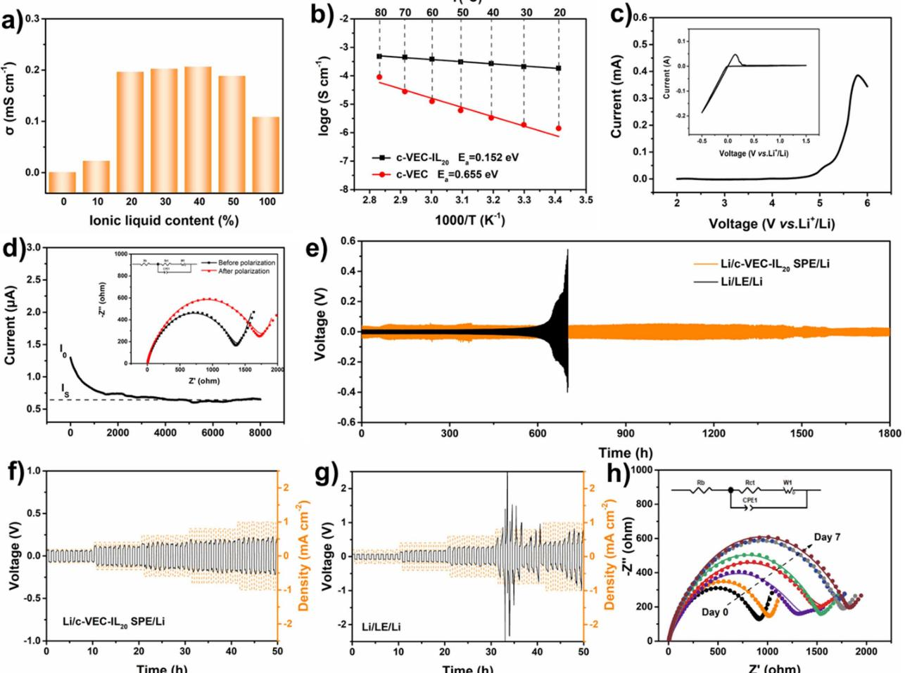
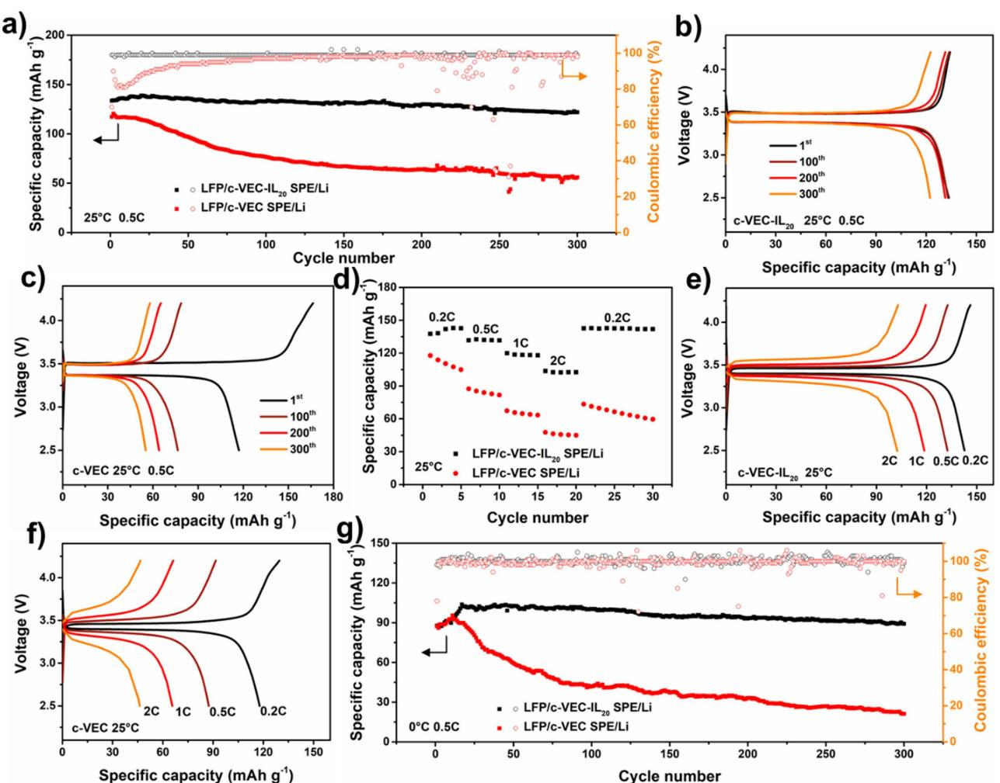
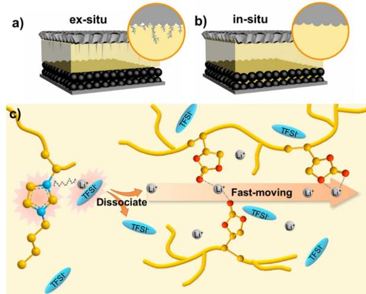
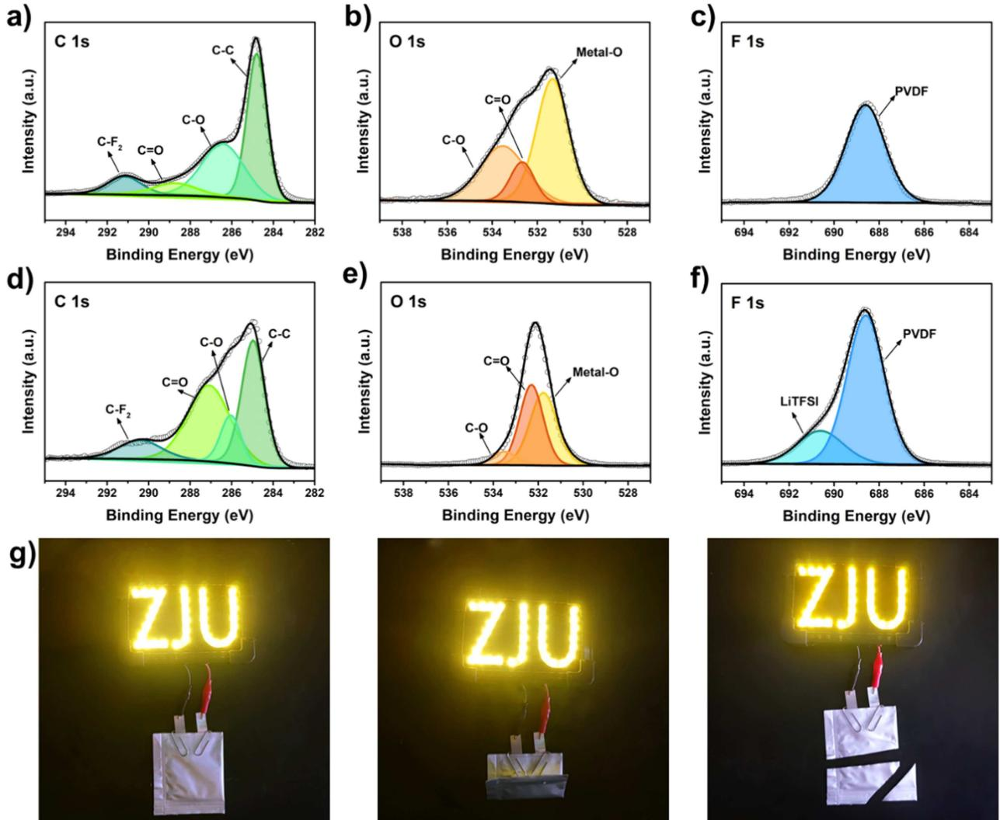

# **Bifunctional Solid-State Copolymer Electrolyte with Stabilized Interphase for High-Performance Lithium Metal Battery in a Wide Temperature Range**

Dongyun Wang,[a] Biyu Jin,[c] Yongyuan Ren,[b] Xiao Han,[d] Fanqun Li,[d] Yuanyuan Li,[a] Xiaoli Zhan,\*[a, b] and [Qinghua](http://orcid.org/0000-0003-1350-6388) Zhang\*[a, b]

Solid-state polymer electrolytes (SPEs) are expected to guarantee safe and durable operations of lithium metal batteries (LMBs). Herein, inspired by the salutary poly(vinyl ethylene carbonate) (PVEC) component in the solid electrolyte interphase, cross-linking vinyl ethylene carbonate and ionic liquid copolymers were synthesized by in-situ polymerization to serve as polymer electrolyte for LMBs. On one hand, due to rich ester bonds of PVEC, Li+ could transfer by coupling/decoupling with oxygen atoms. On the other hand, the imidazole ring of ionic

## **Introduction**

With the widespread application of electronic devices, electric vehicles, and other equipment, there is an urgent need to develop power supply equipment with high energy density, high output voltage, long cycle life, and low environmental pollution.[1] Lithium metal batteries (LMBs) have attracted great attention due to their high energy density, high theoretical specific capacity (3860 mAhg 1 ), and the lowest redox potential (3.04 V vs. standard hydrogen electrode).[2] However, LMBs are suffering from serious safety hazards because of the flammable organic liquid electrolytes. Additionally, lithium dendrites grow out of control during the lithium stripping/plating process and could eventually penetrate the separator and further cause the cutting-out of the batteries.[3] In the past decades, many researchers have been devoted to developing solid-state lithium batteries (SSLBs), which are expected to be the ultimate solution to the safety problems of LMBs.[4]

| [a] D. Wang, Y. Li, Prof. X. Zhan, Prof. Q. Zhang College of Chemical and Biological Engineering |
|-----------------------------------------------------------------------------------------------------|
| Zhejiang University                                                                                 |
| Hangzhou 310027, (P.R. China)                                                                       |
| E-mail: xlzhan@zju.edu.cn                                                                           |
| qhzhang@zju.edu.cn                                                                                  |
| [b] Dr. Y. Ren, Prof. X. Zhan, Prof. Q. Zhang                                                       |
| Institute of Zhejiang University-Quzhou                                                             |
| Quzhou 324000 (P.R. China)                                                                          |
| [c] Dr. B. Jin                                                                                      |
| School of Chemistry and Chemical Engineering                                                        |
| Anhui University of Technology                                                                      |
| Maanshan 243002 (P.R. China)                                                                        |
| [d] X. Han, F. Li                                                                                   |
| Wanxiang A123 Systems Asia Com., Ltd                                                                |
| Hangzhou 311215 (P.R. China)                                                                        |
| Supporting information for this article is available on the WWW under                               |

<https://doi.org/10.1002/cssc.202200993>

liquid could facilitate the dissociation of lithium salt to promote the free movement of Li+. The bifunctional component synergistically increased the ionic conductivity of the SPE to 1.97×10 4 S cm 1 at 25°C. Meanwhile, it also showed a wide electrochemical window, superior mechanical properties, outstanding non-combustibility, and excellent interfacial compatibility. The bifunctional copolymer-based LiFePO4 batteries could normally operate at 0 to 60°C, making them a promising candidate for wide-temperature-rang LMBs.

Due to the good flexibility, superior safety performance, and convenient processability, solid polymer electrolytes (SPEs) have received widespread attention. SSLBs with flexible SPEs are very suitable as a power source for penetrating batteries, wearable mobile phones, flexible screens, and other flexible devices.[5] Poly(ethylene oxide) (PEO), the most widely studied electrolyte, has a high crystallinity at ambient temperature, which essentially hinders the movement of segments and results in low lithium ionic conductivity (�10 7 S cm 1 at 25°C).[6] To obtain high ionic conductivity, the molecular structure of polymer electrolytes needs to be elaborately designed. As a typical polymer, aliphatic polycarbonate has high dielectric constant groups, amorphous chain structure, as well as flexible molecular chains.[7] Therefore, the ionic conductivity, electrochemical stability, and thermal stability of aliphatic polycarbonate-based SPEs are effectively improved.[7,8] Until now, several types of aliphatic polycarbonate-based SPEs have been developed, such as poly(vinylene carbonate),[9] poly(vinyl ethylene carbonate),[8] poly(ethylene carbonate),[10] and poly(propylene carbonate).[11] Noticeably, vinylene carbonate (VC) and vinyl ethylene carbonate (VEC) are common electrolyte additives that can polymerize on the electrode surface to form a stable solid electrolyte interphase (SEI) protective layer.[12] Especially, VEC has a unique molecular structure, where the C=C bond in the ethylene can provide a site for polymerization, while the weak interaction between the C=O bond in the five-membered ring and Li+ is able to promote the transmission of Li+. [13]

Ionic liquids (ILs) are proved to be non-flammable and electrochemically stable, which can efficiently improve the safety performance of batteries.[14] Furthermore, the abundant polar charge moieties of ILs can split the lithium salt ion pairs and yield more free Li+. [15] We introduced 1-vinyl-3-butyl imidazolium bis(trifluoromethylsulfonyl)imide ([VBIm] [TFSI]) as

functional building blocks to improve the safety performance and electrochemical performance of the SPEs.

Herein, cross-linking vinyl ethylene carbonate and ionic liquid copolymers (c-VEC-IL*x*) (*x* is the mass proportion of IL in copolymer) are synthesized on electrospun poly-*m*-phenylene isophthalamide (PMIA) nanofiber by in-situ radical polymerization. Using trimethylolpropane triacrylate (TMPTA) as an efficient crosslinking agent, PMIA mat and crosslinked copolymer can reinforce the overall mechanical strength of framework as proved by tensile test. Benefited from IL and rich ester bonds of PVEC, the ionic conductivity of the c-VEC-IL20 SPE is 1.97× 10 4 S cm 1 at 25°C. As a result, the assembled LiFePO4 (LFP) battery can normally operate at a wide temperature range from 0 to 60°C.

## **Results and Discussion**

Figure 1 shows the polymerization procedure of polymeric precursor solution (PPS) onto PMIA nanofiber mat and the insitu fabrication of the anticipated SSLBs. Details of the fabrication process are shown in the Experimental Section. Figure 2a shows the scanning electron microscopy (SEM) image of the PMIA mat with interlaced nanofibers forming a fluffy porous structure, which is applied as the mechanical reinforcing framework to improve mechanical properties. The porous PMIA mat displays a high affinity to PPS, which almost wholly absorbs it at the contact moment (Figure S1). The in-situ generated yellow–brown solid electrolytes can sufficiently fill the voids of the PMIA mat, thus resulting in a defect-free and uniformly distributed c-VEC-IL20 SPE (Figures 2b and S2). In the crosssectional SEM image (Figure 2c), it is seen that the thickness of the SPE layer is approximately 30 μm, which helps to yield smaller impedance. Chemical structure of the in-situ formed c-VEC-IL20 was revealed by Fourier-transform infrared (FTIR) spectroscopy (Figure 2d). The typical absorption peak of C=C bonds at 1646 cm 1 is clearly detected in VEC monomer and disappears in c-VEC-IL20, proving that the monomers are completely polymerized (Figure S3). The peak at 1656 cm 1 corresponds to the C=N stretching vibration belonging to the imidazole ring.[16] The characteristic peaks at around 1550 and 1570 cm 1 are skeleton stretching vibration of the imidazole ring. Additionally, the characteristic peaks of C=O and C O C stretching vibration appear at approximately 1784 and 1057 cm 1 respectively, which indicates the minimal influence of polymerization reaction to carbonate rings.

Mechanical properties and thermal stability of the SPEs determine its safety performance in practical applications. Figure 2f presents the stress–strain curves of PP separator (Celgard 2400), PMIA mat, and c-VEC-IL20 SPE. Compared to PP separator and PMIA mat, the c-VEC-IL20 SPE displays enhanced elasticity with high elongation at a break value of 170%, which has enough strength to hang a 200 g weight (Figure S4a) and can be arbitrarily bent (Figure S4b,c), demonstrating its potential in terms of flexible wearable devices. In order to explore the thermal stability of the SPEs, thermal gravimetric analysis has been carried out, and the results are shown in Figure S5a. The decomposition step around 250 °C can be ascribed to the continuous degradation of copolymers. The decomposition step above 400°C can be associated with the violent degradation, partial cross-linking, and carbonization reactions of PMIA.[17] The dimensional thermal stability of the SPE was evaluated by exposing it to a 180°C oven for 2 h. c-VEC-IL20 SPE and PMIA keep their shapes without obvious shrinkage, while the

**Figure 1.** Schematic illustration of the synthesis route of c-VEC-IL*x* SPE.

**Figure 2.** SEM images of (a) PMIA and (b,c) c-VEC-IL20 SPE. (d) FTIR spectra. (e) Optical photograph of in-situ polymerization. (f) Stress–strain curves for PP, PMIA, and c-VEC-IL20 SPE. (g) Optical photograph of PP, PMIA, and c-VEC-IL20 SPE before and after thermal baking at 180 °C for 2 h. (h) Burning test of PP, PMIA, and c-VEC-IL20 SPE.

counterpart PP totally loses its structure and becomes transparent (Figure 2g). It can still retain dimensional stability and effectively isolate the electrodes to prevent short circuits in an extreme environment. It is speculated that the meta-type benzene-amide linkages in PMIA skeleton take the primary responsibility for high heat resistance.[18] Furthermore, burning tests indicate the flame retardation of c-VEC-IL20 SPE is superior to others, which can be ascribed to the nonflammability of IL (Figure 2h).[19]

In the SPEs system, Li+ dissolves in the polymer electrolyte and moves through the polymer chain's movement. The freely movable Li+ and the movement ability of the polymer chain determine the ionic conductivity. It is generally believed that lowering the glass transition temperature (*T*g) can increase the mobility of polymer chains.[20] In order to verify the effect of VEC and IL proportion on the *T*g of c-VEC-IL*x*, differential scanning calorimetry (DSC) tests were conducted, and the results are displayed in Figure S5b,c. The *T*g of SPEs gradually decreases with the increasing IL content, which could be attributed to structural shielding of the coulombic interactions and plasticization of the large pendant group,[21] *T*g of c-VEC-IL20 reduces to 54.2°C. It enables the fast Li+ transportation because the polymer is in the rubber-elasticity region at the average operating temperature.[22] X-ray diffraction (XRD) patterns (Figure S6a,b) show that all the polymers have a wide dispersion peak near 20° without sharp crystalline peaks, proving that the polymers are amorphous.[23] From Figure 3a, the ionic conductivities of c-VEC-IL10 and c-VEC-IL20 are 2.32×10 5 and 1.97× 10 4 S cm 1 , respectively, at 25°C, which are higher than that of c-VEC (1.20×10 6 S cm 1 ). The higher ionic conductivity can be ascribed to the valuable synergistic effects of PVEC and IL (Figure 5c). First, abundant ester coordination sites from PVEC blocks and the flexible chain characteristic of the copolymer are favorable to the movement of Li+. [7] The transmission of Li+ depends on the coupling/decoupling between Li+ and oxygen atoms in C=O and C O groups. Specifically, both C=O and C O groups can interact with Li+, while the interaction between Li+ and C O group is weakened due to steric hindrance.[8] Attributable to the special ring structure, the polymer chains have larger free volume and greater mobility, and the ionic conductivity is improved.[24] Second, the unique structure of the imidazole ring from IL can attract bis(trifluoromethane) sulfonimide (TFSI- ) by electrostatic interaction, which facilitates the dissociation of lithium salt and accelerates the free movement of Li+. [25] With further increasing the proportion of IL, the ionic conductivity of c-VEC-IL*x* goes through a slight increase

**Figure 3.** (a) Ionic conductivity–IL content histogram at 25 °C. (b) Ionic conductivity–temperature curves of c-VEC and c-VEC-IL20 SPEs. (c) Electrochemical window of c-VEC-IL20; the inset is the cyclic voltammetry (CV) curves at a scan rate of 1 mVs 1 from 0.5 to 1.5 V. (d) AC impedance spectra and chronoamperometry polarization profile of c-VEC-IL20. (e) 1800 h galvanostatic cycling of the Li/c-VEC-IL20 SPE/Li cell and Li/LE/Li cell at 25 °C under 0.1 mAcm 2 . (f) Critical current density testing for Li/c-VEC-IL20 SPE/Li cell and (g) Li/LE/Li cell with current steps from 0.2 to 1.0 mAcm 2 . (h) AC impedance spectra of Li/c-VEC-IL20 SPE/Li symmetrical cell.

following by a substantial reduction, possibly because of the fewer and fewer C=O and C O groups in SPEs, which cannot meet the transport of Li+. The ionic conductivity of c-VEC and c-VEC-IL20 has been evaluated at temperatures ranging from 20 to 80°C. From Figure 3b, it can be found that the ionic conductivity of SPEs increases simultaneously with the increase of temperature. The Arrhenius functions can fit the temperature-dependent ionic conductivity behavior of SPEs, and the corresponding activation energy for c-VEC-IL20 is 0.152 eV, much less than that of c-VEC (0.655 eV). The low activation energy indicates the low energy barrier for Li+ transport in c-VEC-IL20. [8]

Broad electrochemical stability window is also crucial to practical application in LMBs.[26] Therefore, the electrochemical windows of c-VEC and c-VEC-IL20 were evaluated, as seen in Figures S7a and 3c. The decomposition voltages of c-VEC and c-VEC-IL20 are 4.5 and 4.8 V, respectively. Lithium-ion transference number (*t*Liþ ) of c-VEC and c-VEC-IL20 were measured at room temperature via electrochemical impedance spectroscopy (EIS) with a 10 mV potential polarization, which are 0.39 and 0.42, respectively (Figures 3d and S7b).

In LMBs, lithium metal has high activity, which can easily react with electrolytes. During the long-term lithium plating/ stripping processes, lithium dendrites are uncontrollably growing due to the uneven charge distribution, which has been deemed as one of the main bottlenecks that reduce the cycle life and safety of LMBs. Therefore, we assembled lithium symmetric cells to reveal the long-term stability of c-VEC-IL20 SPE and liquid electrolyte (LE) (Figure 3e). The symmetric Li/c-VEC-IL20 SPE/Li cell shows a small voltage profile (*<*0.06 V) over 1800 h at a current density of 0.1 mAcm 2 , elucidating a stable interphase between Li and SPE. In comparison, the voltage of the Li/LE/Li cell acutely fluctuates and continuously increases after 600 h, which is attributed to the growth of lithium dendrites.[27] Critical current densities of SPE and LE were also examined and displayed in Figure 3f,g. For Li/c-VEC-IL20 SPE/Li cell, as the current gradually increasing from 0.2 to 1.0 mAcm 2 ,

the voltage correspondingly increases from 0.06 to 0.21V. In contrast, Li/LE/Li cell is short-circuited at a current density of 0.8 mAcm 2 . Li anodes of the cycled cells (Li@SPE and Li@LE) were visualized by SEM as shown in Figure S8. We can see that the surface of the new Li film is smooth and flat, with only a few scratches. For Li@SPE, most of its surface is as smooth as fresh Li with only a few dendrites, while considerable clustered dendrites appear on the surface of Li@LE. X-ray photoelectron spectroscopy (XPS) is employed to elucidate the SEI composition on the Li anode (Figure S9). F1 s spectra show two peaks at 688.8 and 684.9 eV, which are attributed to CF3 and LiF, respectively.[12b] In particular, LiF can inhibit the continuous decomposition of electrolyte and the growth of lithium dendrites.[28] The improvement of interfacial performance can also be attributed to the advantages of IL, which not only kinetically improves the stability of SPEs but also effectively prevents the interfacial reaction of electrolyte and lithium.[23,29] The stability of the interphase between SPE and the lithium anode was further evaluated by analyzing the impedance variation of Li/c-VEC-IL20 SPE/Li cell standing for 7 days, as shown in Figure 3h. The interfacial resistance continually increased during the first 5 days, then kept relatively stable at about 1800 Ω, which indicated a stable resistive layer was formed on the Li electrodes surface.[30] Cyclic voltammetry (CV) of the LFP/c-VEC-IL20 SPE/Li cell was measured to assess the characteristic of electrochemical reactions within the cell (Figure S7c). Two typical peaks of the curves are detected at 3.28 and 3.58 V, corresponding to the oxidation and reduction peaks,[31] respectively. In five scans, the redox peaks almost coincide, revealing good electrochemical stability and reversibility.

Figure 4a shows cycling performances of LFP/c-VEC-IL20 SPE/ Li and LFP/c-VEC SPE/Li cells at 0.5C at ambient temperature. The LFP/c-VEC-IL20 SPE/Li displays outstanding cyclic performance with an initial specific capacity of 134 mAhg 1 . After 300 cycles, the specific capacity stabilizes at 122 mAhg 1 , and the capacity retention is 91%. Cationic imidazolium ILs have been reported to improve the electrodeposited Li morphologies,

**Figure 4.** (a) Long cycle performances of LFP/c-VEC-IL20 SPE/Li battery and LFP/c-VEC SPE/Li battery at 25°C, 0.5C. (b) Typical charge–discharge curves for LFP/ c-VEC-IL20 SPE/Li battery and (c) LFP/c-VEC SPE/Li battery. (d) Rate performances of LFP/c-VEC-IL20 SPE/Li and LFP/c-VEC SPE/Li batteries at 25°C. (e) Typical charge–discharge curves at different rates for LFP/c-VEC-IL20 SPE/Li battery and (f) LFP/c-VEC SPE/Li battery. (g) Long cycle performances of LFP/c-VEC-IL20 SPE/ Li and LFP/c-VEC SPE/Li batteries at 0 °C, 0.5C.

which contributes to improving the stability of cycling performance.[32] However, the initial specific capacity of LFP/c-VEC SPE/Li is 117 mAhg 1 , which only retains 56 mAhg 1 after 300 cycles, corresponding to 48% capacity retention. The representative charge-discharge curves within 300 cycles show that the polarization voltage of LFP/c-VEC-IL20 SPE/Li battery is smaller than LFP/c-VEC SPE/Li battery (0.11 vs. 0.14 V) (Figure 4b,c). Figure 4d–f displays the rate performances of LFP/c-VEC-IL20 SPE/Li battery with the current densities increasing from 0.2 to 2C. The LFP/c-VEC-IL20 SPE/Li battery is able to achieve a reversible capacity of 142, 132, 119, and 103 mAhg 1 at 0.2, 0.5, 1, and 2C, respectively. When the rate switched back to 0.2C, capacity of 142 mAhg 1 is recovered, indicating the high reversibility of the electrochemical reaction in c-VEC-IL20 SPE assembled cell. Conversely, the specific capacity of LFP/c-VEC SPE/Li is not only far less than that of LFP/c-VEC-IL20 SPE/Li at each rate, but also cannot recover to its original value when the rate switched back to 0.2C (117 vs. 73 mAhg 1 ). What's more, LFP/c-VEC-IL20 SPE/Li battery can be applied to a wide temperature range, whose initial discharge capacity under high current density of 1C is 143 mAhg 1 at 60°C. After 100 cycles, the specific capacity can still maintain at 132 mAhg 1 , corresponding to 92% capacity retention (Figure S10b). The battery still operates normally at 0°C and delivers most of its capacity (90 mAhg 1 ) after 300 cycles at 0.5C. It is noted that the discharge capacity keeps rising to 102 mAhg 1 during the first 20 cycles, owing to the activation of the interphase between electrolyte and electrode.[33] In contrast, the discharge capacity of c-VEC based battery drops sharply after 20 cycles (Figure 4g). To evaluate the adaptability of c-VEC-IL20 SPE for high-voltage cathode materials, coin half-cells paired with LiCoO2 (LCO) cathodes were assembled and cycled between 3.00 and 4.45 V. The initial discharge specific capacity is 135 mAhg 1 at 0.5C, corresponding to a capacity retention of 93% after 50 cycles (Figure S11).

The superior performances are attributed to the in-situ polymerization strategy. The PPS can thoroughly wet both the LFP cathode and the Li anode before polymerization, forming a uniform and stable interface with close contact after polymerization (Figure S12), thereby reducing the solid/solid interphase impedance to a large extent.[34] Without the adequate infiltration process, the discontinuous connected ex-situ SPEs-electrodes interphases inevitably lead to poor battery performances.[30] Even worse, poor contact results in uneven charge distribution, which further causes lithium dendrites to grow.[35] Figure 5a,b shows the interphase contact for ex-situ polymerization and insitu polymerization. What's more, in-situ polymerization of SPEs does not require an organic solvent volatilization process and is an uncomplicated and environmentally friendly strategy.[36]

The interfacial properties between LFP cathodes and c-VEC-IL20 SPE were investigated by XPS. The C1 s, O1 s, and F1 s XPS spectra of new and cycled LFP electrode surfaces are shown in Figure 6a–f. As shown in Figure 6a,d, peaks were fitted to C C ( �284.8 eV), C O (�286.4 eV), C=O (�288.7 eV), and C F2 ( �291.7 eV).[37] Comparing the new electrode and the cycled electrode, the intensity of C=O peak significantly enhanced, which could be the C=O bond of PVEC. The intensity of C O

**Figure 5.** Schematic diagram of the interfacial contact for (a) ex-situ polymerization and (b) in-situ polymerization. (c) Schematic diagram of Li+ conduction mechanism.

peak in O1 s spectra also conspicuously increased. As shown in Figure 6f, after cycling, F 1 s spectrum has two peaks, which correspond to LiTFSI (�690.7 eV) and PVDF (�688.6 eV), respectively. These results indicate that the interphase of LFP cathodes and c-VEC-IL20 SPE is in close contact, which reduces the barrier of ion transmission and reflects the superiority of the in-situ polymerization scheme.

The LFP/c-VEC-IL20/Li pouch cell has been assembled. It can successfully light up 4 W light-emitting diode (LED) lamps. Moreover, the pouch cell will not be short-circuited in spite of being bent or cut (Figure 6g). Furthermore, it can operate normally (Figure S13). Therefore, c-VEC-IL20 SPE is expected to be used in high-energy-density flexible devices due to its good flexibility and safety.

## **Conclusion**

We proposed a novel c-VEC-IL20 solid-state polymer electrolyte (SPE) via in-situ generation method for wide temperature solidstate lithium metal batteries (LMBs). Wherein, massive oxygen atoms in poly(vinyl ethylene carbonate) (PVEC) block are capable of coupling and decoupling with Li+ to transport it. The ionic liquid (IL) can promote the dissociation of lithium salts to provide more free ions and possess higher interphase compatibility with metallic lithium and improve safety. In addition, an efficient Li+ transfer channel facilitates the construction of a stable interphase between the SPE and the electrode, assuring swift and uniform deposition of Li+. As a result, the ionic conductivity of c-VEC-IL20 SPE at room temperature increased to 1.97×10 4 S cm 1 . The LFP/c-VEC-IL20 SPE/Li battery has excellent reversibility at a wide temperature range, presenting a high discharge specific capacity of 102 mAhg 1 at 0°C, 134 mAhg 1 at 25°C, and 143 mAhg 1 at 60°C. Furthermore, the pouch cell achieves high safety and reliability.

**Figure 6.** (a) C1 s, (b) O1 s, and (c) F1 s XPS spectra of the new electrode and (d–f) the electrode after cycling. (g) Optical photographs for the soft package LFP/c-VEC-IL20 SPE/Li battery that light up the LED lamps at different states: normal, bending, and cutting.

Therefore, the c-VEC-IL20 SPE designed in this work could be one of the most promising candidates for the practical applications of LMBs.

## **Experimental Section**

### **Electrospinning of PMIA mat**

For the preparation of the precursor electrospun solution, 0.06 g SiO2 nanoparticles (diameter of particles �20 nm, Macklin) and 1 g PMIA (industrial grade, Yantai Spandex Co. Ltd.) were dissolved in *N*,*N*-dimethyl acetamide (DMAc, AR) and stirred for 12 h to obtain a 10 wt% homogeneous solution. The nanofiber was prepared by electrospinning onto a collection plate under a high voltage of 23 kV at a distance of 20 cm. Then, the electrospun nanofiber was dried in a vacuum oven at 60°C for 12 h to remove residual solvent. Finally, the nanofiber was cut into a circle with a diameter of 19 mm.

## **Fabrication of c-VEC-ILx SPE**

Firstly, 72 wt% of a certain proportion of VEC (99%, Changshu Changji Chemical Co., Ltd.) and [VBIm] [TFSI] (99%, Lanzhou Oleko) mixture, 25 wt% LiTFSI (99%, Aladdin), 2 wt% TMPTA (85%, Aladdin) and 1 wt% dibenzoyl peroxide (�98%, BPO, Aladdin) were fully stirred to form a transparent PPS. Then, the PPS (50 μL) was injected into CR2025 lithium battery, as-prepared PMIA mat separated cathode and anode. Later, the batteries were kept constantly at 80°C for 12 h in oven to generate the completion of polymerization. The SPE was sandwiched between two glass slides to polymerize for other tests.

#### **Characterizations**

Chemical structure was investigated using FTIR spectroscopy (Nicolet 5700). Field-emission scanning electron microscopy (FES-EM, Hitachi TM-1000) at an accelerating voltage of 20 kV and energy dispersive X-ray spectroscopy (EDS, Philips Tecnai G2 F20 S-TWIN electron microscope equipped) were used to observe the

morphology and elemental distribution of samples. XRD tests were conducted from 5 to 50°on Brukeroptics D2 PHASER (Cu Kα radiation, *λ*=1.5406 Å) in a 2*θ* range to confirm crystal structure of materials. Zwick/Roell Z020 universal material tester was operated to measure the stress-strain behavior. Differential scanning calorimeter (DSC, TA DSC25) was used to examine *T*g of samples with the ramp rate of 10°Cmin 1 . Thermogravimetric analysis (TGA, TA Discovery TGA55) was used under nitrogen atmosphere with temperature ranging from room temperature to 600 °C at a heating rate of 10°Cmin 1 . Elemental composition and chemical bonding of cathodes were analyzed by XPS (Thermo Scientific, USA) with an Al Kα X-ray source.

#### **Electrochemical measurements**

The ionic conductivity of samples was tested in stainless steel (SS)/ SPE/SScell. Ionic conductivity was measured by AC impedance spectroscopy using CHI660E (Shanghai Chenhua instrument Co., Ltd) electrochemical workstation, which was conducted with a frequency ranging from 0.1 Hz to 1 MHz. The ionic conductivity *σ* [S cm 1 ] was calculated from Equation (1):

$$
\sigma = \frac{1}{R_{\rm b} \times S} \tag{1}
$$

Where *R*b [Ω] represents the bulk resistance of electrolyte, *l* [cm] is the thickness of electrolyte, and *S* [cm2 ] is the area of electrode.

The activation energy *E*a was calculated based on the Arrhenius equation [Eq. (2)]:

$$
\sigma(T) = A \exp(-E_a/RT) \tag{2}
$$

where *σ* is the ionic conductivity, *A* is the frequency factor, *R* is the molar gas constant, and *T* is the absolute temperature.

Electrochemical stability of the electrolyte was tested in Li/SPE/SS cell by linear sweep voltammetry (LSV) with potential ranging from 2.0 to 6.0 V under a scanning rate of 5.0 mVs 1 . Li/SPE/Li cells were assembled to measure the time evolution of EIS. *t*Liþ was measured by a combination test of AC impedance and DC-bias measurement on a Li/SPE/Li cell at a DC voltage of 10 mV and was calculated according to Equation (3):

$$
t_{Li^{+}} = \frac{I_{S}(\Delta V - I_{0}R_{0})}{I_{0}(\Delta V - I_{S}R_{S})}
$$
\n(3)

Where *I*0 and *I*S represent the current before and after polarization, and *R*0 and *R*S represent resistance value before and after polarization.

#### **Performance evaluation of batteries**

A flask equipped with a magnetic stirrer was charged with VEC (5.0 g) and BPO (0.05 g). Then the mixture was stirred at 80°C for 12 h with nitrogen protection. The product was dissolved in *N*,*N*dimethylformamide (DMF), precipitated with ethanol, and dried in vacuum, obtaining the PVEC binder. LFP cathode was prepared by mixing 80 wt% LFP powder, 5 wt% PVDF, 5% PVEC, and 10 wt% super P with appropriate *N*-methyl-2-pyrrolidone (NMP) to get a homogeneous slurry. This slurry was cast on aluminum foil by a doctor blade method, and then dried at 80°C overnight. The electrode was cut into a circle with a diameter of 14 mm. The mass loading of the LFP was about 1.5–2.0 mgcm 2 . LCO cathode was prepared with the same method. The detailed assembly process of the pouch cell is shown in the Supporting Information. The galvanostatic cycling tests were measured on NEWARE CT-4008 (Shenzhen, China) using CR2025-type coin cell at 0, 25, and 60°C (LFP: 2.5-4.2 V, 1C=170 mAhg 1 ; LCO: 3.0-4.45 V, 1C= 175 mAhg 1 ).

## *Acknowledgements*

*This work was supported by the National Natural Science Foundation of China (No. 21978258) and the Key Research and Development Program of Zhejiang Province (No. 2022C01071).*

## *Conflict of Interest*

The authors declare no conflict of interest.

## **Data Availability Statement**

The data that support the findings of this study are available in the supplementary material of this article.

**Keywords:** copolymerization **·** electrochemistry **·** ionic liquid **·** lithium **·** polymer electrolytes

- [1] a) B. Zhang, J. Zhong, Y. Zhang, L. Yang, J. Yang, S. Li, L.-W. Wang, F. Pan, Z. Lin, *Nano Energy* **2021**, *79*, [105407;](https://doi.org/10.1016/j.nanoen.2020.105407) b) H. Sun, X. Xie, Q. Huang, Z. Wang, K. Chen, X. Li, J. Gao, Y. Li, H. Li, J. Qiu, W. Zhou, *[Angew.](https://doi.org/10.1002/anie.202107667) Chem. Int. Ed.* **2021**, *60*, [18335–18343](https://doi.org/10.1002/anie.202107667); c) X. Zhan, J. Zhang, M. Liu, J. Lu, Q. Zhang, F. Chen, *ACS Appl. Energ. Mater.* **2019**, *2*, [1685–1694](https://doi.org/10.1021/acsaem.8b01733); d) B. Jin, D. Wang, J. Zhu, H. Guo, Y. Hou, X. Gao, J. Lu, X. Zhan, X. He, Q. Zhang, *Adv. Funct. Mater.* **2021**, *31*, [2104433](https://doi.org/10.1002/adfm.202104433).
- [2] a) X.-B. Cheng, C. Yan, X. Chen, C. Guan, J.-Q. Huang, H.-J. Peng, R. Zhang, S.-T. Yang, Q. Zhang, *Chem* **2017**, *2*, [258–270;](https://doi.org/10.1016/j.chempr.2017.01.003) b) Z. Lv, Y. Tang, S. Dong, Q. Zhou, G. Cui, *Chem. Eng. J.* **2022**, *430*, [132659;](https://doi.org/10.1016/j.cej.2021.132659) c) D. Jeong, J. Shim, H. Shin, J. C. Lee, *[ChemSusChem](https://doi.org/10.1002/cssc.201903466)* **2020**, *13*, 2642–2649.
- [3] a) L. Gao, J. Li, J. Ju, B. Cheng, W. Kang, N. Deng, *J. [Energy](https://doi.org/10.1016/j.jechem.2020.06.035) Chem.* **2021**, *54*, [644–654](https://doi.org/10.1016/j.jechem.2020.06.035); b) J.-H. Jiang, A.-B. Wang, W.-K. Wang, Z.-Q. Jin, L.-Z. Fan, *[J.](https://doi.org/10.1016/j.jechem.2019.10.009) Energy Chem.* **2020**, *46*, [114–122.](https://doi.org/10.1016/j.jechem.2019.10.009)
- [4] a) W. Zhou, Z. Wang, Y. Pu, Y. Li, S. Xin, X. Li, J. Chen, J. B. Goodenough, *Adv. Mater.* **2019**, *31*, e1805574; b) S. Kwak, K. An, Y. H. T. Tran, S. W. Song, *ChemSusChem* **2022**, *15*, e202102546.
- [5] a) F. Lv, Z. Wang, L. Shi, J. Zhu, K. Edström, J. Mindemark, S. Yuan, *[J.](https://doi.org/10.1016/j.jpowsour.2019.227175) Power [Sources](https://doi.org/10.1016/j.jpowsour.2019.227175)* **2019**, *441*, 227175; b) R. Chen, W. Qu, X. Guo, L. Li, F. Wu, *Mater. Horiz.* **2016**, *3*, [487–516](https://doi.org/10.1039/C6MH00218H).
- [6] a) B. Wang, Y. Wu, S. Zhuo, S. Zhu, Y. Chen, C. Jiang, C. Wang, *J. [Mater.](https://doi.org/10.1039/C9TA14239H) Chem. A* **2020**, *8*, [5968–5974;](https://doi.org/10.1039/C9TA14239H) b) Y. Sun, X. Zhang, C. Ma, N. Guo, Y. Liu, J. Liu, H. Xie, *J. Power Sources* **2021**, *516*, [230686.](https://doi.org/10.1016/j.jpowsour.2021.230686).
- [7] J. Zhang, J. Yang, T. Dong, M. Zhang, J. Chai, S. Dong, T. Wu, X. Zhou, G. Cui, *Small* **2018**, *14*, e1800821.
- [8] Z. Lin, X. Guo, Z. Wang, B. Wang, S. He, L. A. O'Dell, J. Huang, H. Li, H. Yu, L. Chen, *Nano Energy* **2020**, *73*, [104786](https://doi.org/10.1016/j.nanoen.2020.104786).
- [9] a) J. Chai, Z. Liu, J. Ma, J. Wang, X. Liu, H. Liu, J. Zhang, G. Cui, L. Chen, *Adv. Sci.* **2017**, *4*, [1600377](https://doi.org/10.1002/advs.201600377); b) Y. Zhao, Y. Bai, W. Li, A. Liu, M. An, Y. Bai, G. Chen, *Chem. Eng. J.* **2020**, *394*, [124847.](https://doi.org/10.1016/j.cej.2020.124847)
- [10] a) Y. Tominaga, Y. Kinno, K. Kimura, *[Electrochim.](https://doi.org/10.1016/j.electacta.2019.02.052) Acta* **2019**, *302*, 286– [290;](https://doi.org/10.1016/j.electacta.2019.02.052) b) K. Kobayashi, G. Pagot, K. Vezzù, F. Bertasi, V. Di Noto, Y. Tominaga, *Polym. J.* **2020**, *53*, 149–155.
- [11] a) J. Zhang, J. Zhao, L. Yue, Q. Wang, J. Chai, Z. Liu, X. Zhou, H. Li, Y. Guo, G. Cui, L. Chen, *Adv. Energy Mater.* **2015**, *5*, [1501082;](https://doi.org/10.1002/aenm.201501082) b) D. Zhou, R.

Zhou, C. Chen, W.-A. Yee, J. Kong, G. Ding, X. Lu, *J. Phys. [Chem.](https://doi.org/10.1021/jp4021678) B* **2013**, *117*, [7783–7789.](https://doi.org/10.1021/jp4021678)

- [12] a) A. L. Michan, B. S. Parimalam, M. Leskes, R. N. Kerber, T. Yoon, C. P. Grey, B. L. Lucht, *Chem. Mater.* **2016**, *28*, [8149–8159;](https://doi.org/10.1021/acs.chemmater.6b02282) b) Y. Yang, J. Xiong, S. Lai, R. Zhou, M. Zhao, H. Geng, Y. Zhang, Y. Fang, C. Li, J. Zhao, *[ACS](https://doi.org/10.1021/acsami.8b20706) Appl. Mater. Interfaces* **2019**, *11*, [6118–6125.](https://doi.org/10.1021/acsami.8b20706)
- [13] X. Huang, S. Zeng, J. Liu, T. He, L. Sun, D. Xu, X. Yu, Y. Luo, W. Zhou, J. Wu, *J. Phys. Chem. C* **2015**, *119*, [27882–27891](https://doi.org/10.1021/acs.jpcc.5b09130).
- [14] a) F. Ma, Z. Zhang, W. Yan, X. Ma, D. Sun, Y. Jin, X. Chen, K. He, *[ACS](https://doi.org/10.1021/acssuschemeng.8b04076) [Sustainable](https://doi.org/10.1021/acssuschemeng.8b04076) Chem. Eng.* **2019**, *7*, 4675–4683; b) E. J. Cheng, M. Liu, Y. Li, T. Abe, K. Kanamura, *J. Power Sources* **2022**, *517*, [230705.](https://doi.org/10.1016/j.jpowsour.2021.230705).
- [15] N. Zhou, Y. Wang, Y. Zhou, J. Shen, Y. Zhou, Y. Yang, *[Electrochim.](https://doi.org/10.1016/j.electacta.2019.01.143) Acta* **2019**, *301*, [284–293.](https://doi.org/10.1016/j.electacta.2019.01.143)
- [16] F. Zhang, Y. Sun, Z. Wang, D. Fu, J. Li, J. Hu, J. Xu, X. Wu, *ACS [Appl.](https://doi.org/10.1021/acsami.9b22945) Mater. Interfaces* **2020**, *12*, [23774–23780](https://doi.org/10.1021/acsami.9b22945).
- [17] Y. Li, X. Ma, N. Deng, W. Kang, H. Zhao, Z. Li, B. Cheng, *Fibers [Polym.](https://doi.org/10.1007/s12221-017-6772-0)* **2017**, *18*, [212–220.](https://doi.org/10.1007/s12221-017-6772-0)
- [18] Z. Huang, Y. Chen, Q. Han, M. Su, Y. Liu, S. Wang, H. Wang, *Chem. Eng. J.* **2021**, 132429.
- [19] Q. Guo, Y. Han, H. Wang, S. Xiong, W. Sun, C. Zheng, K. Xie, *J. [Phys.](https://doi.org/10.1021/acs.jpcc.8b02693) Chem. C* **2018**, *122*, [10334–10342](https://doi.org/10.1021/acs.jpcc.8b02693).
- [20] Y. Jiang, X. Yan, Z. Ma, P. Mei, W. Xiao, Q. You, Y. Zhang, *[Polymer](https://doi.org/10.3390/polym10111237)* **2018**, *10*, [1237.](https://doi.org/10.3390/polym10111237)
- [21] H. He, H. Chung, E. Roth, D. Luebke, D. Hopkinson, H. Nulwala, K. Matyjaszewski, *Polym. Adv. Technol.* **2015**, *26*, [823–828](https://doi.org/10.1002/pat.3529).
- [22] Z. Sun, Y. Li, S. Zhang, L. Shi, H. Wu, H. Bu, S. Ding, *J. [Mater.](https://doi.org/10.1039/C9TA00634F) Chem. A* **2019**, *7*, [11069–11076.](https://doi.org/10.1039/C9TA00634F)
- [23] X. Cai, B. Ye, J. Ding, Z. Chi, L. Sun, P. Saha, G. Wang, *J. [Mater.](https://doi.org/10.1039/D0TA11180E) Chem. A* **2021**, *9*, [2459–2469.](https://doi.org/10.1039/D0TA11180E)
- [24] L. Dong, X. Zeng, J. Fu, L. Chen, J. Zhou, S. Dai, L. Shi, *[Chem.](https://doi.org/10.1016/j.cej.2021.130209) Eng. J.* **2021**, *423*, [130209.](https://doi.org/10.1016/j.cej.2021.130209)
- [25] a) M. Zhou, R. Liu, D. Jia, Y. Cui, Q. Liu, S. Liu, D. Wu, *Adv. Mater.* **2021**, e2100943; b) C. A. Calderón, A. Vizintin, J. Bobnar, D. E. Barraco, E. P. M. Leiva, A. Visintin, S. Fantini, F. Fischer, R. Dominko, *ACS Appl. [Energ.](https://doi.org/10.1021/acsaem.9b02309) Mater.* **2020**, *3*, [2020–2027](https://doi.org/10.1021/acsaem.9b02309).
- [26] B. Kim, H. Kang, K. Kim, R. Y. Wang, M. J. Park, *[ChemSusChem](https://doi.org/10.1002/cssc.202000117)* **2020**, *13*, [2271–2279.](https://doi.org/10.1002/cssc.202000117)
- [27] Q. Lu, Y. B. He, Q. Yu, B. Li, Y. V. Kaneti, Y. Yao, F. Kang, Q. H. Yang, *[Adv.](https://doi.org/10.1002/adma.201604460) Mater.* **2017**, *29*, [1604460](https://doi.org/10.1002/adma.201604460).
- [28] X.-Q. Zhang, X.-B. Cheng, X. Chen, C. Yan, Q. Zhang, *Adv. Funct. [Mater.](https://doi.org/10.1002/adfm.201605989)* **2017**, *27*, [1605989.](https://doi.org/10.1002/adfm.201605989) .
- [29] a) O. Nordness, J. F. Brennecke, *Chem. Rev.* **2020**, *120*, [12873–12902;](https://doi.org/10.1021/acs.chemrev.0c00373) b) D.-Z. Zhang, Y.-y. Ren, Y. Hu, L. Li, F. Yan, *Chin. J. [Polym.](https://doi.org/10.1007/s10118-020-2390-1) Sci.* **2020**, *38*, [506–513](https://doi.org/10.1007/s10118-020-2390-1).
- [30] D. Zhou, Y.-B. He, R. Liu, M. Liu, H. Du, B. Li, Q. Cai, Q.-H. Yang, F. Kang, *Adv. Energy Mater.* **2015**, *5*, [1500353.](https://doi.org/10.1002/aenm.201500353)
- [31] H. Chen, D. Adekoya, L. Hencz, J. Ma, S. Chen, C. Yan, H. Zhao, G. Cui, S. Zhang, *Adv. Energy Mater.* **2020**, *10*, [2000049](https://doi.org/10.1002/aenm.202000049).
- [32] a) Y. Li, K. W. Wong, Q. Dou, K. M. Ng, *J. Mater. Chem. A* **2016**, *4*, [18543–](https://doi.org/10.1039/C6TA09106G) [18550;](https://doi.org/10.1039/C6TA09106G) b) K. Liu, Z. Wang, L. Shi, S. Jungsuttiwong, S. Yuan, *J. [Energy](https://doi.org/10.1016/j.jechem.2020.11.017) Chem.* **2021**, *59*, [320–333](https://doi.org/10.1016/j.jechem.2020.11.017).
- [33] G. Yang, C. Chanthad, H. Oh, I. A. Ayhan, Q. Wang, *J. [Mater.](https://doi.org/10.1039/C7TA04599A) Chem. A* **2017**, *5*, [18012–18019.](https://doi.org/10.1039/C7TA04599A)
- [34] D. Zhou, R. Liu, J. Zhang, X. Qi, Y.-B. He, B. Li, Q.-H. Yang, Y.-S. Hu, F. Kang, *Nano [Energy](https://doi.org/10.1016/j.nanoen.2017.01.027)* **2017**, *33*, 45–54.
- [35] S. Huang, Z. Cui, L. Qiao, G. Xu, J. Zhang, K. Tang, X. Liu, Q. Wang, X. Zhou, B. Zhang, G. Cui, *[Electrochim.](https://doi.org/10.1016/j.electacta.2019.01.039) Acta* **2019**, *299*, 820–827.
- [36] T. Liu, J. Zhang, W. Han, J. Zhang, G. Ding, S. Dong, G. Cui, *[J.](https://doi.org/10.1149/1945-7111/ab76a4) [Electrochem.](https://doi.org/10.1149/1945-7111/ab76a4) Soc.* **2020**, *167*, 070527.
- [37] J. Liang, D. Chen, K. Adair, Q. Sun, N. G. Holmes, Y. Zhao, Y. Sun, J. Luo, R. Li, L. Zhang, S. Zhao, S. Lu, H. Huang, X. Zhang, C. V. Singh, X. Sun, *Adv. Energy Mater.* **2020**, *11*, 2002455.

Manuscript received: May 25, 2022 Accepted manuscript online: June 17, 2022 Version of record online: July 5, 2022