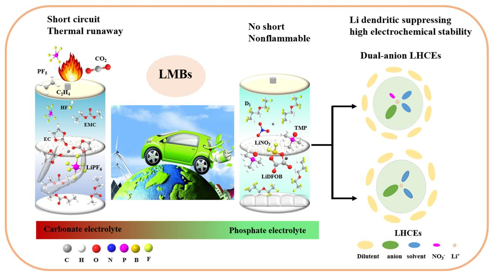
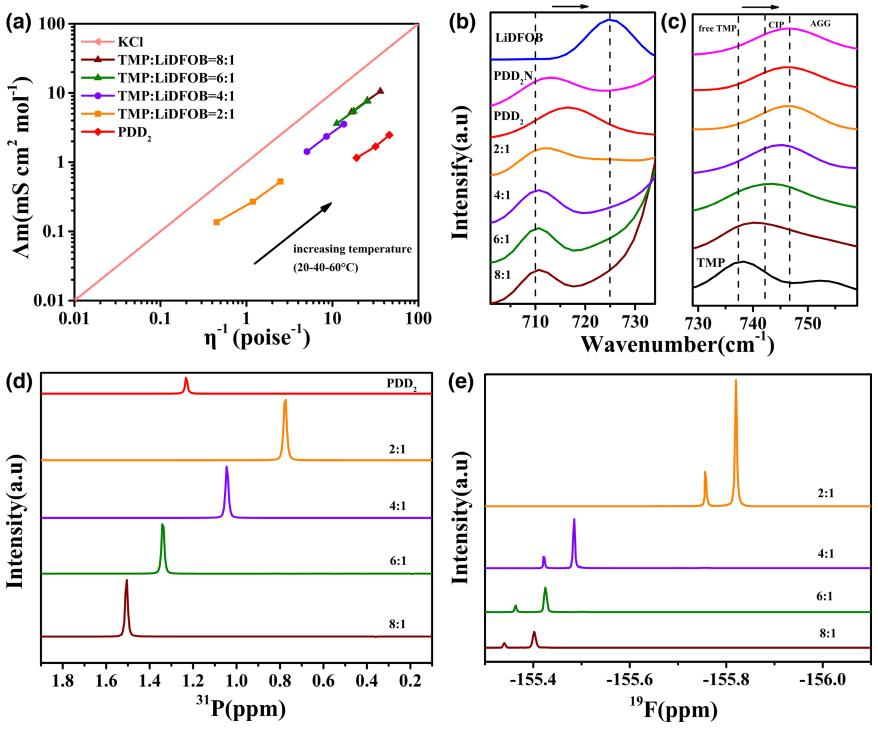
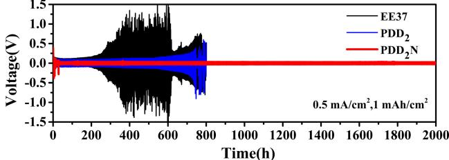
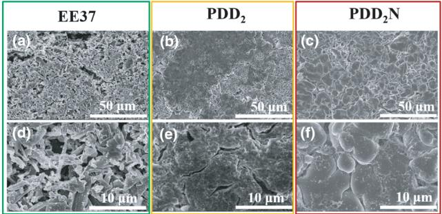
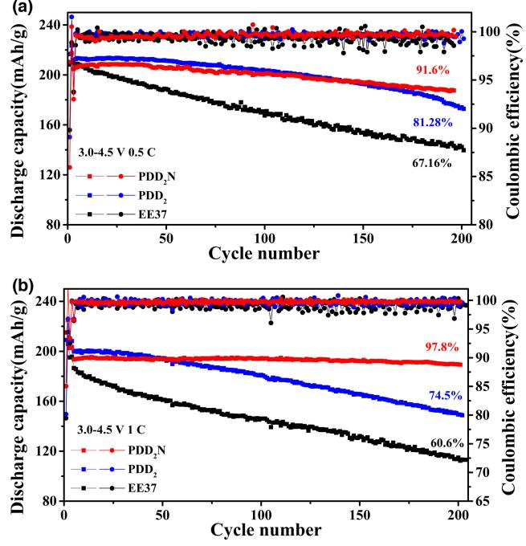
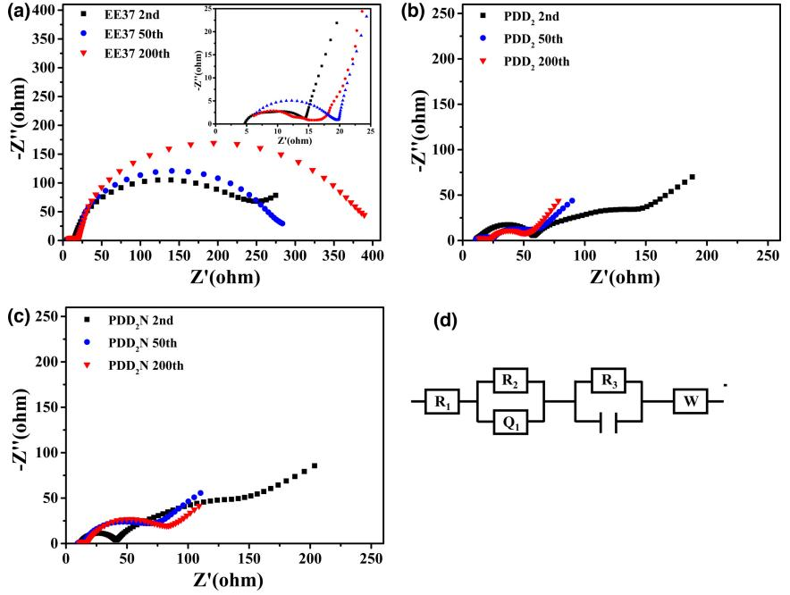
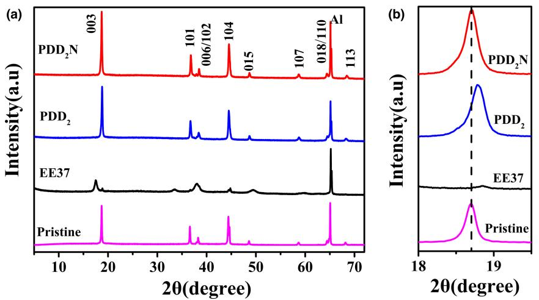
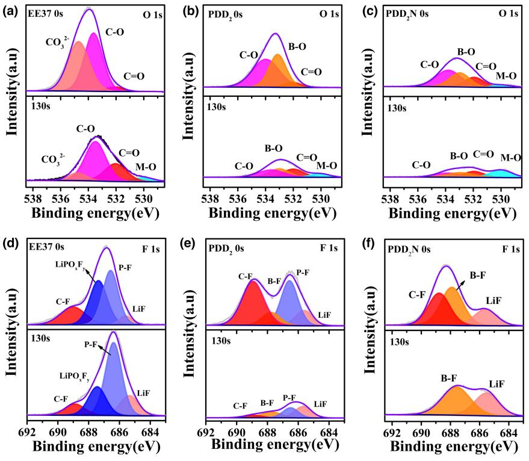
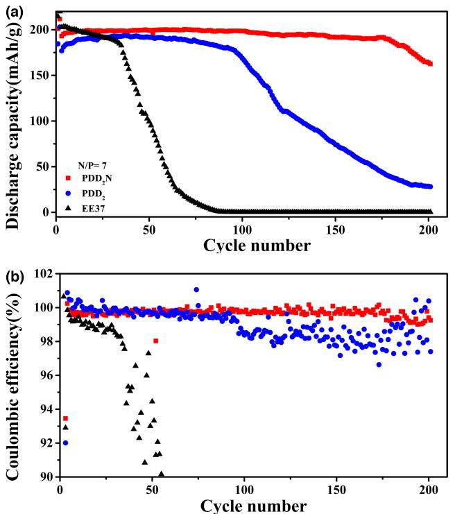
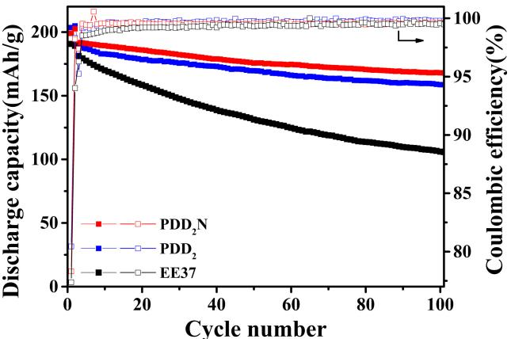

# Advanced Nonflammable Localized High-Concentration Electrolyte For High Energy Density Lithium Battery

Mengmin Jia, Chi Zhang, Yawei Guo, Linshan Peng, Xiaoyan Zhang, Weiwei Qian, Lan Zhang\*, and Suojiang Zhang[\\*](https://orcid.org/0000-0002-9397-954X)

The key to realize long-life high energy density lithium batteries is to exploit functional electrolytes capable of stabilizing both high voltage cathode and lithium anode. The emergence of localized high-concentration electrolytes (LHCEs) shows great promise for ameliorating the above-mentioned interfacial issues. In this work, a lithium difluoro(oxalate)borate (LiDFOB) based nonflammable dual-anion LHCE is designed and prepared. Dissolving in the mixture of trimethyl phosphate (TMP) /1,1,2,2-tetrafluoroethyl-2,2,3,3 tetrafluoropropylether (D2), the continuously consumption of LiDFOB is suppressed by simply introducing lithium nitrate (LiNO3). Meantime, as most of the TMP molecular are coordinated with Li+, the electrolyte does not show incompatibility issue between neither metal lithium nor graphite anode. Therefore, it demonstrates excellent capability in stabilizing the interface of Ni-rich cathode and regulating lithium deposition morphology. The Li||LiNi0.87Co0.08Mn0.05O2 (NCM87) batteries exhibit high capacity retention of more than 90% after 200 cycles even under the high cutoff voltage of 4.5 V, 1 C rate. This study offers a prospective method to develop safe electrolytes suitable for high voltage applications, thus providing higher energy densities.

M. Jia, Y. Guo, L. Peng, Dr. W. Qian, Prof. L. Zhang, Prof. S. Zhang CAS Key Laboratory of Green Process and Engineering, State Key Laboratory of Multiphase Complex Systems, Institute of Process Engineering, Beijing Key Laboratory of Ionic Liquids Clean Process, Chinese Academy of Sciences, Beijing 100190, China

E-mail: sjzhang@ipe.ac.cn

M. Jia, L. Peng, Prof. S. Zhang

School of Chemical Engineering, University of Chinese Academy of Sciences, Beijing 100049, China

C. Zhang

School of Chemical Engineering, Zhengzhou University, Zhengzhou 450001, China

X. Zhang

School of Chemical Engineering and Technology, Xi'an Jiaotong University, Xi'an 710049, China

Prof. L. Zhang

Langfang Institute of Process Engineering, Chinese Academy of Sciences, Hebei 065001, China

E-mail: zhangl@ipe.ac.cn

The ORCID identification number(s) for the author(s) of this article can be found under<https://doi.org/10.1002/eem2.12246>.

#### DOI: 10.1002/eem2.12246

## 1. Introduction

Since firstly commercialized by Sony, lithium batteries are becoming ubiquitous in 3C electronic products, electric vehicles (EVs), and large-scale energy storage (ES) devices,[\[1](#page-7-0)–[5\]](#page-7-0) while the applications of EVs and ES still call for batteries with higher energy density. The combination of high voltage (≥4.3 V) nickel-rich cathode (LiNixMnyCo(1-x-y)O2, NCM) and lithium metal anode is no doubt an ideal choice to fulfill the energy demand, while the poor cycle stability and safety concern brought about by inferior interfacial stability between lithium and electrolyte are seriously hindering its development. Electrolyte is no doubt the most convenient way to enhance the stability of high energy density batteries; therefore, tremendous efforts have been devoted to novel electrolyte design.[[6](#page-7-0)–[8\]](#page-7-0)

Stable cathode/anode electrolyte interface (CEI/SEI) is the key to enable long life of Li|| NCM batteries, and in terms of electrolyte design, several strategies have been trialed and

proved to be effective. The first and most commonly used one is using special additives that could promote the formation of SEI/CEI, typical ones including lithium difluoro(oxalato)borate (LiDFOB),[\[9,10\]](#page-7-0) Lithium bis(fluorosulfonyl)imide (LiFSI),[[11\]](#page-7-0) lithium nitrate (LiNO3),[\[12\]](#page-7-0) to name but a few. With 1.5 wt% LiDFOB as additive, graphite|| LiNi0.83Mn0.05Co0.12O2 cell kept 83.1% of its initial capacity after 200 cycles at C/3 rate, while capacity retention of the one without LiDFOB is only 59.9% under the same condition.[[10\]](#page-7-0) However, this strategy suffers from additive loss, as the additives usually need to be self-sacrificed to form the protection layer on the electrode.[[13\]](#page-7-0) When the additives are used up, cell is approaching the end of its life. The second strategy is introducing solvents with better electrochemical stability, such as fluorinated carbonate,[\[14\]](#page-7-0) sulfones,[[15\]](#page-7-0) and phosphates,[\[16\]](#page-7-0) to prohibit the electrolyte from being oxidized on the cathode surface. Chen et al.[\[17\]](#page-7-0) introduced an all-fluorinated electrolyte, 1 M LiPF6 in methyl 3,3,3 trifluoropionate (MTFP)/fluoroethylene carbonate (FEC) (9:1, by vol.), which significantly enhanced the high voltage performance of Li|| NMC811 cell. Attributed to the fluorine-rich interface formed by the electrolyte, it demonstrated a capacity retention of 80% after 250 cycles even under a high cutoff voltage of 4.5 V, whereas capacity retention of the one with 1 M LiPF6 in ethylene carbonate (EC)/diethyl carbonate (DEC) (1:1, by vol.) is only 53%. The third strategy is to adjust the Li+ solvation structure by preparing (localized) high-concentration electrolytes (LHCEs or HCEs), so that the major species decomposed on the electrode/electrolyte interface turns from solvents to salt anions; thus, an inorganic-rich stable SEI/CEI layer could be formed. With all the reactive solvents coordinate with Li+ , no free solvent is available to be reduced/co-insert, on which the incompatibility issues between solvents and lithium/graphite anode are solved.[\[18](#page-7-0)–[20\]](#page-7-0) Therefore, HCEs/ LHCEs strategies have drawn much research interests in the past years.[\[21](#page-7-0)–[23\]](#page-7-0) Imide salt, such as LiFSI and lithium bis(trifluoromethanesulfonyl)imide (LiTFSI), are the most commonly used salts in HCEs/ LHCEs for their high solubility and capability of being reduced to LiF.[\[22\]](#page-7-0) Other salts, such as oxalates, are rarely reported, even though they showed outstanding cathode protection ability.[[24\]](#page-7-0) Dahn's work proved that LiDFOB was consumed continuously on the anode and cannot support the long-term cycle.[\[25\]](#page-7-0) While combining with LiBF4 or increasing the salt concentration, the cycle stability could be enhanced effectively.[[13,25\]](#page-7-0) Some recent reports also indicate that LiDFOB based HCEs could support long-term cycles of lithium metal batteries (LMBs).[\[26,27\]](#page-7-0) While for the design of LHCEs, LiDFOB is still facing the problem of continuously consuming.

Herein this paper, a dual-anion LHCE is designed and prepared as illustrated in Scheme [1](#page-2-0). Taking advantages of the non-flammability of trimethyl phosphate (TMP),[\[28\]](#page-7-0) good compatibility with both Ni-rich cathode and metal lithium anode of LiDFOB,[\[29\]](#page-7-0) as well as the strong dendrite-suppression ability of LiNO3, [\[30,31\]](#page-7-0) the electrolyte is characterized by the merits of super compatibility with both high voltage cathode and lithium metal anode. And the issue of continued consumption of LiDFOB is restrained by LiNO3. Thus, cycle performance of the nickel-rich cathode based LMBs is greatly enhanced. It retains 97.8% of its initial capacity after 200 cycles under the high cutoff voltage of 4.5 V, 1 C rate. Even under a harsh condition, low negative to positive capacity (N/P) ratio of 7 and 30 μL electrolyte, it still exhibits excellent cycling stability within 200 cycles. Meantime, the incompatibility issue of TMP with graphite is solved by using the LHCE strategy, which makes it feasible in state-of-the-art LIB industry.

# 2. Results and Discussion

#### 2.1. Physical properties and solvation structures

The temperature-dependent viscosities and ionic conductivities of electrolytes with different TMP/LiDFOB ratios were tested from −40 to −60°C as presented in Figure S1. With the increase of LiDFOB concentrations, viscosities of electrolytes increased distinctively, and conductivities reduced. It can be noted that conductivities of the electrolytes are in good accord with the Arrhenius rule, and the ion transport activation energy can be calculated by the equation, σ ¼ σ0 expð-Ea=kTÞ, and the results were given in Table S1. We can see that activation energy, Ea, increases sharply as the ratio of TMP/LiDFOB decreases. It is lower than that of EE37 (1 M LiPF6 in EC/EMC (ethyl methyl carbonate), 3:7, by vol.) when the ratio is 8:1 (0.18 vs. 0.194 eV), while it increases to 0.358 eV at the ratio of 2:1, due to the formation of more contact ion pairs (CIPs) and aggregations (AGGs) as well as the enlarged viscosity.[\[32\]](#page-7-0) Moreover, due to the coulombic force interaction, large ionic clusters could hinder the mobility of opposite charge ions, thus reduce conductivity of electrolyte. Then, the introducing of 1,1,2,2 tetrafluoroethyl-2,2,3,3-tetrafluoropropylether (D2) divides the crowed ion clusters into numerous smaller ones and shields the electrostatic force between the inner solvation sphere and adjacent complex

clusters.[\[33\]](#page-8-0) Although the addition of D2 greatly decreases the electrolyte viscosity, as well as the Ea, the ionic conductivity shows limited enhancement as the solvation structure of Li+ in the electrolyte is little changed. And this is further verified by the Raman spectra in Figure 1[b](#page-2-0) and c. Moreover, the wettability of LHCEs with separator is significantly improved for the participation of D2 (Figure S2); thus, interfacial resistances can be reduced.

Walden plots were applied to describe the ionicity of the electrolytes[[34\]](#page-8-0) as shown in Figure [1a.](#page-2-0) With the increase of LiDFOB content, the plots gradually deviate from the ideal KCl line for the reduced salt dissociation. It demonstrates that more CIPs and aggregations (AGGs) are formed in higher concentration electrolytes,[\[28\]](#page-7-0) which is in agreement with the following results of Raman and NMR. Moreover, after adding D2 into HCE, the plot further turns away from the KCl line. This phenomenon suggests that the diluent not only is unable to dissociate LiD-FOB, but also enables more CIPs or AGGs formation and strengthens the interaction of cation–anion in the inner solvation shell.[\[33,35\]](#page-8-0)

As evidenced by Raman spectra in Figure [1b,c](#page-2-0), the peak in the range of 700 ~ 730 cm-1 are the ring-breathing vibration of DFOB- . [\[36\]](#page-8-0) As the salt concentration increases, remarkable upward shifts of those bands indicate that more CIPs and AGGs are formed. Interestingly, after the addition of LiNO3, the band shifts backwards, indicating that NO-3 may squeeze out a few DFOB- anions to free state. Additionally, Raman peaks located at 730 ~ 760 cm-1 arose from P-O-C stretching vibrations of TMP solvents[\[37,38\]](#page-8-0) gradually shift toward high wavenumber owing to the interaction between TMP and Li+, reducing the population of free TMP. Besides, the special solvation structures of HCE cannot be broken by D2, as the P-O-C peak still

move upwards after addition D2 into HCEs. 31P and 19F NMR were also performed to further study the solvation structure in those electrolytes. As shown in Figure [1d,e,](#page-2-0) chemical shifts of 31P and 19F gradually move toward up field (to lower frequency) as LiDFOB concentration increases. The shift of 31P is owing to the shielding effect of the Li+ ions on the lone electron pair density of the oxygen in O = P.[[23\]](#page-7-0) Meantime, 19F shows a similar shift and the signals are stronger, especially when the ratio of TMP: LiDFOB decreases from 4:1 to 2:1, which manifests that the DFOB- anion enters into the inner solvation layer of the Li+ . [\[39\]](#page-8-0) Counterintuitively, the chemical shifts of 31P for PDD2 (TMP/LiDFOB/D2, 2:1:5 by mol.) turn to low field as the addition of the nonsolvent, CDCl3, a few salt precipitated from the electrolyte which led to more population of free TMP.

Additionally, combustion experiments were implemented as shown in Figure S3. Conventional electrolyte EE37 displays high flammability, whereas the LHCEs cannot be ignited. It demonstrated the fire-retardant ability and safety property of the electrolyte are significantly improved.

#### 2.2. Li plating stability and morphology with different electrolytes

Lithium deposition morphologies play vital role in the long-term cycling stability of LMBs, as dendrite growth increases the contact area between anode/electrolyte, leading to parasitic reactions and even shorting the cell. To investigate the plating behavior, symmetric Li||Li batteries were galvanostatic charged/discharged under the condition of 0.5 mA/cm2 , 1 mAh/cm2 , then anatomic analyzed. As presented in Figure 2[a](#page-3-0), symmetric Li||Li batteries exhibit sharply increase of polarization after 400 h and 800 h with electrolytes of EE37 and PDD2, respectively, due to consumption of electrolytes and accumulative SEI as

Scheme 1. Function mechanism of functional LHCEs

Figure 1. Physical properties of different electrolytes, a) Walden plot; b, c) Raman spectrum in different ranges; d, e) NMR chemical shifts of 31P and 19F spectrum.

well as dendritic Li. In contrast, symmetrical battery cycled in PDD2N (TMP/LiDFOB/D2/ LiNO3, 2:1:5:0.1, by mol.) electrolyte maintains stable voltage hysteresis even after 2000 h without fluctuations. And the performance of symmetric batteries with PDD2N also demonstrate longer stability even at higher current density of 1 mA/cm2 , 2 mAh/ cm2 (Figure S4). Moreover, coulombic efficiency (CE) of Li||Cu half cells with different electrolytes was tested by the method reported by Zhang's group[\[39,40\]](#page-8-0) to further evaluate their compatibility with lithium anode. As shown in Figure S5, EE37 is unstable with lithium anode and the CE of Li||Cu battery is only 71.97%, while it is significantly improved when the LHCEs are used. Impressively, it increased to 98.6% when PDD2N is adopted. These differences elucidate that the dual-anion electrolyte enables uniform lithium deposition and promotes long-term stability of LMBs. As shown in Figure [3](#page-3-0), after 10 stripping/plating cycles with EE37, Li grows randomly with whisker-like structure and much tortuosity. The tortuosity can increase diffusion pathway of ions, reduce effective ion transport coefficient, and lead to the establishment of concentration gradient,[[41\]](#page-8-0) which further accelerates the dendrite growth in return. Additionally, dendrite lithium is more

Figure 2. Voltage profiles of Li||Li batteries with EE37, PDD2, and PDD2N under the condition of 0.5 mA/cm2 , 1 mAh/cm2 .

Figure 3. SEM images of Li metal from symmetric Li||Li cells after 10 cycles under the condition of 0.5 mA/cm2 , 1 mAh/cm2 with different electrolytes, a, d) EE37; b, e) PDD2; c, f) PDD2N.

reactive, which could induce SEI accumulation and exhaust the electrolyte. The cells with PDD2 or PDD2N display compact and large deposited grains, of which the one with PDD2N exhibits much denser nodule-like shapes with less porous, avoiding unnecessary side reactions, which enables the lithium anode with a long lifetime.

#### 2.3. High voltage electrochemical performance and interface compositions of Li||NCM87 batteries

In order to evaluate the interfacial compatibility of phosphate-based electrolytes with nickel-rich material under high voltage conditions, the electrochemical windows were tested with stainless steel||Li from open circuit voltage to 6 V with a scan rate of 5 mV/s. As demonstrated in Figure S6, an oxidation peak of EE37 locates at 4.3 V, which is in coincidence with previous reports.[[42\]](#page-8-0) As to the phosphate electrolytes, the low concentration 8:1 one is slightly oxidized around 4.0 V due to the decomposition of DFOB- anion.[[10\]](#page-7-0) While the oxidation peak disappears in the 2:1 one, as the anion enters into the inner solvation sheath of Li+ and then the highest occupied molecular orbital (HOMO) energy level is elevated,[\[43\]](#page-8-0) and it is stable up to about 5.2 V. The introduction of D2 has little influence on the electrochemical stability, while PDD2N shows an oxidation peak around 4.0 V as NO-3 anion may squeeze some DFOB- anions out of the inner solvation layer, while it still can satisfy the demand of high voltage cathode.

Then Li||NCM87 batteries were assembled with 75 μL electrolytes and thick lithium chips (580 μm), then cycled between 3.0 and 4.5 V. As displayed in Figure 4 and Figure S6, the cell with EE37 shows rapid capacity decay and large voltage polarization. Under 0.5 C and 1 C, the capacity retention drops to 67% and 60%, respectively, after 200 cycles. This is in coincidence with the LSV result as EE37 suffers from

Figure 4. Cycle performances of Li||NCM87 batteries between 3.0 and 4.5 V at various rates with different electrolytes, a) 0.5 C, b) 1.0 C.

oxidation on the cathode surface when the potential is beyond 4.3 V. As to the cell with PDD2 and PDD2N, they show much better cycle stability due to the enhanced electrochemical stability as well as better compatibility with lithium anode. We can see that the battery with PDD2 delivered higher capacity in the initial stage than that of PDD2N, while it declined faster due to the consumption of LiDFOB. While when LiNO3 is added, the NO-3 group can be reduced prior to LiD-FOB,[\[44\]](#page-8-0) which is also verified by CV in Figure S7. Thus, long-term cycle stability is obtained. The synergistic effect of LiDFOB and LiNO3 enables the cell with a high capacity retention of more than 90% in 200 cycles, and the overpotential maintains small and steady, demonstrating excellent reversibility and restricted side reactions. Polarization changes of batteries during cycles can be presented by the differential capacitance curves more intuitively (Figure S8). Under the condition of 3.0-4.5 V, 1 C rate, oxidation/reduction peaks of cell applied EE37 shift to higher/lower potentials evidently due to serious electrode/electrolyte parasitic reactions. While there are negligible deviations for cells with PDD2N throughout the long-term cycles, suggesting that the dualanion electrolyte is relatively steady and this electrolyte offers preeminent compatibility with Ni-rich material even under the high cutoff voltage. Impressively, cell used PDD2N still exhibits stable cycle performance even under high rate of 2 C (Figure S9). Moreover, the rate performance of batteries with different electrolytes are tested and shown in Figure S10. These observations suggest that the introduce of LiNO3 is capable of enhancing the electrochemical reaction kinetics.[[45\]](#page-8-0) Additionally, Li||NCM87 batteries with different contents of LiNO3 in PDD2N were also tested. As presented in Figure S11, the cycle stability is gradually enhanced with the concentration increases, while it shows a peak value when concentration reaches 0.1 M and then decreases due to the lower ionic conductivity.[\[45\]](#page-8-0) Therefore, 0.1 M is taken as the proper content.

Figure 5. Impedance of Li||NCM87 batteries after 2, 50, and 200 cycles under high charge state of 4.5 V with different electrolytes a) EE37, b) PDD2, c) PDD2N, d) the fitting circuit diagram.

TABLE 1. EIS fitting results with the equivalent electrical circuit.

| R(ohm) | EE37  |       |       | PDD2  |      |       | PDD2N |      |      |
|--------|-------|-------|-------|-------|------|-------|-------|------|------|
|        | Rb    | RSEI  | Rct   | Rb    | RSEI | Rct   | Rb    | RSEI | Rct  |
| 200th  | 6.846 | 11.98 | 336.6 | 8.364 | 11.9 | 37.07 | 10.7  | 8.4  | 47.3 |

A dual-anion phosphate-based nonflammable electrolyte was designed and prepared. Taking advantage of synergistic effect of LiDFOB and LiNO3, the electrolyte shows good compatibility with both high voltage cathode and lithium metal anode; meantime, the continuous consumption of LiDFOB is restrained by LiNO3. Thus, it shows impressive capacity retention of 97.8% after 200 cycles under high cutoff voltage of 4.5 V.

To understand the changes of electrolyte/electrode interface during high voltage cycling process, EIS were measured at different cycle stages, that is, after 2 formation cycles, 50 and 200 cycles, respectively. Then, the impedance spectra were fitted by ZSimpWin. The semicircle in high frequency region refers to the interfacial resistance (RSEI), and the semicircle in middle to low frequency region refers to the charge transfer process (Rct).[\[33,46\]](#page-8-0) As displayed in Figure 5 and Table 1, bulk resistances (Rb) of the cell with either PDD2 or PDD2N are larger than that of EE37, ascribed to the intrinsic lower ionic conductivity properties of LHCEs.[[35\]](#page-8-0) And the resistances of cell using EE37 enlarge with cycles, while that applied HCEs gradually decrease after formation. Besides, Rct of EE37 cell after 200 cycles is about eight times larger than that utilized LHCEs, owing that the SEI and CEI are mainly composed of organic substances that unfavorable for kinetic of charge transfer. While for the LHCEs, the Rct are small, owing that anions-derived SEI/CEI with inorganic-enriched composition deliver high stability and rapid kinetic at electrode/electrolyte interface.[[47\]](#page-8-0) These results further illustrate that unique solvation structures formed by LHCEs not only exhibit excellent compatibility with cathode and lithium anode, but also can form better SEI/CEI layer for long-term stability.

XRD was also carried out to analyze phase changes of cathode material before and after cycling. As presented in Figure [6](#page-5-0), after longterm cycles at deep charge state, the (003) peak of cathode with EE37 is weakened and shifts toward lower degree, illustrating that c axis is irreversibly enlarged. And splitting of (006)/(102) and (018)/(110) peaks almost disappeared, suggesting serious phase changes of the cathode, while the peaks splitting of cathodes with LHCEs are well maintained and the shifts of (003) peaks are tiny, which indicates that NCM87 remains its well-order layered structure.[[48,49\]](#page-8-0) Additionally, cycled electrodes were reassembled with fresh lithium anodes and electrolyte to test their electrochemical performance. As shown in Figure S12, the cathode cycled with EE37 delivers 140 mAh/g even at 0.2 C, while that with the LHCEs are both over 200 mAh/g, approaching the theoretical capacity. This finding further demonstrates that PDD2 can protect cathodes well and the main obstacle affected its longterm performance is the erosion of lithium anode. These results illustrate that synergetic effects of DFOB- , NO-3 , together with TMP, lead to the excellent long-term stability of high voltage NCM87 cells.

To further explain the boosted electrochemical performance, cycled electrodes were analyzed by XPS after 200 cycles. As shown in O 1s spectrum (Figure [7](#page-5-0)), the C-O, C = O and P = O (decomposition product of LiPF6) in the CEI layer mainly derived from the decomposition of organic carbonates.[[50\]](#page-8-0) It is worth noting that content of oxygen element in EE37 is relatively higher than that in PDD2 and PDD2N, ascribed to severe decomposition of organic solvent and accumulation of by-

products, hindering the diffusion of ions, which is in good coincidence with the EIS results. Impressively, the oxygen content of cathode with PDD2N is the lowest and lattice oxygen is remarkable even without etch, demonstrating that the decomposition of organic solvent is suppressed and a thin inorganic-rich CEI is covered on the surface of cathode. To be noteworthy, a strong P-F peak exists in F 1s spectrum using PDD2, indicating that some TMP were oxidized and reacted with LiD-FOB (the only F source in the battery), while it did not appear in the spectrum using PDD2N, due to that LiNO3 further propelled that TMP molecular into the inner solvation layer, and thus free, TMP was not available. The peak intensity ratio of LiF[[51\]](#page-8-0) and B-F[\[52\]](#page-8-0) in PDD2N is much larger than that with PDD2, informing that the existence of LiNO3 promotes the decomposition of free DFOB- to form CEI and avoids the decomposition of TMP. Moreover, B-F derived from the decomposition of DFOB- is strong Lewis acid, which can coordinate with M-O on charged cathode surface, avoiding the corrosion of cathode.[\[53\]](#page-8-0) And this result also verifies that some DFOB- can be excluded from inner solvation shell and preferentially oxidized. Besides, TMP also contributes to the stable high voltage performance of cells with LHCEs, its oxidation product, PO-3 could facilitate Li+ transportation in the

Figure 6. XRD pattern a) NCM87 cathodes cycled with different electrolytes and fresh electrode, b) enlargement of the (003) peak.

Figure 7. XPS spectra of NCM87 after cycling with different electrolytes. O 1s of electrode surface and 130 s etched, a) EE37, b) PDD2, c) PDD2N. F 1s of electrode surface and 130 s etched, d) EE37, e) PDD2, f) PDD2N.

CEI[[33,54\]](#page-8-0) (Figure S9). Therefore, LHCEs can promote the formation of inorganic-rich CEI layers. Besides, the addition of LiNO3 can manipulate the inner solvation structure and reduce the solvent oxidation.

Postmortem SEM and TEM examinations were conducted to intuitively demonstrate the protective effect of HCEs on the cathode structure integrity after 200 cycles. Generally, collapse of layered structure with high Ni content is more serious, especially under high cutoff voltage. With more Li vacancies under high state of charge, the layered structure is extremely unstable and it is easy to collapse due to the anisotropic stress during lithium desertion.[\[55\]](#page-8-0) Moreover, transition metal (TM) ions may migrate to lithium slap, inducing cation mixing and phase change.[[56\]](#page-8-0) As shown in Figure S14, the cathode particles with EE37 display obvious cracks after 200 cycles. On sharp contrary, particles used PDD2 and PDD2N exhibit intact morphology and free of cracks. Besides, obvious phase changes occurred from layered to spinel and rock-salt are found on the cathodes after deep charge/ discharge cycling with EE37 as illustrated in Figure S15. And non-uniform CEI originated from the decomposition of organic electrolytes is covered on its surface. Conversely, cathodes used LHCEs maintain superior integrity of layered structure with uniform and thin CEIs. Additionally, the CEIs are arranged with lattice of inorganic ingredients, attributed to the accumulation of inorganic lithium salt.

SEI compositions on lithium anode surface were investigated by vacuum-transfer XPS after 50 cycles of Li||NCM87 batteries under 4.5 V and 1 C. As illustrated in Figure S16, B and N are found on the electrodes adopting LHCEs, which proves that both LiDFOB and LiNO3 participate in the formation of SEI. In the F 1s spectrum, the strong LiPOxFy peak indicates the decomposition of LiPF6, which is not conducive to the long-term stability of the battery.[\[57\]](#page-8-0) As to PDD2 and PDD2N, the two peaks around 686.7 and 684.8 eV can be assigned to B-F and LiF, respecitvely.[\[52\]](#page-8-0) They are the decomposition products of LiDFOB. The enhanced ratio of LiF in PDD2N indicates that the addition of LiNO3 promotes its formation, which can prevent electronic leakage and regulate the lithium deposition.[\[58\]](#page-8-0) The reduced B-F and B-O ratio further support this viewpoint. Besides, the Li3N and LixNOy derived from the decomposition of LiNO3 as fast ion conductor can facilitate lithium ions go through SEI and deposit underneath.[\[59\]](#page-8-0) The purple area in the B 1s spectrum is the P = O (P 2s) overlapping with B 1s.[[60\]](#page-8-0) In summary, the enriched LiF and Li3N inorganic species facilitate the uniform lithium deposition profit from the addition of LiNO3.

#### 2.4. Cycle performances of Lithium batteries under practical condition

To further test the viability of the electrolytes in full cells, 50 μm lithium foil, high-loading cathode (6.76 mg/cm2 ), and lean

Figure 8. Cycle performances of Li||NCM87 batteries with N/P ratio of 7, a) long-term cycle performance, b) coulombic efficiency.

electrolytes of 30 μL, with a negative to positive capacity (N/P) ratio of 7, is applied to estimate the application of electrolytes under relative practical conditions. As shown in Figure 8, battery applied EE37 could only operate 35 cycles before sharp capacity fading and coulombic efficiency fluctuation. Impressively, even under these challenging conditions, battery with PDD2N electrolyte still offers excellent capacity retention of 95.6% after 175 cycles and 82.7% after 200 cycles under 3.0-4.5 V, 0.5 C rate. As contrast, the cell with PDD2 delivers comparable cycle performance with the one applied PDD2N only in the initial 80 cycles, and then, it displays sharp capacity decay and coulombic efficiency fluctuation. This suggests that although lithium anode can be better protected by PDD2 than EE37, the performance is still inferior to PDD2N, especially when confronted challenged conditions. Therefore, the introduction of LiNO3 significantly reduces side reaction at the lithium/electrolyte interface and improves the utilization rate of lithium. Performance of anode free cells were also tested (Figure S17), and batteries with PDD2N can survive for more than 70 cycles with the reversible capacity of 80 mAh/g, which further verifies the higher reversibility of lithium deposition in PDD2N.

Moreover, the LHCEs can also be used in LIBs even phosphates are believed to be incompatible with graphite anode. As shown in Figure S18, graphite half cells using PDD2 or PDD2N both exhibit stable performance within 100 cycles, although the capacity is lower than that of EE37. We attribute this to the special solvation structure of LHCEs, in which no free TMP molecular is available. The electrolytes were further used in graphite||NCM87 coin type full cells, and the performance is shown in Figure 9. Similar to the case in half cells, the cell with PDD2N keeps steady within 100 cycles and maintains more than 80% capacity retention. As a contrast, the cell with EE37 only offers 58% of

Figure 9. Cycle performance of graphite||NCM87 batteries with PDD2, PDD2N, and EE37 electrolyte, discharge capacity, and coulombic efficiency with cycles.

its initial capacity after 100 cycles due to the parasitic reactions between electrode/electrolyte, as well as the crosstalk between nickel-rich cathode and the anode. Therefore, this phosphate-based electrolyte not only can be used in high voltage LMBs, but also is feasible in state-of-the-art high energy density power batteries.

# 3. Conclusion

In this work, a dual-anion phosphate LHCE is designed and applied in lithium metal batteries. Attributed to the special solvation structure of LHCEs as well as nature of the chemicals, the electrolyte demonstrates good electrochemical stability, non-flammability, and ultrahigh compatibility with both lithium metal and graphite anode. With PDD2N electrolyte, the nickel-rich LMB retained 82.7% capacity retention after 200 cycles even with lean electrolyte, a low N/P ratio of seven and high cutoff voltage of 4.5 V. Meantime, it can also be used in LIBs with graphite anode, which makes it feasible for state-of-the-art LIB industry. Our investigation provides an alternative avenue for developing functional electrolyte with the merits of high voltage resistant and high safety.

## 4. Experimental Section

Material: Trimethyl phosphate (TMP) and LiNO3 were purchased from Aladdin Industrial Corporation. Battery-grade LiPF6 and LiDFOB were supplied by Morita Chemical Industries Co. Ltd. Ethyl carbonate (EC), ethyl methyl carbonate (EMC) and 1,1,2,2-Tetrafluoroethyl-2,2,3,3-tetrafluoropropylether (D2) were purchased from Shida Shenghua Chem. Co. Ltd. All solvents were dehydrated by 4 A and 5 ˚ A molecular sieves prior to use. Electrolytes were prepared by blending various ˚ ratios of lithium salts with TMP in the glovebox filled with Ar gas, where the oxygen and water content are less than 0.1 ppm. The electrolyte TMP:LiDFOB = 2:1 (mole ratio) was called HCE. Then D2 was introduced according the proportion of 2:1:5 (TMP/LiDFOB/D2 by mol.) and labeled as PDD2. Another electrolyte consisted of LiNO3/TMP/LiDFOB/D2 (0.1:2:1:5 by mol.) was called PDD2N. PDD2 and PDD2N can be classified as LHCE. And EE37 electrolyte was composed of 1 M LiPF6 in EC/EMC (3:7 v/v) mixture. The active material, LiNi0.87Co0.08Mn0.05O2 (NCM87) was synthesized in house according to the literature 1. The cathode electrodes were prepared by casting the slurry composed of 80 wt% NCM87, 10 wt% Super P conductive agent and 10 wt% polyvinylidene fluoride (PVDF) binder on the Al foil. Then the electrode was cut into 14 mm disk slices, active material loading of normal and thick electrodes are about 4.5 and 10 mg, respectively. Graphite electrodes were made by the same method but with carboxymethyl cellulose (CMC) and styrene butadiene rubber (SBR) as binder in water solution, and the slurry was casted on Cu foil.

Electrochemical Measurement: Ionic conductivity of electrolytes was recorded by a conductivity meter (FE30, Mettler Toledo, Switzerland) between -40-60°C. The CR2025 type coin lithium batteries were assembled with NCM87, Celgard separators (2325), lithium chip (580 μm) as anode with 75 μL electrolyte, or lithium foil (50 μm) with 30 μL electrolyte. Electrochemical impedance spectrum (EIS) was measured at 4.5 V (charge state) by a CHI600E Electrochemical workstation (Chenhua, China) with an amplitude of 5 mV in the frequency range from 100 kHz to 10 mHz. Cycling performances of the batteries were tested between 3.0 V and 4.5 V by the LAND test system at 25 °C.

Characterizations: The liquid state 31P and 19F-NMR (nuclear magnetic resonance) spectra were collected by a 600 MHz Bruker AVANCE III HD 600. Deuterated chloroform (CDCl3) was employed as the dispersion to lock field of electrolytes with different components. Raman (inVia Renishaw. Co., Ltd.) was implemented to investigate the solvation structure of above-mentioned electrolytes with 532 nm laser. X-ray photoelectron spectroscopy (XPS) was performed on ESCALAB 250Xi (Thermo Fisher Scientific). X-Ray Diffraction (XRD, Rigaku Smartlab diffractometer) was carried out to detect the structure of cathodes with the scan rate of 10°/min from 10° to 90°. The electrode morphologies were observed by transmission electron microscopy (TEM, JEM-2100F, Hitachi, Japan) and scanning electron microscopy (SEM, SU8020, Hitachi, Japan). The viscosity (η) was collected by a Viscosity densitometer (DMA5000M-Lovis 2000ME) in the temperature range of 10-60 °C.

# Acknowledgement

This work is financially supported by National Key Research and Development Program of China (No. 2019YFA0705603), National Natural Science Foundation of China (No. 22078341, No. 21808228 and No. 21776290), Science Fund for Creative Research Groups of the National Natural Science Foundation of China (No. 21921005), and S&T Program of Hebei (No. B2020103028).

# Conflict of Interest

The authors declare no conflict of interest.

# Supporting Information

Supporting Information is available from the Wiley Online Library or from the author.

# Keywords

dual-anion, lithium metal battery, localized high-concentration electrolyte, nonflammable, phosphate

> Received: April 27, 2021 Revised: July 9, 2021 Published online: July 12, 2021

- [1] M. Duduta, B. Ho, V. C. Wood, P. Limthongkul, V. E. Brunini, W. C. Carter, Y.-M. Chiang, Adv. Energy Mater. 2011, 1, 511.
- [2] Y. Zhao, Y. Ding, Y. Li, L. Peng, H. R. Byon, J. B. Goodenough, G. Yu, Chem. Soc. Rev. 2015, 44, 7968.
- [3] H. C. Hesse, M. Schimpe, D. Kucevic, A. Jossen, Energies 2017, 10.
- [4] A. Eftekhari, Acs Sustainable Chemistry & Engineering 2019, 7, 5602.
- [5] X. Zeng, M. Li, D. Abd El-Hady, W. Alshitari, A. S. Al-Bogami, J. Lu, K. Amine, Adv. Energy Mater. 2019, 9.
- [6] M. Jia, Y. Guo, H. Bian, Q. Zhang, L. Zhang, S. Zhang, J. Mater. Chem. A 2020, 8, 23844.
- [7] R. Weber, M. Genovese, A. J. Louli, S. Hames, C. Martin, I. G. Hill, J. R. Dahn, Nat. Energy 2019, 4, 683.
- [8] X. Ren, L. Zou, X. Cao, M. H. Engelhard, W. Liu, S. D. Burton, H. Lee, C. Niu, B. E. Matthews, Z. Zhu, C. Wang, B. W. Arey, J. Xiao, J. Liu, J.-G. Zhang, W. Xu, Joule 2019, 3, 1662.
- [9] J. Zheng, M. H. Engelhard, D. Mei, S. Jiao, B. J. Polzin, J.-G. Zhang, W. Xu, Nat. Energy 2017, 2, 17012.
- [10] Q. Dong, F. Guo, Z. Cheng, Y. Mao, R. Huang, F. Li, H. Dong, Q. Zhang, W. Li, H. Chen, Z. Luo, Y. Shen, X. Wu, L. Chen, Acs Appl. Energ. Mater. 2020, 3, 695.
- [11] G. Yang, Y. Li, S. Liu, S. Zhang, Z. Wang, L. Chen, Energy Storage Mater. 2019, 23, 350.
- [12] X.-Q. Zhang, X. Chen, L.-P. Hou, B.-Q. Li, X.-B. Cheng, J.-Q. Huang, Q. Zhang, Acs Energy Lett. 2019, 4, 411.
- [13] A. J. Louli, A. Eldesoky, R. Weber, M. Genovese, M. Coon, J. deGooyer, Z. Deng, R. T. White, J. Lee, T. Rodgers, R. Petibon, S. Hy, S. J. H. Cheng, J. R. Dahn, Nat. Energy 2020, 5, 693.
- [14] A. K. Haridas, Q. A. Nguyen, T. Terlier, R. Blaser, S. L. Biswal, Acs Appl. Mater. Interfaces 2021, 13, 2662.
- [15] K. Xu, Chem. Rev. 2014, 114, 11503.
- [16] S. Dalavi, M. Xu, B. Ravdel, L. Zhou, B. L. Lucht, J. Electrochem. Soc. 2010, 157, A1113.
- [17] J. Holoubek, M. Yu, S. Yu, M. Li, Z. Wu, D. Xia, P. Bhaladhare, M. S. Gonzalez, T. A. Pascal, P. Liu, Z. Chen, Acs Energy Lett. 2020, 5, 1438.
- [18] Z. Peng, X. Cao, P. Gao, H. Jia, X. Ren, S. Roy, Z. Li, Y. Zhu, W. Xie, D. Liu, Q. Li, D. Wang, W. Xu, J.-G. Zhang, Adv. Funct. Mater. 2020, 30.
- [19] J. Yue, L. Lin, L. Jiang, Q. Zhang, Y. Tong, L. Suo, Y.-S. Hu, H. Li, X. Huang, L. Chen, Adv. Funct. Mater. 2020, 10.
- [20] J. Wang, Y. Yamada, K. Sodeyama, E. Watanabe, K. Takada, Y. Tateyama, A. Yamada, Nat. Energy 2018, 3, 22.
- [21] X. D. Ren, S. R. Chen, H. Lee, D. H. Mei, M. H. Engelhard, S. D. Burton, W. G. Zhao, J. M. Zheng, Q. Y. Li, M. S. Ding, M. Schroeder, J. Alvarado, K. Xu, Y. S. Meng, J. Liu, J. G. Zhang, W. Xu, Chem 2018, 4, 1877.
- [22] J. Alvarado, M. A. Schroeder, T. P. Pollard, X. F. Wang, J. Z. Lee, M. H. Zhang, T. Wynn, M. Ding, O. Borodin, Y. S. Meng, K. Xu, Energy Environ. Sci. 2019, 12, 780.
- [23] Z. Q. Zeng, V. Murugesan, K. S. Han, X. Y. Jiang, Y. L. Cao, L. F. Xiao, X. P. Ai, H. X. Yang, J. G. Zhang, M. L. Sushko, J. Liu, Nat. Energy 2018, 3, 674.
- [24] H. Wu, B. Tang, X. Du, J. Zhang, X. Yu, Y. Wang, J. Ma, Q. Zhou, J. Zhao, S. Dong, G. Xu, J. Zhang, H. Xu, G. Cui, L. Chen, Adv. Sci. 2020, 7.
- [25] R. Weber, M. Genovese, A. J. Louli, S. Hames, C. Martin, I. G. Hill, J. R. Dahn, Nat. Energy 2019, <https://doi.org/10.1038/s41560-019-0428-9>
- [26] S. Li, Q. Liu, W. Zhang, L. Fan, X. Wang, X. Wang, Z. Shen, X. Zang, Y. Zhao, F. Ma, Y. Lu, Advanced Science 2021, 8, 2003240.
- [27] J. Yu, N. Gao, J. Peng, N. Ma, X. Liu, C. Shen, K. Xie, Z. Fang, Frontiers in Chemistry 2019, 7.
- [28] X. Cao, Y. Xu, L. Zhang, M. H. Engelhard, L. Zhong, X. Ren, H. Jia, B. Liu, C. Niu, B. E. Matthews, H. Wu, B. W. Arey, C. Wang, J.-G. Zhang, W. Xu, Acs Energy Lett. 2019, 4, 2529.
- [29] S. Lin, J. Zhao, Acs Appl. Mater. Interfaces 2020, 12, 8316.
- [30] C. Yan, H.-R. Li, X. Chen, X.-Q. Zhang, X.-B. Cheng, R. Xu, J.-Q. Huang, Q. Zhang, J. Am. Chem. Soc. 2019, 141, 9422.
- [31] W. Li, H. Yao, K. Yan, G. Zheng, Z. Liang, Y.-M. Chiang, Y. Cui, Nat. Commun. 2015, 6.
- [32] Z. Peng, X. Cao, P. Y. Gao, H. P. Jia, X. D. Ren, S. Roy, Z. D. Li, Y. Zhu, W. P. Xie, D. Y. Liu, Q. Y. Li, D. Y. Wang, W. Xu, J. G. Zhang, Adv. Funct. Materials 2020, 30.
- [33] X. Ren, P. Gao, L. Zou, S. Jiao, X. Cao, X. Zhang, H. Jia, M. H. Engelhard, B. E. Matthews, H. Wu, H. Lee, C. Niu, C. Wang, B. W. Arey, J. Xiao, J. Liu, J.-G. Zhang, W. Xu, Proc. Natl. Acad. Sci. U. S. A. 2020, 117, 28603.
- [34] D. Farhat, D. Lemordant, J. Jacquemin, F. Ghamouss, J. Electrochem. Soc. 2019, 166, A3487.
- [35] Z. Jiang, Z. Zeng, X. Liang, L. Yang, W. Hu, C. Zhang, Z. Han, J. Feng, J. Xie, Adv. Funct. Mater. 2021, 31.
- [36] S.-D. Han, J. L. Allen, E. Jonsson, P. Johansson, D. W. McOwen, P. D. Boyle, W. A. Henderson, J. Phys. Chem. C 2013, 117, 5521.
- [37] H. Nakagawa, M. Ochida, Y. Domi, T. Doi, S. Tsubouchi, T. Yamanaka, T. Abe, Z. Ogumi, J. Power Sources 2012, 212, 148.
- [38] P. Advanced Functional MaterialsShi, H. Zheng, X. Liang, Y. Sun, S. Cheng, C. Chen and H. Xiang, Chem. Commun. 2018, 54, 4453.
- [39] Z. Yu, H. Wang, X. Kong, W. Huang, Y. Tsao, D. G. Mackanic, K. Wang, X. Wang, W. Huang, S. Choudhury, Y. Zheng, C. V. Amanchukwu, S. T. Hung, Y. Ma, E. G. Lomeli, J. Qin, Y. Cui, Z. Bao, Nat. Energy 2020, 5, 526.
- [40] B. D. Adams, J. Zheng, X. Ren, W. Xu, J.-G. Zhang, Adv. Energy Mater. 2018, 8.
- [41] K. H. Chen, K. N. Wood, E. Kazyak, W. S. LePage, A. L. Davis, A. J. Sanchez, N. P. Dasgupta, J. Mater. Chem. A 2017, 5, 11671.
- [42] V. Etacheri, R. Marom, R. Elazari, G. Salitra, D. Aurbach, Energy Environ. Sci. 2011, 4, 3243.
- [43] Y. Yamada, J. H. Wang, S. Ko, E. Watanabe, A. Yamada, Nat. Energy 2019, 4, 269.
- [44] S. Li, Q. Liu, W. Zhang, L. Fan, X. Wang, X. Wang, Z. Shen, X. Zang, Y. Zhao, F. Ma, Y. Lu, Adv. Sci. 2021, 8.
- [45] J. Fu, X. Ji, J. Chen, L. Chen, X. Fan, D. Mu, C. Wang, Angew Chem. Int. Ed. Engl. 2020, 59, 22194.
- [46] Y.-X. Yao, X. Chen, C. Yan, X.-Q. Zhang, W.-L. Cai, J.-Q. Huang, Q. Zhang, Angew Chem. Int. Ed. Engl. 2020, [https://doi.org/10.1002/anie.](https://doi.org/10.1002/anie.202011482) [202011482](https://doi.org/10.1002/anie.202011482)
- [47] Y. Yamada, A. Yamada, J. Electrochem. Soc. 2015, 162, A2406.
- [48] Y. Mo, L. Guo, B. Cao, Y. Wang, L. Zhang, X. Jia, Y. Chen, Energy Storage Mater. 2019, 18, 260.
- [49] N. Hu, C. Zhang, K. Song, H. Wu, P. Yang, L. Zhang, Chem. Eng. J. 2021, 415, 129042.
- [50] J. Zheng, P. Yan, D. Mei, M. H. Engelhard, S. S. Cartmell, B. J. Polzin, C. Wang, J.-G. Zhang, W. Xu, Adv. Energy Mater. 2016, 6.
- [51] T. Dong, J. Zhang, G. Xu, J. Chai, H. Du, L. Wang, H. Wen, X. Zang, A. Du, Q. Jia, X. Zhou, G. Cui, Energy Environ. Sci. 2018, 11, 1197.
- [52] S. Jiao, X. Ren, R. Cao, M. H. Engelhard, Y. Liu, D. Hu, D. Mei, J. Zheng, W. Zhao, Q. Li, N. Liu, B. D. Adams, C. Ma, J. Liu, J.-G. Zhang, W. Xu, Nat. Energy 2018, 3, 739.
- [53] I. A. Shkrob, Y. Zhu, T. W. Marin, D. P. Abraham, J. Phys. Chem. C 2013, 117, 23750.
- [54] P. Hockicko, J. Kudel ´ cˇ´ık, F. Munoz, L. Mu ˜ noz-Senovilla. ˜ 2014.
- [55] X. Wang, Y.-L. Ding, Y.-P. Deng, Z. Chen, Adv. Energy Mater. 2020, 10.
- [56] C. Yang, R. Shao, Q. Wang, T. Zhou, J. Lu, N. Jiang, P. Gao, W. Liu, Y. Yu, H. Zhou, Energy Storage Mater. 2021, 35, 62.
- [57] J. G. Han, K. Kim, Y. Lee, N. S. Choi, Adv. Mater. 2019, 31.
- [58] M. He, R. Guo, G. M. Hobold, H. Gao, B. M. Gallant, Proc. Natl. Acad. Sci. U. S. A. 2020, 117, 73.
- [59] Y. Jie, X. Liu, Z. Lei, S. Wang, Y. Chen, F. Huang, R. Cao, G. Zhang, S. Jiao, Angew Chem. Int. Ed. Engl. 2020, 59, 3505.
- [60] F. Niu, L. M. Tao, Y. C. Deng, H. Gao, J. G. Liu, W. G. Song, New J. Chem. 2014, 38, 5695.