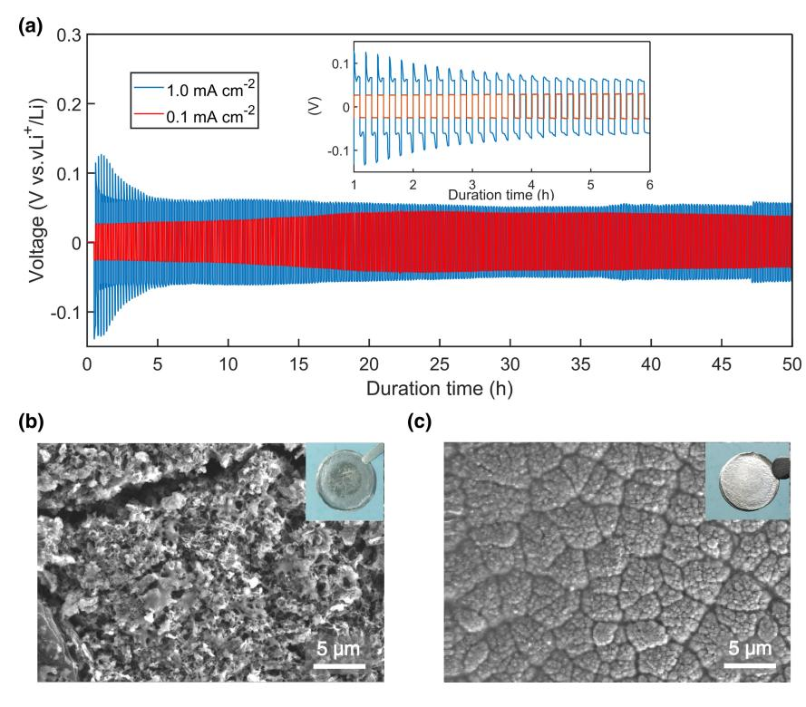
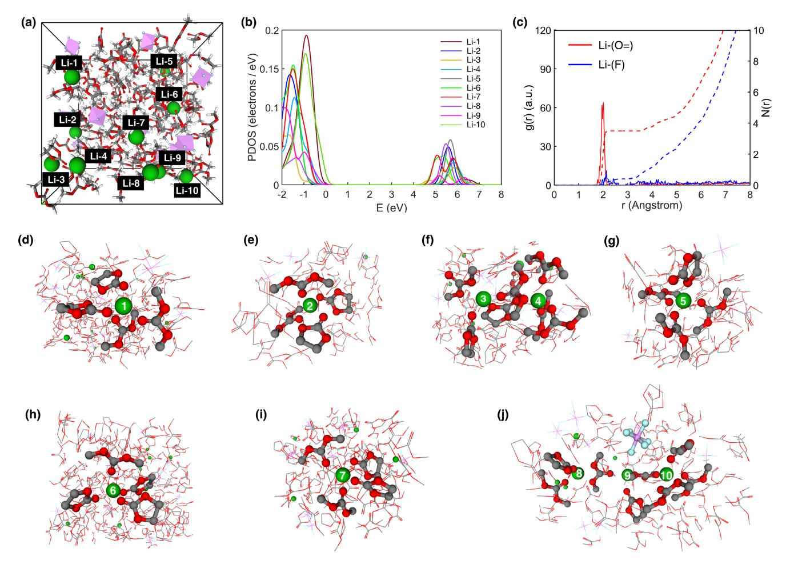
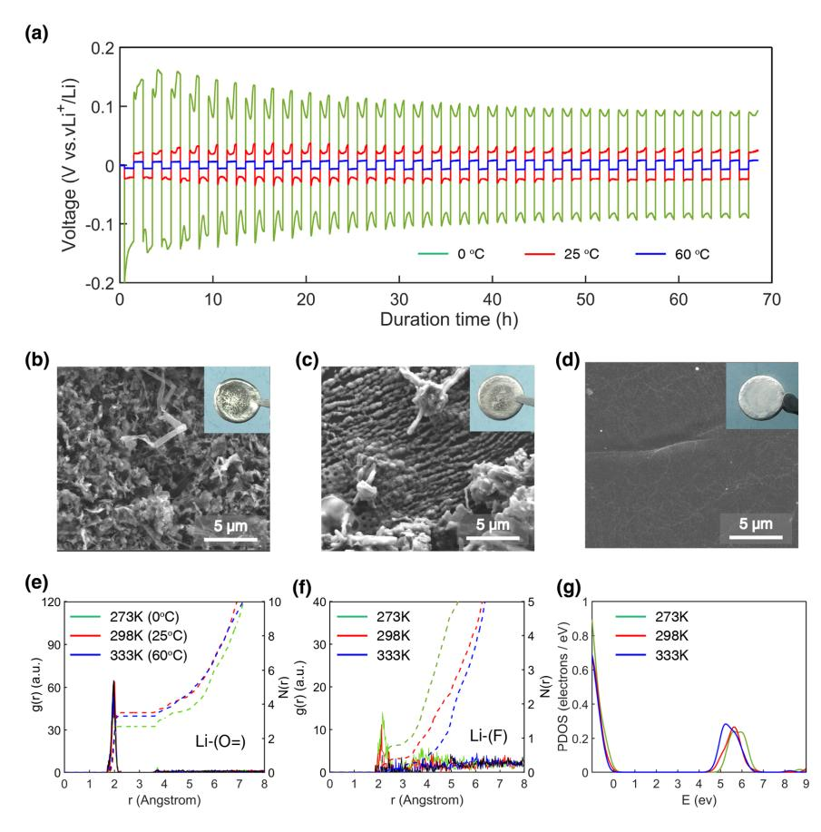
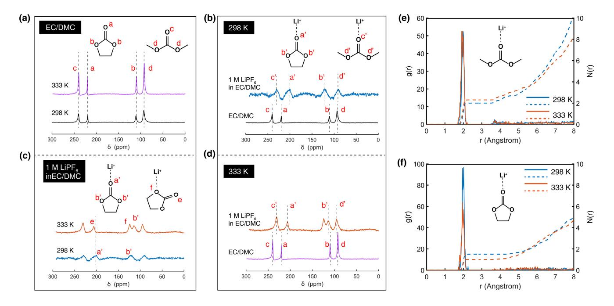
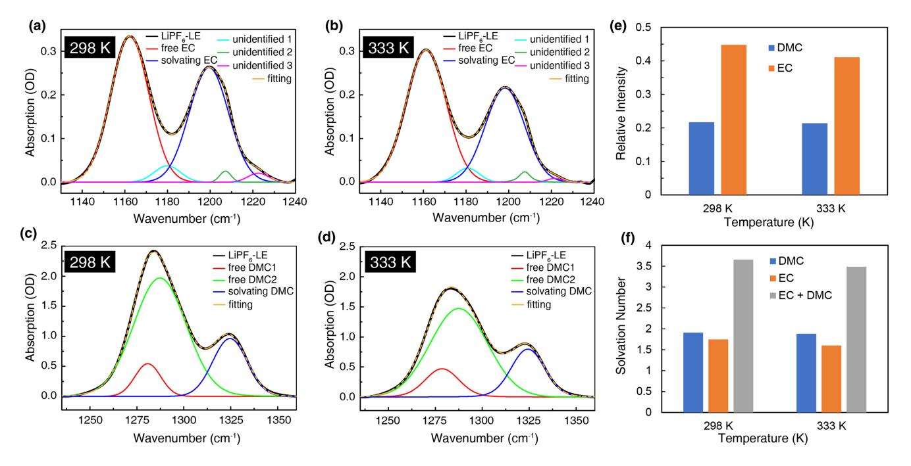

# **Impact of Lithium-Ion Coordination on Lithium** Electrodeposition

Li Sheng, Yanzhou Wu, Jiekang Tian, Li Wang, Jianlong Wang, Yaping Tang, Hong Xu\* and Xiangming He\*

The lithium dendrite and parasitic reactions are two major challenges for lithium (Li) metal anode—the most promising anode materials for highenergy-density batteries. In this work, both the dendrite and parasitic reactions that occurred between the liquid electrolyte and Li-metal anode could be largely inhibited by regulating the Li+-solvation structure. The saturated Li+-solvation species exist in commonly used LiPF6 liquid electrolyte that needs extra energy to desolvation during Li-electrodeposition. Partial solvation induced high-energy state Li-ions would be more energy favorable during the electron-reduction process, dominating the competition with solvent reduction reactions. The Li-symmetric cells that are cycling at higher temperatures show better performance; the cycled lithium metal anode with metallic lustre and the dendrite-free surface is observed. Theoretical calculation and experimental measurements reveal the existence of high-energy state Li+-solvates species, and their concentration increases with temperature. This study provides insight into the Li+-solvation structure and its electrodeposition characteristics.

#### 1. Introduction

Lithium (Li), as the lightest member of the alkali metal family, has a very high theoretical specific capacity (3860 mAh  $g^{-1}$ ).[1-3] This feature has promoted continuous attempts to commercialize lithium metal batteries (LMBs); and thus, Li metal anode has been extensively investigated in the past decades.[4] However, the lithium dendrite and parasitic reactions during the LMB charging and discharging process are the two challenges to the practical implementation of the LMBs.[5-7] The dendrite growth during the cell cycling process could pierce the separator, and thus cause a short circuit, even induce cell thermal runaway

School of Pharmaceutical Sciences, Tsinghua University, Beijing 100084,

China

Center of Pharmaceutical Technology, Tsinghua University, Beijing 100084, China

 $\bigcirc$  The ORCID identification number(s) for the author(s) of this article can be found under https://doi.org/10.1002/eem2.12266.

#### DOI: 10.1002/eem2.12266

and explosion.  $[2,4,8,9]$  Therefore, in the past 40 years, research works on the dendrite suppression have been carried out, including substitute Li metal with LiX alloy/composite anodes  $(X = Al, Sn, Si, C, B, etc.),$  artificial solid electrolyte interface, solid-state electrolytes, and some progress has been made.  $[10-13]$  However. the parasitic reactions that occurred between the Li metal electrode and the liquid electrolyte, continuously consume the electrolyte and decrease the battery's Coulombic efficiency.[14] Moreover, the uneven deposited side products on the Li metal surface lead to non-uniform lithium electrodeposition and eventually induce dendrite growth. Therefore, the suppression of the parasitic reactions is also essential to stabilize the lithium electrodeposition.

In fact, lithium has the weakest metallicity among the IA alkali metals on the Periodic Table, but it shows the most electropositive  $(-3.04 \text{ V} \text{ vs the standard hydrogen elec-}$ trode).[1-3] The main reason for this anomaly is

the small lithium cation radius and its strong polarization, which could coordinate with water molecules in the aqueous solution to form highly stable solvated species. In the commonly used LiPF6 liquid electrolyte, a very stable solvation structure would also be formed due to the utilization of the polar solvent, such as ethylene carbonate (EC), the dielectric constant of which is around 90, even higher than that of  $H_2O$  (79).[15] The Li+-solvation structure could affect the battery's performances, such as the components in the solvation sheath dictate the SEI's uniformity and subsequent Li-deposition. Therefore, progress in recent years was achieved by regulating the Li+-solvation structure to realize the uniform deposition of lithium, and prolonging cell life.[16,17] Furthermore, other performance of the battery, such as capacity, cycling efficiency, and so on, also could be largely improved by the reasonable design of the  $Li^+$ -solvation structure.[18,19] However. the relationship between the Li+-solvation structure and the inhibition of the parasitic reaction has not been studied.

Clearly, the formation of stable Li+-solvation induced more extra electrical energy to desolvation before Li-deposition. However, the extra energy that needs to desolvate during the Li-deposition also makes parasitic reaction between the lithium metal and solvent molecules more likely to occur. In this work, we demonstrate the parasitic reaction in the Li-symmetric cell can be effectively suppressed at elevated temperature. Furthermore, the molecular dynamics (MD) simulations reveal that the temperature significantly influences the Li+-solvation structure, thus changing Li-deposition behavior.

Dr. L. Sheng, Dr. Y. Wu, Prof. L. Wang, Prof. J. Wang, Prof. Y. Tang, Prof. H. Xu, Prof. X. He

Institute of Nuclear and New Energy Technology, Tsinghua University,

Beijing 100084, China E-mail: hongxu@tsinghua.edu.cn

E-mail: hexm@tsinghua.edu.cn

Dr. I. Tian

### 2. Results and Discussion

Symmetrical cell cycling is the commonly used characterization technique to evaluate the electrochemical performance of the Li metal anode.[20] In this work, the Li-symmetric cell was used to study the Lideposition morphology at different current densities and cycling time. A commonly used LIB electrolyte consisting of a  $1 \text{ M}$  LiPF6 solution (ethylene carbonate (EC) and dimethyl carbonate (DMC)  $(3/7, w/w)$ , denoted as LiPF6-LE) was used as a liquid electrolyte for lithium electrodeposition evaluation. As shown in Figure 1a, an overpotential of around 50–100 mV was observed in the initial cycling stage at a current density of 1 mA  $\text{cm}^{-2}$  (the areal capacity was 0.1 mAh  $\text{cm}^{-2}$ ). As expected, the cells cycled at a lower current density  $(0.1 \text{ mA cm}^{-2})$ possessed a much lower overpotential of 25 mV (Figure  $1a$ , red curve). More interestingly, the voltage traces during galvanostatic cycling at different current densities had prodigious differences. The overpotentials in the Li-symmetric cell cycling experiment could be used to study the polarization behavior of the cell.[21] The voltage curve at the current density of 1 mA  $\text{cm}^{-2}$  showed a periodic change; that is, in the first half cycle, the characteristic peak was observed, then it decreased to a minimum, and rose again, the behavior was switched as switching the polarity. In contrast, the voltage kept steady during the cycling process when decreased current density to 0.1 mA  $\text{cm}^{-2}$ .

From the post-mortem scanning electron microscope (SEM) images, a very different lithium deposition morphology was observed (Figures 1b,c). Mossy dendrite at a high current density while smooth deposition at low current density indicated that current density is an

Figure 1. Electrochemical Performance and Morphology of Cycled Lithium Metal in Li-Symmetric cells. a) Voltage profiles at the current density of 1.0 mA  $cm^{-2}$  (blue) and 0.1 mA  $cm^{-2}$  (red), respectively, and with half cycle of 6 min. b, c) Top-view SEM images of the lithium metal after 50th stripping/plating at the current density of 1.0 and 0.1 mA cm-2, respectively.

important factor affecting deposition behavior. It is worth noting that a thin black layer was appeared on the 50th deposition lithium electrode surface, which ascribed to the parasitic reaction products at high current density (Figure 1b, inset photograph). Meanwhile, we obtained a lithium foil with metallic lustre at low current density after the same stripping/plating cycles. In the commonly used liquid electrolyte of LIB, the solvent EC is a unique and necessary component. Due to the extremely high polarity, Li-ion could easily be bound to form stable  $\text{Li(EC)}^+$  solvates.[22] The solvents in the Li+-solvation sheath were polarized by the small radius Li+-cation and thus being positively charged. Therefore, during the deposition process, the electrons first reached the solvated solvents, such as EC, and easily led EC to decompose.[23] It seems that the parasitic reactions were inevitable. However, at a relatively low current density  $(0.1 \text{ mA cm}^{-2})$  and short cycling time  $(6 \text{ min})$  in this work, both of the lithium dendrite and the parasitic reactions were inhibited. From the previous reports, the stripping of the solvation sheath of bare  $\text{Li}^+$  consumed energy about 50 kJ mol-1, which is even higher than the energy barrier of Li+ passing through SEI (20 kJ mol-1).[10,24] Therefore, the desolvated species  $\text{Li(EC)}_2^+$ ,  $\text{Li(EC)}_3^+$ , which are in the high-energy state, when compared to  $\text{Li(EC)}_{4}^{+}$ , need less energy to deposit on the Li metal, which makes it possible to suppress parasitic reactions. Moreover, the Li+-solvated species with the solvated solvent molecules partially rotated, which weaken the coordination between Li+ and carbonyl group of the EC were also in the high-energy state.

The high-energy state Li+-solvates species were first reduced to lithium metal on the anode surface during the plating process at a low current density and short cycling time. However, after exhausting of

the higher energy-state Li+-solvates species, the major  $\text{Li(EC)}_4^+$  was easily reduced to produce reaction products during the cycling process, which was observed when increasing the current density (Figure 1b, inset photograph). In the  $1\,$ м LiPF $_6$  liquid electrolyte, various energy-state  $\text{Li}^+$ -solvation species ( $\text{LiM}^+$ , M refer to the EC and/or DMC in this work) were remain, and the populations of which relative to major  $\text{Li(EC)}_{4}^{+}$ species[25] were estimated using Boltzmann factors shown in Equation 1:

$$P_{LiM_x^+}=P_{Li(EC)_4^+}{\rm exp}(-\Delta E/K_BT) \eqno(1)$$

Where  $P_{\textrm{LiM}_{x}^{+}}$  and  $P_{\textrm{Li(EC)}_{4}^{+}}$  are populations of species  $\textrm{LiM}_{x}^{+}$  and  $\textrm{Li(EC)}_{4}^{+},~\Delta E$  is the relative energy of  $\text{LiM}_{x}^{+}$  vs  $\text{Li(EC)}_{4}^{+}$ , T is temperature, and  $K_B$  is Boltzmann constant. Therefore, at a given temperature, the higher energy-state species, the lower possibility to exist. However, the population of such species increase as increased temperature. These high energystate species could easier be reduced to lithium metal before the parasitic reaction occurs. However, the high-energy state species cannot be calculated by DFT with the implicit solvent model as they are not in the thermodynamic equilibrium state. While in the explicit continuum model, molecular force field-based MD is usually the only option due to the scale of the electrolyte

system (>1000 atoms). However, the electronic structure of the Li+-solvates cannot be directly obtained, and the accuracy is also limited for further analysis of reductive behavior.

Therefore, to improve the accuracy of computational exploration of the electrolyte while avoiding the extremely high computational cost of the ab-initio MD (AIMD), a Density-Functional Tight-Binding based Molecular Dynamic (DFTB-MD) approach was adopted in this work for the high-accuracy simulations of the large scale electrolyte system (with ~1500 atoms). DFTB[26] has shown good accuracy in determining the structure of large systems;[27] however, due to lack of Slater-Koster parameters,[28] application of DFTB in the simulation of LIB is limited. Recently, Qi and co-workers have demonstrated the DFTB-MD simulation[29] for LIB system, utilizing DFTB2/mio[30] level of theory with extended Li parameters. They built a model that includes lithium metal, Li2CO3 and EC molecules to simulate SEI on the Li-metal and found the DFTB method could precisely calculate the structure and diffusion behavior of Li+-solvates. However, the calculation was performed at the DFTB2/mio level of theory, and their adopted parameter set did not include fluorine, which is one of the essential elements that constitute the anions of liquid electrolyte. In this work, we adopted an extended

DFTB3/3ob level of theory that was recently developed by Nakai group for DFTB-MD calculation.  $[31,32]$ 

We investigated the Li+-solvates structure and their reduction preferences in the LiPF6/(EC+DMC) system with explicit EC and DMC solvents. A Force-Field based Molecular Dynamic (FF-MD) simulation was firstly used to equilibrate the large scale electrolyte model; simulation was implemented in the Forcite modules of Materials Studio. The electrolyte system containing 1 M LiPF6 in the mixed solvents of EC/DMC (3/7, weight ratio) was constructed and simulated using the COMPASS II force field.[33-35] To get the initial structures of electrolyte for further DFTB-based calculations, each system was first heated to 500 K and 1 atm through a 5 ns trajectory, and then quenched to target temperatures through 10 ns NPT runs and followed by 10 ns NVT runs. The obtained structures under different temperatures were then subjected to 50 ps of DFTB-based molecular dynamic simulations with the extended DFTB3/3ob level of theory.[31,32] The time step was set to be 1 fs; the nuclear temperature was controlled by Nosé-Hoover thermostat,[36,37] and the target temperature was set to 273, 298, 333 K, respectively. As shown in Figure S1, the temperature was equilibrated for 30 ps, and the last 20 ps simulation trajectories were used for later analysis.

Figure 2. DFTB-MD Simulated Liquid Electrolyte Structures. a) Snapshots of LiPF6/EC-DMC electrolyte obtained by MD simulation at 298 K. b) Partial Density-of-states (PDOS) for Li+ in MD simulation model of (a). c) The radial distribution function g(r) analyses of 1 M LiPF6 in EC-DMC electrolyte at 298 K. d–j) Schematic view of the solvation environment of different Li+ in the model of (a) (Li, green; C, gray; O, red; P, pink; F, blue).

We first investigated the equilibrium trajectories of the LiPF6-LE system at 298 K. Figure 2a showed snapshots of the simulated LiPF6-LE system  $((Li^+)_1(EC)_{3.9}(DMC)_{8.8}(PF_6^-)_1)$  after the running temperature keep steady (Figure S1), which contains 10  $\text{Li}^+$  cations, 10  $\text{PF}_6^-$  anions, 39 EC molecules, and 88 DMC molecules under periodic boundary conditions. Radial distribution function (RDF) was employed to analyze the solvations structure of electrolyte. The RDF of the  $Li$ + to the  $O = (Li-O, O$  atom on the carbonyl group in EC and DMC) and the F (Li-F, in  $PF_6^-$ ) was shown in Figure 2c. The major peaks from the Li-O and Li-F g(r) profiles were around 1.95 and 2.13  $\AA$ , respectively, indicating the first solvation shell of  $Li^+$  (Figure 2c). The distance to calculate the number of the coordinated solvents and anions was 2.5 Å.[38] The coordination number of  $Li^+$  with O and F was 3.5 and 0.4, respectively, demonstrating that EC, DMC were the dominant solvent component within the first solvation shell. Since there is still a tiny peak related to  $PF_6^-$  anion within 4 Å, the LiPF6 salt is not entirely dissolved in the  $1\ \mbox{\scriptsize M}$  solution. Moreover, the typical first solvation shells of Li-ion in 1 M LiPF6/EC+DMC system are shown in Figures 2d-j (from Li-1 to Li-10). The majority of Li+-solvates are four EC/DMC coordinated Li+ (Figures  $2d,e,g-i$ ), close to the reported Li+-solvation models calculated

**Figure 3.** Electrochemical Performance and Molecular Dynamics Simulation at Different Temperature. a) Voltage versus time profile of the Li-symmetric cell at current density of 0.1 mA cm-1, with half cycle of 1 h: 0 °C (green curve); 25 °C (red curve); 60 °C (blue curve), respectively. b-d) Top-view SEM images of the cycled Li-metal after 50th stripping/plating cycles at different temperatures: 0, 25, and 60 °C, respectively. e, f) The radial distribution function (RDF) analyses of Li-O and Li-F in 1 M LiPF6 liquid electrolyte at different temperatures, respectively. g) Partial density-of-states (PDOS) for Li+ in DFTB-MD simulation model at different temperature.

using DFT method.[39] Interestingly, we have found the Li+-solvated species with two EC/DMC molecules whose O in the ether group coordinated with  $Li^+$  (Li-3, Figure 2f). To corroborate the preferential reduction of some Li+-solvates over the other ones, the partial density of states (PDOS) from DFTB-MD calculations indicated that varied reduction ability Li+-solvates remained in this system (Figure 2b). The Li-3 with two solvent molecules showed higher reduction potentials among the 10  $\text{Li}^+$ . Therefore, we conclude that this higher energy state of Li+-solvation species was reduced first with much lower electric energy and deposited on the Li-metal. This result suggested that unsaturated coordination species will be generated in the electrolyte; these high-energy state Li+-solvates are a manifestation of temperature, and also showed a higher tendency of Li+-reduction.

Meanwhile, to demonstrate the accuracy of the extended DFTB3/3ob method, we studied the EC and DMC solvents and typical Li+-solvation structures, including  $\text{Li}^+$ -EC,  $\text{Li}^+$ -DMC,  $\text{Li}^+$ -(EC)4 and  $\text{Li}^+$ -(DMC)4, and compared the results obtained by DFT calculations at the GGA-PBE/6- $31 + G(d,p)$  level of theory. As shown in Figure S2, the structure of solvent and Li+-solvates calculated using DFTB is very similar to the GGA-PBE results. Furthermore, we also studied HOMO/LUMO of the

> corresponding  $Li^+$ -solvation structures; as shown in Figure S3, the HOMO/LUMO orbitals calculated using DFTB are similar to the results from GGA-PBE, and the energy difference between the HOMO and LUMO levels are also quite close for these two methods (Table S1).[29] Thus, the performance of DFTB method used in this work is comparable to the GGA-PBE method with SMD solvation model, and the latter one was proved to be effective in the  $Li^{+}$ solvates calculation in the previous report.[40]

> To investigate the feasibility of this theoretical prediction, we performed cycling experiments of Li-symmetric coin cell under different temperatures: 0, 25, and 60 °C, with the current density of 0.1 mA cm $-2$  (0.1 mAh cm $-2$ ). The Li-symmetric cell at low temperature exhibited a much higher overpotential than that of at high temperature (Figure 3a), almost 20 times higher at 0  $^{\circ}$ C than that at 60  $^{\circ}$ C, which was largely increased when compared the conductivity of the liquid electrolyte (LiPF6-LE) at different temperatures (Table S2). It also means that the improved performance at high temperature was not just the increased conductivity of electrolyte. The voltage traces at  $0$  °C was similar to that of 25 °C; however, when increasing temperature to 60 °C, the characteristic "peak" was disappeared and kept steady during the cycling time (Figure 3a). Meanwhile, a dark layer was observed at 0 °C, which indicated that more serious parasitic reactions occurred (Figure 3b, inset photograph). In sharp contrast, a shining lithium foil was obtained at 60 °C; the parasitic reaction was controllably inhibited when increasing cycling temperature. Correspondingly, the post-mortem SEM showed almost no dendrite on the cycled Li-metal electrode at a higher temperature, while many dendrites were

produced when decrease temperature to 0 °C during the same plating/ stripping manner. Chemical analyses were carried out on the cycled lithium metal surface using X-ray photoelectron spectra (XPS). The parasitic reaction products were similar in the outmost layer of both cycled Li-metal that operated at 0 and 60 °C (Figure S4). However, as the sputtering time increased, both organic and inorganic interphasial products were largely decreased at higher temperatures and have a downward trend to 1800s (corresponding to  $\sim$ 135 nm).

The extremely stable Li+-solvates, due to the strong solvation effect of lithium-ion, need more energy, which is featured as high overpotential in the Li-symmetric cell. The high overpotential enabled the parasitic reaction (reducing the solvents before the lithium-ion) to crossover the energy barrier easier. However, when increased temperature, the amount of high-energy state Li+-solvation species increased, which could make easier to be deposited on the Li metal surface, and need less electrical energy; therefore, it showed lower overpotential during the plating process. The lower overpotential makes it harder for the solvents to crossover the barrier to occur parasitic reaction. Usually, for a typical chemical reaction, the higher temperature, the faster the reaction rate; however, the parasitic reaction on the lithium anode surface is not just a chemical reaction. The electrical energy was also used to desolvate the Li+-solvates during the lithium electrodeposition process. The thermally generated high-energy state species promote Li+reduction, enabling the utilization of temperature to suppress the solvent reductive side reactions.

The distinct performance at different temperatures in the Lisymmetric cell was further explored by DFTB-MD simulations. The g (r) profiles of Li-O at different temperatures were obtained from the simulations model, which was calculated at 273, 298, and 333 K, respectively. The dominant peak of Li-O was around 1.95 Å at all temperatures; the number of the coordinated O atom with  $Li$ + was 3.5 at 298 K, which decreased to 3.2 as increasing temperature to 333 K (Figure 3e). Meanwhile, the corresponding coordination number of  $\text{Li}^+$  with F was also decreased significantly from 0.4 to 0.1 (Figure 3f), which indicated that the number of both the EC-DMC solvents and PF6 in the first Li+-solvation shell were decreased at high temperatures. However, when decreasing the temperature to 273 K, the coordination number of  $Li^+$  with O and F was 2.7 and 0.8, respectively (Figure 3e. f), demonstrating that at low temperature, more  $PF_6^-$  anions entered into the solvation shell of Li+. Moreover, the PDOS of Li+ at different temperatures was also calculated from DFTB-MD. The Li+ became more accessible to be reduced at elevated temperatures (Figure  $3g$ ).

To better understand the temperature's impact on the Li -solvation structure in the actual liquid electrolyte, the 17O NMR of the mixture of EC-DMC solvents and LiPF6-LE at 298 and 333 K were carried out. As shown in **Figure 4a**, the ethereal  ${}^{17}$ O of the EC (signal b) and DMC (signal d) molecules was between 75 and 150 ppm while the carbonyl O (signals a and b) between 200 and 250 ppm.[41] The pure mixture of the EC and DMC does not show a chemical shift when changing temperature. However, after added Li+ salt, all carbonyl 17O were chemical shift to upfield due to the Li+-ion's shielding effect. In contrast, the ethereal 17O shifted downfield. Their displacements took place in either 298 or 333 K (Figure 4b,d). More interestingly, in the  $\text{LiPF}_6$ -LE solution, the carbonyl  $^{17}$ O nuclei of EC experienced a downfield displacement when increased temperature from 298 to 333 K (Figure 4c), indicating a decreased shielding effect of  $Li^+$  on the carbonyl 17O nuclei of EC solvents. Moreover, the ethereal 17O nuclei of EC were divided into two peaks at 333 K, which would become one after the temperature decreased back to 298 K (Figure S5), demonstrated  $\text{Li}^+$  coordinated with the ethereal 17O nuclei (Figure 4c, inset).

Figure 4. 17O NMR Spectra and The Radial Distribution Function (RDF) Analyses. a–d) 17O NMR spectra for the mixture of EC/DMC (3/7, w/w) and the LiPF6-LE solution at 298 and 333 K, respectively. b, d) DMC at 298 and 333 K, respectively. e) The RDF analyses of Li-O (in the C = O of DMC) at different temperatures, respectively. f) The RDF analyses of Li-O (in the  $C = O$  of EC) at different temperatures, respectively.

Figure 5. FTIR Spectra of LiPF6-LE Solution in -OCO- Stretching Mode at Different Temperatures. a, b) EC at 298 and 333 K, respectively. c, d) DMC at 298 and 333 K, respectively. e, f) The relative intensity and solvation number of the liquid electrolyte at different temperatures.

In general,  $Li^+$  was strongly coordinated by carbonyl oxygen atoms from EC and formed extremely stable Li+-solvated structure.[42-44] However, at elevated temperature, the coordination between Li+ and carbonyl of the solvated EC molecules weakened, and more Li+ coordinated with the oxygen in the EC ether groups (Figure 4c, inset structures). These Li+-solvated species, when compared to Li+-carbonyl coordination species, were relatively more unstable and showed higher energy. This is an experimental observation of the existence of highenergy state Li+-solvates. The results agree well with the RDF analyses, which showed the coordination number of  $Li^+$  with O (in C = O of EC solvents) was decreased from 298 to 333 K (Figure 4f). Moreover, according to Equation 1, when increased temperature, the population of the high-energy state species increased.

The Li+-solvent interaction was further investigated by FTIR. The  $C = O$  stretching vibration was assigned to EC (~1805 cm-1) and DMC ( $\sim$ 1750 cm-1). After adding LiPF6 salt, a new peak at  $\sim$ 1725 cm-1, which was attribute to the C = O due to the interaction between  $Li^+$  and carbonyl of DMC (Figure S6). However, the C = O stretching bands of the EC that before and after coordinated with Li+ were difficult to distinguish (Figure S6).  $^{[45,46]}$  Therefore, -OCOstretching mode ( $\text{~}1162 \text{ cm}^{-1}$  for EC,  $\text{~}1283 \text{ cm}^{-1}$  for DMC) was chosen as characteristic peak to analyze the Li+-solvent interaction, which was found to be a blue shift by around 30  $\text{cm}^{-1}$  for EC and a blue shift by 40 cm $-1$  for DMC (Figure S7 and **Figure 5**). For the LiPF6-LE solution, the intensity obtained from FTIR, and coordination numbers between  $Li^+$  and EC, DMC was calculated according to Equation S1, summarized in Table S3. The coordination number of Li+ with EC and DMC was decreased as increasing the temperature (Figure S8 and Figure 4f), which agree well with the result of DFTB-MD simulations.

Finally, the cycling experiments of Li-symmetry cells at high current density: 0.5 and 1 mA cm-2 were performed at 60°C. Even at high temperature, the cell showed much higher overpotential at larger

current density and the voltage traces were different with that at low current density (Figure S9). However, it is worth noting that even at high current density the cell at 60°C showed better performance than that at low temperature ( $0^{\circ}$ C) (Figure S10).

#### 3. Conclusions

In conclusion, the effect of Li+-solvation structure on the Li-deposition behavior was studied. The number of solvated solvents around Li+ was decreased when increased temperature from both the experimental measurement and DFTB-MD calculation. Furthermore, at high temperatures, the coordination between Li+ and O on the carbonyl group of EC solvents was weakened. The PDOS obtained from MD simulations at different temperatures reveals that different energy state of Li+-solvates have existed and the number of which was highly dependent on temperature. The results provide a strategy to design a liquid electrolyte with high-energy state Li+-solvation structures to realize the smooth Lideposition and parasitic reaction suppression.

#### 4. Experimental Section

Experimental details are described in the Supplementary Information.

#### Acknowledgements

This work was funded by the National Natural Science Foundation of China (52073161 and U1564205) and the Ministry of Science and Technology of China (No. 2019YFE0100200 and 2019YFA0705703). The authors also thank Joint Work Plan for Research Projects under the Clean Vehicles Consortium at U.S. and China-Clean Energy Research Center (CERC-CVC2.0, 2016-2020), and thank

Tsinghua University-Zhangjiagang Joint Institute for Hydrogen Energy and Lithium Ion Battery Technology.

## Conflict of Interest

The authors declare no competing interests.

#### Supporting Information

Supporting Information is available from the Wiley Online Library or from the author.

#### Keywords

Li+-solvates, lithium dendrite-free, lithium metal anode, molecular dynamics, parasitic reactions

> Received: August 20, 2021 Published online: August 22, 2021

- [1] J. G. Zhang, W. Xu, J. Xiao, X. Cao, J. Liu, Chem. Rev. 2020, 120, 13312.
- [2] X. Shen, H. Liu, X. B. Cheng, C. Yan, J. Q. Huang, Energy Stor. Mater. 2018, 12, 161.
- [3] J. Lang, L. Qi, Y. Luo, H. Wu, Energy Stor. Mater. 2017, 7, 115.
- [4] X. Zhang, Y. Yang, Z. Zhou, Chem. Soc. Rev. 2020, 49, 3040.
- [5] M. Winter, B. Barnett, K. Xu, Chem. Rev. 2018, 118, 11433.
- [6] M. S. Whittingham, Chem. Rev. 2004, 104, 4271.
- [7] K. Brandt, Solid State Ionics 1994, 69, 173.
- [8] L. Li, S. Li, Y. Lu, Chem. Commun. 2018, 54, 6648.
- [9] J. M. Tarascon, M. Armand, Nature 2001, 414, 359.
- [10] X. B. Cheng, R. Zhang, C. Z. Zhao, Q. Zhang, Chem. Rev. 2017, 117, 10403.
- [11] B. Liu, J.-G. Zhang, W. Xu, Joule 2018, 2, 833.
- [12] M. D. Tikekar, S. Choudhury, Z. Tu, L. A. Archer, Nat. Energy 2016, 1, 16114.
- [13] W. Xu, X. Liao, W. Xu, C. Sun, K. Zhao, Y. Zhao, C. Hu, Nano Energy 2021, 88, 106237.
- [14] Z. Tu, P. Nath, Y. Lu, M. D. Tikekar, L. A. Archer, Acc. Chem. Res. 2015, 48, 2947.
- [15] K. Xu, Chem. Rev. 2004, 104, 4303.
- [16] X. Q. Zhang, X. Chen, X. B. Cheng, B. Q. Li, X. Shen, C. Yan, J. Q. Huang, Q. Zhang, Angew. Chem. Int. Ed. 2018, 57, 5301.

- [17] C. Yan, Y. X. Yao, X. Chen, X. B. Cheng, X. Q. Zhang, J. Q. Huang, Q. Zhang, Angew. Chem. Int. Ed. 2018, 57, 14055.
- [18] Q. Zheng, G. Li, X. Zheng, L. Xing, K. Xu, W. Li, Energy & Environ. Mater. 2022, 3, 679.
- [19] H. Zhao, J. Gu, Y. Gao, Q. Hou, Z. Ren, Y. Qi, K. Zhang, C. Shen, J. Zhang, K. Xie, J. Energy Chem. 2020, 51, 362.
- [20] K. R. Adair, M. N. Banis, Y. Zhao, T. Bond, R. Li, X. Sun, Adv. Mater. 2020, 32, e2002550.
- [21] K. N. Wood, E. Kazyak, A. F. Chadwick, K. H. Chen, J. G. Zhang, K. Thornton, N. P. Dasgupta, ACS Cent. Sci. 2016, 2, 790.
- [22] K. Xu, Chem. Rev. 2014, 114, 11503.
- [23] E. Endo, M. Ata, K. Tanaka, K. Sekai, J. Electrochem. Soc 1998, 145, 3757.
- [24] K. Xu, A. von Cresce, U. Lee, Langmuir 2010, 26, 11538.
- [25] W. Cui, Y. Lansac, H. Lee, S. T. Hong, Y. H. Jang, Phys. Chem. Chem. Phys. 2016, 18, 23607.
- [26] <http://www.dftb.org>
- [27] A. S. Christensen, T. Kubar, Q. Cui, M. Elstner, Chem. Rev. 2016, 116, 5301.
- [28] <https://dftb.org/parameters>
- [29] Y. Li, Y. Qi, J. Phys. Chem. C 2018, 122, 10755.
- [30] M. Elstner, D. Porezag, G. Jungnickel, J. Elsner, M. Haugk, T. Frauenheim, S. Suhai, G. Seifert, Phys. Rev. B 1998, 58, 7260.
- [31] Y. Nishimura, H. Nakai, J. Comput. Chem. 2019, 40, 1538.
- [32] C. P. Chou, A. W. Sakti, Y. Nishimura, H. Nakai, Chem. Rec. 2019, 19, 746.
- [33] H. Sun, J. Phys. Chem. B 1998, 102, 7338.
- [34] H. Sun, P. Ren, J. R. Fried, Comput. Theor. Polym. Sci 1998, 8, 229.
- [35] H. Sun, Z. Jin, C. Yang, R. L. Akkermans, S. H. Robertson, N. A. Spenley, S. Miller, S. M. Todd, J. Mol. Model 2016, 22, 47.
- [36] S. Nose, ´ J. Phys. Chem. 1984, 81, 511.
- [37] W. G. Hoover, Phys. Rev. A Gen. Phys. 1985, 31, 1695.
- [38] X. Liu, X. Shen, H. Li, P. Li, L. Luo, H. Fan, X. Feng, W. Chen, X. Ai, H. Yang, Y. Cao, Adv. Energy Mater. 2021, 11, 2003905.
- [39] O. Borodin, M. Olguin, P. Ganesh, P. R. Kent, J. L. Allen, W. A. Henderson, Phys. Chem. Chem. Phys. 2016, 18, 164.
- [40] N. Chapman, O. Borodin, T. Yoon, C. C. Nguyen, B. L. Lucht, J. Phys. Chem. C 2017, 121, 2135.
- [41] F. Castiglione, A. Baggioli, A. Citterio, A. Mele, G. Raos, J. Phys. Chem. A 2012, 116, 1814.
- [42] O. Borodin, G. D. Smith, J. Phys. Chem. B 2006, 110, 4971.
- [43] Z. Li, O. Borodin, G. D. Smith, D. Bedrov, J. Phys. Chem. B 2015, 119, 3085.
- [44] B. Klassen, R. Aroca, M. Nazri, G. A. Nazri, J. Phys. Chem. B 1998, 102, 4795.
- [45] D. M. Seo, S. Reininger, M. Kutcher, K. Redmond, W. B. Euler, B. L. Lucht, J. Phys. Chem. C 2015, 119, 14038.
- [46] B. Fortunato, P. Mirone, G. Fini, Spectrochim. Acta, Pt. A: Mol. Spectrosc. 1971, 27, 1917.