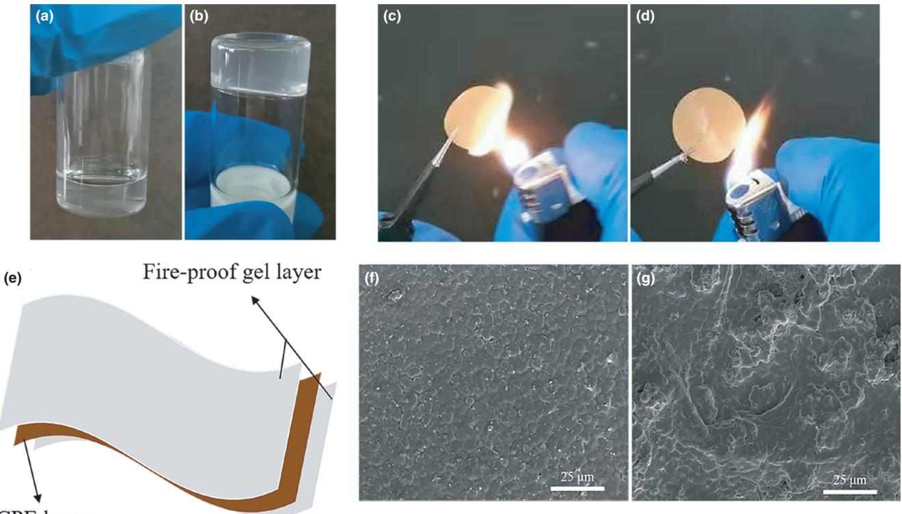
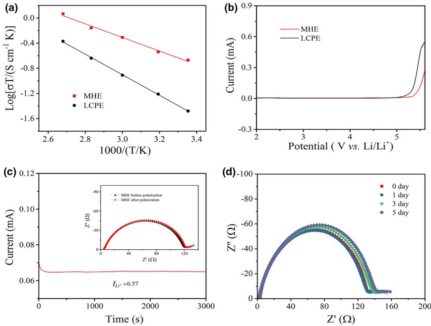
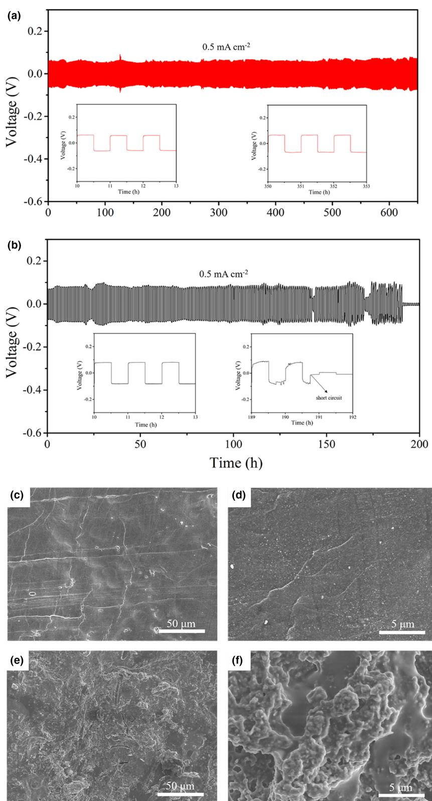
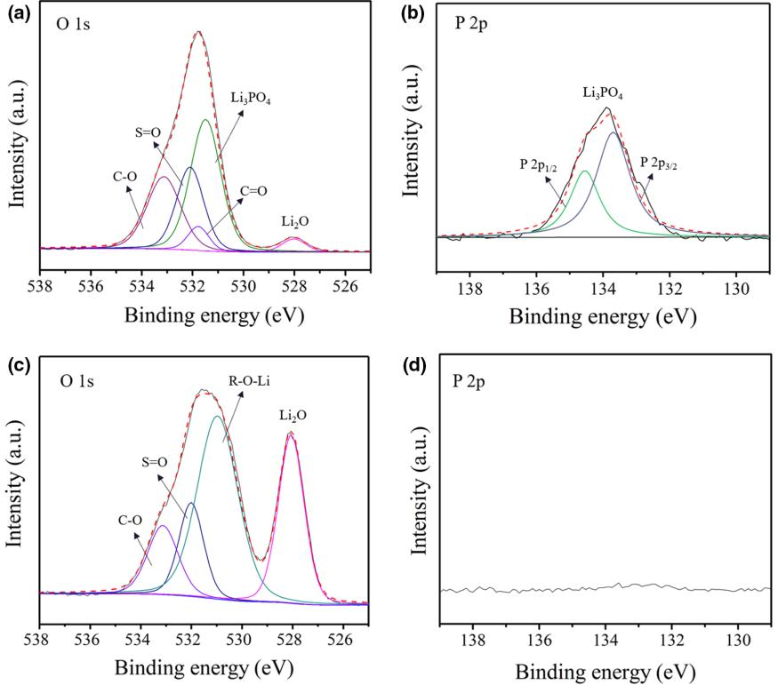
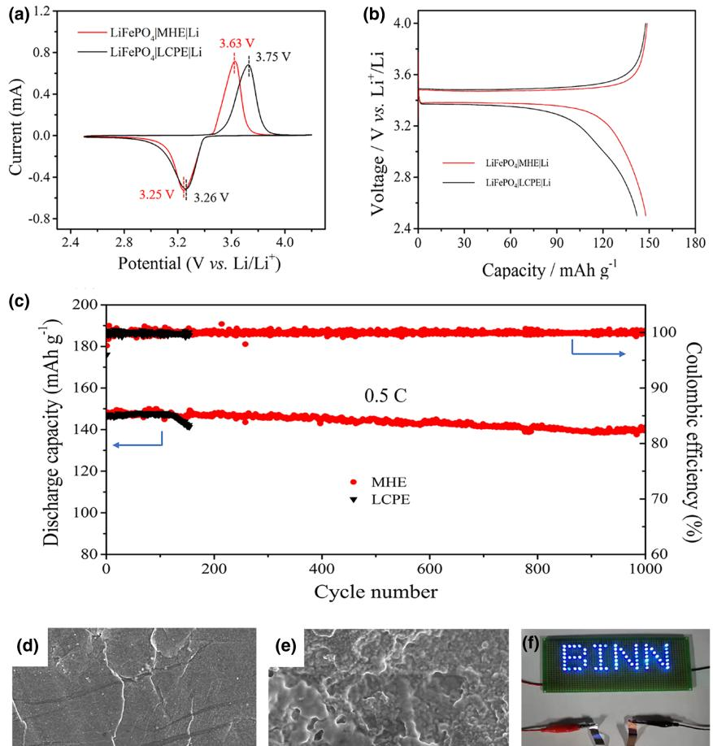

# A High-performance Lithium Metal Battery with a Multilayer Hybrid Electrolyte

Qiang Yi, Wenqiang Zhang, Tianyuan Wang, Junxing Han, and Chunwen Sun[\\*](https://orcid.org/0000-0002-3610-9396)

Solid-state batteries have been considered as a good choice for substituting traditional batteries with liquid electrolytes because of their high energy density and safe property. However, a little amount of flammable nonaqueous liquid electrolyte or polymer electrolyte is usually required to improve the interfacial contact, which is adverse to safety. Here, a nonflammable gel is prepared by hydrogen-bond interaction and applied as an interfacial layer to improve the performance of solid-state batteries. The prepared multilayer hybrid electrolyte (MHE) composed of gel and CPE shows a wide electrochemical window (5.3 V vs Li/Li+), high ionic transference number (0.57), and ionic conductivity (7.18 × 10−4 S cm−1 ) at room temperature. Thus, the assembled Li symmetric cell with MHE can cycle over 650 h at 0.5 mA cm−2 with a lower overpotential of ~61 mV. The LiFePO4|MHE|Li cell exhibits a higher discharge capacity of 107.8 mAh g−1 even cycled at 5 C. It also shows superior capacity retention of 96.4% after 1000 cycles at 0.5 C. This work provides a promising strategy for designing high-performance solid-state batteries.

#### 1. Introduction

Lithium ion batteries (LIBs) have been widely studied and used in our daily life, such as in portable electronic devices and electric vehicles.[\[1,2](#page-6-0)] However, traditional LIBs with flammable liquid electrolyte suffer from serious safety problem. Various strategies have been proposed for solving the safety problem of batteries, mainly including the use of inorganic electrolytes, polymer electrolytes and composite electrolytes, to substitute the commercial combustible liquid electrolyte.[\[3\]](#page-6-0) Inorganic electrolytes such as oxides and sulfides with fire-proof property, high ionic transference number, and improved ionic conductivity have attracted much attention in recent years,[\[4\]](#page-6-0) but the poor interfacial contact and higher interfacial resistance between electrodes and electrolytes at room temperature impeded their large-scale application.[\[5,6](#page-6-0)]

#### DOI: 10.1002/eem2.12289

Although polymer-based solid electrolytes showed improved interfacial contact, high flexibility, and plasticity, their room temperature ionic conductivities are still lower, which restricts their practicable application.[\[7,8\]](#page-6-0) The promising composite electrolytes composed of polymer matrix and inorganic fillers enable higher ionic transference number, improved ionic conductivity, and better interfacial contact and superior flexibility.[\[9](#page-6-0)]

The inorganic electrolyte fillers mainly include garnet-type Li7La3Zr2O12 (LLZO),[\[9\]](#page-6-0) Li0.3La0.557TiO3 (LLTO),[\[10,11](#page-6-0)] NASICON-type Li1.3Al0.3Ti1.7(PO4)3 (LATP),[\[12,13\]](#page-6-0) Li1.3Al0.3- Ge1.7(PO4)3 (LAGP),[\[14\]](#page-7-0) and so on. Compared with NASICON-type LATP electrolyte, the LLZO electrolyte shows stable chemical compatibility with Li metal so that it has been considered as a promising filler candidate.[[15](#page-7-0)] In composite electrolyte, the inorganic fillers can not only lower the glass transition temperature (Tg) of

polymers to increase their ionic conductivity but also enhance the thermal stability and mechanical performance of the polymer electrolytes.[[16](#page-7-0)] For example, the LLZO fillers in the poly(ethylene oxide) (PEO) matrix could reduce its crystallization and increase the ionic conductivity of the prepared composite electrolyte. So, the PEO-based composite electrolytes have been widely studied in the past decades.[[17,18\]](#page-7-0) However, as a constituent of solid-state composite electrolyte, the PEO matrix with high flammability increases the safety concern of short circuit in batteries. Moreover, compared with that of liquid electrolyte, the low ionic conductivity of PEO-based composite electrolytes at room temperature also restrict their large-scale application. Li6.75La3Zr1.75Ta0.25O12 (LLZTO) has been reported as a filler in poly(vinylidene fluoride) (PVDF) matrix, which greatly enhanced the ionic conductivity, thermal stability, and mechanical strength of prepared composite electrolyte by synergistic coupling between LLZTO and PVDF.[\[19\]](#page-7-0) In other works,[\[20,21](#page-7-0)] the LLZO filler also shows similar functions in the PVDF-HFP matrix. More interesting, the PVDF or PVDF-HFP based composite electrolytes show a low flammable property, which is beneficial for the design of safe batteries. However, the PVDF and PVDF-HFP based composite electrolytes still exhibit higher interfacial resistance between electrodes and electrolyte. To address this problem, liquid electrolytes or organic solvents have been introduced to reduce the interfacial resistance and enhance ion transport.[\[19](#page-7-0)–[22\]](#page-7-0) However, the extra addition of liquid or organic solvents always shows high flammability that severely lowers the safe property of prepared composite electrolyte.[[19,20\]](#page-7-0) Moreover, lithium dendrites growth was also observed in lithium metal batteries with PVDF or PVDF-HFP based composite electrolyte.

Q. Yi, T. Wang, Prof. C. Sun

School of Chemical and Environmental Engineering, China University of Mining & Technology (Beijing), Beijing 100083, China

E-mail: csun@cumtb.edu.cn Q. Yi, Dr. W. Zhang, Dr. J. Han, Prof. C. Sun

CAS Center for Excellence in Nanoscience, Beijing Institute of Nanoenergy and Nanosystems, Chinese Academy of Sciences, Beijing 100083, China School of Nanoscience and Technology, University of Chinese Academy of Sciences, Beijing 100049, China

The ORCID identification number(s) for the author(s) of this article can be found under [https://doi.org/10.1002/eem2.12289.](https://doi.org/10.1002/eem2.12289)

Herein, we prepared a multilayer hybrid electrolyte (MHE) with high ionic conductivity and excellent safe property for solid-state batteries. The MHE consists of two main parts. The center layer is a low flammable PVDF-HFP based composite electrolyte (CPE), which has a higher ionic transference number (tLiþ ) and excellent mechanical property. The outer layers attached to the composite electrolyte are nonflammable gel formed in situ via hydrogen-bond interaction in a polymer solution. The in situ formed gel shows high ionic conductivity and ionic transference number, better interfacial contact between hybrid electrolyte and electrodes, as well as ability to restrict dendrites. In addition, a little amount of nonflammable organic solvents in the gel was infiltrated into the composite electrolyte to increase the mobile ability of polymer segments, leading to higher ionic conductivity of the composite electrolyte layer. Moreover, the Li3PO4 component is found on the Li metal surface of the cell with gel layer after cycling, which helps to enable a stable interface between electrolyte and lithium metal anode, thus restrict the Li dendrite growth. So, the prepared multilayer hybrid electrolyte shows high room temperature ionic conductivity (7.18 × 10−4 S cm−1 ) and ionic transference number (0.57), wide electrochemical window (5.3 V vs Li/Li+), nonflammable property, and superior flexibility. The symmetric Li| MHE|Li cells show stable cycling performance at 0.5 mA cm−2 for 650 h. The assembled LFP|MHE|Li battery exhibits superior cycling performance with a capacity retention of 96.4% after 1000 cycles at 0.5 C and excellent rate capability and a higher discharge capacity of 107.2 mAh g−1 maintains even cycled at 5 C.

#### 2. Results and Discussion

The gel layer is prepared by adding a functional lithium salt LiTFSI to a nonflammable polymer solution (Supporting Information). The TFSI− anion in lithium salt plays the role of cross-linking agent to form cross-linked structures in gel layer by hydrogen-bond interaction between F atom and H atom in TFSI− anions, PVDF-HFP polymer chain, and TMP molecules, as illustrated in Figure S1a,b. As shown in Figure 1[a](#page-2-0) and Movie S1, the polymer solution without LiTFSI shows good mobility. However, after the addition of the suitable amount of LiTFSI into the polymer solution, the solution starts to solidify during the resting process, which is very different from the LiTFSI-free polymer solution (Figure [1b](#page-2-0) and Movie S1). The solidified phenomenon may result from the cross-linked process that F atoms in two end groups of TFSI− anions interact with H atoms in trimethyl phosphate (TMP) molecules and PVDF-HFP to form hydrogen bonds, forming cross-linked structures. 1 H NMR spectra of polymer solution and gel show that the chemical shift of CH3-O- in TMP molecules and –CH2 in PVDF-HFP shift to larger values as LiTFSI was added into the polymer solution (Figure S2a and Figure [1b\)](#page-2-0). Compared with that of the polymer solution, the increased chemical shift values of CH3-O- in TMP molecules and –CH2- in PVDF-HFP in the gel may be caused by the formation of large amounts of hydrogen bonds. The 1 H NMR spectrum results confirm that the addition of the suitable amount of LiTFSI into polymer solution can lead to the formation of hydrogen bonds that enable the polymer solution to solidify.

The multilayer hybrid electrolyte (MHE) is produced by coating the prepared CPE with the fire-proof gel to form a sandwich structure (Figure [1e\)](#page-2-0). The preparation process of CPE is shown in Supporting Information. Scanning electron microscope (SEM) images (Figure [1f,g\)](#page-2-0) show that after the coating of nonflammable gel electrolyte on the top of CPE, which thus results in a fatter and more compact MHE surface compared with pristine CPE sample. And the total average thickness of MHE is about 60 μm, as shown in Figure S3a,b. Considering the safety of electrolyte is a significant concern, the flammable property of MHE and CPE that absorbed with commercial liquid electrolyte (LCPE) is examined as shown in Figure [1c,d](#page-2-0) and Movie S2 in Supporting Information. As shown in Figure [1c](#page-2-0) and Movie S2, the LCPE with highly flammable organic solvents shows high flammability. In contrast, the MHE cannot be ignited except a carbonization process of polymer matrix at high temperature (Figure [1d](#page-2-0) and Movie S2). The good fireproof property of MHE may be attributed to its nonflammable components. In addition, the TMP solvent is also a superior flame retardant as a component in some liquid electrolytes as reported in previous literatures.[[23](#page-7-0)–26] So, the batteries with MHE show high safe properties.

Solid electrolytes are important parameters for designing highperformance solid-state lithium ion batteries. The ionic conductivity of MHE reaches 7.18 × 10−4 S cm−1 at 25 °C (Figure 2[a](#page-3-0)), which is higher than most of the reported PVDF/PVDF-based composite electrolyte, as shown in Table S1. The high ionic conductivity of MHE may be attributed to three main reasons. Firstly, the decreased crystallinity of PVDF-HFP and the partial dehydrofluorinated PVDF-HFP caused by LLZO filters in CPE are beneficial for ion transport.[[19](#page-7-0)] Secondly, some TMP molecules in the gel layer can infiltrate into the CPE that increase the mobility of polymer segments, which results in higher ionic conductivity of CPE. Finally, the high ionic conductivity of gel layers (2.7 × 10−3 S cm−1 , Figure S4) enables lithium ions to quickly transport in the interfaces of electrolyte/electrodes. In comparison, the ionic conductivity of LCPE is 1.1 × 10−4 S cm−1 at 25 °C, which is much lower than that of MHE (Figure [2a\)](#page-3-0), and this phenomenon may be explained by the easier evaporation of flammable solvents in liquid electrolyte compared with TMP solvent in nonflammable gel layer. According to the Arrhenius plot of MHE (Figure [2a\)](#page-3-0), the calculated activation energy is 0.21 eV, which is lower than the LCPE of 0.23 eV. This result means that lithium ions move easier in the MHE. In previous reports, the introduced cubic LLZO particles and dehydrofluorinated PVDF-HFP in CPE could increase the Li+ concentration and promote Li+ migration.[[19](#page-7-0)] When the nonflammable gel layer is introduced in the interface between CPE and electrodes, the hydrogen-bond interaction in the gel can effectively enable the dissociation of lithium salt to increase the concentration of free Li+ . However, with liquid electrolyte, the lower tLiþ of liquid electrolyte shows poor Li+ migration ability in the interface that increases the activation energy of LCPE.[\[23\]](#page-7-0) Therefore, the nonflammable gel layer endows the MHE with lower activation energy. The stable electrochemical windows of MHE and LCPE were evaluated, as shown in Figure [2b.](#page-3-0) The MHE begins to decompose at 5.3 V, which is slightly higher than that of LCPE (5.1 V). The improved electrochemical window of MHE may be attributed to the higher decomposition voltage of the gel layer (~5.5 V) (Figure S5) than that of the liquid electrolyte. Therefore, the MHE is a promising electrolyte for high voltage lithium ion batteries. From Figure [2c](#page-3-0) and Figure S6, the calculated tLiþ of MHE and LCPE are 0.57 and 0.41, respectively. It was reported that the CPE provides a higher tLiþ due to the introduction of LLZO particles and its synergistic coupling with the PVDF-HFP matrix.[[20](#page-7-0)] However, because of the immobility of anion in the nonflammable gel by hydrogen-bond interaction, the gel layer also provides a high tLiþ of 0.73 (Figure S7), which is much higher than the liquid electrolyte of 0.35.[[27](#page-7-0)] Therefore, the higher tLiþ of the nonflammable gel layer endows the MHE with higher tLiþ . To evaluate the interfacial compatibility of Li metal with different

Figure 1. a) Photographs of the polymer solution without addition of LiTFSI and b) the formed gel electrolyte after adding LiTFSI to the polymer solution. Fire-proof tests: c) LCPE and d) MHE. e) The schematic diagram of multilayer hybrid electrolyte. f) SEM images of multilayer hybrid electrolyte (MHE) and g) composite electrolyte (CPE).

electrolytes, the Li symmetric cells with MHE and LCPE were investigated by EIS. The initial assembled cells of the Li|LCPE|Li and Li|MHE|Li are tested by EIS after resting for different days. As shown in Figure S8, the Li|LCPE|Li cell shows increased interfacial resistance with resting time. The increased interfacial resistance means some reaction may occur between LCPE and Li metal anode and unstable SEI forms during the resting process. Therefore, this result reflects the poor stability of LCPE in Li|LCPE|Li cell due to the added liquid electrolyte. However, the interfacial resistances of Li|MHE|Li cell are relatively stable with resting time. The slightly increasing values of interfacial resistances after different resting days suggest the good stability of MHE in the Li|MHE|Li cell (Figure [2d](#page-3-0)). The reason may be that the hydrogen bonds in the gel restrict the free movement of TMP molecules around electrodes and thus reduce reaction of TMP molecules with Li metal. Thus, a stable SEI may form on Li metal in Li|MHE|Li cell that prevents the continuous reaction between electrolyte and Li during the resting process. The EIS results suggest that the MHE owns superior stability in Li metal batteries.

Galvanostatic cycling tests were conducted to further study the interfacial stability between different electrolytes and Li metal anodes during the cycling process. In the voltage–time profiles, the Li|MHE|Li cell shows a stable voltage profile with a low overpotential of ~61 mV over 650 h when cycled at a current density of 0.5 mA cm−2 (Figure 3[a](#page-4-0)). In comparison, the Li|LCPE|Li cell appears short circuit only after cycling for 190 h tested at the same current density and capacity (Figure [3b](#page-4-0)). From the magnified graph in Figure [3b,](#page-4-0) the Li|LCPE|Li cell shows a higher overpotential of ~82 mV, which is much higher than that of the Li|MHE|Li cell. The stable voltage profile and its lower overpotential

of Li|MHE|Li cell indicate that a more stable SEI film may form on the Li metal surface compared with the Li|LCPE|Li cell. In order to prove this result, the Li metal surface of Li|MHE|Li cell and Li|LCPE|Li cell after cycling test under the same conditions are characterized by SEM. Figure [3c,d](#page-4-0) show that the Li metal anode with MHE exhibits a uniform and smooth surface. And the Li anode in the cell with LCPE displays a porous surface with moss-like dendrite (Figure [3e,f](#page-4-0)). As shown in Figure S9, the Li|MHE|Li cell can still work over 200 h at a higher current density and capacity of 0.8 mA cm−2 and 0.4 mAh cm−2 in a rate cycling process from 0.3 mA cm−2 to 1 mA cm−2 .

X-ray photoelectron spectroscopy (XPS) was used to further analyze the composition information of Li anode surface. In the O 1s spectrum of Li metal in Li|LCPE|Li cell (Figure 4[c\)](#page-5-0), the peaks located at 528 eV, 530.9 eV, 532.1 eV, and 533.1 eV are assigned to Li2O, C-O-Li resulted from reduction product of TEGDME and DOL, S=O of the TFSI− and decomposition product of TFSI− , and C-O of -CH2-CH2-Ospecies, respectively.[\[28,29\]](#page-7-0) In the C1s spectrum (Figure S10a,c), the C-SOx and C-O are also observed in the binding energy of 286.5 eV and 289.9 eV, respectively. From SEM images in Figure [3e,f,](#page-4-0) it can be seen that the enrichment of Li2O on Li metal surface enables an unstable SEI, leading to continuous dendrite growth. From the O 1s spectrum of Li metal in Li|MHE|Li cell (Figure [4a](#page-5-0)), the binding energy at 528 eV, 531.5 eV, 531.8 eV, 532.1 eV, and 533.[1 eV](#page-7-0) is assigned to Li2O, Li3PO4, C=O, S=O, and C-O, respectively.[[28](#page-7-0)–32] The C=O and C-O may result from the -OCO2Li or -CO2Li, a reduction product from FEC in the gel layer.[\[30,31\]](#page-7-0) In the C 1s spectrum, C=O, S=O, and C-O are also observed in 288.5 eV, 286.6 eV, and 289.9 eV, respectively, as

Figure 2. a) Temperature dependence of the lithium ion conductivity of the MHE and LCPE. b) Linear sweep voltammograms (LSV) curves of the MHE and LCPE sandwiched between metal lithium foil and stainless steel sheet in a potential range from 2.0 to 6.0 V at a sweep rate of 1 mV s−1 . c) Current–time profile of a symmetrical Li/MHE/Li cell under a polarization voltage of 10 mV, used for determining transfer number of lithium ion. The inset shows the Nyquist impedance spectra of the cell before and after polarization. d) Nyquist plots of Li|MHE|Li cell after different days.

shown in Figure S10a,c. The Li3PO4 may be attributed to the decomposition product of TMP solvent. In the P 2p spectrum (Figure [4b\)](#page-5-0), there are two peaks located in 133.5 eV and 134.3 eV due to the spin-orbit coupling, which corresponds to two split components of 2p3/2 and 2p1/2, assigning to the PO4 3− . [[33](#page-7-0)] In previous reports,[[32,33\]](#page-7-0) Li3PO4 is a key component to protect the Li metal from continuous reaction with electrolyte to form a stable interfacial layer on anode. Therefore, the reduced reaction between Li metal and electrolyte decreases the content of Li2O in SEI and enables a stable interfacial layer on Li anode. In addition, from the F 1s spectrum shown in Figure S10b,d, the binding energy located at 684.5 eV is assigned to LiF.[\[32\]](#page-7-0) In Li|LCPE|Li cell, LiF mainly comes from the decomposition of TFSI− in the electrolyte. In Li| MHE|Li cell, LiF mainly produced by the decomposition of TFSI− and a little amount of FEC in the gel layer. However, the depressed peak of LiF on Li anode in Li|MHE|Li cell means that the further reduced decomposition of TFSI− may be caused by the stable layer containing Li3PO4 formed on Li anode, as shown in Figure S10b,d. From the XPS results shown in Figure [4b,d](#page-5-0), we can conclude that the stable interfacial layer containing Li3PO4 enables the Li metal anode with a flat and uniform surface in Li|MHE|Li cell.

Solid-state batteries with LCPE and MHE electrolytes, LiFePO4 cathode, and Li metal anode were tested. As shown in Figure 5[a,](#page-6-0) a pair of reversible redox peaks corresponding to the behavior of Fe2+/Fe3+ couple in LiFePO4 is observed in cyclic voltammogram (CV) profiles. The smaller difference value (0.38 V) between the reversible redox peaks in LiFePO4|MHE|Li cell suggests its better reversibility, compared with LiFePO4|LCPE|Li cell of 0.49 V. In addition, the larger interfacial resistance caused by the higher reactivity of LCPE with Li metal and produced in the long time standing process (Figure 2d and Figure S8) results in the obvious potential differences of oxidation peaks when the cell was firstly tested in CV and then collating the cycling results of LiFePO4|MHE|Li cell.

In the first cycle of galvanostatic charge/ discharge curves (Figure [5b](#page-6-0)), compared with the LiFePO4|LCPE|Li cell, the LiFePO4| MHE|Li cell also shows a lower polarization between the charge and discharge plateaus. The higher tLiþ and good interfacial stability between Li metal anode and MHE may be the main reasons that endow the Li+ to transport easily between electrolyte and electrodes, thus leading to better reversibly of MHE assembled battery.

Long-term cycling and rate performance of LiFePO4|MHE|Li and LiFePO4|LCPE|Li cells were tested in the voltage range from 2.5 V to 4 V. As shown in Figure [5c,](#page-6-0) the LiFePO4|MHE|Li cell shows an initial discharge capacity of 148.4 mAh g−1 at a current density of 0.5 C, which is similar to that of 146.2 mAh g−1 for LiFePO4|LCPE|Li cell at the same current density. However, the first cycle Coulombic efficiency of LiFePO4|MHE|Li is 97.6%, which is higher than that of the LiFePO4|LCPE|Li cell (96%). The lower Coulombic efficiency of LCPE based cell means that a thicker SEI film

formed on Li anode by consuming more LCPE. After 1000 cycles, the discharge capacity of LiFePO4|MHE|Li can still maintain at 141.1 mAh g−1 , corresponding to a capacity retention of 96.4%. The average Coulombic efficiency of this cell reaches 99.6%. In contrast, the LiFePO4|LCPE|Li can only run 157 cycles and appears to cell failure after a short capacity and coulombic efficiency decreasing process (Figure [5c\)](#page-6-0). To explain these phenomena, the evolution of interfacial resistance of the LiFePO4/Li cells after different cycles was tested. The interfacial resistance of LiFePO4|MHE|Li after the first cycling test is 74 Ω, whereas its values increase to 96 Ω, 101 Ω, and 110 Ω, respectively, after the 10th, 50th, and 100th cycles (Figure S11). The slight changes of interfacial resistance after different cycles mean the superior stability of LiFePO4|MHE|Li cell, which is ascribed to the stable SEI formed on Li anode during the cycling process. Due to this reason, the corresponding charge/discharge profiles of LiFePO4|MHE| Li show a small variation of polarization between the charge and discharge plateaus and better capacity retention after different cycles (Figure S13). However, the interfacial resistance of LiFePO4|LCPE|Li cell changes largely from 105 Ω to 187 Ω from the first cycle to 50 cycles (Figure S12). The increased interfacial resistance may be attributed to the constant consumption of LCPE to form unstable and thicker SEI on Li metal anode during the charge/discharge process. So, the capacity retention of the LiFePO4|LCPE|Li cell decreases notably after different cycles (Figure S14). SEM images of Li metal anode in LiFePO4|MHE|Li and LiFePO4|LCPE|Li cells after 100 cycles are displayed in Figure [5d,](#page-6-0) [e,](#page-6-0) respectively. The Li metal surface in LiFePO4|MHE|Li cell shows uniform and smooth morphology, which means a stable interface formed on Li metal anode during the cycling test (Figure [5d](#page-6-0)). This result is

Figure 3. a) Long-term cycling performance of Li symmetric cells with MHE and b) LCPE electrolytes at 0.5 mA cm−2 and the cell was charged for 0.5 h in every cycle. SEM images of the Li metal surface in the cells with different electrolytes: c, d) MHE, e, f) LCPE after 80 cycles at 0.5 mA cm−2 and the cells were charged for 0.5 h in every cycle.

similar to Li|MHE|Li cell discussed above. However, the Li surface in LiFePO4|LCPE| Li cell shows irregular and mossy-like morphology (Figure [5e\)](#page-6-0), which means continuous dendrite growth and repeated formation of new SEI. Therefore, the MHE enables a stable SEI formed on Li anode, effective suppression of the lithium dendrite growth, and endowing the LiFePO4| MHE|Li with superior cycling performance. Furthermore, the LiFePO4|LCPE|Li cell still keeps high capacity retention of 89.7% at a higher rate of 1 C after 1000 cycles (Figure S15). Due to the high tLiþ and better stability of the nonflammable gel layer with Li anode, the LiFePO4|MHE|Li also shows superior rate performance. As displayed in Figure S16, the discharge capacity of LiFePO4|MHE|Li is 155.7 mAh g−1 at 0.1 C, which is similar to that of the LiFePO4|LCPE|Li cell (151.6 mAh g−1 ) at the same current density. When the current density is increased to 5 C, the discharge capacity of LiFePO4|MHE|Li still reaches 107.8 mAh g−1 while the discharge capacity of LiFePO4|LCPE|Li cell decreases to 72.5 mAh g−1 . When the current density is back to 0.1 C, the discharge capacity of both cells can almost return to their original value reversibly. So, with nonflammable gel electrolyte in the interface, the MHE assembled LiFePO4|MHE|Li cell can keep higher capacity retention at different current densities. Moreover, the pouch cell with MHE was prepared and tested under different conditions. As shown in Figure [5f,](#page-6-0) the pouch cell can still light on the diode screen even after cutting by scissors. From Figure S17a,b, and Movie S3, it can be seen that the pouch cell can work stably undercutting and burning conditions without fire.

### 3. Conclusions

A multilayer hybrid electrolyte (MHE) is designed and prepared by coating the CPE surface with the nonflammable gel layer. Due to the hydrogen-bond interaction between F and H atoms, the TFSI− anions and solvents in the liquid electrolyte are anchored so that it enables the nonflammable gel layer with high tLiþ (0.73) and excellent compatibility with Li metal anode. By combing with the good mechanical property of CPE, the prepared MHE shows a wide electrochemical

Figure 4. XPS spectra of Li surface after 80 cycles at 0.5 mA cm−2 with different electrolytes: a, b) O 1s and P 2p spectra of Li surface of the symmetric cells with MHE after cycling and c, d) LCPE after cycling.

window (5.3 V), high room temperature ionic conductivity (7.18 × 10−4 S cm−1 ), and high tLiþ (0.57). XPS results suggest that the MHE can react with Li metal to form an SEI containing Li3PO4 that enables a stable Li anode. So, the Li symmetric cells with MHE show stable cycling performance over 650 h with lower overpotential at 0.5 mA cm−2 . The LiFePO4|MHE|Li cell exhibits superior cycling performance at 0.5 C that over 1000 cycles, and the capacity retention keeps at 96.4% with an average coulombic efficiency of 99.6%. And even at a higher rate of 1 C, the capacity retention of LiFePO4|MHE|Li cell can still reach 89.7% after 1000 cycles. The LiFePO4|MHE|Li cell also shows a discharge capacity of 107.8 mAh g−1 and superior rate capability even at a high rate of 5 C. In addition, the MHE based pouch cell shows no degradation and fire during cutting and burning tests. This work demonstrates that fire-proof gel electrolyte provides a promising alternative for designing high-performance solid-state batteries.

#### 4. Experiment Section

Material Preparation: Preparation of fire-proof gel: 0.07 g PVDF-HFP is added to 1000 μL TMP and 50 μL FEC mixed solvents to obtain precursor polymer solution. Then, 0.3 g LiTFSI is added to the obtained polymer solution under stirring and then spreading it on a clean glass plate by doctor blade apparatus and standing for 5 h to get the fire-proof gel.

Preparation of composite electrolyte (CPE): The method for preparing the Li7La3Zr2O12 (LLZO) is the same as that reported in our previous work.[[20\]](#page-7-0) And the CPE membrane was prepared through a simple casting method. In detail, 0.6 g PVDF-HFP (Aldrich reagent Mw = 400 000) and 0.3 g LiTFSI were dissolved in 6 mL of a mixed solvent composed of N, Ndimethylacetamide (DMAc) and acetone with a volume ration of 1:2. Then, 0.6 g LLZO powders were dispersed into the above PVDF-HFP solution, and the mixed suspension was magnetically strongly stirred at room temperature. Finally, the resultant viscous homogeneous solution was spread on a clean glass plate by a doctor blade apparatus with a gap of 60 μm and the solvent was slowly evaporated to get the electrolyte membrane. The collected solid membrane was oven-dried at 60 °C for 5 h and then vacuum-dried for 12 h. The uniform membrane was punched into circles with diameters of 16 mm for further measurements.

Preparation of MHE and LCPE: The MHE was prepared by attaching the nonflammable gel circles (diameter: 16 mm; thickness: ~10 μm) to the surface of CPE circles (diameter: 16 mm; thickness: 50 μm) and keeping for 2 h in Ar atmosphere. The LCPE was prepared by adding 20 μl liquid electrolyte of 1 M LiTFSI in triethylene glycol dimethyl ether (TEGDME) to the surface of the CPE membrane.

Characterizations: The morphologies of hybrid electrolyte membranes and Li surface were analyzed by a field emission scanning electron microscope (Hatchi SU8020). XPS data of Li anode were obtained by an ESCALAB 250Xi spectrometer (Thermo Fisher Scientific) using an Al Kα achromatic X-ray source. The Li anode after cycling was immersed in DMC before characterization, dried, and then transferred into SEM and XPS by a hermetically sealed container filled with argon gas, respectively. A JOEL JNM-ECA600 spectrometer was used for 1H NMR measurement of polymer solution and nonflammable gel.

Electrochemical Measurements and Cells Fabrication: The ionic conductivities of MHE and LCPE were tested on electrochemical impedance spectroscopy (EIS) using assembled stainless steel (SS)||SS cells. EIS measurements were performed on a ZENNIUME electrochemical workstation (Zahner, Germany) in the frequency range from 106 Hz to 10−2 Hz with a perturbation of 10 mV in the temperature range from 25 °C to 100 °C. The MHE and LCPE were sandwiched between two stainless steel electrodes with a diameter of 16 mm. Equation (1) was used to calculate ionic conductivity (σ), where R is the resistance value of the bulk electrolyte measured by EIS, L is the thickness of MHE or LCPE, and S is the area of the electrode.

$$
\sigma = \frac{l}{R} \tag{1}
$$

The electrochemical stability window of MHE and LCPE was tested by linear sweep voltammograms (LSV) of the Li||SS cells with a working electrode of stainless steel and a counter electrode of lithium metal using CHI604E at a scan rate of 1 mV s−1 in the potential range of 2–6 V at 25 °C. Cyclic voltammogram (CV) test of LiFePO4|LCPE|Li cell and LiFePO4|MHE|Li cell has also been carried out on CHI604E at a scan rate of 0.1 mV s−1 in the potential range of 2.5–4.1 V at 25 °C. Before CV test, the assembled LiFePO4|LCPE|Li cell and LiFePO4|MHE|Li have been standing for 20 days. A lithium ion transference number (tLiþ ) of the MHE and LCPE were measured by a combination measurement of AC impedance and DC polarization using a symmetrical cell of Li||Li and calculated by Equation (2) proposed by Vincent.[[34\]](#page-7-0) The Li||Li cells were polarized by a DC voltage of 10 mV. The total resistances were tested by electrochemical impedance spectroscopy (EIS) in the frequency range from 1 MHz to 0.01 Hz with an oscillation voltage of 10 mV.

$$
t_{Li^{+}} = \frac{I_{s}(V - I_{0}R_{0})}{I_{0}(V - I_{S}R_{S})}
$$
 (2)

Figure 5. a) Cyclic voltammetry of LiFePO4|MHE|Li and LiFePO4|LCPE|Li cells at a scan rate of 0.1 mV s−1 . b) First charge/discharge curves of LiFePO4|MHE|Li and LiFePO4|LCPE|Li cells at 0.1 C. c) Long-term cycling performance of LiFePO4|MHE|Li at 0.5 C. SEM images of Li anode surface: d) LiFePO4| MHE|Li and e) LiFePO4|LCPE|Li cells after cycling 100 cycles at 0.5 C. It is noted that 1 C is about 170 mA g−1 . f) The pouch cell LiFePO4|MHE|Li after cutting tests.

where I0 and Is are the initial and steady current, and R0 and RS representing the resistance values before and after the perturbation of the cells, respectively. V corresponds to the polarization potential. The activation energy (Ea) of MHE and LCPE was calculated by Equation (3),

$$
\sigma = \sigma_0 \exp\left(-\frac{E_a}{kT}\right) \tag{3}
$$

where σ0, Ea, k, and T are a pre-exponential factor, activation energy, Boltzmann constant, and temperature. Log (σ) versus T−1 shows a linear relationship.[[27,35\]](#page-7-0)

The cathode electrodes were prepared by casting a slurry containing active material LiFePO4 (LFP), carbon black, and PVDF with a weight ratio of 8:1:1. Then, the prepared cathode dried at 120 °C for 12 h and following by punching it into round disks with a diameter of 12 mm. The corresponding mass load of active material is about 2.5–3.0 mg cm−2 . The electrochemical properties of the batteries with MHE and LCPE were tested on battery testers (Land,

Wuhan, China) in a voltage range of 2.5–4 V at room temperature with a standard coin cell (CR2032) assembled in an argon-filled glove box. The lithium foil was used as anode in the cells, and the MHE and LCPE were used as electrolyte and separator, respectively. Before the cycle and rate tests, the assembled LiFePO4|LCPE|Li cell and LiFePO4|MHE|Li cell have been standing for 8 h.

#### Acknowledgement

Q.Y., W.Z. and T.W. contributed equally to this work. The authors acknowledge the financial support of China University of Mining & Technology (Beijing), Beijing National Laboratory for Condensed Matter Physics, and the National Natural Science Foundation of China (Nos. 51672029 and 51372271).

## Conflict of Interest

The authors declare no conflict of interest.

#### Supporting Information

Supporting Information is available from the Wiley Online Library or from the author.

#### Keywords

gel interlayer, interfacial stability, lithium metal anode, solid-state batteries, solid-state electrolyte

> Received: May 15, 2021 Revised: June 7, 2021 Published online: June 8, 2021

- [1] M. Armand, J. M. Tarascon, Nature 2008, 451, 652.
- [2] J. B. Goodenough, K. S. Park, J. Am. Chem. Soc. 2013, 135, 1167.
- [3] S. M. Chen, K. H. Wen, J. T. Fan, Y. Bando, D. Golberg, J. Mater. Chem. A 2018, 6, 11631.
- [4] F. Zheng, M. Kotobuki, S. Song, M. O. Lai, L.
- Lu, J. Power Sources 2018, 389, 198.
- [5] Q. Liu, Z. Geng, C. Han, Y. Fu, S. Li, Y.-B. He, F. Kang, B. Li, J. Power Sources 2018, 389, 120.
- [6] C. Sun, J. Liu, Y. Gong, D. P. Wilkinson, J. Zhang, Nano Energy 2017, 33, 363.
- [7] A. Arya, A. L. Sharma, Ionics 2017, 23, 497.
- [8] K. S. Ngai, S. Ramesh, K. Ramesh, J. C. Juan, Ionics 2016, 22, 1259.
- [9] S. J. Tan, X. X. Zeng, Q. Ma, X. W. Wu, Y. G. Guo, Electrochem. Energy Rev. 2018, 1, 113.
- [10] F. Chen, D. Yang, W. Zha, B. Zhu, Y. Zhang, J. Li, Y. Gu, Q. Shen, L. Zhang, D. R. Sadoway, Electrochim. Acta 2017, 258, 1106.
- [11] X. Wang, Y. Zhang, X. Zhang, T. Liu, Y. Lin, L. Li, Y. Shen, C. Nan, ACS Appl. Mater. Interfaces 2018, 10, 24791.
- [12] Z. Kou, C. Miao, Z. Wang, P. Mei, Y. Zhang, X. Yan, Y. Jiang, W. Xiao, Solid State Ionics 2019, 338, 138.
- [13] J. Nair, L. Imholt, G. Brunklaus, M. Winter, Electrochem. Soc. Interface 2019, 28, 55.
- [14] C. Guhl, M. Fingerle, R. Hausbrand, J. Power Sources 2017, 362, 299.
- [15] J. Zhang, N. Zhao, M. Zhang, Y. Li, P. K. Chu, X. Guo, Z. Di, X. Wang, H. Li, Nano Energy 2016, 28, 447.
- [16] H. M. J. C. Pitawala, M. A. K. L. Dissanayake, V. A. Seneviratne, B. E. Mellander, I. J. Albinson, Solid State Electrochem. 2008, 12, 783.
- [17] Z. Wan, D. Lei, W. Yang, C. Liu, K. Shi, X. Hao, L. Shen, W. Lv, B. Li, Q. H. Yang, F. Kang, Y. B. He, Adv. Funct. Mater. 2019, 29, 1805301.
- [18] J. Zheng, M. Tang, Y. Y. Hu, Angew. Chem. Int. Ed. 2016, 55, 12538.
- [19] X. Zhang, T. Liu, S. Zhang, X. Huang, B. Xu, Y. Lin, B. Xu, L. Li, C. W. Nan, Y. Shen, J. Am. Chem. Soc. 2017, 139, 13779.
- [20] W. Zhang, J. Nie, F. Li, Z. L. Wang, C. Sun, Nano Energy 2018, 45, 413.
- [21] D. Xu, J. Su, J. Jin, C. Sun, Y. Ruan, C. Chen, Z. Wen, Adv. Energy Mater. 2019, 9, 1900611.
- [22] P. Yao, B. Zhu, H. Zhai, X. Liao, Y. Zhu, W. Xu, Q. Cheng, C. Jayyosi, Z. Li, J. Zhu, K. M. Myers, X. Chen, Y. Yang, Nano Lett. 2018, 18, 6113.
- [23] J. Wang, Y. Yamada, K. Sodeyama, E. Watanabe, K. Takada, Y. Tateyama, A. Yamada, Nat. Energy 2018, 3, 22.
- [24] A. Naveed, H. Yang, Y. Shao, J. Yang, N. Yanna, J. Liu, S. Shi, L. Zhang, A. Ye, B. He, J. Wang, Adv. Mater. 2019, 31, 1900668.
- [25] D. Wang, W. Zhang, W. Zheng, X. Cui, T. Rojo, Q. Zhang, Adv. Sci. 2016, 3, 1600168.
- [26] M. Liu, D. Zhou, Y. B. He, Q. Fu, X. Qin, C. Miao, T. S. Zhao, Nano Energy 2016, 22, 278.
- [27] J. F. Ihlefeld, P. G. Clem, B. L. Doyle, P. G. Kotula, K. R. Fenton, C. Apblett, Adv. Mater. 2011, 23, 5663.
- [28] Q. Liu, A. Cresce, M. Schroeder, K. Xu, D. Mu, B. Wu, L. Shi, F. Wu, Energy Stor. Mater. 2019, 17, 366.
- [29] S. Jiao, X. Ren, R. Cao, M. H. Engelhard, Y. Liu, D. Hu, D. Mei, J. Zheng, W. Zhao, Q. Li, N. Liu, B. D. Adams, C. Ma, J. Liu, J. G. Zhang, W. Xu, Nat. Energy 2018, 3, 739.
- [30] Y. Sun, Y. Zhao, J. Wang, J. Liang, C. Wang, Q. Sun, X. Lin, K. R. Adair, J. Luo, D. Wang, R. Li, M. Cai, T. K. Sham, X. Sun, Adv. Mater. 2019, 31, 1806541.
- [31] N. W. Li, Y. X. Yin, C. P. Yang, Y. G. Guo, Adv. Mater. 2016, 28, 1853.
- [32] H. Yang, C. Guo, J. Chen, A. Naveed, J. Yang, Y. Nuli, J. Wang, Angew. Chem. Int. Ed. 2019, 58, 791.
- [33] R. Dedryvere, M. Maccario, L. Croguennec, F. Le Cras, C. Delmas, D. Gonbeau, Chem. Mater. 2008, 20, 7164.
- [34] S. J. Evans, C. A. Vincent, P. G. Bruce, Polymer 1987, 28, 2324.
- [35] M. G. Bellino, D. G. Lamas, N. E. Walsooe de Reca, ¨ Adv. Mater. 2006, 18, 3005.