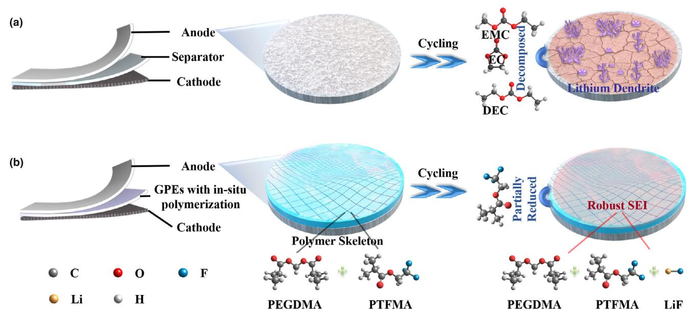
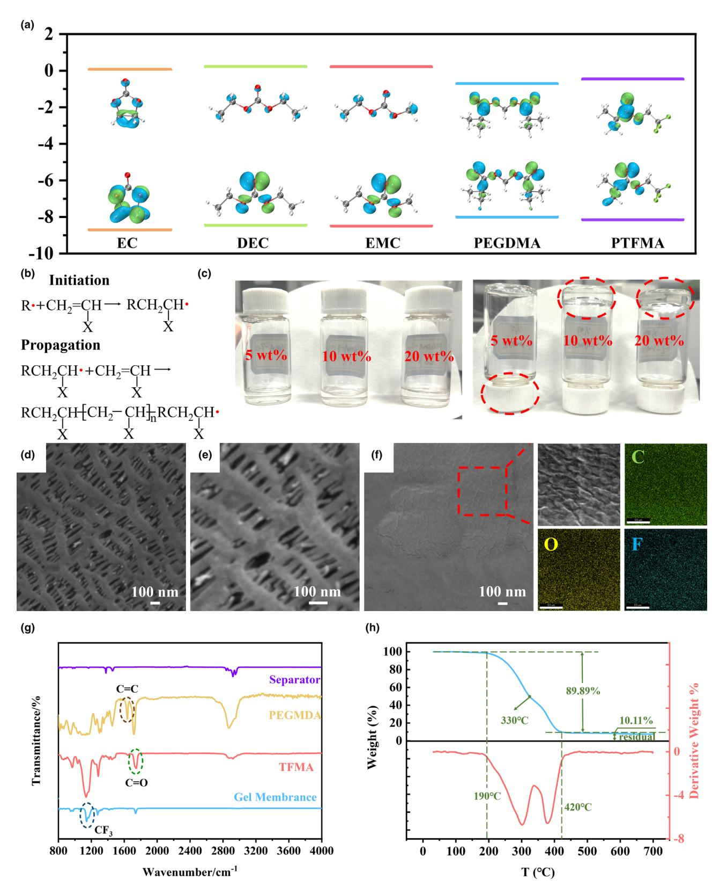
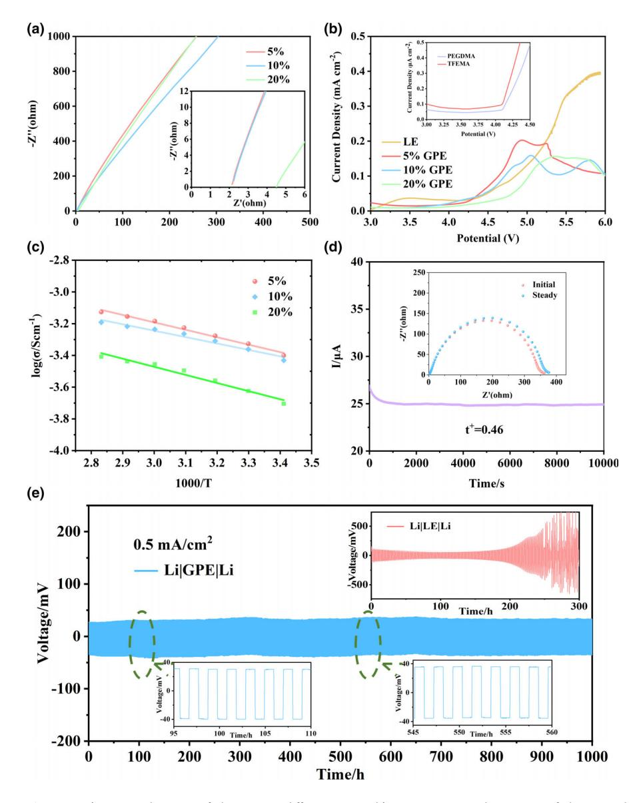
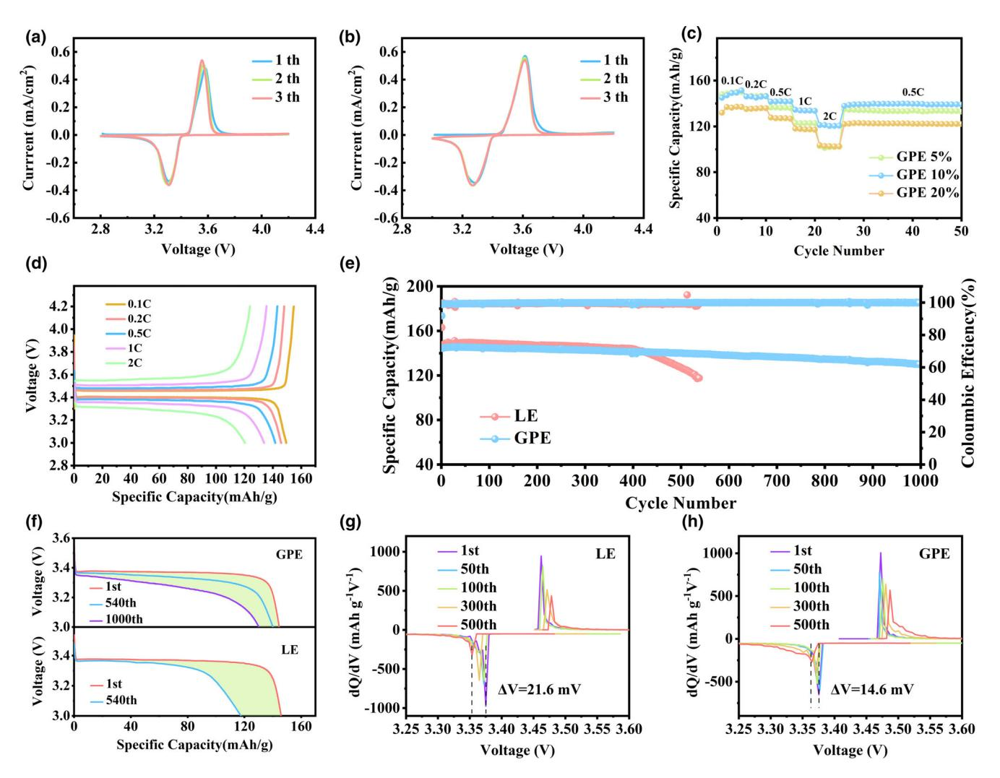
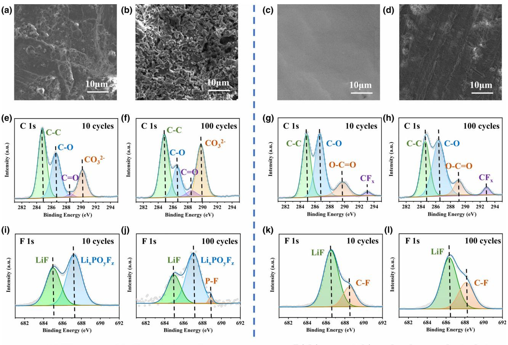
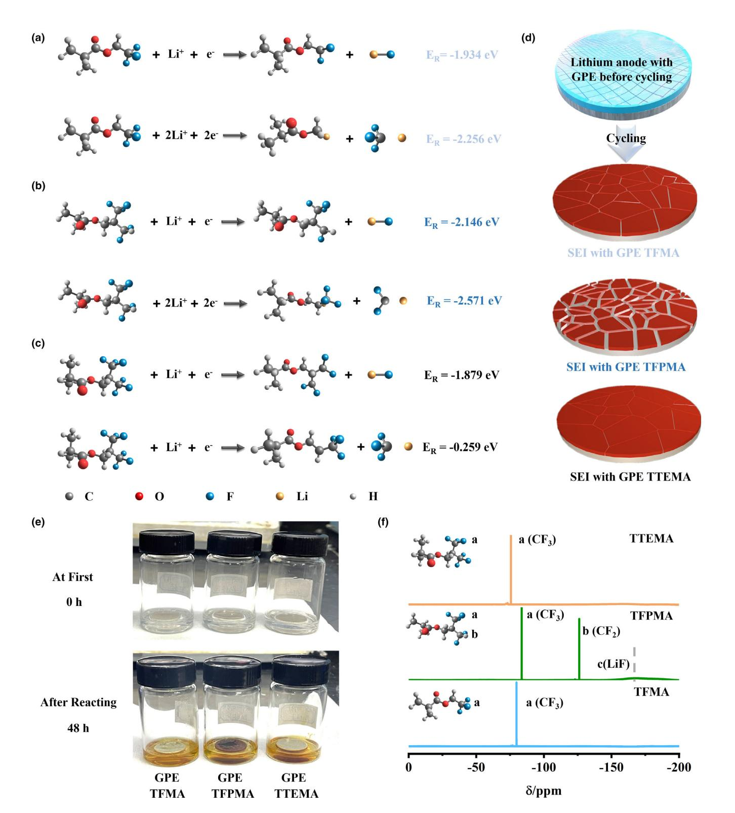
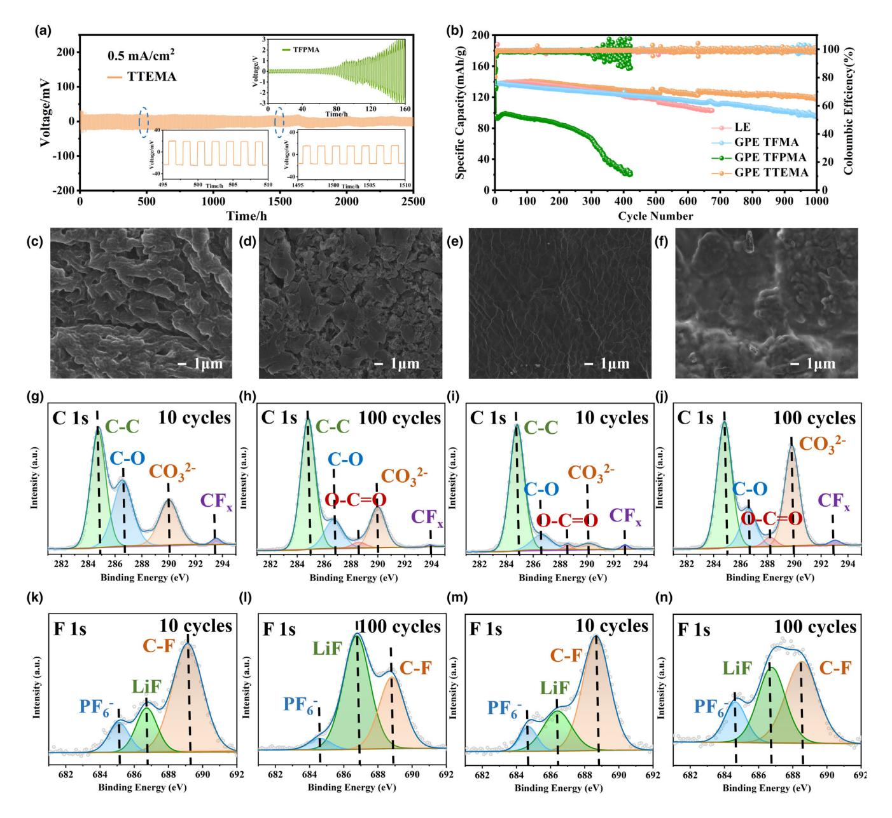

# **Molecular Reactivity and Interface Stability Modification in** In-Situ Gel Electrolyte for High Performance Quasi-Solid-**State Lithium Metal Batteries**

Oivu Wang, Xiangaun Xu, Bo Hong\*, Maohui Bai, Jie Li, Zhian Zhang, and Yanging Lai\*

Quasi-solid-state lithium metal battery is a promising candidate for next generation high energy density and high safety power supply. Despite intensive efforts on electrolytes, uncontrolled interfacial reactions on lithium with electrolyte and patchy interfacial contacts still hinder its practical process. Herein, we bring in rationally designed F contained groups into polymer skeleton via in-situ gelation for the first time to establish quasisolid-state battery. This method achieves a capacity retention of 90% after 1000 cycles at 0.5C with LiFePO4 cathodes. The interface constructed by polymer skeleton and reaction with -CF3 lead to the predicted solid electrolyte interface species with high stability. Furthermore, we optimize molecular reactivity and interface stability with regulating F contained end groups in the polymer. Comparisons on different structures reveal that high performance solid stable lithium metal batteries rely on chemical modification as well as stable polymer skeleton, which is more critical to construct robust and steady SEI with uniform lithium deposition. New approach with functional groups regulation proposes a more stable cycling process with a capacity retention of 94.2% at 0.5C and 87.6% at 1C after 1000 cycles with LiFePO4 cathodes, providing new insights for the practical development of quasi-solid-state lithium metal battery.

### 1. Introduction

Lithium batteries have a broad application in electronics and electric vehicles to make a fossil fuel free society possible. [ $1-5$ ] Although numerous works make great achievements on constructing high energy density power supplies in liquid electrolyte (LE), security issues including leakage and leakage are still a big issue, which seriously hinders their further evolution. With existence of internal or external short circuits, undesirable exothermic reactions may cause a rapid rise in internal temperature and thermal runaway. Quasi-solid-state electrolyte is

Q. Wang, X. Xu, Prof. B. Hong, Dr. M. Bai, Prof. J. Li, Prof. Z. Zhang, Prof. Y. Lai School of Metallurgy and Environment, Central South University, Changsha 410083, China E-mail: bop hong@163.com E-mail: laiyanqing@csu.edu.cn Prof. B. Hong, Prof. Y. Lai Engineering Research Centre of Advanced Battery Materials, The Ministry of Education, Changsha 410083, China  $\overline{\mathbb{D}}$  The ORCID identification number(s) for the author(s) of this article can be found under https://doi.org/10.1002/eem2.12351.

DOI: 10.1002/eem2.12351

posed to improve or replace LE and solve safety problem fundamentally.  $[6-8]$  However, both inorganic ceramic electrolyte and organic polymer electrolyte suffer from problems of poor physical contacts and terrible chemical stability on interfaces between electrolyte and electrodes. The inferior ion conductivity has also limited their developments.  $[9,10]$  Gel polymer electrolytes (GPE) that combine superiority of LE and solid polymer electrolyte demonstrate ameliorative ion conductivity and interfacial compatibility.  $[11-15]$  Inside the lithium battery, GPE can regulate the uniform distribution of lithium ions flow and inhibit decomposition reaction of electrolyte to improve the stability of lithium metal anode and promote safety of batteries. Researches on GPE based solid-stable lithium metal batteries have attracted considerable. attention.

Gel is the stable system combining two phases of liquid and solid, where GPE includes two forms considering the connection modes of polymer and  $LE$ .[16,17] One is constructed by preparing porous polymer films as hosts with soaking in LE and then sandwiched between

electrodes such as poly(ethylene oxide)/PEO, polyacrylonitrile/PAN and polyvinylidene fluoride/PVDF etc.[18-22] This kind of GPE is resemble to commercial separator absorbing LE solvent, however, with limited ion conductivity. The other one is formed by interactions between ester groups inside the polymer skeleton and oxygen contained groups in solvent molecules, for example, polymethyl methacrylate/PMMA. Such GPE could be produced by both ex-situ with preparing membrane first and in-situ pathway with polymerizing inside the battery, [23-26] which could well match existing industrial lithium ion battery producing methods and possess ion conductivity as high as LE with a promising application prospect. PMMA based GPE has been widely applied in industry in the early stage. For example, SONY and other companies have launched polymer gel battery based on PMMA system. However, the poor stability of PMMA gel electrolyte leads to an inferior long cycle performance of the battery, which is even worse than the LE, stagnating the development of gel electrolyte.

Stability of GPE is related to both autologous stability and interfacial stability, where crosslinking of more kinds of polymer into GPE is a helpful way to ameliorate its autologous properties.[27,28] However, the unstable interfacial problem is still hindering its development. Interface between anode and GPE is more unstable

and complicated due to high reactivity of lithium and mixed ingredients consisting polymer and LE in GPE. With the in-situ preparation of GPE inside the battery could improve the interfaces between electrolyte and electrodes, especially cathode materials. In this consideration, a design criterion of bringing F contained functional groups into ester polymer monomer is proposed to enhance the autologous stability and build a fluorine-rich interface layer between electrolyte and anode at the same time, which benefits for Li platting and significantly improve the stability of the anodeelectrolyte interface. Considering the reactivity of -CF groups  $(-CF > -CF_2 > -CF_3)$ ,[29] a hybrid polymer framework of polyethylene glycol dimethacrylate (PEGDMA) and trifluoroethyl methacrylate (TFMA) is applied to construct gel electrolyte with in-situ polymerization, where ester contains C=C and -CF3. PEGDMA and TFMA monomers combining with LE and initiator are injected into the battery and then maintained at 60 °C to initiate polymerization. The in-situ polymerization inside the cell could ensure safety, simplify the process on production of quasi-solid-state battery and promote contacts between solid state electrolyte and electrode materials at the same time. As for lithium anode in LE (Figure 1a), brittle SEI formed by solvent molecules and lithium salts after cycling is too fragile to construct steady SEI for stabilize interfaces between lithium and electrolyte, which results in growth of lithium dendrites. On the contrary, gelation inside the cell could help construct organic SEI on the lithium (Figure 1b), whose homogeneous gel structure coordinating with Li ions uniform distribution reduces the risk of lithium dendrite growth. After cycling, partially active -CF3 groups inside polymer skeleton react with Li+ and form a stable SEI based on polymer network (PEGDMA and PTFMA) and LiF where the steady organic continuous polymer network ensures negligible volume change of SEI during lithiation process and inorganic LiF-enriched SEI induce dendrite-free large crystalline grains growth of lithium. Design of in-situ gel electrolyte with  $-\hbox{CF}_3$ guarantees the stability of Li metal anode for long-term cycling in solid state lithium metal battery.

## 2. Results and Discussion

The oxidation and reduction activities of polymer and solvent molecules are firstly assessed by density functional theory (DFT) calculations based on their molecular orbital energy levels. As exhibited in Figure 2a and Table S1, PTFMA process a lower lowest unoccupied molecular orbital (LUMO) than other solvents, which offers the possibility of oxidation at the lithium anode to promote formation of a LiF-rich SEI layer.[30] With physical protection of organic monomer polymerization between anode and cathode as well as chemical regulation of component in SEI, gel electrolyte shows potential on promoting lithium metal batteries.

In order to construct an intact gel electrolyte with high ionic conductivity and enough mechanical stability, the polymer skeleton in gel electrolyte is constructed by combination of PEGDMA and TFMA. With addition of AIBN as initiator, two primary radical fragments ( $R$ ) would form at temperature beyond 60 °C. Mechanism of free radical polymerization is presented in Figure 2b, where monomer radical synthesized by addition reaction of primary radical R· and PEGDMA and TFMA monomers. The polymer skeleton is then constructed by chain propagation and swelling LE molecule to form a gel electrolyte. Effects of polymer contents and gel stability are exhibited in optical photograph (Figure 2c). A simple method to estimate structural stability and integrality is shifting the container. The electrolyte keeps steady as gel with polymer contents of 10% and 20%, while the electrolyte appears fluid with 5% polymer addition. It is hard to stay solid state under low polymer content and complete gel phase requires at least 10% polymers inside the electrolyte.

Structures of polymers with basement of separator are explored by SEM in Figure 2d–f. Original polypropylene separator is filled with pores around 100 nm (Figure 2d,e), whose function is to absorb organic liquid molecule. After polymerization of PEGDMA and PTFMA, the membrane (Figure  $2f$ ) is compact and flat with on obvious pores. To judge the homogeneity of polymer distribution, EDX and element mapping results are presented in Figure S1 and Figure 2f. Because of

Figure 1. Schematic illustration of evolution on lithium anodes in cells with LE and in-situ GPE.

Figure 2. a) Calculated HOMO and LUMO energy levels of PEGDMA, PTFMA and electrolyte components; b) Mechanism of polymerization; c) Optical photograph for GPE TFMA in different polymer content; SEM images of d, e) original separator and f) polymer membrane; g) FT-IR image of separator, monomers and polymer; h) TGA analysis of gel membrane.

introducing PTFMA, the peak of fluorine is conspicuous with content of 15.60%. Elements distribution is shown in Figure 2f, where different elements emerged as different colors including carbon (green), oxygen (yellow) and fluorine (blue). Based on the image, all elements are equally distributed in the membrane. Despite from porous polypropylene separator, fluorine in the membrane could be attributed to CF3 in PTFMA and oxygen represents uniform distribution of ester groups in acrylic ester polymer, which has good affinity to LE owing to its ester groups. Traditional LE transporting trough pores in separator would cause inhomogeneous distribution of Li ions and further results in growth of lithium dendrites, while LE transporting trough functional group in gel electrolyte could avoid this phenomenon.

Polymerization process is further testified by FTIR results of monomers and the skeleton after polymerization in Figure 2g. As the figure presented, the peak at  $1600-1690$  cm-1 testify exists of C=C stretching vibration of the acrylate groups in PEGDMA and TFMA.[31] The peak at this location disappears in the gel membrane representing vanish of C=C stretching vibration after polymerization, which proves the mechanism we mentioned in Figure 2b. Characteristic peak at 1140 represent -CF3 groups in TFMA and gel membrane, while signals around 1700–1800 cm $-1$  are attributed to the C=O of ester group in PEGDMA, TFMA and gel membrane, which guarantees strong interactions with liquid carbonate ester electrolyte.[32–34] Furthermore, thermal stability of gel membrane is evaluated by TG and DSC in Figure 2h. The membrane starts to decompose when the temperature increases to 190 °C. The weight loss achieves 89.89% until 420 °C and the final weight of 10.7% according to the residual of carbon under N2 atmosphere. It is worth mentioning that weight loss process could be separated into two parts with the point of 330 °C. This temperature corresponds to decomposing and evaporating temperature of polypropylene separator in Figure S2. The adaptive temperature of separator-based gel membrane could support the normal Li battery application.

The ion conductivity of GPEs is performed in Figure 3a to explore relationship between polymer contents and ability of transporting Li+. Equivalent circuit and fitting results of the EIS on ion conductivity with different GPE systems are presented as Figures  $S3-S5$ , where Rb stands for bulk resistances and  $\ensuremath{R_\text{int}}$  stands for interfacial resistances. After calculation, GPEs in 5% and 10% polymer contents show similar ion conductivity of 4.9 and 4.6 mS  $\text{cm}^{-1}$  at room temperature, while the ion conductivity drops to 2.2 mS  $\text{cm}^{-1}$  with containing 20% polymer. The gel is hard to build under low polymer contents like 5% and the high polymer contents have adverse impacts on ion conductivity. Thus, the relationship of mechanical stability and ion conductivity should be balanced. The electrochemical window of monomers and GPEs is investigated in Figure 3b. Monomers show the lowest oxidation voltage of only 4.1 V, while the parameter lifts after hybrid polymerization. The electrochemical window promotes along with polymer contents rising, while 10% GPE shows similar oxidation voltage to LE around 4.3 V and 20% GPE could reach 4.6 V. Coordination between polymer skeleton and solvents inhibit decomposition reaction under high voltage.

AC impedance is applied to judge the relationship between ion conductivity and temperature in Figures S6-S8. Results of GPE in different contents are presented in Figure 3c. Ion conductivity of GPE increase with rising of temperatures because of promoting function on accelerating Li+ movement in high temperature. Fitting results of GPE in different ratios confirm to the Arrhenius model and activation energy  $(E_a)$  of Li diffusion in the GPE 1:1 is calculated to be 0.096 eV based on this model. Low contents of polymer backbones indicates that the ion

movement is carried out by an ion drift process rather than the longdistance movement of the polymer chain, in which the liquid component in the material is an ionophore at all monomer ratios. Calculation of  $t_{Li^+}$  of the 10% GPE is completed in Figure 3d and the value reaches up to 0.46 according to the formula, which surpasses commercial LEs  $(0.2-0.4)$ .

Further investigation on the reversibility of Li plating and stripping processes on Li metal electrodes is performed by electrochemical tests on LilLi symmetrical cells in Figure 3e. Cells with LE and GPE are charged and discharged to 1 mhA under the current density of  $0.5 \text{ mA cm}^{-2}$ . For the LilGPEILi cell, a low overpotential can be observed of 32 mV at the 100 h and the value stays around 37 mV even after 550 h. The cell maintains a stable Li plating and stripping process and a rather low overpotential after 1000 h, which testify a durable SEI layer and highly stable Li plating/stripping reversibility without the safety hazard from Li dendrites growth. As for the cell with LE, overpotential is similar with GPE at beginning. However, the potential continuously increases in the next 300 h, which indicates worse lithium deposition and dissolution behaviors than those in the GPE.

Batteries with commercial olivine type LiFePO4 as cathodes and lithium as anodes are assembled to test electrochemical performances in our GPE. The CVs of cells in LE and GPE at 0.1 mV  $s^{-1}$  are presented in Figure 4a,b to judge electrochemical reaction process. Typical pair of peaks in positive and negative scanning accord with lithium extraction and insertion processes of the LFP host. The wider gap between redox peaks appears at cells in GPE, which attributes to lower ion conductivity of GPE than LE. Rate performances of batteries in different contents of polymers from 0.1C to 2C are presented in Figure 4c. Low ion conductivity with high polymer content results in terrible cell performance of GPE 20% especially in 2C, while the unstable GPE in 5% polymer content is also worse than stable GPE 10%. Cells with the GPE 10% exhibit capacities of 120.6, 133.6, 141.8, 146.3, 151.5 mAh  $g^{-1}$  at 2C, 1C, 0.5C, 0.2C and 0.1C and corresponding charge/discharge voltage curves are presented in Figure 4d, while charge/discharge voltage curves of cells with the GPE 5% and GPE 20% are presented in Figures S9 and S10. Rate performance of the cell in LE is performed in Figure S11 and performance of LE system is approximate to GPE system under low current density  $(0.1C-1C)$ . The difference of ion conductivity results in distinction cell performance under high current density (2C), where specific capacity of LE cell is higher than GPE cell.

The long-term cycling performance of cells with LE and GPE at 0.5 C (1C = 170 mAh  $g^{-1}$ ) in the voltage of 3–4.2 V is presented in Figure 4e. The cell with LE shows higher capacity than the one with GPE at initial 400 cycles because of higher ion conductivity and better wettability. Further charge/discharge details are presented in Figure 4f, and batteries with GPE and LE process similar charge/discharge voltage around 3.35 V. Both systems deliver a similar specific capacity of 145 mAh  $g^{-1}$ . However, the stable electrode-electrolyte interface constructed by GPE could afford more stable cycling even for 1000 cycles with 90% capacity retention, while LE cell only maintains 80% capacity after 540 cycles. To determine the change in electrochemistry during cycling, capacity versus the electrode potential  $(dQ/dV)$  is applied to analyze the shifts of redox peaks. The reduction peaks of cells with LE shows little change in the first 300 cycles, however the shift with a large gap appears at 500th cycle, and raise up to 21.6 mV. While on the contrary, GPE system exhibits smaller shifts of reduction peaks from first to 500th cycles and the shift is only 14.6 mV, which corresponds to charge performance in Figure 4a. Although LE system processes better wettability and higher ion conductivity at first, interfaces constructed

Figure 3. a) Ion conductivity of the GPE in different ratios. b) Linear sweep voltammetry of the LE and GPE at a sweep rate of 1 mV  $s^{-1}$ . c) Variation of ion conductivity with the elevation of temperature. d) current variation with polarization of a LilGPElLi symmetrical cell with an applied potential of 10 mV and EIS before and after polarization; e) Long-term cycling of symmetrical Li cells using the LE and GPE.

by GPE are more stable than LE ones, which is beneficial to long cycling performance of batteries.

In order to understand functions of GPE during cycling, morphology of lithium anode in cells with both systems before cycling, after 10 and 100 cycles are detected in Figure S12 and Figure 5a-d. The lithium anode before cycling is separated from the cell in LE and GPE system with stewing 24 h. As presented in Figure S12a and Figure 5a,b, surfaces on lithium get rougher along with cycling, where the needle-like dendrites appear in Figure 5b demonstrating the nonuniform deposition of lithium. On the contrary, lithium anodes (Figure S12b and Figure 5c,d) from GPE system exhibit better stability than ones in LE. Surfaces of lithium before and after cycles are smooth and firm, no obvious lithium dendrites appear on the lithium even after 100 cycles whose interfaces are constructed with the help of GPE.

Variations of interfaces during cycling with LE and GPE systems are discussed by XPS of SEI component. High resolution  $C$  1s of lithium in LE corresponding to SEM are presented in Figure S12c and Figure 5e,f. Organic constituent including C-C, C-O,  $C=0$ ,  $CO_3^{2-}$  come from the decomposition of carbonate solvents and Li salt anions.[35] After cycling, significant increase of  $CO_3^2$ stands for severe electrolyte decomposition. Similar phenomenon also emerges on F 1s spectra in Figure S12e, Figure 5i,j, where  $\mathrm{LiF}^{\left[ 36\right] }$ appears after 10 cycles and P-F appears after 100 cycles. Li salts and decomposition residue exist in all cycles. Remarkable increase of decomposition products indicates the instability of SEI, which is too fragile to protect Li metal anode.

As for GPE system in Figure S12d and Figure  $5g,h$ , amounts of C-O and CF, present before cycles elucidating the formation of GPE assisting SEI on the lithium anode surface. The same ratio of C-C and C-O stays invariable from 0 cycle to 100 cycles and no  $CO_3^{2-}$  appears in all samples, which signifies inhibiting effects of carbonate solvent decomposition. High resolution F 1s results in Figure S12f show the presence of residual Li salt anions and C-F from GPE before cycles.[37,38] Only parts of active -CF3 react with Li and form LiF-rich SEI after 10 cycles (Figure 5k) and unreacted -CF3 groups still exist in the system. Ratio of LiF and  $-CF_3$  groups in Figure 51 remains similarity even after 100 cycles indicating the stable SEI formation on the lithium anode. SEI in GPE system is built by composite polymer and LiF, which is formed by limited reactive -CF3 groups. On one hand, the polymer assisted artificial SEI stays stable during cycling and on the other hand, the limited reactive -CF3 groups react with metal lithium and form LiF. The formation of LiF-rich SEI also stays steady with cycles.

To compare whether chemical modified

SEI or the stable polymer skeleton is more crucial to stabilize lithium metal solid state battery cycling, molecular reactivity is regulated by modifying F contained end groups where TFMA with single -CF3 group in combined polymer skeletons is replaced by TFPMA with a - $CF_3$  group as well as a  $-CF_2$  group and TTEMA with two  $-CF_3$  groups on one side, whose contents stays the same with TFMA in GPE 10%. After polymerization, the corresponding product are marked as PTFPMA and PTTEMA. The oxidation and reduction activities of DFT calculations based on their molecular orbital energy levels is presented in Figure S13 and Table S2. Both process a lower LUMO than electrolyte solvents, which are beneficial to SEI formation. Additions with 10% polymer contents in both systems could form steady gel state as presented in Figure S14. Morphology of GPEs with TFPMA and TTEMA are characterized by SEM in Figures S15 and S16. The membrane of

**Figure 4.** CVs of a) LiFePO4|LE|Li cell and b) LiFePO4|GPE|Li cell at a scan rate of 0.1 mV s-1. c) Rate capability of LiFePO4|Li cell using different ratio GPE. d) Typical charge/discharge voltage curves of LiFePO4|GPElLi; e) Cycling performances of LiFePO4|LElLi cell and LiFePO4|GPElLi cell at 0.5C. f) Charge-discharge curves and dQ/dV profiles of cells in g) LE and h) GPE.

polymerizing PEGDMA and TTEMA (Figure S16) is tight and smooth with even-distributed C, O and F elements. Similar results emerge in the membrane with TFPMA (Figure S15), which proves the even distribution of F contained functional groups in the GPE. Polymerization mechanism of the GPE membrane is studied by FTIR in Figure S17, where peaks of C=C around 1630  $\text{cm}^{-1}$  in TFPMA and TTEMA disappear after polymerizing according with free radical polymerization process as we described in Figure 2b.

To clarify roles of PTFMA, PTFPMA and PTTEMA in the SEI formation process and compare their reactivity, the possible deposition mechanisms are proposed in Figures S18-S20 according to reaction energy calculations. There are two possible reaction paths combining with two kinds of Li+/electron attacking ways for PTFMA. Results in Figure S18 testify two possible products of LiF and LiCF3, whose formation are attributed to one Li+ as well as one electron attacking the -C-F bond in -CF3 and two Li+ as well as two electrons attacking the  $-C-CF_3$  bond separately. The possible ways are listed in Figure 6a. As for PTFPMA, there are four possible reaction paths

combining with two kinds of Li+/electron attacking ways. All reactions are presented in Figure S19 and products with LiF togethering with  $\text{LiCF}_2$  are considerable. LiF comes from one  $\text{Li}^+$  as well as one electron attacking the  $-C-F$  bond in  $-CF2$  and  $LiCF2$  derives from two Li+ as well as two electrons attacking the -C-CF2 bond. Possible reactions are presented in Figure 6b. Both reactions of PTFPMA possess lower reaction energy than PTFMA ones, which proves larger tendency on decomposition. In the third system of PTTEMA, there are two possible reaction paths combining with one kind of Li+/electron attacking ways. Results in Figure S20 testify two possible products of LiF and LiCF3, whose formation are attributed to one Li+ as well as one electron attacking the  $-C-F$  bond in  $-CF_3$ and one  $Li^+$  as well as one electron attacking the -C-CF3 bond separately. Reacting paths emerge in Figure 6c. PTTEMA shows highest reaction energy testifying the best stability among these three systems. Corresponding schematic diagram of SEI evolution in these systems after cycling are displayed in Figure 6d. The SEI with GPE TFPMA is destined to be the most serious because of its higher

#### **Energy & Environmental Materials**

**Lithium metal in liquid electrolyte** 

**Lithium metal in gel polymer electrolyte** 

Figure 5. SEM images of lithium anode after a) 10 cycles and b) 100 cycles in LE system and lithium anode after c) 10 cycles and d) 100 cycles in GPE system. XPS spectra of e, f) C 1s and i, j) F 1s for lithium metal retrieved from LE in 10 and 100 cycles. XPS spectra of g, h) C 1s and k, l) F 1s for lithium metal retrieved from GPE in 10 and 100 cycles.

reactivity, while SEI with GPE TTEMA is the most stable one among these three systems. Robust and stable SEI is crucial for steady cycling in lithium metal battery.

Stability of polymer towards lithium is further verified by reaction of skeleton and gel to lithium separately. Systems of pure polymer skeletons are synthesized with polymer monomers without LE and lithium salts. Phenomena of lithium in different polymer skeletons are displayed in Figure S21a, where lithium storing in polymer TFPMA shows the severest reaction with the largest black area comparing with the other two systems. After appealing the lithium from polymers, FTIR is applied to analyze residual polymers whose interfaces are constructed with lithium and polymer skeletons in Figure S21b. Peak of LiF[39] in 1300  $\text{cm}^{-1}$  is more obvious in polymer TFPMA than others, which is the product of reactions between F contained polymers and lithium. The result confirms the highest reactivity of TFPMA contained polymer. Further investigations on reactivity of gel systems towards lithium are presented in Figure 6e,f. To exclude the influence of F in LiPF6, gels are constructed by polymer skeleton and electrolyte solvent (EC:DEC: EMC in 1:1:1 vol%) without lithium salts. The metal lithium is put into the gel systems and stayed to observe their variation. As exhibited in Figure 6e, lithium is smooth and light in all systems at the beginning. After 48 h, obvious distinctions appear at these three systems, where

the lithium in GPE TFPMA is rough and gloomy and lithium foils in other systems only emerge slightly dark with limited reaction. Reaction products of these systems are detected by 19F NMR of gels after storing in Figure 6f. Peaks of  $-CF_3$  appear at all samples and the peak of  $-CF_2$ at 126 ppm only exists in GPE TFPMA,  $[40-42]$  which accords with their chemical structures. Ratio of peak intensity in -CF3 and -CF2 is larger than 1 indicating -CF2 reacting more than -CF3 groups during the storing period. It is worth noting that the peak of LiF around  $-150\ \mathrm{ppm}$ only presents in GPE TFPMA,[43] while on such peak appears in other system. Reactivity of pure polymer skeleton and gel systems towards metal lithium supports results of possible deposition mechanisms as discussed before.

The ion conductivity of TFPMA and TTEMA GPEs are also explored by AC impedance in Figures S22-S25 and the TFPMA GPE shows ion conductivity of 3.0 mS  $\text{cm}^{-1}$  at room temperature. The ion conductivity of TTEMA GPE (Figure S25) is 3.1 mS cm-1. Further calculations of  $t_{Li^+}$  of both systems are finished in Figures S26 and S27. The value of TFPMA reaches up to 0.62 according to the formula, while the TTEMA GPE gets to 0.65, which are higher than original TFMA GPE because of enhancement of polarity caused by more functional groups. Investigation on the reversibility of Li plating and stripping processes on Li metal electrodes is performed by electrochemical tests on LilLi symmetrical

Figure 6. a) Possible deposition mechanisms of PTFMA, b) PTFPMA and c) PTTEMA according to reaction energy; d) Schematic illustration of corresponding SEI evolution on lithium anode during cycling. e) Changes of lithium in GPE TFMA, TFPMA and TTEMA after 48 h. f) 19F NMR spectra of corresponding gel.

cells in Figure 7a. Cells withs the GPEs are charged and discharged to  $1\,$  mAh under the current density of  $0.5\,$  mA  $\rm cm^{-2}.$  For the LilTFPMAlLi cell, a high overpotential over 100 mV is existed with unstable cycling only within 100 h. The rapid deterioration of the cell could attribute to the instability of polymer skeleton resulting from high activity of -CF2 groups. On the contrary, the cell in TTEMA displays better performance for 2500 h stable cycling. Overpotential of initial cycles is 40 mV and starts to decrease after activation stage. Overpotential can be observed of 20 mV at the 500 h and the value stays around 20 mV even after 1500 h. The cell maintains a stable Li plating and stripping process and a rather low overpotential after 2500 h, which testify a durable SEI layer and highly stable Li plating/stripping reversibility without the safety hazard from Li dendrites growth.

The long-term cycling performances are performed by assembling LilLiFePO4 batteries as well. CV curves of both systems are showed in Figures S28 and S29, whose phenomena resemble ones in LE and GPE TFMA, with limited polarization. The performances at 0.5C are presented in Figures S30 and S31, while further charge/discharge details are presented in Figure S32. The cell with TFPMA fades even worse than LE cell, whose capacity retention rate is 83% only after 280 cycles. TTEMA GPE could afford more stable cycling than other systems and maintains 94.2% capacity even after 1000 cycles. Cells with higher current density (1C) are performed to compare their stability. As presented in Figure 7b, GPEs with only -CF3 groups including TFMA and TTEMA exhibit excellent stability on long-term cycling, where the cell with TFMA maintains 70% capacity after 1000 cycles and capacity retention rate of TTEMA cell reaches up to 87.6% after 1000 cycles. On the contrary, the cell in high active -CF2 groups shows worse cycling stability than other systems, whose capacity fades rapidly in the initial 10 cycles and the capacity retention rate is only 14% after 400 cycles. Furthermore, the polymer membrane is prepared by casting from the same monomers to compare characteristics between in-situ and ex-situ methods. As displayed in Figure S33, this method is suitable for obtaining a uniform polymer film. The membranes are immersed into LE (EC:DEC:EMC in 1:1:1 vol% with  $1.0 \text{ m}$  LiPF6) for 12 h and then assembled as cells between cathodes and anodes. Rate performances of batteries in different GPE systems from 0.1C to 2C and corresponding discharging curves are presented in Figure S34. Rate performance of the cell in ex-situ GPE is approximate to the one in in-situ GPR under low current density at 0.1C. However, the polarization starts to increase and apparent capacity attenuation appears. The differences of interfacial contacts result in worse cell performance under high current density especially at 1C and 2C comparing with GPE with in-situ pathway.

Comparisons of deposition behavior of lithium in these systems, morphology of lithium anode in cells with both systems after 10 and 100 cycles are presented in Figure 7c-f. Nonuniform deposition caused by decomposition of  $-CF2$  groups in TFPMA polymer skeleton results in formation of moss like lithium dendrite on the surface (Figure 7c) and the situation deteriorates into combination of irregularity dendrites after 100 cycles (Figure 7d). Surface of lithium from TTEMA GPE cell (Figure 7e) is smoother than the other system with uniform and dense deposition of lithium. No obvious lithium dendrites appear on the lithium even after 100 cycles (Figure 7f) whose interfaces are constructed with the help of stable -CF3 groups in TTEMA polymer skeleton. For better understanding the relationship of chemical modified SEI and the stability of polymer skeleton in GPE, variety of SEI components during cycling are explored by XPS and results are presented in Figure  $7g-n$ . The C 1s spectrums of TFPMA cell in Figure  $7g,h$  exhibit existence of  $CF_v$  after  $10$  cycles,  $^{\left[ 35\right] }$  while the peak becomes smaller after 100 cycles. The difference proves the decomposition of F contained functional groups on the surface, which is caused by high active  $-CF_2$  groups. However, there is no such obvious change in cycling with TTEMA GPE, where contents of  $CF_x$  stay more stable than TFPMA one in the cycling process. For high-resolution F 1s results in Figure  $7k,l$ , LiF in SEI significant increases after cycles and C-F decreases with LiF

increasement obviously in TFPMA cell. Alteration of contents of C-F in TTEMA is similar to the cell in TFMA with limited decomposition of -CF3 groups, whose phenomenon testifies the stability of TTEMA polymer skeleton. The PTFPMA is extremely chemically unstable toward lithium based on our calculating results and experimental phenomenon. The internal active -CF2 would react with lithium, which results in the formation of LiF and other carbonyl compounds. The SEI in GPE TFPMA is constructed by polymer skeletons and limited decomposition product of LE. Although LiF is beneficial to stable lithium deposition, the unstable polymer skeleton would collapse severely until all -CF2 react completely, which is much more active than  $-CF_3$ . The hazard caused by broken SEI far outweighs the other benefits, which is the reason why cells in GPE TFPMA fade even faster than liquid system. After comparisons of electrochemical performances and SEI contents with GPEs in TFMA, TTPMA and TTEMA, high performance solid stable lithium metal batteries rely on chemical modification as well as stable polymer skeleton, which is more critical to construct robust and steady SEI with uniform lithium deposition. Works on gel electrolytes in recent years are listed in Table S3, where our work possesses the best cycling stability comparing with these works. Regulating molecular reactivity and interface stability with F contained end groups modification in insitu gelation is in favor of stabilizing SEI and ensure stable cycling performance of lithium metal battery, while labile polymer skeleton in SEI is unable to ensure stable cycling even with chemical modified SEI.

#### 3. Conclusions

In this work, a new gel electrolyte with F contained groups monomers addition is constructed by in-situ polymerizing inside the battery for the first time. The as prepared gel electrolyte, combining PEGDMA and TFMA as a hybrid polymer skeleton, exhibits superb stability towards lithium metal anode in solid state battery. Introducing -CF3 groups boosts formation of LiF-rich SEI with limited reactive -CF3 groups reacting with metal lithium. Robust SEI constructed by polymer skeleton and LiF guarantees stable long cycling performance of solid LilLFP with a capacity retention of 90% after 1000 cycles at 0.5C. Furthermore, molecular reactivity and interface stability are regulated with more F contained end groups (-CF2 group in TFPMA and -CF3 group in TTEMA) to compare whether chemical modified SEI or the stable polymer skeleton is more crucial. The possible deposition mechanisms of are listed according to reaction energy calculation of relative reactions, where TTEMA is the most stable one among these three systems fitting in accordance with evolution of SEI during cycling. This new approach with functional groups regulation reveals the significance of stability of polymer skeleton and proposes a more stable cycling process with a capacity retention of 94.2% at 0.5C and 87.6% at 1C after 1000 cycles with LiFePO4 cathodes in GPE TTEMA. The revelation of the relationship between the interface stability and molecular reactivity in this F contained in-situ gel electrolyte, opens up new insights into exploiting high performance quasi-solid-state lithium metal batteries.

#### 4. Experimental Section

Material synthesis: The GPE TFMA was formed by in-situ polymerizing the electrolyte precursors with combination of base electrolyte and polymer addition inside the cell. Base electrolyte contains mixture of EC:DEC:EMC in 1:1:1 vol% with 1.0 M LiPF6 and polymer addition includes PEGDMA (Aladdin) and TFMA

Figure 7. a) Long-term cycling of symmetrical Li cells using the GPE TFPMA and GPE TTEMA. b) Cycling performances of LiFePO4I GPE TFPMA ILi cell and LiFePO4I GPE TTEMA ILi cell at 1C. SEM images of lithium anode after c) 10 cycles and d) 100 cycles in GPE TFPMA system and lithium anode after e) 10 cycles and f) 100 cycles in GPE TTEMA system. XPS spectra of g, h) C 1s and k, l) F 1s for lithium metal retrieved from GPE TFPMA in 10 and 100 cycles. XPS spectra of i, j) C 1s and m, n) F 1s for lithium metal retrieved from GPE TTEMA in 10 and 100 cycles.

(Aladdin) in 1:1 wt% with 0.1 wt% azodiisobutyronitrile (AIBN, Aladdin) as initiator. The polymer monomers and initiator were dissolved in the electrolyte and stirred for 2 h. The GPE TFPMA and GPE TTEMA are similar to GPE TFMA with only replacing TFMA into 2,2,3,3,3-Pentafluoropropyl Methacrylate (TFPMA, Aladdin) and 1,1,1,3,3,3-Hexafluoroisopropyl Methacrylate (TTEMA, Aladdin), respectively. After polymerization, the corresponding products are noted as PTFMA, PTFPMA and PTTEMA.

Preparation of cathodes and fabrication of batteries: The coin cell was assembled with cathodes, separator and metal lithium inside CR-2025 type case, where the precursor solution was injected into.  $LiFePO_4$ , PVDF and acetylene black were mixed together as a ratio of 8:1:1 in N-methyl-2-pyrrolidone to make cathode slurry. The slurry was then coated on an aluminum foil and dried at

80  $^{\circ}$ C for 24 h. The loading amount of active material in the cathode is 1.5 mg cm $-2$ . As for assembly process of batteries, the procedure is the same with regular cells in LE. The electrolyte is assembled in a two-electrode cells configuration with standard 2025 coin-type cells. The cathode, separator, lithium anode and Ni foam are placed inside the cell case, which is filled with precursor solution inside an argon-filled glove box. After packaging, the cell was aged for 2 h and then maintained at 60 °C for 12 h to accomplish polymerization.

Characterizations: The phenomenological experiments on the gelation process are completed by pouring the precursor solution into a glass bottle in the argon-filled glove box and then heating at 60  $\,^\circ\text{C}.$  The formation of gel-electrolyte could be observed after 12 h reaction. A field-emission scanning electron microscopy (FESEM, FEI Quanta-200) was taken to run morphology tests. Expressions for chemical states of the carbon, fluorine and oxygen in the material were performed by X-ray photoelectron spectroscopy (XPS, EscaLab Xi+). Fourier transform infrared spectroscopy (FTIR) tests were carried out on an FTIR spectrometer (Bruker Vertex 70). Thermogravimetric analysis (TGA, Mettler TGA/SDTA 851e) was performed at a heating rate of 10  $^{\circ}$ C min-1 under a N2 atmosphere. GPEs after reacting with lithium were dissolved in CDCl3 for 19F NMR analysis (Bruker 400M).

Electrochemical characterizations: AC impedances (from  $10^6$  to  $10^{-1}$  Hz) of the batteries were performed by an electrochemical workstation (Solartron 1470E). The electrochemical stability window of GPE was measured by LSV at a scan rate of 1.0 mV  $\rm s^{-1}$ . Cyclic voltammograms (CVs) of the battery were performed at a scan rate of 0.1 mV  $s^{-1}$ . The galvanostatic charging-discharging of battery cells was performed in LAND CT2001A. As for symmetrical Li cells, the current density is 0.5 mA  $\text{cm}^{-2}$  and Li is plated and stripped 1 h per cycle.

*Calculations:* All calculations were carried out with the Gaussian 16 software. The B3LYP functional was adopted for all calculations.[44,45] For geometry optimization calculations, the  $6-311+G(d)$  basis set was used, and the optimal geometry for each compound was determined.[46,47] The SMD implicit solvation model was used to account for the solvation effect of EC:DEC:EMC in 1:1:1 vol%. The DFT-D3 with BJ-damping was applied to correct the weak interaction to improve the calculation accuracy.[48,49] The visualization of the orbitals was achieved using VMD software.[50]

#### Acknowledgements

The authors acknowledge the financial support from the National Natural Science Foundation of China (52034011), the Fundamental Research Funds for the Science and Technology Program of Hunan Province (2019RS3002), the Central Universities of Central South University (Grant No. 2018zzts133) and Science and Technology Innovation Program of Hunan Province (2020RC2006).

## **Conflict of Interest**

The authors declare no conflict of interest

## **Supporting Information**

Supporting Information is available from the Wiley Online Library or from the author.

## **Keywords**

F contained end groups, in-situ gel electrolyte, interface stability, molecular reactivity, quasi-solid-state lithium metal battery

Received: September 5, 2021

- Revised: December 15, 2021
- Published online: December 29, 2021
- [1] J. Liu, Z. Bao, Y. Cui, E. J. Dufek, J. B. Goodenough, P. Khalifah, Q. Li, B. Y. Liaw, P. Liu, A. Manthiram, Y. S. Meng, V. R. Subramanian, M. F. Toney, V. V. Viswanathan, M. S. Whittingham, J. Xiao, W. Xu, J. Yang, X.-Q. Yang, J.-G. Zhang, Nat. Energy 2019, 4, 180.
- [2] X. B. Cheng, R. Zhang, C. Z. Zhao, Q. Zhang, Chem. Rev. 2017, 117, 10403.
- [3] J. G. Zhang, W. Xu, J. Xiao, X. Cao, J. Liu, Chem. Rev. 2020, 120, 13312.
- [4] X. Zhang, Y. Yang, Z. Zhou, Chem. Soc. Rev. 2020, 49, 3040.
- [5] X. Zhang, G. Liu, K. Zhou, T. Jiao, Y. Zou, Q. Wu, X. Chen, Y. Yang, Zheng, J. Energy Mater. 2021, 1, 100005
- [6] A. Manthiram, X. Yu, S. Wang, Nat. Rev. Mater. 2017, 2, 16103.

- [7] F. Zheng, M. Kotobuki, S. Song, M. O. Lai, L. Lu, J. Power Sources 2018, 389 198
- [8] X. Wu, K. Pan, M. Jia, Y. Ren, H. He, L. Zhang, S. Zhang, Green Energy Environ. 2019, 4, 360.
- [9] L. Xu, S. Tang, Y. Cheng, K. Wang, J. Liang, C. Liu, Y.-C. Cao, F. Wei, L. Mai. loule 2018. 2. 1991.
- [10] J. C. Bachman, S. Muy, A. Grimaud, H. H. Chang, N. Pour, S. F. Lux, O. Paschos, F. Maglia, S. Lupart, P. Lamp, L. Giordano, Y. Shao-Horn, Chem. Rev. 2016, 116, 140.
- [11] N. Chen, H. Zhang, L. Li, R. Chen, S. Guo, Adv. Energy Mater. 2018, 8, 1702675.
- [12] W. Fan, N. W. Li, X. Zhang, S. Zhao, R. Cao, Y. Yin, Y. Xing, J. Wang, Y. G. Guo, C. Li, Adv. Sci. (Weinh) 2018, 5, 1800559.
- [13] C. Ma, W. Cui, X. Liu, Y. Ding, Y. Wang, InfoMat 2021, 1, 1.
- [14] W.-H. Li, H.-J. Liang, X.-K. Hou, Z.-Y. Gu, X.-X. Zhao, J.-Z. Guo, X. Yang, X.-L.-J. Wu, Energy Chem. 2020, 50, 416.
- [15] X. T. Wang, Z. Y. Gu, W. H. Li, X. X. Zhao, J. Z. Guo, K. D. Du, X. X. Luo, X. L. Wu, Chem. Asian J. 2020, 15, 2803.
- [16] Y. G. Cho, C. Hwang, D. S. Cheong, Y. S. Kim, H. K. Song, Adv. Mater. 2018. 31. 1804909.
- [17] S. Tang, W. Guo, Y. Fu, *Adv. Energy Mater.* **2020**, *11*, 2000802.
- [18] F. Baskoro, H. Q. Wong, H.-J. Yen, ACS Appl. Energy Mater. 2019, 2, 3937.
- [19] K. Hayamizu, *Solid State Ionics* **1998**, 107, 1.
- [20] B. K. Choi, Y. W. Kim, H. K. Shin, *Electrochim. Acta* **2000**, *45*, 1371.
- [21] C. L. Cheng, C. C. Wan, Y. Y. Wang, Electrochem. Commun. 2004, 6,
- 531
- [22] S. Shalu, V. K. Singh, R. K. J. Singh, Mater. Chem. C 2015, 3, 7305.
- [23] Q. Zhao, X. Liu, S. Stalin, K. Khan, L. A. Archer, Nat. Energy 2019, 4, 365
- [24] W. P. Wang, J. Zhang, Y. X. Yin, H. Duan, J. Chou, S. Y. Li, M. Yan, S. Xin, Y. G. Guo, Adv. Mater. 2020, 32, e2000302.
- [25] M. Liu, D. Zhou, Y.-B. He, Y. Fu, X. Qin, C. Miao, H. Du, B. Li, Q.-H. Yang, Z. Lin, T. S. Zhao, F. Kang, Nano Energy 2016, 22, 278.
- [26] A. Hosseinioun, E. Paillard, J. Membr. Sci. **2020**, 594, 117456.
- [27] E. Aram, M. Ehsani, H. A. Khonakdar, *Thermochim. Acta* **2015**, 615, 61.
- [28] S. Guan, W. Wang, J. Zheng, C. Xu, *Electrochim. Acta* **2020**, 354, 136702.
- [29] A. Nova, R. Mas-Ballesté, A. Lledós, Organometallics 2011, 31, 1245.
- [30] M. Chen, C. Ma, Z. Ding, L. Zhou, L. Chen, P. Gao, W. Wei, ACS Energy Lett. 2021, 6, 1280.
- [31] Q. Wang, X. Xu, B. Hong, M. Bai, J. Li, Z. Zhang, Y. Lai, Chem. Eng. J. 2022. 428. 131331.
- [32] K. Tanaka, M. Ohsuga, Y. Sugimoto, Y. Okafuji, K. Mitsuhashi, J. Fluorine Chem. 1988, 39, 39.
- [33] T. Elzein, M. Nasser-Eddine, C. Delaite, S. Bistac, P. Dumas, J. Colloid Interface Sci. 2004, 273, 381.
- [34] Y. Luo, T. Li, H. Zhang, W. Liu, X. Zhang, J. Yan, H. Zhang, X. Li, Angew. Chem. Int. Ed. Engl. 2021, 60, 11718.
- [35] Q. Wang, Z. Yao, C. Zhao, T. Verhallen, D. P. Tabor, M. Liu, F. Ooms, F. Kang, A. Aspuru-Guzik, Y. S. Hu, M. Wagemaker, B. Li, Nat. Commun. 2020, 11, 4188
- [36] S.-M. Xu, H. Duan, J.-L. Shi, T.-T. Zuo, X.-C. Hu, S.-Y. Lang, M. Yan, J.-Y. Liang, Y.-G. Yang, Q.-H. Kong, X. Zhang, Y.-G. Guo, Nano Res. 2020, 13, 430
- [37] F. Li, J. He, J. Liu, M. Wu, Y. Hou, H. Wang, S. Qi, Q. Liu, J. Hu, J. Ma, Angew. Chem. Int. Ed. 2021, 60, 6600.
- [38] P. Verma, P. Maire, P. Novák, *Electrochim. Acta* **2010**, 55, 6332.
- [39] Y. D. Zhong, X. B. Zhao, G. S. Cao, *Mater. Sci. Eng. B* **2005**, 121, 248.
- [40] G. Zhong, H. Chen, Y. Cheng, L. Meng, H. Liu, Z. Liu, G. Zheng, Y. Xiang, X. Liu, Q. Li, Q. Zhang, H. Yue, C. Lu, Y. J. Yang, Mater. Chem. A 2019. 7. 19793.
- [41] D. Shen, B. Xu, X. Huang, Q. Zhuang, S. Lin, *Polym. Chem* **2018**, *9*, 2821.
- [42] Y. Umino, T. Narita, H. Hamana, J. Polym. Sci. Part A Polym. Chem. 2008, 46, 7011.

- [43] M. Murakami, H. Yamashige, H. Arai, Y. Uchimoto, Z. Ogumi, Electrochem. Solid-State Lett. 2011, 14, A134.
- [44] J.-L. Calais, Int. J. Quantum Chem. 1993, 47, 101.
- [45] K. Burke, J. Chem. Phys. 2012, 136, 150901.
- [46] R. Krishnan, J. S. Binkley, R. Seeger, J. A. Pople, J. Chem. Phys. 1980, 72, 650.
- [47] T. Clark, J. Chandrasekhar, G. N. W. Spitznagel, P. V. R. Schleyer, J. Comput. Chem. 1983, 4, 294.
- [48] A. V. Marenich, C. J. Cramer, D. G. Truhlar, J. Phys. Chem. B 2009, 113, 6378.
- [49] S. Grimme, S. Ehrlich, L. Goerigk, J. Comput. Chem. 2011, 32, 1456.
- [50] W. Humphrey, A. Dalke, K. Schulten, J. Mol. Graphics 1996, 14, 33.