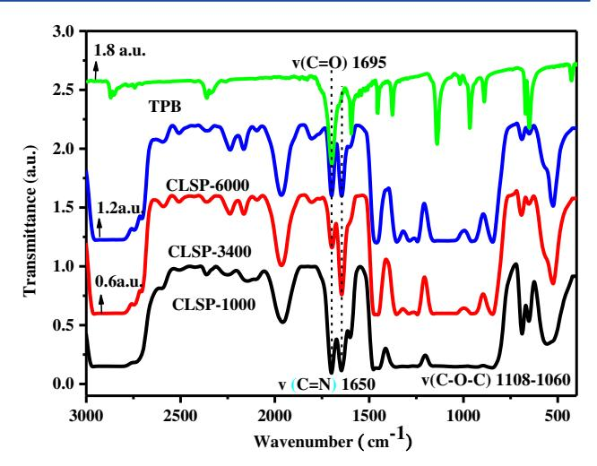
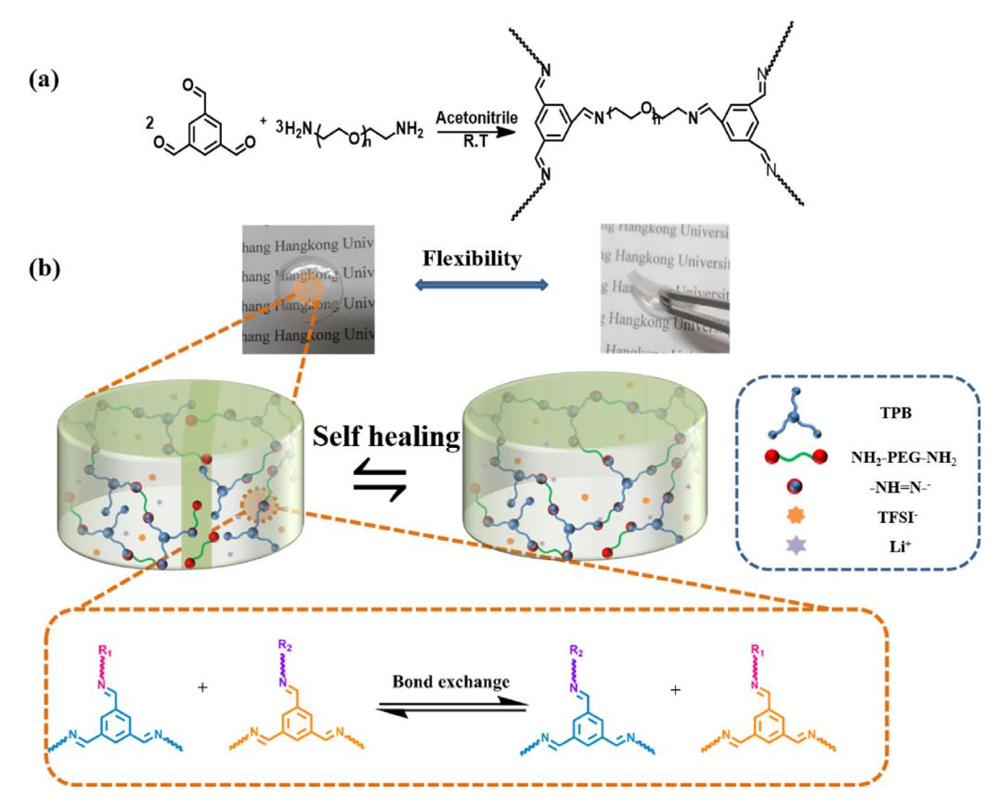
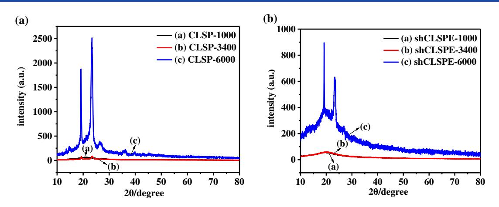
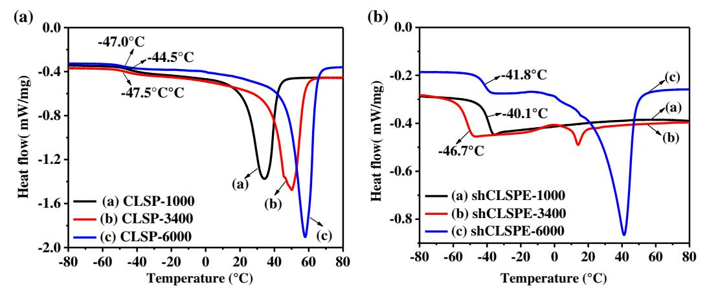
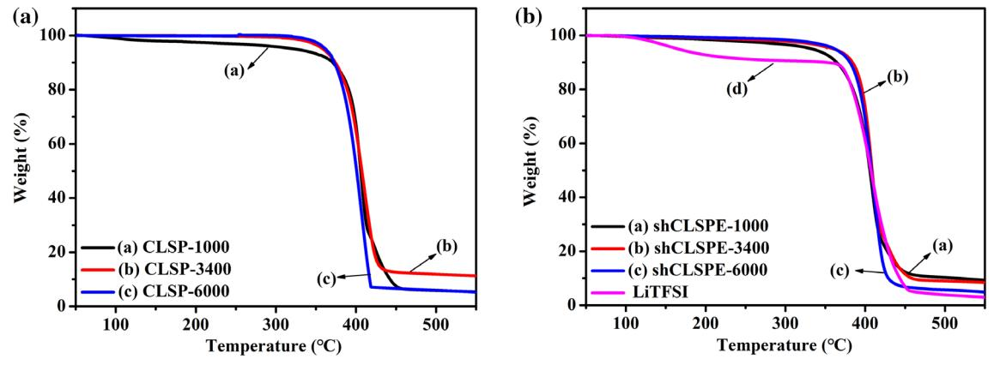
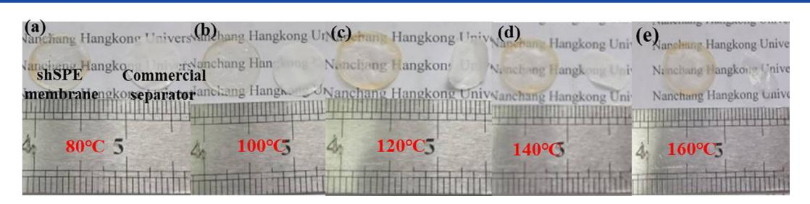
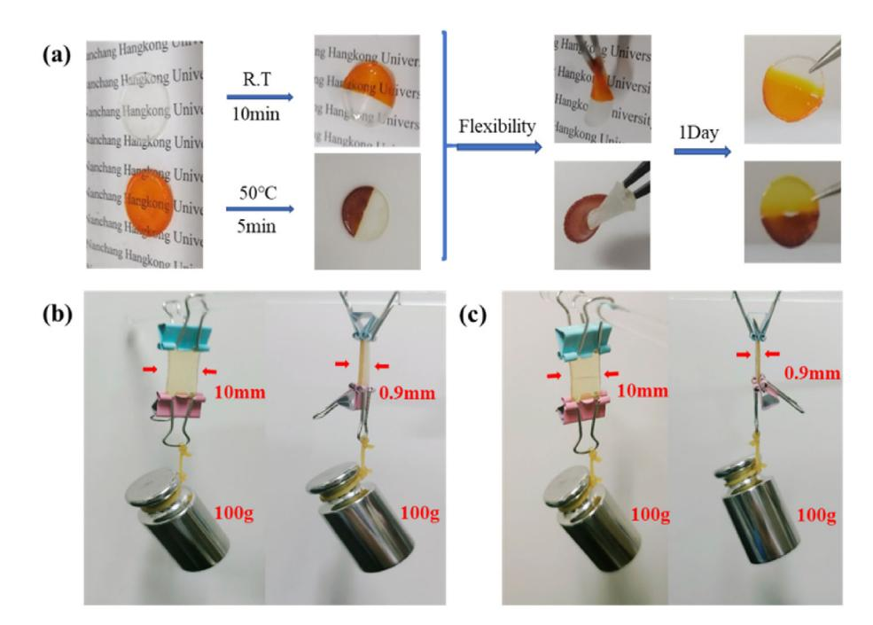
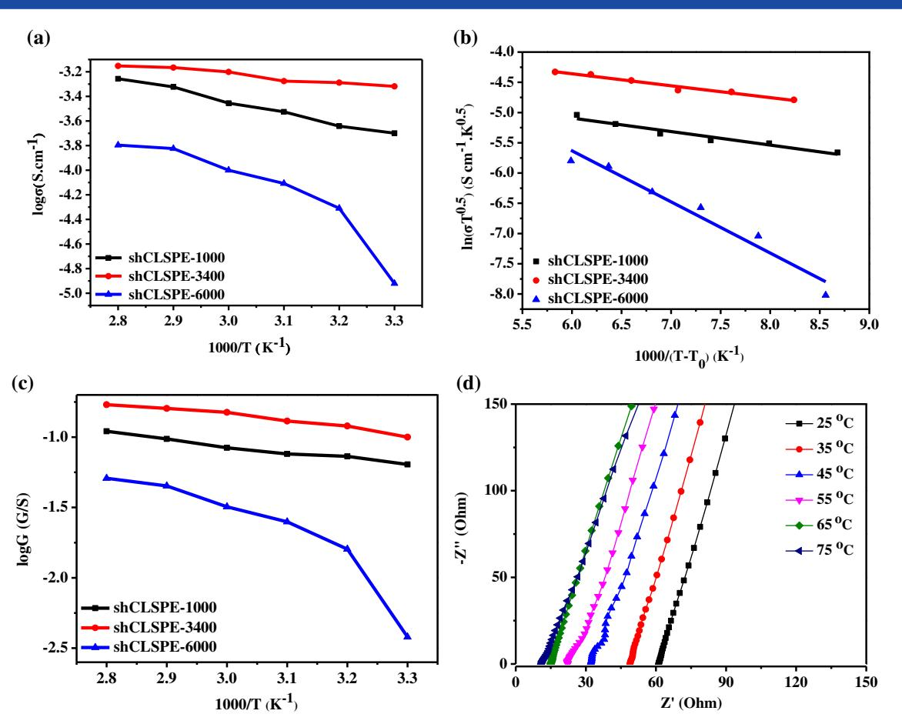
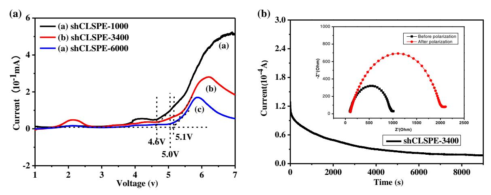
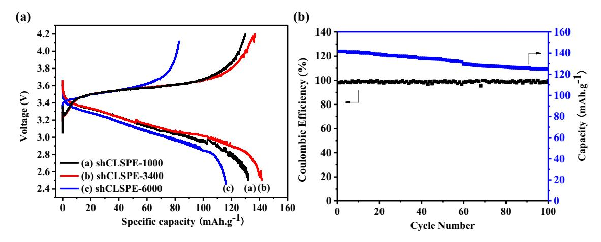

(wileyonlinelibrary.com) DOI 10.1002/pi.6400

# Crosslinked network solid polymer electrolyte with self-healing ability and high stability for lithium metal battery

Xiaoyuan Xue, Xiaoyan Cao, Long Wan, Yongfen Tong,\* Tingting Li and Yu Xie

Abstract

All-solid polymer electrolytes with good self-healing ability and high stability were designed based on polyoxyethylenebis(amine) (H2N-PEG-NH2) and 1,3,5-benzenetricarboxaldehyde through the Schiff base reaction. The effects of H2N-PEG-NH2 of various molecule weights on thermal and electrochemical properties were studied. It was found that shCLSPE-3400 electrolyte with appropriate PEG chain simultaneously exhibited good thermal stability, excellent self-healing ability and high mechanical strength, which is due to the introduction of crosslinked network structure and dynamic reversible bonds in the electrolyte. It also showed a high ionic conductivity of 4.8 × 10−4 S cm−1 , wide electrochemical stability window (5.1 V) and good lithium ion transfer number (tLi+ = 0.31) with an ethylene oxide/Li + ratio of 20:1 at 25 °C. In addition, a Li|shCLSPE-3400|LiFePO4 battery with shCLSPE-3400 as electrolyte was studied, and it showed good reversible specific capacity. Such electrolyte has potential for application in solid-state batteries, which will facilitate improvement in the safety performance of lithium metal batteries.

© 2022 Society of Industrial Chemistry.

Supporting information may be found in the online version of this article.

Keywords: solid polymer electrolyte; self-healing; crosslinked; safety; lithium metal batteries

## INTRODUCTION

Extensive research efforts have been devoted to developing lithium metal batteries (LMBs) for their high theoretical specific capacity (3860 mA h g−1 ) and low reduction potential.[1](#page-8-0)–3 However, the risk of explosion or fire due to the leakage of liquid electrolyte results in the stability and safety of such batteries becoming important issues.[4, 5](#page-8-0) To solve these problems, solid polymer electrolytes (SPEs) can be used instead of liquid electrolytes, because SPE-based lithium batteries show higher thermal stability and good safety without organic solvents. Nevertheless, the application of SPEs in LMBs is limited by the low ion conductivity of SPEs.[6, 7](#page-8-0) In addition, due to the poor interfacial stability between electrolyte and electrode, SPEs usually crack, deform or even break during charging and discharging. This will further accelerate uneven lithium deposition, leading to the growth of lithium dendrites in the cracks.[8](#page-8-0) The growth of dendrites can cause internal short circuits in LMBs, which will shorten the battery service life. Therefore, LMBs are expected to exhibit high electrochemical performance with good stability and safety.

Among all SPEs, poly(ethylene oxide) (PEO) with the advantages of dissolving and conducting lithium ions has become the most commonly used polymer matrix due to its electrochemical and chemical stability.[9](#page-8-0) But it is well known that PEO with high degree of crystallinity leads to SPEs with lower ionic conductivity at room temperature.[10](#page-8-0) In order to enhance the electrochemical properties of PEO-based electrolytes, various strategies have been

adopted, such as addition of liquid plasticizers or nanofillers or introducing block, graft and crosslinked polymers.11–[15](#page-8-0) Although these strategies can improve the ionic conductivity to some extent, some other well-known drawbacks of SPEs, for example, the poor interfacial compatibility with electrodes and fragile characteristics, will lead to operational issues for LMBs. Therefore, it is very urgent to develop an ideal SPE to realize LMBs with safety and high performance.[16](#page-8-0)

Self-healing polymers can elicit repair by detecting external defects and restoring their original functions.[17, 18](#page-8-0) In recent years, many studies have been conducted on dynamic noncovalent and covalent bonds. The reversibility of these bonds causes the dynamic behavior of a network (such as self-healing, ductility and recyclability).19–[21](#page-8-0) Examples are polymer networks based on reversible hydrogen bonds, Diels–Alder reactions, metal–ligand bonding, supramolecular chemistry or covalent interactions.[22](#page-8-0)–24 Zhou et al. [25](#page-8-0) employed 2-ureido-4[1H]pyrimidone units and fabricated highly stretchable and self-healing SPEs via quadruple hydrogen bonding at 60 °C. Watanabe and co-worker[s26](#page-8-0)

School of Environmental and Chemical Engineering, Nanchang Hangkong University, 696 Fenghe South Avenue, Nanchang, 330063, China

\* Correspondence to: Y Tong, School of Environmental and Chemical Engineering, Nanchang Hangkong University, 696 Fenghe South Avenue, Nanchang 330063, China. E-mail: [tongyongfen@nchu.edu.cn](mailto:tongyongfen@nchu.edu.cn)

synthesized an ion gel based on a block copolymer. The ion gel formed via multiple hydrogen bonds showed self-healing property at room temperature without external stimuli. Compared with reversible noncovalent bonds, reversible dynamic covalent bonds possess higher bonding energy and stability, which endow SPEs with better mechanical strength.[27](#page-8-0) Li et al. [28](#page-8-0) prepared a selfhealing electrolyte with good ionic conductivity and mechanical properties from the photopolymerization of a macromolecular crosslinker with poly(ethylene glycol) diacrylate with various chain lengths and boronic ester covalent bonds under UV irradiation using a photoinitiator. Thus, such polymer electrolytes with self-healing ability can repair themselves quickly after damage, which can satisfy the requirement for the safety of LMBs. However, it has been found that most of these damaged electrolytes still need some stimuli such as moderate temperatures, certain amount of time and photoinitiator. Therefore, improving the healing efficiency of self-healing electrolytes has become a matter of great concern for practical application of them in LMBs.

In the work reported here, crosslinked network SPEs (shCLSPEs) with self-healing ability were prepared using polyoxyethylenebis(amine) (H2N-PEG-NH2) and 1,3,5-benzenetricarboxaldehyde (TPB) through Schiff base reaction. The network polymers with ether oxygen atoms of EO chains showed good thermal stability and excellent filmforming properties. The crystallinity of the polymer also decreased significantly due to the incorporation of TPB, which acts as crosslinking agent and providing self-healing sites. It was found that shCLSPE-3400 with medium-length polyoxyethyl chain (H2N-PEG-NH2, Mn = 3400 g mol−1 ) exhibited a relatively low glass transition temperature (−46.1 °C), high ionic conductivity of 4.8 × 10−4 S cm−1 at 25 °C and wide electrochemical window. It is worth noting that shCLSPE-3400 showed good self-healing ability and excellent mechanical flexibility. In addition, a Li|shCLSPE-3400|LiFePO4 battery with shCLSPE-3400 as electrolyte was studied and an initial discharge capacity of 141.6 mAh g−1 was obtained at 0.1 C, which remained at 125.1 mAh g−1 after 100 cycles.

# EXPERIMENTAL

## Materials

TPB and bis(trifluoromethane) sulfonimide lithium salt(LiTFSI) were purchased from Energy Chemical. NH2-PEG-NH2 (Mn = 1000, 3400, 6000 g mol−1 ) was obtained from Shenzhen Meiluo Technology Co. Ltd. Acetonitrile (AR) was provided by Sinopharm Co. Ltd. Metal lithium foils with a thickness of 1.0 mm and a diameter of 16 mm and lithium iron phosphate cathode with a thickness of ca 16 μm were supplied by Guangdong Canrd New Energy Technology Co. Ltd. All chemicals were used as-received for purification and dewatering operations.

#### Preparation of crosslinked network solid polymer electrolyte (shCLSPE)

All-solid polymer membrane crosslinked by imine bonds was prepared using TPB and H2N-PEG-NH2 (Mn = 1000, 3400, 6000 g mol−1 ) in polar solvent.[29, 30](#page-8-0) Firstly, H2N-PEG-NH2 (212.5 mg, 0.063 mmol, Mn = 3400 g mol−1 ) was dissolved in acetonitrile (500 μL), to which was added TPB (6.7 mg, 0.041 mmol) with [amine]0 and [aldehyde]0 kept at 0.25 mol L−1 . The amount of lithium salt was according to a fixed [O]/[Li+ ] molar ratio of 20:1. After the mixed solution became homogeneous, the solution was poured into a circular Teflon mold with a diameter of 18 mm. To obtain a stable all-solid polymer electrolyte membrane, the mixture was stood for 4 h at room temperature. A dyed electrolyte was prepared under

the same conditions except that acetonitrile solution containing 5% methyl orange was used as solvent. Finally, the film was dried at 60–80 °C in vacuum for 48 h to remove acetonitrile residue and water vapor. Based on the various molecular weights of H2N-PEG-NH2, namely Mn = 1000, 3400 and 6000 g mol−1 , the formed selfhealing polymer electrolytes were named as shCLSPE-1000, shCLSPE-3400 and shCLSPE-6000, respectively.

## Preparation of crosslinked network polymer (CLSP)

The self-healing crosslinked network polymer was synthesized in the same way as shCLSPE without lithium salts. The solvent was volatilized at room temperature and the films formed quickly. For comparison, they were denoted as CLSP-1000, CLSP-3400 and CLSP-6000, respectively.

## Structural characterization of shCLSPEs

Fourier transform infrared (FTIR) spectroscopy was used to analyze the molecular structure and characteristic functional groups of shCLSPE. FTIR spectroscopy was performed with a Shimadzu IR Prestige-21 FTIR spectrophotometer in the range 3000– 400 cm−1 . The shCLSPE was dried at 100 °C in vacuum for 24 h before testing and each sample was attached on KBr substrate for measurement.

XRD is a technique for rapid analysis of crystalline phase materials. XRD can be used to characterize the crystalline properties of a material. Each shCLSPE film sample with a flat surface was attached on a glass sheet and measured in transmission mode with a Bruker D8 Focus X-ray diffractometer at room temperature. The scan angle range was 0–80°, and the scan rate was 1° min−1 to analyze the changes in crystallinity.

## Morphological characterization

The macroscopic appearance of the electrolytes was directly captured by a digital camera, such as photos of the self-repairing process.

## Thermal analysis

TGA was conducted with a TA Q20 analyzer at in a temperature range of 50 to 600 °C under N2 atmosphere at heating rate of 10 °C min−1 to explore the thermal stability of polymer and polymer electrolytes.

DSC was to measure the phase transition of polymer using a TA DSC Q2000 differential scanning calorimeter. In the temperature range from −80 to 80 °C, two treatments were performed at constant heating and cooling rate of 10 °C min−1 under continuous N2 atmosphere, and finally the glass transition temperature (Tg), melting temperature (Tm) and enthalpy (ΔHm) values were obtained from the analysis of the secondary heating curve.

## Characterization of self-healing properties

A razor was used to cut the stained shCLSPE into two sections. Two semicircular polymer films of different colors were brought into contact. The healing speed was measured according to the healing time at room temperature and at 50 °C.

#### Electrochemical characterization

The electrochemical performances of shCLSPEs were evaluated using AC impedance measurements (electrochemical impedance spectroscopy, EIS), linear sweep voltammetry (LSV), DC polarization method and constant current density charge–discharge measurements. For determining the electrochemical performance, a Chenhua CHI760 electrochemical workstation (CH Instruments 760) was adopted.

The ionic conductivity of shCLSPE was determined using the CHI760 electrochemical workstation via EIS. The electrolyte was sandwiched between a pair of stainless steel (SS) barrier electrodes, and the measurement was performed from 1 Hz to 100 kHz in the temperature range from 25 to 75 °C, with an amplitude of 5 mV, for the accuracy of the measurement. The SS| shCLSPE|SS symmetric electrode was kept at each temperature for 1 h to reach thermal equilibrium before measurement.

The ionic conductivity of the electrolyte was calculated using the following formula:

$$
\sigma = d / (S \times R_{\rm b}) \tag{1}
$$

where d is the thickness of the tested film, S is the contact area between the electrolyte and the electrode and Rb is the volume resistance of the electrolyte.

The electrochemical stability window of shCLSPE was determined using LSV at a sweep rate of 0.5 mV S−1 (relative to Li+ /Li) from 1.0 to 7.0 V. Li|shCLSPE|SS batteries were assembled by sandwiching the ionic polymer electrolyte between lithium metal and SS as the reference/counter electrode and working electrode in a glove box. This mainly measures the oxidation resistance of materials within a certain voltage range.

The lithium transfer number (tLi + ) was determined using a combined method of AC impedance and DC polarization measurement. A button battery with Li|shCLSPE|Li structure was constructed in a glove box filled with argon gas. Before the test,

Figure 2. FTIR spectra of TPB and crosslinked polymers.

the AC impedance value of the battery was recorded as R0, and a small polarization voltage of 10 mV was applied at both ends of the battery and the change of current with time was recorded. The initial current was recorded as I0. The transfer of charge was mainly by all the mobile components such as Li+ , anions and ion pairs in the system. With only Li+ moving, the current tended to be stable, which was then recorded as the steady-state current Iss. Then the AC impedance diagram was measured and recorded as Rss. The formula is as follows:

Figure 1. (a) Crosslinked polymer synthesis process. (b) Macroscopic morphology and schematic diagram of self-healing process.

Figure 3. XRD patterns of (a) crosslinked network polymers and (b) all-solid polymer electrolytes.

Figure 4. DSC curves of (a) self-healing crosslinked network polymers and (b) all-solid polymer electrolytes at −80 to 80 °C.

$$
t_{Li^{+}} = \frac{I_{ss}(\Delta V - I_0 I_0)}{I_0(\Delta V - I_{ss} R_{ss})}
$$
(2)

## Battery measurement

The battery performance of the ionic polymer electrolyte was measured using a CR2032 coin cell. The assembly involved purchased LiFePO4 as the cathode electrode sheet, shCLSPE as the electrolyte and lithium metal as the anode. The battery was assembled in an argon atmosphere. An LNAD CT2001A battery test system was used to evaluate the charge–discharge cycle performance of the LiFePO4|shCLSPEs|Li battery, and the voltage range was 2.5–4.2 V.

## RESULTS AND DISCUSSION

## Preparation and self-healing mechanism of shCLSPE

The shCLSPE electrolyte were prepared using H2N-PEG-NH2 and TPB through Schiff base crosslinking reaction in acetonitrile at room temperature (Fig. [1\(a\)\)](#page-2-0). Various molecular weights (Mn = 1000, 3400, 6000 g mol−1 ) of H2N-PEG-NH2 were used for comparison. The molar ratio of TPB to H2N-PEG-NH2 had a profound effect on the formation of shCLSPE films. Excessive aldehyde groups mean that there are not enough crosslinking points for the formation of crosslinked networks, and excessive amine groups will lead to rapid crosslinking reaction and inhomogeneous dispersion of amine groups in the mixture[.31](#page-8-0) Thus, for all reactions, the initial concentrations of amine and aldehyde functional groups were kept consistent to ensure high conversion of functional groups. From the macroscopic morphology of the crosslinked polymer electrolyte (Fig. [1\(b\)\)](#page-2-0), it can be seen that the surface of the membrane is smooth, transparent and stretchable, which is conducive to good contact between electrolyte and electrode. Dynamic covalent imine bonds were introduced into the polymer network as crosslinking points and reversible selfheling sites. As shown in Fig. [1\(b\)](#page-2-0), the aromatic nucleus as an electron acceptor in TPB helps to stabilize the zwitterionic intermediate with a negative charge on the imine nitrogen.[32](#page-8-0) Therefore, TPB-based imine bonds are stable and reversible under mild conditions. After fracture, the imine bonds will be broken or hydrolyzed into aldehydes and amines, and crosslinked again to produce imine bonds, thus repairing the damage during the healing process. In addition, the cleaved imine can produce primary amines (from H2N-PEG-NH2) and exchange with other unbroken imine bonds to achieve repair quickly.[33, 34](#page-8-0)

## Structural characterization

FTIR spectra were used to monitor the progress of the condensation reaction, the stretching of imine bonds and aldehyde groups showing characteristic peaks at 1650 and 1695 cm−1 , respectively

| Table 1. Thermal performance data of polymers and solid-state polymer electrolytes                       |           |              |           |              |           |              |  |  |  |
|-------------------------------------------------------------------------------------------------------------|-----------|--------------|-----------|--------------|-----------|--------------|--|--|--|
| Sample                                                                                                      | CLSP-1000 | shCLSPE-1000 | CLSP-3400 | shCLSPE-3400 | CLSP-6000 | shCLSPE-6000 |  |  |  |
| Tg (°C)                                                                                                     | −44.5     | −40.1        | −47.5     | −46.7        | −47.0     | −41.8        |  |  |  |
| Tm (°C)                                                                                                     | 34.3      | ND           | 50.2      | 19.9         | 578.0     | 41.2         |  |  |  |
| ΔH (J g−1 )                                                                                              | 72.0      | ND           | 78.2      | 2.0          | 87.2      | 60.2         |  |  |  |
| Xc (%)                                                                                                      | 33.7      | ND           | 36.6      | 0.9          | 40.8      | 28.2         |  |  |  |
| Td (°C)                                                                                                     | 310.0     | 331.0        | 327.0     | 350.0        | 320.0     | 347.0        |  |  |  |
| ND, not detected; Tg, glass transition temperature; Tm, melting temperature; Td, decomposition temperature. |           |              |           |              |           |              |  |  |  |

(Fig. [2\)](#page-2-0). This confirmed the formation of imine bonds in the polymer network and the presence of unreacted aldehyde groups.[35, 36](#page-8-0) The broad peaks at 2870 and 2939 cm−1 corresponded to CH2 stretching of the PEG chain in the polymer. And the peaks at 1108 and 1060 cm−1 indicated the presence of C O C groups in the PEG chain, confirming the interaction between the various components of the polymer.[27](#page-8-0) All reactions reach high conversion rates at room temperature, which is indicated by the reduction of the area of aldehyde stretching vibration peak in the FTIR spectra. Extending the reaction time or increasing the initial reactant concentration cannot significantly increase the conversion rate.

XRD is a very important method for studying the crystalline performance of electrolytes, especially all-solid polymer electrolytes. Figure [3](#page-3-0) shows the XRD patterns of crosslinked polymers and all-solid polymer electrolytes. It can be seen from Fig. [3\(a\)](#page-3-0) that CLSP-1000 was amorphous with a relatively low molecular weight, and the other two polymers CLSP-3400 and CLSP-6000 were semi-crystalline, which may be due to the degree of chain entanglement of polymer segments increasing with the increase of PEG molecular weight. As shown in Fig. [3\(b\)](#page-3-0), only the all-solid polymer electrolyte shCLSPE-6000 has a semi-crystalline structure with two sharp peaks on a broad peak at about 20°. It can be concluded that the polymer electrolytes with appropriate molecular weight of PEG chain can form an amorphous state that is beneficial to Li+ transport under the plasticizing effect. Further comparing the XRD patterns of the crosslinked polymer and the corresponding electrolyte, it is found that the crystallinity of the electrolyte decreases with the doping effect. This may be due to the large size of TFSI− in the lithium salt increasing the

distance between the chain segments or the movement of TFSI− anion inhibiting the crystallization behavior. The amorphous structure makes the chain segment possess a relatively low energy barrier, which is beneficial to ion migration and increases the ionic conductivity.

## Thermal performance analysis

The thermal stability of all-solid polymer electrolytes is an important factor which can significantly affect the safety of lithium batteries. The DSC curves of polymers and SPEs tested from −80 to 80 °C are shown in Fig. [4.](#page-3-0) By comparison, it is found that the addition of lithium salt will generally increase Tg, implying strong ion– dipole interaction in SPEs. Although ion coupling and lower chain mobility may decrease the ion conductivity to a certain extent, Tg from −40.1 to −47.5 °C indicates that the electrolytes exhibit good chain motion and flexibility.[37](#page-8-0) In addition, the peak of Tm decreases or even disappears with the addition of lithium salt, indicating that the electrolytes are amorphous, which is in accord with the results of XRD analysis. The specific Tm and Tg are presented in Table 1.

The melting enthalpy (ΔHm) values also change due to the incorporation of LiTFSI into the polymer. ΔHm can be calculated using DSC and the crystallinity (Xc) can be estimated from the value of ΔHm according to the following formula:

$$
X_{\rm c} = \frac{\Delta H_{\rm m}}{\Delta H_{\rm m}^0} \times 100\%
$$
 (3)

where ΔH0 m is the melting enthalpy for 100% crystalline PEO, its value being 213.7 J g−1 . [38](#page-8-0) As evident from Table 1, the Xc value

Figure 5. TGA curves of (a) self-healing crosslinked network polymers and (b) all-solid polymer electrolytes at 50 to 550 °C.

Figure 6. Thermal dimensional stability of shCLSPE-3400 (left) and commercial separator (Celgard, right) in a vacuum drying oven at 80 to 160 °C for 30 min.

decreases with the addition of lithium salt. The decrease of Xc was due to the plasticization of LiTFSI, which will enhance ion transfer between intrachain and interchain.

Figure [5](#page-4-0) shows the TGA curves of polymers and all-solid polymer electrolytes. The initial degradation temperatures are also listed in Table [1](#page-4-0). All crosslinked polymers and SPEs possess excellent thermal stability even at 300 °C. As shown in Fig. [5\(b\),](#page-4-0) the decomposition temperatures (Td) of shCLSPE-1000, shCLSPE-3400 and shCLSPE-6000 were 331, 350 and 347 °C, respectively, which make them candidate materials for electronic devices due to their extremely high temperature tolerance. The thermogravimetric loss of 10% above 100 °C may be attributed to the decomposition of the crystal water contained in the salt.

In order to further measure the thermal dimensional stability of the polymer electrolyte membrane, shCLSPE-3400 and a commercial separator were dried in a vacuum drying oven at 80, 100, 120, 140 and 160 °C for 30 min, as shown in Fig. 6. The original size of shCLSPE-3400 did not shown any change from 80 to 160 °C, while the Celgard suffered severe shrinkage from 100 °C (Fig. 6(b)), then completely curled and became transparent at 140 °C (Fig. 6(d)). In a battery, the shrinkage of the separator will cause serious internal short-circuiting, resulting in fire or battery

explosion. Obviously, the all-solid polymer electrolyte shows better thermal stability than the commercial separator, which is conducive to improving the safety of lithium batteries.

#### Self-healing and adhesion properties

In order to impart self-healing properties, dynamic covalent bonds based on imine crosslinks were introduced into the polymer electrolytes. Two kinds of shCLSPEs were prepared in acetonitrile solvent with and without 5% methyl orange, respectively (Fig. 7(a)). Then two disc-shaped polymers were cut with a razor blade, and then the broken interfaces of the film with different colors were brought into contact separately in different environments using tweezers. Two separated shCLSPE samples reattached within 10 min at room temperature and the membrane was fully recovered, which can be bent and twisted without rupture. It was also observed that the dye diffuses significantly at the interface within 24 h, indicating that the electrolytes possess excellent self-healing ability. In order to further study the selfhealing efficiency, another two separated shCLSPE samples were placed at 50 °C for repairing. It can be clearly seen that the membrane can recover within 5 min, and the two halves fused into a single entity. All the results indicate that the broken electrolyte

Figure 7. (a) Self-healing performance of all-solid polymer electrolytes at room temperature and 50 °C. Mechanical strength of (b) original sample and (c) healed electrolyte at room temperature.

Figure 8. (a) Curves of change in ionic conductivity of shCLSPE at 25–75 °C. (b) VTF curves of shCLSPE. (c) Ionic conductance curves of shCLSPE. (d) Impedance spectra of shCLSPE-3400 at 25–75 °C.

interface can be quickly restored to its original state through dynamic imine bond exchange, even without external stimulus conditions. In addition, the shCLSPE membrane with width of 10 mm and thickness of 0.90 mm can withstand a weight of 100 g before and after self-healing, implying that the electrolytes show good mechanical strength (Figs. [7\(b\) and \(c\)\)](#page-5-0). The good stretchable capability is favorable for improving the safety of the SPEs. It is also worth mentioning that shCLSPE possesses good adhesion property, as shown in Fig. S1, which is beneficial for maintaining good contact with lithium metal and ensuring interface stability.

## Electrochemical performance

Ionic conductivity is one of the important parameters of SPEs in LMBs. Figure 8(a) shows the temperature dependence of ionic

conductivity for shCLSPE in the temperature range from 25 to 75 °C. The ionic conductivity of shCLSPE-1000, shCLSPE-3400 and shCLSPE-6000 was 2.0 × 10−4 , 4.8 × 10−4 and 1.2 × 10−5 S cm−1 at room temperature, respectively. The highest ionic conductivity of shCLSPE-3400 may be related to the amorphous state of the PEG segments, as evident from the XRD results. This means that the conformation rotation will be limited with shorter PEG chains, and long PEG chains will result in formation of crystalline phases, which is not beneficial to lithium ion transport. In addition, the ionic conductivity of all the electrolytes increased with increasing temperature, and shCLSPE-3400 showed the highest ionic conductivity of 7.0 × 10−4 S cm−1 at 75 °C. For all-solid polymer electrolyte systems, the curve of ionic conductivity with temperature follows the Vogel–Tamman– Fulcher (VTF) equation:

| Table 2. Electrochemical parameter values of shCLSPEs |                         |                         |                  |                  |                |                |  |  |  |
|----------------------------------------------------------|-------------------------|-------------------------|------------------|------------------|----------------|----------------|--|--|--|
| Sample                                                   | ⊞ (S cm−1 ) at 25 °C | ⊞ (S cm−1 ) at 75 °C | Ea (eV) at 25 °C | Ea (eV) at 75 °C | G (S) at 25 °C | G (S) at 75 °C |  |  |  |
| shCLSPE-1000                                             | 2.0 × 10−4              | 3.4 × 10−4              | 0.056            | 0.075            | 0.064          | 0.110          |  |  |  |
| shCLSPE-3400                                             | 4.8 × 10−4              | 7.0 × 10−4              | 0.050            | 0.064            | 0.100          | 0.170          |  |  |  |
| shCLSPE-6000                                             | 1.2 × 10−5              | 1.6 × 10−4              | 0.085            | 0.083            | 0.038          | 0.051          |  |  |  |
|                                                          |                         |                         |                  |                  |                |                |  |  |  |

⊞, ionic conductivity; Ea, activation energy; G, ionic conductance.

Figure 9. (a) LSV curves of shCLSPE and (b) chronoamperometry of Li|shCLSPE-3400|Li cell at room temperature (inset: AC impedance spectra of battery before and after polarization).

$$
\sigma T^{1/2} = A \exp\left(\frac{-E_a}{R(T - T_0)}\right) \tag{4}
$$

where A represents the frequency factor related to the number of charges and the mobile charge carriers in the all-solid polymer electrolyte, ⊞ represents the ion conductivity at different temperatures, Ea is the activation energy, R is the ideal gas constant, which is approximately 8.314 J K−1 mol−1 , and T0 is the Vogel temperature, which generally refers to the temperature when the relaxation time of the chain segment is infinite or mobility of lithium ions is close to 0. According to the literature, T0 in the polymer electrolyte is 50 K lower than Tg. [39](#page-8-0) Figure [8\(b\)](#page-6-0) shows the VTF curves of shCLSPE. Some electrochemical parameters of the allsolid polymer electrolytes are also listed in Table [2.](#page-6-0) The Ea value of the electrolyte at room temperature was between 0.056 and 0.085 eV, indicating that the ion movement in the polymer electrolyte is mainly affected by the EO segment, and the incorporation of crosslinked imine structure seemed to have no effect on the conduction mechanism. This was consistent with the activation energy of amorphous polymer electrolytes with low Tg. [40](#page-8-0)

When an all-solid polymer electrolyte is regarded as electrolyte and separator, the conductance obtained by normalizing the thickness of the polymer electrolyte is more important than the conductivity. A relatively thin electrolyte has higher ion conductance for its shorter ion diffusion channel, which will accelerate ion transport and increase conductivity.

The data calculated using Eqn (5) are shown in Fig. [8\(c\)](#page-6-0) and summarized in Table [2](#page-6-0):

$$
G = (\sigma A) / L \tag{5}
$$

where A is the surface area of shCLSPE and L is the thickness of shCLSPE. The ionic conductance shows the same trend as conductivity, which reflects that electrolytes with high conductance are beneficial for increasing the performance of batteries.[41, 42](#page-8-0)

The impedance spectra of shCLSPE-3400 at different temperatures are shown in Fig. [8\(d\),](#page-6-0) which were measured using the SS| shCLSPE-3400|SS assembly and from 25 to 75 °C. It can be seen that there was one slanted line in the EIS diagram without semicircle, the volume resistance (Rb) decreasing with temperature increasing. This is mainly due to the fact that high temperature will generate more free volume, which is beneficial to the segments movement of polymer and the migration of ionophores.[43](#page-8-0)

Electrochemical stability windows of shCLSPEs were characterized using LSV. As shown in Fig. 9(a), a Li|shCLSPE|SS battery was assembled with lithium metal as reference electrode and SS as working

Figure 10. (a) Initial charge–discharge performance of shCLSPE at 0.1 C. (b) Cycle performance of Li|shCLSPE-3400|LiFePO4 at room temperature (voltage: 2.5–4.2 V).

electrode, and measured at room temperature. For shCLSPE-1000, shCLSPE-3400 and shCLSPE-6000, the decomposition voltage is about 4.6 to 5.1 V, with only slight electrochemical decomposition between 1 and 4.6 V. When the voltage exceeds 4.6 V, a large number of electric currents begin to pass through the voltage limit, which means that the electrochemical stability window of the prepared self-healing electrolyte is about 4.6 V. The lithium ion transference number (tLi + ) is a key factor for SPEs, which reflects the migration of lithium ions during charging and discharging. The AC impedance and DC polarization curves of the Li|shCLSPE-3400|Li assembly are shown in Fig. [9\(b\).](#page-7-0) The calculated tLi + was 0.31, which is more than 1.5 times that of SPE prepared by pure PEO and lithium salt.44 This indicates that the shCLSPE-3400 electrolyte provides more ion diffusion channels and promotes the migration of ions.

## Battery performance of shCLSPEs

Lithium metal battery was assembled using lithium metal as anode, shCLSPE as electrolyte and lithium iron phosphate as cathode to evaluate the application of shCLSPEs. Figure [10\(a\)](#page-7-0) shows the initial charge–discharge performance of shCLSPE with PEG chains of various molecular weights at 0.1 C (voltage: 2.5–4.2 V). The initial discharge capacities of the battery based on shCLSPE-1000, shCLSPE-3400 and shCLSPE-6000 were 132.1, 141.6 and 116.2 mAh g−1 , respectively. The faster capacity decay of the Li|shCLSPE-6000| LiFePO4 battery may be ascribed to the relatively high crystallinity and low ionic conductivity of the electrolyte. The charge–discharge performance of the Li|shCLSPE-3400|LiFePO4 battery measured between 2.5 and 4.2 V at a rate of 0.1 C is also plotted in Fig. [10\(b\)](#page-7-0). The discharge capacity remains at 125.1 mAh g−1 with a coulombic efficiency of 97.9% after 100 cycles (Fig. [10\(b\)\)](#page-7-0). These results indicated that shCLSPE exhibits good cycle performance and has potential for application in safe and high-performance LMBs.

# CONCLUSIONS

A self-healing and crosslinked network all-solid polymer electrolyte based on various PEG chain lengths was successfully prepared and applied to LMBs. The excellent self-healing properties and high thermal stability of the SPE can lead to safe batteries. In addition, shCLSPE with good mechanical strength and adhesion properties ensures good contact with lithium metal electrodes, further improving the battery properties. The Li|shCLSPE-3400|LiFePO4 battery showed good cycling stability and high coulombic efficiency. Thus, the approach described here provides a new strategy to fabricate polymer electrolytes for all-solid LMBs.

## ACKNOWLEDGEMENTS

This work was supported by the National Natural Science Foundation of China (21965023, 22065025) and the Natural Science Foundation of Jiangxi Province (20192BAB206013, 20202BBEL53035).

# SUPPORTING INFORMATION

Supporting information may be found in the online version of this article.

# REFERENCES

- 1 Goodenough JB and Park KS, J Am Chem Soc 135:1167–1176 (2013).
- 2 Martin W, Brian B and Xu K, Chem Rev 118:11433–11456 (2018).
- 3 Sun C, Liu J, Gong Y, Wilkinson DP and Zhang J, Nano Energy 33:363– 386 (2017).
- 4 Lee M, Wee B and Hong J, Adv Energy Mater 5:1401890 (2015).
- 5 Judez X, Zhang H, Li C, Eshetu GG, González-Marcos JA, Armand M et al., J Electrochem Soc 165:A6008–A6016 (2018).
- 6 Li Y, Xu B, Xu H, Duan H, Lu X, Xin S et al., Angew Chem Int Ed Engl 56:753–756 (2017).
- 7 Zheng J and Hu Y, ACS Appl Mater Interfaces 10:4113–4120 (2018).
- 8 Gireaud L, Grugeon S, Laruelle S, Yrieix B and Tarascon JM, Electrochem Commun 8:1639–1649 (2006).
- 9 Xue Z, He D and Xie X, J Mater Chem A 3:19218–19253 (2015).
- 10 Yu W and Zhong W, ChemElectroChem 2:22–36 (2015).
- 11 Dirican M, Yan C, Zhu P and Zhang X, Mater Sci Eng R 136:27–46 (2019).
- 12 Liu X, Gu H, Wang M, Du X, Gao B, Elbaz A et al., Adv Mater 30:1870157 (2018).
- 13 Khurana R, Schaefer JL, Archer LA and Coates GW, J Am Chem Soc 136:7395–7402 (2014).
- 14 Chintapalli M, Le TNP, Venkatesan NR, Mackay NG, Rojas AA, Thelen JL et al., Macromolecules 49:1770–1780 (2016).
- 15 Wei F, Li N, Zhang X, Zhao S, Ran C, Yin Y et al., Adv Sci 5:1800559 (2018).
- 16 Jo Y, Zhou B, Jiang K, Li S, Zuo C, Gan H et al., Polym Chem 10:6561– 6569 (2019).
- 17 Zhang M, Zhang P, Xu L, Guo D, Luo Z and Zhang Q, J Fruit Sci 35:610– 619 (2018).
- 18 Wei Z, Yang J, Zhou J, Xu F, Zrinyi M, Dussault PH et al., Chem Soc Rev 43:8114–8131 (2015).
- 19 Brunsveld L, Folmer B and Meijer E, MRS Bull 25:49–53 (2001).
- 20 Wu X and Yarin AL, J Appl Polym Sci 130:4614–4614, 2237 (2013).
- 21 Huang X, Bolen MJ and Zacharia NS, Phys Chem Chem Phys 16:10267– 10273 (2014).
- 22 Zhao J, Xu R, Luo G, Wu J and Xia H, J Mater Chem B 4:982–989 (2016).
- 23 Rao Y, Chortos A, Pfattner R, Lissel F, Chiu Y, Feig V et al., J Am Chem Soc 138:6020–6027 (2016).
- 24 Lu Y, Tournilhac F, Leibler L and Guan Z, J Am Chem Soc 134:8424–8427 (2012).
- 25 Zhou B, He D, Hu J, Ye Y, Peng H, Zhou X et al., J Mater Chem A 6:11725– 11733 (2018).
- 26 Tamate R, Hashimoto K, Horii T, Hirasawa M, Li X, Shibayama M et al., Adv Mater 30:1802792 (2018).
- 27 Jo Y, Li S, Zuo C, Zhang Y, Gan H, Li S et al., Macromolecules 53:1024– 1032 (2020).
- 28 Li S, Zuo C, Zhang Y, Wang J, Gan H, Li S et al., Polym Chem 11:5893– 5902 (2020).
- 29 Zhang L, Zhang P, Caiyun C, Guo W, Guo Z and Pu X, ACS Appl Mater Interfaces 13:46794–46802 (2021).
- 30 Belowich ME and Stoddart JF, Chem Soc Rev 41:2003–2024 (2012).
- 31 Zhang B, Zhang P, Zhang H, Yan C, Zheng Z, Wu B et al., Macromol Rapid Commun 38:1700110 (2017).
- 32 Ciaccia M, Cacciapaglia R, Mencarelli P, Mandolini L and Stefano S, Chem Sci 4:2253–2261 (2013).
- 33 Kovaíek P and Lehn J-M, J Am Chem Soc 134:9446–9455 (2012).
- 34 Cao X, Zhang P, Guo N, Tong Y, Xu Q, Zhou D et al., RSC Adv 11:2985– 2994 (2021).
- 35 Ren J, Zhu Y, Xuan H, Liu X, Lou Z and Ge L, RSC Adv 6:115247–115251 (2016).
- 36 Wang P, Yang L, Dai B, Yang Z, Guo S, Gao G et al., Eur Polym J 123:109382 (2020).
- 37 Shojaei A, Sharafi S and Li G, Mech Mater 81:25–40 (2015).
- 38 Chaurasia SK, Singh RK and Chandra S, J Polym Sci B Polym Phys 49:291–300 (2011).
- 39 Adam G and Gibbs JH, J Chem Phys 43:139–146 (1965).
- 40 Samir M, Alloin F, Sanchez J-Y and Dufresne A, Macromolecules 37:4839–4844 (2004).
- 41 Que M, Wang Y, Tong Y, Chen L, Wei J and Chen Y, RSC Adv 5:82960– 82967 (2015).
- 42 Choi KH, Cho SJ, Kim SH, Kwon YH, Kim JY and Lee SY, Adv Funct Mater 24:44–52 (2014).
- 43 Baldrich E, Restrepo A and O'Sullivan CK, Anal Chem 76:7053–7063 (2004).
- 44 Zhao Y, Wu C, Peng G, Chen X, Yao X, Bai Y et al., J Power Sources 301:47–53 (2016).