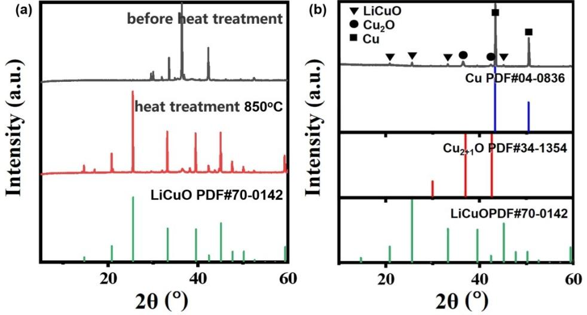
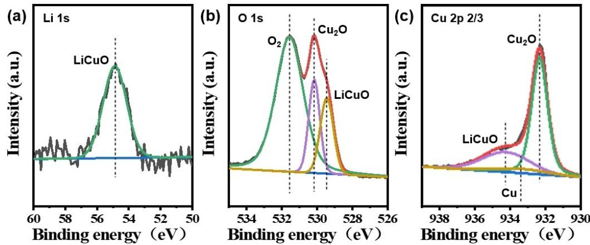
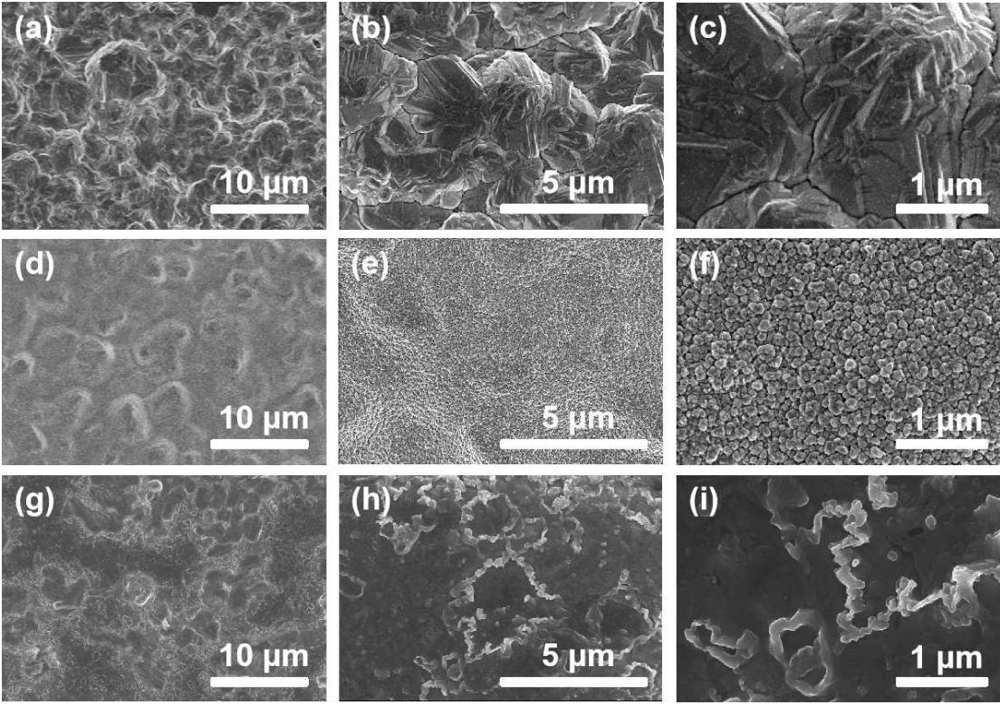
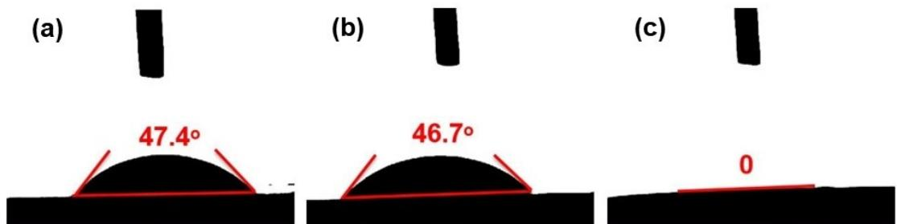
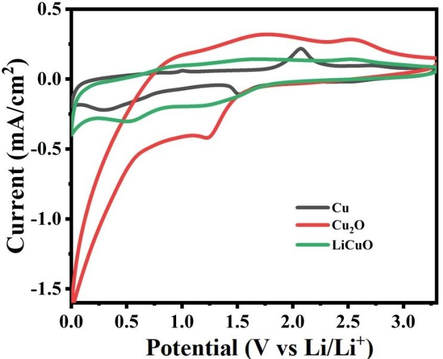
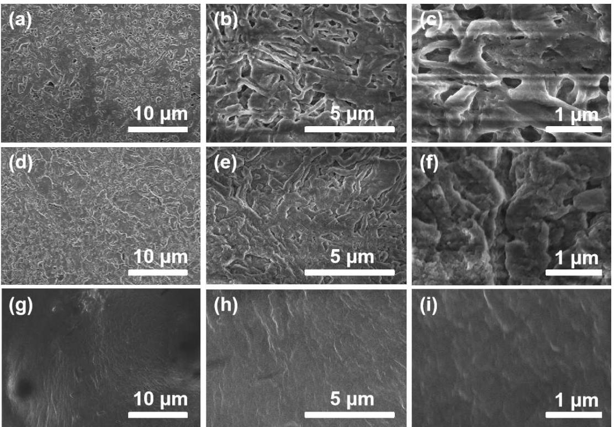
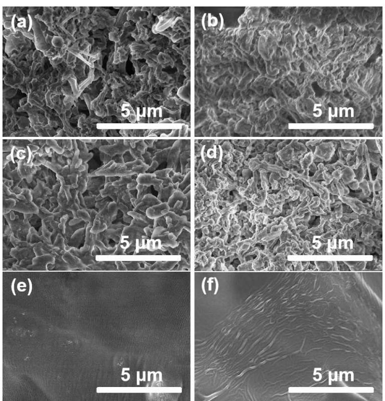
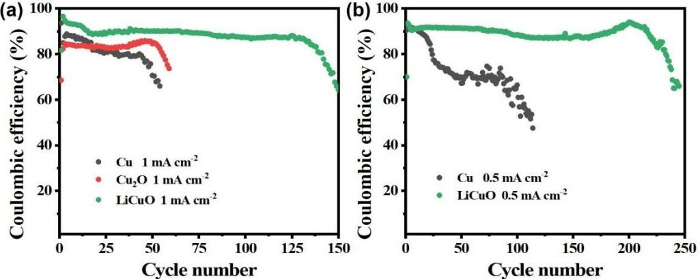
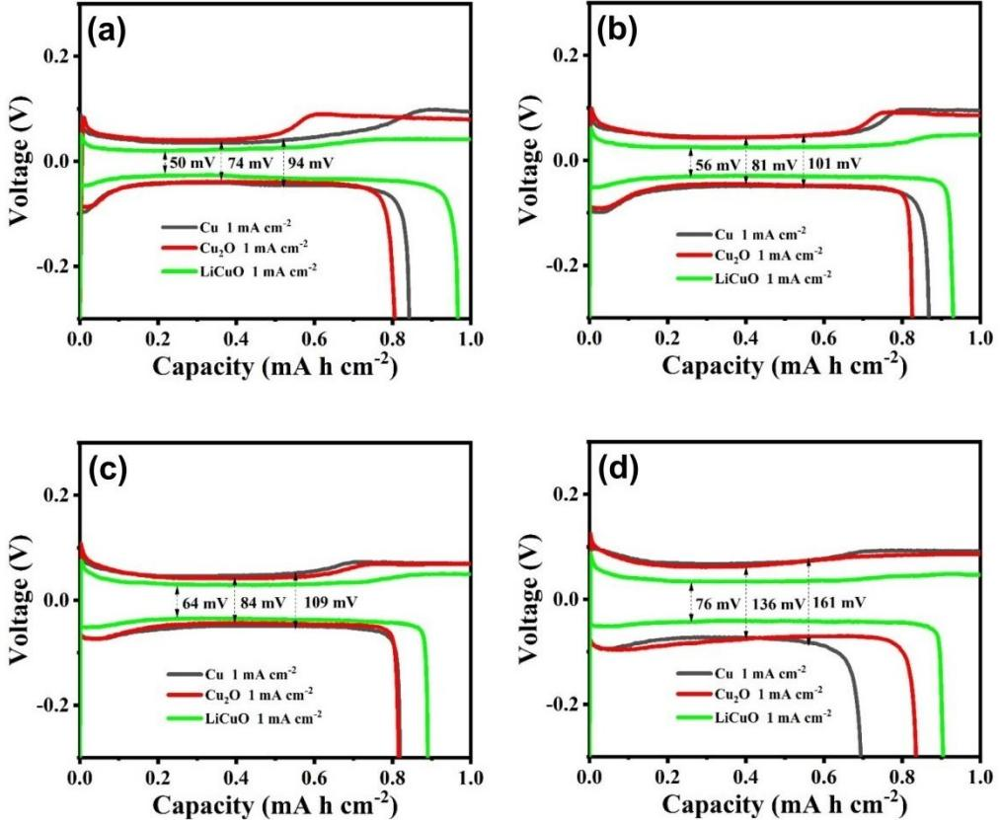
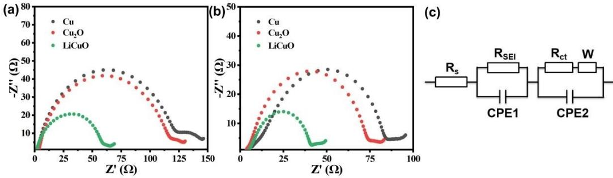

## z **Energy Technology & Environmental Science**

# **Modifying the Lithiophilicity of Cu2O/Cu Collector by LiCuO to Restrain Lithium Dendrite Growth**

Zhongzheng Zuo, Xianli [Huang,](http://orcid.org/0000-0002-5148-619X)\* Dongmei Zhuang, Qiliang Zhao, Tao Wang, and Jianping He\*[a]

Lithium dendrite growth has long been considered an obstacle to the practical application of lithium metal battery, which could be efficiently suppressed by increasing the lithiophilicity of Cu collector. Therefore, herein we developed a facile way to prepare LiCuO/Cu composite current collector, which shows better wettability with EC/EDC electrolyte than pure Cu2O layer. X-ray diffraction (XRD) analysis shows that there is a large amount of LiCuO on the surface of the anode. The nucleation overpotential of LiCuO/Cu composite current collector is only

### **Introduction**

Lithium metal anode, as a new generation of battery anode, has a high specific capacity (3860 mA h g 1 ) and a low potential (-3.040 vs SHE),[1] and therefore possess great research value and broad application prospects.[2] However, the dendrite growth and low Coulombic efficiency of lithium metal electrodes limit their wide application.[3] When the lithium metal is used as the negative pole of the battery, it is easy to form dendritic lithium during the deposition process.[4] The loose lithium dendrites on the electrode surface can easily fall off into the electrolyte to form dead lithium, which increases the interface impedance of the battery and further aggravates the low Coulombic efficiency of the electrode.[5] Furthermore, the loose lithium dendrite can also increase the battery electrolyte consumption, which can lead to a functional failure of the battery. If the lithium dendrite grows uncontrollably, the dendrite can finally puncture the battery separator and form a short circuit, leading to thermal runaway and even a fire or an explosion.[6] How to inhibit the growth of lithium dendrites and improve the Coulombic efficiency of lithium anode has become a research focus.

At present, there are several methods to suppress the growth of lithium dendrite: (1) modification of solid electrolyte interphase (SEI) layer, including in situ and non-in-situ modification.[7] In situ modification is the electrolyte modifica-

[a] *Z. Zuo, Prof. X. Huang, D. Zhuang, Q. Zhao, Prof. T. Wang, Prof. J. He* Department of Applied Chemistry, Nanjing University of Aeronautics and Astronautics, 211106, Nanjing, Jiangsu Province, People's Republic of China E-mail: xianlihuang@nuaa.edu.com jianph@nuaa.edu.cn Supporting information for this article is available on the WWW under

*ChemistrySelect* **2022**, *7*, e202201311 (1 of 9) © 2022 Wiley-VCH GmbH

<https://doi.org/10.1002/slct.202201311>

26 mV in the electrodeposition curve. At a current density of 1 mA/cm2 , the Li Cu cell with the as-prepared LiCuO/Cu anode, can keep more than 85% Coulombic efficiency for more than 125 cycles. Impedance spectra of electrodes image show that the impedance of LiCuO/Cu composite current collector is only 60 Ω at the initial stage, which can promote the transfer of Li+ at the collector surface and thus inhibit the formation of lithium dendrites on the electrode surface.

tion, where the soluble components directly participate in the formation of SEI layer.[8] Such additives as FEC(4-fluoro-1,3 dioxolan-2-one),[9] VC(vitamin C),[10] LiNO3, [11] LiF,[12] Cs+ are added to the electrolyte.[13] The strength of SEI layer can be improved by changing the composition of SEI layer. Non-in-situ modification means that the lithium metal reacts with the chemical substance to form a protective film before the battery is assembled.[14] Directly exposing lithium tablets to certain gases or solvents, such as nitrogen,[15] fluorine,[16] PVDF (poly(1,1-difluoroethylene)),[17] DMSO(dimethyl sulfoxide) solvent,[18] can obtain a protective layer with high mechanical strength and maintain high chemical stability in the electrolyte, to prevent lithium from reacting with other components.

(2) Collector modification. The three-dimensional structure can provide a good capacity for lithium metal and reduce the impact of lithium volume expansion and local current density.[19] Common three-dimensional skeletons are nickel foam,[20] copper foam,[21] carbon.[22] In addition to increasing the surface area of the collector by constructing a three-dimensional framework, changing the lithiophilic property with lithium metal of the collector surface is also a good strategy.[23] Increasing the lithiophilic property with lithium metal of the collector surface can reduce the nucleation overpotential of the lithium metal, so that the sites of the lithium ion is not concentrated around some "hotspots".[24] Not only such lithiophilic elements as, Pt, Al, Mg, Zn, Ag, Au and so on were introduced,[25] but also some metal oxides such as CuO,[26] Cu2O,[27] ZnO,[28] Al2O3, [29] MgO were applied to suppressing the lithium dendrite.[30] All these lipophilic compounds can reduce the nucleation overpotential and the actual current density of the lithium metal, thus inhibiting the growth of the lithium dendrite.

Typically, in-situ Cu2O lithiophilic layer could be readily prepared onto the Cu foil, which has restrained the growth of lithium dendrite and improved the Coulombic efficiency.[27]

However, the as-prepared Cu2O layer has a limited lithiophilicity, which needs to be increased further. Therefore, in this work, we attempted to prepare LiCuO/Cu composite collector on copper foil by a simple heat treatment method, whose electrochemical properties and properties were tested. The experimental results show that the electrode has good lithiophilic properties with lithium metal, which help reduce the electrochemical impedance, and further inhibit the growth of lithium dendrite.

## **Results and Discussion**

#### **Microstructure of LiCuO/Cu Composite Current Collector**

In order to prove the availability of our method, we heattreated Cu2O and LiOH stoichiometrically-mixed power at 850°C, which was analyzed by XRD, as shown in Figure 1a. The XRD pattern of the sample after heat treatment corresponds to the standard card of LiCuO. The results show that LiCuO can be successfully prepared by this method.

We then tested the LiCuO/Cu composite current collector by XRD, which is shown in Figure 1b. From Figure 1b, it can be seen that there are peaks corresponding well to that of LiCuO at 20.8°, 25.6°, 33.2° and 45.1°, respectively. Besides, there are also some peaks corresponding well to that of Cu2O at 37.0°, 42.6°, and peaks corresponding to Cu at 43.3°, 50.4°. The results show that the composite collector composed of LiCuO was successfully prepared by this method. The composite collector retains the Cu2O phase because the Li2O volatilized during high temperature heat treatment is not enough to allow the deeper Cu2O in the collector to react completely.

The LiCuO/Cu composite current collector was further analyzed by XPS, as shown in Figure 2. Li 1s in Figure 2a. shows a signal peak at 54.8 eV, which is close to the previously reported signal peak at 54 eV of Li2O, and is presumably the Li+ signal peak for LiCuO.[31] O 1s spectrum in Figure 2b. shows three signal peaks at 531.5 eV, 530.1 eV and 529.4 eV, respec-

**Figure 1.** XRD of samples of (a) LiOH powder mixes with Cu2O powder before and heat treatment (b) LiCuO /Cu composite current collector.

**Figure 2.** XPS of samples of Li 1s(a), O 1s (b), Cu 2p 2/3 (c).

tively. Among them, 531.5 eV is O2 adsorbed on the collector, and the other peak at 530.1 eV is ascribed to that of O2 in Cu2O, while the peas at 529.4 eV belongs to that of O2 in LiCuO.[32] In Figure 2c, there are two signal peaks, Cu+ in Cu2O at 932.3 eV and Cu+ in LiCuO at 934.1 eV.[33] The results of XPS analysis are consistent with those of XRD.

Then, the morphology and structure of LiCuO/Cu composite current collector were observed by SEM of different collectors at different magnification. Figure 3a-c. shows the bulk particle morphology of the copper foil itself. As shown in Figure 3d-f, after 250°C heat treatment and oxidation, some fine spherical particles appear on the surface of the copper, which is the morphology of Cu2O. In Figure 3g-i. the surface of the collector is obviously covered with a layer of material, which can be inferred as LiCuO by XRD. We can see some concentrated distribution of the particle structure on the surface of the composite collector. This may be due to the formation of LiCuO and the agglomeration of LiCuO on the surface of the composite collector during high temperature heat treatment with LiOH as the raw material.

#### **LiCuO/Cu (g-i) composite current collector**

The contact angles of Cu collector, Cu2O/Cu composite current collector and LiCuO/Cu composite current collector with 1 m LiPF6-EC/DEC electrolyte were measured, shown in Figure 4a-c. which are 47.4°, 46.7° and 0, respectively. It can be found that the contact angle of LiCuO/Cu collector is the smallest, which indicates that LiCuO has the best wettability with the electrolyte. The small contact is beneficial to the nucleation process of lithium ions in the electrolyte. This could lead to an even crystallization process of lithium metal by lateral spreading

**Figure 3.** SEM of Cu (a-c) current collector, Cu2O/Cu (d-f) composite current collector,

**Figure 4.** Contact angles with 1 m LiPF6-EC/DEC electrolyte of Cu (a) current collector

rather than vertical stacking, which can bring about the inhibition effects of the collector against the dendrite growth.

#### **Analysis of Deposition Behavior of Lithium Metal**

In order to investigate the effect of LiCuO modification on the behavior of lithium deposition, we assembled lithium battery with LiCuO/Cu composite collector and set up charging and discharging program. Lithium metal of 1 mA h cm 2 was deposited on the current collector of battery discharge with 1 m LiPF6-EC/DEC, and then was charged to 0.3 V by the battery to remove the lithium metal. The morphology of lithium deposition was observed after several cycles. Before the later electrochemical test and analysis, in order to explain the effect of LiCuO layer process on the battery, we conducted CV cyclic voltammetry test on the LiCuO/Cu composite collector, as shown in Figure 5. It is worth noting that, different from the larger peak area of Cu2O/Cu composite collector, the peak area of LiCuO/Cu composite collector is much smaller and almost equal to that of Cu.[34] Especially, the height of the reduction peak of 0–0.5 V (vs Li+/Li) electrochemical window on the capacity of the battery is reduced, which should be ascribed to the fact that the consumption of the electrolyte is suppressed greatly. The effect is usually realized by constructing a robust SEI, which located between the Li anode and the electrolyte. Therefore, we can infer that the LiCuO/Cu composite collector can form a more stable SEI. It can reduce the unnecessary consumption of electrolyte and electrode, restrain the decomposition of electrolyte, and prevent the formation of lithium dendrites from being accelerated due to the electrolyte shortage.[35]

Figure 6. shows the morphology of lithium metal deposited on the commercial Cu foil collector, Cu2O/Cu composite current collector and LiCuO/Cu composite collector at a current density of 1 mAcm 2 with a capacity of 1 mA h cm 2 with 1 m LiPF6-EC/ DEC, respectively. Not surprisingly, as shown in Figure 6a-c, due to the bulk protrusions and pits on the surface of the copper foil, the surface of the deposited copper foil has a non-uniform morphology, and is of a curved and slender shape, which is typical of dendrite morphology. The as-deposited lithium layer has many holes, and the surface area is very huge, which means it is easy to cause a lot of electrolyte consumption.[34] However, the surface of Cu2O/Cu composite collector is more uniform and compact due to its relatively small particle size, as shown in Figure 6d-f. The surface of LiCuO/Cu composite current collector is the most uniform and compact because the surface of LiCuO is much flatter, shown in Figure 6g-i. The significant differences show that the LiCuO layer can assist the homogeneous and stable lithium deposition, and thus inhibit the growth of lithium dendrite.

Figure 7. demonstrates the morphology of lithium metal deposited on a commercial Cu foil current collector, Cu2O/Cu composite current collector and LiCuO/Cu composite current collector after 25th, 50th times of deposition/stripping at a current density of 1 mAcm 2 with a capacity of 1 mA h cm 2 in 1 m LiPF6-EC/DEC. We can observe the variance in surface morphology with the increase of lithium deposition times. For Cu collector and Cu2O/Cu composite collector, lithium dendrites become increasingly obvious with the increase of cycle number in Figure 7a–d. However, as shown in Figure 7e–f, the LiCuO/Cu composite current collector has a smooth morphology, and the dendrite morphology does not appear. The results also show that the LiCuO layer can assist the homogeneous and stable lithium deposition, and thus inhibit the growth of lithium dendrite.

**Figure 5.** CV of different electrodes composite current collector of 8 mVs 1 .

**Figure 6.** SEM of Li deposited on Cu (a-c) collector, Cu2O/Cu (d-f) composite current collector, LiCuO/Cu (g-i) composite current collector at 1 mAcm 2 and a capacity of 1 mA h cm 2 .

**Figure 7.** SEM of Li deposited on Cu collector (a-b) after 25th, 50th times deposition/stripping, Cu2O/Cu (c-d) composite current collector after 25th,50th times deposition/stripping, LiCuO/Cu (e-f) composite current collector after 25th,50th times deposition/stripping at 1 mAcm 2 density and a capacity of 1 mA h cm 2

#### **The Electrochemical Performance Analysis of LiCuO/Cu Composite Collector**

The electrochemical performance of LiCuO/Cu composite current collector was investigated, and the Li/Cu semi-battery was fabricated. In the semi-battery, Cu collector, Cu2O/Cu composite collector and LiCuO/Cu composite collector are used as the working electrode directly.The cyclic stability, Coulombic efficiency and charge-discharge performance of the as-prepared battery are tested by a galvanostatic charge-discharge method. Figure 8. compares the charge-discharge curve of the half-cell during the first charge. At the current density of 1 mAcm 2 in 1 m LiPF6-EC/DEC, Cu collector has a large nucleation overpotential about 140 mV. By contrast, the nucleation overpotential of Cu2O/Cu composite collector and LiCuO/Cu composite collector is 77 mV and 26 mV, respectively. The reduction of overpotential indicates that the existence of Cu2O and LiCuO can effectively reduce the heterogeneous nuclear potential barrier, make the steps of lithium metal nucleation easier, and promote the uniform distribution of lithium metal deposition behavior on the collector surface, to suppress the lithium dendrite.[25] On the other hand, Cu2O/Cu composite collector and LiCuO/Cu composite collector both showed line tilt in the early stage of lithium deposition process. This means that the collector provides some battery capacity due to the instability of the SEI of the Cu2O/Cu composite collector. The addition of LiCuO can reduce the occurrence of this condition at the initial stage of deposition. This phenomenon shows that the addition of LiCuO can stabilize SEI, reduce the unnecessary consumption of the electrolyte, promote the uniform distribution of lithium ion in the electrolyte, and inhibit the electrochemical performance of lithium dendrite. This result is consistent with previous CV tests.

The Figure 9a. compares the Coulombic efficiency after more than 100 cycles at 1 mAcm 2 current densitywith a capacity 1 mA h cm 2 in 1 m LiPF6-EC/DEC. The Coulombic efficiency of LiCuO/Cu composite current collector can still maintain above 85% after 125 charge-discharge cycles, while the Coulombic efficiency of Cu decreases rapidly at 50 cycles and that of Cu2O/Cu composite current at 60 cycles. The difference of the Coulombic efficiency for these types of current collector indicates that the SEI layer on the Cu surface is continuously destroyed and regenerated, which consumes a lot of lithium and forms a lot of lithium dendrites, the accumulation of dead lithium eventually leads to a rapid decrease in the Coulombic efficiency of the battery.[36] In Figure 9b, the LiCuO/Cu composite current cycle maintains 90% Coulombic efficiency until the Coulombic efficiency of more than 200 cycles begins to decline. But only after 100 cycles, the Cu collector failed completely.The failure of Cu collector should be due to the accumulation of dead lithium, causing a rapid decline of Coulombic efficiency and then functional failure. This can effectively illustrate the superiority of LiCuO for battery performance.

The lithium metal is used as the positive pole of the battery, and the different current collector is used as the negative pole of the battery. As shown in Figure 10a-d, the charge-discharge curves of Cu collector, Cu2O/Cu composite collector and LiCuO/ Cu composite collector at 2nd, 10th, 25th, and 50th cycles show that the semi-battery assembled with LiCuO/Cu composite collector has the minimum charge-discharge polarization potential. For the 2nd cycle, the polarization voltage of Cu collector reaches 94 mV, and that of the Cu2O/Cu composite collector reaches 74 mV, while that of the LiCuO/Cu composite collector reaches only 50 mV. At 10th cycle, the polarization voltage of Cu is 101 mV, and that of the Cu2O/Cu composite current collector is 81 mV, while that of the LiCuO/Cu

**Figure 8.** Voltage-Time profiles of Li deposition on different current collectors.

**Figure 9.** Coulombic efficiency of different current collectors at a current density of (a)1 mAcm 2 in the capacity of 1 mA h cm 2 (b)0.5 mAcm 2 in the capacity of 0.5 mA h cm 2 .

**Figure 10.** the corresponding discharge/charge profiles with different current collectors: (a) 2nd; (b) 10th; (c) 25th; (d) 50th.

composite current collector is 56 mV. At 25th cycle, the polarization voltage of Cu is 109 mV, and the Cu2O/Cu composite current collector is 84 mV, while the LiCuO/Cu composite current collector is only 64 mV. At 50th cycle, the polarization voltage of Cu is 161 mV, and the Cu2O/Cu composite current collector is 136 mV, while the LiCuO/Cu composite current collector is 76 mV. This indicates that the LiCuO/Cu composite current collector can form a stable SEI layer with good Li-ion channels during the charge-discharge process.

#### **Interfacial Properties of LiCuO/Cu Composite Collector**

The impedance of the lithium copper half-cell assembled by Cu, Cu2O/Cu composite collector and LiCuO/Cu composite collector was measured, depicted in Figure 11. It is found that

**Figure 11.** Impedance spectra of electrodes with different current collectors: (a) the initial cell after the first deposition; (b) charge and discharge for 50 cycles; (c) quivalent circuit diagram.

| Table 1. Electrochemical performance of different methods for inhibiting lithium dendrite growth. |                                                                                              |                             |                     |                              |                  |         |
|---------------------------------------------------------------------------------------------------|----------------------------------------------------------------------------------------------|-----------------------------|---------------------|------------------------------|------------------|---------|
| Sample                                                                                            | Nuclear overpotential [mV]                                                                | Coulombic efficiency [%] | Number of cycles | Polarization voltage [mV] | Impedance [Ω] | Ref.    |
| LiCuO                                                                                             | 26                                                                                           | 85                          | 125                 | 50                           | 60               | –       |
| PANa                                                                                              | 100                                                                                          | 85                          | 70                  | –                            | 25               | [38] a) |
| CsNO3                                                                                             | –                                                                                            | 80                          | 80                  | 60                           | 80               | [38] b) |
| DOLb -DMEc                                                                                     | 84                                                                                           | –                           | 15                  | 128                          | 75               | [38] c) |
| DOL-DMMd                                                                                          | 26                                                                                           | –                           | 115                 | 64                           | 55               | [38] c) |
|                                                                                                   | [a]: polyacrylonitrile; [b]: 1,3-dioxolane; [c]: 1,2-dimethoxyethane; [d]: dimethoxymethane. |                             |                     |                              |                  |         |

the impedance of half-cell after the first deposition is 120 Ω, that of Cu2O/Cu composite collector is 115 Ω, and that of LiCuO/Cu composite collector is only 60 Ω at the initial stage. The results show that LiCuO/Cu composite collector can keep the best affinity with the electrolyte, which is consistent with the contact angle test results. The impedance of the half-cell is reduced after 50 cycles of charge and discharge, because the interface charge and discharge of the cell is stable. The impedance of the half-cell of Cu is 85 Ω, the impedance of Cu2O/Cu composite collector is 72 Ω, and the impedance of the LiCuO/Cu composite collector is only 40 Ω. The low impedance indicates that LiCuO can increase the velocity of the interface shuttle of lithium ions in the SEI layer and decrease the impedance of the semi-battery.[37] Table 1. summarizes the electrochemical performance of some other methods for inhibiting the growth of lithium dendrites.

## **Conclusions**

In this paper, LiCuO/Cu composite current collector was prepared by a simple heat treatment method. The difference in the wettability of Cu collector, Cu2O/Cu composite collector and LiCuO/Cu composite collector for the electrolyte is studied by the contact angle test. The morphology of the composite collector before and after deposition and after charging and discharging was observed. And a lithium copper half-cell was assembled to investigate its electrochemical properties (nucleation overpotential, polarization, Coulombic efficiency, Impedance spectra). It is concluded that LiCuO/Cu composite collector has the best wettability with the electrolyte. No lithium dendrite structure was found on the LiCuO/Cu composite collector after lithium deposition. The nucleation overpotential of LiCuO/Cu composite current collector is only 26 mV in the electrodeposition curve. Under the current density of 1 mA/cm2 , the as-prepared Li Cu cell can keep more than 85% Coulombic efficiency for more than 125 cycles. Impedance spectra of electrodes image shows that the impedance of LiCuO/Cu composite current collector is only 60 Ω at the initial stage. LiCuO through Cu2O/Cu collector by adding LiOH can inhibit the growth of lithium dendrite. Our method provides a simple and feasible method for inhibiting the growth of lithium dendrites. This work provides more ideas for increasing the lithiophilic property with lithium metal of the current collector to inhibit the growth of lithium dendrite.

## **Supporting Information Summary**

All experimental details can be found in the Supporting Information.

## *Acknowledgements*

*This work is supported financially by A Project funded by the Priority Academic Program Development of Jiangsu Higher Education Institutions (PAPD).*

## *Conflict of Interest*

There are no conflicts to declare.

## **Data Availability Statement**

The data that support the findings of this study are available on request from the corresponding author. The data are not publicly available due to privacy or ethical restrictions.

**Keywords:** copper **·** dendrite growth **·** lithium **·** lithium anode **·** lithium metal battery

- [1] a) M. D. Tikekar, S. Choudhury, Z. Tu, L. A. Archer, *Nat. Energy.* **2016**, *1*, 40–46; b) J. M. Tarascon, M. Armand, *Nat. Energy.* **2001**, *414*, 359–367; c) W. J. Zhang, *J. Power Sources.* **2011**, *196*, 13–24; d) D. C. Lin, Y. Y. Liu, Y. Cui, *Nanotechnology* **2017**, *12*, 194–206.
- [2] a) W. Y. Zhang, J. L. Li, H. X. Chen, H. X. Jin, P. Li, Y. J. Zhang, C. Xu, S. M. Zhao, Y. Q. Du, J. X. Zhang, *ACS Nano.* **2020**, *15*, 15; b) F. X. Wu, J. Maier, Y. Yu, *Chem. Soc. Rev.* **2020**, *49*, 1569–1614.
- [3] L. Chen, X. L. Fan, X. Ji, J. Chen, S. Hou, C. S. Wang, *Joule.* **2019**, *3*, 732– 744.
- [4] M. Dolle, L. Sannier, B. Beaudoin, M. Trentin, J. M. Tarascon, *Electrochem. Solid-State Lett.* **2002**, *5*, A286–A289.
- [5] a) X. Shen, R. Zhang, P. Shi, X. Chen, Q. Zhang, *Adv. Energy Mater.* **2021**, *11*, 2003416; b) G. J. Xu, J. D. Li, C. Wang, X. F. Du, D. Lu, B. Xie, X. Wang, C. L. Lu, H. S. Liu, S. M. Dong, G. L. Cui, L. Q. Chen, *Angew. Chem. Int. Ed.* **2021**, *60*, 7770–7776.
- [6] M. S. Whittingham, *Chem. Rev.* **2004**, *104*, 4271–4301.
- [7] S. J. Liu, Y. Zhao, X. H. Li, J. Y. Yu, J. H. Yan, B. Ding, *Adv. Mater.* **2021**, *33*, 2008084.
- [8] H. Zheng, H. F. Xiang, F. Y. Jiang, Y. C. Liu, Y. Sun, X. Liang, Y. Z. Feng, Y. Yu, *Adv. Energy Mater.* **2020**, *10*, 2001440.
- [9] a) J. Heine, P. Hilbig, X. Qi, P. Niehoff, M. Winter, P. Bieker, *J. Electrochem. Soc.* **2015**, *162*, A1094-A1101; b) Dong, Q. Li, G. Cui, L. Chen, *Chem. Mater.* **2018**, *30*, 4039–4047.
- [10] D. Aurbach, E. Pollak, R. Elazari, G. Salitra, C. S. Kelley, J. Affinito, *J. Electrochem. Soc.* **2009**, *156*, A694-A702.
- [11] S. Choudhury, L. A. Archer, *Adv. Electron. Mater.* **2016**, *2*, 1500246.
- [12] F. Ding, W. Xu, G. L. Graff, J. Zhang, M. L. Sushko, X. Chen, Y. Shao, M. H. Engelhard, Z. Nie, J. Xiao, X. Liu, P. V. Sushko, J. Liu, J. G. Zhang, *J. Am. Chem. Soc.* **2013**, *135*, 4450–4456.
- [13] A. J. Li, X. B. Liao, H. R. Zhang, L. Shi, P. Y. Wang, Q. Cheng, J. Borovilas, Z. Y. Li, W. L. Huang, Z. X. Fu, M. Dontigny, K. Zaghib, K. Myers, X. Y. Chuan, X. Chen, Y. Yang, *Adv. Mater.* **2020**, *32*, 1905517.
- [14] Y. J. Zhang, W. Wang, H. Tang, W. Q. Bai, X. Ge, X. L. Wang, C. D. Gu, J. P. Tu, *J. Power Sources* **2015**, *277*, 304–311.
- [15] J. Zhao, L. Liao, F. Shi, T. Lei, G. Chen, A. Pei, J. Sun, K. Yan, G. Zhou, J. Xie, C. Liu, Y. Li, Z. Liang, Z. Bao, Y. Cui, *J. Am. Chem. Soc.* **2017**, 139, 11550–11558.
- [16] J. Lang, Y. Long, J. Qu, X. Luo, H. Wei, K. Huang, H. Zhang, L. Qi, Q. Zhang, Z. Li, H. Wu, *Energy Storage Mater.* **2019**, *16*, 85–90.
- [17] N. W. Li, Y. X. Yin, C. P. Yang, Y. G. Guo, *Adv. Mater.* **2016**, *28*, 1853–1858.
- [18] A. Fu, C. Z. Wang, J. Peng, M. Su, F. Pei, J. Q. Cui, X. L. Fang, J. F. Li, N. F. Zheng, *Adv. Funct. Mater.* **2021**, *31*, 2009805.
- [19] S. S. Chi, Y. Liu, W. L. Song, L. Z. Fan, Q. Zhang, *Adv. Funct. Mater.* **2017**, *27*, 1700348.
- [20] Q. Yun, Y. B. He, W. Lv, Y. Zhao, B. Li, F. Kang, Q. H. Yang, *Adv. Mater.* **2016**, *28*, 6932.
- [21] H. Wang, Y. Li, Y. Li, Y. Liu, D. Lin, C. Zhu, G. Chen, A. Yang, K. Yan, H. Chen, Y. Zhu, J. Li, J. Xie, J. Xu, Z. Zhang, R. Vila, A. Pei, K. Wang, Y. Cui, *Nano Lett.* **2019**, *19*, 1326–1335.
- [22] S. H. Hong, D. H. Jung, J. H. Kim, Y. H. Lee, S. J. Cho, S. H. Joo, H. W. Lee, K. S. Lee, S. Y. Lee, *Adv. Funct. Mater.* **2020**, *30*, 1908868.
- [23] T. C. Liu, S. Q. Chen, W. W. Sun, L. P. Lv, F. H. Du, H. Liu, Y. Wang, *Adv. Funct. Mater.* **2021**, *31*, 2008514.
- [24] K. Yan, Z. Lu, H. W. Lee, F. Xiong, P. C. Hsu, Y. Li, J. Zhao, S. Chu, Y. Cui, *Nat. Energy.* **2016**, *1*, 16010.
- [25] Z. Zhang, X. Xu, S. Wang, Z. Peng, M. Liu, J. Zhou, C. Shen, D. Wang, *ACS Appl. Mater. Interfaces.* **2016**, *8*, 26801–26808.
- [26] D. Zhuang, X. Huang, Z. Chen, H. Gong, L. Sheng, L. Song, T. Wang, J. He, *J. Power Sources.* **2020**, *458*, 228055.
- [27] S. Liu, X. Xia, Z. Yao, J. Wu, L. Zhang, S. Deng, C. Zhou, S. Shen, X. Wang, J. Tu, *Small Methods.* **2018**, *2*, 1800035.
- [28] Y. Zhang, B. Liu, E. Hitz, W. Luo, Y. Yao, Y. Li, J. Dai, C. Chen, Y. Wang, C. Yang, H. Li, L. Hu, *Nano Res.* **2017**, *10*, 1356–1365.
- [29] C. Jin, O. Sheng, Y. Lu, J. Luo, H. Yuan, W. Zhang, H. Huang, Y. Gan, Y. Xia, C. Liang, J. Zhang, X. Tao, *Nano Energy.* **2018**, *45*, 203–209.
- [30] Y. Yu, Y. Shi, C. H. Chen, *Nanotechnology* **2007**, *18*, 055706.
- [31] H. Tissot, C. Wang, J. H. Stenlid, M. Panahi, S. Kaya, M. Soldemo, M. G. Yazdi, T. Brinck, J. Weissenrieder, *J. Phys. Chem. C.* **2019**, *123*, 22172– 22180.
- [32] Y. J. Chen, M. H. Li, J. C. A. Huang, *P. Chen, Sci. Rep.* **2018**, *8*, 7646.
- [33] S. F. Liu, X. Ji, J. Yue, S. Hou, P. F. Wang, C. Y. Cui, J. Chen, B. W. Shao, J. R. Li, F. D. Han, J. P. Tu, C. S. Wang, *J. Am. Chem. Soc.* **2020**, *142*, 2438– 2447.
- [34] J. Qian, W. Xu, P. Bhattacharya, M. Engelhard, W. A. Henderson, Y. Zhang, J. G. Zhang, *Nano Energy.* **2015**, *15*, 135–144.
- [35] Y. Guo, H. Li, T. Zhai, *Adv. Mater.* **2017**, *29*, 1700007.
- [36] J. Y. Hwang, S. J. Park, C. S. Yoon, Y. K. Sun, *Energy Environ. Sci.* **2019**, *12*, 2174–2184.
- [37] a) S. C. Li, D. M. Peng, J. G. Yu, *Ionics.* **2020**, *26*, 3979–3988; b) H. Lin, K. H. Chen, Y. Shuai, X. He, K. Ge, *J. Cent. South Univ.* **2018**, *25*, 719–728; c) H. Y. Xu, Q. Li, H. Y. Pan, J. L. Qiu, W. Z. Cao, X. Q. Yu, H. Li, *Chin. Phys. B.* **2019**, *28*, 078202.

Submitted: April 3, 2022 Accepted: May 11, 2022