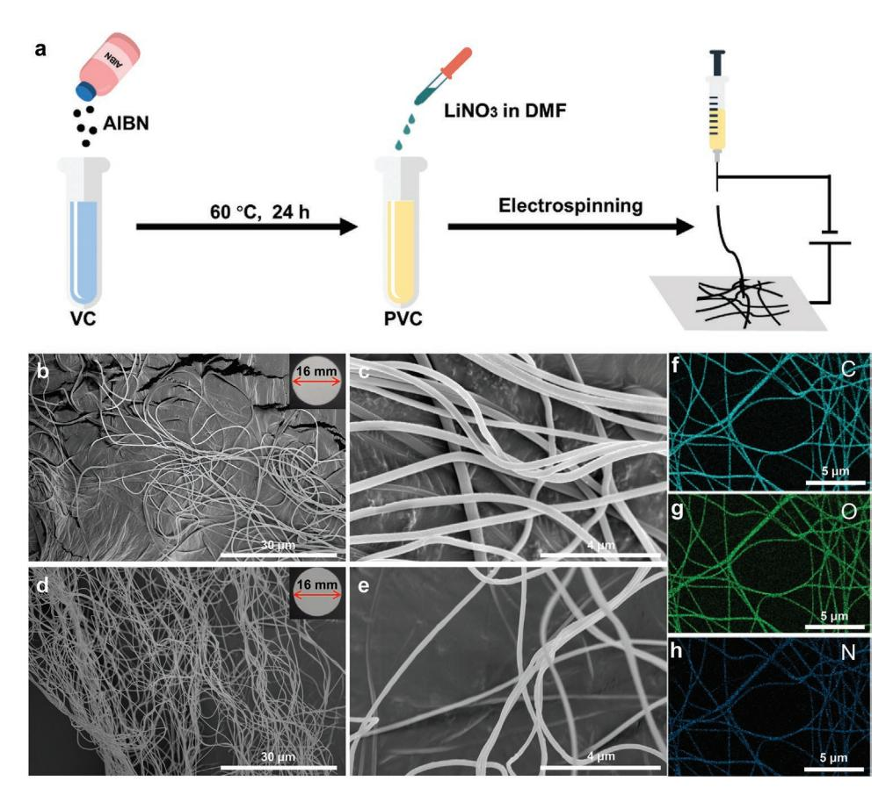
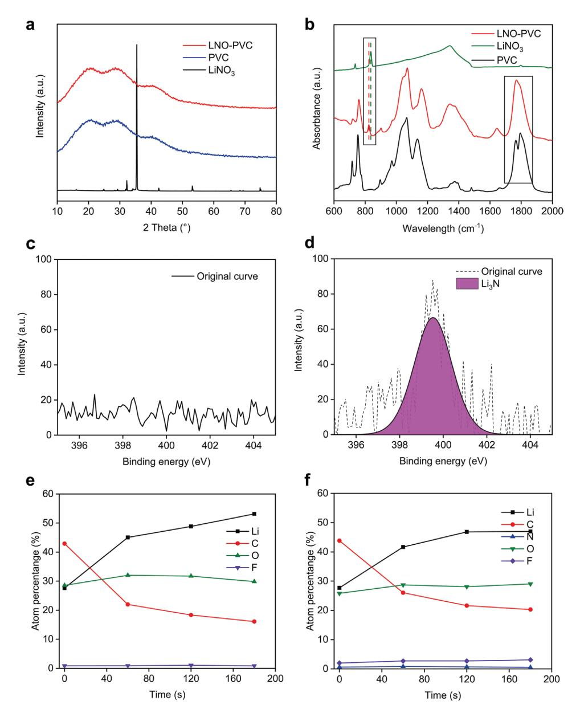
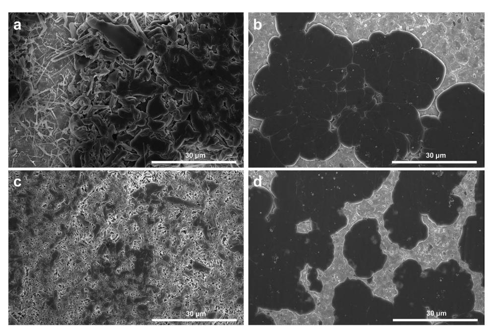
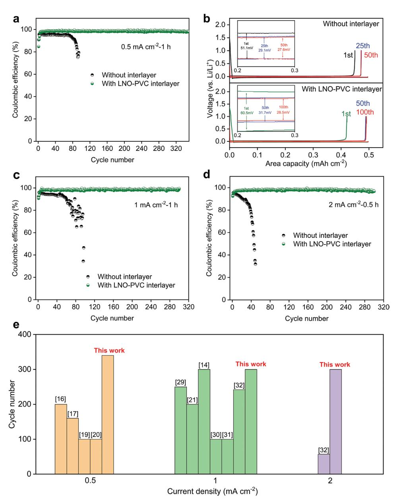
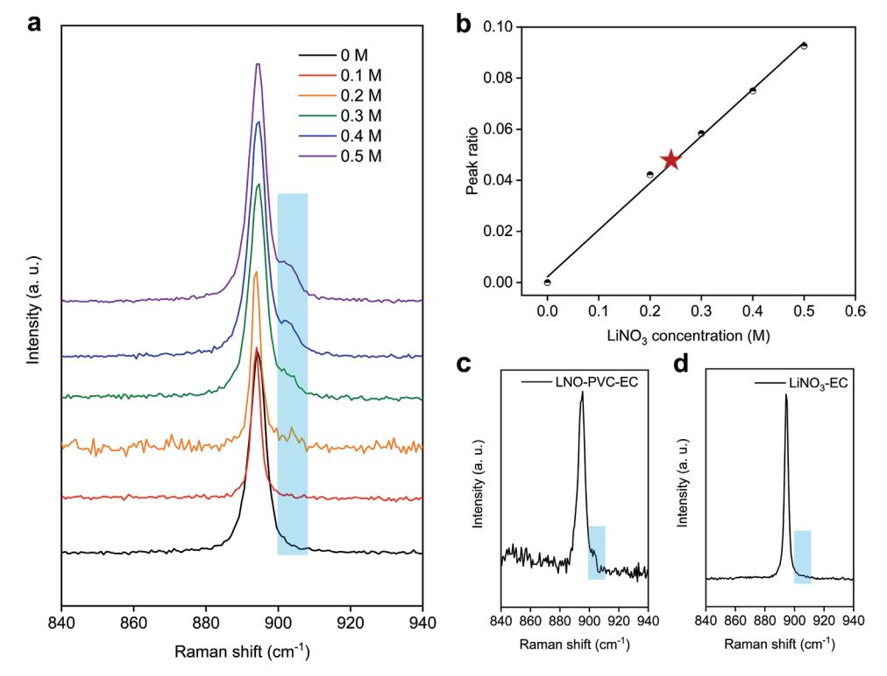
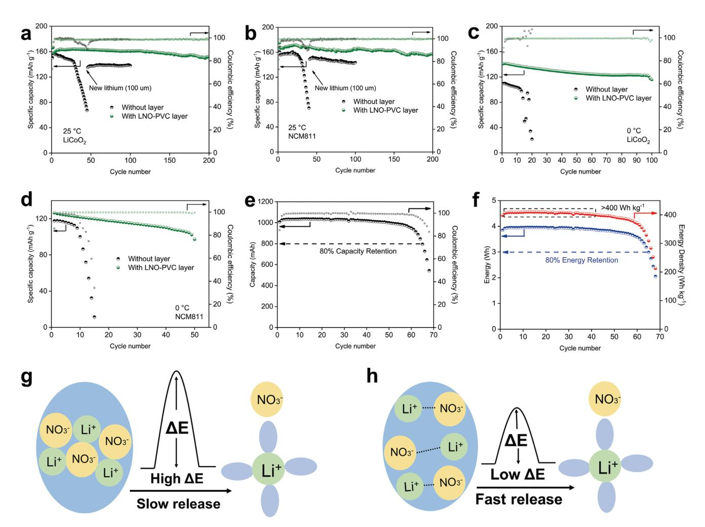

# **An Interlayer Containing Dissociated LiNO3 with Fast Release Speed for Stable Lithium Metal Batteries with 400 Wh kg−1 Energy Density**

*Huicong Yang, Qingyun Liu, Yaozu Wang, Zhuoting Ma, Pei Tang, Xiaoyin Zhang, Hui-Ming Cheng, Zhenhua Sun,\* and Feng Li\**

**Lithium metal is an ideal electrode material for future rechargeable batteries. However, dendrite formation and unstable solid electrolyte interphase film lead to safety concerns and poor Coulombic efficiency (CE). LiNO3 significantly improves the performance of the lithium metal anode in ester electrolytes but its use is restricted by low solubility. To increase the content of LiNO3 in the cell, a poly-(vinyl carbonate) organogel interlayer containing dissociated LiNO3 (LNO-PVC) is placed between the cathode and anode. The dissociated LiNO3 effectively increases the LiNO3-release rate and compensates for the LiNO3 consumed in ester electrolytes during cycling. Via this interlayer, the performance of the lithium metal anode is significantly improved. The average CE of a Li-Cu cell reaches 98.6% at 0.5 mA cm−2 -1 h and 98.5% at 1 mA cm−2 -1 h for 300 cycles. Also, a Li**||**NCM811 pouch cell with LNO-PVC interlayer can also reach a 400 Wh kg−1 energy density with a cycling life of 65 cycles. This strategy sheds light on the effect of the state of this salt on its release/dissolution kinetics, which is determined by the interactions between the salt and host material.**

H. Yang, Q. Liu, Y. Wang, Z. Ma, P. Tang, X. Zhang, H.-M. Cheng, Z. Sun, F. Li Shenyang National Laboratory for Materials Science Institute of Metal Research Chinese Academy of Sciences Shenyang 110016, China E-mail: zhsun@imr.ac.cn; fli@imr.ac.cn H. Yang, Q. Liu, Y. Wang, P. Tang, X. Zhang, Z. Sun, F. Li School of Materials Science and Engineering University of Science and Technology of China Shenyang 110016, China Z. Ma Department of Biochemistry and Molecular Biology College of Life Science China Medical University Shenyang 110122, China H.-M. Cheng Institute of Technology for Carbon Neutrality Shenzhen Institute of Advanced Technology Chinese Academy of Sciences Shenzhen 518055, China F. Li Dalian National Laboratory for Clean Energy

Dalian 116023, China

The ORCID identification number(s) for the author(s) of this article can be found under https://doi.org/10.1002/smll.202202349.

#### **DOI: 10.1002/smll.202202349**

## **1. Introduction**

Owing to its advantages such as a high specific capacity (3860 mAh g−1 ) and low redox potential (−3.045 V versus standard hydrogen electrode), lithium metal has been considered the most promising anode material for lithium-based batteries with a high energy density.[1–3] However, the use of a lithium metal anode has been difficult to achieve for two reasons, dendrite formation and the formation of an unstable solid electrolyte interphase (SEI) film[4–7] between it and the electrolyte. The dendrites formed during lithium electrodeposition lead to internal short-circuiting of the cell and cause safety issues, such as ignition or explosion, and the unstable SEI film causes a low Coulombic efficiency (CE) and shortens the cycling life of the batteries. Compared with ether electrolytes, these problems are much more

serious in ester electrolytes,[8–11] which are the most promising electrolytes to pair a lithium metal anode with high voltage cathode materials, such as LiCoO2 and LiNiCoMnO layered oxide cathodes (NCM). LiNO3 is a commonly used additive to solve these problems in ether electrolytes[12,13] and also has a significant efficacy in ester electrolytes.[14,15] However, the low solubility in ester electrolytes has limited the improvement in the electrochemical performance of the lithium metal anode. To increase the solubility of LiNO3, modifying the composition of the ester electrolyte has been widely investigated, such as the use of new solvents/additives with a high donor number,[16] high permittivity,[17,18] or unique molecular structure.[19] However, the amount of LiNO3 dissolved in these modified electrolytes is no more than 0.3 M, which is unable to maintain a high CE or good stability for many cycles. Such strategies also have to consider whether the new solvents/additives are stable against the lithium metal anode to avoid decreasing the electrochemical performance[20] which should be significantly improved by the increased amount of dissolved LiNO3.

Placing an interlayer material containing a large amount of LiNO3 between the cathode and anode during cell fabrication may be a promising way to overcome the LiNO3 solubility limit in ester electrolytes. With a sustained release of LiNO3 from the interlayer, the consumed LiNO3, which is initially dissolved in the electrolyte, can be continuously replaced during cycling, maintaining the good stability of the lithium metal anode. Such a film was prepared by blade-coating using LiNO3 particles with a diameter of ≈60 nm dispersed in poly-(vinylidene fluorideco-hexafluoropropylene) (PVDF-HFP). With the continuous release of LiNO3, the CE stability of the lithium metal anode was increased to 200 cycles at 1 mA cm−2-1 h.[21] It is believed that the interlayer material may be modified to improve the performance of the lithium metal anode by: 1) having a porous structure to allow easy Li+ migration, and 2) making the release rate of LiNO3 from it fast enough to offset the consumption of NO3 − during cycling.

To realize the above, a porous interlayer composed of PVC host material containing LiNO3 (LNO-PVC) was prepared by electrospinning. PVC was selected as the host material because its monomer structure is similar to ethylene carbonate (EC), in which LiNO3 has good solubility.[22,23] LiNO3 in PVC exists in the dissociated state rather than the crystalline state, which facilitates the release of LiNO3 into the electrolyte during cycling. In addition, designing a fibrous microstructure of the interlayer can facilitate Li+ migration. With this LNO-PVC interlayer, the average CE of a Li-Cu cell is as high as 98.6% at 0.5 mA cm−2 -1 h and 98.5% at 1 mA cm−2-1 h for more than 300 cycles. In addition, Li||LiCoO2 and Li||NCM811 full cells have a significantly improved electrochemical performance at both room temperature and 0 °C. Also, a Li||NCM811 pouch cell with LNO-PVC interlayer can reach a 400 Wh kg−1 energy density with a cycling life of 65 cycles.

### **2. Results and Discussions**

The preparation of the LNO-PVC interlayer is shown in **Figure 1**a. First, the PVC host material was synthesized by the polymerization of vinylene carbonate (VC) with azobisisobutyronitrile (AIBN) as an initiator. The prepared PVC was then mixed with an *N*,*N*-dimethylformamide (DMF)-LiNO3 solution by magnetic stirring to form a gelatinous solution. Finally, the LNO-PVC interlayer was prepared by electrospinning from this gelatinous solution. A PVC interlayer was also prepared using the DMF solvent instead of a DMF-LiNO3 solution.

As shown in Figure 1b–e, self-supporting PVC (Figure 1b, inset) and LNO-PVC (Figure 1c, inset) interlayers were obtained by electrospinning. Both the PVC (Figure 1b,c) and LNO-PVC interlayer fibers (Figure 1d,e) have a similar fibrous microstructure and the diameter of both fibers is ≈300 nm. The surfaces of the two kinds of fibers are quite smooth and no LiNO3 particles can be found on the LNO-PVC fibers, indicating that LiNO3 is dispersed inside the PVC fibers. From the energy dispersive X-ray spectroscopy (EDS) elemental maps of the LNO-PVC interlayer, it is found that N (Figure 1h), C (Figure 1f),

**Figure 1.** Preparation and morphologies of the LNO-PVC interlayer. a) Preparation of the LNO-PVC interlayer. b,c) SEM images of a PVC interlayer at b) low and c) high magnifications. Inset in (b) is a photograph of a PVC interlayer. d,e) SEM images of LNO-PVC interlayer at d) low and e) high magnifications. Inset in (d) is photograph of an LNO-PVC interlayer. f–h) EDS elemental maps of an LNO-PVC interlayer for f) C, g) O, and h) N.

and O (Figure 1g) are uniformly dispersed in the fibers. The N-kα peak at 0.392 keV is clearly observed in the EDS spectra (Figure S2, Supporting Information) and the N content is 6.22 wt% (Table S1, Supporting Information), while no N signal is observed in the PVC interlayer (Figures S3 and S4, Supporting Information). Elemental analysis and thermogravimetric analysis (TGA) were used to quantitively measure the amount of LiNO3 in the LNO-PVC interlayer. According to elemental analysis, the amounts of elemental C, N, and O are 42.6, 3.6, and 53.8 wt% in the LNO-PVC interlayer (Table S3, Supporting Information), respectively. The calculated amount of LiNO3 is 19.1 wt% from the C/N or O/N ratio. The TGA result is shown in Figure S5, Supporting Information. After being heated to 800 °C in air, the residual mass of Li2O converted from LiNO3 is 4.0 wt%, and the calculated amount of LiNO3 is 18.3 wt%. Both elemental analysis and TGA results show a higher amount of LiNO3 than during the preparation process. This is because the PVC prepared using this process has a low degree of polymerization[24] and residual VC molecules were volatilized during electrospinning.

X-ray diffraction (XRD) and Fourier transform infrared spectroscopy (FTIR) were also used to characterize the state of LiNO3 in the LNO-PVC interlayer. According to the XRD patterns shown in **Figure 2**a, the LiNO3 particles are crystalline with peaks for the (104), (006), and (018) planes at 32.1°, 35.3°, and 53.0°, respectively. The PVC interlayer shows only

**Figure 2.** Spectrum characterizations of the LNO-PVC interlayer and SEI. a) XRD patterns of LiNO3, and PVC and LNO-PVC interlayers. b) FTIR spectrum of LiNO3, and PVC and LNO-PVC interlayers. c,d) N-1s XPS and e,f) XPS depth profiles of the SEI film formed in the cells c,e) without interlayer and d,f) with LNO-PVC interlayer.

**Figure 3.** Morphologies of electrodeposited lithium. a) In cells without and b) with an LNO-PVC interlayer at 0.1 mA cm-2-5 h, and c) without and d) with an LNO-PVC interlayer at 0.5 mA  $cm^{-2}$ -1 h.

three broad peaks at 20.4°, 28.6°, and 40.9°. The LNO-PVC interlayer has the same XRD pattern as the PVC interlayer, with no obvious  $LiNO_3$  peaks, which indicates that the  $LiNO_3$ is in a dissociated rather than a crystalline state in the LNO-PVC interlayer. To confirm this, FTIR was conducted to analyze the interactions between PVC and LiNO3. PVC shows a typical  $C=0$  stretching band at 1794.0 cm-1 and Fermi resonance at 1765.5 cm-1 (Figure 2b, black curve)[25] while LiNO3 shows a typical peak at 836.5  $\text{cm}^{-1}$  (Figure 2b, green curve), representing the interactions between  $Li^+$  and  $NO_3^-$  in the crystalline state. When LiNO3 was added to the PVC fibers, both the LiNO3 and PVC characteristic peaks were changed (Figure 2b, red curve). The relative intensity between the Fermi resonance and the  $C=0$  stretching band of LNO-PVC increased compared with the original value in PVC, indicating that some C=O in PVC is coordinated with Li+,[26] which can only come from the dissociation of LiNO3. The other change observed is that the peak at 836.5 cm $-1$  of original LiNO3 has shifted to 823.5 cm $-1$ , indicating the dissociation of LiNO3 in PVC.[27] Transference number measurement was conducted to further confirm the dissociation of LiNO3 in the LNO-PVC interlayer. As shown in Figure S6, Supporting Information, the LNO-PVC film made by blade coating was used to avoid the effect of porous inside the LNO-PVC interlayer and the transference number of Li+ is 0.16. All the XRD, FTIR, and transference number measurement results have confirmed that the LiNO3 in the LNO-PVC layer is dissociated to C=O coordinated  $Li^+$  and  $NO_3^-$ , which is different from that in a PVDF-HFP polymer.[21]

To confirm that LiNO3 in the LNO-PVC interlayer can be easily released, linear sweep voltammetry was conducted to monitor the electro-reduction of LiNO3. Compared with a Li-Cu cell without this interlayer, the cell with the LNO-PVC interlayer showed a weak peak at  $\approx$ 1.2 V (Figure S7, Supporting Information), representing the electro-reduction of  $LiNO_3$ .[19]

X-ray photoelectron spectroscopy (XPS) was used to characterize the composition difference of SEI films formed in the cells with and without LNO-PVC interlayer. As shown in Figure 2c, without LNO-PVC, the SEI film formed shows no N-1s intensity, while with LNO-PVC interlayer, a strong  $Li_3N$ peak at 398.5 eV is observed[17] (Figure 2d). The Li3N-rich SEI formed in the LiNO3-containing electrolyte can improve the electrochemical performance of lithium metal anode.[16] With the LNO-PVC interlayer, the amount of LiF in the SEI film is also increased (Figure 2e,f) which is attributed to the fact that LiNO3 produces a combined effect with fluoroethylene carbonate (FEC) in ester electrolytes that facilitates the electroreduction of FEC to LiF.[20,28]

The morphology of a lithium metal anode electrodeposited on a Cu foil was observed by SEM. As shown in Figure 3a, at 0.1 mA cm $-2$ -5 h, a dendritic morphology of lithium metal is observed in the cell without an LNO-PVC interlayer, while in the cell with LNO-PVC interlayer, bulk lithium metal is formed (Figure 3b). When increasing the rate of electrodeposition to  $0.5$  mA cm-2-1 h, more compact dendrites are observed in the cell without an LNO-PVC interlayer (Figure 3d), while the cell with an LNO-PVC interlayer still contains bulk lithium metal (Figure 3c). This result confirms that with the LNO-PVC interlayer,  $LiNO3$  is released from the PVC fibers into the electrolyte thus avoiding the formation of dendrites on the lithium metal anode.

The CE values of Li-Cu cells with/without an LNO-PVC interlayer are shown in **Figure 4**. At  $0.5$  mA cm-2-1 h, the Li-Cu cell without an LNO-PVC interlayer suffers a sharp decrease at the 85th cycle and the average CE calculated from the 11th to the 85th cycle is only 94.8%, whereas the cell with an LNO-PVC interlayer achieves an average CE of 98.6% even after 300 cycles (Figure 4a). The charge-discharge curves and polarization of Li-Cu cells with and without an LNO-PVC interlayer at 0.5 mA cm-2-1 h are shown in Figure 4b. The

**www.advancedsciencenews.com**

**www.small-journal.com**

**Figure 4.** CE tests of the cell with or without an LNO-PVC interlayer. a) CEs and b) charge–discharge curves of LiCu cells with or without an LNO-PVC interlayer at 0.5 mA cm−2 -1 h. Insets in (b) show the polarization with or without an LNO-PVC interlayer at different cycles. c,d) CEs of LiCu cells with or without an LNO-PVC interlayer at c) 1 mA cm−2 -1 h and d) 2 mA cm−2-0.5 h. e) Summary of the CEs for the galvanostatic Li plating/stripping processes and the number of cycles reported in ester-based electrolytes using LiNO3 additive.

LNO-PVC interlayer slightly increased the polarization. However, the porous structure of the LNO-PVC interlayer ensured that this is low with only a 4.1 mV overpotential increase at the 50th cycle (Figure 4b, inset). However, when a dense interlayer formed by blade-coating is used, the overpotential is dramatically increased to 41.3 mV (Figure S10, Supporting Information), which is higher than for the cell without an interlayer and with an LNO-PVC interlayer.

The thickness of accumulated dead lithium of Li-Cu cells during cycling was measured by focused ion beam slicing. As shown in Figure S11, Supporting Information, without an LNO-PVC interlayer, after 30 cycles the thickness of dead lithium has increased to ≈16.3 µm, while for the cell with an LNO-PVC interlayer it was ≈8.3 µm, half that in the cell without the interlayer. This result confirms that the LNO-PVC interlayer lowers the production of dead lithium during cycling and achieves a higher CE. When increasing the current density, the cells with an LNO-PVC interlayer maintain high CEs, with an average CE of 98.5% until the 300th cycle at 1 mA cm−2 -1 h and 97.9% at 2 mA cm−2 -0.5 h (Figure 4c,d), and the cycling life is higher than most current reports on using LiNO3 as an additive[29–32] (Figure 4e), while cells without an LNO-PVC interlayer suffer a much faster CE fade with increased current density. The CE of Li-Cu cells with a PVC interlayer was also tested at 1 mA cm−2 -1 h (Figure S12, Supporting Information), and showed a similar fade to that of the cell without an interlayer. This indicates that a PVC interlayer had no effect on the electrochemical performance of a lithium metal anode and the improved CE produced by an LNO-PVC interlayer is due to the release of LiNO3. The CEs of Li-Cu cells using electrolytes saturated with LiNO3 or containing suspended LiNO3 particles are shown in Figure S13, Supporting Information. Even though the amount of LiNO3 in the latter is much higher, the cells with both electrolytes show the same CE fade. This implies that the suspended LiNO3 particles, which are in the crystalline state, cannot release LiNO3 into the electrolyte during cycling to give a better CE performance, and that dissociating LiNO3 in an LNO-PVC interlayer, which can release LiNO3 during cycling, is more effective.

To confirm the faster release rate of dissociated LiNO3 in LNO-PVC than in crystalline LiNO3 particles, the dissolution rate of LiNO3 from LNO-PVC or LiNO3 particles into an EC solvent was measured in capillary tubes, and the sample preparation details are shown in Figure S14, Supporting Information. First, 0–0.5 M LiNO3-EC solutions were prepared, and the Raman spectra was obtained. As shown in **Figure 5**a, the EC solvent shows a ring breathing mode of free EC at 894 cm–1. [33] Once LiNO3 is added to the EC, a shoulder peak at 903 cm−1 appears, representing the ring breathing mode of EC coordinated with Li+ (EC-Li), and the intensity of this peak increases with LiNO3 concentration. The ratio of the EC-Li peak intensity to the total peak intensity (free EC peak and EC-Li peak) is linear with LiNO3 concentration, which can therefore act as an external standard (Figure 5b). LNO-PVC-EC and LiNO3-EC capillary tube samples were fabricated using an LNO-PVC interlayer or LiNO3 particles as solutes and EC as solvent and Raman spectra of both were collected. As shown in Figure 5c, after standing for 2 h at 40 °C, an obvious shoulder peak was observed in the LNO-PVC-EC sample, while there was no such peak in the LiNO3-EC sample (Figure 5d). The concentration of dissolved LiNO3 in the LNO-PVC-EC sample is ≈0.25 M according to the external standard curve (Figure 5b, star symbol). This result has proved that the dissociated LiNO3 in an LNO-PVC interlayer has a faster release rate than that of crystalline LiNO3 particles, and it is this that causes the improvement of the performance of the lithium metal anode.

LiLi symmetric cells with or without an LNO-PVC interlayer were tested, as shown in Figure S15, Supporting Information. At 1 mA cm−2 -1 h, the symmetric cell without an LNO-PVC interlayer maintained cycling stability for only ≈500 h, while the cell with an LNO-PVC interlayer was stable to 1000 h (Figure S15a Supporting Information). The electrochemical impedance spectrum (EIS) of LiLi symmetric cells was tested after different numbers of cycles. As shown in Figures S15b,d, Supporting Information, the cell without a LNO-PVC interlayer showed an increased ohmic resistance (*R*s) and charge transfer resistance (*R*ct) from the 10th cycle to the 30th cycle (Table S4, Supporting Information), indicating the accumulation of "dead lithium" caused by the unstable SEI film and dendritic morphology. With an LNO-PVC interlayer, both *R*s and *R*ct decreased slightly during cycling. Increasing the current density to 2 mA cm−2 -0.5 h, the LiLi symmetric cell without an LNO-PVC interlayer could be stably cycled for only 200 h,

**Figure 5.** LiNO3 release rate measurement. a) Raman spectra of 0–0.5 M LiNO3-EC solutions. b) External standard curve of peak ratio-LiNO3 concentration derived from Figure 5a. The star represents the LiNO3 concentration in the LNO-PVC-EC sample. c,d) Raman spectra of the c) LNO-PVC-EC and d) LiNO3-EC samples.

**www.small-journal.com**

**Figure 6.** Li||LiCoO2 and Li||NCM811 full cells tests. a,b) Cycling stability of a) Li||LiCoO2 and b) Li||NCM811 full cells with and without LNO-PVC interlayer at room temperature. c) Cycling stability of Li||LiCoO2 and d) Li||NCM811 full cells with and without an LNO-PVC interlayer at 0 °C. e) Capacity and CE of Li||NCM811 pouch cell with LNO-PVC interlayer. f) Energy and energy density of Li||NCM811 pouch cell with LNO-PVC interlayer. g) Crystalline LiNO3 with a high activation energy and slow LiNO3-release. h) Dissociated LiNO3 with a low activation energy and fast LiNO3-release.

while for the cell with the interlayer it was 300 h. These electrochemical results have confirmed that the continuous release of LiNO3 from an LNO-PVC interlayer stabilizes the SEI film and improves the performance of the lithium metal anode.

Li||LiCoO2 (4.4 V) and Li||NCM811 (4.3 V) full cell tests are shown in **Figure 6**. The loading of lithium metal anode is 1 mAh cm−2 so that the N/P ratio (area capacity of negative electrode to area capacity of positive electrode) of Li||LiCoO2 and Li||NCM811 full cell is 1:0.8 and 1:0.6, respectively. As shown in Figure 6a,b, the Li||LiCoO2 and Li||NCM811 full cells without LNO-PVC interlayer show fast capacity fade after the ≈30th cycle. After disassembling the full cells and changing the anode for 100 µm lithium foil as a new one, the capacity recovers. This result has confirmed that the fast capacity fade of the full cells without an LNO-PVC interlayer is caused by fast anode consumption. Full cells with an LNO-PVC interlayer have a much better cycling stability and the capacity retention after 200 cycles is 91.3% and 87.1% for Li||LiCoO2 and Li||NCM811 full cells, respectively. Figure 6c,d show the full cell performance with and without an LNO-PVC interlayer at 0 °C. Those without an LNO-PVC interlayer show a much faster capacity fade and a lower capacity than at room temperature while those with the interlayer maintain cycling stability for 100 and 50 cycles, respectively. A Li||NCM811 pouch cell of 1 Ah capacity with LNO-PVC interlayer was fabricated and also shows good cycling performance. As shown in Figure 6e, this pouch cell shows an initial capacity of 1007.45 mAh and an initial CE of 85.07% at a charge–discharge current of 100 mA. And in the following cycles, the discharge capacity slightly increases and the CE is over 99.5%. When taking the 80% capacity retention as the end of life of this pouch cell, the cycling life is 65 cycles. Once considering that the full weight of this pouch cell is only 9.66 g (Figure S16, Supporting Information), an over 400 Wh kg−1 energy density can be obtained (Figure 6f). The exceptional full cell and pouch cell cycling performance is attributed to the highly-stable lithium metal anode caused by fast LiNO3 release from the LNO-PVC interlayer. And this LNO-PVC interlayer also presents a good potential for practical application.

All the experimental results presented above have proved that the LiNO3-rich LNO-PVC interlayer improves the electrochemical performance of the lithium metal anode by fast LiNO3 release, which is attributed to the dissociated state of  $LiNO3$  in it. This fast  $LiNO3$  release is caused by the fact that the dissociated LiNO3 in LNO-PVC weakens the Coulombic force between Li+ and NO3-, while LiNO3 release from crystalline LiNO3 particles has to overcome this Coulombic force. Since the  $LiNO3$  release (or dissolution) process is affected by the activation energy ( $\Delta E$ ) of this reaction, the weakened Coulombic force has decreased the activation energy ( $\Delta E$ ) of LiNO3 release from the LNO-PVC interlayer, so a fast rate is obtained (Figure  $6g,h$ ).

#### 3. Conclusions

**DVANCED** IENCE NEWS www.advancedsciencenews.com

To overcome the limited solubility of LiNO3 in ester electrolytes and improve the electrochemical performance of a lithium metal anode, a LiNO3-rich LNO-PVC interlayer was prepared by electrospinning. The dissociated  $LiNO3$  in this interlayer has a fast LiNO3 release rate and the electrochemical performance of lithium metal anode is significantly improved. The average CE of Li-Cu cells with an LNO-PVC interlayer after 300 cycles reached 98.6% at 0.5 mA cm-2-1 h, 98.5% at 1 mA cm-2-1 h, and 97.9% at 2 mA  $\text{cm}^{-2}$ -0.5 h, and the stability of Li-Li symmetric cells, Li|LiCoO2 and Li|NCM811 full cells has also been significantly improved. The Li||NCM811 pouch cell with LNO-PVC interlayer can also reach a 400 Wh kg-1 energy density with a cycling life of 65 cycles, showing a good potential for practical application of this interlayer. Our strategy has focused on the relationship between the dissociation state of the salt in the interlayer and its release/dissolution rate, which can guide the future design of interlayers, or even solid-state electrolytes, in which salts have a similar state and release/migration kinetics.

#### 4. Experimental Section

*Materials*: High purity dimethyl carbonate (DMC, 99.0%), EC (99.0%), fluoroethylene carbonate (FEC, 99.0%), and vinyl carbonate (VC, 99.5%) were purchased from Sigma-Aldrich. N, N-dimethylformamide (DMF, 99.5%) was purchased from Sinopharm Chemical Reagent. Azobisisobutyronitrile (AIBN, 98.0%) was purchased from Inno Chem. Lithium nitrate (LiNO3, 99.99%) was purchased from Aladdin. Lithium hexafluorophosphate (LiPF6, 99.9%) was purchased from Dodo Chem.

LNO-PVC Interlayer and PVC Interlayer Preparation: First, 5 mL VC and 5 mg AIBN were mixed and the solution was placed in oven at 60 °C for 24 h to prepare PVC. 2 g PVC and 3 mL 0.6 M LiNO3-DMF solutions were mixed to form slurry that was electro-spun into an LNO-PVC interlayer. The PVC interlayer was prepared using DMF solvent instead of the DMF- $LiNO3$  solution. The positive voltage for electrospinning was 20 kV and the negative voltage was -5 kV. The prepared interlayer was dried in a vacuum oven at 100  $^{\circ}$ C for 24 h and then was cut into pieces with a diameter of 16 mm for cell assembly. The area density of the LNO-PVC interlayer was 2.23 mg cm-2.

Cathode Preparation: 80 wt% LiCoO2 (or NCM811), 10 wt% SP, and 10 wt% PVDF (polyvinylidene fluoride) were mixed with NMP (N-methyl pyrrolidinone) to form uniform slurry that was coated on aluminum foils and dried in vacuum oven at 120 °C for 24 h. The foils were cut into circular cathodes with a diameter of 10 mm. The loading of  $\text{LiCoO}_2$  was 5.0 mg cm $-2$  and the loading of NCM811 was 3.6 mg cm $-2$ 

*Electrolyte Preparation:* Electrolytes were prepared under an argon atmosphere in a glove box ( $<$ 0.1 ppm of water and oxygen). First, all the water was removed from the solvents by molecular sieves. The electrolyte was prepared by mixing 10 mmol LiPF6 with 10 mL EC+DMC mixed solvent (volume ratio 1:1) and 5%wt FEC was added as an additive.

Cell Assembly: Each test cell used high purity lithium foil as the anode (a thick lithium foil for Li-Cu CE and Li-Li symmetric cell tests, an electrodeposited lithium metal anode of 1 mAh  $\rm cm^{-2}$  on Cu foil for full cell tests), Celgard 2500 as the separator, and 60  $\mu$ L of electrolyte. Two pieces of separator were used in the cells, and for the cells with an interlayer, the interlayer was placed between two pieces of separator.

Pouch Cell Fabrication: The pouch cell was fabricated with one layer of NCM811 as cathode and one layer of 100  $\mu\text{m}$  lithium foil as anode. Two pieces of separator were used and the interlayer was placed between two pieces of separator. The loading of NCM811 was 5.0 mg cm-2.

Material Characterization: Raman spectroscopy was obtained using a Witec alpha300R excited by 633 nm laser with a spot size of ≈1 µm2 with a 50× objective lens. The morphology of the samples was characterized using SEM (Thermo scientific, Verios G4 UC, 10 kV). FTIR spectra were obtained using Thermo Scientific Nicolet iS5 spectrometer. XPS analysis was performed using an ESCALAB 250 instrument with Al  $K_{\alpha}$ radiation (15 kV, 150 W) under a pressure of  $4 \times 10^{-8}$  Pa. XRD patterns were obtained on a Rigaku diffractometer (Cu K $\alpha$ ,  $\lambda$  = 0.154056 nm). TGA was performed with a NETZSCH STA 449C thermo balance in air with a heating rate of 10  $\degree$ C min-1 from room temperature to 800  $\degree$ C. EA analysis was performed using a Vario EL cube Elemantar at 1150 °C for both the CHNS and O modes.

#### **Supporting Information**

Supporting Information is available from the Wiley Online Library or from the author.

#### Acknowledgements

The authors acknowledge financial support from the National Natural Science Foundation of China (Nos. 52020105010, 51972313, 51927803, and 52188101), the National Key R&D Program of China (Nos. 2016YFA0200102 and 2016YFB0100100), the Strategic Priority Research Program of the Chinese Academy of Sciences (XDA22010602), Youth Innovation Promotion Association of the Chinese Academy of Sciences (Y201942), Liaoning Revitalization Talents Program (No. XLYC1908015 and XLYC2007080) and DNL Cooperation Fund, CAS (DNL202019).

#### **Conflict of Interest**

The authors declare no conflict of interest.

#### **Data Availability Statement**

The data that support the findings of this study are available from the corresponding author upon reasonable request.

### Keywords

carbonate electrolyte, dissociated state of LiNO3, fast release rate, lithium metal anode, interlayer

> Received: April 17, 2022 Revised: May 5, 2022 Published online: May 26, 2022

**www.advancedsciencenews.com**

- [1] X. Fan, X. Ji, L. Chen, J. Chen, T. Deng, F. Han, J. Yue, N. Piao, R. Wang, X. Zhou, X. Xiao, L. Chen, C. Wang, *Nat. Energy* **2019**, *4*, 882.
- [2] D. Lin, Y. Liu, Y. Cui, *Nat. Nanotechnol.* **2017**, *12*, 194.
- [3] W. Xu, J. Wang, F. Ding, X. Chen, E. Nasybutin, Y. Zhang, J.-G. Zhang, *Energy Environ. Sci.* **2014**, *7*, 513.
- [4] Y. Zhang, Y. Zhong, Z. Wu, B. Wang, S. Liang, H. Wang, *Angew. Chem., Int. Ed.* **2020**, *59*, 7797.
- [5] L. Xiao, Z. Zeng, X. Liu, Y. Fang, X. Jiang, Y. Shao, L. Zhuang, X. Ai, H. Yang, Y. Cao, J. Liu, *ACS Energy Lett.* **2019**, *4*, 483.
- [6] X. Fan, L. Chen, O. Borodin, X. Ji, J. Chen, S. Hou, T. Deng, J. Zheng, C. Yang, S.-C. Liou, K. Amine, K. Xu, C. Wang, *Nat. Nanotechnol.* **2018**, *13*, 715.
- [7] Z. Wang, F. Qi, L. Yin, Y. Shi, C. Sun, B. An, H.-M. Cheng, F. Li, *Adv. Energy Mater.* **2020**, *10*, 201903843.
- [8] X. Fan, L. Chen, X. Ji, T. Deng, S. Hou, J. Chen, J. Zheng, F. Wang, J. Jiang, K. Xu, C. Wang, *Chem* **2018**, *4*, 174.
- [9] Y. Ma, Z. Zhou, C. Li, L. Wang, Y. Wang, X. Cheng, P. Zuo, C. Du, H. Huo, Y. Gao, G. Yin, *Energy Storage Mater.* **2018**, *11*, 197.
- [10] H. Yang, A. Naveed, Q. Li, C. Guo, J. Chen, J. Lei, J. Yang, Y. Nuli, J. Wang, *Energy Storage Mater.* **2018**, *15*, 299.
- [11] Z. Wang, Z. Sun, J. Li, Y. Shi, C. Sun, B. An, H.-M. Cheng, F. Li, *Chem. Soc. Rev.* **2021**, *50*, 3178.
- [12] L.-P. Hou, N. Yao, J. Xie, P. Shi, S.-Y. Sun, C.-B. Jin, C.-M. Chen, Q.-B. Liu, B.-Q. Li, X.-Q. Zhang, Q. Zhang, *Angew. Chem., Int. Ed.* **2022**, e202201406.
- [13] X. Li, R. X. Zhao, Y. Z. Fu, A. Manthiram, *eScience* **2021**, *1*, 108.
- [14] W. Zhang, Q. Wu, J. Huang, L. Fan, Z. Shen, Y. He, Q. Feng, G. Zhu, Y. Lu, *Adv. Mater.* **2020**, *32*, 2001740.
- [15] C. Yan, Y.-X. Yao, X. Chen, X.-B. Cheng, X.-Q. Zhang, J.-Q. Huang, Q. Zhang, *Angew. Chem., Int. Ed.* **2018**, *57*, 14055.
- [16] Y. Jie, X. Liu, Z. Lei, S. Wang, Y. Chen, F. Huang, R. Cao, G. Zhang, S. Jiao, *Angew. Chem., Int. Ed.* **2020**, *59*, 3505.
- [17] J. Fu, X. Ji, J. Chen, L. Chen, X. Fan, D. Mu, C. Wang, *Angew. Chem., Int. Ed.* **2020**, *59*, 22194.

- [18] Z. L. Brown, S. Heiskanen, B. L. Lucht, *J. Electrochem. Soc.* **2019**, *166*, A2523.
- [19] H. Yang, X. Chen, N. Yao, N. Piao, Z. Wang, K. He, H.-M. Cheng, F. Li, *ACS Energy Lett.* **2021**, *6*, 1413.
- [20] N. Piao, S. Liu, B. Zhang, X. Ji, X. Fan, L. Wang, P.-F. Wang, T. Jin, S.-C. Liou, H. Yang, J. Jiang, K. Xu, M. A. Schroeder, X. He, C. Wang, *ACS Energy Lett.* **2021**, *6*, 1839.
- [21] Y. Liu, D. Lin, Y. Li, G. Chen, A. Pei, O. Nix, Y. Li, Y. Cui, *Nat. Commun.* **2018**, *9*, 3656.
- [22] J. Ju, Y. Wang, B. Chen, J. Ma, S. Dong, J. Chai, H. Qu, L. Cui, X. Wu, G. Cui, *ACS Appl. Mater. Interfaces* **2018**, *10*, 13588.
- [23] S. Rajendran, M. R. Prabhu, M. U. Rani, *J. Power Sources* **2008**, *180*, 880.
- [24] L. H. Ding, Y. G. Li, Y. Li, Y. Y. Liang, J. X. Huang, *Eur. Polym. J.* **2001**, *37*, 2453.
- [25] J. Chai, Z. Liu, J. Ma, J. Wang, X. Liu, H. Liu, J. Zhang, G. Cui, L. Chen, *Adv. Sci.* **2017**, *4*, 1600377.
- [26] D. M. Seo, S. Reininger, M. Kutcher, K. Redmond, W. B. Euler, B. L. Lucht, *J. Phys. Chem. C* **2015**, *119*, 14038.
- [27] D. Sharon, P. Bennington, M. A. Webb, C. Deng, J. J. de Pablo, S. N. Patel, P. F. Nealey, *J. Am. Chem. Soc.* **2021**, *143*, 3180.
- [28] X.-Q. Zhang, X. Chen, X.-B. Cheng, B.-Q. Li, X. Shen, C. Yan, J.-Q. Huang, Q. Zhang, *Angew. Chem., Int. Ed.* **2018**, *57*, 5301.
- [29] X. Wang, S. Li, W. Zhang, D. Wang, Z. Shen, J. Zheng, H. L. Zhuang, Y. He, Y. Lu, *Nano Energy* **2021**, *89*, 106353.
- [30] S. Liu, X. Ji, N. Piao, J. Chen, N. Eidson, J. Xu, P. Wang, L. Chen, J. Zhang, T. Deng, S. Hou, T. Jin, H. Wan, J. Li, J. Tu, C. Wang, *Angew. Chem., Int. Ed.* **2021**, *60*, 3661.
- [31] S.-J. Tan, J. Yue, X.-C. Hu, Z.-Z. Shen, W.-P. Wang, J.-Y. Li, T.-T. Zuo, H. Duan, Y. Xiao, Y.-X. Yin, R. Wen, Y.-G. Guo, *Angew. Chem., Int. Ed.* **2019**, *58*, 7802.
- [32] Q. Shi, Y. Zhong, M. Wu, H. Wang, H. Wang, *Proc. Natl. Acad. Sci. USA* **2018**, *115*, 5676.
- [33] L. J. Hardwick, M. Holzapfel, A. Wokaun, P. Novak, *J. Raman Spectrosc.* **2007**, *38*, 110.

**2202349 (9 of 9)**

