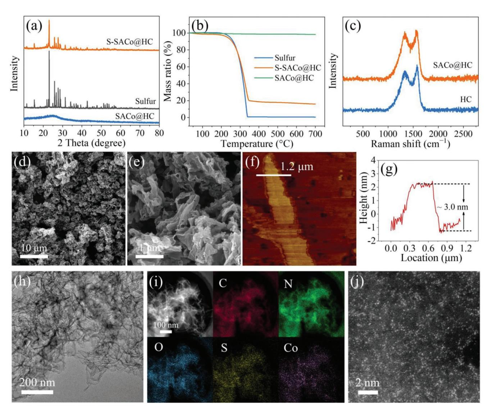
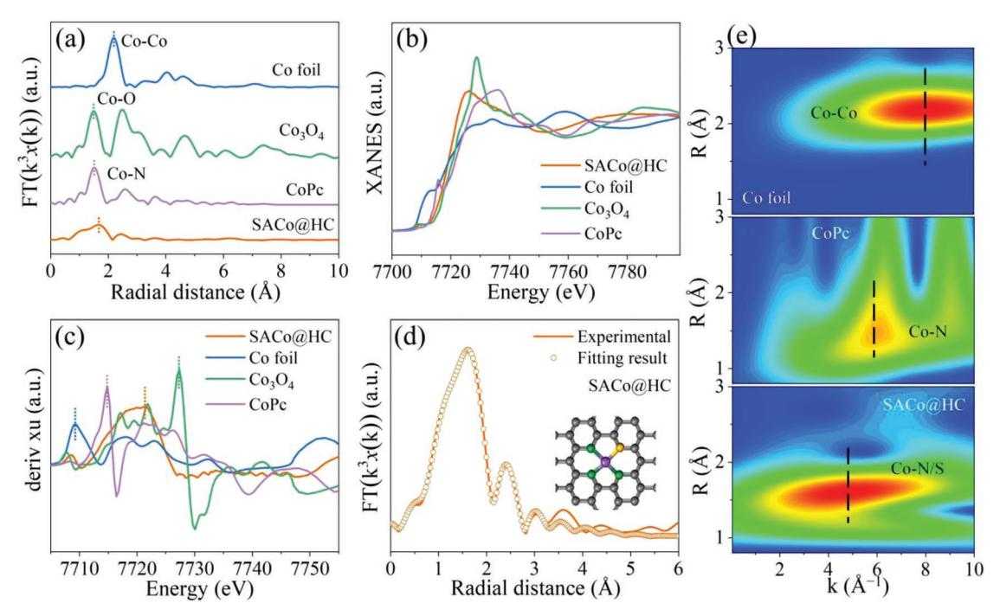
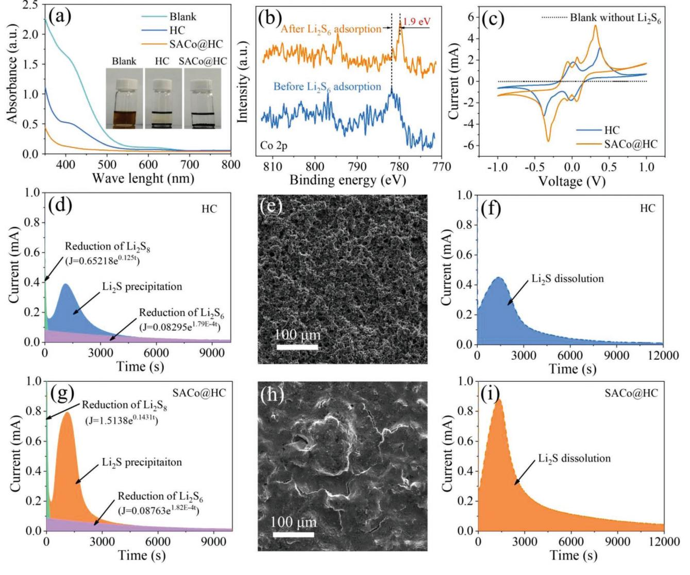
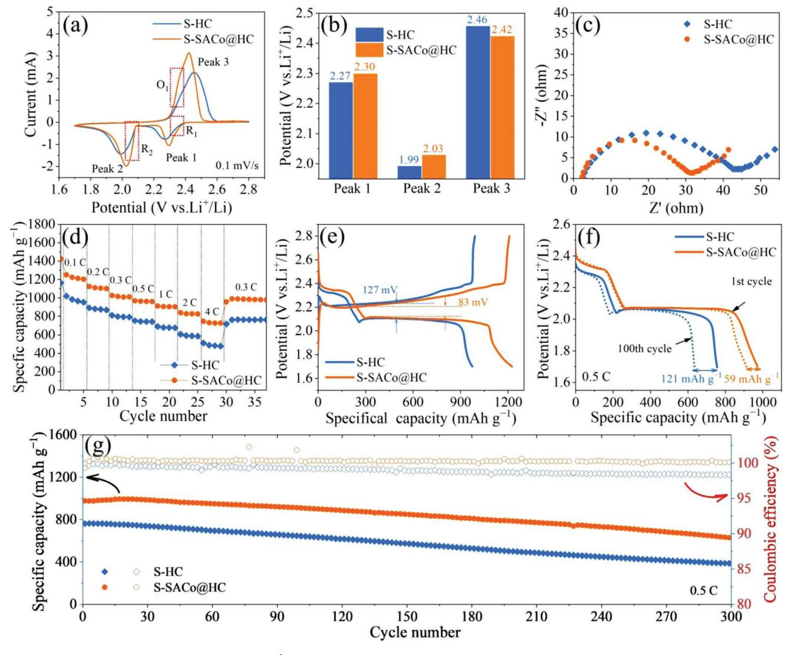
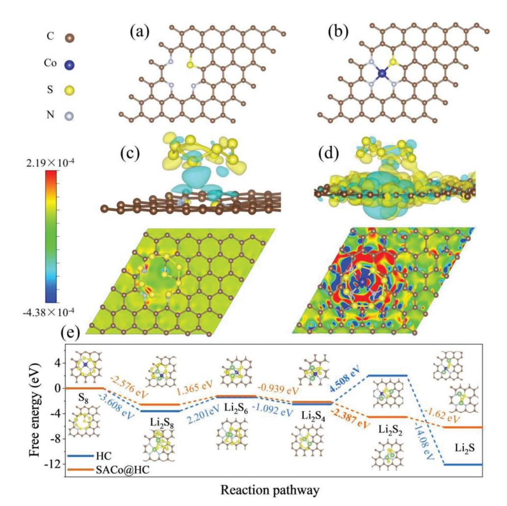
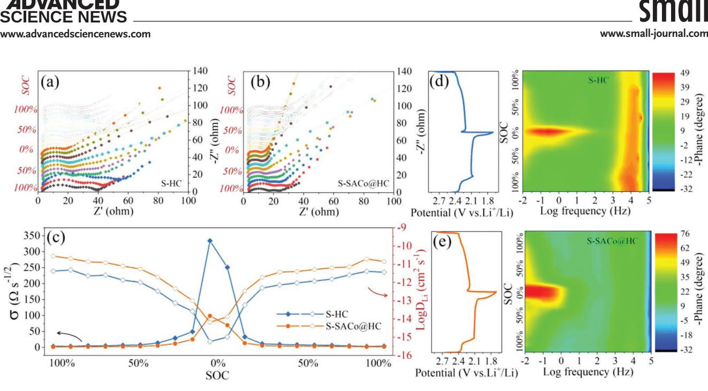
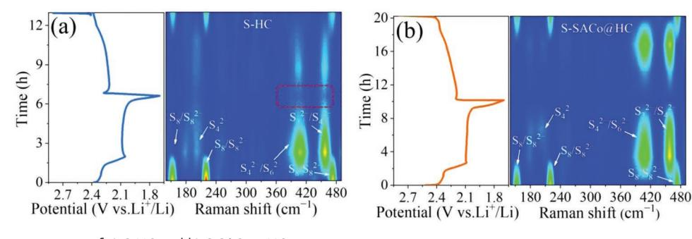

# **N, S-Coordinated Co Single Atomic Catalyst Boosting Adsorption and Conversion of Lithium Polysulfides for Lithium-Sulfur Batteries**

*Kun Liu, Xinyang Wang, Shuai Gu, Huimin Yuan, Feng Jiang, Yingzhi Li, Wen Tan, Qiurong Long, Jingjing Chen, Zhenghe Xu,\* and Zhouguang Lu\**

**Boosting reversible solid-liquid phase transformation from lithium polysulfides to Li2S and suppressing the shuttling of lithium polysulfides from the cathode to the lithium anode are critical challenges in lithium-sulfur batteries. Here, sulfiphilic single atomic cobalt implanted in lithiophilic heteroatoms-dopped carbon (SACo@HC) matrix with a CoN3S structure for high-performance lithium-sulfur batteries is reported. Density functional theory calculation and in situ experiments demonstrate that the optimal CoN3S structure in SACo@HC can effectively improve the adsorption and redox conversion efficiency of lithium polysulfides. Consequently, the S-SACo@HC composite with sulfur loading of 80 wt% delivers a high capacity of 1425.1 mAh g−1 at 0.05 C and outstanding rate performance with 745.9 mAh g−1 at 4 C. Furthermore, a capacity of 680.8 mAh g−1 at 0.5 C with a low electrolyte/sulfur ratio (6 µL mg−1 ) can be achieved even after 300 cycles. With the harsh conditions of lean electrolyte (E/S = 4 µL mg**−**1 ) and high sulfur loading (5.4 mg cm−2 ), a superior area capacity of 5.8 mAh cm−2 can be obtained. This work contributes to building a profound understanding of the adsorption and interface engineering of lithium polysulfides and provides ideas to tackle the long-standing polysulfide shuttle problem of lithium-sulfur batteries.**

K. Liu, X. Wang, S. Gu, H. Yuan, F. Jiang, Y. Li, W. Tan, Q. Long, J. Chen, Z. Xu, Z. Lu

Shenzhen Key Laboratory of Interfacial Science and Engineering of Materials

Department of Materials Science and Engineering Southern University of Science and Technology

Shenzhen 518055, China E-mail: xuzh@sustech.edu.cn; luzg@sustech.edu.cn

K. Liu, X. Wang, S. Gu, H. Yuan, F. Jiang, Y. Li, W. Tan, Q. Long, J. Chen, Z. Xu, Z. Lu

Key University Laboratory of Highly Efficient Utilization of Solar Energy and Sustainable Development of Guangdong Southern University of Science and Technology

Shenzhen 518055, China

K. Liu, X. Wang, S. Gu, H. Yuan, F. Jiang, Y. Li, W. Tan, Q. Long, J. Chen, Z. Xu, Z. Lu

Guangdong-Hong Kong-Macau Joint Laboratory for Photonic-Thermal-Electrical Energy Materials and Devices Southern University of Science and Technology Shenzhen 518055, China

The ORCID identification number(s) for the author(s) of this article can be found under https://doi.org/10.1002/smll.202204707.

### **DOI: 10.1002/smll.202204707**

# **1. Introduction**

Currently, energy storage technology plays a significant role in tackling the problems of energy crisis and environmental pollution.[1] Among various technologies, lithium-sulfur batteries have attracted tremendous attention because of their outstanding gravimetric energy density (≈2600 Wh kg−1 ), low price, abundant resources, and compatibility with the environment.[2] However, the commercialization of lithium-sulfur batteries has been largely hindered by their intrinsic electric insulativity of both sulfur and discharge production (Li2S), the large volume change of electrode during the discharge/ charge process, the migration of soluble lithium polysulfides between cathode and anode, and the sluggish kinetics of solidliquid conversion.[3] These shortages result in low sulfur utilization, inferior Coulombic efficiency, poor rate performance, and cycle stability.[4] Besides, lithiumsulfur batteries often exhibit poor electro-

chemical performance under severe condition of high loading sulfur and low electrolyte/sulfur ratio.[5]

In the past decades, enormous efforts have been devoted to overcoming the above issues by improving the physical and chemical properties of sulfur hosts.[6] Porous carbon-based material as sulfur host could effectively optimize electronic conductivity and volume swelling of sulfur cathode due to its high conductivity, flexibility, and lightweight, such as graphene,[7] carbon nanotube,[8] hollow carbon sphere, and so on.[9] Meanwhile, tuning the polarity of carbon could enhance the adsorption toward lithium polysulfide through embedding heteroatom (N, O, S, P) into carbon-based material.[9a,10] However, non-metal atom doping lacks catalytic activity. To enhance catalytic activity, polar oxide,[11] carbide,[12] nitride,[13] sulfide,[14] and other inorganic materials have been introduced into the carbon host.[15] The above studies further verify the significance of chemical interactions between lithium polysulfides and host materials in suppressing the shuttling effect and boosting the catalytic conversion of sulfide species.[4a] It is generally recognized that enhancing the kinetic of solid-liquid conversion of sulfide species is a crucial step to improving the performance of lithium-sulfur batteries.

Single-atom catalysts (SAC) have great potential in electrochemical applications.[16] SAC could also catalyze the polysulfide conversion reaction kinetic.[17] The coordination conditions are essential in determining the catalytic activities of single atoms. Currently, the active centers of the common metal-nitrogencarbon (M–N–C) single-atom electrocatalysts are same coordinated atomic structure of M–N4. [18] It has been reported that asymmetric structure with nonuniform electronic distribution was desirable to optimize the adsorption and thus enhance the catalysis performance.[19] Therefore, tuning the chemical environment of single metal atoms by different coordination atoms (N, P, and S) with different electronegativity is a promising method to optimize the homogeneous electronic distribution thus improving the electrocatalytic performance.[19b,20] However, most of the coordination structures of the single atom catalysis applied in lithium-sulfur batteries are MA*x* (M for center atom, A for coordination atom, *x* for coordination number), and the coordination structure of MA*x*B*y* (M for center atom, A and B for coordination atom, *x* and *y* for coordination number) has rarely been explored. Therefore, the study of the single atom catalysis with the coordination structure of MA*x*B*y* is instructive for the design and synthesis of functional materials to improve lithium-sulfur batteries' performance.

**www.advancedsciencenews.com**

Herein, a single-atom cobalt catalyst with unique CoN3S active moiety on heteroatoms-dopped (N, O, S) carbon (SACo@ HC) is developed as a sulfur host material for the lithium-sulfur battery. SACo@HC is fabricated through one-step pyrolysis of the mixture of sulfur-rich bitumen, urea, and cobalt naphthenate. Aberration corrected transmission electron microscope (AC-TEM) and X-ray absorption fine structure (XAFS) spectra indicate that the atomically dispersed Co are coordinated with nitrogen and sulfur to form the unique coordination structure of CoN3S. The SACo@HC consists of sulfiphilic and multiple lithiophilic active sites forming Co–S, Li–S, Li—N, and Li–O bonding to improve the adsorption of lithium polysulfides. Besides, the SACo@HC could also effectively accelerate the redox conversion kinetics of lithium polysulfides. Owing to the above advantages, the S-SACo@HC composite cathode exhibits outstanding cycling stability at 0.5 C and a high capacity of 5.8 mAh cm−2 under the harsh conditions of high sulfur loading (5.4 mg cm−2) and lean electrolyte (E/S = 4 µL mg−1 ). In addition, in situ electrochemical impedance spectroscopy (EIS) and in situ Raman spectroscopy verify that SACo@HC could effectively improve the diffusion of lithium ions and accelerate the solid-liquid conversion of sulfide species.

# **2. Results and Discussion**

The synthesis route of single-atom cobalt immobilized in heteroatom-doped carbon (SACo@HC) is schematically shown in Figure S1, Supporting Information. Bitumen contains a large number of polymer organic compounds and heteroatomic (N, O, S) functional groups (Figure S2 and Table S1, Supporting Information), which coordinate with metal atoms to form steric hindrance, effectively inhibiting the metal atoms' agglomeration. Otherwise, because of its strong polarity, bitumen can be adsorbed on the solid surface to form an ultra-thin adsorption layer, which contributes to the formation of ultra-thin carbon materials by pyrolysis.[21] For the successful preparation of SACo@HC, bitumen and urea were used as carbon source and soft template, respectively, while cobalt naphthenate could be transformed into single-atom cobalt during the thermal treatment process. And the heteroatoms-doped carbon (HC) without Co sites was prepared by the calcination of bitumen and urea under similar conditions. The X-ray diffraction (XRD) patterns of SACo@HC show only two broad diffraction peaks at around 26° and 44° corresponding to the (002) and (100) lattice planes, respectively (**Figure 1**a). Meanwhile, the mass loading of cobalt in SACo@HC derived from inductively coupled plasma (ICP) was 2.48 wt%, but no peaks related to cobalt compounds were observed, meaning that cobalt species existed as single atoms in the carbon matrix. The XRD of sulfur sealed in SACo@HC (S-SACo@HC) is consistent with sulfur, implying the successful infiltration of sulfur. The identical Raman features of HC and SACo@HC revealed a similar carbon structure (Figure 1b). As shown in Figure S3, Supporting Information, HC and SACo@HC exhibited similar specific surface area and pore size distribution. According to the thermogravimetric analysis (TGA, Figure 1c), the sulfur content in S-SACo@HC was calculated to be 80 wt%.

SEM images in Figure 1d,e display that the SACo@HC consisted of ultra-thin carbon sheets with corrugation and scrolling surfaces, similar to the morphology of graphene. Moreover, AFM reveals that the thinness of the carbon sheet is around 3.0 nm (Figure 1f,g). The TEM image in Figure 1h confirms the nanosheet-like particles of the SACo@HC. The elemental mapping images demonstrate the uniform distribution of carbon, nitrogen, oxygen, sulfur, and cobalt throughout the SACo@ HC sample (Figure 1i), stating that the cobalt species were uniformly embedded in the carbon sheet. The HC has similar morphologies to SACo@HC (Figures S4, and S5, Supporting Information). The atomic-scale structure of SACo@HC is furtherly identified through atomic-resolution aberration-corrected high-angle annular dark field scanning transmission electron microscopy (HAADF-STEM) as shown in Figure 1j. A large number of single cobalt atoms (light points) are homogeneously distributed on the carbon matrix.

X-ray absorption fine structure (XAFS) measurements have been conducted to investigate the coordination environment of the Co atom in SACo@HC. As shown in **Figure 2**a, the Co K-edge Fourier transformed (FT) extended X-ray absorption fine structure (FT-EXAFS) of CoPc exhibits one peak at around 1.5 Å that can be assigned to the Co–N bonding. In comparison with CoPc, the peak of SACo@HC shifted to a relatively higher energy level (1.65 Å) resulting from the replacement of N by S atom. In Figure 2b, the XANES curve of SACo@HC is located between Co foil and Co3O4 at a low energy range from 7705 to 7715 eV, indicating that the single-atom Co has partial positive charges. The first derivative curves of the corresponding XANES can further verify the above result (Figure 2c).[20a] As displayed in Figure 2d, the theoretical fitting spectra are in fine consistency with the experimental spectra. According to the fitting results shown in Figure S6 and Table S2, Supporting Information, the Co atoms are coordinated with N and S atoms with a coordination number of 3.2±0.3 and 0.9 ± 0.1, respectively, confirming a structure model of CoN3S. As shown in Figure 2e, the WT contour plot of SACo@HC shows maximum intensity

**www.small-journal.com**

**Figure 1.** a) XRD pattern and b) TGA of SACo@HC, Sulfur, S-SACo@HC. c) Raman spectra of HC and SACo@HC. The morphology of SACo@HC: d,e) SEM image, f) AFM image, and g) corresponding height variation; h) HRTEM image, i) HAADF-STEM image and the corresponding elemental mapping of C, N, O, S, Co; j) HAADF-STEM image.

at around 4.6 Å−1 , approaching the maximum intensity of CoPc and the first-shell maximum intensity of Co3O4, probably due to the backscattering between Co and N/S atoms. Besides, the maximum intensity of Co foil is located at around 8.1 Å−1 relating to the Co–Co bonding.[22] However, the Co–Co signal is not observed in SACo@HC, indicating the atomic dispersion of Co.

Excellent adsorption ability toward lithium polysulfides is pivotal for the sulfur cathode host to effectively suppress the shutter effect. A visual adsorption test is performed by adding the same mass HC and SACo@HC samples in equivalently brown Li2S6 solution (inset of **Figure 3**a). After 6 h, compared with the blank sample, the solution with SACo@HC completely turns colorless, while the solution with HC still retains slight brown, indicating that SACo@HC reveals a more remarkable adsorption capacity of lithium polysulfides than HC. Additionally, from the UV–vis spectra, the peak intensity of Li2S6

(at 420 nm) obviously weaken after mixing lithium polysulfide and SACo@HC, meaning the excellent adsorption effect of SACo@HC. The X-ray photoelectron spectroscopy (XPS) spectra have been implemented to further explore the interaction relationship between SACo@HC and Li2S6 after adsorption. As Figure 3b displayed, the main peaks in Co 2p spectra of SACo@HC before the adsorption of Li2S6 were located at 781.85 and 796.95 eV, which were ascribed to Co 2p3/2 and Co 2p1/2, respectively. Whereas, the binding energies of them after adsorbing Li2S6 shift down to 779.95 and 794.7 eV, respectively, which must be on account of transferring an electron from Li2S6 to single atom cobalt, lowering the binding energy of cobalt. It supports that the strong chemical adsorption occurs between lithium polysulfides and SACo@HC with the formation of the Co–S bond, confirming that single atom cobalt offers a powerful active site for the adsorption of lithium polysulfides. The XPS spectra of Li show an obvious characteristic peak

**www.small-journal.com**

**Figure 2.** Atomic structural analysis of SACo@HC. a) Co K-edge FT-EXAFS spectra, b) Co K-edge XANES spectra, and c) first derivative curves; d) EXAFS curves between the experimental data and the fit of SACo@HC. The inset shows the fitted coordination environment of Co single atom (green for N atom, yellow for S atom, and purple for Co atom); e) Co K-edge WT-EXAFS contour plots.

located at 55.45 eV after the adsorption of Li2S6. The XPS signals of nitrogen, oxygen, and sulfur also move to lower binding energy after adsorbing Li2S6 (Figure S7, Supporting Information), implying the formation of Li–N, Li—O, and Li–S bonds and the existence of chemical adsorption between SACo@HC and lithium polysulfides. The above results testify that SACo@HC can provide multiple active points (Co, N, O, S) to facilitate the absorption of lithium polysulfides through strong chemical action, further contributing to enhancing the redox conversion efficiency of lithium polysulfides.

The prominent catalytic effect of the sulfur substrate plays a significant role in inhibiting the shuttle effect and increasing discharge capacity. Herein, we assemble symmetrical cells using the same host materials as cathode and anode, DOL/ DME (v/v = 1/1) with 0.5 mol L−1 Li2S6 as electrolyte. As shown in Figure 3c and Figure S8, Supporting Information, both HC and SACo@HC show eight redox peaks in the cyclic voltammograms (CV), and these peaks represent four steps in the process of lithium polysulfides conversion (S8 ↔ Li2S8 ↔ Li2S6 ↔ Li2S4 ↔ Li2S).[23] As displayed in Table S3, Supporting Information, the SACo@HC exhibits higher reduction potential and lower oxidation potential of polysulfides than HC, meaning that single atom cobalt (CoN3S) can prompt the conversion of lithium polysulfides with lower polarization and faster kinetics.[24] For example, peak f is more negative on the surface of SACo@HC (0.311 V) than HC (0.383 V). This should be on account of a higher overpotential for Li2S precipitation at the counter electrode on the surface of HC. Otherwise, the SACo@HC also shows a higher peak current density than HC, proving that SACo@HC displays higher catalytic activity in the process of solid-liquid conversion. And the corresponding electrochemical impedance spectroscopy (EIS) can also further verify the above result (Figure S9, Supporting Information). The lower interface impedance (*R*int) and charge transfer impedance (*R*ct) testify faster catalytic conversion kinetics for solid-liquid conversion on the interface of SACo@HC than HC.

During the discharge process, the low-voltage platform providing nearly three-quarters of the capacity mainly involve the liquid-solid conversion of reduction from the lithium polysulfides to Li2S. Therefore, boosting the precipitation of Li2S can significantly improve the energy density and rate performance of Li–S batteries. Herein, we evaluate the kinetics of Li2S nucleation/deposition on the surface of host materials by assembling the button cell with Li foil as an anode, HC or SACo@HC as cathode, and 0.2 mol L−1 Li2S8 in tetraethylene glycol dimethyl ether (TEGDME) as electrolyte. Based on Faraday's law, the capacity of Li2S precipitation on different host materials can be obtained. Obviously, the capacity of Li2S precipitation on the surface of SACo@HC exhibits 315.4 mAh g−1 (Figure 3d) surpassing HC (188.6 mAh g−1 ) (Figure 3g), strongly supporting that single atom cobalt (CoN3S) contributes to boosting the liquid-solid conversion of the lithium polysulfide reduction to Li2S. The images of corresponding Li2S precipitation on host materials are obtained through SEM tests (Figure 3e,h). Remarkably, the surface of SACo@HC is smooth, indicating the uniform deposition of Li2S. In contrast, the HC displays a rough surface with a sight of gullies and ridges due to the inhomogeneity and partial homogeneity of Li2S deposition. This result can further confirm that SACo@HC is provided with higher catalytic activity for motivating the liquid-solid conversion process of the Li2S reduction from lithium polysulfides. We also estimate the kinetics of Li2S dissolution in the charging

**Figure 3.** a) UV–vis spectra of Li2S6 solutions after interacting with HC and SACo@HC. The insert image is the photo of Li2S6 solution after adsorption; b) High-resolution XPS spectra of Co of SACo@HC before and after adsorption of Li2S6 solution; c) CV curves of the symmetric cells in electrolyte with 0.5 mol L−1 Li2S6 and without Li2S6 at a scanning rate of 1 mV s−1 ; Potentiostatic *I–T* curves on the cathode of HC and SACo@HC in tetraethylene glycol dimethyl ether with 0.2 mol L−1 Li2S8 at d,g) 2.02 V and f,i) 2.35 V (vs Li+/Li); The SEM images of e) HC and h) SACo@HC electrode after potentiostatic deposition at 2.02 V (vs Li+/Li).

process. The peak current density of the electrode with SACo@HC is higher than that of HC, indicating a smaller overpotential for the dissolution of Li2S on the surface of SACo@HC. The capacity of Li2S dissolution on the surface of SACo@HC exhibits a higher value of 668.3 mAh g−1 (Figure 3f) than the HC (337.5 mAh g−1 ) (Figure 3i). Therefore, the above results confirm that the SACo@HC can boost the precipitation and dissolution of Li2S during the discharge and charge process.

In CV curves, the cathodic reduction process usually includes two peaks around 2.3 and 2.0 V, representing the reduction reaction from sulfur to lithium polysulfide and the final formation of Li2S2/Li2S, respectively. The anodic oxidation process shows peaks around 2.4 V involving the oxidation of Li2S to generate lithium polysulfide and sulfur. Generally, the higher cathodic potential and the lower anodic potential with a large current density of peaks stand for the electrochemical reaction with outstanding reversibility and kinetics. It is clear that the S-SACo@HC electrode demonstrates a higher cathodic/anodic peak current density than S-HC. The SACo@HC can more effectively promote the conversion of lithium polysulfides than HC, thus the SACo@HC contributes to accelerating electron transfer between lithium polysulfide and conductive agent, and promote charge transfer and lithium-ion diffusion in the electrode, leading to lower over potential. As a result, in contrast with HC, the more positive cathodic peak potentials (2.30 and 2.03 V) and more negative anodic peak potential (2.42 V) were observed for S-SACo@HC, illustrating the lower polarization of the S-SACo@HC electrode (**Figure 4**b).[25] The Tafel slope is derived from CV curves, and it represents the amount that the voltage needs to change to achieve the same change

**www.small-journal.com**

**Figure 4.** a) CV curves at a scan speed of 0.1 mV s 1 between 1.7–2.8 V (vs Li+/Li) and b) peak potential of the corresponding CV; c) EIS before discharge/charge process; d) Rate performance, e) The charge and discharge curves at 0.1 C. f) The discharge curves at 1st and 100th cycle. g) Cycle performance at 0.5 C.

in current. The corresponding Tafel slopes for S-SACo@HC are 89.7 (*R*1), 30.9 (*R*2), and 60.8 mV dec−1 (*O*1), respectively, and all of them are smaller than the corresponding values of HC, representing faster kinetic of reduction/oxidation for sulfur species on the S-SACo@HC (Figure S10, Supporting Information).[6c] Herein, we also have carried out the CV curves at different scan speeds (Figure S11, Supporting Information). We plot the square root of the scan speeds and corresponding peak currents (peak 1, peak 2, peak 3) with a linear relationship (Figure S12, Supporting Information). The greater slope of line means a superior diffusion coefficient of Li+. It is clear that all plots of S-SACo@HC exhibit greater slopes than that of S-HC, indicating that S-SACo@HC possesses an excellent Li+ diffusion. As shown in Figure 4c, the S-SACo@HC exhibits a lower charge transfer resistance (*R*ct) than S-HC, meaning that the S-SACo@HC displays a superior kinetic of charge transfer. In general, the value of voltage drop is relevant to the polarization after the full charged process. The higher voltage of the cell after standing represents smaller polarization. As shown in Figure S13, Supporting Information, the voltage of S-SACo@HC is higher than the S-HC, indicating smaller polarization in S-SACo@HC, which is consistent with the conclusion of the above EIS test.

Generally, the cell with superior ion diffusion would display outstanding rate performance. As depicted in Figure 4d, the S-SACo@HC electrode shows a high initial discharge specific capacity of 1425.1 mAh g−1 (0.05 C), and this is better than S-HC (1164.7 mAh g−1 ). Absolutely, the S-SACo@HC also exhibits a higher discharge-specific capacity of 1251.5, 1124.5, 1026.1, 969.4, 912.1, 838.7, and 745.9 mAh g−1 at the different rates, and all of them are superior to S-HC electrode. The specific capacity still goes up to 745.9 mAh g−1 at a high rate of 4 C, strongly confirming that the S-SACo@HC electrode has outstanding rate performance (Table S4, Supporting Information). And the specific capacity of the S-SACo@HC electrode still sustains 989.9 mAh g−1 while returning to 0.3 C. On the

**www.small-journal.com**

other side, the S-SACo@HC electrode demonstrates less plateau potential gap of 83 mV at 0.1 C than the S-HC electrode (127 mV), signifying that the SACo@HC could promote the redox conversion of lithium polysulfides (Figure 4e and Figure S14, Supporting Information). To evaluate the catalytic ability of these sulfur hosts at different rates, the values of *Q*L/*Q*H are also obtained. Herein, *Q*H represents the discharge-specific capacity of the high-voltage plateau range in regard to the solid-liquid conversion of sulfur reduction to lithium polysulfides (S8 + *x*Li+ + *x*e− → Li2S*n*, *n* ranges from 4 to 8), which means the lithium-ion diffusing from anode to cathode and the amount of soluble lithium polysulfides produced. *Q*L represents the discharge-specific capacity of the low-voltage plateau range related to the liquid-solid conversion of soluble lithium polysulfides reduction to solid Li2S/Li2S2 (Li2S*n* + *y*Li+ + *y*e− → Li2S2/Li2S). When the host material shows sluggish reaction kinetics, a part of lithium polysulfides is reduced to Li2S2/ Li2S in the low-voltage plateau range, suppressing the capacity of the low-voltage plateau range. Therefore, a higher value of *Q*L/*Q*H represents the more lithium polysulfide reduction to Li2S, meaning the sulfur host material with superior catalytic ability. Figure S15, Supporting Information displays the values of *Q*L/*Q*H at different rates. The S-SACo@HC electrode shows the value of *Q*L/*Q*H (3.05, 0.1 C) which is approximating the theoretical value (*Q*L/*Q*H = 3) and is higher than the S-HC electrode (2.74, 0.1 C). It further confirms the outstanding catalytic activities of SACo@HC due to the single atom cobalt (CoN3S) enhancing the adsorption and conversion reaction of lithium polysulfide.

**www.advancedsciencenews.com**

Generally, the voltage drop can be observed at the beginning of the low discharge plateau (< 2.1 V), which is considered the energy barrier during the initial precipitation of solid Li2S2/Li2S during liquid-solid conversion. The voltage drop is regarded as the overpotential of the Li2S2/Li2S nucleation, and larger voltage drop represents higher energy barrier. As displayed in Figure S16a, Supporting Information, the overpotential of the S-SACo@HC electrode is 8 mV, even lower than S-HC (34 mV), indicating the lower energy barrier for Li2S2/Li2S nucleation on the surface of SACo@HC. Similarly, the voltage rise before the charge plateau also represents the energy barrier for the initial dissolution of solid Li2S2/Li2S. Therefore, the voltage rise represents the overpotential of the Li2S2/Li2S dissolution, and a larger voltage rise is considered as a higher energy barrier. As displayed in Figure S16b, Supporting Information, the overpotential of the S-SACo@HC electrode is 33 mV lower than S-HC (82 mV), indicating the lower energy barrier for Li2S2/Li2S dissolution on the surface of SACo@HC. The above results further reveal that the single atom cobalt can effectively accelerate the precipitation and dissolution of Li2S.

To estimate the cycling performance of lithium-sulfur batteries using different cathodes (S-HC and S-SACo@HC), we have performed the constant current charge-discharge cycle test at 0.5 C with sulfur loading (2.4 mg cm−2) and a low electrolyte/sulfur ratio of 6 µL mg−1 (Figure 4g). The S-SACo@HC electrode exhibits a higher initial discharge-specific capacity of 971.3 mAh g−1 than the S-HC (749.2 mAh g−1 ). Besides, as depicted in Figure 4f, the S-SACo@HC electrode only loses a capacity of about 59 mAh g−1 after 100 cycles, which is approximately half the loss capacity of S-HC (121 mAh g−1 ). After 300 cycles, the S-SACo@HC electrode still maintains a capacity of about 680.8 mAh g−1 (capacity retention of about 70%) surpassing S-HC (386.1 mAh g−1 , capacity retention of about 51%), clarifying that the introduction of single atom cobalt (CoN3S) could improve the cycle performance. Herein, we observed the cathode/anode surface of cells after 300 cycles through SEM (Figure S17, Supporting Information). It is obvious that the amount of lithium sulfide or lithium polysulfide serves as residue that stagnates on the surface of the S-HC electrode and the corresponding lithium anode. The cathode/anode surface of the S-HC cell is rough, which signifies that amounts of side reaction occurring on the side of the anode due to polysulfide shuttling and amounts of residual polysulfide without oxidation-reduction on the cathode because of large reactive energy barrier. For cells using S-SACo@HC as cathode, the cathode/anode surface is smoother than S-HC, which indicates SACo@HC can suppress the polysulfide shuttle and boost the catalytic conversion of polysulfide. In order to explore the morphology and chemical composition of the SACo@HC after 300 cycles, the electrode material was washed by CS2 several times, and the SACo@HC after 300 cycles was obtained. The SEM and TEM images (Figure S18, Supporting Information) show that the SACo@HC still keeps the previous morphology of graphene-like carbon. Furthermore, the HAADF-STEM image and the corresponding elemental mapping images show the uniform distribution of carbon, nitrogen, oxygen, sulfur, and cobalt throughout the SACo@HC sample, stating that the cobalt species were still uniformly embedded in the carbon sheet. And the Raman and XPS results (Figures S19 and S20, Supporting Information) again indicate the chemical composition of SACo@HC remains the same even after 300 cycles.

Both high sulfur loading and lean electrolyte are critical points for the practical application of the lithium-sulfur battery. Herein, we assemble cells using the S-SACo@HC electrode with high sulfur loading of 5.4 mg cm−2 as cathode and perform a cycle test in the lean electrolyte (ratio of electrolyte volume/ sulfur mass (E/S) is 4 or 6 µL mg−1 ). As shown in Figure S21, Supporting Information, the thickness of the cathode is as high as 148 µm, and the area capacity of the electrode catches up to 5.8 mAh cm−2 at 0.1 C, which exceeds the standard of area capacity (4 mAh cm−2 ) for commercial lithium-ion batteries. Therefore, the S-SACo@HC electrode can be considered a candidate for the commercial lithium-sulfur battery. Besides, we also performed a shuttle current test and 55 °C storage experiment (Figure S22, Supporting Information), and the results of them strongly confirm that SACo@HC can effectively suppress the shuttling of lithium polysulfides from cathode to the lithium anode in the lithium-sulfur batteries.

In order to understand the structural model of CoN3S for improving the lithium-sulfur batteries, the first-principles calculations have been performed. Herein, we studied the different reactions of various lithium polysulfides on SACo@HC (including the structural model of CoN3S) and HC (N3S). The structure model of HC (**Figure 5**a) and SACo@HC (Figure 5b) are considered as the substrate for the simulation of redox conversion of lithium polysulfides on them. Corresponding to the results of XAS, the single atom Co is coordinated with three pyridinic N atoms and one S atom. As displayed in Figure 5c,d, the charge density difference of HC-S8 and SACo@HC-S8

**www.small-journal.com**

**Figure 5.** The structure models of a) HC and b) SACo@HC for first-principles calculations. The charge density of c) HC-S8 and d) SACo@HC-S8. e) Energy profiles for the reduction of lithium polysulfides on HC and SACo@HC substrates, the optimized adsorption conformations of intermediate species on HC and SACo@HC substrates (insets).

indicates that more charge accumulated in the regions of SACo@HC and sulfur due to stronger chemical interaction between Co and S atoms, which contributes to enhancing the utilization of sulfur and improving the specific capacity (Figure S23, Supporting Information). The sulfur reduction process on the substrate of HC and SACo@HC has been investigated. As shown in Figure 5e, the Gibbs free energies have been calculated for the above reactions on different substrates. On the surface of SACo@HC, all Gibbs free energies are negative numbers, indicating that the successive conversion reactions from S8 to Li2S are spontaneous. However, on the surface of HC, the critical step from liquid Li2S4 to solid Li2S2 is a nonspontaneous process. This result means that the host SACo@ HC can powerfully accelerate the liquid-solid conversion, being consistent with the analysis of in situ EIS and Raman.

To further explore the phenomenon that the S-SACo@HC electrode shows better rate performance than S-HC, we perform the in situ EIS test at different states of charge (SOC) during the 20th galvanostatic charge/discharge cycle at the current density of 0.1 C. As shown in **Figure 6**a,b, the Nyquist curves of EIS involve two semicircles: the first one is related to the interface resistance (*R*int) and the second one is regarded as the transfer resistance (*R*ct). Besides, the intersection point of the Nyquist curve with the x-axis represents electrode ohmic resistance (*R*e), and the liner part in low-frequency represents the Warburg resistance. The fitting EIS results of the S-HC and S-SACo@HC electrodes are displayed in Figure S24, Supporting Information. The *R*e of them is almost the same and around 3 Ω, meaning that the electronic conductivity of S-HC is as good as S-SACo@HC. The higher *R*int value of S-HC originates from the deposition of polysulfide species without reduction-oxidation on the surface of the S-HC electrode. When the SOC begins to lower than 50%, the value of *R*ct is obviously increasing, due to the gradual precipitation of Li2S2/Li2S. While the S-SACo@HC exhibits lower charge transfer impedance, strongly stating that the single atom cobalt could lower the energy barrier and accelerate charge transfer. As depicted in Figure 6d,e, the corresponding Bode plot of the S-SACo@S electrode exhibits more excellent symmetry than S-HC during the discharge/charge process, indicating that the interface change of the S-SACo@HC electrode is reversible during the de/lithiation reaction. As displayed in Figure 6c, in the

**Figure 6.** In situ EIS of a) S-HC and b) S-SACo@HC at different SOC; c) Corresponding Warburg coefficients (*σ*) and *D*Li; Corresponding Bode plots of d) S-HC and e) S-SACo@HC.

discharge process, the value of *σ* is relatively smooth at SOC at more than 50%, while suddenly increases after SOC at 50% due to the precipitation of solid Li2S2/Li2S, and it shows the opposite change trend during the corresponding charge process. The variation trend of *σ* and *D*Li are consistent with the reduction-oxidation of polysulfide species. The S-SACo@HC electrode shows lower values of *σ* and higher Li-ion diffusion coefficients (10−11 cm2 s−1 ), which is in fine agreement with the excellent rate performance of the S-SACo@HC electrode.

Herein, we also have performed the in situ Raman spectra to deeply investigate the conversion of sulfur during the discharge/charge process, confirming the superiority of single atom cobalt (CoN3S) for improving the performance of the lithium-sulfur battery. During the first discharge/charge cycle, the Raman signals of lithium polysulfides are distinctly observed. The peaks located around 152, 219, and 472 cm−1 refer to the signal of S8/S8 2−. And the peaks around 202, 408, and 457 cm−1 are corresponding to the S4 2−, S4 2−/S6 2−, and S3 2−/S4 2−, respectively. As shown in **Figure 7**, during the discharge process, the appearance of peaks around 152, 219, and 472 cm−1 signify the reduction from solid sulfur to the long-chain S8 2− at the beginning stage of discharge. Then the long-chain S8 2− would be reduced to S6 2−/S4 2−/S3 2−, which would be further converted into solid Li2S2/Li2S. However, in comparison with the S-SACo@HC electrode (Figure 7b), the signals of S6 2−/S4 2−/S3 2− are still observed at the end of discharge on the S-HC electrode (Figure 7a), which verifies that the lithium polysulfides are incompletely transformed into the solid Li2S2/Li2S. During the charge process, the solid Li2S2/Li2S would be firstly oxidized into lithium polysulfides (S6 2−/S4 2−/S3 2−), and finally into S8/S8 2−. Nevertheless, for the S-HC electrode, the Raman signal intensity of S6 2−/S4 2−/S3 2− is weaker in the charge process than in the discharge process, which may contribute to the higher reactive energy barrier and weaker adsorption of lithium polysulfides on the surface of HC. Remarkably, we can observe the obvious signal of S6 2−/S4 2−/S3 2− during both the discharge and charge processes, indicating higher conversion reversibility and adsorption of lithium polysulfides on the surface of SACo@ HC. The in situ Raman test again verifies that the single atom cobalt could effectively improve the adsorption of lithium polysulfides and boost the precipitation and dissolution of lithium sulfide. Consequently, the shuttle effect could be really suppressed and the capacity could be effectively improved by introducing the CoN3S structure.

**Figure 7.** In situ Raman spectra of a) S-HC and b) S-SACo@HC.

## **3. Conclusion**

In summary, single atomic cobalt with a novel coordination environment of CoN3S was successfully immobilized in a heteroatom-dopped (N, O, S) carbon (SACo@HC) matrix by the simple one-step pyrolysis of bitumen, urea, and cobalt naphthenate. The SACo@HC was equipped with not only sulfiphilic but also lithiophilic function groups to enhance the adsorption of lithium polysulfides and consequently suppress the shuttle effect in lithium-sulfur batteries. Furthermore, the SACo@HC also exhibited outstanding catalytic activity to effectively reduce the activation energy barrier and boost the precipitation and dissolution of Li2S. The S-SACo@HC electrode as cathode displayed a high discharge capacity of 1425.1 mAh g−1 at 0.05−C, excellent rate performance (745.9 mAh g−1 at 4 C), and outstanding cycling performance with a capacity of 680.8 mAh g−1 after 300 cycles at 0.5 C. Besides, a superior area capacity of 5.8 mAh cm−2 could be obtained under lean electrolyte of E/S = 4 µL mg−1 and high sulfur loading of 5.4 mg cm−2 . Through in situ EIS and Raman tests, we have verified that the single atom cobalt coordinated with the CoN3S structure can efficiently accelerate the solid-liquid conversion of sulfide species. The results are inspiring in the design and synthesis of functional host materials for high-performance lithium-sulfur batteries.

#### **Supporting Information**

Supporting Information is available from the Wiley Online Library or from the author.

#### **Acknowledgements**

This work was financially supported by the Shenzhen Key Laboratory of Interfacial Science and Engineering of Materials (No. ZDSYS20200421111401738), the Basic Research Project of the Science and Technology Innovation Commission of Shenzhen (No. JCYJ20200925154236004), Leading Talents of Guangdong Province Program (No. 2016LJ06C536), Guangdong-Hong Kong-Macau Joint Laboratory (No. 2019B121205001), the Jiangsu Key Laboratory of Electrochemical Energy Storage Technologies (EEST2021-1), and the National Natural Science Foundation of China (No. 51974162, 21938003 and 22008105). TEM images were obtained on the instruments from the Southern University of Science and Technology Core Research Facilities. DFT calculations were supported by the Center for Computational Science and Engineering at the Southern University of Science and Technology. The XAFS experiments were conducted in the BL08U1A Beamlines at the Shanghai Synchrotron Radiation Facility (SSRF).

### **Conflict of Interest**

The authors declare no conflict of interest.

### **Author Contributions**

K.L.: Conceptualization, methodology, formal analysis, investigation, writing – original draft, writing – review & editing. X.W.: Calculations, investigation, writing – review & editing. S.G.: Investigation, writing – review & editing. H.Y.: Investigation. F.J.: Investigation. Y.L.: Investigation. W.T.: Investigation. Q.L.: Investigation. J.C.: Investigation. Z.X.: Conceptualization, funding acquisition, supervision, writing – review & editing. Z.L.: Conceptualization, funding acquisition, supervision, writing – review & editing.

# **Data Availability Statement**

The data that support the findings of this study are available from the corresponding author upon reasonable request.

# **Keywords**

CoN3S active moiety, heteroatoms-doped carbon, lithium polysulfides conversion, lithium-sulfur batteries, single-atom catalysts

> Received: August 3, 2022 Revised: September 9, 2022 Published online: October 4, 2022

- [1] a) B. K. Sovacool, R. J. Heffron, D. McCauley, A. Goldthau, *Nat. Energy* **2016**, *1*, 16024; b) F. Wu, J. Maier, Y. Yu, *Chem. Soc. Rev.* **2020**, *49*, 1569.
- [2] a) T. Li, X. Bai, U. Gulzar, Y. J. Bai, C. Capiglia, W. Deng, X.-F. Zhou, Z.-P. Liu, Z.-F. Feng, R. Proietti Zaccaria, *Adv. Funct. Mater.* **2019**, *29*, 1901730; b) M. Zhao, B.-Q. Li, X.-Q. Zhang, J.-Q. Huang, Q. Zhang, *ACS Cent. Sci.* **2020**, *6*, 1095; c) J. Zhu, J.-L. Zou, H. Cheng, Y.-Y. Gu, Z.-G. Lu, *Green Energy Environ..* **2019**, *4*, 345; d) J.-G. Sun, T. Wang, Y.-L. Gao, Z.-H. Pan, R.-P. Hu, J. Wang, *InfoMat* **2022**, *4*, e12359.
- [3] J.-L. Guo, H.-Y. Pei, Y. Dou, S.-Y. Zhao, G.-S. Shao, J.-P. Liu, *Adv. Funct. Mater.* **2021**, *31*, 2010499.
- [4] a) W. Lim, S. Kim, C. Jo, J. Lee, *Angew. Chem., Int. Ed.* **2019**, *58*, 18746; b) L. Kong, L.-H. Yin, F. Xu, J.-C. Bian, H.-M. Yuan, Z.-G. Lu, Y.-S. Zhao, *J. Energy Chem.* **2021**, *55*, 80.
- [5] A. Bhargav, J. He, A. Gupta, A. Manthiram, *Joule* **2020**, *4*, 285.
- [6] a) L. Zhou, D. L. Danilov, R.-A. Eichel, P. H. L. Notten, *Adv. Energy Mater.* **2021**, *11*, 2001304; b) S. Tang, X. Li, Q.-Q. Fan, X.-Q. Zhang, D.-Y. Wang, W. Guo, Y.-Z. Fu, *J. Electrochem. Soc.* **2022**, *169*, 040525; c) H.-L. Ye, J.-G. Sun, S.-L. Zhang, H.-B. Lin, T.-R. Zhang, Q.-F. Yao, J. Y. Lee, *ACS Nano* **2019**, *13*, 14208; d) J. Yang, X.-M. Liu, H. Yuan, J.-G. Sun, L.-D. Li, K. E. J. Goh, Z.-G. Yu, J.-M. Xue, J. Wang, Y.-W. Zhang, *Appl. Catal., A* **2022**, *642*, 118708.
- [7] a) H.-F. Xu, Q.-B. Jiang, B.-K. Zhang, C. Chen, Z. Lin, *Adv. Mater.* **2019**, *32*, 1906357; b) Y.-F. Yuan, G.-Q. Tan, J.-G. Wen, J. Lu, L. Ma, C. Liu, X.-B. Zuo, R. Shahbazian-Yassar, T. Wu, K. Amine, *Adv. Funct. Mater.* **2018**, *28*, 1706443; c) T. Yang, J. Xia, Z.-H. Piao, L. Yang, S.-C. Zhang, Y.-L. Xing, G.-M. Zhou, *ACS Nano* **2021**, *15*, 13901.
- [8] a) Y.-X. Lin, J. Ticey, V. Oleshko, Y.-J. Zhu, X.-S. Zhao, C.-S. Wang, J. Cumings, Y. Qi, *Nano Lett..* **2022**, *22*, 441; b) X.-L. Wang, G.-R. Li, M.-J. Li, R.-P. Liu, H.-B. Li, T.-Y. Li, M.-Z. Sun, Y.-R. Deng, M. Feng, Z.-W. Chen, *J. Energy Chem.* **2021**, *53*, 234; c) Y.-J. Chen, S.-Y. Liu, X.-T. Yuan, X.-C. Hu, W.-Q. Ye, A. Abdul Razzaq, Y.-B. Lian, M.-Z. Chen, X.-H. Zhao, Y. Peng, J.-H. Choi, J.-H. Ahn, Z. Deng, *Carbon* **2020**, *167*, 446.
- [9] a) K. Liu, S. Gu, H.-M. Yuan, H. Wang, W. Tan, F. Jiang, J.-J. Chen, K.-M. Liao, C.-L. Yan, F. Yang, Z.-G. Lu, Z.-H. Xu, *Compos. Commun.* **2022**, *30*, 101079; b) Q.-K. Zeng, X.-L. Li, J.-L. Zhu, G.-F. Wang, X.-Y. Chen, S.-J. Ma, P.-K. Shen, *Sustainable Energy Fuels* **2022**, *6*, 320; c) M. D. Walle, Y.-N. Liu, *Mater. Renewable Sustainable Energy* **2021**, *10*, 1.
- [10] a) M.-M. Yang, Q.-Q. Kong, W. Feng, W.-T. Yao, Q.-Y. Wang, *Carbon Energy* **2022**, *4*, 45; b) K.-Y. Zou, W.-T. Jing, X. Dai, X.-X. Chen, M. Shi, Z.-Y. Yao, T. Zhu, J.-J. Sun, Y.-Z. Chen, Y. Liu, Y.-N. Liu, *Small*

**2022**, *18*, 2107380; c) S.-C. Jo, J.-W. Hong, I.-H. Choi, M.-J. Kim, B. G. Kim, Y.-J. Lee, H. Y. Choi, D. Kim, T. Y. Kim, K.-J. Baeg, J.-W. Park, *Small* **2022**, *18*, 2200326.

- [11] a) P. Xue, K.-P. Zhu, W.-B. Gong, J. Pu, X.-Y. Li, C. Guo, L.-Y. Wu, R. Wang, H.-P. Li, J.-Y. Sun, G. Hong, Q. Zhang, Y.-G. Yao, *Adv. Energy Mater.* **2022**, *12*, 2200308; b) Q.-M. Gan, H.-N. He, Y.-H. Zhu, Z.-Y. Wang, N. Qin, S. Gu, Z.-Q. Li, W. Luo, Z.-G. Lu, *ACS Nano* **2019**, *13*, 9247; c) M.-M. Zhen, K.-L. Jiang, S.-Q. Guo, B.-X. Shen, H.-L. Liu, *Nano Res..* **2022**, *15*, 933.
- [12] W.-L. Li, K. Chen, Q.-C. Xu, X.-Y. Li, Q. Zhang, J. Weng, J. Xu, *Angew. Chem., Int. Ed.* **2021**, *60*, 21512.
- [13] a) Y. Li, X.-Z. Wang, L.-X. Wang, D.-Z. Jia, Y.-Z. Yang, X.-G. Liu, M.-H. Sun, Z.-B. Zhao, J.-S. Qiu, *ACS Appl. Mater. Interfaces* **2021**, *13*, 48536; b) X.-Y. Yue, J. Zhang, J. Bao, Y.-F. Bai, X.-L. Li, S.-Y. Yang, Z.-W. Fu, Z.-H. Wang, Y.-N. Zhou, *eScience* **2022**, *2*, 329.
- [14] H. Guo, J. Hu, H.-M. Yuan, N.-N. Wu, Y.-Z. Li, G.-Y. Liu, N. Qin, K.-M. Liao, Z.-Q. Li, W. Luo, S. Gu, W.-H. Wan, B. Shi, X.-S. Xu, Q.-H. Yang, J.-Y. Shi, Z.-G. Lu, *Small Methods* **2021**, *6*, 2101402.
- [15] a) R.-R. Chu, T. T. Nguyen, Y.-Q. Bai, N. H. Kim, J. H. Lee, *Adv. Energy Mater.* **2022**, *12*, 2102805; b) B. Zhang, L. Wang, B. Wang, Y.-J. Zhai, S.-Y. Zeng, M. Zhang, Y.-T. Qian, L.-Q. Xu, *Nano Res..* **2022**, *15*, 4058; c) S.-S. Wu, Y.-G. Zhu, Y.-F. Huo, Y.-C. Luo, L.-H. Zhang, Y. Wan, B. Nan, L.-J. Cao, Z.-Y. Wang, M.-C. Li, M.-Y. Yang, H. Cheng, Z.-G. Lu, *Sci. China Mater.* **2017**, *60*, 654.
- [16] a) Y.-J. Chen, S.-F. Ji, C. Chen, Q. Peng, D.-S. Wang, Y.-D. Li, *Joule* **2018**, *2*, 1242; b) Q.-Q. Zhang, J.-Q. Guan, *Nano Res..* **2022**, *15*, 38; c) J.-J. Chen, S. Gu, R. Hao, Z.-Y. Wang, M.-Q. Li, Z.-Q. Li, K. Liu, K.-M. Liao, Z.-Q. Wang, H. Huang, Y.-Z. Li, K.-L. Zhang, Z.-G. Lu, *Rare Met.* **2022**, *41*, 2055; d) R. Hao, S. Gu, J.-J. Chen, Z.-Y. Wang, Q.-M. Gan, Z.-Q. Wang, Y.-P. Huang, P.-G. Liu, K.-L. Zhang, K.-Y. Liu, C. Liu, Z.-G. Lu, *Mater. Today Energy* **2021**, *21*, 100826.

- [17] a) Z.-W. Liang, J.-D. Shen, X.-J. Xu, F.-K. Li, J. Liu, B. Yuan, Y. Yu, M. Zhu, *Adv. Mater.* **2022**, *34*, 2200102; b) Z.-F. Sun, F.-C. Lyu, C. Cao, L. Liu, Y. Zhang, Z. Lu, *Angew. Chem., Int. Ed.* **2015**, *54*, 8055; c) Z.-H. Zeng, W. Nong, Y. Li, C.-X. Wang, *Adv. Sci.* **2021**, *8*, 2102809.
- [18] a) Z.-Z. Du, X.-J. Chen, W. Hu, C.-H. Chuang, S. Xie, A.-J. Hu, W.-S. Yan, X.-H. Kong, X.-J. Wu, H.-X. Ji, L.-J. Wan, *J. Am. Chem. Soc.* **2019**, *141*, 3977; b) H.-L. Fei, J.-C. Dong, Y.-X. Feng, C. S. Allen, C.-Z. Wan, B. Volosskiy, M.-F. Li, Z.-P. Zhao, Y.-L. Wang, H.-T. Sun, P.-F. An, W.-X. Chen, Z.-Y. Guo, C. Lee, D.-L. Chen, I. Shakir, M.-J. Liu, T.-D. Hu, Y.-D. Li, A. I. Kirkland, X.-F. Duan, Y. Huang, *Nat. Catal.* **2018**, *1*, 63.
- [19] a) K. Yuan, D. Lützenkirchen-Hecht, L.-B. Li, L. Shuai, Y.-Z. Li, R. Cao, M. Qiu, X.-D. Zhuang, M. K. H. Leung, Y.-W. Chen, U. Scherf, *J. Am. Chem. Soc.* **2020**, *142*, 2404; b) Y.-J. Chen, R. Gao, S.-F. Ji, H.-J. Li, K. Tang, P. Jiang, H.-B. Hu, Z.-D. Zhang, H.-G. Hao, Q.-Y. Qu, X. Liang, W.-X. Chen, J.-C. Dong, D.-S. Wang, Y.-D. Li, *Angew. Chem., Int. Ed.* **2021**, *60*, 3212; c) G.-F. Xiao, R.-H. Lu, J.-F. Liu, X.-B. Liao, Z.-Y. Wang, Y. Zhao, *Nano Res..* **2022**, *15*, 3073.
- [20] a) B.-T. Hu, A.-J. Huang, X.-J. Zhang, Z. Chen, R.-Y. Tu, W. Zhu, Z.-B. Zhuang, C. Chen, Q. Peng, Y.-D. Li, *Nano Res..* **2021**, *14*, 3482; b) Q.-J. Zhi, R. Jiang, W.-P. Liu, T.-T. Sun, K. Wang, J.-Z. Jiang, *Nano Res..* **2022**, *15*, 1803.
- [21] J. J. Adams, *Energy Fuels* **2014**, *28*, 2831.
- [22] J.-Q. Zhang, Y.-F. Zhao, C. Chen, Y.-C. Huang, C.-L. Dong, C.-J. Chen, R.-S. Liu, C.-Y. Wang, K. Yan, Y.-D. Li, G.-X. Wang, *J. Am. Chem. Soc.* **2019**, *141*, 20118.
- [23] H.-L. Ye, J.-G. Sun, S.-L. Zhang, T.-R. Zhang, Y. Zhao, C.-Y. Song, Q.-F. Yao, J. Y. Lee, *Chem. Eng. J.* **2021**, *410*, 128284.
- [24] J. Zhou, X.-J. Liu, J.-B. Zhou, H.-Y. Zhao, N. Lin, L.-Q. Zhu, Y.-C. Zhu, G.-M. Wang, Y.-T. Qian, *Nanoscale Horiz.* **2019**, *4*, 182.
- [25] H.-L. Ye, J.-G. Sun, X.-F. Lim, Y. Zhao, J. Y. Lee, *Energy Storage Mater.* **2021**, *38*, 338.