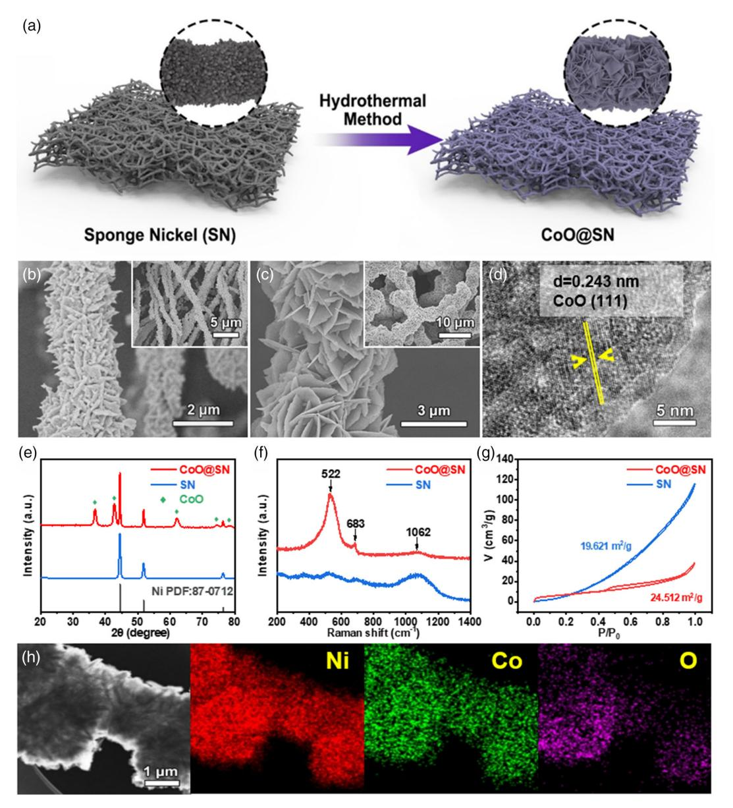
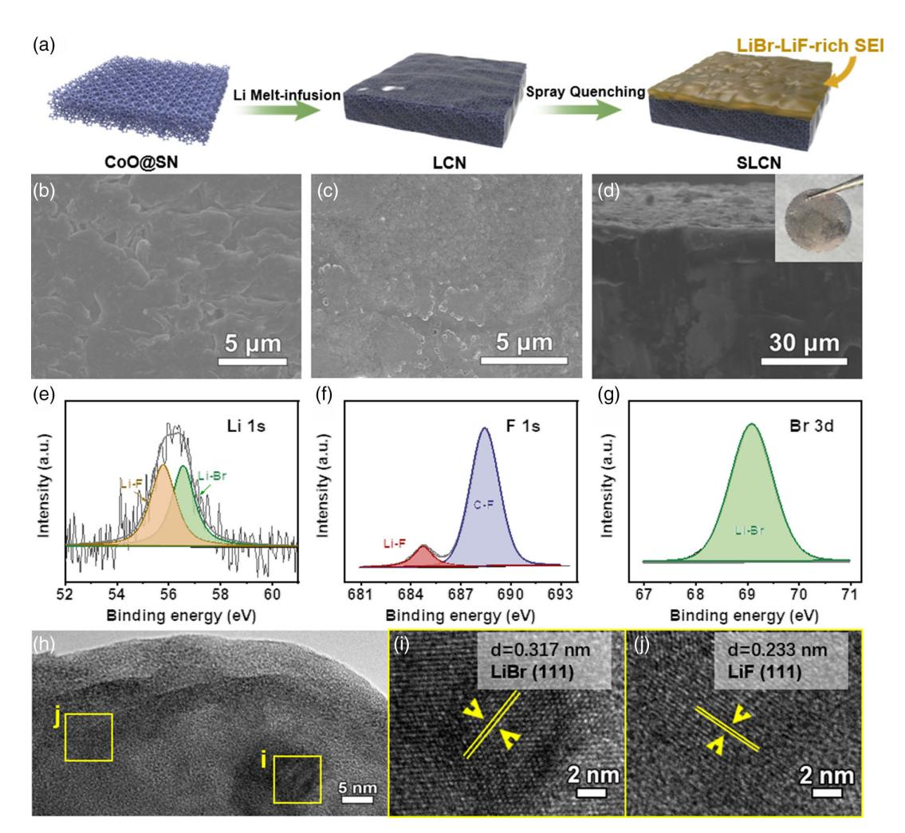
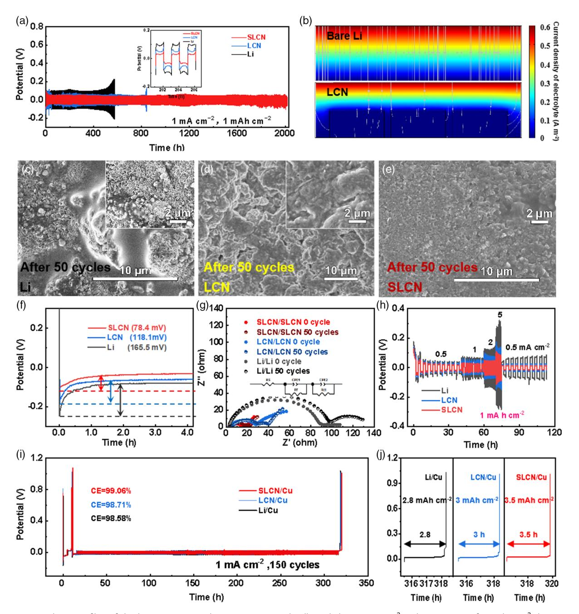
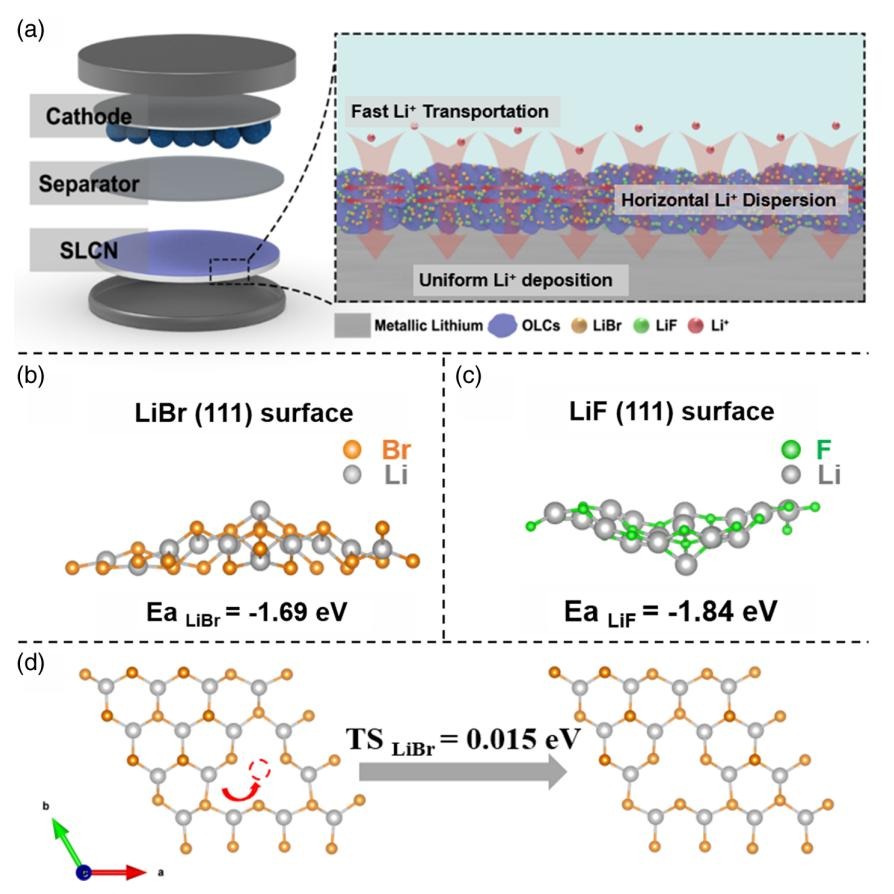
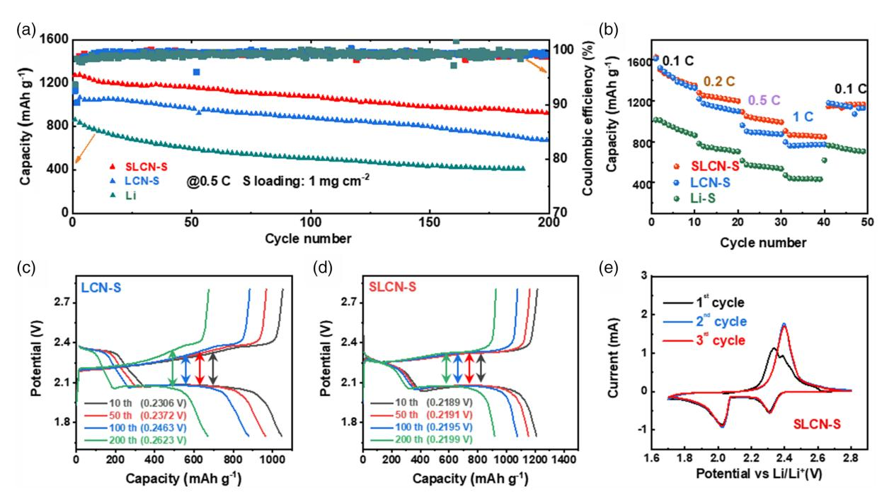

# LiBr-LiF-Rich Solid-Electrolyte Interface Layer on Lithiophilic 3D Framework for Enhanced Lithium **Metal Anode**

Ping Liu, Han Su, Yu Liu, Yu Zhong, \* Chunxiang Xian, Yonggi Zhang, \* Xiuli Wang, Xinhui Xia,\* and Jiangping Tu

Metallic lithium anode is considered as an ideal electrode for high-energy-density batteries. However, the uncontrollable growth of lithium dendrites, large volumetric change, and interfacial issues during the repeated plating and stripping processes severely hinder its practical applications. Herein, CoO nanosheetsdecorated sponge nickel are synthesized as a host skeleton for thermal-injected Li (LCN). The conductive 3D matrix serves as a fast electron transfer path to decrease polarization and homogenize the local current density to suppress the Li dendrite. Moreover, the confined framework can relieve the volume change of lithium metal anodes. Furthermore, an artificial LiBr-LiF-rich solid-electrolyte interface (SEI) layer is constructed at the surface of LCN by the in situ sprayquenching method. Such an inorganic-rich SEI provides fast longitudinal Li+ transportation and facilitates the uniform deposition of lithium. Accordingly, the SEI@Li/CoO@SN (SLCN) symmetrical cells exhibit a steady overpotential within 35 mV for 1700 h at 1 mA cm $-2$ /1 cm $-2$  and achieve high Coulombic efficiency of 99.06% after 150 cycles. Matching with the sulfur cathode, the full cells present promoted rate performance and cycling stability and show a high initial capacity of 1274 mAh  $g^{-1}$  and good capacity retention.

P. Liu, H. Su, Y. Liu, Y. Zhong, C. Xian, X. Wang, X. Xia, J. Tu State Key Laboratory of Silicon Materials

Key Laboratory of Advanced Materials and Applications for Batteries of Zhejiang Province School of Materials Science & Engineering Zhejiang University Hangzhou 310027, China E-mail: yu\_zhong@zju.edu.cn; helloxxh@zju.edu.cn Y  $7$ hang

Yangtze Delta Region Institute (Huzhou) & Institute of Fundamental and Frontier Science University of Electronic Science and Technology of China

Huzhou 313000, China E-mail: yqzhang@uestc.edu.cn X. Xia

State Key Laboratory of Photocatalysis on Energy and Environment **Fuzhou University** Fuzhou 350116, P. R. China

The ORCID identification number(s) for the author(s) of this article  $\textcircled{\scriptsize{b}}$ can be found under https://doi.org/10.1002/sstr.202200010.

#### DOI: 10.1002/sstr.202200010

## 1. Introduction

With the vigorous development of technology, there is an increasing demand for efficient, low-cost, environmentalfriendly, and long-life energy-storage devices, which can be applied for either portable electronic devices or electric vehicles.[1] However, the conventional graphite anode of lithium-ion batteries is close to the theoretical specific energy density, which is unable to meet the growing need of high-energy-density storage systems.[2] Therefore, it is desirable to develop next-generation, metal-based batteries with high energy density. Lithium metal-based batteries (LMBs) have been widely studied in recent years and regarded as one of the most attractive alternatives. Lithium metal anodes possess a much higher theoretical capacity of 3860 mAh  $g^{-1}$ , a low density of 0.59 g cm $-3$ , and the lowest electrochemical potential ( $-3.04$  V versus

standard hydrogen electrode).[3] Nevertheless, during repeated plating and stripping processes, the uncontrollable growth of lithium dendrites on the anode side will cause not only safety problems[4] but also continuous consumption of electrolytes and lithium.[5] These negative factors result in low Coulombic efficiency (CE)[6] and a short cycle life of LMBs.[7]

Targeting the aforementioned drawbacks, a series of effective measures have been adopted to protect Li metal anodes. Introducing a stable 3D structure skeleton into lithium metal anodes is a promising strategy (e.g., 3D porous Cu,[8] polymelamine-formaldehyde [PMF],[9] nanoporous Ni foam,[10] NOCA@Cu[11]). The 3D structure skeleton acts as a limited framework to relieve the volume change of lithium metal anodes and can effectively increase the specific surface area to reduce the surface current density, achieving a uniform deposition of Li.[12] Meanwhile, the thermal infusion method is acknowledged to be a facile and scalable way to infuse Li into the 3D skeleton,[13] which keeps the electrode pure and promotes uniform lithium deposition. Previously, our group reported a 3D sponge nickel (SN) skeleton for flexible lithium-sulfur batteries.[14] However, the pure metal frameworks do not have a satisfying affinity for lithium due to their poor wettability, making it difficult to obtain a close-knit Li/metal composite

anode directly.[15] According to previous reports, highly active lithiophilic oxides can spontaneously be wet with molten Li by physical absorption. It is reported that the  $\Delta G$  of the chemical reaction between CoO and molten Li is 63 kcal  $mol^{-1}$ , which means that CoO will not react with lithium during the thermal injection process.[12a,15] The physical absorption of molten Li makes it spontaneously wet the SN framework modified by CoO to form high-quality Li anodes after injection. The combination between SN and CoO has not been reported. Therefore, we construct CoO nanosheets-decorated SN fibers (CoO@SN) as the framework for lithium metal anodes. The CoO@SN sample demonstrates enhanced lithiophilicity, which is proved by a simple molten Li fusion experiment. The composite skeleton could be fully covered by molten Li within 15 s, much less than 30 s of pure SN (Figure S1, Supporting Information).

In spite of the progress we have made on the 3D skeleton, the highly active Li metal still easily reacts with organic electrolytes to form a rough and fragile SEI, resulting in decreased CE and capacity loss.[16] It is a consensus that the construction of the SEI with uniform structure and composition is favorable for the homogeneous stripping/plating of Li metal anode.[17] Therefore, prefabricating an artificial solid-electrolyte interface (SEI) (e.g., in situ LiF,[18] lithium-antimony [Li3Sb] alloy/lithium fluoride [LiF],[19] CNF-g-PSSLi,[20] Li2S,[21], etc.) on the surface of lithium metal anodes is considered to be a valuable approach. It is generally believed that an inorganic SEI layer which is electrically insulating can prevent the transfer of electrons from lithium metal to the electrolyte, further hindering the electrochemical reduction of the electrolyte components.[22] Among the inorganic components of artificial SEI layers, Li halide is well acknowledged as a helpful constituent of protecting the surface of lithium metal anodes. Particularly,  $Li\overline{F}$  has excellent interfacial properties,[7b] which can induce horizontal dispersion of lithium ions, facilitating the uniform deposition of lithium ions.[7b,23] However, LiBr provides a rapid channel for  $Li^+$  to transport because of the low diffusion barrier and high lithium adsorption capacity.[24] Given all that, it is meaningful to investigate the combined effect of LiF and LiBr in the SEI layer. In view of this, we further constructed an LiBr-LiF dual-inorganic-enriched SEI layer on the surface of the composite Li metal anode by the spray-quenching method. $[1\overline{6}b]$ 

In this work, we use a valid collaborative strategy of CoO@SN framework and SEI engineering to obtain eminent Li metal anodes. The multistage structure skeleton is a limited framework to confine volume change and simultaneously delivers a rapid electron conductive path.[25] In addition, a manmade LiBr-LiF-rich SEI layer, prepared by the spray-quenching method,[16b] can significantly improve the stability[26] and reversibility of the Li metal and suppress the dendrite growth.[23,24,27] In the symmetrical battery tests, the SLCN combines the advantages of lithiophilic CoO@SN matrix and in situ LiBr-LiF-rich SEI to deliver stable and low overpotential under 35 mV for 1700 h at 1 mA cm $-2$ /1 mAh cm $-2$ . When matching with the sulfur cathode, the SLCN-S full cells present a high initial capacity of 1274 mAh  $g^{-1}$  and good capacity retention.

#### 2. Results and Discussion

**Figure 1a** illustrates the synthesis process of CoO@SN. The SN framework was first prepared by a solvothermal method. Scanning electron microscopy (SEM) images indicate that there is plenty of space between the self-assembly sponge Ni fibers with a diameter of  $2-5 \mu m$ . Then, through a facile hydrothermal method, the composite skeleton CoO@SN was obtained. It can be observed that the intrinsic 3D crosslinked network is well maintained, while the diameter of CoO@SN increases to 4–7  $\mu$ m (Figure 1b,c). Significantly, CoO nanosheets with a thickness of 40 nm are homogeneously grown on the surface of SN (Figure S2a,b, Supporting Information). The high-resolution transmission electron microscopy (HRTEM) image (Figure 1d) displays a distinct lattice fringe of 0.243 nm, which is assigned to the (111) lattice plane of  $CoO$ .[3c] Hierarchical metal oxides@metal architecture is endowed with both fast electron transfer paths and a lithiophilic interface.[14] X-Ray diffraction (XRD) and Raman spectrum were further conducted to identify the phase of the as-prepared samples. As shown in Figure 1e, the XRD pattern of CoO@SN sample has both the characteristic peaks of metallic Ni and CoO, which are consistent with the standard patterns (JCPDS 87-0712 and JCPDS 75-0418). Meanwhile, the peaks at  $522$  and  $683 \text{ cm}^{-1}$  in the Raman spectrum of  $\overline{CoO@SN}$  (Figure 1f) can be well assigned to  $CoO.^{[28]}$  The above results demonstrate the formation of CoO@SN. Furthermore, the elemental mapping images of CoO@SN reveal a homogeneous distribution of Co (green), O (purple), and Ni (red) elements of the sample (Figure 1h), suggesting that the CoO nanosheets are uniformly grown on the surface of SN. The specific surface areas of the original SN and CoO@SN sample are calculated to be  $\approx$ 19.6 and  $\approx$ 24.5 m2 g-1 (Figure 1g), respectively. The increased specific surface area can provide more active sites for nucleation and deposition of lithium.

SLCN was prepared through a Li melt-infusion method, immediately followed by a high-temperature spray-quenching treatment (**Figure 2a**), and the lithium content is 0.0146 g cm $-2$  in each integrated electrode with a diameter of 15 mm. Figure S3a,b, Supporting Information, reveals the different morphologies of the as-prepared samples. The color turned from black to metallic sliver while fusion lithium was injected into the CoO@SN framework. As shown in Figure S3c,d, Supporting Information, the 3D structure is well maintained after infusion of metallic Li. The smooth surface of the fiber indicates that CoO@SN is covered by Li metal evenly. The surface of the LCN anode is loose and porous, making electrolytes infiltrate easily. (Figure 2b). The unfavorable reaction between the electrolytes and Li metal can be avoided to a certain extent because a dense and flat SEI layer can be obtained after spraying with  $CHBr2F$  (Figure 2c). The in situ-formed SEI layer with a thickness of  $3 \mu m$  can be achieved on the anode side, and the thickness of the anode is  $\approx$ 290 µm (Figure S4, Supporting Information). From a macroperspective, the color of the sample surface becomes golden. (Figure 2d). It is demonstrated by X-Ray photoelectron spectroscopy (XPS) spectra that there are lithium fluoride, lithium bromide, and organic lithium compounds (OLCs) in the SEI layer, which are derived from the

DVANCED www.advancedsciencenews.com

Figure 1. a) Diagram of the synthesis process of CoO@SN. Characterization of SN and CoO/SN. b) SEM images of SN. c) SEM images of CoO@SN. d) High-resolution transmission electron microscopy [TEM] images of CoO@SN. e) XRD patterns. f) Raman spectra. g)  $N_2$  isothermal adsorption/ desorption curves. h) Scanning transmission electron microscopy image of an individual CoO@SN and the corresponding elemental maps of Ni, Co, and O.

decomposition of CHBr2F pyrolytic reaction. (Figure 2 $e$ – $g$ ). The composite SEI is uniformly and continuously covered on the surface of LCN, forming an inorganic-organic mixed layer. In addition, the SN did not undergo obvious redox reactions during multistep processing (Figure S5a–c, Supporting Information). To further characterize the composition of the SEI layer, XRD tests were conducted on the samples before and after the spray-quenching method. According to the XRD (Figure S6, Supporting Information) and XPS (Figure S5c, Supporting Information) results, it is found that SLCN contains characteristic peaks of  $CHBr_2F$ , indicating that  $CHBr_2F$  does not completely decompose and its residue exists in the LiBr-LiF-rich SEI layer. Meanwhile, the peaks of LiBr and LiF can be found in the treated sample, proving the successful synthesis of the designed components. Some nanoparticles are wrapped by OLCs forming a mosaic texture (Figure 2h). HRTEM images (Figure 2i,j) of the artificial SEI layer show that the lattice spacings are measured to be 3.17 and 0.233 Å, which are matched with LiBr (111) and LiF (111) planes, respectively. Based on the above results, it is demonstrated that the artificial SEI is a LiBr-LiF-rich layer. The HRTEM test was also conducted to check the composition of the LiBr-LiF-rich SEI after 100 cycles under  $3 \text{ mA cm}^{-2}$ / 1 mAh cm $-2$  (Figure S7, Supporting Information). It is seen that the SEI layer still shows the typical lattice spacing of LiBr (111)

www.small-structures.com

Figure 2. a) The overall schematic procedure of SLCN. SEM images of b) LCN and c) SLCN. d) The cross-sectional SEM image of SLCN and an optical image in the inset. XPS spectra of SLCN: e) Li 1s, f) F 1s, and g) Br 3 d. HRTEM images of h) SEI layer; i) LiBr (111); and j) LiF (111).

and LiF (111) planes. This gives clear evidence that the composition of the LiBr-LiF-rich SEI layer does not change over long cycles and the artificial LiBr–LiF-rich layer has good stability.

**Figure 3a** shows the cycle performance of the bare Li metal, LCN, and SLCN anodes at a current density of 1 mA  $\text{cm}^{-2}$  with a Li stripping/plating capacity of 1 mAh  $\text{cm}^{-2}$  in the symmetrical cells. Among the samples, the SLCN symmetrical cells exhibit stable and flat voltage profiles under 35 mV for 1700 h while using the LCN anode maintained for 700 h (75 mV). In sharp contrast, the symmetrical cells with bare Li metal anodes show unstable and relatively large voltage polarization during cycling for less than 300 h. Selected voltage profiles are magnified inside, showing that SLCN anodes show a steady and relatively low overpotential within 34.7 mV at 200 h of cycling, better than those of Li/CoO@SN anodes (69.3 mV) and bare Li metal anodes (116.8 mV). The overpotential of SLCN anodes remains stable at 49 mV after cycling exceeded 1500 h, while the other two comparison samples loose efficacy. When the current density increases to  $3 \text{ mA cm}^{-2}$  with a constant capacity of 1 mAh cm $-2$ , the hysteresis of the SLCN anode is lower than that of LCN and bare Li anode (Figure S8, Supporting Information). The SLCN anode remains stable with the small voltage of 56.1 mV for more than 500 h, while LCN exhibits unstable and relatively large voltage polarization (79.3 mV) after 200 h and the cells with the bare Li metal electrode exhibits obvious cycle instability with large polarization during cycling. To check the enhanced performance, COMSOL Multiphysics simulations of the secondary current distributions at the electrolytes in bare Li anode and LCN anode systems are shown in Figure 3b, and the models of the two anodes are presented in Figure S11, Supporting Information. It is found that the current density distribution can be effectively regulated with the presence of a 3D framework, as the simulated current density of the LCN is lower compared with that of the same position in bare Li metal anodes. It implies that the modified anode can alleviate lithium dendrite problems caused by high local current density (Figure 3b). The appearance of the bare Li anodes became rough and uneven with large amounts of dendritic lithium and great volume expansion (Figure 3c). During repeated stripping/plating cycles, the LCN anodes show a loose structure (Figure 3d).

www.small-structures.com

**Figure 3.** a) Voltage profiles of the bare Li, LCN, and SLCN symmetrical cells cycled at  $1 \text{ mA cm}^{-2}$  with a capacity of  $1 \text{ mAh cm}^{-2}$ . b) COMSOL Multiphysics simulations of secondary current distribution at the electrolyte in bare Li and LCN cell systems. c-e) SEM images of Li, LCN, and SLCN anodes after 50 cycles at 1 mA cm-2/1 mAh cm-2. f) Galvanostatic discharge profiles of SLCN, LCN, and Cu foil anodes at 1 mA cm-2. g) Nyquist plots of different cells (inset: a simplified equivalent circuit; Rs: ohmic resistance of solution and electrodes; CPE: constant phase element; Rf: SEI film; Rct: charge transfer resistance). h) Rate performance of SLCN, LCN, and Li foil anodes in symmetrical cells. i) Li plating/stripping CE in SLCN/ Cu, LCN/Cu, and Li/Cu cells with a capacity of 1 mAh cm-2 at a current density of 1 mA cm-2. i) The capacity retention (measured by a Li stripping process).

However, the SLCN anodes with SEI layer still maintain a dense and plane morphology after cycling in SLCN symmetrical cells for 50 cycles at  $1 \text{ mA cm}^{-2}/1 \text{ mAh cm}^{-2}$  (Figure 3e). The nucleation overpotential is widely used to characterize the lithiophilicity of a certain material.[29] The nucleation overpotentials of Li on SLCN, LCN, and Li were measured at a current density of 1 mA cm $-2$  (Figure 3f), 78.4, 118.1, and 165.5 mV, respectively. The lithiophilicities of SLCN and LCN are demonstrated. The in situ optical microscopy was applied to better observe the growth of lithium dendrites (Figure S12, Supporting Information). The

bare Li side displays a mossy appearance at the beginning of the plating process. After 300 s of plating under a current density of  $5 \text{ mA cm}^{-2}$ , this anode is covered with a mass of Li dendrites. However, the SLCN anode does not undergo any obvious change and the dendrite growth is negligible even after 300 s plating. Figure 3g shows the Nyquist plots of symmetrical cells using bare Li, LCN, and SLCN as anodes at the fresh state and after 50 cycles at  $1 \text{ mA cm}^{-2}/1 \text{ mAh cm}^{-2}$ . The diameter of the semicircle at the high-frequency region represents the interface resistance of SEI ( $R_f$ ), while the low-frequency semicircle corresponds to the resistance of the charge transfer process between the electrode and electrolyte ( $Rct$ ). The SLCN anodes exhibit much lower values of  $R_f$  and  $R_{ct}$  than other counterparts, indicating that the enhanced stability of SLCN anodes brought the combination of LiF-LiBr-rich SEI and CoO@SN skeleton. In addition, after 50 cycles, the values of  $R_f$  and  $R_{ct}$  of the SLCN symmetrical cells are also better than the other counterparts, even though the  $R_f$  value (13.5  $\Omega$ ) has increased compared with that of the fresh state (10.33  $\Omega$ ). Meanwhile, we also constructed SEI layers with single LiF or LiBr using  $CF_4$  solution or  $C_{10}H_{21}Br$ via the spray-quenching method, respectively. To check the positive effect of LiBr and LiF, electrochemical impedance spectroscopy (EIS) was conducted and the results are shown in Figure S9, Supporting Information. Through the comparison of Nyquist plots (Figure S9, Supporting Information), notice that the Rf value of cells is in the order of  $LCN > LiF > LiBr> LiBr-LiF$ -rich

SEI. It suggests that the conductivity of SEI layers with LiBr or LiF is better than that of LCN, but the hybrid LiBr-LiF SEI layer shows the smallest impedance value, implying that the hybrid design is beneficial to improve the performance of Li metal anode. The superiority of the SLCN anodes enables it to work under various current densities (Figure 3h). The voltage polarization is 21.7, 26, 41.5, 84.3, and 13.3 mV at current densities of 0.5, 1, 2, 5, 10, and 0.5 mA  $\text{cm}^{-2}$ , respectively, which are superior to those of the LCN and the bare Li anodes. The Li plating/stripping voltage curves during long-term cycling (Figure 3i) and the enlarged detail of the capacity retention measured by a final Li stripping process (Figure 3j) demonstrate that SLCN-Cu cells show the highest CE of 99.06% among the samples, at a current of  $1.0 \text{ mA cm}^{-2}$ . The CEs of LCN and bare Li are 98.71% and 98.58%, respectively, suggesting that the LiBr-LiF-rich SEI has a high Li-ion conductive pathway and the existence of a 3D skeleton is beneficial for enhancement of cyclic performance.

The transport behaviors of  $Li$ + in the composite SEI layer are displayed in Figure 4a. LiF has excellent interfacial properties,[7b] which can induce horizontal dispersion of lithium ions, facilitating the uniform deposition of lithium ions.[7b,23] However, LiBr provides a rapid channel for Li+ to transfer because of the low diffusion barrier, suppressing the lithium dendrites.

Density functional theory (DFT) simulations were conducted to predict the advantages of LiBr and LiF components in the SEI

**Figure 4.** a) The schematic diagram of Li $+$  transport in the LiBr–LiF–OLC SEI layer. DFT calculations: the adsorption energies of b) LiBr (111) and c) LiF (111). d) The calculation of LiBr (111) diffusion barriers.

layer (Figure 4b,c). The LiBr (111) and the LiF (111) crystal planes are selected to simulate the adsorption and diffusion of Li atoms. As shown in Figure 4b, the adsorption energy of the Li atoms on the LiBr (111) plane is  $-1.69$  eV, while that of the Li atoms on LiF (111) is  $-1.84$  eV. It is generally accepted that higher adsorption energy is more favorable for the formation of more adsorption sites. Compared with other crystal plans of LiBr and LiF, [23,24,26a] the LiBr (111) and LiF (111) planes have stronger Li adsorption energy. In addition, the interfacial energy of LiF against Li metal is the highest (73.28 meV  $\AA^{-2}$ ), which can induce horizontal dispersion of lithium ions, promoting longitudinal transport and facilitating the uniform deposition of lithium ions.[7b,23] The diffusion rate of Li can be explored by the transition-state barrier of Li diffusion on the (111) crystal plane of LiBr. Figure 4d shows the calculation of the Li diffusion barrier between the two neighboring sites on the (111) plane of LiBr. The results indicate that LiBr (111) plane has very low Li diffusion barriers (0.015 eV), suggesting that Li atoms can diffuse rapidly. As a result, the LiBr-LiF-rich SEI can not only provide fast enough lithium-ion dynamics but also inhibit lithium dendrite growth and thereby improve battery life, consistent with the experiment results.

To emphasize the significance of the SLCN composite anode, full cells with bare Li, LCN, and SLCN anodes with S cathode were further assembled. Figure 5a exhibits the long-term cycling behavior of the three types of cells. The bare Li–S batteries have the lowest initial capacity of 860 mAh  $g^{-1}$  at 0.5 C. While for the cells with LCN anodes, the discharge capacity is 1177 mAh  $g^{-1}$  at 0.5 C for the first cycle and degrades gradually to 670 mAh  $g^{-1}$  at 200 cycles. In contrast, the cells with SLCN anodes show a higher initial discharge capacity of 1274 mAh  $g^{-1}$  and better capacity retention of 72.4% with a capacity of 922 mAh  $g^{-1}$  after 200 cycles. In the full cell system, the energy density and power density are calculated to be about 302.8 Wh kg-1 and 104.4 W kg-1 (based on the total weight of both anode and cathode). Even under the condition of high sulfur loading  $(4.3 \text{ mg cm}^{-2})$ , SLCN still has the best performance among all the cells (Figure S10, Supporting Information). Notice that SLCN anodes show an initial discharge capacity of 856.9 mAh  $g^{-1}$  and better capacity retention of 81.3% with a capacity of 696.4 mAh  $g^{-1}$ after 50 cycles. Figure 5c,d shows the voltage profiles of the full cells using LCN and SLCN anodes cycled at 0.5 C at the 10th, 50th, 100th, and 200th cycles. At the tenth cycle, the LCN-S and SLCN-S cells present very similar polarizations. Impressively, as the cycle number increases, the polarization gap of the LCN-S cells increases from 0.2306 to 0.2623 V. However, the polarization gap of the SLCN cells is almost the same during these cycles ( $\approx$ 0.2190 mV). Figure 5e shows the cyclic voltammetry (CV) curves of full cells with SLCN anodes at a scan rate of  $0.1 \text{ mV s}^{-1}$ . After activation at the first cycle, the CV curve becomes stable with overlapped peak potentials, suggesting good electrochemical reversibility and stability. It can be seen from Figure 5b that the specific capacities of the modified cells are almost the same at a low cycling rate, while the difference in capacity becomes obvious as the current density increases. Cells with SLCN anodes show enhanced discharge capacity, especially at high cycling rates. It displays a capacity of  $861 \text{ mAh g}^{-1}$  at 1 C, whereas the capacity for cells with LCN anodes is only 764 mAh  $g^{-1}$ . At different test conditions, the bare Li–S cells always have the lowest capacities, which only have a capacity of 436 mAh  $g^{-1}$  at 1 C. These results demonstrate excellent rate performance and cycling stability of cells with

Figure 5. a) Long-term cycling performance of SLCN-S, LCN-S, and Li-S cells at 0.5 C. b) Rate capability of SLCN-S, LCN-S, and bare Li-S cells. c,d) Corresponding charge/discharge profiles of LCN-S and SLCN-S batteries after 10, 50, 100, and 200th cycles. e) Cyclic voltammogram at a scan rate of 0.1 mV  $s^{-1}$ .

CIENCE NEWS www.advancedsciencenews.com

**ADVANCED** 

SLCN anodes as well as its great potential for practical application.

#### 3. Conclusion

In conclusion, we have designed a multistage CoO@SN as a 3D host for thermal injected Li. CoO nanosheets on the SN can improve the lithiophilicity significantly and induce the deposition of Li metal on SN in short time via thermal infusion. In addition, the artificial LiBr-LiF-rich SEI layer obtained on the composite Li anode surface by the spray-quenching method can improve the stability and reversibility of the Li anodes, benefiting from the excellent interfacial properties of LiF and LiBr. The SEI@Li/CoO@SN (SLCN) composite anode exhibits remarkable cycling stability with a low overpotential under 37 mV in the symmetrical cells for more than 1700 h at 1 mA cm $-2$ /1 mAh cm $-2$  and high CE. When coupled with the S cathode, the SLCN anode can notably improve the cyclic stability and rate capability. This work verifies that combining an artificial SEI layer with a 3D multistage frame in Li metal anode is an effective way for fabricating advanced composite Li anodes.

#### 4. Experimental Section

Synthesis of CoO Nanosheets-Decorated SN (CoO@SN): The SN was prepared according to the method reported in the literature.[14] Then, CoO nanosheets on SN were grown by the following hydrothermal method. Typically, 3 mmol of Co  $(NO_3)_2 \cdot 6H_2O$  and 15 mmol of urea were dissolved in 75 mL deionized water under magnetic stirring for 15 min. Then, the mixture was transferred into a 100 mL Teflon-lined steel autoclave with SN for hydrothermal reaction at 120 °C for 10 h. After natural cooling, the product was washed with deionized water and ethanol and dried in the oven at  $80^{\circ}$ C for 2 h. Then, the sample was heated at 400 °C for 3 h in Ar atmosphere to obtain CoO@SN skeleton.

Synthesis of Li/CoO@SN (LCN) and SEI@Li/CoO@SN (SLCN) Anodes: The Li melt-infusion process was carried out in a glovebox, in which the  $O_2$ and  $H_2O$  content should be maintained at less than 0.1 ppm. An appropriate amount of fresh lithium foil was put into a nickel crucible to heat to 250°C. When lithium was completely melted, the CoO@SN contacted with molten Li to form Li/CoO@SN (LCN) anodes within 15s (Figure S1b, Supporting Information). The LiBr-LiF-rich SEI layer was prepared as follows. CHBr2F solution was instantaneously sprayed on the surface of LCN, which was heated at 250 °C in a glove box protected by Ar. Then, the sample was transferred on a plate with 25 °C to cool naturally to form SEI@Li/CoO@SN (SLCN) anodes. The synthetic diagram is presented in Figure S13, Supporting Information.

Synthesis of Sulfur Cathodes: The S cathode was prepared by a meltdiffusion method. The S powder and C nanoparticles were mixed with a weight ratio of 70:30 and heated in a sealed container at 155° for 12 h to form S/C composites. Then, 80 wt% S, 10 wt% carbon black, and 10 wt% polyvinylidene fluoride (PVDF) were homogeneously ground and mixed in  $N$ -methyl-2-pyrrolidinone (NMP) to form a homogeneous slurry, which was further coated on an Al foil to form sulfur cathodes.

Materials Characterization: SEM (Hitachi s-4800), TEM (FEI Tecnai G2 F20 at 200 kV) with an energy-dispersive X-Ray (EDX) detector, Raman spectrum (Renishaw-inVia), X-Ray powder diffraction (XRD, Rigaku D/max 2550 PC), and XPS (Thermo Scientific K-Alpha+) were used to analyze the morphology and composition of the samples. The specific surface area was tested by Brunauer-Emmett-Teller (BET, BET, JW-BK112).

Electrochemical Characterization: All the batteries were carried out using standard CR2032-type coin cells with a microporous polypropylene (PP) film (Celgard, 2400) in an Ar-filled glove box, in which the  $O_2$  and  $H_2O$ content was less than 0.1 ppm. The coin cells configured  $1 \text{ M}$  lithium bis (trifluoromethane sulfonyl) imide (LiTFSI) in 1, 3-dioxolane (DOL)/ 1, 2-dimethoxyethane (DME) (1:1 in volume) with  $1\%$  LiNO3 additive as the electrolyte. EIS was carried out from a Princeton Applied Research advanced electrochemical system with an amplitude of 10 mV. The calculation of CE was based on several parameters mainly including an initial total Li plating capacity (QT), galvanostatic cycles at a fixed capacity (QC) for  $n$  cycles, and capacity retention (QR) measured by a final Li stripping process with a cutoff voltage of 1 V. The cycling CE value was equal to the following equation:  $CE = (nQC + QR)/(nQC + QT)$ . The cells were tested at 1 mA cm-2 with a capacity of 1 mAh cm-2, and the initial total Li plating capacity was 5 mAh  $cm^{-2}$ 

Calculating Method: The calculation of adsorption energy was performed using the Vienna Ab initio Simulation Package (VASP) based on DFT. The projector augmented wave (PAW) method with a cutoff energy of 480 eV was used to describe the interaction between the core and valence electrons. The geometry optimizations were conducted with the conjugate gradient method, and the convergence threshold was set to  $10^{-4}$  eV in energy and 0.02 eV Å-1 in force. A one-layer slab was built for the simulation on LiF (111) and LiBr (111) lattice planes. A 15 Å thick vacuum layer in the Z-direction was introduced for the interface. A Monkhorst–Pack mesh of  $3 \times 3 \times 1$  k-points was used for structural relaxation, while a  $4 \times 4 \times 1$  *k*-point mesh was used for static calculations. The adsorption energy of Li atoms  $E_{ad}$  is defined as follows.

$$E_{\text{ad}} = E_{\text{total}} - E_{\text{slab}} - E_{\text{Li}} \tag{1}$$

where  $E_{slab}$  is the energy of the slab,  $E_{total}$  is the energy of the whole system with adsorbed Li atoms, and  $E_{Li}$  is the energy of one isolated Li atom. The diffusion barrier of  $Li^+$  in LiBr was obtained by CI-NEB methods. Visualization of the results was made by Visualization for Electronic and Structure Analysis (VESTA).[30]

COMSOL Multiphysics Simulations: The simulations were carried out on COMSOL Multiphysics 5.5 software using the physics module of "secondary current distribution" and Butler-Volmer expressions of hydrodynamics at room temperature in the bulk electrolyte. The model box for electric field distribution analysis was  $300 \times 100 \times 30 \mu m^3$ , which was filled with a typical electrolyte of  $1 \text{ M}$  LiTFSI in DOL/DME (volume ratio = 1:1) with ion conductivity of 1.1 S m $-1$  based on the previous study. As for the 3D model of the CoO@SN sample, each nanosheet was established as a cuboid with  $50\times80\times3\,\mu m^3.$  The detailed geometric constructions are shown in Figure S11, upporting Information.

#### **Supporting Information**

Supporting Information is available from the Wiley Online Library or from the author.

### **Acknowledgements**

This work was supported by National Natural Science Foundation of China (grant no. 52073252) and Natural Science Funds for Distinguished Young Scholars of Zhejiang Province (grant no. LR20E020001). Y.Z. acknowledges the support by China Postdoctoral Science Foundation (grant no. 2020M680076). X.X. acknowledges the support by the Open Project Program of the State Key Laboratory of Photocatalysis on Energy and Environment (grant no. SKLPEE-KF202206), Fuzhou University.

## **Conflict of Interest**

The authors declare no conflict of interest.

## Data Availability Statement

Research data are not shared.

## Keywords

artificial solid–electrolyte interphases, cobalt oxide nanosheets, lithium metal anode, sponge nickel, spray quenching

Received: January 15, 2022

Revised: March 6, 2022

Published online: April 9, 2022

- [1] X. Zhang, L. Hou, A. Ciesielski, P. Samorì, Adv. Mater. 2016, 6, 1600671.
- [2] a) Z. Hou, Y. Yu, W. Wang, X. Zhao, Q. Di, Q. Chen, W. Chen, Y. Liu, Z. Quan, ACS Appl. Mater. Interfaces 2019, 11, 8148; b) D. Lin, Y. Liu, Y. Cui, Nat. Nanotechnol. 2017, 12, 194. c) Y. Liu, G. Zhou, K. Liu, Y. Cui, Acc. Chem. Res. 2017, 50, 2895; d) Z. Zhao, Z. Xue, Q. Xiong, Y. Zhang, X. Hu, H. Chi, H. Qin, Y. Yuan, H. Ni, Sustainable Mater. Technol. 2021, 30, e0057.
- [3] a) B. Liu, J.-G. Zhang, W. Xu, Joule 2018, 2, 833; b) L. Li, S. Li, Y. Lu, Chem. Commun. 2018, 54, 6648; c) L. Chen, G. Chen, W. Tang, H. Wang, F. Chen, X. Liu, R. Ma, Mater. Today Energy 2020, 18, 100520.
- [4] X.-R. Chen, C. Yan, J.-F. Ding, H.-J. Peng, Q. Zhang, J. Energy Chem. 2021, 62, 289.
- [5] a) Y. Chen, Y. Luo, H. Zhang, C. Qu, H. Zhang, X. Li, Small Methods 2019, 3, 1800551; b) H. Liu, X. B. Cheng, R. Xu, X. Q. Zhang, C. Yan, J. Q. Huang, Q. Zhang, Adv. Energy Materials 2019, 9, 1902254.
- [6] S. Li, Z. Luo, L. Li, J. Hu, G. Zou, H. Hou, X. Ji, Energy Storage Mater. 2020, 32, 306.
- [7] a) S. Yun, Y. Zhang, Q. Xu, J. Liu, Y. Qin, Nano Energy 2019, 60, 600; b) C. Cui, C. Yang, N. Eidson, J. Chen, F. Han, L. Chen, C. Luo, P. F. Wang, X. Fan, C. Wang, Adv. Mater. 2020, 32, e1906427; c) L. Zhang, C. Zhu, S. Yu, D. Ge, H. Zhou, J. Energy Chem. 2022, 66, 260.
- [8] Q. Li, S. Zhu, Y. Lu, Adv. Funct. Mater. 2017, 27, 1606422.
- [9] L. Fan, H. L. Zhuang, W. Zhang, Y. Fu, Z. Liao, Y. Lu, Adv. Mater. 2018, 8, 1606422.
- [10] a) R. Zhang, X. B. Cheng, C. Z. Zhao, H. J. Peng, J. L. Shi, J. Q. Huang, J. Wang, F. Wei, Q. Zhang, Adv. Mater. 2016, 28, 2155; b) S. Liu, H. Zhang, X. Liu, Y. Yang, C. Chi, S. Wang, J. Xue, T. Hao, J. Zhao, Y. Li, J. Energy Chem. 2021, 58, 124.
- [11] Z. Xu, L. Xu, Z. Xu, Z. Deng, X. Wang, Adv. Funct. Mater. 2021, 31, 2102354.
- [12] a) R. Zhang, Y. Li, M. Wang, D. Li, J. Zhou, L. Xie, T. Wang, W. Tian, Y. Zhai, H. Gong, M. Gao, K. Liang, P. Chen, B. Kong, Small 2021, 17, e2101301; b) L. Huang, S. Shen, Y. Zhong, Y. Zhang, L. Zhang, X. Wang, X. Xia, X. Tong, J. Zhou, J. Tu, Adv. Mater. 2022, 34, e2107415.
- [13] a) D. Lin, Y. Liu, Z. Liang, H. W. Lee, J. Sun, H. Wang, K. Yan, J. Xie, Y. Cui, Nat. Nanotechnol. 2016, 11, 626; b) X.-Y. Yue, W.-W. Wang,

Q.-C. Wang, J.-K. Meng, Z.-Q. Zhang, X.-J. Wu, X.-Q. Yang, Y.-N. Zhou, Energy Storage Mater. 2018, 14, 335; c) X.-Y. Yue, W.-W. Wang, Q.-C. Wang, J.-K. Meng, X.-X. Wang, Y. Song, Z.-W. Fu, X.-J. Wu, Y.-N. Zhou, Energy Storage Mater. 2019, 21, 180.

- [14] B. Liu, Y. Zhang, Z. Wang, C. Ai, S. Liu, P. Liu, Y. Zhong, S. Lin, S. Deng, Q. Liu, G. Pan, X. Wang, X. Xia, J. Tu, Adv. Mater. 2020, 32, e2003657.
- [15] a) X.-Y. Yue, J. Bao, S.-Y. Yang, R.-J. Luo, Q.-C. Wang, X.-J. Wu, Z. Shadike, X.-Q. Yang, Y.-N. Zhou, Nano Energy 2020, 71, 104614; b) B. Yu, T. Tao, S. Mateti, S. Lu, Y. Chen, Adv. Funct. Mater. 2018, 28, 1803023.
- [16] a) S. Liu, X. Xia, Z. Yao, J. Wu, L. Zhang, S. Deng, C. Zhou, S. Shen, X. Wang, J. Tu, Small Methods 2018, 2, 1800035; b) S. Liu, X. Xia, S. Deng, D. Xie, Z. Yao, L. Zhang, S. Zhang, X. Wang, J. Tu, Adv. Mater. 2019, 31, e1806470.
- [17] a) F. N. Jiang, S. J. Yang, H. Liu, X. B. Cheng, L. Liu, R. Xiang, Q. Zhang, S. Kaskel, J. Q. Huang, SusMat 2021, 1, 506; b) R. Xu, J. F. Ding, X. X. Ma, C. Yan, Y. X. Yao, J. Q. Huang, Adv. Mater. 2021, 33, e2105962.
- [18] H. Kim, Y. S. Kim, J. Yoo, Sustainable Energy Fuels 2020, 4, 3282.
- [19] A. Hu, W. Chen, X. Du, Y. Hu, T. Lei, H. Wang, L. Xue, Y. Li, H. Sun, Y. Yan, J. Long, C. Shu, J. Zhu, B. Li, X. Wang, J. Xiong, Energy Environ. Sci. 2021, 14, 4115.
- [20] J. Zeng, Q. Liu, D. Jia, R. Liu, S. Liu, B. Zheng, Y. Zhu, R. Fu, D. Wu, Energy Storage Mater. 2021, 41, 697.
- [21] H. Chen, A. Pei, D. Lin, J. Xie, A. Yang, J. Xu, K. Lin, J. Wang, H. Wang, F. Shi, D. Boyle, Y. Cui, Adv. Mater. 2019, 9, 1900858.
- [22] a) Y. Zhao, M. Amirmaleki, Q. Sun, C. Zhao, A. Codirenzi, L. V. Goncharova, C. Wang, K. Adair, X. Li, X. Yang, F. Zhao, R. Li, T. Filleter, M. Cai, X. Sun, Matter 2019, 1, 1215; b) R. Xu, Y. Xiao, R. Zhang, X. B. Cheng, C. Z. Zhao, X. Q. Zhang, C. Yan, Q. Zhang, J. Q. Huang, Adv. Mater. 2019, 31, e1808392.
- [23] Y. Wang, F. Liu, G. Fan, X. Qiu, J. Liu, Z. Yan, K. Zhang, F. Cheng, J. Chen, J. Am. Chem. Soc. 2021, 143, 2829.
- [24] M. Wang, Z. Peng, W. Luo, F. Ren, Z. Li, Q. Zhang, H. He, C. Ouyang, D. Wang, Adv. Mater. 2019, 9, 1802912.
- [25] S. Shen, L. Huang, X. Tong, R. Zhou, Y. Zhong, Q. Xiong, L. Zhang, X. Wang, X. Xia, J. Tu, Adv. Mater. 2021, 33, e2102796.
- [26] a) Y. Ren, Z. Qi, C. Zhang, S. Yang, X. Ma, X. Liu, X. Tan, S. Sun, Y. Cao, Comput. Mater. Sci 2020, 176, 109535; b) S. Hao, H. Zhang, W. Yao, J. Lin, J. Power Sources 2018, 393, 128.
- [27] a) J. Lang, Y. Long, J. Qu, X. Luo, H. Wei, K. Huang, H. Zhang, L. Qi, Q. Zhang, Z. Li, H. Wu, Energy Storage Mater. 2019, 16, 85; b) Y. Lu, Z. Tu, J. Shu, L. A. Archer, J. Power Sources 2015, 279, 413.
- [28] a) Y. Li, W. Qiu, F. Qin, H. Fang, V. G. Hadjiev, D. Litvinov, J. Bao, J. Phys. Chem. C 2016, 120, 4511. b) X. Wang, F. Zhang, X. Zhu, B. Xia, J. Chen, S. Qiu, J. Li, J. Colloid Interface Sci. 2009, 337, 272.
- [29] a) A. Pei, G. Zheng, F. Shi, Y. Li, Y. Cui, Nano Lett. 2017, 17, 1132; b) B. Thirumalraj, T. T. Hagos, C. J. Huang, M. A. Teshager, J. H. Cheng, W. N. Su, B. J. Hwang, J. Am. Chem. Soc. 2019, 141, 18612.
- [30] a) M. Mamatkulov, J. S. Filhol, Phys. Chem. Chem. Phys. 2011, 13, 7675; b) P. E. Blochl, Phys. Rev. B: Condens. Matter. 1994, 50, 17953.