#### **REVIEW**

# **Interface science in polymer-based composite solid electrolytes in lithium metal batteries**

**Zhiyuan Lin1,2 Haijun Yu1,2**

**Lingqiao Wu1,2 Yongtao Wang1,2 Xianwei Guo1,2 Peipei Ding1,2**

1 Faculty of Materials and Manufacturing, Institute of Advanced Battery Materials and Devices, Beijing University of Technology, Beijing, China

2Key Laboratory of Advanced Functional Materials, Ministry of Education, Beijing University of Technology, Beijing, China

#### **Correspondence**

Haijun Yu, Institute of Advanced Battery Materials and Devices, Faculty of Materials and Manufacturing, Beijing University of Technology, Beijing 100124, China. Email: [hj-yu@bjut.edu.cn](mailto:hj-yu@bjut.edu.cn)

Lingqiao Wu and Yongtao Wang contributed equally to this work.

#### **Funding information**

The Youth Beijing Scholars program, Grant/Award Number: PXM2021\_014204\_000023; Beijing Natural Science Foundation, Grant/Award Numbers: KZ201910005002, KZ202010005007, 2222001; National Natural Science Foundation of China, Grant/Award Numbers: 21875007, 21975006, U19A2018, 22075007, 52002007, 22002004; General Program of Science and Technology Development Project of Beijing Municipal Education Commission, Grant/Award Number: KM202110005009; China Postdoctoral Science Foundation, Grant/Award Number: 2021M700297

### **1 INTRODUCTION**

#### **Abstract**

Solid-state lithium metal batteries (SSLMBs) have attracted considerable attention as one of the most promising energy storage systems owing to their high safety and energy density. Solid electrolytes, particularly polymer-based composite solid electrolytes (CSEs), are considered promising electrolyte candidates for SSLMBs. However, their wide application is inhibited by various electrochemical issues, such as low ionic conductivity, the growth of lithium dendrites, and poor cycling stability, which are related to interface issues within SSLMBs. In this review, the parameters related to various interfaces in the CSE of SSLMBs, including the interfaces between the polymer matrix and inorganic fillers, between the CSEs and the cathode, and between the CSEs and the lithium metal anode, are examined. Relevant issues and corresponding remediation strategies are proposed. Finally, future perspectives based on interfacial engineering and the characterization of polymer/inorganic filler interactions are proposed for building high-performance CSEs for use in SSLMBs.

#### **KEYWORDS**

composite solid electrolyte interface, electrolyte/electrode, organic–inorganic composite solid electrolyte, solid-state lithium metal battery

Renewable energy storage requirements and the ongoing electrification of transportation have led scientists to explore high-efficiency capacitive energy storage applications[.1](#page-22-0) Currently, rechargeable lithium batteries are extensively developed and considered one of the most promising power storage devices for electric vehicles

This is an open access article under the terms of the [Creative Commons Attribution](http://creativecommons.org/licenses/by/4.0/) License, which permits use, distribution and reproduction in any medium, provided the original work is properly cited.

© 2022 The Authors. *SusMat* published by Sichuan University and John Wiley & Sons Australia, Ltd.

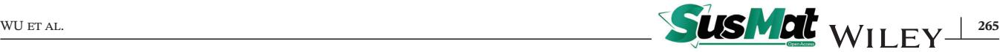

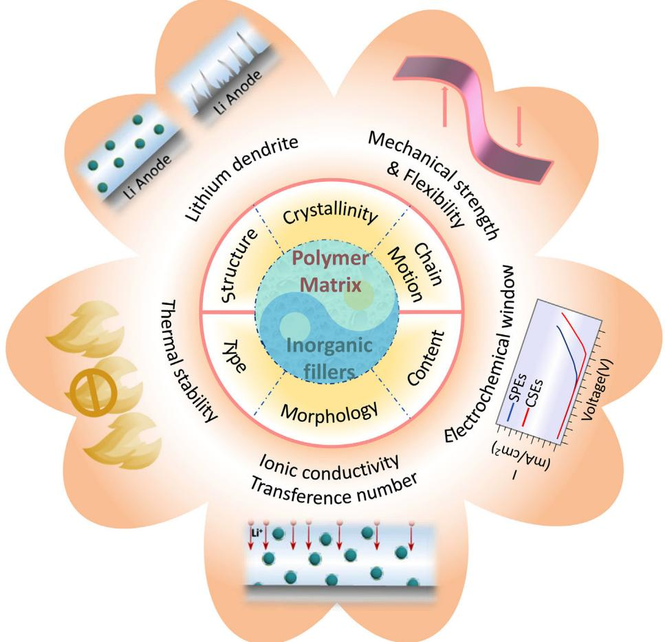

**FIGURE 1** The performance characteristics of composite solid electrolytes (CSEs) and the factors influencing these characteristics

and large-scale energy storage because of their high operating voltage, high energy density, and long cycle life[.2–4](#page-22-0) The liquid electrolytes such as lithium ions carries used in commercially available lithium batteries can offer high ionic conductivity and excellent wettability with electrodes[.5](#page-22-0) However, these batteries suffer from a series of safety issues because of the flammability of organic liquid electrolytes[.6](#page-22-0) The rise of portable electronic devices, electric vehicles, and grid-energy storage systems has increased the requirements of lithium batteries[,7–11](#page-22-0) including the demand for higher energy density, higher electrochemical stability, and a higher level of safety (Figure 1). Thus, solid-state lithium metal batteries (SSLMBs) are developed for solving these issues.[10,12–14](#page-22-0)

SSLMBs, in contrast, are inherently safer because of the lack of flammable organic components, but also provide the potential for a considerable enhancement in energy density[.15](#page-22-0) The major difference in a SSLMB compared with a traditional liquid battery is the alternative solid-state electrolyte (SSE) instead of an organic liquid electrolyte (Figure 2). SSEs can be categorized into two types: solid polymer electrolytes (SPEs) and inorganic

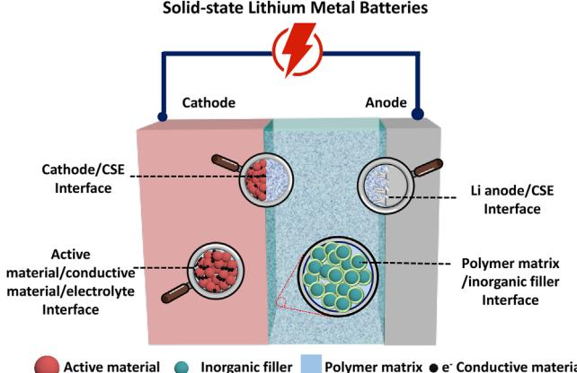

**FIGURE 2** Schematic diagram of solid-state lithium metal batteries (SSLMBs) assembled with CSEs

solid electrolytes (ISEs)[.16](#page-22-0) SPEs consist of polymers and lithium salts, which consequently possess excellent processability and flexibility and can make close contact with electrodes[.17–19](#page-22-0) Unfortunately, traditional SPEs are associated with poor ionic conductivity at room temperature, inferior cycling ability, side reactions with electrodes, and lithium dendrite growth, which make them unsuitable for practical applications.[20–25](#page-22-0) In contrast, ISEs usually exhibit much higher ionic conductivities in the range of 10−4 to 10−2 S cm−1 and a wide electrochemical window at room temperature[.26–29](#page-22-0) However, ISEs are brittle and exhibit high interfacial resistance owing to their poor mechanical compatibility with electrodes[.30](#page-22-0) Although many efforts have been made to address these problems in the past decades, there is still no single SPE or ISE to fulfill the essential requirements for achieving high performance of SSLMBs: decent ionic conductivity, wide electrochemical window, and good interfacial compatibility with electrodes[.31–33](#page-22-0)

A third approach, polymer-based composite solid electrolytes (CSEs) formed by adding inorganic fillers into a polymer matrix are considered one of the most promising candidate electrolytes for SSLMBs because of their integration of the merits of both ISEs and SPEs (Figure [1\)](#page-1-0). Compared with single ISE and single SPE, CSE is expected to result in high ionic conductivity/a high Li-ion transference number, a wide electrochemical window, salient mechanical properties, and good interfacial contact, as shown in Figure [1.](#page-1-0) [34](#page-22-0) Thus, exploiting polymer-based CSEs with enhanced electrochemical performance is an extremely attractive strategy for improving the performance of SSLMBs[.34–39](#page-22-0) Even though the ionic conductivity, electrochemical stable window, and mechanical strength of CSE could be improved to some extent, its development is limited by the common interfacial issues of SSE, such as loos contact, chemical and electrochemical stability, lithium dendrites, as well as the interfacial issues between polymer matrix and inorganic filles (Figure [2\)](#page-1-0)[.40–44](#page-23-0)

Many reviews have focused on the composition and electrochemical properties of CSEs based on active/inert fillers with a polymer matrix[,37,45–50](#page-22-0) Unfortunately, to date, few studies have systematically discussed the interfaces in SSLMBs based on CSEs. In this review, the construction of CSEs is discussed, focusing on the interface and interaction between the polymer matrix and inorganic fillers, as well as the migration of Li ions in CSEs. The quasi-solid composite electrolyte and the gel composite electrolyte are not discussed. Subsequently, the interfaces between the CSEs and cathode/anode, including the interfacial issues and remedies for stabilizing the CSE/electrode interface, are introduced. Finally, perspectives regarding exploiting more reliable CSEs with enhanced performance are considered. Revealing the Li ions transport mechanism in CSEs as well as the interface issues between the polymer matrix and inorganic fillers, CSEs and electrodes are important for establishing outstanding CSEs for industrial application.

# **2 DESIGN OF CSES**

Early reports of CSEs can be dated back to 1982, when Weston et al[.51](#page-23-0) investigated the addition of an inert inorganic filler (10 vol.% *α*-Al2O3) into a poly(ethylene oxide) (PEO) matrix and observed a significantly increased mechanical stability above the 100◦C operation temperature. In 1988, a CSE containing PEO, ionic conductive lithium nitride, and lithium trifluoromethanesulfonate (LiCF3SO3) was fabricated, which exhibited 1000 times enhanced ionic conductivity, compared with electrolytes consisting only of PEO and LiCF3SO3. [52](#page-23-0) Since then, extensive efforts have been made to improve the chemical/electrochemical performance of SPEs by integrating inorganic fillers into the polymer matrix. The inorganic fillers added to the polymer matrix serve two main functions: (i) decreasing the crystallinity and glass transition temperature of the polymer to improve its ability to transport Li ions at room temperature; (ii) promoting the dissociation of lithium salts based on the Lewis acid–base theory to increase the concentration of free Li ions.

However, compared with liquid electrolyte batteries, most SSLMBs based on CSEs show higher polarization, lower power density, poor cycling stability, and inferior capacity, which are largely ascribed to interfacial issues[.53](#page-23-0) Because of the diverse physical, chemical, and mechanical properties of different components when CSEs are employed in SSLMBs, various interfaces in solid–solid contact are present in these kinds of batteries. These interfaces not only influence Li ions transport but also affect the chemical, mechanical, and electrochemical stability of the SSLMB. These properties depend on the CSE's intrinsic characteristics, chemical composition, and spatial distribution. Designing rational CSEs by adding inorganic fillers into a polymer matrix with various functional groups is extremely important to achieve a practical CSE possessing outstanding electrochemical performance. In recent years, there have been several reviews on CSEs for lithium-ion batteries, which focused on the compositions of the CSEs and discussion of different types of inorganic fillers[.54,55](#page-23-0) In this section, we will discuss the construction of the CSEs. In contrast to previous reviews, our discussions are mainly centered on the functionality of components and the summary of methods for building CSEs.

#### **2.1 Constructions of CSEs**

As shown in Figure [2,](#page-1-0) the CSE is one of the most important components of a SSLMB, which significantly impacts its safety, cycling performance, and energy density. CSEs consist of polymers, inorganic fillers, and lithium salts. Lithium salts have been widely discussed in the literature,[56](#page-23-0) in this section, we describe the polymers and inorganic fillers, including their functional groups, crystallinities, polymer chain motions, types, sizes, and morphologies. We also summarize methods for constructing CSEs with the goal of promoting the practical application of high-performance SSLMBs based on CSEs.

#### 2.1.1 Components in CSEs

The polymer matrix is one of the major components of CSEs. Thus, it is of great importance to know its ionic conduction mechanism and characteristics, which could affect the chemical, electrochemical, and mechanical performance of the corresponding electrolyte filled with inorganic fillers. The structure, crystallinity, and polymer chain mobility of the electrolyte are the three major factors that influence performance, as shown in Figure [1.](#page-1-0) [21](#page-22-0) Hence, we first need to understand the characteristics of the polymer matrix and inorganic fillers to understand their effects on the electrochemical performance of SSLMBs.

#### *Polymer matrix*

Generally, Li ions migration occurs along the polymer chains in SPEs by coordination/dissociation as a result of specific polar functional groups with a high dielectric constant. To date, various polymers have been investigated, including PEO, polyvinylidene fluoride (PVDF), polyacrylonitrile (PAN), poly(vinyl carbonate) and poly(propylene carbonate) (PPC), as well as other polymers with relatively high dielectric constants[.54,57,58](#page-23-0) Their structures contain some polar functional groups, such as ─O─, ─CF2─, ─N─, C═O, and C≡N, which are helpful for dissolving lithium salts and transporting Li ions due to the interaction between polar groups and Li ions from lithium salts[.59](#page-23-0) These polar groups tend to interact with O atoms in ceramics crosslinked by Li ions, which promotes the Li ions migration and stabilizes the CSE.

PEO-based CSEs have been investigated most intensively because of their excellent ability to dissolve lithium salts and good interface contact with electrodes. Nonetheless, typical linear PEO electrolytes exhibit a very low Li ions conductivity at room temperature owing to their relatively high degree of crystallization[.18](#page-22-0) In addition, their poor high-voltage stability severely hinders their further commercialization. Different defect strategies have been proposed to improve their ionic conductivity, including blendin[g60](#page-23-0) or crosslinkin[g19](#page-22-0) with other polymers, designing "soft and hard" block polymers[,58,61](#page-23-0) or adding inorganic fillers[.62–64](#page-23-0) Unlike PEO, PAN contains an electron-withdrawing nitrogen group (─C≡N─), endowing the polymer with a high anodic oxidization potential and favorable interaction with Li ions. This leads to PAN-based electrolytes possessing a wide voltage window to achieve high energy storage[.65](#page-23-0) However, these electrolytes suffer from poor compatibility with Li metal anodes and unsatisfactory mechanical strength[.66](#page-23-0) Similarly, PVDF also has an electron-withdrawing group (─CF2─), which has a high dielectric constant, promoting the dissociation of lithium salts. PVDF has a higher thermal stability and electrochemical stability than those of PEO, with good compatibility with Li electrodes[.67,68](#page-23-0) As shown in Table [1,](#page-4-0) the PAN matri[x69](#page-23-0) and PVDF matri[x70](#page-23-0) filled with 15 wt.% LLTO nanofiber showed different ionic conductivities of 2.4 × 10−4 and 5.3 × 10−4 S cm−1 at room temperature, respectively. Moreover, the latter exhibited a wider electrochemical window (up to 5.1 V) and high mechanical strength (9.5 MPa). Therefore, although a single SPE cannot fully meet the electrochemical performance requirements for use in a battery, adding inorganic fillers to an SPE is a promising strategy to improve its performance in SSLMBs.

#### *Inorganic fillers*

Generally, inorganic fillers can be categorized into two types depending on their Li-ion conductivity: inert fillers and active fillers. Common inert fillers include aluminum oxide (Al2O3),[83](#page-24-0) silica (SiO2),[84](#page-24-0) titanium oxide (TiO2),[85](#page-24-0) barium titanate (BaTiO3) with ferroelectric properties[,86](#page-24-0) and sheet-like graphene oxide (GO)[,87](#page-24-0) all of which cannot conduct Li ions alone. Active ceramic fillers have intrinsic Li-ion conductive properties, and can be used directly as solid electrolytes in lithium batteries[.88](#page-24-0) In general, active fillers consist of garnet[,68,89](#page-23-0) NASICON,[90](#page-24-0) perovskite[,70](#page-23-0) and sulfide-type fillers.[91](#page-24-0) In addition to the type of inorganic filler, the content and morphology also affect the ionic conductivity. PAN filled with nanowire Al2O3 and LLZO of similar content and morphology exhibited ionic conductivities of 1.52 × 10−5 and 1.31 × 10−4 S cm−1 (20◦C), respectively (Table [1\)](#page-4-0)[.77](#page-24-0)

The particle size of the embedded inorganic fillers also has a significant effect on the ionic conductivity, as shown in Table [1.](#page-4-0) LLZTO fillers with different particle sizes were employed in PEO-based composite electrolytes. The electrolytes filled with LLZTO particles of 200 nm (20 vol.%) exhibited higher ionic conductivity of 8.7 × 10−4 S cm−1 than that filled with 5 *μ*m LLZTO particles (20 vol.%) (2.6 × 10−4 S cm−1 ) at 20◦C, while that filled with 5 *μ*m LLZTO particles at 80 vol.% showed a greater mechanical strength of 12.7 MPa with no formation of lithium dendrites[.76](#page-23-0) It can be concluded that CSEs filled with ceramic fillers with smaller sizes and larger surface areas usually exhibit higher ionic conductivity due to percolation effects at the interface between the polymer matrix and inorganic fillers providing more ion transport pathways[.92](#page-24-0)

# **268** WU et al.

| TABLE 1 | Performance comparison of different inorganic fillers with various morphologies, sizes, and filled contents |                                   |                                   |          |                    |          |           |
|---------|-------------------------------------------------------------------------------------------------------------|-----------------------------------|-----------------------------------|----------|--------------------|----------|-----------|
|         | Inorganic                                                                                                   | Ionic conductivity                |                                   |          |                    |          |           |
| Polymer | fillers                                                                                                     | Morphology                        | Size                              | Content  | (S cm−1)           | ESWa (V) | Reference |
| PEO     | LLZO                                                                                                        | 3D network                        | O.D.: 138 nm Grain size: 20 nm | –        | 2.5 × 10−4 (RT)    | –        | 71        |
|         | LLTO                                                                                                        | 3D network                        | –                                 | 44 wt.%  | 8.8 × 10−5 (RT)    | –        | 72        |
|         | LAGP                                                                                                        | Particle                          | Microsized particle            | 10 wt.%  | 1.73 × 10−4 (RT)   | 4.5      | 73        |
|         | LLZTO                                                                                                       | Particle                          | 8.7 μm                            | 40 wt.%  | 1.12 × 10−5 (25◦C) | 5.5      | 74        |
|         | LGPS                                                                                                        | Particle                          | 1–2 μm                            | 3 wt.%   | 9.83 × 10−4 (RT)   | 5.1      | 75        |
|         | Al2O3                                                                                                       | Nanoparticle                      | 200 nm                            | 50 vol.% | 3.13 × 10−5 (RT)   | –        | 64        |
|         |                                                                                                             | Nanowire                          | 200 nm                            | 50 vol.% | 4.13 × 10−5 (RT)   | –        |           |
|         |                                                                                                             | Well-aligned nanowire          | 200 nm                            | 50 vol.% | 1.79 × 10−4 (RT)   | –        |           |
|         | LLZTO                                                                                                       | –                                 | 0                                 | 0        | 3.5 × 10−6 (30◦C)  | –        | 76        |
|         |                                                                                                             | Particle                          | 200 nm                            | 20 vol.% | 1.6 × 10−4 (30◦C)  | –        |           |
|         |                                                                                                             | Particle                          | 200 nm                            | 20 vol.% | 8.7 × 10−4 (55◦C)  | –        |           |
|         |                                                                                                             | Particle                          | 200 nm                            | 80 vol.% | 3.2 × 10−5 (30◦C)  | –        |           |
|         |                                                                                                             | Particle                          | 5 μm                              | 20 vol.% | 2.6 × 10−4 (55◦C)  | –        |           |
| PAN     | LAGP                                                                                                        | Particle                          | 500 nm                            | 80 wt.%  | 3.7 × 10−4 (30◦C)  | 4.5      | 66        |
|         | LLZO                                                                                                        | Nanowire                          | O.D. 276 nm                       | 5 wt.%   | 1.31 × 10−4 (20◦C) | –        | 77        |
|         | LLATO                                                                                                       | Nanowire                          | –                                 | 5 wt.%   | 1.27 × 10−4 (20◦C) | –        | 77        |
|         | LLTO                                                                                                        | Nanowire                          | –                                 | 15 wt.%  | 2.4 × 10−4 (RT)    | –        | 69        |
|         | Al2O3                                                                                                       | Nanowire                          | O.D.: 2–6 nm, L: 200–400 nm    | 5 wt.%   | 1.52 × 10−5 (20◦C) | –        | 77        |
|         | LLTO                                                                                                        | Nanoparticle                      | –                                 | 0        | 3.62 × 10−7 (30◦C) | –        | 78        |
|         |                                                                                                             | Nanoparticle                      | –                                 | 3 wt.%   | 1.02 × 10−6 (30◦C) | –        |           |
|         |                                                                                                             | Randomly dispersed nanowire | O.D.: 138 nm                      | 3 wt.%   | 5.40 × 10−6 (30◦C) | –        |           |
|         |                                                                                                             | Well-aligned nanowire          | O.D.: 138 nm                      | 3 wt.%   | 6.05 × 10−5 (30◦C) | –        |           |
| PVDF    | LLTO                                                                                                        | Nanofiber                         | O.D.: 740 nm                      | 15 wt.%  | 5.3 × 10−4 (RT)    | 5.1      | 70        |
|         | LLZTO                                                                                                       | Particle                          | Microsized                        | 10 wt.%  | 5 × 10−4 (25◦C)    | –        | 79        |
|         | LLBZTO                                                                                                      | Particle                          | –                                 | 2 wt.%   | 3.4 × 10−4 (20◦C)  | 3.8      | 80        |
| PPC     | LLZTO                                                                                                       | Particle                          | 30 ± 5 nm                         | 5 wt.%   | 5.2 × 10−4 (20◦C)  | 4.6      | 81        |
|         | TiO2                                                                                                        | Nanorods                          | O.D. 3–5 nm, L: 150–200 nm     | 3 wt.%   | 1.52 × 10−4 (RT)   | 4.6      | 82        |

aESW, electrochemical stability window.

Moreover, the content of inorganic fillers also plays an important role in CSE. When different amounts of LAGP (10, 15, 20, and 25 wt.%), were added into PEO matrices, the matrix with 20 wt.% LAGP showed the highest ionic conductivity of 5.72 × 10−4 S cm−1 at 60◦C[.90,93](#page-24-0) However, the particles, particularly nanoparticles, tend to agglomerate and undergo phase separation in the polymer matrix because of its high surface energy, which decreases the ionic conductivity of the electrolyte. Thus, it is necessary to build homogeneous in CSEs to promote uniform Li-ion migration. To this end, different shapes of inorganic fillers have been developed for use in CSEs.

Other than particles, different shapes including nanowires, nanosheets, and even 3D-structured networks have been investigated for inorganic fillers to explore their effects on Li-ion transport. The various shapes and arrangements exhibited different directions and lengths of the Li-ion migration. A well-aligned Al2O3 nanowire-filled PEO electrolyte showed the highest ionic conductivity of 1.79 × 10−4 S cm−1 at room temperature among similar electrolytes filled with the same content of nanoparticle, or randomly aligned Al2O3. [64](#page-23-0) (Table [1\)](#page-4-0). Moreover, PEO-based electrolyte filled with a 3D-structured LLZO network exhibited both an enhanced ionic conductivity of 2.5 × 10−4 S cm−1 at room temperature and an increased mechanical strength, which blocked the growth of lithium dendrites[.71](#page-23-0)

#### 2.1.2 CSE construction methods

Figure [2](#page-1-0) shows the architecture of SSLMBs with CSEs. It can be seen that both the CSE and interface contacts between the electrolyte and cathode/anode are crucial for ensuring the performance of SSLMBs. The cathode/electrolyte interface requires a solid electrolyte with high flexibility to ensure low interface resistance and high antioxidation properties to meet the high capacity[.94](#page-24-0) Nonetheless, the Li anode/electrolyte interface requires an electrolyte with high mechanical strength, which prevents the growth of lithium dendrite[.95](#page-24-0) A flexible polymer matrix can enable a low interface resistance, but may result in the formation of lithium dendrites. In contrast, a rigid inorganic electrolyte can have high mechanical strength to alleviate the issue of lithium dendrite growth but has a large interface resistance with the electrodes, which significantly affects the Li-ion transportation[.38](#page-22-0) Adding a rigid inorganic filler into a flexible polymer matrix to form a CSE results in both a low interfacial resistance and inhibition of the growth of lithium dendrites. Thus, it is important to propose rational methodologies to construct polymer-ISEs with the required performance. There are two major methodologies used for the construction of CSEs, namely adding inorganic fillers into the polymer matrix (CSEs with non-3D fillers) and infusing a prepared 3D-structured framework with polymer matrix solution (CSEs with 3D fillers), as shown in Figure [3.](#page-6-0)

*CSEs with non-3D fillers*. In most cases, the strategy of adding inorganic fillers into a polymer matrix solution has been employed for ceramic fillers, including particles, randomly aligned nanowires, and nanosheets. These fillers are typically pretreated before being added to the polymer matrix solution. After mixing well, the dispersed mixture is casted onto a polytetrafluoroethylene disk or glass plate to evaporate the solvents in a vacuum oven. After curing to a membrane, the obtained CSE is used in the assembly of a coin cell or pouch cell to evaluate its electrochemical performance (Figure [3\(A\)\)](#page-6-0)[.73,96](#page-23-0) For example, LLTO nanowires were prepared by electrospinning polyvinylpyrrolidone polymer fibers containing the relevant salts and then calcined at the desired temperature. The PAN/LLTO composite (15 wt.%) electrolyte exhibited an enhanced ionic conductivity of 2.4 × 10−4 S cm−1 at room temperature[.69](#page-23-0)

#### *CSEs with 3D fillers*

The second method is usually employed in, but not limited to, the construction of a polymer matrix with a 3D-structured ceramic network filler, which is preformed before being infused with a polymer solution (Figure [3\(B\)\)](#page-6-0)[.97,98](#page-24-0) A 3D nanostructured hydrogel-derived LLTO framework has been designed as a filler to form a high-performance CSE with a PEO matrix. The 3D LLTO framework was obtained by mixing LLTO precursors with polyvinyl alcohol allowing the mixture to gelat heating to remove the alcohol, and drying in a vacuum oven at 800◦C. A wetting and drying process with the PEO precursor was repeated until the LLTO framework was fully embedded in the polymer matrix. This PEO/LLTO 3D CSE exhibited improved ionic conductivity due to the continuous prepercolation of the LLZO framework[.72](#page-23-0) Generally, these CSEs possess continuous and long-range Li-ion pathways in the ceramic phase and/or in the percolation layer between the ceramic fillers and polymer matrix.

# **3 INTERFACE BETWEEN POLYMER MATRIX AND INORGANIC FILLERS IN CSES**

As shown in Figure [2](#page-1-0) and discussed in the previous section, the polymer matrix and inorganic fillers are the main components in a CSE, and their interface and interfacial resistance are important for the chemical stability and electrochemical stability, and ion transport during

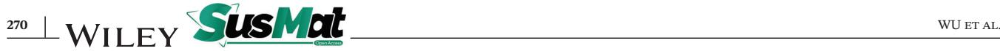

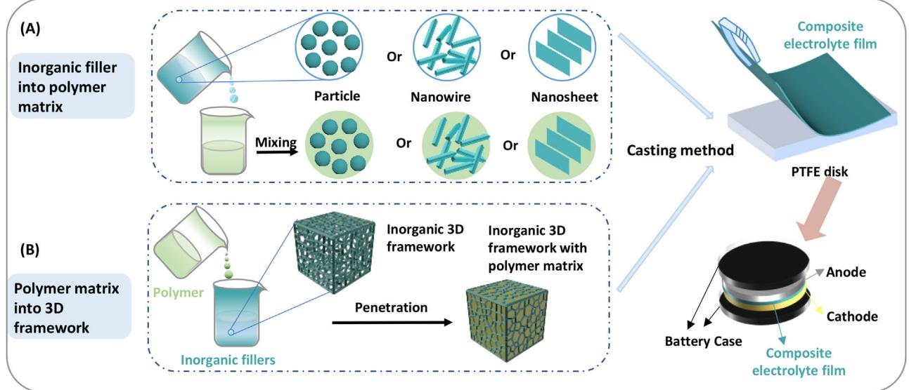

**FIGURE 3** Schematic representation of fabrication methods for CSEs. Schematic methods for (A) adding inorganic fillers into polymer matrix (CSEs with non-3D fillers); (B) adding polymer matrix into 3D-structured framework (CSEs with 3D fillers)

the charge/discharge process in SSLMBs. Furthermore, in SPEs, the ion transport mechanism is related to the segmental motions of the polymer chains, whereas in ISEs, the ion transport mainly relies on the point defects in its structure. In contrast, to these two mechanisms, the ions in CSEs can transport not only in the polymer phase or inorganic phase, but also in the interface between the polymer and inorganic fillers. Rarely considered in previous reviews, the discussions in this section focus on the interface interaction and interfacial resistance in CSEs, followed by the interfacial ion transport.

# **3.1 Interaction and interfacial resistance between polymer matrix and inorganic fillers**

There are several reviews about CSEs, which summarized that the addition of inorganic fillers into polymers could increase their ionic conductivities by lowering their crystallinity[.40,99,100](#page-23-0) However, the intermolecular interaction between the polymer matrix and inorganic fillers is of great significance for the optimization of the high-voltage compatibility of batteries, and it has not been clearly discussed in previous reviews. In addition, though not present in simple polymer electrolytes, the interfacial resistance between the polymer matrix and inorganic fillers in CSEs should be considered. Therefore, we will discuss both the intermolecular interaction and interfacial resistance inside CSEs, with the goal of designing more applicable CSEs for future energy storage system.

# 3.1.1 Interaction between polymer matrix and inorganic fillers

There are three main intermolecular interactions between the inorganic filler and polymer matrix, namely physical, chemical bonding and Lewis acid–base interaction[.84](#page-24-0) Mechanical mixing is the most frequently utilized method to realize the physical interaction between the polymer matrix and filler in CSE fabrication owing to its costeffectiveness and convenience (Figure [4\(A\)\)](#page-7-0)[.101,102](#page-24-0) 3D printing is another common method for preparing CSEs with physical interaction because it can provide accurate control of the 3D structure and the polymer/filler ratio. Zekoll et al[.103](#page-24-0) reported a 3D ordered bi-continuous conducting ceramic and an insulating polymer microchannel. This 3D-ordered CSE consists of interlocking channels: one filled with a ceramic material (LAGP) to provide continuous pathways for Li-ion migration; the other filled with an electronically insulating polymer (epoxy polymer) to tune the mechanical properties. In addition, different microarchitectures can be obtained using a 3D printing strategy. The mechanically assembled gyroid structure of the LAGP-epoxy electrolyte exhibited superior mechanical properties in terms of ionic conductivity.[103](#page-24-0)

Lewis acid–base interactions are among the most common interactions in the design of CSEs based on the Lewis acid–base theory (Figure [4\(B\)\)](#page-7-0). In general, the inorganic filler can act as a Lewis acid (a chemical species that contains an empty orbital which is capable of), such as Al atom of inert Al2O3, to promote the dissociation of Li salts and increase the concentration of free Li ions[.104,71](#page-24-0) The Li

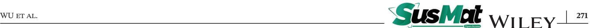

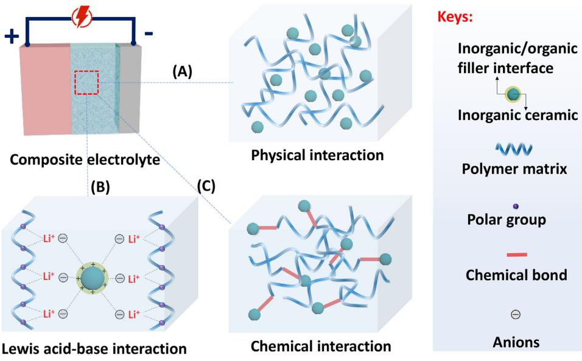

**FIGURE 4** Schematic representation of interaction between polymer matrix and inorganic ceramics. (A) Physical interactions between ceramic fillers and polymer matrix; (B) Lewis acid–base interactions among ceramic, lithium salts and polymer matrix; (C) chemical interactions between ceramic fillers and polymer chains

ions can then interact with the O atoms of both Al2O3 and polymer chains, which can provide extra paths for Li-ion migration in the CSE. Li et al[.87](#page-24-0) added 1 wt.% GO as a nanofiller to a PAN-based electrolyte forming a CSE with an increased ionic conductivity of 4.0 × 10−4 S cm−1 at 30◦C. Meanwhile, the activation energy was also reduced from 2.31 to 1.03 eV. This means the ions transportation get easier in PAN/GO electrolyte than PAN electrolyte. These improvements were mainly attributed to the Lewis acid-type functional groups (─OH, ─COOH, etc.) in the GO interaction with N atoms in the PAN chains. This Lewis acid–base interaction can alleviate the polarity of "─C≡N" to soften the polymer chains for Li-ion migration and facilitate the dissociation of LiClO4 in PAN the matrix.

Hydrogen bonds are also frequently formed with polymer chains by adding inorganic fillers[.105](#page-24-0) Tang et al[.84,106](#page-24-0) developed a high-performance composite electrolyte based on PEO and poly(vinylidene fluorideco-hexafluoropropene) (PVDF-HFP) by adding GO as a filler. According to the structure of GO, PVDF-HFP/PEO, H atoms from GO can form hydrogen bonds with F atoms from PVDF-HFP, and O atoms in PEO can form hydrogen bonds with H atoms in GO. Both intermolecular H─F and H─O hydrogen bonding effects promote the formation of a 3D porous polymer network by enabling more disordered polymer chains in the copolymer. These special structures endowed the composite electrolyte with an ionic conductivity of up to approximately 10−3 S cm−1 at room temperature. Percolation effects can also be observed between inorganic fillers and the polymer matrix if certain amounts of ceramic fillers are added to matrix, which can provide a rapid pathway for Li-ion migration in the CSE. In situ CSE synthesis method by introducing ceramic SiO2 nanoparticles into a PEO-based electrolyte was proposed,[107](#page-24-0) increased ionic conductivity was achieved due to the suppression of the crystallinity of PEO and facilitation of polymer segmental motion for ionic conduction. Moreover, two possible interaction mechanisms were observed, including chemical bonding (Figure 4(C)) between the ends of the chains with hydroxyl groups on monodispersed ultrafine SiO2 surfaces as well as physical interactions (Figure 4(A)) of PEO chains during the growth of SiO2 particles, which facilitated the widening of the electrochemical window to 5.5 V.

The issues of interfacial resistance between the polymer matrix and ceramic fillers cannot be neglected. Making a chemical bond is a new strategy for resolving this interface issue[.108,109](#page-24-0) Chemical interactions (Figure 4(C)) may result from the electrostatic force between oppositely charged ions as in ionic bonds or through the sharing of electrons as in covalent bonds. In CSEs, covalent bonds are usually formed among the polymers, ceramics, salts, and solvents. In 2017, Nan et al.[79](#page-24-0) fabricated a modified PVDF-based CSE with a high ionic conductivity (5 × 10−4 S cm−1 at 25◦C) by filling it with LLZTO (Figure [5\)](#page-8-0) and 1 H nuclear magnetic resonance (NMR) spectroscopy demonstrated that the La atom in the LLZTO ceramics could complex with the N atom and C═O group of dimethylformamide, which agreed with the results of first-principles calculations. The mixture of LLZTO and DMF can create an alkaline-like environment, which can trigger the partial dehydrofluorination of PVDF. The partially modified

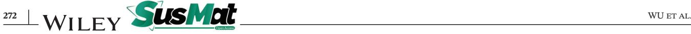

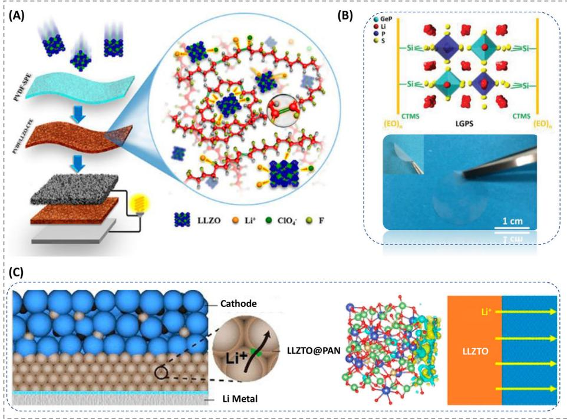

**FIGURE 5** (A) Schematic representation of a possible structure for flexible PVDF/LLZTO CSEs and the synergistic effect among LLZTO, PVDF, and DMF. Reproduced with permission[.79](#page-24-0) Copyright 2017, American Chemical Society. (B) Schematic illustration of as-prepared PEG/LGPS CSE structure. Reproduced with permission[.75](#page-23-0) Copyright 2020, John Wiley and Sons. (C) Schematic illustrations of PAN coated LLZTO (LLZTO/d-PAN) electrolyte, calculated charge difference distribution at the heterointerface of LLZTO/d-PAN and Li ions transport mechanism through the ceramic/polymer interface. Only the space charge layer (SCL) in the polymer phase is illustrated; the solid yellow line denotes high Li ions mobility. Reproduced with permission.[110](#page-25-0) Copyright 2021, American Chemical Society

PVDF enhanced the interactions between LLZTO particles, salts, and the PVDF matrix, leading to significant improvements in the electrochemical performance and mechanical stability of the CSE.

Most recently, a composite LLZTO/d-PAN electrolyte was prepared by attaching an even PAN nanocoating on the surface of LLZTO (Figure 5(C))[.110](#page-25-0) This thin-film LLZTO/d-PAN membrane, with a thickness of less than 10 *μ*m, exhibited a high ionic conductivity of 1.1 × 10−4 S cm−1 due to the intimate chemical interactions between LLZTO and PAN, forming an efficient interparticle Li-ion transport. This was attributed to the high content of LLZTO (up to 94.3 wt.%) in the electrolyte helping to dehydrocyanate the PAN and form local conjugated C─C bonds. Fast Li-ion exchange in the PAN/LLZTO interface was enabled by the conjugated structures, which served as a continuous Li ions pathway in the LLZTO particles. This PAN-coated LLZTO electrolyte possessed with a 4.35 V electrochemical stability window and a high transference number (0.66).

In 2020, a flexible PEO/PEG-LGPS composite electrolyte was designed and prepared via in situ coupling reactions and obtained a high ionic conductivity (9.83 × 10−4 S cm−1 ) and high ion transference number (0.68) at ambient conditions with 3 wt.% of LGPS[.75](#page-23-0) Because of the similarity between O─H and S─Li bonds, LGPS and PEG are closely integrated through chemical bonds with the help of a cross-linker (CTMS); hence, the interface compatibility issue was effectively eliminated and a path for fast Li-ion transport was formed. These strong chemical bonds have two major functions. First, these bonds act as a bridge to buffer the migration of Li ions, thus preventing ion gathering induced the local potential differences between LGPS and PEG. Second, the environmental stability of LGPS can be promoted by wrapping PEG and PEO. These could not only eliminate the phase boundary between the LGPS and PEO chains, but also decrease the grain boundary resistance between LGPS particles. Therefore, both the electrochemical and chemical stability of the composites can be ensured during cycling in the assembled battery, and the growth of lithium dendrites can be suppressed.

Based on the analysis of physical interactions and chemical interactions between inorganic fillers and the polymer matrix, as well as the lithium salts involved, we noted that the mechanical stability of CSEs was enhanced via the mechanical wrapping of inorganic fillers by polymer chains. This also slightly decreased the ionic conductivity to that of the ceramics alone. Lewis acid–base is frequently observed between inorganic fillers and polymer matrices. Inorganic fillers usually act as Lewis acids, interacting with the anions of lithium salts to promote their dissociation. Moreover, they can also form hydrogen bonds with the N or F atoms of polymer chains to enhance the stability of the CSEs. The formation of chemical bonds between the polymer matrix and inorganic filler could increase the electrochemical and mechanical stability of the electrolytes assembled in batteries.

# 3.1.2 Interfacial resistance between polymer matrix and inorganic fillers

Some publications have reported an enhanced ionic conductivity of polymer/ceramic CSEs compared with pure polymer electrolytes, which is ascribed to percolation effects between the polymer matrix and ceramic filler[.64,69,78,111](#page-23-0) This has been further studied using phasefield simulations, the random resistor model, and Monte Carlo simulations based on the PEO/Ga-LLZO composite system, which demonstrated that the percolation of the space charge layer can account for the enhanced ionic conductivity of CSEs[.92](#page-24-0) The reasons is that space charge layer provides extra pathways for the Li ion conduction. However, other studies observed no significant enhancement or even a negative effect on Li-ion migration[.112,113](#page-25-0) The latter pointed out that the interfacial resistance across from polymer phase to inorganic phase was too large to transport.

Therefore, researchers have speculated on the interface between PEO and LLTO in a model Cu/ PEO/LLTO/PEO/Cu system, which is resistive to Li-ion transport in the CSE, using electrochemical impedance spectroscopy[.114](#page-25-0) The results revealed that the impedance ascribed to ion transfer across the interface and the resistance across the interface between PEO and LLTO were larger than those through the bulk LLTO or PEO matrix phase. The interfacial resistance across the interface was further quantified as up to∼9 kΩ cm2 in a symmetrical system based on a LLZO pellets and PEO–LiClO4 electrolyte (Figure [6\(A\)\)](#page-10-0)[.2,115](#page-22-0) The computational and experimental results based on space-charge regions deviated from the Gouy–Chapman–Stern equation, demonstrating that the resistance was mainly ascribed to the high activation energy (noted as stern layer) rather than the electrostatic repulsion of lithium (Figure [6\(B\)\)](#page-10-0)[.116](#page-25-0)

The addition of ceramic fillers to the polymer matrix aims to enhance the ionic conductivity of the polymer electrolyte by reducing the crystallinity of the polymer host and enabling favorable interactions between the polymer chains, Li ions, and surface groups of the ceramics. Nevertheless, the ionic conductivities of SPEs are still lower than those of inorganic electrolytes such as LLZO. Thus, in order to obtain a high ionic conductivity in CSEs, the majority of Li-ion transport needs to occur in the inorganic phase[,117](#page-25-0) or the interface resistance between the polymer matrix and inorganic particles needs to be reduced[.118](#page-25-0) Many methods have been adopted to ameliorate the interphase compatibility, such as reducing the sizes of inorganic fillers,[119](#page-25-0) making them orderly aligned,[69](#page-23-0) constructing chemical bonds,[75](#page-23-0) or applying in situ synthesis[.120,121](#page-25-0)

# **3.2 Interfacial ion transports in CSEs**

A high ionic conductivity is important for the success of SSLMBs,[122](#page-25-0) which is beneficial for achieving a high current density in a short charging time. A high Li-ion conductivity and Li-ion transference number also delays dendrite nucleation at the Li metal anode, as explained by the Chazalviel model[.123](#page-25-0) As expected, the ionic conductivity of CSEs can be improved compared with that of a polymer electrolyte without inorganic fillers, which may be attributed to the decrease in crystallinity and/or glass-transition temperature of the polymer matrix after filling with ceramic materials[.78,124,125](#page-24-0) ISEs with high ionic conductivity can also improve the performance of CSEs[.72](#page-23-0) Tracing Li-ion migration pathways is beneficial for identifying the ion transport mechanism in CSEs.[126](#page-25-0) In ISEs, such as LATP, LAGP, LLZO, and LLTO, the transportation of Li ions usually involves a hopping mechanism through the interstitial available vacancies and defects in the crystal, with ionic conductivity up to 10−3 S cm−1 under ambient conditions[.127](#page-25-0) For SPEs, the ion transport mechanism is typically more challenging to identify because the mixture of amorphous structure and crystal phases in the polymer, but they usually show a relatively low ionic conductivity (∼10−7 S cm−1 ) at room temperature[.128](#page-25-0)

Figure [7](#page-11-0) summarizes the ionic conductivities at room temperature in previous publications[.129–146](#page-25-0) It can be concluded that the most representative ionic conductivities are quite close to 10−4 S cm−1 , but lower than 10−3 S cm−1 at room temperature. PEO-based CSEs have been widely studied because of their high solvation of lithium salts. As with other polymers, such as PPC and PVDF, they exhibited an increasing trend for ionic conductivity owing to their functional groups and/or modified inorganic fillers improving the interfacial performance. PEG with 3 wt.% LGPS exhibited the highest ionic conductivity among SSLMBs in this review, 9.84 × 10−4 S cm−1 at room temperature, due to the formation of chemical bonds between PEG and LGPS linked by CTMS[.75](#page-23-0) The addition of proper inorganic fillers into the polymer matrix can significantly increase the ionic conductivity at room temperature. It can be observed from Figure [7](#page-11-0) that, compared with inert fillers, the addition of active fillers into the same polymer matrix can typically improve the ionic conductivity more.

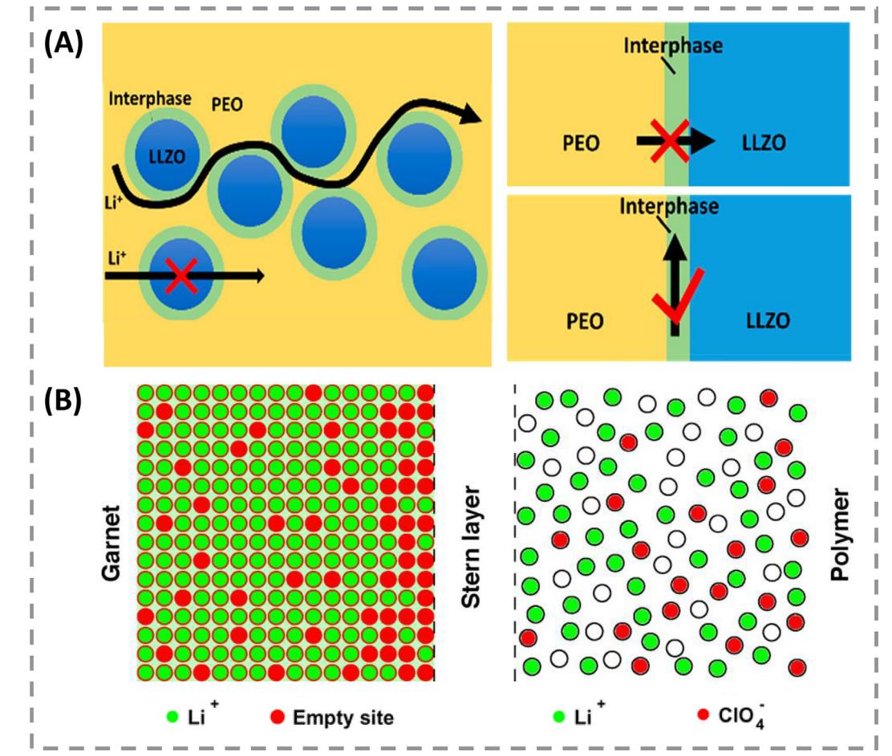

**FIGURE 6** (A) Diffusion of Li ions in PEO–LLZO interface and across and along the PEO–LLZO interface. Reproduced with permission[.2](#page-22-0) Copyright 2020, American Chemical Society. (B) Scheme of the interface between LLZO and PEO. Green disks represent Li ions. Vacancies (empty sites in LLZO) and anions (ClO[4](#page-22-0)− in PEO) are represented by red disks. Accumulation of charges near the interface, constituting the electrical double layer, is shown. The drawing is not in the scale. Reproduced with permission[.116](#page-25-0) Copyright 2019, American Chemical Society

In CSEs, the Lewis acid sites on the surface of the ceramic fillers can interact with the active groups of the polymer chains and lithium salts to further improve the ionic conductivity because these sites could promote the dissociation of lithium salts and enhance the concentration of free Li ions[.147](#page-26-0) In contrast with passive fillers, active fillers, such as LLZO, LATP, and LLTO nanoparticles, are Li-ion conductive. The filling of active fillers into the polymer matrix can create extra Li-ion transport pathways within the CSEs. It has been reported that there could be a space-charge region in the interphase between inorganic ceramics and solid polymers[.92](#page-24-0) Moreover, the migration of Li ions in CSEs is affected by the type, particle size, morphology, and content as illustrated above. These factors make the ion transport mechanism especially complicated in CSEs, affecting closely on the ionic conductivity. Different ion transportation pathways in CSEs have been explained, including migration in the inorganic phase[,117](#page-25-0) the polymer phase[,148,149](#page-26-0) and the interphas[e47](#page-23-0) between ceramics and polymer.

The Li ions transportation pathways depend on the type, shape, conductive capability, and amount of these fillers, which could provide an insight into the mechanism of the Li ions motion in the polymer phase, inorganic phase, or polymer/ceramics interphase (Figure [7\)](#page-11-0)[.73](#page-23-0) The identification of Li ions migration channels is meaningful and of great importance for rationally designing the structures of CSEs. Therefore, inorganic ceramic fillers of different shapes were explored to obtain highly homogeneous CSEs with uniformly dispersed ceramic fillers, which can reduce the agglomeration of fillers or block ion transportation by the polymer chains to obtain faster Li-ion migration, particularly along the interface between the polymer matrix and additives. In the following sections, we will mainly focus on ions transport at the interface inside the CSEs according to the different shapes of the inorganic fillers.

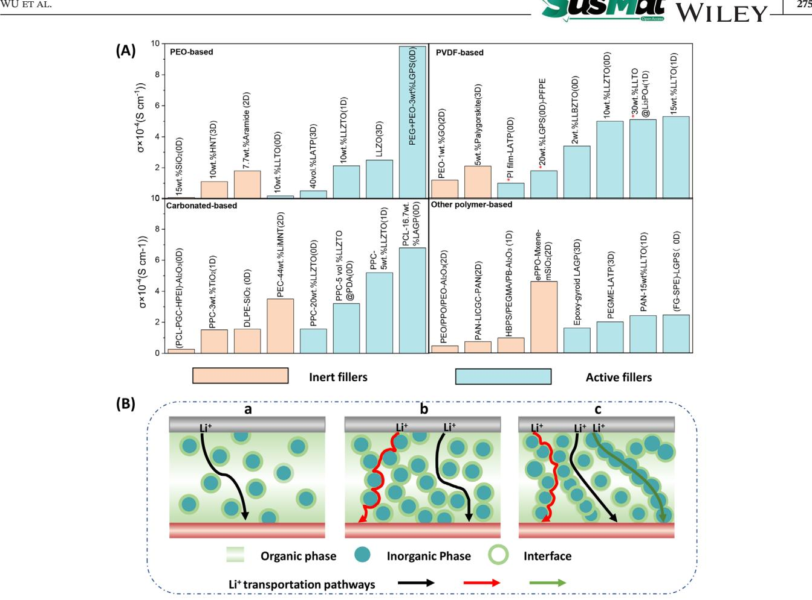

**FIGURE 7** (A) Ionic conductivities of CSEs at room temperature form previous research from references[,69–72,75,79–82,101,103,106,111,129–146](#page-23-0) which were classified according to their different polymer matrices. (B) Schematic representative pathways of Li-ion in (a) polymer phase, (b) polymer phase and interface between polymer and ceramic, and (c) polymer phase, ceramic phase, and interface between both components

#### 3.2.1 Particle type of inorganic fillers

Particles are most frequently investigated as inorganic fillers because of their easy preparation process and reduced crystallinity of polymers, which is expected to increase the ionic conductivity[.135,150,151](#page-25-0) Even when particle fillers are employed in the polymer matrix, the ion transport mechanism is affected by the particle type, particle size and filling amount. Extensive efforts have been dedicated to the investigation of revealing the Li ions transport pathways[.77,152](#page-24-0)

The Li-ion transport route in PEO(LiClO4)–LLZO was identified by combining selective isotope labeling and high-resolution solid-state NMR[.117](#page-25-0) This experimental NMR monitoring first demonstrated that the Li ions favored migration in the ceramic rather than in the PEO or the interface between PEO and LLZO (Figure [8\(A\)\)](#page-12-0). However, the Li-ion migration was also proposed to be attributed to the percolation effect in the LLZO–PEO (lithium salt free) composites when nanoscale LLZO particles were employed[.119](#page-25-0) The influence of the percolation effect on Li-ion transport was revealed using a PEO– (Ga-LLZO) composite as a model system (Figure [8\(B\)\)](#page-12-0)[.92](#page-24-0) The PEO-16 wt.% (Ga-LLZO) electrolyte showed an ionic conductivity four orders of magnitude higher than that of PEO. The results showed that the higher ionic conductivity was due to the space charge regions and the percolation of the space charge region at the interface of PEO/Ga-LLZO, as demonstrated by a Monte Carlo model simulation, phase-field simulation, and random resistor methods.

#### 3.2.2 Wire-like inorganic fillers

Nanosized inorganic fillers dramatically improved the ionic conductivity by offering extra Li ions conduction pathways at the interface of CSEs owing to their large surface area[.153](#page-26-0) Compared with CSEs filled with particles, CSEs with nanowire fillers can provide a continuous and much longer ion transport route. Nanowire fillers embedded into the polymer matrix can significantly reduce the cross-junction resistance, without a large number

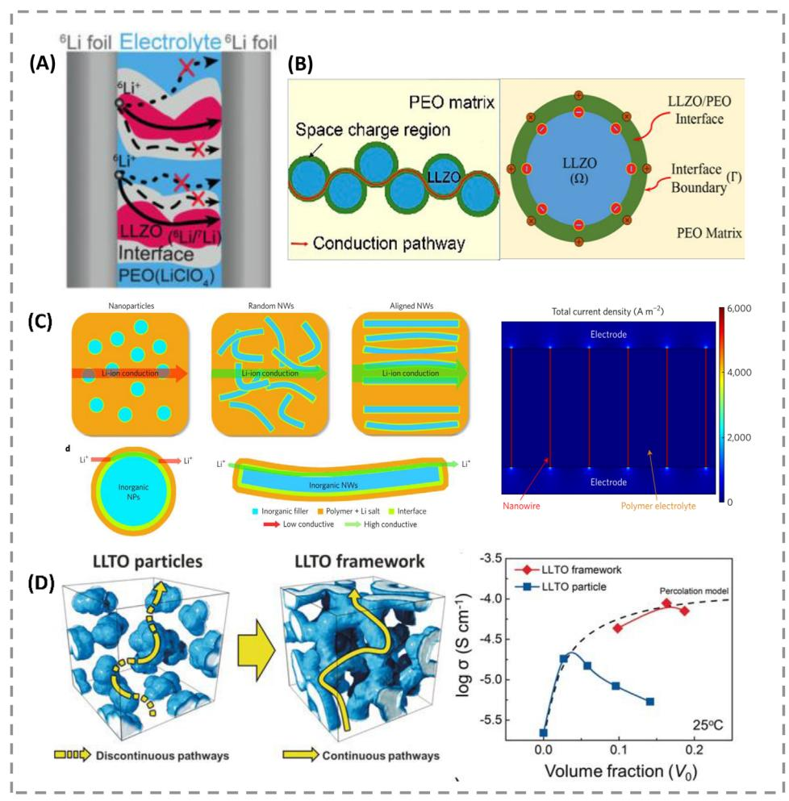

**FIGURE 8** Li-ion conduction pathways in CSEs. (A) Schematic diagram of Li-ion pathways in the LLZO phase[.117](#page-25-0) Copyright 2016, Wiley. (B) Schematic illustration of the fast ionic conduction pathway along the space charge regions and space charge region at the Ga-LLZO/PEO interface. Reproduced with permission.[92](#page-24-0) Copyright 2019, American Chemical Society. (C) Comparison of possible Li-ion conduction pathways and color map for the simulation analysis for the composite polymer electrolyte with aligned nanowires. Reproduced with permission[.78](#page-24-0) Copyright 2017, Springer Nature. (D) Percolation model with conductivity data and representative possible ion pathways in the CSE. Reproduced with permission.[72](#page-23-0) Copyright 2018, Wiley

of particle-particle junctions. Cui et al.[69](#page-23-0) proposed that 15 wt.% perovskite LLTO nanowire filler, fabricated via electrospinning, be dispersed into a PAN(LiClO4) matrix to form a highly conductive and stable CSE. The ionic conductivity (2.4 × 10−4 S cm−1 at room temperature) of the nanowire-filled PAN-based electrolyte was higher than that of a CSE with the same percentage and same grain size of ceramic particles. This was ascribed to fast Li ions migration on the surfaces of the LLTO nanowires through conductive networks produced via contact with the PAN matrix. Nanowire fillers provide a new strategy to increase the ionic conductivity of CSEs by developing long-range Li ions transfer channels along the interface of nanowire fillers and polymer, which is beyond the ability of nanoparticles[.77,78,111,134](#page-24-0) An analysis of current density using "COMSOL Multiphysics" software also proved that Li ions conduction mainly occurred at the interface between the aligned LLTO nanowires and PAN matrix, which is shown in the color map (Figure 8(C)).Other well-aligned nanowire-filled composites have also been developed[.64,154,](#page-23-0)

#### 3.2.3 Sheet-like inorganic fillers

Compared with nanosized particles and one-dimensional nanowires, two-dimensional nanosheets, such as clay,[141](#page-25-0) graphene,[102,155](#page-24-0) and 2D boron nitride nanoflakes,[156](#page-26-0) have attracted the attention of researchers owing to their ultrathin structure, high degree of anisotropy, and large amounts of chemical functional groups on their surfaces[.157–159](#page-26-0) It is possible for the in-plane ionic conductivity along such fillers to be two orders of magnitude higher than those along the other directions[.160](#page-26-0) The CSEs filled with these nanosheet fillers exhibited large improvements in electrochemical ability and mechanical stability, which were ascribed to its extremely high specific surface area interacting with the active sites in the polymer matrix in the polymer matrix/nanosheets interphase[.106,161–163](#page-24-0)

#### 3.2.4 3D-structured inorganic fillers

We have discussed that particles and nanowire fillers dispersed into a polymer matrix increase the ionic conductivity, particularly by forming long-range ionic transport routes along the interface between the polymer chains and additives. However, the agglomeration of inorganic fillers in these methods is a problem that may not only affect the ionic conductivity but also be a challenge in large-scale production. As an alternative, 3D-structured network fillers have attracted considerable attention since they are self-supporting and can create a continuous long-range nanosized ions pathway with a preformed and interconnected structure interacting with polymer chains. The CSEs formed in this way can avoid agglomeration and do not require further mixing of ceramics and polymers because of the self-supporting 3D network formed before amalgamation in the polymer matrix. This provides a simpler fabrication process for scaling up.

An ultra-strong reinforced CSE was designed by incorporating a rigid mesoporous SiO2 aerogel as a 3D backbone for a ceramic/polymer composite[.97](#page-24-0) Its high ionic conductivity was attributed to the following reasons. The highly porous SiO2 framework resulted in maximum volume for ion conduction in the CSE, providing extra ion pathways when the framework interacts with the polymer chains. In addition, well-distributed continuous interconnected domains of SiO2 with an acidic ─OH group maximized interactions with anions based on the Lewis acid–base theory promoting the dissociation of lithium salt (LiTFSI) and forming continuous conductive pathways through the interphase between the polymer matrix and the 3D-framework. Similarly, a 3D nanostructured hydrogel-derived active LLTO framework with PEO-based electrolyte was fabricated by an LLTO prepercolating processes, which formed an interconnected 3D percolating nanostructure at the PEO/LLTO interface,[72](#page-23-0) as shown in Figure [8\(D\).](#page-12-0) In this material, the ionic conductivity follows the percolation at a low volume fraction but begins to deviate after reaching a certain ratio (10 wt.%) when filling with LLTO particles. However, if the 3D LLTO framework is used instead of the particles, the ionic conductivity still obeys the percolation model at a high concentration of LLTO. This was ascribed to the continuous interphase of the prepercolated LLTO framework that acts as a pathway for Li ions conduction as well as providing a 3D interconnected structure even at high concentrations of LLTO.

### **4 INTERFACE BETWEEN CSES AND ANODE IN SSLMBS**

Single SPEs in contact with anodes have many advantages, such as, excellent flexibility and convenient preparation process, as well as disadvantages, such as low ionic conductivity, poor mechanical properties, and side reactions in some polymers. Compared with SPE, single ISEs exhibit higher ionic conductivity and mechanical strength, but they are fragile and show poor contact with the electrodes. Interfacial issues between CSEs and electrodes in single SPE or ISE are of great importance for achieving superior electrochemical performance with a long cycle life and high-rate capability during the operation of SSLMBs[.164–167](#page-26-0)

It is well known that Li metal is highly electropositive and chemically reactive, which can spontaneously react with some electrolytes and cause instability at the electrolytes/anode interface[.168,169](#page-26-0) In addition, the continuous growth of dendritic crystals can cause short circuits between the anodes and cathodes, which leads to a risk of fire. At the same time, during the charge/discharge process, the large volume deformation of the electrode causes poor wettability of CSEs with electrodes and thus high interfacial resistance[.170,171](#page-26-0) However, CSEs possess good flexibility from the polymer component, allowing them to maintain intimate contact with electrodes, but also inherit the good mechanical strength and better antireduction ability of the inorganic fillers. These merits endow CSEs with more promising electrochemical performance compared with single SPEs or ISEs. The interfacial issues for single SPEs/ISEs, including chemical reactions, lithium dendrites, and loose contact, are illustrated in Figure [9](#page-14-0) with relevant remedies.

#### **4.1 Chemical stability and remedies**

Most polymers, such as PEG, PAN, and PPC, have been reported to react with Li metal based on experimental and theoretical calculations.[172,173](#page-26-0) Side reactions usually occur between polymers, such as the ─OH group in PEG, the C≡N group in PAN, and so on, and Li metal, which then decreases the anode interfacial stability and cycling performance[.174](#page-26-0) When PEO comes into contact with Li metal, Li metal is oxidized into Li2O, while the PEO decomposes into C2H4 and H2. [175](#page-27-0) In PAN, a ring formation chemical reaction occurs when PAN interacts with the

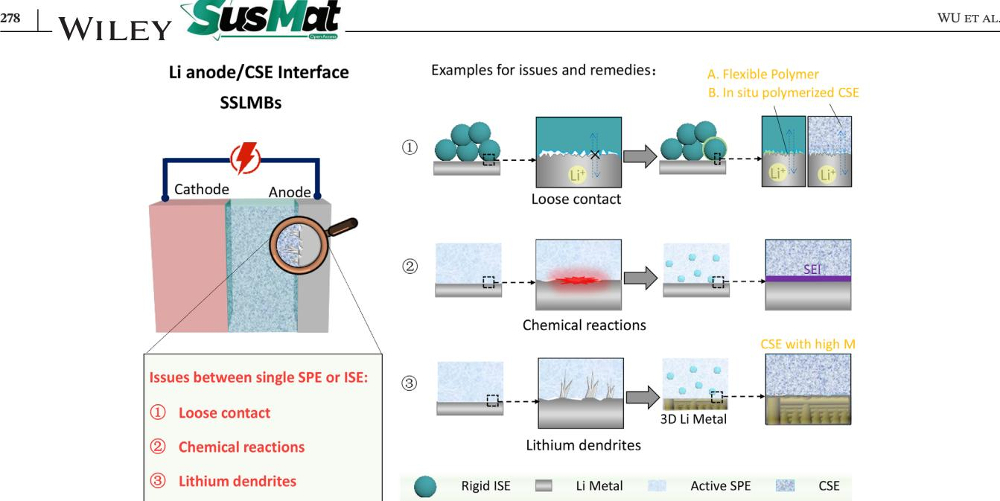

**FIGURE 9** Interface between CSEs and anode. M represents modulus

surface of the Li metal[.173](#page-26-0) While using PPC polymer electrolytes, the lithium anode caused PPC decomposition by cutting the PPC polymer into small fragments and even liquid short chains[.172](#page-26-0) In such a case, the ionic conductivity increases, but the PPC degradation is accelerated[.176](#page-27-0)

CSEs are expected to inherit the advantages of both polymer and inorganic electrolytes, which would give them good stability with Li metal and superior performance in the suppression of lithium dendrite growth. Simultaneously, the addition of ceramic particles may suppress the chemical reactions between some polymers and the Li metal anode, leading to better cycling performance the asassembled batteries (Figure 9(②))[.177](#page-27-0)

To address the chemical reactions between polymers and the Li anode, a composite electrolyte (FCSE) with mechanical properties reinforced by LATP/PAN fibers based on a PEO–LiTFSI polymer matrix was fabricated, which had a tensile strength of up to 10.72 MPa and showed excellent electrochemical stability after 15 days of contact with Li metal[.178](#page-27-0) This was demonstrated by the Li stripping/plating behaviors of Li|FCSE|Li and Li|SPE|Li for 400 h, reflected by the negative and positive voltage plateaus. The black curve for the Li|SPE|Li cell led to a larger voltage polarization that fluctuated with the time of charge–discharge, which was attributed to the low ionic conductivity and electrochemical instability of SPE. However, the voltage of the Li|FCSE|Li cell became relatively steady at 0.12 V, and no short circuit appeared during charge–discharge for 400 h. This result shows the good stability of PEO/PAN with a Li anode.

### **4.2 Lithium dendrites and remedies**

As Li metal anodes are frequently used, the processes of Li plating/stripping and lithium dendrites formation at the Li anode have attracted great attention in SSLMBs. However, the solid electrolyte interface at the Li anode is locally different in composition and morphology during cycling (corresponding to plating/stripping)[.179,180](#page-27-0) For example, the charge distribution is nonhomogeneous at the interface of the single SPE and Li anode because of the effect of polarization as well as the different local structures of the Li anode. In turn, the Li plating/stripping process is nonuniform and causes a growth of lithium dendrites (Figure 9(③)), thus leading to low efficiency and safety risks[.39,181](#page-22-0) Thereafter, uneven Li plating at the anode causes a short circuit and results in poor cycling performance. Many efforts have been made to evaluate the cycling stability via the fluctuating voltage during the Li plating/stripping process.[182](#page-27-0)

Generally, PEO-based polymer Li metal batteries suffer from decomposition of the polymer electrolyte by the Li metal anode under an electric field.[119](#page-25-0) In 2018, a self-standing 3D composite polymer electrolyte (3D-CPE, shown in Figure [10\(A\)\)](#page-15-0) was designed using a 3D LLTO network as a backbone in the PEO matrix by hot-pressing and quenching[.183](#page-27-0) This 3D-CPE showed much better thermal stability and enhanced mechanical stability than SPEs. More importantly, the 3D-CPE membrane reduced the polarization and increased the stability of the assembled Li|3D-CPE|Li cell.

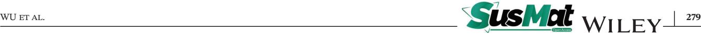

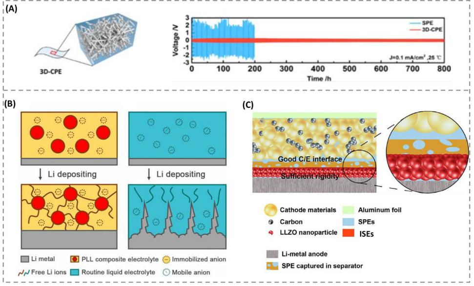

**FIGURE 10** (A) Schematic diagram of 3D-CPE prepared from an LLTO 3D network backbone in a PEO matrix. Voltage profiles of Li plating and stripping cycling for the SPE and 3D-CPE. The inset shows four cycles for the Li|3D-CPE|Li cell. Reproduced with permission.[183](#page-27-0) Copyright 2018, American Chemical Society. (B) Schematic representation of the electrochemical deposition behavior of a Li metal anode with a CSE with immobilized anions and a usual liquid electrolyte with mobile anions. Reproduced with permission.[74](#page-23-0) Copyright 2017, American Chemical Society. (C) Schematic diagrams of a solid Li-metal battery with an asymmetrical electrolyte. Cathode/electrolyte is designated as C/E. Reproduced with permission[.184](#page-27-0) Copyright 2018, American Chemical Society

On the one hand, the growth of lithium dendrites could be ascribed to uneven deposition at the Li anodes, resulting from the barriers of free anions in SPEs[.185](#page-27-0) On the other hand, the uncontrollable growth of lithium dendrites is attributed to poor contact between CSEs and the lithium anode, high concentration polarization, and side reactions with Li anodes[.186,187](#page-27-0)

There are two main strategies for solving these issues. One is to increase the interface contact between the electrolyte and anode to decrease the impedance, and the other is to ensure a homogeneous Li deposition process by fixing the anions to reduce the concentration polarization or creating uniform Li-ion transportation channels(Figure [9\(](#page-14-0)③))[.119](#page-25-0) For instance, Zhang et al[.74](#page-23-0) designed and prepared an anion-immobilized CSE based on PEO-LiTFSI with Al-doped LLZTO as an inorganic filler (Figure 10(B)). Since the anions are immobilized, it was much easier process for Li ions to migrate from the bulk electrolyte to the anode surface, which established a relatively stable and uniform interface for Li-ion deposition to suppress the growth of lithium dendrites. The assembled Li/Li symmetrical cell cycled steadily for more than 400 h with a constant voltage polarization of 15 mV at 60◦C and a current density of 0.10 mA cm−2.

The introduction of micro-sized LLZO particles into a PEO matrix significantly enhanced the interfacial stability with the Li anode and prevented Li-dendrite growth during electrochemical cycling. This was attributed to Li ions exchanges between LLZO and lithium salts in the PEO matrix, resulting in a minimized current gradient and homogeneous diffusion of Li ions.[149](#page-26-0) A PEO-based composite filled with nanosheet MnO2 exhibited a 2.3 times increased tensile strength and a higher cycling stability (143.5 mA h g−1 after 300 cycles) than the electrolyte without fillers (61.2 mA h g−1 after 90 cycles). This can be explained by density functional theory calculation results that indicate that nanosheet MnO2 can act as a binder to combine PEO chains and provide easy desorption of Li from the PEO. Li ions could migrate on the MnO2 nanosheets[.104](#page-24-0) The mechanical and thermal stabilities of an electrolyte were further improved by introducing Mg2B2O5 nanowire into the PEO matrix. With the increased ionic conductivity, the CSE effectively improved the cycling performance and rate capability[.188](#page-27-0) In addition, the electrochemical window of PEO-based electrolyte was widened to 5.5 V by the dispersion of 10 wt.% mono nano-SiO2, [107](#page-24-0) which is important because the electrochemical window can influence the electrochemical stability between the electrodes and electrolytes in the range of operating voltages[.189](#page-27-0)

Furthermore, the addition of rigid ceramic particles enhanced the mechanical strength of an electrolyte to effectively avoid the growth of lithium dendrites[.177,190](#page-27-0) In 2018, a thin asymmetrical solid electrolyte was designed with a low interfacial resistance and high modulus to block lithium dendrite penetration at the Li anode (Figure [10\(C\)\)](#page-15-0)[.184](#page-27-0) In this architecture, a rigid ceramic layer (LLZO) was added to an ultrathin polymer forming a rigid barrier with a high elastic modulus toward Li metal to suppress dendrite growth on the Li anode. The surface morphology changes of Li anodes after long-term cycling illustrated that the Li anode facing the LLZO-coating layer side in the Li|CSE|Li cell depicted a compact and smooth LLZO-coating layer with no morphological changes at the interface. These results indicate that the Li dendrite growth was effectively eliminated.

# **4.3 Loose contact and remedies**

The issue of loose contact between CSEs and Li metal anodes could not only cause the growth of Li dendrites at the anode but also cause a high interfacial resistance.

Free-standing CSEs with improved contact were prepared by incorporating LGPS into a PEO matrix.[191](#page-27-0) The symmetrically assembled Li|PEO–LiTFSI–1%LGPS|Li cell showed a decreased interfacial resistance of 26 Ω cm2 with a Li anode, which was lower than the 38 Ω cm2 in a Li|PEO–LiTFSI|Li cell at 80◦C. After 1 week, the interfacial resistance of the PEO–LiTFSI solid electrolyte increased from 38 to 80 Ω cm2 while the interfacial impedance with PEO–LiTFSI–1%LGPS CSE changed only slightly, indicating that the addition of 1 wt.% LGPS into the PEO matrix improved the interfacial contact and interfacial stability between the CSE and the Li metal anode. Furthermore, Wang et al[.192](#page-27-0) developed a CSE consisting of a LAGP/PEO layer and a PEO–LiTFSI layer (100 nm), which provided sufficient ionic conduction and a high mechanical module to protect the Li anode from reacting with LAGP. This was ascribed to the excellent interfacial contact with the Li anode and a lower resistance.

Based on the results and analysis, it can be observed that the interface between the CSEs and Li anode is important for achieving superior performance in SSLMBs. Properly designed CSEs can not only achieve a low interfacial resistance with anodes but can also suppress the growth of lithium dendrites and side reactions with Li metal to effect long cycling stability for the assembled batteries (Figure [9\(](#page-14-0)①)). However, it should be noted that the thicknesses of the above CSEs are still larger than that of the commercial separator, and the ability to suppress the growth of lithium dendrites and side reactions is still not sufficient particularly when applying a high current density during long cycling. These instabilities during long cycling may be ascribed to undetectable electric conduction or uneven deposition with long-distance migration in the thick CSE layers due to the depletion of Li. Therefore, it is necessary to develop novel CSEs with much thinner thickness, high mechanical strength, and high antireduction ability to suppress the growth of lithium under higher current densities in future research.

# **5 INTERFACE BETWEEN CSES AND CATHODE IN SSLMBS**

Building an excellent interface between the CSE and cathode is another important research topic in SSLMBs. The challenges at the interface between the CSE and cathode include the assembled contact interface, interfacial cycling side reactions, and electronic conductivity.[193–196](#page-27-0) Determining how to handle physical and/or chemical interface contacts with the cathode will assist in better understanding and optimizing the functions of the CSE by increasing the antioxidation ability and reducing the interfacial resistance at the full battery level (Figure [11\)](#page-17-0).

Generally, there are three aspects related to the design of the interface between the cathode and electrolyte. First, utilizing high antioxidative CSEs is of great importance to improve the electrochemical stability of batteries assembled with high-voltage cathode materials and achieve a high energy capacity. Second, a deep understanding of the origin of interfacial resistance between CSEs and the cathode is beneficial for proposing strategies to address interfacial issues. Finally, establishing a mixed conducting structure in one cathode material is of great significance for achieving high energy density and long cycle life of SSLMBs since the cathode integrates both ionic and electronic conduction. Good cathode materials can reduce polarization and deliver the full capacity of the battery[.197,198](#page-27-0) The interfacial issues, including electrochemical stability, loose contact, and electron-ion channels, between a single SPE or ISE and cathode are shown in Figure [11](#page-17-0) along with the remedies offered by CSEs.

# **5.1 Electrochemical stability and remedies**

Owing to the working principle of assembled Li metal batteries, the side of the solid electrolyte in contact with the cathode should have a good antioxidation ability and exhibit a wide electrochemical stability window, which is one of the important factors in determining the rate capacity of the applied batteries. As shown in Figure [11,](#page-17-0) a single ISE shows loose contact with the cathode due to point contact, whereas intimate contact can be achieved at the CSE/cathode interface by forming a flexible polymer between the ISE and cathode. The high-voltage compatibility of CSEs is beneficial for achieving high capacity as well as antioxidation, which avoids the decomposition of the CSE. Thus, the pursuit of a high electrochemical WU et al. **281**

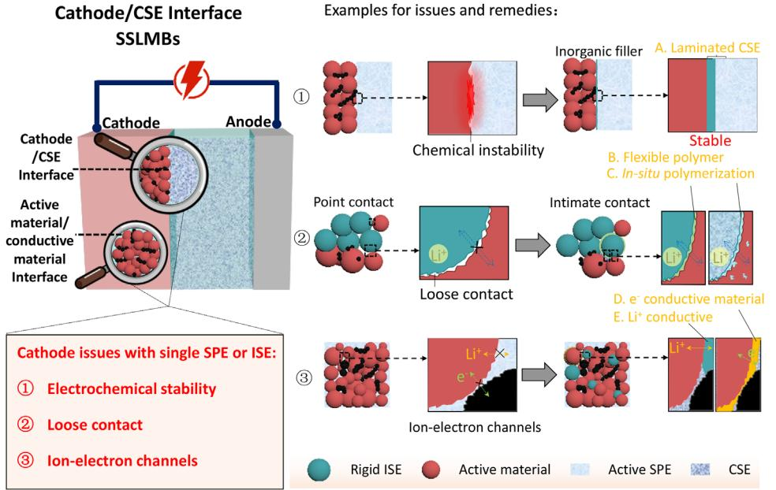

**FIGURE 11** The interfacial issues between CSE and cathode

window is constant challenge. Moreover, the Lewis acid sites on the surface of the ceramic fillers can have a Lewis acid–base interaction with lithium salt anions to promote the dissociation of the lithium salts to release more free Li ions[.199](#page-27-0) This also enables the formation of hydrogen bonds with polar groups such as hydroxyl and carbonate moieties in the polymer chains to improve the compatibility of CSEs with high-voltage cathodes[.131,199](#page-25-0) It is also possible that the surface acid sites might compete with Li ions to form complexes with the basic oxygen on the polymer chains, which could promote Li ions transportation and increase the transference number[.200](#page-27-0) Consequently, the electrochemical stability could be enhanced by the addition of ceramic particles with high electrochemical stability.

Generally, the electrochemical window of a polymer electrolyte is below 5 V versus Li+/Li, while that of inorganic electrolytes can be up to 9 V or even higher[.28,201](#page-22-0) For CSEs, the addition of ceramic fillers could widen the electrochemical window beyond 5 V to meet the requirements of high working voltage in most cathode materials[.202](#page-27-0) Inorganic additives have been widely used to enhance the electrochemical stability of polymer electrolytes. The antioxidant capacity of polymer electrolytes is enhanced by Lewis acid–base interactions, such as hydrogen bond interactions, positive-vacancy salt interactions, and dipole–dipole interactions[.203](#page-27-0) Although the influence of inorganic additives in polymer electrolytes is controversial, the hydrogen bond interaction between inorganic additives and polymer chains in electrolytes is the mainstream research in this field. Sun et al[.204](#page-27-0) initially reported that hydrogen bond interactions between Al2O3 and ClO4− anions enhanced the electrochemical stability of a PEO electrolyte. Moreover, the addition of g-C3N4 to a PEO matrix, where the nitrogen atoms on the surface of g-C3N4 can be considered a Lewis base with strong interaction with lithium salts, is promising for preventing anion oxidation and enhancing the electrochemical stability of the composite electrolyte[.205](#page-27-0) In terms of battery performance, the electrochemical window of electrolyte applications can also be broadened by modifying the cathode material. A polymer/garnet solid electrolyte based on a composite cathode framework was reported to enhance the interfacial stability in SSLMBs.[206](#page-27-0) To improve the interface stability between the cathode and the electrolyte, an Al2O3 @LiNi0.5Co0.2Mn0.3O2 matrix composite cathode framework was prepared using polyoxyethylene polymer and lithium salt as additives. The SSLMBs assembled from the polymer/garnet solid electrolyte and composite cathode frame (c-Al2O3 @NCM|50[PEO–LiTFSI]–40LLZTO– 10PVDF + 9% OX|Li) cell showed a high initial discharge capacity of 150.6 mA h g−1 in a voltage range of 2.5–4.3 V and a good capacity retention rate of 86.7% after 80 cycles at 0.2 and 55◦C. It is an ideal choice for achieving stable electrode/electrolyte interface contacts in SSLMBs.

#### **5.2 Loose contact and remedies**

Interfacial resistance between CSEs and the cathode is another aspect that needs to be considered in the process of designing a high-rate capacity battery. This is similar

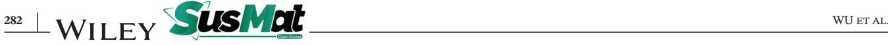

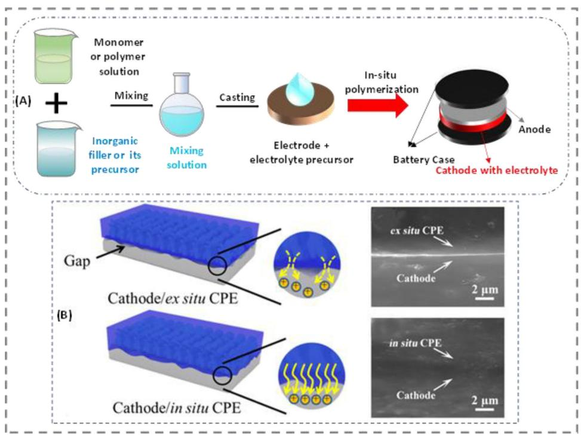

**FIGURE 12** (A) Schematic representation of fabrication methods for composite solid electrolytes via in situ synthesis; (B) schematic diagram and cross-section images comparing the ex situ and in situ as-prepared 3D CSEs (3D TiO2/PEO). Reproduced with permission[.209](#page-28-0) Copyright 2020, American Chemical Society

to the interface of the CSE/anode; the loose contact at the interface of the CSE/cathode also leads to a high interfacial impedance, which could further influence the specific capacity. In situ synthesis is considered an efficient strategy to reduce interfacial resistance. The method of in situ synthesis for polymer/ceramic CSEs has been extensively accepted by researchers. The in situ synthesis can provide interfacial stability at the interfaces of both CSE/anode and CSE/cathode[.207,208](#page-28-0) In contrast to the blending of ceramic fillers with polymers, the in situ synthesis method includes the in situ synthesis of ceramic fillers and in situ synthesis of polymer matrix on electrodes or assembled cells (Figure 12(A)). In situ synthesis not only enhances the interaction between the polymer matrix and ceramic fillers but also results in a better contact with the electrodes, which is beneficial for reducing the interfacial resistance and increasing Li ions transportation at the interfaces[.120,209,210](#page-25-0) In addition, in situ polymerization of the cathode could improve the electrochemical window and cycling stability[.211,212](#page-28-0)

In 2016, using SiO2 particles from the hydrolysis of tetraethyl orthosilicate inside a polymer electrolyte, a PEO/SiO2 composite electrolyte was prepared in situ.[107](#page-24-0) The degree of PEO crystallinity was successfully suppressed owing to the strong chemical and mechanical interactions between the SiO2 spheres and PEO chains formed during in situ synthesis. Moreover, because of the well-controlled growth of the SiO2 particles, they were well dispersed and formed an efficient Lewis acid–base interaction with the polymer chains. This also led to an enhanced ionic conductivity one order of magnitude higher than that of electrolytes prepared by simple blending and an extended electrochemical window of up to 5.5 V, indicating a high compatibility with both the cathode and Li metal anode.

A special structural design can effectively reduce the interface impedance of the cathode and CSE. It is common for a composite cathode layer with a CSE to be stacked with a Li anode to form a monolithic SSLMB by hot pressing. Chen et al[.213](#page-28-0) designed a monolithic SSLMB using layer-to-layer technology. Owing to the in situ synthesized CSE in the cathode, the obtained SSLMB displayed superior flexibility and safety under harsh operating conditions such as bending or even being cut into pieces. The overall impedance of the battery was significantly reduced by optimizing the amount of each component. At 60◦C, monolithic SSLMBs delivered an average specific discharge capacity of 155 mA h g−1 at a constant current density of 100 *μ*A cm2, and a corresponding ultrahigh surface discharge capacity of up to 10.8 mAh cm2.

An in situ built 3D CSE was prepared via simple solidification of the PEO solution precursor with a 3D TiO2 backbone on the cathode (Figure 12(B))[.209](#page-28-0) This CSE exhibited good interfacial contact with the cathode,

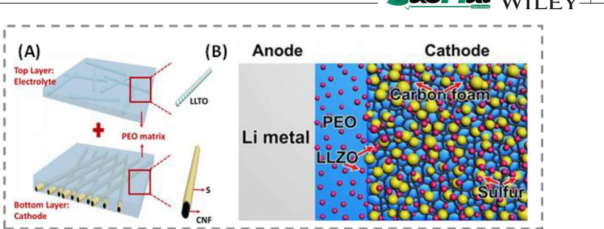

**FIGURE 13** (A) Schematic illustration of the CNF/S-PEO/LLTO bilayer structure design: the top thin PEO/LLTO solid composite electrolyte layer and the bottom PEO filled CNF/S nanofiber layer. Reproduced with permission.[214](#page-28-0) (B) Schematic illustration of an all-solid-state Li−S battery based on LLZO filled PEO electrolyte. Reproduced with permission[.215](#page-28-0) Copyright 2017, American Chemical Society

leading to reduced interfacial resistance and polarization. This can be demonstrated by the cross-section images since there was a distinct interface between the ex situ CSE and the cathode, whereas a very vague interface was observed between the in situ CSE and cathode. Thus, in the solid-state Li||3D CSE||LiFePO4 batteries, the specific capacity was up to 159 mA h g−1 at 20 mA g and the cycling stability was significantly improved with an 85.1% capacity retention after 100 cycles. Therefore, the special structure design is an effective means of improving the battery performance of SSLMBs for future practical applications.

#### **5.3 Ion-electron channel construction**

The cathode is a low ion-electron continuum, and constructing a mixed conducting network by loading a certain amount of active cathode materials and reducing the polarization at the CSE/cathode interface is of great importance to achieve a high energy density. Constructing ion/electron transmission channels in both the cathode and interface is vital to achieve a high energy density and long cycle life in SSLMBs. The interface between a single SPE and cathode shows a poor electron-ion conductivity, but adding electron-ion conductive inorganic fillers into the polymer matrix could create a suitable electron-ion channel and improve the electrochemical performance of SSLMBs.

Zhu et al[.214](#page-28-0) reported a novel LLTO ceramic nanofiberincorporated bilayer framework (CNF/S-PEO/LLZO bilayer structure) designed for SSLMBs. As shown in Figure 13(A), the top thin PEO/LLZO solid composite electrolyte layer acted as the Li-ion conductor, ensuring fast ion transport between the cathode and anode, while the bottom PEO filled CNF/S nanofiber layer provided a balanced dual-conductive architecture for continuous ion/electron transfer. Through the infiltration of the LLTO–PEO solid electrolyte into the surface and pores of the CNF/S nanofiber membrane, the two-layer frame exhibited an increased cycling performance with a high Coulomb efficiency of over 99% at room temperature (Figure 13(A)). A facile synthesis of Al3+/Nb5+ co-doped cubic Li7La3Zr2O12 (LLZO) nanoparticles and LLZO nanoparticle-decorated porous carbon foam (LLZO@C) by the one-step Pechini sol–gel method was reported (Figure 13(B))[.215](#page-28-0) Using the LLZO@C nanostructure as the support for loading S, the solid Li–S battery showed a medium specific capacity of over 900 mA h g−1 at a human body temperature of 37◦C. The improved electrochemical performance of derived from the composite cathode and solid electrolyte is due to the LLZO nanoparticles, which act as both fillers to improve the ionic conductivity and interfacial stabilizers to reduce interfacial resistance. The design strategies for solid-state electrodes and electrolytes will open new pathways for the next generation of energy storage.

Compared with the lithium anode, the interfacial issues on the cathode side are more complicated and challenging. Unlike liquid batteries, which show low resistance at the liquid/solid interface, the interfacial resistance at the solid/solid interface is much higher. Moreover, the interface is unstable, which affects the cycling life of the battery. Therefore, to reduce the electrolyte/electrode interfacial resistance and achieve outstanding performance, it is necessary to carry out special structural design and in situ polymerization/solidification of CSEs and solid batteries, such as gradient concentration composite electrolytes, interlayer composites, and integrated structures. In SSLMBs, the most promising CSEs should have superior characteristics in contact with both the anode and cathode, with high oxidation resistance on the cathode side and high reduction resistance on the anode side, to meet engineering applications in the future.

# **6 CONCLUSIONS AND PERSPECTIVES**

This review focused on different interfaces in SSLMBs using CSEs. Recent results based on the development of CSEs demonstrated that the interfaces between the inorganic filler/polymer matrix, CSE/anode, and CSE/cathode are very important for the ionic conductivity, mechanical strength, and thermal/electrochemical stability of the battery. Therefore, the components for building CSEs and the three types of interface interactions (physical, Lewis acid– base, and chemical) were discussed. Different methodologies for building CSEs were presented and the interfacial resistance between the polymer matrix and inorganic fillers was analyzed. In addition, the possible mechanism of Li ions transport in CSEs was briefly discussed based on the different shapes of inorganic fillers, including particles, nanowires, nanosheets, and 3D-structured frameworks. CSEs filled with a 3D framework and active aligned particles display promising properties by constructing continuous and fast Li ions transport pathways throughout the CSEs. The interface between the CSE and anode was explained according to the existing issues (chemical stability, Li dendrite growth, and loose contact) and their remedies. At the cathode, the CSEs suffer from a low antioxidant ability, loose contact, and ion-electron channel issue. Relevant strategies were also proposed to address these issues.

Although extensive achievements based on the interfaces in SSLMBs with CSEs have been achieved, some challenging issues relating to the interfaces and mechanism of Li ions transport still exist in the application of SSLMBs[.216](#page-28-0) Herein, according to the current results, we propose some possible directions for future research to enhance the performance of CSEs and their assembled batteries. These directions include improvements to the design of CSEs, improvements to interface compatibility, and exploitation of advanced analytic techniques to achieve high-performance SSLMBs (Figure [14\)](#page-21-0).

First, the interfaces between the polymer matrix and inorganic fillers have an important effect on the intrinsic chemical/electrochemical performance, particularly on ionic conductivity. A promising strategy to improve the ionic conductivity is to vary the shape of ceramic fillers from nanoparticles to nanowires or a 3D-structured network, which can provide continuous and long-range transport pathways for faster Li-ion migration. Novel polymers with different functional groups are employed with halide-based ceramics to achieve better CSEs for high-performance SSLMBs.

Second, the interaction and interfacial resistance between the polymer matrix and inorganic fillers should be further understood. Their interactions have important effects on the ion transport and chemical/electrochemical stability of the CSEs. The large interfacial resistance significantly limits the ion transport through the interface. Electrochemical impedance spectroscopy can be used to identify the interfacial resistance. In situ polymerization or building a chemical bond between the polymer matrix and inorganic fillers can be promising for reducing the interfacial resistance of composites and improving their electrochemical stability window and mechanical stability.

Finally, interfacial issues between the anode and CSE, or cathode and CSE are considered major obstacles for achieving a long cycling stability and high power density for SSLMBs. Stable and tight interfacial contact between CSEs and electrodes is a promising way to reduce interfacial resistance and the occurrence of side reactions, which could be helpful for decreasing the concentration polarization and further suppressing the growth of lithium dendrites at the anode, and improving its stability. In situ synthesis is a promising strategy that can significantly increase the interface compatibility and decrease the interfacial resistances between CSEs and electrodes. Adding a 3D-structured framework into a polymer matrix can increase the mechanical strength of a CSE and inhibit the growth of dendrites. Designing multilayer composite electrolytes can result in a wide electrochemical stability window for use in high-performance SSLMBs. To reduce the interfacial resistance between the cathode and CSEs, dielectric inorganic materials, such as BaTiO3, that have the property of transmitting electric force without conduction and forming a local dielectric filed should be used, which is promising to improve the rate capability and cycling stability of the corresponding battery.

Ultimately, our fundamental understanding of the interfacial problems among polymer matrices/ceramics, CSEs/anodes, and CSEs/cathodes are still limited.[217](#page-28-0) These challenges should be further investigated by combining in situ characterization, such as in situ TEM, SS NMR, cryo-electron microscopy (cryo-EM), and TOF-SIMS, with theoretical computation to clarify the key issues, such as the synergetic effects of the polymer matrices and inorganic fillers and the contact of CSEs with anodes/cathodes. A deep understanding of the Li ions transport mechanism in the space charge regions between the polymer matrix and inorganic fillers plays a key role in the process of constructing a composite electrolyte with high ionic conductivity. In addition, the factors that affect the Li ions transport pathways in the polymer phase, inorganic phase, and the interface between the two should be determined. This could provide a rational principle for building an electrolyte that can be used for SSLMBs.

With the combination of designing CSEs with novel polymers and ceramics, decreasing the interfacial resistance between the polymer matrix and inorganic fillers, and improving the interfacial contact between CSEs and electrodes, new CSEs with high-performance properties

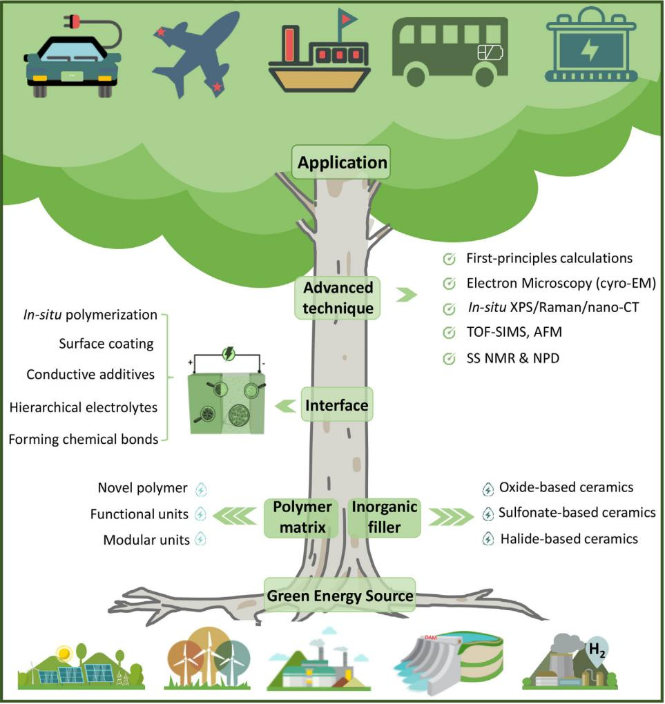

**FIGURE 14** Schematic diagram of research areas for developing high performance SSLMBs by optimizing CSEs and their interfaces with Li anodes and high-voltage cathodes

will be developed. So far however, every known solid electrolyte has one or more drawbacks that must be overcome for application in a functional battery. Future work should continue to discover new promising electrolyte materials through experimental and computation, achieving the goals of wide voltage stability window, sufficient ionic conductivity, low electronic conductivity, and good mechanical properties. Excepting for developing an ideal electrolyte, science gaps of interfaces between electrodes and CSE also need to be paid attention to. For example, the strategies of creating a lithophilic and lithiophobic interface double layer in the Li anode side, and using an additional catholyte providing by the waxy plastic crystal electrolytes in the cathode side should be a promising option to fill the science gaps. Utilizing advanced techniques and simulation research, a new fundamental understanding of the interfacial phenomena based in SSLMBs will be discovered, providing a promising pathway to realize commercial SSLMBs with high safety and high energy density.

#### **ACKNOWLEDGEMENT**

This work was financially supported by "The Youth Beijing Scholars program" (PXM2021\_014204\_000023), Beijing Natural Science Foundation (JQ19003), National Natural Science Foundation of China (Grants 21875007, 21975006, U19A2018, 22075007, 52002007, and 22002004), Beijing Natural Science Foundation (KZ201910005002, KZ202010005007, and 2222001), and General Program of Science and Technology Development Project of Beijing Municipal Education Commission (KM202110005009) and China Postdoctoral Science Foundation (2021M700297).

#### **CONFLICT OF INTEREST**

The authors declare no conflict of interest.

#### **ORCID**

*Haijun Yu* <https://orcid.org/0000-0003-0204-9943>

#### **REFERENCES**

- 1. Armand M, Tarascon JM. Building better batteries. *Nature*. 2008;451(7179):652.
- 2. Zou Z, Li Y, Lu Z, et al. Mobile Ions in Composite Solids. *Chem Rev*. 2020;120(9):4169-4221.
- 3. Liang Y, Zhao C-Z, Yuan H, et al. A review of rechargeable batteries for portable electronic devices. *InfoMat*. 2019;1(1):6-32.
- 4. Chen M, Zhang Y, Xing G, Chou S-L, Tang Y. Electrochemical energy storage devices working in extreme conditions. *Energy Environ Sci*. 2021;14(6):3323-3351.
- 5. Huggins R. Advanced batteries. In: Huggins RA, ed. *Advanced Batteries: Materials Science Aspects*. Springer US; 2009:315-337. Liquid Electrolytes.
- 6. Sun C, Liu J, Gong Y, Wilkinson DP, Zhang J. Recent advances in all-solid-state rechargeable lithium batteries. *Nano Energy*. 2017;33:363-386.
- 7. Dunn B, Kamath H, Tarascon J-M. Electrical energy storage for the grid: a battery of choices. *Science*. 2011;334(6058):928- 935.
- 8. Zheng Y, Zhou T, Zhao X, et al. Atomic interface engineering and electric-field effect in ultrathin Bi2MoO6 nanosheets for superior lithium ion storage. *Adv Mater*. 2017;29(26):1700396.
- 9. Wang Y, Zhong WH. Development of electrolytes towards achieving safe and high-performance energy-storage devices: a review. *ChemElectroChem*. 2015;2(1):22-36.
- 10. Cheng X-B, Liu H, Yuan H, et al. A perspective on sustainable energy materials for lithium batteries. *SusMat*. 2021;1(1):38-50.
- 11. Castillo J, Qiao L, Santiago A, et al. Perspective of polymer-based solid-state Li-S batteries. *Energy Materials*. 2022;2(1):200003.
- 12. Schnell J, Günther T, Knoche T, et al. All-solid-state lithiumion and lithium metal batteries – paving the way to large-scale production. *J Power Sources*. 2018;382:160-175.
- 13. Zhang S, Liu Y, Fan Q, et al. Liquid metal batteries for future energy storage. *Energy Environ Sci*. 2021;14(8):4177-4202.
- 14. Jaumaux P, Liu Q, Zhou D, et al. Deep-eutectic-solvent-based self-healing polymer electrolyte for safe and long-life lithiummetal batteries.*Angew Chem Int Ed Engl*. 2020;59(23):9134-9142.
- 15. Chen R, Li Q, Yu X, Chen L, Li H. Approaching practically accessible solid-state batteries: stability issues related to solid electrolytes and interfaces. *Chem Rev*. 2019;120(14):6820-6877.
- 16. Lu Y, Chen J. Prospects of organic electrode materials for practical lithium batteries. *Nat Rev Chem*. 2020;4(3):127-142.
- 17. Zhao Q, Liu X, Stalin S, Khan K, Archer LA. Solid-state polymer electrolytes with in-built fast interfacial transport for secondary lithium batteries. *Nat Energy*. 2019;4(5):365-373.
- 18. Jiang Y, Yan X, Ma Z, et al. Development of the PEO based solid polymer electrolytes for all-solid state lithium ion batteries. *Polymers*. 2018;10(11):1237.
- 19. Lin ZY, Guo XW, Yu HJ. Amorphous modified silyl-terminated 3D polymer electrolyte for high-performance lithium metal battery. *Nano Energy*. 2017;41:646-653.
- 20. Yue L, Ma J, Zhang J, et al. All solid-state polymer electrolytes for high-performance lithium ion batteries. *Energy Storage Mater*. 2016;5:139-164.
- 21. Zhou D, Shanmukaraj D, Tkacheva A, Armand M, Wang G. Polymer electrolytes for lithium-based batteries: advances and prospects. *Chem*. 2019;5(9):2326-2352.
- 22. Quartarone E, Mustarelli P. Electrolytes for solid-state lithium rechargeable batteries: recent advances and perspectives. *Chem Soc Rev*. 2011;40(5):2525-2540.
- 23. Ding P, Lin Z, Guo X, et al. Polymer electrolytes and interfaces in solid-state lithium metal batteries. *Mater Today*. 2021;51:449- 474.
- 24. Xiang J, Zhang Y, Zhang B, et al. A flame-retardant polymer electrolyte for high performance lithium metal batteries with an expanded operation temperature. *Energy Environ Sci*. 2021;14(6):3510-3521.
- 25. Wu J, Wang X, Liu Q, et al. A synergistic exploitation to produce high-voltage quasi-solid-state lithium metal batteries. *Nat Commun*. 2021;12(1):5746.
- 26. Zhang Z, Shao Y, Lotsch B, et al. New horizons for inorganic solid state ion conductors. *Energy Environ Sci*. 2018;11(8):1945- 1976.
- 27. Masdupuy E. *Ann Chim (Paris)*. 1957;13(2):527. Ser.
- 28. Famprikis T, Canepa P, Dawson JA, Islam MS, Masquelier C. Fundamentals of inorganic solid-state electrolytes for batteries. *Nat Mater*. 2019;18(12):1278-1291.
- 29. Wang C, Liang J, Zhao Y, Zheng M, Li X, Sun X. All-solid-state lithium batteries enabled by sulfide electrolytes: from fundamental research to practical engineering design. *Energy Environ Sci*. 2021;14(5):2577-2619.
- 30. Gao Z, Sun H, Fu L, et al. Promises, challenges, and recent progress of inorganic solid-state electrolytes for all-solid-state lithium batteries. *Adv Mater*. 2018;30(17):1705702.
- 31. Xia S, Wu X, Zhang Z, Cui Y, Liu W. Practical challenges and future perspectives of all-solid-state lithium-metal batteries. *Chem*. 2019;5(4):753-785.
- 32. Kerman K, Luntz A, Viswanathan V, Chiang Y-M, Chen Z. Review—practical challenges hindering the development of solid state Li ion batteries. *J Electrochem Soc*. 2017;164(7):A1731- A1744.
- 33. Zhang L, Chen Y. Electrolyte solvation structure as a stabilization mechanism for electrodes. *Energy Mater*. 2021;1(1):100004.
- 34. Li S, Zhang SQ, Shen L, et al. Progress and perspective of ceramic/polymer composite solid electrolytes for lithium batteries. *Adv Sci (Weinh)*. 2020;7(5):1903088.
- 35. Yang Q, Hu J, Meng J, Li C. C–F-rich oil drop as a nonexpendable fluid interface modifier with low surface energy to stabilize a Li metal anode. *Energy Environ Sci*. 2021;14(6):3621- 3631.
- 36. Sun J, He C, Yao X, et al. Hierarchical composite-solidelectrolyte with high electrochemical stability and interfacial regulation for boosting ultra-stable lithium batteries. *Adv Funct Mater*. 2021;31(1):2006381.
- 37. Li Z, Zhang H, Sun X, Yang Y. Mitigating interfacial instability in polymer electrolyte-based solid-state lithium metal batteries with 4V cathodes. *ACS Energy Lett*. 2020;5(10):3244-3253.
- 38. Xu RC, Xia XH, Zhang SZ, Xie D, Wang XL, Tu JP. Interfacial challenges and progress for inorganic all-solid-state lithium batteries. *Electrochim Acta*. 2018;284:177-187.
- 39. Ding Z, Li J, Li J, An C. Review—interfaces: key issue to be solved for all solid-state lithium battery technologies. *J Electrochem Soc*. 2020;167(7):070541.
- 40. Banerjee A, Wang X, Fang C, Wu EA, Meng YS. Interfaces and interphases in all-solid-state batteries with inorganic solid electrolytes. *Chem Rev*. 2020;120(14):6878-6933.
- 41. Horstmann B, Shi J, Amine R, et al. Strategies towards enabling lithium metal in batteries: interphases and electrodes. *Energy Environ Sci*. 2021;14(10):5289-5314.
- 42. Fitzhugh W, Chen X, Wang Y, Ye L, Li X. Solid–electrolyteinterphase design in constrained ensemble for solid-state batteries. *Energy Environ Sci*. 2021;14(8):4574-4583.
- 43. Wang S, Fang R, Li Y, et al. Interfacial challenges for all-solidstate batteries based on sulfide solid electrolytes.*J Materiomics*. 2021;7(2):209-218.
- 44. Fan L-Z, He H, Nan C-W. Tailoring inorganic–polymer composites for the mass production of solid-state batteries. *Nat Rev Mater*. 2021;6(11):1003-1019.
- 45. Zhang DC, Xu XJ, Qin YL, et al. Recent progress in organicinorganic composite solid electrolytes for all-solid-state lithium batteries. *Chem Eur J*. 2020;269(8):1720-1736.
- 46. Li L, Deng Y, Chen G. Status and prospect of garnet/polymer solid composite electrolytes for all-solid-state lithium batteries. *J Energy Chem*. 2020;50:154-177.
- 47. Dirican M, Yan C, Zhu P, Zhang X. Composite solid electrolytes for all-solid-state lithium batteries. *Mater Sci Eng R Rep*. 2019;136:27-46.
- 48. Zheng Y, Yao Y, Ou J, et al. A review of composite solid-state electrolytes for lithium batteries: fundamentals, key materials and advanced structures. *Chem Soc Rev*. 2020;49(23):8790- 8839.
- 49. Yu X, Manthiram A. A review of composite Polymerceramic electrolytes for lithium batteries. *Energy Storage Mater*. 2020;34:282-300.
- 50. Cheng Z, Liu T, Zhao B, Shen F, Jin H, Han X. Recent advances in organic-inorganic composite solid electrolytes for all-solidstate lithium batteries. *Energy Storage Materials*. 2020;34:388- 416.
- 51. Weston JE, Steele BCH. Effects of inert fillers on the mechanical and electrochemical properties of lithium salt-poly(ethylene oxide) polymer electrolytes. *Solid State Ionics*. 1982;7(1):75-79.
- 52. Skaarup S, West K, Zachau-Christiansen B. Mixed phase solid electrolytes. *Solid State Ionics*. 1988;28-30(2):975-978. Part.
- 53. Xu L, Tang S, Cheng Y, et al. Interfaces in solid-state lithium batteries. *Joule*. 2018;2(10):1991-2015.
- 54. Yao P, Yu H, Ding Z, et al. Review on polymer-based composite electrolytes for lithium batteries. *Front Chem*. 2019;7:522.
- 55. Meng N, Zhu X, Lian F. Particles in composite polymer electrolyte for solid-state lithium batteries: a review. *Particuology*. 2021;60:14-36.
- 56. Mauger A, Julien CM, Paolella A, Armand M, Zaghib K. A comprehensive review of lithium salts and beyond for rechargeable batteries: progress and perspectives. *Mater Sci Eng R Rep*. 2018;134:1-21.
- 57. Shi X, Ma N, Wu Y, et al. Fabrication and electrochemical properties of LATP/PVDF composite electrolytes for rechargeable lithium-ion battery. *Solid State Ionics*. 2018;325:112-119.
- 58. Young W-S, Kuan W-F, Epps I, Thomas H. Block copolymer electrolytes for rechargeable lithium batteries. *J Polym Sci, Part B: Polym Phys*. 2014;52(1):1-16.
- 59. Arya A, Sharma AL. Polymer electrolytes for lithium ion batteries: a critical study. *Ionics*. 2017;23(3):497-540.
- 60. Lin Z, Guo X, Wang Z, et al. A wide-temperature superior ionic conductive polymer electrolyte for lithium metal battery. *Nano Energy*. 2020;73:104786.
- 61. Lin Z, Guo X, Yang Y, Tang M, Wei Q, Yu H. Block copolymer electrolyte with adjustable functional units for solid polymer lithium metal battery. *J Energy Chem*. 2021;52:67-74.
- 62. Zhou W, Wang S, Li Y, Xin S, Manthiram A, Goodenough JB. Plating a dendrite-free lithium anode with a polymer/ceramic/polymer sandwich electrolyte. *J Am Chem Soc*. 2016;138(30):9385-9388.
- 63. Jung H-A, Yi E-J, Hwanga H, Fabrication of ceramic/polymer hybrid solid electrolytes for All-solid-state lithium batteries. *ECS Meeting Abstracts*. 2019;147.
- 64. Zhang X, Xie J, Shi F, et al. Vertically aligned and continuous nanoscale ceramic-polymer interfaces in composite solid polymer electrolytes for enhanced ionic conductivity. *Nano Lett*. 2018;18(6):3829-3838.
- 65. Hu P, Chai J, Duan Y, Liu Z, Cui G, Chen L. Progress in nitrilebased polymer electrolytes for high performance lithium batteries. *J Mater Chem A*. 2016;4(26):10070-10083.
- 66. Duan H, Fan M, Chen W-P, et al. Extended electrochemical window of solid electrolytes via heterogeneous multilayered structure for high-voltage lithium metal batteries. *Adv Mater*. 2019;31(12):1807789.
- 67. Zhang X, Wang S, Xue C, et al. Self-suppression of lithium dendrite in all-solid-state lithium metal batteries with poly(vinylidene difluoride)-based solid electrolytes. *Adv Mater*. 2019;31(11):1806082.
- 68. Liang YF, Deng SJ, Xia Y, et al. A superior composite gel polymer electrolyte of Li7La3Zr2O12- poly (vinylidene fluoridehexafluoropropylene) (PVDF-HFP) for rechargeable solid-state lithium ion batteries. *Mater Res Bull*. 2018;102:412-417.
- 69. Liu W, Liu N, Sun J, et al. Ionic conductivity enhancement of polymer electrolytes with ceramic nanowire fillers. *Nano Lett*. 2015;15(4):2740-2745.
- 70. Li B, Su Q, Yu L, et al. Li0.35La0.55TiO3 nanofibers enhanced poly(vinylidene fluoride)-based composite polymer electrolytes for all-solid-state batteries. *ACS Appl Mater Interfaces*. 2019;11(45):42206-42213.
- 71. Fu K, Gong Y, Dai J, et al. Flexible, solid-state, ion-conducting membrane with 3D garnet nanofiber networks for lithium batteries. *Proc Natl Acad Sci USA*. 2016;113(26):7094-7099.
- 72. Bae J, Li Y, Zhang J, et al. A 3D nanostructured hydrogelframework-derived high-performance composite polymer lithium-ion electrolyte. *Angew Chem Int Ed*. 2018;57(8):2096- 2100.
- 73. Liu M, Cheng Z, Ganapathy S, et al. Tandem interface and bulk Li-ion transport in a hybrid solid electrolyte with microsized active filler. *ACS Energy Lett*. 2019;4(9):2336-2342.
- 74. Zhao C-Z, Zhang X-Q, Cheng X-B, et al. An anion-immobilized composite electrolyte for dendrite-free lithium metal anodes. *Proc Natl Acad Sci USA*. 2017;114(42):11069-11074.
- 75. Pan K, Zhang L, Qian W, et al. A flexible ceramic/polymer hybrid solid electrolyte for solid-state lithium metal batteries. *Adv Mater*. 2020;32(17):e2000399.
- 76. Huo H, Chen Y, Luo J, Yang X, Guo X, Sun X. Rational design of hierarchical "Ceramic-in-Polymer" and "Polymer-in-Ceramic" electrolytes for dendrite-free solid-state batteries. *Adv Energy Mater*. 2019;9(17):1804004.

# **288** WU et al.

- 77. Yang T, Zheng J, Cheng Q, Hu Y-Y, Chan CK. Composite polymer electrolytes with Li7La3Zr2O12 garnet-type nanowires as ceramic fillers: mechanism of conductivity enhancement and role of doping and morphology. *ACS Appl Mater Interfaces*. 2017;9(26):21773-21780.
- 78. Liu W, Lee SW, Lin D, et al. Enhancing ionic conductivity in composite polymer electrolytes with well-aligned ceramic nanowires. *Nat Energy*. 2017;2(5):17035.
- 79. Zhang X, Liu T, Zhang S, et al. Synergistic coupling between Li6.75La3Zr1.75Ta0.25O12 and poly(vinylidene fluoride) induces high ionic conductivity, mechanical strength, and thermal stability of solid composite electrolytes. *J Am Chem Soc*. 2017;139(39):13779-13785.
- 80. Bag S, Zhou C, Kim PJ, Pol VG, Thangadurai V. LiF modified stable flexible PVDF-garnet hybrid electrolyte for high performance all-solid-state Li–S batteries. *Energy Storage Mater*. 2020;24:198-207.
- 81. Zhang J, Zang X, Wen H, et al. High-voltage and free-standing poly(propylene carbonate)/Li6.75La3Zr1.75Ta0.25O12 composite solid electrolyte for wide temperature range and flexible solid lithium ion battery. *J Mater Chem A*. 2017;5(10):4940- 4948.
- 82. Hua S, Jing MX, Han C, et al. A novel titania nanorods-filled composite solid electrolyte with improved room temperature performance for solid-state Li-ion battery. *Int J Energy Res*. 2019;43(13):7296-7305.
- 83. Masoud EM, El-Bellihi AA, Bayoumy WA, Mousa MA. Organicinorganic composite polymer electrolyte based on PEO-LiClO4 and nano-Al2O3 filler for lithium polymer batteries: dielectric and transport properties. *J Alloys Compd*. 2013;575:223- 228.
- 84. Xu Z, Yang T, Chu X, et al. Strong lewis acid–base and weak hydrogen bond synergistically enhancing ionic conductivity of poly(ethylene oxide)@SiO2 electrolytes for a high rate capability Li-metal battery. *ACS Appl Mater Interfaces*. 2020;12(9):10341-10349.
- 85. Tominaga Y, Yamazaki K. Fast Li-ion conduction in poly(ethylene carbonate)-based electrolytes and composites filled with TiO2 nanoparticles. *Chem Commun*. 2014;50(34):4448-4450.
- 86. Sun HY, Takeda Y, Imanishi N, Yamamoto O, Sohn H. Ferroelectric materials as a ceramic filler in solid composite polyethylene oxide-based electrolytes. *J Electrochem Soc*. 2000;147(7):2462-2467.
- 87. Jia W, Li Z, Wu Z, et al. Graphene oxide as a filler to improve the performance of PAN-LiClO4 flexible solid polymer electrolyte. *Solid State Ionics*. 2018;315:7-13.
- 88. Bachman JC, Muy S, Grimaud A, et al. Inorganic solid-state electrolytes for lithium batteries: mechanisms and properties governing ion conduction. *Chem Rev*. 2016;116(1):140-162.
- 89. Wang Y, Guo X, Lin Z, et al. Dense Sphene-type solid electrolyte through rapid sintering for solid-state lithium metal battery. *Chem Res Chin Univ*. 2020;36(3):439-446.
- 90. Zhao Y, Huang Z, Chen S, et al. A promising PEO/LAGP hybrid electrolyte prepared by a simple method for all-solidstate lithium batteries. *Solid State Ionics*. 2016;295:65-71.
- 91. Chen S, Xie D, Liu G, et al. Sulfide solid electrolytes for allsolid-state lithium batteries: structure, conductivity, stability and application. *Energy Storage Mater*. 2018;14:58-74.
- 92. Li Z, Huang H-M, Zhu J-K, et al. Ionic conduction in composite polymer electrolytes: case of PEO:ga-LLZO composites. *ACS Appl Mater Interfaces*. 2019;11(1):784-791.
- 93. Chen L, Li Y, Li SP, Fan LZ, Nan CW, Goodenough JB. PEO/garnet composite electrolytes for solid-state lithium batteries: from "ceramic-in-polymer" to "polymer-in-ceramic". *Nano Energy*. 2018;46:176-184.
- 94. Jena A, Meesala Y, Hu S-F, Chang H, Liu R-S. Ameliorating interfacial ionic transportation in all-solid-state Li-ion batteries with interlayer modifications. *ACS Energy Lett*. 2018;3(11):2775- 2795.
- 95. Camacho-Forero LE, Balbuena PB. Exploring interfacial stability of solid-state electrolytes at the lithium-metal anode surface. *J Power Sources*. 2018;396:782-790.
- 96. Huang Z, Pang W, Liang P, et al. A dopamine modified Li6.4La3Zr1.4Ta0.6O12/PEO solid-state electrolyte: enhanced thermal and electrochemical properties. *J Mater Chem A*. 2019;7(27):16425-16436.
- 97. Lin D, Yuen PY, Liu Y, et al. A silica-aerogel-reinforced composite polymer electrolyte with high ionic conductivity and high modulus. *Adv Mater*. 2018;30(32):1802661.
- 98. Li Z, Sha W-X, Guo X. Three-dimensional garnet frameworkreinforced solid composite electrolytes with high lithium-ion conductivity and excellent stability. *ACS Appl Mater Interfaces*. 2019;11(30):26920-26927.
- 99. Tan DHS, Banerjee A, Chen Z, Meng YS. From nanoscale interface characterization to sustainable energy storage using allsolid-state batteries. *Nat Nanotechnol*. 2020;15(3):170-180.
- 100. Kwon SJ, Jung BM, Kim T, et al. Influence of Al2O3 nanowires on ion transport in nanocomposite solid polymer electrolytes. *Macromolecules*. 2018;51(24):10194-10201.
- 101. Yin Y, Jiang C-S, Guthrey H, et al. Improved stability and cyclability of ceramic solid electrolyte by coating polymer. *J Electrochem Soc*. 2020;167(2):020519.
- 102. Yuan M, Erdman J, Tang C, Ardebili H. High performance solid polymer electrolyte with graphene oxide nanosheets. *RSC Adv*. 2014;4(103):59637-59642.
- 103. Zekoll S, Marriner-Edwards C, Hekselman AKO, et al. Hybrid electrolytes with 3D bicontinuous ordered ceramic and polymer microchannels for all-solid-state batteries. *Energy Environ Sci*. 2018;11(1):185-201.
- 104. Li Y, Sun Z, Liu D, et al. A composite solid polymer electrolyte incorporating MnO2 nanosheets with reinforced mechanical properties and electrochemical stability for lithium metal batteries. *J Mater Chem A*. 2020;8(4):2021-2032.
- 105. Wang Y, Wu L, Lin Z, et al. Hydrogen bonds enhanced composite polymer electrolyte for high-voltage cathode of solid-state lithium battery. *Nano Energy*. 2022;96:107105.
- 106. Chen G, Zhang F, Zhou Z, Li J, Tang Y. A flexible Dual-ion battery based on PVDF-HFP-Modified gel polymer electrolyte with excellent cycling performance and superior rate capability. *Adv Energy Mater*. 2018;8(25):1801219.
- 107. Lin D, Liu W, Liu Y, et al. High ionic conductivity of composite solid polymer electrolyte via in situ synthesis of monodispersed SiO2 nanospheres in poly(ethylene oxide). *Nano Lett*. 2016;16(1):459-465.
- 108. Xu D, Su J, Jin J, et al. In situ generated fireproof gel polymer electrolyte with Li6.4Ga0.2La3Zr2O12 as initiator and ionconductive filler. *Adv Energy Mater*. 2019;9(25):1900611.

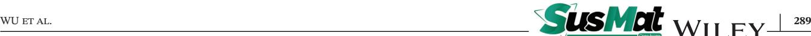

- 109. Stalin S, Choudhury S, Zhang K, Archer LA. Multifunctional cross-linked polymeric membranes for safe, high-performance lithium batteries. *Chem Mater*. 2018;30(6):2058-2066.
- 110. Chen W-P, Duan H, Shi J-L, et al. Bridging interparticle Li+ Conduction in a soft ceramic oxide electrolyte. *J Am Chem Soc*. 2021;143(15):5717-5726.
- 111. Yang H, Bright J, Chen B, et al. Chemical interaction and enhanced interfacial ion transport in a ceramic nanofiber– polymer composite electrolyte for all-solid-state lithium metal batteries. *J Mater Chem A*. 2020;8(15):7261-7272.
- 112. Langer F, Bardenhagen I, Glenneberg J, Kun R. Microstructure and temperature dependent lithium ion transport of ceramic– polymer composite electrolyte for solid-state lithium ion batteries based on garnet-type Li7La3Zr2O12. *Solid State Ionics*. 2016;291:8-13.
- 113. Keller M, Appetecchi GB, Kim G-T, et al. Electrochemical performance of a solvent-free hybrid ceramic-polymer electrolyte based on Li7La3Zr2O12 in P(EO)15LiTFSI. *J Power Sources*. 2017;353:287-297.
- 114. Abe T, Ohtsuka M, Sagane F, Iriyama Y, Ogumi Z. Lithium ion transfer at the interface between lithium-ion-conductive solid crystalline electrolyte and polymer electrolyte. *J Electrochem Soc*. 2004;151(11):A1950.
- 115. Langer F, Palagonia MS, Bardenhagen I, Glenneberg J, La Mantia F, Kun R. Impedance spectroscopy analysis of the lithium ion transport through the Li7La3Zr2O12/P(EO)20Li interface. *J Electrochem Soc*. 2017;164(12):A2298-A2303.
- 116. Brogioli D, Langer F, Kun R, La Mantia F. Space-charge effects at the Li7La3Zr2O12/Poly(ethylene oxide) interface. *ACS Appl Mater Interfaces*. 2019;11(12):11999-12007.
- 117. Zheng J, Tang M, Hu Y-Y. NMR-lithium ion pathway within Li7La3Zr2O12-polyethylene oxide composite electrolytes. *Angew Chem Int Ed*. 2016;55(40):12538-12542.
- 118. Chen S, Wang J, Zhang Z, et al. In-situ preparation of poly(ethylene oxide)/Li3PS4 hybrid polymer electrolyte with good nanofiller distribution for rechargeable solid-state lithium batteries. *J Power Sources*. 2018;387:72-80.
- 119. Zhang J, Zhao N, Zhang M, et al. Flexible and ion-conducting membrane electrolytes for solid-state lithium batteries: dispersion of garnet nanoparticles in insulating polyethylene oxide. *Nano Energy*. 2016;28:447-454.
- 120. Tan X, Wu Y, Tang W, et al. Preparation of nanocomposite polymer electrolyte via in situ synthesis of SiO2 nanoparticles in PEO. *Nanomaterials*. 2020;10(1):157.
- 121. Li Z, Xie H-X, Zhang X-Y, Guo X. In situ thermally polymerized solid composite electrolytes with a broad electrochemical window for all-solid-state lithium metal batteries. *J Mater Chem A*. 2020;8(7):3892-3900.
- 122. Janek J, Zeier W. A solid future for battery development. *Nat Energy*. 2016;1(9):16141.
- 123. Chazalviel JN. Electrochemical aspects of the generation of ramified metallic electrodeposits. *Phys Rev A*. 1990;42(12):7355- 7367.
- 124. Croce F, Appetecchi GB, Persi L, Scrosati B. Nanocomposite polymer electrolytes for lithium batteries. *Nature*. 1998;394(6692):456-458.
- 125. Wieczorek W, Stevens JR, Florjańczyk Z. Composite polyether based solid electrolytes. The Lewis acid-base approach. *Solid State Ionics*. 1996;85(1-4):67-72.
- 126. Commarieu B, Paolella A, Daigle JC, Zaghib K. Toward high lithium conduction in solid polymer and polymer–ceramic batteries. *Curr Opin Electrochem*. 2018;9:56-63.
- 127. Randau S, Weber DA, Kötz O, et al. Benchmarking the performance of all-solid-state lithium batteries. *Nat Energy*. 2020;5(3):259-270.
- 128. Lopez J, Mackanic DG, Cui Y, Bao Z. Designing polymers for advanced battery chemistries. *Nat Rev Mater*. 2019;4(5):312-330.
- 129. Zhai H, Xu P, Ning M, Cheng Q, Mandal J, Yang Y. A flexible solid composite electrolyte with vertically aligned and connected ion-conducting nanoparticles for lithium batteries. *Nano Lett*. 2017;17(5):3182-3187.
- 130. Lin Y, Wang X, Liu J, Miller JD. Natural halloysite nano-clay electrolyte for advanced all-solid-state lithium-sulfur batteries. *Nano Energy*. 2017;31:478-485.
- 131. Liu L, Lyu J, Mo J, et al. Flexible, high-voltage, ion-conducting composite membranes with 3D aramid nanofiber frameworks for stable all-solid-state lithium metal batteries. *Sci China Mater*. 2020;63(5):703-718.
- 132. Fan R, Liu C, He K, et al. Versatile strategy for realizing flexible room-temperature all-solid-state battery through a synergistic combination of salt affluent PEO and Li6.75La3Zr1.75Ta0.25O12 nanofibers. *ACS Appl Mater Interfaces*. 2020;12(6):7222- 7231.
- 133. Gai JL, Ma FR, Zhang ZQ, et al. Flexible organic-inorganic composite solid electrolyte with asymmetric structure for room temperature solid -state Li-ion batteries. *ACS Sustainable Chem Eng*. 2019;7(19):15896-15903.
- 134. Yao P, Zhu B, Zhai H, et al. PVDF/Palygorskite nanowire composite electrolyte for 4 V rechargeable lithium batteries with high energy density. *Nano Lett*. 2018;18(10):6113-6120.
- 135. Cong L, Li Y, Lu W, et al. Unlocking the poly(vinylidene fluoride-co-hexafluoropropylene)/Li10GeP2S12 composite solid-state electrolytes for dendrite-free Li metal batteries assisting with perfluoropolyethers as bifunctional adjuvant. *J Power Sources*. 2020;446:227365.
- 136. Wang S, Zhang L, Li J, et al. A nanowire-nanoparticle double composite polymer electrolyte for high performance ambient temperature solid-state lithium batteies. *Electrochim Acta*. 2019;320:134560.
- 137. Shi Y, Li B, Zhu Q, et al. MXene-based mesoporous nanosheets toward superior lithium ion conductors. *Adv Energy Mater*. 2020;10(9):1903534.
- 138. Yan Y, Ju J, Dong S, et al. PEGME-LATP-In situ polymerization permeated three-dimensional Li+-Percolated porous oxide ceramic framework boosting all solid-state lithium metal battery. *Adv Sci*. 2021;8(9):2003887.
- 139. Liu J, Zhou J, Wang M, Niu C, Qian T, Yan C. A functionalgradient-structured ultrahigh modulus solid polymer electrolyte for all-solid-state lithium metal batteries. *J Mater Chem A*. 2019;7(42):24477-24485.
- 140. Wang S, Li J, Li Q, et al. Topological polymer electrolyte containing poly(pinacol vinylboronate) segments composited with ceramic nanowires towards ambient-temperature superior performance all-solid-state lithium batteries. *J Power Sources*. 2019;413:318-326.
- 141. Chen L, Li W, Fan L-Z, Nan C-W, Zhang Q. Intercalated electrolyte with high transference number for dendrite-free solidstate lithium batteries. *Adv Funct Mater*. 2019;29(28):1901047.

# **290** WU et al.

- 142. Chen H, Jing MX, Han C, et al. A novel organic/inorganic composite solid electrolyte with functionalized layers for improved room-temperature rate performance of solid-state lithium battery. *Int J Energy Res*. 2019;43(11):5912-5921.
- 143. Jia M, Zhao N, Bi Z, et al. Polydopamine-coated garnet particles homogeneously distributed in poly(propylene carbonate) for the conductive and stable membrane electrolytes of solid lithium batteries. *ACS Appl Mater Interfaces*. 2020;12(41):46162- 46169.
- 144. Zhang ZS, Zhang L, Liu YY, et al. Dendrite-free lithium-metal batteries at high rate realized using a composite solid electrolyte with an ester-PO4 complex and stable interphase.*J Mater Chem A*. 2019;7(40):23173-23181.
- 145. Zhang L, Wang S, Li J, et al. A nitrogen-containing all-solidstate hyperbranched polymer electrolyte for superior performance lithium batteries. *J Mater Chem A*. 2019;7(12):6801-6808.
- 146. Wen K, Tan X, Chen T, Chen S, Zhang S. Fast Li-ion transport and uniform Li-ion flux enabled by a double–layered polymer electrolyte for high performance Li metal battery. *Energy Storage Mater*. 2020;32:55-64.
- 147. Mohanta J, Kang D-W, Cho JS, Jeong SM, Kim J-K. Stretchable electrolytes for stretchable/flexible energy storage systems – recent developments. *Energy Storage Mater*. 2020;28:315-324.
- 148. Zheng J, Hu Y-Y. New insights into the compositional dependence of Li-ion transport in polymer–ceramic composite electrolytes. *ACS Appl Mater Interfaces*. 2018;10(4):4113-4120.
- 149. Zagórski J, López del Amo JM, Cordill MJ, Aguesse F, Buannic L, Llordés A. Garnet–polymer composite electrolytes: new insights on local Li-ion dynamics and electrodeposition stability with Li metal anodes. *ACS Appl Energy Mater*. 2019;2(3):1734-1746.
- 150. Lin W, Jiao JJ, Li H, et al. Organic-inorganic composite porous membrane for stable and high-performance lithium-ion battery. *Chemistryselect*. 2020;5(4):1308-1314.
- 151. Choi J-H, Lee C-H, Yu J-H, Doh C-H, Lee S-M. Enhancement of ionic conductivity of composite membranes for all-solidstate lithium rechargeable batteries incorporating tetragonal Li7La3Zr2O12 into a polyethylene oxide matrix. *J Power Sources*. 2015;274:458-463.
- 152. Zheng J, Dang H, Feng X, Chien P-H, Hu Y-Y. Li-ion transport in a representative ceramic–polymer–plasticizer composite electrolyte: Li7La3Zr2O12–polyethylene oxide–tetraethylene glycol dimethyl ether. *J Mater Chem A*. 2017;5(35):18457-18463.
- 153. Zhou R, Liu W, Yao X, Leong YW, Lu X. Poly(vinylidene fluoride) nanofibrous mats with covalently attached SiO2 nanoparticles as an ionic liquid host: enhanced ion transport for electrochromic devices and lithium-ion batteries. *J Mater Chem A*. 2015;3(31):16040-16049.
- 154. Liu X, Peng S, Gao S, et al. Electric-Field-Directed parallel alignment architecting 3D Lithium-Ion pathways within solid composite electrolyte. *ACS Appl Mater Interfaces*. 2018;10(18):15691- 15696.
- 155. Ye Y-S, Wang H, Bi S-G, et al. High performance composite polymer electrolytes using polymeric ionic liquidfunctionalized graphene molecular brushes. *J Mater Chem A*. 2015;3(35):18064-18073.
- 156. Shim J, Kim HJ, Kim BG, Kim YS, Kim D-G, Lee J-C. 2D boron nitride nanoflakes as a multifunctional additive in gel polymer

electrolytes for safe, long cycle life and high rate lithium metal batteries. *Energy Environ Sci*. 2017;10(9):1911-1916.

- 157. Novoselov KS, Fal′ko VI, Colombo L, Gellert PR, Schwab MG, Kim K. A roadmap for graphene. *Nature*. 2012;490(7419):192- 200.
- 158. Weng Q, Wang X, Wang X, Bando Y, Golberg D. Functionalized hexagonal boron nitride nanomaterials: emerging properties and applications. *Chem Soc Rev*. 2016;45(14):3989-4012.
- 159. Alghyamah AA, Haider S, Khalil U, et al. Synthesis and characterization of graphene oxide, reduced graphene oxide and their nanocomposites with polyethylene oxide. *Curr Appl Phys*. 2020.
- 160. Cheng S, Smith DM, Pan Q, Wang S, Li CY. Anisotropic ion transport in nanostructured solid polymer electrolytes. *RSC Adv*. 2015;5(60):48793-48810.
- 161. Song S, Wu Y, Tang W, et al. Composite solid polymer electrolyte with garnet nanosheets in poly(ethylene oxide). *ACS Sustainable Chem Eng*. 2019;7(7):7163-7170.
- 162. Hu L, Tang Z, Zhang Z. New composite polymer electrolyte comprising mesoporous lithium aluminate nanosheets and PEO/LiClO4. *J Power Sources*. 2007;166(1):226-232.
- 163. Tang W, Tang S, Zhang C, et al. Simultaneously enhancing the thermal stability, mechanical modulus, and electrochemical performance of solid polymer electrolytes by incorporating 2D sheets. *Adv Energy Mater*. 2018;8(24):1800866.
- 164. Xu R, Cheng X-B, Yan C, et al. Artificial interphases for highly stable lithium metal anode. *Matter*. 2019;1(2):317-344.
- 165. Sun Y, Zhao C, Adair KR, et al. Regulated lithium plating and stripping by a nano-scale gradient inorganic–organic coating for stable lithium metal anodes. *Energy Environ Sci*. 2021;14(7):4085-4094.
- 166. Zhang H, Chen Y, Li C, Armand M. Electrolyte and anodeelectrolyte interphase in solid-state lithium metal polymer batteries: a perspective. *SusMat*. 2021;1(1):24-37.
- 167. Li C-C, Zhang X-S, Zhu Y-H, et al. Modulating the lithiophilicity at electrode/electrolyte interface for high-energy Li-metal batteries. *Energy Materials*. 2021;1(2):100017.
- 168. Jana A, García RE. Lithium dendrite growth mechanisms in liquid electrolytes. *Nano Energy*. 2017;41:552-565.
- 169. Zhao Q, Chen X, Hou W, et al. A facile, scalable, high stability Lithium metal anode. *SusMat*;2(1):104-112.
- 170. Xin S, You Y, Wang S, Gao H-C, Yin Y-X, Guo Y-G. Solid-state lithium metal batteries promoted by nanotechnology: progress and prospects. *ACS Energy Lett*. 2017;2(6):1385-1394.
- 171. Deng T, Ji X, Zhao Y, et al. Tuning the anode–electrolyte interface chemistry for garnet-based solid-state Li metal batteries. *Adv Mater*. 2020;32(23):2000030.
- 172. Wang C, Zhang H, Li J, Chai J, Dong S, Cui G. PPC The interfacial evolution between polycarbonate-based polymer electrolyte and Li-metal anode. *J Power Sources*. 2018;397:157- 161.
- 173. Ebadi M, Marchiori C, Mindemark J, Brandell D, Araujo CM. Assessing structure and stability of polymer/lithium-metal interfaces from first-principles calculations. *J Mater Chem A*. 2019;7(14):8394-8404.
- 174. Yang X, Jiang M, Gao X, et al. Determining the limiting factor of the electrochemical stability window for PEO-based solid polymer electrolyte: main chain or terminal –OH group?. *Energy Environ Sci*. 2020;13(5):1318-1325.

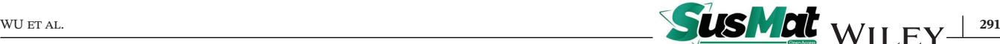

- 175. Mirsakiyeva A, Ebadi M, Araujo CM, Brandell D, Broqvist P, Kullgren J. Initial steps in PEO decomposition on a Li metal electrode. *J Phys Chem C*. 2019;123(37):22851-22857.
- 176. Zhang J, Zhao J, Yue L, et al. Safety-reinforced poly(propylene carbonate)-based all-solid-state polymer electrolyte for ambient-temperature solid polymer lithium batteries. *Adv Energy Mater*. 2015;5(24):1501082.
- 177. Wu N, Chien P-H, Li Y, et al. Fast Li+ conduction mechanism and interfacial chemistry of a NASICON/Polymer composite electrolyte. *J Am Chem Soc*. 2020;142(5):2497-2505.
- 178. Li D, Chen L, Wang T, Fan L-Z. 3D fiber-network-reinforced bicontinuous composite solid electrolyte for dendritefree lithium metal batteries. *ACS Appl Mater Interfaces*. 2018;10(8):7069-7078.
- 179. Kitaura H, Hosono E, Zhou H. An ultrafast process for the fabrication of a Li metal–inorganic solid electrolyte interface. *Energy Environ Sci*. 2021;14(8):4474-4480.
- 180. Paul PP, Thampy V, Cao C, et al. Quantification of heterogeneous, irreversible lithium plating in extreme fast charging of lithium-ion batteries. *Energy Environ Sci*. 2021;14(9):4979-4988.
- 181. Zhou S, Chen W, Shi J, et al. Efficient diffusion of superdense lithium via atomic channel for dendrite-free lithium-metal batteries. *Energy Environ Sci*. 2021.
- 182. Wan J, Xie J, Mackanic DG, Burke W, Bao Z, Cui Y. Status, promises, and challenges of nanocomposite solid-state electrolytes for safe and high performance lithium batteries. *Mater Today Nano*. 2018;4:1-16.
- 183. Wang X, Zhang Y, Zhang X, et al. Lithium-salt-rich PEO/Li0.3La0.557TiO3 interpenetrating composite electrolyte with three-dimensional ceramic nano-backbone for allsolid-state lithium-ion batteries. *ACS Appl Mater Interfaces*. 2018;10(29):24791-24798.
- 184. Duan H, Yin Y-X, Shi Y, et al. Dendrite-free li-metal battery enabled by a thin asymmetric solid electrolyte with engineered layers. *J Am Chem Soc*. 2018;140(1):82-85.
- 185. Hao X, Zhao Q, Su S, et al. Constructing multifunctional interphase between Li1.4Al0.4Ti1.6(PO4)3 and Li metal by magnetron sputtering for highly stable solid-state lithium metal batteries. *Adv Energy Mater*. 2019;9(34):1901604.
- 186. Yang C, Fu K, Zhang Y, Hitz E, Hu L. Protected lithiummetal anodes in batteries: from liquid to solid. *Adv Mater*. 2017;29(36):1701169.
- 187. Yue X-Y, Wang W-W, Wang Q-C, et al. Cuprite-coated Cu foam skeleton host enabling lateral growth of lithium dendrites for advanced Li metal batteries. *Energy Storage Mater*. 2019;21:180- 189.
- 188. Sheng O, Jin C, Luo J, et al. Mg2B2O5 nanowire enabled multifunctional solid-state electrolytes with high ionic conductivity, excellent mechanical properties, and flame-retardant performance. *Nano Lett*. 2018;18(5):3104-3112.
- 189. Zheng F, Kotobuki M, Song S, Lai MO, Lu L. Review on solid electrolytes for all-solid-state lithium-ion batteries. *J Power Sources*. 2018;389:198-213.
- 190. Neophytou M, Griffiths J, Fraser J, et al. High mobility, hole transport materials for highly efficient PEDOT:pSS replacement in inverted perovskite solar cells. *J Phys Chem C*. 2017;5(20):4940-4945.
- 191. Zhao Y, Wu C, Peng G, et al. A new solid polymer electrolyte incorporating Li10GeP2S12 into a polyethylene oxide matrix for all-solid-state lithium batteries. *J Power Sources*. 2016;301:47-53.
- 192. Wang C, Yang Y, Liu X, et al. Suppression of lithium dendrite formation by using LAGP-PEO (LiTFSI) composite solid electrolyte and lithium metal anode modified by PEO (LiTFSI) in all-solid-state lithium batteries. *ACS Appl Mater Interfaces*. 2017;9(15):13694-13702.
- 193. Zuo T-T, Rueß R, Pan R, et al. A mechanistic investigation of the Li10GeP2S12|LiNi1-x-yCoxMnyO2 interface stability in all-solidstate lithium batteries. *Nat Commun*. 2021;12(1):6669.
- 194. Wang L, Xie R, Chen B, et al. In-situ visualization of the spacecharge-layer effect on interfacial lithium-ion transport in allsolid-state batteries. *Nat Commun*. 2020;11(1):5889.
- 195. Zvonareva I, Fu X-Z, Medvedev D, Shao Z. Electrochemistry and energy conversion features of protonic ceramic cells with mixed ionic-electronic electrolytes. *Energy Environ Sci*. 2021;15:439.
- 196. Liu S, Wang B, Zhang X, Zhao S, Zhang Z, Yu H. Reviving the lithium-manganese-based layered oxide cathodes for lithiumion batteries. *Matter*. 2021;4(5):1511-1527.
- 197. Chen R-J, Zhang Y-B, Liu T, et al. Addressing the interface issues in all-solid-state bulk-type lithium ion battery via an all-composite approach. *ACS Appl Mater Interfaces*. 2017;9(11):9654-9661.
- 198. Park M-S, Jung Y-C, Kim D-W. Hybrid solid electrolytes composed of poly(1,4-butylene adipate) and lithium aluminum germanium phosphate for all-solid-state Li/LiNi0.6Co0.2Mn0.2O2 cells. *Solid State Ionics*. 2018;315:65-70.
- 199. Huo H, Wu B, Zhang T, et al. Anion-immobilized polymer electrolyte achieved by cationic metal-organic framework filler for dendrite-free solid-state batteries. *Energy Storage Mater*. 2019;18:59-67.
- 200. Tan S-J, Zeng X-X, Ma Q, Wu X-W, Guo Y-G. Recent advancements in polymer-based composite electrolytes for rechargeable lithium batteries. *Electrochem Energy Rev*. 2018;1(2):113-138.
- 201. Zhang Q, Liu K, Ding F, Liu X. Recent advances in solid polymer electrolytes for lithium batteries. *Nano Res*. 2017;10(12):4139-4174.
- 202. Cheng SH-S, He K-Q, Liu Y, et al. Electrochemical performance of all-solid-state lithium batteries using inorganic lithium garnets particulate reinforced PEO/LiClO4 electrolyte. *Electrochim Acta*. 2017;253:430-438.
- 203. Zhou Q, Ma J, Dong S, Li X, Cui G. Intermolecular chemistry in solid polymer electrolytes for high-energy-density lithium batteries. *Adv Sci*. 2019;31(50):1902029.
- 204. Park CH, Kim DW, Prakash J, Sun Y-K. Electrochemical stability and conductivity enhancement of composite polymer electrolytes. *Solid State Ionics*. 2003;159(1-2):111-119.
- 205. Sun Z, Li Y, Zhang S, et al. G-C3N4 nanosheets enhanced solid polymer electrolytes with excellent electrochemical performance, mechanical properties, and thermal stability.*J Mater Chem A*. 2019;7(18):11069-11076.
- 206. Chen L, Qiu X, Bai Z, Fan L-Z. Enhancing interfacial stability in solid-state lithium batteries with polymer/garnet solid electrolyte and composite cathode framework. *J Energy Chem*. 2021;52:210-217.

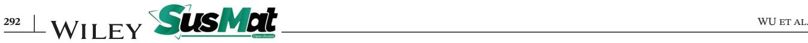

- 207. Vijayakumar V, Anothumakkool B, Kurungot S,Winter M, Nair JR. In situ polymerization process: an essential design tool for lithium polymer batteries. *Energy Environ Sci*. 2021;14(5):2708- 2788.
- 208. Liu Q, Zhou D, Shanmukaraj D, et al. Self-healing janus interfaces for high-performance LAGP-based lithium metal batteries. *ACS Energy Lett*. 2020;5(5):1456-1464.
- 209. Chen W, Xiong X, Zeng R, et al. Enhancing the interfacial ionic transport via in situ 3D composite polymer electrolytes for solidstate lithium batteries. *ACS Appl Energy Mater*. 2020;3(7):7200- 7207.
- 210. Xue W, Gao R, Shi Z, et al. Stabilizing electrode–electrolyte interfaces to realize high-voltage Li||LiCoO2 batteries by a sulfonamide-based electrolyte. *Energy Environ Sci*. 2021;14(11):6030-6040.
- 211. Huang K-C, Li H-H, Fan H-H, et al. An in situ-fabricated composite polymer electrolyte containing large-anion lithium salt for all-solid-state LiFePO4/Li batteries. *ChemElectroChem*. 2017;4(9):2293-2299.
- 212. Yang P, Gao X, Tian X, et al. Upgrading traditional organic electrolytes toward future lithium metal batteries: a hierarchical nano-SiO2-supported gel polymer electrolyte. *ACS Energy Lett*. 2020;5(5):1681-1688.
- 213. Ju J, Wang Y, Chen B, et al. Integrated interface strategy toward room temperature solid-state lithium batteries. *ACS Appl Mater Interfaces*. 2018;10(16):13588-13597.
- 214. Zhu P, Yan C, Zhu J, et al. Flexible electrolyte-cathode bilayer framework with stabilized interface for room-temperature all-solid-state lithium-sulfur batteries. *Energy Storage Mater*. 2019;17:220-225.
- 215. Tao X, Liu Y, Liu W, et al. Solid-state lithium–sulfur batteries operated at 37◦C with composites of nanostructured Li7La3Zr2O12/Carbon foam and polymer. *Nano Lett*. 2017;17(5):2967-2972.
- 216. Mauler L, Duffner F, Zeier WG, Leker J. Battery cost forecasting: a review of methods and results with an outlook to 2050. *Energy Environ Sci*. 2021;14(9):4712-4739.
- 217. Dixit MB, Park J-S, Kenesei P, Almer J, Hatzell KB. Status and prospect of in situ and operando characterization of solid-state batteries. *Energy Environ Sci*. 2021;14(9):4672-4711.

#### **AUTHOR BIOGRAPHY**

**Haijun Yu** is a professor at BJUT since 2015. He received his Ph.D. from Northeastern University in 2007 and then worked at the General Research Institute for Nonferrous Metals (GRINM) of China until 2010. He then worked at the National Institute of Advanced

Industrial Science and Technology (AIST), Japan, until 2015. His research interests include advanced battery materials and devices, such as lithium-ion batteries, solid-state batteries, and new secondary batteries. Website: [http://labmd.bjut.edu.cn/.](http://labmd.bjut.edu.cn/)

**How to cite this article:** Wu L, Wang Y, Guo X, Ding P, Lin Z, Yu H. Interface science in polymer-based composite solid electrolytes in lithium metal batteries. *SusMat*. 2022;2:264-292. <https://doi.org/10.1002/sus2.67>