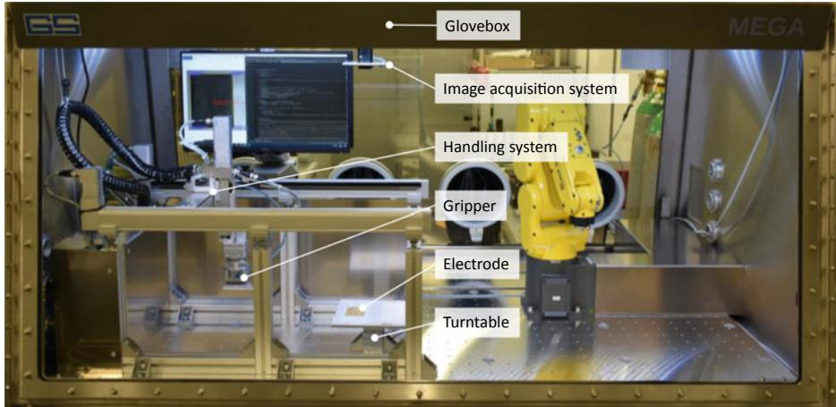
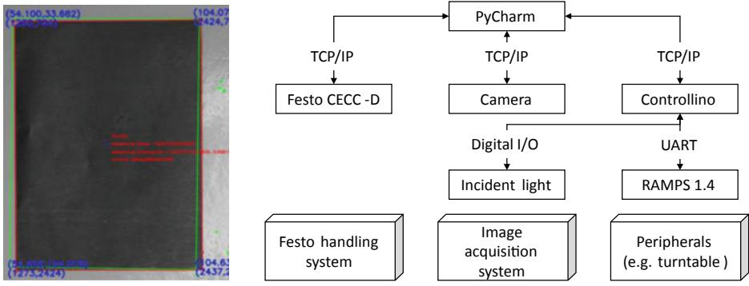
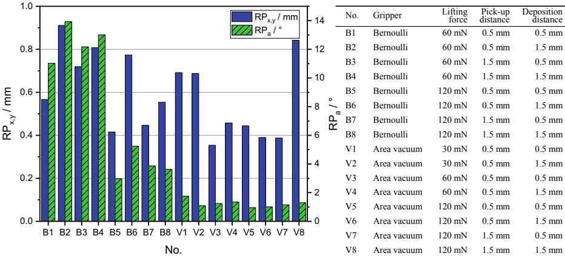

# Design of an Automated Assembly Station for Process Development of All-Solid-State Battery Cell Assembly

Arian Fröhlich, Steffen Masuch and Klaus Dröder

## Abstract

Today, lithium-ion batteries are a promising technology in the evolution of electro mobility, but still have potential for improvement in terms of performance, safety and cost. In order to exploit this potential, one promising approach is the replacement of liquid electrolyte with solid-state electrolyte and the use of lithium metal electrode as an anode instead of graphite based anodes. Solid-state electrolytes and the lithium metal anode have favorable electrochemical properties and therefore enable significantly increased energy densities with inherent safety. However, these materials are both, mechanically and chemically sensitive. Therefore, material-adapted processes are essential to ensure quality-assured manufacturing of all-solid-state lithium-ion battery cells. This paper presents the development of a scaled and flexible automated assembly station adapted to the challenging properties of the new all-solid-state battery materials. In the station various handling and gripping techniques are evaluated and qualified for assembly of all-solid-state battery cells. To qualify the techniques, image processing is

A. Fröhlich (&) S. Masuch K. Dröder

Institute of Machine Tools and Production Technology, Technische Universität Braunschweig, Langer Kamp 19b, 38106 Braunschweig, Germany e-mail: [a.froehlich@tu-braunschweig.de](mailto:a.froehlich@<HypSlash>tu-braunschweig</HypSlash>.de)

A. Fröhlich S. Masuch K. Dröder

Battery LabFactory Braunschweig, Technische Universität Braunschweig, Langer Kamp 8, 38106 Braunschweig, Germany

T. Schüppstuhl et al. (eds.), Annals of Scientific Society for Assembly, Handling and Industrial Robotics 2021, [https://doi.org/10.1007/978-3-030-74032-0\\_5](https://doi.org/10.1007/978-3-030-74032-0_5)

set up as a quality measurement technology. The paper also discusses the challenges of enclosing the entire assembly station in inert gas atmosphere to avoid side reactions and contamination of the chemically reactive materials.

## Keywords

All-Solid-State Battery Lithium-Ion Battery Battery Cell Assembly Lithium Metal Anode

## 1 Introduction

Lithium-ion battery cells are one of the key technologies to promote the global and sustainable energy revolution. However, their electrochemical performance, safety and cost-effectiveness over the entire life cycle need to be further improved [[1\]](#page-10-0). For this reason, research focuses on future battery generations with different materials and designs. These include all-solid-state battery cells, whose structure differs from conventional battery cells due to the utilization of e.g. pure lithium metal anode and a solid-state electrolyte. The use of a pure lithium metal anode increases the energy and power density at cell level and improves the fast charging capability, as there is no host structure with limited intercalation processes. By exchanging the liquid, reactive electrolyte with the solid-state electrolyte, the risk of leakage and thus the danger of exothermic side reactions is reduced [\[1](#page-10-0), [2](#page-10-0)].

However, the aforementioned positive properties of the new materials are in conflict with their high mechanical and chemical sensitivity, which has a significant negative effect on the production processes of cell manufacturing. The multitude of handling operations during battery cell manufacturing need to be adjusted to the new material properties with consideration of the acting loads, since they have a major impact on the quality of the battery cells. For this reason, a design of an automated assembly station for all-solid-state battery cell manufacturing is proposed, that considers the material and process specific requirements. The station performs the handling operations with the new materials, which are so far limited to laboratory scale, using industrially established production technology, so that the findings can be transferred directly to industrial production. Due to a flexible system design, various handling processes can be executed and the resulting interactions between process parameters such as low deposition accuracy of electrodes and electrolyte can be investigated. A low deposition accuracy has a strong negative impact on the performance of conventional battery cells and has therefore to be analyzed for the new battery generation as well [\[3](#page-10-0)].

## 2 Handling-Affecting Material Properties of Lithium Metal Anode and All-Solid-State Electrolyte

Lithium metal anodes are widely used in high-energy all-solid-state battery cells because of their advantageous electrochemical properties (e.g. pure lithium has a theoretical specific capacity of 3860 Ah/kg and the lowest standard potential of all metals). Because of these excellent electrochemical properties, an electrode thickness of 20 µm is sufficient for high-energy cells [\[4](#page-10-0), [5,](#page-10-0) [6\]](#page-10-0). However, the low density and thickness of the material result in very light and limp electrodes, which are sensitive to mechanical stress due to low mechanical strength (e.g. Young's modulus of lithium is 4.91 GPa). Even small loads can cause surface damage that easily leads to deformation and surface breakouts due to the strong adhesion tendency of lithium. Material damage is the source of loss of direct contact between the solid-state electrolyte and the lithium metal electrode, which results in high electrical resistances in battery cells operation [[7,](#page-10-0) [8\]](#page-10-0). In addition to the mechanical sensitivity, lithium has a strong reactivity with various elements of the ambient atmosphere, especially with water. The reaction products formed have poor ionic conductivity, which is why these reactions have to be avoided by means of dry room or inert gas atmosphere during the production processes [[5,](#page-10-0) [6](#page-10-0)].

As with lithium metal electrode, solid-state electrolytes offer great potential for improvement in battery cells while at the same time increasing the challenges in material processing. On the one hand, a group of materials based on organic polymers and on the other hand, groups of inorganic sulphidic or ceramic materials are high ionically conductive with low interfacial resistance [\[9](#page-10-0)]. A multitude of different materials and designs exist, which are examined in cells on laboratory scale with regard to electrochemical properties, but are rarely characterized with regard to processing relevant mechanical properties [\[7](#page-10-0), [8](#page-10-0), [9,](#page-10-0) [10](#page-10-0)]. For this reason, only a general tendency of the mechanical behavior can be derived from established base-materials. Polyethylene oxide is a widely used material in polymer-based electrolytes and has a Young's modulus of 330 MPa, which indicates low stiffness [\[10](#page-10-0), [12](#page-10-0)]. In contrast, ceramic or sulphidic electrolytes have a high stiffness (10–200 GPa) and tend to brittle behavior [[10,](#page-10-0) [11](#page-10-0)]. Regardless of the material group, the electrolytes react strongly with the elements of the ambient atmosphere, especially water, requiring a dry room or inert gas environment during cell manufacturing [[13\]](#page-10-0).

The brief review of the material properties shows the close link between high electrochemical performance with challenging mechanical and chemical properties of the new materials. Due to the strong dependence of electrochemical performance on the mechanical integrity of the electrodes and the electrolyte, damage-free handling is essential in the manufacturing processes of all-solid-state batteries.

## 3 Handling in Battery Cell Production

### 3.1 Battery Cell Assembly Process

In lithium-ion battery production, the assembly of the battery cells is subsequent to the electrode manufacturing process and is carried out in several interlinked process steps. Electrodes are handled in many of the process steps (e.g. drying, cutting, stacking), but the most crucial one is the stacking step. During stacking, the electrodes and the separator or solid-state-electrolyte are successively built up to a compound. For conventional intercalation electrodes, different methods of building the compound are established. Using the winding method, the webs are rotated together around a winding core and wound into round or prismatic electrode-separator composites. If the mechanical properties of the electrodes prevent winding, they are cut from the electrodes web and stacked between web-guided and folded separator by handling systems (z-folding method, stacking) [\[1](#page-10-0)]. In z-folding and stacking, the electrodes are withdrawn from a magazine and deposited on an adjustment table. Image processing is used to measure the position and orientation of the electrodes on the adjustment table. A second handling system then grasps the electrodes from the alignment table and uses a correction vector to deposit the electrode on the target position in the stack. The measurement and automatic correction of the position and orientation of the electrodes is essential, since smallest deviations of the surface overlap of the electrodes cause significant losses in the electrochemical performance [\[3](#page-10-0)].

Presumably, a stack of single electrodes will be used for lithium metal electrodes and solid-state electrolyte, since the mechanical properties of the solid-state electrolyte do not allow bending around tight winding radii. In addition, both the high and uniform compression required to ensure that the electrodes are in contact at cell level and the high volume changes during charge and discharge cycles are contrary to a wound cell design [[11\]](#page-10-0).

### 3.2 Handling Principles in Battery Cell Assembly

A handling system consists of connected modules, e.g. an automated movement system, a gripper, and peripherals. The following section discusses the gripping principles, since the gripper interacts with the electrodes in particular.

Generally, the electrodes are gripped with pneumatic grippers, which generate the gripping force via an airflow [[14\]](#page-10-0). The established pneumatic grippers can be categorized according to vacuum or overpressure actuation. A vacuum actuation principle with homogeneous distribution of the lifting force is given by the area vacuum gripper. Although the vacuum causes mechanical contact between the electrode and the gripper surface, the surface loads during mechanical contact are reduced by distributing the vacuum through numerous small openings. The mechanical contact nevertheless may result in material adhesion and surface damage to the electrodes, making precise and undamaged electrode removal difficult. These disadvantages are the reason for using overpressure-operated grippers for handling. The overpressure-actuated Bernoulli gripper generates a fast airflow in the gap between the gripper and the electrode, so that the pressure in the gap decreases. Consequently, the ambient pressure pushes the electrode towards the gripper. Since the lifting force generated is mainly dependent on the airflow in the gap, there is always a gap between the gripper and the electrode. In summary, the Bernoulli gripper offers quasi-contactless handling, but can thus only poorly compensate for relative lateral movements between the gripper and electrode.

The impact of the gripping process on the materials to be handled is not only dependent on the gripping principle. The set lifting force, the distance between the gripper and the gripping object for pick-up and deposition as well as the velocity and acceleration profile are further important handling parameters. In addition to these control variables, disturbance variables, which can only be influenced to a limited extent, have an effect on the process, e.g. the static charge resulting from the absence of humidity in inert gas atmosphere for discharging surfaces. Consequently, the evaluation of gripping principles for material-adapted handling has to consider all variables influencing the process, which is why a research set-up is required which allows the relevant parameters to be precisely adjusted.

## 4 Design of an Automated Assembly Station

Material-adapted handling processes are an important prerequisite for a quality-assured industrial production of all-solid-state batteries. The characteristics of the new materials are also challenging in the usually manual production of small-scaled laboratory cells, but these cells address material development rather than the development of cost-efficient industrial high-throughput processes. The design of the automated assembly station proposed in this paper therefore extends the target values of damage-free and reproducible handling in existing approaches to laboratory automation by the target values of flexibility and scalability as well as cost efficiency and throughput [\[15](#page-10-0)]. In the following sections, the single modules of the automated assembly station and their communication and interaction are described in detail.

The process development requires a constant and reproducible process environment, which minimizes the influence of environmental disturbances on material and process properties. The high reactivity of the electrodes and the electrolyte necessitates specific conditioning of the ambient process atmosphere to reduce the amount of potential reactants (e.g. water and oxygen). For this reason, the entire assembly process is set up in a gas-tight glove box whose internal atmosphere can be precisely adjusted (e.g. H2O < 0.1 ppm, O2 < 0.1 ppm) by filling with inert gas or defined gas mixtures. Pneumatics based on compressed air, which are established in industrial automation technology, may only be implemented if the inserted pneumatic components are sufficiently gas-tight and the consumed compressed air (e.g. return stroke of cylinders, venting of components) is not blown off into the glovebox but returned. An alternative operation with inert gas as pressurized medium reduces the requirements for components gas tightness and gas recirculation, but demands continuous active pressure regulation in the gas-tight glovebox due to the supplied or discharged gas volume. Generating the pressurized medium inside the glovebox is only reasonable for small-scaled actuators because of the very limited and cost-intensive installation space.

To avoid the above-mentioned disadvantages of pneumatics, an electrically operated handling system is installed in the assembly station. The handling system combines the Festo EXCM-30 planar surface gantry with Festo EGSC-32 lifting axis and Festo ERMO-12 rotary axis to form a cartesian kinematic with a degree of freedom of 4. The H-parallel kinematic drive concept of the planar surface gantry and the consistent application of compact stepper motors in all axes allow a high degree of space utilization while maintaining high dynamics (x–y velocity 0.5 m/s, x–y-z acceleration 10 m/s2 ) and repeatability (±0.05 mm). An operating voltage of 24 V meets the low dielectric strength and poor heat conduction of inert gases, which is challenging for electrical components. Figure 1 depicts the handling system integrated into the glovebox, supplemented by a gripper, a turntable with different surface materials for electrode supply and deposition, and an image acquisition system.

For the detection and measurement of the position and orientation of the electrodes in the handling process an image processing system is developed. By means of the image processing, the position and orientation of the electrodes to be grasped can be communicated to the handling system and thus a corrected grasping is achieved. In addition, the precision of deposition (absolute accuracy and repeatability) is assessed after the handling process. For image acquisition, a 20 MP industrial camera and a ring light as incident

Fig. 1 Automated assembly station in glovebox, with the front glass open

light, enhanced by a linear polarizing filter to reduce reflections of the metallic surfaces of lithium electrodes, are mounted above the turntable. This setup is chosen so that overlapping electrodes can be detected during the stacking process. The image is imported into a program developed in PyCharm and processed by successive algorithms of the OpenCV library. The image processing is based on a monochrome image of the electrode, which is distortion-free by calibration. The processing begins with a Gaussian filter, which reduces noise and smoothes edges. Then, using the Canny algorithm based on the Sobel operator, the edges in the image are extracted and contours resulting from linked edges are fitted using polygon approximation. The approximated contours are used afterwards to define a reference in the first handling step and the comparing contour in subsequent handling steps. For each defined contour, the centralized and normalized image moments are calculated to provide a scaling invariant comparison of contours, even if they are different in position and orientation in the image area. By subtracting the image moments and an approximation of ellipse main axes to the contours, both position and orientation deviations between the captured electrodes can be determined. Figure 2 shows the measurement of position and orientation deviations of an electrode from the electrode reference contour.

In the PyCharm program, in addition to the image processing, the master control of all components involved in the automated assembly station is implemented (see Fig. 2). All subordinate control components are industrially established technologies (e.g. programmable logic controller Festo CECC-D) or are based on open platforms close to industrial applications (e.g. programmable logic controller Controllino Mega) and apply standardized protocols for communication (TCP, serial interface USB and UART). Summarizing all the modules, the automated assembly station is similar to the production technology of industrial stacking processes and at the same time flexibly adaptable and expandable.

Fig. 2 Result of the image processing for measurement of position and orientation deviation of a lithium metal electrode (red contour) from the electrode reference contour (green contour) (left), block diagram of linked modules and communication protocols (right)

## 5 Experimental Evaluation of Handling Processes in the Automated Assembly Station

In order to evaluate different process set-ups and to develop a material-adapted handling process, lithium electrodes composed of a 20 µm lithium layer on a 10 µm copper substrate with overall dimensions of 50 70 mm2 are used. The electrodes are supplied on one half of the turntable on a polypropylene substrate since polypropylene is established in processing as a separating layer between lithium surfaces. As a surface for deposition, a polymer-based electrolyte made of polyethylene oxide is attached to the other half of the turntable. By rotating the turntable, the corresponding surface can be provided for pick-up and deposition. As variation parameters, different grippers are mounted to the handling system and the set lifting force as well as the distance between gripper and electrode during pick-up and deposition are varied. The variation steps of the lifting force are based on the weight of the electrode and start with the minimum force for lifting the electrode that was identified in preliminary tests. The variation steps of all other parameters are similar to the industrial stacking of conventional electrodes. Table 1 gives an overview of the variation parameter settings.

The target value of the experimental evaluation is the repeatability of the position and orientation of the deposited electrode. This repeatability is measured according to the ISO 9283, which contains performance criteria and related test methods of manipulating industrial robots. Following this standard, a motion sequence close to the real stacking process is performed and repeated 30 times for each variation. The motion sequence consists of pick-up, vertical and horizontal movement with simultaneous rotation, and deposition. All movements are executed with the maximum acceleration and velocity of the handling system (see Sect. 4). Prior to the motion sequence, the image processing assesses the supplied electrodes position in x, y and orientation a around the z-axis of the image coordinate system. These values are recorded as reference contour and serve as comparison to the position and orientation of the electrode captured after the handling process (see Fig. [2\)](#page-6-0). By comparing the values of x, y, and a measured prior to and after handling, the repeatability is calculated with the following formulas of ISO 9283 [[16\]](#page-10-0).

$$
l_j = \sqrt[2]{(x_{j,\text{prior}} - x_{j,\text{after}})^2 + (y_{j,\text{prior}} - y_{j,\text{after}})^2}
$$
\n(1)

| Gripper     | Lifting force (mN) | Pick-up distance (mm) | Deposition distance (mm) |
|-------------|--------------------|-----------------------|--------------------------|
| Bernoulli   | 30                 | 0.5                   | 0.5                      |
| Area vacuum | 60                 | 1.5                   | 1.5                      |
|             | 120                |                       |                          |

Table 1 Variation steps of the parameters

$$
\tilde{l} = \frac{1}{30} \sum_{j=1}^{30} l_j \tag{2}
$$

$$
S_1 = \sqrt[2]{\frac{\sum_{j=1}^{30} (l_j - \tilde{l})^2}{29}}
$$
 (3)

$$
RP_{x,y} = \tilde{l} + 3S_1 \tag{4}
$$

$$
RP_a = \pm 3 \sqrt[2]{\frac{\sum_{j=1}^{30} (a_{j,\text{prior}} - a_{j,\text{after}})^2}{29}} \tag{5}
$$

The repeatability achievable in the process comprises the linked repeatabilities of the handling system, the camera, and the gripper. Therefore, the combined repeatability of the handling system and the camera is initially measured by moving and measuring a reference contour inflexibly attached to the end effector, with a mass corresponding to that of the grippers to be evaluated, 30 times with the specified motion sequence. The resulting values RPx,y = 0.088 mm and RPa = 0.5° only indicate the repeatability of the combined systems for this motion sequence and process load, since, different to ISO 9283, no multiple points and trajectories are measured in the workspace. The repeatabilities shown in Fig. 3 are consequently composed of the sum of the repeatability of the handling system, the camera and the gripper. However, it is obvious that the combined repeatability of the handling system and the camera is considerably smaller than the repeatability of the grippers.

Fig. 3 Repeatability of the handling processes with varied process parameters

The Bernoulli gripper is unable to grip the electrode from the turntable at a set gripping force of 30 mN even at a small pick-up distance. This is because the gripper does not cover the electrode completely and therefore the non-fixed, limply down hanging electrodes areas generate a lateral force, which the gripper cannot compensate. With increased lifting force a permanent fixation of the electrode is achieved, which repeatability is dependent on the distance during pick-up and deposition. During the free flight phase when lifting from the turntable towards the gripper, the electrode is strongly influenced by the airflow of the Bernoulli gripper, which leads to high position and orientation deviations with increasing pick-up distance and respectively longer free flight phase. These deviations are further increased during deposition by the static charge of the electrode, which results from the continuous friction of the flowing air on the surface of the electrode, since the resulting force of the static charge lead to an inhomogeneous attraction and consequently displacement of the electrode during deposition.

In contrast, the area vacuum gripper has significantly better orientation repeatability for all variations. In addition, increased lifting force results in a position repeatability superior to that of the Bernoulli gripper. The repeatability achieved is nearly independent of the pick-up and deposition distances, because the electrode in contact with the gripper closes the vacuum openings during gripping and thus neither electrostatically charging airflow nor lateral displacement occurs. However, according to Leithoff et al. [[3\]](#page-10-0) already minor inaccuracies have a strong negative effect on the electrochemical cell performance, which is why the achieved repeatability of the position in particular is insufficient for quality-assured stack assembly. The results identify the gripper and the set gripping parameters as decisive influence on the repeatability. Consequently, the handling of lithium metal electrodes and solid-state electrolytes requires gripping principles that are adapted to the material properties (e.g. light, limp, mechanically sensitive) and the ambient conditions (inert gas atmosphere, static charge).

## 6 Conclusion

The battery materials of the future, such as lithium metal electrodes and solid-state electrolytes, have, in contrast to favored electrochemical properties, a high mechanical and chemical sensitivity. For this reason, the production processes in cell manufacturing require new technical solutions. Based on industrially established process technology, a scaled and flexible automated assembly station was designed for the development and evaluation of material-adapted processes. This station consists of a handling system, image acquisition system and peripherals, all enclosed in a glovebox. By means of this interconnected equipment, handling processes with lithium metal electrodes were carried out varying the process parameters and evaluated based on the achievable repeatability. The experiment results indicate that the gripping principle applied is the major influence on the repeatability and that the established grippers do not achieve a sufficient repeatability with any parameter set tested. Consequently, further development of the gripping principles and a precise determination of suitable process parameters are necessary.

Acknowledgements The authors thank the German Federal Ministry of Education and Research for supporting the project ProLiMA (03XP0182F). The authors are grateful to Festo SE & Co. KG for supplying and supporting the operation of the handling system within the project ProLiMA.

#### References

- 1. Bockwinkel, K., Nowak, C., Thiede, B., Nöske, M., Dietrich, F., Thiede, S., Haselrieder, W., Dröder, K., Kwade, A., Herrmann, C.: Enhanced Processing and Testing Concepts for New Active Materials for Lithium-Ion Batteries. Energy Technol. 8(2), 1900133 (2019)
- 2. Dirican, M., Yan, C., Zhu, P., Zhang, X.: Composite solid electrolytes for all-solid-state lithium batteries. Mater. Sci. Eng.: R: Rep. 136, 27–46 (2019)
- 3. Fleischer, J., Ruprecht, E., Baumeister, M., Haag, S.: Automated Handling of Limp Foils in Lithium-Ion-Cell Manufacturing. In: Dornfeld, D.A., Linke, B.S. (eds.) Leveraging Technology for a Sustainable World, pp. 353–356. Springer, Berlin Heidelberg, Berlin, Heidelberg (2012)
- 4. Hao, F., Han, F., Liang, Y., Wang, C., Yao, Y.: Architectural design and fabrication approaches for solid-state batteries. MRS Bull. 43(10), 775–781 (2018)
- 5. ISO 9283:1998: Manipulating industrial robots—Performance criteria and related test methods (1998)
- 6. Janek, J., Zeier, W.G.: A solid future for battery development. Nat. Energy 1(9), 1167 (2016)
- 7. Jee, A.-Y., Lee, H., Lee, Y., Lee, M.: Determination of the elastic modulus of poly(ethylene oxide) using a photoisomerizing dye. Chem. Phys. 422, 246–250 (2013)
- 8. Kwade, A., Haselrieder, W., Leithoff, R., Modlinger, A., Dietrich, F., Droeder, K.: Current status and challenges for automotive battery production technologies. Nat. Energy 3(4), 290– 300 (2018)
- 9. Leithoff, R., Fröhlich, A., Dröder, K.: Investigation of the influence of deposition accuracy of electrodes on the electrochemical properties of lithium‐ion batteries. Energy Technol. 1900129 (2019)
- 10. Lin, D., Liu, Y., Cui, Y.: Reviving the lithium metal anode for high-energy batteries. Nat. Nanotechnol. 12(3), 194–206 (2017)
- 11. Mauger, A., Armand, M., Julien, C.M., Zaghib, K.: Challenges and issues facing lithium metal for solid-state rechargeable batteries. J. Power Sour. 353, 333–342 (2017)
- 12. Ma, J., Chen, B., Wang, L., Cui, G.: Progress and prospect on failure mechanisms of solid-state lithium batteries. J. Power Sour. 392, 94–115 (2018)
- 13. Schnell, J., Günther, T., Knoche, T., Vieider, C., Köhler, L., Just, A., Keller, M., Passerini, S., Reinhart, G.: All-solid-state lithium-ion and lithium metal batteries – paving the way to large-scale production. J. Power Sour. 382, 160–175 (2018)
- 14. Sun, C., Liu, J., Gong, Y., Wilkinson, D.P., Zhang, J.: Recent advances in all-solid-state rechargeable lithium batteries. Nano Energy 33, 363–386 (2017)
- 15. Takada, K.: Progress in solid electrolytes toward realizing solid-state lithium batteries. J. Power Sour. 394, 74–85 (2018)
- 16. Zheng, F., Kotobuki, M., Song, S., Lai, M.O., Lu, L.: Review on solid electrolytes for all-solid-state lithium-ion batteries. J. Power Sour. 389, 198–213 (2018)

Open Access This chapter is licensed under the terms of the Creative Commons Attribution 4.0 International License ([http://creativecommons.org/licenses/by/4.0/\)](http://creativecommons.org/licenses/by/4.0/), which permits use, sharing, adaptation, distribution and reproduction in any medium or format, as long as you give appropriate credit to the original author(s) and the source, provide a link to the Creative Commons license and indicate if changes were made.

The images or other third party material in this chapter are included in the chapter's Creative Commons license, unless indicated otherwise in a credit line to the material. If material is not included in the chapter's Creative Commons license and your intended use is not permitted by statutory regulation or exceeds the permitted use, you will need to obtain permission directly from the copyright holder.

