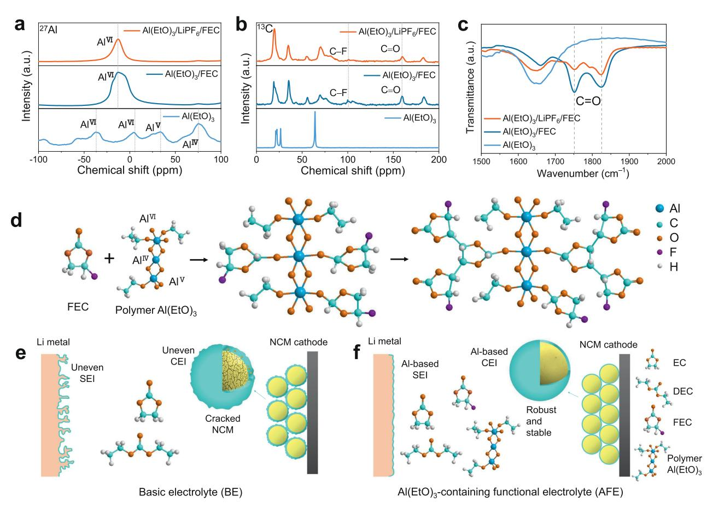
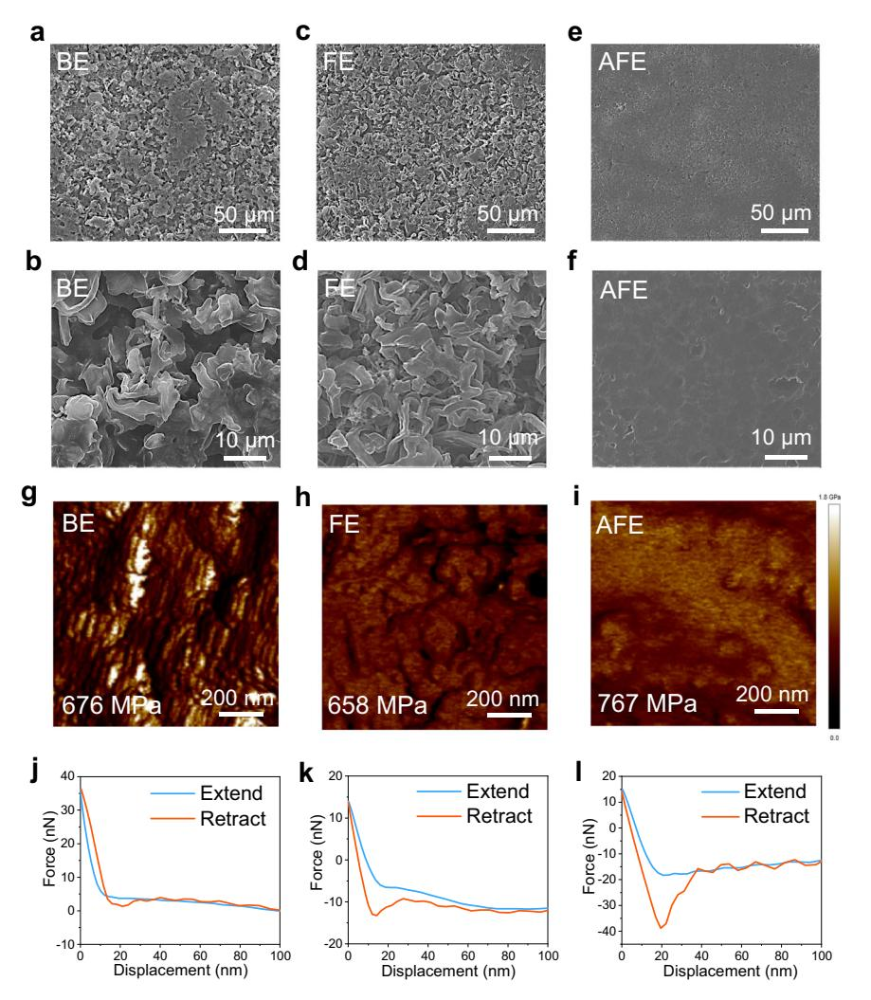
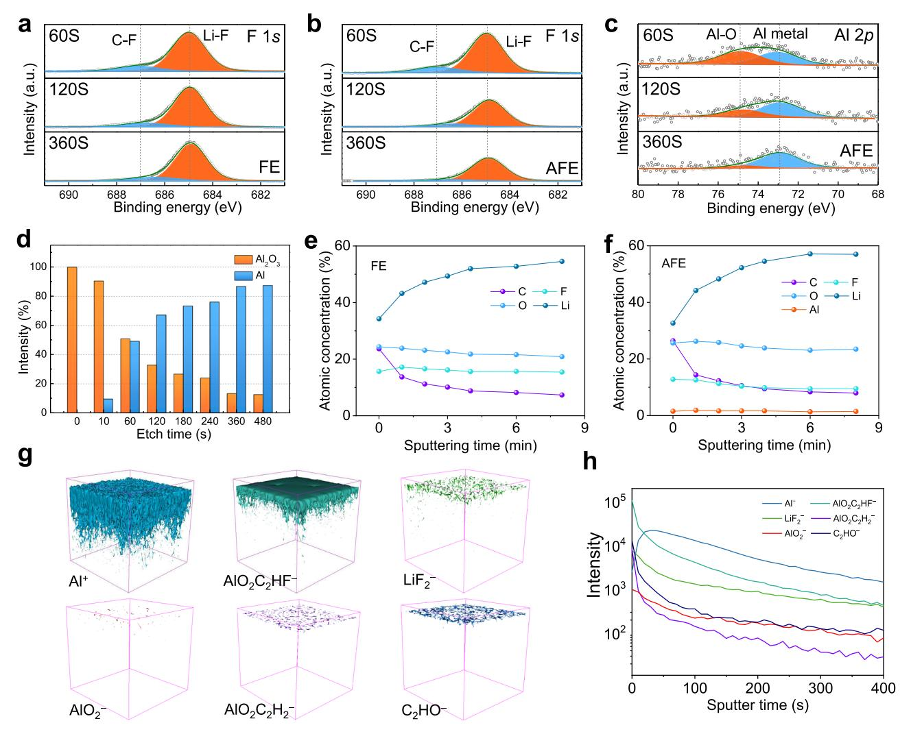
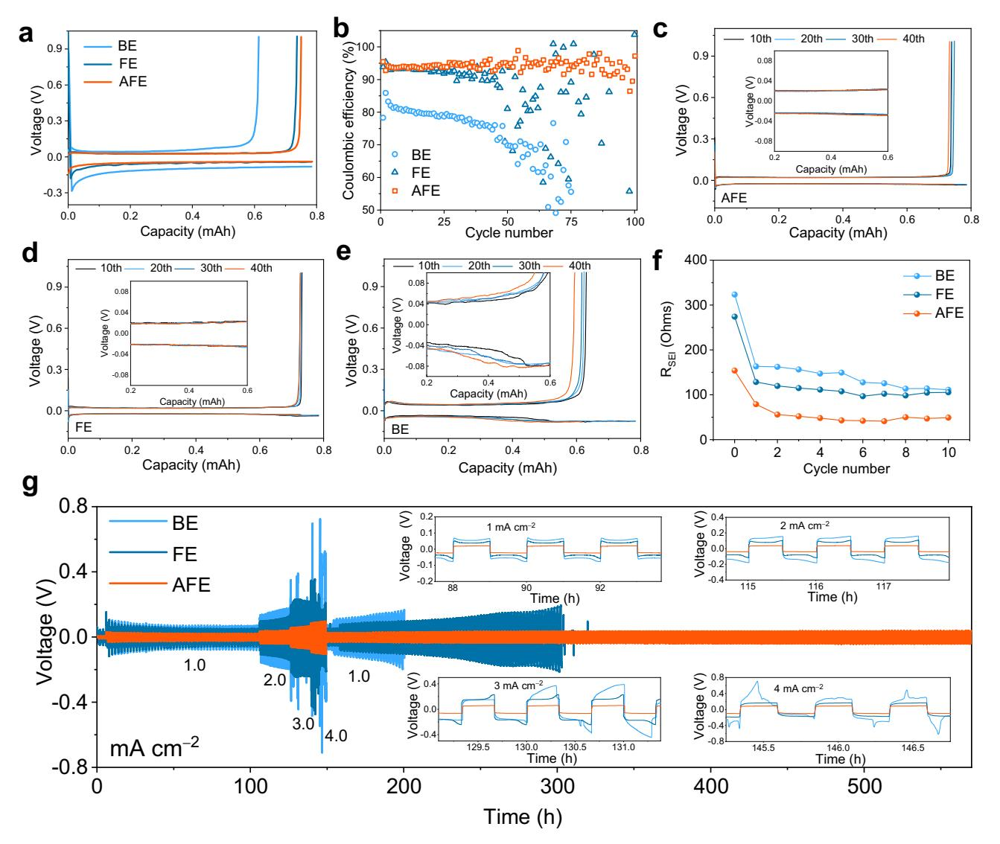
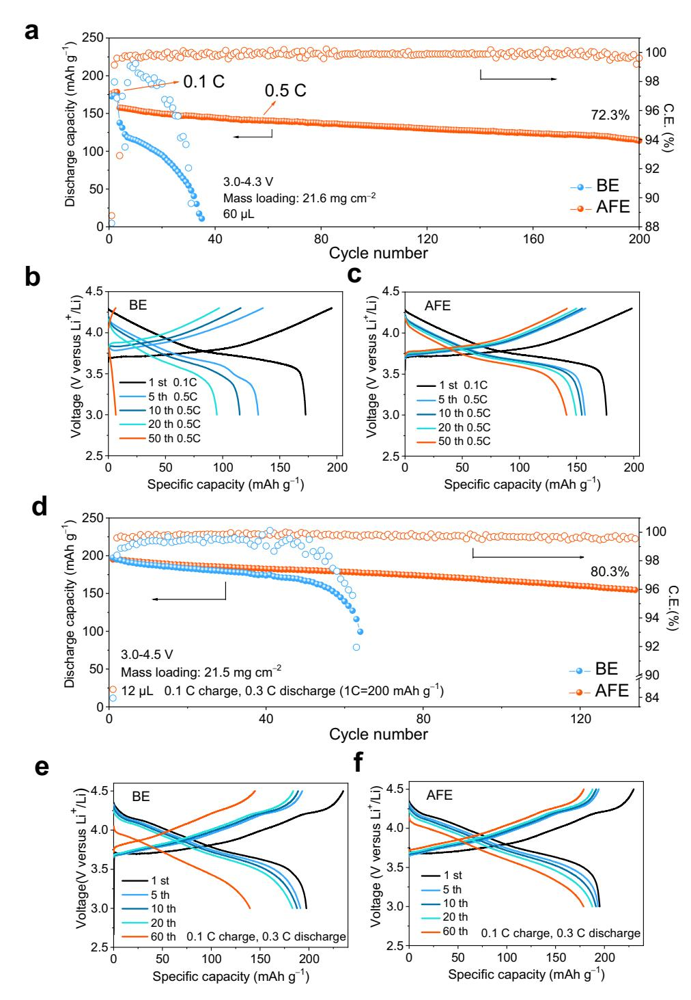
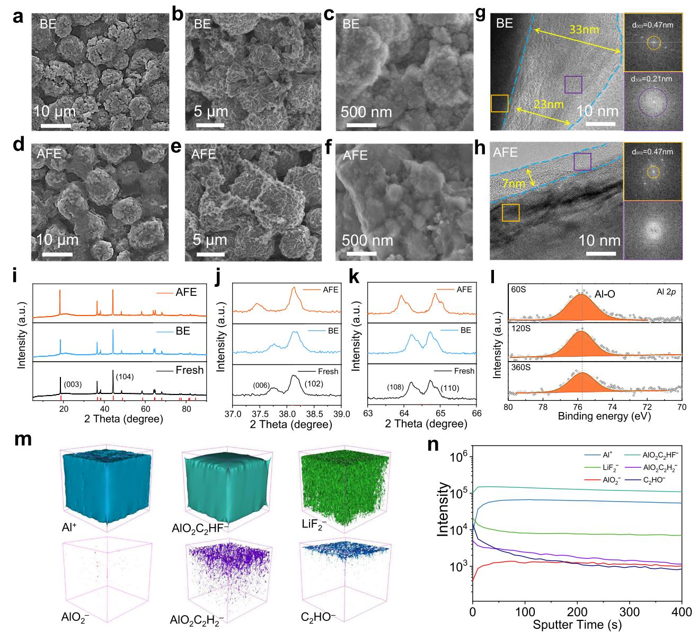
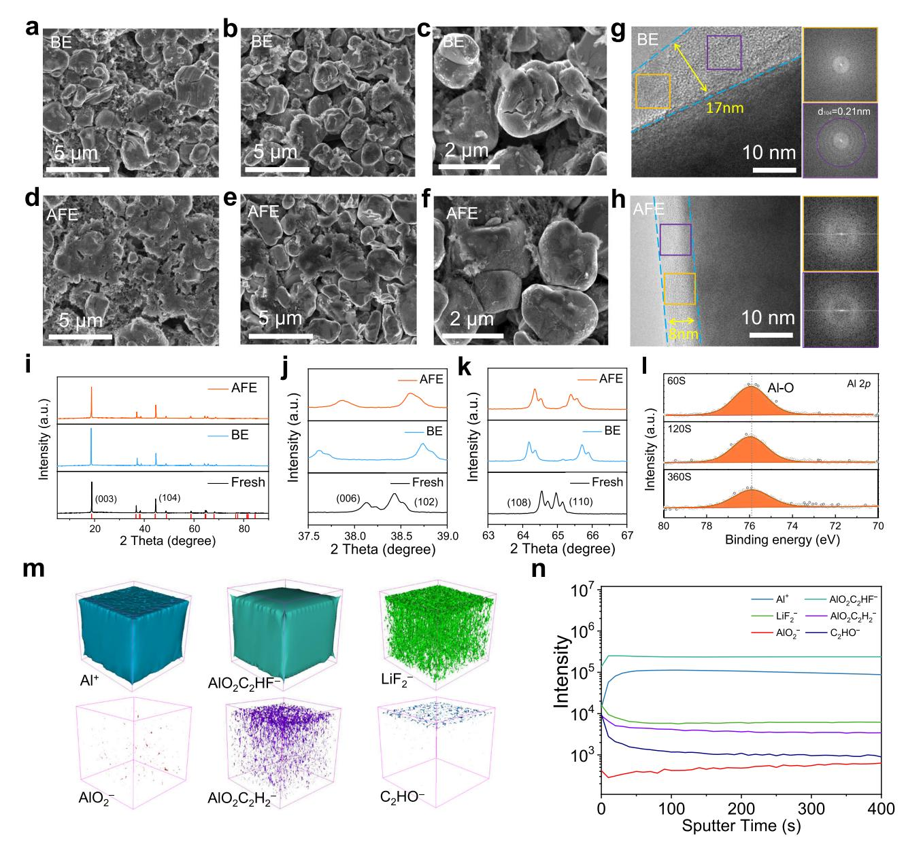

# ARTICLE

https://doi.org/10.1038/s41467-022-28959-5 **OPEN**

# A dual-function liquid electrolyte additive for high-energy non-aqueous lithium metal batteries

Yuji Zhang1 , Yuan Wu1 , Huiyi Li1 , Jinghao Chen1 , Danni Le[i](http://orcid.org/0000-0003-4100-9610) 1✉ & Chengxin Wan[g](http://orcid.org/0000-0001-8355-6431) 1✉

Engineering the formulation of non-aqueous liquid electrolytes is a viable strategy to produce high-energy lithium metal batteries. However, when the lithium metal anode is combined with a Ni-rich layered cathode, the (electro)chemical stability of both electrodes could be compromised. To circumvent this issue, we report a combination of aluminum ethoxide (0.4 wt.%) and fluoroethylene carbonate (5 vol.%) as additives in a conventional LiPF6-containing carbonate-based electrolyte solution. This electrolyte formulation enables the formation of mechanically robust and ionically conductive interphases on both electrodes' surfaces. In particular, the alumina formed at the interphases prevents the formation of dendritic structures on the lithium metal anode and mitigate the stress-induced cracking and phase transformation in the Ni-rich layered cathode. By coupling a thin (i.e., about 40 μm) lithium metal anode with a high-loading (i.e., 21.5 mg cm−2) LiNi0.8Co0.1Mn0.1O2-based cathode in coin cell configuration and lean electrolyte conditions, the engineered electrolyte allows a specific discharge capacity retention of 80.3% after 130 cycles at 60 mA g−1 and 30 °C which results in calculated specific cell energy of about 350 Wh kg−1 .

1 State Key Laboratory of Optoelectronic Materials and Technologies, School of Materials Science and Engineering, Sun Yat-sen (Zhongshan) University, Guangzhou 510275, China. ✉email: [leidanni@mail.sysu.edu.cn](mailto:leidanni@mail.sysu.edu.cn); [wchengx@mail.sysu.edu.cn](mailto:wchengx@mail.sysu.edu.cn)

ithium-ion batteries (LIBs) with lithium-intercalated graphite anodes have been widely used since their commercialization in the  $1990s^{1,2}$ . However, with their lower specific capacity (372 mAh  $g^{-1}$ ), graphite anodes can hardly meet the practical needs of highly demanding modern devices such as electric vehicles $^{3,4}$ . The lithium metal anode (LMA) is considered the most promising since it has a theoretical specific capacity of 3862 mAh  $g^{-1}$  and the lowest reduction potential (-3.040 V versus the standard hydrogen electrode  $(SHE)^{5-7}$ . Replacing graphite anodes in LIBs with LMA and combining them with high-capacity cathodes, such as Ni-rich layered cathode would significantly boost their energy density. High specific content lithium metal batteries (LMBs) of over 300 Wh kg $-1$  require an integrated Li anode with a thickness of less than 50 µm, a limited amount of electrolyte (electrolyte weight to cathode capacity ratio  $(E/C)$  < 4) and a high areal-capacity cathode (> 4 mAh cm-2)8,9. However, in practise, the performance of LMBs is often unsatisfactory due to the high reactivity of conventional carbonatebased electrolytes with both Ni-rich cathodes LiNi0.8Co0.1Mn0.1O2 (NCM) and LMA10,11. Side reactions between LMA and carbonate-based electrolytes result in an unsatisfactory Coulombic efficiency (CE) and the growth of unfavourable Li deposition morphologies (e.g., dendrites), which significantly decrease battery performance and cause potential safety issues12. In addition, Nirich NCM cathodes are impacted by phase transformation, stresscorrosion cracking and transition metal dissolution during long cycling13. Therefore, the design of improved nonaqueous liquid electrolyte solutions to construct a consistent and robust solid electrolyte interphase (SEI) at the anode and a cathode-electrolyte interphase (CEI) at the cathode is critical to the practical utilization of high specific energy LMBs $^{14,15}$ .

Recently, significant efforts have been made to optimize electrolytes for better compatibility with both Ni-rich NCM cathodes and LMAs16–18. Highly or locally concentrated electrolytes facilitate the formation of a salt-derived SEI or CEI, potentially improving the cycling stability of Li  $|\text{NCM}$  batteries19–21. However, certain electrolyte challenges remain to be addressed before commercialization, such as their high viscosity, insufficient separator wettability, low ionic conductivity and high cost. All-fluorinated electrolytes22 and fluorinated ether-based electrolytes23, such as those containing LiF, have been demonstrated to form compounds with a preferable SEI or CEI, but evaluation under practical conditions (specific energy  $> 300$  Wh kg-1) is warranted. Sulfonamide-based electrolytes24 and phosphate-based electrolytes25 can stabilize the cycling of highvoltage LMBs, but the use of high-cost lithium bis(fluorosulfonyl) imide (LiFSI) to lower the reactivity of electrolytes with LMAs cannot be avoided26,27. The dual-additive strategy (utilizes the synergistic effect of two different additives) has been proven to improve the performance of Li | NCM cells by regulating the CEI and SEI structures8,11, but Li-containing additives are also expensive28. Outside of electrolyte engineering, the application of an Al2O3 surface coating on a high-voltage cathode and Li metal anode is a common approach to improve the stability between active materials and electrolytes. On the cathode,  $Al_2O_3$  coatings can typically scavenge HF, limit transition metal dissolution and regulate the composition of the CEI29. On the anode,  $Al_2O_3$  thin films prevent side reactions with electrolytes and induce homogeneous Li nucleation30. Commonly, atomic layer deposition31,32, radiofrequency magnetron sputtering33 and wet chemistry34,35 are used to coat an Al2O3 protective film on electrodes. However, these methods require a high temperature; additionally, the process may be rather complex and expensive. Moreover, some of these methods cannot guarantee the uniformity of the coating36. Therefore, a low cost and effective method is needed to realize practical LMBs with a high specific energy.

Herein, we design a nonaqueous electrolyte solution by adding 0.4 wt.% aluminum ethoxide  $(Al(EtO)3)$  nanowires into a

conventional LiPF6-containing carbonate-based electrolyte solution. Al(EtO)3 is prepared by a selective dealloying method37. With the synergistic effect of Al(EtO)3 and fluoroethylene carbonate (FEC),  $Al_2O_3$ -containing interphases that provide robust and high ionic conductivity protection are formed, which is beneficial to both Li metal anodes and Ni-rich NCM cathodes. Indeed, when the  $Al(EtO)$ 3-containing electrolyte solution is tested in Li |  $\text{LiNi}_{0.6}\text{Co}_{0.2}\text{Mn}_{0.2}\text{O}_2$  (NCM622) coin cell configuration, improved cycling stability and rate performance can be noticed. Also, by pairing the thin Li anode ( $\sim$ 40 µm) with the commercial cathode  $\text{LiNi}_{0.8}\text{Co}_{0.1}\text{Mn}_{0.1}\text{O}_2$  (NCM811)  $(21.5 \text{ mg cm}^{-2})$ , we demonstrate a specific energy of approximately 350 Wh kg $-1$  at the full cell level.

#### **Results**

Physicochemical characterization of the electrolyte solutions. The color of the  $Al(EtO)$ 3-containing electrolyte (AFE, 0.4 wt.%  $Al(EtO)$ 3 and 5 vol.% FEC in 1 M LiPF6/ethylene carbonate (EC) and diethyl carbonate (DEC) (1:1 by volume)) in a polyolefin bottle that was placed in an Ar-filled glove box for five days at 30  $\textdegree$ C and 60  $\textdegree$ C turns from transparent to brown and produces an acidic gas (Supplementary Figs. 1 and 2), suggesting that side reactions were occurring. All the cells were tested with freshly prepared electrolyte. To explore the reaction mechanism of  $Al(EtO)_3$  and FEC, we prepared  $Al(EtO)_3/LiPF_6/FEC$  (3.2 wt.%  $Al(EtO)_3 + 1.0 M$  LiPF6 in FEC) and  $Al(EtO)_3/FEC$  (3.2 wt.%  $Al(EtO)$ 3 in FEC) solutions in a polyolefin bottle and placed them in an Ar-filled glove box for five days at 60 °C. Then, we took the precipitate and supernatant for further characterization. The 27Al magic angle spinning solid-state nuclear magnetic resonance (NMR) spectra of  $Al(EtO)$ 3 show several resonance peaks centered at approximately 75, 33, 4 and  $-36$  ppm. Among them, the peaks at 75 and 33 ppm correspond to 4- (AlIV) and 5-coordinated aluminum (AlV), respectively, while the peaks at 4 and -36 ppm correspond to 6-coordinated aluminum  $(\text{Al}^{\text{VI}})^{38,39}$ . These results indicate the formation of  $Al(EtO)$ 3 polymer networks. The 27Al MAS solid-state NMR spectra of the Al(EtO)3/  $\text{LiPF}_6/\text{FEC}$  and Al(EtO)3/FEC precipitates show a resonance peak centered at -12 ppm, which may correspond to 6-coordinated aluminum (AlVI) (Fig. 1a). Compared with the Al(EtO)3/FEC precipitate, the  $Al(EtO)_3/LiPF_6/FEC$  precipitate shows weaker peaks for C–F bonds (100 ppm) and C=O (159 ppm)40 in the  $^{13}$ C spectrum, indicating that the LiPF6 may catalyse the reaction of  $Al(EtO)$ 3 and FEC (Fig. 1b). As shown in the solid Fourier transform infrared (FTIR) spectra, the C=O peaks (1751 cm $-1$ ) and 1825 cm-1) of the precipitate of the Al(EtO)3/LiPF6/FEC solution are weaker than those of the  $Al(EtO)3/FEC$  solution (Fig. 1c). This further confirms the catalytic properties of LiPF6. Although the color of the  $Al(EtO)_3/LiPF_6/FEC$  solution changes significantly in the supernatant after five days of storage, the  $C-F$ and  $C=O$  signals show no marked changes in the NMR and FTIR spectra (Supplementary Fig. 3). This may be because most of the reaction products settle at the bottom and their concentrations are low in the supernatant. The possible reaction mechanism of  $Al(EtO)$ 3 and FEC is proposed in Fig. 1d. The C=O bond of FEC is broken, and oxygen atoms are directly connected to the Al atom of  $Al(EtO)$ 3, followed by polymerization of FEC and the loss of HF. With the lowest heat absorption and the highest decomposition temperature, the reaction products of  $Al(EtO)$ 3 and FEC catalyzed by LiPF6 have good thermal stability (Supplementary Figure 4). We speculate that the reaction products with a threedimensional structure and high thermal stability would contribute to the formation of uniform and robust solid-electrolyte interphases at the anode and cathode. Based on the findings discussed above, we schematically illustrate in Figs. 1e, 1f the

Fig. 1 Physicochemical characterizations of the electrolyte solutions and additives. 27Al (a) and 13C (b) Solid-state NMR and c Solid FTIR spectra of pure Al(EtO)3 and the precipitates obtained from two different solutions. **d** Proposed Al(EtO)3/FEC reaction mechanism. Schematic illustration of the protection mechanism of the SEI and CEI formed in BE (e) and AFE (f).

possible SEI and CEI morphologies obtained employing the conventional electrolyte and  $Al(EtO)$ 3-containing functional electrolyte (AFE) in  $\text{Li}$  | NCM cells.

Morphological and mechanical characterizations of lithium depositions on Cu substrates. To better understand the Li deposition behavior in different electrolytes, we assembled Li Cu coin cells and used scanning electron microscopy (SEM) for observation. All Li | Cu coin cells were operated at a fixed current density of 0.5 mA  $\text{cm}^{-2}$  with a specific areal capacity limitation of 3 mAh cm-2 before cell disassembly and postmortem SEM electrode measurements. For the cells with a basic electrolyte (BE,  $1 \text{ M}$  LiPF6 in EC/DEC (1:1 by volume)), the top views of the electroplated Li metal on the surface of the Cu electrode exhibit a typical dendritic morphology (Fig. 2a and b). The dendritic Li metal increases the reaction area with the electrolyte; thus, the electrolyte is quickly consumed, "dead Li" (i.e., lithium particles that are electronically disconnected from the current collector) is formed, and the cell exhibits a short cycle life. Uneven and loose Li dendrites are observed even when 5% FEC is added to the BE (FEC-containing electrolyte (FE)) (Fig. 2c and d). In sharp contrast, uniform and dense Li deposits without dendrite are obtained with the use of AFE (Fig. 2e and f).

During lithiation/delithiation, SEI deformation is inevitable. Therefore, toughness and adhesion are essential to ensure the integrity of the SEI film and inhibit Li dendrite formation41,42. Through atomic force microscopy (AFM) evaluation, the Young's modulus of the SEI formed in the AFE is 767 MPa, which is

higher than that in the BE (676 MPa) and FE (658 MPa) (Fig. 2gi), indicating a tougher SEI film that effectively inhibits the formation of Li dendrites. In the force-displacement curves, the SEI interphase formed in the AFE has the highest adhesion force among the three groups, which effectively enhances the interfacial stability and promotes the rapid transport and uniform deposition of  $Li^+$  (Fig. 2j-l).

Physicochemical characterization of the lithium metal anode. The synergistic effect of dual additives (Al(EtO)3/FEC) on the chemical composition of the SEI film on a cycled Li anode (at a current density of 1 mA cm $-2$  and an areal capacity of 1 mAh cm $-2$  for 10 cycles; the voltage of the cell was 0 V before disassembly) was studied by using in-depth X-ray photoelectron spectroscopy (XPS) (Fig. 3af). The high-resolution F 1 s XPS spectra of the SEI film using FE and AFE had peaks at 684.9 eV and 687.0 eV43, respectively, and these peaks are assigned to LiF and C-F species as the main reduction products of FEC (Fig. 3a and b). With increasing Ar+ etching time, the content of LiF drops in the AFE, whereas it remains unchanged in the FE. The proportion of F in the AFE is lower than that in the FE. This confirms that the reaction of  $Al(EtO)3$  and FEC releases HF. The high-resolution Al 2  $p$  XPS spectra of the SEI in the AFE show the presence of Al (72.9 eV)44, which confirms that the reaction product of  $Al(EtO)$ 3 and FEC can be reduced to Al metal. In addition, Al-O species are detected based on the peak at 74.9 eV (Fig. 3c, Supplementary Fig. 5). To verify the presence of  $Al_2O_3$ and exclude the influence of  $Ar^+$  on  $Al_2O_3$ , we conducted indepth XPS on pure  $Al_2O_3$  powder under the same conditions.

Fig. 2 Micromorphology and SEI properties of Li metal deposited onto a Cu substrate. SEM images (a-f), Young's modulus maps (g-i) and forcedisplacement curves (j-l) of the deposited lithium metal using the BE (a, b, g and j), FE (c, d, h and k) and AFE (e, f, i and l) at current densities of 0.5 mA cm-2 and 3 mAh cm-2. "Extend" and "retract" means the direction of motion of the cantilever with respect to the sample.

With increasing  $Ar^+$  etching time, the peak at 74.9 eV corresponding to  $Al_2O_3^{45}$  slightly shifts to a higher binding energy, which confirms that  $Al_2O_3$  is not be reduced to Al metal by Ar+ (Supplementary Fig. 6). With increasing  $Ar^+$  etching time, the amount of Al-O species decreases while that of Al metal increases, which means that the inner SEI layer contains more Al metal (Fig. 3d). The Al/ Al2O3 composite structure can effectively reduce the consumption of Li+ during SEI film formation46. The total atomic content of Al remains at 1.5% of all elements and does not change with the etching depth as shown in Fig. 3e, f; this result indicates the uniform distribution of aluminum in the SEI film. A Li metal signal  $(52.4 \text{ eV})^{47}$ is detected in the AFE, as shown in the Li 1 s spectra (Supplementary Fig. 7a and b), indicating the high density of the SEI and the intimate contact between the SEI and Li metal anode. The C  $1$  s spectra in the two electrolytes are basically the same (Supplementary Fig. 7c and d). Time-of-flight secondary ion mass spectrometry (TOF-SIMS) measurements were performed to provide more information about the composition of the SEI (Fig. 3g and h, Supplementary Figs. 8 and 9). The interphase products, including the aluminum-containing species (represented by Al+, AlO2C2HF-, AlO2- and AlO2C2H2-), inorganic species (represented by  $\text{LiF}_2^-$  and  $\text{CO}_3^-$ ) and organic species (represented by  $C_2HO^-$  and  $CHO_2^-$ ), appear at the SEI on the Li surface.  $AlO_2C_2HF^-$  and  $AlO_2C_2H_2^-$  are representative of the fragments of the reaction products shown in Fig. 1d, which further

indicates that the speculated reaction mechanism of Al(EtO)3 and FEC (Fig. 1d) is reasonable. Compared to conventional SEI components (such as  $\text{Li}_2\text{CO}_3$ ,  $\text{Li}_2\text{O}$  and  $\text{LiOH}$ )48, the spatial distribution of aluminum-containing species is deeper, indicating that aluminum-containing species are closer to the LMA, which is consistent with the XPS results. Contact with the LMA is conducive to the protective effect of the aluminum-based solid electrolyte interphase on the electrode. In other words, the synergistic effect of  $Al(EtO)$ 3 and the FEC provides a robust SEI containing Al metal and Al-O species that contributes to the high stability of the LMA during long-term cycling.

Electrochemical measurements and analyses of Li||Cu and Li|| Li coin cells. To further verify that the SEI can improve the reversibility of Li deposition, we assembled Li | Cu cells with the BE, FE and AFE. All cells were discharged into a fixed capacity of 1 mAh cm-2 and then charged to 1 V to strip the Li off at a current density of 0.5 mA cm $-2$ . As shown in Fig. 4a, the cell with the AFE has the lowest Li deposition potential due to the lithiophilic property of the Al metal in the SEI. Although metallic Li should easily react with elemental Al to form Li-Al alloys, no plateaus of Li-Al alloying/dealloying are observed in the stripping-plating voltage profiles of the Li||Cu cells with the

Fig. 3 Ex situ postmortem physicochemical characterizations of lithium metal electrodes cycled in symmetrical Li | |Li cells. XPS F 1s spectra (a and b), XPS AI 2 p spectra (c), Al-O/AI ratio as the XPS sputtering time is increased in the AFE (d), atomic ratio of elements in the SEI at different XPS sputtering times (e and f). TOF-SIMS 3D reconstruction of the sputtered volume (g) and the depth profiling of several secondary ion fragments (h) of Al+, AlO2C2HF-, LiF2-, AlO2-, AlO2C2H2- and C2HO- on the Li surface. Li | |Li cycling was obtained at a current density of 1 mA cm-2 and an areal capacity of 1 mAh cm-2 for each plating or stripping step.

AFE49, which is similar to that with the BE (Supplementary Fig. 10). Thus, we speculate that the amount of metallic Al contained in the SEI is insufficient to trigger an alloy reaction with the lithium ions coming from the electrolyte. The initial CE of the cell with the BE is 78.3% and quickly drops to less than 50.0% after 70 cycles (Fig. 4b). In the FE, the CE improves during the initial 40 cycles and then widely fluctuates. In contrast, the CE of the cell with the AFE remains stable for over 100 cycles with an average of 94.0%. The corresponding voltage profiles shown in Fig. 4c-e indicate that the cell with the AFE has stable polarization without a sharp increase during the Li plating/stripping process, which is improved if compared with the cells assembled using the BE and FE.

To better understand the stability of the SEI, we measured and simulated the electrochemical impedance spectroscopy (EIS) results of Li||Li symmetrical cells after different cycle numbers at the current density of 1.0 mA cm $-2$  and capacity of 1 mAh cm $-2$ . The semicircle of the Nyquist plots in the high-frequency region represents  $Li^+$  migration through the SEI50. As reported in the literature, Li metal is highly reactive, both chemically and electrochemically, with organic-based liquid electrolytes $51$ . The RSEI of the uncycled cell in the BE is as high as 323.4 Ohms, which

suggests that the initial SEI is uneven. The RSEI is slightly lower in the FE (274.2 Ohms), and markedly lower in the AFE (154.0 Ohms) owing to the reaction between  $Al(EtO)$ 3 and FEC in the absence of an electric field (Fig. 4f). After two cycles, the  $RSEI$  in the AFE drops to one-third of its original value (49.0 Ohms) and remains stable during subsequent cycles. In contrast, the RSEI values in both the BE and FE heavily fluctuate, and the average values are twice that of the AFE (Supplementary Fig. 11). This reinforces our conclusion that the product of the FEC/Al(EtO) $_3$  reaction contributes to uniform and robust SEI formation and thus more efficient and uniform Liion transport.

We analyzed and compared the cycling stability and highrate capability of Li  $|$  |Li symmetrical cells in three electrolytes (Fig. 4g). The Li  $\vert$  Li cells cycled in the BE and FE quickly fail when the current density is increased from 1 to 3 and 4 mA cm-2, respectively. In contrast, the Li | |Li cell with the AFE cycles steadily for 550 h and exhibits a stable voltage profiles with low electrode polarization even when the current density is increased to 4.0 mA  $\text{cm}^{-2}$ . This further endorses the fact that the robust SEI that forms in the AFE improves the interfacial compatibility, thus enabling highly reversible Li deposition/dissolution.

Fig. 4 Electrochemical characterizations of the Li | |Cu and Li | |Li cells with different electrolytes. Initial charge-discharge curves (a), Coulombic efficiency (b) and voltage profiles (c, d, and e) of the Li | |Cu cells.  $f$  RSFI of the Li | |Li cells with an increasing cycle number. g Rate capability of the Li | |Li cells with different electrolytes. Inset is the enlarged figure of the curves.

Electrochemical characterization of the Li||NCM coin cells. To evaluate the high-voltage cycling performance of AFE, we assembled Li $||NCM622$  and Li $||NCM811$  full cells. Li $||$ NCM622 coin cell with a cathode mass loading of 2.4 mg cm $-2$  was cycled at 19 mA g-1, 38 mA g-1, 95 mA g-1, 190 mA g-1,  $380 \text{ mA g}^{-1}$  and  $950 \text{ mA g}^{-1}$  for 5 cycles and finally stabilized at 190 mA  $g^{-1}$ . The cells with the AFE could be cycled up to 1000 cycles delivering a specific discharge capacity of 98.2 mAh  $g^{-1}$ while the cell with the BE could be cycled only for more than 400 cycles before failure (Supplementary Fig. 12). When the AFE was tested with a commercial cathode with a high mass loading of 21.6 mg cm $-2$ , the Li | NCM622 coin cell show a 72.3% capacity retention after 200 cycles at 95 mA  $g^{-1}$  (Fig. 5a). The voltage profiles of different cycle numbers show that the polarization in the AFE is much smaller than that in the BE (Fig. 5b and c). The charge transfer resistance ( $Rct$ ) and cathode electrolyte interphase resistance ( $RCEI$ ) of the fresh Li | NCM622 cell with the AFE are almost the same as that with the BE. But after the 60th cycle, both the  $RCEI$  (33.9 Ohms) and  $Rct$  (36.1 Ohms) of the Li | NCM622 cell with the AFE (Supplementary Fig. 13a) dramatically decrease while those with the BE ( $R_{CEI} = 101.8$  Ohms,  $R_{ct} = 91.8$  Ohms)

significantly increase (Supplementary Figure 13b and Table 1). This indicates that the AFE electrolyte may improve the stability of the Li | NCM cells. To investigate the effect of the environmental temperature on the cycling behaviour of the cells assembled with various electrolytes, we tested several Li NCM622 cells in the 30–60 °C range (Supplementary Fig. 14). The Li  $\vert$  NCM622 full cell with the BE presents fast capacity attenuation and fluctuations in coulombic efficiency at 40 °C. In contrast, the Li | NCM622 full cell with the FE can cycle steadily at 50  $\degree$ C but shows a rapid decrease in capacity and coulombic efficiency at 60 °C. This behaviour indicates that the addition of FEC can improve the electrochemical energy storage performances of the coin cells at temperatures  $> 30$  °C. In addition, the cycling performance of the Li | NCM622 full cell with the AFE is much better than that with the BE and FE, which confirms that the addition of  $Al(EtO)$ 3 can further promote the thermal stability of carbonate electrolyte. When using a high-loading cathode, lean electrolyte condition and thin lithium metal anode, it is a great challenge to obtain a satisfactory cycle life. In the AFE, full coin cells with a high-loading NCM811 cathode ( $\sim$ 4 mAh cm-2), thin Li foil (41  $\mu$ m, N/P ratio of ~2.13) (Supplementary Fig. 15) and limited electrolyte (E/C ratio of ~3.4 g Ah-1) can stably cycle 130 times at

Fig. 5 Electrochemical energy storage of the Li | NCM cells with different electrolytes. Cycling stability (a) and corresponding voltage profiles of the Li || NCM622 cells using the BE (b) and AFE (c) at a 4.3 V cut-off voltage. The discharging/charging current were 19 mA g-1/19 mA g-1 (0.1 C/0.1 C) for the first three cycles and 95 mA g-1/95 mA g-1 (0.5 C/0.5 C) afterwards. Cycling stability (**d**) and corresponding voltage profiles of the Li | |NCM811 cells using the BE (e) and AFE (f) at a 4.5 V cut-off voltage, and the discharging/charging current were 60 mA  $g^{-1}$ /20 mA  $g^{-1}$  (0.3 C/0.1 C).

discharge/charge rates of  $60 \text{ mA g}^{-1}/20 \text{ mA g}^{-1}$  and  $4.5 \text{ V}$ , while those with the BE rapidly degrade within 60 cycles (Fig. 5d). In addition, the Li | NCM811 cells with the BE exhibit an increase in polarization (Fig. 5e). In comparison, the Li | NCM811 cells with the AFE exhibit lower polarization and higher capacity retention (Fig. 5f). It is worth mentioning that the charge voltage plateau at 4.2 V is an intrinsic property of NCM811 $17$  rather than being due to the decomposition of electrolyte. No oxidation current peaks from the 3 to 5 V are observed in the linear sweep voltammetry (LSV)  $\frac{1}{2}$ 

results of the BE and AFE (Supplementary Fig. 16). The calculated specific energy of the Li|AFE | NCM811 coin cell is 356.23 Wh kg $-1$  without considering the packing material8 (Supplementary Table 2). To further illustrate the advantages of our technology in practical applications, we calculated the energy density of an 18650 cell with our own parameters (346.1 Wh kg-1) according to a reported method (Supplementary Table 3)52,53. The calculated specific energy values are well aligned with other results reported in the literature (Supplementary Table 4).

Fig. 6 Physicochemical characterization of the cycled high-loading NCM622 cathodes with different electrolytes. SEM images of the NCM622 cathode surface after 100 cycles in the BE (a) and AFE (d). SEM images of the NCM622 cathodes cross-sectioned after 100 cycles in the BE (b and c) and AFE (e and f). TEM analyses of the NCM622 particles after 100 cycles in the BE (g) and AFE (h). XRD of the NCM622 cathodes (i–k) before and after 100 cycles in the BE and AFE. XPS spectra of the Al 2 p (l) spectrum of the NCM622 cathodes in the AFE. TOF-SIMS 3D reconstruction of the sputtered volume (m) and the depth profiling of several secondary ion fragments (n) of Al+, AlO2C2HF−, LiF2 −, AlO2 −, AlO2C2H2 − and C2HO− on the NCM622 surface after 100 cycles. All the cells were charged and discharged between 3.0 and 4.3 V at 95 mA g−1 for 100 cycles, and the voltage of the cell was 3.0 V before disassembly.

Ex-situ postmortem physicochemical characterizations of the NCM-based electrodes. To understand the cycling stability mechanisms of the Li | |NCM622 full cells, we further characterized the cycled NCM622 cathodes (charged and discharged between 3.0 and 4.3 V at 95 mA g−1 for 100 cycles, and the voltage of the cell was 3.0 V before disassembly) with high mass loading in different electrolytes (Fig. 6). Severe cracks are observed in the NCM622 primary particles and many small fragments are observed in the NCM622 secondary particles with the BE (Fig. 6a-c, Supplementary Fig. 17a). The fractured particles in the whole electrode generate a large interfacial area to further facilitate electrolyte decomposition and result in capacity fading during cycling. In contrast, the cycled NCM622 cathode in the AFE remains intact without cracking (Fig. 6d-f, Supplementary Fig. 17b and c). The transmission electron microscopy (TEM) images of NCM622 cycled in the BE show a thick CEI (~25 nm) mixed with broken particles (Fig. 6g). In contrast, a much thinner CEI ( < 10 nm) without broken particles is observed in the AFE (Fig. 6h). We therefore conclude that a robust and Al-rich CEI that is formed in the AFE suppresses the cracking of NCM622 particles. We compared the X-ray diffraction (XRD) patterns of the cathodes cycled in the BE and AFE. The peaks corresponding to the (003) interplanar crystal interplanar are shifted to a lower 2‐theta degree in the AFE (Fig. 6i). This means Al3+ may enter the lattice of NCM622. The electronegativity of aluminum is smaller than that of cobalt; additionally, the substitution of cobalt by aluminum will increase the charge density of oxygen and electrostatic repulsion between oxygen, resulting in an increase in the interplanar spacing $54$ . In addition, the separation of the (006)/  $(102)$  and  $(108)/(110)$  peaks (Fig. 6j and k) also comes from the influence of  $Al^{3+}$  on the crystal structure of NCM62255. The XPS (Fig. 6l) and energy dispersive spectroscopy (EDS) (Supplementary Fig. 17d-f) results confirm that the Al-O  $(75.7 \text{ eV})$  composition including  $Al_2O_3$  is evenly distributed on the surface of the NCM622 particles. The total Al content remains at 4.0% of all elements and does not change much with the etching depth (Supplementary Fig. 18), further indicating uniform distribution of Al-O in the CEI film. The detailed C 1 s, O 1 s and F 1 s XPS spectra of the CEI are shown in Supplementary Fig. 19. TOF-SIMS was also performed to provide more information about the composition of the CEI (Fig. 6m and n, Supplementary Figs. 20 and 21). Similar to the LMA, the aluminum-containing species are in close contact with NCM622. More aluminum-containing species and  $\text{LiF}_2^-$  are formed owing to the uniform coating on the NCM622 particles and the decomposition of electrolyte components at high voltage. It could be speculated that the inhibition of the surface morphology evolution and phase transformation is due to the doped  $Al^{3+}$  forming a robust, Al-rich CEI.

The cycled NCM811 cathodes (charged and discharged between 3.0 and 4.5 V at  $60 \text{ mA g}^{-1}$  for 50 cycles, and the voltage of the cell was 3.0 V before disassembly) with high mass loading in different electrolytes were also characterized via ex-situ postmortem electrode measurements and analyses to clarify the cycling stability mechanisms of the Li | NCM811 full batteries (Fig. 7). Cracks can be observed in the surface and cross-section of the cathode cycled with the BE (Fig. 7a-c). The surfaces of the cathodes with AFE show a protective layer, which can effectively inhibit side reactions at the interphase and reduce the formation of internal cracks (Fig. 7d). It can be seen from the cross-section SEM micrographs that the NCM811 particles remain intact with no cracks (Fig. 7e and f). The TEM image shows that a thick (~17 nm) and nonuniform CEI containing broken particles are formed in the BE (Fig. 7g). In contrast, the CEI in the AFE has a thinner and more uniform thickness (~8 nm) and does not contain any NCM fragments (Fig. 7h). The structural change of the NCM811 cathode with the BE and AFE after 50 cycles was examined by XRD. As shown in Fig. 7i-k, the (003) peak in the AFE does not shift to a lower 2-theta degree, indicating that the influence of Al-doping on the NCM811 cathode is less than that of NCM622, which may be related to the different crystal structures of NCM811 and NCM622. Correspondingly, the separation of the  $(006)/(102)$  and  $(108)/(110)$  peaks in the AFE is closer to that in the fresh cathode, showing improved structural stability compared to that in the BE56. Similar to NCM622, XPS confirms that the Al-O (75.7 eV) composition including  $Al_2O_3$ , is evenly distributed on the surface of the NCM811 particles (Fig. 7l, Supplementary Fig. 22a). The detailed F 1 s, O 1 s, and C 1 s XPS spectra of the CEI are shown in Supplementary Fig. 22b-d. The TOF-SIMS results show that the inner layer of the CEI is rich in aluminum-containing species, which is similar to that of NCM622. (Fig. 7m and n, Supplementary Figs. 23 and 24).

To summarize, we developed a dual-function electrolyte through polymerization reaction between  $Al(EtO)$ 3 and FEC, which facilitates the formation of robust and ionically conductive protective interphases on both the LMA and NCM cathode. On the LMA side, the SEI with its uniform Al metal and  $Al_2O_3$ distribution, allow a more uniform transport and deposition of Li  $+$ , and results in the formation of densely packed Li. On the NCM cathode side, the CEI containing Al2O3 mitigates the problem of structural deterioration. Therefore, under practical conditions (NCM811 loading is  $\sim$ 4.0 mAh cm-2, E/C and N/P ratio are 3.4 g  $Ah^{-1}$  and 2.13, respectively), the Li | NCM811 cell exhibits a

high capacity retention of 80.3% after 130 cycles, and the calculated energy density is approximately 350 Wh kg $-1$ .

#### **Methods**

**Materials**. The commercial Li[Ni0.6Co0.2Mn0.2]O2 (NCM622) electrode (cathode loading is 21.6 mg cm-2 (active material ratio is 96.5 wt.%, the thickness is 70  $\mu$ m) and the commercial  $\text{Li}[Ni_{0.8}Co_{0.1}Mn_{0.1}]O_2$  (NCM811) electrode (cathode loading is 21.5 mg cm-2, active material ratio is 94.5 wt.%, the thickness is 70  $\mu$ m) were provided by Guangdong Canrd New Energy Technology Co., Ltd. The NCM622 cathode with mass loading of 2.4 mg cm-2 was prepared by following steps. The mixture of 80 wt.% NCM622 powder, 10 wt.% acetylene black and 10 wt.% polyvinylidene difluoride (PVDF) was manually grinded in an agate mortar for 30 mins and then dissolved in N-methyl-2-pyrrolidone (NMP) by stirring for 4 h to form a slurry. The electrode slurry was then pasted on Al foil (99.35%, 16 µm, HF-Kejing Co., Ltd., China) and dried at 80 °C under vacuum for 12 h. The basic electrolyte (BE) (1 M LiPF6 in ethylene carbonate (EC) and diethyl carbonate (DEC) (1:1 by volume) ( $H_2O < 10$  ppm)) and fluoroethylene carbonate (FEC) (H2O < 10 ppm) came from Suzhou Qianmin Chemical Reagent Company. All materials were used as received.

Preparation of the Al(EtO) $_3$ -containing functional electrolyte (AFE). The production details of the Al(EtO)3 nanowires are as follows37. A graphite crucible with aluminum powder  $(0.3 \text{ g})$  and Li particles  $(0.085 \text{ g})$  (1:1 atom ratio) was heated at 800 °C for 30 min in a muffle furnace and naturally cooled to obtain a Li-Al alloy plate. The alloy plate was polished and reacted with ethanol at 60 °C for 30 h to obtain an Al(EtO)3 nanowire gel. To prepare the AFE, 0.4 wt.% Al(EtO)3 nanowires and 5 vol.% FEC were added into BE and then treated with ultrasonication (DTC-15J, the power of the ultrasound was 150 W) at 35 °C for 3 h before use. The Al(EtO)3 nanowires were dispersed in the electrolyte solution. The costs of reagents for preparing Al(EtO)3 are shown in Supplementary Table 5. For comparison, an FEC-containing electrolyte (FE) was prepared by adding 5 vol.% FEC in to the BE. To explore the reaction mechanism of  $Al(EtO)3$  and FEC, two electrolyte solutions with different concentrations were prepared. One sample was made by adding 40 mg of Al(EtO)3 to 1 mL of FEC reagent (Al(EtO)3/FEC), while the other sample was prepared by adding 40 mg of Al(EtO)3 and 152 mg of LiPF6 salt (99.9%, Suzhou Qianmin Chemical Reagent Company) into 1 mL of FEC reagent (Al(EtO)3/LiPF6/FEC). The two solutions were sonicated (DTC-15J, the ultrasound power of 150 W) at 35 °C for 3 h and then allowed to homogenize for five days.

Fabrication of the cells. The NCM622 cathode (diameter of 12 mm, thickness of 70 µm), matching commercial Li metal anode (99.95%, 400 µm, China Energy Lithium Co., Ltd.), the NCM811 cathode (diameter of 12 mm, thickness of 70 µm) matching the thin Li metal anode (~40 µm, rolled from 400 µm commercial Li metal anode by hand), separator (Celgard 2500 porous polypropylene film) were assembled into CR2032 coin cells in an Ar-filled glove box (Mikrouna) (H2O < 0.1 ppm,  $O_2$  < 0.1 ppm). The amounts of electrolyte injected were 60 and 12 µL for the Li | NCM622 and Li | NCM811 coin cells, respectively. The Li | Li and Li | Cu (9 µm Cu metal foil with a purity of 99.8% came from Guangdong Canrd New Energy Technology Co., Ltd.) coin cells were assembled using the same method with 30  $\mu$ L of electrolyte. All the cells were tested with freshly prepared electrolyte solutions.

**Physicochemical measurements.** The morphology and composition of the materials were analyzed using scanning electron microscopy (SEM, Auriga-4523, Zeiss, Germany) and transmission electron microscopy (TEM, FEI Tecnai G2 F30) at an acceleration of 300 kV. The surface chemical state of the cathodes was analyzed through X-ray photoelectron spectroscopy (XPS, ESCALab250), and the etching times were 0, 10, 60, 120, 180, 240, 360 and 480 s. Fourier transform infrared (FTIR) spectroscopy was performed with a NICOLET 6700 instrument (Thermo, America) at a resolution of 0.2 cm-1. Solid-state NMR spectroscopy was performed at 25 °C and spun at 12 kHz on a Bruker AVANCE 400 superconducting Fourier transform nuclear magnetic resonance instrument. Differential scanning calorimetry (DSC) and thermogravimetric analysis (TGA) were performed at a heating rate of 10 °C min-1 in a N2 atmosphere with a PerkinElmer Pyris Diamond TG/DTA thermal analyzer. X-ray diffraction (XRD) was conducted with an Empyrean powder X-ray diffractometer using a Cu K $\alpha$  radiation source. Atomic force microscopy (AFM) measurements were performed with a Bruker Dimension Fastscan instrument. Time-of-flight secondary ion mass spectrometry (TOF-SIMS) was performed with a PHI nanoTOF II times-of-flight SIMS instrument. Prior to analysis, the cells were disassembled in Ar-filled glove box (Mikrouna) (H2O < 0.1 ppm) and the electrode surfaces were rinsed with 1 mL of Diethyl carbonate (DEC, 99.98%, H2O < 10 ppm, Suzhou Qianmin Chemical Reagent Company). After drying at 25 °C under vacuum for 3 h, the electrodes were transferred by the transfer sample holder (Thermo Fisher Scientific) with an Ar-filled or the vacuum container (in-house produced) to isolate the air.

Fig. 7 Physicochemical characterization of the cycled high-loading NCM811 cathodes with different electrolytes. SEM images of the NCM811 cathode surface after 50 cycles in the BE (a) and AFE (d). SEM images of the NCM811 cathodes cross-sectioned after 50 cycles in the BE (b and c) and AFE (e and f). TEM analyses of the NCM811 particles after 50 cycles in the BE (g) and AFE (h). XRD of the NCM811 cathodes (i–k) before and after 50 cycles in the BE and AFE. Al 2 p (l) XPS spectra of the NCM811 cathodes in the AFE. TOF-SIMS 3D reconstruction of the sputtered volume (m) and the depth profiling of several secondary ion fragments (n) of Al+, AlO2C2HF−, LiF2 −, AlO2 −, AlO2C2H2 − and C2HO− on the NCM811 surface after 50 cycles. All the cells were charged and discharged between 3.0 and 4.5 V at 60 mA g−1 for 50 cycles, and the voltage of the cell was 3.0 V before disassembly.

Electrochemical characterizations. To obtain the cycling and rate performance of the fabricated coin cells, they were placed in an incubator to maintain a constant operating temperature of 30±1 °C and measured at with a battery test system (LAND CT-2001A, Land Electronic Co., Ltd., Wuhan). Electrochemical impedance spectroscopy (EIS) was performed at 30 °C with an electrochemical workstation (IVIUM Vertex. One. EIS) (potentiostatic mode ranged from 10 mHz to 100 kHz at an amplitude of 5 mV, 10 data points per decade, and the open-circuit voltage time applied before carrying out the EIS measurements was 30 s).

# Data availability

The data that support the findings of this study are included in the paper and its Supplementary Information.

Received: 30 May 2021; Accepted: 16 February 2022;

#### References

- 1. Armand, M. & Tarascon, J. Building better batteries. Nature 451, 652–657 (2008).
- 2. Nitta, N., Wu, F., Lee, J. T. & Yushin, G. Li-ion battery materials: present and future. Mater. Today 18, 252–264 (2015).
- 3. Lin, D. et al. Layered reduced graphene oxide with nanoscale interlayer gaps as a stable host for lithium metal anodes. Nat. Nanotechnol. 11, 626–632 (2016).
- 4. Tarascon, J. & Armand, M. Issues and challenges facing rechargeable lithium batteries. Nature 414, 359–367 (2001).
- 5. Zhang, J. G., Xu, W., Xiao, J., Cao, X. & Liu, J. Lithium metal anodes with nonaqueous electrolytes. Chem. Rev. 120, 13312–13348 (2020).
- 6. Han, B. et al. 500 Wh kg(-1) class Li metal battery enabled by a self-organized core-shell composite anode. Adv. Mater. 32, e2004793 (2020).
- 7. Lin, D., Liu, Y. & Cui, Y. Reviving the lithium metal anode for high-energy batteries. Nat. Nanotechnol. 12, 194–206 (2017).
- 8. Li, S. et al. Synergistic dual-additive electrolyte enables practical lithium-metal batteries. Angew. Chem. Int. Ed. 59, 14935–14941 (2020).

- 9. Niu, C. et al. High-energy lithium metal pouch cells with limited anode swelling and long stable cycles. Nat. Energy 4, 551-559 (2019).
- Ren, X. et al. Enabling high-voltage lithium-metal batteries under practical 10. conditions. Joule 3, 1662-1676 (2019).
- $11$ Zhang, W. et al. Colossal granular lithium deposits enabled by the graincoarsening effect for high-efficiency lithium metal full batteries. Adv. Mater. 32, e2001740 (2020).
- 12. Cao, X. et al. Monolithic solid-electrolyte interphases formed in fluorinated orthoformate-based electrolytes minimize Li depletion and pulverization. Nat. Energy 4, 796-805 (2019).
- Yoon, M. et al. Reactive boride infusion stabilizes Ni-rich cathodes for 13. lithium-ion batteries. Nat. Energy 6, 362-371 (2021).
- 14. Yu, Z. et al. A dynamic, electrolyte-blocking, and single-ion-conductive network for stable lithium-metal anodes. Joule 3, 2761-2776 (2019).
- 15. Bae, J. et al. Polar polymer-solvent interaction derived favorable interphase for stable lithium metal batteries. Energy Environ. Sci. 12, 3319-3327 (2019).
- Yu, Z. et al. Molecular design for electrolyte solvents enabling energy-dense 16. and long-cycling lithium metal batteries. Nat. Energy 5, 526-533 (2020).
- Fu, J. et al. Lithium nitrate regulated sulfone electrolytes for lithium metal 17. batteries. Angew. Chem. Int. Ed. 59, 22194-22201 (2020).
- $18.$ Li, F. et al. Gradient solid electrolyte interphase and lithium-ion solvation regulated by bisfluoroacetamide for stable lithium metal batteries. Angew. Chem. Int. Ed. 60, 6600-6608 (2021).
- Yamada, Y., Wang, J., Ko, S., Watanabe, E. & Yamada, A. Advances and issues 19. in developing salt-concentrated battery electrolytes. Nat. Energy 4, 269-280  $(2019)$
- $20.$ Fan, X. et al. Highly fluorinated interphases enable high-voltage Li-metal batteries. Chem 4, 174-185 (2018).
- Chen, S. et al. High-voltage lithium-metal batteries enabled by localized high- $21.$ concentration electrolytes. Adv. Mater. 30, e1706102 (2018).
- Fan, X. et al. All-temperature batteries enabled by fluorinated electrolytes with  $\overline{22}$ non-polar solvents. Nat. Energy 4, 882-890 (2019).
- $23$ Amanchukwu, C. V. et al. A new class of ionically conducting fluorinated ether electrolytes with high electrochemical stability. J. Am. Chem. Soc. 142, 7393-7403 (2020).
- Xue, W. et al. Ultra-high-voltage Ni-rich layered cathodes in practical Li metal 24. batteries enabled by a sulfonamide-based electrolyte. Nat. Energy 6, 495-505  $(2021).$
- Zeng, Z. et al. Non-flammable electrolytes with high salt-to-solvent ratios for 25. Li-ion and Li-metal batteries. Nat. Energy 3, 674-681 (2018).
- Cao, Y., Li, M., Lu, J., Liu, J. & Amine, K. Bridging the academic and industrial metrics for next-generation practical batteries. Nat. Nanotechnol. 14, 200-207  $(2019)$
- 27. Tikekar, M. D., Choudhury, S., Tu, Z. & Archer, L. A. Design principles for electrolytes and interfaces for stable lithium-metal batteries. *Nat. Energy* 1, 16114 (2016).
- Schmuch, R., Wagner, R., Hörpel, G., Placke, T. & Winter, M. Performance 28. and cost of materials for lithium-based rechargeable automotive batteries. Nat. Energy 3, 267-278 (2018).
- $29.$ Qiao, Y. et al. Visualizing ion diffusion in battery systems by fluorescence microscopy: A case study on the dissolution of LiMn2O4. Nano Energy 45, 68-74 (2018).
- $30.$ Fan, L. et al. Enabling stable lithium metal anode via 3D inorganic skeleton with superlithiophilic interphase. Adv. Energy Mater. 8, 1802350 (2018).
- 31. Zhao, Y. et al. Natural SEI-Inspired dual-protective layers via atomic/ molecular layer deposition for long-life metallic lithium anode. Matter 1, 1215-1231 (2019).
- Kazyak, E., Wood, K. N. & Dasgupta, N. P. Improved cycle life and stability of 32. lithium metal anodes through ultrathin atomic layer deposition surface treatments. Chem. Mater. 27, 6457-6462 (2015).
- Wang, L. et al. Long lifespan lithium metal anodes enabled by Al2O3 sputter 33 coating. Energy Stor. Mater. 10, 16-23 (2018).
- 34 Liao, J.-Y. & Manthiram, A. Surface-modified concentration-gradient Ni-rich layered oxide cathodes for high-energy lithium-ion batteries. J. Power Sources 282, 429-436 (2015).
- Liu, W. et al. Significantly improving cycling performance of cathodes in 35. lithium ion batteries: The effect of Al2O3 and LiAlO2 coatings on  $\rm LiNi_{0.6}Co_{0.2}Mn_{0.2}O_2.$  Nano Energy 44, 111–120 (2018).
- $36.$ Balaish, M. et al. Processing thin but robust electrolytes for solid-state batteries. Nat. Energy 6, 227-239 (2021).
- 37. Lei, D., Benson, J., Magasinski, A., Berdichevsky, G. & Yushin, G. Transformation of bulk alloys to oxide nanowires. *Science* **355**, 267–270 (2017).
- Wang, F. et al. Mechanisms of transformation of bulk aluminum-lithium alloys to aluminum metal-organic nanowires. J. Am. Chem. Soc. 140,  $12493 - 12500$  (2018).
- Wang, Z., Jiang, Y., Baiker, A. & Huang, J. Pentacoordinated aluminum 39. species: New frontier for tailoring acidity-enhanced silica-alumina catalysts. Acc. Chem. Res. 53, 2648-2658 (2020).

- 40. Jin, Y. et al. Understanding fluoroethylene carbonate and vinylene carbonate based electrolytes for Si anodes in lithium ion batteries with NMR spectroscopy. J. Am. Chem. Soc. 140, 9854-9867 (2018)
- Xu, K. Electrolytes and interphases in Li-ion batteries and beyond. Chem. Rev. 114, 11503-11618 (2014).
- 42. Liu, Y. et al. An artificial solid electrolyte interphase with high Li-ion conductivity, mechanical strength, and flexibility for stable lithium metal anodes. Adv. Mater. 29, 1605531 (2017).
- 43. Wang, T. et al. Immunizing lithium metal anodes against dendrite growth using protein molecules to achieve high energy batteries. Nat. Commun. 11, 5429 (2020).
- Yan, C. et al. Architecting a stable high-energy aqueous Al-ion battery. J. Am. 44. Chem. Soc. 142, 15295-15304 (2020).
- Jurng, S., Heiskanen, S. K., Chandrasiri, K. W. D. K., Abeywardana, M. Y. & 45. Lucht, B. L. Minimized metal dissolution from high-energy nickel cobalt manganese oxide cathodes with Al2O3 coating and its effects on electrolyte decomposition on graphite anodes. J. Electrochem. Soc. 166, A2721-A2726 (2019).
- 46. Cui, J. et al. Porous Al/Al2O3 two-phase nanonetwork to improve electrochemical properties of porous C/SiO2 as anode for Li-ion batteries. Electrochim. Acta 300, 470-481 (2019).
- 47. Chen, H. et al. Uniform high ionic conducting lithium sulfide protection layer for stable lithium metal anode. Adv. Energy Mater. 9, 1900858 (2019).
- 48. Wang, Y. et al. Electroless formation of a fluorinated Li/Na hybrid interphase for robust lithium anodes. J. Am. Chem. Soc. 143, 2829-2837 (2021).
- 49. Ye, H. et al. Guiding uniform Li plating/stripping through lithium-aluminum alloying medium for long-life Li metal batteries. Angew. Chem. Int. Ed. 58, 1094-1099 (2019).
- 50. Luo, D. et al. Constructing multifunctional solid electrolyte interface via insitu polymerization for dendrite-free and low N/P ratio lithium metal batteries. Nat. Commun. 12, 186 (2021).
- Popovic, J. The importance of electrode interfaces and interphases for 51. rechargeable metal batteries. Nat. Commun. 12, 6240 (2021).
- 52. Park, S.-H. et al. High areal capacity battery electrodes enabled by segregated nanotube networks. Nat. Energy 4, 560-567 (2019).
- Berg, E. J., Villevieille, C., Streich, D., Trabesinger, S. & Novák, P. 53. Rechargeable batteries: Grasping for the limits of chemistry. J. Electrochem. Soc. 162, A2468-A2475 (2015).
- 54. Croguennec, L. et al. Effect of aluminum substitution on the structure, slectrochemical performance and thermal stability of  $\rm{Li}_{1+x}(Ni_{0.40}Mn_{0.40}Co_{0.20-z}Al_{z})_{1-x}O_{2}.$  J. Electrochem. Soc. 158, A664 (2011).
- Zhao, X., Liang, G. & Lin, D. Synthesis and characterization of Al-substituted  $\text{LiNi}_{0.5}\text{Co}_{0.2}\text{Mn}_{0.3}\text{O}_2$  cathode materials by a modified co-precipitation method. RSC Adv. 7, 37588-37595 (2017).
- 56. Li, W. et al. Mn versus Al in layered oxide cathodes in lithium-ion batteries: A comprehensive evaluation on long-term cyclability. Adv. Energy Mater. 8, 1703154 (2018).

#### **Acknowledgements**

This work was supported by the National Natural Science Foundation of China (Nos. 51972351, 51802361) (D.N.L.), Guangdong Basic and Applied Basic Research Foundation (No. 2019B151502045) (D.N.L.), the Fundamental Research Funds for the Central Universities of China (No. 19lgpy06) (D.N.L.).

# **Author contributions**

D.N.L. and C.X.W. conceived and supervised the project. D.N.L. and Y.J.Z. designed the experiments. Y.J.Z. performed the experiments with the help from Y.W., H.Y.L. and J.H.C. Y.J.Z., D.N.L. and C.X.W. discussed the results and wrote the initial paper which was approved by all the authors.

# **Competing interests**

The authors declare no competing interests.

# **Additional information**

Supplementary information The online version contains supplementary material available at https://doi.org/10.1038/s41467-022-28959-5.

Correspondence and requests for materials should be addressed to Danni Lei or Chengxin Wang.

**Peer review information** *Nature Communications* thanks the anonymous, reviewer(s) for their contribution to the peer review of this work.

Reprints and permission information is available at http://www.nature.com/reprints

Publisher's note Springer Nature remains neutral with regard to jurisdictional claims in published maps and institutional affiliations.

Open Access This article is licensed under a Creative Commons Attribution 4.0 International License, which permits use, sharing, adaptation, distribution and reproduction in any medium or format, as long as you give appropriate credit to the original author(s) and the source, provide a link to the Creative Commons license, and indicate if changes were made. The images or other third party material in this article are included in the article's Creative Commons license, unless indicated otherwise in a credit line to the material. If material is not included in the article's Creative Commons license and your intended use is not permitted by statutory regulation or exceeds the permitted use, you will need to obtain permission directly from the copyright holder. To view a copy of this license, visit [http://creativecommons.org/](http://creativecommons.org/licenses/by/4.0/) [licenses/by/4.0/](http://creativecommons.org/licenses/by/4.0/).

© The Author(s) 2022