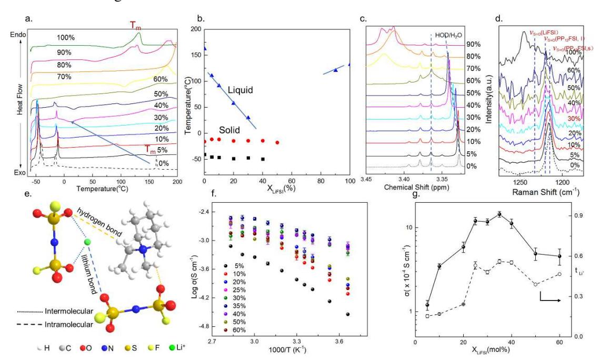
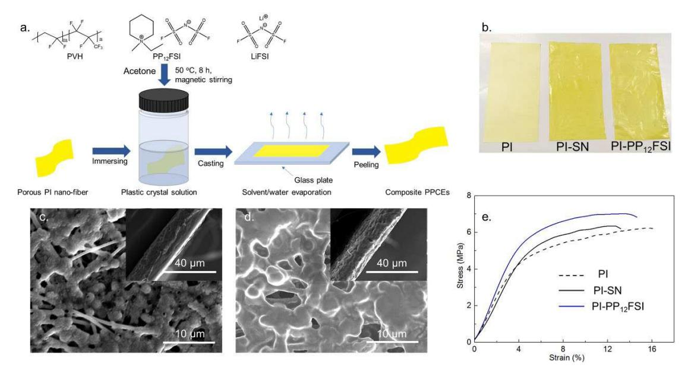
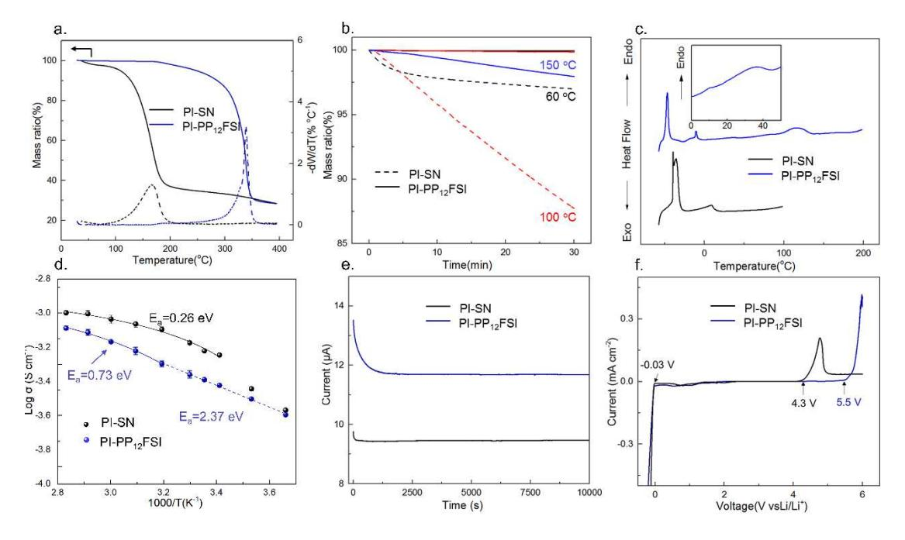
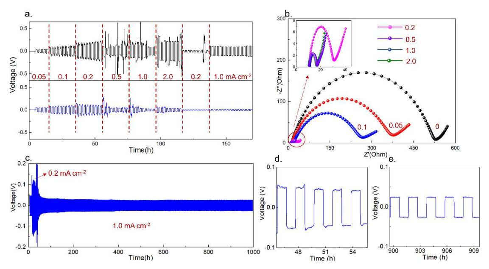
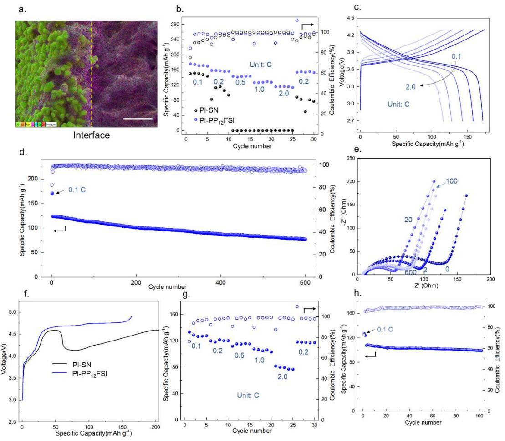
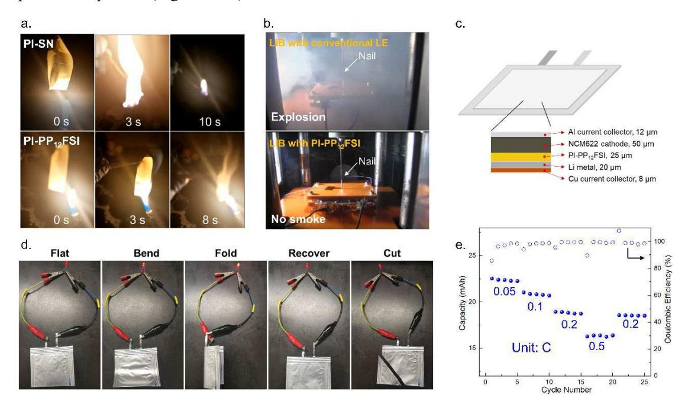

# Safe and low resistance solid-state high-voltage lithium metal batteries enabled by polyimide plastic crystal electrolytes

## Zhu Liao

Shanghai Jiao Tong University

## Anyi Hu

Shanghai Jiao Tong University

Chenxi Huang Shanghai Jiao Tong University

Enyou Zhao Shanghai Jiao Tong University

## Nagahiro Saito Nagoya University <https://orcid.org/0000-0001-8757-3933>

## Zhengxi Zhang

Shanghai Jiao Tong University

Li Yang ( [liyangce@sjtu.edu.cn](mailto:liyangce@sjtu.edu.cn) ) School of chemistry and chemical engineering, Shanghai Jiaotong University

## Shin-ichi Hirano

Shanghai Jiao Tong University

## Article

Keywords: solid-state electrolytes, organic ionic plastic crystals, lithium metal batteries

Posted Date: February 25th, 2022

DOI: <https://doi.org/10.21203/rs.3.rs-1349029/v1>

License: This work is licensed under a Creative Commons Attribution 4.0 International License. [Read Full License](https://creativecommons.org/licenses/by/4.0/)

# **Safe and low resistance solid-state high-voltage lithium metal batteries enabled by polyimide plastic crystal electrolytes**

## **Abstract**

Solid-state electrolytes (SSEs) have been attached widespread attention as next-generation materials as far as safety and energy density concerned, but they are severely plagued by the limited oxidative potential, poor physical contact with electrodes and lithium dendrite growth. Organic ionic plastic crystal (OIPC), solid analogues of ionic liquids (ILs), are intrinsic nonflammable, non-volatile and compatible with lithium anode. In the present work, an electrochemical durable polyimide plastic crystal electrolyte (PPCE, up to 5.5 V vs Li/Li+ ) can be obtained as a result of the good interaction between OIPC and Li salt. Also, the soft, deformable property of OIPC and proper melting point of OIPC-Li salt endure good physical contact with electrodes. Consequently, solid-state dendrite-free Li/PPCE/Li cells show an ultralong cycle life over 1000h under 1.0 mA cm-2, and room temperature high-voltage Li/PPCE/ LiNi0.6Co0.2Mn0.2O2 cion cells achieve a capacity retention of 80% after 633 cycles under 1.0 C and ~5.0V class Li/PPCE/LiNi1.5Mn0.5O4 coins cells keep 91% discharge capacity after 100 cycles under 1.0 C at 25 ℃. The ionic and non-volatile nature of OIPC ensure the safety of PPCE so that it can past the harsh penetration test under practical conditions. Furthermore, the PPCE- based pouch cell shows good flexibility, acceptable rate performance and a high energy density of 223.1Wh kg-1(based on merely electrolyte and electrodes). It is anticipated that our work provides an avenue for nextgeneration solid-state batteries.

**Keywords:** solid-state electrolytes, organic ionic plastic crystals, lithium metal batteries

## **Introduction**

Lithium batteries with liquid electrolytes are ubiquitous in our daily life, but they are unable to make ends meet in large-scale applications (e.g., electric vehicles, smart grids) in safety issues as well as energy density. Conventional liquid electrolytes (e.g., carbonate-based, ether-based) embody superior ionic conductivity and good wetting ability, but they are volatile, intrinsic flammable and thermal unstable which led to catastrophic accidents1,2 . Additionally, the limited oxidative potential (typically lower than 4.4V(vs Li/Li+ ))3,4 and inability in lithium dendrite suppression 5 (Figure 1)severely impede their further application in next-generation high energy density lithium metal batteries (LMBs). Solid-state electrolytes (SSEs) have thus been aroused paramount attention both academia and industry for not only ameliorating the above problems but also possessing manufacture advance. Traditional inorganic electrolytes (IEs) such as sulfides and oxides are flame-retardant, with superionic conductivity even higher than that of liquid electrolytes6,7. However, insufficient physical contact with electrodes, difficulty in making thin film induced by the rigid and fragile nature of IEs and low oxidative potential8,9 (Figure 1) hamper their application in high energy density LMBs. Moreover, Wang C. S. et al10 revealed that the nonnegligible electronic conductivity of IEs is prone to promote the growth of lithium dendrite.

Plastic crystals (PCs), generally resemble waxes and are easily deformed which make them have an improved physical contact with other solid when pressed11,12 . Also, PCs embody a longrange conductive crystalline phase with short-range orientational or rotational disorder motion of molecules/ions mainly between the last solid-solid transition and melting point which supports fast mobility of target ions even in solid state13-17 . Succinonitrile (SN), the most investigated molecular PC, with a pleasant plastic phase of -35~62 ℃ and a high ionic conductivity of over 1 mS cm-1 (with 5% mol LiTFSI @25℃) 14, have been extensively used as SSE materials in LMBs (e.g., Li-intercalation cathode batteries18,19and Li-O2 20 cells) and buffer interlayer between SSE and electrode21-23. Nevertheless, as a result of the high polarity of -CN, SN can dissolve lithium salt and will be liquified even at low salt concentration18,24,25, which not only can lead to leakage problem but also lower the safety of SN-based electrolytes (the nature of liquid organic molecular to be volatile). More seriously, there are contradictory reports on the compatibility of SN with lithium anode11,14,20,21,26, which is of great importance on the application of SN in high energy density LMBs. Conversely, organic ionic plastic crystals (OIPCs), solid analogues of ionic liquids (ILs), composed of entirely cations and anions, are intrinsic non-flammable, non-volatile and compatible with lithium anode27,28. However, the ionic conductivity of OIPC-based SSE is one order of magnitude lower than that of SN-based SSEs12 and they can be also eutectic with lithium salt29 .

Herein, we investigated the phase behavior and ionic conductivity of an excellent OIPC, Nmethyl-N-ethyl piperidine bis(fluorosulfonyl)imide (PP12FSI), with LiFSI. The adding of LiFSI lowers the melting point of the OIPC and Li0.25(PP12)0.75FSI possess a high ionic conductivity of 1.2 mS cm-1 and keep in a complete solid state at room temperature. In order to enhance the flexibility and processability, commercially available electrospun polyimide (PI) nanofiber is combined with Li0.25(PP12)0.75FSI via simple solution-casting method. It is illustrated that a salient solid polyimide plastic crystal electrolyte (PPCE) can be acquired with good mechanical strength (7.0 MPa), high ionic conductivity (0.41mS cm-1), proper lithium transference number (0.60), outstanding electrochemical stability (5.5V vs Li/Li+ ) and good compatibility with lithium metal.

Therefore, solid-state dendrite-free symmetric Li cells with the PPCE function well over 1000 h under 1.0 mA cm-2. Also, high-voltage Li/LiNi0.6Co0.2Mn0.2O2(NCM622) and Li/LiNi1.5Mn0.5O4(LNMO) coin cells utilizing aforementioned PPCE exhibit superior rate performance to that of cells with SN and deliver fulfilling cycle performance under 1.0 C at room temperature. Post flammability and nail penetration test verify the excellent safety properties and the flexible rechargeable Li/PPCE/NCM622 pouch cell can reach a high energy density of 223.1Wh Kg-1(based on electrode and electrolyte) and good rate performance. We believe that our research provides an avenue for next-generation batteries.

Figure 1. Schematic illustration of novel polyimide plastic crystal electrolyte (PPCE)-based solidstate lithium metal batteries (SSLMBs) in comparation with typical liquid electrolyte-based LMBs and conventional inorganic electrolyte-based all-solid-state lithium metal batteries (ASSLMBs). The features listed in green color are advantages and in red are disadvantages.

## **Experimental Section**

### **Materials**

1-methylpiperidine (98.0%), bromoethane (99.0%), succinonitrile (SN) were purchased from Shanghai Titan Scientific Co. Ltd.. Acetonitrile, acetone, dichloromethane, *N*-methyl-2pyrrolidone (NMP), poly(vinylidene fluoride) (PVDF) and silver nitrate (AgNO3) were purchased from Sinopharm Chemical Reagent Co. Ltd.. Electrospun polyimide(PI) nano-fiber (18μm) was purchased from Jiangxi Advanced Nanofiber S&T Co., Ltd.. Poly(vinylidene fluoride-cohexafluoropropylene) (PVH, average Mw~400,000, average Mn~130,000 g mol-1, pellets) was purchased from Sigma-Aldrich. Lithium bis(fluorosulfonyl)imide (LiFSI), commercial liquid electrolyte (LE, 1M LiPF6 in EC: DMC: EMC=1:1:1 (in v)), acetylene black, Whatman glassfiber (GF/A), Celgard-2400 separator and lithium anode (20 μm) were provided by Shanghai Songjing Energy Co. Ltd.. LiNi0.6Co0.2Mn0.2O2(NCM622) and LiNi1.5Mn0.5O4(LNMO) were kindly provides by Shanghai Electronic Group Co. Ltd.. All reagents were used as received.

## **Synthesis of N-methyl-N-ethyl piperidine bis(fluorosulfonyl)imide (PP12FSI)**

The synthesis route of PP12FSI is shown in Figure S1a with two steps referred to our previous report30 . Typically, 0.1M N-methyl piperidine was homogeneously mixed with two volume grade of acetonitrile, then two molar ratio times of bromoethane was added drop wisely into the solution under Ar atmosphere and ice-water bath. The getting solution was magnetic stirred at 50 oC for 24 h. With the reaction ongoing, the solution become yellow gradually. Afterwards, the getting solution was rotate evaporated under 60 oC to remove acetonitrile and excess bromoethane and then dried under vacuum at 80 oC for 48 h. The white solid block, N-methyl piperidine bromide (PP12Br) was obtained, and the yield is 90%.

5.0g (0.024 M) PP12Br and 5.8g(0.031 M) LiFSI were dissolved in an appropriate amount of deionized water. The LiFSI solution was added dropwise into PP12Br solution with a fast formation of white precipitation. After plenty of dichloromethane was added to extract the precipitation, the mixture was stirred for 2 h at room temperature. Then, the mixture was washed with deionized water until the residual Br- anion could not be detected with AgNO3 (0.01 M). Dichloromethane was removed by rotating evaporation, and the product was dried under vacuum at 100 oC for 48 h to obtain the white sticky and semi-transparent solid product (Figure S1b), PP12FSI. The yield is 72%. The chemical structure and purity of PP12FSI was confirmed by 1H NMR spectrum and element analysis.

**Preparation of Lix(PP12)1-xFSI and polyimide plastic crystal electrolytes (PPCEs).** 

Lix(PP12)1-xFSI were prepared by dissolving 0.3g different molar ratio of LiFSI and PP12FSI in 2 mL acetone, and then the solution were evaporated at 60 oC under vacuum for 24h.

The preparation of PPCEs is simply solution-casting method (Figure 2a), and detailedly, PVH (20% in weight), and Li0.25(PP12)0.75FSI (80% in weight) were dissolved in acetone and stirred for 12 h at 50 ℃ to form homogeneous solution. Then PI nano-fiber (4×8 cm2 ) was immersed to the solution for 30min and the solution was cast onto the immersed PI on smooth glass plate. Subsequently, most of the solvent was removed at room temperature under Ar atmosphere and the composite PPCEs were dried at 80 ℃ under vacuum for 48 h before moved into an argon-filled glovebox for 24 h to remove the residential solvent and water. Also, PP12FSI was substitute with SN with the same molarity as a controlling sample.

#### **Measurements**

#### **Materials and structure characterization:**

Differential scanning calorimeter (DSC, 204 F1) was used to study the thermal behavior of Lix(PP12)1-xFSI and PPCEs between -60 °C and 200 °C at a ramp temperature rate of 10 °C min-1 , generally, 5 mg sample was sealed in Al2O3 pan and ramped to 200 °C then cooled to -60 °C and reheating to 200 °C, the thermal data were selected from the second heating process.

The chemical structures of Lix(PP12)1-xFSI were determined by the hydrogen nuclear magnetic resonance (1H NMR, Avance III HD 500, Bruker), and the solvant is deuterated dimethyl sulfoxide (DMSO-d6).

Raman spectra (Renishaw in Via Qontor) was applied to investigated the chemical bond

revolution in Lix(PP12)1-xFSI equipped with 532 nm laser in the range of 1800~100 cm-1 .

Scanning electron microscope (SEM, Rise-Magna) was employed to observe the morphology of PPCEs, cycled lithium metal and NCM622 cathode. An energy dispersive X-ray spectrometer (EDS) was used to investigate the elemental distributions of PI-PP12FSI in NCM622 cathode.

The mechanical properties of PPCE membranes were tested by dynamic thermomechanical analyzer (DMA, Q850) under a tensile speed of 0.5 mm min-1 .

#### **Electrochemical characterization:**

Ionic conductivity of Lix(PP12)1-xFSI and PPCE samples were measured by assembling stainless steel(SS)/electrolyte/Cu coin cell via AC impedance spectroscopy measurements using a CHI660E electrochemical workstation over the frequency ranges from 100 kHz to 0.1 Hz from 0 ℃ to 80 ℃, and Lix(PP12)1-xFSI was measured with a GF/A separator. The ionic conductivity () was calculated by: = , where, L, Rb and S are the thickness, bulk ohmic resistance and the actual area of the electrolytes, respectively.

The lithium ion transference number (+) of Lix(PP12)1-xFSI and PPCEs were evaluated with chronoamperometry and AC impedance spectroscopy with symmetric lithium cell at 25 °C according to the method of Bruce et al31. A polarization voltage (Δ*V*) of 10 mV was adopted to the Li/electrolyte/Li cell in the chronoamperometry measurement to record the initial current *I0* and steady-state current *Is*. AC impedance before and after polarization was measured to obtain the initial and the steady-state interfacial impendence (*R0, Rs)*. + could be calculated by:

$$t_{Li^+} = \frac{I_s}{I_0} \frac{\Delta V - I_0 R_0}{\Delta V - I_s R_s}$$

.

Electrochemical impedance spectroscope (EIS) was used to investigate the interfacial impedance of electrode with electrolyte over the frequency ranges from 100 kHz to 0.1 Hz at 25

Linear sweep voltammetry (LSV) was studied with SS/PPCEs/Li cell at room temperature under a scan rate of 0.1 mV s-1, for oxidative scan, the voltage was set from open circuit potential (OCV) to 6 V and the reduction scan is from OCV to -0.5V.

#### **Cell assemble and tests:**

The periodic charge-discharge cycling test of the symmetrical Li/PPCE/Li (lithium metal,=1.6 cm, thickness: 0.6 mm) CR-2016 coin cells were conducted using a cell test instrument (Land CT2001A) at 25 ℃ at the current densities of 0.05-2.0 mA cm-2(1 h charge and 1 h discharge), and the long-term cycling test of symmetric Li cells are evaluated at the current density of 1.0 mA cm-2 .

The cathodes were prepared by a mixture of NCM622 or LNMO, acetylene black and PVDF in N-methyl-2-pyrrolidone with a weight ratio of 80: 10: 10. The typical loading of the active material was 2.0 mg cm-2. CR2016-type coin cells were assembled by contacting in sequence NCM622 or LNMO electrode, PPCE membrane and a lithium foil ( =1.6 cm, thickness: 1.2 mm) in an Ar-filled glove box. The NCM622(LNMO)/PPCE/Li cells were aged for 24 h before chargedischarge tests between 2.7 and 4.3 V (3.5-4.9 V) at room temperature (25 ℃). The current rate was determined using a nominal capacity of 180 mAh g-1 for NCM622 or 148 mAh g-1 for LNMO. EIS measurements of the cell discharged to 2.7 V were performed with a CHI660E electrochemical workstation.

Pouch-type LMB was fabricated with 7 mg cm-2 loading NCM622-suppported PI-PP12FSI composite and 20μm lithium anode.

**Safety test:** Thermal gravimetric analysis (TGA, Q8000) was tested under a nitrogen

atmosphere from room temperature to 600 °C at the heating rate of 10 °C min-1, and isothermal test was carried out under a certain temperature for 30 min.

Nail penetration test was performed by Hitachi Chemical Co. Ltd., and 8.7Wh full charged laminate-type lithium ion batteries (LIBs, NCM622/PI-PP12FSI/graphite) were used and the batteries with Celgard-2400 and LE were also performed as a comparison.

## **Results and discussions**

#### **Optimization of Lix(PP12)1-xFSI**

PP12FSI is a superior plastic crystal with a pleasant plastic range from -15.8 to 162.6 oC and can reach to a high room temperature ionic conductivity of 5.13×10-4 S cm-1 when doped with 5% mol LiFSI30 . Firstly, the phase behavior of Lix(PP12)1-xFSI was systematically investigated. As shown in Figure 2a, the melting point (Tm) of the mixture lowers with the increase of LiFSI content from 0% to 30%, and the Tm disappears when the content increase to 40% and for the 60% sample, the solid-solid transitions (Ts-s) contributed by PP12FSI even disappear. With the content of LiFSI move to 90%, there appear the melting point which mainly attributed by LiFSI at around 115 oC. Then the thermograms can be further plotted as phase diagram in Figure 2b, and as it shows, when the content of LiFSI is lower than 30%, the mixture is in a completely solid state at room temperature (25 oC). To confirm that the sample with middle content of LiFSI is fully eutectic, we decreased the lower limit of DSC to -170 oC, there are devoid of any thermal peaks lower than -16.4 oC (Figure S1c) which prove that the 50% sample is PP12FSI with eutectic PP12FSI-LiFSI mixture. Furtherly, the intramolecular interactions between PP12FSI and LiFSI is explored by 1H NMR and Raman spectroscope. The chemical shift of hydrogen peak of DMSO-d6 (Figure S2c) is almost identical with different LiFSI content but the peak in methyl (Figure S2d) and methylene (Figure 2c) show obvious shift which are related to the intramolecular interplay between PP12+ and FSI- . Moreover, the vibration peak of S=O bond (Figure 2d) related to PP12FSI shifts and there appears the peak of LiFSI when x>0.3 which imply the coordination of Li+ with

FSI- . Also, the shift in stretch peak of N-C in PP12+ ( Figure S3) prove the intramolecular hydrogen bond between PP12+ and FSI- . The interaction between PP12FSI and LiFSI can be concluded that the intramolecular hydrogen bond between CH2(CH3) neighbor to nitrogen atom in PP12+ and S=O in FSI- and lithium bond in Li+ and S=O in FSI- give rise to the eutectic phenomenon of Lix(PP12)1 xFSI.

Ionic conductivity and lithium ionic transference number are of great importance to electrolytes. Generally speaking, traditional molecular solvent-based electrolyte with "1M" optimized salt concentration32 and the ionic conductivity of ionic liquid-based electrolytes decrease with the lithium salt concentration33 . But for plastic crystal electrolytes, to the best of our knowledge, the concentration effect is seldom to be investigated. For Lix(PP12)1-xFSI, the ionic conductivity increase with the increase of LiFSI concentration when x<0.35, and the ionic conductivity turn to decrease when x≥0.35 at room temperature (Figure 2f&g, Figure S4a, Table S1), and the lithium ionic transference number exhibits the similar tendency. We know that x=0.3 is the solid-liquid boundary at room temperature (25 oC) in Lix(PP12)1-xFSI from DSC and Raman results, so when x≥0.35, the mixture is an ionic liquid electrolytes, but when x<0.35, x=0.25 not only keep in solid state, but also shows the highest lithium ionic conductivity(1.2 mS cm-1 at 25 ℃). As a result, we employed Li0.25(PP12)0.75FSI as the optimized composition as electrolytes for further investigation.

Figure 2. a) DSC thermograms, b) corresponding phase diagram, c) N-CH2-CH3 peak of 1H NMR spectra and d) Raman patterns in the range of 1275~1175 cm-1 of Lix(PP12)1-xFSI (0%≤x≤100%, in molar ratio), e) the interaction between PP12FSI and LiFSI. f) temperature dependance of ionic conductivity and g) room temperature ionic conductivity and lithium ionic transference number of Lix(PP12)1-xFSI (0%≤x≤100%,in molar ratio, with glassfiber separator).

Figure 3 a) Schematic illustration of preparation route of PI-PP12FSI. b) Optical photographs of PI, PI-SN and PI-PP12FSI (4×8 cm2 ). SEM images of c) top view of PI-SN and d) PI-PP12FSI (Insert: corresponding cross-section images). e) Stress-strain curves of different samples.

#### **Mechanical, thermal and electrochemical durable PPCEs**

Subsequently, we selected electrospun polyimide nanofiber (Thickness=18 μm) as polymer matrix with plastic crystal electrolytes to construct PPCEs for the following reasons34-36: (1) the high porosity (80%) and good mechanical strength of PI ensure the integrity and flexibility of electrolytes; (2) PI with high thermal stability and nonflammability promise the safety of electrolytes; (3) the high chemical and electrochemical stability of PI makes them good candidate for large-scale and high-voltage batteries. The preparation of PPCEs are simply solution-casting method (Figure 3a), which is effective and efficient in large scale manufacture. To avoid short circuit when used as separator and illustrate the good compatibility of PI with Li0.25(PP12)0.75FSI, a certain of PVH was added in plastic crystal solution and PP12FSI was substitute with SN with the same molarity as a controlling sample. The as-prepared PPCEs (denoted as PI-PP12FSI and PI-SN) are uniform, with an average thickness of 25 μm (Figure 3b-d, Figure S5) and flexible (Figure S6). Stress-strain curves (Figure 3e) show that PI-SN and PI-PP12FSI embody higher mechanical

strength than PI nanofiber (6.3 ,7.0 versus 6.2 MPa), which is beneficial to large scale manufacture and lithium dendrite suppression when used as SSEs.

Figure 4 a) TGA thermograms of PPCEs. b) Isothermal test of PPCEs under different temperature. c) DSC traces of PPCE samples. d) Temperature dependance of ionic conductivity of PPCEs from 0 to 80 °C (solid line is fitted with VTF model and dash line is fitted with Arrhenius equation). e) Amperometric i-t profiles of Li/PPCES/Li cells at 25 oC. f) LSV curves of Li/PPCEs/SS cells at 25 oC with the scan rate of 0.1 mV s-1 .

Thermal stability is of great importance for electrolytes to evaluate safety. It (Figure 4a) can be seen that the decomposition processes for the two samples are one-step although the components have different decomposition temperatures (Td, 5% weight loss). The Td for PI-PP12FSI can reach to 247.8 oC which is higher than that of PI-SN (108.3 oC) and notably, the value is higher than neat LiFSI (*Td* =200.0 ℃37) which confirm the interactions between PP12FSI and LiFSI. Furtherly, isothermal tests (Figure 4b) display that PI-PP12FSI shows almost no weight loss (2%) under 150 ℃ after 30 min, whereas PI-SN losses its weight with elapsed time under 100 oC, that is because that PP12FSI is ionic with strong coulombic force, while SN is molecular plastic crystal with a melting point of 56 oC26 so that the weak intermolecular force makes them easy to be volatile under high temperatures over 60 oC. To elucidate the plastic crystal characteristics of PPCEs, DSC was performed by measuring the phase behavior. It (Figure 4c) shows that PI-SN shows two phase transitions (Ts-s=-39. 4oC, Tm=8.0 oC) which indicate that PI-SN is in a quasisolid-state at room temperature (25 oC). But for PI-PP12FSI, two solid-solid transitions (-46.0, -

10.6 oC, which is corresponding to isolated PP12FSI) appears and two melting points (Tm=36.7 oC, resulting from Lix(PP12)1-xFSI; Tm=118.5oC, originating from plasticized PVH) are observed. It means that PI-PP12FSI electrolyte keeps absolutely in a solid-state at ambient temperature, which avoid leakage problem of conventional liquid/gel electrolytes and can be a good candidate for flexible electric devices.

Electrochemical properties are the prerequisites for SSEs to be applied in batteries. Temperature dependance of ionic conductivities (Figure 4d, Figure S7a, b, Table S2) exhibit that there is an abrupt increase in ionic conductivity between 10 to 20 oC in PI-SN, which is related to the melting of the electrolyte (Figure 4c), and it shows a typical VTF (Vogel-Tamman-Fulcher) behavior when the temperature is higher than 20 oC. However, although the melting point of PI-PP12FSI electrolyte locates at 36.7 oC, there are devoid of any abnormal increase in the measured temperatures. When the temperature is below 40 oC, PI-PP12FSI displays Arrhenius conducting behavior with R2>0.995 because Li0.25(PP12)0.75FSI is in plastic crystal state (Figure 4c) and it shows VTF behavior (ionic liquids state) when the temperature is higher than 40 oC. The room temperature ionic conductivity of PI-PP12FSI can reach to 4.07 ×10-4 S cm-1 which is slightly lower than that of gel-state PI-SN. Interestingly, the active energy of PI-PP12FSI is as low as 2.37 eV below 40 oC, which is much lower than most of SSEs38,39. Furthermore, the lithium ionic transference number (Figure 4e, Figure S7 c-d) of PI-PP12FSI is calculated to be 0.62±0.03, which is close to that of PI-SN (0.65 ± 0.05) and higher than ionic plastic crystal-based electrolytes40,41 . The high lithium ionic mobility may be attributed to the intramolecular hydrogen bond between FSI- and PP12+ .In addition, LSV curves (Figure 4f) indicate that PI-PP12FSI have excellent oxidative potential that can reach to 5.5 V (vs Li/Li+ ) and enough reductive ability which allows lithium striping from lithium anode, but for PI-SN electrolyte, the cathodic potential is merely 4.3 V (vs Li/Li+ ). The wide electrochemical window of PI-PP12FSI validate our guesses on intramolecular interactions between FSI- and PP12+ and make it a good candidate for high-voltage lithium metal batteries.

#### **Lithium platting/stripping with PPCEs**

There are contradictory reports in the compatibility of SN with lithium metal11,14,20,21,26, to

further investigate the interfacial stability and compatibility of PPCEs with lithium metal, symmetric Li cells was assembled with PPCEs to evaluate voltage undulation during lithium plating/stripping under fixed current density (If not mentioned, the duration of each current density is 1h). As depicted in Figure 5a, Li/PI-SN/Li shows stable overpotential below 0.2 mA cm-2 , but the voltage hysteresis fluctuates under higher than 0.5 mA cm-2 . Whereas, the voltage hysteresis decreases and stabilizes after few cycles under 0.5~2 mA cm-2 for the cell with PI-PP12FSI, which is related to the "preconditioning" process of ionic plastic crystal electrolytes. Further EIS measurements (Figure 5b, Table S3) indicate that Li/PI-PP12FSI/Li don't short-circuit under current higher than 0.5 mA cm-2 . Also, the impedance data can give a good explanation to the abnormal result that the voltage hysteresis cell with PI-PP12FSI under high current density may smaller than that of low current densities. As for the voltage of cell with PPCEs under the same current density, Li/PI-PP12FSI/Li shows smaller voltage hysteresis (Figure S8) which is related to the ionic nature of PP12FSI and good compatibility with lithium metal (Figure S8e-g). Furthermore, under high current density at 1.0 mA cm-2, cell with PP12FSI still shows stable voltage curves (Figure 5b-e) with an ultralong life span over 1000 h and dendrite-free morphology (Figure S9).

Figure 5 a) Symmetrical Li cells with PPCEs at virous current densities (the duration of each current density is 1h). b) Corresponding electrochemical impedance spectra of Li/PI-PP12FSI/Li cell after different current densities (Inset: the magnified part at current density higher than 0.2 mA cm-2). c) Voltage profile of Li/PI-PP12FSI/Li cell at 1.0 mA cm−2 . d) and e) magnified profiles at successive cycle numbers noted (all of the batteries test are performed at 25 oC).

#### **Battery performance with PPCEs**

As a result of the good oxidative potential of PPCEs, high-voltage lithium batteries can be assembled. It is a great difficulty for solid-state electrolytes to penetrate into electrodes to transport lithium ions. Ingeniously, the melting point as-developed PPCEs is lower than 40 oC and plastic crystal is easy to be deformed, so we stilled as-prepared Li/PPCEs/NCM622 cells for 24h under 40 oC to enhance the physical contact of PPCEs with cathode materials. Sulfur element only exists in PI-PP12FSI PPCE but it appears throughout cathodes (Figure 6a, Figure S10) which indicate the PPCE permeates into electrodes sufficiently after stilling. Cell with PI-PP12FSI shows outstanding rate performance (Figure 6b, c) at room temperature under up to 2.0C, while cell with PI-SN (Figure 6b, Figure S11a) delivers no discharge capacity under only 0.5C which may arise from the voltaic nature of (LiFSI)0.25(SN)0.75. When the current returns to 0.2 C, the discharge capacity of cell with PI-PP12FSI recover to the original value which proves the stability of solid electrolyte interphase on cycling. Furthermore, the rate performance of cell with PI-PP12FSI is even comparable with that of commercial separator with liquid electrolyte (Figure S11b). Also, long-term galvanostatic cycling test reveals that cell with PI-PP12FSI reaches 80% capacity retention after 633 cycles under 1.0C (Figure 6d), while cell with LE keeps only 40.9% discharge capacity after 500 cycles (Figure S11c). EIS measurements (Figure 6e, Table S4) reveal the interphase impedance of the cell with PI-PP12FSI decreases at initial decades cycles and then maintain stable on following cycles, which give rise to the excellent cycling performance of the cell. Additionally, PI-PP12FSI electrolyte enable Li/NCM622 cell deliver normal discharge capacity under a high loading of 10.6 mg cm-2(Figure S11d), which is of great importance to the utilization of this electrolytes in solid-state batteries.

Figure 6 a) EDX mapping analysis (Ni, Co, Mn, S, F, O, C) of NCM622/PI-PP12FSI interface after stilling under 40 oC (scale bar: 10μm). b) Galvanostatic rate performances of Li/PPCEs/NCM622 cells from 0.1 C to 2.0 C and c) corresponding charge-discharge curves of Li/PI-PP12FSI/NCM622 cell under different rate. d) Galvanostatic long-term cycle performance of Li/PI-PP12FSI/NCM622 cell under 1.0 C (there were two initial cycles under 0.1 C) and e) corresponding Nyquist plot of electrochemical impedance measurements of Li/PI-PP12FSI/NCM622 cell after different cycles, the frequency range was from 100 KHz to 1 Hz. f) First charge curves of Li/PPCEs/LNMO cells. g) Galvanostatic rate performances of Li/PI-PP12FSI /LNMO cell from 0.1 C to 2.0 C and h) galvanostatic cycle performance of Li/PI-PP12FSI/ LNMO cell under 1.0 C (all of the batteries test are performed at 25 oC).

To be more powerful, ~5V class Li/LNMO cells with PPCEs were also assembled. Cell with PI-SN (Figure 6f) shows obvious discharge peak at about 4.5V in the first charge curve, which indicate the decomposition of the electrolyte and the voltage is in coincidence with LSV results (Figure 4f). However, cell with PI-PP12FSI (Figure 6g, Figure S12a) delivers a high discharge capacity of 106.6 and 80.8 mAh g-1 at 1.0 C and 2.0 C (1 C = 148 mAh g-1). When the current returns to 0.2 C, the discharge capacity of cell with PI-PP12FSI recovers and maintains close to the original value, which indicate that the electrolyte is qualified for such high-voltage batteries. Furtherly, cell with PI-PP12FSI (Figure 6h, Figure S12b) keeps its 92.1% discharge capacity after

100 cycles under 1.0C, which is indispensable for the extraordinary oxidative stability of PI-PP12FSI and stable solid electrolyte interface. It is noteworthy that this is the first time that OIPCbased electrolytes can be applied in such high-voltage batterries.

#### **Safety and Flexibility of PPCEs**

As a solid analogue of ionic liquids, PP12FSI is intrinsic nonflammable so PI-PP12FSI shows a flame retardant behavior when exposed to flame (Figure 7a, Video S2), however, PI-SN can be easily ignited and burn to ashes (Figure 7a, Video S1). Further nail penetration tests (Figure 7b, Video S3) exhibit that laminate-type LIB with commercial liquid electrolytes exploded and collapsed with sudden voltage drop and sharp temperature up to 265 oC when nailed (Figure S13a), whereas, no smoke and flame can be observed and the voltage keeps steady during the whole penetration process (Figure S13b) for the LIB with PI-PP12FSI.

Figure 7 a) Flammability test of PPCEs. b) Nail penetration test of laminate-type LIB (graphite/NCM622) with conventional Celgard-2400+LE and PI-PP12FSI. c) Schematic illustration of monolayer pouch-type LMB with PI-PP12FSI. d) Abuse test of pouch-type Li/ PI-PP12FSI/NCM622 cell under flat, bend, fold and cut state. e) Rate performance of pouch-type Li/ PI-PP12FSI/NCM622 cell under different rate at 25 oC.

We also fabricated monolayer pouch-type LMB with 20μm lithium anode (Figure 7c) to elucidate the flexibility and practical application of PI-PP12FSI. The NCM622 cathode-supported PI-PP12FSI cathode (Figure S14a, b) is supposed to have a better physical contact of electrolyte and electrode (Figure S14c) and embrace technique advance. A red light-emitting diode (LED) can be can be easily lit up in flat, bend, fold, and even cut state, demonstrating the excellent flexibility of this solid-state Li/PI-PP12FSI/NCM622 batteries which is potentially to be used in wearable devices. Also, the pouch-type Li/ NCM622-PI-PP12FSI battery delivers good rate performance up to 0.5C at room temperature (Figure 7e, Figure S14d) which is attributed to the low impedance of electrode and solid electrolyte. The energy-density of the pouch type cells can reach to a level of 223.1Wh kg-1(based on merely electrolyte and electrodes), which is the highest rechargeable LMB value42,43 and can be further improved by the increase of cathode loading.

## **Conclusions**

In conclusion, we developed non-flammable polyimide plastic crystal electrolyte (PPCE) based on PP12FSI which embody good mechanical strength (7.0 MPa), high ionic conductivity (0.41mS cm-1), proper lithium transference number (0.60), outstanding electrochemical stability (5.5V vs Li/Li+ ) and good compatibility with lithium metal. The composite electrolyte is a good substitute of the most researched molecular plastic crystal (SN) as for safety and battery performance. Solid-state dendrite-free Li/PPCE/Li cells can reach an ultralong cycle life over 1000h under 1.0 mA cm-2, and room temperature high-voltage Li/PPCE/ LiNi0.6Co0.2Mn0.2O2 cion cells achieve a capacity retention of 80% after 633 cycles under 1.0 C and ~5.0V class Li/PPCE/LiNi1.5Mn0.5O4 coins cells keep 91% discharge capacity after 100 cycles under 1.0 C at 25 ℃ . Furthermore, the PPCE-based pouch cell shows good flexibility, acceptable rate performance and a high energy density of 223.1Wh kg-1(based on merely electrolyte and electrodes). It is envisaged that our work will provide a promising solid material to accomplish good safety, high energy-density and easy packaging rechargeable lithium metal batteries.

### **Conflicts of interest**

There are no conflicts to declare.

## **Reference:**

- 1 Tarascon, J.-M. & Armand, M. Issues and challenges facing rechargeable lithium batteries. *Nature* **414**, 359-367, doi:10.1038/35104644 (2001).
- 2 Feng, X. N. *et al.* Thermal runaway mechanism of lithium ion battery for electric vehicles: A review. *Energy Storage Mater.* **10**, 246-267, doi:10.1016/j.ensm.2017.05.013 (2018).
- 3 Ren, X. D. *et al.* Enabling High-Voltage Lithium-Metal Batteries under Practical Conditions. *Joule* **3**, 1662-1676, doi:10.1016/j.joule.2019.05.006 (2019).
- 4 K., X. Nonaqueous Liquid Electrolytes for Lithium-Based Rechargeable Batteries. *Chem. Rev.* **104**, 4303-4417 (2004).
- 5 Xu, K. Electrolytes and interphases in Li-ion batteries and beyond. *Chem. Rev.* **114**, 11503- 11618, doi:10.1021/cr500003w (2014).
- 6 Kamaya, N. *et al.* A lithium superionic conductor. *Nat. Mater.* **10**, 682-686 (2011).
- 7 Kato, Y. *et al.* High-power all-solid-state batteries using sulfide superionic conductors. *Nat. Energy* **1**, 16030 (2016).
- 8 Manthiram, A., Yu, X. W. & Wang, S. F. Lithium battery chemistries enabled by solid-state electrolytes. *Nat. Rev. Mater.* **2**, 16103, doi:10.1038/natrevmats.2016.103 (2017).
- 9 Fan, L., Wei, S. Y., Li, S. Y., Li, Q. & Lu, Y. Y. Recent Progress of the Solid-State Electrolytes for High-Energy Metal-Based Batteries. *Adv. Energy Mater.* **8**, 1702657, doi:10.1002/aenm.201702657 (2018).
- 10 Han, F. D. *et al.* High electronic conductivity as the origin of lithium dendrite formation within solid electrolytes. *Nat. Energy* **4**, 187-196, doi:10.1038/s41560-018-0312-z (2019).
- 11 Zhou, D., Shanmukaraj, D., Tkacheva, A., Armand, M. & Wang, G. X. Polymer Electrolytes for Lithium-Based Batteries: Advances and Prospects. *Chem* **5**, 2326-2352, doi:10.1016/j.chempr.2019.05.009 (2019).
- 12 Zhu, H. J., MacFarlane, D. R., Pringle, J. M. & Forsyth, M. Organic Ionic Plastic Crystals as Solid-State Electrolytes. *Trends in Chemistry* **1**, 126-140, doi:10.1016/j.trechm.2019.01.002 (2019).
- 13 MacFarlane, D. R., Huang, J. H. & Forsyth, M. Lithium-doped plastic crystal electrolytes exhibiting fast ion conduction for secondary batteries. *Nature* **402**, 792-794 (1999).
- 14 Alarco, P. J., Abu-Lebdeh, y., Abouimrane, A. & Armand, M. The plastic-crystalline phase of succinonitrile as a universal matrix for solid-state ionic conductors. *Nat. Mater.* **3**, 476-481 (2004).
- 15 Jin, L. Y. *et al.* An organic ionic plastic crystal electrolyte for rate capability and stability of ambient temperature lithium batteries. *Energy Environ. Sci.* **7**, 3352-3361, doi:10.1039/c4ee01085j (2014).
- 16 Jin, L. *et al.* Structure and transport properties of a plastic crystal ion conductor:

diethyl(methyl)(isobutyl)phosphonium hexafluorophosphate. *J. Am. Chem. Soc.* **134**, 9688- 9697, doi:10.1021/ja301175v (2012).

- 17 Pringle, J. M. Recent progress in the development and use of organic ionic plastic crystal electrolytes. *Phys. Chem. Chem. Phys.* **15**, 1339-1351 (2013).
- 18 Pal, P. & Ghosh, A. Robust Succinonitrile Plastic Crystal-Based Ionogel for All-Solid-State Li-Ion and Dual-Ion Batteries. *ACS Appl. Energy Mater.* **3**, 4295-4304, doi:10.1021/acsaem.0c00007 (2020).
- 19 Liang, W. F., Shao, Y. F., Chen, Y.-M. & Zhu, Y. A 4 V Cathode Compatible, Superionic Conductive Solid Polymer Electrolyte for Solid Lithium Metal Batteries with Long Cycle Life. *ACS Appl. Energy Mater.* **1**, 6064-6071, doi:10.1021/acsaem.8b01138 (2018).
- 20 Wang, J., Huang, G., Chen, K. & Zhang, X.-B. An Adjustable-Porosity Plastic Crystal Electrolyte Enables High-Performance All-Solid-State Lithium-Oxygen Batteries. *Angew. Chem. Int. Ed. Engl.* **59**, 9382-9387, doi:10.1002/anie.202002309 (2020).
- 21 Lu, Z. H. *et al.* Enabling room-temperature solid-state lithium-metal batteries with fluoroethylene carbonate-modified plastic crystal interlayers. *Energy Storage Mater.* **18**, 311- 319, doi:10.1016/j.ensm.2018.08.021 (2019).
- 22 Wang, C. H. *et al.* Solid‐State Plastic Crystal Electrolytes: Effective Protection Interlayers for Sulfide‐Based All‐Solid‐State Lithium Metal Batteries. *Adv. Funct. Mater.* **29**, 1900392, doi:10.1002/adfm.201900392 (2019).
- 23 Liu, Q. *et al.* Safe LAGP-based all solid-state Li metal batteries with plastic super-conductive interlayer enabled by in-situ solidification. *Energy Storage Mater.* **25**, 613-620, doi:10.1016/j.ensm.2019.09.023 (2020).
- 24 Echeverri, M., Kim, N. & Kyu, T. Ionic Conductivity in Relation to Ternary Phase Diagram of Poly(ethylene oxide), Succinonitrile, and Lithium Bis(trifluoromethane)sulfonimide Blends. *Macromoleculars* **45**, 6068-6077, doi:10.1021/ma3008509 (2012).
- 25 Patel, M. & Bhattacharyya, A. J. A crosslinked "polymer–gel" rechargeable lithium-ion battery electrolyte from free radical polymerization using nonionic plastic crystalline electrolyte medium. *Energy Environ. Sci.* **4**, 429-432, doi:10.1039/c0ee00294a (2011).
- 26 Li, X. W., Zhang, Z. X., Li, S. J., Yang, L. & Hirano, S.-I. Polymeric ionic liquid-plastic crystal composite electrolytes for lithium ion batteries. *J. Power Sources* **307**, 678-683, doi:10.1016/j.jpowsour.2016.01.032 (2016).
- 27 Basile, A., Bhatt, A. I. & O'Mullane, A. P. Stabilizing lithium metal using ionic liquids for long-lived batteries. *Nat. Commun.* **7**, 11794, doi:10.1038/ncomms11794 (2016).
- 28 MacFarlane, D. R. *et al.* Ionic liquids and their solid-state analogues as materials for energy generation and storage. *Nat. Rev. Mater.* **1**, 15005, doi:10.1038/natrevmats.2015.5 (2016).
- 29 Henderson, W. A. *et al.* An Alternative Ionic Conductivity Mechanism for Plastic Crystalline Salt-Lithium Salt Electrolyte Mixtures. *Adv. Energy Mater.* **2**, 1343-1350, doi:10.1002/aenm.201200130 (2012).
- 30 Liao, Z. *et al.* Safe, superionic conductive and flexible "polymer-in-plastic salts" electrolytes for dendrite-free lithium metal batteries. *Energy Storage Mater.* **33**, 442-451, doi:10.1016/j.ensm.2020.09.003 (2020).
- 31 Bruce, P. G. & Vencent, C. A. Steady state current flow in solid binary electrolyte cells. *J. Electroanal. Chem.* **225**, 1-17 (1987).
- 32 Yamada, Y., Wang, J. H., K., S., Watanabe, E. & Yamada, A. Advances and issues in

developing salt-concentrated battery electrolytes. *Nat. Energy* **4**, 269-280, doi:10.1038/s41560-019-0336-z (2019).

- 33 Kerner, M., Plylahan, N., Scheers, J. & Johansson, P. Ionic liquid based lithium battery electrolytes: fundamental benefits of utilising both TFSI and FSI anions? *Phys. Chem. Chem. Phys.* **17**, 19569-19581, doi:10.1039/c5cp01891a (2015).
- 34 Wan, J. Y. *et al.* Ultrathin, flexible, solid polymer composite electrolyte enabled with aligned nanoporous host for lithium batteries. *Nat. Nanotechnol.* **14**, 705-711, doi:10.1038/s41565- 019-0465-3 (2019).
- 35 Hu, J. K., He, P. G., Zhang, B. C., Wang, B. Y. & Fan, L.-Z. Porous film host-derived 3D composite polymer electrolyte for high-voltage solid state lithium batteries. *Energy Storage Mater.* **26**, 283-289, doi:10.1016/j.ensm.2020.01.006 (2020).
- 36 Kong, L. Y., Yan, Y. R., Qiu, Z. M., Zhou, Z. Q. & Hu, J. Q. Robust fluorinated polyimide nanofibers membrane for high-performance lithium-ion batteries. *J. Membrane Sci.* **549**, 321- 331, doi:10.1016/j.memsci.2017.12.028 (2018).
- 37 Wang, X. E. *et al.* Poly(Ionic Liquid)s-in-Salt Electrolytes with Co-coordination-Assisted Lithium-Ion Transport for Safe Batteries. *Joule* **3**, 1-16 (2019).
- 38 Zhang, B. H. *et al.* Dendrite-free lithium metal solid battery with a novel polyester based triblock copolymer solid-state electrolyte. *Nano Energy* **72**, 104690, doi:10.1016/j.nanoen.2020.104690 (2020).
- 39 Zhang, X. *et al.* Self-Suppression of Lithium Dendrite in All-Solid-State Lithium Metal Batteries with Poly(vinylidene difluoride)-Based Solid Electrolytes. *Adv. Mater.* **31**, e1806082, doi:10.1002/adma.201806082 (2019).
- 40 Zhou, Y. D. *et al.* Solid-State Lithium Conductors for Lithium Metal Batteries Based on Electrospun Nanofiber/Plastic Crystal Composites. *Chemsuschem* **10**, 3135-3145 (2017).
- 41 Zhou, Y. D. *et al.* Ternary lithium-salt organic ionic plastic crystal polymer composite electrolytes for high voltage, all-solid-state batteries. *Energy Storage Mater.* **15**, 407-414 (2018).
- 42 Fu, K. *et al.* Flexible, solid-state, ion-conducting membrane with 3D garnet nanofiber networks for lithium batteries. *Proc. Natl. Acad. Sci.* **113**, 7094-7099, doi:10.1073/pnas.1600422113 (2016).
- 43 Wan, J. Y. *et al.* Ultrathin, flexible, solid polymer composite electrolyte enabled with aligned nanoporous host for lithium batteries. *Nat. Nanotechnol.* **14**, 705-711 (2019).

# Supplementary Files

This is a list of supplementary les associated with this preprint. Click to download.

- [VedioS1PISN.mp4](https://assets.researchsquare.com/files/rs-1349029/v1/eb1382b9b07d396c73f78f10.mp4)
- [SupplementaryInformation.docx](https://assets.researchsquare.com/files/rs-1349029/v1/be7eaee9856582dd772e98be.docx)
- [VedioS2PIPP12FSI.mp4](https://assets.researchsquare.com/files/rs-1349029/v1/eb24b9a0e17cc2db95607fec.mp4)
- [VedioS3Nailpenetrationtest.mp4](https://assets.researchsquare.com/files/rs-1349029/v1/67f9c20c6f1eae90526cc828.mp4)