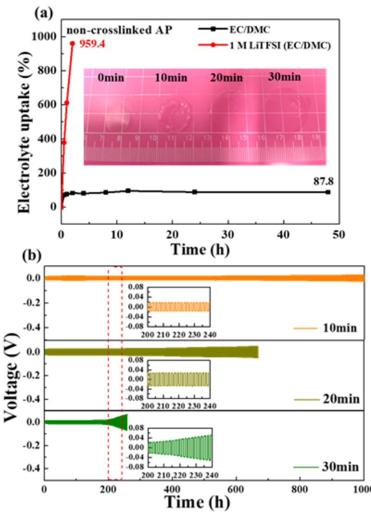
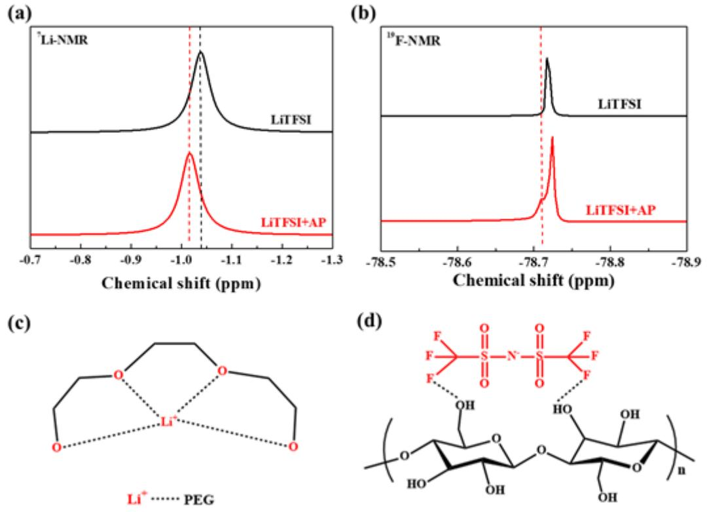
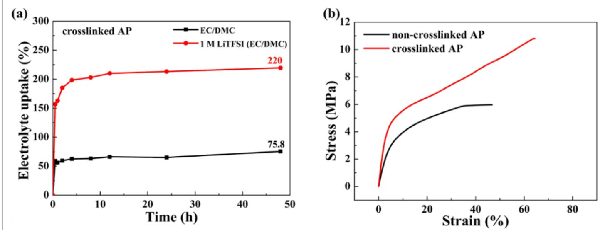
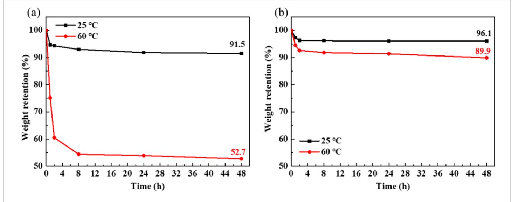
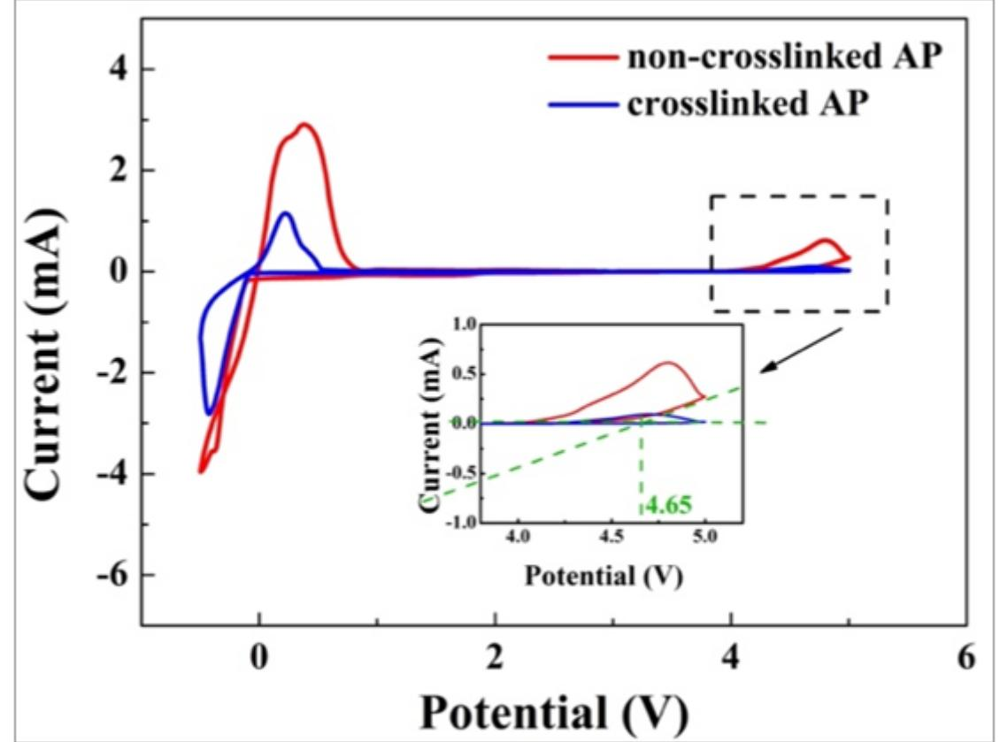
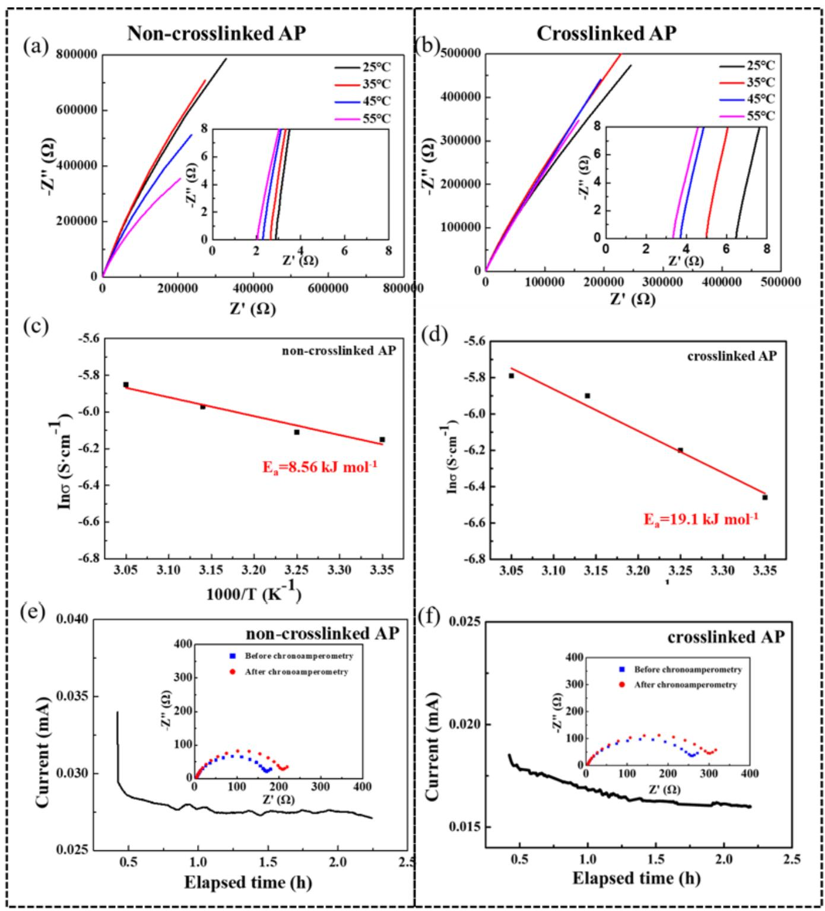
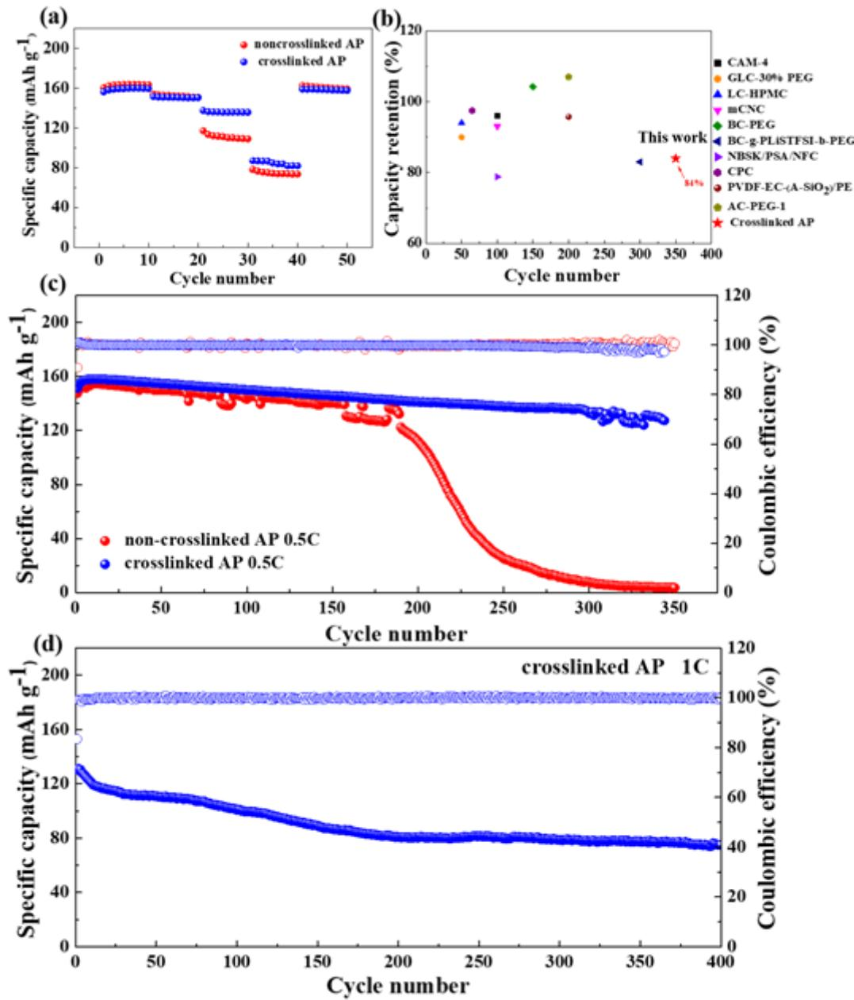

## Thiol-Ene crosslinked cellulose-based gel polymer electrolyte with good structural integrity for high cycling performance lithium-metal battery

Hongbing Zhang ( [1334227056@qq.com](mailto:1334227056@qq.com) )

Hainan University Yujie Wang Hainan University Shuhan Dong Hainan University Wen Chen Hainan University Feng Yu Hainan University Yong Chen Foshan University

#### Research Article

Keywords: Gel polymer electrolytes, Cellulose, Crosslinked network, Thiol-ene click chemistry, Lithiummetal battery

Posted Date: June 10th, 2022

DOI: <https://doi.org/10.21203/rs.3.rs-1626025/v1>

License: This work is licensed under a Creative Commons Attribution 4.0 International License. Read Full [License](https://creativecommons.org/licenses/by/4.0/)

## Abstract

Gel polymer electrolytes (GPEs) are considered the most promising replacements for liquid electrolytes that can be easily applied with long-life, safe, and solid-state lithium-metal batteries. However, the mechanical properties of GPE usually deteriorate dramatically when plasticized by the liquid electrolyte, which results in a significant decrease in the performance of the battery. Therefore, the long-term structural integrity and desirable mechanical strength are critical parameters for GPE to be ustilized in the high-performance battery. Here, an environment-friendly cellulose-based GPE is crosslinked by simple and effective thiol-ene click chemistry. The thiol-ene crosslinked GPE not only possesses higher mechanical strength (10.95 MPa) and rigid structure, but also enables the LiFePO4 |Li batteries with ultra-long cycling stability. The capacity retention of crosslinked cellulose GPE can reach to 84% at 0.5C even after 350 cycles, which is much better than the non-crosslinked GPE suffering a rapid capacity decline after 200 cycles. This work provides a promising GPE to replace the commercial liquid electrolyte for lithium metal battery.

### 1. Introduction

As the industrial process accelerates, the reserves of fossil fuels are decreasing, and the need for clean and renewable energy sources is increasingly urgent. Lithium-metal batteries (LMBs) are considered to be the most promising electrochemical energy storage devices due to their highest energy density (3860 mAh g − 1 ) and lowest redox potential (-3.04V vs. standard hydrogen electrode)(Lin et al. 2017; Xu et al. 2014). However, one of the biggest drawbacks of LMBs is the safety issues. It's well known that the traditional batteries use commercial carbonate-based liquid electrolytes as the ion transport mediums. Although liquid electrolytes provide the benefits of high ionic conductivity and better wettability with electrodes, they usually suffer from poor thermal stability and low safety(Manthiram et al. 2017; Zheng et al. 2018). Lithium dendrites grow without restriction due to uneven deposition of lithium on the surface of the lithium metal anode during the repeated charge-discharge process, which can result in short-circuit inside the battery(Deng et al. 2018; Pan et al. 2015).

Therefore, replacing liquid electrolytes with solid polymer electrolytes (SPEs) is an effective solution to the abovementioned safety issues due to the absence of dynamic flow electrolytes and high mechanical strength that suppresses the growth of lithium dendrites(Jeon et al. 2020; Liu et al. 2018). But the frustrating ionic conductivity (lower than 10 − 3 S cm− 1 ) of SPEs at room temperature and poor interfacial contact between SPEs and the electrodes are still challenges(Tang et al. 2020). By contrast, the gel polymer electrolyte (GPE), a swollen polymer matrix plasticized by liquid electrolytes, combines the advantages of liquid electrolytes and solid electrolytes, which exhibits higher ionic conductivity, better interfacial compatibility, and safety assurance(Hu et al. 2020; Li et al. 2020). PEO-based GPEs have been widely utilized in LMBs due to their excellent electrolyte wettability, ability to coordinate lithium ions, and good flexibility(Chen et al. 2018; Li et al. 2011; Siyal et al. 2019). However, it has been reported that the introducing of plasticizers or solvents in PEO matrix inevitably decreases its mechanical strength and destabilized its structure(Golodnitsky et al. 2015; Lu et al. 2017; Xue et al. 2015). For instance, Li et al.

have prepared PEO-based gel polymer electrolytes with high ionic conductivity (σ = 3.3 × 10 − 3 S cm− 1 ) at room temperature(Li et al. 2017). But Li/LiFeO4 cells with the GPE exhibited poor cycling stability at 0.5C. Meanwhile, many other non-crosslinked gel polymer electrolytes were recently reported and demonstrated weak physical entanglement within GPE that is hard to tolerate the repeated ion transport during the longterm charge and discharge process(Wan et al. 2017).

Therefore, more researchers pay attention to designing crosslinked GPE with superior mechanical strength for LMBs to suppress the growth of Li dendrites. Recently some synthetic methods of crosslinked GPE have been reported. Li et al. designed polyhedral oligomeric silsesquioxane (POSS) crosslinked poly(ethylene glycol) (PEG) composite electrolytes(Li et al. 2020). The Li/Li symmetrical batteries with the GPEs have a long stable cycle over 6800 h at the current density of 0.1 mA cm− 2 . Zhang et al. fabricated novel crosslinked polymer electrolytes with excellent cyclic stability at 1 C through UV-initiated thiol-ene click reaction(Zhang et al. 2020). However, the GPE is supported by non-woven fabrics, so its ionic conductivity is relatively low at room temperature (0.84 mS cm− 1 ).

It is equally important to seek environmentally friendly renewable materials when pursuing high strength GPEs with crosslinking networks and high ionic conductivity. Cellulose is the most abundant natural biopolymer and is derived from wood, algae, and bacteria(Chen et al. 2018; Qiu et al. 2013). Cellulose exhibits favorable mechanical properties, excellent thermal and chemical stability due to its strong intraand intermolecular hydrogen bonds(Wang et al. 2020). So, cellulose is widely reported as binder, polymer electrolyte or separator(Kim et al. 2019; Lizundia et al. 2020; Yang et al. 2021; S. Zhang et al. 2022). Zhou et al. successfully synthesized a novel bottlebrush BC-g-PLiSTFSI-b-PEGM quasi-solid-state polymer electrolyte through surface-initiated atom transfer radical polymerization, which displays high mechanical strength and ion conductivity(Zhong et al. 2019). However, some other reported cellulosebased GPEs have the common drawback of low electrolyte uptake and retention(Du et al. 2019). At present, little literature about crosslinked cellulose-based GPEs with superior electrolyte affinity and mechanical strength are reported.

Inspired by the above research, we designed a simple and efficient thiol-ene click method to build crosslinked cellulose GPEs in this work. First, Cellulose was chemically modified by allyl groups and reacted with poly (ethylene glycol) methyl ether methacrylate (PEGMA) to obtain PEG-grafted cellulose. Then, pentaerythritol tetra(3-mercaptoproponate) (PETMP) acts as a crosslinking agent to form the crosslinked network AP. This crosslinked AP can maintain a stable structure after the gelation process and avoid the infinite swelling and structure collapsibility. Meantime, the crosslinked AC-PEG exhibits desirable ion conductivity at room temperature and lithium-ion transport number. Moreover, LiFePO4 /Li batteries based on the crosslinked AC-PEG demonstrate superior long-term cycling stability, indicating the thiol-ene crosslinked network can significantly improve the structural strength and electrochemical performance of GPEs.

## 2. Experimental Section

# 2.1 Materials

Cellulose [(C6H10O5 ) n , n = 400–500, Fw=162.06], chloropropene, urea (AR), dimethyl sulfoxide (DMSO), ethylene carbonate (EC), urea, lithium bis(trifluoromethane sulfonyl) imide (LiTFSI, 99%) and N-methyl-2 pyrrolidone (NMP) were purchased from Aladdin reagent company, China. Poly (ethylene glycol) methyl ether methacrylate (PEGMA, Mn = 950 g mol − 1 ) was purchased from Sigma-Aldrich. Pentaerythritol Tetra(3-Mercaptopropionate) (PETMP, Mw = 488 g mol − 1 , 90%) and dimethyl carbonate (DMC) were purchased from Macklin. sodium hydroxide (AR) was purchased from Xilong Scientific. Initiator 2959 was purchased from BASF. Ketjen black carbon (KB) was purchased from Akzo Nobel. Polyvinylidene fluoride (PVDF) was acquired from Solvay Pharmaceuticals.

# 2.2 Preparation of PEG-modified cellulose (AP)

The synthesis of AP can refer to our previous work. Briefly, allyl chloride was slowly added to 100 ml 6% cellulose solution (solvent: NaOH/urea/H2O at a mass ratio of 7:12:81), and allyl-modified cellulose (AC) was obtained when the reaction was continuously stirred for 48 h in the dark. Then, PEG was grafted onto AC by adding 1.4 g PEGMA to the 10 ml 6% (wt/v) AC solution (solvent: DMSO) under UV light and photoinitiator I2959.

# 2.3 Preparation of thiol-ene crosslinked AP membranes

0.4 g AP, 35 µl PETMP and I2959 powder were dissolved in 8 ml DMSO to form a homogeneous solution under stirring continuously. Subsequently, the obtained solution was cast into Teflon mold and then triggered by UV light to create thiol-ene crosslinked AP gel membranes. Finally, the dried crosslinked AP membranes were obtained by volatilizing the solvent at 60 ℃. The non-crosslinked AP dry films were obtained as a control group by simply dissolving them into DMSO and subsequently volatilizing the solvent.

# 2.4 Synthesis of gel polymer electrolytes

The as-prepared crosslinked AP and non-crosslinked AP membranes were immersed in electrolyte solutions (1 M LiTFSI DMC/EC= 1:1, by volume) to form gel polymer electrolytes. The thickness of GPEs was in the range of 150 to 200 µm.

# 2.5 Materials characterization

Morphology of the samples were evaluated by scanning electron microscopy (SEM) using PHENOM PROX at an accelerating voltage of 10 kV. 7Li NMR and 19F NMR spectrum were measured on AVANCE NEO 400 with dimethyl sulfoxide-d 6 as solvent. The tensile strength of the membranes was evaluated on TA Q800 with a loading rate of 0.1N min − 1 . The thermogravimetric analysis was performed on TA SDT Q600 under N2 atmosphere from 25°C to 600°C at a heating rate of 10°C min − 1 . The electrolyte uptake of the membranes was calculated according to Eq. (1):

$$
\lambda = \frac{\mathbb{I} \ W_t - W_0 \mathbb{I} \times 100\%}{W_0} (1)
$$

Here, λ stands for the electrolyte uptake. Wt and W0 are the weights of the dry films and wet films after absorption of the organic solvent, respectively.

## 2.6 Electrochemical measurements

Electrochemical window measurement: The GPEs were placed between stainless steel and lithium foil to assemble coin cells. Cyclic voltammetry (CV) of the coin cells were evaluated on Biologic VSP-300 at a scan rate of 1mV s − 1 from − 0.5V to 5V (vs. Li + /Li).

The ionic conductivity measurement: The GPEs were sandwiched between two stainless steels to assemble coin cells. Electrochemical impedance spectroscopy (EIS) of the coin battery was tested by Biologic VSP-300 with response frequencies from 10 6 Hz to 10 − 2 Hz at a voltage of 10 mV at 25°C. The ionic conductivity was calculated according to the Eq. (2):

$$
\sigma = \frac{L}{R_b \cdot S}(2)
$$

Here, σ represents the ionic conductivity, S is the contact area between the GPE and stainless steel, L is the thickness of the GPE membrane, and Rb is the bulk ohmic resistance of the symmetrical battery.

The symmetrical battery is assembled by placing the gel polymer electrolyte between the lithium foils to obtain the lithium-ion transference number tLi+. It was measured by chronoamperometry (CA) combined EIS before and after CA at a voltage of 10 mV at room temperature and calculated through Eq. (3):

$$
t_{Li^{+}} = \frac{I_{S}(U - R_{0}I_{0})}{I_{0}(U - R_{S}I_{S})}(3)
$$

where U is the applied voltage and is equal to 10 mV. I0 and Is refer to the initial and steady-state current. R0 and Rs are the initial and steady-state GPEs-electrodes interfacial resistance before and after CA respectively.

Lithium plating/stripping test: The symmetrical batteries with GPEs sandwiching between two lithium foils were assembled to evaluate the lithium stripping/plating processes at a constant current.

#### 2.6 Assembly and measurement of the LiFePO4 /Li cell

The LiFePO4 cathode consists of LiFePO4 powders, PVDF binder and Ketjen black carbon at a mass ratio of 8:1:1. The LiFePO4 /Li coin cells were assembled by placing the gel polymer electrolytes between LiFePO4 cathode and lithium anode in an Ar-filled glove box at less than 0.1 ppm H2O and O2 . The cycle

performances and rate capabilities of LiFePO4 /GPEs/Li cells measured on the LAND CT 2001A battery test system with a charge-discharge voltage range of 2.5 V to 4.2 V at 25°C.

### 3. Results And Discussion

In our previous work, we successfully synthesized non-crosslinked AP GPEs. It has been verified to have good electrochemical properties and desirable cycling performance by controlling the grafting degree of PEG(Zhang et al. 2022). However, when AP dry membranes are soaked in the electrolytes to form gel polymer electrolytes, we found that as the soaking time increases, the structure of the membrane begins to deteriorate gradually (Fig. 1a). The films gradually swell and keep getting greater in size and finally break down. In this case, the unstable structure of GPE couldn't bear the long-term cycling process of lithium-ion batteries, so it exhibits poor cycle stability. To explore the mechanism of the structural instability of AP membrane in the electrolytes, non-crosslinked AP membranes were immersed in liquid electrolyte DMC/EC= 1:1 (without lithium salt) and DMC/EC= 1:1 with 1 M LiTFSI, respectively. As shown in Fig. 1a, when the films were soaked in a solvent of EC/DMC, they can finally reach a swelling equilibrium within 1 hour and the electrolyte uptake was 87.8%. However, when the AP dried membranes were soaked in an electrolyte solution containing lithium salt LiTFSI, a rapid swelling process observed within 30 minutes. When the film was soaked for 2 hours, the liquid absorption rate increased sharply to 959.4%. The film did not reach the swelling equilibrium. The illustration also graphically showed that the swelling size of the AP membranes risen rapidly in the electrolytes until the structure totally damaged. The result indicated that the non-crosslinked AP membranes experienced infinite swelling until damage in the electrolyte with lithium salt. We deduced that a lithium salt may play a key role in affecting the structural stability of AP films.

To further evaluate the dynamically interfacial stability between Li metal anode and AP GPE with different soaking times (10 mins, 20 mins and 30 mins), the long-term polarization of the symmetrical cells at a current density of 0.05 mA cm-2 has been tested (Fig. 1b). For AP-10 min GPE, low polarization voltage without a short circuit was observed even after cycling for over 1200 h. For AP-20 mins GPE and AP-30 mins GPE, the over-potential increased rapidly over cycling time. Especially when the soaking time reaches 30 mins, the battery begins to polarize severely after 200 hours until it is short-circuited. The inadequate interfacial stability between Li metal anode and AP-30 mins GPE can be ascribed to the abovementioned reason. Namely, when the soaking time is too long, the structure of the non-crosslinked AP GPE would rapidly degrade and collapse, resulting in continuous side reactions between the GPE and the lithium metal(Li et al. 2020). At the same time, the feeble mechanical strength of AP-30 mins GPE is insufficient to restrain the growth of lithium dendrites. Therefore, the result showed that non-crosslinked AP GPEs with excessive soaking in liquid electrolytes can't tolerate the long-term cycling process.

To explore the failure mechanism of non-crosslinked AP GPE in electrolytes with a lithium salt, 7Li-NMR and 19F-NMR were utilized to identify the interaction between AP film and LiTFSI. As shown in Fig. 2a, the chemical shift of pure LiTFSI is at -1.038 ppm. It lightly shifted to -1.017 ppm after mixing AP, which is

heavily attributed to the complexation of Li + with the ether bonds in PEG as shown in Fig. 2c(Reddy et al. 2004; Shamsipur et al. 2012). Meanwhile, 19F-NMR in Fig. 2b is used to demonstrate the interaction between anions (TFSI -1 ) parts of lithium salt and AP polymer chains. The pure lithium salt LiTFSI only has a chemical shift at -78.73 ppm referred to as anions TFSI -1 , and new peak at -78.71 ppm appears on the 19F-NMR spectrum after mixing AP solution with LiTFSI salt. The new peak could be ascribed to the formation of hydrogen bonds between the anions (TFSI -1 ) and hydroxyl groups in the backbone of AP chians shown in Fig. 2d (Yu et al. 2020). Combined with 7Li-NMR and 19F-NMR, it can be concluded that the strong interaction between lithium salt and the functional groups (ether bonds and hydroxyls) in AP can easily promote the liquid electrolyte permeating into the AP membrane structure and swelling rapidly and then destroying the tangled structure.

Designing crosslinked structure is an effective way to improve the mechanical properties and structural stability of AP membranes. As displayed in Scheme 1, the crosslinked AP was synthesized by thiol-ene click chemistry under UV-induced polymerization. The sol-gel state before and after crosslinking is shown in the Figure S1, the crosslinked AP appeared in a gel state, and no flow occurs when inverted. The surface and cross-section morphology of the crosslinked AP dry membrane was measured by SEM. It can be seen in Figure S2 that the dried crosslinked AP membranes are homogeneous and the porous structure can be observed from the cross-section of SEM. To explore the structural integrity, the crosslinked AP films are immersed into liquid electrolyte with and without lithium salt, respectively. As shown in Fig. 3b, the crosslinked AP membranes can both achieve a swelling equilibrium whether in a lithium-salted solution or a lithium-salt-free solution. The crosslinked structure can maintain intact in the long-term swelling process. Furthermore, crosslinked AP films could obtain a much higher electrolytes uptake of 220% in lithium-salted solution than only 75.8% in lithium-salted-free solution. The result is consistent with the NMR data that the existence of lithium salt accelerates the electrolyte's penetrating and swelling process into AP film. The crosslinked AP can guarantee not only the integrated structure, but also a high electrolyte uptake which is beneficial for the lithium-ion transporting.

Table 1

| Sample             | Strain $\binom{0}{0}$ | Tensile strength $(MPa)$ | Tensile modulus $(MPa)$ | Toughness $(10^3 \,\mathrm{kJ \; m^{-3}})$ |
|--------------------|--------------------------|--------------------------------|-------------------------------|-----------------------------------------------|
| Non-crosslinked AP | 46.80                    | 5.97                           | 60.47                         | 223.23                                        |
| Crosslinked AP     | 64.73                    | 10.95                          | 114.78                        | 483.56                                        |

#### The mechanical parameters of non-crosslinked AP and crosslinked AP

The mechanical property of AP films before and after crosslinking is tested to further verify the abovementioned conclusion. Figure 4 exhibits the stress-strain curves of AP films. The non-crosslinked AP membrane has a tensile strength of 5.97 MPa and an elongation of 46.8%, while crosslinked AP owns a tensile strength of 10.95 MPa with an extension of 64.73%. More detailed mechanical data is shown in Table 1. Crosslinked AP holds a tensile modulus of 114.78 MPa and a toughness of 483.56 × 10 3 kJ m-3 , which is close to double that of non-crosslinked AP. The excellent mechanical properties of the crosslinked AP are mainly credited to the internal crosslinking network and rigid cellulose backbone. The favorable mechanical properties are conducive to avoid the risk of short circuits inside the battery by suppressing the growth of lithium dendrites, as well as improving long-term cycling stability.

The thermal stability of the membrane is evaluated by TG and DSC curves. As shown in Figure S3, both non-crosslinked AP and crosslinked AP exhibit similar thermal stability. The non-crossliked AP and crosslinked AP membrane begin to decompose at about 233 ℃. Two heat absorption peaks in the DSC curve correspond to the decomposition of cellulose and PEGMA, respectively. There is no significant diference between them in the aspect of thermal stability.

To investigate the retention capacity of the polymer membrane to the electrolytes. The non-crosslinked and crosslinked AP GPEs were stored at 25 ℃ and 60 ℃, respectively. The change of mass was recorded at different time. The result is shown in the Fig. 4, the weight retention of the non-crosslinked AP-30 mins GPEs had a slight change at 25 ℃, but the mass decreased rapidly at 60 ℃, and the weight retention was only 52.7% after 48 h. While the mass of crosslinked AP GPEs did not change significantly at 25 or 60 ℃ for 48 h (weight retention: 96.1% at 25 ℃ and 89.9% at 60 ℃), which illustrated the strong electrolytes retention ability of crosslinked AP. As is well known, the strong electrolytes retention of GPE is a critical parameter to improve the battery safety by preventing the leakage of electrolytes in the using process.

The electrochemical window is used to evaluate the electrochemical stability of GPEs and determine the operating voltage of batteries. As shown in Fig. 5, non-crosslinked AP GPEs begin to degrade when the voltage rises to 4.65 V. In comparison, crosslinked AP has high electrochemical stability up to 5.0 V. The result demonstrates that the crosslinked GPE can tolerate higher voltage and delay the time of oxidation reaction. Therefore, the crosslinked AP GPE exhibits better electrochemical stability, indicating a good application prospect in high voltage batteries.

Electrochemical impedance spectroscopy (EIS) is used to measure the interfacial stability between GPEs and lithium-metal electrodes. The EIS plots of Li|Li symmetrical batteries with non-crosslinked AP GPE-30 mins and crosslinked AP GPEs are shown in Fig. 6. The two semicircles at high and intermediate frequencies correspond to passivation layer resistance (Rp ) and charge transfer resistance (Rct ), respectively. And the intercept of the real axis presents the bulk resistance (R0 ). Li|Li symmetrical batteries with non-crosslinked AP GPE-30 mins display the initial impedance of less than 100 Ω, but the

impedance rises sharply as the number of days increases. This is because of the loose structure of the non-crosslinked AP after soaking in the electrolyte for 30 mins, and the liquid electrolytes cannot be well trapped within AP matrix, resulting in the continuous side reaction of the GPE with the lithium electrode. In contrast, Li|Li symmetrical batteries with crosslinked AP GPEs have the initial impedance of 375 Ω, but impedance changes little with days, indicating the stable interface between the crosslinked AP GPE and the lithium electrode. Therefore, the crosslinked AP with a 3D network structure displays a strong solventblocking ability and superior interface stability with metal anode.

The ionic conductivity has a direct impact on the electrochemical performance of GPEs. Temperature dependence of ionic conductivity for AP GPEs in the range of 25 to 55°C are shown in Fig. 7a and 7b. SS/non-crosslinked AP/SS cells display the high ionic conductivity of 2.14 × 10 − 3 S cm− 1 at 25°C, while the crosslinked AP shows a slightly lower ionic conductivity of 1.57 × 10 − 3 S cm− 1 . Meanwhile, it can be found that the ion conductivity is positively correlated with temperature, which is attributed to the accelerated movement of polymer chains and the rapid migration of Li + at higher temperatures. The data is displayed in Table S1. In addition, the result is consistent with the Arrhenius formula.

$$
\sigma = \sigma_0 \exp\left(-\frac{E_a}{kT}\right) (4)
$$

Here, E a refers to the activation energy, σ0 is pre-exponential factor, k denotes the Boltzmann constant and is equal to 8.314 × 10 − 3 kJ mol − 1 K − 1 , T is the experiment temperature. The activation energy value of the crosslinked AP is 19.1 kJ mol − 1 through calculating from the slope of the fitted curve in Fig. 7d, which is higher than the non-crosslinked AP (8.56 kJ mol − 1 ) in Fig. 7c. It demonstrated that the crosslinked network would enable a higher ion migrating energy barrier. That's why the ionic conductivity of crosslinked AP is lower than non-crosslinked AP at room temperature. But higher activation energy of crosslinked AP makes itself more sensitive to the change of temperature. Subtle temperature changes can cause a rapid rise in ionic conductivity for crosslinked AP. Crosslinked AP demonstrates a higher ionic conductivity of 3.06 × 10 − 3 S cm− 1 at 55 ℃ than that of non-crosslinked AP (2.88 × 10 − 3 S cm− 1 ).

The lithium-ion transference number (tLi+) is another significant parameter of GPEs. The high tLi+ can effectively reduce the polarization and possibility of lithium dendrite growth, which is necessary for the practical application of GPEs in lithium batteries(Guan et al. 2020). As shown in Fig. 7e and 7f, the noncrosslinked and crosslinked AP both display a high tLi+ of 0.81 and 0.79, respectively. There is no significant difference between them. This can be explained that the high tLi+ is assigned to the strong hydrogen bonding between TFSI −1 and the hydroxyl groups in the polymer matrix, which verified in the 19F-NMR spectrum above. The immobilization the anion part of lithium salt onto the polymer matrix helps to improve the single Li-ions transporting. In addition, the ether oxygen groups in the PEG and the

glycosidic bonds on the cellulose chain can also cooperate with lithium ions, providing a large number of transport routes for lithium ions. Therefore, the crosslinking process doesn't affect the lithium-ion transference number.

Given the excellent electrochemical properties and structural stability of crosslinked AP, the Li|Li symmetrical batteries and LiFePO4|Li batteries are assembled to test its cycling performance further. The voltage profiles of the Li|Li symmetrical cells at a current density of 0.1 mA cm− 2 were tested. As shown in Figure S4, the symmetrical cell with crosslinked AP delivers low polarization voltage (below 0.4 V)and long stable cycle (600 h). In contrast, the polarization voltage of the symmetrical cell with non-crosslinked AP gradually increases after 200 h due to Structural instability and poor mechanical properties of noncrossliked AP.

The rate performance of LiFePO4|Li cells with non-crosslinked AP and crosslinked AP from 0.2C to 2 C is shown in Fig. 8a. The LiFePO4|crosslinked AP|Li cell delivers reversible specific capacities of 159.8, 151.5, 136.3, and 86.8 mAh g − 1 at 0.2, 0.5, 1 and 2C, respectively. Moreover, when the current density is switched back to 0.2 C, there is almost no capacity attenuation, indicating that the Li-ion battery system based on crosslinked AP is highly stable. In comparison, the discharge capacity of the LiFePO4|GPEs|Li cell with the non-crosslinked AP is lower than the crosslinked AP especially at high current density due to the unstable structure of non-crosslinked AP.

The long-term cycling performance at 0.5C is shown in Fig. 8b, The LiFePO4|crosslinked AP|Li cell delivers an initial discharge capacity of 151.5 mAh g − 1 at 0.5 C, and displays the capacity retention of 84% after 350 cycles, which is superior to most of the reported cellulose-based GPEs (Fig. 8d). However, the LiFePO4|GPE|Li cell with non-crosslinked AP has lower coulomb efficiency, and can only bear about 175 cycles and suffer from a severer capacity degradation. The discharge capacity begins to drop rapidly after 200 cycles due to the terrible structure that cannot tolerate the shuttle of ions during the charge and discharge process. What's more, as shown in Fig. 8c, the LiFePO4|crosslinked AP|Li cell has a stable charge and discharge process within 400 cycles at a higher current density of 1C. Therefore, the crosslinked AP with good structural integrity and favorable mechanical properties are critical to get long cycle life lithium-metal batteries.

## 4. Conclusions

In this paper, we aim at the problem of the infinite swelling and structural instability of non-crosslinked AP after soaking in the electrolyte solutions. The crosslinked cellulose-based gel polymer electrolyte is designed through the simple and effective thiol-ene click reaction. The prepared crosslinked AP exhibits excellent electrochemical properties such as high ionic conductivity of 1.57 × 10 − 3 S cm− 1 at room temperature and ion mobility number of 0.79. More important, the crosslinked AP has favorable mechanical properties and tough structure, and achieves the long-term stable cycle of LiFePO4|Li batteries at high current density. In conclusion, the stable 3D network structure and good electrochemical

properties of the crosslinked AP GPE make it one of the possible GPEs for lithium-metal batteries with high safety and performance.

## Declarations

# Acknowledgments

This work is financially supported by National Science Foundation of China (Grant No. 21965012, 52003068, 52062012), Key Research and Development Project of Hainan Province (ZDYF2021SHFZ263 and ZDYF2020028,). Basic and Applying Basic Research Project of Hainan Province for High-level Talent (Grant No. 2019RC038).

#### References

- 1. Chen L., Li Y., Li S.-P., Fan L.-Z., Nan C.-W., & Goodenough J. B. (2018). PEO/garnet composite electrolytes for solid-state lithium batteries: From "ceramic-in-polymer" to "polymer-in-ceramic". Nano Energy, 46, 176-184. https://doi.org/10.1016/j.nanoen.2017.12.037.
- 2. Chen W., Yu H., Lee S. Y., Wei T., Li J., & Fan Z. (2018). Nanocellulose: a promising nanomaterial for advanced electrochemical energy storage. Chem Soc Rev, 47(8), 2837-2872. https://doi.org/10.1039/C7CS00790F.
- 3. Deng K., Qin J., Wang S., Ren S., Han D., Xiao M., et al. (2018). Effective Suppression of Lithium Dendrite Growth Using a Flexible Single-Ion Conducting Polymer Electrolyte. Small, e1801420. https://doi.org/10.1002/smll.201801420.
- 4. Du Z., Su Y., Qu Y., Zhao L., Jia X., Mo Y., et al. (2019). A mechanically robust, biodegradable and high performance cellulose gel membrane as gel polymer electrolyte of lithium-ion battery. Electrochimica Acta, 299, 19-26. https://doi.org/10.1016/j.electacta.2018.12.173.
- 5. Golodnitsky D., Strauss E., Peled E., & Greenbaum S. (2015). Review—On Order and Disorder in Polymer Electrolytes. Journal of The Electrochemical Society, 162(14), A2551-A2566. https://doi.org/10.1149/2.0161514jes.
- 6. Guan X., Wu Q., Zhang X., Guo X., Li C., & Xu J. (2020). In-situ crosslinked single ion gel polymer electrolyte with superior performances for lithium metal batteries. Chemical Engineering Journal, 382. https://doi.org/10.1016/j.cej.2019.122935.
- 7. Hänsel C., Lizundia E., & Kundu D. (2019). A Single Li-Ion Conductor Based on Cellulose. ACS Applied Energy Materials, 2(8), 5686-5691. https://doi.org/10.1021/acsaem.9b00821.
- 8. Hu Z., Li G., Wang A., Luo J., & Liu X. (2020). Recent Progress of Electrolyte Design for Lithium Metal Batteries. Batteries & Supercaps, 3(4), 331-335. https://doi.org/10.1002/batt.201900191.
- 9. Jeon Y. M., Kim S., Lee M., Lee W. B., & Park J. H. (2020). Polymer‐Clay Nanocomposite Solid‐State Electrolyte with Selective Cation Transport Boosting and Retarded Lithium Dendrite Formation. Advanced Energy Materials, 10(47). https://doi.org/10.1002/aenm.202003114.
- 10. Kim J. H., Lee D., Lee Y. H., Chen W., & Lee S. Y. (2019). Nanocellulose for Energy Storage Systems: Beyond the Limits of Synthetic Materials. Adv Mater, 31(20), e1804826. https://doi.org/10.1002/adma.201804826.
- 11. Li H., Ma X.-T., Shi J.-L., Yao Z.-K., Zhu B.-K., & Zhu L.-P. (2011). Preparation and properties of poly(ethylene oxide) gel filled polypropylene separators and their corresponding gel polymer electrolytes for Li-ion batteries. Electrochimica Acta, 56(6), 2641-2647. https://doi.org/10.1016/j.electacta.2010.12.010.
- 12. Li W., Pang Y., Liu J., Liu G., Wang Y., & Xia Y. (2017). A PEO-based gel polymer electrolyte for lithium ion batteries. RSC Advances, 7(38), 23494-23501. https://doi.org/10.1039/c7ra02603j.
- 13. Li X., Zheng Y., & Li C. Y. (2020). Dendrite-free, wide temperature range lithium metal batteries enabled by hybrid network ionic liquids. Energy Storage Materials, 29, 273-280. https://doi.org/10.1016/j.ensm.2020.04.037.
- 14. Li Z., Zhou X.-Y., & Guo X. (2020). High-performance lithium metal batteries with ultraconformal interfacial contacts of quasi-solid electrolyte to electrodes. Energy Storage Materials, 29, 149-155. https://doi.org/10.1016/j.ensm.2020.04.015.
- 15. Lin D., Liu Y., & Cui Y. (2017). Reviving the lithium metal anode for high-energy batteries. Nat Nanotechnol, 12(3), 194-206. https://doi.org/10.1038/nnano.2017.16.
- 16. Liu B., Zhang J.-G., & Xu W. (2018). Advancing Lithium Metal Batteries. Joule, 2(5), 833-845. https://doi.org/10.1016/j.joule.2018.03.008.
- 17. Lizundia E., Costa C. M., Alves R., & Lanceros-Méndez S. (2020). Cellulose and its derivatives for lithium ion battery separators: A review on the processing methods and properties. Carbohydrate Polymer Technologies and Applications, 1. https://doi.org/10.1016/j.carpta.2020.100001.
- 18. Lu Q., He Y. B., Yu Q., Li B., Kaneti Y. V., Yao Y., et al. (2017). Dendrite-Free, High-Rate, Long-Life Lithium Metal Batteries with a 3D Cross-Linked Network Polymer Electrolyte. Advanced Materials, 29(13), 1604460. https://doi.org/10.1002/adma.201604460.
- 19. Luo C., Huang Y., Yin Z., Xu H., Qin X., Li X., et al. (2020). A universal natural hydroxy propyl methyl cellulose polymer additive for modifying lignocellulose-based gel polymer electrolytes and stabilizing lithium metal anodes. Materials Chemistry and Physics, 250. https://doi.org/10.1016/j.matchemphys.2020.123174.
- 20. Manthiram A., Yu X., & Wang S. (2017). Lithium battery chemistries enabled by solid-state electrolytes. Nature Reviews Materials, 2(4). https://doi.org/10.1038/natrevmats.2016.103.
- 21. Pan Q., Smith D. M., Qi H., Wang S., & Li C. Y. (2015). Hybrid electrolytes with controlled network structures for lithium metal batteries. Advanced Materials, 27(39), 5995-6001. https://doi.org/10.1002/adma.201502059.
- 22. Pan R., Xu X., Sun R., Wang Z., Lindh J., Edstrom K., et al. (2018). Nanocellulose Modified Polyethylene Separators for Lithium Metal Batteries. Small, 14(21), e1704371. https://doi.org/10.1002/smll.201704371.
- 23. Qiu X., & Hu S. (2013). "Smart" Materials Based on Cellulose: A Review of the Preparations, Properties, and Applications. Materials (Basel), 6(3), 738-781. https://doi.org/10.3390/ma6030738.
- 24. Reddy M. J., & Chu P. P. (2004). 7Li NMR spectroscopy and ion conduction mechanism in mesoporous silica (SBA-15) composite poly(ethylene oxide) electrolyte. Journal of Power Sources, 135(1-2), 1-8. https://doi.org/10.1016/j.jpowsour.2004.03.078.
- 25. Shamsipur M., & Irandoust M. (2012). 7Li-NMR study of the stoichiometry, stability and exchange kinetics of Li+ ion with 12-Crown-4, 15-Crown-5 and cryptands C222, C221 and C211 in 50% ionic liquid–acetonitrile mixtures. Polyhedron, 31(1), 395-401. https://doi.org/10.1016/j.poly.2011.09.028.
- 26. Siyal S. H., Li M., Li H., Lan J.-L., Yu Y., & Yang X. (2019). Ultraviolet irradiated PEO/LATP composite gel polymer electrolytes for lithium-metallic batteries (LMBs). Applied Surface Science, 494, 1119- 1126. https://doi.org/10.1016/j.apsusc.2019.07.179.
- 27. Song A., Huang Y., Liu B., Cao H., Zhong X., Lin Y., et al. (2017). Gel polymer electrolyte based on polyethylene glycol composite lignocellulose matrix with higher comprehensive performances. Electrochimica Acta, 247, 505-515. https://doi.org/10.1016/j.electacta.2017.07.048.
- 28. Tang S., Guo W., & Fu Y. (2020). Advances in Composite Polymer Electrolytes for Lithium Batteries and Beyond. Advanced Energy Materials, 11(2). https://doi.org/10.1002/aenm.202000802.
- 29. Wan J., Zhang J., Yu J., & Zhang J. (2017). Cellulose Aerogel Membranes with a Tunable Nanoporous Network as a Matrix of Gel Polymer Electrolytes for Safer Lithium-Ion Batteries. ACS Appl Mater Interfaces, 9(29), 24591-24599. https://doi.org/10.1021/acsami.7b06271.
- 30. Wang Z., Lee Y. H., Kim S. W., Seo J. Y., Lee S. Y., & Nyholm L. (2020). Why Cellulose‐Based Electrochemical Energy Storage Devices? Advanced Materials, 2000892. https://doi.org/10.1002/adma.202000892.
- 31. Xu D., Wang B., Wang Q., Gu S., Li W., Jin J., et al. (2018). High-Strength Internal Cross-Linking Bacterial Cellulose-Network-Based Gel Polymer Electrolyte for Dendrite-Suppressing and High-Rate Lithium Batteries. ACS Appl Mater Interfaces, 10(21), 17809-17819. https://doi.org/10.1021/acsami.8b00034.
- 32. Xu W., Wang J., Ding F., Chen X., Nasybulin E., Zhang Y., et al. (2014). Lithium metal anodes for rechargeable batteries. Energy Environ. Sci., 7(2), 513-537. https://doi.org/10.1039/c3ee40795k.
- 33. Xue Z., He D., & Xie X. (2015). Poly(ethylene oxide)-based electrolytes for lithium-ion batteries. Journal of Materials Chemistry A, 3(38), 19218-19253. https://doi.org/10.1039/c5ta03471j.
- 34. Yang C., Wu Q., Xie W., Zhang X., Brozena A., Zheng J., et al. (2021). Copper-coordinated cellulose ion conductors for solid-state batteries. Nature, 598(7882), 590-596. https://doi.org/10.1038/s41586- 021-03885-6.
- 35. Yu F., Zhang H., Zhao L., Sun Z., Li Y., Mo Y., et al. (2020). A flexible Cellulose/Methylcellulose gel polymer electrolyte endowing superior Li(+) conducting property for lithium ion battery. Carbohydr Polym, 246, 116622. https://doi.org/10.1016/j.carbpol.2020.116622.
- 36. Zhang H., Liu J., Guan M., Shang Z., Sun Y., Lu Z., et al. (2018). Nanofibrillated Cellulose (NFC) as a Pore Size Mediator in the Preparation of Thermally Resistant Separators for Lithium Ion Batteries.

ACS Sustainable Chemistry & Engineering, 6(4), 4838-4844. https://doi.org/10.1021/acssuschemeng.7b04203.

- 37. Zhang H., Wang S., Wang A., Li Y., Yu F., & Chen Y. (2022). Polyethylene glycol-grafted cellulose-based gel polymer electrolyte for long-life Li-ion batteries. Applied Surface Science, 593. https://doi.org/10.1016/j.apsusc.2022.153411.
- 38. Zhang J., Wang S., Han D., Xiao M., Sun L., & Meng Y. (2020). Lithium (4-styrenesulfonyl) (trifluoromethanesulfonyl) imide based single-ion polymer electrolyte with superior battery performance. Energy Storage Materials, 24, 579-587. https://doi.org/10.1016/j.ensm.2019.06.029.
- 39. Zhang S., Luo J., Du M., Zhang F., & He X. (2022). Highly porous zeolitic imidazolate framework-8@bacterial cellulose composite separator with enhanced electrolyte absorption capability for lithium-ion batteries. Cellulose. https://doi.org/10.1007/s10570-022-04598-3.
- 40. Zheng F., Kotobuki M., Song S., Lai M. O., & Lu L. (2018). Review on solid electrolytes for all-solidstate lithium-ion batteries. Journal of Power Sources, 389, 198-213. https://doi.org/10.1016/j.jpowsour.2018.04.022.
- 41. Zhong Y., Zhong L., Wang S., Qin J., Han D., Ren S., et al. (2019). Ultrahigh Li-ion conductive singleion polymer electrolyte containing fluorinated polysulfonamide for quasi-solid-state Li-ion batteries. Journal of Materials Chemistry A, 7(42), 24251-24261. https://doi.org/10.1039/c9ta08795h.
- 42. Zhou M., Liu R., Jia D., Cui Y., Liu Q., Liu S., et al. (2021). Ultrathin Yet Robust Single Lithium-Ion Conducting Quasi-Solid-State Polymer-Brush Electrolytes Enable Ultralong-Life and Dendrite-Free Lithium-Metal Batteries. Adv Mater, 33(29), e2100943. https://doi.org/10.1002/adma.202100943.
- 43. Zuo X., Wu J., Ma X., Deng X., Cai J., Chen Q., et al. (2018). A poly(vinylidene fluoride)/ethyl cellulose and amino-functionalized nano-SiO2 composite coated separator for 5V high-voltage lithium-ion batteries with enhanced performance. Journal of Power Sources, 407, 44-52. https://doi.org/10.1016/j.jpowsour.2018.10.056.

### Scheme

Scheme 1 is available in the Supplementary Files section.

### Figures

(a) The electrolyte uptake of non-crosslinked AP dry membranes soaked in EC/DMC and EC/DMC with 1M LiTFSI (DMC/EC = 1:1, by volume); (b) the voltage profiles of symmetric Li|Li cells based on noncrosslinked AP with different soaking times in the electrolytes at 0.05 mA cm-2 .

7Li-NMR (a) and 19F-NMR (b) of LiTFSI and the non-crosslinked AP with LiTFSI. Schematic diagram of the interaction mechanism of Li + (c) and TFSI - (d)

Figure 3

(a) The electrolyte uptake of non-crosslinked AP dry membranes soaked in EC/DMC and EC/DMC with I M LiTFSI (DMC/EC = 1:1, by volume), (b) Stress-strain curves of non-crosslinked AP and crosslinked AP with a tensile rate of 0.1 N min -1

#### Figure 4

Time-dependent curves of mass retention of non-crosslinked AP GPEs (a) and crosslinked AP GPEs (b) at 25 ℃ and 60 ℃

CV curves of stainless steel (SS)/Li cells with non-crosslinked AP GPEs and crosslinked AP GPEs

#### Figure 6

EIS plots of Li|Li symmetrical batteries with non-crosslinked AP GPEs (a) and crosslinked AP GPEs (b) on days 1, 3, 5 and 7

Impedance plots of SS|SS symmetrical batteries with (a) non-crosslinked AP and (b) crosslinked AP in the range of 25 to 55 °C. (c) and (d) refers to the ionic conductivity Arrhenius fitting curves at different temperatures. Chronoamperometry curves of Li|Li cells with (e) non-crosslinked AP and (f) crosslinked AP at the potential of 10 mV.

(a) Rate performances of LiFePO4 |GPEs|Li batteries with non-crosslinked AP and crosslinked AP at 0.2, 0.5, 1.0, and 2 C. (b) Comparison of cycle life of LiFePO4 |GPEs|Li batteries with crosslinked AP and the reported cellulose-based GPEs at 0.5 C(CAM-4(Wan et al. 2017), GLC-30% PEG(Song et al. 2017), LC-HPMC(Luo et al. 2020), mCNC(Hänsel et al. 2019), BC-PEG(Xu et al. 2018), BC-g-PLiSTFSI-PEGM(Zhou et al. 2021), NBSK/PSA/NFC(Zhang et al. 2018), CPC(Pan et al. 2018), PVDF-EC-(A-SiO2 )/PE(Zuo et al. 2018), AC-PEG-1(Zhang et al. 2022). (c) Cycling performances of LiFePO4 |GPEs|Li batteries with noncrosslinked AP and crosslinked AP at 0.5 C. (d) Cycling performances of LiFePO4 |GPEs|Li batteries with crosslinked AP at 1 C.

## Supplementary Files

This is a list of supplementary files associated with this preprint. Click to download.

- [GraphicAbstract.docx](https://assets.researchsquare.com/files/rs-1626025/v1/cb3524042099dfa9788d8840.docx)
- [Supportinginformation.docx](https://assets.researchsquare.com/files/rs-1626025/v1/b24bc7ae4d019d1b0a3cced5.docx)
- [scheme1.png](https://assets.researchsquare.com/files/rs-1626025/v1/52962442fec0b7d962662d74.png)