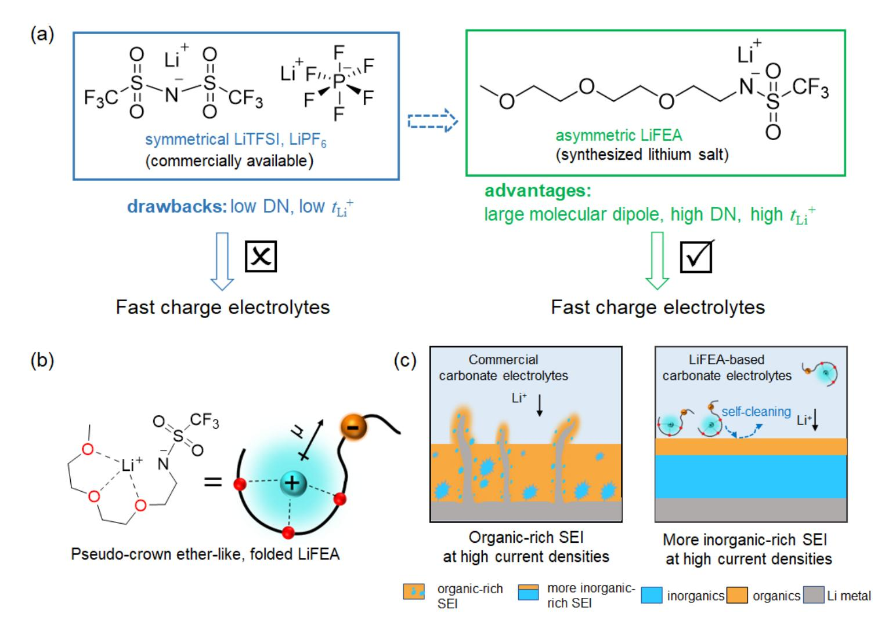
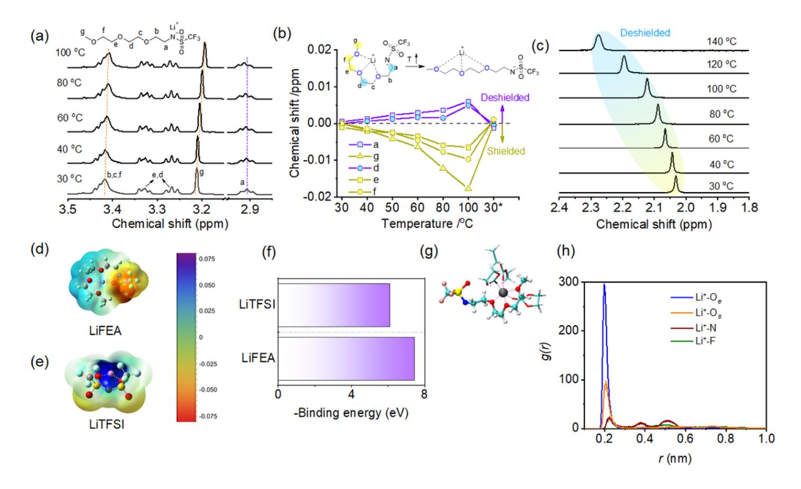
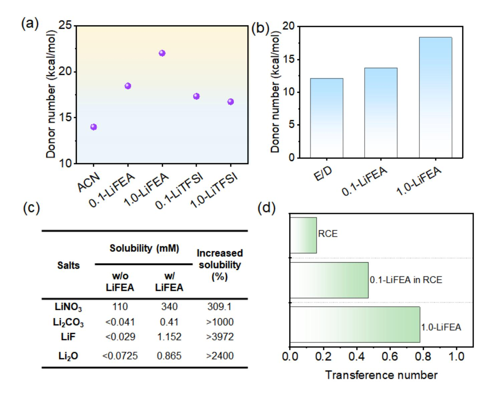
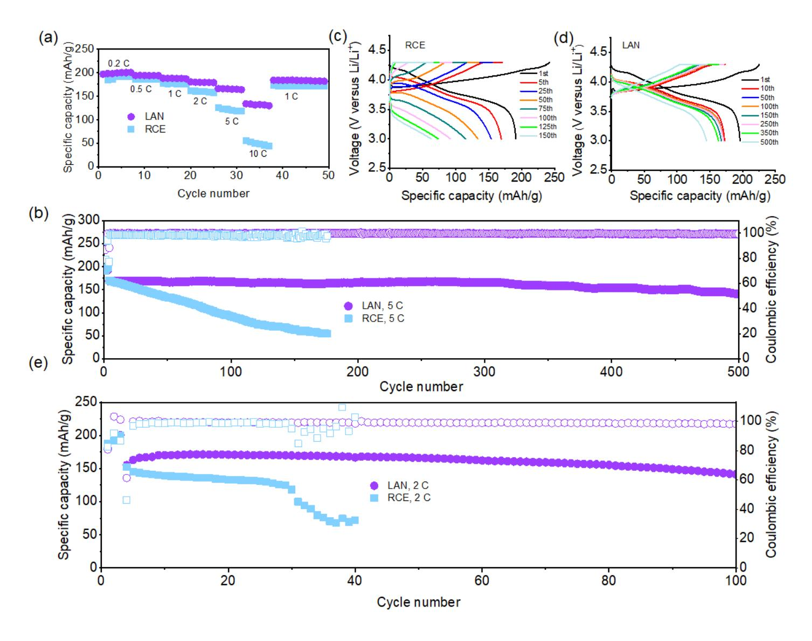
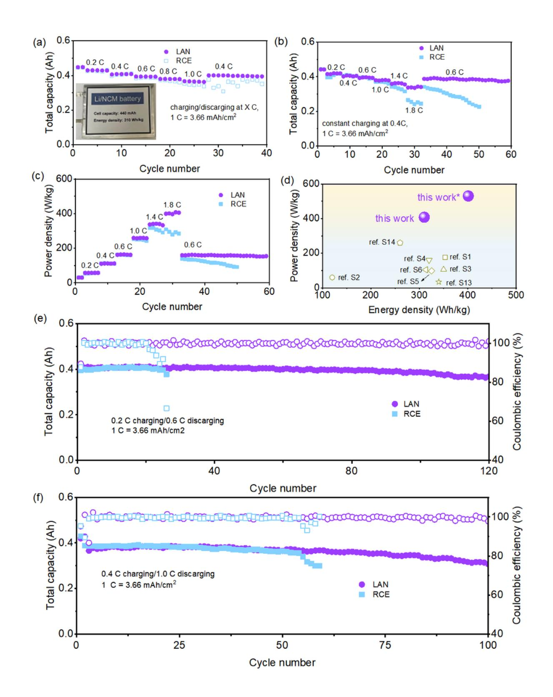
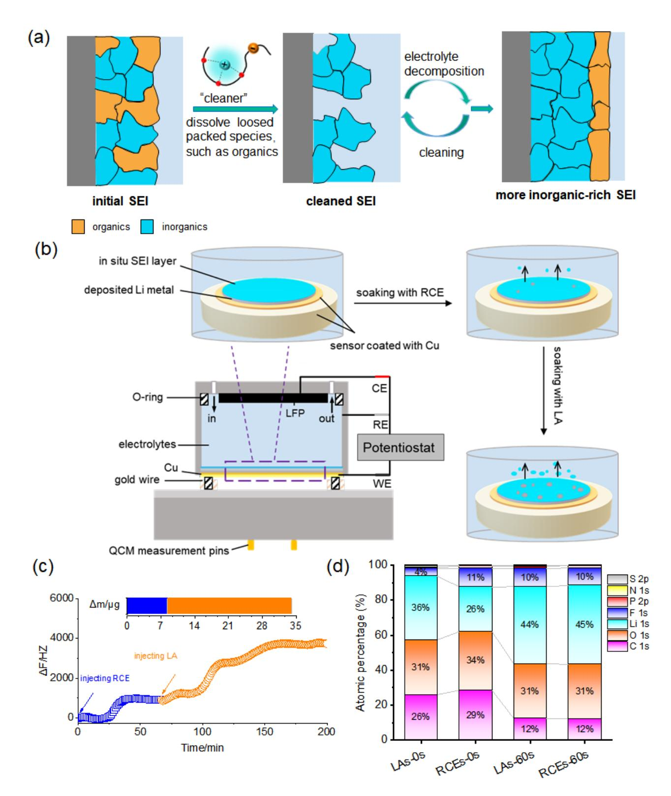
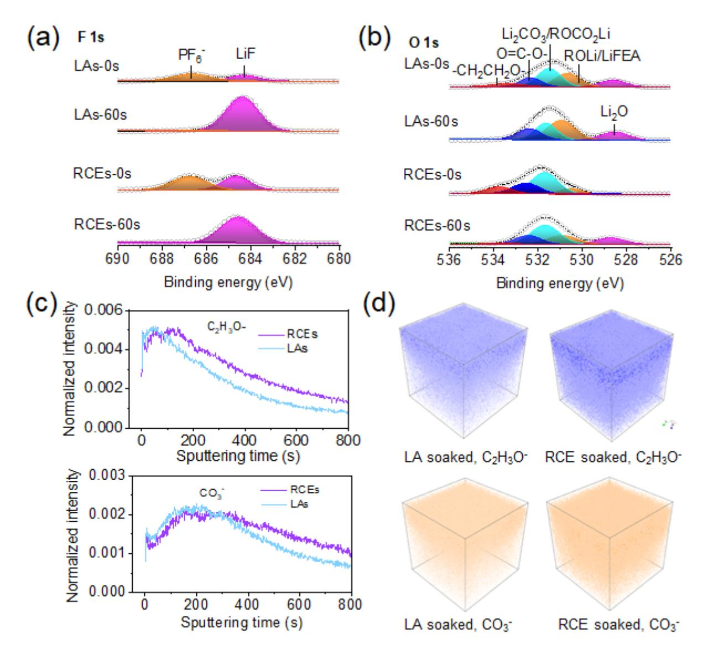
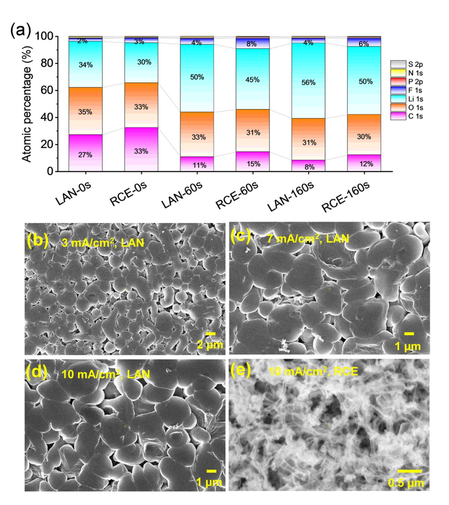

# Novel pseudo-crown ether-like lithium salt enabling fast charging/discharging high-energy lithium metal batteries

Yingchun Xia Tsinghua University Pan Zhou Tsinghua University Xian Kong South China University of Technology Jiekang Tian Tsinghua University Weili Zhang Tsinghua University Shuaishuai Yan Tsinghua University Wenhui Hou Tsinghua University Hangyu Zhou Tsinghua University Hao Dong China Xiaoxia Chen Tsinghua University Peican Wang Tsinghua University Ziang Xu Tsinghua University Lei Wan Tsinghua University Baoguo Wang Tsinghua University Kai Liu ( [liukai2019@tsinghua.edu.cn](mailto:liukai2019@tsinghua.edu.cn) ) Tsinghua University <https://orcid.org/0000-0003-3362-180X>

#### Article

Keywords:

Posted Date: May 19th, 2022

DOI: <https://doi.org/10.21203/rs.3.rs-1661769/v1>

License: This work is licensed under a Creative Commons Attribution 4.0 International License. Read Full [License](https://creativecommons.org/licenses/by/4.0/)

Version of Record: A version of this preprint was published at Nature Energy on June 22nd, 2023. See the published version at <https://doi.org/10.1038/s41560-023-01282-z>.

# **Abstract**

Conventional carbonate-based electrolytes defected all racers and became a dominant leader in the lithium-ion battery industry due to superior overall performance of preferable physical, chemical and electrochemical properties. However, carbonate-based electrolytes with high corrosion towards lithium (Li) metal result in massive dendrites growth and limited cycling life, thereby blocking their application in Li metal batteries (LMBs). This is particularly true for practical LMBs with high areal capacity (> 3.5 mAh/cm2), which generally requires a high areal current density (> 1 mA/cm2) for an acceptable, realistic charging rate. Herein, we design an asymmetric functional lithium salt, lithium 1,1,1-trifluoro-*N*-[2-[2-(2methoxy ethoxy)[ethy]] methanesulfonamide (LiFEA) that enables carbonate electrolytes with a large apparent donor number and transference number, thus leading to excellent compatibility with Li metal anodes even at high current densities. The unique pseudo-crown ether-like, folded molecular geometry endows its novel post-"self-cleaning" mechanism: the LiFEA could dissolve most undesirable organic species in the initial deposited solid electrolyte interphase (SEI) layer and gradually enrich the inorganic species. This self-cleaning behavior of LiFEA results in homogeneous and more inorganic-rich. ultrathin SEI layers (which also contributes to high-quality cathode electrolyte interphase) and, therefore, outstanding lithium metal battery performances. Advanced LiFEA-based carbonate electrolytes could achieve high-performance cyclability and fast charging/discharging performances for LMBs. Li||NCM811 half cells enabled 500 cycles with an 83.5% capacity retention for 5 C-cycling (i.e., 3 mA/cm2), and full cells allowed 100 cycles with 86.5% capacity retention for cycling under the high current density of 5.2 mA/cm2 (i.e., 2 C). Under realistic conditions, industrial LillNCM811 metal pouch cells achieve  $\sim$  310 Wh/kg (except taps and packing foil, 403 Wh/kg) for a cell-level energy density, enabling stable cycling up to 100 cycles under a high discharging current density of 3.66 mA/cm2 (i.e., 1 C) and yielding a recordhigh power density of ~ 408 W/kg (except taps and packing foil, 530 W/kg). Our designed functional lithium salt with a special molecular geometry for carbonate-based electrolytes enables a promising path to realistic LMBs with high energy and high discharging power densities.

# **Introduction**

Lithium-ion batteries (LIBs) have emerged as a standard rechargeable battery for dominant portable electronics and electric vehicles1, 2, 3, 4, 5, significantly changing our lifestyle6, 7, 8. As current LIBs with graphite are approaching their theoretical energy density limit, lithium (Li) metal batteries (LMBs) have attracted increasing attention due to an urgent demand for high energy density batteries. Li metal serves as an ideal alternative anode because of its high specific capacity of 3860 mAh/g, low electrochemical potential (i.e., -3.04 V versus standard hydrogen electrode), and compatibility with high-voltage insertiontype cathodes, thus potentially enabling LMBs with a desirably high specific energy9, 10, 11, 12. However, graphite replacement with Li metal is blocked by limited cycle life and safety concerns, resulting from Li metal/electrolyte side reactions and unstable or metastable solid-electrolyte interphase (SEI)13, 14 particularly for carbonate-based electrolytes. Recent work also revealed that substantial swelling happened to SEI on Li metal anode with carbonates due to more organic-rich components in the SEI

layer15. Commercial carbonate electrolytes (i.e., 1 M LiPF6 EC/DEC) exhibited the most significant swelling ratio and worst cycling performance among several electrolytes investigated. This organic-rich, low-quality SEI expedited the growth of Li dendrites. SEI cracking, and continuous decomposition of electrolytes and resulted in low coulombic efficiency. Although conventional carbonate-based electrolytes caused undesirable Li corrosion, carbonates are more favorable for the realistic application of LMBs owing to their mature manufacturing process and superior overall performance if parasitic reactions between Li metal and electrolyte were well inhibited by building a robust, high-quality SEI.

Li metal corrosion is directly associated with electrolyte formulations as the SEI protective layer on anodes results from initial chemical reactions of Li metal/electrolytes and repeated electrochemical reduction of electrolytes16, 17, 18, 19. Accordingly, electrolyte engineering is an economical and practical strategy to enhance cyclability. Up to date, various approaches have been proposed, not limited to mixing different commercial solvents/salts20, 21, 22, 23, optimizing the component ratio24, 25, combining multiple additives26, 27, developing novel liquefied gas electrolytes28, using (localized) high-concentration electrolytes29, 30, 31, and designing new solvents or salts1, 32. All these tactics follow a consensus that building inorganic-rich, high-quality SEIs coated on Li metal facilitates enhanced mechanical strength for SEI layers and uniform Li plating, thus boosting electrochemical performance. Although these mentioned techniques made significant achievements, the current improvements for LMBs are still far from the requirements of practical applications. Under practical conditions, LMBs are assembled with a highloading cathode active materials (> 3.5 mAh/cm2), limited Li excess, and cycle in lean electrolytes (< 3) q/Ah)33, which accelerates dendrite growth, electrolyte depletion and final cell failure, particularly at high operating current densities. Therefore, it is urgently demanding to develop new strategies to enrich the toolbox of building a robust, more-inorganic-rich, and uniform SEI layer against long cycling under these harsh practical conditions.

In this work, we synthesized an asymmetric functional lithium salt, lithium 1,1,1-trifluoro- $N$ -[2-[2-(2methoxy ethoxy)[ethyl] methanesulfonamide (LiFEA, Fig. 1a), which derived from commercialized lithium bis(trifluoromethanesulfonyl)imide (LiTFSI) by substituting a group of CF3SO2- with an ethylene glycol-based chain. Our designed LiFEA possesses an electron-withdrawing CF3SO2- group to promote Li+ dissociation away from the N atom and electron-donating ether moiety to bind with the migrated Li+, presenting a pseudo-crown ether-like binding geometry in commercial electrolytes (Fig. 1b). Unlike traditional lithium salts, although this functionalized salt enables Li+ with a binding site shift from N atom to ether domains, the dissociated Li ions are still captured by the pseudo-crown ether and the movement of the anions is largely suppressed under an electric force field. Thus, LiFEA is anticipated to have a higher Li+ transference number ( $t_i$ +). Its unique molecular geometry and large dipole moment enhance the solubility of some lithium salts (e.g., LiF,  $Li_2O$ , LiNO3). Surprisingly, we found that LiFEA is capable of dissolving the porous, bush-like, undesirable organic species in an initial SEI layer formed in commercial electrolytes. This novel "self-cleaning" mechanism finally facilitates the generation of a dense and uniform inorganic-rich SEI (Fig. 1c). Additionally, the LiFEA-based electrolytes also adapt to the cathode side, rendering an ultrathin, robust cathode electrolyte interphase (CEI) layer. With these outstanding merits, LiFEA-based carbonate electrolytes significantly improved the morphology of deposited Li metal, rate capability and long cyclability with Li||NCM811 batteries. Importantly, industrial lithium-metal pouch cells operating with LiFEA-based electrolytes achieved a high specific energy density of up to 310 Wh/kg (except taps and packing foil, 403 Wh/kg) and a record-high discharging power density of 408 W/kg (except taps and packing foil, 530 W/kg). Under fast-discharge conditions, the pouch cells maintained at capacity retentions of 81% after 100 cycles (condition: 0.4 C charging/1.0 C discharging, 1 C = 3.66 mA/cm2). The design of LiFEA provides new insight into enabling the SEI layer with more-inorganic-rich species in traditional carbonates electrolytes, improving the fastcharging/discharging capability, and prolonging the cycling lifetime of LMBs for practical applications. This novel "self-cleaning" mechanism endowed by the lithium salt with a unique geometry could shed light on new strategies for developing other functional lithium salts.

# **Molecular Design And Characterization**

Commercial lithium salts (e.g., LiPF6, LiTFSI) with symmetrical molecular geometry have high ionic conductivity but low  $t_i^+(t_i^+<0.3)$ . A large proportion of moved free anions contributes less to the charging capability of LMBs, conversely yielding concentration polarization to induce an impedance increase and dramatical capacity drop at the high operating current densities, particularly for carbonatedbased electrolytes34, 35 (Fig. 1a). To address these issues, we hypothesized an asymmetric, large molecular dipole lithium salt design by incorporating both an electron-withdrawing and electron-donating moieties into the integrity to heighten  $t_i^+$  and build a high-quality SEI/CEI layer. First, we maintained the CF3SO2- group with a strong electron-withdrawing ability36 for readily dissociating Li+ from N centers. Second, an ether backbone is introduced because of its distinct polarity with the electron-donating part and abilit37 to capture the dissociated Li+. This particular lithium salt showed an unreported "folded" molecular geometry, similar to the Li+ ion-crown ether supramolecular complex, endowing the LiFEA with a larger  $t_{Li}^+$ , molecular dipole moment and donor number due to the intramolecular "zwitterion" property. These particular properties were beneficial for the fast charging/discharging process of LMBs and the growth of preferred SEI/CEI layers. Although LiFEA is an unreported lithium salt, its facile, two-step synthesized procedure (see Methods) showed great potential for large-scale commercialization.

We first identified the product of LiFEA by multiple characterizations (Supplementary Figs.  $1-4$ ) after synthesis and then determined its physicochemical properties. The results showed that LiFEA has good thermal stability with a melting temperature of  $\sim$  131 °C and a decomposition temperature of  $\sim$  254 °C (Supplementary Fig. 5). Furtherly, variable-temperature nuclear magnetic resonance (VT-NMR) spectroscopy is taken to acquire its molecular structural information in the carbonate solvent (i.e., EC/DEC,  $v/v = 1:1$ ) (Fig. 2a-c). Both upfield- and downfield-shifted signals were observed in the LiFEA region of the 1H NMR spectrum upon heating (Fig. 2a). Downfield-shifted peaks of **a,d** indicated more deshielded hydrogen nuclei due to elevated temperature resulting in increased thermal motions as well as the lengthened distance38 between Li+ and O (Fig. 2b), which is consent with the tendency of Li signals (Fig. 2c). Unexpectedly, peaks ascribed to **g,e,f** protons showed an opposite change, upfield-shifted resonances, with the largest shift for  $\mathbf{g}$  proton. This reverse shift could be rationalized by the more flexible, that is, unfolded C-terminus part promoting more Li+ interacting with terminal oxygens and holding an overwhelming advantage over other conformations. By a sample cooling test, these changes in chemical shifts disappeared (Supplementary Fig. 6), disclosing molecular information as followed: (1) LiFEA emerges as a folded structure at room temperature, as shown in the inset of Fig. 2b, (2) with a heating/cooling treatment, LiFEA showed a reversible conformational change (Supplementary Fig. 6c). This temperature-responsive reversible conformation change demonstrates the noncovalent-bonding nature of the Li+-(pseudo) crown-ether "host-guest" interaction. Additionally, introducing Na+ as a competing cation would break its folding structure and enabled oxygens neighboring the C-terminus to bind with more metal ions (Supplementary Fig. 7), offering another powerful evidence of LiFEA with a pseudo-crown ether, folded structure due to intramolecular Li+ ion complexation.

To gain further information about the Li-O coordination of LiFEA, we probed the charge density distribution by calculating the electrostatic potential (ESP) from DFT calculations. Figure 2d,e show the electric potential at a surface with electron density isovalue of 0.0004 for LiFEA and LiTFSI, and a sharping difference occurred with their ESP near Li+ ion. In LiTFSI, the ESP near lithium is highly positive, demonstrating that the Li+ is not fully solvated by a single TFSI anion and part of the positive charges are still exposed. In LiFEA, however, the ESP near lithium is lower in magnitude, showing that a single FEA anion better coordinates the Li+ and the charge on Li+ ion is screened more efficiently. It is clear from the molecular structure that the better coordinating ability of FEA results from oxygens on its flexible ether chain, which can provide more binding sites. The binding energy between Li+ and FEA anion ( $\sim$ -7.45 eV) is higher in magnitude than between Li+ and TFSI anion (Fig. 2f), agreeing with ESP results. This strong Li-O coordination and high binding energy of LiFEA are inherent motivations for its folded structure in carbonate electrolytes and contribute to a relatively stable interaction between Li+ and ether domain.

Since the DFT calculations were done in a vacuum state, we conducted molecular dynamics (MD) simulations of 0.1 M LiFEA in EC/DEC ( $v/v = 1:1$ ) to further show that the coordination structure predicted by DFT calculations is relevant in bulk electrolytes. Figure 2g shows a representative snapshot of Li+ ion solvation structure with the most probable compositions in the first solvation shell by FEA, accompanied by other components in the solution such as EC or DEC. The ether oxygens from the ether chain  $(O_e)$ participate actively in the Li+ ion solvation, consistent with the results in DFT calculations. More detailed analysis shows that the oxygen atoms from the FEA head  $(O_s)$  also participate in the solvation, though slightly lower probability. Figure 2h shows the radial distribution functions between lithium and different atoms in the FEA. There are high peaks near 0.25 nm in the RDFs of both Li-Oe and Li-Os, corresponding to the first solvation shell of Li+ ions. Therefore, it shows that both  $O_e$  and  $O_s$  can contribute to the Li+ solvation, despite different extent.

# **Pseudo-crown Ether-like Molecular Geometry Enabling New Advantages**

LiFEA featuring a large molecular dipole moment and folded structure would inspire new advantages as an electrolyte component (Supplementary Fig. 8). To assess its donor ability, we tried to measure donor number (DN) for FEA anions following the standard 23Na NMR measurements39, 40, but strong binding interaction between ether domain and Na+ ion caused a broad peak and large error (Supplementary Fig. 9). Accordingly, we regarded LiFEA as integrity with solvent and determined the apparent DN of asprepared solutions (Fig. 3a,b, Supplementary Figs.  $10-17$ , and Supplementary Table 1). Either 0.1 M LiFEA or 1.0 M LiFEA enables higher DN values than the blank (i.e., acetonitrile, ACN), with their DNs approaching DME (DN = 20). Specifically, once 0.1 M LiFEA (note as, 0.1-LiFEA) was added to acetonitrile, the DN value increased from 14 to 18 kcal/mol, and its value further elevated to 22 kcal/mol in the presence of 1.0 M LiFEA. To exclude the interference from other factors, we still took LiTFSI as a control and found a negligible change in DN values with increasing salt concentration from 0.1 M LiTFSI (note as, 0.1-LiTFSI) to 1.0-LiTFSI. In a binary solvent system of EC and DEC, similar tendencies were observed, indicating that LiFEA could efficiently modulate DN, the electron-donating property of carbonate electrolytes, even with a low concentration of 0.1 M.

Electrolytes with high DN are expected to promote the solubility of lithium salts41, which is validated by a quantitative inductively coupled plasma-optical emission spectrometry (ICP-OES) analysis. Figure 3c depicts three typical lithium salts (i.e.,  $Li_2CO_3$ , LiF,  $Li_2O$ ) with particular low solubility in the carbonatebased solvent. In sharp contrast, they showed increased solubility up to at least 10  $\sim$  40 times with the help of 0.1-LiFEA. More importantly, the solubility of a well-known LiNO3 additive for improving Li metal performance was above 309% of its initial value in 0.1-LiFEA, which would enrich the formulation of LiFEA-based electrolytes. In addition to the high DN value and increased solubility, the new molecular geometry of LiFEA surprisingly created an outstandingly high  $t_i^+$  value of 0.78 (Fig. 3d and Supplementary Fig. 18). Despite LiPF6 owning a low  $t_i^{\dagger}$  in the commercial electrolyte, even introducing an additive-level, 0.1M LiFEA, effectively heightens the electrolyte's  $t_i^+$  value from 0.16 to 0.47 (Supplementary Figs. 19 and 20), endowing carbonate electrolytes with a potential, superior ratecapability.

# High-performance, Fast-charging Carbonate Electrolytes

Highlighted advantages arising from the unique geometry of LiFEA motivated us to assess electrochemical performances of LiFEA-based carbonate electrolytes by Li||NCM811 batteries. To systematically explore the role of LiFEA in carbonate electrolytes, we utilized three electrolytes for the battery cycling test: (1) commercial electrolyte, 1M LiPF6 in EC/DEC ( $v/v = 1:1$ ) as a reference carbonate electrolyte (note as RCE) that is widely used as a LIBs electrolyte; (2) reference electrolyte with 0.1-LiFEA (note as LA) that was used to figure out the effects of LiFEA itself on Li metal batteries; (3) LA electrolyte with LiNO3 additive (note as LAN) that aimed to evaluate the advanced performance of LiFEA-based

electrolytes. To exclude limitations from Li metal anode and NCM cathode, we used thick Li metals (a thickness of  $\sim$  450 µm) and moderate loading cathodes (active materials:  $\sim$ 3 mg/cm2) to evaluate the intrinsic battery performance of the designed electrolytes. All batteries exhibited a similar specific capacity during three formation cycles under 0.1 C rate ( $\sim$  200 mAh/g). For cells with LAN, the specific capacities were almost close to 200 mAh/g from subsequent cycles at 0.2 C to 0.5 C and lowed to  $\sim$  190 mAh/g at 1 C (Fig. 4a, Supplementary Fig. 21). In contrast, cells with RCE showed a slightly low specific capacity of  $\sim$  190 mAh/g from 0.2 C to 0.5 C, and  $\sim$  180 mAh/g at 1 C, resulting from low CE and increased overpotential. With an increase in the charge and discharge rate, the widening gap in the specific capacities between LAN and RCE is more and more evident. When cells with RCE cycled from 2 C to 5 C, the specific capacity decreased from  $\sim$  160 to 120 mAh/g, and a rapid capacity loss occurred at 10 C with a limited specific capacity of  $\sim$  50 mAh/g. In comparison, cells with LAN showed a superior discharge capacity of  $\sim$  180, 165 and 133 mAh/g at 2 C, 5 C and 10 C, respectively. These results clearly revealed that LAN endowed LMBs with both fast charge and discharge capability.

The excellent rate capability of LAN motivated us to test the cycling stability under a high charge/discharge current density (i.e., 2 C, 5 C, 1 C = 0.6 mA/cm2), which is generally thought to be a great challenge for preventing Li corrosion due to a speedy capacity fade of LillNCM batteries22 (Fig. 4b, Supplementary Fig. 22). The cell operating with RCE performed 54.2% capacity retention after 100 cycles at 5 C, caused by continuous capacity decreasing and a rise in cell overpotential during cycling (Fig. 4c). This can be attributed to the ongoing growth of SEI/CEI layers with inherent resistance. Even though the charge/discharge current density reduced to 2 C, the specific capacity still dropped abruptly, maintaining 79.1% capacity after 80 cycles (Supplementary Fig. 22). In sharp contrast, the cell with LAN enabled an extended cycle life and higher capacity retention under identical conditions. The cell operating at 2 C retained its 81.5% capacity for 480 cycles. During 5 C cycling, this electrolyte delivered a high specific capacity of 141.1 mAh/g at the 500th cycle and superior capacity retention of 83.5%, and effectively overcame the increased cell overpotential (Fig. 4b,d), validating that both the bulk electrolyte and SEI/CEI layers derived from LAN facilitated the Li+ transportation as compared to that of RCE (Supplementary Figs. 23 and 24, Supplementary Table 2). In addition, even if the cell operated with a lowered rate of 0.5 C, the LAN still held a high performance over long-term cycle stability and capacity retention (Supplementary Fig. 25). Undoubtedly, the giant difference in fast charging/discharging performance between LAN and RCE results from the intrinsic component of the formulation of electrolytes.

In order to fully explore the crucial component affecting fast charging/discharging behavior in the electrolyte formulation of LAN, we first assembled cells with LA to exclude the interference of LiNO3. In the absence of LiNO3, LA also enabled cells with a superb rate capability and fast charging/discharging properties at 2 C and 5 C beyond RCE (Supplementary Fig. 26), which is probably related to electrolytes with a high  $t_i^+$  and beneficial Li+ transport in both bulk electrolytes and electrode interfaces. On the other hand, we designed a control electrolyte to reveal the indispensable role of LiFEA for fast operation, in which diglyme (DGE) was taken to replace LiFEA and construct a LiNO3-based carbonate electrolyte due to its high solubility for LiNO3 and similar molecular structure with ether moiety of LiFEA42. However, cells with a control electrolyte (DGE-LN) showed a poor cyclability under 5 C rate (Supplementary Fig. 27), with only 80% capacity retention after 200 cycles, remarkably lower than LAN (83.5%, 500 cycles). These results validated that LiFEA salt was an essential component for the high-performance, fast charging/discharging electrolyte of LAN.

To mimic the practical application of batteries, we further evaluated the electrochemical performance of full cells with thin Li foils of 40 µm thickness and high-loading cathodes (2.6 mAh/cm2). LAN provided a high discharge capacity of  $\sim$  200 mAh/g during three formation cycles at 0.1 C, 97.3% capacity retention after 150 cycles at 1 C (1 C = 2.6 mA/cm2), and an outstanding average CE of  $> 99.1\%$  (Supplementary Fig. 28). Significantly, the battery life lasted 100 cycles with a capacity retention of 86.5% even under a higher current density of 2 C, 5.2 mA/cm2 (Fig. 4e), demonstrating the LAN capable of building robust SEI and CEI layers with fast transporting Li+. While batteries cycled in RCE failed rapidly after 30 cycles under these harsh testing conditions, their voltage curves revealed that these faded batteries continuously experienced the increasing overpotential caused by the degradation of electrolytes.

# Performance Of Industry-level Li Metal Pouch Cells

The superior rate performance and long cycle stability make LAN promising for Li metal practical batteries. Industry-level pouch cells were paired with thin Li foil (50 µm thickness, ~ 10 mAh/cm2) and high-loading NCM811 (~ 3.66 mAh/cm2), offering an N/P ratio of 2.7. To achieve high specific energy, we assembled pouch cells with lean electrolytes ( $E/C = 2.8$  g/Ah). All the pouch cells underwent two formation cycles at 0.1 C (i.e., 0.366 mA/cm2), yielding an initial specific energy density of 310 Wh/Kg (Fig. 5a). Except for the mass of taps and packing foil, an innate energy density for cells was up to  $\sim$  403 Wh/kg, which could be a valuable parameter for evaluating the energy density of larger size batteries. To determine a limited operating current density of our designed LAN, we first assessed performances of rate capacity with two different protocols: charging/discharging at the same C rate; constant charging at 1.46 mAh/cm2 but an increasing discharging rate. Under two different protocols, LAN presented excellent fast charging/discharging capability compared to RCE (Fig. 5a,b). For pouch cells cycled in RCE, a sudden capacity drop started with charging or discharging at 3.66 mA/cm2, and cells operated worse in following extended cycles. Surprisingly, LAN endowed pouch cells with superior cycling stability and high capacity even at the considerably large discharging current density of 1.8 C, i.e., 6.59 mA/cm2, and their corresponding power densities were shown in Fig. 5c. The maximum power density was calculated to be 408 W/kg (except taps and packing foil: 530 W/kg) at 1.8 C rate for LAN; contrastingly, RCE enabled a maximum value of 318 W/kg (except taps and packing foil: 414 W/kg) during cells cycling at 1.4 C, i.e., 5.12 mA/cm2. This power density of LAN is one of the largest among advanced Li metal cells (Fig. 5d, Supplementary Table 3).

Moreover, the long cycling stability of LAN was tested by pouch cells cycled under three conditions. As shown in Fig. 5e, cells delivered a total capacity of 400 mAh and maintained 90% capacity retention after 120 cycles at a slow charging rate of 0.2 C and fast discharging at 0.6 C rate (1 C = 3.66 mA/cm2). In

contrast, cells with the control electrolyte, RCE, only survived 25 cycles with an initial capacity of 394 mAh under identical conditions. The extending cycle life indicated that LAN contributed to fast Li+ transportation under stringent conditions. Under higher charging/discharging current densities, LAN still made a high reversible Li+ plating/stripping possible for pouch cells cycling at 1.46 mA/cm2 (i.e., 0.4 C) for charging and 2.93 mA/cm2 (i.e., 0.8 C) for discharging, with an 86% capacity retention after 100 cycles (Supplementary Fig. 29). To achieve special battery applications, we compared the fastdischarging capability of cells at a current density of 3.66/cm2 (i.e., 1.0 C) (Fig. 5f), and 81% capacity was preserved for LAN after 100 cycles, but an abrupt fade in both capacity and CE happened to RCE after ~ 50 cycles. These outstanding performance of fast operation enriched LAN as an advanced electrolyte for high-power-density electric devices.

### "Self-cleaning" of SEI layer by the LFEA electrolyte

We carried out systematic studies to find out the mechanism of LiFEA in enabling the batteries with impressive fast charging/discharging performances. As previously reported, a multitude of factors limited the fast charging/discharging behavior in batteries35, such as ionic conductivity of electrolytes, the structure and composition of SEI layers, and  $t_i^{\dagger}$ . Due to LiFEA with an additive-level amount in LA, an ignored shift in conductivity was confirmed by EIS spectra (Supplementary Fig. 30). SEI structure and composition are generally believed to correlate with the solubility of inorganic/organic lithium salts and oligomers and the rate of approaching their saturation limit17. Among these reduced/decomposed species,  $Li_2CO_3$ , LiF and  $Li_2O$  had been reported to be less soluble in carbonate electrolytes than organicbased species because of their larger lattice energies43, 44. Unexpectedly, LiFEA-based electrolytes with high-DN properties enhanced the solubility of these three representative lithium salts. Therefore, it is highly promising that the high-DN electrolytes are also able to boost the solubility of organic lithium salts and oligomers to a greater extent than the inorganics, e. g.,  $Li_2CO_3$ , LiF and  $Li_2O$ .

Considering that LiFEA possesses a unique, folded structure able to greatly increase the  $t_i$ + and boost the solubility of organic/inorganic salts species, we hypothesized that the particular geometry of LiFEA both improves the Li+ transport property in the bulk electrolytes and elevates the quality of SEI layers by altering the solubility of inorganic/organic lithium salts and oligomers (Fig. 6a), thus actuating a combined improvement in the battery performance. As the Li+ transport property in the bulk electrolytes has been described from the view of  $t_i^+$  to conductivity, we will not discuss it anymore in the following context and lay more attention on the mechanism of the dissolving ("cleaning") components from SEI layers.

In order to gain more insightful information, we combined quartz crystal microbalance analysis with electrochemical methods (in situ EC-QCM) to investigate mass variations of the SEI film soaked in different electrolytes45 (Supplementary Fig. 31). As the schematic diagram demonstrates (Fig. 6b), on the surface of Li metal deposited on Q-sensor grows in-situ pristine SEI. Once SEI components dissolve in electrolytes, Q-sensor will output a higher frequency record, which can be calculated into mass loss

according to a formula:  $\Delta m = -C\frac{\Delta f}{r}$ . Figure 6c exhibited shifts in frequency after refreshing RCE, and Q-sensor gradually accessed a balance stage within 40 min. During this recovering balance,  $\Delta f$  increased to 916.0 Hz, indicating that SEI film experienced a mass loss of 8.3 µg. Subsequently, LA was injected to exchange for the original, soaked electrolyte. Q-sensor underwent a remarkable frequency shift and took longer from the injecting timepoint to a steady balance stage. The mass of SEI film was decreased by 25.7 µg due to soaked LA, three times that of RCE (Fig. 6c inserted Figure). These distinct differences between SEI mass loss provided clear proof that LiFEA swept some components from the SEI layer.

X-ray photoelectron spectroscopy (XPS) analysis offered a deeper insight into the surface composition and spatial element distribution of SEI layers soaked with the LA or RCE. Figure 6d listed atomic ratios of SEIs in 0 and 60 s sputtering depth. SEI layer treated with LA contained higher Li content but slightly lower C, O and F atomic ratios on its surface than that of RCE, confirming organic, F-based species removed from SEI into the soaked LA. Considering that LiF mostly dominated F-based species in an SEI layer46, it is reasonable for this decreased F content because LiFEA contributed to dissolving some LiF. The dissolved organic-based species were proved to be - $(CH_2CH_2O)_{n-}$ , some organic carbonates (e.g.,  $ROCO2Li$ ) by comparing assigned peaks in O 1s and C 1s spectra22, 28, 47 (Fig. 7a,b, Supplementary Fig. 32). A quantitative comparison of these carbonate contents in SEI layers was shown in Supplementary Fig. 33, which makes the tendency of LiFEA "sweeping" organic lithium polycarbonates from the SEI layer more apparent.

More direct evidence for this differentiated SEI composition is provided by time-of-flight secondary-ion mass spectrometry (TOF-SIMS) (Fig. 7c,d, Supplementary Fig. 34). During sputtering, various secondary ion fragments were obtained, originating from the organics and inorganics of SEI layers. Among these signals, the  $C_2H_3O^-$  is generally from the - $(CH_2CH_2O)_n$ - and lithium ethylene mono-carbonate components (LEMC), and the  $CO_3^-$  commonly belongs to  $ROCO_2Li/Li_2CO_3$ . In the normalized TOF-SIMS depth profiles of  $C_2H_3O^-$ , the signal from SEI soaked with LA arrived at its maximum normalized intensity earlier than that of RCE and experienced a steep drop afterward (Fig. 7c). This indicates LiFEA enhancing the solubility of ether oligomers and LEMC components, consent with XPS results. The two depth profiles of  $CO_3^-$  fragments presented similar changes to those of  $C_2H_3O^-$  signals as the sputtering prolonged, and the SEI layer treated with LA showed a lower intensity of CO3- than that of RCE, verifying a carbonatecleaning process induced by LA. Visual 3D images revealed a majority of  $C_2H_3O^-$  and  $CO_3^-$  signals located in the outer layer of SEIs (Fig. 7d), with the SEI layer soaked in LA enabling weaker signals compared with that in RCE. This lowered signal intensity vividly showed that LiFEA could clean out more organic-species from the SEI layer and therefore, leaving more inorganic-rich components remaining in the SEI, especially in the inner layer.

# Sei Layer Compositions And Li Metal Morphology

We proposed the self-cleaning mechanism for LiFEA and validated it above by a series of ex-situ experiments with the help of EC-QCM, XPS and TOF-SIMS analyses. Next, we further studied the in-situ formed SEI layer to attest whether this self-cleaning concept adapted LiFEA-based electrolytes under a fast charge rate. Thus, we studied the components of SEI layers formed in LA, LAN and RCE by XPS analysis after 10 cycles at a high current density of 3 mA/cm2. Figure 8a and Supplementary Fig. 35 described the atomic ratios of selected elements on SEI layers at different depths. With increasing sputtering time, the C content representing organic species derived from electrolyte solvents gradually decreased while the inorganic components using Li element as an indicator significantly increased. The different compositions in their outer and inner layers agreed with the well-known "two-sublayer" SEI structure48. Specifically, LA endowed the SEI with an approximately equivalent C, higher F but lower O content from sputtering 0 s to 160 s compared to RCE (Supplementary Fig. 35), confirming that LA built up an inorganic-rich SEI layer. In detailed and fitted O 1s spectra, fewer and fewer ROCO2Li/Li2CO3 components were detected at the sputtering time of 0 s to 60 s. Few - $CH_2CH_2O_7$ , O = C-O- organic species were observed in the SEI layer after sputtering for 160 s (Supplementary Fig. 36), in accord with XPS and TOF-SIMs results of the former soaked experiments that LA was capable of sweeping the organic species in SEI layers. Additionally, more and more LiF occurred in the F 1s spectra of SEI layer as sputtering time prolonged, validating that LiFEA facilitated an SEI structure with more abundant, dense inorganic components in the inside layer (Supplementary Fig. 36). To rule out the interference of LiFEA decomposition for SEI composition changes, we revisited the atomic ratios of selected elements, especially those representing LiFEA chemical information. In Supplementary Fig. 35, we observed neglected N, and S signals derived from decomposed LiFEA, excluding the decomposition of LiFEA. All these results did confirm LiFEA capability of cleaning trace organic species (e.g.,  $-(CH2CH2O)n$ , O = C-O-, ROCO2Li) and some inorganic species in the early stages of SEI formation, and thus a delay in organic deposition on the Li anodes enabled a more inorganic component in the inner SEI and a thin organic layer in the outside SEI. The preferable cleaning strategy induced by LA had great potential in regulating the spatial distribution of inorganics and organics in real-time during the formation of SEI layers.

Thus, in the advanced electrolyte of LAN, LiFEA doubtlessly served two critical functions: boosting the solubility of LiNO3 in ester electrolytes and cleaning the undesirable organics in the SEI layer at its earlier forming stage, which introduced favorable components and structures for SEI. The related SEI possessed the lowest C atomic ratios and highest contents of Li among those of RCE and LA electrolytes (Fig. 8a), indicating that a more robust, compacted inorganic-rich layer was successfully established. Due to the cooperation between self-cleaning LiFEA and beneficial LiNO3 additive, LAN promoted SEI layers with weaker signals of organic species and considerably stronger Li2O peaks than those of SEIs formed in either LA or RCE at each depth (Supplementary Fig. 37), endowing the SEI layer with an enhanced mechanic property and improved Li-ion diffusion kinetics49. Evenly distributed F-species below the surface, and N-containing reductive products, resulted in a homogeneous SEI layer with further higher Li+ transport46 (Supplementary Fig. 38), which is in line with the excellent rate performance and cycle stability of LAN at high charging/discharging current densities.

Dendrite growth on lithium metal anodes is critical for the capacity loss and short circuit in LMBs, especially with higher charging/discharging current densities and prolonged cycling10. It is reported that the quality of SEI layers, including heterogeneity and mechanical instability, generally cause uneven Li+ ion flux and probably result in Li dendrites growth18. In order to investigate the morphological evolution of Li metal in different electrolytes, we took ex-situ scanning electron microscopy (SEM) to observe the electrodeposited Li on Cu foils from a top view. Instead of growing into dendrites in RCE, granular Li metal particles uniformly distributed on Cu substrates in the presence of LiFEA-based electrolytes due to their SEI layers with inorganic-rich components (Fig. 8b-d, Supplementary Fig. 39). In detail, the compact aggregates of Li particles in LAN showed an immensely larger size than the other two electrolytes under a current density of 3 mA/cm2 (Fig. 8b). With an increasing deposition current density, this Li morphology evolved into densely packed spherical Li with a diameter of about  $\sim$  3  $\mu$ m. Interestingly, such Li deposited shapes well remained even until the current density increased to as high as 10 mA/cm2 (Fig. 8d). an unprecedentedly high current density for carbonate-based electrolytes. In great contrast, the dendrites transformed into fibrous Li with a highly porous structure for RCE (Fig. 8e). This denser Li deposition under high current densities demonstrated that more robust, inorganic-rich layers with preferable components did allow less exposure of fresh electrolyte to the bulk Li and more uniformly Li+ plating/stripping process, rendering a reversible Li deposition with an enhanced coulombic efficiency (Supplementary Fig. 40). The Li-Li symmetric cells worked with LAN maintained lower overpotentials and longer cycling stabilities at a high current density of 1 mA/cm2 and areal capacity of 1 mAh/cm2 (Supplementary Fig. 41); by contrast, RCE cells showed a vast increase in overpotentials and shorter cycling life under identical cycling conditions (Supplementary Fig. 42). It is well-known that high practical current densities and high area capacities are formidable challenges for designing and developing highenergy/power density LMBs. Accordingly, we operated Li-Li symmetric cells under harsher cycling conditions (2 mA/cm2, 2 mAh/cm2; 3 mA/cm2, 3 mAh/cm2). LAN achieved stable plating/stripping performance, lower overpotentials, and longer cycling than RCE. Both desirable Li deposition morphologies and excellent cycling stability under high current densities supported that LAN could enable a high-performance Li metal anode by its merit of self-cleaning ability. In addition to stabilizing the Li metal anode, LiFEA electrolytes also contributed to stabilizing the NCM811 cathodes by ultrathin, robust CEI layers (see detailed discussion in Supplementary Information), which ensures the fastcharging/discharging capability for Li||NCM practical batteries.

# **Conclusion**

In this work, we reported a novel pseudo-crown ether-like functional lithium salt, LiFEA, for fast charging/discharging practical LMBs. The LiFEA with a unique molecular geometry induces a large dipole moment, high DN and  $t_i$ + in carbonate solvents. Moreover, the LiFEA was prone to dissolve undesirable organic species in an initial SEI layer formed in commercial electrolytes, leading to the gradual enrichment of inorganic species in the final SEI. This novel post-"self-cleaning" mechanism finally facilitates the generation of a dense and uniform inorganic-rich SEI, which could also adapt to the cathode side (CEI layer). The advanced carbonate-based electrolytes enabled an excellent rate capability and long cyclability for the high-voltage Li metal batteries. The industrial lithium-metal pouch cells showed a record-high discharging power density of 408 W/kg (except taps and packing foil, 530 W/kg) under lean electrolytes. Under fast charging/discharging conditions, the industry-pouch cells maintained capacity retentions of 81% after 100 cycles (cycling condition, charging at 1.46 mA/cm2 and discharging at 3.66 mA/cm2, 1 C = 3.66 mA/cm2), which has rarely been reported. Our work emphasized the relationship between the intramolecular supra-structure of lithium salt and the desirable physicochemical properties (i.e., large molecular dipole moment, high DN and  $t_i^{\dagger}$ ), which results in the novel self-cleaning mechanism of LiFEA for SEI layers. We highlight the importance of "intramolecular interaction" of electrolyte molecules, which was yet less studied for liquid electrolytes and LMBs. The designed LiFEA paves a new approach to enable traditional carbonates electrolytes with a fast-charging/discharging capability for practical LMBs applications.

# **Methods**

**Materials.** 2-[2-(2-Methoxyethoxy)ethoxylethylamine and trifluoromethanesulfonic anhydride were purchased from Meryer. Triethylamine and lithium hydride were obtained from Shanghai Titan and Energy-chemical, respectively. Dichloromethane (water < 50 ppm), acetonitrile (anhydrous), and diethyl ether were purchased from InnoChem or Beijing Lanyi. All chemicals were used as received. Battery-grade lithium salts (i.e., LiPF6, LiTFSI, LiNO3), commercial electrolytes, organic solvents along with NCM811 particles were purchased from Nanjing Mojiesi Energy Technology or DodoChem. 2032-type coin cells with Celegard 2325/25 µm separator were provided by Guangdong Canrd New Energy. Metallic Li was purchased from China Energy Lithium. Industry-level Li||NCM811 pouch cells were purchased from Hunan Li-Fun Technology. For the home-made NCM811 cathode sheets, they were prepared by mixing NCM811 particles, super-P and PVDF with a mass ratio of 8:1:1, and dried under vacuum overnight.

**Syntheses.** LiFEA was synthesized by a two-step procedure: sulfonation of amines and deprotonation of the resulting sulfonimides with lithium hydride50.

Synthesis of HFEA: To a round-bottom flask, 2-[2-(2-methoxyethoxy)ethoxy]ethylamine were first placed and then added 150 mL anhydrous dichloromethane. After stirring the mixture for 30 min, 1.3 equiv. triethylamine was injected into the above solution and followed by transferring the flask into a cooling system (~-80 °C). Finally, trifluoromethanesulfonic anhydride (1.01 equiv.) was dropwise added into the cooling mixture and kept stirring for 2 hours. The solvents were removed under vacuum, and the residue was dissolved by concentrated NaOH aqueous, extracted by products by dichloromethane and neutralized by hydrochloric acid. The target product was obtained after extracting with dichloromethane and drying under vacuum. Yield: 70%. Corresponding characterization was listed in Supplementary Figs. 43–45.

Synthesis of LiFEA: In a 250-mL round-bottom flask, the obtained HFEA was dissolved by anhydrous acetonitrile. The flask was then transferred to an ice-water bath and maintained cooling for 30 min. Lithium hydride was slowly added into the mixture under a moderate stirring. Four hours later, the icewater bath was removed and kept the reaction for 1 day. During its early stage, pay more attention to the produced hydrogen gas with flammability and explosion-proneness as well as the increased pressure in flask! After reaction ended, the crude product was attained by filtering the suspension and dried the resultant filtrate under vacuum. The purified LiFEA was crystalized in diethyl ether at low temperature. Yield: 81%. Corresponding characterization was listed in Supplementary Figs. 1–4.

Electrolytes. LiPF6 (152 mg) was dissolved in 1 mL EC/DEC (v/v = 1:1) to obtain the reference carbonate electrolyte of RCE, 1 M LiPF6 in EC/DEC (v/v = 1:1). The electrolyte of LA was prepared as followed: (1) dissolving LiFEA (30 mg) in 1 mL EC/DEC (v/v = 1:1) to obtain 0.1 M LiFEA EC/DEC (0.1-LiFEA); (2) adding 152 mg LiPF6 into the 0.1-LiFEA. For the advanced LiFEA-based electrolyte, LiNO3 additive (7 mg) was dispersed into 0.1-LiFEA (1 mL), and 152 mg LiPF6 was subsequently added to obtain LAN. The control electrolyte of DGE-LN was prepared by dissolving 152 mg LiPF6 into saturated solution of 0.1 M diglyme and LiNO3 in EC/DEC (v/v = 1:1). All the electrolytes were prepared inside an argon-filled glove box (O2 < 0.1 ppm, H2O < 0.1ppm) at room temperature.

Theoretical simulations. The ESPs and molecular dipoles of LiFEA and LiTFSI were calculated by densityfunctional theory (DFT) simulation with the Gaussian 16 package. All DFT calculations were conducted at the B3LYP/6-311 + + g(d,p) level. The binding energy between Li + and anion was calculated as the difference between the energy of ion complexes and the energy of isolated ions.

Molecular dynamics (MD) simulations were operated with Gromacs 2021.3. The molar ratios of solvent and lithium salt were set at an experimental condition of 0.1 M LiFEA EC/DEC (v/v = 1:1). Molecules and ions were described by the Optimized Potentials for Liquid Simulations All atom force field. Partial charges were determined by fitting molecular ESP obtained in DFT calculations. The simulation boxes were cubic with a side length of about 5.3 nm. The simulations were carried out at 300 K and 1 bar. Li + solvation structures were analyzed with Visual Molecular Dynamics.

Material characterizations. Nuclear magnetic resonance (NMR) spectra were recorded on a Bruker Avance III HD 400 or JEOL ECS-400 NMR spectrometer. All the NMR samples were measured at room temperature unless otherwise specified. The Li deposited morphologies under different current densities were characterized by a Zeiss Merlin scanning electron microscope (SEM). The JEM-2100 Plus transmission electron microscope (TEM) at an accelerating voltage of 200 kV were taken to characterize CEI layers coating on cathode NCM811 particles. X-ray photoelectron spectrometer (XPS) was applied to analyze chemical composition of SEI layers, and the XPS spectra were acquired on a Thermo Fisher Scientific ESCALAB Xi, with a sputtering rate of 30 nm/min (calibrated by SiO2 /Si). To confirm the swept organics in soaked experiments, we analyzed the processed SEI layers by TOF-SIMS5 (ION-TOF-GmbH). TOF-SIMS spectra and ion images were collected by using Bi 3+ ion beam accelerated at 30 keV and Cs + accelerated at 1 k eV. The analyzing area was 100 µm × 100 µm and the sputtering rate was controlled at 0.19 nm/s for SO2 .

**Quartz crystal microbalance (QCM) analysis.** QCM analysis was applied to track the mass variation of a formed SEI layer during immersing in the electrolytes of RCE or LA. QCM measurements were conducted by using a QSense Explorer (Biolin Scientific AB, Sweden) with copper-coated quartz crystal sensor chips (QSX 313, Biolin Scientific AB, Sweden). The sensor coated with Cu film acted as a working electrode (WE). LiFePO4 sheet worked as a counter electrode (CE) and reference electrode (RE), which provided Li+ sources for in-situ forming SEI layer on the deposited Li metal. Before QCM measurement, the SEI layer was generated by an extra Li electrodeposition process, with a current of 0.05 mA for 30 min.

**Electrochemical measurements.** All the electrochemical tests were used 2032-type coin-cell assembled with a Celegard 2325 separator or pouch-cell configurations, which were prepared in the glove box. The Li+ transference number was measured by the Bruce and Vincent method34, and the polarization voltage was set at 10 mV for LillLi cells. Electrochemical impedance spectroscopy (EIS) was investigated by Princeton electrochemical workstation at a frequency ranging from 0.1 HZ to 100 kHZ. The charging/discharging process of coin cells and pouch cells were recorded on a LANHE CT3001A battery testing station under room temperature. For the Li||Cu cells, the diameter of Cu foil and Li metal was controlled at 16 mm and 12 mm, respectively. The Li||NCM811 half cells were assembled with 450 µmthickness Li metals as anode and  $\sim$  0.6 mAh/cm2 NCM811 sheets as cathode. For the NCM811 full cells, a 40 µm-thickness Li foil paired with a high active material mass loading cathode of  $\sim$  2.6 mA/cm2. The LillNCM811 coin and pouch cells were cycled at a constant-current-constant-voltage model. Specifically, the cells were charged to 4.3 V and then kept the voltage until the charging current lowered to 0.1 C (pouch cells, one half cycling current). All pouch cells proceeded with a two-cycle formation and degassing before the cycling tests.

# **Declarations**

## **Acknowledgements**

This work was supported by the National Nature Science Fund of China (grant no. 22071133), the Tsinghua University-China Petrochemical Corporation Joint Institute for Green Chemical Engineering (421120), Tsinghua-Foshan Innovation Special Fund (TFISF) (2020THFS0130), Recruitment Program of Guangdong (grant no. 2016ZT06C322) and China Postdoctoral Science Foundation (grant no. 2021M701872). Thank Chong Guo, Zhanping Li from Analysis Center, Tsinghua University for analyzing TOF-SIMs data, Yong Li from State Key Laboratory of Space Power-Sources Technology, Shanghai Institute of Space Power Sources for helpful discussion, and Chunyu Cui from Chemistry & Chemical Engineering, Hunan University for discussing electrochemical measurements. All the authors thank Prof. Baoquo Wang for helpful discussions, and Jingbo Fang (Tsinghua University) and Biolin Scientific AB for QCM experiments and data analysis.

## Author contributions

Y. X. and K. L. conceived the idea and designed the experiments. Y. X., P. Z., X. K., J. T., W. Z., S. Y., H. H., H. Z., Z. X. and L. W. carried out the experiments and measurements. D. H., X. C., P. W. and B. W. helped with discussion. Y. X., X. K. and K. L. analyzed data and prepared the manuscript with contributions from all authors.

#### Competing interests

The authors declare no competing interests.

### Additional information

Supplementary information is available for this paper, including relevant content and Supplementary Figs. 1-45 and Supplementary Tables 1-3.

# References

- 1. Qiao, L. et al. Stable non-corrosive sulfonimide salt for 4-V-class lithium metal batteries. Nat. Mater. 21, 455–462 (2022).
- 2. Park, S. et al. Replacing conventional battery electrolyte additives with dioxolone derivatives for highenergy-density lithium-ion batteries. Nat. Commun. 12, 838–849 (2021).
- 3. Yu, Z. et al. Rational solvent molecule tuning for high-performance lithium metal battery electrolytes. Nat. Energy 7, 94–106 (2022).
- 4. Chen, Q. et al. Vertically aligned MXene nanosheet arrays for high-rate lithium metal anodes. Adv. Energy Mater. 2200072 (2022).
- 5. Wang, J. et al. Multi-shelled metal oxides prepared via an anion-adsorption mechanism for lithiumion batteries. Nat. Energy 1, 16050 (2016).
- 6. Liu, J. et al. Pathways for practical high-energy long-cycling lithium metal batteries. Nat. Energy 4, 180–186 (2019).
- 7. Yu, Z. et al. Molecular design for electrolyte solvents enabling energy-dense and long-cycling lithium metal batteries. Nat. Energy 5, 526–533 (2020).
- 8. Wang, J. et al. Improving cyclability of Li metal batteries at elevated temperatures and its origin revealed by cryo-electron microscopy. Nat Energy 4, 664–670 (2019).
- 9. Biswal, P. et al. The early-stage growth and reversibility of Li electrodeposition in Br-rich electrolytes. Proc. Natl. Acad. Sci. U. S. A. 118, e2012071118 (2021).
- 10. Li, S. et al. A robust all-organic protective layer towards ultrahigh-rate and large-capacity Li metal anodes. Nat. Nanotechnol. (2022). doi.org/10.1038/s41565-022-01107-2.
- 11. Yang, Z. et al. Single-atom reversible lithiophilic sites toward stable lithium anodes. Adv. Energy Mater. 12, 2103368 (2022).
- 12. Holoubek, J. et al. An all-fluorinated ester electrolyte for stable high-voltage Li metal batteries capable of ultra-low-temperature operation. ACS Energy Lett. 5, 1438–1447 (2020).

- 13. Niu, C. et al. Self-smoothing anode for achieving high-energy lithium metal batteries under realistic conditions. Nat. Nanotechnol. 14, 594–601 (2019).
- 14. Holoubek, J. et al. Tailoring electrolyte solvation for Li metal batteries cycled at ultra-low temperature. Nat. Energy 6, 303–313 (2021).
- 15. Zhang, Z. et al. Capturing the swelling of solid-electrolyte interphase in lithium metal batteries. Science 375, 66–70 (2022).
- 16. Xiao, J. et al. Understanding and applying coulombic efficiency in lithium metal batteries. Nat. Energy 5, 561–568 (2020).
- 17. Kim, M. S. et al. Suspension electrolyte with modified Li + solvation environment for lithium metal batteries. Nat. Mater. 21, 445–454 (2022).
- 18. Cheng, X.-B., Zhang, R., Zhao, C.-Z. & Zhang, Q. Toward safe lithium metal anode in rechargeable batteries: a review. Chem. Rev. 117, 10403–10473 (2017).
- 19. Liu, Y. et al. Self-assembled monolayers direct a LiF-rich interphase toward long-life lithium metal batteries. Science 375, 739–745 (2022).
- 20. Fan, X. et al. Non-flammable electrolyte enables Li-metal batteries with aggressive cathode chemistries. Nat. Nanotechnol. 13, 715–722 (2018).
- 21. Zhang, X.-Q. et al. Regulating anions in the solvation sheath of lithium ions for stable lithium metal batteries. ACS Energy Lett. 4, 411–416 (2019).
- 22. Zheng, J. et al. Electrolyte additive enabled fast charging and stable cycling lithium metal batteries. Nat. Energy 2, 17012 (2017).
- 23. Chen, X. et al. Supramolecular "flame-retardant" electrolyte enables safe and stable cycling of lithium-ion batteries. Energy Storage Mater. 45, 182–190 (2022).
- 24. Wang, H. et al. Dual-solvent Li-ion solvation enables high-performance Li-metal batteries. Adv. Mater. 33, 2008619 (2021).
- 25. Su, C. C. et al. Solvation rule for solid-electrolyte interphase enabler in lithium-metal batteries. Angew. Chem. Int. Ed. 59, 18229–18233 (2020).
- 26. Zhang, W. et al. Engineering a passivating electric double layer for high performance lithium metal batteries. Nat. Commun. 13, 2029–2040 (2022).
- 27. Dong, H. et al. A thermoresponsive composite separator loaded with paraffin@SiO2 microparticles for safe and stable lithium batteries. J. Energy Chem. 62, 423–430 (2021).
- 28. Rustomji Cyrus, S. et al. Liquefied gas electrolytes for electrochemical energy storage devices. Science 356, eaal4263 (2017).
- 29. Yamada, Y. et al. Advances and issues in developing salt-concentrated battery electrolytes. Nat. Energy 4, 269–280 (2019).
- 30. Ren, X. et al. Enabling high-voltage lithium-metal batteries under practical conditions. Joule 3, 1662– 1676 (2019).

- 31. Fan, X. et al. Highly fluorinated interphases enable high-voltage Li-metal batteries. Chem 4, 174–185 (2018).
- 32. Amanchukwu, C. V. et al. A new class of ionically conducting fluorinated ether electrolytes with high electrochemical stability. J. Am. Chem. Soc. 142, 7393–7403 (2020).
- 33. Xue, W. et al. Ultra-high-voltage Ni-rich layered cathodes in practical Li metal batteries enabled by a sulfonamide-based electrolyte. Nat. Energy 6, 495–505 (2021).
- 34. Diederichsen, K. M., McShane, E. J. & McCloskey, B. D. Promising routes to a high Li + transference number electrolyte for lithium ion batteries. ACS Energy Lett. 2, 2563–2575 (2017).
- 35. Liu, Y., Zhu, Y. & Cui, Y. Challenges and opportunities towards fast-charging battery materials. Nat. Energy 4, 540–550 (2019).
- 36. Kakiuchi, F. et al. Ruthenium-catalyzed functionalization of aryl carbon oxygen bonds in aromatic ethers with organoboron compounds. J. Am. Chem. Soc. 126, 2706–2707 (2004).
- 37. Nakatsuji, Y. et al. Molecular design of the electron-donating sidearm of lariat ethers: effective coordination of the quinoline moiety in complexation toward alkali-metal cations. J. Am. Chem. Soc. 110, 531–538 (1988).
- 38. Baxter, N. J. & Williamson, M. P. Temperature dependence of 1H chemical shifts in proteins. J. Biomol. NMR 9, 359–369 (1997).
- 39. Schmeisser, M. et al. Gutmann Donor and Acceptor Numbers for Ionic Liquids. Chem. Eur. J. 18, 10969–10982 (2012).
- 40. Johnson, L. et al. The role of LiO2 solubility in O2 reduction in aprotic solvents and its consequences for Li-O2 batteries. Nat. Chem. 6, 1091–1099 (2014).
- 41. Baek, M., Shin, H., Char, K. & Choi, J. W. New high donor electrolyte for lithium–sulfur batteries. Adv. Mater. 32, 2005022 (2020).
- 42. Rodriguez, R. et al. Separator-free and concentrated LiNO3 electrolyte cells enable uniform lithium electrodeposition. J. Mater. Chem. A 8, 3999–4006 (2020).
- 43. Shanmukaraj, D. et al. Boron esters as tunable anion carriers for non-aqueous batteries electrochemistry. J. Am. Chem. Soc. 132, 3055–3062 (2010).
- 44. Tasaki, K. et al. Solubility of lithium salts formed on the lithium-ion battery negative electrode surface in organic solvents. J. Electrochem. Soc. 156, A1019-A1027 (2009).
- 45. Ji, Y. et al. From bulk to interface: electrochemical phenomena and mechanism studies in batteries via electrochemical quartz crystal microbalance. Chem. Soc. Rev. 50, 10743–10763 (2021).
- 46. Liu, Y. et al. Solubility-mediated sustained release enabling nitrate additive in carbonate electrolytes for stable lithium metal anode. Nat. Commun. 9, 3656–3665 (2018).
- 47. Jin, C. et al. Rejuvenating dead lithium supply in lithium metal anodes by iodine redox. Nat. Energy 6, 378–387 (2021).
- 48. Cao, X. et al. Monolithic solid–electrolyte interphases formed in fluorinated orthoformate-based electrolytes minimize Li depletion and pulverization. Nat. Energy 4, 796–805 (2019).

- 49. Liu, S. et al. An inorganic-rich solid electrolyte interphase for advanced lithium-metal batteries in carbonate electrolytes. Angew. Chem. Int. Ed. 60, 3661–3671 (2021).
- 50. Dillon, R. E. A. & Shriver, D. F. Thermal and complex impedance analysis of amorphous and crystalline lithium salt mixtures. Solid State Ionics 140, 375–380 (2001).

## Figure 1

Design principle of LiFEA. a, Chemical structures and drawbacks/advantages of commercial, symmetrical lithium salts and our synthesized LiFEA. b, LiFEA presenting a pseudo-crown ether-like, folded structure in carbonate electrolytes. c, LiFEA-based electrolytes enabling a more inorganic-rich SEI layer and dendrite-free Li deposition in comparison with commercial carbonate electrolytes.

Experimental and theoretical study on pseudo-crown ether-like, folded structure of LiFEA. a-c, VT-NMR spectra for varied geometry of LiFEA upon heating: (a) stacked 1H NMR, (b) changed chemical shifts of typical peaks based on the chemical shifts at 30 ℃, (c) stacked 7Li NMR. NMR sample tube was equipped with a coaxial tube for DMSO-d6 . d-f, DFT calculations for LiFEA: ESP distribution of LiFEA (d) and LiTFSI (e); binding energy between Li + and anion part for LiFEA and LiTFSI (f). g,h, Solvation structure of LiFEA in EC/DEC (v/v=1:1): the most probable solvated structure of LiFEA (g), radial distribution of functions of Li + and investigated atoms (h).

Physiochemical properties of LiFEA and LiFEA-based electrolytes. a,b, Determination of apparent donor number: LiFEA dissolved in ACN (a), and binary solvent of EC/DEC (v/v = 1:1) (b). c, Comparison the solubility of lithium salts in the presence and absence of LiFEA in carbonate solvents. d, LiFEA-mediated high Li + transference number for carbonate solvents. RCE, 1 M LiPF6 EC/DEC (v/v = 1:1); 1.0-LiFEA 1.0 M LiFEA in EC/DEC (v/v = 1:1).

Electrochemical performance of Li||NCM811 batteries. a,b, Rate performance and long-term cycling with RCE and LAN. c,d, Typical charge/discharge curves as a function of cycle number using electrolytes of RCE and LAN. The cells were charged and discharged between 3 and 4.3 V at a rate of 5 C (i.e., 3 mA/cm2 ). e, Full cell with thin lithium films and high loading NCM811 active materials at a constant charging/discharging current density of ~5.2 mA/cm2 (i.e., 2 C) after three formation cycles at 0.1 C.

Performance of Li||NCM811 pouch cells under the realistic stringent conditions. a,b, Rate performance: charging/discharging at a constant current density (a); charging at constant 0.4 C rate but discharging at an increasing C rate. Inserted: an image of the pouch cell. c, Power density under different discharging rate. d, Comparison of a cell-level energy density and power density with state-of-the-art electrolytes/strategies. Ref. Sx represents Supplementary reference x. The star indicates an energy

density and power density without counting the mass of taps and packing foil. e, Long cycle stability at a 0.2 C charge and 0.6 C discharge. f, Fast charging/discharging performance at a 0.4 C charge but 1.0 C discharge.

Figure 6

LiFEA "self-cleaning" concept and results of EC-QCM experiments for SEIs. a, A proposal "self-cleaning" of SEI layer mechanism. LiFEA has a higher solubility for organic species than inorganics. **b**, Schematic diagram of QCM illustrates that in-situ pristine SEI grows on the surface of Li metal deposited on Qsensor. Once SEI segments dissolve in electrolytes, Q-sensor will output a higher frequency record, which can be calculated into mass loss according to a formula:  $\Delta m = -C\Delta f/n$ . c. The SEI formed in RCE underwent mass loss when it soaked in fresh RCE and LA. **d**, SEI composition changes after soaking in LA (LAs) and RCE (RCEs) for two days. The SEI layers were cycled in RCE for 10 cycles before use. Cycling conditions:  $3 \text{ mA/cm}^2$ ,  $1 \text{ mA/h/cm}^2$ .

## Figure 7

Components in SEI layers with different soaking electrolytes. a,b, F 1s and O 1s spectra of SEI layers after soaking with RCE or LA for two days. **c,d**, TOF-SIMS analysis for SEIs after soaking. Distributions of two representative species in SEI (c) and 3D visual images of  $C_2H_3O^-$  and  $CO_3^-$  after soaking in LA and RCE

(d). Maximum intensity: blue color (orange) and minimum intensity: white. The SEI layers were formed in RCE after 10 cycles at 3 mA/cm2, 1 mAh/cm2.

### Figure 8

LAN enabling inorganic-rich SEI layers and dendrite-free Li deposited morphologies under extremely high charging current densities. a, The difference in elemental compositions of SEI layers formed in LA and RCE. **b-d**, SEM images of the deposited Li metal morphology after cycling in LAN at charging/discharging current densities of 3 mA/cm2 (b), 7 mA/cm2 (c), and 10 mA/cm2 (d). e, SEM image of fiber-like Li dendritic deposition after cycling in RCE at 10 mA/cm2 .

## Supplementary Files

This is a list of supplementary files associated with this preprint. Click to download.

[SI05162022.docx](https://assets.researchsquare.com/files/rs-1661769/v1/5ec3e24d5a36d5292316ee31.docx)