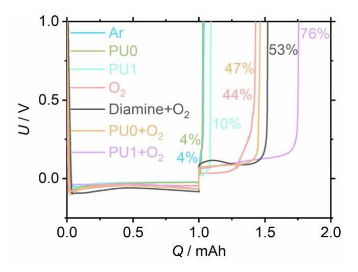
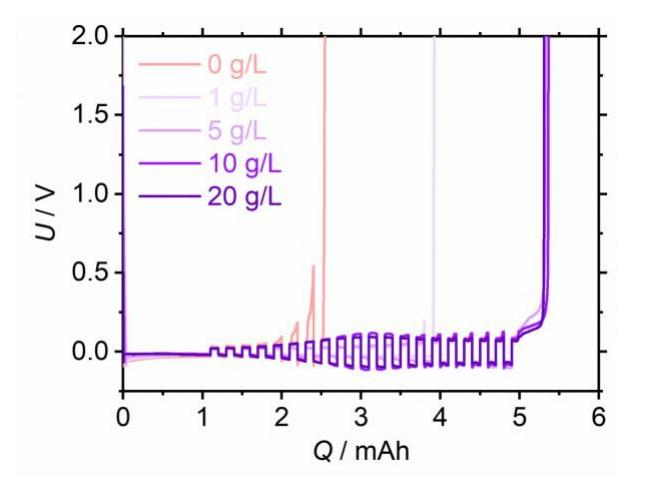
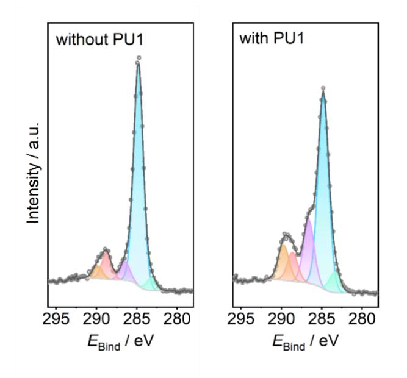
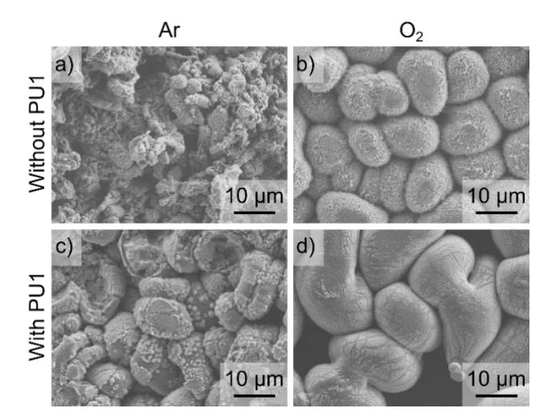
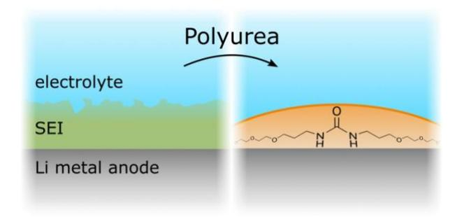

## **Polyureas as SEI-forming Additives for Li Metal Anodes**

Ronja Haas,a Luca J. Kaufer,a Chang Gao,b Angus McLuskie,b Gavin Peters,b Amit Kumar,\*b Daniel Schröderc\*

a Institute of Physical Chemistry, Justus Liebig University Giessen, Heinrich-Buff-Ring 17, D-35392 Giessen, Germany bSchool of Chemistry, University of St. Andrews, North Haugh, St. Andrews, KY169ST, UK. Email[: ak336@st](mailto:ak336@st-andrews.ac.uk)[andrews.ac.uk](mailto:ak336@st-andrews.ac.uk)

c Institute of Energy and Process Systems Engineering (InES), Technische Universität Braunschweig, 38106 Braunschweig, Germany, Email[: d.schroeder@tu-braunschweig.de](mailto:d.schroeder@tu-braunschweig.de)

**ABSTRACT:** We report here the first example of the use of an organic "polyurea" polymer as an SEI-forming additive for the lithium metal anode for lithium-oxygen batteries. The presence of a suitable polyurea significantly increases the coulombic efficiency and cycling of the anode in the presence of oxygen in the liquid electrolyte. The findings demonstrate proof of concept for the application of polyureas and other organic polymers for next-generation type batteries with metal anode.

Non-aqueous Li–O2 batteries are considered an alternative energy storage system for the future due to their high theoretical specific energy (3458 Wh kg−1), which is ten times higher than that of the current state-of-the-art Li-ion battery.1–3 However, persisting technological challenges have hindered the commercialization of this technology. For example, the issue of the stability of the anode (Li metal) is perhaps the most crucial one as plating Li during electrical recharge can easily form dendrite-type structures, which raises safety concerns due to internal short-circuit and thermal runaway.4,5 Furthermore, O2 is intentionally dissolved at the cathode of this battery type and utilized as an active compound in the cathode. However, dissolved O2 that is reaching the anode as well as other electrolyte components can easily react with Li.6,7 Thus, the formation of a stable SEI (solid electrolyte interphase), which can protect the Li from side reactions, is crucial for the efficiency of a battery with a Li metal anode. 8,9

An approach to increase the stability of the anode is to fabricate an artificial SEI using techniques such as sputtering, spin coating, doctor blade coating, and ex-situ chemical reactions.10 Bruce and co-workers showed in pioneering work that the pre-treatment of metallic Li (LiClO4 electrolyte in DMSO) in propylene carbonate can enable the formation of a stable SEI for Li–O2 batteries.11 However, this approach is limited to the use of a specific electrolyte system. Polymer-composites e.g. Al2O3/PVdF-HFP have also been artificially coated on lithium anodes to prevent reactions of the anode with redox mediators.12 The approach of using a quasi-solid electrolyte13 and hydrophobic separator14 have also been used to promote a stable SEI in Li–O2 batteries. However, these approaches suffer from the limitations of either high areal weight or limited protection effect. It is noteworthy that other approaches proposed for mitigating the growth of lithium dendrites such as mechanical suppression,15 electrostatic shielding,16 and using ionic liquid electrolytes17 are challenging to apply for Li–O2 cells due to their involvement in the parasitic side reactions.18,19

Another potential approach to enhance the stability of lithium metal anode is to use an electrolyte additive that can promote the stability of the formation of SEI during operation, also known as SEI-forming additive.20–22 A few reagents such as, fluoroethylene carbonate, 23 boric acid,24, and LiNO3 25,26 have been used as SEI forming additives for Li–O2 batteries, however, they are specific to certain electrolytes and raise sustainability concerns for their largescale production due to high cost and low abundance (e.g. Li, B).27 Thus, the discovery of new materials for SEI forming additive is of high significance to advance the Li–O2 battery technology.

The multi-layer mosaic model suggests that the SEI is composed of an inorganic layer consisting of inorganic lithium salts (e. g. LiF, Li2O, LiOH, and Li2CO3) and an organic layer consisting of organic lithium salts e. g. ROCO2Li, Li alkoxides, Li alkyl carbonates, and Li oligoethoxides or a similar polymer material depending on the choice of solvent and electrolyte.28,29 Since inorganic salts have been studied in the past as SEI-forming additives, we explore in this work organic compounds in particular oligomers/polymers since oligomeric/polymeric materials have been proposed to be a component of the SEI. However, the task of finding a suitable SEI-forming additive can be cumbersome as such material needs to meet several criteria, e.g. (a) a high reduction potential, (b) a decomposition path to form molecules/materials that can allow effective cation conduction between electrode and electrolyte, (c) suitable solubility in the electrolyte.

A few polymeric materials e. g. multifunctional polymer blends (e.g. a combination of polyethylene glycol *tert*-octyl phenyl ether and poly(allyl amine))30 and ionic conductive polymers (e.g. aluminium alkoxide polymers, polyethylene oxide)31,32 have been studied for making artificial SEI films.32,33 Cai et al. have recently reported that an artificial SEI consisting of a polyurea made from ethylenediamine and 1,4-phenylene diisocyanate precursors via a molecular layer deposition process can prolong the cycling of Li metal anode up to three times.34 It was suggested that the presence of polar groups in a polyurea can redistribute the lithium-ion flux allowing a uniform plating/stripping process leading to a higher lifetime of a lithium metal anode. Inspired by this, we envisioned that polyureas could be a suitable choice for an SEI-forming additive.

We have recently discovered a new method for the synthesis of polyureas from the dehydrogenative coupling of diamines and methanol using pincer catalysts of ruthenium35 or manganese.36 The polyureas of moderate molecular weight (*M*n = 3,000 – 11,000) and various functionalities from aromatic, aliphatic, and cyclic diamines can be accessed using this methodology. Interestingly, these polyureas can also be depolymerised back to diamines and methanol via the catalytic hydrogenation process.37 Of all the polyureas reported by us using this method, only **PU0** (Table 1) was found to be soluble in bis(2 methoxyethyl) ether (diglyme) which is a common solvent of choice for the electrolyte for Li–O2 batteries.

**Table1**: Polyureas studied in this report and their physical properties. *M*n: Number average molecular weight; *T*d: Decomposition temperature; *T*c: Crystallization temperature; and *T*g: Glass transition temperature.

| Polyurea | Mn / g mol−1 | Td / °C | Tc / °C | Tg / °C |
|----------|-----------------|------------|------------|------------|
| PU0      | 5500            | 300        | 43         | –30        |
| PU1      | 6452            | 349        | 11         | NA         |

We started our studies by measuring coulombic efficiency using **PU0** as an SEI forming additive in 1 M LiTFSI in diglyme electrolyte (1 mAh Li plating on Cu, Li stripping). This resulted in a poor coulombic efficiency (4%), essentially the same when no additive was used. From our recent experience of making various polyureas, we hypothesized that the presence of ethylene glycol linkage in the monomer diamine is helpful for better solubility of the corresponding polyurea in the diglyme, which was important for their application as additives in batteries. Considering this hypothesis, we synthesized a polyurea/oligourea from the ruthenium/manganese catalysed dehydrogenative coupling of a diamine poly(ethylene glycol) bis(3-aminopropyl) terminated (*M*n = 1,500) and methanol as per the method reported by us recently.35,36 Some of its characteristic details e. g. molecular weight (estimated by 1H NMR spectroscopy) and physical properties (estimated by TGA and DSC analysis) are listed in Table 1. The use of this polyurea (**PU1**) as an SEI-forming additive resulted in a slightly higher coulombic efficiency of 10%. Interestingly, we found that the presence of O2 (at 1 bar 5.9 mM) 38 increases the coulombic efficiency to 44% even without using any additive. The increase of coulombic efficiency and cyclability of Li in the presence of O2 has been previously demonstrated by Hey and Zhou39 and Grey.40 Remarkably, the best result was obtained when **PU1** was used in combination with O2 exhibiting a coulombic efficiency of 76%. Furthermore, we found that the coulombic efficiency also increases (to 53%) when the monomer diamine (poly(ethylene glycol) bis(3-aminopropyl) terminated; *M*n = 1,500) is used as an SEI-forming additive in the presence of O2 (Figure 1).

**Figure 1.** Li plating and stripping in electrolytes with different additives (test cell with one Li electrode and one Cu electrode). The coulombic efficiency is increased by adding 5 g L –1 **PU1** to the electrolyte as SEI-forming additive.

**Figure 2.** Plating Li for 1 mAh on Cu, followed by 20 plating/stripping cycles à 0.1 mAh and subsequent stripping in electrolytes with different concentrations of **PU1**. The coulombic efficiency is increased by adding up to 5 g L –1 **PU1** compared to the reference without **PU1**. Increasing the **PU1** concentration to more than 5 g L –1 does not improve the coulombic efficiency further.

We also studied Li plating/stripping in a Li–Cu cell after initial plating of Li equivalent to 1 mAh. Thereby, we observed prolonged cycling in the presence of **PU1,** especially when combined with O2. As shown in Figure S11, efficient cycling was obtained in the presence of **PU1** and O2. To find the optimal concentration of **PU1** in the electrolyte, we studied its effect on cycling within the range of 1 – 20 g L –1 . As shown in Figure 2, 1 g L –1 of **PU1** already increases the cycle life compared to the cell without **PU1**. However, the cycling performance can still be improved, when the **PU1** concentration is increased to 5 g L –1 . We found that the concentration of 5 g L –1 was the most effective as no enhancement of the cycling efficiency was obtained when the polyurea concentration was increased from 5 g L –1 to 20 g L –1 .

To get insight into the composition of the SEI and to find if polyurea/oligourea was indeed incorporated during cycling, we analysed the electrode after 5 mAh of Li plating on the Cu electrode using X-ray photoelectron spectroscopy (XPS). A comparison of the C 1s spectra with and without **PU1** is shown in Figure 3. A more detailed evaluation is given in Table S1. The XPS studies showed the presence of significantly more C–O fragments (purple coloured in Figure 3) on the electrode when **PU1** was used as an additive. These fragments can be assigned to ethers and derive from **PU1** or diglyme. This finding indicates that **PU1** or its decomposition products are a part of the SEI as intended. In addition, slightly more Li2CO3 and C2 2– were present on the electrodes with **PU1**. These components can also originate from **PU1** or diglyme decomposition.

**Figure 3.** XPS C 1s spectra of electrodes after 5 mAh of Li plating. Comparison of the SEI formed in electrolyte with and without **PU1**.

Additionally, we studied the morphology of the Li electrode surface by SEM (Figure 4). We compared the morphologies from Li plated in electrolytes with (Figure 4c and 4d) and without (Figure 4a and 4b) **PU1** as well as with (Figure 4b and 4d) and without O2 (Figure 4a and 4c). The SEM images match well with the results from the plating/stripping experiments (compare Figure 1): With neither O2 nor **PU1**, no Li particles but rather the products of side reactions are observed (Figure 4a). With **PU1** there are significantly fewer side products and Li particles can be observed (Figure 4c). This observation suggests that the addition of **PU1** results in a more protective SEI that reduces side reactions of the electrode with the electrolyte. However, Li is still not homogeneously covered when the cell is operated in Ar atmosphere (Figure 4c). The most homogeneous coverage of the electrode is obtained, when **PU1** is combined with an O2 atmosphere (Figure 4d).

**Figure 4.** SEM images of electrodes after 5 mAh of Li plating on Cu: a) and b) without PU; c) and d) with PU1; a) and c) cycled in Ar atmosphere and b) and d) in O2 atmosphere.

In conclusion, we have demonstrated that a polyurea (**PU1**) can be used as an additive to promote the formation of an SEI for the lithium metal anode. The best result for the coulombic efficiency (76%, Figure 1) is obtained when **PU1** is used in combination with O2 demonstrating its potential application in Li–O2 batteries. The XPS and SEM studies are supportive of our claim that the polyurea is incorporated into the formed SEI layer. Although the coulombic efficiency and the number of plating/stripping cycling can be improved, this report demonstrates the first proof of concept that polyureas can potentially be used as a new class of material, for SEI-forming additives in the case of Li–O2 batteries as well as other next-generation batteries with a metal anode. The potentially renewable and recyclable nature of polyureas35-37 present added benefits for the design of a sustainable battery.

## **Acknowledgments**

Financial support is provided by the DFG via the GRK (Research Training Group) 2204 "Substitute Materials for Sustainable Energy Technologies". AK thanks the Leverhulme Trust for an early career fellowship (ECF-2019-161) and the UKRI for a Future Leaders Fellowship (MR/W007460/1).

## **References**

- 1 A. C. Luntz and B. D. McCloskey, *Chem. Rev.*, 2014, **114**, 11721–11750.
- 2 A. Kraytsberg and Y. Ein-Eli, *J. Power Sources*, 2011, **196**, 886–893.
- 3 W.-J. Kwak, Rosy, D. Sharon, C. Xia, H. Kim, L. R. Johnson, P. G. Bruce, L. F. Nazar, Y.-K. Sun, A. A. Frimer, M. Noked, S. A. Freunberger and D. Aurbach, *Chem. Rev.*, 2020, **120**, 6626–6683.
- 4 K. B. Hatzell, X. C. Chen, C. L. Cobb, N. P. Dasgupta, M. B. Dixit, L. E. Marbella, M. T. McDowell, P. P. Mukherjee, A. Verma, V. Viswanathan, A. S. Westover and W. G. Zeier, *ACS Energy Lett.*, 2020, **5**, 922–934.
- 5 T. Liu, J. P. Vivek, E. W. Zhao, J. Lei, N. Garcia-Araez and C. P. Grey, *Chem. Rev.*, 2020, **120**, 6558–6625.
- 6 Y. Guo, H. Li and T. Zhai, *Adv. Mater.*, 2017, **29**, 1700007.
- 7 X. Yao, Q. Dong, Q. Cheng and D. Wang, *Angew. Chem. Int. Ed.*, 2016, **55**, 11344–11353.
- 8 X.-B. Cheng, R. Zhang, C.-Z. Zhao, F. Wei, J.-G. Zhang and Q. Zhang, *Adv. Sci.*, 2016, **3**, 1500213.
- 9 P. Verma, P. Maire and P. Novák, *Electrochim. Acta*, 2010, **55**, 6332–6341.
- 10 W. Liu, P. Liu and D. Mitlin, *Adv. Energy Mater.*, 2020, **10**, 2002297.
- 11 Z. Peng, S. A. Freunberger, Y. Chen and P. G. Bruce, *Science*, 2012, **337**, 563–566.
- 12 D. J. Lee, H. Lee, Y.-J. Kim, J.-K. Park and H.-T. Kim, *Adv. Mater.*, 2016, **28**, 857–863.
- 13 S. Wu, J. Yi, K. Zhu, S. Bai, Y. Liu, Y. Qiao, M. Ishida and H. Zhou, *Adv. Energy Mater.*, 2017, **7**, 1601759.
- 14 S. J. Kang, T. Mori, J. Suk, D. W. Kim, Y. Kang, W. Wilcke and H.-C. Kim, *J. Mater. Chem. A*, 2014, **2**, 9970–9974.
- 15 S.-H. Kim, K.-H. Choi, S.-J. Cho, E.-H. Kil and S.-Y. Lee, *J. Mater. Chem. A*, 2013, **1**, 4949–4955.
- 16 F. Ding, W. Xu, G. L. Graff, J. Zhang, M. L. Sushko, X. Chen, Y. Shao, M. H. Engelhard, Z. Nie, J. Xiao, X. Liu, P. V Sushko, J. Liu and J.-G. Zhang, *J. Am. Chem. Soc.*, 2013, **135**, 4450–4456.
- 17 Y. Lu, S. K. Das, S. S. Moganty and L. A. Archer, *Adv. Mater.*, 2012, **24**, 4430–4435.
- 18 B. D. McCloskey, D. S. Bethune, R. M. Shelby, T. Mori, R. Scheffler, A. Speidel, M. Sherwood and A. C. Luntz, *J. Phys. Chem. Lett.*, 2012, **3**, 3043–3047.
- 19 B. D. McCloskey, D. S. Bethune, R. M. Shelby, G. Girishkumar and A. C. Luntz, *J. Phys. Chem. Lett.*, 2011, **2**, 1161–1166.
- 20 E. Peled and S. Menkin, *J. Electrochem. Soc.*, 2017, **164**, A1703–A1719.
- 21 Q. Pang, X. Liang, A. Shyamsunder and L. F. Nazar, *Joule*, 2017, **1**, 871–886.
- 22 U. S. Meda, L. Lal, S. M and P. Garg, *J. Energy Storage*,

2022, **47**, 103564.

- 23 Q.-C. Liu, J.-J. Xu, S. Yuan, Z.-W. Chang, D. Xu, Y.-B. Yin, L. Li, H.-X. Zhong, Y.-S. Jiang, J.-M. Yan and X.-B. Zhang, *Adv. Mater.*, 2015, **27**, 5241–5247.
- 24 Z. Huang, J. Ren, W. Zhang, M. Xie, Y. Li, D. Sun, Y. Shen and Y. Huang, *Adv. Mater.*, 2018, **30**, 1803270.
- 25 X. Li, R. Zhao, Y. Fu and A. Manthiram, *eScience*, 2021, **1**, 108–123.
- 26 J. Uddin, V. S. Bryantsev, V. Giordani, W. Walker, G. V Chase and D. Addison, *J. Phys. Chem. Lett.*, 2013, **4**, 3760– 3765.
- 27 Q. Ma, J. Cui, J. Luo and A. Dong, *ACS Appl. Energy Mater.*, 2022, **5**, 3–13.
- 28 D. Kang, M. Xiao and J. P. Lemmon, *Batter. Supercaps*, 2021, **4**, 445–455.
- 29 A. Wang, S. Kadam, H. Li, S. Shi and Y. Qi, *npj Comput. Mater.*, 2018, **4**, 15.
- 30 F.-S. Li, Y.-S. Wu, J. Chou, M. Winter and N.-L. Wu, *Adv. Mater.*, 2015, **27**, 130–137.
- 31 L. Chen, Z. Huang, R. Shahbazian-Yassar, J. A. Libera, K. C. Klavetter, K. R. Zavadil and J. W. Elam, *ACS Appl. Mater. Interfaces*, 2018, **10**, 7043–7051.
- 32 S. Gao, F. Sun, N. Liu, H. Yang and P.-F. Cao, *Mater. Today*, 2020, **40**, 140–159.
- 33 N.-L. Wu, Y.-T. Weng, F.-S. Li, N.-H. Yang, C.-L. Kuo and D.- S. Li, *Prog. Nat. Sci. Mater. Int.*, 2015, **25**, 563–571.
- 34 Y. Sun, Y. Zhao, J. Wang, J. Liang, C. Wang, Q. Sun, X. Lin, K. R. Adair, J. Luo, D. Wang, R. Li, M. Cai, T.-K. Sham and X. Sun, *Adv. Mater.*, 2019, **31**, 1806541.
- 35 A. Kumar, D. Armstrong, G. Peters, M. Nagala and S. Shirran, *Chem. Commun.*, 2021, **57**, 6153-6156.
- 36 A. E. Owen, A. Preiss, A. McLuskie, C. Gao, G. Peters, M. Bühl and A. Kumar, *ACS Catal.*, 2022, **12**, 6923–6933.
- 37 A. Kumar, J. Luk, *Eur. J. Org. Chem*., 2021, **32**, 4546-4550.
- 38 R. Haas, M. Murat, M. Weiss, J. Janek, A. Natan and D. Schröder, *J. Electrochem. Soc.*, 2021, **168**, 70504.
- 39 F. Qiu, X. Zhang, Y. Qiao, X. Zhang, H. Deng, T. Shi, P. He and H. Zhou, *Energy Storage Mater.*, 2018, **12**, 176–182.
- 40 E. Wang, S. Dey, T. Liu, S. Menkin and C. P. Grey, *ACS Energy Lett.*, 2020, **5**, 1088–1094.

