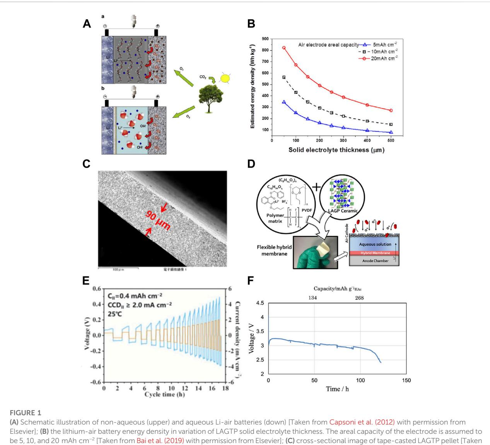

#### OPEN ACCESS

EDITED BY Guijing Liu, Ludong University, China

REVIEWED BY Zhijie Wang, Hong Kong Polytechnic University, Hong Kong SAR, China Liu Jiuqing, Central South University, China

\*CORRESPONDENCE Fan Bai, [baifan@mail.sic.ac.cn](mailto:baifan@mail.sic.ac.cn)

SPECIALTY SECTION This article was submitted to Electrochemistry, a section of the journal Frontiers in Chemistry

RECEIVED 03 September 2022 ACCEPTED 26 September 2022 PUBLISHED 10 October 2022

#### CITATION

Chen P, Bai F, Deng Jw, Liu B and Zhang T (2022), Recent progresses and challenges in aqueous lithium–air batteries relating to the solid electrolyte separator: A mini-review. Front. Chem. 10:1035691. doi: [10.3389/fchem.2022.1035691](https://doi.org/10.3389/fchem.2022.1035691)

#### COPYRIGHT

© 2022 Chen, Bai, Deng, Liu and Zhang. This is an open-access article distributed under the terms of the [Creative Commons Attribution License](https://creativecommons.org/licenses/by/4.0/) [\(CC BY\)](https://creativecommons.org/licenses/by/4.0/). The use, distribution or reproduction in other forums is

permitted, provided the original author(s) and the copyright owner(s) are credited and that the original publication in this journal is cited, in accordance with accepted academic practice. No use, distribution or reproduction is permitted which does not comply with these terms.

# [Recent progresses and](https://www.frontiersin.org/articles/10.3389/fchem.2022.1035691/full) [challenges in aqueous](https://www.frontiersin.org/articles/10.3389/fchem.2022.1035691/full) lithium–[air batteries relating to](https://www.frontiersin.org/articles/10.3389/fchem.2022.1035691/full) [the solid electrolyte separator: A](https://www.frontiersin.org/articles/10.3389/fchem.2022.1035691/full) [mini-review](https://www.frontiersin.org/articles/10.3389/fchem.2022.1035691/full)

#### Peng Chen1 , Fan Bai 2 \*, Jun wen Deng2 , Bin Liu3 and Tao Zhang2

1 School of Network and Communication Engineering, Jinling Institute of Technology, Nanjing, China, 2 State Key Laboratory of High Performance Ceramics and Superfine Microstructure, Shanghai Institute of Ceramics, Chinese Academy of Sciences, Shanghai, China, 3 Department of Applied Chemistry, Kyushu University, Fukuoka, Japan

The lithium–air (Li–air) battery utilizes infinite oxygen in the air to store or release energy through a semi-open cathode structure and bears an ultra-high theoretical energy density of more than 1,000 Wh/kg. Therefore, it has been denoted as the candidate for next-generation energy storage in versatile fields such as electric vehicles, telecommunications, and special power supply. Among all types of Li–air batteries, an aqueous Li–air battery bears the advantages of a high theoretical energy density of more than 1,700 Wh/kg and does not have the critical pure oxygen atmosphere issues in a non-aqueous lithium–air battery system, which is more promising for the actual application. To date, great achievements have been made in materials' design and cell configurations, but critical challenges still remain in the field of the solid electrolyte separator, its related lithium stripping/plating at the lithium anode, and catholyte design. In this mini-review, we summarized recent progress related to the solid electrolyte in aqueous Li–air batteries focusing on both material and battery device development. Moreover, we proposed a discussion and unique outlook on improving solid electrolyte compatibility and battery performance, thus designing an aqueous Li–air battery with higher energy density and better cycle performance in the future.

#### KEYWORDS

Lithium air, Li–O2, solid electrolyte, aqueous Li–air, hybrid Li–air

#### Introduction

Modern smart societies depend on the grid of smart devices to facilitate our lives. When almost all smart devices in the modern society need energy to drive and perform, the demand for high energy density energy storage devices has extensively soared in the fields of electric vehicles, consumer electronics, and household appliances [\(Braun et al., 2012;](#page-5-0) [Shen et al., 2018;](#page-6-0) [Wang et al., 2020a\)](#page-6-1). In contrast, the iteration of energy storage devices gradually fails to keep up with the industry evolution pace as it has been more than 30 years since the commercial announcement of the lithium-ion battery by Sony Corporation ([Blomgren, 2016](#page-5-1)). Under these

from [Bai et al. \(2019\)](#page-5-9) with permission from Elsevier]; (D) flexible hybrid separator for aqueous lithium air battery [Taken from [Safanama and](#page-6-5) [Adams \(2017\)](#page-6-5) with permission from ACS]; (E) critical current densities of Li/LiF-LiCl-LLZO /Li symmetric cells [Taken from [Ruan et al. \(2021\)](#page-6-6) with

circumstances, new prototype energy storage systems have been proposed lately hoping to raise the energy storage efficiency and minimize battery weight in the device. Among them, the Li–air battery has been denoted as the holy grail in batteries because of its ultimate theoretical energy density surpassing 3,500 Wh/kg permission from Wiley]; (F) discharge curves of Li/KW/Celgard/(LiFSI-2G4)-50 vol% DOL/LAGTP-E/HAc-H2O (1:1 v/v) cell with 0.21 g of HAc at 0.5 mA cm−2 and 25°C under an air atmosphere [Taken from [Soga et al. \(2020\)](#page-6-7) under the terms of the Creative Commons Attribution 4.0 License].

([Abraham and Jiang, 1996](#page-5-2)). This value is more than 10 times higher than the commercial lithium–ion battery and even comparable to gasoline if the tank-to-wheel energy efficiency of around 13% is considered [\(Girishkumar et al., 2010](#page-5-3)).

Upon two decades of development, Li–air batteries could mainly be divided into two categories, and they are nonaqueous ([Feng et al., 2016](#page-5-4); [Shu et al., 2019](#page-6-2)) and aqueous ([Zhang et al., 2011;](#page-6-3) [Imanishi et al., 2012;](#page-5-5) [Lu et al., 2014](#page-6-4)) based on the electrolyte type and oxygen reaction ([Capsoni et al.,](#page-5-6) [2012\)](#page-5-6). For the non-aqueous Li–air battery, it possesses an ultra-high theoretical mass energy density of 3,505 Wh/kg and a volume energy density of 3,436 Wh/L ([Bruce et al., 2012](#page-5-7)), derived from a two-electron lithium–oxygen reaction at the cathode side ([Eq. 1](#page-2-0)) when utilizing the organic electrolyte and pure oxygen ([Figure 1A\)](#page-1-0). However, until now, no nonaqueous Li–air battery with either high power density or high specific areal capacity has been proposed. Critical challenges still remain in the large decomposition overpotential of lithium peroxide during charge and its clogging at cathode porous channels during discharge ([Feng](#page-5-4) [et al., 2016](#page-5-4); [Imanishi and Yamamoto, 2019\)](#page-5-8). More importantly, the current non-aqueous Li–air battery requires a pure oxygen operation atmosphere, and therefore, eliminating H2O and CO2 side reactions at both the cathode and anode sides is also crucial ([Qiao et al., 2019](#page-6-8)

> 2Li+ + O2 + 2e → Li2O2 E0 -2.96 V, (1)

$$
O_2 + 4H^+ + 4e \rightarrow 2H_2O \t E^0 = 4.07 V, \t(2)
$$

$$
O_2 + 2H_2O + 4e \rightarrow 4OH^- E^0 = 3.45 V. \tag{3}
$$

A counterpart to the non-aqueous Li–air battery is the aqueous Li–air battery [\(Figure 1A\)](#page-1-0), which utilizes an aqueous electrolyte on the cathode side and an additional lithium-ion conducting separator between the lithium anode and aqueous electrolyte to prevent lithium reaction with water ([Abraham and Jiang, 1996;](#page-5-2) [Imanishi](#page-5-5) [et al., 2012](#page-5-5); [Imanishi and Yamamoto, 2014;](#page-5-10) [Lu et al., 2014](#page-6-4); [Imanishi](#page-5-8) [and Yamamoto, 2019\)](#page-5-8). The lithium oxygen reaction at the cathode side is more complex than the aprotic Li–air battery and decisive to the pH ([Imanishi and Yamamoto, 2014;](#page-5-10) [Imanishi and Yamamoto,](#page-5-8) [2019](#page-5-8)). Under acidic conditions, oxygen reacts with hydrogen ions into water molecules based on a four-electron equation [\(Eq. 2\)](#page-2-1), while under alkaline conditions, oxygen reacts with water into hydroxyl anions with a large difference in standard reaction potential [\(Eq. 3](#page-2-2)). Compared with the non-aqueous Li–air battery, the theoretical energy density of the aqueous Li–air battery is lower (1,910 Wh/kg vs. 3,505 Wh/kg) but still exceeds the practical energy density of gasoline. The major advantage of an aqueous Li–air battery over a non-aqueous system is its compatibility to be used directly in ambient air, whereas the severe water contamination from air in a non-aqueous system could be neglected. Moreover, the discharge product of LiOH is soluble in an aqueous electrolyte, which could significantly improve the areal discharge capacity and reduce the decomposition overpotential during charge. But critical challenges still remain in material stability and device performance to meet the final requirements of practical application.

In the past decade, a number of excellent books and review articles have been published regarding non-aqueous or aqueous Li–air batteries [\(Feng et al., 2016](#page-5-4); [Kwak et al., 2020;](#page-6-9) [Dou et al., 2022](#page-5-11); [Liu et al., 2022](#page-6-10)), but the latest article for the aqueous Li–air battery has been published for more than 3 years, best to our knowledge ([Imanishi and Yamamoto, 2019](#page-5-8)). As significant approaches have been made day by day, it is necessary to summarize and review them in order to accelerate the research pace for the application of aqueous Li–air batteries. In this mini-review, we focus on the current challenges of aqueous Li–air batteries relating to solid electrolytes from material to the device and provide our insight and perspective on the future development of aqueous Li–air batteries.

#### Solid electrolyte separator in the aqueous Li–air battery

In the past 30 years, numerous lithium-ion-conducting solid electrolytes have emerged trying to replace traditional organic electrolytes in lithium-ion batteries. Several groups of solid electrolytes, including oxide [\(Aono et al., 1990](#page-5-12); [Murugan](#page-6-11) [et al., 2007](#page-6-11)), sulfide [\(Kanno and Maruyama, 2001\)](#page-5-13), halide ([Steiner and Lutz, 1992\)](#page-6-12), and polymer type ([Tanzella et al.,](#page-6-13) [1981](#page-6-13)), have been proposed to date. However, in the stage of an aqueous Li–air battery, the solid electrolyte needs to be stable to both water and oxygen, so only the oxide type of the solid electrolyte has been introduced in an aqueous Li–air battery. Back in the 2000s, Imanishi et al. studied the compatibility of oxide-type lithium aluminum titanium phosphate (LATP) ([Shimonishi et al., 2011a\)](#page-6-14) and lithium lanthanum zirconium oxide (LLZO) ([Shimonishi et al., 2011b](#page-6-15)) in an aqueous Li–air system. Later, Inaguma et al. analyzed another kind of perovskite lithium lanthanum titanium oxide (LLTO) [\(Inaguma and](#page-5-14) [Nakashima, 2013](#page-5-14)). All three kinds of oxide solid electrolyte showed simultaneous Li-H+ exchange when in contact with water or ambient air ([Boulant et al., 2010](#page-5-15); [Kobi and](#page-6-16) [Mukhopadhyay, 2018](#page-6-16); [Pogosova et al., 2020](#page-6-17)) as the ionic conductivity of the aged samples would be more than one order of magnitude lower than the freshly prepared ones in 1 month time. The LLZO stability was even worse as the internal stresses associated with the formation of La2Zr2O7 from LLZO would be high enough to cause a spontaneous fracture in the LLZO pellet, as revealed recently by [Kobi and Mukhopadhyay](#page-6-16) [\(2018](#page-6-16)). But they were relatively stable in the saturated LiCl electrolyte or saturated LiCl with LiOH in neutral pH values less than 10 ([Shimonishi et al., 2011a;](#page-6-14) [Shimonishi et al., 2011b;](#page-6-15) [Inaguma and Nakashima, 2013\)](#page-5-14). Also, there were additional reports that LATP would be stable in the weak acidic electrolyte [\(Zhang et al., 2010a](#page-6-18); [Soga et al., 2020](#page-6-7)). The previous results demonstrate that LATP, LLTO, and LLZO could be suitable for aqueous Li–air batteries, but the gradually deteriorated ionic conductivity and its instability during storage in the air need further concern in the following research. Very recently, we noticed that multiple strategies, such as doping [\(Abrha et al., 2020;](#page-5-16) [Kobi et al.,](#page-6-19) [2020](#page-6-19)), coating ([Yang et al., 2020;](#page-6-20) [Jia et al., 2021](#page-5-17)), and ion exchange ([Kim et al., 2022\)](#page-6-21), were proven to be efficient in enhancing solid electrolytes toward air. Also, these may shed light on improving solid electrolyte stability in aqueous Li–air batteries.

In addition to material stability, another primary issue is the solid electrolyte weight and mechanical strength. The theoretical densities of LATP, LLZO, and LLTO are 2.93 g/ cm3 , 5.07 g/cm3 , and 5.01 g/cm3 , respectively, which are considerably higher than traditional organic electrolytes in the range of 1.2–1.3 g/cm3 and would have an adverse effect on the actual energy density of the aqueous Li–air battery. In 2014, [Park et al. \(2014\)](#page-6-22) from Samsung Corp. provided a complex model for estimating the energy density of lithiumion, lithium–sulfur, and lithium–air batteries as a function of areal capacity. In 2019, we further established the relationship between LATP thickness and energy density in the aqueous Li–air battery [\(Bai et al., 2019](#page-5-9)). As presented in [Figure 1B](#page-1-0), in order to achieve an actual energy density exceeding 300 Wh/kg in the aqueous Li–air battery, the thickness of the LAGTP solid electrolyte should be less than 100 μm. But in the early stages of the aqueous Li–air battery, the dense solid electrolyte was usually prepared by a hot-pressing technique, and the typical thickness of the electrolyte was usually larger than 500 μm, which would be detrimental to the energy density of the cell. In 2012, Takahashi et al. prepared a LATP thin sheet (about 200 μm) via the tape casting method. They resisted water penetration through the LATP solid electrolyte by polymerization of 2,2-bis(4-glycidyloxyphneyl) propane and 1,3-phenylenediamine in the open pores ([Takahashi et al.,](#page-6-23) [2012](#page-6-23)). [Puech et al. \(2012\)](#page-6-24) further minimized free-standing LATP thickness down to 40 μm and demonstrated its potential application in aqueous Li–air batteries. But as the typical LATP mechanical strength is only around 50–80 MPa, it is still susceptible to applying such an ultra-thin pellet in an actual Li–air cell device. To reinforce the mechanical strength of thin solid electrolytes, in 2019, we introduced the secondary phase particle ceramic reinforcement strategy into the solid electrolyte [\(Bai et al., 2019\)](#page-5-9). The as-prepared LAGTP with 10 wt% TiO2 exhibited a more than two-fold increase in threepoint bending strength up to 200 MPa with a reduced thickness down to 90 μm [\(Figure 1C](#page-1-0)). Meanwhile, we systematically studied the addition of three types of transitional metal oxide to the chemo-physico-mechanical properties of the LAGTP pellet [\(Kyono et al., 2018](#page-6-25)). Although some achievements have been obtained in reducing solid electrolyte weight, how to improve its safety remained to be an unsolved issue. To alternatively solve solid electrolyte fragility, in 2017, Safanama et al. proposed a flexible yet dense LAGP-LiBF4-Butvar-PVDF-HFP composite electrolyte ([Figure 1D](#page-1-0)) to be used in the aqueous Li–air battery which could significantly promote solid electrolyte practicability and cell safety ([Safanama and Adams, 2017\)](#page-6-5). The current issue in the composite electrolyte is that the ionic conductivity is more than one order of magnitude lower than pure solid electrolytes, which leads to a large charge–discharge overpotential in the cell. Also, its electrochemical performance degradation is much larger, which needs further study to meet the requirements in practical use. Another progress regarding the solid electrolyte weight and thickness comes from Wang et al. as they announced that the bending strength could also be relevant to the material and grain boundary properties. They compared the mechanical strengths of LLTO, LATP, and LLZO pellets prepared by tape-casting and found that the LLTO bending strength could be 2 or 16 times higher than LLZO or LATP, respectively ([Jiang et al., 2020](#page-5-18)). The grain boundary composition and intra-domain control should also be important factors to be considered in the future design of solid electrolytes.

#### Lithium stripping/plating based on the dense solid electrolyte

LATP is unstable against lithium metal as Ti4+ could easily be reduced to Ti3+ when contacting lithium. Therefore, a buffer layer between lithium and LATP is required to stabilize both lithium and LATP during cycling ([Zhang et al., 2008;](#page-6-26) [Zhang et al.,](#page-6-27) [2010b\)](#page-6-27). Varied by the buffer layer material type, three kinds of strategies, namely, polymer, inorganic, and liquid electrolyte, have usually been adopted to stabilize lithium plating and stripping on LATP [\(Wang et al., 2020b](#page-6-28); [Wang et al., 2021a;](#page-6-29) [Wang et al., 2021b;](#page-6-30) [Wang et al., 2022](#page-6-31)). In the early stage, polyethylene oxide (PEO) with lithium salt was manipulated as the buffer layer between lithium anode and LATP because it could provide a good interface contact on both materials. When lithium salt is added, lithium ions can coordinate with the polar ether oxygen group on the PEO backbone and mitigate under chain movement and electric field [\(Meyer, 1998](#page-6-32)). But a temperature above 60° C (glass transitional temperature) is generally needed to provide enough amorphous regions in PEO for lithium mitigation ([Zhou et al., 2019\)](#page-6-33). To overcome the limitation to lithium-ion conductivity by PEO, an inorganic interlayer was recently introduced to stabilize the lithium anode and its plating/ stripping. For instance, Xia et al. developed a facile yet inexpensive spray-coating method to construct a threedimensional organic/inorganic composite layer based on a commercial boron nitride-based release agent (BNRA) onto LATP ([Zhu et al., 2022](#page-6-34)). The critical current density (CCD) of a symmetric Li|BNRA|LATP|BNRA|Li cell could reach 1 mA cm−2 , which was a huge improvement in stabilizing lithium plating and stripping on the LATP pellet. In addition, other novel lithium conducting buffer layers such as succinonitrile ([Cao et al., 2021\)](#page-5-19) and sericin-ionic liquid ([Lei](#page-6-35) [et al., 2022](#page-6-35)) have also been proposed to resist electron pass from lithium to LATP.

In comparison, the progress of stabilizing Li/LLZO has been more rapid, owing to the fact that LLZO is stable toward Li. Currently, interfacial-engineered symmetric Li/LLZO/Li batteries could tolerate continuous charge–discharge for more than 1,000 h at a current density exceeding 1 mA cm−2 . Generally, three rules have been summarized to stabilize lithium plating and stripping on the LLZO pellet. The first regulation is to diminish the surficial in situ formed Li2CO3. For instance, Huang et al. developed a high-speed mechanical polishing (HMP) method to remove impurities from a porous LLZTO surface and retrieve its lithiophilicity ([Qin et al., 2022\)](#page-6-36). Symmetric Li cells assembled with speed-controlled polishing LLZTO exhibited a critical current density exceeding 1.91 mA cm−2 . The second regulation is to construct an electron-insulating interphase at Li/LLZO. For instance, Wen et al. built a 3D cross-linking electron-insulating LiF-LiCl network on the LLZTO surface by facile acid–salt treatment [\(Ruan et al., 2021](#page-6-6)). The CCDs of symmetric Li cells reached 1.8 mA cm−2 at 25°C ([Figure 1E](#page-1-0)) and 3.6 mA cm−2 at 60°C. The third regulation is to resist the volume expansion between LLZO and the Li metal anode. In this perspective, He et al. designed a 3D porous Li–Zn alloy interphase (PZL) on LLZTO by the Li metal reaction with a magnetron-sputtered zinc metal layer ([Wan et al., 2021](#page-6-37)). This 3D porous interphase could significantly reduce the volume expansion of the Li anode during charge–discharge. Also, the Li/LLZTO@PZL/Li symmetrical battery achieved a high critical current density of 2 mA cm−2 . Other methods including the lithium metallic alloy and transitional metal coordination engineering by succinonitrile have also been proven to be efficient. In the next step, how to reduce LLZO thickness and improve its air stability would be essential to its application in an aqueous Li–air battery in our point of view.

At the interface between LLTO and Li, it is similar to LATP as its crystal structure is composed of Ti4+ which could be reduced to Ti3+ when contacting Li. Currently, fewer articles have been published discussing lithium plating/stripping on LLTO because of its instability toward Li and its relatively high density. However, it is worthwhile to note some novel methods to stabilize lithium utilizing the LLTO's unique feature. For example, Ding et al. designed a mixed ionic and electronic conductor (MEIC) based on LLTO for Li–metal anode protection ([Yan et al., 2018\)](#page-6-38). They introduced the MIEC property in the LLTO film by using toluene as a catalyst to trigger the chemical reactions between LLTO and Li, leading to high electronic conductivity in the LLTO film. The as-fabricated Li/MEIC-LLTO/Cu could stably cycle at 0.2 mA cm−2 .

#### Catholyte design in the aqueous Li–air battery

For acidic catholytes, it provides a higher theoretical discharge potential than the alkaline counterpart in [Eq. 2](#page-2-1). Also, the side reaction with CO2 ingression could be significantly minimized. But to date, there is still a certain limit in acidic catholyte selection as almost all solid electrolytes are unstable to strong acids with pH values less than 5 ([Manthiram and Li, 2015\)](#page-6-39). Therefore, weaker acetic acid and phosphoric acid are intended to conjugate with lithium salt to adjust its pH to moderate in an aqueous Li–air battery. In 2010, [Shimonishi et al. \(2010\)](#page-6-40) fabricated an aqueous Li–air battery with the CH3COOH (HAc)–H2O (90:10 v/v)– CH3COOLi (LiAc) catholyte at a pH value of 3.34. The opencircuit voltage of this cell was as high as 3.69 V as referred to in [Eq. 2](#page-2-1). But the highly volatile acetic acid could result in a low utilization efficiency of acetic acid. To deal with this issue, [Zhang](#page-6-27) [et al. \(2010b\)](#page-6-27) designed a Li/polymer electrolyte/LATP-Ohara/ HAc-H2O-LiAc/carbon air cell to cycle under pressurized 3 atm air to suppress evaporation of the catholyte. Also, more recently, [Soga et al. \(2020](#page-6-7)) have modified the catholyte composition to the HAc-saturated LiAc aqueous solution (9:1 v/v), which could further promote the utilization of HAc up to 72%. But we have to admit that how to apply this catholyte for actual use remains unsolved.

Compared to the acidic catholyte, the alkaline catholyte has been demonstrated to be more efficient for ORR reaction and with higher lithium-ion conduction. To date, the LiOH base catholyte has been systematically studied. Recently, we collaborated with Suzuki Corp. to fabricate an aqueous Li–air battery with the 10 M LiCl–1.5 M LiOH catholyte that was ultra-stable to the LAGTP solid electrolyte. The pouch-type cell performed a minimum energy loss of 15% per cycle for more than 10 cycles [\(Bai et al., 2019\)](#page-5-9). But we noted that the high concentration of inactive LiCl would inevitably lower the practical energy density of the cell and increase the potential risk of blocking the air electrode. Therefore, great efforts are still needed to improve both the catholyte efficiency and stability.

## Summary and outlooks

To summarize, current challenges in solid electrolyte separators along with related lithium plating/stripping and catholyte design are not independent but systematic in aqueous Li–air batteries. From the material level, the resistance of simultaneous Li-H+ exchange between the catholyte and solid electrolyte should be improved as a first priority as it is still suffering from the long-term instability of the solid electrolyte in a semi-open cell structure. Methods such as element doping, grain-boundary regulation, and surface modification of the solid electrolyte could be feasible to alleviate this problem.

From the battery level, the weight of solid electrolytes should be further concerned. A feasible guideline for minimizing weight, while not reducing mechanical strength, is to design a polymer–ceramic composite electrolyte for the aqueous Li–air battery. But the catholyte and lithium anode corrosion to the composite electrolyte, especially the polymer part, should be solved initially before being utilized in fabricating a battery.

Regarding the lithium stripping/plating relating to a solid electrolyte or composite electrolyte, a buffer layer between the solid electrolyte and lithium needs to be carefully designed to consider possible dendrite growth pathways or reduction reactions based on various kinds of the solid electrolyte. For example, buffer layers based on solid electrolytes should be electron-blocking when the solid electrolyte contains typical transitional metal ions like Ti4+ and Ge4+, but it would be good when contacting LLZO.

Furthermore, the catholyte design should also consider the properties of solid electrolytes. To date, deep charge–discharge is seldomly concerned in the published articles, but the violently changed charge–discharge product concentration would inevitably influence the catholyte pH and further influence the solid electrolyte separator. The mechanism behind it also needs to be thoroughly investigated at both molecular and macroscopic levels.

Last but not least, from our point of view, the cell configuration also demands further investigation. Currently, Swagelok-type cells with heavy steel frames or pouch-type cells with simple stacking could not meet the requirement of both high energy density and battery safety. To minimize frame weight while maximizing the air utilization efficiency, a lighter weight frame such as aluminum mesh with a designed air diffusion channel should be considered in the future study.

Although great challenges are still ahead on the road to aqueous Li–air battery industrialization, we are confident that the rapid innovation in material science and engineering would undoubtedly bring prospects to the application of aqueous Li–air batteries in the near future.

### Author contributions

PC wrote the first draft of the manuscript. FB, JD, and BL wrote sections of the manuscript. PC, FB, JD, and TZ acquired the funding. FB supervised the whole project. All authors contributed to manuscript revision, read, and approved the submitted version.

## References

Abraham, K. M., and Jiang, Z. (1996). A polymer electrolyte-based rechargeable lithium/oxygen battery. J. Electrochem. Soc. 143, 1–5. doi:[10.1149/1.1836378](https://doi.org/10.1149/1.1836378)

Abrha, L. H., Hagos, T. T., Nikodimos, Y., Bezabh, H. K., Berhe, G. B., Hagos, T. M., et al. (2020). Dual-doped cubic garnet solid electrolytes with superior air stability. ACS Appl. Mat. Interfaces 12, 25709–25717. doi:[10.1021/acsami.0c01289](https://doi.org/10.1021/acsami.0c01289)

Aono, H., Sugimoto, E., Sadaoka, Y., Imanaka, N., and Adachi, G. (1990). IONIC-CONDUCTIVITY of solid electrolytes based on lithium titanium phosphate. J. Electrochem. Soc. 137, 1023–1027. doi:[10.1149/1.2086597](https://doi.org/10.1149/1.2086597)

Bai, F., Shang, X. F., Mori, D., Taminato, S., Matsumoto, M., Watanabe, S., et al. (2019). High lithium-ion conducting solid electrolyte thin film of Li1.4Al0.4Ge0.2Ti1.4(PO4)3-TiO2 for aqueous lithium secondary batteries. Solid State Ionics 338, 127–133. doi:[10.1016/j.ssi.2019.05.017](https://doi.org/10.1016/j.ssi.2019.05.017)

Blomgren, G. E. (2016). The development and future of lithium ion batteries. J. Electrochem. Soc. 164, A5019–A5025. doi[:10.1149/2.0251701jes](https://doi.org/10.1149/2.0251701jes)

Boulant, A., Bardeau, J. F., Jouanneaux, A., Emery, J., Buzare, J. Y., and Bohnke, O. (2010). Reaction mechanisms of Li0.30La0.57TiO3 powder with ambient air: H+ /Li+ exchange with water and Li2CO3 formation. Dalton Trans. 39, 3968–3975. doi[:10.](https://doi.org/10.1039/b924684c) [1039/b924684c](https://doi.org/10.1039/b924684c)

Braun, P. V., Cho, J., Pikul, J. H., King, W. P., and Zhang, H. G. (2012). High power rechargeable batteries. Curr. Opin. Solid State Mat. Sci. 16, 186–198. doi[:10.](https://doi.org/10.1016/j.cossms.2012.05.002) [1016/j.cossms.2012.05.002](https://doi.org/10.1016/j.cossms.2012.05.002)

Bruce, P. G., Freunberger, S. A., Hardwick, L. J., and Tarascon, J. M. (2012). Li-O2 and Li-S batteries with high energy storage. Nat. Mat. 11, 19–29. doi[:10.1038/nmat3191](https://doi.org/10.1038/nmat3191)

Cao, W. Z., Yang, Y. A., Deng, J. W., Li, Y. Q., Cui, C. H., and Zhang, T. (2021). Localization of electrons within interlayer stabilizes NASICON-type solid-state electrolyte. Mater. Today Energy 22, 100875. doi:[10.1016/j.mtener.2021.100875](https://doi.org/10.1016/j.mtener.2021.100875)

Capsoni, D., Bini, M., Ferrari, S., Quartarone, E., and Mustarelli, P. (2012). Recent advances in the development of Li–air batteries. J. Power Sources 220, 253–263. doi[:10.1016/j.jpowsour.2012.07.123](https://doi.org/10.1016/j.jpowsour.2012.07.123)

# Funding

This work was supported financially by the Shanghai Pujiang Program under grant no. 20PJ1415300, the Shanghai Institute of Ceramics Innovation Fund (no. E13ZC717), the Natural Science Research Project of Higher Education Institutions of Jiangsu Province (20KJB510013), the National Natural Science Foundation of China under grant no. 51971094, and the Science and Technology Commission of Shanghai Municipality under grant no. 20511107800.

# Conflict of interest

The authors declare that the research was conducted in the absence of any commercial or financial relationships that could be construed as a potential conflict of interest.

# Publisher's note

All claims expressed in this article are solely those of the authors and do not necessarily represent those of their affiliated organizations, or those of the publisher, the editors, and the reviewers. Any product that may be evaluated in this article, or claim that may be made by its manufacturer, is not guaranteed or endorsed by the publisher.

Dou, Y. Y., Xie, Z. J., Wei, Y. J., Peng, Z. Q., and Zhou, Z. (2022). Redox mediators for high-performance lithium-oxygen batteries. Natl. Sci. Rev. 9, nwac040. doi[:10.](https://doi.org/10.1093/nsr/nwac040) [1093/nsr/nwac040](https://doi.org/10.1093/nsr/nwac040)

Feng, N. N., He, P., and Zhou, H. S. (2016). Critical challenges in rechargeable aprotic Li-O2 batteries. Adv. Energy Mat. 6, 1502303. doi:[10.1002/aenm.201502303](https://doi.org/10.1002/aenm.201502303)

Girishkumar, G., McCloskey, B., Luntz, A. C., Swanson, S., and Wilcke, W. (2010). Lithium - air battery: Promise and challenges. J. Phys. Chem. Lett. 1, 2193–2203. doi:[10.1021/jz1005384](https://doi.org/10.1021/jz1005384)

Imanishi, N., Takeda, Y., and Yamamoto, O. (2012). Aqueous lithium-air rechargeable batteries. Electrochemistry 80, 706–715. doi:[10.5796/](https://doi.org/10.5796/electrochemistry.80.706) [electrochemistry.80.706](https://doi.org/10.5796/electrochemistry.80.706)

Imanishi, N., and Yamamoto, O. (2019). Perspectives and challenges of rechargeable lithium-air batteries. Mater. Today Adv. 4, 100031. doi[:10.1016/j.](https://doi.org/10.1016/j.mtadv.2019.100031) [mtadv.2019.100031](https://doi.org/10.1016/j.mtadv.2019.100031)

Imanishi, N., and Yamamoto, O. (2014). Rechargeable lithium-air batteries: Characteristics and prospects. Mater. Today 17, 24–30. doi:[10.1016/j.mattod.](https://doi.org/10.1016/j.mattod.2013.12.004) [2013.12.004](https://doi.org/10.1016/j.mattod.2013.12.004)

Inaguma, Y., and Nakashima, M. (2013). A rechargeable lithium-air battery using a lithium ion-conducting lanthanum lithium titanate ceramics as an electrolyte separator. J. Power Sources 228, 250–255. doi:[10.1016/j.jpowsour.2012.11.098](https://doi.org/10.1016/j.jpowsour.2012.11.098)

Jia, M. Y., Bi, Z. J., Shi, C., Zhao, N., and Guo, X. X. (2021). Air-stable dopaminetreated garnet ceramic particles for high-performance composite electrolytes. J. Power Sources 486, 229363. doi:[10.1016/j.jpowsour.2020.229363](https://doi.org/10.1016/j.jpowsour.2020.229363)

Jiang, Z. Y., Wang, S. Q., Chen, X. Z., Yang, W. L., Yao, X., Hu, X. C., et al. (2020). Tape-casting Li0.34La0.56TiO3 ceramic electrolyte films permit high energy density of lithium-metal batteries. Adv. Mat. 32, 2070045. doi:[10.1002/adma.202070045](https://doi.org/10.1002/adma.202070045)

Kanno, R., and Maruyama, M. (2001). Lithium ionic conductor thio-LISICON the Li2S-GeS2-P2S5 system. J. Electrochem. Soc. 148, A742–A746. doi:[10.1149/1.](https://doi.org/10.1149/1.1379028) [1379028](https://doi.org/10.1149/1.1379028)

Kim, S., Kim, J. S., Miara, L., Wang, Y., Jung, S. K., Park, S. Y., et al. (2022). Highenergy and durable lithium metal batteries using garnet-type solid electrolytes with tailored lithium-metal compatibility. Nat. Commun. 13, 1883. doi:[10.1038/s41467-](https://doi.org/10.1038/s41467-022-29531-x) [022-29531-x](https://doi.org/10.1038/s41467-022-29531-x)

Kobi, S., Amardeep, Vyas, A., Bhargava, P., and Mukhopadhyay, A. (2020). Al and Mg Co-doping towards development of air-stable and Li-ion conducting Li-Lazirconate based solid electrolyte exhibiting low electrode/electrolyte interfacial resistance. J. Electrochem. Soc. 167, 120519. doi[:10.1149/1945-7111/abad66](https://doi.org/10.1149/1945-7111/abad66)

Kobi, S., and Mukhopadhyay, A. (2018). Structural (in)stability and spontaneous cracking of Li-La-zirconate cubic garnet upon exposure to ambient atmosphere. J. Eur. Ceram. Soc. 38, 4707–4718. doi:[10.1016/j.jeurceramsoc.2018.06.014](https://doi.org/10.1016/j.jeurceramsoc.2018.06.014)

Kwak, W. J., Rosy, Sharon, D., Xia, C., Kim, H., Johnson, L. R., et al. (2020). Lithium-oxygen batteries and related systems: Potential, status, and future. Chem. Rev. 120, 6626–6683. doi[:10.1021/acs.chemrev.9b00609](https://doi.org/10.1021/acs.chemrev.9b00609)

Kyono, N., Bai, F., Nemori, H., Minami, H., Mori, D., Takeda, Y., et al. (2018). Lithiumion conducting solid electrolytes of Li1.4Al0.4Ge0.2Ti1.4(PO4)3 and MO)x (M = Al, Ti, and Zr) composites. Solid State Ionics 324, 114–127. doi[:10.1016/j.ssi.2018.06.016](https://doi.org/10.1016/j.ssi.2018.06.016)

Lei, M., Fan, S. S., Yu, Y. F., Hu, J. L., Chen, K. Y., Gu, Y. P., et al. (2022). NASICON-based solid state Li-Fe-F conversion batteries enabled by multiinterface-compatible sericin protein buffer layer. Energy Storage Mater. 47, 551–560. doi:[10.1016/j.ensm.2022.02.031](https://doi.org/10.1016/j.ensm.2022.02.031)

Liu, Z., Zhao, Z. W., Zhang, W., Huang, Y., Liu, Y., Wu, D. A. L., et al. (2022). Toward high-performance lithium-oxygen batteries with cobalt-based transition metal oxide catalysts: Advanced strategies and mechanical insights. Infomat 4, 29–47. doi:[10.1002/inf2.12260](https://doi.org/10.1002/inf2.12260)

Lu, J., Li, L., Park, J. B., Sun, Y. K., Wu, F., and Amine, K. (2014). Aprotic and aqueous Li-O2 batteries. Chem. Rev. 114, 5611–5640. doi:[10.1021/cr400573b](https://doi.org/10.1021/cr400573b)

Manthiram, A., and Li, L. J. (2015). Hybrid and aqueous lithium-air batteries. Adv. Energy Mat. 5, 1401302. doi[:10.1002/aenm.201401302](https://doi.org/10.1002/aenm.201401302)

Meyer, W. H. (1998). Polymer electrolytes for lithium-ion batteries. Adv. Mat. 10, 439–448. doi:[10.1002/\(sici\)1521-4095\(199804\)10:6](https://doi.org/10.1002/(sici)1521-4095(199804)10:6<439::aid-adma439>3.0.co;2-i)<439::aid-adma439>3.0.co;2-i

Murugan, R., Thangadurai, V., and Weppner, W. (2007). Fast lithium ion conduction in garnet-type Li7La3Zr2O12. Angew. Chem. Int. Ed. 46, 7778–7781. doi[:10.1002/anie.200701144](https://doi.org/10.1002/anie.200701144)

Park, M. S., Ma, S. B., Lee, D. J., Im, D., Doo, S. G., and Yamamoto, O. (2014). A highly reversible lithium metal anode. Sci. Rep. 4, 3815. doi:[10.1038/srep03815](https://doi.org/10.1038/srep03815)

Pogosova, M. A., Krasnikova, I. V., Sanin, A. O., Lipovskikh, S. A., Eliseev, A. A., Sergeev, A. V., et al. (2020). Complex investigation of water impact on Li-ion conductivity of Li1.3Al0.3Ti1.7(PO4)3-electrochemical, chemical, structural, and morphological aspects. Chem. Mat. 32, 3723–3732. doi:[10.1021/acs.chemmater.9b04419](https://doi.org/10.1021/acs.chemmater.9b04419)

Puech, L., Cantau, C., Vinatier, P., Toussaint, G., and Stevens, P. (2012). Elaboration and characterization of a free standing LiSICON membrane for aqueous lithium-air battery. J. Power Sources 214, 330–336. doi[:10.1016/j.](https://doi.org/10.1016/j.jpowsour.2012.04.064) [jpowsour.2012.04.064](https://doi.org/10.1016/j.jpowsour.2012.04.064)

Qiao, Y., Jiang, K. Z., Deng, H., and Zhou, H. S. (2019). A high-energy-density and long-life lithium-ion battery via reversible oxide-peroxide conversion. Nat. Catal. 2, 1035–1044. doi[:10.1038/s41929-019-0362-z](https://doi.org/10.1038/s41929-019-0362-z)

Qin, Z. W., Xie, Y. M., Meng, X. C., Qian, D. L., Shan, C., Mao, D. X., et al. (2022). Interface engineering for garnet-type electrolyte enables low interfacial resistance in solidstate lithium batteries. Chem. Eng. J. 447, 137538. doi[:10.1016/j.cej.2022.137538](https://doi.org/10.1016/j.cej.2022.137538)

Ruan, Y. D., Lu, Y., Li, Y. P., Zheng, C. J., Su, J. M., Jin, J., et al. (2021). A 3D crosslinking lithiophilic and electronically insulating interfacial engineering for garnettype solid-state lithium batteries. Adv. Funct. Mat. 31, 2007815. doi:[10.1002/adfm.](https://doi.org/10.1002/adfm.202007815) [202007815](https://doi.org/10.1002/adfm.202007815)

Safanama, D., and Adams, S. (2017). Flexible light-weight lithium-ionconducting inorganic-organic composite electrolyte membrane. ACS Energy Lett. 2, 1130–1136. doi:[10.1021/acsenergylett.7b00204](https://doi.org/10.1021/acsenergylett.7b00204)

Shen, X., Liu, H., Cheng, X. B., Yan, C., and Huang, J. Q. (2018). Beyond lithium ion batteries: Higher energy density battery systems based on lithium metal anodes. Energy Storage Mater. 12, 161–175. doi:[10.1016/j.ensm.2017.12.002](https://doi.org/10.1016/j.ensm.2017.12.002)

Shimonishi, Y., Toda, A., Zhang, T., Hirano, A., Imanishi, N., Yamamoto, O., et al. (2011). Synthesis of garnet-type Li7-xLa3Zr2O12-1/2x and its stability in aqueous solutions. Solid State Ionics 183, 48–53. doi[:10.1016/j.ssi.2010.12.010](https://doi.org/10.1016/j.ssi.2010.12.010)

Shimonishi, Y., Zhang, T., Imanishi, N., Im, D., Lee, D. J., Hirano, A., et al. (2011). A study on lithium/air secondary batteries-Stability of the NASICON-type lithium ion conducting solid electrolyte in alkaline aqueous solutions. J. Power Sources 196, 5128–5132. doi[:10.1016/j.jpowsour.2011.02.023](https://doi.org/10.1016/j.jpowsour.2011.02.023)

Shimonishi, Y., Zhang, T., Johnson, P., Imanishi, N., Hirano, A., Takeda, Y., et al. (2010). A study on lithium/air secondary batteries-Stability of NASICON-type glass ceramics in acid solutions. J. Power Sources 195, 6187–6191. doi[:10.1016/j.jpowsour.](https://doi.org/10.1016/j.jpowsour.2009.11.023) [2009.11.023](https://doi.org/10.1016/j.jpowsour.2009.11.023)

Shu, C. Z., Wang, J. Z., Long, J. P., Liu, H. K., and Dou, S. X. (2019). Understanding the reaction chemistry during charging in aprotic lithiumoxygen batteries: Existing problems and solutions. Adv. Mat. 31, 1804587. doi[:10.1002/adma.201804587](https://doi.org/10.1002/adma.201804587)

Soga, S., Bai, F., Zhang, T., Kakimoto, K., Mori, D., Taminato, S., et al. (2020). Ambient air operation rechargeable lithium-air battery with acetic acid catholyte. J. Electrochem. Soc. 167, 090522. doi:[10.1149/1945-7111/ab86c4](https://doi.org/10.1149/1945-7111/ab86c4)

Steiner, H. J., and Lutz, H. D. (1992). Novel fast ION conductors of the type M(I) 3M(III)cl6 (M(I) = li, na, ag, M(III) = in, Y). Z. Anorg. Allg. Chem. 613, 26–30. doi[:10.1002/zaac.19926130104](https://doi.org/10.1002/zaac.19926130104)

Takahashi, K., Johnson, P., Imanishi, N., Sammes, N., Takeda, Y., and Yamamoto, O. (2012). A water stable high lithium ion conducting Li1.4Ti1.6Al0.4(PO4)3-epoxy resin hybrid sheet. J. Electrochem. Soc. 159, A1065–A1069. doi:[10.1149/2.072207jes](https://doi.org/10.1149/2.072207jes)

Tanzella, F. L., Bailey, W., Frydrych, D., Farrington, G. C., and Story, H. S. (1981). ION-TRANSPORT in peo-alkali salt complex polymeric electrolytes. Solid State Ionics 5, 681–684. doi:[10.1016/0167-2738\(81\)90345-3](https://doi.org/10.1016/0167-2738(81)90345-3)

Wan, Z. P., Shi, K., Huang, Y. F., Yang, L., Yun, Q. B., Chen, L. K., et al. (2021). Three-dimensional alloy interface between Li6.4La3Zr1.4Ta0.6O12 and Li metal to achieve excellent cycling stability of all-solid-state battery. J. Power Sources 505, 230062. doi[:10.1016/j.jpowsour.2021.230062](https://doi.org/10.1016/j.jpowsour.2021.230062)

Wang, D. H., Han, C. P., Mo, F. N., Yang, Q., Zhao, Y. W., Li, Q., et al. (2020). Energy density issues of flexible energy storage devices. Energy Storage Mater. 28, 264–292. doi:[10.1016/j.ensm.2020.03.006](https://doi.org/10.1016/j.ensm.2020.03.006)

Wang, Y., Wang, Z., Zhao, L., Fan, Q., Zeng, X., Liu, S., et al. (2021). Lithium metal electrode with increased air stability and robust solid electrolyte interphase realized by silane coupling agent modification. Adv. Mat. 33, 2008133. doi:[10.1002/](https://doi.org/10.1002/adma.202008133) [adma.202008133](https://doi.org/10.1002/adma.202008133)

Wang, Z. J., Wang, Y. Y., Zhang, Z. H., Chen, X. W., Lie, W., He, Y. B., et al. (2020). Building artificial solid-electrolyte interphase with uniform intermolecular ionic bonds toward dendrite-free lithium metal anodes. Adv. Funct. Mat. 30, 2002414. doi:[10.1002/adfm.202002414](https://doi.org/10.1002/adfm.202002414)

Wang, Z., Wang, Y., Li, B., Bouwer, J. C., Davey, K., Lu, J., et al. (2022). Nonflammable ester electrolyte with boosted stability against Li for high-performance Li metal batteries. Angew. Chem. Int. Ed. Engl. 14, e202206682. doi:[10.1002/anie.](https://doi.org/10.1002/anie.202206682) [202206682](https://doi.org/10.1002/anie.202206682)

Wang, Z., Wang, Y., Wu, C., Pang, W. K., Mao, J., and Guo, Z. (2021). Constructing nitrided interfaces for stabilizing Li metal electrodes in liquid electrolytes. Chem. Sci. 12, 8945–8966. doi:[10.1039/d1sc01806j](https://doi.org/10.1039/d1sc01806j)

Yan, J. H., Yu, J. Y., and Ding, B. (2018). Mixed ionic and electronic conductor for Li-metal anode protection. Adv. Mat. 30, 1705105. doi:[10.1002/adma.201705105](https://doi.org/10.1002/adma.201705105)

Yang, Y. N., Li, Y. X., Li, Y. Q., and Zhang, T. (2020). On-surface lithium donor reaction enables decarbonated lithium garnets and compatible interfaces within cathodes. Nat. Commun. 11, 5519. doi:[10.1038/s41467-020-19417-1](https://doi.org/10.1038/s41467-020-19417-1)

Zhang, T., Imanishi, N., Hasegawa, S., Hirano, A., Xie, J., Takeda, Y., et al. (2008). Li/Polymer electrolyte/water stable lithium-conducting glass ceramics composite for lithium-air secondary batteries with an aqueous electrolyte. J. Electrochem. Soc. 155, A965–A969. doi[:10.1149/1.2990717](https://doi.org/10.1149/1.2990717)

Zhang, T., Imanishi, N., Shimonishi, Y., Hirano, A., Takeda, Y., Yamamoto, O., et al. (2010). A novel high energy density rechargeable lithium/air battery. Chem. Commun. 46, 1661–1663. doi[:10.1039/b920012f](https://doi.org/10.1039/b920012f)

Zhang, T., Imanishi, N., Shimonishi, Y., Hirano, A., Xie, J., Takeda, Y., et al. (2010). Stability of a water-stable lithium metal anode for a lithium-air battery with acetic acid-water solutions. J. Electrochem. Soc. 157, A214–A218. doi:[10.1149/1.](https://doi.org/10.1149/1.3271103) [3271103](https://doi.org/10.1149/1.3271103)

Zhang, T., Imanishi, N., Takeda, Y., and Yamamoto, O. (2011). Aqueous lithium/ air rechargeable batteries. Chem. Lett. 40, 668–673. doi:[10.1246/cl.2011.668](https://doi.org/10.1246/cl.2011.668)

Zhou, D., Shanmukaraj, D., Tkacheva, A., Armand, M., and Wang, G. X. (2019). Polymer electrolytes for lithium-based batteries: Advances and prospects. Chem 5, 2326–2352. doi:[10.1016/j.chempr.2019.05.009](https://doi.org/10.1016/j.chempr.2019.05.009)

Zhu, L., Wang, Y. W., Wu, Y. M., Feng, W. L., Liu, Z. L., Tang, W. P., et al. (2022). Boron nitride-based release agent coating stabilizes Li1.3Al0.3Ti1.7(PO4)3/Li interface with superior lean-lithium electrochemical performance and thermal stability. Adv. Funct. Mat. 32, 2201136. doi:[10.1002/adfm.202201136](https://doi.org/10.1002/adfm.202201136)