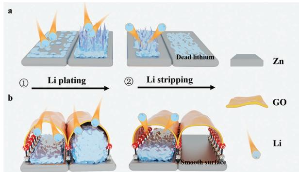
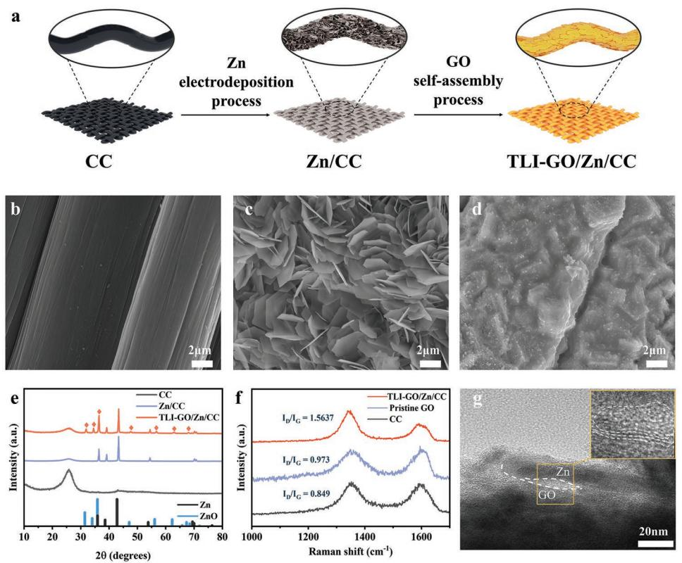
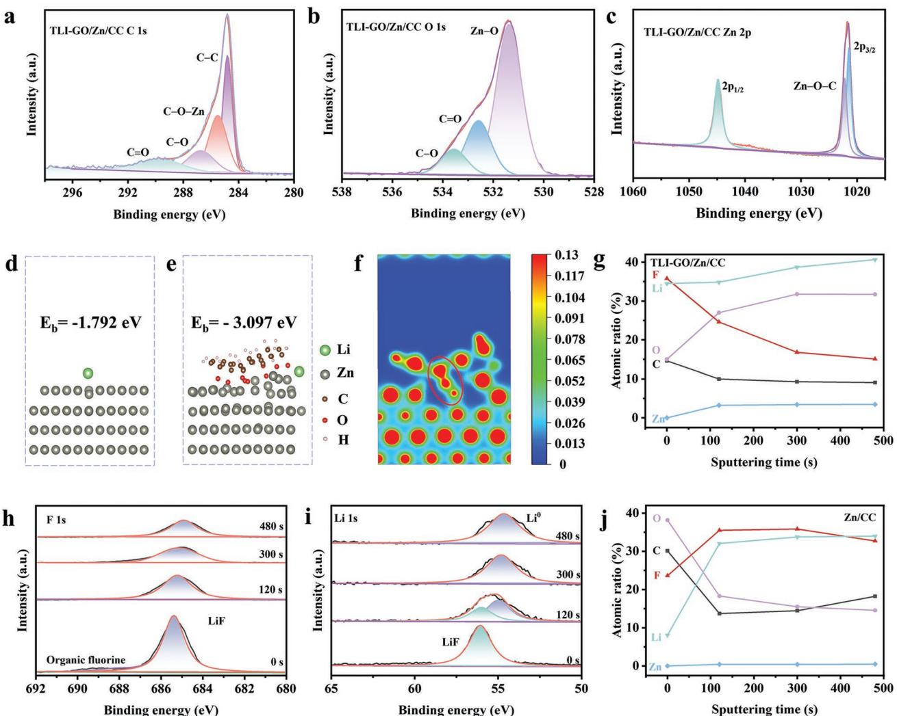
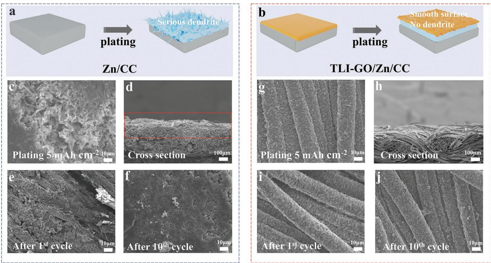
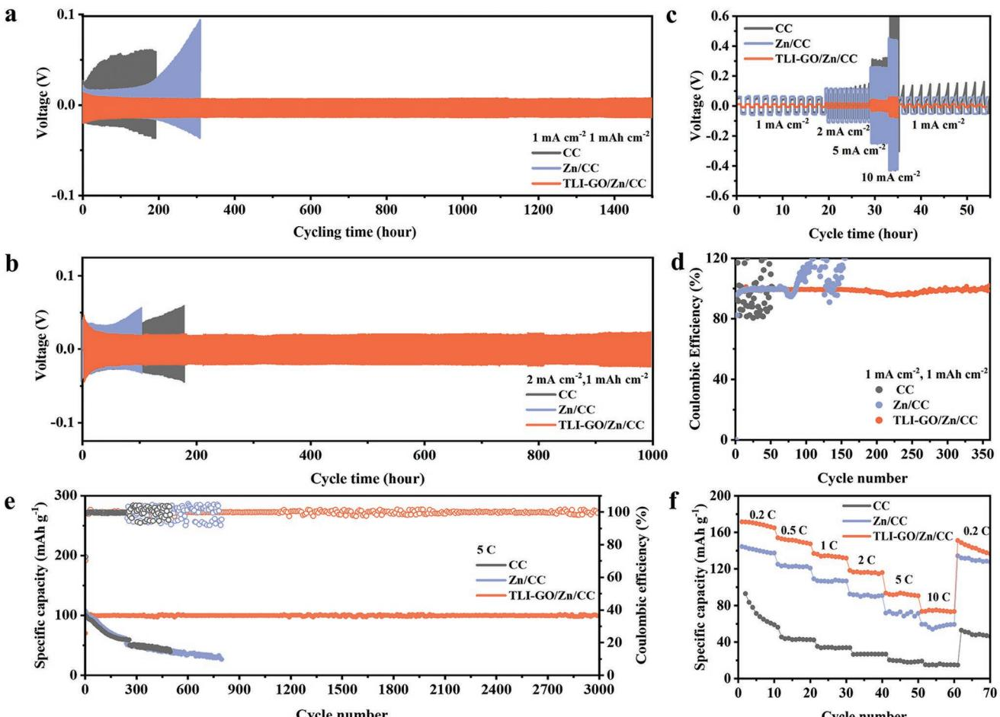

# **Self-Assembled Tent-Like Nanocavities for Space-Confined Stable Lithium Metal Anode**

*Nannan Zhang, Lulu Du, Jianyong Zhang, Hantao Xu, Xuan Zhou, Liqiang Mai, and Lin Xu\**

**Lithium metal is considered as a promising anode for its high energy density and low redox potential. However, dendrite growth and electrolyte-lithium reaction lead to poor cycling stability of lithium anodes. Herein, a spaceconfined strategy is proposed to realize stable Li metal anode by constructing a nonplanar interface with flexible tent-like nanocavities. The tent-like interface is achieved through the self-assembly of graphene oxide on zinc nanosheets, accompanied by the spontaneous formation of ZnOC bond. Remarkably, the ZnOC bond immobilizes the graphene oxide layer to ensure tent-like structural integrity, and shows excellent lithophilicity to induce homogeneous lithium deposition within nanocavities. Furthermore, the process of Li plating/ stripping is confined inside tent-like nanocavities to effectively decrease electrolyte content contact with fresh Li, which reduces hazardous electrolytelithium reaction and thus eliminates continuous consumption of Li metal. Consequently, the symmetrical cells with the tent-like interface deliver excellent long cycling performance over 1600 h at 1 mA cm−2 , and full batteries show high-capacity retention of 94.6% after 3000 cycles at 5 C. This strategy provides a unique flexible tent-like interface to achieve stable lithium metal anode.**

#### **1. Introduction**

In pursuit of energy storage devices with high energy density, lithium metal as an anode material has gained considerable attention due to its high specific capacity (3860 mAh g−1 ) and low redox potential (−3.040 V vs standard hydrogen electrode). Unfortunately, the commercial application of lithium metal

N. Zhang, L. Du, J. Zhang, H. Xu, X. Zhou, L. Mai, L. Xu State Key Laboratory of Advanced Technology for Materials Synthesis and Processing School of Materials Science and Engineering Wuhan University of Technology Wuhan 430070, P. R. China E-mail: linxu@whut.edu.cn L. Mai, L. Xu Hubei Longzhong Laboratory Wuhan University of Technology (Xiangyang Demonstration Zone) Xiangyang, Hubei 441000, P. R. China L. Mai, L. Xu Hainan Institute Wuhan University of Technology Sanya 572000, P. R. China

The ORCID identification number(s) for the author(s) of this article can be found under https://doi.org/10.1002/adfm.202210862.

#### **DOI: 10.1002/adfm.202210862**

anode (LMA) is restricted by the failure of anode materials, which is caused by the formation of the unstable solid electrolyte interface layer (SEI), dendrites on the anode surface, and the volume change, which will lead to internal short circuit and battery failure.[1] First, uneven interfacial composition and morphology of the unstable interface layer cause nonuniform surface current distribution, in which Li ions tend to deposit preferentially at high current density sites and induce dendrite growth.[2] Second, since the electrochemical potential of lithium metal is lower than the electrolyte, the lithium metal spontaneously reacts with the organic components in the electrolyte, forming the SEI on the Li surface.[3] However, the electrolyte-derived SEI exhibits structural brittleness and fails to withstand infinite volume changes during the lithium plating/depositing process. The unstable SEI results in low coulombic efficiency

(CE) and limited cycle life because of the overconsumption of electrolytes in Li metal batteries. Apart from that, the cracks derived from the SEI breakup lead to increased current density and dendrite problems. Along with the pulverization and fracture of dendrites, dead lithium is formed, which hinders the rapid transport of Li ions and further increases interface impendence, as shown in **Figure 1**a. Based on the above-mentioned discussion, design and fabrication of a stable interface to regulate uniform Li plating/stripping and protect lithium metal anodes by suppressing the electrolyte-lithium reaction, is important to high-performance lithium metal batteries with desired cyclic stability and high safety.

Considerable efforts have been made to construct a stable interface by in situ and ex situ interface modifications. Either way, the SEI layer should be chemically stable in the electrolyte and can inhibit the growth of lithium dendrites.[1b] Due to electrolyte-lithium reaction, electrolyte components form part of the SEI. Therefore, modifying electrolyte components, such as additives, salts, and solvents is promising to obtain homogeneous passivated SEI on the Li metal surface.[4] However, the SEI with Li compounds is brittle and unable to withstand huge volume change. Consequently, the in situ SEI is prone to rupture, and thus leads to continuous breakup and formation of SEI, which fails to achieve a long stable cycle owing to the continuous consumption of the electrolyte and Li metal.

**Figure 1.** Schematic illustration of lithium metal plating/stripping process on different substrates. a) Bare Zn nanosheets. b) Interface layer with tent-like nanocavities anchored by ZnOC bond. Note that carbon cloth acts as 3D host with various treatments.

In addition, ex situ interface modification has been applied to decrease contact between lithium Li metal and electrolyte and reduce side reactions by coating a passivated layer on the surface of Li metal anodes.[5] However, the adhesion between substrate and artificial SEI needs improve because volume change during cycling lead to repeated fluctuations and separations of the SEI layer.[6] Meanwhile, the non-uniform chemical compositions and defects in the artificial layer cause inhomogeneous Li deposition and the mechanically fragile SEI, which results in dendrite growth and side reactions.[7] Therefore, design and construction of a passivated SEI with strong binding to the substrate is key to regulating Li uniform deposition and achieving long cycle life.

Herein, we design a unique interface with flexible tent-like nanocavities by a facile self-assembly method to achieve reversible Li metal anodes and reduce electrolyte interference. Specifically, the interface is composed of graphene oxide and zinc nanosheets, in which the graphene oxide layer is immobilized on zinc nanosheets by a self-assembly process. The reason of graphene oxide self-assembly can be explained that the polar functional group of graphene oxide can increase the polarity of the surface, which helps to form a covalent bond between graphene oxide and zinc. In the self-assembly process, ZnOC bond is spontaneously formed, which is the key to the formation of tent-like nanocavities and enables close interface contact. Interestingly, the ZnOC bond presents an excellent affinity for lithium metal and serves as lithophilic site to guide even nucleation within nanocavities. Meanwhile, the flexible tent-like interface can provide large space to accommodate Li deposition and confine the plating/stripping process to the interior of the nanocavities, which facilitates the dendrite-free Li deposition, as shown in Figure 1b. Notably, the flexible graphene oxide layer improves the mechanical robustness of the tent-like interface, and induces the formation of a dense LiF layer on the graphene oxide. Therefore, due to the protective layer of graphene oxide and LiF, the Li metal can be confined in the nanocavities, which greatly reduces the direct contact with electrolyte. Benefitting from the composite tent-like interface layer, the symmetrical cells deliver high cycle stability of 1600 h with 1 mAh cm−2 at 1 mA cm−2 , and the full batteries assembled with LiFePO4 cathode exhibit excellent long-term cycle stability and rate capability, including a high-capacity retention of 94.6% after 3000 cycles at 5 C. This strategy of the tent-like interface design provides a promising direction for high-performance LMAs.

#### **2. Results and Discussion**

The fabrication process of the tent-like interface through graphene oxide (GO) self-assembly is shown in **Figure 2**a. Commercial carbon cloth (CC) was chosen as the substrate because of its excellent conductivity and 3D skeleton structure, which is beneficial for decreasing volume change generated during Li cycling. Then Zinc nanosheets were electroplated on CC named Zn/CC. Besides, with the assistance of the selfassembly process, GO layer was immobilized on Zn nanosheets by immersing Zn/CC in GO solution (denoted as GO/Zn/ CC with tent-like interface (TLI-GO/Zn/CC)). As a result, the morphological changes of different samples are illustrated in Figure 2b–d. When Zn was electroplated on CC, smooth carbon fibers are covered by thin, free-standing hexagonal Zn nanosheets. Note that, after GO self-assembly, the TLI-GO/ Zn/CC presents regular and densely arranged stepped topography, which indicates the interface reaction between GO layer and Zn nanosheets. The Transmission Electron Microscope (TEM) images in Figure S1 (Supporting Information) reflect the cicada-wing-like GO bounding to zinc nanosheets, indicating the existence of GO. The force-displacement curves to compare Young's modulus of various samples are shown in Figure S2 (Supporting Information). Young's modulus of TLI-GO/Zn/CC is 6.47 Gpa, whereas that of Zn/CC is 2.25 Gpa. This difference can be explained by the great mechanical flexibility of the tentlike interface.

Besides, the interface reaction is also investigated by X-ray diffraction (XRD) and Raman patterns. The XRD patterns of varied samples are analyzed as illustrated in Figure 2e. An obvious wide peak at 25.746° of carbon cloth can be observed in all three materials. Three well-defined diffraction peaks (2*θ* = 36.540°, 39.054°, and 43.44°) are assigned to Zn (JCPDS: 065–3358) in both Zn/CC and TLI-GO/Zn/CC, which corresponds to the (002), (100), and (101) planes, respectively.[8] Besides, the weak peaks at 31.6° and 36.408° of ZnO (JCPDS: 079–2205) are observed only in TLI-GO/Zn/CC sample, which indicates the interface reaction between GO and Zn. In Raman spectra (Figure 2f), the D and G peaks of pristine GO locate at 1350.3 and 1604.8 cm−1 , while peaks of TLI-GO/Zn/CC downshift slightly to 1343.6 and 1589.5 cm−1 , respectively.[9] The offset suggests a change in the lattice environment and the formation of new chemical bond.[10] Additionally, the intensity ratio of D and G peaks (ID/IG) of TLI-GO/Zn/CC (1.5637) increases markedly compared to pristine GO (0.973), indicating the formation of rGO.[11] Besides that, the Fourier transform infrared spectrometer (FTIR) spectra are characterized in Figure S3 (Supporting Information) to verify the existence of the rGO. Pristine GO shows the characteristic peaks at ≈3000 (OH stretching vibration), 1790 (CO stretching vibration), 1639 (CC stretching vibration), and 1470 cm−1 (CO stretching vibration).[12] The OH polar functional group increases the polarity of the surface of graphene oxide, which is the basis for forming covalent bonds and good adhesion between graphene

**Figure 2.** Designed synthesis of self-assembled tent-like nanocavities. a) The schematic diagram for the fabrication of Zn/CC and TLI-GO/Zn/CC samples. b–d) SEM images of CC b), Zn/CC c), and TLI-GO/Zn/CC d). e) XRD patterns for varied samples. f) Raman spectra of TLI-GO/Zn/CC compared with pristine GO and CC. g) HRTEM image of the tent-like nanocavity. Inset: enlarged view of the area.

oxide and Zn.[13] Meanwhile, in the TLI-GO/Zn/CC composite, a new peak at 600 cm−1 (ZnO stretching vibration) appears after GO self-assembling, indicating the oxidation reaction of Zn.[14] At the same time, the peak at 1790 cm−1 almost disappears, and the peak at 1470 cm−1 obviously becomes weak, reflecting the reduction of GO. Based on the above analysis, the reduction reaction between metal Zn and GO is illustrated in Equation 1. As a result, nanocavities are formed due to the reduction reaction, and can be observed with High Resolution TEM (Figure 2g). Furthermore, the selected area electron diffraction pattern in Figure S4 (Supporting Information) confirms the distribution of C, O, and Zn elements.

$$
Zn + GO + H^{+} \rightarrow ZnO + rGO + H_{2}O
$$
\n(1)

To verify the self-assembly process between GO and Zn, X-ray photoelectron spectroscopy (XPS) of the TLI-GO/Zn/ CC and pristine GO samples were characterized (**Figure 3**a–c; Figure S5, Supporting Information). The peaks of C 1s spectra at 284.8, 286.72, and 288.6 eV belong to CC, CO, and CO respectively in both TLI-GO/Zn/CC and pristine GO.[9,15] It's worth noting that a new peak located at 285.5 eV belongs to ZnOC.[9,16] Additionally, as shown in Figure 3b, the peaks of CO (532.59 eV) and COC (533.56 eV) of O 1s can be attributed to GO, and the peak at 531.38 eV suggests the existence of ZnO.[17] In Zn 2p spectrum of TLI-GO/Zn/ CC, the peaks at 1021.5, 1022.2, and 1044.8 eV correspond to Zn 2p3/2, ZnOC, and Zn 2p1/2 (Figure 3c), respectively.[18] The above results indicate that ZnOC bond facilitates to anchor GO layer on Zn nanosheets to ensure nice interface adhesion. Meanwhile, the density functional theory (DFT) calculations (Figure 3d–f) are performed to verify the effects of the ZnOC bond on Li deposition. The 2D slice of charge density in Figure 3f is evidence of the ZnOC bond. Charge density overlap in Figure 3f confirms that the ZnOC bond connects the Zn nanosheets layer and the GO layer.[19] Therefore, the ZnOC bond promotes the GO self-assembly process and fixes GO layer on Zn nanosheets. Meanwhile, the interface binding energy is also calculated by DFT, and the higher value (27.20 eV) indicates that graphene oxide has strong interface contact with Zn (Table S1, Supporting Information). Due to the electronic insulation of GO, the absorption energy calculation of TLI-GO/Zn/CC sample is carried out for a single Li atom deposited to ZnOC bond under the GO layer, while the Zn/CC sample is calculated for an isolated Li atom to the Zn slab (002) plane. Consequently, the absorption energy of the TLI-GO/Zn/CC sample is −3.097 eV, and the value of Zn/CC sample is −1.792 eV (Table S2, Supporting Information).[20] The lower absorption energy indicates a better affinity between the ZnOC bond and Li atom, which is favorable to guide Li-ion uniform nucleation and deposition within tentlike nanocavities. Apart from that, initial Li plating profiles in Figure S6 (Supporting Information) reveal the lower overpotential of TLI-GO/Zn/CC (8.0 mV) than Zn/CC (15.6 mV) and CC

**Figure 3.** Structure characterizations of interface with tent-like nanocavities. a–c) XPS spectra of C 1s, O 1s, and Zn 2p in TLI-GO/Zn/CC. d–f) The adsorption energy of isolated Li atom on the Zn surface of Zn/CC d) and TLI-GO/Zn/CC e), where the green, metallic, gray, red, and white balls represent isolated Li atom, Zn atoms, carbon atoms, oxygen atoms, and hydrogen atoms. f) 2D charge density slice of TLI-GO/Zn/CC. g–j) XPS depth profiling at different sputtering times after 10 cycles of Li@TLI-GO/Zn/CC g–i) and Li@Zn/CC j) electrodes. The sputtering time increases from 0 to 480 s.

(38.2 mV), proving a lower nucleation barrier and indicating the lithophilicity of ZnOC bond. Electrochemical impedance spectra (EIS) of symmetrical batteries are collected to test the interface resistance before and after the 100th cycle in which samples with Li pre-deposition serve as work electrodes (Figure S7, Supporting Information). Based on the equivalent circuit in Figure S8 (Supporting Information), Rsei represents the resistance from the SEI layer formed on the composite anode.[21] Meanwhile, the Rsei of electrodes with tent-like interface is much smaller than Li@Zn/CC electrodes, suggesting that the tent-like interface could enable efficient Li+ transport, and reduce the interface resistance. Even after the 100th cycle, the value of Rsei of Li@TLI-GO/Zn/CC is significantly lower than Li@Zn/CC electrodes, which also contributes to the exceptional cycling performance (Table S3, Supporting Information).

XPS depth with Ar+ sputtering is investigated to probe the chemical state of elements and protective effect of the tentlike interface layer after 10 cycles in Figure 3g–j. The survey shows the atomic ratio changes of Li, C, O, F, and Zn with different sputtering time of Li@TLI-GO/Zn/CC electrode (Figure 3g). For TLI-GO/Zn/CC sample, the C content reaches the extreme value after 30 s and then significantly decreases after 90 s (Figure S9, Supporting Information), while the Zn and Li content increase after 90 s. The changing trend of different elements indicates that the sputtering penetrates the GO layer after 90 s. At the same time, the F content decreases all the time. The significant reduction of the F element reflects that the tent-like interface layer can decrease electrolyte content contact with Li metal largely and reduce the electrolytelithium reaction. In comparison, the changing trend of the element content of Li@Zn/CC is reflected in Figure 3j. The F contents of Li@Zn/CC samples present an upward tendency with etching time increasing, which indicates continuous interface reaction and the generation of thick LiF (Figure S11, Supporting Information). A detailed analysis of the F 1s and Li 1s spectra shows that the two samples possess the same

**Figure 4.** Lithium plating and stripping behavior on varied electrodes. a,b) Schematic diagrams of Li plating process on the different electrodes. c–j) SEM images of Zn/CC c–f) and TLI-GO/Zn/CC g–j) electrodes after 1st and 10th plating and stripping. Top view images and cross section images after 1st plating of 5 mAh cm−2 c,d,j,h), and top view images after 1st e,i) and 10th f,j) stripping. The current density is 1 mA cm−2 .

outermost SEI before Ar etching (Figure 3h,i; Figure S11, Supporting Information), except that the Li@TLI-GO/Zn/CC has more F elements. The difference indicates that GO layer is facilitated to the formation of LiF (685 eV) on the electrode surface.[9a,22] Meanwhile, the organic fluorine (688.3 eV) in F 1s of both two samples would be attributed to the direct contact with the electrolyte. After sputtering for 120 s, the organic fluorine disappears and LiF decreases significantly of Li@TLI-GO/ Zn/CC, corresponding to the reduced F content in Figure 3g, which reflects the effective lessen of lithium-electrolyte reaction.[23] In addition, the Li 1s of Li@TLI-GO/Zn/CC further confirms the protective effect. As the etching progressed, the gradual decrease of LiF and the increase of Li0 demonstrate the outer LiF layer and interfacial deposition of Li within nanocavities, which reduces significantly lithium/electrolyte reactions (Figure 3i).[24] The above results mean that the GO/Zn/CC with the tent-like interface helps to reduce the reaction of inner Li metal and outer electrolytes.[25]

As we all know, the deposition morphology of lithium metal is closely related to interfacial behavior. To further investigate the lithium deposition behavior of the tent-like interface, morphological evolution of Li plating with different area capacities and cycling times at 1 mA cm−2 is observed in **Figure 4**. In the deposition process, Li metal is plated on the surface of the Zn/CC electrode with increasing deposition capacities. However, due to the direct contact with electrolytes and inhomogeneous morphology, uneven SEI forms and results in dendrite growth, as shown in Figure 4a. When depositing 1 mAh cm−2, the surface of Zn nanosheets is covered and the carbon fiber gaps are stuffed with mossy Li metal (Figure S12a, Supporting Information), which cannot effectively inhibit the huge volume expansion. With deposition capacity increasing to 5 mAh cm−2, whisker-like dendrites are formed between carbon fibers (Figure 4c). The above results can be observed intuitively from the cross sectional view in Figure 4d. The upper surface of Zn/CC is covered by Li metal, and the deposition thickness increases with increased Li plating capacities (Figure S12b, Supporting Information). To evaluate the reversibility of plating/stripping intuitively, Li-Zn/CC half cells were discharged for 3 mAh cm−2 at 1 mA cm−2, then charged to 1 V to make sure that Li was stripped off, and cycled several times. After the first cycle (Figure 4e), there is still Li metal left on the electrode, named dead lithium, and keeps increasing until covers the surface of CC after ten cycles (Figure 4f). Notably, the existence of dead lithium covers the lithophilic site and reduces the coulombic efficiency. On the contrary, for TLI-GO/ Zn/CC, the GO layer and LiF layer avoid Li surface deposition and protect Li metal from electrolytes. Besides, the ZnOC bond serves as lithophilic site to induce Li nucleation underneath the tent-like nanocavities. The passivated function and ZnOC bond contribute to the space-confined Li deposition. With the confined interface, the tent-like structure can confine Li metal inside cavities during plating/stripping, and ensure the reversible cycle without dendrite, as shown in Figure 4b. The TLI-GO/Zn/CC electrodes preserve the original morphology during plating/stripping at various area capacities and cycle numbers and exhibit no surface Li buildup (Figure 4g–j; Figure S12, Supporting Information). As a comparison, Li metal is plated on the surface of CC (Figure S13, Supporting Information) and the cross section images with different plating capacities are shown in Figure S14 (Supporting Information).

**Figure 5.** Electrochemical performance of Li@CC, Li@Zn/CC, and Li@TLI-GO/Zn/CC electrodes. a,b) Cycling performance of Li/Li symmetric cells with different current densities. c) Rate performance of various electrodes from 1 to 10 mA cm−2. d) The coulombic efficiency of plating/stripping on different electrodes at 1 mA cm−2 . The area capacity is set to 1 mAh cm−2 . e) Cycling performance of Li||LFP with three varied Li anodes at 5 C (1 C = 170 mA g−1 ). f) Rate performance of full batteries from 0.2 C to 10 C.

To evaluate the influence of the space-confined strategy on cycling stability, Li||Li symmetric cells were assembled to investigate deposition reversibility with a fixed capacity of 1 mAh cm−2 . Before the cell test, we predeposited 3 mAh cm−2 Li metal onto varied working electrodes. As demonstrated in **Figure 5**a, when performed at current density of 1 mA cm−2 , Li@CC and Li@ Zn/CC cells keep stable cycling within 200 h, then the overpotential voltage increases drastically, indicating poor stability and failure of cells. In contrast, Li@TLI-GO/Zn/CC cells show excellent stability over 1600 h with the lowest voltage polarization of ≈11 mV. When the current density is increased to 2 mA cm−2 , Li@TLI-GO/Zn/CC cells achieve a 1000 h cycle with a low polarization of 20 mV (Figure 5b). However, the cells without tent-like interface electrodes exhibit high voltage polarization and poor cycling performance. Moreover, under a high current density of 10 mA cm−2 , the polarization of Li@ CC and Li@Zn/CC cells increase rapidly, while Li@TLI-GO/ Zn/CC cells exhibit small voltage polarization of ≈38 mV over 400 h (Figure S16, Supporting Information). The stable cycling performance proves that the tent-like interface modification plays a pivotal role in regulating Li reversible deposition. Also, the rate performance of the symmetric cells is exanimated, as is shown in Figure 5c. Due to the enhanced interfacial dynamics, Li@TLI-GO/Zn/CC symmetric cells can stably cycle with the lowest polarization when the current density is continuously increased to 10 mA cm−2 , which reveals a stable lithium plating/ stripping process. Additionally, the voltage polarization histogram at different current conditions is shown in Figure S17 (Supporting Information). The Li@TLI-GO/Zn/CC electrodes have lowest polarized voltage relative to the other two samples. Combined with the above cycle life under various current conditions, the advantages of space-confined interface modification compared with previous works published in recent years are obvious (Table S4, Supporting Information). Coulombic efficiency (CE) is another key criterion to evaluate the reversibility and practicality of lithium metal anodes. Different interface structures affect the CE highly. The average CEs were tested by assembling half cells with Li metals as counter electrodes (Figure 5d). When the cycling capacity is 1 mAh cm−2 at 1 mA cm−2 , the TLI-GO/Zn/CC electrodes show a high average CE close to 100% within 370 cycles. In comparison, the average CEs of Zn/CC and CC electrodes fluctuate sharply.

To further verify the suitability performance of the nonplanar interface layer on CC for practical applications, full batteries pairing with LiFePO4 (LFP) cathodes were assembled. Figure 5e and Figure S18 (Supporting Information) present the galvanostatic tests of different anodes. At a rate of 5 C, the batteries with Li@CC and Li@Zn/CC anodes deliver initial capacities of ≈100 mAh g−1 , and degrade to ≈50 mAh g−1 after 300 cycles. The reduced capacity could be attributed to the inferior interface stability and cycling reversibility. On the contrary, Li@TLI-GO/ Zn/CC||LFP cells enable an initial capacity of 118 mAh g−1 and excellent capacity retention of 94.6% after 3000 cycles with a coulombic efficiency of 99.9%. We also test the cycling performance at the rate of 1 C. The batteries with Li@TLI-GO/Zn/ CC anodes exhibit long cycling life up to 3000 cycles with a capacity retention of 93.5%. The great cycling performance in the carbonate electrolytes can also be observed as shown in Figure S19 (Supporting Information). Apart from that, the charge/discharge curves also reflect the stability as shown in Figure S20 (Supporting Information). Besides, the batteries with tent-like interface modified anodes enable much high discharge capacities of 168, 150, 134.7, 116.4, 93, and 75 mAh g−1 under 0.2 C, 0.5 C, 1 C, 2 C, 5 C, and 10 C respectively, but the rate performance of full batteries with Li@Zn/CC anodes deliver 137, 121, 107, 90, 71, and 5 mAh g−1 at various rates (Figure 5f). The excellent electrochemical proprieties demonstrate that the tent-like interface layer effectively promotes reversible Li metal deposition and achieves stable Li metal anodes.

#### **3. Conclusion**

In conclusion, we demonstrate a space-confined strategy for stable lithium metal anode by designing a nonplanar interface layer with tent-like nanocavities through self-assembly of graphene oxide. Due to the spontaneous reaction between graphene oxide and zinc, lithiophilic ZnOC bond generates and serves as nucleation site to induce Li deposition within tentlike nanocavities. Besides, the tent-like structure is anchored by ZnOC bond and reduce hazardous electrolyte-lithium reaction by decreasing electrolyte content contact with Li metal. The passivated function can be attributed to the synergistic effect of the dense and insulate graphene oxide and LiF layer. Consequently, the structure can not only provide large space for Li plating/stripping and spatially confine Li metal inside the tent-like interface layer to guide Li dendrite-free deposition, but also reduce electrolyte-lithium reaction and avoid continuous consumption of Li metal and electrolytes. Owing to the merits, stable symmetric Li-Li batteries are achieved with a long cycle life of 1600 h and low polarized voltage (11 mV) with 1 mAh cm−2 at 1 mA cm−2 . The full batteries realize a 94.6% capacity retention after 3000 cycles at 5 C. This strategy for interface design is expected to provide inspiration for highperformance Li metal anodes.

### **Supporting Information**

Supporting Information is available from the Wiley Online Library or from the author.

### **Acknowledgements**

N.N.Z. and L.L.D. contributed equally to this work. This work was supported the National Natural Science Foundation of China (52272234), the National Key Research and Development Program of China (2020YFA0715000), the Key Research and Development Program of Hubei Province (2021BAA070), Independent Innovation Projects of the Hubei Longzhong Laboratory (2022ZZ-20), and the Sanya Science and Education Innovation Park of Wuhan University of Technology (2021KF0011).

### **Conflict of Interest**

The authors declare no conflict of interest.

## **Data Availability Statement**

The data that support the findings of this study are available from the corresponding author upon reasonable request.

#### **Keywords**

dendrite-free depositions, Li metal anodes, space-confined strategies, tent-like nanocavities

> Received: September 18, 2022 Revised: December 21, 2022 Published online: January 29, 2023

- [1] a) X. Meng, Y. Xu, H. Cao, X. Lin, P. Ning, Y. Zhang, Y. G. Garcia, Z. Sun, *Green Energy Environ.* **2020**, *5*, 22; b) X. Zhang, Y. Yang, Z. Zhou, *Chem. Soc. Rev.* **2020**, *49*, 3040.
- [2] a) Q. Li, H. Pan, W. Li, Y. Wang, J. Wang, J. Zheng, X. Yu, H. Li, L. Chen, *ACS Energy Lett.* **2018**, *3*, 2259; b) Y. Fan, T. Tao, Y. Gao, C. Deng, B. Yu, Y. I. Chen, S. Lu, S. Huang, *Adv. Mater.* **2020**, *32*, 2004798; c) D. Wang, W. Zhang, W. Zheng, X. Cui, T. Rojo, Q. Zhang, *Adv. Sci.* **2017**, *4*, 1600168; d) X. R. Chen, B. C. Zhao, C. Yan, Q. Zhang, *Adv. Mater.* **2021**, *33*, 2004128.
- [3] a) P. Forrer, F. Schlottig, H. Siegenthaler, M. Textor, *J. Appl. Electrochem.* **2000**, *30*, 533; b) F. Zhao, P. Zhai, Y. Wei, Z. Yang, Q. Chen, J. Zuo, X. Gu, Y. Gong, *Adv. Sci.* **2022**, *9*, 2103930; c) X. Zheng, L. Huang, W. Luo, H. Wang, Y. Dai, X. Liu, Z. Wang, H. Zheng, Y. Huang, *ACS Energy Lett.* **2021**, *6*, 2054.
- [4] a) C. Yan, H. R. Li, X. Chen, X. Q. Zhang, X. B. Cheng, R. Xu, J. Q. Huang, Q. Zhang, *J. Am. Chem. Soc.* **2019**, *141*, 9422; b) X. Q. Zhang, X. B. Cheng, X. Chen, C. Yan, Q. Zhang, *Adv. Funct. Mater.* **2017**, *27*, 16059; c) Q. Ma, X. Sun, P. Liu, Y. Xia, X. Liu, J. Luo, *Angew. Chem., Int. Ed.* **2019**, *58*, 6200.
- [5] a) R. Xu, X. B. Cheng, C. Yan, X. Q. Zhang, Y. Xiao, C. Z. Zhao, J. Q. Huang, Q. Zhang, *Matter* **2019**, *1*, 317; b) Z. Zhan, L. Xu, J. An, H. Du, Z. Weng, W. Lu, *Adv. Eng. Mater.* **2017**, *19*, 1700101; c) N. W. Li, Y. X. Yin, C. P. Yang, Y. G. Guo, *Adv. Mater.* **2016**, *28*, 1853.
- [6] a) P. Li, X. Dong, C. Li, J. Liu, Y. Liu, W. Feng, C. Wang, Y. Wang, Y. Xia, *Angew. Chem. Int. Ed.* **2019**, *58*, 2093; b) M. Bai, K. Xie, K. Yuan, K. Zhang, N. Li, C. Shen, Y. Lai, R. Vajtai, P. Ajayan, B. Wei, *Adv. Mater.* **2018**, *30*, 1801213; c) Y. Zhou, X. Zhang, Y. Ding, L. Zhang, G. Yu, *Adv. Mater.* **2020**, *32*, 2005763.
- [7] a) T. Liu, J. Ge, Y. Xu, L. P. Lv, W. Sun, Y. Wang, *Energy Storage Mater.* **2020**, *32*, 261; b) W. Xu, J. Wang, F. Ding, X. Chen, E. Nasybulin, Y. Zhang, J. G. Zhang, *Energy Environ. Sci.* **2014**, *7*, 513.

- [8] Q. Zhang, J. Li, Q. Lin, C. Fang, *Environ. Res.* **2020**, *188*, 109698.
- [9] a) H. Wang, Y. Li, Y. Li, Y. Liu, D. Lin, C. Zhu, G. Chen, A. Yang, K. Yan, H. Chen, Y. Zhu, J. Li, J. Xie, J. Xu, Z. Zhang, R. Vila, A. Pei, K. Wang, Y. Cui, *Nano Lett.* **2019**, *19*, 1326; b) T. Yang, L. Li, F. Wu, R. Chen, *Adv. Funct. Mater.* **2020**, *30*, 2002013.
- [10] S. X. Wang, L. Yang, L. P. Stubbs, X. Li, C. He, *ACS Appl. Mater. Interfaces* **2013**, *5*, 12275.
- [11] a) W. Chen, X. Feng, J. Chen, L. Yan, *RSC Adv.* **2014**, *4*, 42418; b) J. Qiu, P. Zhang, M. Ling, S. Li, P. Liu, H. Zhao, S. Zhang, *ACS Appl. Mater. Interfaces* **2012**, *4*, 3636; c) W. Zou, L. Zhang, L. Liu, X. Wang, J. Sun, S. Wu, Y. Deng, C. Tang, F. Gao, L. Dong, *Appl. Catal. B* **2016**, *181*, 495.
- [12] a) Y. Feng, Y. Zhang, X. Song, Y. Wei, V. S. Battaglia, *Sustainable Energy Fuels* **2017**, *1*, 767; b) N. A. Devi, S. Sinha, S. Nongthombam, B. P. Swain, *Mater. Sci. Semicond. Process.* **2022**, *137*, 106212; c) M. H. Kunita, E. M. Girotto, E. C. Muniz, A. F. Rubira, *Braz. J. Chem. Eng.* **2006**, *23*, 267; d) M. A. Gauthier, I. Stangel, T. H. Ellis, X. X. Zhu, *Biomaterials* **2005**, *26*, 6440; e) P. Hellwig, C. Gomes, M. Teixeira, *Biochemistry* **2003**, *42*, 6179; f) W. Li, Y. Zhang, H. Li, Z. Chen, T. Shang, Z. Wu, C. Zhang, J. Li, W. Lv, Y. Tao, Q. H. Yang, *Batteries Supercaps* **2020**, *3*, 892.
- [13] S. Panda, T. K. Rout, A. D. Prusty, P. M. Ajayan, S. Nayak, *Adv. Mater.* **2018**, *30*, 1702149.
- [14] a) A. Jayachandran, R. A. T, A. S. Nair, *Biochem. Biophys. Rep.* **2021**, *26*, 100995; b) B. Ranjithkumar, H. B. Ramalingam, E. R. Kumar, C. Srinivas, G. Magesh, C. S. Rahale, N. M. El-Metwaly, B. C. Shekar, *Ceram. Int.* **2021**, *47*, 14475.
- [15] C. Kubo, M. Kanda, K. Miyazaki, T. Okada, M. C. Faudree, Y. Nishi, *Mater. Trans.* **2015**, *56*, 1821.
- [16] A. Naseri, M. Samadi, A. Pourjavadi, S. Ramakrishna, A. Z. Moshfegh, *Ceram. Int.* **2021**, *47*, 26185.
- [17] a) B. Y. Chen, Y. T. Tsao, S. H. Chang, *Coatings* **2018**, *8*, 468; b) C. A. Soto Robles, P. A. Luque, C. M. Gómez Gutiérrez, O. Nava, A. R. Vilchis Nestor, E. Lugo Medina, R. Ranjithkumar, A. Castro Beltrán, *Results Phys.* **2019**, *15*, 102807.
- [18] D. Hu, C. Song, X. Jin, Q. Huang, *J. Alloys Compd.* **2020**, *843*, 156030.
- [19] a) S. H. Lee, J. S. Goh, D. Cho, *Phys. Rev. Lett.* **2019**, *122*, 106404; b) M. M. elAttar, N. K. Allam, *RSC Adv.* **2022**, *12*, 6433.
- [20] D. Kang, S. Sardar, R. Zhang, H. Noam, J. Chen, L. Ma, W. Liang, C. Shi, J. P. Lemmon, *Energy Storage Mater.* **2020**, *27*, 69.
- [21] Y. Zhou, X. Zhang, Y. Ding, L. Zhang, G. Yu, *Adv. Mater.* **2020**, *32*, 2005763.
- [22] a) X. Zhou, W. Huang, C. Shi, K. Wang, R. Zhang, J. Guo, Y. Wen, S. Zhang, Q. Wang, L. Huang, J. Li, X. Zhou, S. Sun, *ACS Appl. Mater. Interfaces* **2018**, *10*, 35296; b) Y. Zhou, X. Zhang, Y. Ding, J. Bae, X. Guo, Y. Zhao, G. Yu, *Adv. Mater.* **2020**, *32*, 2003920.
- [23] a) L. Fan, B. Sun, K. Yan, P. Xiong, X. Guo, Z. Guo, N. Zhang, Y. Feng, K. Sun, G. Wang, *Adv. Energy Mater.* **2021**, *11*, 2102242; b) U. Pal, D. Rakov, B. Lu, B. Sayahpour, F. Chen, B. Roy, D. R. MacFarlane, M. Armand, P. C. Howlett, Y. S. Meng, M. Forsyth, *Energy Environ. Sci.* **2022**, *15*, 1907.
- [24] Y. Yao, X. Zhao, A. A. Razzaq, Y. Gu, X. Yuan, R. Shah, Y. Lian, J. Lei, Q. Mu, Y. Ma, Y. Peng, Z. Deng, Z. Liu, *J. Mater. Chem. A* **2019**, *7*, 12214.
- [25] A. Hu, W. Chen, X. Du, Y. Hu, T. Lei, H. Wang, L. Xue, Y. Li, H. Sun, Y. Yan, J. Long, C. Shu, J. Zhu, B. Li, X. Wang, J. Xiong, *Energy Environ. Sci.* **2021**, *14*, 4115.