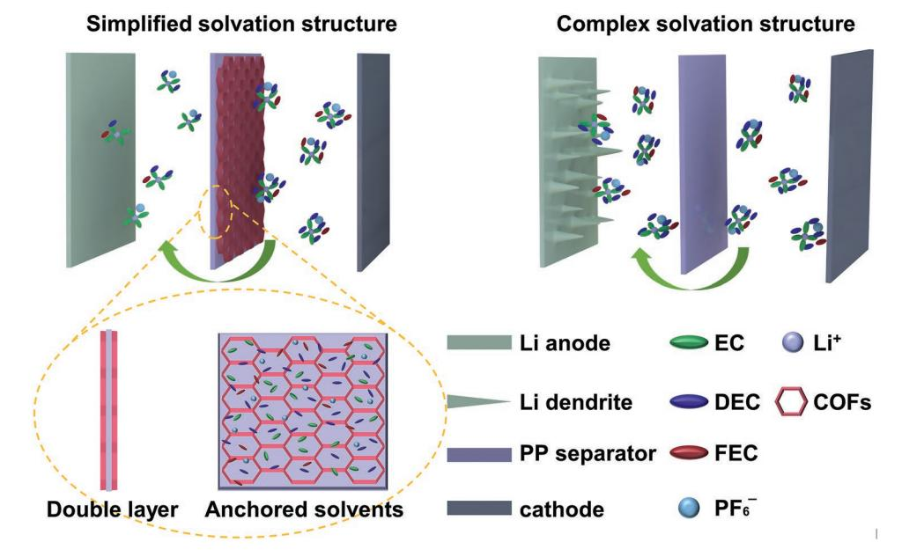
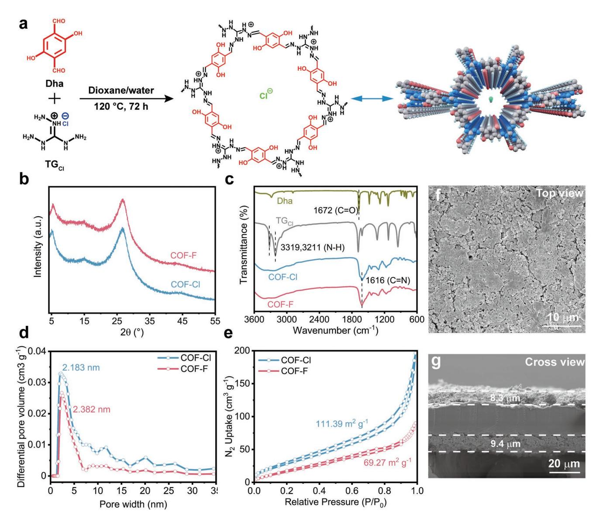
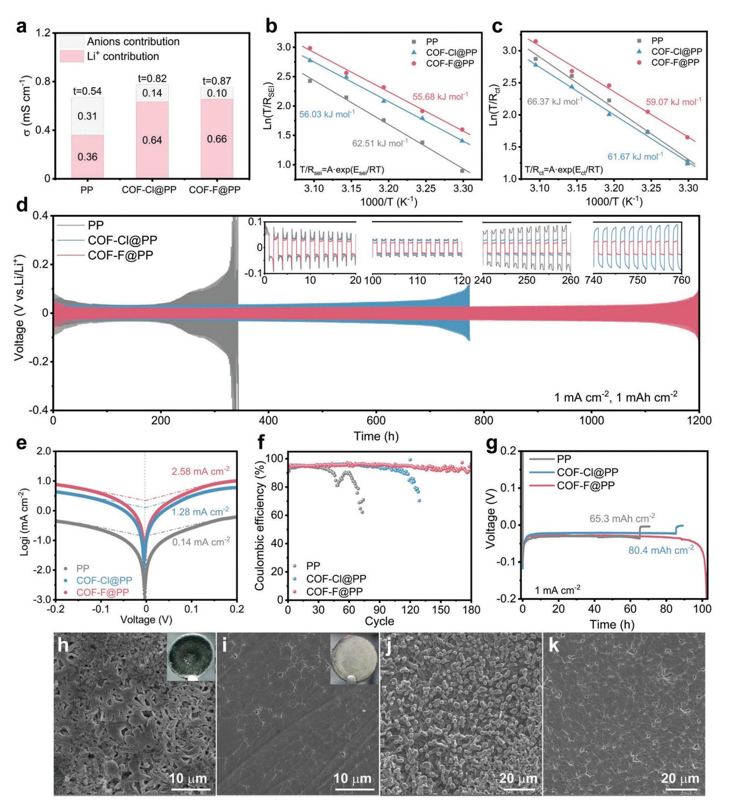
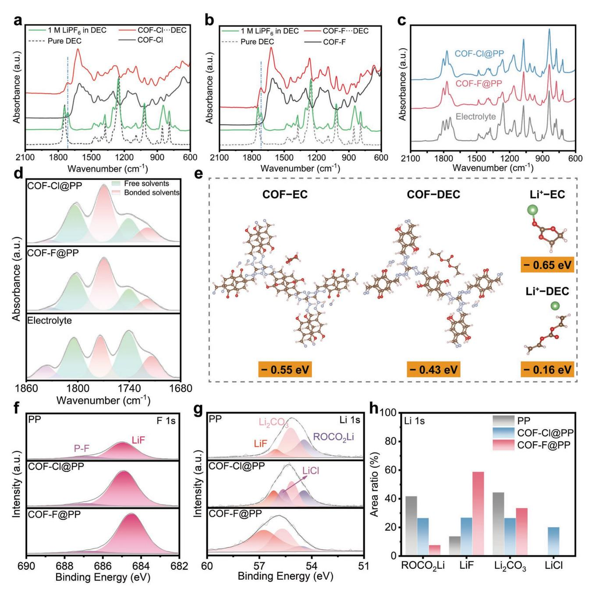
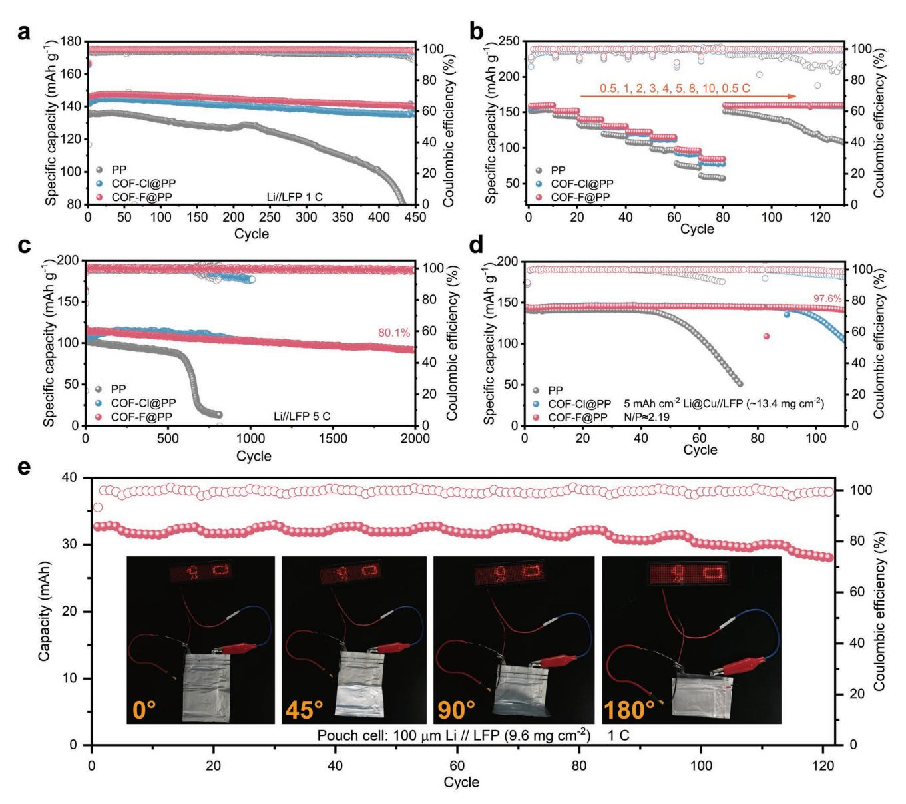

# **A Dual**−**Functional Cationic Covalent Organic Frameworks Modified Separator for High Energy Lithium Metal Batteries**

*Shiyan Yao, Yan Yang, Ziwei Liang, Jiahe Chen, Jieying Ding, Fangkun Li, Junhao Liu, Lei Xi, Min Zhu, and Jun Liu\**

**Separator modification is an efficient strategy to handle with the challenges of lithium metal batteries but its success is primarily subject to the modification of the materials. Herein, a cationic covalent organic framework (COF) composed of positively charged organic units and weakly bonded fluoride ions (F**−**) is introduced to modify the commercial polypropylene separator (COF**−**F@PP). It is found that the organic unit has abundant nanopores to homogenize the lithium ions (Li**+**) flux and can interact with electrolyte solvent molecules to form a desolvation structure of Li**+**. Meanwhile, the F**− **within the nanopores is proved to assist in building a robust LiF**−**riched solid electrolyte interphase to avoid the side reactions between lithium anode and electrolyte. Hence, the COF**−**F@PP delivers feasible practicality for the outstanding cycling stability, high Coulombic efficiency, and superior rate capability of Li//LFP coin cell at 5 C, low N/P ratio (2.19) full cell, and pouch cell at 1 C.**

#### **1. Introduction**

To improve the energy density of rechargeable lithium batteries, metallic Li has been regarded as the most promising candidate for the commercially used graphite due to its ultrahigh theoretical capacity of 3860 mAh g−1 , lowest redox potential (−3.04 V versus standard hydrogen electrode) and relatively low mass density (0.534 g cm−3 ).[1–4] However, the practical application of lithium metal anode is profoundly restricted by lithium dendrites growth and complicated side reactions, resulting in poor cycling stability and low Coulombic efficiency (CE). What's worse, the dendrites could eventually penetrate the separator and cause serious safety hazards if infinitely aggravated by the side reactions.[5,6] To address the above challenges, studies on anode structure, interface, and electrolyte have been carried out, such as designing 3D current collectors,[7–9] constructing

S. Yao, Y. Yang, Z. Liang, J. Chen, J. Ding, F. Li, J. Liu, L. Xi, M. Zhu, J. Liu Guangdong Provincial Key Laboratory of Advanced Energy Storage Materials

School of Materials Science and Engineering South China University of Technology Guangzhou 510641, P. R. China

E-mail: msjliu@scut.edu.cn

The ORCID identification number(s) for the author(s) of this article can be found under https://doi.org/10.1002/adfm.202212466.

**DOI: 10.1002/adfm.202212466**

artificial SEI,[10,11] using electrolyte additives[12,13] and solid-state electrolytes.[14–16] Nevertheless, as an essential component of LMBs, the separator has received less attention.

During cycling, the separator provides channels for Li+ migration and avoids direct contact between cathode and anode. The physicochemical properties of the separators, including but not limited to pore size, electrolyte wettability, mechanical strength, chemical, and electrochemical parameters, acutely affect battery performance.[17–19] The currently used commercial polyolefin−based separators (polyethylene/PE and polypropylene/PP) have high mechanical strength and good chemical and electrochemical stability, but their electrolyte wettability and thermal sta-

bility are far from request.[20,21] There are numerous studies on replacing polyolefin−based separators with nonwoven separators such as poly(vinylidene fluoride),[22–24] polyimide (PI)[25–27] and polyacrylonitrile (PAN),[28,29] which are of great advantages in refining electrolyte wettability and thermal stability, but difficult to control the pore size, porosity, and mechanical strength.[17,30] In contrast, surface modification of commercial polyolefin−based separators shows a higher prospect.[31,32] For example, Jung et al.[33] found that Al2O3 and Mg(OH)2 coating layer can not only substantially ameliorate the thermal stability and electrolyte wettability of PE separators, but also inhibit dendrites from piercing the separator, thereby prolonging batteries' lifespan. This is a comparatively successful study, but there are still some flaws that existed, such as some tiny Al2O3 or Mg(OH)2 particles would block the pores of the separator, thus hindering the Li+ transfer and causing the internal resistance increase. In addition, the mass density of Al2O3 or Mg(OH)2 is relatively high and it is not a wise choice to sacrifice the energy density in exchange for better performance of batteries. Therefore, the selection of suitable materials is the key to this scheme.

Fortunately, the rise of covalent organic frameworks composed of lightweight elements (C, H, O, N, etc.) opens up new options for separator modification. The COFs have been gradually applied to LMBs due to their adjustable chemical properties, durable electrochemical and thermal stability, high porosity, and large surface area.[34–38] Herein, we construct

**Scheme 1.** Graphic comparison of the batteries with different separators: the COF−F@PP modified battery shows a simplified solvation structure and a dendrite−free anode (left), while the battery with pristine PP separator shows a complex solvation structure and dendrites growth (right).

coating layers on both sides of the commercial PP separator by a simple blade−coated method with a cationic COF consisting of positively charged organic units and weakly bonded Cl− (COF−Cl) within its pores, which exhibits high potential in transporting and regulating Li ions due to its special ability of immobilizing ionic centers and binding ion guests by adjusting the Lewis acidity/basicity of the ion functional sites.[39,40] As **Scheme 1** shows, the positively charged organic units of COF−Cl can interreact with the solvent molecules in the electrolyte and anchor them near the separator, thereby reducing the degree of Li+ solvation structure to accelerate Li+ transfer. On the other hand, the Cl− can be replaced by F− (COF−F) through a simple ion exchange reaction which induces a robust LiF−riched SEI forming on the anode surface to prevent the side reactions and inhibit dendrites growth. Meanwhile, the porous structure and large specific surface area can provide channels for Li+ migrating to homogenize Li+ flux as well as enhance the electrolyte wettability. Consequently, the Li//LFP battery using COF−F@PP can stably cycle for more than 450 cycles at 1 C and 2000 cycles at 5 C with high capacity retention and Coulombic efficiency, respectively. More dramatically, the low N/P ratio full cell and pouch cell assembled with COF−F@PP also possess superior cycling stability and rate capacity, showing the high commercialization value of the modified separator.

#### **2. Results and Discussion**

As shown in **Figure 1**a, based on Schiff reaction, 2,5−dihydroxyterephthalaldehyde (Dha) and triaminoguanidinium chloride (TGCl) were added to the mixed solution of 1,4−dioxane and deionized water to synthesize COF−Cl powder and the COF−F powder was obtained by stirring COF−Cl powder in saturated sodium fluoride solution (Figure S1, Supporting Information).[41,42] Powder X−ray diffraction (PXRD) was used to analyze the crystal structure of the as−prepared COF powders. As shown in Figure 1b, the minor peak at 5.2° and the major peak at 26.7° correspond to the reflection of the (100) plane and the poor *π*−*π* stacking between the layers in the vertical direction.[41,43] The Fourier transform infrared spectroscopy (FT−IR) results indicate a new stretching vibration band of imine bonds formed by the condense between the aldehyde groups of Dha and amino groups of TGCl at 1616 cm−1 . Besides, the disappearance of CO peaks (1672 cm−1 ) of Dha and N−H peaks (3319 and 3211 cm−1 ) of TGCl further verifies the formation of imine bonds, illustrating the accurate synthesis of COF−Cl[41] (Figure 1c). No significant difference in PXRD pattern and FT−IR spectrum is detected between COF−Cl and COF−F confirming the weak interaction between organic units and anions, which is a prerequisite for ion exchange reaction. For the purpose of verifying the reliability of ion exchange, the COF−Cl and COF−F powders were analyzed by X−ray photoelectron spectroscopy (XPS) and as shown in Figure S2 (Supporting Information), the Cl signal is completely replaced by *F* signal, demonstrating the success of ion exchange. The scanning electron microscopy (SEM) images and corresponding energy dispersive spectroscopy (EDS) elemental mapping images of these two COF powders are displayed in Figure S3 (Supporting Information). After ion exchange, the powder's color turned from orange into maroon, and the SEM images illustrate that the particle size of them are both about 3−5 µm while the EDS spectrum shows the uniform distribution of F element in COF−F powder. The Brunauer−Emmett−Teller (BET) surface area and pore size are 111.39 m2 g−1 and 1.834 nm for COF−Cl powder and 69.27 m2 g−1 and 2.183 nm for COF−F powder (Figure 1d,e). This relatively low surface area could be result of poor layer stacking, small pore diameter or pore blocking by the counteranions.[41,44] Anyway, it is enough for separator modification.

The modified separators were prepared by directly coating the slurry on the surface of pristine PP with a blade (Figure S4,

**Figure 1.** a) Schematic synthesis of COF−Cl. b) PXRD patterns of COF−Cl and COF−F powers. c) FT−IR spectra of Dha, TGCl, COF−Cl, and COF−F powders. d) Micropore size distribution and e) N2 adsorption–desorption curves of COF−Cl and COF−F powders. f) Top−view and g) cross-sectional SEM images of COF−F@PP separator.

Supporting Information). Figure 1f, g shows the surface and cross morphology of COF−F@PP. After blade−coated, the COF−F powder is distributed evenly on the surface of pristine PP with some inevitable cracks, which is beneficial for electrolyte wettability promotion. The thickness of each coating layer is within 10 µm so the total thickness of COF@PP is less than 45 µm and would not engender too much loss of energy density. Similar results can be investigated in COF−Cl@PP as well (Figure S5, Supporting Information). The electrolyte wettability of pristine PP, COF−Cl@PP, and COF−F@PP is examined through electrolyte contact angle measurements, and the commensurate contact angles are 45°, 14°, and 12°, respectively (Figure S6, Supporting Information). Moreover, after about 10 s, the contact angle of modified separator becomes 0° while pristine PP maintains 45° for over 20 s. The outstanding electrolyte wettability is primarily attributed to the relatively large specific surface area, abundant nanopores, and interactions between COFs and electrolytes, which is beneficial for homogenizing Li+ flux.[45]

Before evaluating the electrochemistry performance of the modified separators, they were soaked in 10 mL electrolyte for 7 days as well as assembled in a H−type Li//Li symmetric cell for 10 cycles to ensure the COF would not soluble in the electrolyte (Figure S7, Supporting Information). After soaking the separators for 7 days and deposition/stripping for 10 cycles, the electrolyte kept clear and no significant characteristic peak of CN at 1616 cm−1 of COFs was detected in the FI−IR spectra, verifying that the COFs do not dissolve in the electrolyte (Figure S8, Supporting Information). Additionally, the linear sweep voltammetry test was also conducted and the results show that the cells with modified separators have higher electrolyte decomposition voltage than pristine PP, indicating that they can help

**Figure 2.** a) Ionic conductivity and Li+ transference number plot. The activation energy of b) Li+ diffusing through the SEI ( $E_{sei}$ ) and c) Li+ desolvating at the anode/electrolyte interface ( $E_{cl}$ ). d) Cycling performance of the Li//Li symmetric cells at 1 mA cm-2 for 1mAh cm-2, inset is the enlarged views at different cycling times. e) Tafel plots for Li plating/stripping of the Li//Li symmetric cells. f) CE of Li//Cu half cells at 1 mA cm-2 for 1 mAh cm-2. g) Long-time deposition performance of the Li//Cu half cells. SEM images of Li anode after 20 cycles in Li//Li symmetric cells with h) pristine PP and i) COF-F@PP, inset is the optical images. SEM images of Li deposition morphology in Li//Cu half cells with j) pristine PP and k) COF-F@PP.

to stabilize the electrolyte (Figure S9, Supporting Information). Consequently, to clarify the influence of different separators on the electrochemical performance of the LMBs, the ionic conductivity ( $\sigma$ ), Li+ transference number ( $t_{Li+}$ ), and activation energy ( $E_a$ ) were tested. As illustrated in Figure 2a, Figure S10, S11 and Table S1 (Supporting Information), the ionic conductivity of

pristine PP, COF−Cl@PP, and COF−F@PP is 0.67, 0.78, and 0.76 mS cm−1 respectively, basically keeping at the same magnitude, demonstrating that the outstanding electrolyte wettability of modified separator can offset for the negative impact on ionic conductivity caused by the increase of thickness. However, the Li+ transference number (the contribution of Li+ to the ionic conductivity) of COF−Cl@PP and COF−F@PP increase from 0.54 to 0.82 and 0.87 respectively compared with pristine PP. These results indicate that the solvation structure of Li+ is simplified due to the interaction between the COFs and solvent molecules, thus increasing the mobility of Li+. [46–48] Meanwhile, the temperature−dependent electrochemical impedance spectroscopy (EIS) was utilized to measure the activation energy of Li+ diffusing through the SEI (*Esei*) and Li+ desolvating at the anode/electrolyte interface (*Ect*). As seen in Figure S12 and Table S2 (Supporting Information), the two semicircles of Nyquist plots in high-frequency region and middle−high frequency region denote the SEI resistance (*Rsei*) and charge transfer resistance (*Rct*), respectively, and can be used to calculate the *E*sei and *E*ct via the Arrhenius equation.[49–51] The *Esei* is intimately related to the microstructure and components of SEI layer, thus the reduced *Esei* of the modified separators implies that the SEI induced by them is more conducive to Li+ transport. In addition, the lower *Ect* values of COF−Cl@PP and COF−F@PP (61.67 and 59.07 kJ mol−1 , respectively) than pristine PP (66.37 kJ mol−1 ) definitely verify the simplified Li+ solvation structure (Figure 2b,c). The exchange current density (*i0*) associated with the reaction kinetics further supports this conclusion (Figure 2e). The *i0* value of COF−F@PP (2.58 mA cm−2 ) is much higher than that of COF−Cl@PP and pristine PP (1.28 and 0.14 mA cm−2, respectively), indicating a faster electrochemical reaction at the interface.[52,53]

Li//Li symmetric cell tests more intuitively demonstrate the impact of the modified separator. Figure 2d shows the long− term cycling performance of Li//Li symmetric cells using different separators at a current density of 1 mA cm−2 with a stationary capacity of 1 mAh cm−2. The cell with COF−F@PP exhibits lower polarization voltage than the cells with COF−Cl@PP and pristine PP at the initial stage and the final polarization of them stabilizes at 18, 27, and 31 mV (vs Li+/Li), respectively after different cycles. It should be noted that the polarization voltage of the modified separator is both faster stabilized and lower than that of pristine PP, indicating a swift SEI evolution that hinders the side reactions between anode and electrolyte. In addition, the cell with COF−F@PP and COF−Cl@PP can persistently cycle over 1100 h and 700 h individually with negligible voltage fluctuation while the cell with pristine PP experienced substantial voltage fluctuation after 230 h. The prolonged lifespan of the cell with COF−F@PP is attached to the protection of the robust LiF−riched SEI. The same results can be observed when raising the test condition to 3 mA cm−2 and 3 mAh cm−2 (Figure S13a, Supporting Information). Figure 2h,i and Figure S13b (Supporting Information) show the optical and SEM images of lithium anode after 20 cycles with the three separators. For pristine PP, the anode was covered with a large amount of visible black "dead Li" (which can be easily washed off by DEC) and loose deposition and lithium dendrites are obviously investigated under SEM. Contrarily, the anode using COF−F@PP as a separator

maintained smooth both in optical and SEM view while the morphology of the anode with COF−Cl@PP is somewhere in between, no obvious "dead Li" but mossy−like dendrites can be observed. Besides, the EIS tests of Li//Li symmetric cells before and after cycling were conducted to reveal the interfacial resistance and interface stability. As Figure S14 and Table S3 (Supporting Information) depict, the symmetric cells with modified separators possess lower *Rsei* and *Rct* than pristine PP both before and after cycling. Noting that the value of *Rsei* was continuously decreasing at the initial stage and stabilized after 50 cycles, which is consistent with the change of polarization voltage of Li//Li symmetric cells in long−term cycling performance. It is obvious that *Rsei* of the cell with pristine PP increased to 77.2 Ω after 150 cycles and suffered a short circuit after 200 cycles and that of COF−Cl@PP become larger after 200 cycles. However, with the benefits of LiF−riched SEI, the *Rsei* of COF−F@PP maintained at a quite low level even after 250 cycles. These results are consistent with the aforementioned conclusion that the organic units of COFs can immobilize the electrolyte solvent molecules to achieve a lower level of solvation structure as well as homogenize Li+ flux to generate a dense deposition morphology. At the same time, the F− in COF−F can contribute to forming a LiF−riched SEI to prevent the anode from side reactions and to avoid the growth of lithium dendrites.

The CE of Li//Cu half−cell is another important evaluation of lithium deposition/stripping process, which can be used to estimate the irreversible consumption caused by SEI and "dead Li".[45] Compared to the fluctuant CE and short lifespan (within 60 cycles) of pristine PP shown in Figure 2f, the half− cell assembled with COF−F@PP can achieve a stable CE over 95% during180 cycles and illustrate the lowest nucleation overpotential of 112 mV (Figure S15, Supporting Information), demonstrating a more efficient utilization of metallic Li as well as a simplified solvation structure. Additionally, when Li+ is constantly deposited to Cu foil at the current density of 1 mA cm−2 , short−circuit occurred in pristine PP and COF−Cl@PP cells after 65 and 80 h respectively while the cell with COF−F@PP remained cycling until metallic Li was all transferred to Cu foil (Figure 2g and Figure S16a,b, Supporting Information). The SEM images show the deposition morphology of lithium on Cu foil (Figure 2j, k and Figure S16c, Supporting Information), there are obvious out−growing and mossy−like dendrites on the surface of deposited Li using pristine PP and COF−Cl@PP, which is reasonable for the short−circuit. Instead, with the assistance of COF−F@PP, a dense and uniform deposition without any dendrites can be observed, which further verified the Li+ flux homogenizing and dendrites inhibition effect of COF−F@PP.

The affection of modified separator on solvation structure of Li+ has been further studied by *ex*−*situ* attenuated total reflection Fourier transform infrared (ATR−FTIR) measurement. Initially, the COFs powders were pressed into disks and immersed in 10 mL pure DEC or EC solution to elucidate the interactions between COFs and solvents. **Figure 3**a,b shows the ATR−FTIR spectra of pure DEC (dotted line), 1 M LiPF6 in DEC (green line), COF disk (gray line), and DEC confined inside COFs pores (red line). The new peak appearing at 1718 cm−1 in green and red lines is referred to the bonded

**ADVANCED** FUNCTIONAL www.afm-iournal.de

www.advancedsciencenews.com

**Figure 3.** a,b) ATR-FTIR spectra of pure DEC (dotted line), 1 M LiPF6 in DEC (green line), COFs disks (gray line), and DEC confined inside COFs' pores (red line). ATR-FTIR spectra of bulk electrolyte and the electrolyte confined inside COFs' pores from c) 600 to 2100 cm-1 and d) 1680 to 1860 cm-1. e) Interaction energy of COF-EC, COF-DEC, Li+-EC, Li+-DEC calculated by DFT method. XPS spectra of f) F 1s and g) Li 1s of Li anode after 20 cycles in Li//Li symmetric cells with different separators. h) Area ratio of various components in the Li Is spectra of different separators.

DEC molecules, which manifestly confirms the existence of the interactions between COFs and DEC. Though the peak of bonded EC at 1770 cm-1, unfortunately, coincides with the intrinsic peak of pure EC, the same conclusion can be obtained by analyzing the change of peak area ratio (Figure S17, Supporting Information).[54-56] The ATR-FTIR spectra of electrolyte before and after 20 cycles in Li//Li symmetric cells with modified separators are shown in Figure 3c. Obviously, the peaks at 1804 and 1770,

1740 cm-1 and 1718 cm-1 refer to free EC, bonded EC, free DEC, and bonded DEC, respectively and the states of solvent molecules can be divided into two types:[57–59] free (weak) bonded states (green peaks) and strongly bonded states (red peaks) as shown in Figure 3d. Noticing that the characteristic peaks of modified separator before cycling in this region are almost negligible under the same test conditions and dimension (Figure S18a,b, Supporting Information), thus the convoluting and designating peaks can be used to analyze the states

of solvent molecules. It is easy to distinguish that the weak bonded state is the dominant configuration in bulk electrolyte and the opposite results are obtained in the modified separator, where the solvent molecules are mainly existing in strong bonded state (Figure S18c, Supporting Information), indicating that the degree of Li+ solvation structure is reduced due to the interaction of the organic unit of COF materials and solvent molecules. What needs to be addressed is that the effect of the purple peak at 1837 cm−1 in Figure 3d caused by FEC could be ignored because its content is only 10 wt.% in bulk electrolyte and almost completely consumed after 20 cycles. The above conclusion is further supported by the density functional theory (DFT) calculations. As Figure 3e revealed, the interaction energy of Li+−EC and COF−EC only has a slight difference while the interaction energy of COF−DEC is nearly three times higher than Li+−DEC, demonstrating that the COF material would compete with Li+ for the solvent molecules and anchor them around the separator to generate a desolvation structure of Li+. [60]

The XPS examination shows the composition and discrepancy of SEI induced by the three separators in Li//Li symmetric cells after 20 cycles. As demonstrated in Figure S19 (Supporting Information), it can be inferred that the content of *F* element contributed by PF− 6 is roughly at the same level due to the close atomic ratio of *P* element in the SEI with different separators. Consequently, the increased atomic ratio of *F* element and the decreased atomic ratio of C, and O elements in the SEI with COF−F@PP compared to that of pristine PP indicate that the decomposition of organic solvents on lithium surface was reduced and the F− would be involved in the formation of SEI. The detailed XPS spectra are shown in Figure 3f,g and Figure S20 (Supporting Information). It can be considered that the SEI was mostly composed of Li2CO3, LiF, and ROCO2Li (LiCl only for COF−Cl@PP) according to the C 1s, F 1s and Li 1s spectra and the diffraction peak area can certainly reflect their relative content. As displayed in Figure 3f, the total contents of Li2CO3 and ROCO2Li in the SEI with COF−F@PP (41.2%) are much lower than that of pristine PP (86.2%) corresponding with a substantial increase of LiF, pursuant to Li 1s spectra. These results demonstrate that the reactions between lithium and solvent molecules are effectively inhibited and a LiF−riched SEI is generated, which further identify the anchoring effect of the COFs. It is noteworthy that the Cl signal is only detected in the SEI with COF−Cl@PP, verifying that the anions within the COFs can actually take part in the formation of SEI. Meanwhile, no N signal is collected in N 1s spectra shows that the organic units of COFs can permanently exist during the charge/ discharge process.

The above discussions point out that the COF−F@PP separator can reduce the degree of Li+ solvation structure to accelerate Li+ transfer as well as induce a robust LiF−riched SEI, thus it can be expected a well performance in full cells. To confirm that the COF would not provide additional capacity, the COF powders were fabricated as cathode and cycled at a current density of 0.17 A g−1 . It can be seen in Figure S21 (Supporting Information) that both Li//COF−Cl and Li// COF−F half cells can only release a negligible specific capacity <0.5 mAh g−1 . No additional redox peaks being investigated in the cyclic voltammetry (CV) results of Li//LFP cells with COF−Cl@PP and COF−F@PP compared to pristine PP further proves this conclusion and indicates that the COFs would not decompose during cycling as well (Figure S22, Supporting Information). Then the Li//LFP cells with the three separators are tested at a current density of 1 C (1 C = 170 mAh g−1 ), as displayed in **Figure 4**a. The cell with COF−F@PP maintains a reversible capacity of 141 mAh g−1 after 450 cycles with a high capacity retention rate of 95.3% and an average CE over 99.7%. In contrast, the cell with pristine PP delivers less specific capacity and suffered a plunge after 220 cycles accompanied by a visible decrease of CE. Meanwhile, without the protection of LiF−riched SEI, the cell with COF−Cl@PP can just exhibit a similar performance to that of COF−F@PP at the early stage but shows a slowly declining CE after 300 cycles. The charge/ discharge voltage profiles (Figure S23a, Supporting Information) of the 50th cycle (completely stabilized) at 1 C also show that the cell with COF−F@PP has the lowest overpotential (123 mV) compared with the cells with COF−Cl@PP (138 mV) and pristine PP (151 mV), indicating improved electrochemical reaction kinetics. The Li//LFP cells are also consecutively tested from 0.5–10 C to evaluate the rate performance, as seen in Figure 4b. The cells with modified separators can release more capacity at all conditions, especially at high rates. For instance, the specific capacity of the cell with COF−F@PP at 3, 4, 5, 8, and 10 C is 130.3, 122.2, 114.9, 96.2, and 84.5 mAh g−1 , respectively, while that of pristine PP is merely 116.5, 106.9, 96.6, 73.2, and 58.9 mAh g−1 , respectively. Meanwhile, the modified separators exhibit higher coulombic efficiency at the first cycle of each rate, indicating a higher utilization of lithium (Figure S23b, Supporting Information). More importantly, when the current density returns from 10 C to 0.5 C, the modified separators maintain a similar capacity to the initial, while the pristine PP shows obvious capacity and efficiency attenuation. The equivalent performance of COF−Cl@PP compared with COF−F@PP is somewhat related to the short test time. These results reveal that the modified separators can contribute a fantastic promotion to the performance of Li//LFP cells at high current density. As illustrated in Figure 4c, the cell with COF−F@PP achieves an ultrahigh capacity retention rate of 80.1% after 2000 cycles at 5 C while the cells with pristine PP and COF−Cl@PP experience capacity attenuation and efficiency decline after 600 and 800 cycles respectively. Notably, the cell with pristine PP suffers an overcharge process at the first cycle due to the inadaptation of complex solvation structure at a high rate (Figure S24, Supporting Information). Apart from the LFP cathode, the LiNi0.6Mn0.2Co0.2O2 (NCM622) and LiCoO2 (LCO) cathodes were also tested with the modified separator and show promoted cycling stability at 1 C (Figure S25, Supporting Information), demonstrating the universal applicability of modified separator. For the purpose of evaluating the commercialization value of COF−F@PP, low N/P ratio (2.19) full cells with high−loading LFP cathodes (≈13.4 mg cm−2) and 5 mAh cm−2 Li deposited on bare Cu foil were exanimated. The cell with COF−F@PP can stably cycle 110 times at 1 C with high capacity retention and negligible CE fluctuation, while the cell with pristine PP rapidly degrades within 50 cycles (Figure 4d). Furthermore, pouch cell (43 × 56 mm2) was encapsulated with 100 µm Li foil and high-loading LFP (9.6 mg cm−2). As displayed in Figure 4e, it

**www.advancedsciencenews.com www.afm-journal.de**

**Figure 4.** a) Cycle performance of Li//LFP cells at 1 C. b) Rate performance of Li//LFP cells. Cycle performance of c) Li//LFP cells at 5 C, d) low N/P ratio Li//LFP full cell at 1 C and e) Li//LFP pouch cell at 1 C, inset is the flexibility test results.

delivers a capacity of 32.7 and 28.2 mAh initially and after 120 cycles as well as remarkable flexibility under different degrees of bending.

# **3. Conclusion**

In summary, a cationic covalent organic framework consisting of positive charged organic unit and weakly bonded F− is blade− coated on both sides of commercial PP separator. It is identified that an organic unit can anchor the solvent molecules of electrolyte nearby the separator to avoid them reacting with lithium anode as well as to generate a simplified Li+ solvation structure to accelerate Li+ transfer. Simultaneously, the weakly bonded F− is proved to be participated in the formation of the LiF−riched SEI to prevent the undesirable side reactions between anode and electrolyte and inhibit the growth of lithium dendrites. Therefore, the Li//Li symmetric cell assembled with the modified separator displayed outstanding cycling stability as long as 1200 h with low polarization and negligible voltage fluctuation. The Li//LFP full cells using the modified separator exhibit an ultralong lifespan and extremely high-capacity retention rate and Coulombic efficiency both at 1 and 5 C. Furthermore, the superior performance of pouch cell with excellent flexibility and low N/P ratio (2.19) full cell show the feasible application of this modified separator.

# **Supporting Information**

Supporting Information is available from the Wiley Online Library or from the author.

### **Acknowledgements**

This work was supported by the National Key Research and Development Program of China (no. 2022YFB2500063), Guangdong Basic and Applied Basic Research Foundation (nos. 2020B1515120049, 2021A1515010332), R&D Program in Key Areas of Guangdong Province (no. 2020B0101030005), and the National Natural Science Foundation of China (no. U21A20332).

# **Conflict of Interest**

The authors declare no conflict of interest.

# **Data Availability Statement**

The data that support the findings of this study are available from the corresponding author upon reasonable request.

## **Keywords**

cationic covalent organic frameworks, separator modification, solvation structures, solid electrolyte interphase

Received: October 27, 2022

- Revised: December 17, 2022
- Published online: January 15, 2023
- [1] Z. Zeng, W. Liang, H. Liao, H. L. Xin, Y. Chu, H. Zheng, *Nano Lett.* **2014**, *14*, 1745.
- [2] X. Chen, Z. Guan, F. Chu, Z. Xue, F. Wu, Y. Yu, *InfoMat.* **2022**, *4*, e12248.
- [3] D. Li, H. Hu, B. Chen, W. Y. Lai, *Small* **2022**, *18*, 2200010.
- [4] Z. Liang, J. Shen, X. Xu, F. Li, J. Liu, B. Yuan, Y. Yu, M. Zhu, *Adv. Mater.* **2022**, *34*, 2200102.
- [5] X. Cheng, J. Huang, Q. Zhang, *J. Electrochem. Soc.* **2018**, *165*, A6058.
- [6] X. Shen, H. Liu, X. Cheng, C. Yan, J. Huang, *Energy Storage Mater.* **2018**, *12*, 161.
- [7] T. Zhou, J. Shen, Z. Wang, J. Liu, R. Hu, L. Ouyang, Y. Feng, H. Liu, Y. Yu, M. Zhu, *Adv. Funct. Mater.* **2020**, *30*, 1909159.
- [8] L. Zeng, T. Zhou, X. Xu, F. Li, J. Shen, D. Zhang, J. Liu, M. Zhu, *Sci. China Mater.* **2022**, *65*, 337.
- [9] M. Huang, Z. Yao, Q. Yang, C. Li, *Angew. Chem.* **2021**, *133*, 14159.
- [10] Y. Zhang, G. Wang, L. Tang, J. Wu, B. Guo, M. Zhu, C. Wu, S. X. Dou, M. Wu, *J Mater Chem* **2019**, *7*, 25369.
- [11] Q. Wu, Y. Zheng, X. Guan, J. Xu, F. Cao, C. Li, *Adv. Funct. Mater.* **2021**, *31*, 2101034.
- [12] Z. Wang, Y. Wang, B. Li, J. C. Bouwer, K. Davey, J. Lu, Z. Guo, *Angew. Chem., Int. Ed.* **2022**, *61*, e20226682.
- [13] C. Jiang, Q. Jia, M. Tang, K. Fan, Y. Chen, M. Sun, S. Xu, Y. Wu, C. Zhang, J. Ma, C. Wang, W. Hu, *Angew. Chem., Int. Ed.* **2021**, *60*, 10871.
- [14] L. Liu, D. Zhang, J. Zhao, J. Shen, F. Li, Y. Yang, Z. Liu, W. He, W. Zhao, J. Liu, *ACS Appl. Energy Mater.* **2022**, *5*, 2484.
- [15] D. Zhang, Z. Liu, Y. Wu, S. Ji, Z. Yuan, J. Liu, M. Zhu, *Adv. Sci.* **2022**, *9*, 2104277.
- [16] D. Zhang, X. Xu, X. Huang, Z. Shi, Z. Wang, Z. Liu, R. Hu, J. Liu, M. Zhu, *J Mater Chem* **2020**, *8*, 18043.
- [17] B. Yuan, K. Wen, D. Chen, Y. Liu, Y. Dong, C. Feng, Y. Han, J. Han, Y. Zhang, C. Xia, A. X. Sun, W. He, *Adv. Funct. Mater.* **2021**, *31*, 2101420.

- [18] C. F. J. Francis, I. L. Kyratzis, A. S. Best, *Adv. Mater.* **2020**, *32*, 1904205.
- [19] Y. An, Y. Tian, J. Feng, Y. Qian, *Mater. Today* **2022**, *57*, 146.
- [20] F. Wang, X. Ke, K. Shen, L. Zhu, C. Yuan, *Adv. Mater. Technol.* **2022**, *7*, 2100772.
- [21] H. Cavers, P. Molaiyan, M. Abdollahifar, U. Lassi, A. Kwade, *Adv. Energy Mater.* **2022**, *12*, 2200147.
- [22] Y. Zhu, M. Yin, H. Liu, B. Na, R. Lv, B. Wang, Y. Huang, *Composites, Part B* **2017**, *112*, 31.
- [23] Y. Xia, J. Li, H. Wang, Z. Ye, X. Zhou, H. Huang, Y. Gan, C. Liang, J. Zhang, W. Zhang, *J. Solid State Electrochem.* **2019**, *23*, 519.
- [24] D. Wu, L. Deng, Y. Sun, K. S. Teh, C. Shi, Q. Tan, J. Zhao, D. Sun, L. Lin, *RSC Adv.* **2017**, *7*, 24410.
- [25] M. Li, Z. Zhang, Y. Yin, W. Guo, Y. Bai, F. Zhang, B. Zhao, F. Shen, X. Han, *ACS Appl. Mater. Interfaces* **2020**, *12*, 3610.
- [26] H. Zhang, C. Lin, M. Zhou, A. E. John, B. Zhu, *Electrochim. Acta* **2016**, *187*, 125.
- [27] L. Cao, P. An, Z. Xu, J. Huang, *J. Electroanal. Chem.* **2016**, *767*, 34.
- [28] T. Cho, M. Tanaka, H. Onishi, Y. Kondo, T. Nakamura, H. Yamazaki, S. Tanase, T. Sakai, *J Power Sources* **2008**, *181*, 155.
- [29] J. H. Lee, J. Manuel, H. Choi, W. H. Park, J. Ahn, *Polymer* **2015**, *68*, 335.
- [30] W. Luo, S. Cheng, M. Wu, X. Zhang, D. Yang, X. Rui, *J Power Sources* **2021**, *509*, 230372.
- [31] W. Na, K. H. Koh, A. S. Lee, S. Cho, B. Ok, S. Hwang, J. H. Lee, C. M. Koo, *J. Membr. Sci.* **2019**, *573*, 621.
- [32] L. Tan, Y. Sun, C. Wei, Y. Tao, Y. Tian, Y. An, Y. Zhang, S. Xiong, J. Feng, *Small* **2021**, *17*, 2007717.
- [33] B. Jung, B. Lee, Y. Jeong, J. Lee, S. R. Yang, H. Kim, M. Park, *J Power Sources* **2019**, *427*, 271.
- [34] L. Zhai, G. Li, X. Yang, S. Park, D. Han, L. Mi, Y. Wang, Z. Li, S. Y. Lee, *Adv. Funct. Mater.* **2022**, *32*, 2108798.
- [35] Y. Cao, H. Wu, G. Li, C. Liu, L. Cao, Y. Zhang, W. Bao, H. Wang, Y. Yao, S. Liu, F. Pan, Z. Jiang, J. Sun, *Nano Lett.* **2021**, *21*, 2997.
- [36] J. Li, X. Jing, Q. Li, S. Li, X. Gao, X. Feng, B. Wang, *Chem. Soc. Rev.* **2020**, *49*, 3565.
- [37] D. A. Vazquez−Molina, G. S. Mohammad−Pour, C. Lee, M. W. Logan, X. Duan, J. K. Harper, F. J. Uribe−Romo, *J. Am. Chem. Soc.* **2016**, *138*, 9767.
- [38] C. Jiang, M. Tang, S. Zhu, J. Zhang, Y. Wu, Y. Chen, C. Xia, C. Wang, W. Hu, *Angew. Chem., Int. Ed.* **2018**, *130*, 16304.
- [39] M. Tang, C. Jiang, S. Liu, X. Li, Y. Chen, Y. Wu, J. Ma, C. Wang, *Energy Storage Mater.* **2020**, *27*, 35.
- [40] J. Zou, K. Fan, Y. Chen, W. Hu, C. Wang, *Coord. Chem. Rev.* **2022**, *458*, 214431.
- [41] H. Da, C. Yang, X. Yan, *Environ. Sci. Technol.* **2019**, *53*, 5212.
- [42] Z. Guo, H. Jiang, H. Wu, L. Zhang, S. Song, Y. Chen, C. Zheng, Y. Ren, R. Zhao, Y. Li, Y. Yin, M. D. Guiver, Z. Jiang, *Angew. Chem., Int. Ed.* **2021**, *60*, 27078.
- [43] H. Chen, H. Tu, C. Hu, Y. Liu, D. Dong, Y. Sun, Y. Dai, S. Wang, H. Qian, Z. Lin, L. Chen, *J. Am. Chem. Soc.* **2018**, *140*, 896.
- [44] S. Mitra, S. Kandambeth, B. P. Biswal, A. M. Khayum, C. K. Choudhury, M. Mehta, G. Kaur, S. Banerjee, A. Prabhune, S. Verma, S. Roy, U. K. Kharul, R. Banerjee, *J. Am. Chem. Soc.* **2016**, *138*, 2823.
- [45] Q. An, H. E. Wang, G. Zhao, S. Wang, L. Xu, H. Wang, Y. Fu, H. Guo, *Energy Environ. Mater.* **2022**, [https://doi.org/10.1002/](https://doi.org/10.1002/eem2.12345) [eem2.12345.](https://doi.org/10.1002/eem2.12345)
- [46] S. Zugmann, M. Fleischmann, M. Amereller, R. M. Gschwind, H. D. Wiemhöfer, H. J. Gores, *Electrochim. Acta* **2011**, *56*, 3926.
- [47] R. Xu, Y. Xiao, R. Zhang, X. B. Cheng, C. Z. Zhao, X. Q. Zhang, C. Yan, Q. Zhang, J. Q. Huang, *Adv. Mater.* **2019**, *31*, 1808392.
- [48] J. Xu, S. An, X. Song, Y. Cao, N. Wang, X. Qiu, Y. Zhang, J. Chen, X. Duan, J. Huang, W. Li, Y. Wang, *Adv. Mater.* **2021**, *33*, 2105178.

**www.advancedsciencenews.com www.afm-journal.de**

- [49] C. Senthil, S. G. Kim, S. S. Kim, M. G. Hahm, H. Y. Jung, *Small* **2022**, *18*, 2200919.
- [50] D. Wu, J. He, J. Liu, M. Wu, S. Qi, H. Wang, J. Huang, F. Li, D. Tang, J. Ma, *Adv. Energy Mater.* **2022**, *12*, 2200337.
- [51] X. Wang, S. Wang, H. Wang, W. Tu, Y. Zhao, S. Li, Q. Liu, J. Wu, Y. Fu, C. Han, F. Kang, B. Li, *Adv. Mater.* **2021**, *33*, 2007945.
- [52] J. Du, W. Wang, M. Wan, X. Wang, G. Li, Y. Tan, C. Li, S. Tu, Y. Sun, *Adv. Energy Mater.* **2021**, *11*, 2102259.
- [53] Q. Yang, J. Hu, J. Meng, C. Li, *Energy Environ. Sci.* **2021**, *14*, 3621.
- [54] C. Lim, J. H. Kim, Y. Chae, K. Lee, K. Kwak, M. Cho, *Anal. Chem.* **2021**, *93*, 12594.
- [55] Y. Yu, P. Karayaylali, Y. Katayama, L. Giordano, M. Gauthier, F. Maglia, R. Jung, I. Lund, Y. Shao−Horn, *J Phys Chem* **2018**, *122*, 27368.
- [56] D. M. Seo, S. Reininger, M. Kutcher, K. Redmond, W. B. Euler, B. L. Lucht, *J Phys Chem* **2015**, *119*, 14038.
- [57] Z. Chang, Y. Qiao, H. Yang, X. Cao, X. Zhu, P. He, H. Zhou, *Angew. Chem., Int. Ed.* **2021**, *60*, 15572.
- [58] Y. Yang, S. Yao, Z. Liang, Y. Wen, Z. Liu, Y. Wu, J. Liu, M. Zhu, *ACS Energy Lett.* **2022**, *7*, 885.
- [59] L. Su, E. Jo, A. Manthiram, *ACS Energy Lett.* **2022**, *7*, 2165.
- [60] C. Jiang, Y. Gu, M. Tang, Y. Chen, Y. Wu, J. Ma, C. Wang, W. Hu, *ACS Appl. Mater. Interfaces* **2020**, *12*, 10461.