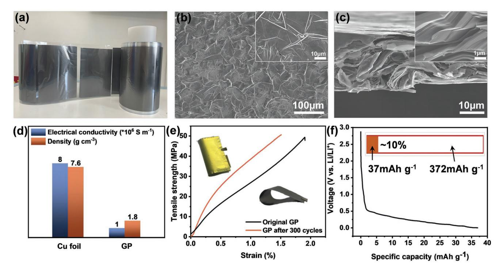
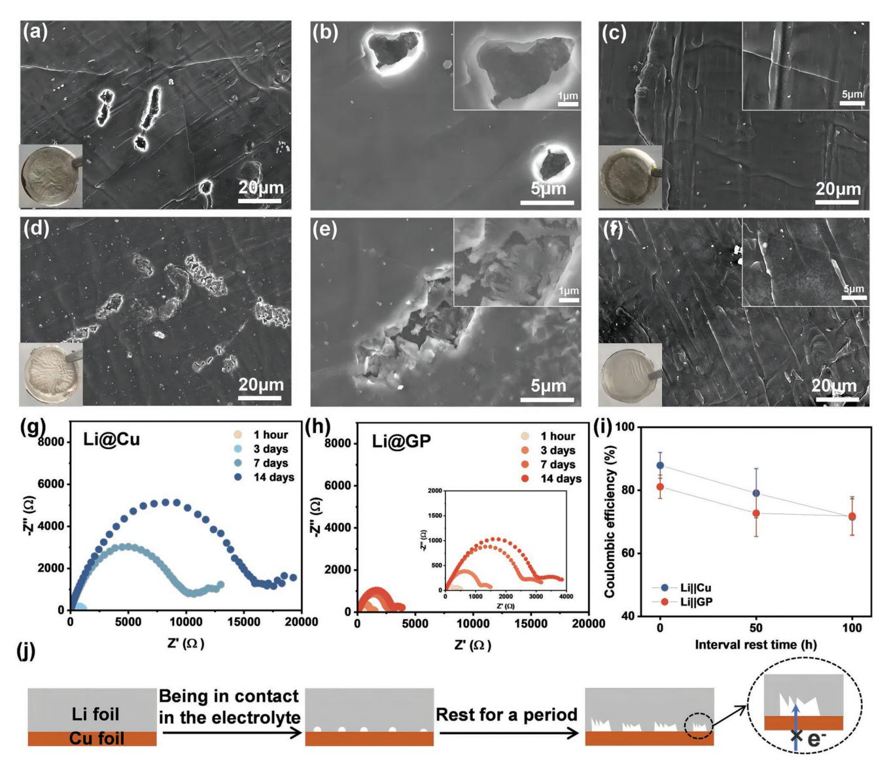
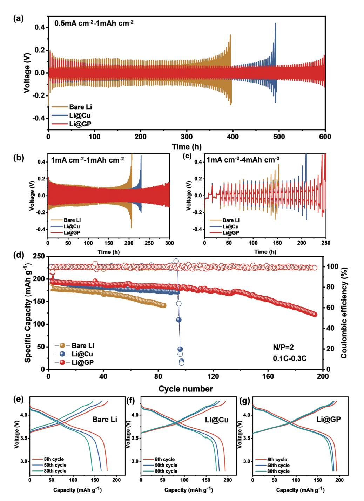
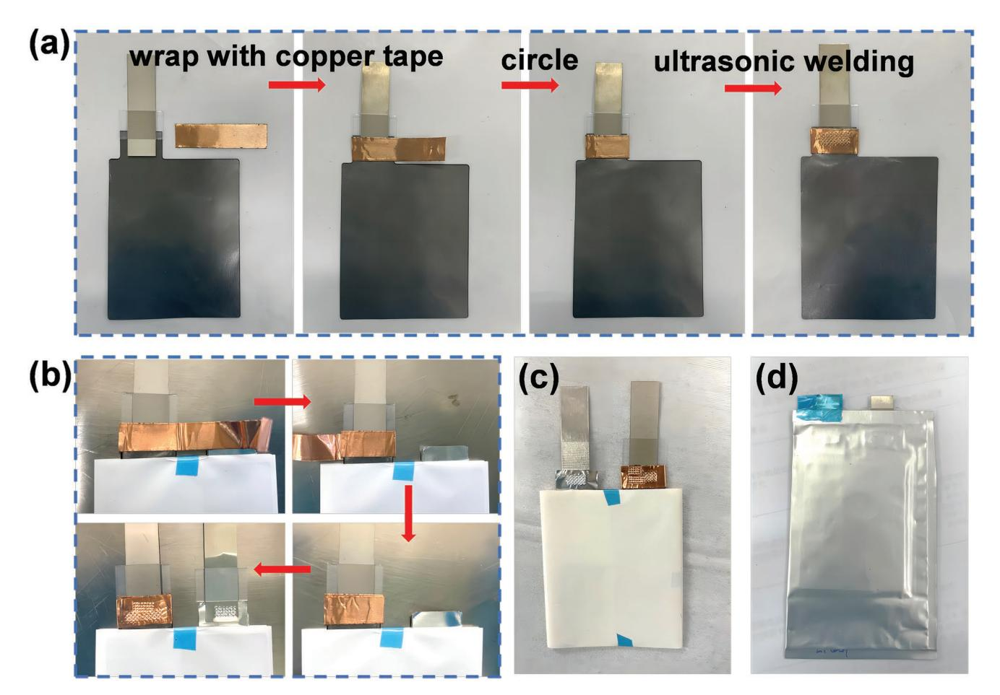
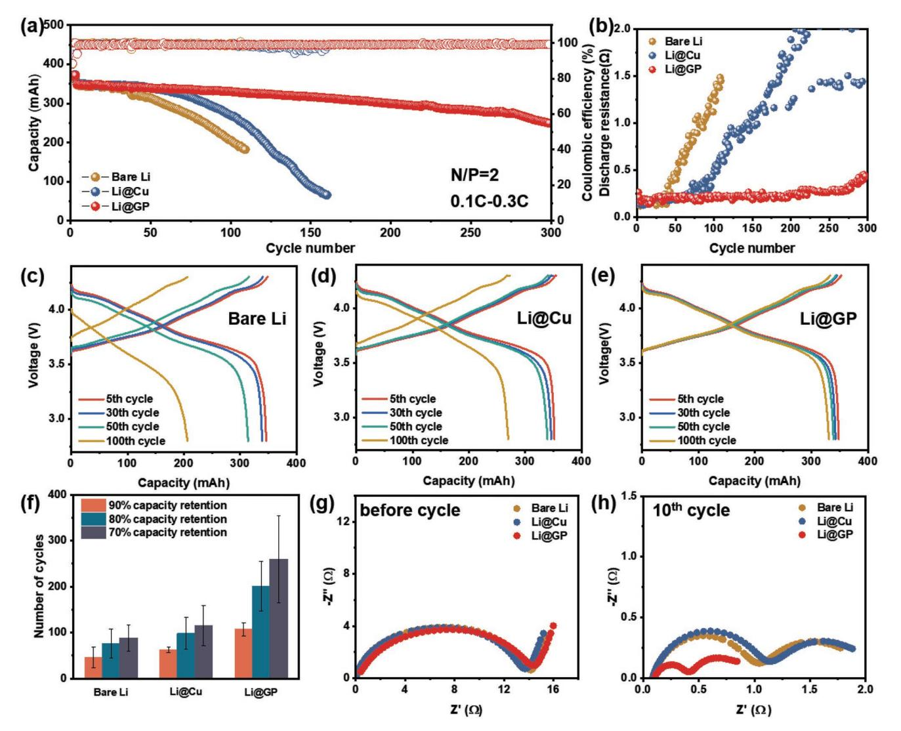
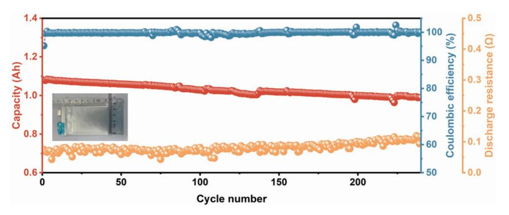

# **Artificial Graphite Paper as a Corrosion-Resistant Current Collector for Long-Life Lithium Metal Batteries**

*Yimei Li, Qiang Guo, Yong Wu, Danfeng Ying, Yanan Yu, Tengsheng Chi, Shengjie Xia, Xufeng Zhou,\* and Zhaoping Liu\**

**The employment of ultra-thin lithium metal anode with high loading cathode is the key to realizing high-energy-density rechargeable lithium batteries. Ultra-thin lithium foils are routinely loaded on a copper substrate in batteries, however, the close contact of these two metals causes galvanic corrosion in the presence of electrolyte, which results in irreversible consumption of lithium and decomposition of electrolyte. Herein, a lightweight and highly conductive flexible graphite paper (GP) is applied to replace Cu foil as the current collector for lithium metal anode. It is demonstrated that the application of GP prevents galvanic corrosion and maintains intimate and steady contact between Li foil and GP current collector during cycling, thereby improving the electrochemical performance of the battery. A 1.08 Ah pouch cell assembled with Li@GP anode and LiNi0.8Co0.1Mn0.1O2 cathode exhibits a long lifetime of 240 cycles with a capacity retention of 91.6% under limited Li, high cathode loading and lean electrolyte conditions.**

#### **1. Introduction**

Currently, conventional lithium-ion batteries (LIBs) using graphite anodes are approaching their theoretical energy density limits and cannot meet the needs of the rapid developing electric vehicle industry.[1] The pursuit of higher energy density batteries requires the development of new battery chemistry. Lithium (Li) metal is considered the most promising anode for next-generation high-energy-density lithium metal batteries (LMBs) due to its extremely high theoretical specific capacity (3860 mAh g−1 ) and the lowest electrochemical reduction potential (−3.04 V vs standard hydrogen electrode).[2]

In recent years, lithium metal batteries have been extensively studied, but most of the research on Li metal is based on the

Y. Li, Q. Guo, Y. Wu, D. Ying, Y. Yu, T. Chi, S. Xia, X. Zhou, Z. Liu Key Laboratory of Graphene Technologies and Applications of Zhejiang Province and Advanced Li-ion Battery Engineering Laboratory of Zhejiang Province Ningbo Institute of Materials Technology & Engineering Chinese Academy of Sciences Zhejiang 315201, P. R. China E-mail: zhouxf@nimte.ac.cn; liuzp@nimte.ac.cn Y. Li, D. Ying, T. Chi, X. Zhou, Z. Liu College of Materials Science and Opto-Electronic Technology University of Chinese Academy of Sciences Beijing 100049, P. R. China

The ORCID identification number(s) for the author(s) of this article can be found under https://doi.org/10.1002/adfm.202214523.

**DOI: 10.1002/adfm.202214523**

coin cell level. The experimental parameters they used (such as thick Li anode, flooded electrolyte, and low mass loading cathode) are far from practical conditions to achieve high energy.[3] Therefore researchers have emphasized the necessity of using limited lithium,[4] which will more accurately reflect the feasibility of battery designs with high energy density. Nevertheless, free-standing ultra-thin metallic Li foil is soft and sticky and has poor mechanical processability,[5] which makes it difficult to operate during battery manufacturing. Moreover, Li foil not only participates in the battery cycling as an active material but also conducts electrons as a current collector, and the gradual pulverization of Li foil will block electron transport, especially under high current

conditions.[6] If a current collector is applied to support ultrathin Li foil, it can continuously and steadily transfer electrons to the Li metal anode even if Li foil has crumbled. Therefore, it is of great significance to employ a current collector with high electrical conductivity and mechanical strength for the practical application of ultra-thin Li metal.

Copper (Cu) foil is the most widely used commercial anode current collector in LIBs because of its excellent electrical conductivity and mechanical strength,[7] and in many reports about Li metal anode, Cu foil is habitually used as the current collector as well.[8] In LMBs, however, there is an undesired effect of corrosion between Li and Cu foil, an overlooked but crucial aspect that is detrimental to the battery. Unfortunately, only few researchers have focused on the phenomenon of galvanic corrosion. Cui et al. have recently disclosed that fast galvanic corrosion occurs at the Li|Cu interface and demonstrated that the difference in electrolyte reduction kinetics on the surface of Li foil and Cu foil leads to the degradation of Li.[9] Winter et al. also pointed out the corrosion behavior of lithium metal powder on the Cu foil surface[10] and the corrosion behavior of galvanic couple in ionic liquid-based electrolyte.[11] Galvanic corrosion occurs when two dissimilar metals are electrically connected and immersed in a corrosive electrolyte, where electrons are transferred from the metal with a lower potential (anode) to the metal with a higher potential (cathode).[12] In such case, the less noble metallic Li serves as the anode, which is spontaneously oxidized and dissolved, simultaneously, the electrolyte undergoes reductive degradation reactions on the Cu (cathode) surface.[10,13] This process will accelerate the formation of

isolated Li that loses electrical contact (dead Li), and the electrolyte is constantly being depleted.[14] Therefore, it is imperative to develop a novel anti-corrosion current collector for lithium metal anode with lightweight, high conductivity, and mechanical stability.

Herein, we propose commercial artificial graphite paper (GP) with low resistance, good flexibility, and high degree of graphitization as a corrosion-resistant current collector for Li metal anode. Although many works have reported the application of carbon materials such as carbon cloth and carbon paper as current collectors for Li anode, most of them are 3D carbonbased current collectors and relatively complicated procedures are required to load metallic Li on them.[3b,15] Meanwhile, the large surface area of 3D carbon materials and complicated interface between 3D carbon current collectors and metallic Li may induce severe parasitic reactions that are detrimental to the stability of Li anodes. The 2D current collectors can be combined with Li foil in an easy way with a simple planar interface, which is convenient for large-scale industrial production. It is proved that the interface between Li foil and GP current collector remains stable and does not suffer from galvanic corrosion like Cu foil, and the associated electrolyte decomposition issue does not arise. These advantages enable the battery using ultra-thin Li foil supported by GP (Li@GP) to achieve long-term stable cycling and exhibit enhanced electrochemical performance. Specifically, Li asymmetric cells based on Li@GP electrode show smaller polarization and longer cycle life compared to bare Li and Li foil with Cu substrate (Li@Cu). Moreover, a 1.08 Ah LiNi0.8Co0.1Mn0.1O2 (NCM811)||Li@GP pouch cell with lean electrolyte (3 g Ah−1 ) exhibits outstanding cycling stability (91.6% capacity retention after 240 cycles at 0.1 C) at a low negative/positive ratio (N/P ratio) of 2. This work demonstrates that GP current collector has promising prospects in LMBs.

#### **2. Results and Discussion**

The commercial artificial graphite paper (GP) used in this work is produced by graphitization of polyimide films, which is gray-black with metallic luster (**Figure 1**a). Specifically, polyimide film is carbonized and graphitized at high temperature, and then rolled under high pressure to obtain GP. A series of characterizations were conducted to analyze the properties of GP, including SEM, XRD, Raman, XPS, and TGA. The surface of GP (Figure 1b) seems to be rough with lots of intrinsic wrinkles, and the cross sectional SEM image (Figure 1c) shows that this thin graphite paper with a thickness of 25 µm contains closely packed graphene sheets. The XRD pattern of GP (Figure S1a, Supporting Information) shows a sharp diffraction peak at ≈26.5° corresponding to the (002) plane of graphite, corresponding to an interplanar spacing of 0.336 nm, which is similar to that of natural graphite.[16] The relatively strong diffraction peak of the (004) plane also indicates the high graphitization degree of GP. The Raman spectrum of GP (Figure S1b, Supporting Information) shows a weak D peak at 1350 cm−1 , a strong G peak at 1580 cm−1 , and a low-intensity ratio of D peak to G peak (ID/IG) of ≈0.05, demonstrating that GP has the least disordered degree of graphitic structure.[17] Moreover, there are two peaks located at binding energies of 284.6 and 285.6 eV in the XPS spectrum (Figure S1c, Supporting Information),

**Figure 1.** a) Photograph of a large scale rolled graphite paper (GP). b) Top-view and c) cross sectional SEM images of GP (insets show the partially enlarged images). d) Comparison of electrical conductivity and mass of GP with commercial Cu foil. e) Tensile strength of original GP (black) and GP after 300 cycles (red) as a function of strain. f) The capacity of lithium intercalated into GP, measured by galvanostatic discharging to 0 V in a Li||GP half-cell.

assigned to CC and CO, respectively.[18] The high intensity of the CC peak illustrates the high graphitization degree of GP,[19] which is highly consistent with the XRD result. In addition, the TGA curve (Figure S1d, Supporting Information) displays that GP has good thermal stability, as the mass of GP does not decrease with increasing temperature until ≈800 °C.

Compared with metal, lightweight is a noticeable advantage of carbon materials as current collectors for high-energy-density batteries. GP has a density of 1.8 g cm−3 , less than a quarter of that of Cu foil (Figure 1d, the red column). Thus, we believe that the lightweight GP current collector will significantly boost the energy density of LMBs under the same conditions. The electrical conductivity of GP is ≈106 S m−1 (Figure S2 and Table S1, Supporting Information), which is lower than that of Cu foil, but still sufficient to satisfy the conductivity requirement as a current collector (Figure 1d, the blue column). The intimate contact or cross-linking of graphene sheets inside GP may interpret its high electrical conductivity. In addition, tension experiments were used to measure the mechanical properties. The stress-strain curve recorded in Figure 1e shows that the original GP can withstand an average tensile strength of 50 MPa at the breakage elongation of 1.9%, and GP after cell cycling still has the same tensile strength with only a slight decrease of the breakage elongation to 1.5%, manifesting that GP possesses excellent mechanical stability. It can also be seen from the insets of Figure 1e that the morphology and structure of GP are relatively intact both before and after cycling, indicating that GP exhibits good chemical and mechanical stability during the lithium intercalation and deintercalation process. This may be due to the fact that the SEI film formed on the surface of GP has relatively high ionic conductivity and mechanical strength, good integrity, and no local stress concentration to cause its deformation, so GP maintains good dynamic stability during cycling.[20] The GP current collector has maintained good mechanical properties during the cycle, which is also one of the necessary conditions for the stable cycling of the battery.

Graphitic carbon materials are prone to electrochemical intercalation by Li+, which may change their physicochemical properties. Therefore, the capacity of lithium ions intercalated into GP is evaluated by galvanostatic discharging to 0 V in a half-cell (Figure 1f). Specifically, we used GP as the cathode, bare Li foil (500 µm) as the anode, and the discharge current density was kept at 0.01 mA cm−2 . Such a small current density is sufficient for lithium ions to fully intercalate into GP. In the capacity-voltage curve, we take the discharge capacity above 0 V as the lithium intercalation capacity. As shown in Figure S3 (Supporting Information), the lithium intercalation capacity of a GP disc with an area of 1.538 cm2 is 0.255 mAh and its weight is 6.9 mg, so the calculated per unit lithium intercalation capacity of GP is 37 mAh g−1 , which accounts for only 10% of the theoretical lithiation capacity of graphite (372 mAh g−1 ). The relatively low specific capacity of GP compared with that of graphite is probably due to the extremely large lateral size of graphene layers in GP that kinetically impedes full intercalation of Li+ ions. This could explain why GP can remain intact and unbroken during the cycle. Next, we explored the lithium intercalation behavior of GP in detail. As shown in Figure S4a,b (Supporting Information), after being lithiated, the surface of GP changes from dark grey to golden, implying the formation of LiC6 compounds,[21] but the microscopic morphology of GP keeps almost unchanged before and after lithiation. Only the edge of GP expands slightly, and the thickness increases by ≈5 µm, which is probably caused by the intercalation of lithium. The XRD patterns (Figure S4c, Supporting Information) show that the peak at 26.5° of the original GP shifts to a lower angle after being lithiated, indicating that lithium is inserted into GP. The XPS survey spectrum (Figure S4d, Supporting Information) confirms the chemical composition of the lithiated GP with the elements of F, O, C and Li,[22] and the formation of LiC6 and LiF is also confirmed in Li 1s spectra (Figure S4e, Supporting Information). In contrast, lithiation does not occur if GP is merely immersed in the electrolyte. As shown in Figures S4c and S5 (Supporting Information), the top-view and cross sectional morphologies of the immersed GP are similar to the original GP, and the thickness does not change either. In general, GP is an excellent candidate for the current collector in terms of its high electrical conductivity, good thermal property as well as flexibility, and mechanical stability.

The differences between Cu foil and GP as the anode current collector were explored. We compared the stability of Cu foil and GP in air and characterized their surface element distributions by elemental mapping, as shown in Figure S6 (Supporting Information). The top-view EDS mappings clearly show that the surface of the original Cu foil contains Cu element and a small amount of O element (Figure S6a–c, Supporting Information). The O element on the surface is probably because the metal is easily oxidized by air to form oxides, indicating that the pretreatment of Cu foil cannot completely remove impurities on the surface of Cu foil, which can also be confirmed by the O peak in the XPS spectra (Figure S13a, Supporting Information). While the content of the O element on the surface of GP is lower (Figure S6d–f, Supporting Information), demonstrating that carbon material is more stable in air, which is beneficial in battery applications.

Cu foil is commercially used as the anode current collector for lithium-ion batteries for its good conductivity and stability.[23] In LMBs, however, if Cu foil is used as the current collector for Li metal anode, it means that they are in close contact all the time in the electrolyte, which will lead to the occurrence of galvanic corrosion.[10] In our experiments, we discovered that serious galvanic corrosion occurred at the Li|Cu interface. When an ultra-thin Li foil was laid on Cu substrate at room temperature and then immersed in the carbonate-based electrolyte, we found that lithium was dissolved spontaneously at the Li|Cu interface after immersing for 7 days, accompanied by the formation of pits and holes on the bottom surface of Li foil, as shown in **Figure 2**a,b. As the immersing time was extended to 30 days, the SEM images in Figure 2d,e shows that the dissolution of lithium became more serious, and the area and depth of pits and holes on the bottom surface of Li foil were also larger. Moreover, this problem is unavoidable, even if the ultra-thin Li foil was repeatedly rolled onto the Cu foil without leaving gaps between them, as revealed in Figure S7 (Supporting Information). Nevertheless, by replacing Cu foil with GP, we found that no matter how long the Li foil was in contact with GP, the Li foil was not corroded (Figure 2c,f) and the bottom surface morphology keeps the same as the pristine Li foil (Figure S8a,b, Supporting Information). The same experiments

**Figure 2.** SEM images showing pits formed on Li foils after immersion of galvanic couple in the carbonate-based electrolyte for a,b) 7 days and d,e) 30 days with Cu foil as the substrate, c) 7 days and f) 30 days with GP as the substrate. Insets in a), c), d), and f) are the corresponding optical photographs of Li foils. Nyquist plots of g) Li@Cu and h) Li@GP symmetric cells for various rest periods without applying current. The inset is the enlarged plot of h). i) Coulombic loss of lithium at various rest time. j) Schematic diagram illustrating galvanic corrosion between Li foil and Cu foil.

in the ether-based electrolyte were also performed. The SEM images (Figure S9a–d, Supporting Information) manifest that the corrosion of lithium always exists with Cu as the substrate, which can be evidenced by numerous holes on the bottom surface of Li foil. Unsurprisingly, in the case of GP as the substrate for Li foil, the bottom surface of Li foil remained intact at all times in the ether-based electrolyte (Figure S9e–h, Supporting Information).

The existence of galvanic corrosion between Li foil and Cu foil during long-term resting has been proved as discussed above, and it is worth discussing whether this detrimental corrosion still exists during battery cycling. The SEM images (Figure S10, Supporting Information) show that dense holes appeared on Li foil at the Li|Cu interface after 50 cycles of NCM811||Li@Cu full cell. The morphology of the holes can be divided into two types, one is caused by the uneven consumption of lithium during cycling, as shown in Figure S10a,b (Supporting Information), and the other is generated by galvanic corrosion, as shown in Figure S10c,d (Supporting Information), whose morphology is the same as that in Figure 2. Therefore, with Cu foil as the anode current collector, galvanic corrosion occurs regardless of whether the battery is resting or cycling.

To investigate the impact of galvanic corrosion, we carried out time-dependent electrochemical impedance spectroscopy (EIS) measurements of Li||Li symmetric cells with Cu foil and GP as the current collector, and the results are shown in Figure 2g,h. The Nyquist plots exhibit the impedance changes of Li@Cu and Li@GP symmetric cells during a 14-day rest period without applying current in the carbonate-based electrolyte. For Li@ Cu symmetric cell (Figure 2g), the sum of SEI resistance and charge transfer resistance, corresponding to the size of a semicircle in the Nyquist plot,[24] increased rapidly with time. This is attributed to the fact that the continuous dissolution of lithium at the Li|Cu interface during rest results in gradual contact loss between the two metals, as shown in Figure 2j, which eventually leads to an increase in the interface resistance. In contrast, the impedance of the Li@GP symmetric cell changed very little during rest because of the stable interface between Li foil and GP with small interface resistance, as presented in Figure 2h (inset is the magnified plot). This is coincident with the intact surface morphology of Li foil retrieved after being in contact with GP (Figure 2c,f). Consequently, these results prove that the GP current collector effectively prevents the galvanic corrosion that is usually inevitable in the case of Cu foil current collector.

The galvanic corrosion, on the other hand, has an effect on the irreversible capacity loss of lithium. To make a comparison, we put the Li foil with Cu foil or GP current collector in the electrolyte for a certain period of time, and then tested the capacity of the remaining lithium. However, since the thinnest Li foil we can obtain is 40 µm thick (corresponding to a capacity of ≈8 mAh cm−2 ), and the capacity loss of lithium due to galvanic corrosion only accounts for an extremely small part of it, it is difficult to exclude the influence of experimental errors. In view of this, we designed the following experiments with reference to the work of Cui et al.[9] To reduce the capacity of lithium to more intuitively observe the effect of galvanic corrosion, metallic Li with a fixed capacity of 0.5 mAh cm−2 was deposited on a clean Cu foil or GP in half cells and then stripped until the cut-off voltage of 3 V versus Li+/Li0 after various rest times between deposition and dissolution, and the difference in galvanic corrosion-related irreversible capacity of the two current collectors was compared. In order not to hinder the observation of galvanic corrosion, before deposition, stable SEI was formed via galvanostatic discharging to 0 V versus Li+/Li0 at 0.01 mA cm−2 to exclude the capacity loss due to the repeated formation of unstable SEI. And to minimize the effect of capacity loss caused by dead lithium, an ether-based electrolyte (detailed in the Experimental Section) was employed so that it is reasonable to attribute the capacity loss of lithium to galvanic corrosion.[9,25] Here, the irreversible capacity loss caused by galvanic corrosion is assessed by comparing the changes in Coulombic efficiency with different interval rest times (0, 50, 100 h), where Coulombic efficiency is defined as the ratio of the dissolution capacity to the initial deposition capacity (Figure 2i). Less than 10% capacity was lost (Coulombic efficiency dropped from 81.1% to 71.8%) after resting for 100 h with GP as substrate compared to 16% of that of bare Cu (Coulombic efficiency dropped from 87.9% to 71.5%). Moreover, the Coulombic efficiency of GP hardly changed during the later period of rest (from 50 to 100 h), indicating no capacity loss here, and its previous capacity loss may be due to the irreversible lithium intercalation reaction rather than galvanic corrosion. Nevertheless, the Coulombic efficiency of bare Cu continued to decline throughout the resting time, suggesting that continued corrosion would result in long lasting decrease in the reversible capacity of lithium. The Coulombic efficiency evolution study validates the rapid corrosion of lithium with Cu as substrate, which is in agreement with the SEM results. In general, galvanic corrosion is mainly related to the potential difference of the galvanic couple, corrosion time and electrolyte. The greater the potential difference between the galvanic couple and the longer the corrosion time, the more serious the corrosion.

In the Li-Cu galvanic couple, Li as a less noble metal (E0 Li|Li+ = − 3.04 V vs SHE, E0 Cu|Cu2+ = + 0.34 V vs SHE) serves as the anode and undergoes dissolution, that is, oxidation to Li+. Correspondingly, electrolyte reduction should be considered as the counter-reaction to the oxidation of Li, because Cu foil is not soluble in the electrolyte. The surface morphology and composition of Cu foil before and after immersion of the Li-Cu galvanic couple in the carbonate-based electrolyte were analyzed. The surface of pristine Cu foil (Figure S11a,b, Supporting Information) is very rough with some grooves and pillars. After immersing for 30 days, it seems to be covered by a layer of other substances (Figure S12, Supporting Information), indicating that some reactions may occur spontaneously on the surface of Cu foil. Then, surface and depth elemental composition analyses of Cu foil were carried out by XPS. Figure S13a,b (Supporting Information) shows that clear signals of Cu appeared on the surface of the pristine Cu foil. After immersing for 30 days, the signals of Cu almost disappeared, which implies that the surface of Cu foil is covered by electrolyte decomposition products. The O 1s, Li 1s, C 1s, F 1s, and P 2p bands in the XPS spectra (Figure S13c–g, Supporting Information) confirm the species may be composed of carbonate groups, alkyl groups, fluorides and phosphates. These results can be certified from the EDS test (Figure S14, Supporting Information). According to the decomposition reactions of similar electrolyte summarized by predecessors and the XPS results we observed, we speculate that the main decomposition reactions of the electrolyte may be as follows:

FEC 2 + + e 2 − + Li → LiCH CHFOCO Li 2 2 (1)

+ + → + − + EMC e Li CH ⋅ CH CH OCO Li 3 3 2 2 (2)

After Ar+ etching for 3 min, the peaks of Cu 2p appeared again, while the intensity of some peaks decreased dramatically, such as the C 1s and P 2p, which reveals that part of the surface substances can be removed from the Cu foil by etching. These results indicate that galvanic corrosion not only affects the practical capacity of the Li electrodes but also causes the spontaneous reductive decomposition of the electrolyte. Given the above discussions, corrosion could be an utmost obstacle for the practical application of Cu foil current collector in lithium metal anode. Particularly, when two different metals are contacted in the electrolyte, the greater the potential difference between them, the more serious the corrosion will be. The potential difference between metal Li and Cu is relatively large (3.38 V), thus galvanic corrosion reaction proceeds rapidly at the interface between Li and Cu. When GP is in contact with Li foil in the presence of electrolyte, Li-intercalation in GP occurs and a LiCx layer forms spontaneously between GP and Li. Since the potential of LiCx is close to that of Li, the corrosion tendency of GP is negligible compared with that of Cu foil.

To evaluate the electrochemical performance of GP as a current collector, the galvanostatic cycling performance of asymmetric cells in the carbonate-based electrolyte was tested. Here, **www.advancedsciencenews.com www.afm-journal.de**

**Figure 3.** Galvanostatic cycling performance of asymmetric cells using ultra-thin bare Li, Li@Cu and Li@GP electrodes a) at a current density of 0.5 mA cm−2 with a capacity of 1 mAh cm−2 and at a current density of 1 mA cm−2 with a capacity of b) 1 mAh cm−2 and c) 4 mAh cm−2 . d) Cycling performance of NCM811||Li, NCM811||Li@Cu, and NCM811||Li@GP full cells charged at 0.1 C and discharged at 0.3 C with N/P ratio of 2. Charge/ discharge voltage profiles of full cells with e) bare Li, f) Li@Cu, and g) Li@GP anodes.

we used bare Li foil, Li@Cu or Li@GP electrode (the thickness of Li foil is 40 µm) as the working electrodes and Li foils (500 µm) as the counter electrodes. At a current density of 0.5 mA cm−2 and an areal capacity of 1.0 mAh cm−2, the Li@ GP asymmetric cell exhibits a long cycle life of 600 h, as shown in **Figure 3**a. In contrast, the asymmetric cell of Li@Cu and bare Li can only cycle for 480 and 380 h, respectively. It reveals that the anodes with current collectors perform better than bare Li, and the GP current collector outperforms Cu foil. The performance improvement of Li@GP cell may result from the stable interface between Li foil and GP current collector, as it avoids the occurrence of galvanic corrosion and facilitates the steady transfer of electrons over hundreds of charging/discharging processes. At a higher current density of 1.0 mA cm−2

(Figure 3b), the Li@GP asymmetric cell exhibits stable voltage polarization even after 300 h of cycling. On the contrary, Li@Cu asymmetric cell shows an obvious increase in the voltage within 220 h, let alone bare Li. In detail, the rapid voltage increase of the Li@Cu cell is caused by the hugely increased internal cell resistance due to the loss of electrical contact between Li foil and Cu foil. As for bare Li cell, within less than 200 h, it shows severe polarization due to the absence of current collector to support the gradually pulverized Li foil. Therefore, we can conclude that the GP current collector plays an important role in the long cycle life of the battery. A similar tendency of cycling performance can also be observed at a larger areal capacity of 4 mAh cm−2 (Figure 3c). In the first two cycles, a smaller current density of 0.5 mA cm−2 was applied for activation, and the current density of the remaining cycles was kept at 1 mA cm−2 . The corresponding charge/discharge depth is as high as 50%, and Li@GP cell still exhibits the best cycling stability (>200 h).

We also fabricated full coin cells to test the cycling performance of bare Li, Li@Cu and Li@GP electrodes. When paired with the NCM811 cathode with an areal active material mass loading of ≈4 mAh cm−2 (corresponding to a low N/P ratio of ≈2), the cell with Li@GP electrode exhibits the best long-term cycling performance (Figure 3d), which delivers a high initial discharge capacity of 193.5 mAh g−1 and gradually decreases to 154.5 mAh g−1 (80% capacity retention) after 160 cycles. In contrast, the capacity retention of bare Li and Li@Cu full cells quickly drops to 80% after 81 cycles and 94 cycles, respectively. Meanwhile, the voltage profiles of the cell using Li@GP electrode also exhibit smaller voltage hysteresis and slower capacity decay than those of bare Li and Li@Cu electrodes, as shown in Figure 3e–g. In addition, the NCM811 cathode with a lower areal active material mass loading of ≈2 mAh cm−2 (corresponding to an N/P ratio of ≈4) was also used to assemble full coin cells which were tested under 0.5 C charge and 1 C discharge conditions (Figure S15, Supporting Information). The Li@GP full cell enables a stable cycling for 350 cycles, showing no obvious capacity decay. While the capacity of bare Li and Li@Cu full cells continue to decay throughout the long-term cycling. The better performance of Li@GP electrode validates the effectiveness of GP current collector.

The cross sectional morphology of Li foil after 10 cycles and 50 cycles of different anodes in full coin cells was characterized. From the SEM images in Figure S16a–c (Supporting Information), it can be seen that after 10 cycles, the thickness of dead Li on the upper layer of the Li@GP electrode is the smallest (≈20 µm), while that of the bare Li electrode and Li@ Cu electrode is relatively large (≈30 µm). After 50 cycles, the bare Li electrode displays a rough structure with lots of pores and cracks, and the thickness of such porous layer reaches ≈60 µm, as shown in Figure S16d (Supporting Information). This is because the non-uniformity of lithium plating/stripping results in the accumulation of dead Li, which in turn severely hinders the transport of ions and electrons. Figure S16e,f (Supporting Information) shows that the thickness of the dead Li layer of Li@Cu electrode and Li@GP electrode increases after 50 cycles compared with that of 10 cycles, it is still thinner than that of bare Li electrode, and the thickness of the dead Li layer of Li@GP electrode is also slightly smaller than that of Li@Cu electrode.

The facile use of GP current collector provides a possibility for practical applications in lithium metal batteries, which was firstly evaluated in 0.36 Ah pouch cells using NCM811 cathodes (4.3 × 5.3 cm−2 ) and bare Li, Li@Cu or Li@GP anodes (4.7 × 5.7 cm−2 ). Here, practical conditions, including ultrathin Li foil (40 µm), low N/P ratio and lean electrolyte were used. In addition, in order to ensure the normal and stable operation of pouch cells with GP current collectors, we designed a new type of tab welding method for carbon-based current collectors. Unlike metallic Cu foil, the carbon material is difficult to be directly ultrasonic welded with commercial metallic nickel tab. To solve this problem, we developed a novel welding method, that is, wrapping copper tape around the tab of the GP, and then ultrasonically welding by 16J energy, so that the GP and Ni tab can be satisfactorily welded (**Figure 4**a). The pouch cell after tab welding is shown in Figure 4b–d. Notably, as shown in Table S2 (Supporting Information), this tab welding method does not cause an increase in the internal resistance of the pouch cells, proving the availability and practicability of this method in practical battery applications.

The pouch cells were first measured under the condition of 0.1 C charging and 0.3 C discharging with a potential window between 2.8 and 4.3 V. And the cells were charged and discharged with a current density of 0.1 C in the first three cycles as the formation procedure. The corresponding voltage profiles of the first cycle can be seen in Figure S17a–c (Supporting Information). As shown in **Figure 5**a, these pouch cells deliver similar initial capacities. The magnified images of discharge capacity, Coulombic efficiency and discharge resistance within 150 cycles are shown in Figure S17d–f (Supporting Information). Compared with NCM811||Li@GP cell, NCM811||Li and NCM811||Li@Cu cells exhibit faster capacity fading, with capacity retention dropping to 80% in less than 70 cycles and 94 cycles, respectively. For the bare Li electrode, it is used as both an active lithium source and a current collector, and the electron transport is gradually hindered by the pulverization of Li foil, which finally leads to the battery failing. As shown in Figure S18a,b (Supporting Information), due to the uneven plating/stripping of lithium, active lithium in some positions has been heavily consumed after cycling to 80% of its initial discharge capacity, and the Li foil disintegrates into several pieces. In such case, since the tab is only connected to one end of the electrode, the detached Li pieces lose conductive contact and passively becomes inactive lithium even though there is still some active lithium remaining, so the capacity of bare Li cell decays rapidly in the later stage. In the presence of a current collector, even if the Li foil is cracked, the lithium in contact with the current collector can still conduct electrons and continue to participate in the charge-discharge cycles. Figure S18c,e (Supporting Information) shows that the Li foils using current collectors all turn black after cycling to 80% of the initial capacity, which proves that the application of the current collector avoids the breakage and deactivation of lithium, increases the utilization rate of lithium, and thus prolongs the cycle life. While as for the Cu current collector, there is a serious problem with the interface between Li foil and Cu foil. It can be seen from Figure S18c,d (Supporting Information) that the back of the Li foil after cycling has a loose and porous morphology, indicating that Li foil at the Li|Cu interface has

**Figure 4.** a) Digital photos of welding Ni tab and GP current collector using copper tape. b,c) Photos of the tab welding process of a NCM811||Li@GP pouch cell. d) Photo of a packaged NCM811||Li@GP pouch cell.

been corroded and the electrical contact between Li foil and Cu current collector also deteriorates. So, the failure of the Li@ Cu cell is mainly due to the increase of the interface resistance between Li foil and Cu foil during battery cycling, and at the same time, the electrolyte keeps decomposing. Comparatively, when GP current collector is used, the Li foil is relatively intact (Figure S18e,f, Supporting Information), and the contact between them is better than that of Cu foil current collector. As a result, the NCM811||Li@GP pouch cell exhibits the best capacity retention of 80% after 256 cycles under the same conditions. The remarkable improvement in cycling stability demonstrates the substantial benefit of the GP current collector, as it can stabilize the interface between Li foil and GP, thereby delaying the increase of the internal cell resistance and reducing the consumption of electrolytes. The discharge resistance during the cycle (Figure 5b) can also support this. Particularly, the Li foil and GP current collector have kept in good contact during the repeated charging/discharging process, which can be seen in Figure S19 (Supporting Information) that the back of the cycled Li foil has been printed with the pattern of GP surface. Besides, it should be pointed out that the cycling performance of pouch cells was derived from at least three cells of each group, and their statistics are shown in Figure 5f.

The charge-discharge curves (Figure 5c–e) show a relatively large voltage hysteresis and rapid capacity decay in the bare Li and Li@Cu cells, whereas the Li@GP cell shows slower capacity decay. The electrochemical impedance spectroscopy (EIS) of pouch cells with different anodes was also compared. The overall resistance of these cells before cycling is almost the same (Figure 5g). After 10 cycles, the Li@GP cell shows smaller RSEI and RCT than those of bare Li and Li@Cu cells, where RSEI refers to the impedance of SEI film, corresponding to the semicircle in the high-frequency region, and RCT reflects the charge transfer resistance, corresponding to the middlehigh-frequency region in Nyquist plots (Figure 5h). This again indicates that the GP current collector facilitates electron and ion transport at the Li|GP interface. In addition, at a higher current density of 0.2C (Figure S20a, Supporting Information), the Li@GP pouch cell exhibits superior cycling performance with 84% capacity retention after 70 cycles. Whereas bare Li and Li@Cu pouch cells show obvious capacity fading after 42 and 50 cycles, respectively. The cycling data for all pouch cells are presented in Figure S20b (Supporting Information).

Furthermore, we also assembled a multilayer 1.08 Ah NCM811||Li@GP pouch cell with a low N/P ratio of 2, and the electrolyte injection ratio was strictly controlled at 3 g Ah−1 . As shown in **Figure 6**, at a current density of 0.1 C, the pouch cell

**www.advancedsciencenews.com www.afm-journal.de**

**Figure 5.** a) Long-term cycling performance and b) discharge resistance of NCM811 pouch cells with a low N/P ratio of 2 at 0.1 C using different lithium metal anodes. Charge/discharge voltage profiles of pouch cells with c) bare Li, d) Li@Cu, and e) Li@GP anodes. f) Statistics results for all pouch cells with at least three data points per group. Nyquist plots of NCM811 pouch cells with different lithium metal anodes g) before cycle and h) after 10 cycles.

**Figure 6.** Cycling performance, Coulombic efficiency and discharge resistance of NCM811||Li@GP pouch cell with a capacity of 1.08 Ah at the current density of 0.1 C (inset is the digital photograph of a 1.08 Ah NCM811||Li@GP pouch cell).

shows an initial capacity of 1.079 Ah, and still delivers a capacity of 0.989 Ah after 240 cycles (91.6% capacity retention) with an average Coulombic efficiency of 99.8% per cycle. The corresponding discharge resistance slowly and gradually increases from 75 to 116 mΩ after 240 cycles, corresponding to an average resistance increase of 0.17 mΩ per cycle. These comprehensive improvements further indicate that the pouch cell with GP current collector has broad application prospects for practical LMBs.

# **3. Conclusion**

In summary, we proposed a facile and promising strategy to enhance the cycling stability and specific energy density of lithium metal batteries by utilizing graphite paper (GP) as the anode current collector. GP not only has ultra-lightweight, high conductivity, and good mechanical and chemical stability, but also suppresses galvanic corrosion that occurs between Li metal and traditional Cu foil current collector. As a result, the cells with GP current collector display enhanced electrochemical performance compared to the cells with Cu current collector in both asymmetric cells and full coin cells, benefiting from the stability of the interface between Li foil and GP current collector. More importantly, Ah-level NCM811||Li@GP pouch cell can stably and safely cycle for 240 cycles with a capacity retention of 91.6% under practical operating conditions. Undoubtedly, the excellent performance of GP current collector makes our approach potentially applicable in the practical lithium metal batteries industry.

## **4. Experimental Section**

*Materials*: Artificial graphite paper (GP) provided by Ningbo Morsh Technology Co., Ltd. was prepared by carbonization and graphitization of polyimide films, which was dried in an oven at 80 °C for at least 24 h before use. Cu foils (10 µm) were immersed in acetone for 10 min to remove surface contaminants and rinsed several times with deionized water and ethanol. The washed Cu foils were dried in a vacuum at 80 °C for 12 h and then transferred to the argon-filled glovebox for use. Lithium foil purchased from China Energy Lithium Co., Ltd. with a thickness of 40 µm was stored in the argon-filled glovebox. The ether-based electrolyte of 1.0 m lithium bis (trifluoromethanesulfonyl) imide (LiTFSI) in 1,3-dioxolane (DOL)/1,2-dimethoxyethane (DME) (1:1 by volume) with 2% lithium nitrate (LiNO3) was purchased from Suzhou Duoduo New Chemical Material Co., Ltd. and carbonate-based electrolyte of 1.0 m lithium hexafluorophosphate (LiPF6) in ethyl methyl carbonate (EMC)/ fluoroethylene carbonate (FEC) (5:1 by volume) was purchased from Jiangsu Guotai International Group Co., Ltd. In conventional carbonatebased electrolyte (1.0 m lithium hexafluorophosphate (LiPF6) in ethylene carbonate (EC) and dimethyl carbonate (DMC) without additives), lithium metal batteries exhibit relatively low Coulombic efficiency and poor cycle stability. Some researchers have proposed that fluoroethylene carbonate (FEC) has excellent film-forming properties, which can form a stable and dense SEI film rich in lithium fluoride, and effectively inhibits side reactions.[26] Therefore, FEC was used instead of EC as a co-solvent to improve the stability of the SEI film on the surface of Li and prolong the cycle life of batteries.

*Materials Characterizations*: X-ray diffraction (XRD) measurements were carried out on an X-ray diffractometer (D8 Advance DaVinci) with Cu−K*α* radiation source (*λ* = 1.5406 Å) at 40 kV, 20 mA over the 2*θ* range from 20° to 80°. The morphology of the materials was characterized by a field emission scanning electron microscope (SEM, Hitachi S4800, Japan). The Raman spectra were recorded with a Renishaw inVia Reflex spectrometer. Tensile strength was measured with a 100 kN Universal material testing machine (Zwick/Roell Z100). Energy-dispersive spectroscopy (EDS) mapping and the corresponding morphology images were obtained from a Hitachi Regulus8230 fieldemission scanning electron microscope. The investigations of X-ray photoelectron spectroscopy (XPS) (Axis Ultra DLD) were performed using a monochromatic Al K*α* (1486.6 eV) X-ray source for excitation, and C 1s peak (284.8 eV) to calibrate. Etching was carried out by an argon ion gun (5 kV, 3 min) to provide a depth profile. The electrical conductivity was tested using a four-point probe method. The thermal performance was studied by thermogravimetric analysis (TGA209F1), and the measurements were conducted under air over a temperature range of 0–1000 °C with a ramp rate of 5 °C min−1 .

*Assembly of Coin Cells and Pouch Cells*: Standard CR2032 coin-type cells were assembled in an argon-filled glovebox (H2O < 0.1 ppm, O2 < 0.1 ppm). Li foils, Cu foils, and GP were tailored into circular discs with a diameter of 14 mm. Li@GP electrodes were fabricated by pressing Li foil with a thickness of 40 µm on the GP, and the same method was used for Li@Cu electrodes. A commercial polypropylene separator (Celgard 2400) was used in the coin cells. Carbonate-based electrolyte, 1.0 m LiPF6 in EMC/FEC (volume ratio of 5:1), and etherbased electrolyte, 1.0 m LiTFSI in DOL/DME (volume ratio of 1:1) with 2% LiNO3, were used as the electrolyte with an amount of 75 µL.

For asymmetric coin cells, Li@GP electrodes, Li@Cu electrodes or bare Li foils (the thickness of Li foil is 40 µm) were used as the working electrodes and Li foils (500 µm) were used as the counter electrodes. Symmetric coin cells for corrosion studies used two identical electrodes (Li@Cu or Li@GP electrodes) on both sides. As for the full coin cells, NCM811 was used as the cathodes, which were composed of 96% active material (LiNi0.8Co0.1Mn0.1O2), 2% binder (PVDF) and 2% conductive carbon black (Super P) with an areal active material mass loading of ≈2 mAh cm−2 or ≈4 mAh cm−2. Li@GP, Li@Cu and bare Li foil electrodes were used as the anodes and the electrolyte used herein was carbonatebased electrolyte.

For the preparation of multilayer pouch cells, NCM811 doublecoated Al foil (4.3 × 5.3 cm) with an areal active material mass loading of 20 mg cm−2 (≈4 mAh cm−2) on both sides was employed as the cathode. GP, Cu foils and 40 µm thick bare Li foils were cut into a size of 4.7 × 5.7 cm, and then the Li foil was pressed on the GP or Cu foil to prepare Li@GP and Li@Cu anodes. Commercial Celgard PP films were used as the separator. For the 0.36 Ah pouch cells, two layers of NCM811 cathodes and four layers of Li foil anodes (with or without current collectors) were assembled with the carbonate-based electrolyte injection ratio of 6.0 g Ah−1 . To meet the requirement for practical application, the electrolyte injection ratio of 1.08 Ah NCM811||Li@GP pouch cell was reduced to 3 g Ah−1 . The whole fabrication process of pouch cells was finished in a drying room with a dew point below −50 °C.

*Electrochemical Measurements*: All cells were shelved for 12 h before testing. The galvanostatic cycling of coin cells was tested using a LAND-CT2001A battery testing system (Jinnuo Wuhan Co., Ltd.). Asymmetric cells were tested at a current density of 0.5 or 1.0 mA cm−2 with a capacity of 1 or 4 mAh cm−2. The full coin cells were galvanostatically cycled at a current density of 0.1 or 0.5 C with a potential window between 2.8 and 4.3 V for stability testing. The charging/discharging tests of pouch cells were conducted on a Neware-CT-4008−5 V6A-S1 battery testing system and the cells were cycled at different current densities (0.1 and 0.2 C) between 2.8 and 4.3 V. The electrochemical impedance spectroscopy (EIS) was recorded using an electrochemical workstation (Solartron analytical) over the frequency range of 100 kHz to 0.01 Hz.

# **Supporting Information**

Supporting Information is available from the Wiley Online Library or from the author.

#### **Acknowledgements**

This work was supported by the National Natural Science Foundation of China (Grant No. 51872305 and 52001320), and "Lingyan" Research and Development Plan of Zhejiang Province (Grant No. 2022C01071).

### **Conflict of Interest**

The authors declare no conflict of interest.

### **Data Availability Statement**

The data that support the findings of this study are available from the corresponding author upon reasonable request.

#### **Keywords**

artificial graphite papers, corrosion resistance, current collectors, lithium metal batteries

Received: December 12, 2022

- Revised: January 17, 2023
- Published online: February 12, 2023
- [1] a) K. N. Wood, M. Noked, N. P. Dasgupta, *ACS Energy Lett.* **2017**, *2*, 664; b) W. Xu, J. Wang, F. Ding, X. Chen, E. Nasybulin, Y. Zhang, J.-G. Zhang, *Energy Environ. Sci.* **2014**, *7*, 513.
- [2] a) X. B. Cheng, R. Zhang, C. Z. Zhao, Q. Zhang, *Chem. Rev.* **2017**, *117*, 10403; b) J.-M. Tarascon, M. Armand, *Nature* **2001**, *414*, 359; c) Y. Guo, H. Li, T. Zhai, *Adv. Mater.* **2017**, *29*, 1700007.
- [3] a) D. Lee, S. Sun, J. Kwon, H. Park, M. Jang, E. Park, B. Son, Y. Jung, T. Song, U. Paik, *Adv. Mater.* **2020**, *32*, 1905573; b) L. Tao, B. Ma, F. Luo, Z. Xu, Z. Zheng, H. Huang, P. Bai, F. Lin, *Nano Energy* **2022**, *93*, 106808; c) H. Mao, W. Yu, Z. Cai, G. Liu, L. Liu, R. Wen, Y. Su, H. Kou, K. Xi, B. Li, H. Zhao, X. Da, H. Wu, W. Yan, S. Ding, *Angew. Chem., Int. Ed.* **2021**, *60*, 19306.
- [4] a) S. Chen, J. Zhang, L. Nie, X. Hu, Y. Huang, Y. Yu, W. Liu, *Adv. Mater.* **2021**, *33*, 2002325; b) P. Albertus, S. Babinec, S. Litzelman, A. Newman, *Nat. Energy* **2017**, *3*, 16; c) J. Liu, Z. Bao, Y. Cui, E. J. Dufek, J. B. Goodenough, P. Khalifah, Q. Li, B. Y. Liaw, P. Liu, A. Manthiram, Y. S. Meng, V. R. Subramanian, M. F. Toney, V. V. Viswanathan, M. S. Whittingham, J. Xiao, W. Xu, J. Yang, X.-Q. Yang, J.-G. Zhang, *Nat. Energy* **2019**, *4*, 180; d) H. Chen, Y. Yang, D. T. Boyle, Y. K. Jeong, R. Xu, L. S. de Vasconcelos, Z. Huang, H. Wang, H. Wang, W. Huang, H. Li, J. Wang, H. Gu, R. Matsumoto, K. Motohashi, Y. Nakayama, K. Zhao, Y. Cui, *Nat. Energy* **2021**, *6*, 790.
- [5] C. Xu, Z. Ahmad, A. Aryanfar, V. Viswanathan, J. R. Greer, *Proc. Natl. Acad. Sci. USA* **2017**, *114*, 57.

#### **www.advancedsciencenews.com www.afm-journal.de**

- [6] J. Du, W. Wang, M. Wan, X. Wang, G. Li, Y. Tan, C. Li, S. Tu, Y. Sun, *Adv. Energy Mater.* **2021**, *11*, 2102259.
- [7] Y. Ye, L.-Y. Chou, Y. Liu, H. Wang, H. K. Lee, W. Huang, J. Wan, K. Liu, G. Zhou, Y. Yang, A. Yang, X. Xiao, X. Gao, D. T. Boyle, H. Chen, W. Zhang, S. C. Kim, Y. Cui, *Nat. Energy* **2020**, *5*, 786.
- [8] a) T. Li, P. Shi, R. Zhang, H. Liu, X.-B. Cheng, Q. Zhang, *Nano Res.* **2019**, *12*, 2224; b) M. S. Kim, J.-H. Ryu, Deepika, Y. R. Lim, I. W. Nah, K.-R. Lee, L. A. Archer, W. Il Cho, *Nat. Energy* **2018**, *3*, 889; c) P. Shi, X. B. Cheng, T. Li, R. Zhang, H. Liu, C. Yan, X. Q. Zhang, J. Q. Huang, Q. Zhang, *Adv. Mater.* **2019**, *31*, 1902785; d) Y. Ye, Y. Zhao, T. Zhao, S. Xu, Z. Xu, J. Qian, L. Wang, Y. Xing, L. Wei, Y. Li, J. Wang, L. Li, F. Wu, R. Chen, *Adv. Mater.* **2021**, *33*, 2105029.
- [9] D. Lin, Y. Liu, Y. Li, Y. Li, A. Pei, J. Xie, W. Huang, Y. Cui, *Nat. Chem.* **2019**, *11*, 382.
- [10] A. Kolesnikov, M. Kolek, J. F. Dohmann, F. Horsthemke, M. Börner, P. Bieker, M. Winter, M. C. Stan, *Adv. Energy Mater.* **2020**, *10*, 2000017.
- [11] J. F. Dohmann, F. Horsthemke, V. Küpers, S. Bloch, Y. Preibisch, A. Kolesnikov, M. Kolek, M. C. Stan, M. Winter, P. Bieker, *Adv. Energy Mater.* **2021**, *11*, 2101021.
- [12] W. Haynes, *Handbook of Chemistry and Physics*, (Ed: W. M. Haynes) CRC Press, Boca Raton, FL **2016**.
- [13] B. Kwon, J. Lee, H. Kim, D.-M. Kim, K. Park, S. Jo, K. T. Lee, *J. Mater. Chem. A* **2021**, *9*, 24993.
- [14] Z. Wen, W. Fang, L. Chen, Z. Guo, N. Zhang, X. Liu, G. Chen, *Adv. Funct. Mater.* **2021**, *31*, 2104930.
- [15] R. Zhu, H. Yang, L. Fadillah, Z. Xiong, D. Kowalski, C. Zhu, S. Kitano, Y. Aoki, H. Habazaki, *J. Mater. Chem. A* **2021**, *9*, 13332.
- [16] A. N. Popova, *Coke Chem.* **2018**, *60*, 361.
- [17] B. Shen, W. Zhai, W. Zheng, *Adv. Funct. Mater.* **2014**, *24*, 4542.
- [18] Y. Zhou, X. Zhang, Y. Ding, L. Zhang, G. Yu, *Adv. Mater.* **2020**, *32*, 2005763.
- [19] a) N. Wu, W. Du, X. Gao, L. Zhao, G. Liu, X. Liu, H. Wu, Y. B. He, *Nanoscale* **2018**, *10*, 11460; b) Q. Wu, J. Yang, Y. Zhao, R. Song, Z. Wang, Z. Huang, M. Shi, Y. Ye, D. He, S. Mu, *J. Power Sources* **2020**, *455*, 227991.
- [20] a) X. Xu, Y. Liu, O. O. Kapitanova, Z. Song, J. Sun, S. Xiong, *Adv. Mater.* **2022**, *34*, 2207232; b) Y. Liu, X. Xu, O. O. Kapitanova, P. V. Evdokimov, Z. Song, A. Matic, S. Xiong, *Adv. Energy Mater.* **2022**, *12*, 2103589.
- [21] Y. Shao, H. Wang, Z. Gong, D. Wang, B. Zheng, J. Zhu, Y. Lu, Y.-S. Hu, X. Guo, H. Li, X. Huang, Y. Yang, C.-W. Nan, L. Chen, *ACS Energy Lett.* **2018**, *3*, 1212.
- [22] Y. Deng, M. Wang, C. Fan, C. Luo, Y. Gao, C. Zhou, J. Gao, *Nano Lett.* **2021**, *21*, 1896.
- [23] X. Zhu, S. Zhou, X. Jiang, X. Yao, X. Xu, A. Peng, L. Wang, Q. Xue, *J. Alloys Compd.* **2020**, *830*, 154682.
- [24] D. Koo, B. Kwon, J. Lee, K. T. Lee, *Chem. Commun.* **2019**, *55*, 9637.
- [25] D. T. Boyle, W. Huang, H. Wang, Y. Li, H. Chen, Z. Yu, W. Zhang, Z. Bao, Y. Cui, *Nat. Energy* **2021**, *6*, 487.
- [26] a) X.-Q. Zhang, X.-B. Cheng, X. Chen, C. Yan, Q. Zhang, *Adv. Funct. Mater.* **2017**, *27*, 1605989; b) X. Cao, X. Ren, L. Zou, M. H. Engelhard, W. Huang, H. Wang, B. E. Matthews, H. Lee, C. Niu, B. W. Arey, Y. Cui, C. Wang, J. Xiao, J. Liu, W. Xu, J.-G. Zhang, *Nat. Energy* **2019**, *4*, 796; c) E. Markevich, G. Salitra, D. Aurbach, *ACS Energy Lett.* **2017**, *2*, 1337.