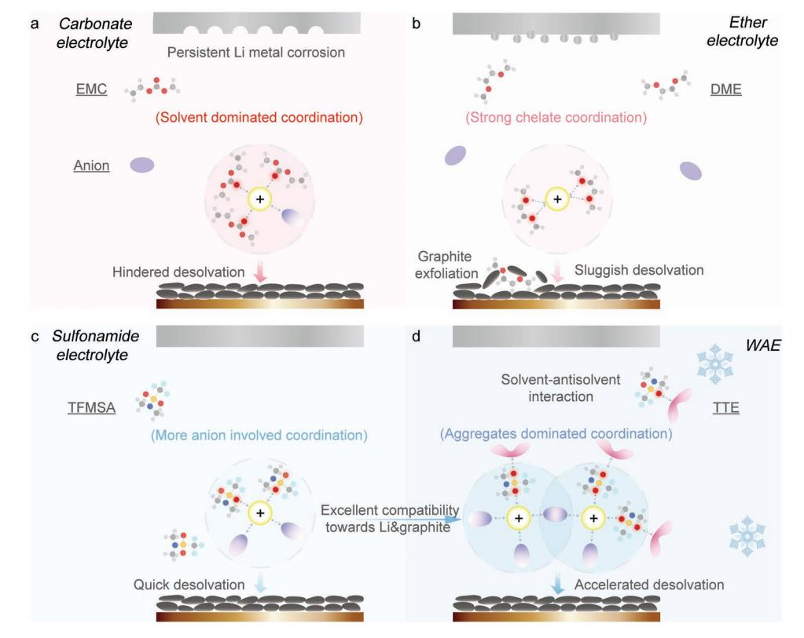
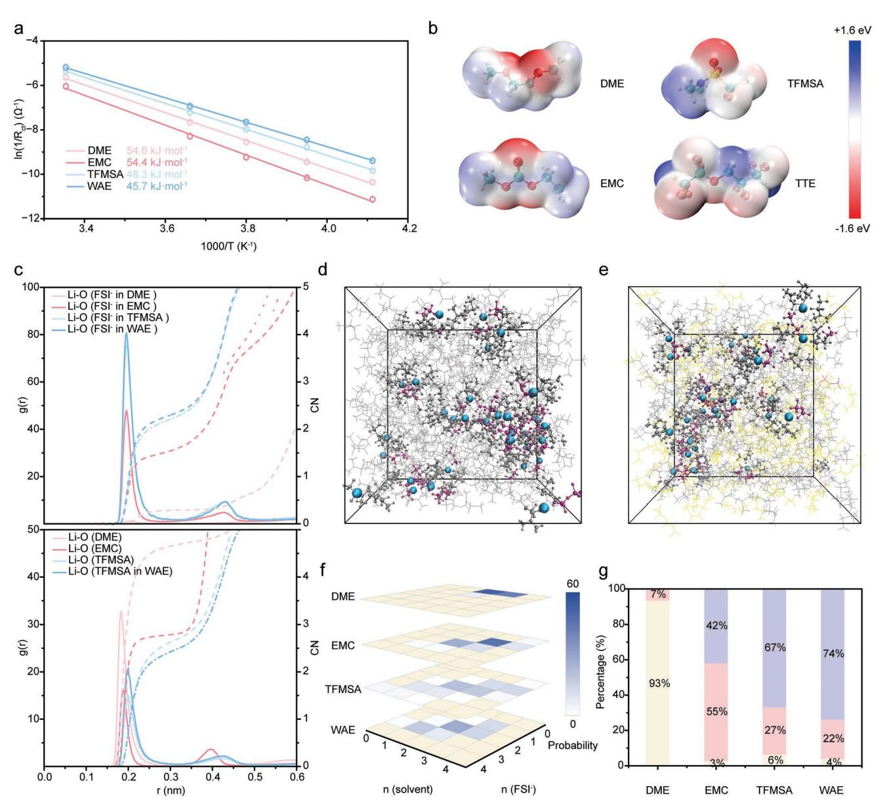
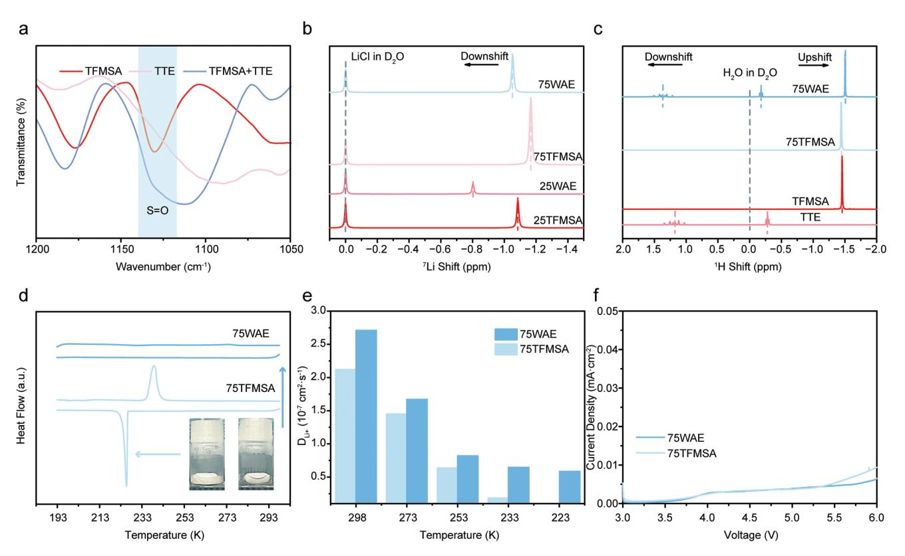
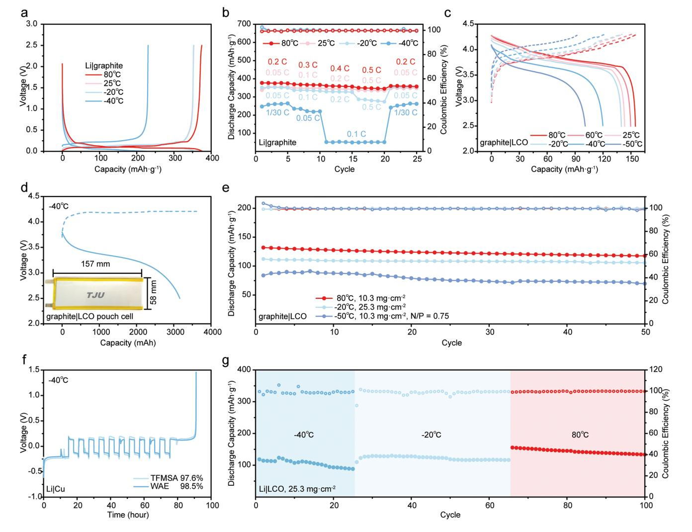
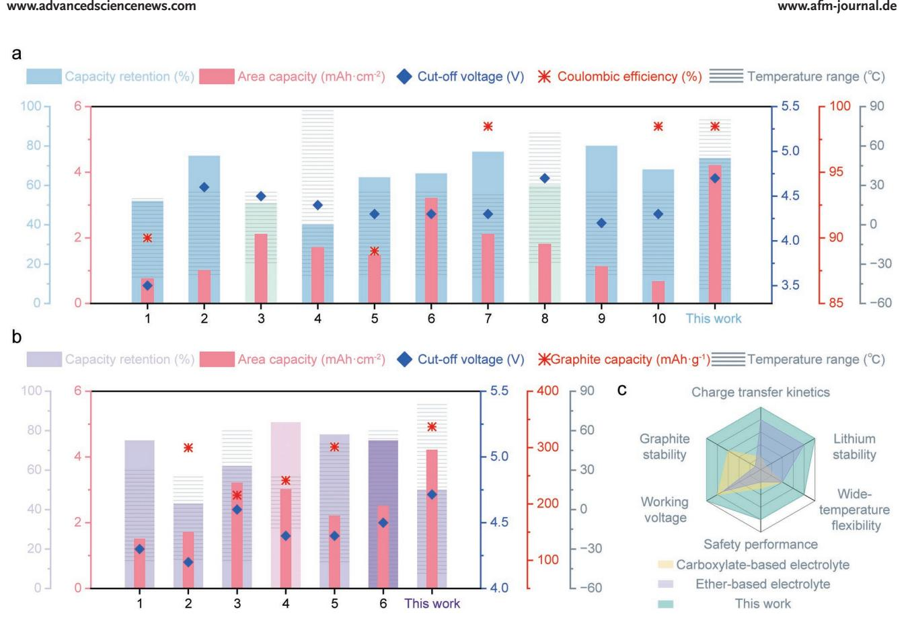

# **Solvation Engineering Enables High-Voltage Lithium Ion and Metal Batteries Operating Under −50 and 80 °C**

*Aoxuan Wang, Yuening Song, Zhengfei Zhao, Xi Li, Zhenglin Hu,\* and Jiayan Luo\**

**Extreme temperatures (<-20 °C or >50 °C) would seriously impair the performance of lithium batteries through deteriorating bulk ion transport and electrode interfaces. Here, a rational design of weak solvent and anti-solvent combination is presented for wide-temperature electrolytes. The weak solvent provides accelerated desolvation kinetics of Li+ around the anode region, while the anti-solvent not only functions as an antifreeze agent for smooth ion migration at low temperatures but also interacts with the weak solvent to boost the formation of ionic aggregates. The weak and anti-solvent electrolyte (WAE) exerts excellent compatibility with both lithium metal and graphite. Under −40 °C, Li anode delivers 98.5% Coulombic efficiency and graphite outputs capacity over 230 mAh g-1 . Lithium-ion/metal batteries by pairing graphite anode with LiCoO2 cathode with a negative to positive capacity ratio of 0.75 can realize steady operation at** −**50** °**C with an average coulombic efficiency of 99.9%. Lithium metal batteries with 4.2 mAh cm-2 high LiCoO2 cathode loading and 50 µm thin lithium anode deliver 73.8% capacity output at −40 °C. Besides, the cells are stable up to 80 °C with an average coulombic efficiency of 99.7%. This research demonstrates a relatively loose Li+ solvation environment in WAE systems and provides wide-temperature electrolyte for high-performance lithium ion and metal batteries.**

### **1. Introduction**

Lithium-ion batteries (LIBs) are the mainstream energy storage systems due to the mature manufacturing technology, long lifespan, and environmental friendliness. But their performance degrades greatly when operating below −20 °C, severely restricting the promotion of electric vehicles and the application of specific scenarios, such as deep-sea work, military action, and space exploration.[1] In the widely used carbonate electrolytes

A. Wang, Y. Song, Z. Zhao, X. Li, Z. Hu, J. Luo Key Laboratory for Green Chemical Technology of Ministry of Education State Key Laboratory of Chemical Engineering School of Chemical Engineering and Technology Tianjin University Tianjin 300072, China E-mail: huzl@tju.edu.cn; jluo@tju.edu.cn J. Luo State Key Laboratory of Metal Matrix Composites School of Materials Science and Engineering Shanghai Jiao Tong University Shanghai 200240, China The ORCID identification number(s) for the author(s) of this article can be found under https://doi.org/10.1002/adfm.202302503.

**DOI: 10.1002/adfm.202302503**

based on a mixture of carbonates, the cyclic carbonate of ethylene carbonate (EC) is able to deliver the unique ability of lithium salt dissociation with high dielectric constant.[2] and build compact solidelectrolyte-interphase on graphite anode.[3] Unfortunately, EC solvent has a relatively high melting point of 36.4 °C (Table S1, Supporting Information), which solidifies at temperatures below −20 °C. Linear carbonates, as distinct from cyclic carbonates in terms of lower melting point and viscosity still display strong interactions with Li+ and thus gives rise to a large desolvation barrier, further reducing the ion transport dynamics (**Figure 1**a). These lead to high polarization overpotential for the low-temperature operation of graphite anode.[4] The next generation of lithium metal batteries (LMBs) with higher energy density has put forward more stringent requirements for electrolytes in which carbonate electrolytes are incompatible.[5] Ether electrolytes with high reduction stability are compatible with lithium metal anodes,[6] but the chelation of the ether

oxygen and Li+ significantly aggravate the desolvation,[7] and the solvent co-intercalation.[8] into graphite restricts their use in LIBs (Figure 1b).

At present, researches on low-temperature electrolytes mainly focus on liquefied gas,[9] ether,[7,10] and carboxylate systems.[11] Electrolyte systems dominated by weak solvents with suitable redox potential and desolvation kinetics can also deliver the great potential for low-temperature service.[12] Polar aprotic *N*,*N*-dimethyltrifluoromethane-sulfonamide (TFMSA) sustain lithium metal effectively (Figure 1c).[13] However, TFMSA's freezing point is ≈−40 °C, thus posing a great challenge to be used under even lower temperature environments. In general, it was tough to formulate a single weak solvent with good compatibility towards both lithium metal and graphite, ultralow freezing point, wide electrochemical window, sufficient lithium salt dissociation, and ion transport simultaneously. 1,1,2,2-tetrafluoroethyl-2,2,3,3 tetrafluoropropyl ether (TTE) is an anti-solvent that cannot dissolve lithium salt.[14] If added into sulfonamide electrolyte, the molecular interaction between TTE and TFMSA can further accelerate the desolvation process of Li+ from TFMSA. Besides, TTE has an ultralow freezing point (−115 °C), which can ensure electrolyte fluidity and ionic conduction even at ultralow temperature (Figure 1d).

**Figure 1.** a–d) Schematic illustrations of carbonate, ether. and sulfonamide electrolytes characteristics and the design strategies of WAE.

In this work, we propose an integrated weak and anti-solvent electrolyte (WAE) for low-temperature batteries by combining the TFMSA weak solvent with TTE anti-solvent. With the aggregates-dominated solvation structure and the interaction between weak and anti-solvent, excellent low-temperature performance in LIBs and LMBs has been achieved for the first time. At −40 °C, the Li|Cu cells carried out a 98.5% coulombic efficiency (CE), the graphite delivered up to 230 mAh g−1 capacity, and a 5 Ah graphite/LiCoO2 pouch cell outputted over 60% capacity retention, proving its potential in practical applications. Long-term cycling lithium metal batteries with high cathode area capacity (4.2 mAh cm−2) and low negative to positive capacity ratio of 2.5 were realized for a wide temperature range of −50 to 80 °C.

#### **2. Results and Discussion**

The main challenge faced by lithium batteries operated at low temperatures is the prohibitively large charge transfer resistance (*R*ct). It was found that WAE exhibited the smallest *R*ct, followed by sulfonamide, carbonate, and ether electrolytes (Figure S1, Supporting Information). To study the desolvation kinetics, fitting the activation energy of the interfacial process according to the Arrhenius equation was further carried out (**Figure 2**a). Compared to the carbonate (54.4 kJ mol-1 ) and ether electrolyte (54.6 kJ mol-1 ), WAE demonstrated much lower Li+ desolvation energy (45.7 kJ mol-1 ), even lower than the sulfonamide electrolyte (48.3 kJ mol-1 ), proving that TTE further weakened the solvation compared with sulfonamide electrolyte. To gain insights on the solvent's solvation capability at a molecular level, density functional theory calculations were conducted. The affinity to Li+ for various solvents, which is commonly related to their Lewis basicity, can be evaluated by the negative electrostatic potential of the donor atom. From the electrostatic potential map, it was found that the electrostatic potential (ESP) minima increased in the order of DME < EMC < TFMSA, indicating that TFMSA has the weakest affinity toward Li+. For TTE, the fluorine and oxygen atoms possess negligible coordination capability due to their significantly less negative charge, as represented by light red and blue (Figure 2b). To shed light on the lower desolvation energy in TFMSA-based electrolytes, molecular dynamics (MD) simulations were performed to explore the solvation structures in detail. The radial distribution functions (RDF) and coordination numbers (CN) of anions and solvents were calculated. As shown in Figure 2c, ether and carbonate electrolytes displayed lower CN of anions (0.29 and 1.5) and higher CN of solvents (4.7 ODME and 2.8 OEMC). By contrast, in the sulfonamide electrolyte, one Li+ was solvated by 2.6 TFMSA solvents and 2.2 FSI− anions on average, confirming the weak solvating power of TFMSA. As the inert TTE was introduced, a further increase in anion coordination number by 0.1 and a decrease in solvent coordination number by 0.2 was observed, proving further weakened solvent coordination. As a result, LiFSI was poorly dissociated in TFMSA-based systems, and large ionic aggregates could be observed in the MD snapshots in Figure 2d,e. TTE molecules were not involved in the solvated structure, but they were mixed uniformly with TFMSA

**Figure 2.** a) The charge transfer resistances with Li|Li symmetric cells at various temperatures. An Arrhenius fit was used to determine the desolvation energy in different electrolytes. WAE (0.75 M LiFSI relative to TFMSA, TFMSA/TTE (7:3 vol ratio))was compared with sulfonamide (0.75 M LiFSI in TFMSA), carbonate (1 M LiFSI in EMC) and ether electrolytes (1 M LiFSI in DME) here. b) ESP maps of different solvent molecules. The darker red color indicated a more concentrated negative charge and the darker blue color indicated a more concentrated positive charge (red = −1.6 eV, blue = +1.6 eV). c) RDF and CN of FSI− and solvents. Snapshots of d) sulfonamide electrolyte and e) WAE captured from MD trajectories. Li+, FSI−, TFMSA, and TTE were colored in blue, mauve, gray, and yellow, respectively, with the Li+ solvation structures highlighted using the ball-and-stick model. f) The distribution of Li+ solvation clusters in different electrolytes. g) LiFSI aggregation states in different electrolytes. The percentage of solvent-separate ion pairs, contact ion pairs, and aggregates were colored in yellow, pink, and purple, respectively.

throughout the domain. Abundant TTE molecules could be found near the coordinated solvent molecules, which differed from the common solvent pair surrounded by TTE in locally high-concentration electrolytes.[10b,15] Figure 2f showed the occurring frequencies of Li+-solvent-FSI− cluster of each electrolyte and it turned out that WAE exceeded sulfonamide electrolyte exhibiting the largest number of anion-dominated solvates, namely [Li(TFMSA)2(FSI−)2] − and [Li(TFMSA)1(FSI−)3] 2−. By contrast, ether electrolyte was mainly constituted of [Li(DME)2] +

and [Li(DME)3] +, whereas carbonate electrolyte was primarily composed of Li(EMC)3 (FSI−). Based on the results, the ratio of solvent-separate ion pairs, contact ion pairs, and aggregates were calculated and compared in Figure 2g. WAE delivered the highest aggregates proportion of 74%, followed by sulfonamide (67%), carbonate (42%), and ether electrolytes (7%).

Motivated by the solvation weakening effect of TTE, a series of LiFSI-TFMSA-TTE systems with a variating fraction of TTE were prepared (Table S2, Supporting Information). Fourier

**Figure 3.** a) FTIR spectra of pure TFMSA solvent, TTE anti-solvent, and their 1:1 mixture. b) 7 Li NMR and c) 1 H NMR of WAE and sulfonamide electrolytes. d) DSC tests of 75WAE and 75TFMSA e) The Li+ diffusion coefficients of 75WAE and 75TFMSA at various temperatures. f) LSV profiles of 75WAE and 75TFMSA at a scan rate of 2 mV s−1 .

transform infrared spectra absorption spectra (FTIR)of TFMSA, TTE, and the mixture in **Figure 3**a depicted the absorption peaks around 1130 cm−1 , assigned to the S = O stretching vibration of TFMSA. Notably, as the proportion of TTE increased (Figure S2a, Supporting Information), the absorption peak gradually shifted to a lower frequency, reflecting the reinforced interaction between TTE and TFMSA. The peak shift behavior remained nearly the same regardless of the concentration of LiFSI salt (Figure S2b, Supporting Information). The influence of TTE addition on Li+ solvation was further verified by 7 Li nuclear magnetic resonance (NMR). An intensified de-shielding effect of Li+ (Figure 3b) was observed with the increase of TTE, which attributes to weaker electron screening from its solvation sheath. The results confirmed less solvated Li+ in WAE than in sulfonamide electrolyte. 1 H NMR spectra were also employed to provide more details about the intermolecular interactions (Figure 3c). The chemical shift of hydrogen in TTE moved toward the low field, which could be explained by the weak hydrogen bond formation between TTE and TFMSA, as the -CF2H group in TTE may act as a hydrogen bond donor and attract the oxygen in TFMSA molecules being hydrogen bond acceptors.[16] This intermolecular hydrogen bond between TTE and TFMSA was also supported by the calculated RDF between HTTE and OTFMSA, which exhibited a specific peak located at ≈0.28 nm (Figure S3, Supporting Information). With a melting point of −39 °C, TFMSA electrolytes solidified at −50 °C (Figure S4, Supporting Information). Accompanied by the introduction of TTE, a rapid drop of Li salt solubility was observed, confirming that the solvating inability of TTE. The introduction of TTE also causes a slight decrease in ion conductivity (Figure S5, Supporting Information). Hence, considering the balance of conductivity, viscosity, and desolvation energy, 0.75 M LiFSI (relative to TFMSA)-TFMSA/TTE (7:3 vol ratio) (75WAE) was determined to be the optimum formulation. Differential scanning calorimetry (DSC) tests (Figure 3d and Figure S6, Supporting Information) indicated that 75WAE still maintained a liquid state even at −80 °C. The MD simulation calculated Li+ diffusion coefficient of 75WAE was three times larger than that of TTE-free electrolyte at −40 °C (Figure 3e). Furthermore, the interaction between TFMSA and TTE further inhibited the interface decomposition on cathodes and broadened the electrochemical window above 5.5 V, which supported the full cells charged at a cut-off voltage of 4.7 V successfully (Figure 3f and Figure S7, Supporting Information).

To verify the reversibility of Li+ ions in the case of active lithium evolution at low temperatures, Li|graphite half cells were assembled with both WAE and either electrolyte under the condition of 150% state of charge (SOC). Compared to the carbonate electrolyte, graphite with WAE electrolyte at −40 °C exhibited lower overpotential (Figure S8, Supporting Information). Scanning electron microscopy (SEM) images were taken for lithiated or delithiated graphite (**Figure 4**a–d). In contrast to the needle-like lithium plating in carbonate electrolyte, compact and homogeneous lithium deposition has been observed on graphite anode with WAE. Nearly all lithium can be extracted from the graphite during the delithiated process. However, a

**Figure 4.** SEM images of a) lithiated and b) delithiated graphite under 150% SOC at -40 °C in WAE. SEM images of c) lithiated and d) delithiated graphite under 150% SOC at −40 °C in carbonate electrolyte. Optical and SEM images of 3 mAh cm−2 of Li metal deposited at −40 °C in WAE (e, g) and carbonate electrolyte (f, h). i) i0 and ELi of various electrolytes at −40 °C. All the electrolytes were designed with 1 M LiFSI. j) Schematic illustration of the mechanism for achieving high CE at low temperatures.

substantial amount of lithium in graphite anode became irreversible terms of carbonate electrolyte. In addition, the constant capacity (3 mAh cm−2) of lithium was deposited at a low temperature on Cu foil (Figure 4e-h). It was observed that the active lithium in the WAE exhibits metallic color with a thickness of ≈15.1 µm (close to the theoretical value of 14.6 µm). However, the deposited lithium in carbonate electrolyte showed a thickness of ≈26.4 µm with a moss morphology.

To investigate the mechanisms for dense lithium deposition from TFMSA-based electrolyte at low temperatures, we introduced exchange current density (i0) to characterize the deposition kinetics of Li+ and lithium anode potential (ELi) to reflect the thermodynamic processes towards active lithium at −40 °C (Figure S9 and Figure S10, Supporting Information).[17] In fact, solvents such as diethyl ether (DEE)[7] and dimethoxymethane (DMM).[18] were able to accomplish dense lithium deposition at low temperatures due to the quick ion desolvation. The results in Figure 4i indicated that TFMSA exhibited the largest ELi value of 0.57 V at −40 °C, followed by DEE and DMM with ELi values of 0.24 and 0.26 V, respectively. It is consistent that these three solvents interacted with lithium ions weekly and guaranteed fast Li+ separation from the solvent cluster. Meanwhile, they also delivered relatively lower values of i0 (1.0 to 2.4 mA cm−2 ) at −40 °C compared to DME (14.6 mA cm−2 ), leading to a larger polarization with faster and more intense nucleation.[19] EMC delivered similar features in terms of ELi and i0 (0.18 V and 0.9 mA cm−2) with DEE and DMM, but is chemically unstable towards lithium. To achieve high CE lithium metal anode at low temperatures, the electrolytes can be designed by screening solvent with low dielectric constant, low donor number, using steric effect or increasing the lithium salt concentration. In addition, it is also essential to boost the coordination between Li+ and anions to inhibit solvent decomposition as well as the lower the reaction rate (Figure 4j).

To highlight the benefits of practical applications, Li|graphite half cells were assembled and tested at different temperatures. As shown in **Figure 5**a,b, the WAE exhibited a remarkable performance at −20 °C with negligible capacity decay and potential change at 0.5 C. At −40 °C, there was still a high intercalation capacity of 230 mAh g−1 . According to previous research,[4,20] graphite anode presented enormous *R*ct during lithiation at low temperatures, which is hard for the Li+ intercalation process. Enabled by the facile desolvation process, graphite|LiCoO2 full cells with WAE can be cycled with an excellent performance from −50 to 80 °C (Figure 5c). A 5 Ah graphite|LiCoO2 pouch cell was also assembled, which showed remarkable capacities

**Figure 5.** a–e) Electrochemical performance of wide-temperature LIBs with WAE: a) Voltage profiles of Li|graphite half cells at 0.05 C. b) Rate capabilities of Li|graphite half cells. c) Voltage profiles of graphite|LiCoO2 full cells at 0.2 C, 0.1 C (−40 °C), and 0.05 C (−50 °C). d) Voltage profiles of the graphite|LiCoO2 pouch cell with a nominal capacity of 5 Ah at 0.2 constant current (CC)-0.02 constant voltage (CV)|0.05 C e) Cycling performance of graphite|LiCoO2 full cells at 0.2 C|0.5 C (80 °C), 0.15 CC-0.05 CV|0.15 C (−20 °C), 0.05 C (−50 °C), respectively. f–g) Electrochemical performance of wide-temperature LMBs with WAE: f) Voltage profiles of Li|Cu half cells at -40 °C with a current density of 0.33 mA cm−2 . g) Cycling performance of the Li|LiCoO2 full cell with a high loading of 25.3 mg cm−2 and N/P ratio of 2.5.

of 4866, 4849, and 3163 mAh at 80, 25, and −40 °C, respectively (Figure 5d and Figure S11, Supporting Information). Inspired by the dense lithium plating low temperatures, graphite|LiCoO2 full cell with a low N/P ratio of 0.75 was assembled (Figure 5e and Figure S12a, Supporting Information). Moreover, LIBs with high-loading LiCoO2 cathodes of 25.3 mg cm−2 at low temperatures was successfully cycled (Figure 5e Figure S12b,c, Supporting Information). It delivered favorable discharge capacity of 2.8 mAh cm−2 at −20 °C and in particular 1.9 mAh cm−2 at −40 °C, proving the adaptability in harsher conditions.

For lithium metal batteries, WAE demonstrated an enhanced Li|Cu half cells CE of 98.5% at −40 °C by a more accurate efficiency measurement protocol,[21] compared to 97.6% for sulfonamide electrolyte (Figure 5f). Even over a wide temperature range of 130 °C, WAE displayed a superior compatibility toward lithium metal (Figure S13, Supporting Information). Full cell with a 4 mAh cm−2 LiCoO2 cathode (high loading of 25.3 mg cm−2 ) and thin Li anode (50 µm, N/P = 2.5) was assembled to pursue higher energy density (Figure 5g and Figure S14, Supporting Information). Considering the relatively minor damage to electrode structure at low temperatures, the cycling protocol was conducted at −40, −20, and 80 °C in sequence. During the whole process, it always maintained impressive area capacity and ultrahigh CE beyond 99.7% within 100 cycles. To our knowledge, it was the first reported wide-temperature electrolyte system that can enable the desirable behavior of half and full cells for both graphite and lithium metal-based batteries.

An ideal electrolyte for practical application should simultaneously achieve several key parameters, including wide electrochemical window, sufficient ion conductivity, wide temperature adaptation, and cathode/anode compatible. The asdesigned WAE may be an electrolyte of choice in terms of the

**Figure 6.** a) Comparison of recently reported LMBs at extreme temperatures. The capacity retention of Ref. 3 and Ref. 8 is recorded at −30 °C while others are recorded at −40 °C. CEs of Li|Cu half cells are tested at −40 °C b) Comparison of recently reported graphite-based LIBs at extreme temperatures. The capacity retention of Ref. 4 and Ref. 6 is recorded at −15 and −50 °C respectively while others are recorded at −40 °C. The capacity of Li|graphite half cells is tested at −15 °C for Ref. 4 while others are recorded at −20 °C. c) Radar plots of WAE, conventional carboxylate, and ether-based electrolytes in terms of working voltage, charge transfer kinetics, lithium stability, graphite stability, wide temperature flexibility, and safety performance.

integrated electrochemical properties. Comparing WAE with contemporary reports (Table S3 and S4, Supporting Information) based on extreme temperature electrolyte design could reflect its all-around performance to a greater extent (**Figure 6**a,b). First, the WAE possesses a wide electrochemical window over 5.5 V and has been successfully charged at a cutoff voltage of 4.7 V, exceeding other electrolytes recorded here. Then, it is also the first time for wide-temperature electrolytes to be matched with a large 4 mAh cm−2 LiCoO2 cathode loading. Moreover, the batteries achieve stable longterm cycling at the widest temperature range (from −50 to 80 °C) at present. Six critical properties of WAE surpassing conventional carboxylate and ether-based electrolytes usually involved at low temperatures are compared in a radar plot (Figure 6c).[22] Besides the high electrochemical window, WAE also has the advantages of rapid interfacial kinetics, lithium metal, and graphite compatibility. Additionally, TFMSA possesses relatively low volatility and high flash point,[23] which are prerequisites for wide-temperature operation. The molecules in WAE system are thermally stable and highly fluorinated, which makes WAE less susceptible to decomposition and provides a significantly enhanced level of safety (Figure S15, Supporting Information).

#### **3. Conclusion**

In this work, we proposed a rational design combining weak solvent TFMSA and anti-solvent TTE to tackle thermodynamic and kinetic obstacles of electrolytes at extreme temperatures. TFMSA provides accelerated desolvation kinetics and TTE acts as an antifreeze agent and further reinforce the desolvation, resulting in an ion-aggregates rich electrolyte compatible to both lithium metal and graphite anode. The unique WAE enables both lithium metal and lithium-ion cells to operate in the wide temperature range from −50 to 80 °C. In addition, we discuss the factors that limit the CE to active lithium at low temperatures and conclude that a smooth desolvation process with relatively slow Li+ deposition is requisite for enhancing lithium reversibility at low temperatures. This provides a new approach to developing electrolytes for wide-temperature battery cycling with high lithium reversibility.

#### **Supporting Information**

Supporting Information is available from the Wiley Online Library or from the author.

#### **Acknowledgements**

A.W. and Y.S. contributed equally to this work. This work was supported by the National Key Research and Development Program of China (No. 2021YFB2500100), National Natural Science Foundation of China (No. 22278308, 22109114, and 22102099), and Open Foundation of Shanghai Jiao Tong University Shaoxing Research Institute of Renewable Energy and Molecular Engineering (Grant number: JDSX2022023).

# **Conflict of Interest**

The authors declare no conflict of interest.

# **Data Availability Statement**

The data that support the findings of this study are available from the corresponding author upon reasonable request.

## **Keywords**

anti-solvents, interfaces, solvation engineering, weak solvents, wide temperatures

> Received: March 4, 2023 Revised: April 12, 2023

- Published online: May 5, 2023
- [1] D. Hu, G. Chen, J. Tian, N. Li, L. Chen, Y. Su, T. Song, Y. Lu, D. Cao, S. Chen, F. Wu, *J. Energy Chem.* **2021**, *60*, 104.
- [2] D. Luo, M. Li, Y. Zheng, Q. Ma, R. Gao, Z. Zhang, H. Dou, G. Wen, L. Shui, A. Yu, X. Wang, Z. Chen, *Adv. Sci.* **2021**, *8*, 2101051.
- [3] a) M. Nie, D. Chalasani, D. P. Abraham, Y. Chen, A. Bose, B. L. Lucht, *J. Phys. Chem. C* **2013**, *117*, 1257; b) S. K. Heiskanen, J. Kim, B. L. Lucht, *Joule* **2019**, *3*, 2322.
- [4] a) S. S. Zhang, K. Xu, T. R. Jow, *J. Power Sources* **2003**, *115*, 137; b) M. C. Smart, B. V. Ratnakumar, L. D. Whitcanack, K. B. Chin, S. Surampudi, H. Croft, D. Tice, R. Staniewicz, *J. Power Sources* **2003**, *191*, 349; c) Q. Li, D. Lu, J. Zheng, S. Jiao, L. Luo, C. M. Wang, K. Xu, J. G. Zhang, W. Xu, *ACS Appl. Mater. Interfaces* **2017**, *9*, 42761.
- [5] a) X. Fan, C. Wang, *Chem. Soc. Rev.* **2021**, *50*, 10486. b) X. Cao, H. Jia, W. Xu, J. G. Zhang, *J. Electrochem. Soc.* **2021**, *168*, 010522.
- [6] a) C. V. Amanchukwu, Z. Yu, X. Kong, J. Qin, Y. Cui, Z. Bao, *J. Am. Chem. Soc.* **2020**, *142*, 7393; b) Z. Yu, P. E. Rudnicki, Z. Zhang, Z. Huang, H. Celik, S. T. Oyakhire, Y. Chen, X. Kong, S. C. Kim, X. Xiao, H. Wang, Y. Zheng, G. A. Kamat, M. S. Kim, S. F. Bent, J. Qin, Y. Cui, Z. Bao, *Nat. Energy* **2022**, *7*, 94; c) Y. Zhao, T. Zhou, T. Ashirov, M. E. Kazzi, C. Cancellieri, L. P. H. Jeurgens, J. W. Choi, A. Coskun, *Nat. Commun.* **2022**, *13*, 2575.
- [7] J. Holoubek, H. Liu, Z. Wu, Y. Yin, X. Xing, G. Cai, S. Yu, H. Zhou, T. A. Pascal, Z. Chen, P. Liu, *Nat. Energy* **2021**, *6*, 303.
- [8] J. Ming, Z. Cao, Q. Li, W. Wahyudi, W. Wang, L. Cavallo, K. J. Park, Y. K. Sun, H. N. Alshareef, *ACS Energy Lett.* **2019**, *4*, 1584.

#### **www.advancedsciencenews.com www.afm-journal.de**

- [9] a) C. S. Rustomji, Y. Yang, T. K. Kim, J. Mac, Y. J. Kim, E. Caldwell, H. Chung, Y. S. Meng, *Science* **2017**, *356*, 1351; b) Y. Yin, J. Holoubek, A. Liu, B. Sayahpour, G. Raghavendran, G. Cai, B. Han, M. Mayer, N. B. Schorr, T. N. Lambert, K. L. Harrison, W. Li, Z. Chen, Y. S. Meng, *Adv. Mater.* **2023**, *35*, 2207932.
- [10] a) A. C. Thenuwara, P. P. Shetty, N. Kondekar, S. E. Sandoval, K. Cavallaro, R. May, C. T. Yang, L. E. Marbella, Y. Qi, M. T. McDowell, *ACS Energy Lett.* **2020**, *5*, 2411; b) J. Holoubek, K. Kim, Y. Yin, Z. Wu, H. Liu, M. Li, A. Chen, H. Gao, G. Cai, T. A. Pascal, P. Liu, Z. Chen, *Energy Environ. Sci.* **2022**, *15*, 1647; c) W. Zhang, Y. Lu, L. Wan, P. Zhou, Y. Xia, S. Yan, X. Chen, H. Zhou, H. Dong, K. Liu, *Nat. Commun.* **2022**, *13*, 2029.
- [11] a) X. Dong, Z. Guo, Z. Guo, Y. Wang, Y. Xia, *Joule* **2018**, *2*, 902; b) X. Dong, Y. Lin, P. Li, Y. Ma, J. Huang, D. Bin, Y. Wang, Y. Qi, Y. Xia, *Angew. Chem. Int. Ed.* **2019**, *58*, 5623; c) Y. Yang, P. Li, N. Wang, Z. Fang, C. Wang, X. Dong, Y. Xia, *Chem. Commun.* **2020**, *56*, 9640; d) S. Lin, H. Hua, P. Lai, J. Zhao, *Adv. Energy Mater.* **2021**, *11*, 2101775.
- [12] J. Xu, J. Zhang, T. P. Pollard, Q. Li, S. Tan, S. Hou, H. Wan, F. Chen, H. He, E. Hu, K. Xu, X. Yang, O. Borodin, C. Wang, *Nature* **2023**, *614*, 694.
- [13] a) W. Xue, M. Huang, Y. Li, Y. G. Zhu, R. Gao, X. Xiao, W. Zhang, S. Li, G. Xu, Y. Yu, P. Li, J. Lopez, D. Yu, Y. Dong, W. Fan, Z. Shi, R. Xiong, C. J. Sun, I. Hwang, W. K. Lee, Y. Shao-Horn, J. A. Johnson, J. Li, *Nat. Energy* **2021**, *6*, 495; b) W. Xue, R. Gao, Z. Shi, X. Xiao, W. Zhang, Y. Zhang, Y. Zhu, I. Waluyo, Y. Li, M. R. Hill, Z. Zhu, S. Li, O. Kuznetsov, Y. Zhang, W. K. Lee, A. Hunt, A. Harutyunyan, Y. Shao-Horn, J. A. Johnson, J. Li, *Energy Environ. Sci.* **2021**, *14*, 6030.
- [14] X. Cao, P. Gao, X. Ren, L. Zou, M. H. Engelhard, B. E. Matthews, J. Hu, C. Niu, D. Liu, B. W. Arey, C. Wang, J. Xiao, J. Liu, W. Xu, J. G. Zhang, *Proc. Natl. Acad. Sci. USA* **2021**, *118*, 2020357118.
- [15] C. Wang, B. Nan, L. Chen, N. D. Rodrigo, O. Borodin, N. Piao, J. Xia, T. Pollard, S. Hou, J. Zhang, X. Ji, J. Xu, X. Zhang, L. Ma, X. He, S. Liu, H. Wan, E. Hu, W. Zhang, K. Xu, X. Q. Yang, B. Lucht, *Angew. Chem. Int. Ed.* **2022**, *61*, e202205967.
- [16] a) C. D. Sessler, M. Rahm, S. Becker, J. M. Goldberg, F. Wang, S. J. Lippard, *J. Am. Chem. Soc.* **2017**, *139*, 9325; b) Y. Zafrani, D. Yeffet, G. Sod-Moriah, A. Berliner, D. Amir, D. Marciano, E. Gershonov, S. Saphier, *J. Med. Chem.* **2017**, *60*, 797.
- [17] a) W. Martin, Y. Tian, J. Xiao, *J. Electrochem. Soc.* **2021**, *168*, 060513; b) S. Ko, T. Obukata, T. Shimada, N. Takenaka, M. Nakayama, A. Yamada, Y. Yamada, *Nat. Energy* **2022**, *7*, 1217.
- [18] T. Ma, Y. Ni, Q. Wang, W. Zhang, S. Jin, S. Zheng, X. Yang, Y. Hou, Z. Tao, J. Chen, *Angew. Chem. Int. Ed.* **2022**, *61*, e202207927.
- [19] G. M. Hobold, J. Lopez, R. Guo, N. Minafra, A. Banerjee, Y. S. Meng, Y. Shao-Horn, B. M. Gallant, *Nat. Energy* **2021**, *6*, 951.
- [20] K. Xu, A. von Cresce, U. Lee, *Langmuir* **2010**, *26*, 11538.
- [21] B. D. Adams, J. Zheng, X. Ren, W. Xu, J. G. Zhang, *Adv. Energy Mater.* **2017**, *8*, 1702097.
- [22] a) J. Holoubek, M. Yu, S. Yu, M. Li, Z. Wu, D. Xia, P. Bhaladhare, M. S. Gonzalez, T. A. Pascal, P. Liu, Z. Chen, *ACS Energy Lett.* **2020**, *5*, 1438; b) K. Xu, *Chem. Rev.* **2004**, *104*, 4303. c) J. Ming, Z. Cao, W. Wahyudi, M. Li, P. Kumar, Y. Wu, J.-Y. Hwang, M. N. Hedhili, L. Cavallo, Y.-K. Sun, L.-J. Li, *ACS Energy Lett.* **2018**, *3*, 335. d) M. Qin, Z. Zeng, S. Cheng S, J. Xie, *Interdiscip. Mater.* **2023**, *2*, 308.
- [23] S. Fu, S. Liao, J. Nie, Z. Zhou, *J. Fluor. Chem.* **2013**, *147*, 56.