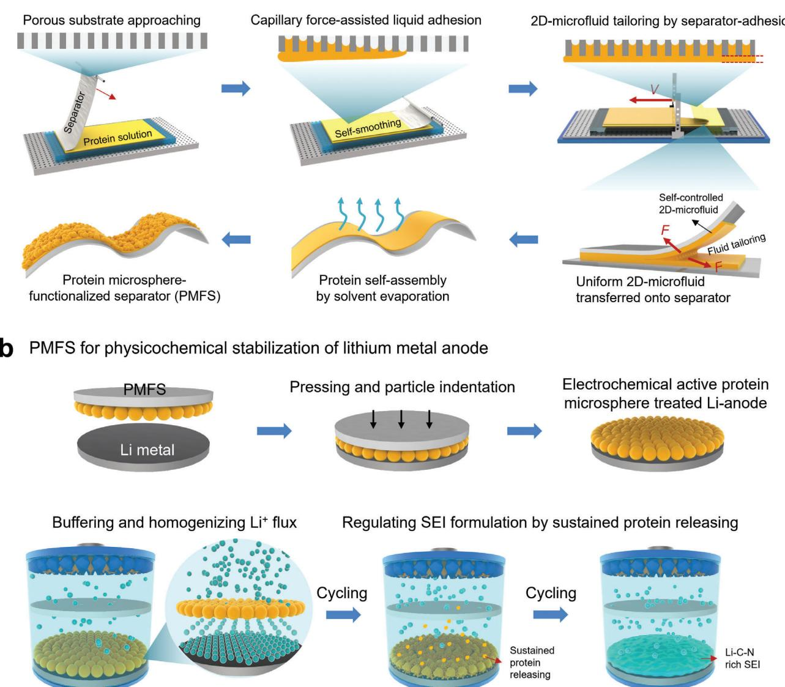
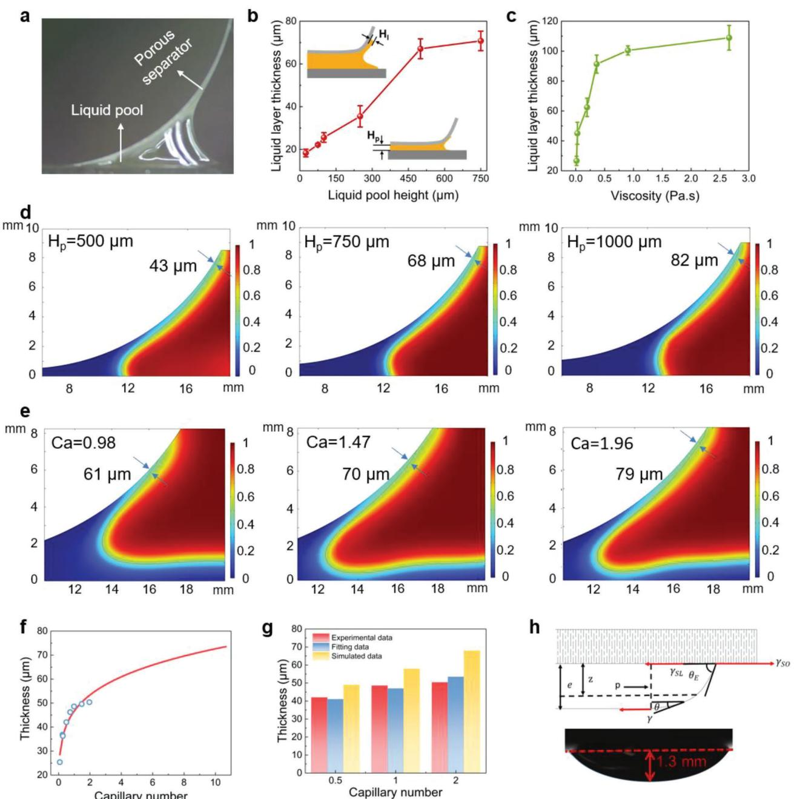
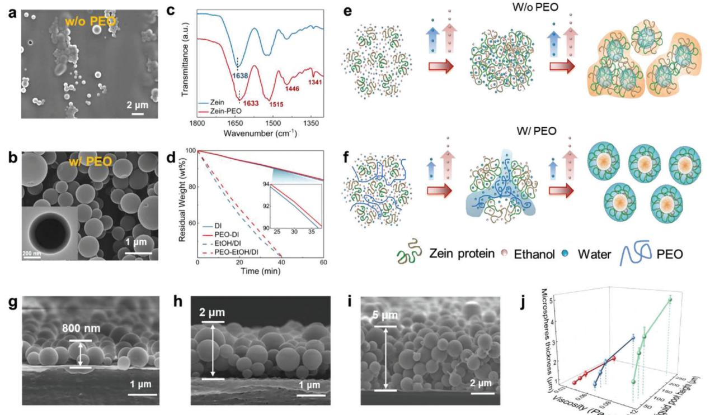
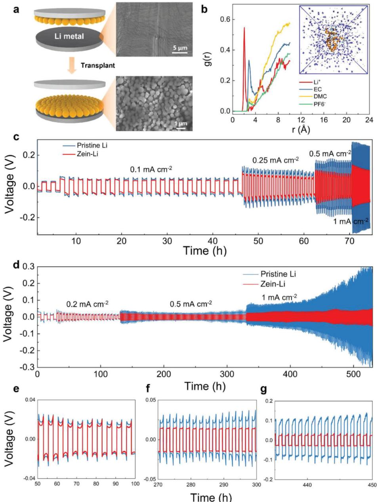
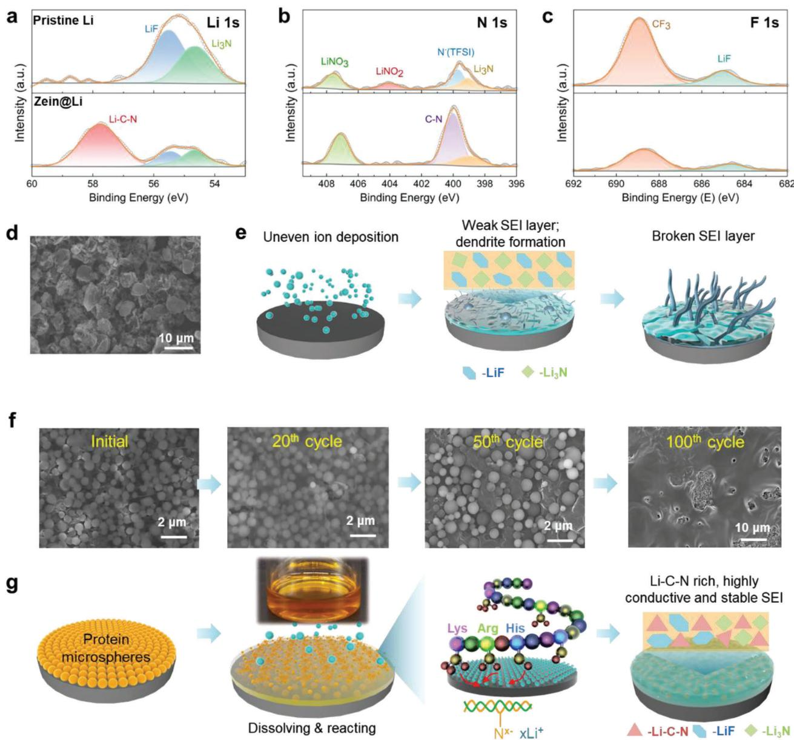
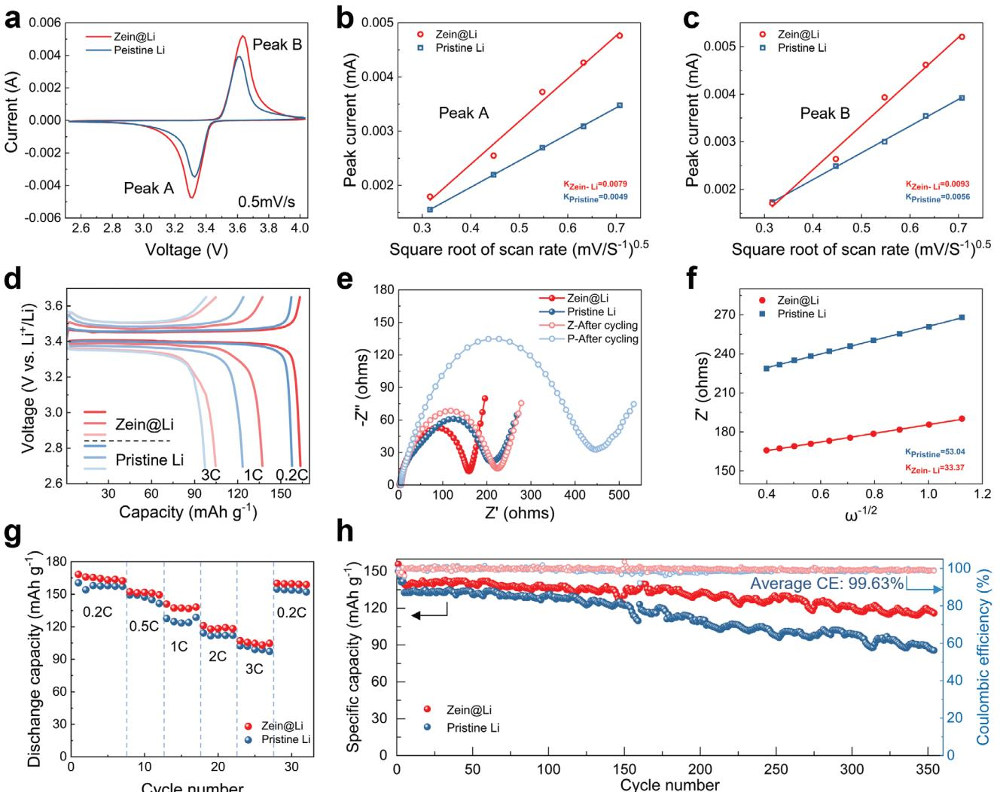

# **Electrochemical Active Micro-Protein Coating by Self-Assembling 2D-Microfluidics for Stabilizing Lithium Metal Anode**

*Ang Ye, Zhiwei Zhu, Zhongfeng Ji, Xuewei He, Yan He, Xuewei Fu,\* Wei Yang, and Yu Wang\**

**Microfluidics is of great interest for nano-/micro-fabrication but is conventionally limited inside microchannels. Breaking this restriction and developing 2D-microfluidics is anticipated to expand the potential of microfluidics. Here, by harnessing the capillary effect of porous battery separator, a concept of self-assembling capillary 2D-microfluidics is proposed to achieve well-controlled functional coating onto the separator thin-film. The capillary-assisted liquid tailoring behavior of this 2D-microfluidics is investigated by both experimental and simulation studies, and the capillary number is found as the key parameter controlling the 2D-micofluid thickness. For application studies, zein protein solution is employed for this 2D-microfluidics to generate electrochemical active and self-assembled protein microsphere coating onto the separator after drying. The resultant protein microsphere functionalized separator (PMFS) can physiochemically stabilize the surface of lithium metal anode. First, the PMFS works as spherical template to regulate uniform deposition of lithium ions. Second, similar to sustained drug release, the PMFS releases dissolved protein as functional additive into liquid electrolyte, assisting to form robust solid-electrolyte-interphase with highly conductive Li–C–N component. This work not only proposes a facile self-assembling 2D-microfluidic technology for surface nano-/micro-fabrication, but also brings forth a promising protein-based physicochemical strategy for stabilizing lithium metal anode.**

# **1. Introduction**

Manipulation of small volume of fluids, namely, microfluidics, nourishes a wide variety of applications such as micro-reaction, drug delivery, biosensing, etc.[1–4] Microfluidics based on 1D microchannels have developed to its prosperous stage, while likewise, the manipulation of 2D microfluid with thickness at

E-mail: [xuewei.fu@scu.edu.cn;](mailto:xuewei.fu@scu.edu.cn) [yu.wang3@scu.edu.cn](mailto:yu.wang3@scu.edu.cn)

The ORCID identification number(s) for the author(s) of this article can be found under<https://doi.org/10.1002/adfm.202310593>

**DOI: 10.1002/adfm.202310593**

microscale or below should be considered as 2D-microfluidic system.[5] At the scale of micron or below, the fluid physics is different from that of the larger-scale fluids, because the effect of surface tension becomes more dominant than the gravity of the microfluid.[6] The gravity can be neglected as the fluid amount is too small. Take the most common 2D-microfluidic system (i.e., coating of thin fluid layer on a surface) as a representative example, when the fluid thickness reduces to micron/nanoscale, the fluid preferably contracts together under the action of surface tension.[7] This brings about the difficulty to achieve uniform 2Dmicrofluid, which is of great interest for surface nanocoatings.[8]

To date, approaches for realizing micro or nano coatings onto 2D-surface include blade coating, spray coating, dip coating, spin coating, and so forth.[9–12] The former three approaches are accompanied by surface-tension-induced fluid contraction when the fluid or droplet is downsized to micro/nanoscale.[13] This drawback inevitably causes quality issues finally. Spin coating takes advantage of centrifugal force to spread the fluid by counteracting the effect from surface tension, which can

generate uniform micro/nanofluid coating layer thereby.[14] Despite its advantage in thickness and quality control, spin coating is only compatible with hard substrates such as silicon wafers[15] and glass slides.[16] Meanwhile, spin coating is not compatible for large-sized substrates.[17] In other words, 2D-microfluidics onto flexible and large-sized substrates is of great interest particularly for surface functionalization of 2D substrates but remains unexploited thus far.

Polymeric thin films are the most common 2D-subsrates with significant applications in liquid/gas separation,[18,19] ion exchange,[20] charge transportation,[21] packaging,[22] etc. Surface functionalization of polymeric thin films by 2D-microfluidics may bring remarkable added value. For example, battery separators are functional porous, thin films with thickness ranged from 10–30 μm. The polyethylene (PE) or polypropylene (PP) based separator is the key component controlling the charge transport between the cathode and anode. Driven by the

A. Ye, Z. Zhu, Z. Ji, X. He, Y. He, X. Fu, W. Yang, Y. Wang College of Polymer Science and Engineering State Key Laboratory of Polymer Materials Engineering Sichuan University Chengdu, Sichuan 610065, China

development of high-energy-density batteries such as lithium metal batteries,[23] the separator is anticipated to have more functions to resolve the issues from the lithium metal anode, including dendrite growth, unstable solid-electrolyte-interphase (SEI), etc.[24,25] Accordingly, separators are endowed with the functions such as puncture-resisting,[26] flame-retarding,[27] or ion-regulating.[28] These functions are usually realized by surface coating of a thin layer of functional materials, such as ceramic particles (SiO2, [29] Al2O3, [30] etc.), polymers (ploy(3,4-ethylenedioxythiophene):polystyrene sulfonate,[31] polyethylene oxide(PEO),[32] polyvinylidene difluoride,[33] etc.), carbon materials[34–37] and so on, by usually blade coating[38] or spray coating.[39] It should be noted that the thickness of the coating layer is optimized at the range of 1–10 μm. In this case, it is critical to carefully control the thickness of the coated 2Dmicrofluid at a large scale, which is challenging for traditional coating methods. Therefore, it is of great interest to develop alternative and cost-effective 2D-microfluidic strategies.

To achieve the above goal, innovation of self-controlled 2Dmicrofluidic is a key step. It is known that liquid-solid adhesion plays an important role in various processing technologies, such as coating process.[40] Recently, capillary force was also employed to manipulate the liquid droplets and successfully achieve superwettability.[41–43] These studies indicate that rational design and harnessing of fluid-substrate adhesion assisted by capillary effect are effective to overcome the surface tension and obtain a uniform microfluid without contraction. Herein, we take advantage of the porous structure and flexibility of battery separator for performing separator-supported, self-controlled, and capillary force-assisted 2D-microfluidics, as illustrated in **Figure 1**a. It is known that the conventional coating technologies have high requirements on surface flatness of the substrate, which brings in the challenge for creating well-controlled microfluid coating on flexible thin films that are easily deformed in coating process. Significantly, the proposed 2D-microfluidics imparts a selfsmoothing behavior for the battery separator when contacting the liquid surface. Meanwhile,a zein protein solution is adopted to achieve self-assembled and electrochemical active microspheres after drying, which finally generates a protein microsphere functionalized separator (PMFS). The PMFS works as a physicochemical modification agent to stabilize the SEI layer. Specific results are shown below.

# **2. Results and Discussion**

#### **2.1. Design Principles**

Conventional liquid coating techniques onto thin-film substrates are highly demanding on the film-substrate flatness to obtain uniform coating thickness. In contrast, our proposed selfcontrolled 2D-microfluidics approach takes advantage of the selfsmoothing behavior of the separator when contacting the liquid as illustrated in Figure 1a (also see Video S1, Supporting Information). The porous structure of the separator (see Figure S3, Supporting Information) acts as numerous channels to generate capillary force, boosting the liquid adsorption and wetting. The traction of the separator thereafter tears the liquid from the pool below, forming a self-controlled stable 2D-microfluid onto the separator surface owing to the micro-adhesion between the liquid and separator. During the solvent drying process, the protein solution self-assembles into microspheres. As illustrated in Figure 1b, the PMFS works with lithium anode in a unique manner. First, the protein microspheres can be transferred onto the lithium surface, forming a protein protection layer. This proteinmicrosphere layer buffers and redistributes the ion flux and thus prevents the dendrite growth. More importantly, the electrochemical active protein microspheres work in a way similar to sustained drug release, which help to regulate the SEI composition for protecting lithium metal from further corrosion.

### **2.2. Separator-Supported Self-Assembling 2D-Microfluidics**

Microfluid thickness control is the prerequisite for the success of the separator-supported 2D-microfluidics. To study how the processing affects the microfluid thickness, important processing parameters including the liquid pool height, fluid viscosity, and pulling speed have been investigated. **Figure 2**a shows that the good micro-adhesion or wetting between the protein fluid and separator enables the liquid tailoring, which generates a crescentshaped liquid bridge connecting the separator and substrate. As shown in Figure 2b, the microfluid thickness increases with the liquid pool height until it reaches 70 μm. Further increase of the liquid pool height makes a slight contribution to the microfluid thickness. This finding is worthy of discussion. First, there exists a fluid-assignment competition between the separator and the fixed substrate because both surfaces have adhesion to the liquid. A high liquid pool height may diminish the impact from the pool substrate.[44] Second, the thickness saturation point is a compromising result of the capillary force of the separator and surface tension of the fluid. From Figure 2c, one can observe that the microfluid thickness increases with the viscosity over a specific range and eventually reaches its steady state. With increased viscosity, the adhesive capacity of the liquid is augmented due to a higher degree of chain entanglement, thereby increasing the thickness of the microfluid layer.[45] Although the thickness of 2D-microfluid layer increases with the pulling speed (see Figure S4, Supporting Information), the thickness change is not as obvious as that for the other two parameters.

To understand the underlying mechanisms controlling the 2Dmicrofluid thickness, we performed a series of simulation studies at both dynamic and steady states. The dynamic process was analyzed by finite element simulation using the COMSOL Multiphysics software, and the results are shown in Figure 2d,e. The visualized liquid adsorption process can be found in Video S2 (Supporting Information). Here, a 2D fluid flow control model is used to describe the process of fluid adsorption. Figure 2d shows the effect of liquid pool height (*H*p) on the microfluid thickness. The results show that when the *H*p increases from 500 to 750 and 1000 μm, the microfluid layer thickness increases from 43 to 68 and 82 μm, respectively. Both simulation and experimental data exhibit consistent trend. Meanwhile, we induce the capillary number (*Ca*) (see Equation (1)) reflecting the relative influence of viscous force and surface tension[46]:

$$
Ca = \frac{\mu \nu}{\sigma} \tag{1}
$$

**Figure 1.** The concept of self-assembling 2D-microfluidics for fabricating PMFS and its application into lithium metal anode. a) Schematic of separatorsupported 2D-microfluidics by capillary-adhesion assisted fluid tailoring for fabricating PMFS. b) Applying PMFS for physicochemical stabilization of lithium metal anode. The electrochemical active protein microspheres work as unique interlayer to regulate the deposition morphology of lithium metal as well as the composition of the solid-electrolyte-interphase (SEI). For details, see the text.

where *μ* represents the liquid viscosity; *v* represents the liquid velocity; represents the surface tension. To simplify the simulation, the *Ca* is regulated by viscosity only, while the speed is fixed at 10 mm s−1. The surface tension is measured and fixed at 26.8 mN m−1 (see Figure S5, Supporting Information). As shown in Figure 2e, the thickness of the 2D-microfluid increases from 61 to 79 μm when the *Ca* increases from 0.98 to 1.90.

Additionally, we attempt to mathematically establish the relationship between *Ca* and microfluid thickness in Figure 2f,g. The dots represent the experimental data while the power law curve fitting is represented by the red line. The fitting result shows that the following power law Equation (2) can be used to describe the relationship between them:

$$
H = mCan \begin{cases} m = 39.56 \\ n = 0.19 \end{cases}
$$
 (2)

Figure 2g shows that, in terms of the microfluid thickness against capillary number, the data from experimental, power law fitting, and dynamic simulation are consistent with each other. The above findings indicate that the capillary number can be

**Figure 2.** Studies on the 2D-microfluidics by capillary-adhesion assisted fluid tailoring. a) Digital photo showing the liquid tailoring when the separator is pulled upward. Effects of b) liquid pool height and c) fluid viscosity on the thickness of the stabilized microfluid adsorbed by the porous separator. d) Dynamic simulation of the microfluid thickness evolution against the increasing liquid pool height. e) Dynamic simulation of the microfluid thickness against fluid viscosity as reflected by the capillary number. f) Power-law fitting curve of microfluid thickness versus the capillary number. g) Comparison of the microfluid thickness from experimental, fitting, and simulated data. h) Fluidic analysis of the steady-state model predicting the maximum thickness of the microfluid and a digital photo showing the actual microfluid at steady state.

considered as a key comprehensive parameter for describing the effects of fluid properties and tailoring speed on the 2Dmicrofluid thickness, which can be used as a powerful tool to control and predict the thickness.

Moreover, from the above results, there exists an equilibrium state for the liquid adsorption, where the thickness increase becomes unobvious. We thus analyze the maximum thickness of the adsorbed microfluid layer in its steady state by force analysis. As shown in Figure 2h, at the steady state, the calculation of the microfluid thickness is based on the force equilibrium among gravity, hydrostatic pressure, and surface tension. The equilibrium equation is established from horizontal or vertical

**Figure 3.** Studies on the PEO-and-solvent regulated self-assembly of protein microspheres in the 2D-microfluid. SEM images of self-assembled zein microspheres formed a) without PEO, and b) with PEO. The inset is the corresponding TEM image of the microsphere. Note: the zein and PEO weight ratio was fixed at 9:1. c) FTIR spectra of pure zein and zein-PEO microspheres. d) Solvent evaporation rate for deionized water (DI), ethanol/DI mixture solvent and their solution with PEO. The solid content of PEO was fixed at 2 wt.% for the solution. Schematic illustration of the self-assembly behavior of zein e) without PEO, and f) with PEO during solvent evaporation process. g–i) SEM images of the side-view for zein-protein microspheres with controlled thickness. j) Effects of 2D-microfluidics processing parameters on the protein microsphere-coating thickness.

directions, and the final calculation of the resulting thickness is given by Equation (3):

$$
e = \sqrt{\frac{2\gamma \left(1 - \cos \theta_{E}\right)}{\rho g}}
$$
\n(3)

where *e* represents the steady-state fluid layer thickness; represents the liquid-gas surface tension coefficient; E represents the contact angle; represents the fluid density; *g* represents the gravitational acceleration. The equation derives a thickness of ≈1 mm, which should be understood as the maximum thickness that the separator can hold by capillary force-based adhesion. This value is significantly higher than the actual value at dynamic state as it is based on the equilibrium conditions (see calculation details in Supporting Information). This can be verified by the digital photograph showing that the maximum height of the liquid droplet is ≈1.3 mm. The above huge difference indicates that the gravity and separation motion work together to reduce the thickness of the coated liquid layer.

#### **2.3. Self-Assembling of Zein Protein in 2D-Microfluidics**

In this study, another design of the 2D-microfluidics is the use of self-assembling protein solution. As a prolamin, zein consists of more than half nonpolar residues on its surface,[47] embedding its polar residues inside.[48] This amphiphilic nature imparts self-assembly behavior for zein to form such as particles and capsules by an anti-solvent induced phase separation.[49] Previous studies have utilized zein as an electrolyte additive[50] or separator coating[51] for stabilizing the lithium metal anode. Here, based on the zein fluid, we adopt the capillary force-assisted microfluidics to create the PMFS for particularly lithium metal anode protection. Although the evaporation-induced self-assembly (EISA) of zein microspheres has been reported,[52] the studies on EISA with 2D-microfluid are still valuable, especially with battery separator-supported 2D-microfluidics. First, the solubility of zein in water/ethanol mixture solvent was studied by varying the ethanol/water ratio from 9:1 to 1:9 as shown in Figure S6 (Supporting Information). As clearly demonstrated by the digital photograph and rheological behavior, zein is insoluble in the solvent with ethanol/water ratio of 4:6 or less. To achieve EISA favorable environment, the ethanol/water weight ratio was fixed at 7:3. The EISA of pure zein solution generates sporadic microspheres being bonded together, while a significant portion of film-like structure is found in **Figure 3**a (see more SEM images in Figure S7, Supporting Information). This result indicates an unfavorable EISA during drying in this case. Previous studies showed that the EISA is mainly caused by the increasing concentration of water for zein during drying, which induces the self-driven organization of the hydrophilic and hydrophobic groups.[53] Therefore,

EISA is not favored when the water concentration is not sufficiently high by drying.

To facilitate the EISA process, we have modified the zein solution by addition of a proper amount of PEO, a polymer with good affinity to water but poor to ethanol. In contrast to the pure zein solution, this PEO-zein system is more favorable to EISA and produces high-quality self-assembled microspheres by 2Dmicrofluid as shown in Figure 3b. Results also show that the addition of PEO notably changes the size of the protein microspheres. As shown in Figure S8 (Supporting Information), when increasing the PEO content from 10 to 20 wt.%, the diameter of microspheres decreases from 500 to 420 nm while the number density increases from 2.8 to 4.4 per μm2. As the molecular weight of PEO increases, a similar trend was observed as shown in Figure S9 (Supporting Information). Meanwhile, with increasing solid content but fixing zein/PEO weight ratio of 9:1, coalescence of zein microspheres occurs (see Figure S10, Supporting Information). We thus selected zein/PEO ratio of 9:1 (Figure 3b) and PEO molecular weight of 4 million mol g−1 for the following studies. It is also noted that the microspheres are separated with clear boundary (see more SEM images in Figure S11, Supporting Information). The above results reveal that PEO can remarkably enhance the self-assembling behavior of zein 2D-microfluid. Interestingly, it is found that the protein microspheres have a core-shell structure as indicated by the TEM images and EDS mappings in Figure 3b and Figure S12 (Supporting Information). During the self-assembly process, the solvent environment gradually becomes water-dominated due to the faster volatilization of ethanol. This drives the self-assembly of zein microspheres. It is thus speculated that the water-soluble PEO tends to form the outer layer on zein when it completes its self-assembling. To further understand this phenomenon, the possible interactions among the components for PEO-zein solution were probed. The Fourier transform infrared (FTIR) spectra in Figure 3c show that the amide-I peak of zein at 1638 cm-1 shifts to 1633 cm−1 with the addition of PEO, indicating the conformation change of zein from -helix to -sheet structure.[54,55] The -sheet structure is beneficial to the microsphere self-assembly because the packing of -sheet into stripes is critical for growing the spheres.[56] Meanwhile, it is found that the existence of PEO affects the solvent evaporation and thus promotes the formation of hydrophobic environment for assisting the self-assembly of zein.[49]As shown in Figure 3d, at the same evaporation time, the residual weight for the solution samples with PEO in both ethanol/deionized water (EtOH/DI) and DI water systems is higher than that for the pure solvents only. Because PEO shows good affinity to water but poor affinity to ethanol, this result indicates that PEO may work as water trapping agent to regulate the environment for protein selfassembling.

To gain a deep insight into the PEO-enhanced self-assembly process of zein, the possible mechanism is illustrated in Figure 3e,f, with a focus on how the PEO contributes to the solvent environment. As shown in Figure 3e, for pure zein solution, the DI/ethanol mixture solvent provides a favorable solvent environment for dissolving zein. As ethanol evaporates faster than water, water is concentrated in the system during drying, which causes a soluble-to-insoluble transition and zein self-assembling. If the water concentrating induced by evaporation-rate difference is not significant, zein tends to form film by the strong hydrophobic interactions and Van der Walls force.[57] On the contrary, the addition of PEO greatly changes the solvent environment. PEO decelerates the water evaporation, making the system more favorable to the phase separation and self-assembling of zein. As illustrated in Figure 3f, water molecules are trapped by PEO chains, impeding the aggregation of zein nucleus. Meanwhile, the dissolved protein chains continue their self-assembling onto the nucleus, which grows the microspheres. In other words, the presence of PEO helps build a hydrophilic solvent environment for zein self-assembling.

Another advantage is that the final thickness of protein microsphere coating can be easily controlled by the 2D-microfluidics. For example, one can fine-tune the 2D-microfluid thickness by the liquid pool height, and capillary number (or viscosity in this work). Via the 2D-microfluidics, we have successfully achieved uniform microsphere coating with uniform thickness ranging from ca. 800 nm to ca. 5 μm as shown in Figure 3g–i. Specifically, the minimum coating thickness or single-layer particle coating is achieved with liquid pool height of 50 μm and a viscosity of 0.034 Pa·s (see Figure 3g), while a thick protein particle coating is obtained by the liquid pool height of 250 μm and fluid viscosity of 0.11 Pa·s as shown in Figure 3j (see more SEM images in Figure S13, Supporting Information). These results indicate that the proposed capillary 2D-microfluidics enables well-controlled coatings onto flexible substrates.

### **2.4. Lithium Metal Anode Protection by 2D-Microfluidic-Prepared PMFS**

The prepared PMFS by 2D-microfluidics has been employed as unique separator for lithium metal anode protection. To this end, the protein microsphere coating was first transferred to lithium metal anode side under compression during battery assembling. As shown in **Figure 4**a and Figure S14 (Supporting Information), the zein microspheres are completely transplanted onto the lithium metal surface, forming a unique protein microsphere protection layer onto the anode surface. As is well known, PEO is lithiophilic and has been widely used to protect lithium anode by guiding uniform ion deposition.[58–60] The PEO shell layer is beneficial to stabilize the lithium anode. In the present study, to deeply investigate whether this core-shell protein microsphere coating layer contributes more to the lithium anode stabilization, the molecular interactions between zein and carbonate ester electrolyte were first studied via molecular dynamics (MD) simulation. The radial distribution functions (RDF), g(r), defined as the probability of locating a molecule from the center of zein structure, were calculated from MD simulation. As shown in Figure 4b, compared to the anions and electrolyte solvents, the Li+ RDF peak at 2.05 Å exhibits the shortest radius and strongest intensity, indicating a strong Li+ affinity for zein via polar interactions. At the same time, some of the solvent molecules, such as ethylene carbonate(EC), are also very close to the center of the protein. These results together indicate that zein may absorb a certain number of lithium ions and solvent molecules to achieve ion-conduction capability.

In addition, zein works as a functional additive for the liquid electrolyte to regulate the composition of SEI layer on the lithium metal anode and the lithium plating/stripping behaviors.

**Figure 4.** The Li-plating/-stripping behaviors of the 2D-microfluidics generated PMFS. a) Schematic diagrams and SEM images showing the successful transplantation of protein microspheres onto the Li metal surface by pressing transfer. b) Center-of-mass RDF between the center of zein structure, solvent molecules of ethylene carbonate (EC) and dimethyl carbonate (DMC), and ions of Li+ and PF6−. c) Voltage profiles of Li|Celgard|Li and Li|PMFS|Li cells at different current densities from 0.1 to 1 mA cm−2 with carbonate ester-based electrolyte. d) Voltage profiles of Li|Celgard|Li and Li|PMFS|Li cells at different current densities from 0.2 to 1 mA cm−2 with ether-based electrolyte. e–g), Comparison of the magnified voltage profiles at different numbers of cycles.

Figure 4c displays the voltage profiles of the lithium symmetrical cells in a carbonate ester-based electrolyte at various current densities. As shown, the lithium anode protected by PMFS (simply referred as zein@Li) exhibits lower overpotential and flatter charge/discharge voltage plateaus compared to the unprotected pristine Li anode. Particularly, at higher current density of 1 mA cm−2, the overpotential of the pristine Li anode becomes significantly higher than that of the zein@Li sample. In addition to the carbonate ester-based electrolyte, an ether-based electrolyte was also applied to evaluate the zein protection capability in different electrolyte systems. As shown in Figure 4d, benefitting from the good compatibility of ether electrolytes with Li metal anode,[61] the cycling life is prolonged compared to the carbonate ester-based electrolyte in Figure 4c. It is also found that at varying current densities, the cell with zein@Li presents much lower potential than that of the pristine Li. Moreover, the polarization keeps stable even after 540 h of repeated plating/stripping process. On the contrary, the polarization drastically increases after ≈420 h for the cell with the pristine Li. If we take a closer look, the magnified voltage profiles further prove this point as shown in Figure 4e–g. The cell with zein@Li shows steady voltage polarization values of 11.4, 13.6, and 24.8 mV at 0.2, 0.5, and 1 mA cm−2, respectively. The corresponding polarization values of the pristine Li sample are 15.4, 21.4, and 100.9 mV, respectively. These results all indicate that the zein-microsphere coating can work as protection layer for lithium metal anode.

### **2.5. Physicochemical Regulation of SEI by 2D-Microfluidic-Prepared PMFS**

To better understand the possible protection mechanism, the protein-regulated SEI layer was further studied by morphology and element analysis. XPS spectra of the SEI layer were collected for both pristine Li and zein@Li anodes subject to certain number of cycles at 1 mA cm−2 with an areal capacity of 1 mAh cm−2. As shown in **Figure 5**a, the peak of LiF (≈55.5 eV)[62] and Li3N (≈54.6 eV)[63] can be observed in the pristine Li due to the reaction of Li salt and LiNO3 additive in the SEI formation. Interestingly, a strong new peak at ≈57.8 eV appears for the zein@Li, which corresponds to the organic specie of Li–C– N[64] that dominates the SEI composition of zein@Li. This finding implies the participation of zein in the SEI formation via the amide group.[50] The Li–C–N component together with LiF and Li3N contribute to high ionic conductivity and high interface energy,[65] which helps achieve uniform and rapid deposition of Li+ ions.[66] The N1s spectra in Figure 5b are consistent with the Li 1s spectra. The peaks at 404.3 and 399 eV attributing to LiNO2 and Li3N, respectively, are likely caused by the reduction of LiNO3 (≈407.8 eV).[67–69] The peak ≈399.7 eV corresponds to the nitrogen in TFSI− for the pristine Li. A strong peak ≈400.0 eV is present for zein@Li, mainly contributed by the C─N bond, which is consistent with the Li 1s spectra.[70,71] In terms of the F1s spectra in Figure 5c, both Li anodes exhibit LiF (≈685.0 eV)[72] and ─CF3 (≈688.9 eV),[73] indicating the decomposition and existence of lithium bis(trifluoromethanesulfonyl)imide(LiTFSI). It is noticed that the intensity of the two peaks for pristine Li is remarkably higher than that of zein@Li, indicating the enrichment of protein in the SEI, which may inhibit the decomposition of LiTFSI during the SEI formation. Due to the presence of proteindominated SEI, the percentage of nitrogen in the SEI of zein@Li is significantly elevated, while the fluorine content is obviously reduced (see Figure S15, Supporting Information).

The PMFS changes not only the chemical compositions of SEI, but also the morphology of the cycled Li metal. As shown in Figure 5d, the pristine Li demonstrates severe Li dendrite formation on the Li surface caused by the uncontrolled and uneven Li deposition. Although the LiNO3 additive helps stabilize the SEI layer by forming Li3N-rich structures with high ion-conduction capability,[74] the dendrite formation is not avoided. As illustrated in Figure 5e, un-protected lithium anode tends to have nonuniform deposition of Li+ ions and weak SEI, and thereof numerous Li dendrites. With the continuous Li plating and stripping process, the dendrite growth will possibly break the SEI layer and cause short circuiting, further reducing the cycling performance and service life.

On the contrary, it was found that the morphology evolution for the SEI of zein@Li is completely different from that of traditional lithium anode. As shown in Figure 5f,g, initially the protein microspheres can work as lithiophilic microsphere template to generate 3D lithium surface, which can redistribute the ion deposition and reduce the current density per area.[75] This is beneficial to depress the formation of "hot spots" for Li deposition, and hence the dendrite nucleation. Interestingly, the zein-microspheres are not completely dissolved by liquid electrolyte even after 50 cycles. However, compared to the initial state, the particle number density evidently decreases with the cycles (also see more SEM image in Figure S16, Supporting Information). This is possibly caused by a gradual dissolution of zein in the liquid electrolyte, which is similar to the behavior of sustained drug release. As shown in Figure 5g and Figure S17 (Supporting Information), a very small amount (0.5 wt.%) of zein in the carbonate ester or ether electrolytes changes the electrolyte color into yellow after ≈48 h. To analyze the electrolyte composition, we recorded the FTIR spectra of the PMFScontaminated electrolyte. As shown in Figure S18a, the peaks of C─O─C and ─CH2 can be assigned, which are the characteristic groups of PEO and electrolyte. The peak shift of ─CH2 and C─O─C groups indicates the interaction between them. Meanwhile, the viscosity of the PMFS-contaminated electrolyte is greater than that of pure electrolyte and zein-contaminated electrolyte with fixed content (Figure S18b, Supporting Information). This finding proves the existence of PEO in the PMFScontaminated electrolyte, which greatly increases the electrolyte viscosity. The ionic conductivity of the ether electrolyte with zein was measured to be 4.5 × 10−4 S cm−1, slightly lower than that of the pristine electrolyte (5.2 × 10−4 S cm−1) as shown in Figure S19 (Supporting Information). This result indicates that the protein can be partially dissolved by the liquid electrolyte. The dissolved zein in turn effectively regulates the SEI formation by generating Li–C–N component. The formation of Li–C–N rich SEI not only enhances the ion-transfer across the SEI layer, but also helps to stabilize the morphology of SEI. After 100 cycles as shown in Figure 5f (also see Figure S20, Supporting Information for more SEM images), the protein microspheres are almost covered by a smooth SEI layer.

#### **2.6. Half-Cell Performance of the 2D-Microfluidic-Prepared PMFS**

To systematically evaluate the PMFS protected zein@Li anode in possible practical applications, coin cells with LiFePO4 (LFP) cathode were assembled and tested. Cyclic voltammetry (CV) was conducted to investigate the ion-transfer kinetics in LFP||Li batteries as shown in **Figure 6**a. Both zein@Li and pristine Li cells show the typical CV curves of LFP with sharp redox peaks at 3.31/3.63 and 3.33/3.62 V, respectively. This pair of redox peaks correspond to the transformation of Fe2+/Fe3+ phases, indicating the Li+ insertion/extraction reactions. No additional peak appears in the CV curves, which suggests the compatibility between zein and electrodes without causing side reactions. This result is supported by the linear sweep voltammetry (LSV) curves

**Figure 5.** Studies on the physicochemical regulation of lithium metal anode surface by the PMFS. XPS spectra of a) Li1s, b) N1s, and c) F1s for the cycled pristine Li (at the top) and PMFS treated zein@Li (at the bottom) after 20 cycles in an ether-based electrolyte. d) Top-view SEM image of the pristine Li anode after 50 cycles at 1 mA cm−2 with a capacity of 1 mA h cm−2. e) Schematics showing the surface evolution of pristine Li with dendrite growth upon Li plating/stripping process. f) Top-view SEM images of zein@Li at initial condition, after 20, 50, and 100 cycles, respectively. g) Schematics of the PMFS-regulated SEI morphology and composition during Li plating/stripping.

in Figure S21 (Supporting Information), showing that zein extends the electrochemical stability to 4.9 V. The potential separation of zein@Li cell (320 mV) is higher than that of the pristine Li cell (290 mV), indicating a more obvious polarization caused by the lower ionic conductivity of the electrolyte with zein. However, it is noticed that the zein@Li cell possesses a higher peak current than that of the pristine Li cell, indicating a robust charge/discharge capacity. To uncover the underlying reason, the Li+-diffusion coefficient of the two sets of cells was measured. As shown in Figure 6b,c, peak A and B represent the reduction and oxidation peak from the CV curves (see Figure S22, Supporting Information). Based on the fitting curves of the peak current (*I*p) and the square root of rate (*v*1/2) at varying scan rates, the Li+ diffusion coefficients (*D*Li +) can be calculated using the following Randles–Sevcik equation:

$$
I_p = (2.69 \times 10^5) ACD_{Li^+}^{1/2} n^{3/2} \nu^{1/2}
$$
 (4)

where *I*p represents the peak current intensity; *A* represents the surface area of LFP cathode (1.13 cm2); *C* represents the

**Figure 6.** Electrochemical performance of PMFS evaluated in half cells with LiFePO4 (LFP) cathode. a) CV curves of zein@Li and pristine Li at a scan rate of 0.5 mV s−1. b-c) Relationship between the peak current and the square root of the scan rate determined by the CV curves. d) Charge/discharge curves of LiFePO4|Celgard|Li and LiFePO4|PMFS|Li cycled at stepwise current rates from 0.2 to 3.0 C (1.0 C = 170 mA g−1). e) Electrochemical impedance spectra (EIS) of the half cells before and after cycling. f) Plots of impedance as a function of the inverse square root of angular frequency in the Warburg region. g) Rate performance of LFP cells with pristine Li or zein@Li from 0.2 to 3C. h) Long-term cycling performance of LiFePO4|Celgard|Li and LiFePO4|PMFS|Li cells at 1C.

concentration of Li+ (0.001 mol cm−3); *n* represents the charge transfer number per reaction species in the redox process (*n* = 1 for Fe2+/Fe3+), and *v* represents the scan rate. The values of Li+ diffusion coefficient of the zein@Li cell are 6.75 × 10−10 and 9.36 × 10−10 cm2 s−1, respectively, which are higher than those of the pristine Li (2.60 × 10−10 and 3.39 × 10−10 cm2 s−1). This finding elaborates that the limiting factor for the Li+-diffusion rate relies on the interface reaction across the SEI layer, because the ionic conductivity of the electrolyte is slightly deteriorated by the dissolved zein as revealed before. The protein-modulated SEI layer with enhanced ion-conduction capability promotes the Li+ diffusion rate and thus increases the peak current and battery capacity as found in Figure 6a.

The improved ion-diffusion kinetics of the zein@Li also contributes to the charge–discharge capacity of the half cells. As shown in Figure 6d, the specific discharge capacity of the zein@Li cell is 163.7 mAh g−1 at 0.2C, 137.2 mAh g−1 at 1C, and 104.6 mAh g−1 at 3C, which are higher than those of the pristine cell, i.e., 157.8 mAh g−1 at 0.2C and 123.5 mAh g−1 at 1C, and 97.2 mAh g−1@3C. Significantly, the zein@Li cell shows an obviously narrow voltage gap between the charge and discharge plateaus at varying current rates. The voltage gaps of the zein@Li cell are 0.047, 0.085, and 0.153 V at 0.2, 1, and 3C, respectively. While, they are 0.058, 0.114, and 0.160 V, respectively, for the pristine Li cell. These results are in accordance with the above discussion that the advanced SEI of zein@Li delivers a higher Li+ diffusion for accelerating the reaction rate and reducing the polarization during cycling.

Figure 6e shows the electrochemical impedance spectra (EIS) of the pristine Li and zein@Li anodes before and after 10 cycles. The single semicircle at the high-frequency range generally corresponds to the interfacial charge-transfer impedance at the electrolyte/electrode interface. Before cycling, the interfacial resistance of the pristine LFP||Li cell is ≈203 Ω, which significantly increases to 427 Ω after 10 cycles. By contrast, the interfacial resistance of LFP||zein@Li marginally increases from 159 to 210 Ω after 10 cycles. This result demonstrates that the protein microsphere layer can reduce the interfacial resistance due to its lithiophility and good affinity to liquid electrolyte. Along with the cycling process, the protein microspheres release into the electrolyte and react with Li metal, forming a Li–C–N rich SEI layer to improve the cycling stability and ion-transfer kinetics. The straight line at low frequency is interpreted as the Warburg resistance (*Z*w), which is related to Li+-diffusion in the electrodes. The Li+-diffusion coefficient (*DLi* +) can be calculated by the equation below:

$$
D_{Li^{+}} = \frac{1}{2} \left( \frac{RT}{An^2 F^2 C \lambda} \right)^2
$$
 (5)

where *R* represents the gas constant; *T* refers to room temperature; *A* represents the electrode area; *n* represents the number of electrons transferred in the redox process; *F* represents the Faraday constant; *C* represents the molar concentration of Li+; and represents the Warburg factor, which can be correlated to *Z*′ as below:

$$
Z' = \lambda \omega^{-\frac{1}{2}} + B \tag{6}
$$

where represents the angular frequency and *B* is a constant. Then, can be obtained by the slope (*k*) through the linear fitting of *Z*′ versus −1/2 as shown in Figure 6f and Figure S23 (supporting Information). The *D*Li + of zein@Li cell (7.87 × 10−12 cm2 s−1) is higher than that of pristine cell (3.11 × 10−12 cm2 s−1). Although the values of the *D*Li + are different from those obtained from the CV test, the tendency is consistent, further validating the enhanced ion-transfer capability of the protein-regulated SEI layer. The rate capabilities of LFP batteries with pristine Li or zein@Li at various current densities are shown in Figure 6g. The reversible capacities of the zein@Li cell are ≈163.8, 151.1, 138.1, 119.0, 105.0 mA h g−1 at, 0.5, 1, 2, and 3 C, respectively, which are higher than those of the pristine Li cell (157.6, 146.5, 125.7, 112.5 and 99.9 mAh g−1, respectively). The improved rate performance of the zein@Li cell also benefits from the faster iontransport kinetics of the SEI, which plays a key role in controlling the reaction rate. Figure 6h displays the long-term cycling performance of the LFP cells over 300 cycles at 1C. The zein@Li cell exhibits improved cycling stability and a higher initial capacity of 139.6 mA h g−1 than that of pristine Li cell (132.7 mA h g−1). Meanwhile, the capacity retention of the zein@Li cell (83.7%) is substantially greater than that of pristine Li cell (64.6%) after 300 cycles. The average Coulombic efficiency of the zein@Li cell is 99.63%, which is slightly higher than that of the pristine Li cell (99.04%). In addition, zein microspheres were transplanted onto the Cu foil to investigate the Coulombic efficiency for Li stripping/plating. As shown in Figure S24 (Supporting Information), the Li|Cu cell with zein@Cu exhibits slightly lower Coulombic efficiency than that of the pristine Cu in the first few cycles, which is caused by the reaction between zein and Li to participate in the SEI formation. The Coulombic efficiency of zein@Cu gradually increases with the cycling process and outperforms pristine Cu at 0.5 mA cm−2. This result indicates that the PMFS involves in the SEI formation and assists stabilizing the lithium anode. These electrochemical results indicate that the 2D-microfluidicsgenerated PMFS can effectively regulate the charge transport of SEI and protect the Li-anode from electrolyte corrosion and dendrite growth, which makes it a promising functional separator for especially lithium metal anode.

# **3. Conclusion**

In summary, we have proposed a concept of separator-supported self-assembling 2D-microfluidics to manipulate microfluid on particularly flexible porous thin films, and demonstrated its significant application in the fabrication of PMFS for addressing the challenging interface issues of lithium metal anode. For the studies of self-assembling 2D-microfluidics, the capillary number and liquid pool height have been determined as the key parameters to control the thickness of the 2D-microfluid. Meanwhile, via rational design of the composition, the 2D-microfluid of zein solution has been successfully transformed into self-assembled protein microspheres with well-controlled particle size and coating thickness onto the battery separator. Finally, this PMFS by the proposed 2D-microfluidics has shown promising application in the protection of lithium metal anode. The electrochemical active protein microsphere coating can physiochemically stabilize lithium metal anode due to the formation of both smooth surface morphology and highly ion-conductive SEI with Li–C–N rich composition. Symmetrical Li cells or half-cells assembled with PMFS all show improved cycling stability and rate capability. In short, the proposed separator-supported 2D-microfluidics may become a very attractive minimalist nano-/micro-technology for the fabrication of functional materials with significant applications in energy storage, catalysis, and so on.

# **Supporting Information**

Supporting Information is available from the Wiley Online Library or from the author.

# **Acknowledgements**

The authors gratefully acknowledge the financial support from the National Natural Science Foundation of China (52203123 and 52125301) and the Fundamental Research Funds for the Central Universities. The research was also partially sponsored by the Double First-Class Construction Funds of Sichuan University.

# **Conflict of Interest**

The authors declare no conflict of interest.

## **Data Availability Statement**

The data that support the findings of this study are available from the corresponding author upon reasonable request.

# **Keywords**

2D microfluidics, battery separator coatings, lithium metal anodes, nanofabrication, solid-electrolyte-interphase, zein self-assembling

> Received: September 4, 2023 Revised: October 2, 2023 Published online: October 27, 2023

- [1] G. M. Whitesides, *Nature* **2006**, *442*, 368.
- [2] P. Bacchin, J. Leng, J.-B. Salmon, *Chem. Rev.* **2022**, *122*, 6938.
- [3] X. Chen, L. Hou, Z. Yin, K. Wang, Z. Zhang, F. Bao, *Chem. Eng. J.* **2023**, *454*, 140050.
- [4] Z. Fattahi, M. Hasanzadeh, *Trends Analyt Chem* **2022**, *152*, 116637.
- [5] Q. Zhang, N. Zhang, K. Li, Y. Li, X. Zhang, Y. Du, D. Tian, L. Jiang, *Chem. Eng. J.* **2023**, *469*, 143998.
- [6] P. Estellé, D. Cabaleiro, G. Zyla, L. Lugo, S. M. S. Murshed, *Renewable Sustainable Energy Rev.* **2018**, *94*, 931.
- [7] D. Bonn, J. Eggers, J. Indekeu, J. Meunier, E. Rolley, *Rev. Mod. Phys.* **2009**, *81*, 739.
- [8] N. Kim, D. Kang, H. Kang, *Coatings* **2019**, *9*, 162.
- [9] E. J. Cassella, E. L. K. Spooner, T. Thornber, M. E. O'kane, T. E. Catley, J. E. Bishop, J. A. Smith, O. S. Game, D. G. Lidzey, *Adv. Sci.* **2022**, *9*, 2104848.
- [10] X. Rodríguez-Martínez, S. Sevim, X. Xu, C. Franco, P. Pamies-Puig, L. Córcoles-Guija, R. Rodriguez-Trujillo, F. J. Del Campo, D. Rodriguez San Miguel, A. J. Demello, S. Pané, D. B. Amabilino, O. Inganäs, J. Puigmart-Luis, M. Campoy-Quiles, *Adv. Energy Mater.* **2020**, *10*, 2001308.
- [11] P. Salles, D. Pinto, K. Hantanasirisakul, K. Maleski, C. E. Shuck, Y. Gogotsi, *Adv. Funct. Mater.* **2019**, *29*, 1809223.
- [12] M. V. Kelso, N. K. Mahenderkar, Q. Chen, J. Z. Tubbesing, *Science* **2019**, *364*, 166.
- [13] T. Breinlinger, P. Polfer, A. Hashibon, *J Comput Phys* **2013**, *243*, 14.
- [14] D. B. Mitzi, L. L. Kosbar, C. E. Murray, M. Copel, A. Afzali, *Nature* **2004**, *428*, 299.
- [15] A. Uzum, K. Fukatsu, H. Kanda, Y. Kimura, K. Tanimoto, S. Yoshinaga, Y. Jiang, Y. Ishikawa, Y. Uraoka, S. Ito, *Nanoscale Res. Lett.* **2014**, *9*, 659.
- [16] M. K. Meena, A. Sinhamahapatra, A. Kumar, *Colloid Polym. Sci.* **2019**, *297*, 1499.
- [17] M. A. Butt, *Coatings* **2022**, *12*, 1115.
- [18] Y.-L. Ji, K. Zhang, J.-L. Wang, Z.-Z. Liu, X. Wen, C.-J. Gao, *J. Mater. Chem. A* **2023**, *11*, 1829.
- [19] J. Duan, W. Jin, S. Kitagawa, *Coord. Chem. Rev.* **2017**, *332*, 48.
- [20] F. Foglia, Q. Berrod, A. J. Clancy, K. Smith, G. Gebel, V. G. Sakai, M. Appel, J.-M. Zanotti, M. Tyagi, N. Mahmoudi, T. S. Miller, J. R. Varcoe, A. P. Periasamy, D. J. L. Brett, P. R. Shearing, S. Lyonnard, P. F. Mcmillan, *Nat. Mater.* **2022**, *21*, 555.
- [21] X. Zhao, D. Madan, Y. Cheng, J. Zhou, H. Li, S. M. Thon, A. E. Bragg, M. E. Decoster, P. E. Hopkins, H. E. Katz, *Adv. Mater.* **2017**, *29*, 1606928.
- [22] M. Turalija, S. Bischof, A. Budimir, S. Gaan, *Composites, Part B* **2016**, *102*, 94.
- [23] B. Liu, J.-G. Zhang, W. Xu, *Joule* **2018**, *2*, 833.
- [24] C. Wang, W. Li, Y. Jin, J. Liu, H. Wang, Q. Zhang, *Small* **2023**, *19*, 2300023.
- [25] W. Ren, Y. Zheng, Z. Cui, Y. Tao, B. Li, W. Wang, *Energy Storage Mater.* **2021**, *35*, 157.
- [26] J. Liang, Q. Chen, X. Liao, P. Yao, B. Zhu, G. Lv, X. Wang, X. Chen, J. Zhu, *Angew. Chem., Int. Ed.* **2020**, *59*, 6561.
- [27] Z. Lu, F. Sui, Y.-E. Miao, G. Liu, C. Li, W. Dong, J. Cui, T. Liu, J. Wu, C. Yang, *J Energy Chem* **2021**, *58*, 170.
- [28] R. Pan, R. Sun, Z. Wang, J. Lindh, K. Edström, M. Strømme, L. Nyholm, *Energy Storage Mater.* **2019**, *21*, 464.
- [29] W. Chen, L. Shi, Z. Wang, J. Zhu, H. Yang, X. Mao, M. Chi, L. Sun, S. Yuan, *Carbohydr. Polym.* **2016**, *147*, 517.
- [30] H. Jeon, D. Yeon, T. Lee, J. Park, M.-H. Ryou, Y. M. Lee, *J. Power Sources* **2016**, *315*, 161.
- [31] S. A. Abbas, M. A. Ibrahem, L.-H. Hu, C.-N. Lin, J. Fang, K. M. Boopathi, P.-C. Wang, L.-J. Li, C.-W. Chu, *J. Mater. Chem. A* **2016**, *4*, 9661.
- [32] C. Man, P. Jiang, K.-W. Wong, Y. Zhao, C. Tang, M. Fan, W.-M. Lau, J. Mei, S. Li, H. Liu, D. Hui, *J. Mater. Chem. A* **2014**, *2*, 11980.
- [33] A.-X. Bu, Y. Tan, R.-P. Fang, F. Li, S.-F. Pei, W.-C. Ren, *Carbon* **2017**, *117*, 489.
- [34] J. H. Ahn, H.-J. Shin, S. Abbas, K.-Y. Lee, H. Y. Ha, *J. Mater. Chem. A* **2019**, *7*, 3772.
- [35] M. Wang, L. Fan, Y. Qiu, D. Chen, X. Wu, C. Zhao, J. Cheng, Y. Wang, N. Zhang, K. Sun, *J. Mater. Chem. A* **2018**, *6*, 11694.
- [36] Y. Yang, S. Wang, L. Zhang, Y. Deng, H. Xu, X. Qin, G. Chen, *Chem. Eng. J.* **2019**, *369*, 77.
- [37] Z.-K. Kong, Y. Chen, J.-Z. Hua, Y.-Z. Zhang, L. Zhan, Y.-L. Wang, *Carbon* **2021**, *183*, 1013.
- [38] Q. Zhao, R. Wang, X. Hu, Y. Wang, G. Lu, Z. Yang, Q. Liu, X. Yang, F. Pan, C. Xu, *Adv. Sci.* **2022**, *9*, 2102215.
- [39] B. Sun, Z. Zhang, J. Xu, Y. Lv, Y. Jin, *J. Mater. Sci. Technol.* **2022**, *102*, 264.
- [40] J. B. Lee, D. Derome, R. Guyer, J. Carmeliet, *Langmuir* **2016**, *32*, 1299.
- [41] H. Dai, Z. Dong, L. Jiang, *Sci. Adv.* **2020**, *6*, eabb5528.
- [42] J. Li, X. Zhou, J. Li, L. Che, J. Yao, G. McHale, M. K. Chaudhury, Z. Wang, *Sci. Adv.* **2017**, *3*, eaao3530.
- [43] S. Feng, P. Zhu, H. Zheng, H. Zhan, C. Chen, J. Li, L. Wang, X.i Yao, Y. Liu, Z. Wang, *Science* **2021**, *373*, 1344.
- [44] H. Chen, T. Tang, A. Amirfazli, *Langmuir* **2015**, *31*, 11470.
- [45] X. Zhang, R. S. Padgett, O. A. Basaran, *J Fluid Mech* **1996**, *329*, 207.
- [46] K. J. Ruschak, *Annu. Rev. Fluid Mech.* **1985**, *17*, 65.
- [47] M. R. Kasaai, *Trends Food Sci. Technol.* **2018**, *79*, 184
- [48] A. Mahal, P. Khullar, H. Kumar, G. Kaur, N. Singh, M. Jelokhani-Niaraki, M. S. Bakshi, *ACS Sustainable Chem. Eng.* **2013**, *1*, 627.
- [49] S. Tortorella, M. Maturi, V. Vetri Buratti, G. Vozzolo, E. Locatelli, L. Sambri, M. Comes Franchini, *RSC Adv.* **2021**, *11*, 39004.
- [50] C. Wang, X. Fu, C. Ying, J. Liu, W.-H. Zhong, *Chem. Eng. J.* **2022**, *437*, 135283.
- [51] X. Fu, R. Odstrcil, M. Qiu, J. Liu, W.-H. Zhong, *Energy Storage Mater.* **2021**, *42*, 22.
- [52] Y. Wang, G. W. Padua, *Colloid Polym. Sci.* **2012**, *290*, 1593.
- [53] X. Yan, M. Li, X. Xu, X. Liu, F. Liu, *Front Nutr* **2022**, *9*.
- [54] Y. Wang, G. W. Padua, *Langmuir* **2010**, *26*, 12897.
- [55] M. Surendranath, R. Rajalekshmi, R. M. Ramesan, P. Nair, R. Parameswaran, *ACS Appl Bio Mater* **2022**, *5*, 1538.
- [56] Y. Wang, G. W Padua, *Langmuir* **2012**, *28*, 2429 .
- [57] Y. Sun, Z. Wei, C. Xue, *Food Hydrocolloids* **2023**, *137*, 108368.
- [58] Y. Lin, T. Wang, L. Zhang, X. Peng, B. Huang, M. Wu, T. Zhao, *Nano Energy* **2022**, *99*, 107395.
- [59] O. Sheng, C. Jin, M. Chen, Z. Ju, Y. Liu, Y. Wang, J. Nai, T. Liu, W. Zhang, X. Tao, *J. Mater. Chem. A* **2020**, *8*, 13541.
- [60] Z. Chen, Y. Chao, S. Sayyar, T. Tian, K. Wang, Y. Xu, G. Wallace, J. Ding, C. Wang, *Adv. Sci.* **2023**, *10*, 2302844.
- [61] H. Yang, J. Li, Z. Sun, R. Fang, D.-W. Wang, K. He, H.-M. Cheng, F. Li, *Energy Storage Mater.* **2020**, *30*, 113.
- [62] Y. Yuan, F. Wu, Y. Bai, Y. Li, G. Chen, Z. Wang, C. Wu, *Energy Storage Mater.* **2019**, *16*, 411.
- [63] H.-W. Yang, W. S. Kang, S.-J. Kim, *Electrochim. Acta* **2022**, *412*, 140107.
- [64] S. Jiao, J. Zheng, Q. Li, X. Li, M. H. Engelhard, R. Cao, J.-G. Zhang, W. Xu, *Joule* **2018**, *2*, 110.

- [65] X. Ji, S. Hou, P. Wang, X. He, N. Piao, J. Chen, X. Fan, C. Wang, *Adv. Mater.* **2020**, *32*, 2002741.
- [66] W. Wu, Y. Bo, D. Li, Y. Liang, J. Zhang, M. Cao, R. Guo, Z. Zhu, L. Ci, M. Li, J. Zhang, *Nano-Micro Lett.* **2022**, *14*, 44.
- [67] D. Jin, Y. Roh, T. Jo, M.-H. Ryou, H. Lee, Y. M. Lee, *Adv. Energy Mater.* **2021**, *11*, 2003769.
- [68] A. Zhang, X. Fang, C. Shen, Y. Liu, C. Zhou, *Nano Res.* **2016**, *9*, 3428.
- [69] Q. Shi, Y. Zhong, M. Wu, H. Wang, H. Wang, *Proc. Natl. Acad. Sci. USA* **2018**, *115*, 5676.
- [70] M. Gu, A. M. Rao, J. Zhou, B. Lu, *Energy Environ. Sci.* **2023**, *16*, 1166.
- [71] R. May, K. J. Fritzsching, D. Livitz, S. R. Denny, L. E. Marbella, *ACS Energy Lett.* **2021**, *6*, 1162.
- [72] N.-W. Li, Y.-X. Yin, J.-Y. Li, C.-H. Zhang, Y.-G. Guo, *Adv. Sci.* **2017**, *4*, 1600400.
- [73] M. R. Busche, T. Drossel, T. Leichtweiss, D. A. Weber, M. Falk, M. Schneider, M.-L. Reich, H. Sommer, P. Adelhelm, J. Janek, *Nature Chem.* **2016**, *8*, 426.
- [74] *Joule* **2021**, *5*, 1119.
- [75] J. Wang, L. Li, H. Hu, H. Hu, Q. Guan, M. Huang, L. Jia, H. Adenusi, K. V. Tian, J. Zhang, S. Passerini, H. Lin, *ACS Nano* **2022**, *16*, 17729.