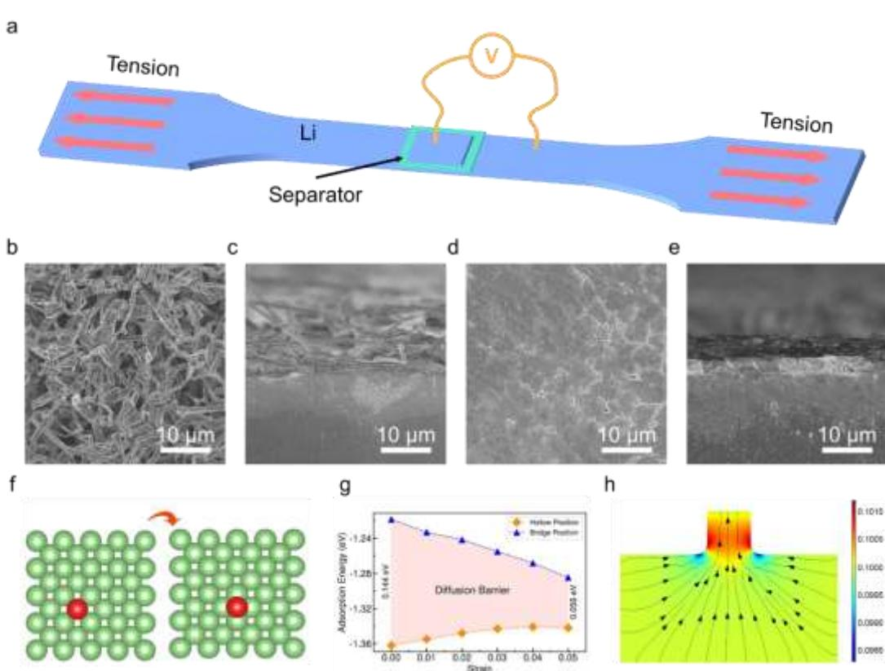
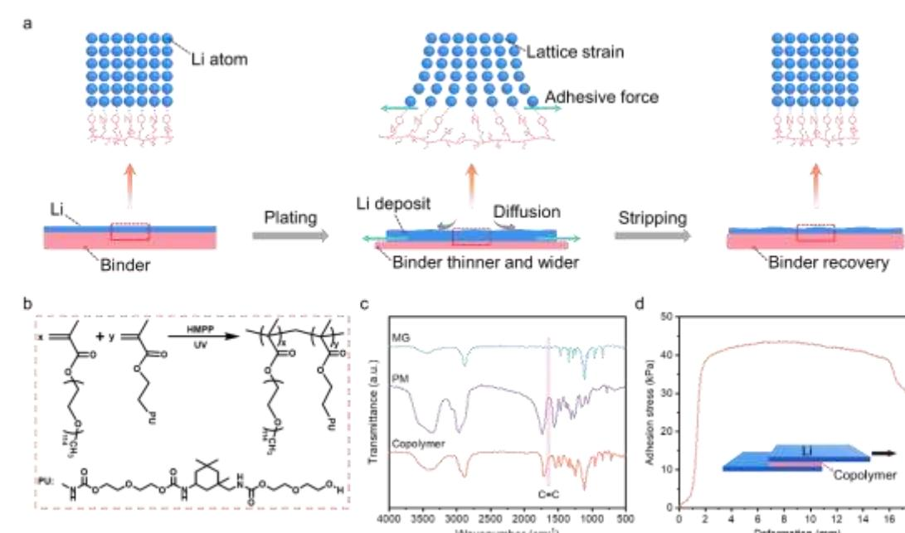
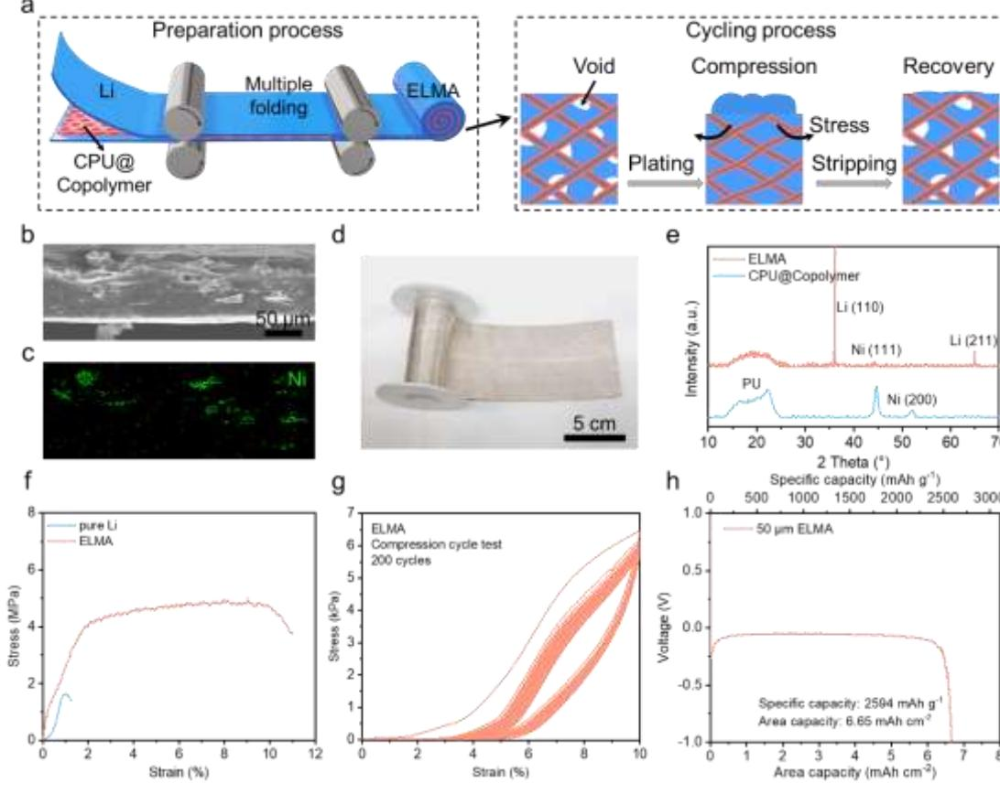
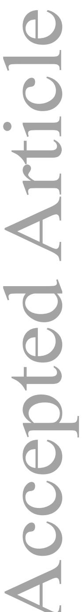
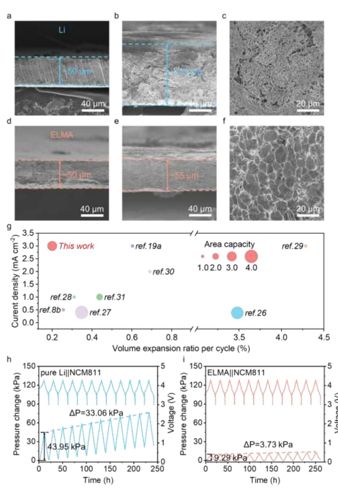
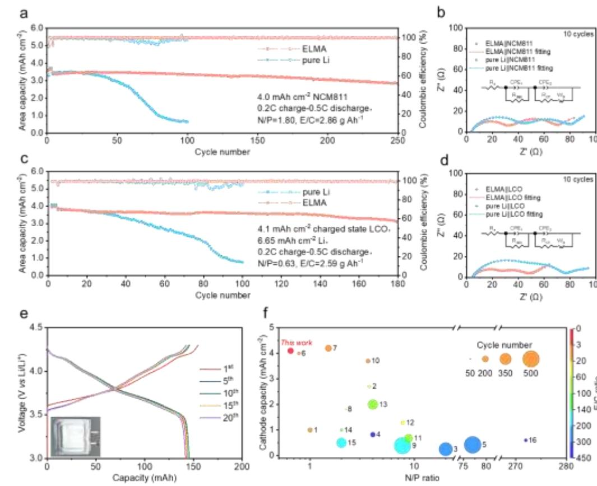
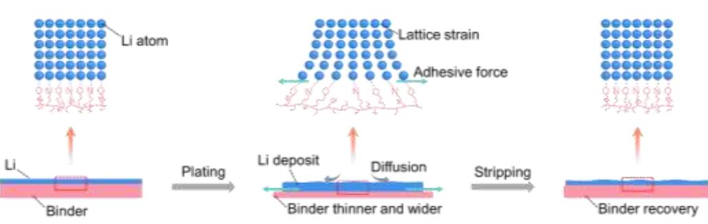

Mechano-electrochemically promoting lithium atom diffusion and relieving accumulative

stress for deep-cycling lithium metal anodes

Dehua Xu, Nian Zhou, Aoxuan Wang\*, Yang Xu, Xingjiang Liu, Shan Tang\*, Jiayan Luo\*

D. Xu, Dr. A. Wang, Prof. X. Liu

Key Laboratory for Green Chemical Technology of Ministry of Education, School of Chemical Engineering and Technology, Tianjin University, Tianjin 300072, China

Email: aoxuanwang@tju.edu.cn

Dr. N. Zhou

Guizhou Colleges and Universities Process Industry New Process Engineering Research Center, School of Materials and Energy Engineering, Guizhou Institute of Technology, Guiyang 550000, China

Prof. Y. Xu

Department of Chemistry, University College London, 20 Gordon Street, London WC1H 0AJ, U.K.

Prof. S. Tang

State Key Laboratory of Structural Analysis for Industrial Equipment Department of Mechanics, Dalian University of Technology, Dalian 116024, China

Email: shantang@dlut.edu.cn

Prof. J. Luo

Shanghai Key Lab of Advanced High-temperature Materials and Precision Forming, State Key Lab of Metal Matrix Composites, School of Materials Science and Engineering, Shanghai Jiao Tong University, Shanghai 200240, China

This article has been accepted for publication and undergone full peer review but has not been through the copyediting, typesetting, pagination and proofreading process, which may lead to differences between this version and the [Version of Record.](https://doi.org/10.1002/adma.202302872) Please cite this article as [doi:](https://doi.org/10.1002/adma.202302872)  [10.1002/adma.202302872.](https://doi.org/10.1002/adma.202302872)

Email: jyluo@sjtu.edu.cn

### Abstract

Lithium metal batteries (LMBs) can double the energy density of lithium ion batteries. However, the notorious lithium dendrite growth and large volume change are not well addressed, especially under deep-cycling. Here, we build an in-situ mechanical-electrochemical coupling system and find that tensile stress can induce smooth lithium deposition. Density functional theory (DFT) calculation and finite element method (FEM) simulation confirm the lithium atom diffusion energy barrier can be reduced when the lithium foils are under tensile strain. We then incorporate tensile stress into lithium metal anodes by designing an adhesive copolymer layer attached to lithium in which the copolymer thinning can yield a tensile stress to the lithium foil. We further prepared elastic lithium metal anode (ELMA) via introducing a 3D elastic conductive polyurethane (CPU) host for the copolymer-lithium bilayer to release accumulated internal stresses and resist volume variation. The ELMA can withstand hundreds of repeated compression-release cycles under 10% strain. LMBs paired with the ELMA and LiNi0.8Co0.1Mn0.1O2 (NCM811) cathode can

operate beyond 250 cycles with 80% capacity retention under practical condition of 4 mAh

cm-2 cathode capacity, 2.86 g Ah-1 electrolyte-to-capacity ratio (E/C) and 1.8

negative-to-cathode capacity ratio (N/P), 5 times of the life time using lithium foils.

Keywords: volume expansion, elastic lithium metal anode, tensile stress, high energy density

### 1. Introduction

Rechargeable batteries with higher energy density have attracted extensive attention because of increasing demand for advanced electronic devices and electric vehicles[1] . However, the energy density of lithium-ion batteries is fast approaching the theoretical limit with decades of development[2] . Lithium (Li) has been considered as the ideal anode for its high theoretical specific capacity (3860 mAh g-1 ), lowest electrochemical potential (-3.04 V vs the standard hydrogen electrode)[3]. Unfortunately, the uncontrolled lithium dendrite growth will cause issues such as parasitic side reactions[4] and short circuit[5] . The loose morphology

also leads to huge volume expansion and electrodes pulverization, resulting in poor battery performance[6] .

Strategies including electrolyte optimizing[7], substrate modification[8], three-dimensional conductive host[9] , artificial solid electrolyte interphase (SEI) protection[10] and temperature control[11] have been carried out to regulate the deposition morphology. Stress, as one of the fundamental physical fields, is a key factor influencing the energy state of the electrode surface as well as the structure of the bulk phase[12] . Recently, the coupling of mechanics and electrochemistry has attracted a lot of attention. External pressure can enable dense deposition of lithium metal, thereby effectively improving the battery cycle life both in liquid and solid cell systems [13] . However, the external pressure applied increases the complexity of the whole system and also reduces energy density. Thus, electrode level stress relief is more practical, especially when by itself.

It has been reported that the generation of dendrites is caused by the local aggregation of lithium atoms on the Li electrode surface due to the high diffusion energy barrier[14]. Proper stress can create lattice strain and lower the diffusion energy barrier, thus accelerate lithium atoms diffusion during nucleation[15] .Diffusion flux (J) is directly related to static stress according to the equation: - - (where D is lithium diffusion coefficient, c is the concentration of Li+, Ω is partial molar volume of Li+, is static stress, R is gas constant and T

is the temperature) [16] . This can be achieved by using soft polymer substrate[17] that the polymer thinning during lithium deposition creates a tensile stress on lithium. During the later lithium growth stage, internal stresses are accumulated along with the plating process as the deposition capacity increases[18]. When internal stress exceeds the yield strength of lithium (0.8 MPa), the deposits become pulverized. 3D elastic hosts can suppress volume expansion and release the internal stresses[19] . As a result, 3D elastic hosts with soft skeletons can relieve the stress during both lithium nucleation and growth by promoting lithium atom diffusion and relieve accumulated stress along with continuous deposition.

In this work, we first demonstrate that, with an in-situ mechanical-electrochemical coupling experiment system, tensile stress applied to the lithium metal electrode can accelerate the lithium atom diffusion by reducing the diffusion energy barrier, resulting in smooth deposition. We create elastic lithium metal anode (ELMA) by hosting lithium within a 3D elastic conductive polyurethane (CPU) coated with a lithium adhesive copolymer through roll calendaring. In ELMA, the copolymer thinning can yield a tensile stress while the ELMA can sustain hundreds of repeated compression-release cycles under 10% strain showing its ability to release the accumulated stress. Full cell paired with 4 mAh cm-2 LiNi0.8Co0.1Mn0.1O2 (NCM811) cathode under practical condition of E/C ratio of 2.86 g Ah-1 and N/P ratio of 1.8 delivers 80% capacity retention after 250 cycles. 15214095, ja, Downloaded from https://onlinelibrary.wiley.com/doi/10.1002/adma.202302872 by University College London UCL Library Services, Wiley Online Library on [24/05/2023]. See the Terms and Conditions (https://onlinelibrary.wiley.com/terms-and-conditions) on Wiley Online Library for rules of use; OA articles are governed by the applicable Creative Commons License

## 2. Result and discussion

#### 2.1. Tensile stress promotes lithium atom diffusion

To investigate the effect of tensile stress on lithium deposition behavior, an in-situ mechanical-electrochemical coupling experiment system was designed (Figure 1a). Li||Li symmetric cells, with one Li electrode (dumbbell-shaped, Figure S1a, Supporting Information) for stress loading and another (cuboid, 1 cm2 ) as counter electrode, were operated in an Ar-filled glove box (Figure S1b, Supporting Information). Galvanostatic charge and discharge was conducted with in-situ tensile stress applied to the dumbbell-shaped Li electrode.

Scanning electron microscopy (SEM) was used to characterize the Li electrode under different stress conditions. Without stress loading, the 0.5 mAh cm-2 Li deposited at current density of 0.5 mA cm-2 in liquid cell is composed of dendrites and filaments (Figure 1b), along with loose structure (Figure 1c). The symmetric cells can only sustain tens of cycles. When the tensile stress was applied and increased gradually, longer cycle lifespan can be seen (Figure S2, Supporting Information). No visible cracks appeared on the electrode surface when the applied tensile stress within a proper range (0~60 kPa, Figure S3, Supporting

Information). For example, with 60 kPa tensile stress loading, the plated Li at 0.5 mA cm-2 with capacity of 0.5 mAh cm-2 in liquid cell is dendrite-free (Figure 1d) and shows compact structure (Figure 1e).

#### 2.2. DFT calculation for Li atom diffusion on electrode surface

The lattice strain has great effect on the atom diffusion on the electrode surface, which impacts the metal depositing morphology[15, 20] . DFT calculation was introduced to study the relationship between Li electrode surface properties and strain state. Li adatom diffusion barrier on the metal surface plays an important role in the homoepitaxial growth behavior[21] . Hopping is a typical diffusion mechanism showing an adatom propagating from the most favorable adsorption position to the next one via the neighboring bridge site (Figure 1f). The lower diffusion energy barrier is, the faster the adatom will diffuse. Then, smooth deposits morphology will be obtained by the quick atom combination to form complete layers. Thus, for the plating process, it should figure out how the tensile stress affects the diffusion energy barriers of Li adatoms. Herein, we built a 5-layers crystal plane (001) slab model (Figure S4a, Supporting Information) and simplified the Li plating process as a surface adsorption course (Figure S4b, Supporting Information). The adsorption energy of Li adatoms on the high-symmetry (hollow and bridge) sites (Figure 1f) of the most stable surface under 0~0.05

tensile strain was calculated. As shown in Figure 1g, Li diffusion energy barrier decreases from 0.144 eV to 0.058 eV with increasing tensile strain. Thus, the rates for hopping and exchange diffusion increase by about 28 times according to equation (1) from simplified transition state theory (STST)[14a] ,

$$
k=n_p V_0 exp(\frac{-E_{diff}}{k_B T})
$$
 (1)

where np is the number of possible exit directions (np = 4 for a square lattice), 0 is the attempt frequency, Ediff is the diffusion barrier, kB is the Boltzmann constant and T is the temperature.

Besides, we also calculated the electronic properties of lithium structures in the tensile of lithium metal. As indicated by the black arrow in Figure S5 (Supporting Information), when the adsorbed lithium atom is in the bridge site, the 0.05 tensile strain will intensify the localization of the electron distribution between the adsorbed lithium atom and the base lithium atom. This localization weakens the interaction between the adsorbed lithium atom and the basal lithium atom, thereby reducing the energy barrier that needs to be overcome during the migration of lithium atoms. 2.3. FEM simulation for Li atoms diffusion in bulk electrode 15214095, ja, Downloaded from https://onlinelibrary.wiley.com/doi/10.1002/adma.202302872 by University College London UCL Library Services, Wiley Online Library on [24/05/2023]. See the Terms and Conditions (https://onlinelibrary.wiley.com/terms-and-conditions) on Wiley Online Library for rules of use; OA articles are governed by the applicable Creative Commons License

Besides the Li atoms diffusion at the electrode surface, the Li atoms and vacancy diffusion in bulk electrode are also investigated with stress-diffusion coupled mathematical model built by t l m t m th F M . W stabl sh a g m tr m l w th 1×1×0.5 μm3 rectangular parallelepiped bottom plate and a cylinder with diameter and height of 200 nm, representing Li atom layer and dendrite respectively (Figure S6a, Supporting Information). These boundaries were treated as insulating due to the upper surface is covered by SEI. As exhibited in Figure S6b (Supporting Information), the stress contours show that there is a large stress difference between the protrusion top and bottom plate, regardless of the tensile state. The stress gradient can provide driving force for the diffusion of vacancy, which is consistent with the previous hypothesis. To explore the effect of tensile stress on the distribution of internal vacancy concentration, we took a section of the model (Figure 1h). When the tensile stress is applied during plating, the vacancies flow toward the protrusion and simultaneously the Li atoms flow from the protrusion to the inner layer, thus suppressing the growth of local protuberance. The FEM result also indicates that tensile stress can accelerate Li atoms diffusion inward the Li electrode.

Figure 1. Lithium atom diffusion promoted by tensile stress. (a) The schematic diagram of in-situ mechanical-electrochemical coupling experiment, in which tension load is applied while discharging/charging. (b) The top-view and (c) cross-section SEM images of plated Li without external load applied. (d) The top-view and (e) cross-section SEM images of plated Li with 60 kPa tensile stress applied. (f) The hopping of Li adatoms from the hollow position to the next one via the neighboring bridge position. (g) The adsorption energies of Li adatom in hollow and bridge position and the self-diffusion energy barriers of hopping with 0~0.05 tensile strain applied. (h) The vacancy distributing nephogram in tensile state, which the color

15214095, ja, Downloaded from https://onlinelibrary.wiley.com/doi/10.1002/adma.202302872 by University College London UCL Library Services, Wiley Online Library on [24/05/2023]. See the Terms and Conditions (https://onlinelibrary.wiley.com/terms-and-conditions) on Wiley Online Library for rules of use; OA articles are governed by the applicable Creative Commons License

distribution and the black arrows present the mole fraction and the flux of vacancy, respectively.

#### 2.4. Tensile stress-driven mode in lithium metal anode

Tensile stress could eliminate Li dendrite through reducing the Li atoms diffusion energy barrier. However, the tensile stress loaded by external devices could hardly be introduced into the sealed battery system. Therefore, it is important to incorporate tensile stress into lithium metal electrode. As the linear elastic theory used in the plated beam[22] , the adhesive stress is generated under external loading. Tensile stress generates within the bonded plate under external loading, which is in turn transferred to the original beam through the adhesive layer. This process generates adhesive stress in the adhesive layer[23] . Thus, a two-layer model with lithium adheres to binder was built (Figure 2a). During lithium plating, the deposit can squeeze the elastic binder to become thinner and wider. The lateral movement of the binder molecules results in an adhesive stress on the lithium metal surface due to the strong adhesion between the binder molecules and lithium atoms. And the adhesive stress will diminish during Li stripping with the binder recovery.

Here, we have designed a Li+ conducting and Li adhesive copolymer binder to exert tensile stress on lithium metal. The polymer was synthesized with two monomer units, Li+ conducting methyl polyethylene glycol114 methacrylate (MPEGMA, MG for short), and Li adhesive

polyurethane methacrylate (PUMA, PM for short) (Figure 2b; Figures S7 and S8, Supporting Information). After free radical copolymerization, the disappear of C=C peaks at 1640 cm-1 from Fourier Transform Infrared (FTIR) spectra indicated the successful polymerization (Figure 2c). The adhesive strength and the Li+ conductivity can be adjusted by regulating the mass ratio of MG/PM (Figures S9 and S10, Supporting Information). The representative phase transformation peaks in differential scanning calorimetry (DSC) corresponding to the copolymer and lithium remained unchanged in the composite (Figure S11, Supporting Information), showing the chemical stability. As shown from the uniaxial tensile test results (Figure 2d), this sticky copolymer can apply adhesive stress (about 40 kPa) to lithium metal, which is in the effective range of tensile stress (Figure S2, Supporting Information). Compared to other soft substrate[17a] without adhesive property, stress on the Li electrode could not be created. In order to verify the effect of tensile stress inside the electrode on the electrochemical performance of the electrode, we prepared Li@Copolymer composite anode by calendering technique (Figure S12, Supporting Information) and investigated its cycling stability. Compared with pure Li, Li@Copolymer exhibits more excellent cycling stability (Figure S13, Supporting Information) due to the adhesive stress exerted by the copolymer on the lithium metal, which was conducive to regulating the dense deposition of lithium.

Figure 2. Tensile stress-driven mechanism in lithium metal anode. (a) Schematic illustration of molecular-level tensile stress regulation mechanism during plating and stripping process. (b) The synthetic strategy for the preparation of the copolymer. (c) FTIR spectra of monomers the copolymer. (d) Shear adhesion stress of copolymer on lithium metal.

#### 2.5. Preparation and properties of ELMA

Electrode deformation can release accumulated internal stress in cells[17a, 24] . Once the Young's m ulus E) of skeletons is smaller than lithium metal (4.9 GPa), their preferential deformation can release the internal stress. The Young's modulus of composite can be calculated according to the Trace theory followed by the equation: 1 m s s , where Vm is the matrix volume percentage, Vs is the skeleton volume percentage, Em is the matrix modulus and Es is the skeleton modulus (Vm + Vs=1)[25] . The typically used conductive materials, such as metal and carbon fiber, are unsuitable due to their extremely high Young's modulus. While polymer with lower modulus is not conductive (Figure S14, Supporting Information). CPU with Y u g's m ulus of about 3.1 MPa is a promising candidate (Figure S15, Supporting Information). Moreover, compared with other commercial skeletons, CPU has advantages in terms of density, cost and flexibility (Figures S16-S18, Supporting Information). Firstly, CPU scaffold was pre-impregnated into a copolymer tetrahydrofuran (THF) solution. After THF being vaporized, a copolymer-coated CPU (CPU@Copolymer) was obtained and the th ss lym r was ab ut 2.8 μm (Figures S19 and S20, Supporting Information). Li foil and CPU@Copolymer were repeated rolled together by calendaring technology (Figure 3a). The ELMA possesses 11% void, which can provide compressible space for its compressive deformation (Table S3, Supporting Information). The initial lithium nucleus

squeezes the ELMA during the plating process, making the polymer thinning inside the ELMA and creating adhesive stress on the lithium metal. When the ELMA is under deep cycling, elastic skeletons inside will deform compressively as well as the voids disappear to release the internal stress within the deposit. Thus, the change of copolymer layer and change of elastic skeletons synergistically contribute to the uniform Li deposition. During the stripping process, the ELMA gradually returns to its initial state and the voids reappear. The reversible behavior of the ELMA during repeated plating/stripping can ensure compact and dendrite-free Li deposition as well as negligible volume expansion.

SEM image (Figure 3b) and EDS mapping of Ni element (Figure 3c) revealed that CPU skeleton embedded in ELMA presented an interlocking network. Flexible ELMA with different thicknesses can be regulated by adjusting rolling parameters (Figure S21, Supporting Information) and manufactured on a large scale (Figure 3d). The X-ray diffraction patterns (XRD, Figure 3 LMA sh ws hara t r st a s N 2θ 44.5° , L 2θ 36.2° a 65.1° a lyur tha CPU a br a a Figure S22, Supporting Information), further confirming the successful combination. As shown in Figure 3f, the ELMA has ultra-high elongation (~11 times of lithium) and breaking strength (~3 times of lithium), indicating its excellent mechanical properties. When subjected to compress-recovery cycling with a 10% strain limit, the ELMA recovers completely in each of the 200 cycles (Figure 3g). The strain

recovery property can enable ELMA maintain stable during repeated Li plating/stripping. The specific capacities of ELMA can be tailored from 1735 to 3283 mAh g-1 by adjusting the content of lithium in composite electrode (Figure 3h; and Figure S23, Supporting Information).

Figure 3. Preparation and properties of ELMA. (a) Schematic of the fabrication process and internal stress release mechanism of ELMA. (b)The cross-section SEM image of ELMA and (c) the corresponding EDS analysis. (d) Optical image of a large area of ELMA, collecting on

a roller. (e) The XRD patterns of ELMA and CPU@Copolymer. (f) Uniaxial tensile test of ELMA and pure Li. (g) Stress-strain profiles of ELMA during repeated compress-recovery y l s. h Full L str g urv th 50 μm-thick ELMA in half cell.

#### 2.6. Low volume expansion of ELMA

Symmetric cells were cycled at 3 mA cm-2 with capacity of 3 mAh cm-2 to assess the electrode volume expansion by ex-situ SEM characterization. The thickness of pure Li l tr r as r m r st 50 μm t 111 μm a t r 50 y l s Figure 4a, b). Random and porous dendritic Li deposits are observed on the electrode surface (Figure 4c). In m ar s , th LMA r as by ly 5 μm under the identical cycle condition (Figure 4d, e) and Li deposits with smooth and dense morphology can be found (Figure 4f). ELMA has advantages in volume expansion at high areal capacity and current density compared to other previous works by the strategy of stress regulation (Figure 4g). For example, when lithium was infused into a 3D Cu current collector, the composite Li electrode showed an expansion of 12.8% after 50 cycles under inferior cycling conditions (0.5 mA cm-2 -1 mAh cm-2 ), which could reduce the internal stress[26] . A Li anode increased r m 50 t 137 μm after 50 times repeated plating/stripping under 10 psi pressure at the current density of 0.38 mA cm-2 with capacity of 3.8 mAh cm-2 . [8b] 3D Cu fabric has been prepared as Li metal host. After

cycling at 2 mA cm-2 with capacity of 1 mAh cm-2 for 50 cycles under external pressure of 1 MPa, the electrode thickness increased by 34.52%[29] . Similar conclusions can also be drawn even extending the cycling period of symmetric cells to 200 cycles (Figures S24 and S25, Supporting Information).

To indicate effect of the tensile stress provided by copolymer, a composite anode consisting of CPU and Li was prepared by the same method. Dendrites were observed on this composite electrode and th th ss r as by 20 μm after 50 cycles (Figure S26, Supporting Information), which is larger than the ELMA. Furthermore, we also replace the CPU skeleton by rigid Ni coated carbon felt to identify with no elasticity (Figures S27-S29, Supporting Information). Cracks and SEI splitting are observed (Figure S30, Supporting Information), due to the accumulation of internal stress. And the thickness fluctuation of this composite electrode is 21 μm a t r 50 cycles.

We designed an in-situ pressure testing system to monitor the pressure changes in NCM811 pouch cells with ELMA or Li foil (Figure S31, Supporting Information). For pouch cell using Li foil, the pressure increased by 43.95 kPa in the first charging process, and the holistic pressure of the cell raise 33.06 kPa after 12 cycles (Figure 4h). The cell with ELMA only raises 9.29 kPa and 3.73 kPa (Figure 4i), respectively. The tensile stress yielded by the copolymer thinning in ELMA induces compact lithium deposition on the microscopic scale. On

the macroscopic scale, the elastic skeleton reduces the overall volume expansion. These collectively mitigate the volume fluctuation of the electrode. The pressure difference on the lithium surface ( P) is closely related to the deposition morphology of lithium as described by the following equation (2)[18a]:

$$
\Delta P = \gamma \left(\frac{1}{R_1} + \frac{1}{R_2}\right)(2)
$$

where is the surface energy of lithium, R1 and R2 are principal radii of curvature of the surface.

According to this equation, the P on the ELMA is 8.5 kPa (Note 1 for the detailed calculation procedure) during the first plating process, which is in perfect agreement with experimental results. While the P on pure Li is difficult to estimate due to the intricate dendrite morphology. A small amount of pressure increase after 12 cycles is due to the little volume fluctuation of the ELMA.

Figure 4. The volume expansion behaviors of elastic lithium metal anode. (a) The cross-section SEM image of pure Li. (b) The cross-section and (c) top-view SEM image of pure Li after 50 cycles. (d) The cross-section SEM image of ELMA. (e) The cross-section and (f) top-view SEM image of ELMA after 50 cycles. (g) Comparison of volume expansion per cycle, current density and areal capacity in the recent reports by the strategy of stress regulation, the size of each point indicates the per-cycle areal capacity. The cell pressure changes of NCM811 pouch cell with (h) pure Li and (i) ELMA during repeated plating/striping processes.

## 2.7. Electrochemical performance of ELMA and high-energy-density LMBs

The rate performance and cycle stability of ELMA have also been monitored by cycling the symmetric cells at the current densities from 1 to 15 mA cm-2 with areal capacity of 1 mAh cm-2 for 5 cycles (Figure S32, Supporting Information). Even at 15 mA cm-2 , the ELMA maintained a low and stable overpotential. In contrast, the Li foil electrodes showed irregularly voltage fluctuating, especially as the current density surpasses 2 mA cm-2 . The symmetric cells assembled with ELMA were tested at the current density of 3 and 5 mA cm-2 (Figure S33, Supporting Information) with a more stable voltage curve as well as a low overpotential, which can stably operate 1500 h and 1000 h, respectively. In comparison, Li

foil symmetric cells exhibits short cycling life less than 170 h with the large polarization. In addition, void less ELMA (with porosity of about 0.9%) has also been prepared as lithium anodes. The symmetric cell assembled with the void less ELMA cycled at 3 mA cm-2 with capacity of 1 mAh cm-2 showed improved cycling performance compared to the pure lithium electrode, but much worse than ELMA (Figure S34, Supporting Information).

We also studied the SEI components and structure on ELMA or pure Li using X-ray photoelectron spectroscopy (XPS) depth profile with argon ion sputtering. We comparatively studied the SEI formed on pure Li and ELMA by plating at 3 mA cm-2 with 1 mAh cm-2 for five cycles in the same ether-based electrolyte. The composition of the SEI on the surface of both electrodes was almost identical from the C 1s and Li 1s spectra (Figure S35, Supporting Information). However, it is noteworthy that the SEI on the surface of ELMA is thinner, which is reflected in Li0 signal on ELMA electrode increased and carbon content decreased significantly after sputtering for 60 seconds, in contrast to that Li0 on the pure Li electrode never showed until sputtering for 300 seconds and the content of carbon does not change significant. This conclusion is further confirmed by the electrochemical impedance spectra (EIS) of the symmetric cell (Figure S36, Supporting Information). Larger volume expansion of pure Li electrode will cause SEI rupture, which exacerbates the side reactions between lithium and electrolyte and leads to SEI thickening.

To achieve practical high energy density batteries, high areal capacity (> 3 mAh cm-2 ), low negative-to-positive electrode capacity ratio (N:P < 3) and low electrolyte-to-capacity ratio (E:C < 3 g Ah-1 ) are required[32]. W ass mbl th ra t al LM s w th 50 μm LMA 6.65 mAh cm-2 ) and high-loading LiNi0.8Co0.1Mn0.1O2 cathode (4 mAh cm-2 , Figure S37, Supporting Information) with a N/P ratio of 1.8, and E/C ratio of 2.86 g Ah-1 . The cell can offer capacities retention of 80% after 250 cycles (Figure 5a). In comparison, LMBs using the same cathode a r w th th 30 μm L l w th s m lar N/P rat Figure S38, Supporting Information) suffered from the rapid capacity decade after the 30th cycle. AC impedance test was carried out to examined the interfacial resistance in full cells, the cells with ELMA manifest lower overpotential with good interface conductivity after 10 cycles (Figure 5b; and Figure S39, Supporting Information).

To identify the performance of ELMA in deep cycling, high-areal-load LCO cathodes (25 mg cm-2 , 4.1 mAh cm-2 , Figure S40, Supporting Information) was first charged to 4.3 V at 0.1 C (Figure S41, Supporting Information . h , t was a r w th 50 μm LMA a 30 μm L foil to maintain the same N/P ratio of 0.63. The cells were first activated and then cycled at 0.2 C charge and 0.5 C discharge in the voltage range from 3V to 4.3V (Figure 5c). The cell paired with Li foil suffered from the rapid capacity decade after the 20th cycle. In sharp contrast, the ELMA cell showed a capacity retention over 80% and an average CE over

99.7% after 180 cycles. The comparatively low impedances of the cell using ELMA also manifest that good conductivity of the Li-electrolyte interface, which lead to lower overpotential (Figure 5d; and Figure S42, Supporting Information). While, other composite electrodes with poor deposition morphology exhibited short cycle life (Figures S43 and S44, Supporting Information). Compared with previously reported literatures, our work shows great advantage in terms of cathode capacity, E/C ratio, N/P ratio and cycle number (Figure 5f; and Table S4, Supporting Information). For example, a composite lithium metal electrode with an ion-conducting mesoscale skeleton (spiral Li) can make a full cell paired with LCO cathode operates 100 cycles with a capacity retention rate about 62 % under N/P ratio of 272 and E/C ratio of 400 g Ah-1[33] . The LMBs using composite Li anode, consisting of Ag nanoparticle-embedded nitrogendoped carbon macroporous fibers, exhibited a cycle life of 250 times with LiFePO4 cathode under N/P ratio of 8.8 and E/C ratio of 88.2 g Ah-1[34] . A zeroVE-Li composite anode with sandwich-like structure can enable the full battery with NCM811 cathode cycle 200 times with a capacity retention rate about 67 % under N/P ratio of 3.6 and E/C ratio 16.2 g Ah-1[35] . The pouch cell packaged with ELMA reveals a stable repeated charge/discharge process for 20 cycles without obvious capacity fading (Figure 5e). The disassembled ELMA maintains a flat and compact surface morphology (Figure S45, Supporting Information), keeping a good agreement with those observed in the coin cells.

#### Furthermore, 1.5 Ah pouch cell assembled with ELMA with energy density of 375 Wh kg-1

could work properly (Figure S46, Supporting Information).

Figure 5. Electrochemical performance of lithium metal batteries. (a) Cycling performance of the NCM811 full cells with ELMA and pure Li. (b) Nyquist plots of NCM811 full cells after 10 cycles. (c) Cycling performance of the LCO (Li-free) full cells with ELMA and pure Li. (d) Nyquist plots of LCO full cells after 10 cycles. (e) Voltage-capacity profiles of ELMA||NCM811 pouch cell at the current of 14 mA. (f) Comparison of the cathode capacity, N/P ratio, E/C

ratio and cycle number between our ELMA full batteries and previously composite lithium metal batteries.

### 3. Conclusion

In summary, we propose a mechano-electrochemical approach to suppress lithium dendrite formation and electrode volume fluctuation under deep cycling. We identify that tensile stress applied on the lithium metal anode can suppress Li dendrite formation experimentally and reveal the mechanism of tensile stress-driven lithium atom diffusion by DFT calculation and FEM simulation. We show the tensile stress can be offered by designed lithium adhesive copolymer thinning and elastic composite anode was created by hosting lithium within a copolymer coated 3D elastic CPU scaffold through roll calendaring. The elastic composite electrode can tolerate hundreds of repeated compression-release cycles under 10% strain and release accumulated stress though compressive deformation. Consequently, only 0.2% volume expansion per cycle of elastic electrode is allowed at the current density of 3 mA cm-2 with the areal capacity of 3 mAh cm-2 . Full cells paired with high-areal-load commercial NCM811 cathode show enhanced cycle performance with 80% capacity retention after 250 cycles under practical conditions with E/C ratio of 2.86 g Ah-1 and N/P ratio of 1.8. Overall, this work not only reveals Li dendrite inhibition mechanism from

mechanical insights, but provides a feasible strategy for other metal electrode systems to boost their cycle performance. Supporting Information Supporting Information is available from the Wiley Online Library or from the author.

# Acknowledgements

This work was supported by National Key Research and Development Program of China (No. 2021YFB2500100), National Natural Science Foundation of China (No. 22278308, 22109114 and 22102099), the Carbon Peaking and Carbon Neutrality Technology Innovation Special Fund of Jiangsu Province (Grant number: BE2022041) and Open Foundation of Shanghai Jiao Tong University Shaoxing Research Institute of Renewable Energy and Molecular Engineering (Grant number: JDSX2022023).

# Conflicts of interest

There are no conflicts to declare.

[1] a)B. Dunn, H. Kamath, J.-M. Tarascon, Science 2011, 334, 928; b)M. Armand, J. M. Tarascon, Nature 2008, 451, 652.

[2] Z. Yu, H. Wang, X. Kong, W. Huang, Y. Tsao, D. G. Mackanic, K. Wang, X. Wang, W. Huang, S. Choudhury, Y. Zheng, C. V. Amanchukwu, S. T. Hung, Y. Ma, E. G. Lomeli, J. Qin, Y. Cui, Z. Bao, Nat. Energy 2020, 5, 526.

[3] a)J. Zheng, M. S. Kim, Z. Tu, S. Choudhury, T. Tang, L. A. Archer, Chem. Soc. Rev. 2020, 49, 2701; b)J. Liu, Z. Bao, Y. Cui, E. J. Dufek, J. B. Goodenough, P. Khalifah, Q. Li, B. Y. Liaw, P. Liu, A. Manthiram, Y. S. Meng, V. R. Subramanian, M. F. Toney, V. V. Viswanathan, M. S. Whittingham, J. Xiao, W. Xu, J. Yang, X.-Q. Yang, J.-G. Zhang, Nat. Energy 2019, 4, 180.

[4] a)Y. S. Meng, V. Srinivasan, K. Xu, Science 2022, 378, eabq3750; b)F. Liu, R. Xu, Y. Wu, D. T. Boyle, A. Yang, J. Xu, Y. Zhu, Y. Ye, Z. Yu, Z. Zhang, X. Xiao, W. Huang, H. Wang, H. Chen, Y. Cui, Nature 2021, 600, 659.

[5] P. Bai, J. Li, F. R. Brushett, M. Z. Bazant, Energy Environ. Sci. 2016, 9, 3221.

[6] a)Y. Guo, H. Li, T. Zhai, Adv. Mater. 2017, 29, 1700007; b)Y. Ye, Y. Zhao, T. Zhao, S. Xu, Z. Xu, J. Qian, L. Wang, Y. Xing, L. Wei, Y. Li, J. Wang, L. Li, F. Wu, R. Chen, Adv. Mater. 2021, 33, 2105029.

[7] a)M. S. Kim, Z. Zhang, P. E. Rudnicki, Z. Yu, J. Wang, H. Wang, S. T. Oyakhire, Y. Chen, S. C. Kim, W. Zhang, D. T. Boyle, X. Kong, R. Xu, Z. Huang, W. Huang, S. F. Bent, L.-W. Wang, J. Qin, Z. Bao, Y. Cui, Nat. Mater. 2022, 21, 445; b)S. Wei, Z. Cheng, P. Nath, M. D. Tikekar, G. Li, L. A. Archer, Sci. Adv. 2018, 4, eaao6243.

[8] a)Y.-G. Lee, S. Fujiki, C. Jung, N. Suzuki, N. Yashiro, R. Omoda, D.-S. Ko, T. Shiratsuchi, T. Sugimoto, S. Ryu, J. H. Ku, T. Watanabe, Y. Park, Y. Aihara, D. Im, I. T. Han, Nat. Energy 2020, 5, 299; b)Q. Li, S. Zhu, Y. Lu, Adv. Funct. Mater. 2017, 27, 1606422.

[9] a)X.-R. Chen, B.-Q. Li, C. Zhu, R. Zhang, X.-B. Cheng, J.-Q. Huang, Q. Zhang, Adv. Energy Mater. 2019, 9, 1901932; b)L. Liu, Y.-X. Yin, J.-Y. Li, N.-W. Li, X.-X. Zeng, H. Ye, Y.-G. Guo, L.-J. Wan, Joule 2017, 1, 563.

[10] a)M. S. Kim, J.-H. Ryu, Deepika, Y. R. Lim, I. W. Nah, K.-R. Lee, L. A. Archer, W. Il Cho, Nat. Energy 2018, 3, 889; b)G. Li, Z. Liu, Q. Huang, Y. Gao, M. Regula, D. Wang, L.-Q. Chen, D. Wang, Nat. Energy 2018, 3, 1076.

[11] a)Y. Han, Y. Jie, F. Huang, Y. Chen, Z. Lei, G. Zhang, X. Ren, L. Qin, R. Cao, S. Jiao, Adv. Funct. Mater. 2019, 29, 1904629; b)L. Li, S. Basu, Y. Wang, Z. Chen, P. Hundekar, B. Wang, J. Shi, Y. Shi, S. Narayanan, N. Koratkar, Science 2018, 359, 1513.

[12] a)Y. Qi, C. Ban, S. J. Harris, Joule 2020, 4, 2599; b)C. Xu, Z. Ahmad, A. Aryanfar, V. Viswanathan, J. R. Greer, Proc. Natl. Acad. Sci. U. S. A. 2017, 114, 57.

[13] a)C. Fang, B. Lu, G. Pawar, M. Zhang, D. Cheng, S. Chen, M. Ceja, J.-M. Doux, H. Musrock, M. Cai, B. Liaw, Y. S. Meng, Nat. Energy 2021, 6, 987; b)J.-M. Doux, H. Nguyen, D. H. S. Tan, A. Banerjee, X. Wang, E. A. Wu, C. Jo, H. Yang, Y. S. Meng, Adv. Energy Mater. 2020, 10, 1903253; c)X. Shen, R. Zhang, P. Shi, X. Chen, Q. Zhang, Adv. Energy Mater. 2021, 11, 2003416.

[14] a M. ä l , A. Gr ß, J. Chem. Phys. 2014, 141, 174710; b)A. Jana, S. I. Woo, K. S. N. ra t, . . Gar ía, Energy Environ. Sci. 2019, 12, 3595.

[15] J. Kasemchainan, S. Zekoll, D. Spencer Jolly, Z. Ning, G. O. Hartley, J. Marrow, P. G. Bruce, Nat. Mater. 2019, 18, 1105.

[16] X. Zhang, A. M. Sastry, W. Shyy, J. Electrochem. Soc. 2008, 155, A542.

[17] a)X. Wang, W. Zeng, L. Hong, W. Xu, H. Yang, F. Wang, H. Duan, M. Tang, H. Jiang, Nat. Energy 2018, 3, 227; b)H. Li, T. Yamaguchi, S. Matsumoto, H. Hoshikawa, T. Kumagai,

N. L. Okamoto, T. Ichitsubo, Nat. Commun. 2020, 11, 1584; c)D. Wang, C. Luan, W. Zhang, X. Liu, L. Sun, Q. Liang, T. Qin, Z. Zhao, Y. Zhou, P. Wang, W. Zheng, Adv. Energy Mater. 2018, 8, 1800650.

[18] a)J.-i. Yamaki, S.-i. Tobishima, K. Hayashi, S. Keiichi, Y. Nemoto, M. Arakawa, J. Power Sources 1998, 74, 219; b)P. Bai, J. Guo, M. Wang, A. Kushima, L. Su, J. Li, F. R. Brushett, M. Z. Bazant, Joule 2018, 2, 2434.

[19] a)Z. Liang, D. Lin, J. Zhao, Z. Lu, Y. Liu, C. Liu, Y. Lu, H. Wang, K. Yan, X. Tao, Y. Cui, Proc. Natl. Acad. Sci. U. S. A. 2016, 113, 2862; b)P. Shi, T. Li, R. Zhang, X. Shen, X.-B. Cheng, R. Xu, J.-Q. Huang, X.-R. Chen, H. Liu, Q. Zhang, Adv. Mater. 2019, 31, 1807131. [20] a . W ssmüll r, . Kram r, Langmuir 2005, 21, 4592; b)C. Ratsch, A. P. Seitsonen, M. Scheffler, Phys. Rev. B 1997, 55, 6750.

[21] H. Brune, Surf. Sci. Rep. 1998, 31, 125.

[22] . äljst , J. Mater. Civ. Eng. 1997, 9, 206.

[23] V. Narayanamurthy, J. F. Chen, J. Cairns, A. Ramaswamy, Int. J. Adhes. Adhes. 2011, 31, 862.

[24] X. Zhang, Q. Xiang, S. Tang, A. Wang, X. Liu, J. Luo, Nano Lett. 2020, 20, 2871.

[25] F. Campbell, Structural Composite Materials, ASM International, 2010.

- [26] C. Niu, H. Lee, S. Chen, Q. Li, J. Du, W. Xu, J.-G. Zhang, M. S. Whittingham, J. Xiao, J. Liu, Nat. Energy 2019, 4, 551.
- [27] C. Niu, D. Liu, J. A. Lochala, C. S. Anderson, X. Cao, M. E. Gross, W. Xu, J.-G. Zhang, M. S. Whittingham, J. Xiao, J. Liu, Nat. Energy 2021, 6, 723.

[28] W. Lu, H. Yang, J. Chen, C. Sun, F. Li, Sci. China Mater. 2021, 64, 2675.

[29] D.-J. Yoo, A. Elabd, S. Choi, Y. Cho, J. Kim, S. J. Lee, S. H. Choi, T.-w. Kwon, K. Char, K. J. Kim, A. Coskun, J. W. Choi, Adv. Mater. 2019, 31, 1901645.

[30] L. Ye, P. Feng, X. Chen, B. Chen, K. Gonzalez, J. Liu, I. Kim, X. Li, Energy Storage Mater. 2020, 26, 371.

[31] L. Qin, K. Wang, H. Xu, M. Zhou, G. Yu, C. Liu, Z. Sun, J. Chen, Nano Energy 2020, 77, 105098.

[32] J. Xiao, Q. Li, Y. Bi, M. Cai, B. Dunn, T. Glossmann, J. Liu, T. Osaka, R. Sugiura, B. Wu, J. Yang, J.-G. Zhang, M. S. Whittingham, Nat. Energy 2020, 5, 561.

[33] Z. Liang, K. Yan, G. Zhou, A. Pei, J. Zhao, Y. Sun, J. Xie, Y. Li, F. Shi, Y. Liu, D. Lin, K. Liu, H. Wang, H. Wang, Y. Lu, Y. Cui, Sci. Adv. 2019, 5, eaau5655.

[34] Y. Fang, S. L. Zhang, Z.-P. Wu, D. Luan, X. W. Lou, Sci. Adv. 2021, 7, eabg3626.

[35] C. Luo, H. Hu, T. Zhang, S. Wen, R. Wang, Y. An, S.-S. Chi, J. Wang, C. Wang, J. Chang, Z. Zheng, Y. Deng, Adv. Mater. 2022, 34, 2205677.

Tensile stress can be incorporate into lithium metal anodes to reduce lithium atom diffusion energy barrier by designing an adhesive copolymer layer attached to lithium through copolymer thinning. Elastic lithium metal anode (ELMA) was further prepared via introducing a 3D elastic conductive polyurethane (CPU) host for the copolymer-lithium bilayer to release accumulated internal stresses and resist volume variation.