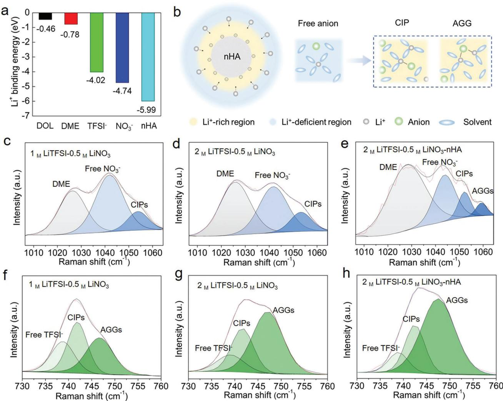
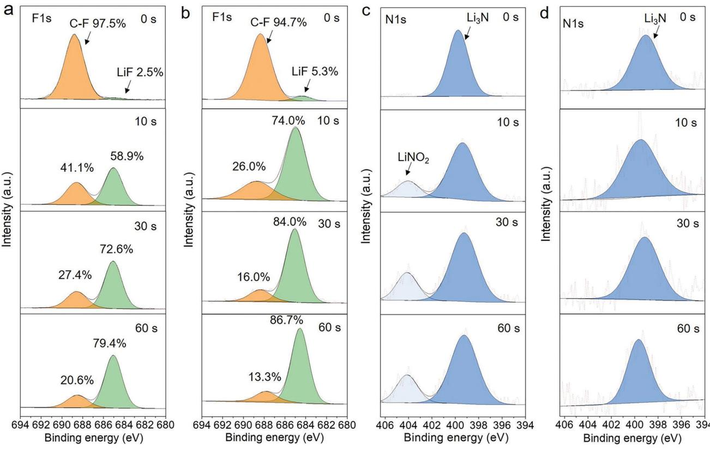
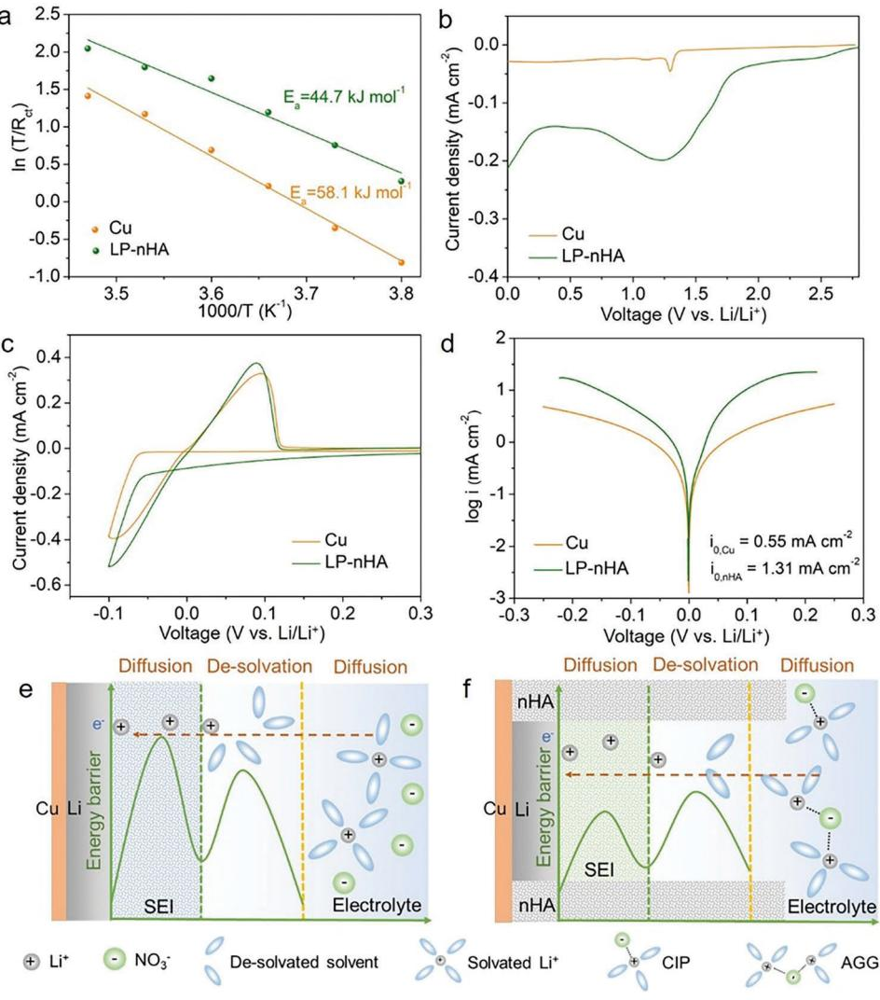
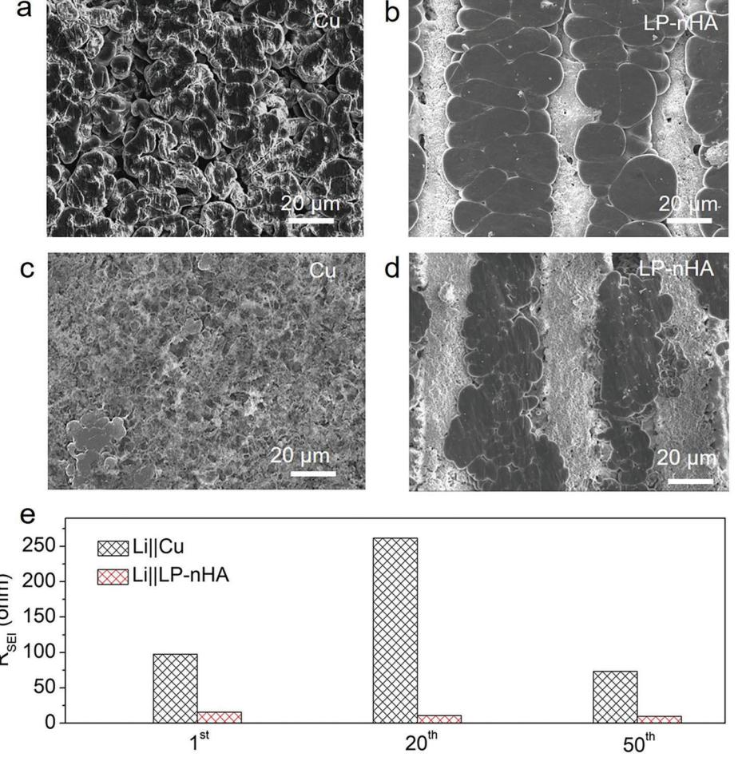
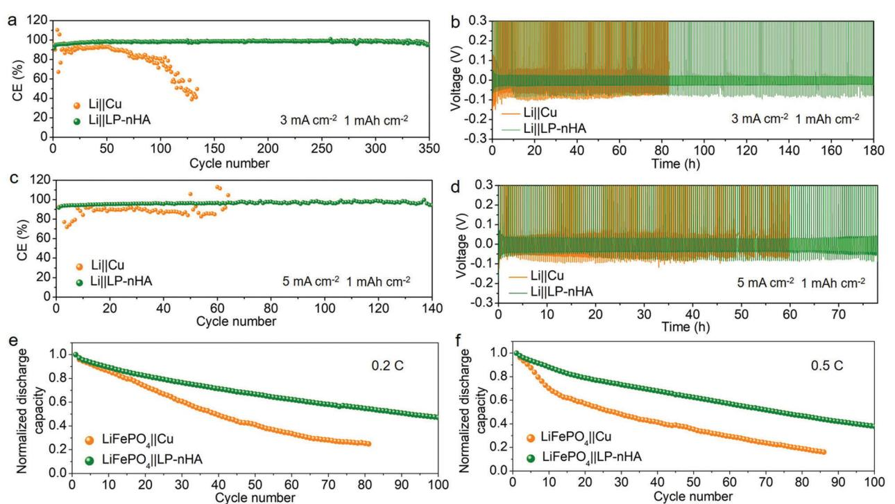

# **Spatially Selective Solvation Structure by Electronegative Micro-Arrays for Stable Lithium-Metal Anode Interface**

*Haorui Shen, Tong Yu, Pei Tang, Huicong Yang, Jun Tan,\* Shuo Bai,\* and Feng Li\**

**For electrolytes with conventional lithium salt concentration, it is not easy to generate sufficient anion-derived beneficial inorganic components to stabilize the electrolyte-lithium metal anode interface due to the repulsion of the free-state anions by the anode. In this study, the above issues are solved through the strong interaction between electronegative materials and lithium ions (Li+). A locally high Li+ concentration strategy is proposed by preparing micro-arrays of electronegative nano-hydroxyapatite (nHA) on the Cu foil. It is found that the oxygen atoms in the phosphate group (-PO4) of the nHA can strongly adsorb Li+ to form a locally Li+-rich region, which increases the probability of anions interacting with Li+. The formation of more Li+-coordinated anions at the electrolyte-anode interface can reduce the Li+ de-solvation energy barrier, and enable the anions to completely decompose into lithium fluoride (LiF) and lithium nitride (Li3N) on the Li metal anode. The interfacial transfer dynamics is accelerated and the Li dendrites are effectively suppressed. Under high current density, the anode exhibits a long lifespan with high Coulombic efficiency and small polarization voltage. The nHA micro-arrays achieve the targeted solvation structure at the electrolyte-anode interface while ensuring conventional lithium salt concentration in the bulk electrolyte.**

## **1. Introduction**

Li metal anode has the highest theoretical specific capacity and the lowest redox potential,[1] which is considered one of the

H. Shen, T. Yu, P. Tang, H. Yang, S. Bai, F. Li Shenyang National Laboratory for Materials Science Institute of Metal Research Chinese Academy of Sciences Shenyang 110016, China E-mail: [sbai@imr.ac.cn;](mailto:sbai@imr.ac.cn) [fli@imr.ac.cn](mailto:fli@imr.ac.cn) J. Tan Test and Analysis Center Jihua Laboratory Foshan 528200, China E-mail: [tanjun@jihualab.ac.cn](mailto:tanjun@jihualab.ac.cn) J. Tan School of Mechatronic Engineering and Automation Foshan University Foshan 528000, China P. Tang, S. Bai, F. Li School of Materials Science and Engineering University of Science and Technology of China Shenyang 110016, China

The ORCID identification number(s) for the author(s) of this article can be found under<https://doi.org/10.1002/adma.202306553>

#### **DOI: 10.1002/adma.202306553**

promising anodes for lithium batteries. Unfortunately, the electrochemical potential of Li metal is above the lowest unoccupied molecular orbit (LUMO) of the commonly used electrolytes,[2] causing side reaction of Li metal with electrolyte to generate the solid electrolyte interface (SEI) film. The formation of SEI film has a large effect on the Li+ transport dynamics and cycling stability of the batteries. Generally, SEI film with low Li+ conductivity leads to large electrode polarization and nonuniform Li+ flux distribution which boosts the dendrite growth.[3–5] Moreover, due to the large volume change of the Li metal anode during cycling, SEI film continuously damages and reconstructs leading to unstable electrochemical performance and capacity loss.[6] SEI film accumulates on the anode after each stripping and turns into a thick and porous dead Li layer, which seriously blocks the Li+ transport pathways.[7] Hence, SEI film with high protection ability and Li+ conductivity is critical for the practical application of Li metal anode.

In recent years, it was found that the inorganic components, especially LiF and Li3N, play an important role in the properties of the SEI film. LiF has a large band gap and high interfacial energy, which can promote better interfacial passivation and lateral Li deposition.[8,9] Li3N has high Li+ conductivity (10−3 S cm−2) which enables SEI film to achieve fast Li+ diffusion and uniform Li deposition.[10–12] Previous study reveals that the types of anions passing through the electric double layer contacting with Li metal surface determine the inorganic components of SEI film.[13] Hence, to form SEI with abundant LiF and Li3N, the best way for the electrolyte design is to introduce a large amount of F/N contained anions into the inner solvation sheath of Li+, [14,15] achieving the reduction of the anions at the anode. However, the electrolyte with conventional Li salt concentration makes it hard to achieve high reduction efficiency of anions for the following reasons: 1) Solvation molecules are more involved in the inner solvation sheath of Li+, meanwhile, the anions are excluded from the solvation sheath.[15] 2) The free uncoordinated anions are strongly repelled by the negatively charged Li metal anode. Hence, those anions are hard to enter into the inner Helmholtz layer on the anode and get reduced.[14,16] In order to improve the amount of anions that participate in the inner solvation structure of Li+, recently, high Li salt concentration and locally highconcentration electrolyte strategies were proposed to form more Li+ coordinated anions to obtain the anion-derived SEI film.[17,18] However, the above strategies for electrolyte design have nonnegligible issues. The amount of Li salts or cosolvents should be controlled due to their large effect on the properties of the bulk solution. It is particularly important to optimize the solvated structure of ions in the electrolyte, especially at the electrolyte-anode interface but not affect the properties of the bulk electrolyte.

In this study, we find that the electronegative nanohydroxyapatite (nHA) with high Li+ binding energy can effectively tune the solvation structure of ions in the electrolyte. Li+ will preferentially migrate to the surface of the nHA and form a locally Li+-rich region, where nitrate ion (NO3 −) and bis(trifluoromethane sulfonyl)imide ion (TFSI−) have more opportunity to interact with Li+, forming more aggregates (AGGs, an anion coordinating to two or more Li+) of anions which only stably exists in the electrolyte with high Li salt concentration. The spatially selective distribution of the targeted solvation structure at the electrolyte-anode interface can be realized by preparing nHA micro-arrays on the Cu current collector, while the solvation chemistry of the bulk electrolyte is maintained. TFSI− and NO3 − exhibit high decomposition efficiency on the anode. The upgraded SEI with more beneficial inorganic components induced by the nHA arrays can significantly suppress the dendrite growth and enhance the electrochemical performance of the anode.

### **2. Results and Discussion**

The functional groups in nHA and their interactions with Li+ are first investigated. The nano-hydroxyapatite (nHA) powder used in this study is mainly composed of particles less than 100 nm (Figure S1, Supporting Information). The phase composition of nHA is Ca5(PO4)3OH crystal and Fourier transform infrared spectra (FTIR) further confirm the existence of phosphate group (-PO4) and hydroxyl group (-OH) (Figures S2 and S3, Supporting Information). The zeta potential of nHA is −13.4 mV (Figure S4, Supporting Information), indicating that the surface of the nHA particle is electronegative and can attract Li+. The density functional theory (DFT) calculation was conducted to analyze the interaction between Li+ with different components. As shown in **Figure 1**a, nHA exhibits Li+ binding energy of −5.99 eV, which is higher than that of dioxolane (DOL) (−0.46 eV), dimethoxyethane (DME) (−0.78 eV), TFSI− (−4.02 eV), and NO3 − (−4.74 eV) in the electrolyte. It is found that the O atoms in the -PO4 functional groups of nHA exhibit high electron density and strong interaction with Li+ (Figures S5-S7 , Supporting Information). The schematic of the effect of nHA on the solvation structure of ions is depicted in **Figure 2**b. For the strongest Li+ binding energy of nHA, Li+ preferentially migrates to the surface of the nHA particles forming a locally Li+-rich region. With Li+ gathering around the nHA particles, more contact ion pairs (CIPs, an anion coordinating to one Li+) and aggregates (AGGs, an anion coordinating to two or more Li+) are generated in the electrolyte. At the same time, outside of the Li+-rich region, a Li+-deficient region also forms.

In order to verify the effect of nHA on the solvation structure of ions in the electrolytes, Raman spectra analysis of the solvated Li salts was performed to obtain information about the interaction between the anion and Li+. By comparing the Raman spectra of the electrolytes with and without Li salts (Figure S8, Supporting Information), it is confirmed that the Raman peaks corresponding to the vibration mode of covalent bonds in DME, free NO3 −, and free TFSI− are located at 1025 cm−1, 1042 cm−1, and 737 cm−1, respectively. With different amounts of LiTFSI in the electrolyte, the effect of the Li+ concentration on the solvation chemistry was explored. When the concentration of Li+ is increased from 1.5 M (Figure 1c,f) to 2.5 M (Figure 1d,g), the proportions of the solvent molecules and the Li+-coordinated anions are significantly increased (Tables S1–S3, Supporting Information). The result demonstrates that with higher Li+ concentration, the interaction between Li+ and anions is stronger, while the interaction between Li+ and solvent is weaker.

It can be seen from Figure 1c,d, the electrolytes without nHA exhibits peaks of DME, free NO3 −, and CIPs at 1025, 1042, and 1052 cm−1, respectively. The peaks of the Li+-coordinated anions located at high wavenumber represent high cation-anion interaction, which has been proved by previous studies.[19,20] Compared with the electrolyte without nHA (Figure 1d), the Raman spectrum of the electrolyte with nHA shows an extra peak at 1060 cm−1 corresponding to the AGGs of Li+-NO3 − (Figure 1e). As shown in Table S1, Supporting Information, under the effect of nHA, the proportion of DME increases from 48.1% to 62.6%, suggesting the interaction between DME and Li+ is weakened. The proportion of the free NO3 − decreases by 17.1%, and the CIPs and the AGGs of Li+-NO3 − increase by 7.3% and 9.8%, respectively (Table S2, Supporting Information). The solvation peak of TFSI− exhibits similar phenomenon (Figure 1g,h). The free TFSI−, CIPs, and AGGs of Li+-TFSI− are located at 737, 742, and 748 cm−1, respectively. As shown in Table S3, Supporting Information, under the effect of nHA particles, the proportion of the free TFSI− decreases from 14.0% to 10.3%, and that of AGGs increases from 57.0% to 65.2%. The increased proportion of the solvent molecules, AGGs of Li+-NO3 − and Li+-TFSI− in the electrolyte with nHA demonstrates that the strong Li+ adsorption ability of nHA can promote the formation of a locally Li+-rich solvation environment. In addition, we have verified that nHA has similar effect on the solvation structure of hexafluorophosphate ion (PF6 −) and bis(fluorosulfonyl)imide ion (FSI−) (Figures S9 and S10, Supporting Information), demonstrating that our strategy has the universality for tuning the coordinated structure of anions.

With strong Li+ adsorption ability, the functional micro-arrays of nHA were prepared on Cu foil to realize the spatially selective distribution of the targeted solvation structure, which preferentially regulates the solvation environment of ions at the electrolyte-anode interface. The preparation process of nHA micro-arrays is shown in Figure 2a. First, nHA powders were mixed with binder and solvent, and the mixture was stirred to obtain homogeneous and viscous nHA slurry. Second, the nHA slurry was poured onto the surface of copper foil to prepare a nHA coating. The hydroxyapatite has poor ionic and electrical conductivity,[21] and Li metal is hard to deposit beneath the nHA coating, which will lead to a large polarization voltage (Figure S11, supporting information). Hence, the femtosecond laser was used to ablate the nHA coating and expose the Cu foil at the bottom for Li metal deposition. Finally, the parallel nHA microarrays on the Cu foil were obtained. For convenience, the sample of laser-processed nHA micro-arrays on Cu is denoted as LP-nHA. The thickness of the nHA coating is ≈20 μm and the

**Figure 1.** The effect of nHA particles on anion-cation interactions in the electrolyte. a) Summary of the theoretical calculation of Li+ binding energies. b) Schematic of the effect of nHA particles on the solvation structure of ions. Raman spectra of coordinated structures of NO3 − with c) 1.5 M Li+, d) 2.5 M Li+, and e) nHA in the electrolyte of DOL/DME (V:V = 1:1). Raman spectra of coordinated structures of TFSI− with f) 1.5 M Li+, g) 2.5 M Li+, and h) nHA in the electrolyte of DOL/DME (V:V = 1:1). nHA particles are added into the electrolyte to form a suspension with 0.2 M nHA and be tested.

spacing between the micro-arrays is ≈20 μm (Figure S12, Supporting Information). From the SEM image (Figure 2b), the white stripe represents the nHA micro-arrays, and the dark area corresponds to the micro-grooves between the micro-arrays. Through EDS analysis of the LP-nHA (Figure 2c–e), Ca, P, and Cu elements are all in an ordered distribution state. Cu element is mainly distributed in the micro-grooves, indicating that the surface of the Cu foil can be exposed after the ablation of laser, hence Li can deposit in the micro-grooves. As shown in Figure 2f, after the plating process, it can be observed that Li nuclei are formed inside the micro-grooves.

For the solvation structure of the electrolyte, it is noteworthy that the proportions of CIPs and AGGs at the electrolyte-LP-nHA interface are significantly increased, while the bulk electrolyte maintains its original solvation structure (Figures S13,S14 and Tables S7–S9, Supporting Information). The schematic of anions participating in the reduction process on Cu is shown in Figure 2g. The uncoordinated free-state anions are strongly repelled by the anode and cannot be efficiently reduced. In comparison, nHA micro-arrays promote the generation of more CIPs and AGGs near the anode (Figure 2h). At the electrolyte-anode interface, the anions interacting with more Li+ can be effectively carried into the electric double layer for the electrochemical reactions, which contributes to the formation of the anion-derived SEI film.

In order to verify the enhanced reduction efficiency of the anions, X-ray photoelectron spectroscopy (XPS) was performed to analyze the SEI components. For F1 spectra, the reduction reaction products of TFSI− are mainly LiF (≈685 eV) and the products containing C-F (≈689 eV).[22] It can be observed that the top surface of the SEI film exhibits the highest C–F product intensity, while as the depth increases, the proportion of LiF gradually increases and becomes the main decomposition product of TFSI−. However, Ar+ sputtering may break the C-F bond and

**Figure 2.** The preparation, morphology, and EDS characterization of nHA micro-arrays. a) Preparation process of nHA micro-arrays. b) SEM image of nHA arrays for element mapping. c) Ca mapping, d) P mapping, e) Cu mapping, f) Li nucleation in the micro-grooves of LP-nHA, and the local Li nucleation morphology in the red box is zoomed in. Schematic of the SEI formation on g) Cu foil and h) LP-nHA.

cause the generation of LiF. The decomposition of the solid powder of LiTFSI under the sputtering of Ar+ was analyzed (Figure S15, Supporting information). It is found that the proportion of the LiF at the sputtering times of 0, 10, 30, and 60 s are 0.0%, 54.6%, 72.1%, and 77.4%, respectively, indicating that C–F bonds are broken under Ar+ sputtering and a large amount of LiF is generated.

After the deposition of Li metal on the Cu foil (Li/Cu) (**Figure 3**a), the proportion of the LiF at the sputtering times of 0, 10, 30, and 60 s are 2.5%, 58.9%, 72.6%, and 79.4%, respectively. Excluding the proportion of the LiF generated by Ar+ sputtering, the proportion of LiF slightly increases by 0.5% to 4.3% on Li/Cu, indicating a small amount of LiF is caused by the electrochemical reduction. In contrast, the proportion of the LiF on the Li/LP-nHA increases to 5.3%, 74.0%, 84.0%, and 86.7% at 0, 10, 30, and 60 s, respectively (Figure 3b). Excluding the effect of Ar+ sputtering, the proportion of LiF on Li/LP-nHA increases by 7.9% to 19.4%. For N1s spectra, the reduction products of NO3 − mainly include Li3N (≈400 eV) and LiNO2 (≈404 eV).[23] The SEI film on the Li/Cu surface exhibits obvious LiNO2 peaks at sputtering times of 10, 30, and 60 s (Figure 3c), while the reduction product of NO3 − for the LP-nHA is mainly Li3N (Figure 3d). XPS results demonstrate that the nHA micro-arrays which promote the formation of CIPs and AGGs at the electrolyte-anode

**Figure 3.** XPS depth sputtering analysis of the Li metal deposited on different substrates. F1s spectra of a) Li/Cu and b) Li/LP-nHA. N1s spectra of c) Li/Cu and d) Li/LP-nHA.

interface are beneficial for a more complete decomposition of the anions.

Electrochemical measurements are performed to analyze the electrode reaction dynamics affected by LP-nHA. Electrochemical impedance spectroscopy (EIS) tests for symmetric cells with different Li deposition substrates were performed at different temperatures (Figure S16, Supporting Information). The fitting results indicate that the charge transfer resistance (*R*ct) is inversely proportional to the temperature (Tables S4 and S5, Supporting Information). According to the Arrhenius formula (Equation (1)).[13,24,25]

$$
k = \frac{T}{R_{ct}} = Ae^{\frac{-\Delta G}{RT}}
$$
 (1)

where *k* represents the rate constant, *T* represents the absolute temperature, *R*ct represents the charge transfer resistance, *A* represents the pre-exponential constant, Δ*G* is the activation energy, and *R* is the standard gas constant, when 1000/*T* is used as the horizontal axis and ln (*T*/*R*ct) is used as the vertical axis, the slope of the obtained curve can be calculated as Li+ de-solvation energy. According to the calculation results of the fitting curves, the Li+ de-solvation energy on Cu is 58.1 kJ mol−1, while for LPnHA the de-solvation energy of Li+ is 44.7 kJ mol−1 (**Figure 4**a). The linear sweep voltammetry (LSV) profiles were performed to demonstrate the reduction reaction dynamics with different substrates before Li deposition. During the discharging process, the anions of Li salts in the electrolyte undergo a reduction reaction on the surfaces of the substrates forming the SEI components. In Figure 4b, the reduction peak at the range of 0.7–1.8 V mainly corresponds to the reduction of TFSI− and NO3 −. [26] Compared with Cu substrate, it was found that the area of the reduction peak of anions with LP-nHA largely increases, indicating that Li salts more effectively participated in the reduction reaction to generate SEI components. After the formation of SEI, the redox peaks corresponding to the Li deposition/dissolution process are analyzed from the cyclic voltammetry (CV) curves (Figure 4c). Compared with Cu foil, Li metal deposited on LP-nHA exhibits higher reduction and oxidation current densities, indicating fast deposition/dissolution dynamics. From the Tafel curves (Figure 4d), the exchange current densities of the Li/Cu and Li/LP-nHA are 0.55 mA cm−2 and 1.31 mA cm−2, respectively, demonstrating that nHA micro-arrays can largely reduce the reaction resistance of ions at the surface of Li metal anode. Figure S17 and Table S10, Supporting Information, also show that the resistance of Li+ across the SEI film (RSEI) of Li/LP-nHA is lower than that of Li/Cu. Based on the above results, the schematics of the dynamics for Li+ de-solvation and diffusion through SEI with different deposition substrates can be depicted in Figure 4e,f. Compared with Cu, LP-nHA can effectively reduce the amount of solvation molecular participated in the solvation sheath, hence, Li+ is more easily de-solvated from the solvation sheath. In addition, due to the formation of SEI with more LiF and Li3N, the transport resistance of Li+ is significantly reduced. The low Li+ de-solvation and

**Figure 4.** Electrochemical analyzation for the electrode reaction dynamics. a) Curve fitting of de-solvation energy. b) Reduction peaks of anions with different anode substrates above 0 V (vs Li/Li+), c) Reduction/oxidation peaks corresponding to Li metal deposition/dissolution on the CV profiles. d) Exchange current density analysis with different Li metal deposition substrates. Schematic of Li+ de-solvation and diffusion behavior with e) Cu foil and f) LP-nHA as the Li deposition substrate.

diffusion energy barrier in SEI film accounts for the enhancement of the electrode reaction dynamics with LP-nHA substrate.

The Li deposition morphologies on Cu and LP-nHA are significantly different. On Cu, the growth shapes of Li nuclei are irregular, and the slender dendrites can be observed (**Figure 5**a). In addition, Li particles on Cu exhibit serious corrosion, suggesting that the SEI films on the Li particles have poor protection ability. In contrast, the Li metal deposited on the LP-nHA exhibits larger and tightly packed Li particles (Figure 5b and Figure S18, supporting information), while the surface of Li metal is flat and smooth. In Figure 5c, the Li deposition morphology after 20 cycles shows that the surface of the Cu substrate is covered by a thick and porous SEI film, and only small Li clusters that are scattered and deeply embedded in the SEI film can be observed. In contrast, on the surface of LP-nHA (Figure 5d), after 20 cycles, there is still a large space for Li deposition due to less SEI film accumulation. Hence, big fresh Li metal can be observed in the micro-grooves between the arrays. By fitting the EIS curve with an equivalent circuit (Figure S19, Supporting Information), the interfacial resistance can be calculated. As shown in Figure 5e, after 1, 20, and 50 cycles, the *R*SEI of Li||Cu cells are 97.7, 261.9, and 73.2 Ω, respectively. The transport resistance of Li+ is high and shows large fluctuation. For the Li||LP-nHA cell, the *R*SEI after 1, 20, and 50 cycles are 15.3, 10.5, and 9.4 Ω, respectively. Compared with Li||Cu cell, the interfacial resistance of Li||LP-nHA cell is significantly reduced due to less SEI film accumulation.

As shown in **Figure 6**a, the cycling of Li||Cu cell is unstable at 3 mA cm−2, with large fluctuations in Coulombic efficiency (CE) especially for the initial 20 cycles. The Li||Cu cell can only maintain for 50 stable cycles, with an average CE of ≈91.7%. In comparison, the Li||LP-nHA cell shows much more stable cycling performance up to 350 cycles, and the average CE was increased to ≈98.3%. The voltage hysteresis of Li||LP-nHA is significantly lower than that of Li||Cu at 3 mA cm−2 (Figure 6b). When the

**Figure 5.** Li metal deposition morphology and interface resistance analysis with different substrates. SEM images of the morphology of 5 mAh cm−2 Li metal deposited on a) Cu and b) LP-nHA at 1 mA cm−2. SEM images of morphology of re-deposited Li metal after 20 cycles on c) Cu and d) LP-nHA at 1 mA cm−2 and 1 mAh cm−2. e) Interfacial resistances of half cells with different deposition substrates after 1, 20, and 50 cycles.

current density increases to 5 mA cm−2 (Figure 6c), the Li||LPnHA cell can maintain for 140 stable cycles, and its average CE is ≈96.6%, while the CE of Li||Cu cell exhibits large fluctuation and low average CE of ≈88.2%, and finally fails after 45 cycles. The voltage profiles also show that Li||LP-nHA has smaller voltage polarization than that of Li||Cu at 5 mA cm−2 (Figure 6d). It can be observed that Li metal cannot fully cover the surface of LP-nHA when Li deposition capacity *<* 5 mAh cm−2 (Figure S20, Supporting Information). With a higher cycling capacity of 3 mAh cm−2, the LP-nHA can still deliver a stable and higher CE (≈98.2%) than that of Cu (Figure S21, Supporting information). From previous studies (Table S11, Supporting Information), the stable cycling life and the average CE of the LP-nHA in this work surpass most of the previous reports at the condition of *>*3 mA cm−2.

Generally, Li dendrites exhibit fast growth at high current density and easily cause micro-short circuits, which can be reflected on the voltage profiles of the cells. As shown in Figure S22, Supporting Information, at 3 and 5 mA cm−2, the charge curves of Li||Cu cells deformed at the beginning of the curve and the charging platform is low, indicating that Li dendrites have punctured the separator causing micro-short circuit during the Li metal deposition process on the Cu foil.[27,28] Li||Cu cells overcharge during the first five cycles, and a sudden drop in voltage frequently occurs during the charging process. In contrast, there is no overcharging phenomenon in the early cycling stage for the Li||LPnHA cells, indicating that the SEI film induced by nHA can effectively suppress Li dendrite growth, thereby keeping a more stable cycling.

For the LiFePO4 full cells with a negative to positive electrode capacity ratio of 3 (*N*/*P* = 3), the rate performance shows that Li/LP-nHA can withstand higher current density than Li/Cu. As shown in Figure S23, Supporting Information, the specific capacities of LiFePO4||Li/LP-nHA are ≈132 and 107 mAh g−1 at 1.25 and 1.88 mA cm−2, respectively, whereas the specific capacities of LiFePO4||Li/Cu decrease to ≈122 mAh g−1 at 1.25 mA cm−2 and ≈88 mAh g−1 at 1.88 mA cm−2. LiFePO4||Li/Cu exhibits serious overcharge and voltage drop at 1.88 mA cm−2 (Figure S24a, Supporting Information), indicating that dendrites easily generate Cu and cause large capacity loss at higher current density. In contrast, LiFePO4||Li/LP-nHA maintains normal and stable voltage profiles at 1.88 mA cm−2, demonstrating that dendrites can

**Figure 6.** Electrochemical performance of cells with different substrates. CE tests of half-cell at a) 3 and c) 5 mA cm−2. The cycling capacity of the half cells is 1 mAh cm−2 and the cut-off voltage is 1 V. Voltage hysteresis analysis of half cells at b) 3 and d) 5 mA cm−2. The capacity retention of anode-free LiFePO4 full cells at e) 0.2 and f) 0.5 C.

be effectively suppressed with nHA micro-arrays (Figure S24b, Supporting Information).

The capacity retentions of anode-free full cells (N/P = 0) with different substrates were tested. At 0.2 C (0.25 mA cm−2) (Figure 6e), when the capacity retention is 50%, the cycle number of LiFePO4||Cu is 39 and that of LiFePO4||LP-nHA achieves 91. At 0.5 C (0.62 mA cm−2) (Figure 6f), for LiFePO4||Cu, after 27 cycles the capacity retention decreases to 50%, while the cycle number is 73 for LiFePO4||LP-nHA. The protection ability of SEI film for the Li metal anode was further investigated by testing the Li-S full cell. As shown in Figure S25, Supporting Information, Li/LPnHA exhibits higher capacity retention at 1.9 mA cm−2. After 200 cycles, the specific capacity of S||Li/Cu decreases to 310 mAh g−1. In comparison, with Li/LP-nHA, the specific capacity of Li-S cell is 392 mAh g−1. In Figure S26, Supporting Information, it can be observed that the hysteresis voltage of S||Li/LP-nHA is lower than that of S||Li/Cu. The results demonstrate that the nHA microarrays contribute to the formation of highly protective SEI, while the fast interfacial transfer dynamics is also achieved. Our experiments confirm the effective control of the ideal solvation structure of Li+ by the electronegative particles and the facilitation of robust SEI film, which can inspire the novel design of functional current collectors.

#### **3. Conclusion**

In this study, it is found that electronegative nHA with a strong adsorption effect on Li+ can form locally high Li+ concentration regions. The anions can coordinate with more Li+ in the Li+-rich region, while the interactions between Li+ and solvent molecules are weakened, which reduces the de-solvation energy of Li+. By preparing nHA micro-arrays on the Cu foil, the spatially selective distribution of the targeted solvation state of ions at the electrolyte-anode interface is achieved, while the solvation chemistry of the bulk electrolyte is maintained. The anions carried by Li+ can efficiently enter the electric double layer to participate in the reduction process and more completely decompose into LiF and Li3N in the SEI film. The upgraded SEI film not only protects the Li metal from the corrosion of the electrolyte but also promotes the uniform growth of large Li particles and effectively suppresses the dendrite growth at high current density. As a result, the CE, stability, and lifespan of the anode are significantly enhanced. Our findings of electronegative materials tuning local solvation structure in the electrolyte provide new design principles to achieve fast interfacial transfer dynamics and build robust SEI for the Li metal batteries.

#### **Supporting Information**

Supporting Information is available from the Wiley Online Library or from the author.

#### **Acknowledgements**

H.S. and T.Y. contributed equally to this work. The authors thank Prof. Kaiping Tai for the help of femtosecond laser processing. The authors acknowledge financial support from the National Natural Science Foundation of China (Nos. 51927803, 52020105010, 22209189, 52203364,

52188101, and 22309192), the National Key R&D Program of China (2021YFB3800300 and 2022YFB3803400), the Strategic Priority Research Program of the Chinese Academy of Sciences (XDA22010602), the Key R&D Plan of Jihua Laboratory (X200191TL200), the China National Postdoctoral Program for Innovative Talents (BX2021321), and the China Postdoctoral Science Foundation (2022M713214 and 2022M723216).

## **Conflict of Interest**

The authors declare no conflict of interest.

## **Data Availability Statement**

The data that support the findings of this study are available from the corresponding author upon reasonable request.

#### **Keywords**

anion-cation interaction, lithium metal batteries, micro-arrays, solid electrolyte interfaces, solvation structures

Received: July 5, 2023

Revised: September 12, 2023

Published online: December 13, 2023

- [1] W. Xu, J. Wang, F. Ding, X. Chen, E. Nasybulin, Y. Zhang, J.-G. Zhang, *Energy Environ. Sci.* **2014**, *7*, 513.
- [2] J. B. Goodenough, Y. Kim, *Chem. Mater.* **2009**, *22*, 587.
- [3] Y. Liu, X. Xu, O. O. Kapitanova, P. V. Evdokimov, Z. Song, A. Matic, S. Xiong, *Adv. Energy Mater.* **2022**, *12*, 2103589.
- [4] Y. Gu, W.-W. Wang, Y.-J. Li, Q.-H. Wu, S. Tang, J.-W. Yan, M.-S. Zheng, D.-Y. Wu, C.-H. Fan, W.-Q. Hu, Z.-B. Chen, Y. Fang, Q.-H. Zhang, Q.-F. Dong, B.-W. Mao, *Nat. Commun.* **2018**, *9*, 1339.
- [5] H. Shen, F. Qi, H. Li, P. Tang, X. Gao, S. Yang, Z. Hu, Z. Li, J. Tan, S. Bai, F. Li, *Adv. Funct. Mater.* **2021**, *31*, 2103309.
- [6] H. Shen, P. Tang, Q. Wei, Y. Zhang, T. Yu, H. Yang, R. Zhang, K. Tai, J. Tan, S. Bai, F. Li, *Small* **2023**, *19*, 2206000.
- [7] C. Niu, D. Liu, J. A. Lochala, C. S. Anderson, X. Cao, M. E. Gross, W. Xu, J.-G. Zhang, M. S. Whittingham, J. Xiao, J. Liu, *Nat. Energy* **2021**, *6*, 723.

- [8] X. Fan, X. Ji, F. Han, J. Yue, J. Chen, L. Chen, T. Deng, J. Jiang, C. Wang, *Sci. Adv.* **2018**, *4*, aau9245.
- [9] R. Xu, X.-B. Cheng, C. Yan, X.-Q. Zhang, Y. Xiao, C.-Z. Zhao, J.-Q. Huang, Q. Zhang, *Matter* **2019**, *1*, 317.
- [10] M. S. Kim, Z. Zhang, J. Wang, S. T. Oyakhire, S. C. Kim, Z. Yu, Y. Chen, D. T. Boyle, Y. Ye, Z. Huang, W. Zhang, R. Xu, P. Sayavong, S. F. Bent, J. Qin, Z. Bao, Y. Cui, *ACS Nano* **2023**, *17*, 3168.
- [11] S. Ni, M. Zhang, C. Li, R. Gao, J. Sheng, X. Wu, G. Zhou, *Adv. Mater.* **2023**, *35*, 2209028.
- [12] Y. Li, Y. Li, Y. Sun, B. Butz, K. Yan, A. L. Koh, J. Zhao, A. Pei, Y. Cui, *Nano Lett.* **2017**, *17*, 5171.
- [13] C. Yan, H.-R. Li, X. Chen, X.-Q. Zhang, X.-B. Cheng, R. Xu, J.-Q. Huang, Q. Zhang, *J. Am. Chem. Soc.* **2019**, *141*, 9422.
- [14] J.-F. Ding, R. Xu, N. Yao, X. Chen, Y. Xiao, Y.-X. Yao, C. Yan, J. Xie, J.-Q. Huang, *Angew. Chem., Int. Ed.* **2021**, *60*, 11442.
- [15] Z. Wang, F. Qi, L. Yin, Y. Shi, C. Sun, B. An, H.-M. Cheng, F. Li, *Adv. Energy Mater.* **2020**, *10*, 1903843.
- [16] R. Xu, X. Shen, X.-X. Ma, C. Yan, X.-Q. Zhang, X. Chen, J.-F. Ding, J.-Q. Huang, *Angew. Chem., Int. Ed.* **2021**, *60*, 4215.
- [17] W. Zhang, Z. Shen, S. Li, L. Fan, X. Wang, F. Chen, X. Zang, T. Wu, F. Ma, Y. Lu, *Adv. Funct. Mater.* **2020**, *30*, 2003800.
- [18] J. Fu, X. Ji, J. Chen, L. Chen, X. Fan, D. Mu, C. Wang, *Angew. Chem., Int. Ed.* **2020**, *59*, 22194.
- [19] S. Wang, J. Qu, F. Wu, K. Yan, C. Zhang, *ACS Appl. Mater. Interfaces* **2020**, *12*, 8366.
- [20] M. Hagen, P. Schiffels, M. Hammer, S. Dörfler, J. Tübke, M. J. Hoffmann, H. Althues, S. Kaskel, *J. Electrochem. Soc.* **2013**, *160*, A1205.
- [21] F.-F. Chen, Y.-J. Zhu, F. Chen, L.-Y. Dong, R.-L. Yang, Z.-C. Xiong, *ACS Nano* **2018**, *12*, 3159.
- [22] G. Hou, X. Ma, Q. Sun, Q. Ai, X. Xu, L. Chen, D. Li, J. Chen, H. Zhong, Y. Li, Z. Xu, P. Si, J. Feng, L. Zhang, F. Ding, L. Ci, *ACS Appl. Mater. Interfaces* **2018**, *10*, 18610.
- [23] Z. Wang, K. Yang, Y. Song, H. Lin, K. Li, Y. Cui, L. Yang, F. Pan, *Nano Res.* **2020**, *13*, 2431.
- [24] Z. Ma, J. Chen, J. Vatamanu, O. Borodin, D. Bedrov, X. Zhou, W. Zhang, W. Li, K. Xu, L. Xing, *Energy Storage Mater.* **2022**, *45*, 903.
- [25] J. Hu, H. Guo, Y. Li, H. Wang, Z. Wang, W. Huang, L. Yang, H. Chen, Y. Lin, F. Pan, *Nano Energy* **2021**, *89*, 106413.
- [26] C. Jiang, Q. Jia, M. Tang, K. Fan, Y. Chen, M. Sun, S. Xu, Y. Wu, C. Zhang, J. Ma, C. Wang, W. Hu, *Angew. Chem., Int. Ed.* **2021**, *60*, 10871.
- [27] C.-J. Huang, B. Thirumalraj, H.-C. Tao, K. N. Shitaw, H. Sutiono, T. T. Hagos, T. T. Beyene, L.-M. Kuo, C.-C. Wang, S.-H. Wu, W.-N. Su, B. J. Hwang, *Nat. Commun.* **2021**, *12*, 1452.
- [28] C. Wang, T. Deng, X. Fan, M. Zheng, R. Yu, Q. Lu, H. Duan, H. Huang, C. Wang, X. Sun, *Joule* **2022**, *6*, 1770.