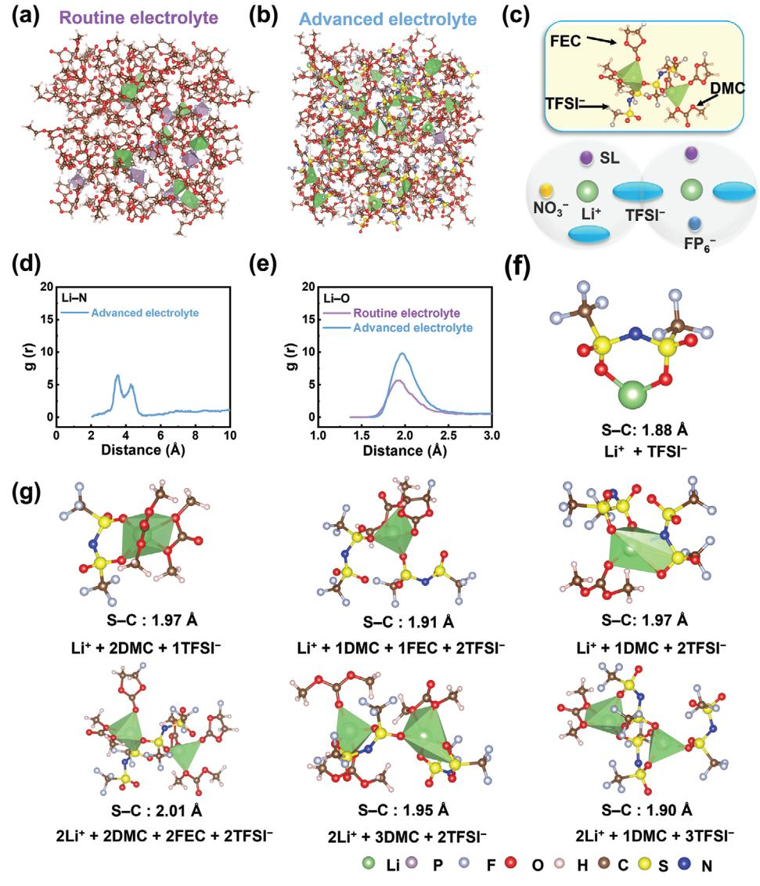
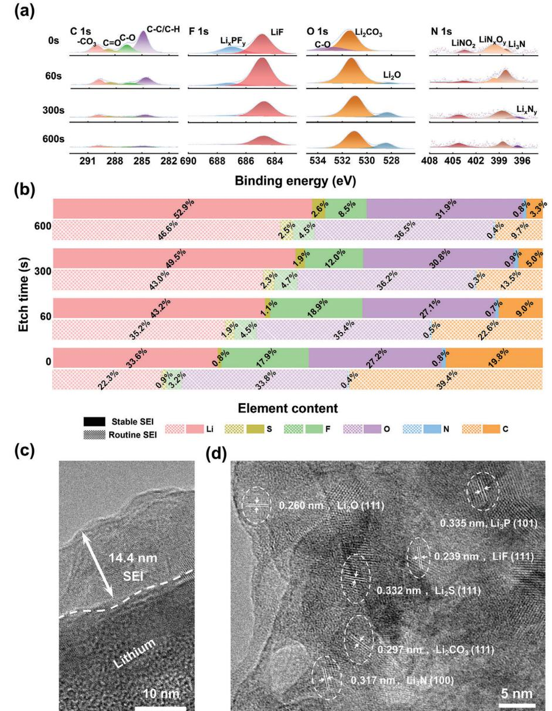
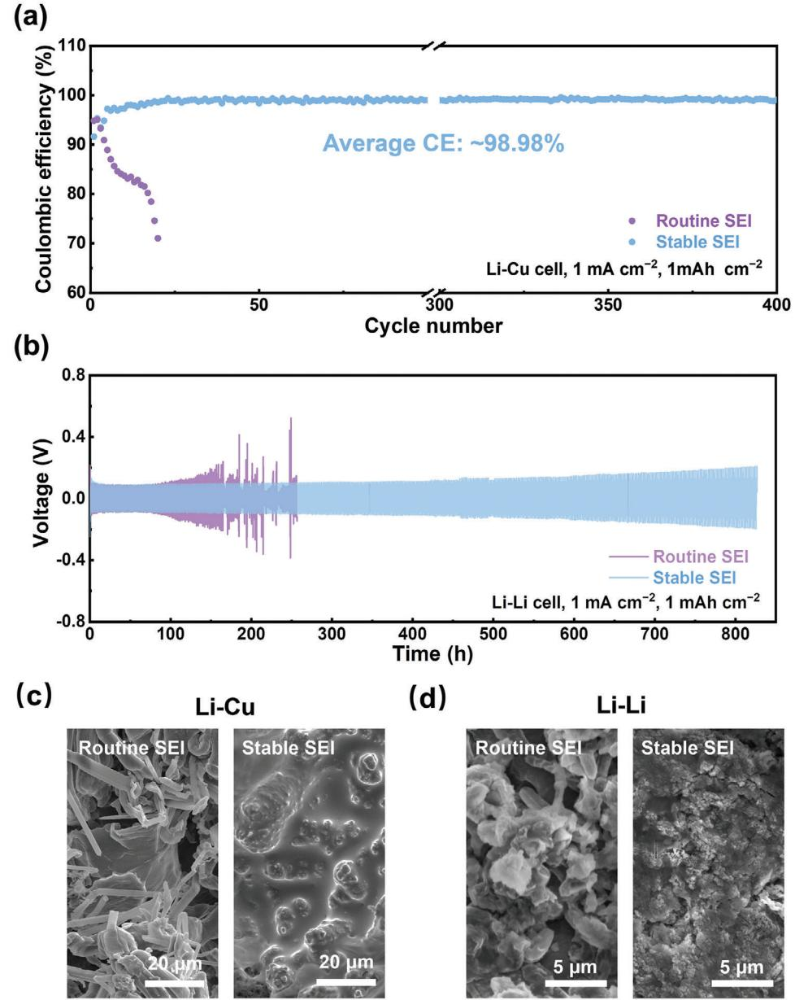
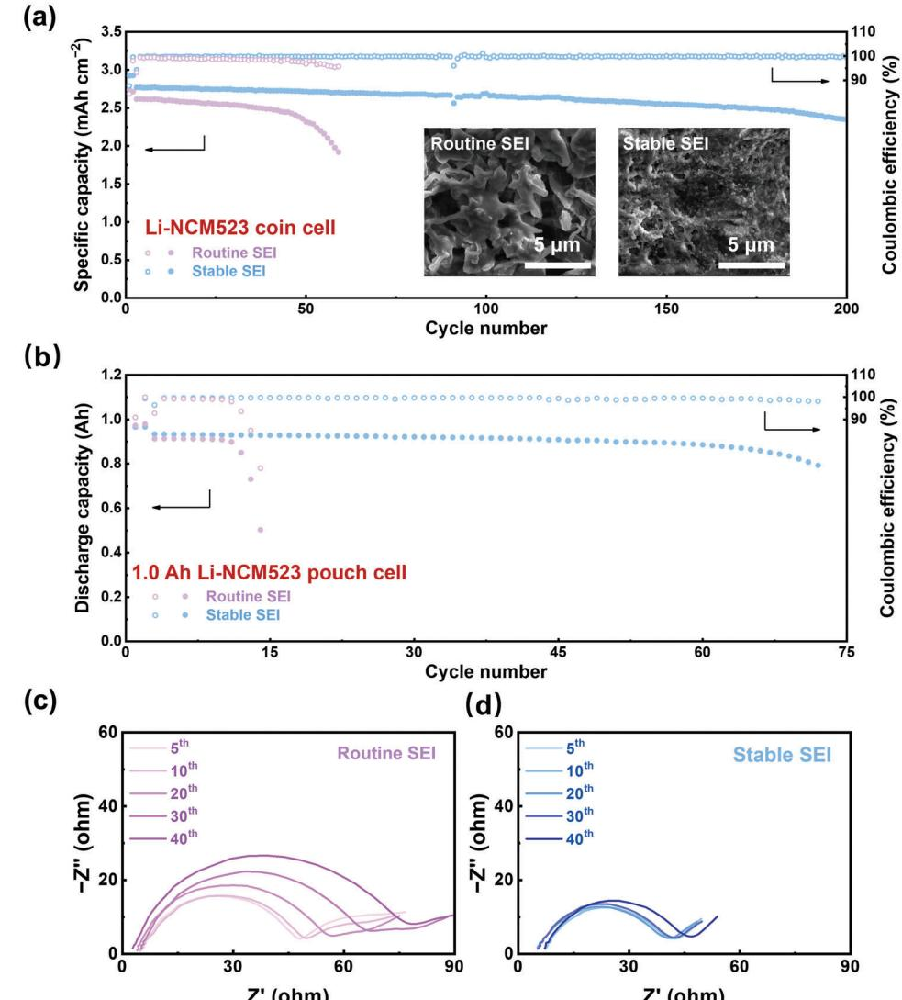
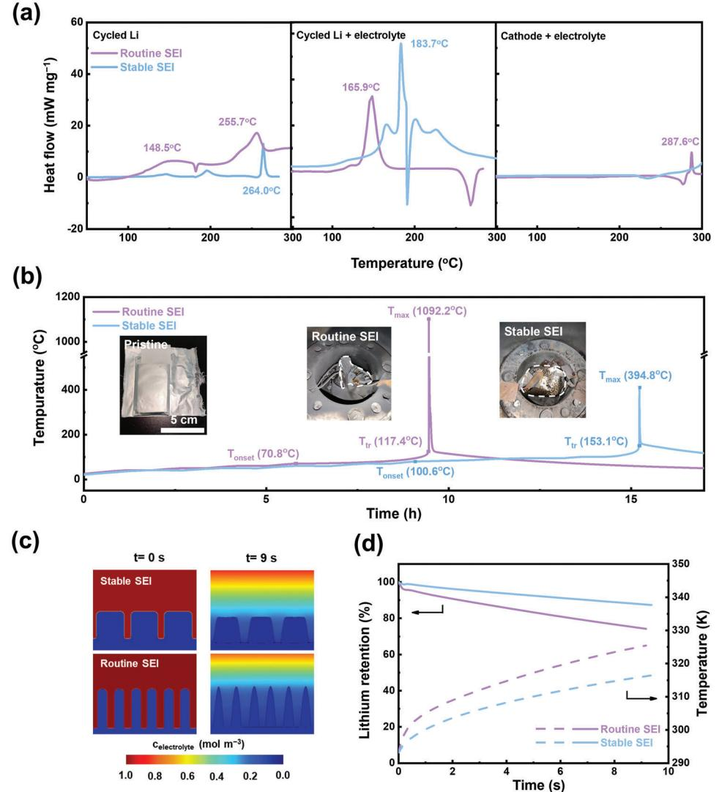

# **Electrochemically and Thermally Stable Inorganics–Rich Solid Electrolyte Interphase for Robust Lithium Metal Batteries**

*Xin-Bing Cheng, Shi-Jie Yang, Zaichun Liu, Jia-Xin Guo, Feng-Ni Jiang, Feng Jiang, Xiaosong Xiong, Wen-Bo Tang, Hong Yuan, Jia-Qi Huang, Yuping Wu, and Qiang Zhang\**

**Severe dendrite growth and high-level activity of the lithium metal anode lead to a short life span and poor safety, seriously hindering the practical applications of lithium metal batteries. With a trisalt electrolyte design, an F-/N-containing inorganics–rich solid electrolyte interphase on a lithium anode is constructed, which is electrochemically and thermally stable over long-term cycles and safety abuse conditions. As a result, its Coulombic efficiency can be maintained over 98.98% for 400 cycles. An 85.0% capacity can be retained for coin-type full cells with a 3.14 mAh cm−2 LiNi0.5Co0.2Mn0.3O2 cathode after 200 cycles and 1.0 Ah pouch-type full cells with a 4.0 mAh cm−2 cathode after 72 cycles. During the thermal runaway tests of a cycled 1.0 Ah pouch cell, the onset and triggering temperatures were increased from 70.8 °C and 117.4 °C to 100.6 °C and 153.1 °C, respectively, indicating a greatly enhanced safety performance. This work gives novel insights into electrolyte and interface design, potentially paving the way for high-energy-density, long-life-span, and thermally safe lithium metal batteries.**

#### **1. Introduction**

Lithium (Li)-ion battery is one of the most successful energy storage devices, rendering the convenient utilization of energy in portable devices and electric vehicles.[1] Advanced electrode materials are the premise for the further development of batteries

X.-B. Cheng, Z. Liu, J.-X. Guo, F. Jiang, X. Xiong, W.-B. Tang, Y. Wu Key Laboratory of Energy Thermal Conversion and Control of Ministry of Education School of Energy and Environment Southeast University Nanjing, Jiangsu 210096, China S.-J. Yang, H. Yuan, J.-Q. Huang Advanced Research Institute of Multidisciplinary Science Beijing Institute of Technology Beijing 100081, China F.-N. Jiang, Q. Zhang Beijing Key Laboratory of Green Chemical Reaction Engineering and Technology Department of Chemical Engineering Tsinghua University Beijing 100084, China E-mail: zhang-qiang@mails.tsinghua.edu.cn The ORCID identification number(s) for the author(s) of this article

can be found under https://doi.org/10.1002/adma.202307370

**DOI: 10.1002/adma.202307370**

with higher energy density, longer life span, and better safety.[2] Compared with graphite anode in the conventional Li-ion batteries, Li metal anode is receiving gradually increased attentions due to its high theoretical capacity (3860 mAh g−1) and extremely low negative potential (−3.04 V vs standard hydrogen electrode).[3] However, Li metal batteries have suffered from the problems of short life span and high safety risks since the first rise in the 1960s, leading to the recall of battery products and seriously hindering the practical applications.[4]

Severe dendrite growth and high activity are two of the toughest issues of Li metal anode. High activity results in the unavoidable interface reactions between Li and the electrolyte, forming the solid electrolyte interphase (SEI).[5] Li dendrite will destroy the SEI due to its high modulus and volume change, leading to the repeated

reestablishment of SEI and the consumption of Li.[6] The instability of SEI will also accelerate the dendrite growth, finally leading to the poor life span in the long-term electrochemical cycles.[7] During abuse conditions, such as mechanical (nail penetration, etc.), electrochemical (overcharge, etc.), or thermal (overheat, etc.) abuses, the temperature can be increased sharply. As a result, the exothermic reactions between Li metal and the electrolyte occur violently with the continuous breakdown of SEI at high temperature,[8] which can eventually induce the thermal runaway and serious safety accidents.[9] Based on the above discussion, SEI plays a key role in the electrochemical cycles and thermal-runaway conditions.[10] Electrochemically and thermally stable SEI can efficiently reduce the continuous side reactions, which can both enhance the cycling stability and thermal safety of Li metal batteries.[11]

Electrolyte designs to induce in situ SEI and artificial SEI constructed before cycling are proposed to improve the cycle performance of Li metal batteries (LMBs) effectively.[12] However, the thermal stability of these SEIs and the effects of these strategies on the safety performance of Li metal batteries are not clearly investigated.[13] In fact, some of the solutions are even harmful to the thermal safety of LMBs.[14] SEI obtained in solid-state electrolyte is considered to be effective in decreasing the side reactions during thermal runaway and enhancing the thermal safety.[15] However, solid-state electrolytes are usually with low ionic conductivity and poor interface contact, leading to short life span during electrochemical cycles.[16] Strategies to obtain electrochemically and thermally stable SEI are of great importance for the long-life-span and enhanced-safety Li metal batteries.[10d,17] For the electrochemically stable SEI, it must be strong enough to suppress dendrite growth and dense to inhibit the side reactions between the nonaqueous electrolyte and lithium metal. Based on the current wisdom of interface chemistry, inorganic–organic hybrid film containing LiF and Li3N is hopeful to satisfy the requirements. For the thermally stable SEI, it must be with high temperature resistance, which can keep stable and inhibit the side reactions and heat generation during battery abuse. Inorganic SEI is considered with high thermal stability compared with the organic one. Therefore, the electrochemically and thermally stable SEI should be with inorganics-rich hybrid components.

In this contribution, electrochemically and thermally stable SEI is constructed by a unique electrolyte system with trisalt (3.0 m Li bis((trifluoromethyl)sulfonyl)azanide (LiTFSI), 0.05 m LiPF6, sustained-release LiNO3) dissolved in the solvents of fluoroethylene carbonate (FEC) and dimethyl carbonate (DMC) (1:4 in volume ratio) (labeled as advanced electrolyte, the electrolyte of 1 m LiPF6–ethylene carbonate (EC)/diethyl carbonate (DEC) (1:1 v/v) labeled as routine electrolyte). The SEI is an F-/N-containing inorganics-rich interface upon Li anode, which can keep stable during the long-term cycles and safety abuse conditions. In detail, the advanced electrolyte helps to achieve stable plating and stripping of Li metal anode, maintaining 98.98% Coulombic efficiency after 400 cycles. Life spans of 200 cycles can be achieved for coin-type full cells using 3.14 mAh cm−2 LiNi0.5Co0.2Mn0.3O2 cathode and 72 cycles for 1.0 Ah pouch-type full cells with 4.0 mAh cm−2 LiNi0.5Co0.2Mn0.3O2 cathode. The thermal safety of 1.0 Ah pouch cell has also been improved. The onset and triggering temperatures are increased from 70.8 and 117.4 to 100.6 and 153.1 °C, respectively, while the maximum temperature is decreased from 1092.2 to 394.8 °C.

### **2. Results and Discussion**

#### **2.1. SEI Formation**

It is generally acknowledged that LiF is a favorable component in the SEI, which has superior electronic insulation,[18] mechanical strength, lower surface diffusion barrier, and high thermal stability.[19] Therefore, side reactions between Li metal and electrolyte and dendrite growth can be reduced whether in the cycles or the thermal runaway. In order to improve the content of LiF, LiTFSI and LiPF6 were adopted as the electrolyte salt, and FEC/DMC (1:4 v/v) was used as the main solvent to induce the LiF-rich SEI. Li3N here induced by LiNO3 is among one of the fastest Li-ion conductors with ionic conductivity on the order of ≈10−3 S cm−1 at room temperature,[20] which is helpful to render rapid diffusion of Li ions in the SEI and suppress dendrite growth.

Inorganic components (LiF, Li3N, Li2CO3, Li2O, etc.) tend to indicate high ionic conductivity and thermal stability compared with organic components of SEI (Li ethylene dicarbonate, etc.).[21] High-concentration electrolyte (*>*3 m) is considered very effective to change the solvation structure of electrolytes and realize the anions to participate the solvation structure of Li ions, which can render the inorganics-rich SEI.[22] Herein, 3 m LiTFSI was adopted to render the anion-participated solvation structure in the electrolyte. According to the radial distribution functions and the typical solvation structures generated from molecular dynamics simulations in the canonical ensemble at 298 K (**Figure 1**a–c), more types of solvation structures are discovered in the 3 m electrolyte (Figure S1a, Supporting Information). In addition to the common Li─O and Li─F bonds, coordination forms of Li─N (3.5 and 4.3 Å, and Figure 1d) also appear in the solvation structures of 3 m electrolytes due to the solvation participation of TFSI− and NO3 −. The increase of Li─O signal at around 2.0 Å indicates that more TFSI− interacts with Li ions through the Li─O bond (Figure 1e) with a calculated Li+/anion of Li─O (TFSI−) coordination number of 2.2 (Figure S2, Supporting Information).[23] This clearly demonstrates the key role and the great contributions of anions (TFSI−) in the coordination of Li-ion solvation structures. This is different from routine electrolyte that mainly relies on solvent molecules coordination (Figure S1b, Supporting Information). At the same time, in the case of multiple coordinations, S─C in TFSI− is activated with the bond length extended from the original 1.88 Å (Figure 1f) to 1.90–2.01 Å (Figure 1g), resulting in the polarization of TFSI−. Polarized TFSI− is activated, thus facilitating the decomposition and promoting the generation of SEI components with abundant inorganics such as LiF, LiSO*x*, and LiN*x*O*y*. Overall, with the increase of TFSI−, PF6 −, and NO3 − participation in Li-ion solvation structures, the inorganic components decomposed by anions are prone to be dominant in SEI, elevating the electrochemical/thermal stability of Li metal anode and reducing the flammable gas produced by solvent reduction.

The component and structure of the SEI were further investigated by X-ray photoelectron spectroscopy (XPS) and highresolution transmission electron microscopy (HRTEM). Stable SEI is adopted to label as the one formed in the trisalt electrolyte, while routine SEI is to label as the one formed in the routine electrolyte. Li fluoride, Li oxide, Li carbonate, and Li nitrogen oxide are the main products of the inner layer of stable SEI with a thickness of 14.4 nm (**Figure 2**a,c,d). Their contents increase gradually with the progress of etching, while the C content in the stable SEI decreases fast, indicating that the inorganic content in the inner layer increases further. By contrast, after 60 s of etching, organic C signals (C─C/C─H) still occupy a certain proportion in routine SEI (Figure S3, Supporting Information). As a result, stable SEI indicates higher contents in the inorganic F and N element percentage and lower contents in the organic C element percentage (Figure 2b and Table S1 (Supporting Information)), which fit well with the solvation structure. The higher F and N contents confirm the roles of Li salts and solvents to induce the highly conductive and thermally stable components.

In general, characterized by theoretical and experimental methods, F-/N-containing inorganics-rich SEI was efficiently constructed upon Li metal anode by the advanced electrolyte system. The functional stable SEI is potential to hinder the growth of Li dendrites and reduce the side reactions, which are favorable to enhance the cycling and thermal stability of Li metal batteries.

**Figure 1.** Molecular dynamics simulations for the electrolyte. Snapshots of the molecular dynamics simulation boxes of a) routine and b) advanced electrolytes. c) Typical solvent structure of advanced electrolyte. Molecular dynamics simulations of d) Li─N and e) Li─O radial distribution functions. f) Optimized LiTFSI structure. g) Typical solvation structures and S─C bond lengths in the advanced electrolytes.

#### **2.2. Cycling Performance**

Coin-type Li–Cu half-cells and Li–Li symmetry cells were assembled to investigate the electrochemical stability of SEI contributed by different electrolyte components. The roles of FEC–DMC solvents with LiPF6 salt can be obtained by comparing both the cycling stability of Li–Cu half-cells and Li–Li symmetry cells with 1 m LiPF6–FEC/DMC (1:4 v/v) electrolyte and routine electrolyte (1 m LiPF6–EC/DEC (1:1 v/v)) (Figures S4–S6, Supporting Information). However, PF5 induced by the decomposition of LiPF6 tends to react with Li2CO3 and Li2O and destroy SEI layer at high temperature, being a hidden danger to the cell safety.[13c] Therefore, LiTFSI rather than LiPF6 was adopted as the main lithium salt in trisalt electrolyte. However, despite LiTFSI has higher thermal stability, it is not enough effective in stabilizing the interface of Li metal anode in electrochemical processes due to the difficulty in its defluorination to form the robust LiF-rich SEI compared with LiPF6. [21b] As shown in Figure S4 (Supporting Information), the electrochemical performance of 3 m LiTFSI– FEC/DMC (1:4 v/v) electrolyte is worse than that of 1 m LiPF6– FEC/DMC (1:4 v/v) electrolyte. Hence, 0.05 m LiPF6 was used as the additive in 3 m LiTFSI–FEC/DMC (1:4 v/v) electrolyte to balance the thermal and electrochemical performance of batteries. Due to the effective roles of LiNO3 and concentrated electrolyte in stabilizing the interface upon Li metal anode,[24] a trisalt electrolyte (3 m LiTFSI–0.05 m LiPF6–LiNO3–FEC/DMC (1:4 v/v)) was designed to construct the stable SEI and improve the interface stability of Li metal anode.

A high average Coulombic efficiency of 98.98% is obtained in the 400 cycles at 1.0 mA cm−2 and 1.0 mAh cm−2 for stable SEI, while that of routine SEI decreases to 70% at the 25th cycle (**Figure 3**a). The stable SEI also indicates steady Li plating

**Figure 2.** Structure and component characterizations. a) XPS C 1s, F 1s, O 1s, N 1s spectra of stable SEI at different sputtering time. b) Atomic percentages of different elements at different sputtering times. c) TEM and d) HRTEM images of stable SEI.

and stripping behaviors in the Li–Li symmetry cells for 850 h at 1.0 mA cm−2 and 1.0 mAh cm−2, while short circuit occurs for routine SEI at 160 h due to the severe dendrite and fragile interface (Figure 3b), which can be confirmed by the impedance spectra of Li–Li half-cells for routine and stable SEI at different cycles (Figure S7, Supporting Information). After cycles, uniform and dendrite-free morphology can be achieved for the stable SEI, while dendrite growth can be obviously observed with the routine SEI (Figure 3c,d and Figure S8 (Supporting Information)).

The full cells of Li metal anode with different SEI films matching LiNi0.5Co0.2Mn0.3O2 (NCM523) cathode were adopted to investigate the electrochemical performances in practical applications. Coin-type full cells with ultrathin Li (50 μm) and thick NCM523 cathode (3.14 mAh cm−2) further verify the roles of stable SEI in the long-term cycles. Notably, 85.0% capacity retention after 200 cycles of Li–NCM523 coin cell is obtained for stable SEI, while just 73.2% capacity can be maintained after 59 cycles for the routine SEI (**Figure 4**a). The superior cycling stability is induced by the uniform Li morphology caused by the stable SEI and charge–discharge curves (Figures S9 and S10, Supporting Information). At the same time, stable SEI also renders steady and small Li-ion diffusion resistance compared with gradually increased resistance of routine SEI (Figure 4c,d).

1.0 Ah pouch cells with 50 μm Li and 4.0 mAh cm−2 NCM523 were assembled to further highlight the practical significance of

**Figure 3.** Li plating and stripping behaviors. Cycling performance of a) Li–Cu half-cells and b) Li–Li symmetry cells with various SEIs under 1 mA cm−2 and 1 mAh cm−2. Scanning electron microscope (SEM) images of deposited Li in the c) Li–Cu half-cells and d) Li–Li symmetry cells.

stable SEI. More than 6 times longer cycles (72 cycles with capacity retention of 85.0%) compared with routine SEI are achieved for stable SEI (Figure 4b). The slower growth rate of cell polarization indicates that the stable SEI inhibits the side reactions of the interface upon Li metal anode (Figure S11, Supporting Information).

#### **2.3. Thermal Stability**

Based on the theoretical design, stable SEI can protect the Li metal anode from continuous corrosion by the electrolyte at high temperature, hence potentially rendering thermally safe Li metal batteries. Differential scanning calorimetry (DSC) was adopted to probe the thermal stability of materials assembled from the cycled 1 Ah Li–NCM523 pouch cells (**Figure 5**a). Cycled Li with stable SEI exhibits flat DSC curves before 260 °C, while that of routine SEI indicates violent heat release at 148.5 and 255.7 °C due to the unstable SEI film. For the systems with routine SEI, the reactions between cycled Li and routine electrolyte occur earlier and more violent with the heat release peak at 165.9 °C and heat release rate of 32.73 mW mg−1, which is high enough to raise the temperature sharply and cause the thermal runaway. As for the stable SEI, the constructed inorganics-rich SEI prevents the interface reactions to the temperature of 183.7 °C higher than the melting point of Li metal (180 °C). After 180 °C, the larger

**Figure 4.** Long-term electrochemical cycling performance of Li–NCM523 cells. a) Cycling performance of ultrathin Li (50 μm)–NCM523 (3.14 mAh cm−2) coin cells (activation at 0.1 C for two cycles, long-term cycling at 0.4 C, 1.0 C = 4.16 mA) and b) ultrathin Li (50 μm)–NCM523 (4.0 mAh cm−2) pouch cells with activating at 0.05 C for two cycles and long-term cycling at 0.2 C (1.0 C = 1000 mA). Impedance spectra of Li–NCM523 coin cells for c) routine and d) stable SEI at different cycles.

heat release of the stable SEI is probably caused by more Li in the samples indicated by the high absorbing peak of Li metal. The melting Li metal will spontaneously form into spheres due to the surface tension effect, destroying the effective protection of stable SEI. Besides, the high salt concentration and FEC solvents contribute together to the enhanced stability of advanced electrolyte against the cathode at high temperature.

Accelerating rate calorimetry (ARC) tests were adopted to investigate the thermal stability at the pouch-cell level. When the discharge capacity of the cell falls below 80% of the initial capacity, the cell will be fully charged to 100% state-of-charge for ARC tests. Three critical temperatures are emphasized to assess the thermal safety of LMBs: 1) the onset self-heating temperature, *T*onset, when the self-heating rate of batteries is higher than 0.02 °C min−1, representing the occurrence of the mild exothermic reactions, such as the thermal decomposition of SEI; 2) the thermal runaway triggering temperature, *T*tr, when the self-heating rate is higher than 60 °C min−1, representing the appearance of the violent exothermic reactions and the unstoppable thermal failure of LMBs, which can be induced by the reactions between Li metal and electrolyte, cathode and electrolyte, short circuit; 3) the maximum temperature, *T*max, representing the maximum damage capability of LMBs, usually induced by all exothermic reactions inside the battery. The extremely low *T*onset (70.8 °C) results from the terrible thermal stability of cycled Li metal anode with routine SEI (Figure 5b), which can reduce the upper limit of stable battery operation temperature. While stable SEI can successfully construct the inorganics-rich SEI upon Li metal anode and delay the *T*onset to 100.6 °C, leaving more room of safe battery operation. When the temperature increases further for the routine SEI, severe exothermic reactions occur between the heavily pulverized reactive Li metal anode and the

**Figure 5.** Thermal stability of cycled 1.0 Ah pouch cells. DSC curves of a) cycled Li, cycled Li + electrolyte, cycled NCM + electrolyte. b) Variations of the temperature in the ARC tests. The insets are the digital images of cells at different thermal-runaway stages. Simulation of the reaction between electrolyte and Li dendrites deposited with different SEIs: c) Li dendrites before/after 9 s reaction and the corresponding electrolyte concentration and d) Li retention percentage and temperature upon the Li dendrite surface.

routine electrolyte at 117.4 °C, rapidly pushing the temperature to extremely destructive *T*max of 1092.2 °C (Figure S12, Supporting Information). The strongly destructive capacity can burn the whole cell and cause the disaster accident of Li metal batteries. By contrast, stable SEI greatly increases *T*tr to 153.1 °C and reduces *T*max to 394.8 °C. The reduced *T*max is induced by the inhibited Li dendrite and the increased thermal stability of stable SEI. The overall structure of the battery with stable SEI is maintained well.

The reaction rates of two different shapes of Li dendrites against electrolyte are simulated to better understand the relationship between electrochemical and thermal stability of advanced electrolytes. Electrochemically stable SEI can help Li to achieve a more uniform deposition. Therefore, Li deposits with smaller length–diameter ratio were used to simulate the shape of Li deposition under stable SEI due to the scanning electron microscope (SEM) results. The results show that the reaction rates between Li deposits and electrolyte are lower under stable SEI compared with routine SEI and the interfacial temperature rise is less (Figure 5c,d and Figure S13 (Supporting Information)). The simulation results confirm that electrochemical and thermal stability of batteries can be improved together with the rational design of SEI and electrolytes.

#### **3. Conclusions**

An electrochemically and thermally stable SEI was constructed by the coordination effect of functional trisalt and solvent. The 3.0 m LiTFSI is used as the main salt to adjust the thermal stability and solvation structure of the electrolyte, and 0.05 m LiPF6 combining with FEC increases the LiF content, while sustainedrelease LiNO3 improves the Li-ion conductivity of SEI. The advanced electrolyte can form F-/N-containing inorganics-rich SEI

on the surface of Li metal in situ, providing better electrochemical/thermal protection for Li metal. Therefore, uniform deposition/stripping during charging/discharging processes and high thermal stability at high temperature are achieved for Li metal batteries. On the one hand, benefiting from the inhibition of inorganic SEI on Li dendrites, the Li–Cu half-cell maintains high Coulombic efficiency (98.98%) in 400 cycles and the Li–NCM523 coin and pouch full cells achieve high capacity retention (85%) after 200 cycles in 72 cycles, respectively. On the other hand, the high thermal stability of inorganic SEI improves the safety performance of 1.0 Ah pouch cell. The onset and triggering temperatures are increased by 46.6 and 52.5 °C, respectively, while the maximum temperature is decreased by 697.4 °C, leaving more safety room for cell operation. This work comprehensively discusses the cycling and thermal stability of LMBs and establishes the relationship between them, providing new insights for the practical application of LMBs.

# **Supporting Information**

Supporting Information is available from the Wiley Online Library or from the author.

# **Acknowledgements**

X.-B.C., S.-J.Y., and Z.L. contributed equally to this work. This work was supported by the National Natural Science Foundation of China (Grant Nos. 22179070, 22075029, 22061132002, U1932220, and 21825501), the National Key Research and Development Program (Grant No. 2021YFB2400300), the Natural Science Foundation of Jiangsu Province (Grant No. BK20220073), the Fundamental Research Funds for the Central Universities (Grant No. RF1028623157), the Key Research and Development Program of Yunnan Province (Grant No. 202103AA080019), the China Postdoctoral Science Foundation funded project (Grant No. 2023M730562), and the Jiangsu Funding Program for Excellent Postdoctoral Talent (Grant No. 2023ZB187), Ordos-Tsinghua Innovative & Collaborative Research Program in Carbon Neutrality.

# **Conflict of Interest**

The authors declare no conflict of interest.

### **Data Availability Statement**

The data that support the findings of this study are available from the corresponding author upon reasonable request.

#### **Keywords**

dendrite, lithium metal anodes, pouch cells, safety, solid electrolyte interphase

> Received: July 25, 2023 Revised: August 22, 2023 Published online: November 20, 2023

[1] a) A. Manthiram, *Nat. Commun.* **2020**, *11*, 1550; b) F. Wu, J. Maier, Y. Yu, *Chem. Soc. Rev.* **2020**, *49*, 1569; c) X. Zeng, M. Li, D. Abd El-Hady, W. Alshitari, A. S. Al-Bogami, J. Lu, K. Amine, *Adv. Energy Mater.* **2019**, *9*, 1900161.

- [2] a) Y. Cao, M. Li, J. Lu, J. Liu, K. Amine, *Nat. Nanotechnol.* **2019**, *14*, 200; b) J. Xiao, F. Shi, T. Glossmann, C. Burnett, Z. Liu, *Nat. Energy* **2023**, *8*, 329.
- [3] a) X. Liu, A. Mariani, H. Adenusi, S. Passerini, *Angew. Chem., Int. Ed.* **2023**, *62*, e202219318; b) Z. Piao, R. Gao, Y. Liu, G. Zhou, H.-M. Cheng, *Adv. Mater.* **2023**, *35*, 2206009; c) Y. Xiang, M. Tao, X. Chen, P. Shan, D. Zhao, J. Wu, M. Lin, X. Liu, H. He, W. Zhao, Y. Hu, J. Chen, Y. Wang, Y. Yang, *Nat. Commun.* **2023**, *14*, 177.
- [4] a) C. Yang, K. Fu, Y. Zhang, E. Hitz, L. Hu, *Adv. Mater.* **2017**, *29*, 1701169; b) X. Feng, D. Ren, X. He, M. Ouyang, *Joule* **2020**, *4*, 743.
- [5] a) H. Liu, X. Sun, X.-B. Cheng, C. Guo, F. Yu, W. Bao, T. Wang, J. Li, Q. Zhang, *Adv. Energy Mater.* **2022**, *12*, 2202518; b) H. Zhang, R. Li, L. Chen, Y. Fan, H. Zhang, R. Zhang, L. Zheng, J. Zhang, S. Ding, Y. Wu, B. Ma, S. Zhang, T. Deng, L. Chen, Y. Shen, X. Fan, *Angew. Chem., Int. Ed.* **2023**, *62*, e202218970.
- [6] M. Baek, J. Kim, K. Jeong, S. Yang, H. Kim, J. Lee, M. Kim, K. J. Kim, J. W. Choi, *Nat. Commun.* **2023**, *14*, 1296.
- [7] a) W. Wu, W. Luo, Y. Huang, *Chem. Soc. Rev.* **2023**, *52*, 2553; b) A. Mohammadi, S. Djafer, S. Sayegh, A. J. Naylor, M. Bechelany, R. Younesi, L. Monconduit, L. Stievano, *Chem. Mater.* **2023**, *35*, 2381.
- [8] a) K. Mukai, T. Uyama, T. Nonaka, *ACS Appl. Mater. Interfaces* **2023**, *15*, 15605; b) I. S. Buyuker, B. Pei, H. Zhou, X. Cao, Z. Yu, S. Liu, W. Zhang, W. Xu, J.-G. Zhang, Z. Bao, Y. Cui, C. Wang, M. S. Whittingham, *ACS Energy Lett.* **2023**, *8*, 1735; c) T. Dong, H. Zhang, L. Huang, J. Ma, P. Mu, X. Du, X. Zhang, X. Wang, C. Lu, S. Dong, Q. Zhou, G. Xu, W. Liu, G. Cui, *Energy Storage Mater.* **2023**, *58*, 123.
- [9] X. Zhang, L. Huang, B. Xie, S. Zhang, Z. Jiang, G. Xu, J. Li, G. Cui, *Adv. Energy Mater.* **2023**, *13*, 2203648.
- [10] a) J. Wu, S. Weng, X. Zhang, W. Sun, W. Wu, Q. Wang, X. Yu, L. Chen, Z. Wang, X. Wang, *Small* **2023**, *19*, 2208239; b) F.-N. Jiang, X.-B. Cheng, S.-J. Yang, J. Xie, H. Yuan, L. Liu, J.-Q. Huang, Q. Zhang, *Adv. Mater.* **2023**, *35*, 2209114; c) S.-J. Yang, N. Yao, F.-N. Jiang, J. Xie, S.-Y. Sun, X. Chen, H. Yuan, X.-B. Cheng, J.-Q. Huang, Q. Zhang, *Angew. Chem., Int. Ed.* **2022**, *61*, e202214545; d) J. Zheng, J. Wang, T. Guo, Y. Wang, J. Nai, J. Luo, H. Yuan, Z. Wang, X. Tao, Y. Liu, *Small* **2023**, *19*, 2207742.
- [11] a) Y. Zhang, L. Yu, X.-D. Zhang, Y.-H. Wang, C. Yang, X. Liu, W.-P. Wang, Y. Zhang, X.-T. Li, G. Li, S. Xin, Y.-G. Guo, C. Bai, *Sci. Adv.* **2023**, *9*, eade5802; b) J. Zhou, Y. Meng, D. Shen, Y. Zhou, J. Liu, Y. Cao, C. Yan, T. Qian, *J. Phys. Chem. Lett.* **2023**, *14*, 4482; c) A. Yang, C. Yang, K. Xie, S. Xin, Z. Xiong, K. Li, Y.-G. Guo, Y. You, *ACS Energy Lett.* **2023**, *8*, 836.
- [12] a) Z. Li, H. Rao, R. Atwi, B. M. Sivakumar, B. Gwalani, S. Gray, K. S. Han, T. A. Everett, T. A. Ajantiwalay, V. Murugesan, N. N. Rajput, V. G. Pol, *Nat. Commun.* **2023**, *14*, 868; b) L.-P. Hou, N. Yao, J. Xie, P. Shi, S.-Y. Sun, C.-B. Jin, C.-M. Chen, Q.-B. Liu, B.-Q. Li, X.-Q. Zhang, Q. Zhang, *Angew. Chem., Int. Ed.* **2022**, *61*, e202201406; c) S. Zhang, S. Li, Y. Lu, *eScience* **2021**, *1*, 163; d) X. Liu, Z. Yu, E. Sarnello, K. Qian, S. Seifert, R. E. Winans, L. Cheng, T. Li, *Energy Mater. Adv.* **2021**, *2021*, 7368420; e) J. Xie, S.-Y. Sun, X. Chen, L.-P. Hou, B.-Q. Li, H.-J. Peng, J.-Q. Huang, X.-Q. Zhang, Q. Zhang, *Angew. Chem., Int. Ed.* **2022**, *61*, e202204776.
- [13] a) F.-N. Jiang, S.-J. Yang, Z.-X. Chen, H. Liu, H. Yuan, L. Liu, J.-Q. Huang, X.-B. Cheng, Q. Zhang, *Particuology* **2023**, *79*, 10; b) F.-N. Jiang, S.-J. Yang, X.-B. Cheng, P. Shi, J.-F. Ding, X. Chen, H. Yuan, L. Liu, J.-Q. Huang, Q. Zhang, *J. Energy Chem.* **2022**, *72*, 158; c) X.-Q. Xu, X.-B. Cheng, F.-N. Jiang, S.-J. Yang, D. Ren, P. Shi, H. Hsu, H. Yuan, J.-Q. Huang, M. Ouyang, Q. Zhang, *SusMat* **2022**, *2*, 435.
- [14] J. Hou, L. Lu, L. Wang, A. Ohma, D. Ren, X. Feng, Y. Li, Y. Li, I. Ootani, X. Han, W. Ren, X. He, Y. Nitta, M. Ouyang, *Nat. Commun.* **2020**, *11*, 5100.
- [15] R. Chen, A. M. Nolan, J. Lu, J. Wang, X. Yu, Y. Mo, L. Chen, X. Huang, H. Li, *Joule* **2020**, *4*, 812.

- [16] a) B. Shao, Y. Huang, F. Han, *Adv. Energy Mater.* **2023**, *13*, 2204098; b) K. Yang, L. Zhao, X. An, L. Chen, J. Ma, J. Mi, Y.-B. He, *Angew. Chem., Int. Ed.* **2023**, *62*, e202302586; c) J. Janek, W. G. Zeier, *Nat. Energy* **2023**, *8*, 230.
- [17] a) S. Zhang, F. Sun, X. Du, X. Zhang, L. Huang, J. Ma, S. Dong, A. Hilger, I. Manke, L. Li, B. Xie, J. Li, Z. Hu, A. C. Komarek, H.-J. Lin, C.-Y. Kuo, C.-T. Chen, P. Han, G. Xu, Z. Cui, G. Cui, *Energy Environ. Sci.* **2023**, *16*, 2591; b) X. Liu, X. Zheng, X. Qin, Y. Deng, Y. Dai, T. Zhao, Z. Wang, H. Yang, W. Luo, *Nano Energy* **2022**, *103*, 107746.
- [18] Y.-X. Lin, Z. Liu, K. Leung, L.-Q. Chen, P. Lu, Y. Qi, *J. Power Sources* **2016**, *309*, 221.
- [19] X.-B. Cheng, R. Zhang, C.-Z. Zhao, Q. Zhang, *Chem. Rev.* **2017**, *117*, 10403.
- [20] Y. Liu, D. Lin, P. Y. Yuen, K. Liu, J. Xie, R. H. Dauskardt, Y. Cui, *Adv. Mater.* **2017**, *29*, 1605531.
- [21] a) K. Xu, *Chem. Rev.* **2004**, *104*, 4303; b) K. Xu, *Chem. Rev.* **2014**, *114*, 11503.
- [22] a) X. Cao, H. Jia, W. Xu, J.-G. Zhang, *J. Electrochem. Soc.* **2021**, *168*, 010522; b) Y. Yamada, J. Wang, S. Ko, E. Watanabe, A. Yamada, *Nat. Energy* **2019**, *4*, 269; c) C. Zhu, C. Sun, R. Li, S. Weng, L. Fan, X. Wang, L. Chen, M. Noked, X. Fan, *ACS Energy Lett.* **2022**, *7*, 1338.
- [23] J. Zhang, Q. Li, Y. Zeng, Z. Tang, D. Sun, D. Huang, Y. Tang, H. Wang, *ACS Energy Lett.* **2023**, *8*, 1752.
- [24] S. Zhou, C. Fu, Z. Chang, Y. Zhang, D. Xu, Q. He, S. Chai, X. Meng, M. Feng, Y. Zhang, J. Lin, A. Pan, *Energy Storage Mater.* **2022**, *47*, 482.