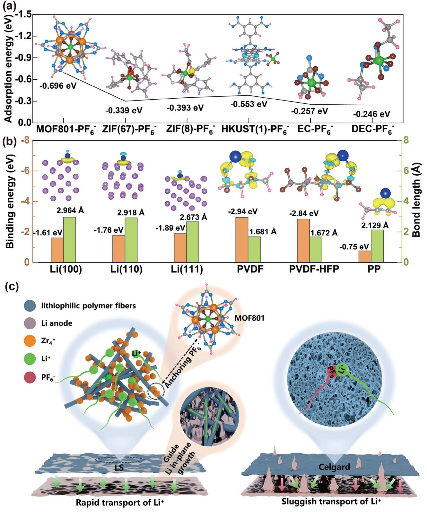
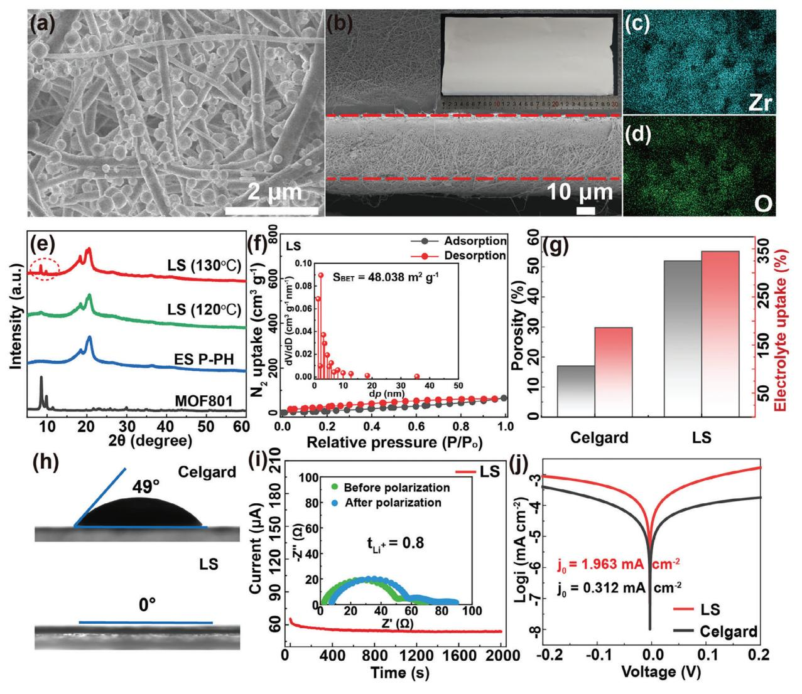
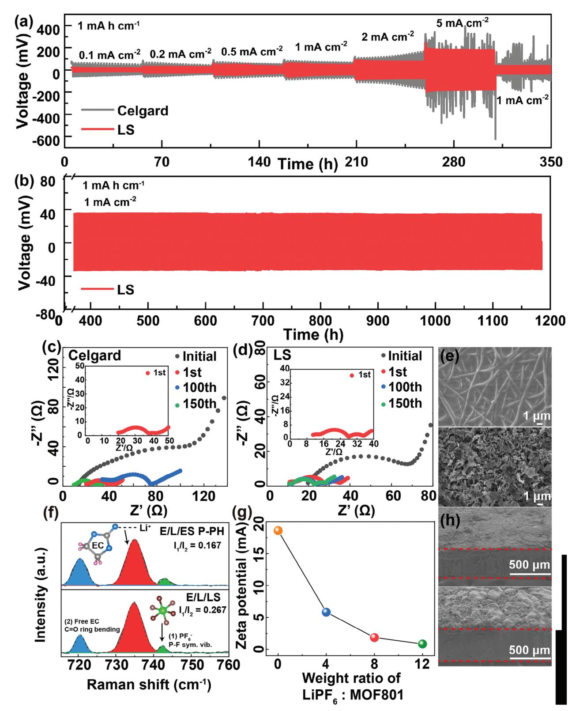
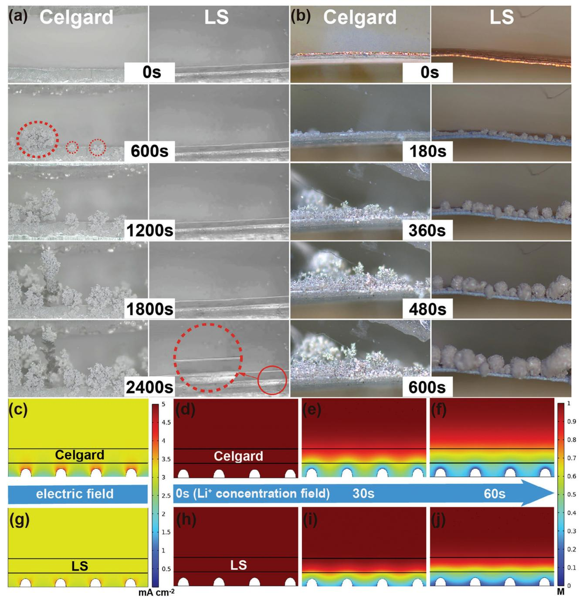
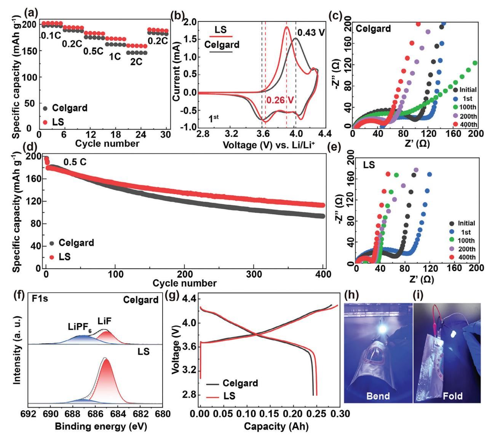

# **Upgrading the Separators Integrated with Desolvation and Selective Deposition toward the Stable Lithium Metal Batteries**

*Lanlan Zuo, Qiang Ma, Peitao Xiao, Qingpeng Guo, Wei Xie, Di Lu, Xiaoru Yun, Chunman Zheng,\* and Yufang Chen\**

**A practical and effective approach to improve the cycle stability of high-energy density lithium metal batteries (LMBs) is to selectively regulate the growth of the lithium anode. The design of desolvation and lithiophilic structure have proved to be significant means to regulate the lithium deposition process. Here, a fluorinated polymer lithiophilic separator (LS) loaded with a metal–organic framework (MOF801) is designed, which facilitates the rapid transfer of Li+ within the separator owing to the MOF801-anchored PF6 − from the electrolyte, Li deposition is confined in the plane resulting from the polymer fiber layer rich in lithiophilic groups (C**─**F). The numerical simulation results confirm that LS induces a uniform electric field and Li+ concentration distribution. Visualization technology records the behavior of regular Li deposition in Li||Li and Li||Cu cells equipping LS. Therefore, LS exhibits an ultrahigh Li+ transference number (tLi + = 0.80) and a large exchange current density (j0 = 1.963 mA cm−2). LS guarantees the stable operation of Li||Li cells for over 1000 h. In addition, the LiNi0.8Co0.1Mn0.1O2||Li cell equipped with LS exhibits superior rate and cycle performances owing to the formation of LiF-rich robust SEI layers. This study provides a way forward for dendrite-free Li anodes from the perspective of separator engineering.**

## **1. Introduction**

High-performance rechargeable batteries must balance high energy density with sufficient safety to become leaders in nextgeneration energy storage devices.[\[1,2\]](#page-10-0) Lithium metal batteries (LMBs) have the potential to achieve a high energy density exceeding 400 Wh kg−1, [\[3\]](#page-10-0) which benefits from a lithium (Li) anode

Henan International Joint Laboratory of Rare Earth Composite Materials College of Materials Engineering Henan University of Engineering Zhengzhou 450000, P. R. China

The ORCID identification number(s) for the author(s) of this article can be found under <https://doi.org/10.1002/adma.202311529>

**DOI: 10.1002/adma.202311529**

with an ultrahigh theoretical capacity (3860 mA h g−1), low redox potential (−3.04 V vs standard hydrogen electrode), and relatively low mass density (0.534 g cm−3).[\[4–6\]](#page-10-0) Moreover, the safety of high-energy-density LMBs is also closely related to the cycle stability of the Li anode, but uncontrollable Li dendrite growth and an unstable solid electrolyte interface (SEI) during LMBs cycling result in low Coulombic efficiency (CE) and rapid capacity decay.[\[7,8\]](#page-10-0) In addition, Li dendrites penetrate the separator and invade the cathode, leading to internal short circuits that can trigger thermal runaway and explosion.[\[9,10\]](#page-10-0) In the past decade, tremendous efforts have been devoted to improving the stability of LMBs via the suppression of Li dendrites, among which the optimization of electrolyte formulations,[\[11\]](#page-10-0) preparation of solid-state electrolytes,[\[12\]](#page-10-0) construction of artificial SEI layers,[\[13\]](#page-10-0) and design of 3D current collectors[\[14\]](#page-10-0) have had significant effects. Controlling the diffusion and reaction rate of Li+ at

the interface is crucial for regulating the morphology of Li deposition.[\[15\]](#page-10-0) The separator is a crucial internal component in rechargeable batteries and serves as a bridge for Li+ transport between the cathode and anode. Although they are inert and do not participate in chemical reactions, ingeniously designed separators are capable of optimizing the chemical composition of the SEI, redistributing solvated ions, and reshaping the direction of Li deposition.[\[16](#page-10-0)−[19\]](#page-10-0) Consequently, designing functional separators is a promising strategy for suppressing the growth of Li dendrites and improving the safety of LMBs.

Metal–organic frameworks (MOFs) are typical porous crystalline materials formed by the orderly splicing of organic ligands between metal nodes.[\[20\]](#page-10-0) The unique skeleton and pore structure provide MOFs with characteristics such as a large specific surface area, hierarchical porosity, rich polar functional groups, and sufficient reaction sites, making them suitable for broad application prospects in the field of electrochemical energy storage.[\[21,22\]](#page-10-0) For instance, Lu et al.[\[23\]](#page-10-0) prepared a composite separator containing MOFs and poly(vinyl alcohol) using the electrospinning method. The use of such composite separators in rechargeable lithium batteries significantly improves the Li+ transference number, tLi +

L. Zuo, P. Xiao, Q. Guo, W. Xie, D. Lu, X. Yun, C. Zheng, Y. Chen Department of Materials Science and Engineering College of Aerospace Science and Engineering National University of Defense Technology Changsha 410000, P. R. China E-mail: [zhengchunman@nudt.edu.cn;](mailto:zhengchunman@nudt.edu.cn) [chenyufang@nudt.edu.cn](mailto:chenyufang@nudt.edu.cn) Q. Ma

(up to 0.79), and Li+ conductivity, as MOFs possessing open metal sites (OMSs) can spontaneously adsorb anions while allowing the effective transport of Li+ in the electrolyte. Wang et al.[\[24\]](#page-10-0) designed a functional separator to regulate ion transport using a well-designed MOF coating to functionalize a polypropylene (PP) separator. Consequently, the Li||Li cell with the functional separator achieved a stable Li plating/stripping cycle for over 150 h. Furthermore, Liu et al.[\[25](#page-10-0)] devised a functional separator by in situ grafting of continuous rigid MOF layer onto both sides of the modified polymer porous separator to balance the internal electric field and prolong the "sand time" of Li dendrite nucleation, resulting in a high tLi + of 0.81 and dendrite-free Li anode. Accordingly, it is reasonable to favor MOFs with rich reaction sites as Li+ accelerators for functional separators.

Although previous research has shown that increasing the Li+ diffusion rate and suppressing Li dendrite growth by introducing MOFs is effective to a certain extent, most of these are hybrid separators obtained by simply blending MOFs with polymers. Indeed, the in situ growth of MOFs with sufficient OMSs on the polymer matrix can maximize the advantages of functional materials. Based on an earlier study, the strategy of polymer coatingmodified metal Li anodes guided the uniform deposition of Li within the polymer layer because their surfaces are rich in polar functional groups.[\[26](#page-10-0)−[28\]](#page-10-0) Notably, Chen et al.[\[29\]](#page-10-0) reported a porous lithiophilic polymer coating induced by phase separation of polyvinylidene fluoride (PVDF) and polyacrylonitrile (PAN) blend to stabilize Li metal anodes. Among them, the lithiophilic functional groups of C≡N and C─F can promote uniform deposition of Li and accelerate Li+ diffusion during the plating-stripping of Li. Cui et al.[\[27\]](#page-10-0) studied the effect of different polymer layers on the morphology of Li deposition and observed that polymers with high dielectric constants, low surface energies, and low reactivities were more presumably to guide the uniform deposition of Li. Therefore, lithiophilic polymers are used as separator skeletons to regulate the morphology of Li deposition.

In this study, we developed a fluorinated polymer lithiophilic separator loaded with MOF801. These MOF801 reduced the transfer resistance of Li+ within the separator by spontaneously adsorbing PF6 − from the electrolyte with MOF801 and induced Li deposition along the direction of the lithiophilic polymer fibers, further forming a polymer fiber-reinforced Li composite layer that was firmly attached to the Li anode, which significantly restrained the volume change of the Li anode (**Figure [1](#page-2-0)**c). Finite element modeling (FEM) confirmed that LS achieves uniform deposition of Li by balancing the electric field and reducing the Li+ concentration gradient from the perspectives of electric and concentration fields. Operando optical microscopy (OM) was used to monitor the LS guided uniform Li deposition process in real-time. The experimental results demonstrate that Li||Li cells with LS ensure stable plating-stripping exceeding 1000 h at 1 mA cm−2 and exhibit a moderate overpotential (180 mV) at 5 mA cm−2, whereas Celgard-based cells are short-circuited. Besides, the LiNi0.8Co0.1Mn0.1O2 (NCM811) || Li cell with LS drives a larger discharge specific capacity (159.7 mA h g−1) than the Celgard separator (146.0 mA h g−1) at 2C, and the capacity retention rate of the cell after 400 cycles at 0.5C increased by 11% compared to Celgard separator. LiFePO4 (LFP) || Li cell with LS reveals a higher capacity retention rate of 92.9% after 500 cycles at 1C compared to LFP|Celgard|Li cell (75.2%). The improved high rate and cycle performance of the cell are attributed to the LS providing fast Li+ transport kinetics, constructing robust LiF-rich SEI layers, and forming a polymer fiber-reinforced Li composite layer on the surface of the Li anode to reduce its volume variation. Thus, a functional LS with anchored anions is crucial for achieving dendrite-free LMBs.

# **2. Results and Discussion**

#### **2.1. Design Concepts of Functional Lithiophilic Separator**

Although MOFs with diverse crystalline structures are widely utilized in rechargeable lithium batteries, blind screening of MOFs with various metal ligands is time-consuming and laborintensive. To resolve this conundrum, we attempted to narrow the range of candidate materials using the adsorption energy between the species as an indicator. As shown in Figure [1a,](#page-2-0) we selected several typical MOFs as research subjects to evaluate their adsorption capacity for PF6 −, and ethylene carbonate (EC) and diethyl carbonate (DEC) were also estimated because they are commonly used organic solvent molecules in electrolytes. Density functional theory (DFT) calculations revealed that Zr-based MOF801 has the strongest adsorption (−0.696 eV) ability for PF6 − compared to different metal-based MOFs (Co-based ZIF-67, Znbased ZIF-8, and Cu-based HKUST-1), even higher than the two typical organic solvent molecules (EC and DEC). This characteristic of the anchoring anions promotes the rapid transport of Li+ within the separator and reduces the resistance to Li+ transfer, which is conducive to improving the rate performance of the battery.[\[21,23\]](#page-10-0) Therefore, we selected MOF801 as a functional additive to endow the separator with anion anchoring features.

Regarding the establishment of a separator skeleton, we considered the fluorinated polymers, PVDF and polyvinylidene fluoride-hexafluoropropylene (PVDF-HFP) with abundant polar functional groups (C─F), which facilitate uniform Li deposition.[\[29\]](#page-10-0) To verify this, we predicted the lithiophilic property of different species and the prior deposition sites of Li by evaluating the binding energies and bond length between Li atoms and PVDF, PVDF-HFP, polypropylene (PP), Li (100), Li (110), and Li (111). As shown in Figure [1b,](#page-2-0) PVDF and PVDF-HFP exhibit higher binding energies (−2.94, and −2.84 eV, respectively) and shorter bond lengths (1.681, and 1.672 Å, respectively) with Li atoms in contrast to PP and Li, indicating that Li+ is preferentially adsorbed on the surface of fluorinated polymers during Li deposition, which originates from their rich lithiophilic groups (C─F) and low surface energy.[\[27,30,31\]](#page-10-0) Furthermore, differential charge density was evaluated to estimate the charge transfer between Li atoms and different species. Compared with PP, Li (100), Li (110), and Li (111), the charge between PVDF, PVDF-HFP, and Li atom increases (yellow area), indicating that the interaction and strength of the bond between Li atom with fluorinated polymers is gradually enhanced,[\[26,32,33\]](#page-10-0) consistent with the aforementioned trend of binding energy changes. This result further substantiates that fluorinated polymers are optimal separator skeletons.

In summary, theoretical calculations were used to screen suitable separator skeletons (PVDF and PVDF-HFP) and functional additives (MOF801) for the construction of functional separators. Subsequently, we fabricated a functional LS by the in situ loading

**Figure 1.** Material screening and schematic illustration of functional separator. a) DFT calculations of adsorption energies between PF6 − and MOF801, ZIF-67, ZIF-8, HKUST-1, EC, and DEC. b) The binding energies, bond length and charge density difference (yellow area refers to charge accumulation and bule refers to the charge consumption) for Li atom adsorption on the Li, PVDF, PVDF-HFP, and PP. The blue, orange, green, grey, pink, brown, and dark blue represent the O, Zr, P, C, H, F, and Li atoms, respectively. c) Schematic illustration of the role and Li deposition behaviors with (left) LS and (right) Celgard separators.

**Figure 2.** Characterizations of functional separator. SEM images of the a) top-view and b) cross-section of the LS (inset: optical photo of the LS), and corresponding elemental distributions of c) Zr and d) O. e) XRD spectra of LS, ES P-PH membrane and MOF801 powers. f) N2 adsorption–desorption curve of LS (inset: pore size distribution). g) Porosity and electrolyte uptake of Celgard and LS separators. h) Contact angles of the ester-based electrolyte on (top) Celgard and (bottom) LS separators. i) Potentiostatic polarization test of Li||Li cell with LS separator (inset: the EIS spectra before and after polarization). j) Tafel plots for Li plating-stripping of the Li||Li cells with Celgard and LS separators.

of MOF801 onto fluorinated polymer fibers via electrospinning and hydrothermal methods and further explored its practicability in high-energy-density LMBs.

#### **2.2. Characterizations of Functional Lithiophilic Separator**

Scanning electron microscopy (SEM) image shows that LS comprises multiple layers of crossed lithiophilic polymer fibers and uniformly distributed MOF801 on the surface (**Figure 2**a), while pure fluorinated polymer fiber separator without MOF801 (ES P-PH) exhibit large voids and through-hole structures (Figure S1a, Supporting Information). The in situ growth of MOF801 crystals are almost spherical with diameters of ≈ 200 nm (Figure S1b, Supporting Information), and the LS thickness is ≈ 30 μm (Figure 2b), insets in Figure 2b show the LS separator with a length of up to ≈ 30 cm. The corresponding energy dispersive spectrometry (EDS) analysis showed that Zr and O are homogeneously distributed within the LS (Figure 2c,d). The surface and cross-sectional morphologies of the Celgard separators are shown in Figure S2 (Supporting Information). In addition, the detailed composite structure of the LS by high-resolution transmission electron microscopy (HRTEM) and EDS elementary mapping. As shown in Figure S3 (Supporting Information), polymer phase and MOF801 phase are clearly observed, and the d-spacing distance of 3.069 Å corresponds to (222) crystalline planes of MOF801.[\[34\]](#page-10-0) The Zr and F elements shown in EDS elementary mapping are derived from MOF801 and fluorinated polymer fibers in the LS separator, respectively. X-ray diffraction (XRD) patterns indicate that characteristic peaks

 $(2\theta = 8.56^{\circ}, 9.86^{\circ})$  of MOF801 in LS are observed when the hydrothermal temperature is increased to 130°C. However, these peaks did not appear in ES P-PH (Figure 2e).[35] Fourier transform infrared (FT-IR) spectra of LS show peaks at 655, 1404, and 1583 cm-1, which can be assigned to the Zr-O vibration in MOF801 cluster, and the asymmetric stretching vibration and symmetric stretching vibration of the carboxylic acid group in the ligand, respectively.[36] The vibration bands at 1072, and 1181  $\rm cm^{-1}$  correspond to the symmetric stretching of  $\rm CF_2$  in PVDF-HFP (Figure S4, Supporting Information).[37] The abundant polar functional groups (C—F) in the separator have excellent lithiophilic properties and can guide the uniform deposition of Li during plating-stripping. Thermogravimetric analysis (TGA) was conducted to determine the weight percentage of MOF801 in LS. As shown in Figure S5a (Supporting Information), the remaining weight percentage of MOF801 powder, LS and ES P-PH at 900°C were 43.99%, 4.94%, and 0%, respectively. It can be inferred that the ES P-PH is completely decomposed at 900°C, which is caused by the high temperature decomposition of fluorinated polymers. In contrast, the remaining products of the LS separator can be attributed to the decomposition of MOF801 loaded on fluorinated polymer fibers. Then the weight percentage of MOF801 in the LS separator is calculated to be  $\approx$  11.2wt% based on the weight percentage of MOF801 powder after decomposition. Furthermore, the typical ZrO2 diffraction peaks appeared in the XRD spectra of the residue of MOF801 powder and LS after high temperature sintering (900°C) under air atmosphere, indicating that MOF801 crystals were grown in situ on LS (Figure S5b, Supporting Information).[34] In addition, the Brunauer-Emmett-Teller (BET) specific surface area of LS increased to 48.038  $m^2$  g-1 compared to ES P-PH ( $S_{BET} = 7.828 \text{ m}^2 \text{ g}^{-1}$ ), which stems from the contribution of MOF801 ( $S_{BET} = 525.2 \text{ m}^2 \text{ g}^{-1}$ ) with large specific surface area and porosity (Figure 2f; Figure S6, Supporting Information). A large specific surface area is conducive for improving the porosity and electrolyte uptake of the separator.[38] Mesopores with dimensions  $< 10$  nm are observed in LS, which are essential properties of an ideal separator. However, the presence of both macropores and mesopores in ES P-PH can weaken the mechanical strength of the separator. As shown in Figure S7 (Supporting Information), LS has higher maximum tensile strength (8.0 MPa) than the ES P-PH (5.47 MPa) and Celgard (7.1 MPa) separators, which is beneficial for resisting the puncture of Li dendrites.

A separator with excellent electrolyte wettability can reduce ionic transfer resistance and increase the rate capacity of LMBs. As shown in Figure 2g,h, LS has higher porosity (52%) and electrolyte uptake (345%) than the Celgard separator (17% and 186%). In addition, LS can swiftly absorb the ester-based electrolyte and show super affinity with an electrolyte contact angle of  $\approx 0^{\circ}$  (Video S1 and Figure S8, Supporting Information), which is superior to that of the Celgard separator (49°). The excellent electrolyte affinity of LS originates from its abundant polar functional groups  $(C-F)$  and rich pore structure, which is a result of the combined force of fluorinated polymer fibers and MOF801. The contact angle of ES P-PH separator (0°) also confirms this statement (Figure S9, Supporting Information), and the lower porosity (26%) and electrolyte uptake (226%) of ES P-PH separator compared to LS are owing to the absence of MOF801 with a large specific surface area (Figure S10, Supporting Information). The internal temperature increase in the battery is inevitable dur-

ing long-term operation, and the superior thermal stability of the separator prevents the contact between the cathode and anode, and the battery short circuit is caused by the thermal shrink of the separator.[39-41] Figure S11 (Supporting Information) shows the thermal shrink extent of the separator size at 25 and 150°C. LS still exhibits good anti-shrinkage when the Celgard separator undergoes lateral shrinkage and ES P-PH occurs overall deformation (150°C). The shrinkage of ES P-PH is attributed to the low melting point (142  $\degree$ C) of PVDF-HFP.[42] On the contrary, the LS separator maintained good anti-shrinkage, benefited by the high thermal stability of MOF801 loaded on fluorinated polymer fibers providing strong support for the separator.

The good separator-electrolyte affinity is conducive to improving the Li+ conductivity and  $t_{Li+}$  of the separator.[43] As shown in Figure S12 (Supporting Information), LS exhibits superior Li+ conductivity (0.85 mS cm-1) than Celgard separator (0.46 mS cm-1) and ES P-PH (0.35 mS cm-1), the  $t_{Li+}$  value of LS (0.80) is higher than that of Celgard separator ( $t_{Li+}$  = 0.44) and ES P-PH ( $t_{Li+}$  = 0.59) (Figure 2i; Figure S13, Supporting Information). The excellent Li+ conductivity and  $t_{Li+}$  of LS are mainly attributed to the effective anchoring of  $PF_6^-$  from the electrolyte with MOF801, which accelerates the diffusion of Li+ in the separator and enhances the Li+ transport kinetics. The inherent large through-hole structure, inferior tensile strength, poor thermal stability, and low ion conductivity of ES P-PH do not meet the requirements of separator for lithium batteries (Figures S1a, S7, and S11, Supporting Information). So, Celgard separators were compared with LS separators in subsequent electrochemical tests. Furthermore, the exchange current density  $(j_0)$ was calculated from the corresponding Tafel plots to evaluate the charge-transfer kinetics at the electrode-electrolyte interface.[44,45] As shown in Figure 2j, the  $j_0$  value of LS (1.963 mA cm-2) was superior to that of the Celgard separator  $(0.312 \text{ mA cm}^{-2})$ , and a higher exchange current density could reduce the electrochemical polarization and improve the electrochemical reaction kinetics, which was also confirmed in the voltage profiles of the Li|Li symmetric cells (Figure 3a). The electrochemical stability of a separator determines its feasibility for use in high-energy density LMBs. Linear sweep voltammetry (LSV) was used to investigate the electrochemical stability of the separators soaked in the electrolyte. The anodic oxidation current of the Celgard separator increased abruptly at 4.23 V, whereas the current of the LS did not fluctuate significantly within 4.5 V (Figure S14, Supporting Information), indicating better electrochemical compatibility with the electrolyte.[46] This indicates that LS can match the high working voltage of the Ni-rich layered oxide cathode and increase the energy density to a higher level for LMBs.

#### 2.3. Li Plating and Stripping Behaviors and Numerical Simulation with Functional Lithiophilic Separator

To investigate the effect of different separators on Li deposition, electrochemical Li plating-stripping experiments were performed to assemble typical Li||Li symmetric cells. As shown in Figure 3a, Li|Li symmetric cells with LS show a smaller overpotential than Celgard separator at different current densities  $(0.1-5 \text{ mA cm}^{-2})$  and with a constant plating capacity of 1 mA h cm $-2$ , even when the current density increases to 5 mA cm $-2$ ,

**[www.advancedsciencenews.com](http://www.advancedsciencenews.com) [www.advmat.de](http://www.advmat.de)**

**Figure 3.** Electrochemical performance of functional separator. a) Voltage profiles for the Li||Li symmetric cells with LS and Celgard separators at the different current densities with the constant plating capacity of 1 mA h cm−2. b) Long-term cycle performance of the Li|LS|Li symmetric cell at 1 mA cm−2 for 1 mA h cm−2. EIS spectra of Li||Li symmetric cells with c) Celgard and d) LS separators at the different cycle. e) Surface and h) cross section morphology of Li anode with LS (top) and Celgard (bottom) separators after 1000 h. f) Raman signals of PF6 − (symmetrical vibration of P─F bond, I1) and free EC (ring-bending modes, I2) in electrolytes of E/L/ES P-PH and E/L/LS systems. g) The Zeta potential of MOF801 without/with LiPF6 addition.

LS exhibits a moderate overpotential (180 mV). The applied current density was then reduced to 1 mA cm−2, it still stably platingstripping Li for over 1000 h without significant potential fluctuations and maintained a stable overpotential of 34 mV (Figure [3b\)](#page-5-0), which implies a stable Li plating and stripping process.[\[47\]](#page-10-0) In this regard, the introduction of MOF801 with anionic anchoring effect can reduce transport resistance of Li+ through the separator, which facilitates a well-distributed Li+ flux over the entire Li metal area during cycling and reduces polarization potential (Figure S15, Supporting Information). In contrast, the overpotential of Li|Celgard|Li symmetric cell suddenly increases after increased current density (5 mA cm−2), suggesting that the Li dendrite puncture separator leads to an internal soft short circuit. In addition, electrochemical impedance spectroscopy (EIS) was conducted on the Li||Li symmetric cells before and after cycling to quantify the interfacial resistance and interface stability. As shown in Figure [3c,d,](#page-5-0) the high- and medium-frequency regions of the EIS spectra appear as two semicircles after the first activation of the Celgard and LS separators, which belong to the resistance of Li+ through the SEI (Rsei) and the charge transfer resistance (Rct), respectively. The Li||Li symmetric cell with the LS separator maintained a small and stable Rsei in subsequent cycles (Figure [3d\)](#page-5-0). In contrast, the Rsei of the Celgard-based Li||Li symmetric cells sharply increased after 100 cycles and decreased again after 150 cycles, which is attributed to the internal short circuit of the cells (Figure [3c\)](#page-5-0). This result was validated by the voltage profiles of the Li||Li symmetric cells (Figure [3a\)](#page-5-0).[\[43\]](#page-10-0)

The Li||Li symmetric cells were disassembled to observe the morphology of the Li anode after 1000 h. The SEM images revealed that the surface of the Li anode employing the LS separator is smooth and dense, with Li tending to fill the gaps between the individual fibers to achieve in-plane growth (Figure [3e,](#page-5-0) top; Figure S16a, Supporting Information). The cross-sectional images further confirm that Li growth is restricted within the polymer fiber layer, which is tightly attached to the Li anode. (Figure [3h,](#page-5-0) top). On the one hand, the 3D polymer fiber networks provide space for Li+ reactions. On the other hand, fluorinated polymers (PVDF and PVDF-HFP) with high dielectric constants improve charge shielding, promote Li+ solvation at the Li anodepolymer interface, and increase the concentration of Li+ available for the reaction.[\[27\]](#page-10-0) This is precisely the reason for the higher exchange current density in the Li||Li cell with LS and is a signal of enhanced interfacial reaction kinetics (Figure [2j\)](#page-3-0).[\[44\]](#page-10-0) Unfortunately, a Li anode employing a Celgard separator is rough and loose, and mossy-like Li dendrites cause severe fluctuations on the surface of the Li anode, leading to endless fracture/repair of the SEI film, and tending to lose the electrical connection with a large bulk Li and current collector, resulting in severe capacity loss and low Coulombic efficiency (Figure [3e,h,](#page-5-0) bottom; Figure S16b, Supporting Information).[\[48\]](#page-10-0)

Raman spectroscopy of the ES P-PH and LS separators soaked in ester-based electrolytes was employed to investigate the interaction between MOF801 loaded on the fluorinated polymer fibers, LiPF6 and the solvent molecules. As shown in Figure [3f,](#page-5-0) the E/L/ES P-PH (containing EC, LiPF6, and ES P-PH), and E/L/LS (containing EC, LiPF6 and LS) samples exhibited similar Raman signals, corresponding to PF6 − (symmetrical vibration of the P─F bond, 741cm−1) and the free-EC-related peak (ring-bending modes, 720 cm−1), respectively. Notably, the I1/I2 value of E/L/LS (0.267) with MOF801 increased compared to that of E/L/ES P-PH (0.167) without MOF801, indicating enhanced dissociation of LiPF6 due to the PF6 − adsorption effect of MOF801.[\[49,50\]](#page-10-0) This conclusion has also been confirmed by the adsorption energy between PF6 − and MOF801 (Figure [1a\)](#page-2-0). In addition, the zeta potential results further validated the strong electrostatic interactions between MOF801 and PF6 − (Figure [3g\)](#page-5-0). Among them, MOF801 possesses a high Zeta potential value (+18.6 mV), and as the mass ratio of LiPF6: MOF801 in anhydrous ethanol increases from 0:1 to 12:1, the Zeta potential decreases from 18.6 to 0.839 mV, which indicates that partial positive charges in the solution are neutralized because MOF801 tends to adsorb anions (PF6 −).[\[51\]](#page-10-0) In general, the Raman spectra and zeta potential results demonstrate that MOF801 can adsorb PF6 − and facilitate Li+ solvation, thus significantly promoting the diffusion rate of Li+ in the electrolyte and increasing the concentration of Li+ available for reaction at the Li anode surface.

Operando OM is conducted to monitor in real time the Li deposition behavior of Li||Li and Li||Cu cells with separators, respectively. As shown in **Figure [4](#page-7-0)**a (right) and Video S2 (Supporting Information), LS promotes the uniform deposition of Li during Li||Li cell plating, in which the Li deposition layer gradually thickens over time and the Li anode surface remains flat without significant protrusions and dendrites. In contrast, Li||Li cell with Celgard separator grows snowflake-like Li dendrite after Li plating for 10 min, and the dendrite growth becomes fiercer in later stages (Figure [4a](#page-7-0) (left); Video S3, Supporting Information). Similarly, the significant advantage of LS in guiding uniform Li deposition can also be recognized by observing the Li||Cu cell (Figure [4b](#page-7-0) (right); Video S4, Supporting Information), with smooth spherical Li emerging on the surface of Cu substrate. Nevertheless, uncontrollable Li dendrite growth has been detected in Li||Cu cell with Celgard separator (Figure [4b](#page-7-0) (left); Video S5, Supporting Information). LS can ensure the regular growth of Li irrespective of the substrates for Li deposition (metallic Li or Cu). This is attributed to the fact that the MOF801 in LS can anchor anions (PF6 −) from the electrolyte to increase the concentration of Li+ available for reaction, as well as the polymer fiber-rich lithophilic groups (C─F) in LS confined the Li growth within the 3D polymer networks. In addition, the overpotential and Coulombic efficiency (CE) of Li||Cu cells with different separators were determined to explore Li deposition behavior from the perspective of electrochemical performance. As shown in Figure S17 (Supporting Information), the nucleation overpotential of Li deposited onto the Cu substrate in LS is lower (46 mV) than in the Celgard separator (75 mV). The lower nucleation overpotential implies that Li has weaker nucleation and growth barriers, which are commonly utilized to evaluate the lithiophilic of modified substrates.[\[52\]](#page-10-0) LS exhibits a lower nucleation overpotential because the fluorinated polymer fiber skeleton in LS provides abundant lithiophilic sites (C─F) in the early stage of Li deposition. Moreover, Li growth overpotential in the LS (13 mV) is also significantly better than in the Celgard (27 mV), which is mainly caused by the mass-transfer resistance, which depends more on the Li+ transport kinetics in SEI and current density distribution.[\[31\]](#page-10-0) Besides, the average CE of Li||Cu cells was calculated by referring to the method proposed by Zhang et al.[\[53\]](#page-10-0) The average CE of the LS-based Li||Cu cell employing ester-based electrolyte after 100

**Figure 4.** Characterization of functional separator for inhibiting Lithium dendrite. Operando optical microscopy investigation of the Li plating process on the a) Li||Li and b) Li||Cu cells with Celgard (left) and LS (right) separators at a current density of 3 mA cm−2. Numerical simulation of electric field c,g) and Li+ concentration field d–f,h–j) at the electrode interface in cells assembled with (c–f) Celgard and (g–j) LS separators.

cycles reached 93.7%, which is better than Celagrd-based Li||Cu cell (91.7%) (Figure S18, Supporting Information). Detailed parameters are listed in Table S1 (Supporting Information). In addition, the cross-sectional morphology of Li deposition on Cu substrate shows that the Li deposition layer with LS is denser compared to the Celgard separator and is fully confined in-plane with the lithiophilic polymer fibers (Figure S19, Supporting Information). Therefore, the Coulombic efficiency of the Li||Cu cell and the long cycle performance of the Li||Li cell (Figure [3b\)](#page-5-0), both confirm that LS can safeguard the uniform plating-stripping of Li, indicating that it has enormous potential for achieving dendritefree LMBs.

The finite element modeling (FEM) results firmly demonstrate that LS has the potential to guide uniform Li deposition from the **[www.advancedsciencenews.com](http://www.advancedsciencenews.com) [www.advmat.de](http://www.advmat.de)**

**Figure 5.** Applications of functional separators for Lithium metal batteries. a) Rate performance of the NCM811||Li cells with Celgard and LS separators at 25°C. b) The initial CV curves of the NCM811||Li cells with Celgard and LS separators. The EIS spectra of NCM811||Li cells with c) Celgard and e) LS separators before and after 1st, 100th, 200th, and 400th cycles. d) Long-term cycle performance of the NCM811||Li cells with Celgard and LS separators at 0.5 C. f) The XPS spectra of F1s for Li metal with the Celgard (top) and LS (bottom) separators after 20 cycles. g) Discharge–charge curves of the NCM811||Li pouch cell assembled with Celgard and LS separators at high cathode mass loading (≈ 24 mg cm−2). Pouch cell to power the light bulb even after h) bending i) and folding.

perspectives of the electric and concentration fields (Figure [4c–j\)](#page-7-0). In the Celgard separator model, the current density at the tip of the Li protrusion is higher than those at other sites, indicating a faster electrochemical deposition reaction rate at the tip (Figure [4c\)](#page-7-0). The concentration field distribution results supported this analysis, in which a lower Li+ concentration (60 s) was observed at the tip, suggesting that more Li+ was consumed (Figure [4f\)](#page-7-0). The results of the FEM simulation and operando OM jointly indicate that the LMBs with a Celgard separator tends to grow Li dendrites. The distribution of the electric field and Li+ concentration at the tip was more uniform in cells with LS (Figure [4g–j\)](#page-7-0), and the lower Li+ concentration between the protrusions verified that Li deposition occurred in large areas rather than at the tip. This is further evidence of LS guiding Li in-plane regular deposition.

#### **2.4. Performance of Cells Containing Functional Lithiophilic Separator**

To validate the feasibility of the LS in practical LMB applications, electrochemical measurements of NCM811||Li cells were performed. **Figure 5**a presents the discharge specific capacities of cells based on Celgard and LS separators under different rates (0.1, 0.2, 0.5, 1, and 2C; 1C = 200 mA g−1), in which the discharge specific capacities of NCM811||Li cell with LS are 202,

195, 184, 174, 160 mA h g−1, respectively, these values are better than NCM811||Li cell with Celgard separator, and in the absence of MOF801 in NCM811|ES P-PH|Li cell, the LS also has an advantage in rate performance (Figure S20, Supporting Information). This indicates that MOF801 promotes Li+ transport kinetics and improves battery rate capacity. The charge–discharge profile shows that the NCM811||Li cell with LS has a smaller polarization potential than the NCM811|Celgard|Li cell and NCM811|ES P-PH|Li cell, which is conducive to prolonging the lifetime of the cells (Figure S21, Supporting Information). In addition, the NCM811|LS|Li cell exhibited stable cycling performance compared to the Celgard separator, with an initial capacity of 179 mA h g−1 at 0.5C and a discharge specific capacity of 113 mA h g−1 after 400 cycles (Figure [4d\)](#page-7-0). In contrast, the discharge specific capacity of the NCM811|Celgard|Li cell rapidly decayed from 179 to 93 mA h g−1 after 400 cycles. The capacity retention of the Celgard separator (51%) was significantly lower than that of LS (62%). Cyclic voltammetry (CV) was performed to examine the redox reactions of the different separator systems. As shown in Figure [5b,](#page-8-0) LS exhibits higher-intensity cathodic and anodic peaks than the Celgard separator, indicating that LS enhanced the Li+ transfer kinetics in the redox reaction, which conforms to the superior rate capacity.[\[54\]](#page-10-0) The difference between the redox peaks of the NCM811||Li cell employing LS (0.26 V) was lower than that of the Celgard separator (0.43 V), indicating that LS provides a smaller polarization to maintain the long-term operational stability of the cell. Excluding the activation process of the first cycle, no significant shift in the redox peak of LS is observed after four consecutive cycles, indicating the excellent electrochemical reversibility of the NCM811||Li cell with LS (Figure S22, Supporting Information). Nyquist plots of NCM811||Li cells at different cycles were analyzed to investigate the resistance related to ion transfer in the cells. The EIS results showed that the Rsei of the cells with the LS and Celgard separators increased after the initial activation (blue curve), which was attributed to the formation of the SEI. In subsequent cycles, the cell employing LS retained a relatively stable decline in Rsei compared to the Celgard separator (Figure [4c,e\)](#page-7-0), which is the result of LS enhancing interfacial stability. To further explore the factors affecting interface stability, X-ray photoelectron spectroscopy (XPS) was performed to determine the SEI composition on the surface of the Li anode after NCM811||Li cell cycling. In the F1s spectra, a high percentage of LiF (684.7 eV) is detected on the surface of the Li anode in the presence of LS (Figure [4f\)](#page-7-0). Numerous studies have confirmed that LiF has a high interfacial energy, high chemical stability, and a low Li+ diffusion barrier, and its formation is derived from F-containing electrolyte additives and fluorinated polymer separators.[\[55–57\]](#page-10-0) The tough SEI layer in LS achieves a low interface resistance and ensures the stable cycling of LMBs. The peak at 530.7 eV in the O1s spectra belongs to Li2O, which facilitates the enhancement of the Li+ transport kinetics in the SEI, as it exhibits faster diffusion rates in the LiF/Li2O mixed SEI compared to LiF/LiF and Li2O/Li2O (Figure S23a, Supporting Information).[\[57\]](#page-10-0) In the C1s spectra, the peaks assigned to C─C, C─O, C═O, Li2CO3, and CF3 originated from the decomposition of the electrolyte (Figure S23b, Supporting Information). The percentage of electrolyte decomposition products on the surface of the Li anode in LS was lower than that in the Celgard separator. Moreover, SEM observations revealed that the Li anode

in the NCM811||Li cell containing LS exhibited a flat and dense morphology after 400 cycles, whereas the Celgard separator displayed mossy Li dendrites (Figure S24, Supporting Information). The XRD spectra of the LS separator after cycling show two characteristic peaks of MOF801 (2 = 8.42°, and 9.74°), which confirms the good electrochemical stability of LS (Figure S25, Supporting Information). Notably, the LFP|LS|Li cell maintained a higher capacity retention rate of 92.9% after 500 cycles at 1C compared to the Celgard-based LFP||Li cell (75.2%) (Figure S26, Supporting Information). NCM811||thin-Li pouch cells were fabricated to further evaluate the advantages of the LS. As shown in Figure [5g,](#page-8-0) the discharge capacity of the LS-based pouch cell is superior to that of the Celgard separator, and the pouch cell still powers a small light bulb after repeated bending and folding (Figure [5h,i\)](#page-8-0).

### **3. Conclusion**

A fluorinated polymer lithiophilic separator loaded with MOF801 for dendrite-free LMBs was designed in this study. By adjusting the diffusion rate of Li+ and the in situ formation of a polymer fiber-reinforced Li composite layer on the surface of the Li anode, LS systematically guides the in-plane growth of Li and effectively avoids volume variation in the Li anode. Theoretical calculations confirmed that the LS induced a uniform electric field and Li+ concentration distribution. Operando OM was used to record the process of LS-induced uniform Li deposition in real time. The experimental results revealed that LS exhibits an ultrahigh Li+ transference number (tLi + = 0.80) and a large exchange current density (j0 = 1.963 mA cm−2). LS-based Li||Li symmetric cell can operate stably for over 1000 h generating a small overpotential of 34 mV (1 mA cm−2, 1 mA h cm−2). Notably, LMBs equipped with a Ni-rich cathode (NCM811) have achieved superior rate and cycle performance, which benefits from the robust SEI layer rich in LiF to stabilize the Li anode-electrolyte interface. LFP||Li cell with LS exhibited a higher capacity retention rate of 92.9% after 500 cycles at 1C compared to Celgard-based LFP||Li cell (75.2%). This strategy provides ideas for the construction of functional separators that can potentially be extended to other electrochemical storage systems.

## **Supporting Information**

Supporting Information is available from the Wiley Online Library or from the author.

## **Acknowledgements**

Z.L. and C.Y. contributed equally to this work. This work was financially supported by the National Natural Science Foundation of China (grant no. 51902343 and 22002186), Natural Science Foundation of Henan (grant no. 232300420404), and Key Research Project Plan for Higher Education Institutions in Henan Province (grant no. 24A150009), and Graduate Research Innovation Project of Hunan Province (grant no. CX20230039).

# **Conflict of Interest**

The authors declare no conflict of interest.

**[www.advancedsciencenews.com](http://www.advancedsciencenews.com) [www.advmat.de](http://www.advmat.de)**

#### **Data Availability Statement**

The data that support the findings of this study are available from the corresponding author upon reasonable request.

#### **Keywords**

anion adsorption effect, dendrite-free anode, functional separators, lithium metal batteries, polymer fiber reinforced layer

Received: November 1, 2023

Revised: December 11, 2023

Published online: December 28, 2023

- [1] Y. Guo, H. Li, T. Zhai, *Adv. Mater.* **2017**, *29*, 1700007.
- [2] B. Liu, J. Zhang, W. Xu, *Joule* **2018**, *2*, 833.
- [3] Q.-K. Zhang, X.-Q. Zhang, J. Wan, N. Yao, T.-L. Song, J. Xie, L.-P. Hou, M.-Y. Zhou, X. Chen, B.-Q. Li, R. Wen, H.-J. Peng, Q. Zhang, J.-Q. Huang, *Nat. Energy* **2023**, *8*, 725.
- [4] C. Fang, J. Li, M. Zhang, Y. Zhang, F. Yang, J. Z. Lee, M.-H. Lee, J. Alvarado, M. A. Schroeder, Y. Yang, B. Lu, N. Williams, M. Ceja, L. Yang, M. Cai, J. Gu, K. Xu, X. Wang, Y. S. Meng, *Nature* **2019**, *572*, 511.
- [5] D. Lin, Y. Liu, Y. Cui, *Nat. Nanotechnol.* **2017**, *12*, 194.
- [6] X.-B. Cheng, R. Zhang, C.-Z. Zhao, Q. Zhang, *Chem. Rev.* **2017**, *117*, 10403.
- [7] Y. Sun, Y. Zhao, J. Wang, J. Liang, C. Wang, Q. Sun, X. Lin, K. R. Adair, J. Luo, D. Wang, R. Li, M. Cai, T.-K. Sham, X. Sun, *Adv. Mater.* **2018**, *31*, 1806541.
- [8] H. Dai, K. Xi, X. Liu, C. Lai, S. Zhang, *J. Am. Chem. Soc.* **2018**, *140*, 17515.
- [9] K. Zhu, L. Li, P. Xue, J. Pu, L. Wu, G. Guo, R. Wang, Y. Zhang, H. Peng, G. Hong, Q. Zhang, Y. Yao, *Carbon Energy* **2023**, *5*, e352.
- [10] X. Huang, R. He, M. Li, M. Chee, P. Dong, J. Lu, *Mater. Today* **2020**, *41*, 143.
- [11] Z. Chang, Y. Qiao, H. Deng, H. Yang, P. He, H. Zhou, *Joule* **2020**, *4*, 1776.
- [12] L. Xu, X. Xiao, H. Tu, F. Zhu, J. Wang, H. Liu, W. Huang, W. Deng, H. Hou, T. Liu, X. Ji, K. Amine, G. Zou, *Adv. Mater.* **2023**, *35*, 2303193.
- [13] T. Naren, G. Kuang, R. Jiang, P. Qing, H. Yang, J. Lin, Y. Chen, W. Wei, X. Ji, L. Chen, *Angew. Chem., Int. Ed.* **2023**, *62*, 202305287.
- [14] S. Jin, Y. Jiang, H. Ji, Y. Yu, *Adv. Mater.* **2018**, *30*, 1802014.
- [15] X. Chen, Y. Yao, C. Yan, R. Zhang, X. Cheng, Q. Zhang, *Angew. Chem., Int. Ed.* **2020**, *59*, 7743.
- [16] Z. Chang, H. Yang, A. Pan, P. He, H. Zhou, *Nat. Commun.* **2022**, *13*, 6788.
- [17] W. Ren, K. Zhu, W. Zhang, H. Liang, L. Xu, L. Wang, C. Yang, Y. Yang, P. Zhang, F. Wang, Y. Wang, W. Li, *Adv. Funct. Mater.* **2023**, *33*, 2301586.
- [18] Z. Li, M. Peng, X. Zhou, K. Shin, S. Tunmee, X. Zhang, C. Xie, H. Saitoh, Y. Zheng, Z. Zhou, Y. Tang, *Adv. Mater.* **2021**, *33*, 2100793.
- [19] Q. Meng, M. Fan, X. Chang, H. Li, W. Wang, Y. Zhu, J. Wan, Y. Zhao, F. Wang, R. Wen, S. Xin, Y. Guo, *Adv. Energy Mater.* **2023**, *13*, 2300507.
- [20] H. Zhou, J. Long, O. Yaghi, *Chem. Rev.* **2012**, *112*, 673.
- [21] S. Bai, Y. Sun, J. Yi, Y. He, Y. Qiao, H. Zhou, *Joule* **2018**, *2*, 2117.
- [22] E. Miner, S. Park, M. Dinca,˘ *J. Am. Chem. Soc.* **2019**, *141*, 4422.
- [23] C. Zhang, L. Shen, J. Shen, F. Liu, G. Chen, R. Tao, S. Ma, Y. Peng, Y. Lu, *Adv. Mater.* **2019**, *31*, 1808338.
- [24] Z. Hao, Y. Wu, Q. Zhao, J. Tang, Q. Zhang, X. Ke, J. Liu, Y. Jin, H. Wang, *Adv. Funct. Mater.* **2021**, *31*, 2102938.
- [25] G. Lin, K. Jia, Z. Bai, C. Liu, S. Liu, Y. Huang, X. Liu, *Adv. Funct. Mater.* **2022**, *32*, 2207969.
- [26] Z. Li, Q. He, C. Zhou, Y. Li, Z. Li, X. Hong, X. Xu, Y. Zhao, L. Mai, *Energy Storage Mater.* **2021**, *37*, 40.

- [27] J. Lopez, A. Pei, J. Oh, G. Wang, Y. Cui, Z. Bao, *J. Am. Chem. Soc.* **2018**, *140*, 11735.
- [28] R. Lu, A. Shokrieh, C. Li, B. Zhang, K. Amin, L. Mao, Z. Wei, *Nano Energy* **2022**, *95*, 107009.
- [29] D. Wang, H. Liu, F. Liu, G. Ma, J. Yang, X. Gu, M. Zhou, Z. Chen, *Nano Lett.* **2021**, *21*, 4757.
- [30] O. Tamwattana, H. Park, J. Kim, I. Hwang, G. Yoon, T. Hwang, Y. Kang, J. Park, N. Meethong, K. Kang, *ACS Energy Lett.* **2021**, *6*, 4416.
- [31] R. Zhang, X. Chen, X. Chen, X. Cheng, X. Zhang, C. Yan, Q. Zhang, *Angew. Chem., Int. Ed.* **2017**, *56*, 7764.
- [32] T. Zhou, J. Shen, Z. Wang, J. Liu, R. Hu, L. Ouyang, Y. Feng, H. Liu, Y. Yu, M. Zhu, *Adv. Funct. Mater.* **2020**, *30*, 1909159.
- [33] X. Chen, Xi. Chen, T. Hou, B. Li, X. Cheng, R. Zhang, Q. Zhang, *Sci. Adv.* **2019**, *5*, eaau7728.
- [34] C. Yang, H. Wu, J. Yun, J. Jin, H. Meng, J. Caro, J. Mi, *Adv. Mater.* **2023**, *35*, 2210235.
- [35] L. Xin, D. Zhang, K. Qu, Y. Lu, Y. Wang, K. Huang, Z. Wang, W. Jin, Z. Xu, *Adv. Funct. Mater.* **2021**, *31*, 2104629.
- [36] C. Yang, H. Wu, J. Yun, J. Jin, H. Meng, J. Caro, J. Mi, *Adv. Mater.* **2023**, *35*, 2210235.
- [37] W. Liu, C. Yi, L. Li, S. Liu, Q. Gui, D. Ba, Y. Li, D. Peng, J. Liu, *Angew. Chem., Int. Ed.* **2021**, *60*, 12931.
- [38] S. Bai, X. Liu, K. Zhu, S. Wu, H. Zhou, *Nat. Energy* **2016**, *1*, 16094.
- [39] Z. Liu, Q. Hu, S. Guo, L. Yu, X. Hu, *Adv. Mater.* **2021**, *33*, 2008088.
- [40] Y. Guo, Q. Wu, L. Liu, G. Li, L. Yang, X. Wang, Y. Ma, Z. Hu, *Adv. Sci.* **2022**, *9*, 2200411.
- [41] Y. Zhu, J. Xie, A. Pei, B. Liu, Y. Wu, D. Lin, J. Li, H. Wang, H. Chen, J. Xu, A. Yang, C. Wu, H. Wang, W. Chen, Y. Cui, *Nat. Commun.* **2019**, *10*, 2067.
- [42] M. Spasova, N. Manolova, N. Markova, I. Rashkova, *Appl. Surf. Sci.* **2016**, *363*, 363.
- [43] R. Sousa, J. Pereira, C. Costa, M. Silva, S. Méndez, J. Hassoun, B. Scrosati, G. Appetecchi, *J. Power Sources* **2014**, *263*, 29.
- [44] Q. Yang, J. Hu, J. Meng, C. Li, *Energy Environ. Sci.* **2021**, *14*, 3621.
- [45] S. Yao, Y. Yang, Z. Liang, J. Chen, J. Ding, F. Li, J. Liu, L. Xi, M. Zhu, J. Liu, *Adv. Funct. Mater.* **2023**, *33*, 2212466.
- [46] Z. Huang, J. Lai, S. Liao, Z. Yu, Y. Chen, W. Yu, H. Gong, X. Gao, Y. Yang, J. Qin, Y. Cui, Z. Bao, *Nat. Energy* **2023**, *8*, 577.
- [47] S. Kim, S. Park, M. Lee, J. Lee, I. Kristanto, T. Lee, D. Hwang, J. Kim, T. Wi, H. Lee, S. Kwak, N. Choi, *Energy Storage Mater.* **2022**, *45*, 1.
- [48] X. Chen, C. Yan, J. Ding, H. Peng, Q. Zhang, *J. Energy Chem.* **2021**, *62*, 289.
- [49] A. Gajan, C. Lecourt, B. Bautista, L. Fillaud, J. Demeaux, I. Lucas, *ACS Energy Lett.* **2021**, *6*, 1757.
- [50] Z. Chang, Y. Qiao, H. Yang, X. Cao, X. Zhu, P. He, H. Zhou, *Angew. Chem., Int. Ed.* **2021**, *60*, 15572.
- [51] Z. Li, W. Zhang, M. Tao, L. Shen, R. Li, M. Zhang, Y. Jiao, H. Hong, Y. Xu, H. Lin, *Chem. Eng. J.* **2022**, *435*, 134804.
- [52] A. Mohammadi, L. Monconduit, L. Stievano, R. Younesi, *J. Electrochem. Soc.* **2022**, *169*, 070509.
- [53] B. Adams, J. Zheng, X. Ren, W. Xu, J. Zhang, *Adv. Energy Mater.* **2018**, *8*, 1702097.
- [54] M. Jiang, D. Danilov, R. Eichel, P. Notten, *Adv. Energy Mater.* **2021**, *11*, 2103005.
- [55] Y. Liu, X. Tao, Y. Wang, C. Jiang, C. Ma, O. Sheng, G. Lu, X. Lou, *Science* **2022**, *375*, 739.
- [56] O. Sheng, J. Zheng, Z. Ju, C. Jin, Y. Wang, M. Chen, J. Nai, T. Liu, W. Zhang, Y. Liu, X. Tao, *Adv. Mater.* **2020**, *32*, 20001223.
- [57] T. Li, X. Zhang, P. Shi, Q. Zhang, *Joule* **2019**, *3*, 2647.

