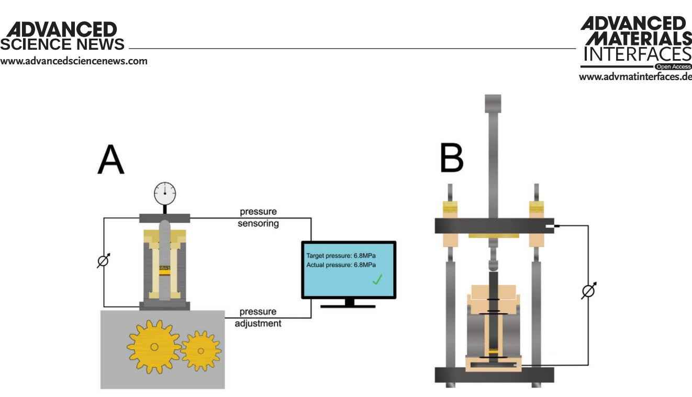
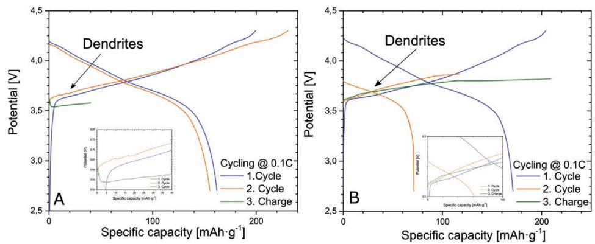
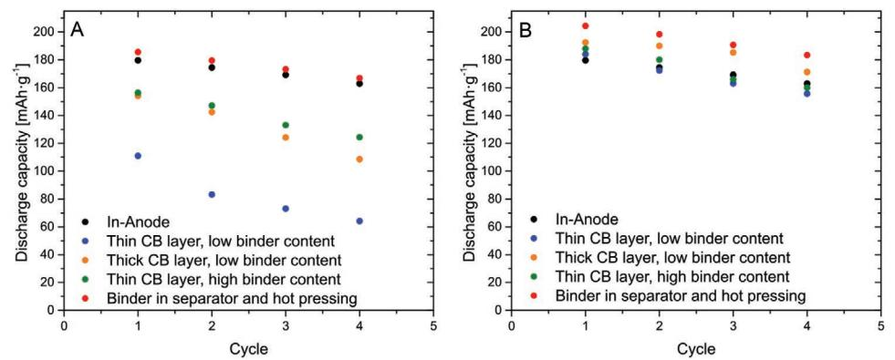
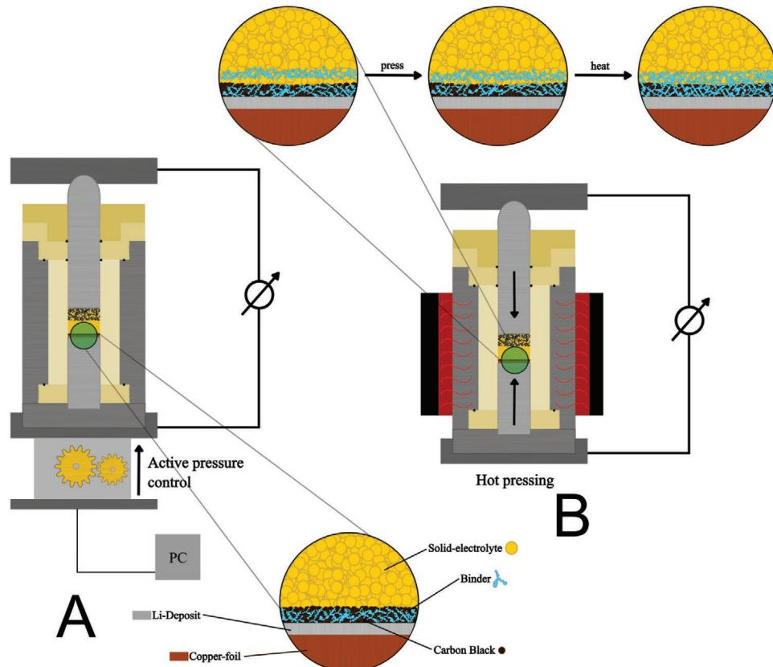

# **Deposition-Type Lithium Metal All-Solid-State Batteries: About the Importance of Stack-Pressure Control and the Benefits of Hot Pressing during Initial Cycling**

*Marvin Cronau, Marvin Szabo, Diemo Renz, Marc Duchardt, Lars Pateras Pescara, and Bernhard Roling\**

**The concept of using metallic lithium as anode material offers great potential for increasing the energy density of lithium-ion batteries (LIBs). However, the ubiquitous formation of dendrites during lithium plating has prevented this so far. This is also true for all-solid-state batteries (ASSBs), for which dendrite formation has been observed particularly at high stack pressures and high current densities. An evolving and very promising strategy for suppressing dendrite formation is the usage of a thin carbon layer on the anode side, referred to as deposition-type lithium metal anode. Here, it is shown that for ASSBs with carbon-based deposition-type anodes of this type, the discharge capacity can be significantly increased by either: i) active stack pressure control; or by ii) hot pressing of binder-containing anode and separator. High discharge capacities exceeding 190 mAh g−1 are achieved at room temperature without using any expensive elements (thiophosphate-based solid electrolyte, Ni-rich NMC cathode active material). This observation points to the importance of ensuring good mechanical contact between the depositiontype anode and the separator during cycling. While approach (i) is readily applicable for lab-scale batteries, approach (ii) should be a promising option for future commercial ASSBs.**

## **1. Introduction**

The development of batteries with increased energy densities and higher safety has become one of the main current research areas with the aim to open up the way for battery-powered electric mobility with zero CO2 emissions.[1] Despite the achievements in the optimization of lithium-ion batteries (LIBs)

E-mail: roling@staff.uni-marburg.de

#### **DOI: 10.1002/admi.202202475**

during the last decade, all-solid-state batteries (ASSB) are currently considered as the most promising type of next-generation batteries.[2] The usage of solid electrolytes (SE), which are, on the one hand, non-flammable and, on the other hand, prevent the growth of lithium dendrites, would indeed lead to enhanced energy density and safety as compared to state-ofthe-art LIBs.[2] However, it has turned out that most solid electrolytes are not capable of effectively preventing lithium dendrite growth.[3–10] In particular, when high stack pressures are applied to ASSBs during cycling and at high current densities, dendrite growth, and short-circuiting of ASSB cells has been observed.[11,12]

Several strategies for suppressing dendrite growth were published in the literature. One strategy is the densification of the SE separator layer between anode and cathode through an optimized sintering step.[13] The usage of electrolytes which react with metallic lithium to form a stable interphase layer has also proven

successful, as did the application of an asymmetric stack pressure design for ASSB cycling.[14,15] Specifically, the usage of a Li10GeP2S12 solid electrolyte separator layer, which forms no stable interphase in contact to metallic lithium, sandwiched between two Li5.5PS4.5Cl1.5 solid electrolyte separator layers, which do form stable interphases, enabled high current densities without producing short circuits, even after 10 000 cycles.[16] In this case, Li dendrite growth was prevented via Li dendrite decomposition in the Li10GeP2S12 layer and via filling of the cracks in the separator layers by the decomposition products.[16] Another interesting approach to suppress lithium dendrite formation is the application of a mixed conductive layer consisting of Li3N and Cu onto the anode side.[17] One of the bestperforming ASSB cells was published by Lee et al. in 2020.[18] This battery was based on a so-called deposition-type anode with a layer of silver and carbon nanoparticles deposited onto a Cu current collector.[6] During charging of the ASSB, metallic lithium was plated preferentially between the current collector and the silver/carbon layer, and lithium dendrite growth was strongly suppressed. It was shown that a thin layer of carbon black without silver particles is also capable of suppressing

M. Cronau, M. Szabo, D. Renz, M. Duchardt, L. P. Pescara, B. Roling Department of Chemistry and Center for Materials Science (WZMW) University of Marburg Hans-Meerwein-Strasse 4, 35032 Marburg, Germany

The ORCID identification number(s) for the author(s) of this article can be found under https://doi.org/10.1002/admi.202202475.

© 2023 The Authors. Advanced Materials Interfaces published by Wiley-VCH GmbH. This is an open access article under the terms of the Creative Commons Attribution License, which permits use, distribution and reproduction in any medium, provided the original work is properly cited.

**Figure 1.** A) Illustration of active pressure control change during cycling of a deposition type Li-metal ASSBs and B) illustration of the ASSB cell setup without active pressure control.

lithium dendrite growth.[19] The mechanism behind this suppression effect has not yet been clarified.

#### **2. Results and Discussion**

In this work, we study the influence of: i) active stack pressure control; and of ii) different preparation methods, such as hotpressing for the anode layer and the neighboring sulfide-based SE separator layer, on the discharge capacity of ASSBs with deposition-type carbon black-based anodes. The study focuses on the initial charging/discharging cycles, during which the deposition-type anode plays an important role for the achievable discharge capacity. Our results suggest that a good mechanical contact between the deposition-type anode layer and the separator layer is an important prerequisite for a high discharge capacity of ASSBs. While in the case of lab-scale ASSBs, this is achievable by active stack pressure control, improved layer preparation methods are more promising for future commercial ASSBs. In this study, active stack pressure control is achieved by using a *CompreDrive* measurement system (rhd instruments). This system measures pressure changes and corrects them automatically through a motor and a very fine gearbox. **Figure 1**A shows a schematic illustration of the active pressure control system. In the measurements without active pressure control, a well-defined initial pressure is applied to the cell before starting the cycling, while during cycling, pressure changes due to volume changes of the active materials are not compensated. This setup is illustrated in Figure 1B.

Single-crystalline LiNi0.83Mn0.06Co0.11O2 (sc-NMC, MSE-Supplies) was used as an active material for the cathode without any additional coating, and glass-ceramic Li5.3PS4.3ClBr0.7 (gc-LPSClBr) was used as solid electrolyte (SE).[3] This glass ceramic exhibits a high ionic conductivity of about 5 mS cm−1 at low stack pressures (Figure S1, Supporting Information) and is characterized by a high long-term stability.[20–22] The composite cathode was prepared by manual mixing of sc-NMC, gc-LPSClBr, and vapor-grown carbon fibers in a weight ratio of 70:30:3. On the anode side, a thin film composed of carbon black (CB) particles was deposited onto a copper current collector foil by means of a doctor-blading process with PVDF binder. The separator layer between anode and cathode was composed of gc-LPSClBr powder pellet containing no binder.

In a first step, two benchmark cells were prepared, in which the CB-based anode was either replaced by a lithium foil or in which metallic lithium was deposited onto the copper current collector during the first charging process. For these benchmark cells, indication for dendrite growth is observable already during the second charge cycle, In the case of an ASSB with a lithium foil anode (**Figure 2**A), dendrite growth manifests in potential fluctuations around 3.6 V, while in the case of lithium deposition onto a Cu current collector (Figure 2B), the charge curves in the second and third cycle do not reach the cutoff potential. Similar results were obtained by several other groups in similar experiments.[11,12]

In **Figure 3**A,B, we show charge/discharge curves for an ASSB with a CB-based deposition-type anode. The CB layer exhibits a thickness of 8 µm and is composed of CB particles with an average diameter of 40 nm. In the case of this ASSB, no indication for dendrite growth is found in the charge/discharge curves. However, without active pressure control (Figure 3A), the overpotential observed during charging increases strongly over the first four cycles and, accordingly, the discharge capacity drops strongly. Under active pressure control, on the other hand, the overpotentials during charging are much more stable, and the discharge capacity drop during the four cycles is much weaker (Figure 3B).

In Figure 3C,D, we show results for an ASSB, in which the deposition-type anode was thicker (20 µm) and was composed of larger CB particles (120 nm diameter). The charge/discharge curves of this ASSB are similar to those in Figure 3A,B, but the increase in the charging overpotential and the drop of the

**Figure 2.** Charge–discharge curves of benchmark ASSBs with A) lithium foil anode and B) lithium deposition onto the Cu current collector during charging. Cycling was carried out under active pressure control. Dendrite formation and growth takes place already during the second charging and leads to a strong reduction of the charging potential during the third cycle.

discharge capacity over the first four cycles is slightly weaker in the case of the thicker anode.

In Figure 3E,F, charge/discharge curves for an ASSB are shown, in which the PVDF binder content of the depositiontype anode was increased from 9 wt% to 19 wt%. Without active pressure control, the higher binder content leads to a reduction of the charging overpotentials and to enhanced discharge capacities. However, there is still a significant increase in the charging overpotentials and a significant drop of the discharge capacity over the first four cycles. By means of active pressure control, the discharge capacity loss can again be strongly reduced.

The positive effect of active pressure control suggests that the discharge capacity loss is related to mechanical contact problems emerging during cycling. While active pressure control is feasible in the case of lab-scale ASSBs, it is not a desirable option for commercial ASSBs. Therefore, it is important to achieve a high mechanical stability of all layers inside ASSBs without active pressure control.

In Figure 3G,H, we show results for an ASSB, in which an additional PVDF binder-containing separator layer was added between the deposition-type anode and the separator powder pellet. Furthermore, a hot pressing step at 80 °C and 6.8 MPa was carried out. The charge/discharge curves without applying active pressure control (Figure 3G) show an almost constant charging overpotential during the first four cycles and a very weak drop of the discharge capacity. In this case, additional active pressure control yields virtually no improvement of the discharge capacity (Figure 3H). These results give a strong indication that the strong discharge capacity drops in Figure 3A,C,E are caused to a large extent by poor mechanical contacts between the CB-based deposition-type anode and the separator powder pellet. A possible origin of the residual capacity loss in Figure 3G might be related to the composite cathode pellet. In order to test this, another benchmark ASSB with an In anode was built. As known from the literature, the contribution of In anodes to capacity loss of ASSBs is very weak.[23] The benchmark cell was cycled with an applied stack pressure of 98 MPa. The results obtained for the discharge capacity of this benchmark ASSB together with the results for the ASSBs described above are compiled in **Figure 4**. Without active pressure control, the In-anode based ASSB shows discharge capacities very similar to those of the ASSB after hot pressing. This indicates that the residual discharge capacity loss of these ASSBs is indeed related to the composite cathode powder pellet, which is not in the focus of this work.

## **3. Conclusion**

In summary, we have shown that ASSBs with CB-based deposition-type anodes exhibit increasing charging overpotentials and decreasing discharge capacities over the first cycles, if the separator layer and the cathode are powder pellets and if no active pressure control is applied. Upon application of active pressure control, the discharge capacity drop becomes much weaker, pointing to mechanical contact issues emerging during cycling (**Figure 5**A). The mechanical stabilization of the anode|separator interface by adding a thin binder-containing separator layer followed by a hot pressing step strongly reduces the discharge capacity drop even without active pressure control (Figure 5B). This suggests that poor mechanical contacts between the deposition-type anode and the separator layer are to a large extent responsible for the initial discharge capacity drop of this type of ASSB. Overall, we achieve high discharge capacities at room temperature and under low applied stack pressures without using any expensive materials in our ASSBs. The hot-pressing step should thus be a viable option for commercial deposition-type ASSBs, for which active pressure control is not a feasible option. Apart from the optimization of the anode|separator interface, a better understanding of the lithium deposition and stripping mechanisms inside deposition-type anodes is of paramount importance for the future development of this type of all-solid-state batteries.

#### **4. Experimental Section**

*Preparation of Solid Electrolyte Powder via High-Energy Dry Milling (HDM)*: For the synthesis of gc-Li5.3PS4.3ClBr0.7 (LPSCLBr0.7), the starting materials LiCl (99.9%, Sigma Aldrich), Li2S (99.99%, Sigma Aldrich), P2S5 (99%, Sigma Aldrich) and LiBr (99.9%, Sigma Aldrich) in a molar ratio of 1:3.6:0.5:0.7 were filled into a zirconia grinding bowl with a volume of 20 mL. The mixture was milled with 10 zirconia balls

**www.advmatinterfaces.de**

**Figure 3.** Charge/discharge curves of deposition-type lithium anode ASSBs without (left side) and with (right side) active pressure control.

(*Ø* = 10 mm) using a Pulverisette 7 premium line (Fritsch) at 850 rpm for 8.25 h (HDM = high-energy dry milling). Subsequently, the milled solid electrolyte (SE) powder was ground in an agate mortar to obtain the final product.

*Reduction of Solid Electrolyte Particle Size via Low-Energy Wet Milling (LWM)*: The gc-LPSClBr0.7 powder was filled into the same zirconia grinding bowl as used for the HDM step for a following low-energy wet milling step (LWM) step. To this end, zirconia grinding balls with a diameter of 1 mm

**Figure 4.** Discharge capacity versus cycle number for all cells A) without active pressure control and B) with active pressure control.

(30 g) were used. A mixture of heptane (4.0 mL) and dibutyl ether (0.8 mL) was added to the bowl. The mixture was milled at 200 rpm for 60 min. The resulting suspension was sifted through an analysis sieve (Retsch) and subsequently dried under vacuum to obtain the final product.

*Preparation of SE Binder Layer*: For the preparation of the SE binder layer, gc-LPSClBr0.7 and hydrogenated nitrile butadiene rubber (H-NBR) were used in a weight ratio of 97:3. Hydrogenated nitrile butadiene rubber (H-NBR) was dissolved into *p*-xylene (1 mL) and mixed with LPSClBr0.7 in an agate mortar to obtain the SE binder slurry. The viscosity was regulated via addition of *p*-xylene. A continuous SE binder layer was obtained by casting the SE binder slurry onto a polymer foil, on which the slurry was homogeneously distributed by means of a doctor blade. The SE binder layer was then dried in glovebox atmosphere, and subsequently, discs with 12 mm diameter were cut out of the layer.

*Preparation of Composite Cathodes*: The cathode composite powder was prepared by mixing gc-LPSClBr0.7 with single crystalline NMC83 particles (MSE Supplies) and carbon nanofibers (Nanografi) in an agate mortar in a weight ratio of 30:70:3.

*Preparation of Carbon Black Anode*: The slurries for preparing the deposition-type anodes were obtained by dissolving carbon black (CB) and polyvinylidene fluoride in different weight ratios (91:9, 81:19) in *N*-methyl-2-pyrrolidone-based (NMP, 99,5%, Sigma Aldrich). Carbon black particles with two different sizes (Super C65, *D* < 50 nm, MSE Supplies and Super C45, *D* = 100–200 nm, MSE supplies were used for obtaining thin and thick CB layers, respectively. First, the PVDF binder was dissolved in NMP at 40°°C, then carbon black was added gradually under mixing by means of a dispenser (IKA). The resulting slurry was then casted onto a copper foil with a thickness of 100 µm by means of a ZAA

**Figure 5.** Different strategies for improving the mechanical contacts inside an ASSB with a deposition-type anode. A) Active pressure control and B) hot pressing.

2300 automatic film applicator (Zehntner). The foils were dried over night at 80 °C under air atmosphere and then transferred into an argon-filled glovebox (MBraun). There the films were compacted by using a hot rolling press (MTI Corporation) and cut into discs of 10 and 12 mm, respectively.

*Fabrication of All-Solid-State Batteries (ASSBs) and Galvanostatic Cycling*: For the fabrication of the solid electrolyte separator of the ASSB, 60 mg of gc-LPSClBr0,7 was filled into the polyether ether ketone (PEEK) tubing of the measuring cells, and a pressure of 294 MPa was applied for 60 s. For fabricating the separator, gc-LPSClBr0,7 with a large particle size was used directly after the HDM synthesis. Subsequently, 13 mg of the cathode composite was spread onto one face of the SE separator layer, and both layers were pressed at 392 MPa for 120 s. The anode material (carbon blackbased deposition type or Cu foil or In sheet) was deposited onto the other face of the separator layer, and the resulting ASSB stack was densified at a pressure of 392 MPa. The galvanostatic cycling experiments were carried out at ambient temperature (25 °C) and under an applied stack pressure of 98 MPa in case of the In anode and under an applied stack pressure of 6.8 MPa in the case of the Cu anode and the deposition-type anode. In case of the In anode, the cut-off potentials for cycling were chosen as 3.7 and 2.2 V, respectively, and in case of the Cu anode and the deposition-type anode, the potentials were chosen as 4.3 and 2.7 V, respectively.

*Fabrication of ASSB with Additional SE-Binder Layer*: For the fabrication of the ASSB with additional SE-binder layer, the fabrication was carried out as described before. However, before spreading the carbon black anode onto the SE separator, a SE-binder disc was placed onto the SE separator, and the cathode|SE separator|SE-binder stack was densified at a pressure of 392 MPa. Then the deposition-type anode was spread onto the SE-binder layer. Finally, a pressure of 6.8 MPa was applied.

*Hot Pressing Procedure*: For the hot-pressing step, the ASSBs inside the cell holders were transferred into an oven, which was preheated to 80 °C. After 30 min, the cells were removed from the oven and cooled down to room temperature.

# **Supporting Information**

Supporting Information is available from the Wiley Online Library or from the author.

# **Acknowledgements**

M.C. and M.S. contributed equally to this work. Open access funding enabled and organized by Projekt DEAL.

# **Conflict of Interest**

The authors declare no conflict of interest.

# **Data Availability Statement**

Research data are not shared.

#### **Keywords**

all-solid-state battery, deposition-type anode, stack pressure

Received: December 15, 2022 Published online: February 3, 2023

- [1] Y.-S. Hu, *Nat. Energy* **2016**, *1*, 16042.
- [2] J. Janek, W. G. Zeier, *Nat. Energy* **2016**, *1*, 16141.
- [3] M. Cronau, M. Szabo, B. Roling, *Mater. Adv.* **2021**, *2*, 7842.
- [4] P. Adeli, J. D. Bazak, K. H. Park, I. Kochetkov, A. Huq, G. R. Goward, L. F. Nazar, *Angew. Chem., Int. Ed.* **2019**, *131*, 8773.
- [5] S. P. Culver, A. G. Squires, N. Minafra, C. W. F. Armstrong, T. Krauskopf, F. Böcher, C. Li, B. J. Morgan, W. G. Zeier, *J. Am. Chem. Soc.* **2020**, *142*, 21210.
- [6] X. Feng, P.-H. Chien, Y. Wang, S. Patel, P. Wang, H. Liu, M. Immediato-Scuotto, Y.-Y. Hu, *Energy Storage Mater.* **2020**, *30*, 67.
- [7] N. Kamaya, K. Homma, Y. Yamakawa, M. Hirayama, R. Kanno, M. Yonemura, T. Kamiyama, Y. Kato, S. Hama, K. Kawamoto, A. Mitsui, *Nat. Mater.* **2011**, *10*, 682.
- [8] M. A. Kraft, S. Ohno, T. Zinkevich, R. Koerver, S. P. Culver, T. Fuchs, A. Senyshyn, S. Indris, B. J. Morgan, W. G. Zeier, *J. Am. Chem. Soc.* **2018**, *140*, 16330.
- [9] S. V. Patel, S. Banerjee, H. Liu, P. Wang, P.-H. Chien, X. Feng, J. Liu, S. P. Ong, Y.-Y. Hu, *Chem. Mater.* **2021**, *33*, 1435.
- [10] L. Zhou, A. Assoud, Q. Zhang, X. Wu, L. F. Nazar, *J. Am. Chem. Soc.* **2019**, *141*, 19002.
- [11] J.-M. Doux, H. Nguyen, D. H. S. Tan, A. Banerjee, X. Wang, E. A. Wu, C. Jo, H. Yang, Y. S. Meng, *Adv. Energy Mater.* **2020**, *10*, 1903253.
- [12] M. B. Dixit, N. Singh, J. P. Horwath, P. D. Shevchenko, M. Jones, E. A. Stach, T. S. Arthur, K. B. Hatzell, *Matter* **2020**, *3*, 2138.
- [13] G. Liu, W. Weng, Z. Zhang, L. Wu, J. Yang, X. Yao, *Nano Lett.* **2020**, *20*, 6660.
- [14] M. Takahashi, T. Watanabe, K. Yamamoto, K. Ohara, A. Sakuda, T. Kimura, S. Yang, K. Nakanishi, T. Uchiyama, M. Kimura, A. Hayashi, M. Tatsumisago, Y. Uchimoto, *Chem. Mater.* **2021**, *33*, 4907.
- [15] C. Doerrer, I. Capone, S. Narayanan, J. Liu, C. R. M. Grovenor, M. Pasta, P. S. Grant, *ACS Appl. Mater. Interfaces* **2021**, *13*, 37809.
- [16] L. Ye, X. Li, *Nature* **2021**, *593*, 218.
- [17] H. Huo, Y. Chen, R. Li, N. Zhao, J. Luo, J. G. Da Pereira Silva, R. Mücke, P. Kaghazchi, X. Guo, X. Sun, *Energy Environ. Sci.* **2020**, *13*, 127.
- [18] Y.-G. Lee, S. Fujiki, C. Jung, N. Suzuki, N. Yashiro, R. Omoda, D.-S. Ko, T. Shiratsuchi, T. Sugimoto, S. Ryu, J. H. Ku, T. Watanabe, Y. Park, Y. Aihara, D. Im, I. T. Han, *Nat. Energy* **2020**, *5*, 299.
- [19] N. Suzuki, N. Yashiro, S. Fujiki, R. Omoda, T. Shiratsuchi, T. Watanabe, Y. Aihara, *Adv. Energy Sustainable Res.* **2021**, *2*, 2100066.
- [20] M. Cronau, M. Szabo, C. König, T. B. Wassermann, B. Roling, *ACS Energy Lett.* **2021**, *6*, 3072.
- [21] J. H. Teo, F. Strauss, F. Walther, Y. Ma, S. Payandeh, T. Scherer, M. Bianchini, J. Janek, T. Brezesinski, *Mater. Futures* **2022**, *1*, 015102.
- [22] S. Wang, W. Zhang, X. Chen, D. Das, R. Ruess, A. Gautam, F. Walther, S. Ohno, R. Koerver, Q. Zhang, W. G. Zeier, F. H. Richter, C.-W. Nan, J. Janek, *Adv. Energy Mater.* **2021**, *11*, 2100654.
- [23] A. L. Santhosha, L. Medenbach, J. R. Buchheim, P. Adelhelm, *Batteries Supercaps* **2019**, *2*, 524.