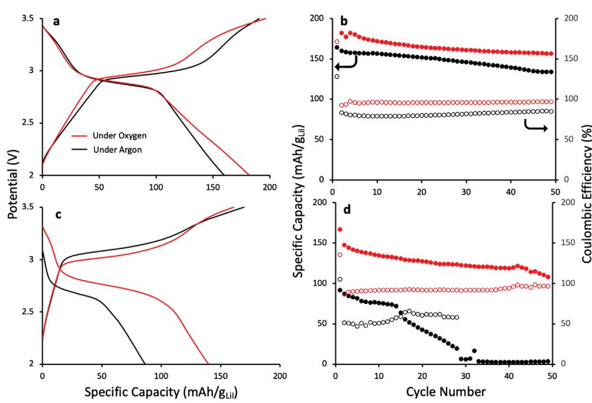
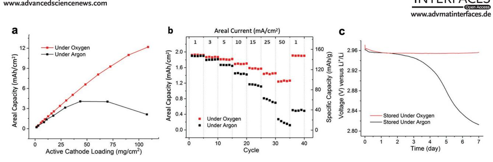
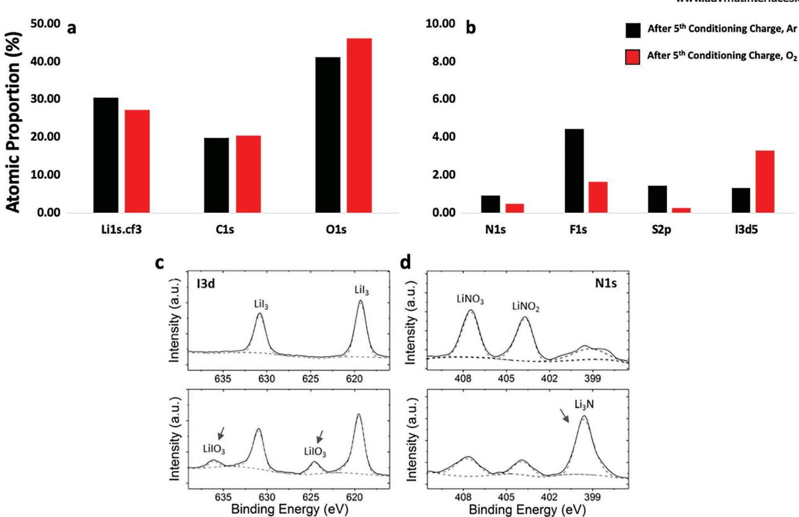
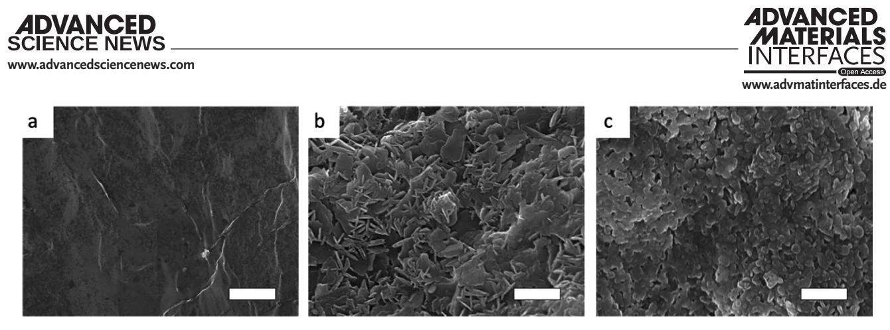

# **Oxygen Assisted Lithium-Iodine Batteries: Towards Practical Iodine Cathodes and Viable Lithium Metal Protection Strategies**

*Maxwell J. Giammona,\* Jangwoo Kim, Yumi Kim, Phillip Medina, Khanh Nguyen, Holt Bui, Gavin O. Jones, Andy T. Tek, Linda Sundberg, Anthony Fong, and Young-Hye La\**

**Rechargeable batteries with iodine-based cathodes have recently been the subject of significant interest due to the moderately high theoretical specific energy (≈600 Wh kg−1 ) and high-rate capability (>5 C) of the iodine cathode. Progress however has been impeded by the relatively low iodine contents of reported iodine-based cathodes. This is likely due to high rates of polyiodide shuttling and cell instability that takes place at higher cell loadings. To reinforce the lithium metal anode, oxygen gas is introduced in the cells, which leads to a more robust solid-electrolyte interphase (SEI) layer, improving cell stability. This oxygen-assisted lithium-iodine (OALI) battery overcomes many of the shortcomings of other reported lithium-iodine batteries by utilizing a simple to fabricate lithium iodide (LiI) on activated carbon cathode with cell operating under an oxygen containing atmosphere to realize high-rate capability (>50 mA cm−2) and high areal capacity (>12 mAh cm−2).**

## **1. Introduction**

Driven by the gradual electrification of the global vehicle fleet and the decreasing costs of both batteries themselves, and intermittent sources of clean, renewable energy such as wind and solar, demand for electrochemical energy storage has

M. J. Giammona, J. Kim, Y. Kim,[+] P. Medina,[++] K. Nguyen, H. Bui,

G. O. Jones, A. T. Tek, L. Sundberg, A. Fong, Y.-H. La

IBM Research-Almaden 650 Harry Road, San Jose, CA 95120, USA

E-mail: maxwell.giammona@ibm.com; yna@us.ibm.com

The ORCID identification number(s) for the author(s) of this article can be found under https://doi.org/10.1002/admi.202300058.

© 2023 The Authors. Advanced Materials Interfaces published by Wiley-VCH GmbH. This is an open access article under the terms of the Creative Commons Attribution License, which permits use, distribution and reproduction in any medium, provided the original work is properly cited.

[+] Present address: Rivian Automotive, 607 Hansen Way, Palo Alto, CA 94304, USA

[++] Present address: Sidus Energy, 680 N McCarthy Blvd #120, Milpitas, CA 95035, USA

#### **DOI: 10.1002/admi.202300058**

rapidly increased and is expected to continue to grow significantly in the coming decades. In just the next 5–10 years, battery demand is expected to increase from 183 GWh in 2018 to 2623 GWh in 2030.[1,2] Simultaneously, after over 30 years of optimization and improvement we are widely understood to be approaching the theoretical performance limits of the current set lithium-ion cell chemistries which dominate applications ranging from small electronics to large stationary storage installations.[3,4] To continue to accelerate the transition of our energy systems away from fossil fuels, new and higher performing battery chemistries are needed to meet the demands of tomorrow's global economy.

Rechargeable batteries based on conversion chemistries have the potential

to provide an alternative to the lithium-ion batteries currently being used to satisfy much of the world's demand for portable energy storage. Lithium–sulfur (Li–S), lithium–oxygen (Li–O2), and lithium–iodine (Li–I2) batteries are all examples of chemistries which follow a chemical conversion, rather than an ion intercalation mechanism. Conversation chemistries have been reported to outperform existing Li-ion intercalation chemistries across several metrics such as energy density in the case of Li–S and Li–O2 batteries, and rate capability in the case of Li–I2 batteries however, it has been difficult to develop devices based on these chemistries to meet all the performance requirements needed in a commercial product. Li–S and Li–O2 batteries, have attracted considerable attention for their high theoretical energy density, but continue to face serious obstacles to achieving high power density, high energy efficiency, and long cycle life due to sluggish reaction kinetics, low conductivity of active materials and discharge products, and various parasitic reactions.[5–10] Li–I2 batteries by contrast, exhibit high-rate capability and long cycle lives, but cells with cathode loadings (active material wt% and areal loading) sufficient to provide energy densities for practical applications have yet to be realized despite iodine's moderately high specific capacity (211 mAh g−1 ).[11–15] Several barriers to increasing the loading and utilization of the iodine cathode have been identified. Active material species including iodine, lithium triiodide, and lithium iodide are all electrolyte

soluble and can diffuse away from the cathode during cell operation leading to electron shuttling and self-discharging side reactions between the dissolved active material and lithium metal anode.[16–18] These processes can cause deterioration of the solid-electrolyte interphase (SEI) on the anode and increase cell resistance, thereby reducing overall cell performance. To address these issues, solid electrolytes have been used, for example in the Li–I2 batteries commonly used in pacemakers; however, fundamental rate limitations of ion transport in solid electrolytes as well as the high resistance of the LiI discharge product have limited their use beyond primary batteries applications with low rates requirements.[19]

Several strategies have also been investigated to improve the performance of rechargeable, liquid electrolyte-based, Li–I2 batteries. For example, lithium nitrate (LiNO3) has been employed as an additive in an aprotic liquid electrolyte to form a protective passivation layer on the surface of lithium anode.[18] Combining this with structurally and chemically sophisticated heteroatom (O, N, P) doped porous carbon structures to increase the iodine adsorption capacity and coordination strength of the cathode has provided a viable way to alleviate some of the negative effects of cathode dissolution on cell performance.[12,20,21] Despite these advances, most Li–I2 batteries reported in the literature continue to use low absolute (1–2 mg cm−2) and relative (40–50% of total cathode weight, excluding current collector) active material loadings. For iodine batteries to be made practical, these aspects of the cathode need to be improved without sacrificing other performance characteristics.

In this work we demonstrate that one of the chief reasons for the electron shuttling reactions and cell instability in Li–I2 cells with high active material loading is the low stability of the lithium metal SEI layer even when LiNO3 is present as a passivating additive. We further demonstrate that via the direct injection of oxygen gas a more robust SEI layer consisting of lithium oxide, lithium iodate, and lithium nitride can be formed which meaningfully stabilizes the lithium against shuttling by charged iodine species, allowing high areal loadings of the active cathode material (>10 mg cm−2 , >60 wt% LiI) with outstanding rate performance. We also demonstrate that a version of this effect can be achieved simply by sealing the cells under an atmosphere of clean-dry air which could potentially simplify manufacturing of both iodine batteries specifically and batteries with lithium-metal anodes more generally.

## **2. Results and Discussion**

The benefits of using lithium iodide as an additive and redox mediator to decrease the overpotential and facilitate the decomposition of the Li2O2 discharge products in Li–O2 batteries has been the subject of much research and discussion; however, lithium iodide has not been successful on its own in facilitating a viable Li–O2 battery.[22–24] The reverse case however, the effect of oxidizing gases on other chemistries, has been less studied however, there have been a few studies looking at the effects of oxidizing gasses on the anode plating in lithium metal batteries more generally.[25,26] Moon et al. showed in lithium– lithium symmetrical cells that the long-term stability could be significantly improved and overpotential reduced by including gaseous SO2 in a 1 m LiPF6/TEGDME electrolyte and further showed that this benefit translates to a full cell with an LiCoO2 cathode.[25] Additionally, Wang et al. showed that by plating lithium under O2, N2, and O2/N2, plating efficiency goes up relative to plating under an argon atmosphere despite many previous reports suggesting additional lithium protection is required for plating in the presence of O2 gas.[26]

#### **2.1. Iodine Conversion Reactions Under Different Environmental Conditions**

To evaluate the efficacy of performing iodine electrochemical reactions under different atmospheric conditions, cyclic voltammetry (CV) was carried out on cells cycled under argon (black) and oxygen (red) with 60 wt% LiI and 10 mg cm−2 in the carbon composite cathode coated onto stainless steel foil (**Figure 1**a). The CVs under both conditions clearly show the iodide to triodide conversion at ≈3.0 V and the triiodide to iodine conversion at ≈3.4 V in the oxidation scan and the reverse reactions at ≈2.7 and 3.2 V on the redution scan, which is well aligned with the two-step conversion mechanism

**Figure 1.** a) Cyclic voltammograms for LiI cells cycled under argon (black) and oxygen (red). Cells contain 60 wt% and 10 mg cm−2 LiI cathode coated onto stainless-steel foil. b) DEMS measurement of oxygen consumption during the first charge and discharge of a LiI cell cycled under oxygen and c) oxygen consumption during the first 10 cycles.

**Figure 2.** a,c) Charge and discharge curves collected from the 10th cycle and b,d) cycling and Coulombic efficiency data over the first 50 cycles for cells cycled under argon (black plots) and oxygen (red plots) - solid circles: specific capacity (mAh gLiI−1 ), open circles: Coulombic efficiency. The cells contain cathodes coated onto stainless-steel foil, and the cathodes were dosed to 40 wt% (a,b) ≈5 mg cm−2) and 60 wt% (c,d) 10 mg cm−2) lithium iodide, respectively.

reported by previous Li–I2 studies (step 1: 3LiI ↔ LiI3 + 2Li+ + 2e−, step 2: 2LiI3 ↔ 3I2 + 2Li+ + 2e−).[14,18] Raman spectroscopy performned on cathodes at various states of charge (SOC) also verified this reaction mechanism (Figure S1, Supporting Information). It is noticeable that the ratio of the peak current under argon is slightly higher than that under oxygen for the oxidation scan. This is likely due to increased polyiodide shuttling reactions taking place under argon that do not take place under oxygen leading to higher overall peak currents, but which would not contribute to the useable capacity. This interpretation is further supported by the galvanostatic cycling data shown in **Figure 2**c which shows significantly lower coulombic efficency efficiency in cells with cells with cathodes containing 60% (10 mg cm−2) of LiI cycled under argon (≈50%), compared to O2 (>90%).

In situ oxygen pressure monitoring of a LiI battery operated under oxygen (oxygen-assisted LiI battery: OALI battery) was performed via differential electrochemical mass spectrometry (DEMS) at a current density of 1 mA cm−2 as shown in Figure 1b. A small amount of oxygen consumption (≈0.06 µmol cm−2) was detected during charge in the 1st cycle with only a very small amount of baseline oxygen consumption occurred during discharge (Figure 1b). As a comparison a similarly prepared Li–O2 battery consumed ≈38 µmol cm−2 during discharge (Figure S2, Supporting Information). The oxygen consumption of the OALI battery during discharge was negligible by comparison and during charge was small and decreased with the increasing number of cycles (Figure 1c). Since minimal oxygen is consumed or evolved once the cell reaches steady state after several cycles, the OALI cell can be operated as a closed, hermetically sealed cell with a fixed initial charge of oxygen.

#### **2.2. Electrochemical Performance of OALI Batteries**

To understand the function of oxygen in the OALI battery, pairs of cells were assembled inside an argon-filled glovebox (<0.1 ppm O2, <0.1 ppm H2O). Following assembly, one of the two cells was evaluated after being purged with oxygen at 0.5 bar gauge pressure. Two different cathode conditions with one utilizing a cathode of 40–45% LiI by weight (≈5 mg cm−2 ) and another with about 60–65% LiI by weight (≈10 mg cm−2 ) hereafter referred to as the "low loading" and "high loading" conditions. Figure 2 directly compares the performance of cells prepared with argon versus oxygen atmospheres under the "low loading" and "high loading" conditions. Each cell underwent a "conditioning" period of cycling for 10 cycles at 0.5 mA cm−2 during which the SEI layer is formed and are subsequently cycled at 1 mA cm−2 . Charge–discharge curves collected from cycle 1 at a current density of 1 mA cm−2 with cells having a low-loading cathode are shown in Figure 2a,b, respectively along with Coulombic efficiency and corresponding cycling performance data. Data collected under similar conditions but, with a high-loading cathode are shown in Figure 2c,d. It is noteworthy that the cells operated under oxygen (OALI batteries) have significantly higher discharge capacity and better Coulombic efficiency than the identical cells operated under argon. For the cells with cathodes having low LiI loading (40 wt% and 5 mg cm−2 ), the performance under argon is consistent with previously reported Li–I batteries,[14,18] but both capacity and efficiency slightly increases when the cells are cycled under oxygen. The performance enhancement by oxygen is more substantial at high cathode loading (60 wt%, 10 mg cm−2) where most previous lithium–iodine batteries have shown poor capacity and cycle life.[16,18] In Figure 2d, for example, while the

**Figure 3.** a) The areal capacity of cells with different (absolute) active cathode loading all at 70 wt% LiI on carbon cloth, b) rate performance of cells with an active cathode (LiI) loading of ≈10 mg cm−2, c) voltage profiles of cells over the 7-d resting (black curve: under argon, red curves: under oxygen).

argon cell capacity drops to zero after a few tens of cycles, the OALI cell capacity remains operational for the duration of the experiment. The discharge overpotentials of the OALI cells are consistently lower than cells operated under argon atmosphere, with a much less significant increase in charge overpotentials as you move from low to high loading (Figure 2a,c), demonstrating that the OALI cells possess better voltaic, coulombic, and overall energy efficiency.

By switching to a more gas permeable current collector, such as carbon cloth, even higher levels of active cathode loading are possible for OALI batteries however, oxygen reduction reaction (ORR), a typical discharge reaction of a Li–O2 battery (O2 + 2Li+ + 2e− → Li2O2) was detected at the CV curves of these cells at ≈2.5 V (Figure S3, Supporting Information). To avoid this side reaction, the cells were cycled within a narrower voltage range (2.7–3.5 V), maintaining a cut-off discharge potential higher than onset potential of the ORR. **Figure 3**a shows the specific capacity of cells with increasing absolute cathode loadings, all with 70 wt% LiI in the cathode on carbon cloth. While our cells operated under argon show poor areal capacities at high loading of active cathode materials, OALI cells demonstrate nearly proportional improvement in the areal capacity as the active cathode loading increases with a capacity almost 8 times higher than the identical cell operated under argon at the highest loading of 110 mg cm−2 (12 mAh cm−2 for the OALI cell vs 2.8 mAh cm−2 for the argon cell). Charge–discharge curves and cycle life trajectories for OALI and argon cells with ≈10 and 50 mg cm−2 (both with 70 wt% LiI) are provided in Figure S4 in the Supporting Information, revalidating superior performance of OALI cells at high loading conditions.

The OALI cells also demonstrate outstanding rate performance at high LiI loading. Figure 3b shows the rate capability of cells prepared with 70 wt% LiI (10 mg cm−2 ) on a carbon cloth current collector. Although the initial capacity values of OALI cell and an identical cell operated under argon at 1 mA cm−2 are very close (≈1.9 mA cm−2), the capacity difference between these two cells becomes much more significant as the current density increases, resulting in almost 6 times higher capacity for the OALI cell at the current density of 50 mA cm−2. Furthermore, the capacity of OALI cell goes back to its original value when the current density is decreased back to 1 mA cm−2 again, while the argon cell completely fails in recovering its initial capacity. These results support that OALI system is more stable at fast-charging conditions, demonstrating a resilient electrochemical response. In situ monitoring of two cells rested under the two different gas conditions over 7 d at open circuit voltage (OCV) (Figure 3c) shows their distinct electrochemical behaviors under different operating atmospheres, with the OALI cell maintaining a constant potential while the argon cell potential decreases by 0.15 V. The OALI cell stored under oxygen for 7 d at OCV showed virtually no discharge capacity loss (<0.1%) after charge, whereas the cell stored under argon for 7 d suffered a more than 70% loss in capacity with a potential drop of just 0.15 V (Figure S5a, Supporting Information). It is speculated that oxygen assists to protect the anode from slowly deteriorating over time due to the high reactivity of the lithium metal towards the electrolyte and partially dissolved LiI, which is also evident in the electrochemical impedance spectroscopic (EIS) curves (Figure S5b, Supporting Information) which show a significant increase in the impedance of the cell rested under argon, but not in the cell rested under oxygen.

Taken together these data demonstrate how treatment with oxygen is a very effective way to mitigate many of the draw backs of lithium metal batteries with high loading iodine cathodes. The OALI cell has higher absolute and relative loading and better stability and rate capability compared to cells prepared and cycled under argon. Further, our preliminary study shows that using feed gas of pure oxygen is not required to realize the performance enhancement. Zero-air conditions with a 21%/79% oxygen/nitrogen mixture still show similar high-performance to those cycled under pure oxygen although further reduction of oxygen concentrations (1%/99%, 5%/95% O2/N2) results in poor discharge capacities (Figure S6, Supporting Information).

#### **2.3. Chemical and Morphological Characterization of Solid-Electrolyte Interphase Layer**

To elucidate the role of oxygen in the performance enhancement for the OALI battery, chemical and morphological characterizations of the surface of lithium metal anodes were performed by X-ray photoelectron spectroscopy (XPS) and scanning electron microscopy (SEM). XPS atomic compositions of lithium metal anodes cycled 5 times under argon and oxygen (conditioning cycles) are shown in **Figure 4**a,b.

**Figure 4.** XPS characterization of lithium metal anodes cycled under argon and oxygen form cells with cathode loadings of 10 mg cm−2 and 60 wt% lithium iodide. a,b) Shows the atomic compositions of the SEI layers after 5 cycles of conditioning under argon (black) and oxygen (red). c,d) Shows the high resolution I3d and N1s spectra for cells charged under argon (top) and charged under oxygen (bottom).

After 5 cycles, the main differences between anodes cycled under argon and those cycled under oxygen are a reduction in the proportion of species that are present due to electrolyte decomposition such as fluorine and sulfur from the LiTFSI and nitrogen from the LiNO3 and a corresponding increase in the amount oxygen and iodine. The high resolution XPS spectra of I3d (Figure 4c) of the lithium metal anode of the OALI battery in the charged state (bottom row) revealed the presence of iodate (LiIO3) at 636.2 and 624.6 eV in the cell that was cycled under an oxygen atmosphere.[27,28] The result suggest that oxyiodine species are involved in the formation of a stable solidelectrolyte interphase (SEI) layer on the lithium metal surface during the SEI conditioning cycles which is also consistent with the trace amount of oxygen consumed during the first few charging cycles as shown in Figure 1. LiIO3 species have been reported as an efficient ion-conducting component of artificial SEI layers that results in improved performance in lithium-sulfur batteries and in other reports has been found to be involved in the rejuvenation of dead lithium.[27,29]

In addition to the formation of iodates during SEI formation, there was also a notable increase in the amount of nitride observed on the SEI layer during conditioning. While a small reduction in the proportion of nitrogen in the SEI layer is observed between cells cycled under oxygen compared to argon, the high resolution N1s spectrum (Figure 4d) show a marked increase in the intensity of Li–N inorganic moieties (Li3N) at 399.4 eV relative to the nitrate and nitrite peaks during conditioning under oxygen. It has been demonstrated by other research groups that a Li3N-based SEI layer created in the presence of LiNO3 enhances the performance of lithium-iodide batteries.[28]

To better understand the possible mechanism of SEI formation in the OALI system, we performed energetics calculations using the M06-2X density functional theory (DFT) method. Iodate (IO3 −) formation during charging may be accomplished by the reaction of triiodide or iodine with oxygen or via the reaction of both iodine-rich species with the combination of both oxygen and nitrate. All these reactions are predicted to be thermodynamically favorable. Reactions of triiodide or iodine with oxygen alone are favored by 8.74 and 8.50 eV, respectively (Equations 1 and 2). The most energetically favorable reaction was found to be that given in Equation 3, in which iodine, oxygen, and nitrate react to form iodate and nitride releasing +9.45 eV of energy in the process.

$$
I_3^- + 3O_2 + 2e^- \rightarrow 2IO_3^- + I^- + 8.74 \text{ eV}
$$
 (1)

$$
I_2 + 3O_2 + 2e^- \to 2IO_3^- + 8.50 \text{ eV}
$$
 (2)

$$
2I_2 + 3O_2 + 2NO_3^- + 8e^- \rightarrow 4IO_3^- + 2N^{3-} + 9.45 eV
$$
 (3)

To summarize the proposed mechanism of improvement for the OALI battery, the lithium iodide electrochemically converts to lithium triiodide and iodine on the cathode side giving off one lithium ion and one electron per one iodide ion, and the partially

**Figure 5.** Top-down SEM images of the lithium metal anodes: a) pristine state, b) charged under argon, and c) charged under oxygen. (scale bar, 1 µm).

dissolved triiodide and iodine on the surface of the lithium metal anode electrochemically contribute to the formation of iodates and nitrides consuming the lithium ions and electrons being given and the oxygen and the nitrates being present from the beginning. From the high coulombic efficiency (>99%), the minimal loss of capacity during cycling, and the minimal consumption of oxygen during charging, the surface film on the lithium metal anode comprising iodate and nitride moieties it is speculated that the ongoing consumption of oxygen and active LiI material is minimal. This mechanism is supported by both the low oxygen consumption during initial cycles and is shown to be energetically favorable computationally.

SEM images of lithium metal anodes in the charged state after their 1st cycles under different atmosphere (**Figure 5**) show two distinct morphologies with dendritic growth suppressed in the OALI battery. Unlike the cell charged under argon, the OALI battery showed a relatively smooth lithium surface free from dendrites even after 100 cycles (Figure S7, Supporting Information). This is likely due to the robust SEI layer formed on the lithium metal anode in the presence of both iodine and oxygen. Minimal differences were observed in the morphology of the cathode surface in the pristine, charged state, and discharged state. Energydispersive X-ray spectroscopic (EDX) mapping confirmed homogeneous distribution of iodine species on both charged and discharged cathodes (Figure S8, Supporting Information)

#### **3. Conclusion**

Rechargeable battery technology based on both intercalation and conversion chemistry are facing ever more demanding operational requirements of lower cost, higher energy density, faster charging rates, higher output power, and better efficiency for use in emerging applications such as powering electric vehicles (EV). The OALI battery described herein uses no heavy metals such as cobalt and nickel, which, in addition to their high and volatile prices, also pose serious environmental and supply concerns. The OALI battery represents an important step towards overcoming the high threshold in required performance, with a minimal amount of oxygen facilitating the iodide conversion chemistry by reinforcing the SEI layer and producing a protective surface film on the lithium metal anode consisting of LiIO3 and Li3N moieties during charge. This unique SEI layer results in low charge transfer resistance towards the electrolytes, suppression of dendritic growth, and high coulombic efficiency (>99%) by mitigating the effect of shuttling and reducing side reactions. By playing these important roles, oxygen greatly enhances the electrochemical performance of the OALI battery, leading to its high-rate capability (>50 mA cm−2 ) and high cathode loading utilization (>12 mAh cm−2). Based on these results, we are optimistic that the outstanding performance of the OALI battery described here, and the insights gained into the underlying chemistry enabling that performance, point to pathways that will lead to better, safer, and cheaper rechargeable batteries that circumvent many of the intrinsic limitations of the existing technologies.

### **4. Experimental Section**

*Materials and Cell Construction*: To investigate the effect of oxygen gas on iodine cathode batteries multiple different cell stacks were used depending on the needs of individual experiments.

For atmospheric comparison of cells cycled under argon compared to oxygen, Swagelok or modified Swagelok (DEMS) cells were used. 2325 type coin cells sealed under either an argon , or clean, dry air atmosphere were also used for comparison purposes and to demonstrate that 100% oxygen is not required to see performance enhancement. A schematic of the homebuilt DEMS cell is shown in Figure S9 in the Supporting Information. In cells that were cycled under O2 gas cells were initially purged with pure O2 for 30 s, and then partially sealed with a constant applied pressure of 1.5 atm of O2 to insure a consistent concentration and volume of oxygen in each cell.

To fabricate the cathodes a slurry of high surface area activated carbon (MSC-30SS, Kandsai Coke), a high conductivity carbon additive (Ketjen Black (KB), EC600JD, Lion Chemical) was prepared with either styrenebutadiene rubber (SBR, PSBR100, Targray) and carboxymethylcellulose Sodium Salt (CMC, low viscosity, Sigma Aldrich) in water or PTFE in alcohol as the binder and base solvent respectively. Slurries were prepared at between 10–20% solids by weight and spread coated onto either carbon cloth (Panex PW06, Fuel Cell Store) or stainless-steel foil (10 µm thickness, SS304). Electrode sheets are coated and dried under ambient conditions with approximate final compositions of 76.5/8.5/13/2 MSC-30SS/KB/SBR/CMC or 83.5/16.5 KB/PTFE. Carbon electrodes were punched into 11 mm ø disks and transferred into an argon glovebox where they are stored on a hotplate at 120 °C until used. Undosed carbon electrodes had an approximate mass loading of 4–6 mg cm−2 and a thickness of 200–300 µm. To prepare lithium-iodide electrodes, carbon disks weighed individually and dosed, under an argon atmosphere, to either 40% or 60% loading lithium iodide (≈5 and 10 mg cm−2 areal loading) by weight by sequential addition of lithium iodide from a 150– 200 mg mL−1 solution in ethanol and then dried at 150 °C for at least 3 h. Dosed cathodes are then stored at 150 °C until used. BET surface area analysis was carried out at each step in the cathode fabrication process and is given in Table S1 in the Supporting Information.

**www.advancedsciencenews.com**

The electrolytes comprised 0.5 m lithium bis (trifluoromethyl) sulfonylimide (LiTFSI, BASF) and 0.2 m lithium nitrate (LiNO3, Sigma Aldrich) in a mixed solvent containing a 1:1 v/v ratio of 1,3-dioxolane (DOL, Sigma Aldrich) and 1,2-dimethoxyethane (DME, Sigma Aldrich) for sealed cell experiments or 1:1:1 v/v/v ratio of 3-methoxypropionitrile (MPN, Sigma Aldrich), adiponitrile (and, Sigma Aldrich), and DME for open DEMS cell experiments under oxygen. The latter electrolyte was developed to facilitate the open DEMS cell (under oxygen) experiments, as the volatility of the DOL/DME base solvents was problematic under these conditions and the vapor pressure of nitriles and ethereal nitriles is lower than that of ethers. 3–6 µL of electrolyte per mg of LiI was used in all cells. All salts were dried at 150 °C for at least 24 h under an argon atmosphere prior to use. All solvents were dried over 3 Å molecular sieves, under an argon atmosphere for at least 24 h prior to use.

Lithium metal (Honjo Metals, 250 µm thickness) anodes were punched to 11 mm ø for Swagelok/DEMS type cells and 13 mm ø for 2325 type coin cells. A Polypropylene/Polyethylene/Polypropylene trilayer membrane (Celgard 2325) was used as the separator, with separators being punched into 12.7 and 16 mm disks for the Swagelok/DEMs cells and 2325 type coin cells respectively.

*Cell Evaluation*: All electrochemical measurements, including galvanostatic charge and discharge, cyclic voltammetry (CV), and electrochemical impedance spectroscopy (EIS), were conducted using EC-Lab software and a multi-channel potentiostat (BioLogic, VMP3). All potentials are referenced against Li/Li+. To establish a more uniform starting condition, as well as to facilitate the formation of the enhanced OALI SEI layer, cells were first "conditioned" by cycling for 10 cycles at rate of 0.5 mA cm−2 before moving on to a cycling test at 1 mA cm−2 or rate test at a variable current density. Voltage cut-offs were set as 2.0– 3.6 V for cells with a stainless steel current collector and 2.75–3.6 V for cells with a carbon cloth current collector.

*Instrumental Analysis*: Scanning electron microscope (SEM) imaging was done using a FEI Helios Nanolab 400S field emission FIB/SEM with a Bruker Quantax 200 EDX detector. X-ray photoelectron spectroscopy data (XPS, Physical Electronics Quantum 2000 ESCA Microprobe) was collected using a monochromated Al K*α* X-ray (*hυ* = 1496 eV) source. 1000 eV survey spectra (187.85 eV pass energy, 0.8 eV/step) and highresolution I3d and N1s spectra (46.95 eV pass energy, 0.2 eV/step) were recorded with charge neutralization, using a spot size of 200 µm. XPS spectra were corrected for charging by shifting the data with respect to the adventitious C peak located at 284.8 eV. A homebuilt in situ DEMS tool was used to monitor the real-time gas consumption and evolution.

#### **Supporting Information**

Supporting Information is available from the Wiley Online Library or from the author.

#### **Acknowledgements**

M.J.G. and J.K. contributed equally to this work.

#### **Conflict of Interest**

The authors declare no conflict of interest.

#### **Data Availability Statement**

The data that support the findings of this study are available from the corresponding author upon reasonable request.

#### **Keywords**

lithium metal anode, lithium-iodine batteries, oxygen, solid-electrolyte interphase

Received: February 13, 2023 Published online: May 11, 2023

- [1] Y. Zhao, O. Pohl, A. I. Bhatt, G. E. Collis, P. J. Mahon, T. Rüther, A. F. Hollenkamp, *Sustainable Chem.* **2021**, *2*, 167.
- [2] A vision for a sustainable battery value chain in 2030 Unlocking the Full Potential to Power Sustainable Development and Climate Mitigation, [https://www3.weforum.org/docs/WEF\\_A\\_Vision\\_for\\_a\\_](https://www3.weforum.org/docs/WEF_A_Vision_for_a_Sustainable_Battery_Value_Chain_in_2030_Report.pdf) [Sustainable\\_Battery\\_Value\\_Chain\\_in\\_2030\\_Report.pdf](https://www3.weforum.org/docs/WEF_A_Vision_for_a_Sustainable_Battery_Value_Chain_in_2030_Report.pdf) (accessed: December 2022).
- [3] C. Heubner, K. Nikolowski, S. Reuber, M. Schneider, M. Wolter, A. Michaelis, *Batteries Supercaps* **2021**, *4*, 268.
- [4] F. Jiang, P. Peng, *Sci. Rep.* **2016**, *6*, 32639.
- [5] J. Lu, Y. Jung Lee, X. Luo, K. Chun Lau, M. Asadi, H.-H. Wang, S. Brombosz, J. Wen, D. Zhai, Z. Chen, D. J. Miller, Y. Sub Jeong, J.-B. Park, Z. Zak Fang, B. Kumar, A. Salehi-Khojin, Y.-K. Sun, L. A. Curtiss, *Nature* **2016**, *529*, 377.
- [6] C. Xia, C. Y. Kwok, L. F. Nazar, *Science* **2018**, *361*, 777.
- [7] S. Zhao, L. Zhang, G. Zhang, H. Sun, J. Yang, S. Lu, *J. Energy Chem.* **2020**, *45*, 74.
- [8] S. Evers, L. F. Nazar, *Acc. Chem. Res.* **2013**, *46*, 1135.
- [9] M. Zhong, J. Guan, J. Sun, X. Shu, H. Ding, L. Chen, N. Zhou, Z. A. Xiao, *Energy Storage Mater.* **2021**, *41*, 588.
- [10] W. Xue, L. Miao, L. Qie, C. Wang, S. Li, J. Wang, J. Li, *Curr. Opin. Electrochem.* **2017**, *6*, 92.
- [11] K. Li, Z. Hu, J. Ma, S. Chen, D. Mu, J. Zhang, *Adv. Mater.* **2019**, *31*, 1902399.
- [12] L. Qiao, C. Wang, X. S. Zhao, *ACS Appl. Energy Mater.* **2021**, *4*, 7012.
- [13] C. Sun, X. Shi, Y. Zhang, J. Liang, J. Qu, C. Lai, *ACS Nano* **2020**, *14*, 1176.
- [14] Y. L. Wang, Q. L. Sun, Q. Q. Zhao, J. S. Cao, S. H. Ye, *Energy Environ. Sci.* **2011**, *4*, 3947.
- [15] Q. Zhang, Y.-H. Zeng, S.-H. Ye, S. Liu, *J. Power Sources* **2020**, *463*, 228212.
- [16] Z. Meng, H. Tian, S. Zhang, X. Yan, H. Ying, W. He, C. Liang, W. Zhang, X. Hou, W.-Q. Han, *ACS Appl. Mater. Interfaces* **2018**, *10*, 17933.
- [17] M. Xing, Z. Z. Zhao, Y. J. Zhang, J. W. Zhao, G. L. Cui, J. H. Dai, *Mater. Today Energy* **2020**, *18*, 100534.
- [18] Q. Zhao, Y. Lu, Z. Zhu, Z. Tao, J. Chen, *Nano Lett.* **2015**, *15*, 5982.
- [19] B. Owens, *Solid State Ionics* **1981**, *3–4*, 273.
- [20] K. Li, S. Chen, S. Chen, X. Liu, W. Pan, J. N. Zhang, *Nano Res.* **2019**, *12*, 549.
- [21] K. Li, B. Lin, Q. Li, H. Wang, S. Zhang, C. Deng, *ACS Appl. Mater. Interfaces* **2017**, *9*, 20508.
- [22] Y. Qiao, S. Wu, Y. Sun, S. Guo, J. Yi, P. He, H. Zhou, *ACS Energy Lett.* **2017**, *2*, 1869.
- [23] T. Liu, M. Leskes, W. Yu, A. J. Moore, L. Zhou, P. M. Bayley, G. Kim, C. P. Grey, *Science* **2015**, *350*, 530.
- [24] M. Tułodziecki, G. M. Leverick, C. V. Amanchukwu, Y. Katayama, D. G. Kwabi, F. Bardé, P. T. Hammond, Y. Shao-Horn, *Energy Environ. Sci.* **2017**, *10*, 1828.
- [25] S. Moon, H. Park, G. Yoon, M. H. Lee, K.-Y. Park, K. Kang, *Chem. Mater.* **2017**, *29*, 9182.
- [26] E. Wang, S. Dey, T. Liu, S. Menkin, C. P. Grey, *ACS Energy Lett.* **2020**, *5*, 1088.
- [27] W. Jia, Q. Wang, J. Yang, C. Fan, L. Wang, J. Li, *ACS Appl. Mater. Interfaces* **2017**, *9*, 7068.
- [28] C. Yan, Y.-X. Yao, X. Chen, X.-B. Cheng, X.-Q. Zhang, J.-Q. Huang, Q. Zhang, *Angew. Chem., Int. Ed.* **2018**, *57*, 14055.
- [29] C. Jin, T. Liu, O. Sheng, M. Li, T. Liu, Y. Yuan, J. Nai, Z. Ju, W. Zhang, Y. Liu, Y. Wang, Z. Lin, J. Lu, X. Tao, *Nat. Energy* **2021**, *6*, 378.