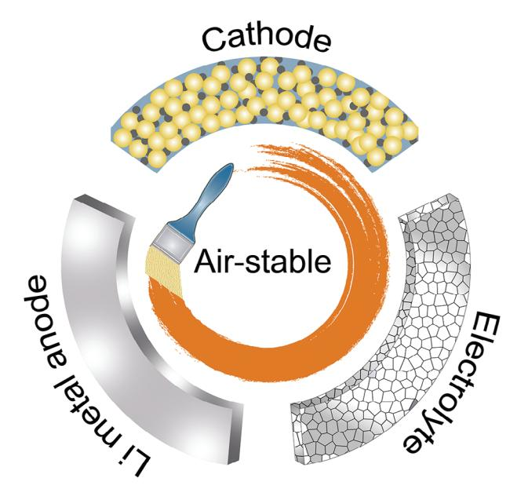
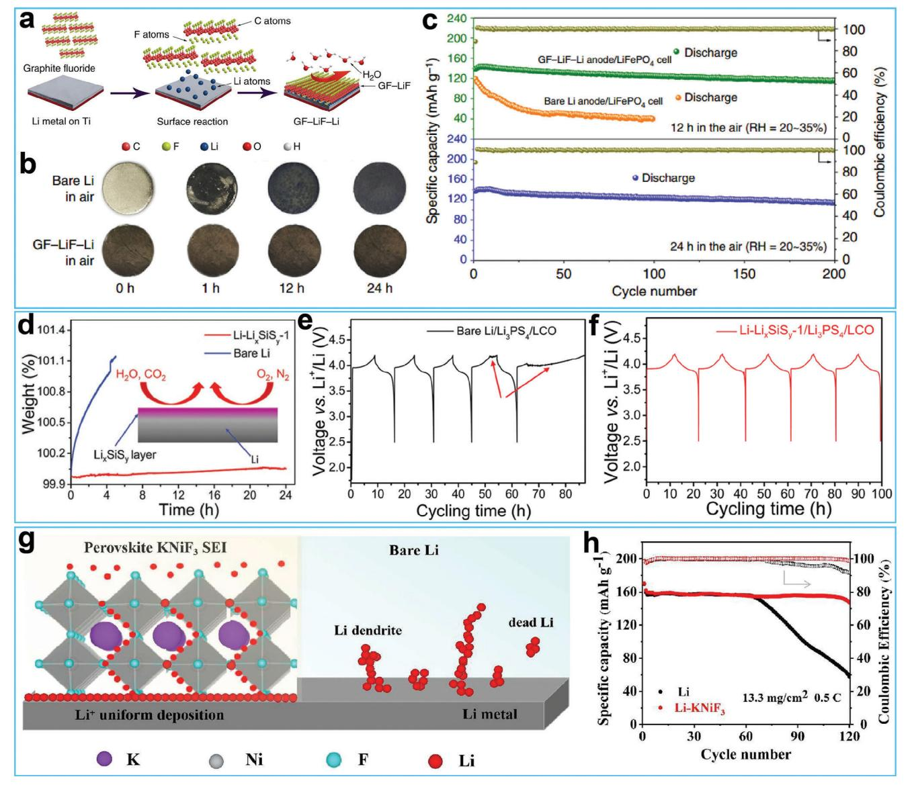
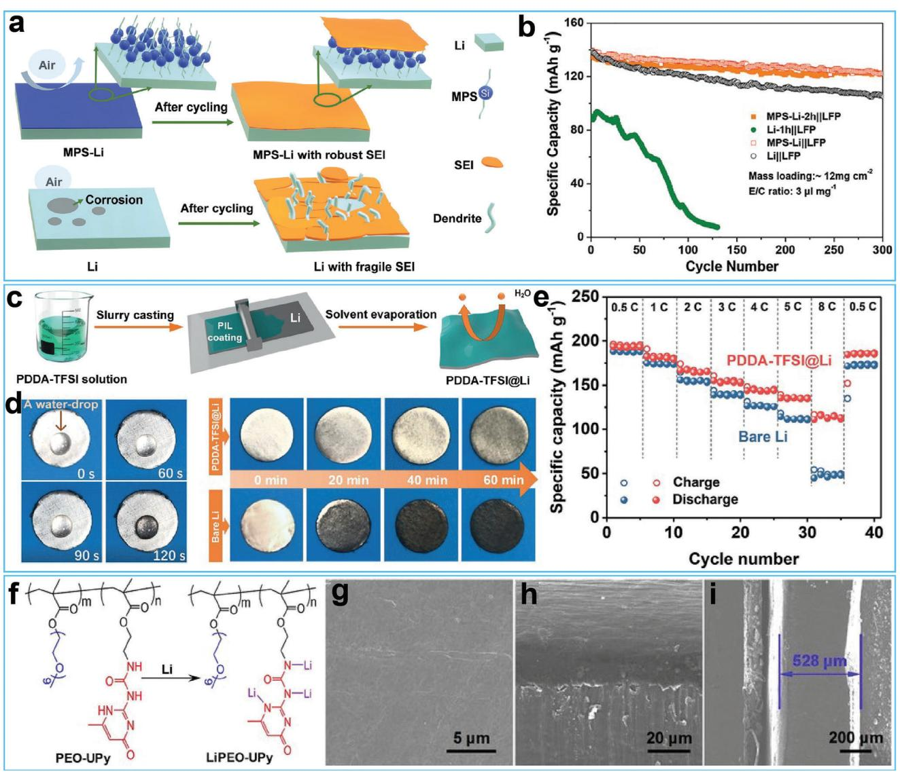
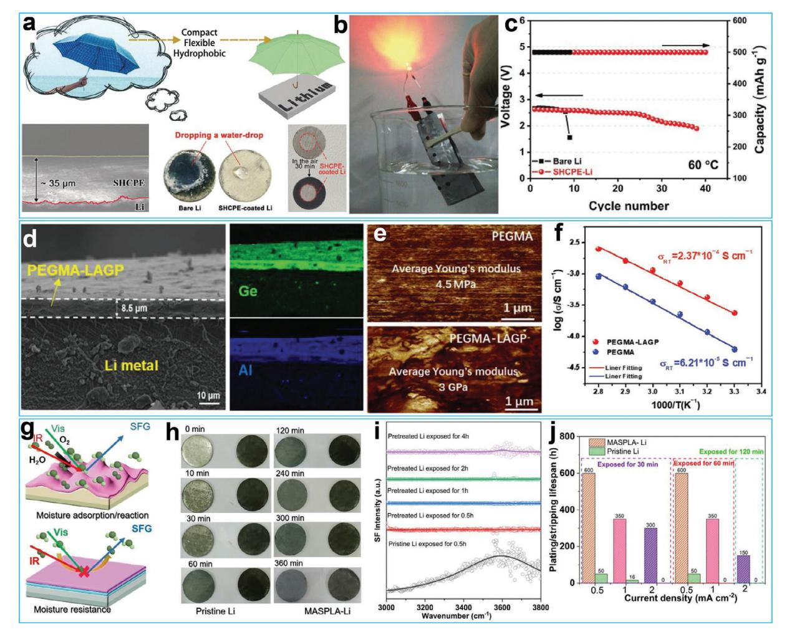
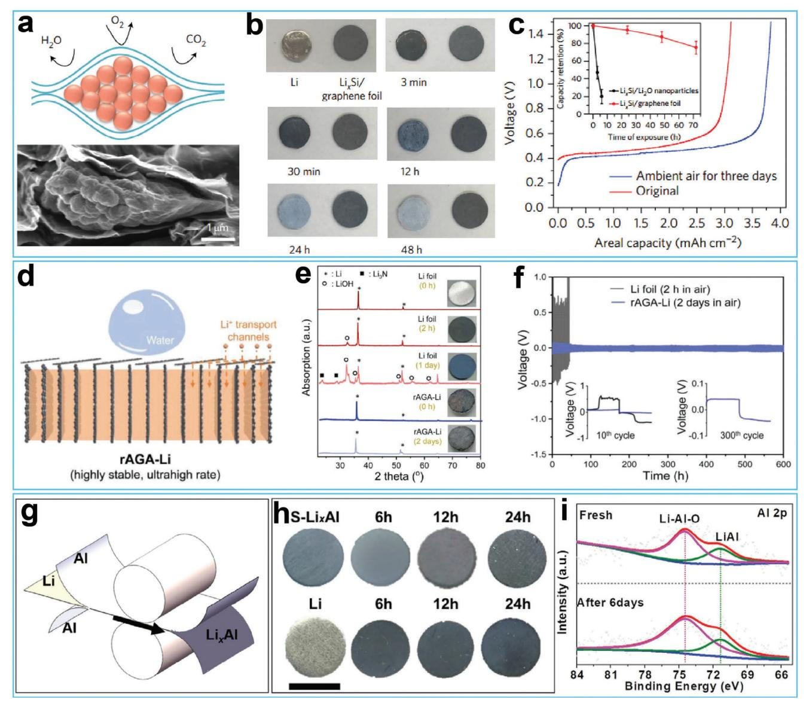
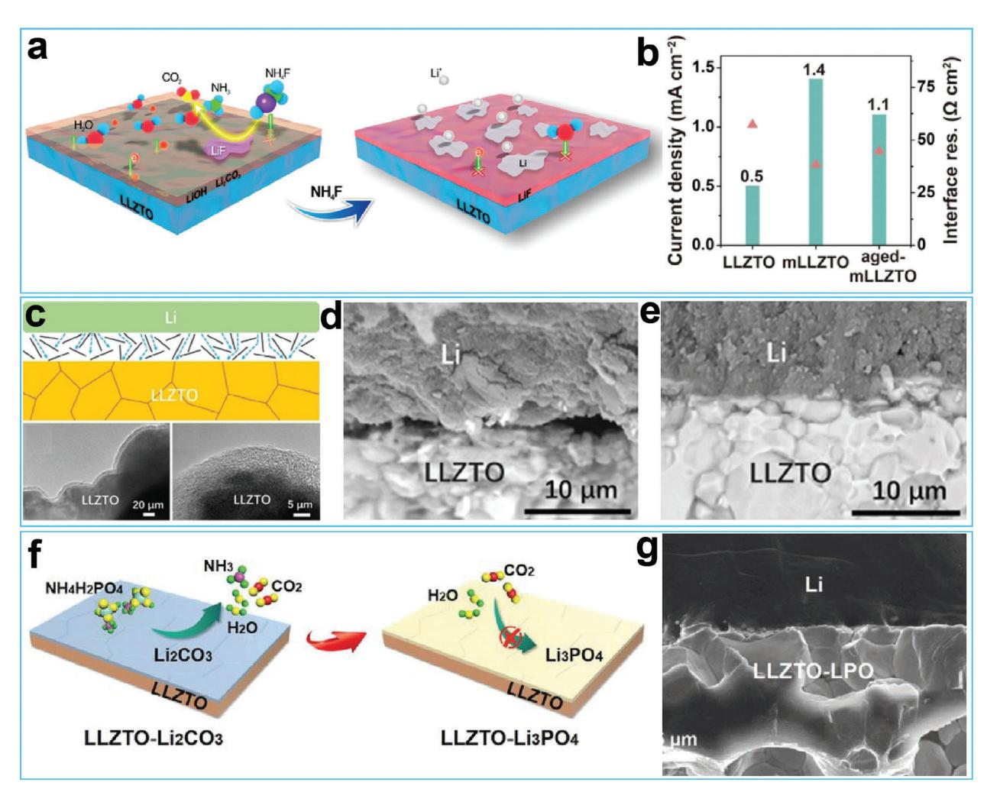
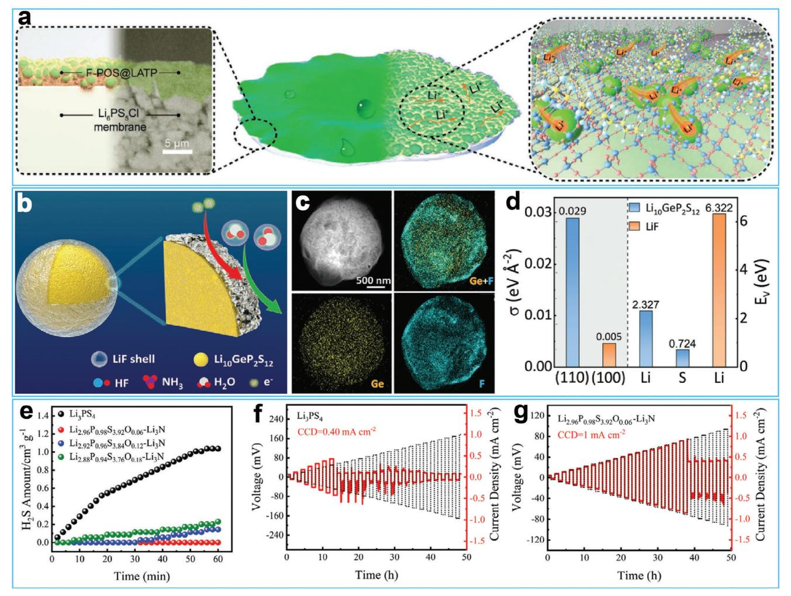
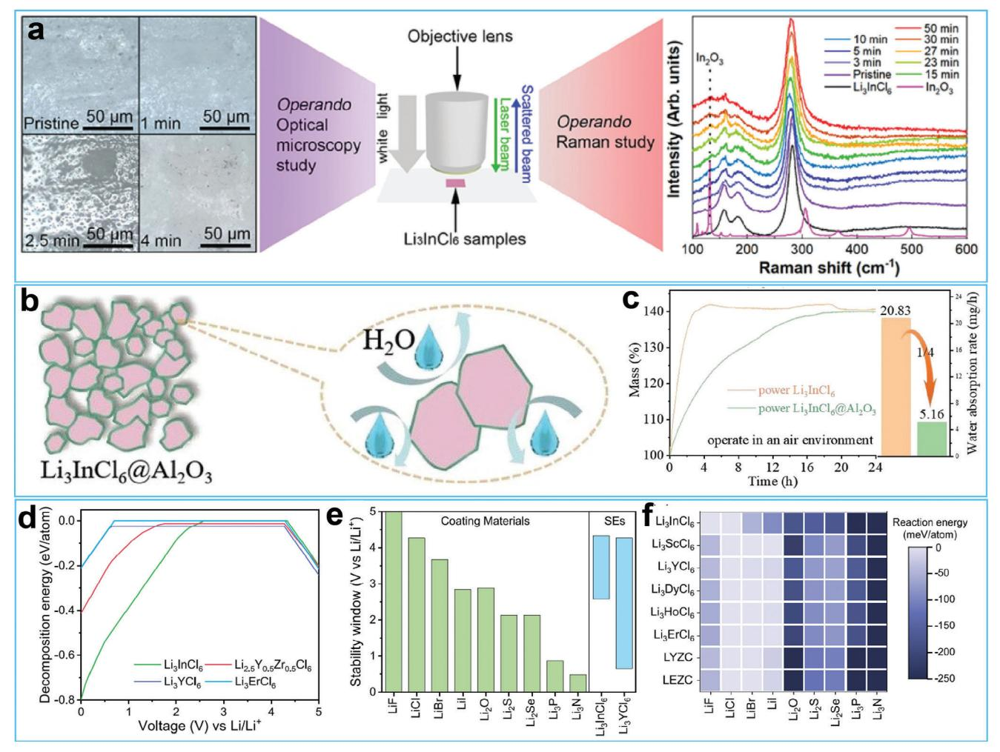
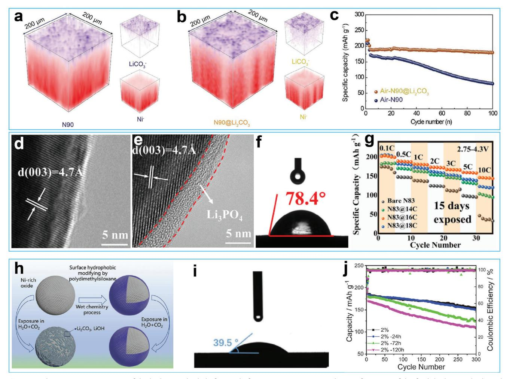
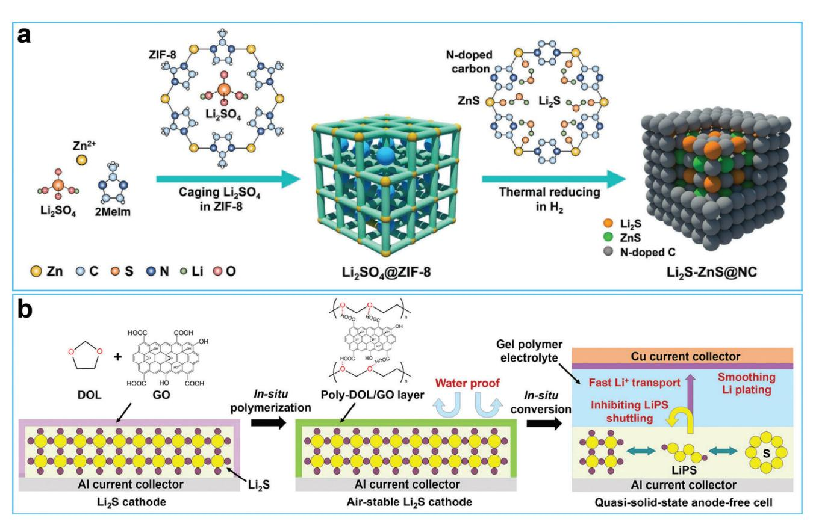

# **Recent Progress on the Air-Stable Battery Materials for Solid-State Lithium Metal Batteries**

*Bingbing Cheng, Zi-Jian Zheng,\* and Xianze Yin\**

**Solid-state lithium metal batteries (SSLMBs) offer numerous advantages in terms of safety and theoretical specific energy density. However, their main components namely lithium metal anode, solid-state electrolyte, and cathode, show chemical instability when exposed to humid air, which results in low capacities and poor cycling stability. Recent studies have shown that bioinspired hydrophobic materials with low specific surface energies can protect battery components from corrosion caused by humid air. Air-stable inorganic materials that densely cover the surface of battery components can also provide protection, which improves the storage stability of the battery components, broadens their processing conditions, and ultimately decreases their processing costs while enhancing their safety. In this review, the mechanism behind the surface structural degradation of battery components and the resulting consequences are discussed. Subsequently, recent strategies are reviewed to address this issue from the perspectives of lithium metal anodes, solid-state electrolytes, and cathodes. Finally, a brief conclusion is provided on the current strategies and fabrication suggestions for future safe air-stable SSLMBs.**

# **1. Introduction**

Rechargeable lithium metal batteries (LMBs) are promising future energy storage devices due to their high output energies.[\[1–4\]](#page-13-0) Among various candidates, solid-state lithium metal batteries are particularly attractive because replacing liquid electrolytes with solid-state electrolytes (SSEs) increases the energy density

B. Cheng, X. Yin

College of Materials Science and Engineering, State Key Laboratory of New Textile Materials & Advanced Processing Technology Wuhan Textile University Wuhan 430073, China E-mail: [yinxianze@wtu.edu.cn](mailto:yinxianze@wtu.edu.cn) Z.-J. Zheng

Ministry of Education Key Laboratory for the Green Preparation and Application of Functional Materials, Hubei Key Laboratory of Polymer Materials Hubei University Wuhan 430062, China

E-mail: [zhengzj@hubu.edu.cn](mailto:zhengzj@hubu.edu.cn)

The ORCID identification number(s) for the author(s) of this article can be found under <https://doi.org/10.1002/advs.202307726>

© 2023 The Authors. Advanced Science published by Wiley-VCH GmbH. This is an open access article under the terms of the [Creative Commons](http://creativecommons.org/licenses/by/4.0/) [Attribution](http://creativecommons.org/licenses/by/4.0/) License, which permits use, distribution and reproduction in any medium, provided the original work is properly cited.

# **DOI: 10.1002/advs.202307726**

and safety of batteries.[\[5–8\]](#page-14-0) However, despite their advantages, SSLMBs are still unsuitable for practical applications due to the chemical instability of their main components in humid air.[\[9–11\]](#page-14-0)

The Li metal anode is an essential component of SSLMBs, but it is highly sensitive to air and moisture.[\[12\]](#page-14-0) When exposed to humid air, Li metal rapidly corrodes and becomes covered in a thick insulating layer consisting of LiOH, Li3N, and Li2CO3. [\[13,14\]](#page-14-0) Furthermore, the reaction between Li and H2O produces flammable H2 gas and significant heat, which pose safety hazards.[\[15\]](#page-14-0) Consequently, Li metal must be processed in argon-filled glove boxes. As the core components of SSLMBs, oxide-based SSEs, sulfide-based SSEs, and halide-based SSEs have been developed as ion conductors due to their wide electrochemical stability windows and high ion conductivities.[\[16–18\]](#page-14-0) However, they are inherently sensitive to

H2O and CO2. [\[19,20\]](#page-14-0) For instance, garnet-based SSEs can react with moisture in the air, which generates lithiophobic species that contaminate the electrolyte and result in poor contact between the electrolyte and electrodes, ultimately leading to large voltage polarization.[\[21,22\]](#page-14-0) Similarly, sulfide-based SSEs rapidly hydrolyze when exposed to air, releasing toxic H2S gas and deteriorating the cathodes.[\[23,24\]](#page-14-0) Hydrophilic halide-based SSEs readily transform into hydrates and other components, resulting in a rapid degradation of their ionic conductivity.[\[25\]](#page-14-0) To achieve a high specific energy, cathodes in SSLMBs often use lithium-rich transition metal oxide materials.[\[26–28\]](#page-14-0) However, these high-nickel cathodes can be exposed to air during the synthesis and electrode processing, causing the formation of inactive lithium-containing compounds (such as Li2O, LiOH, Li2CO3, and LiHCO3) on the particle surfaces.[\[29,30\]](#page-14-0) This leads to structural degradation and performance fading of the cathodes.

Therefore, enhancing the air insensitivity of battery materials is important for reducing battery processing costs and enhancing battery safety.[\[31\]](#page-14-0) Introducing artificial protective layers and doping elements at interfaces are two main strategies for enhancing the air/water stability of battery materials.[\[32–35\]](#page-14-0) Artificial protective layers have attracted attention due to their diversity and longterm protection, including hydrophobic layers and chemicallyinert layers. The inspiration design for hydrophobic layers comes from nature, as many naturally occurring surfaces show specific wettability.[\[36–38\]](#page-14-0) An example of this is lotus leaves, which demonstrate superhydrophobicity due to the synergistic effect of the

**Figure 1.** Schematic illustration of the design of air-stable protective layers toward battery components for solid-state lithium metal batteries.

wax layer and surface texture, which enables water droplets to move freely on their surface.[\[39,40\]](#page-14-0) The low surface energy of the epicuticular wax endows the lotus leaves with their hydrophobicity. The numerous micro-nanostructures present on the surface of lotus leaves can accommodate a significant amount of air within their spaces, leading to a transition from hydrophobic to superhydrophobic. In addition to the bioinspired hydrophobic protective layers, an air-stable inorganic layer can also be used to protect battery components from air corrosion during electrode fabrication.[\[41,42\]](#page-14-0) Overall, decorating the surface of battery materials with artificial protective layers can protect battery components from atmospheric corrosion to enable the construction of highperformance SSLMBs.

In this review, we primarily focus on recent progress in the development of air-stable SSLMBs to provide a systematic understanding of the causes and consequences of battery performance degradation when battery components are exposed to the air. Additionally, we review recent strategies for improving air stability, including advancements in Li metal anodes, solid-state electrolytes, and cathodes (**Figure 1**). Finally, we discuss challenges and opportunities associated with current strategies and propose future directions for the development of safe and airstable SSLMBs.

# **2. Air-Stable Mechanism**

During the preparation or storage of battery materials, their structure is inevitably compromised by moisture, oxygen, and carbon dioxide from the air, which may reduce the performance of the resulting battery. Transforming their surfaces from hydrophilic to hydrophobic by adopting a protective layer can protect them from attack by humid air. Thus, numerous efforts have been devoted to developing hydrophobic interfacial layers.

Inspired by lotus leaves, artificial super-hydrophobicity layers have been designed to protect the surface of battery materials.[\[43\]](#page-14-0) The wetting behavior of a surface can be characterized by the water contact angle (WCA). On a smooth surface, the apparent WCA in the air can be explained by Young's equation,[\[44\]](#page-14-0)

$$
\cos \theta_0 = (\gamma_{sg} - \gamma_{sl})/\gamma_{lg} \tag{1}
$$

where 0 signifies the water contact angle on a solid surface, sg represents the solid-gas interfacial tension, sl corresponds to the solid-liquid interfacial tension, and lg represents the liquid-gas interfacial tension. A hydrophobic surface is defined by a WCA larger than 90°. According to Young's equation, decreasing the surface energy of the substrate is a prerequisite for fabricating hydrophobic surfaces.[\[45,46\]](#page-14-0)

In addition to surface energy, surface roughness is another decisive factor in regulating surface wettability. The Wenzel model was introduced to describe the influence of surface roughness on contact angle measurements and states that the contact angle of a liquid droplet on a solid surface is affected by microscopic depressions on the surface.[\[47\]](#page-14-0) In this model, a modified version of Young's equation can be used, which incorporates the effects of surface roughness. This modified equation is as follows:

$$
\cos \theta_{\rm w} = r \cos \theta_0 \tag{2}
$$

where, w denotes the wetting contact angle on a rough surface, and *r* is a roughness factor that is correlated with the surface area:

$$
r = (actual surface) / (geometric surface)
$$
 (3)

The variable *r* represents the ratio of the actual surface area to its apparent counterpart, and this value is always greater than 1. Equation (3) suggests that a higher surface roughness increases the degree of surface wettability, i.e., a hydrophobic surface will become superhydrophilic if *r* is increased. The surface free energy and surface roughness are the two key factors in designing hydrophobic surfaces. The surface free energy determines surface hydrophilicity or hydrophobicity, while surface roughness enhances these properties.[\[48,49\]](#page-14-0)

In addition to hydrophobic protective layers, other protective layers formed by chemically-inert materials can also be adopted to protect battery materials from air corrosion. These well-designed layers provide protection by densely packing on the surface of battery materials to reduce their air-exposed area.

# **3. Air-Stable Strategies**

### **3.1. Li Metal Anode**

As crucial components of high-energy-density rechargeable batteries, Li metal anodes have a high theoretical specific capacity of 3860 mA h g−1 and low reduction potential (−3.040 V vs standard hydrogen electrode).[\[50–53\]](#page-14-0) However, the practical applications of Li metal anode are hindered by their high chemical reactivity. First, Li metal easily react with H2O, N2, O2, and CO2, leading to high requirements for anode processing and cell assembly. During storage and transportation, uneven and ion-insulating surface layers arising from the unavoidable parasitic reactions between Li and air that cover on Li surfaceaggravate Li dendrite growth and deteriorate the electrochemical performance. Thus, there is an urgent need to fabricate air-stable Li metal anodes for the industrial-up production of Li metal batteries.

Surface engineering plays an important role in tuning the air stability of Li metal anodes.[\[54\]](#page-14-0) Fabricating a hydrophobic layer on Li anodes prevents the Li metal from being corroded by wet air and can also suppress Li dendrite growth and alleviate Li/electrolyte interfacial side reactions. Inspired by lotus leaves, surface components with low surface energies and micro/nanoscale hierarchical structures are critical for fabricating hydrophobic surfaces. In this context, many materials, including inorganic materials, organic materials, and organic-inorganic hybrid materials, are designed to decorate the surface of Li metal anodes, thus improving their air stability.

#### *3.1.1. Inorganic Artificial Layers*

Carbon materials, metallic materials, and other air-stable inorganic materials can be adopted as protective layers to functionalize the Li metal anode, thus reducing its air sensitivity. Carbon materials are particularly favored due to their low density and high chemical inertness.[\[55–57\]](#page-14-0) In a recent study, Goodenough and co-workers fabricated a hydrophobic interphase on a Li metal anode by incorporating graphite fluoride (GF) into molten Li.[\[58\]](#page-14-0) By utilizing the in situ reaction between GF and molten Li, as well as the low density of GF, a hybrid GF–LiF protective layer was constructed, as displayed in **Figure 2**[a.](#page-3-0) This layer protected the Li metal anodes by preventing reactions between Li metal anodes and humid air. Optical photographs confirmed that the GF–LiF– Li anode maintained its color, shape, and texture, even after exposure to humid air for 24 h (Figure [2b\)](#page-3-0). Full cells based on the airtreated GF–LiF–Li anode showed better charge-discharge cycling performance than cells assembled with bare Li metal exposed to the air (Figure [2c\)](#page-3-0).

Surface alloying is another straightforward and efficient technique for passivating the surface of Li metal anodes.[\[59–62\]](#page-14-0) Li readily reacts with various metals to form alloys. Compared with pristine Li metal anodes, Li metal anodes covered with an alloy layer presented outstanding air stability. These alloy layers possessed a high affinity for Li ions, facilitated rapid ion diffusion, and exhibited excellent corrosion resistance, and mechanical strength. These characteristics enabled the protected Li metal anodes to undergo uniform Li stripping/plating and reduced anodeelectrolyte side reactions. In this regard, Sun and co-workers employed a solution-based method to fabricate an air-stable LixSiSy layer on the Li metal surface.[\[63\]](#page-14-0) Thermogravimetric analysis showed that the mass of the Li metal anode with a LixSiSy layer remained constant while the mass of fresh Li metal anode rapidly increased after air-exposure, demonstrating the air stability of the modified Li metal anode (Figure [2d\)](#page-3-0). The electrochemical results in Figure [2e](#page-3-0) show that the Li/Li3PS4/ LiCoO2 (LCO) stably operated for only 50 h while the Li-LixSiSy/Li3PS4/LCO stably cycled for longer. This suggested that the protective layer formed during cycling not only enhanced the air stability of the Li metal anode but also stabilized the Li3PS4/Li interface (Figure [2e,f\)](#page-3-0).

Ceramic and perovskite materials have also been utilized to stabilize Li metal anodes.[\[64,65\]](#page-14-0) These inorganic layers show a high modulus, as well as excellent moisture, thermal, and chem-

ical stability, enabling them to suppress Li dendrite growth and protect the underlying Li metal from air corrosion. For instance, Yi and co-workers used spin coating to introduce a fluoride perovskite onto the surface of a Li metal anode, as illustrated in Figure [2g.](#page-3-0) [\[66\]](#page-15-0) In situ optical images showed that the surface of the Li metal anode remained smooth with a protective layer, providing convincing evidence that the protective layer suppressed Li dendrite growth. The cycling performance of the full cell based on a Li-KNiF3 anode showed an excellent capacity retention ratio (Figure [2h\)](#page-3-0). Overall, inorganic materials offer several advantages such as a high modulus and excellent chemical stability, but their high mass densities may be a limiting factor. Among candidate inorganic materials, lightweight modified carbon materials with a low electrical conductivity show promise as coating materials for fabricating air-stable Li metal anodes.

### *3.1.2. Organic Artificial Layers*

Due to the hostless nature of Li metal, Li metal anodes undergo dynamic surface changes during the charge-discharge process.[\[67\]](#page-15-0) Inorganic layers are mostly used as protective coatings, but they may be damaged over time due to their poor ability to withstand deformation, leading to a loss in their protective function.[\[68\]](#page-15-0) Therefore, protective layers that exhibit excellent self-adapting capability and air-stability are required.[\[69,70\]](#page-15-0) Compared with inorganic layers, organic coatings provide many more merits including great diversity, low density, strong adhesion, and good flexibility.[\[71–73\]](#page-15-0) Recently, various organic layers have been designed to protect Li metal anodes from air corrosion and stabilize the Li plating-stripping process.[\[74,75\]](#page-15-0) Based on their molecular size, the used organic molecules can be categorized into either smallmolecules or macromolecules.

Silane coupling agents are the most commonly used smallmolecule surface modifiers.[\[76–78\]](#page-15-0) The inorganic reactive groups of silane coupling agents can react with LiOH to form Li-O-Si bonds, while the low-surface-energy organic groups provide air tolerance. For example, Guo and co-workers utilized 3-methacryloxypropyltrimethoxysilane (MPS) to decorate the Li metal anode to construct a natural solid-electrolyte interphase (SEI) layer, as illustrated in **Figure 3**[a.](#page-4-0) [\[79\]](#page-15-0) The low surface energy of silane endowed the modified Li metal anode with excellent air stability. Furthermore, the chemical bond between MPS and Li metal guaranteed strong adhesion between the SEI layer and Li substrate, promoting dense Li deposition. Thus, the fullcell based on an air-exposed MPS-Li metal anode exhibited outstanding cycling stability (Figure [3b\)](#page-4-0). Analogues of silane coupling agents have also been employed to functionalize Li metal anodes. In this context, Chen and co-workers used octadecylphosphonic acid to modify composite microspheres of Li metal and carbon nanotubes.[\[80\]](#page-15-0) The modified composite Li metal anode showed excellent stability in both dry and humid air. Wax is another common material with a low surface free energy, that has been considered a viable option for enhancing the air stability of Li metal anodes.[\[81\]](#page-15-0)

Macromolecules are also frequently employed as surface modifiers to functionalize Li metal surfaces. Compared with small organic molecules, macromolecules possess multiple functional groups and exhibit high mechanical strength, allowing them to

**Figure 2.** a) Schematic illustrating of the preparation process of GF (graphite fluoride)–LiF–Li anode. b) Air-stable testing of bare Li metal anode and GF– LiF–Li anode. Reproduced with permission. c) Cycling performance of the anode after exposing in air.[\[58\]](#page-14-0) Copyright 2019, Springer Nature. d) Thermal gravimetric analysis of the bare Li anode and Li-LixSiSy anode. e) Charge–discharge voltage profiles of Li/Li3PS4/LCO cell. f) Charge–discharge voltage profiles of Li-LixSiSy/Li3PS4/LCO cell. Reproduced with permission.[\[63\]](#page-14-0) Copyright 2019, Wiley-VCH. g) Schematic illustration of Li+ deposition behavior on the surface of Li-KNiF3 anode and bare Li anode. h) Cycling performance of the full cell based on bare Li metal anode and Li-KNiF3 anode. Reproduced with permission.[\[66\]](#page-15-0) Copyright 2022, Elsevier.

regulate Li+ flux and suppress Li dendrite growth.[\[82,83\]](#page-15-0) In one study, Huang and colleagues employed a polycationic and hydrophobic polymer to modify the Li metal surface using a simple tape-casting method, as shown in Figure [3c.](#page-4-0) [\[84\]](#page-15-0) The polymeric cations in the polymer optimized the Li+ flux by providing electrostatic shielding, while the anions endowed it with excellent hydrophobicity. Optical images in Figure [3d](#page-4-0) indicate that the modified Li metal anode could withstand corrosion by humid air and water. The cycling performance of the full-cell utilizing the modified Li metal anode exhibited excellent rate performance (Figure [3e\)](#page-4-0). Other macromolecules, such as polydimethylsiloxane, polymers of intrinsic microporosity, polyvinyl alcohol, poly(vinylidene-co-hexafluoropropylene), ethylene-vinyl acetate copolymer, poly (arylene ether sulfone)-g-poly(ethylene glycol) copolymer, and polyurethane elastomers, have also been used to functionalize the Li metal surface, resulting in improved air stability.[\[85–90\]](#page-15-0) In addition to air stability, Li ion conduction is another crucial characteristic of organic protective layers. Hence, Xiong and co-workers synthesized a copolymer that incorporated poly(ethylene oxide) (PEO) segments and ureido-pyrimidinone (UPy) moieties (Figure [3f\)](#page-4-0).[\[91\]](#page-15-0) The PEO-UPy copolymer was further adopted as a protective layer to decorate the Li metal anode. The PEO-UPy coating layer exhibited excellent air stability, and the introduction of the PEO segment gave the layer a high Li

**Figure 3.** a) Schematic illustrating of the electrochemical plating/stripping processes of 3-methacryloxypropyltrimethoxysilane (MPS) modified Li metal anode and bare Li metal anode. b) Cycling performance of the batteries based on air-exposed MPS-Li metal anode, air-exposed Li metal anode, MPS-Li metal anode, and bare Li metal anode. Reproduced with permission.[\[79\]](#page-15-0) Copyright 2021, Wiley-VCH. c) Preparation process of the artificial SEI layer based on poly (diallyl dimethyl ammonium) (PDDA)-bis(trifluoromethanesulfonyl)imide (TFSI). d) Water-stability and air-stability of the PDDA-TFSI modified Li metal anode and bare Li metal anode. e) Rate performance of full cell batteries based on PDDA-TFSI modified Li metal anode and bare Li metal anode. Reproduced with permission.[\[84\]](#page-15-0) Copyright 2021, Wiley-VCH. f) Molecular structure of poly (ethylene oxide) (PEO)-ureido-pyrimidinone (UPy) copolymer and its lithiation reaction process. g–i) SEM images of the LiPEO–UPy modified Li metal anode after 200 cycles. Reproduced with permission.[\[91\]](#page-15-0) Copyright 2020, Wiley-VCH.

ion conductivity (2.37×10–5 S cm–5). As a result, the modified Li metal anode exhibited a dense structure and smooth surface (Figure 3g–i).

#### *3.1.3. Organic-Inorganic Hybrid Layers*

Inorganic and organic layers each have their own advantages and advantages.[\[92\]](#page-15-0) In terms of modulus, inorganic layers have an advantage over organic layers, but they lack sufficient toughness, while organic layers have good toughness but lower modulus.[\[93,94\]](#page-15-0) Therefore, constructing hybrid layers that combine both inorganic and organic materials is a logical choice for Li metal anodes.[\[95–97\]](#page-15-0) The high modulus of the inorganic component can suppress Li dendrite growth, while the excellent flexibility of the organic component helps maintain the structural integrity of composite coatings. Additionally, the surface of inorganic nanoparticles can be modified with low-surface-energy materials to change their surface from hydrophilic to hydrophobic. This hydrophobicity of the nanoparticles enhances the overall hydrophobicity of the hybrid layers, thus improving the air stability of composite Li metal anodes. Furthermore, some inorganic

**Figure 4.** a) Schematic illustration of the protective effect of the hydrophobic layer on Li metal anode, the thickness of the layer, the water resistance and air stability of the as-formed layer. b) the underwater test of the Li-air battery based on the hydrophobic composite polymer electrolyte. c) Cycling performance of the Li-air battery with and without hydrophobic composite polymer electrolyte at 60 °C. Reproduced with permission.[\[102\]](#page-15-0) Copyright 2019, Wiley-VCH. d) SEM image of the Li metal anode with PEGMA-LAGP layer. e) Atomic force microscope (AFM) test of the pristine PEGMA layer and PEGMA-LAGP layer. f) Li ion conductivity of the pristine PEGMA layer and PEGMA-LAGP layer. Reproduced with permission.[\[103\]](#page-15-0) Copyright 2022, Wiley-VCH. g) Schematic illustration of the moisture-stability of the pristine Li metal anode and modified Li metal anode. h) Air-exposing test of the pristine Li metal anode and modified Li metal anode with various exposing time. i) Interface-sensitive SFG spectroscopy result of the pristine Li metal anode and modified Li metal anode with various exposing time. j) Cycling life of the cells based on pristine Li metal anode and modified Li metal anode with various exposing time. Reproduced with permission.[\[104\]](#page-15-0) Copyright 2022, Elsevier.

nanoparticles, such as ceramic electrolytes, exhibit excellent Li+ conductivity, and introducing nanoparticles into the organic moiety can enhance the Li+ conductivity of the hybrid layers.

In this regard, Lu and co-workers utilized a simple vapor deposition technique to construct organic–inorganic coatings on a Li metal surface.[\[98\]](#page-15-0) Using a mixed vapor of 3-mercaptopropyl trimethoxysilane (MPS) and tetraethoxysilane (TEOS). The incorporation of the organic moiety MPS rendered the composite coating highly flexible and tough. Additionally, the hydrolysis and condensation reactions resulted in the generation of LixSiOy, thus improving the mechanical properties of the hybrid coating. Due to the exceptional anti-corrosion ability of phosphates, Yan and co-workers developed an organic–inorganic interface on the surface of Li metal by introducing polyphosphoric ester as a modifier.[\[99\]](#page-15-0) A dual-layer interface was created using a surface chemistry approach, with Li3PO4 as the bottom layer and -COPO3-, -(CO)2PO2-, and-(CO)3PO- as the upper layer. Xie and co-workers used an in situ chemical reaction to fabricate an organic-inorganic polymer-alloy hybrid layer thatimparted excellent air stability and long-term cycling to the Li metal anode.

In addition to air stability, the hybrid layer must have a high Liion conductivity to assemble high-rate batteries or all-solid-state batteries.[\[100,101\]](#page-15-0) Recently, Zhang and co-workers developed a hydrophobic composite polymer electrolyte by incorporating hydrophobic SiO2 nanoparticles into a high ionic-conductive thermoplastic polyurethane.[\[102\]](#page-15-0) The as-prepared hydrophobic composite polymer electrolyte protected the Li metal anode from corrosion by water and air, as illustrated in **Figure 4**a. Due to the excellent hydrophobicity of the hybrid polymer electrolyte, the assembled Li-air battery lit up a red LED, even after immersion in water (Figure [4b\)](#page-5-0). Additionally, the hybrid polymer electrolyte also showed excellent heat resistance, giving the Li-air battery a longer cycle life (Figure [4c\)](#page-5-0). Wu and co-workers reported the synthesis of a flexible organic–inorganic hybrid electrolyte with a thickness of 8.5 μm using a thermal-initiated free-radical reaction (Figure [4d\)](#page-5-0).[\[103\]](#page-15-0) The inclusion of nanoparticles significantly enhanced the mechanical properties of poly(ethylene glycol methacrylate) and increased its Young's modulus from 4.5 MPa to 3 GPa (Figure [4e\)](#page-5-0). Moreover, the Li1.5Al0.5Ge1.5(PO4)3 nanoparticles were rapid ion conductors, giving the hybrid material a high ionic conductivity (2.37 × 10−4 S cm−1; Figure [4f\)](#page-5-0). This finding highlights the potential of hybrid electrolytes for all-solid-state lithium batteries. Li and co-workers developed a spin-coating method to create an artificial SEI layer on Li metal surfaces.[\[104\]](#page-15-0) This SEI layer was composed of a mixture of tin difluoride (SnF2), poly(vinylidenecfluoride-*co*-hexafluoropropene) (PVDF-HFP), and dimethyl sulfoxide (DMSO). The resulting SEI layer consisted of a LiF/Sn/LixSn alloy layer that increased the mechanical properties and ion conductivity of the SEI layer. The PVDF-HFP layer ensured the flexibility and transport of ions within the SEI layer. The low surface energy of the PVDF-HFP also contributed to the excellent moisture resistance of the SEI layer, as presented in Figure [4g,h.](#page-5-0) The moisture resistance was further supported by interface-sensitive and interface-selective sum frequency generation (SFG) spectroscopy, as shown in Figure [4i.](#page-5-0) Figure [4j](#page-5-0) illustrates the electrochemical properties, demonstrating that when equipped with a well-designed SEI layer, the Li metal anode maintained its long-term cycling even when exposed to humid air. Overall, organic-inorganic hybrid layers exhibit a favorable combination of strength and toughness, making them the most promising choice for Li metal anode coatings.

#### *3.1.4. Composite Li Metal Anodes*

Different from the intercalation mechanism of graphite anodes, Li metal anodes undergo a continuous plating/stripping process during cycling.[\[105\]](#page-15-0) The plating/stripping process, along with the hostless nature, results in infinite relative volume changes during cycling.[\[106,107\]](#page-15-0) To address this issue, carbon materials, metals, and other conductive materials have been developed as hosts.[\[108–110\]](#page-15-0) Thus, it is reasonable to design composite Li metal anodes for practical applications to also reduce the exposure of Li metal to air and therefore improve its air stability.[\[111–113\]](#page-15-0)

To enhance the air stability and alleviate volume changes of Li metal anodes, Cui and co-workers developed a composite Li metal anode by encapsulating Li-containing nanoparticles into graphene sheets, as displayed in **Figure 5**[a.](#page-7-0) [\[114\]](#page-15-0) Due to the protection of graphene sheets, the composite Li metal anode exhibited excellent air stability, as shown by the photographs during air exposure experiments (Figure [5b\)](#page-7-0). Electrochemical tests showed that the areal capacity of the graphene-wrapped anode was only slightly deteriorated after exposure to the ambient air, in contrast to the sharp capacity decline in the unprotected anode after air corrosion (Figure [5c\)](#page-7-0). Liu and co-workers designed a dual-layer host composed of aligned graphene sheets at the base and sloping-aligned graphene sheets on top (Figure [5d\)](#page-7-0).[\[115\]](#page-15-0) The bottom layer of the aligned graphene sheets served as a reservoir for Li ions, while the surface layer of graphene sheets protected metallic Li from air corrosion. In the optical photograph in Figure [5e,](#page-7-0) the color of the graphene-based composite Li metal anode remained relatively constant after two days of exposure, whereas the pristine Li foil quickly turned black from its original silver-like color. Electrochemical tests of symmetrical cells demonstrated that the composite Li metal anode exhibited stable long-term cycling and a low overpotential of ≈50 mV, even after being exposed to the air for two days. In contrast, the pristine Li foil hardly cycled, even after only two hours of exposure to the air (Figure [5f\)](#page-7-0). Li and co-workers adopted an air-stable Al foil to protect the Li metal anode.[\[116\]](#page-15-0) By employing a roll-to-roll mechanical prelithiation method, they fabricated a LixAl alloy anode (Figure [5g\)](#page-7-0). The color changes in Figure [5h](#page-7-0) demonstrated the air stability of the as-prepared LixAl alloy foil. X-ray photoelectron spectroscopy (XPS) test revealed the protective layer of the LixAl alloy (Figure [5i\)](#page-7-0), revealing the presence of Li-Al-O compounds on the surface of the LixAl in both the freshly-prepared sample and the sample exposed to humid air for six days. These compounds functioned as a passivation layer that protected the LixAl alloy from corrosion by humid air.

Numerous attempts have been proposed to develop air-stable Li metal anodes, including organic layers, inorganic layers, organic-inorganic hybrid layers, and composite designs. The main strategy for protecting Li metal anodes from air-corrosion involves decorating the surface of Li metal anode with hydrophobic materials or chemically-inert materials. Increasing the roughness of the Li metal surface can enhance its hydrophobicity, but this has received little attention because it requires complex pretreatment techniques. Using lithium powder to construct air-stable Li metal anodes may be a practical option. The presence of voids in powder particles allows for the convenient construction of rough surfaces. Thus, a reasonable approach for preparing air-stable Li metal anodes may involve functionalizing Li powder with suitable surface modifiers and then coating it onto a conductive substrate.

### **3.2. Solid-State Electrolytes**

The liquid electrolytes commonly used in Li metal batteries have shown advantages in terms of rapid Li+ transportation and excellent interfacial contact with anode/cathode, but their flammability, propensity for explosion, and toxicity have limited their further applications.[\[117–119\]](#page-15-0) SSEs have emerged as a viable strategy because their non-flammability ensures the safe operation of fully assembled batteries.[\[120–122\]](#page-15-0) Additionally, the higher modulus of SSEs enables them to inhibit the growth of Li dendrites, which prolongs the lifespan of Li metal batteries. Previously, many SSEs have been reported, including polymer-based SSEs, oxide-based SSEs, sulfide-based SSEs, and halide-based SSEs.[\[123,124\]](#page-15-0) Among them, polymer-based SSEs always exhibit superior air stability. Due to their high surface chemical reactivity, the other three types of SSEs exhibit air instability, posing a challenge to their application.[\[125–128\]](#page-15-0)

#### *3.2.1. Oxide-Based Solid-State Electrolytes*

Certain oxide-based SSEs show excellent stability in ambient air, but other oxide-based SSEs, such as cubic garnet-based

**Figure 5.** a) Schematic illustration of LixM/graphene foil. b) Photographs of pristine Li foil and LixSi/graphene foil after air-exposing test. c) Areal capacity retention of the LixSi/graphene foil before and after air-exposing. Reproduced with permission.[\[114\]](#page-15-0) Copyright 2017, Springer Nature. d) Schematic illustration of water-stable composite Li metal anode composing reduced by accordion-like graphene oxide array (rAGA) and Li foil. e) XRD spectra of pristine Li metal anode and rAGA-Li anode after air-exposing with various time. f) Cycling test of symmetrical cells assembling by two air-treated samples. Reproduced with permission.[\[115\]](#page-15-0) Copyright 2020, Wiley-VCH. g) Schematic of preparation process of Li-Al alloy foil by roll-to-roll technology. h) Photographs of pristine Li foil and Li-Al alloy foil after various air-exposing times. i) XPS spectra of Li-Al alloy foil before and after 6 days air-exposing. Reproduced with permission.[\[116\]](#page-15-0) Copyright 2021, Wiley-VCH.

Li7La3Zr2O12 (LLZO) and its variants, are susceptible to chemical reactions with moisture in the air.[\[129\]](#page-15-0) These reactions form byproducts that cover the surface.[\[130,131\]](#page-15-0) This uncontrollable formation of lithiophobic species such as Li2CO3 and LiOH hinders the wetting of LLZO by metallic Li, leading to an uneven Li+ flux distribution during Li plating/stripping, which in turn contributes to the nucleation and growth of dendrites throughout the bulk electrolyte. These dendrites may ultimately cause internal short circuits in batteries.[\[132\]](#page-16-0) Some studies have reported that elemental doping can enhance the air stability of LLZO to some degree, but the air instability of LLZO and its derivatives persists.[\[133,134\]](#page-16-0)

Surface decoration can also be used to protect garnet-based SSEs.[\[135,136\]](#page-16-0) Because the surface of SSEs is already contaminated with lithiophobic species, these contaminants should be removed before surface decoration. In this study, Arava and coworkers first purified the surface of Li6.5La3Zr1.5Ta0.5O12 by annealing it at high temperature under an ultrahigh vacuum conditions and then coated a nanometer-thick h-BN layer onto the Li6.5La3Zr1.5Ta0.5O12 surface using atomic layer deposition.[\[137\]](#page-16-0) In another study, Guo and co-workers developed a moderatetemperature conversion chemistry method for treating the surface of Li6.4La3Zr1.4Ta0.6O12 with ammonium fluoride (NH4F),

**Figure 6.** a) Schematic illustration of the surface treatment process by adopting ammonium fluoride (NH4F). b) Critical current density and interfacial resistance of the Li/Li symmetric cells based on the Li6.4La3Zr1.4Ta0.6O12, modified Li6.4La3Zr1.4Ta0.6O12 before and after aging. Reproduced with permission.[\[138\]](#page-16-0) Copyright 2020, Wiley-VCH. c) Diagram of the LGC lithiation process and TEM images of LGC coated Li6.75La3Zr1.75Ta0.25O12. d, e) SEM images of the Li/Li6.75La3Zr1.75Ta0.25O12 interface without and with LGC layer. Reproduced with permission.[\[139\]](#page-16-0) Copyright 2020, Wiley-VCH. f) Schematic illustration of the surface treatment process by adopting NH4H2PO4 salt. g) SEM images of the Li/ Li6.4La3Zr1.4Ta0.6O12 interface with Li3PO4 layer after melting. Reproduced with permission.[\[140\]](#page-16-0) Copyright 2022, Wiley-VCH.

as illustrated in **Figure 6**a. [\[138\]](#page-16-0) At a moderate temperature, the surface contaminants on Li6.4La3Zr1.4Ta0.6O12 reacted with NH4F and formed a fluorinated nano-coating. The resultant low surface energy of the fluoride coating rendered the modified garnet surface hydrophobic, thus preventing air corrosion upon re-exposure to the air. Additional experimental results demonstrated that the modified Li6.4La3Zr1.4Ta0.6O12 showed reduced interfacial resistance and increased critical current density before and after aging compared with the unmodified Li6.4La3Zr1.4Ta0.6O12 (Figure 6b). Xia and co-workers reported the concurrent removal of surface lithiophobic contaminants and the protection of Li6.75La3Zr1.75Ta0.25O12 against air and moisture.[\[139\]](#page-16-0) This was achieved by depositing a low-graphitized carbon (LGC) layer on its surface using a thermal-decomposition vapor deposition method, as shown in Figure 6c. The introduction of the LGC layer enhanced the air-stability of the modified Li6.75La3Zr1.75Ta0.25O12 and also improved its Li wettability after lithiation, as demonstrated by the SEM images in Figure 6d,e. Guo and co-workers purified the surface of Li6.4La3Zr1.4Ta0.6O12 and simultaneously maintained its air stability by utilizing the conversion reaction between molten NH4H2PO4 salt and Li2CO3 (Figure 6f).[\[140\]](#page-16-0) The resulting Li3PO4 layer acted as a barrier against moisture attack. The SEM images in Figure 6g also show that during the melt infiltration process, the Li3PO4 layer transformed into a lithiophilic Li3P/Li2O interlayer, creating smooth and seamless contact between Li and Li6.4La3Zr1.4Ta0.6O12.

#### *3.2.2. Sulfide-Based Solid-State Electrolytes*

Compared with oxide-based SSEs, sulfide-based SSEs have higher Li+ conductivities (from 10−4 to 10−2 S cm−1) at room temperature due to the larger ionic radii and weaker electronegativity of sulfide ions.[\[141,142\]](#page-16-0) In addition, sulfide-based SSEs possess wide electrochemical windows and negligible electronic conductivities. Notably, the grain boundary resistance of sulfide-based

**Figure 7.** a) Hydrophobic surface fabricated by fluorinated polysiloxane coated Li1.4Al0.4Ti1.6(PO4)3 (LATP) nanoparticles. Reproduced with permission.[\[153\]](#page-16-0) Copyright 2022, Wiley-VCH. b) Schematic illustration of the core-shell SSE. c) Elemental mapping images of the as-prepared core-shell SSE. d) Surface energies () and vacancy formation energies (*Ev*) for Li10GeP2S12 and LiF. Reproduced with permission.[\[154\]](#page-16-0) Copyright 2023, Wiley-VCH. e) H2S gas emission curves of Li3PS4 before and after element doping. f,g) Critical current density (CCD) of the Li–Li cells assembled with Li3PS4 and element doped Li3PS4. Reproduced with permission.[\[155\]](#page-16-0) Copyright 2022, Wiley-VCH.

SSEs can be significantly reduced by cold-pressing at room temperature, which eliminates the need for high-temperature sintering. However, the large-scale application of sulfide-based SSEs is limited due to their sensitivity to humid air.[\[143\]](#page-16-0) The air-instability of sulfide-based SSEs is attributed to the high chemical activity of P S contaminants. According to the hard and soft acids and bases theory,[\[144\]](#page-16-0) the hard acid P in Li3PS4 tends to react with oxygen in air/moisture, forming P-O bonds and disrupting the original P-S bonded structure. The soft base property of sulfur atoms causes them to react with hydrogen atoms of water molecules in the air, resulting in the release of H2S gas. Soft acids and soft bases tend to form stable complexes. Therefore, many soft acids, such as Ge, Sb, Zn, Cu, and Sn, and others, have been selected as co-dopants with P.[\[145–149\]](#page-16-0) The introduced dopants can bond with S, thus preventing the formation of H2S when exposed to the air. Co-doping Li3PS4 with a metallic element and oxygen is also feasible, as oxide-based SSEs are more air-stable than sulfide-based SSEs.[\[150,151](#page-16-0)]

Another feasible strategy for enhancing the air stability of sulfide-based SSEs is to decorate their surface with a protective layer.[\[152\]](#page-16-0) In this regard, Wu and co-workers introduced a superhydrophobic Li+-conducting coating layer on the surface of a sulfide-based SSE.[\[153\]](#page-16-0) The coating layer was prepared by using Li1.4Al0.4Ti1.6(PO4)3 (LATP), tetraethyl orthosilicate, and 1*H*,1*H*,2*H*,2*H*-perfluorodecyltriethoxysilane (PFDTES) as the raw materials via hydrolysis and condensation. The prepared fluorinated polysiloxane-coated LATP nanoparticles showed excellent water resistance (**Figure 7**a). Yao and co-workers utilized a gas-phase treatment method to decoratethe surface of Li10GeP2S12 with a LiF layer (Figure 7b).[\[154\]](#page-16-0) The uniformity of the coating on the Li10GeP2S12 surface was confirmed through element maps (Figure 7c). The LiF-coated SSE demonstrated superior air stability due to the ultra-low surface energy (0.005 eV) of LiF (Figure 7d). Yang and co-workers in situ constructed a Li3N layer on the surface of Li3PS4 by using O and N as codopants.[\[155\]](#page-16-0) Due to the synergistic effect between the Li3N layer

**Figure 8.** a) Schematic illustration of the *operando* characterization method and Raman spectroscopy setup adopted in investigating Li3InCl6 samples (middle), the *operando* optical images of Li3InCl6 samples with different exposing time in air with 30% humidity (left), and the Raman spectra evolution of Li3InCl6 samples (right). Reproduced with permission.[\[160\]](#page-16-0) Copyright 2020, American Chemical Society. b) Schematic illustration of the Al2O3 coated Li3InCl6 samples. c) Mass-time curves and water absorption rate of Li3InCl6 and modified Li3InCl6 samples. Reproduced with permission.[\[161\]](#page-16-0) Copyright 2022, Wiley-VCH. d) The decomposition energy values of certain halide-based SSEs, e) the electrochemical stability window of coating materials for the anode-electrolyte interface, and f) the reaction energy between coating materials and chloride-based SSEs based on first-principles calculations. Reproduced with permission.[\[162\]](#page-16-0) Copyright 2022, American Chemical Society.

and POS3 3−, the modified SSE suppressed the generation of H2S gas (Figure [7e\)](#page-9-0). The Li3N by-product passivated the interface between Li and the solid electrolyte, thus enhancing the critical current density from 0.40 to 1.00 mA cm−2 (Figure [7f,g\)](#page-9-0).

#### *3.2.3. Halide-Based Solid-State Electrolytes*

Halide-based SSEs have simple synthesis, high Li+ conductivity, and mechanical softness.[\[156,157\]](#page-16-0) Their excellent Li+ conductivity is due to the larger ionic radius of univalent halogen ions and weaker interatomic forces between univalent halogen ions and lithium ions. Their mechanical softness endows them with excellent interfacial compatibility with high-voltage cathode materials. Many well-designed halide-based SSEs are used to construct high-performance SSLMBs, but the poor air stability of halidebased SSEs arising from the moisture hypersensitivity of halide salts hampers their further applications.[\[158,159\]](#page-16-0)

To solve this issue, researchers have explored the underlying mechanism responsible for the air-instability of halide-based SSEs to propose effective solutions. For example, Sun and coworkers studied the degradation of Li3InCl6 at different humidity levels by adopting ex situ, in situ, and operando characterization methods.[\[160\]](#page-16-0) Their results confirmed that Li3InCl6 showed excellent air stability in a low-humidity environment (3%). Once exposed to a high humidity, Li3InCl6 first transformed into crystalline hydrates and then degraded into In2O3, LiCl, and HCl (**Figure 8**a), leading to a performance degradation. To improve the air stability, Li and co-workers decorated the surface of Li3InCl6 with Al2O3 by powder atomic layer deposition (Figure 8b).[\[161\]](#page-16-0) The mass-time curves in Figure 8c show that the Al2O3 layer inhibited the water adsorption of modified Li3InCl6. Using first-principles calculations, Yu and co-workers calculated the decomposition energy of some halide-based SSEs (Figure [8d\)](#page-10-0), the electrochemical stability window of coatings for the anode-electrolyte interface (Figure [8e\)](#page-10-0), and the reaction energy between coating materials and chloride-based SSEs (Figure [8f\)](#page-10-0).[\[162\]](#page-16-0) The results demonstrated that coatings containing binary halides stabilized the interface between Li metal anode and halide-based SSEs. These results will also help guide the design of air-stable coating layers for halide-based SSEs.

### **3.3. High-Energy Cathodes**

As a crucial component of solid-state lithium metal batteries, cathodes make a critical contribution to the high energy output of fully-assembled batteries.[\[163\]](#page-16-0) Nickel-rich layered oxides (LiNixCoyMn1-x-yO2, x ≥ 0.6) and lithium sulfide (Li2S) cathodes have gained significant attention and are widely used in this regard.[\[164,165\]](#page-16-0) Increasing the Ni content in the nickel-rich layered oxides can improvethe specific capacity, but when the nickel content exceeds 70%, significant side reactions occur between the cathodes and surrounding air.[\[166,167\]](#page-16-0) These side reactions form by-products, such as LiOH, Li2CO3, and LiHCO3, commonly referred to as "residual lithium". For Li2S cathodes, the intrinsic reaction between Li2S and H2O deteriorates the Li2S cathode and also releases toxic H2S gas.[\[168\]](#page-16-0) Therefore, there is a need to increase the air stability of toxic high-energy cathodes.

### *3.3.1. Nickel-Rich Layered Oxides*

The air-instability of nickel-rich layered oxides is primarily attributed to two factors. The first is the redox reactions of nickelrich layered oxides. According to the crystal field theory, the presence of Ni3+ always induces Jahn-Teller distortion in nickel-rich layered oxides, and Ni3+ tends to be reduced to Ni2+ to prevent this structural evolution. This reduction process generates active oxygen species that further react with CO2 and H2O and forma residual lithium layer on the cathode surface. The second reason is that H+/Li+ exchange always occurs. When a nickel-rich layered oxide contacts humid air, Li+ ions tend to migrate outward, while H+ ions tend to diffuse into the bulk phase, leading to the generation of harmful residual lithium that can negatively impact the electrode fabrication process and cycling stability. Elemental doping is adopted to improve the air stability of nickelrich layered cathodes.[\[169\]](#page-16-0) Cationic dopants can occupy the transition metal sites and form stronger metal–oxygen bonds, thus enhancing the structural stability of the modified cathodes.[\[170\]](#page-16-0)

Surface coatings have also been utilized to enhance the air stability of high-nickel cathodes.[\[171\]](#page-16-0) In this regard, Guo and coworkers improved the cathode surface by creating a dense layer of Li2CO3 using a CO2 treatment process.[\[172\]](#page-16-0) The 3D ToF-SIMS images in **Figure 9**[a,b](#page-12-0) show that the Li2CO3 layer was evenly dispersed on the cathode surface. The experimental results confirmed that the fabricated Li2CO3 layer enhanced the air stability of the high-nickel cathode due to its thermodynamic stability. Additionally, the Li2CO3 layer consumed the generated HF during cycling and transformed into a robust fluorine-containing cathode electrolyte interphase (CEI). Consequently, the modified cathode with a dense Li2CO3 layer exhibited more stable cycling performance than the fresh cathode, even after exposure to air (Figure [9c\)](#page-12-0). Zheng and co-workers adopted alkyl phosphoric to decorate the surface of LiNi0.83Mn0.11Co0.06O2 to fabricate a hydrophobic coating containing inorganic and organic components (Figure [9d–f\)](#page-12-0).[\[173\]](#page-16-0) The inorganic lithium phosphate prevented electrolyte corrosion and accelerated lithium-ion transport, while the low surface energy organic component endowed it with hydrophobicity, thus alleviating Li+/H+ ion exchange once exposing to the air. Due to the synergistic protective effect of the lithium phosphate and hydrophobic coating, the modified LiNi0.83Mn0.11Co0.06O2 demonstrated superior rate capability to the fresh samples after 15 days of exposure to the air (Figure [9g\)](#page-12-0). Qiu and co-workers coated polydimethylsiloxane on the surface of LiNi0.8Co0.1Mn0.1O2 particles to enhance their hydrophobicity (Figure [9h,i\)](#page-12-0).[\[174\]](#page-16-0) The enhanced hydrophobicity improved their air corrosion resistance, allowing the modified samples to withstand 24 h of exposure in a damp chamber at 50% relative humidity at 25°C (Figure [9j\)](#page-12-0).

### *3.3.2. Lithium Sulfide*

Lithium sulfide (Li2S) is a better candidate for next-generation lithium-ion batteries due to several advantages.[\[175,176\]](#page-16-0) First, lithium sulfide has an outstanding theoretical capacity (1166 mA h g−1), which is significantly higher than that of existing commercial cathode materials. Lithium sulfide also has a low density (1.66 g cm−3), which can minimize the volume expansion of the cathode during cycling. More importantly, lithium sulfide can be used to assemble lithium-free anodes to avoid safety concerns arising from Li metal anodes. Although promising, the applications of lithium sulfide are still immature due to their poor electronic and ionic conductivities, polysulfide shuttling, large activation barrier, and air instability.[\[177,178\]](#page-16-0) In Particular, they suffer from the issue of air instability and can release toxic H2S once exposed to an ambient environment.

To improve the air stability of lithium sulfide, researchers have tried encapsulated it into a host or wrapped it with a coating.[\[179,180\]](#page-16-0) For example, Qiu and co-workers designed and prepared a N-doped carbon cage for lithium sulfide (**Figure [10](#page-13-0)**a).[\[181\]](#page-16-0) Due to confinement in the cage, the lithium sulfides showed improved stability, kinetics, and reversibility. Wang and co-workers utilized a dense layer consisting of poly-1,3-dioxolane (DOL) and graphene oxide (GO) to protect the Li2S cathode from air corrosion, which improved the air stability of the polymerwrapped lithium sulfide. (Figure [10b\)](#page-13-0).[\[182\]](#page-16-0) Furthermore, this protective layer transformed into a gel electrolyte when liquid electrolyte was incorporated, which further inhibited the shutting of lithium polysulfides and smoothed the Li metal anode.

# **4. Summary and Outlook**

Solid-state lithium metal batteries have been recognized as promising energy storage devices for the near future, but their key materials, such as Li metal anodes, SSEs, and high-energy cathodes, exhibit inferior air stability, which leads to a variety of performance issues and even device failure. Enhancing the air stability of the battery materials has several advantages, including reduced battery material storage costs, streamlined manufacturing processes, and reduced safety risks when exposed to

**Figure 9.** a,b) 3D ToF-SIMS images of the high-Ni cathode before and after CO2 treatment. c) Cycling performance of the fresh high-Ni cathode and high-Ni oxide cathode with dense Li2CO3 layer after air-exposing. Reproduced with permission.[\[172\]](#page-16-0) Copyright 2022, Wiley-VCH. d,e) TEM images of high-Ni cathode before and after surface treatment with alkyl phosphoric. f) Water contact angle of the modified sample. g) Rate performance of the modified samples. Reproduced with permission.[\[173\]](#page-16-0) Copyright 2023, Elsevier. h) Schematic illustration of the coating process with polydimethylsiloxane. i) Water contact angle of polydimethylsiloxane modified sample. j) Cycle performance of polydimethylsiloxane modified sample with various exposing time in a damp chamber at 50% relative humidity and 25°C. Reproduced with permission.[\[174\]](#page-16-0) Copyright 2022, Wiley-VCH.

the air. Therefore, it is crucial to design air-stable battery materials, which can be accomplished by constructing well-designed protective layers. In this manuscript, we provided a comprehensive review of research progress in improving the air stability of battery materials, and the protective mechanisms involved by focusing on the Li metal anodes, SSEs, and high-energy cathodes.

The development of air-stable battery materials has been inspired bylotus leaves. To create hydrophobic surfaces, coating materials with a low surface energy are needed. Many fluorinecontaining materials, including inorganic and organic materials, have been designed, synthesized, and wrapped around battery materials to act as protective layers, thus changing the surface of battery materials from hydrophilic to hydrophobic. The surface hydrophobicity isolates the battery materials from moisture, thus avoiding of water corrosion. Additionally, other air-stable materials, such as carbon materials, alloys, and ceramics, have also been adopted to protect the battery materials by reducing the contact area with humid air. These strategies have improved the air stability of battery materials to some extent, but novel protection mechanisms and methods are still needed to directly design and prepare macroscopic air-stable battery materials.

Novel ideas for constructing hydrophobic surfaces require an understanding of the protective mechanism. Drawing inspiration from the lotus leaf, a low surface energy and high surface roughness are the two key factors in creating superhydrophobic surfaces. Previous studies mainly focused on reducing the surface energy of battery materials by decorating them with low surface energy materials, while surface roughness has received little attention. In future research, attention should also be paid to enhancing the surface roughness of battery materials. The combination of a lower surface energy and greater surface roughness should be considered.

In addition to the lotus leaf, the *Nepenthes* pitcher plant may also provide inspiration for biomimetic surface coatings.[\[183\]](#page-16-0) Different from storing an air layer in the microstructure of plant

**Figure 10.** a) Sketch map of the synthetic process of carbon cage encapsulate Li2S cathode. Reproduced with permission.[\[181\]](#page-16-0) Copyright 2019, Wiley-VCH. b) Schematic illustration of the preparation process of the air-stable composite layer toward Li2S cathode. Reproduced with permission.[\[182\]](#page-16-0) Copyright 2023, Wiley-VCH.

surfaces to adjust the surface wettability, the *Nepenthes* pitcher plant adjusts its surface wettability by locking an intermediary liquid in the micro-textures of its pitcher organs. This forms a slippery liquid-infused porous surface. Following this concept, researchers have attempted to fabricate slippery surfaces by infusing lubricating fluids into a roughened surface.[\[184\]](#page-16-0) This slippery surface repels some liquids that are immiscible with the lubricating fluid, which offers a new pathway for constructing superhydrophobic surfaces. Compared with the super-hydrophobic surface based on the lotus effect, this slippery surface is stable and easy to control. This phenomenon presents a remarkably simple alternative for fabricating hydrophobic surfaces, and may provide valuable insights into the fabrication of air-stable battery materials.

When designing protective layers, the following key parameters should consider: hydrophobicity, durability, anti-fatigue performance, ionic transport, and electrochemical stability. Currently, few protective layers meet all these requirements. Future work should extend the functionality of protective layers, and it is also necessary to develop a hydrophobic protective layer with excellent flame-retardancy to further enhance the safety of batteries. Apart from material selection, the coating technology used to fabricate the hydrophobic layers on battery material surfaces is also crucial to consider. Solvent-free methods show promise and should be further investigated.

In summary, the air stability of battery materials is a critical issue during the fabrication of solid-state batteries and can be enhanced using surface coating., and the exploration of novel battery materials with excellent air stability will expedite the commercialization of solid-state batteries.

### **Acknowledgements**

This work was supported by the National Natural Science Foundation of China (51973167, 52273041). Correction added on February 9, 2024, after first online publication: Equation 1 was corrected.

## **Conflict of Interest**

The authors declare no conflict of interest.

# **Keywords**

air stability, battery material, lithium metal battery, safety, solid-state battery

> Received: October 14, 2023 Revised: December 2, 2023 Published online: December 10, 2023

[1] J.-M. Tarascon, M. Armand, *Nature* **2001**, *414*, 359.

- [2] S. Xin, Z. Chang, X. Zhang, Y.u-G. Guo, *Nat. Sci. Rev.* **2017**, *4*, 54.
- [3] A. Hu, W. Chen, F. Li, M. He, D. Chen, Y. Li, J. Zhu, Y. Yan, J. Long, Y. Hu, T. Lei, B. Li, X. Wang, J. Xiong, *Adv. Mater.* **2023**, 2304762.
- [4] C. Zhao, Z. Yan, B. Zhou, Y. Pan, A. Hu, M. He, J. Liu, J. Long, *Angew. Chem., Int. Ed.* **2023**, *62*, e202302746.
- [5] S. Xin, Y. You, S. Wang, H.-C. Gao, Y.a-X. Yin, Y.u-G. Guo, *ACS Energy Lett.* **2017**, *2*, 1385.
- [6] Y. Tang, L. Zhang, J. Chen, H. Sun, T. Yang, Q. Liu, Q. Huang, T. Zhu, J. Huang, *Energy Environ. Sci.* **2021**, *14*, 602.
- [7] Y.-G. Lee, S. Fujiki, C. Jung, N. Suzuki, N. Yashiro, R. Omoda, D.-S. Ko, T. Shiratsuchi, T. Sugimoto, S. Ryu, J. H. Ku, T. Watanabe, Y. Park, Y. Aihara, D. Im, I. T. Han, *Nat. Energy* **2020**, *5*, 299.
- [8] A. Manthiram, X. Yu, S. Wang, *Nat. Rev. Mater.* **2017**, *2*, 16103.
- [9] K. Yoon, S. Lee, K. Oh, K. Kang, *Adv. Mater.* **2022**, *34*, 2104666.
- [10] Y. Lee, J. Jeong, H. J. Lee, M. Kim, D. Han, H. Kim, J. M. Yuk, K.-W. Nam, K. Y. Chung, H.-G. Jung, S. Yu, *ACS Energy Lett.* **2022**, *7*, 171.
- [11] K. J. Kim, M. Balaish, M. Wadaguchi, L. Kong, J. L. M. Rupp, *Adv. Energy Mater.* **2021**, *11*, 2002689.
- [12] J. Wu, L. Yuan, Z. Li, X. Xie, Y. Huang, *Mater. Horiz.* **2020**, *7*, 2619.
- [13] J. Lei, Z. Gao, L. Tang, L. Zhong, J. Li, Y. Zhang, T. Liu, *Adv. Sci.* **2022**, *9*, 2103760.
- [14] D. Geng, N. Ding, T. S. A. Hor, S. W. Chien, Z. Liu, D. Wuu, X. Sun, Y. Zong, *Adv. Energy Mater.* **2016**, *6*, 1502164.
- [15] J. Christensen, P. Albertus, R. S. Sanchez-Carrera, T. Lohmann, B. Kozinsky, R. Liedtke, J. Ahmed, A. Kojic, *J. The Electrochem. Soc.* **2011**, *159*, R1.
- [16] Q. Zhao, S. Stalin, C.-Z. Zhao, L. A. Archer, *Nat. Rev. Mater.* **2020**, *5*, 229.
- [17] T. Famprikis, P. Canepa, J. A. Dawson, M. S. Islam, C. Masquelier, *Nat. Mater.* **2019**, *18*, 1278.
- [18] J. Liang, J. Luo, Q. Sun, X. Yang, R. Li, X. Sun, *Energy Storage Mater.* **2019**, *21*, 308.
- [19] X. Chen, Z. Guan, F. Chu, Z. Xue, F. Wu, Y. Yu, *InfoMat* **2022**, *4*, e12248.
- [20] R. Chen, Q. Li, X. Yu, L. Chen, H. Li, *Chem. Rev.* **2020**, *120*, 6820.
- [21] J. Huang, F. Liang, M. Hou, Y. Zhang, K. Chen, D. Xue, *Appl. Mater. Today* **2020**, *20*, 100750.
- [22] Q. Liu, Z. Geng, C. Han, Y. Fu, S. Li, Y.-B. He, F. Kang, B. Li, *J. Power Sources* **2018**, *389*, 120.
- [23] Y. Nikodimos, C.-J. Huang, B. W. Taklu, W.-N. Su, B. J. Hwang, *Energy Environ. Sci.* **2022**, *15*, 991.
- [24] P. Lu, D. Wu, L. Chen, H. Li, F. Wu, *Electrochem. Energy R.* **2022**, *5*, 3.
- [25] Y. Nikodimos, W.-N. Su, B. J. Hwang, *Adv. Energy Mater.* **2023**, *13*, 2202854.
- [26] U.-H. Kim, D.-W. Jun, K.-J. Park, Q. Zhang, P. Kaghazchi, D. Aurbach, D. T. Major, G. Goobes, M. Dixit, N. Leifer, C. M. Wang, P. Yan, D. Ahn, K.-H. Kim, C. S. Yoon, Y.-K. Sun, *Energy Environ. Sci.* **2018**, *11*, 1271.
- [27] W. He, W. Guo, H. Wu, L. Lin, Q. Liu, X. Han, Q. Xie, P. Liu, H. Zheng, L. Wang, X. Yu, D.-L. Peng, *Adv. Mater.* **2021**, *33*, 2005937.
- [28] J. Liu, J. Wang, Y. Ni, K. Zhang, F. Cheng, J. Chen, *Mater. Today* **2021**, *43*, 132.
- [29] L. Zou, Y. He, Z. Liu, H. Jia, J. Zhu, J. Zheng, G. Wang, X. Li, J. Xiao, J. Liu, J.i-G. Zhang, G. Chen, C. Wang, *Nat. Commun.* **2020**, *11*, 3204.
- [30] Z. Chen, J. Wang, J. Huang, T. Fu, G. Sun, S. Lai, R. Zhou, K. Li, J. Zhao, *J. Power Sources* **2017**, *363*, 168.
- [31] R. Zhang, S. Yang, H. Li, T. Zhai, H. Li, *InfoMat* **2022**, *4*, e12305.
- [32] J.u-M. Kim, X. Zhang, J.i-G. Zhang, A. Manthiram, Y. S. Meng, W. Xu, *Mater. Today* **2021**, *46*, 155.
- [33] G.-L. Xu, Q. Liu, K. K. S. Lau, Y. Liu, X. Liu, H. Gao, X. Zhou, M. Zhuang, Y. Ren, J. Li, M. Shao, M. Ouyang, F. Pan, Z. Chen, K. Amine, G. Chen, *Nat. Energy* **2019**, *4*, 484.
- [34] J. Lee, S. H. Choi, H. Qutaish, Y. Hyeon, S. A. Han, Y.-U. Heo, D.
- Whang, J.-W. Lee, J. Moon, M.-S. Park, J. H. Kim, S. X. Dou, *Energy Storage Mater.* **2021**, *37*, 315.
- [35] K. (.K.). Fu, Y. Gong, B. Liu, Y. Zhu, S. Xu, Y. Yao, W. Luo, C. Wang, S. D. Lacey, J. Dai, Y. Chen, Y. Mo, E. Wachsman, L. Hu, *Sci. Adv.* **2017**, *3*, e1601659.
- [36] X. Gao, L. Jiang, *Nature* **2004**, *432*, 36.
- [37] T.-S. Wong, S. H. Kang, S. K. Y. Tang, E. J. Smythe, B. D. Hatton, A. Grinthal, J. Aizenberg, *Nature* **2011**, *477*, 443.
- [38] H. Chen, P. Zhang, L. Zhang, H. Liu, Y. Jiang, D. Zhang, Z. Han, L. Jiang, *Nature* **2016**, *532*, 85.
- [39] M. Yamamoto, N. Nishikawa, H. Mayama, Y. Nonomura, S. Yokojima, S. Nakamura, K. Uchida, *Langmuir* **2015**, *31*, 7355.
- [40] J. Wang, H. Chen, T. Sui, A. Li, D. Chen, *Plant Sci* **2009**, *176*, 687.
- [41] T. Yang, P. Jia, Q. Liu, L. Zhang, C. Du, J. Chen, H. Ye, X. Li, Y. Li, T. Shen, Y. Tang, J. Huang, *Angew. Chem., Int. Ed.* **2018**, *57*, 12750.
- [42] J. Wang, H. Hu, S. Duan, Q. Xiao, J. Zhang, H. Liu, Q. Kang, L. Jia, J. Yang, W. Xu, H. Fei, S. Cheng, L. Li, M. Liu, H. Lin, Y. Zhang, *Adv. Funct. Mater.* **2022**, *32*, 2110468.
- [43] J. Zhang, X. Sheng, L. Jiang, *Langmuir* **2009**, *25*, 1371.
- [44] N. K. Adam, *Nature* **1957**, *180*, 809.
- [45] D. Zang, R. Zhu, W. Zhang, X. Yu, L. Lin, X. Guo, M. Liu, L. Jiang, *Adv. Funct. Mater.* **2017**, *27*, 1605446.
- [46] C. Frankiewicz, D. Attinger, *Nanoscale* **2016**, *8*, 3982.
- [47] R. N. Wenzel, *Ind. Eng. Chem.* **1936**, *28*, 988.
- [48] C. Yang, U. Tartaglino, B. N. J. Persson, *Phys. Rev. Lett.* **2006**, *97*, 116103.
- [49] Y. Si, Z. Dong, L. Jiang, *ACS Cent. Sci.* **2018**, *4*, 1102.
- [50] Y. Zhang, T.-T. Zuo, J. Popovic, K. Lim, Y.a-X. Yin, J. Maier, Y.u-G. Guo, *Mater. Today* **2020**, *33*, 56.
- [51] J. Liu, Z. Bao, Y. Cui, E. J. Dufek, J. B. Goodenough, P. Khalifah, Q. Li, B. Y. Liaw, P. Liu, A. Manthiram, Y. S. Meng, V. R. Subramanian, M. F. Toney, V. V. Viswanathan, M. S. Whittingham, J. Xiao, W. Xu, J. Yang, X.-Q. Yang, J.i-G. Zhang, *Nat. Energy* **2019**, *4*, 180.
- [52] C. Wang, C. Yang, Z. Zheng, *Adv. Sci.* **2022**, *9*, 2105213.
- [53] A. Hu, F. Li, W. Chen, T. Lei, Y. Li, Y. Fan, M. He, F. Wang, M. Zhou, Y. Hu, Y. Yan, B. Chen, J. Zhu, J. Long, X. Wang, J. Xiong, *Adv. Energy Mater.* **2022**, *12*, 2202432.
- [54] A. Hu, W. Chen, X. Du, Y. Hu, T. Lei, H. Wang, L. Xue, Y. Li, H. Sun, Y. Yan, J. Long, C. Shu, J. Zhu, B. Li, X. Wang, J. Xiong, *Energy Environ. Sci.* **2021**, *14*, 4115.
- [55] H. Cheng, Y. Mao, Y. Lu, P. Zhang, J. Xie, X. Zhao, *Nanoscale* **2020**, *12*, 3424.
- [56] Y. Ma, P. Qi, J. Ma, L. Wei, L. Zhao, J. Cheng, Y. Su, Y. Gu, Y. Lian, Y. Peng, Y. Shen, L. Chen, Z. Deng, Z. Liu, *Adv. Sci.* **2021**, *8*, 2100488.
- [57] Q. Xu, J. Lin, C. Ye, X. Jin, D. Ye, Y. Lu, G. Zhou, Y. Qiu, W. Li, *Adv. Energy Mater.* **2020**, *10*, 1903292.
- [58] X. Shen, Y. Li, T. Qian, J. Liu, J. Zhou, C. Yan, J. B. Goodenough, *Nat. Commun.* **2019**, *10*, 900.
- [59] T. Chen, F. Meng, Z. Zhang, J. Liang, Y. Hu, W. Kong, X. L. Zhang, Z. Jin, *Nano Energy* **2020**, *76*, 105068.
- [60] H. Xu, S. Li, X. Chen, C. Zhang, W. Liu, H. Fan, Y. Yu, Y. Huang, J. Li, *Adv. Energy Mater.* **2019**, *9*, 1902150.
- [61] S. Qu, W. Jia, Y. Wang, C. Li, Z. Yao, K. Li, Y. Liu, W. Zou, F. Zhou, Z. Wang, J. Li, *Electrochim. Acta* **2019**, *317*, 120.
- [62] K. Lu, H. Xu, H. He, S. Gao, X. Li, C. Zheng, T. Xu, Y. Cheng, *J. Mater. Chem. A* **2020**, *8*, 10363.
- [63] J. Liang, X. Li, Y. Zhao, L. V. Goncharova, W. Li, K. R. Adair, M. N. Banis, Y. Hu, T.-K. Sham, H. Huang, L. Zhang, S. Zhao, S. Lu, R. Li, X. Sun, *Adv. Energy Mater.* **2019**, *9*, 1902125.

- [64] Y. Yu, Y.-B. Yin, J.-L. Ma, Z.-W. Chang, T. Sun, Y.-H. Zhu, X.-Y. Yang, T. Liu, X.-B. Zhang, *Energy Storage Mater.* **2019**, *18*, 382.
- [65] K. R. Adair, C. Zhao, M. N. Banis, Y. Zhao, R. Li, M. Cai, X. Sun, *Angew. Chem., Int. Ed.* **2019**, *58*, 15797.
- [66] Y. Zhang, Y. Liu, J. Zhou, D. Wang, L. Tan, C. Yi, *Chem. Eng. J.* **2022**, *431*, 134266.
- [67] Y. Zhang, S. Wu, Q.-H. Yang, *EnergyChem* **2021**, *3*, 100063.
- [68] Z. Han, C. Zhang, Q. Lin, Y. Zhang, Y. Deng, J. Han, D. Wu, F. Kang, Q.-H. Yang, W. Lv, *Small Methods* **2021**, *5*, 2001035.
- [69] R.-M. Gao, H. Yang, C.-Y. Wang, H. Ye, F.-F. Cao, Z.-P. Guo, *Angew. Chem., Int. Ed.* **2021**, *60*, 25508.
- [70] Y. Zhu, Y. Zhang, P. Das, Z.-S. Wu, *Energy Fuels* **2021**, *35*, 12902.
- [71] Y. Sun, Y. Zhao, J. Wang, J. Liang, C. Wang, Q. Sun, X. Lin, K. R. Adair, J. Luo, D. Wang, R. Li, M. Cai, T.-K. Sham, X. Sun, *Adv. Mater.* **2019**, *31*, 1806541.
- [72] D. Kang, N. Hart, J. Koh, L. Ma, W. Liang, J. Xu, S. Sardar, J. P. Lemmon, *Energy Storage Mater.* **2020**, *24*, 618.
- [73] S. Li, J. Huang, Y. Cui, S. Liu, Z. Chen, W. Huang, C. Li, R. Liu, R. Fu, D. Wu, *Nat. Nanotech.* **2022**, *17*, 613.
- [74] Y. Han, B. Liu, Z. Xiao, W. Zhang, X. Wang, G. Pan, Y. Xia, X. Xia, J. Tu, *InfoMat* **2021**, *3*, 155.
- [75] Q. Zhang, S. Liu, Y. Lu, L. Xing, W. Li, *J. Energy Chem.* **2021**, *58*, 198.
- [76] T. Jesionowski, A. Krysztafkiewicz, *Appl. Surf. Sci.* **2001**, *172*, 18.
- [77] H. F. Wu, D. W. Dwight, N. T. Huff, *Compos. Sci. Technol.* **1997**, *57*, 975.
- [78] P. C. Ma, J.-K. Kim, B. Z. Tang, *Carbon* **2006**, *44*, 3232.
- [79] Y. Wang, Z. Wang, L. Zhao, Q. Fan, X. Zeng, S. Liu, W. K. Pang, Y.-B. He, Z. Guo, *Adv. Mater.* **2021**, *33*, 2008133.
- [80] T. Kang, Y. Wang, F. Guo, C. Liu, J. Zhao, J. Yang, H. Lin, Y. Qiu, Y. Shen, W. Lu, L. Chen, *ACS Cent. Sci.* **2019**, *5*, 468.
- [81] Y. Zhang, W. Lv, Z. Huang, G. Zhou, Y. Deng, J. Zhang, C. Zhang, B. Hao, Q. Qi, Y.-B. He, F. Kang, Q.-H. Yang, *Sci. Bull.* **2019**, *64*, 910.
- [82] S. Li, F. Lorandi, J. F. Whitacre, K. Matyjaszewski, *Macromol. Chem. Phys.* **2020**, *221*, 1900379.
- [83] S.-J. Zhang, Z.-G. Gao, W.-W. Wang, Y.-Q. Lu, Y.a-P. Deng, J.-H. You, J.-T. Li, Y. Zhou, L. Huang, X.-D. Zhou, S.-G. Sun, *Small* **2018**, *14*, 1801054.
- [84] J. Wu, Z. Rao, X. Liu, Y. Shen, C. Fang, L. Yuan, Z. Li, W. Zhang, X. Xie, Y. Huang, *Adv. Mater.* **2021**, *33*, 2007428.
- [85] J. Meng, F. Chu, J. Hu, C. Li, *Adv. Funct. Mater.* **2019**, *29*, 1902220.
- [86] Q. Yang, W. Li, C. Dong, Y. Ma, Y. Yin, Q. Wu, Z. Xu, W. Ma, C. Fan, K. Sun, *J. Energy Chem.* **2020**, *42*, 83.
- [87] Y. Zhao, D. Wang, Y. Gao, T. Chen, Q. Huang, D. Wang, *Nano Energy* **2019**, *64*, 103893.
- [88] Y. Xiao, R. Xu, C. Yan, Y. Liang, J.-F. Ding, J.-Q. Huang, *Sci. Bull.* **2020**, *65*, 909.
- [89] A. Le Mong, D. Kim, *J. Power Sources* **2021**, *495*, 229744.
- [90] B. Zhao, C. Xing, Y. Shi, Q. Duan, C. Shen, W. Li, Y. Jiang, J. Zhang, *J. Colloid Interface Sci.* **2023**, *642*, 193.
- [91] G. Wang, C. Chen, Y. Chen, X. Kang, C. Yang, F. Wang, Y. Liu, X. Xiong, *Angew. Chem., Int. Ed.* **2020**, *59*, 2055.
- [92] W. Cao, J. Lu, K. Zhou, G. Sun, J. Zheng, Z. Geng, H. Li, *Nano Energy* **2022**, *95*, 106983.
- [93] L. Liu, H. Jiang, R. Hu, Z. Shen, H. Li, J. Liu, *J. Power Sources* **2023**, *555*, 232395.
- [94] G. Li, S. Liu, Z. Liu, Y. Zhao, *Small* **2021**, *17*, 2102196.
- [95] Y. Sun, C. Zhao, K. R. Adair, Y. Zhao, L. V. Goncharova, J. Liang, C. Wang, J. Li, R. Li, M. Cai, T.-K. Sham, X. Sun, *Energy Environ. Sci.* **2021**, *14*, 4085.
- [96] J. Wang, J. Yang, Q. Xiao, J. Zhang, T. Li, L. Jia, Z. Wang, S. Cheng, L. Li, M. Liu, H. Liu, H. Lin, Y. Zhang, *Adv. Funct. Mater.* **2021**, *31*, 2007434.
- [97] Z. Jiang, L. Jin, Z. Han, W. Hu, Z. Zeng, Y. Sun, J. Xie, *Angew. Chem., Int. Ed.* **2019**, *58*, 11374.
- [98] F. Liu, Q. Xiao, H. B. Wu, L. Shen, D. Xu, M. Cai, Y. Lu, *Adv. Energy Mater.* **2018**, *8*, 1701744.
- [99] X. Liu, J. Liu, T. Qian, H. Chen, C. Yan, *Adv. Mater.* **2020**, *32*, 1902724.
- [100] Y. Liu, R. Hu, D. Zhang, J. Liu, F. Liu, J. Cui, Z. Lin, J. Wu, M. Zhu, *Adv. Mater.* **2021**, *33*, 2004711.
- [101] F. Liu, L. Wang, Z. Zhang, P. Shi, Y. Feng, Y. Yao, S. Ye, H. Wang, X. Wu, Y. Yu, *Adv. Funct. Mater.* **2020**, *30*, 2001607.
- [102] T. Liu, X.i-L. Feng, X. Jin, M.-Z. Shao, Y.u-T. Su, Y. Zhang, X.-B. Zhang, *Angew. Chem., Int. Ed.* **2019**, *58*, 18240.
- [103] K. Zhang, F. Wu, X. Wang, S. Weng, X. Yang, H. Zhao, R. Guo, Y. Sun, W. Zhao, T. Song, X. Wang, Y. Bai, C. Wu, *Adv. Energy Mater.* **2022**, *12*, 2200368.
- [104] J. Wang, H. Hu, J. Zhang, L. Li, L. Jia, Q. Guan, H. Hu, H. Liu, Y. Jia, Q. Zhuang, S. Cheng, M. Huang, H. Lin, *Energy Storage Mater.* **2022**, *52*, 210.
- [105] X.-B. Cheng, R. Zhang, C.-Z. Zhao, Q. Zhang, *Chem. Rev.* **2017**, *117*, 10403.
- [106] H. Ye, Y. Zhang, Y.a-X. Yin, F.-F. Cao, Y.u-G. Guo, *ACS Cent. Sci.* **2020**, *6*, 661.
- [107] Z.i-J. Zheng, Q. Su, Q. Zhang, X.-C. Hu, Y.a-X. Yin, R. Wen, H. Ye, Z.-B. Wang, Y.u-G. Guo, *Nano Energy* **2019**, *64*, 103910.
- [108] R. Zhang, N.-W. Li, X.-B. Cheng, Y.a-X. Yin, Q. Zhang, Y.u-G. Guo, *Adv. Sci.* **2017**, *4*, 1600445.
- [109] C.-Y. Wang, Z.i-J. Zheng, Y.-Q. Feng, H. Ye, F.-F. Cao, Z.-P. Guo, *Nano Energy* **2020**, *74*, 104817.
- [110] S.i-Y. Zeng, C.-Y. Wang, C. Yang, Z.i-J. Zheng, *ACS Appl. Mater. Interfaces* **2022**, *14*, 41065.
- [111] P. Shi, X.-Q. Zhang, X. Shen, R. Zhang, H. Liu, Q. Zhang, *Adv. Mater. Technol.* **2020**, *5*, 1900806.
- [112] Y. Huang, J. Duan, X. Zheng, J. Wen, Y. Dai, Z. Wang, W. Luo, Y. Huang, *Matter* **2020**, *3*, 1009.
- [113] Z.i-J. Zheng, H. Ye, Z.-P. Guo, *Adv. Sci.* **2020**, *7*, 2002212.
- [114] J. Zhao, G. Zhou, K. Yan, J. Xie, Y. Li, L. Liao, Y. Jin, K. Liu, P.o-C. Hsu, J. Wang, H.-M. Cheng, Y. Cui, *Nat. Nanotech.* **2017**, *12*, 993.
- [115] L. Dong, L. Nie, W. Liu, *Adv. Mater.* **2020**, *32*, 1908494.
- [116] H. Fan, S. Li, Y. Yu, H. Xu, M. Jiang, Y. Huang, J. Li, *Adv. Funct. Mater.* **2021**, *31*, 2100978.
- [117] S. Li, M. Jiang, Y. Xie, H. Xu, J. Jia, J. Li, *Adv. Mater.* **2018**, *30*, 1706375.
- [118] Y. Yu, Y. Liu, J. Xie, *ACS Appl. Mater. Interfaces* **2021**, *13*, 18.
- [119] Q. Wang, H. Wang, J. Wu, M. Zhou, W. Liu, H. Zhou, *Nano Energy* **2021**, *80*, 105516.
- [120] Y. Zheng, Y. Yao, J. Ou, M. Li, D. Luo, H. Dou, Z. Li, K. Amine, A. Yu, Z. Chen, *Chem. Soc. Rev.* **2020**, *49*, 8790.
- [121] Z. Gao, H. Sun, L. Fu, F. Ye, Y. Zhang, W. Luo, Y. Huang, *Adv. Mater.* **2018**, *30*, 1705702.
- [122] W. Zhao, J. Yi, P. He, H. Zhou, *Electrochem. Energy R.* **2019**, *2*, 574.
- [123] C. Wang, K. Fu, S. P. Kammampata, D. W. Mcowen, A. J. Samson, L. Zhang, G. T. Hitz, A. M. Nolan, E. D. Wachsman, Y. Mo, V. Thangadurai, L. Hu, *Chem. Rev.* **2020**, *120*, 4257.
- [124] Q. Zhang, D. Cao, Y. Ma, A. Natan, P. Aurora, H. Zhu, *Adv. Mater.* **2019**, *31*, 1901131.
- [125] J. Lee, T. Lee, K. Char, K. J. Kim, J. W. Choi, *Acc. Chem. Res.* **2021**, *54*, 3390.
- [126] J. Zhao, X. Wang, T. Wei, Z. Zhang, G. Liu, W. Yu, X. Dong, J. Wang, *J. Energy Storage* **2023**, *68*, 107693.
- [127] X. Miao, H. Wang, R. Sun, C. Wang, Z. Zhang, Z. Li, L. Yin, *Energy Environ. Sci.* **2020**, *13*, 3780.
- [128] J. Dai, C. Yang, C. Wang, G. Pastel, L. Hu, *Adv. Mater.* **2018**, *30*, 1802068.
- [129] V. Siller, A. Morata, M. N. Eroles, R. Arenal, J. C. Gonzalez-Rosillo, J. M. López Del Amo, A. Tarancón, *J. Mater. Chem. A* **2021**, *9*, 17760.

- [130] S. Abouali, C.-H. Yim, A. Merati, Y. Abu-Lebdeh, V. Thangadurai, *ACS Energy Lett.* **2021**, *6*, 1920.
- [131] C. Galven, J.-L. Fourquet, M.-P. Crosnier-Lopez, F. Le Berre, *Chem. Mater.* **2011**, *23*, 1892.
- [132] W. Guo, F. Shen, J. Liu, Q. Zhang, H. Guo, Y. Yin, J. Gao, Z. Sun, X. Han, Y. Hu, *Energy Storage Mater.* **2021**, *41*, 791.
- [133] L. H. Abrha, T. T. Hagos, Y. Nikodimos, H. K. Bezabh, G. B. Berhe, T. M. Hagos, C.-J. Huang, W. A. Tegegne, S.-K. Jiang, H. H. Weldeyohannes, S.-H. Wu, W.-N. Su, B. J. Hwang, *ACS Appl. Mater. Interfaces* **2020**, *12*, 25709.
- [134] Amardeep, S. Kobi, A. Mukhopadhyay, *Scripta Mater* **2019**, *162*, 214.
- [135] D. Wang, C. Zhu, Y. Fu, X. Sun, Y. Yang, *Adv. Energy Mater.* **2020**, *10*, 2001318.
- [136] T. Wang, W. Luo, Y. Huang, *Acc. Chem. Res.* **2023**, *56*, 667.
- [137] S. Rajendran, A. Pilli, O. Omolere, J. Kelber, L. M. R. Arava, *Chem. Mater.* **2021**, *33*, 3401.
- [138] H. Duan, W.-P. Chen, M. Fan, W.-P. Wang, L. Yu, S.-J. Tan, X. Chen, Q. Zhang, S. Xin, L.i-J. Wan, Y.u-G. Guo, *Angew. Chem., Int. Ed.* **2020**, *59*, 12069.
- [139] W. Feng, X. Dong, X. Zhang, Z. Lai, P. Li, C. Wang, Y. Wang, Y. Xia, *Angew. Chem., Int. Ed.* **2020**, *59*, 5346.
- [140] Z. Bi, Q. Sun, M. Jia, M. Zuo, N. Zhao, X. Guo, *Adv. Funct. Mater.* **2022**, *32*, 2208751.
- [141] M. Khurram Tufail, N. Ahmad, L. Zhou, M. Faheem, L. Yang, R. Chen, W. Yang, *Chem. Eng. J.* **2021**, *425*, 130535.
- [142] D. Liu, W. Zhu, Z. Feng, A. Guerfi, A. Vijh, K. Zaghib, *Mat. Sci. Eng. B* **2016**, *213*, 169.
- [143] H. Liu, Y. Liang, C. Wang, D. Li, X. Yan, C.e-W. Nan, L.i-Z. Fan, *Adv. Mater.* **2023**, 2206013.
- [144] R. G. Pearson, *J. Am. Chem. Soc.* **1963**, *85*, 3533.
- [145] F. Zhao, J. Liang, C. Yu, Q. Sun, X. Li, K. Adair, C. Wang, Y. Zhao, S. Zhang, W. Li, S. Deng, R. Li, Y. Huang, H. Huang, L. Zhang, S. Zhao, S. Lu, X. Sun, *Adv. Energy Mater.* **2020**, *10*, 1903422.
- [146] F. Zhao, S. H. Alahakoon, K. Adair, S. Zhang, W. Xia, W. Li, C. Yu, R. Feng, Y. Hu, J. Liang, X. Lin, Y. Zhao, X. Yang, T.-K. Sham, H. Huang, L. Zhang, S. Zhao, S. Lu, Y. Huang, X. Sun, *Adv. Mater.* **2021**, *33*, 2006577.
- [147] J. Liang, N. Chen, X. Li, X. Li, K. R. Adair, J. Li, C. Wang, C. Yu, M. Norouzi Banis, L. Zhang, S. Zhao, S. Lu, H. Huang, R. Li, Y. Huang, X. Sun, *Chem. Mater.* **2020**, *32*, 2664.
- [148] M. K. Tufail, L. Zhou, N. Ahmad, R. Chen, M. Faheem, L. Yang, W. Yang, *Chem. Eng. J.* **2021**, *407*, 127149.
- [149] L. Ye, E. Gil-González, X. Li, *Electrochem. Commun.* **2021**, *128*, 107058.
- [150] G. Liu, D. Xie, X. Wang, X. Yao, S. Chen, R. Xiao, H. Li, X. Xu, *Energy Storage Mater.* **2019**, *17*, 266.
- [151] N. Ahmad, L. Zhou, M. Faheem, M. K. Tufail, L. Yang, R. Chen, Y. Zhou, W. Yang, *ACS Appl. Mater. Interfaces* **2020**, *12*, 21548.
- [152] K. H. Park, Q. Bai, D. H. Kim, D. Y. Oh, Y. Zhu, Y. Mo, Y. S. Jung, *Adv. Energy Mater.* **2018**, *8*, 1800035.
- [153] J. Xu, Y. Li, P. Lu, W. Yan, M. Yang, H. Li, L. Chen, F. Wu, *Adv. Energy Mater.* **2022**, *12*, 2102348.
- [154] Y. Jin, Q. He, G. Liu, Z. Gu, M. Wu, T. Sun, Z. Zhang, L. Huang, X. Yao, *Adv. Mater.* **2023**, *35*, 2211047.
- [155] N. Ahmad, S. Sun, P. Yu, W. Yang, *Adv. Funct. Mater.* **2022**, *32*, 2201528.
- [156] X. Li, J. Liang, J. Luo, M. Norouzi Banis, C. Wang, W. Li, S. Deng, C. Yu, F. Zhao, Y. Hu, T.-K. Sham, L. Zhang, S. Zhao, S. Lu, H. Huang, R. Li, K. R. Adair, X. Sun, *Energy Environ. Sci.* **2019**, *12*, 2665.
- [157] X. Chen, Z. Jia, H. Lv, C. Wang, N. Zhao, X. Guo, *J. Power Sources* **2022**, *545*, 231939.
- [158] B. Tao, D. Zhong, H. Li, G. Wang, H. Chang, *Chem. Sci.* **2023**, *14*, 8693.
- [159] X. Luo, X. Hu, Y. Zhong, X. Wang, J. Tu, *Small* **2023**, *n/a*, 2306736.
- [160] W. Li, J. Liang, M. Li, K. R. Adair, X. Li, Y. Hu, Q. Xiao, R. Feng, R. Li, L. Zhang, S. Lu, H. Huang, S. Zhao, T.-K. Sham, X. Sun, *Chem. Mater.* **2020**, *32*, 7019.
- [161] S. Wang, X. Xu, C. Cui, C. Zeng, J. Liang, J. Fu, R. Zhang, T. Zhai, H. Li, *Adv. Funct. Mater.* **2022**, *32*, 2108805.
- [162] G. H. Chun, J. H. Shim, S. Yu, *ACS Appl. Mater. Interfaces* **2022**, *14*, 1241.
- [163] M. S. Whittingham, *Chem. Rev.* **2004**, *104*, 4271.
- [164] G.-L. Xu, X. Liu, A. Daali, R. Amine, Z. Chen, K. Amine, *Adv. Funct. Mater.* **2020**, *30*, 2004748.
- [165] M. R. Kaiser, Z. Han, J. Liang, S.-X. Dou, J. Wang, *Energy Storage Mater.* **2019**, *19*, 1.
- [166] X. Zheng, Z. Cai, J. Sun, J. He, W. Rao, J. Wang, Y. Zhang, Q. Gao, B. Han, K. Xia, R. Sun, C. Zhou, *J. Energy Storage* **2023**, *58*, 106405.
- [167] A. Manthiram, B. Song, W. Li, *Energy Storage Mater.* **2017**, *6*, 125.
- [168] Y. Zhu, Y. Mo, *Angew. Chem., Int. Ed.* **2020**, *59*, 17472.
- [169] F. Zhang, Q. Han, D. Xiong, S. Wang, *J. Solid State Electrochem.* **2023**, *27*, 2227.
- [170] Y. You, H. Celio, J. Li, A. Dolocan, A. Manthiram, *Angew. Chem., Int. Ed.* **2018**, *57*, 6480.
- [171] P. Hou, J. Yin, M. Ding, J. Huang, X. Xu, *Small* **2017**, *13*, 1701802.
- [172] H. Sheng, X.-H. Meng, D.-D. Xiao, M. Fan, W.-P. Chen, J. Wan, J. Tang, Y.u-G. Zou, F. Wang, R. Wen, J.i-L. Shi, Y.u-G. Guo, *Adv. Mater.* **2022**, *34*, 2108947.
- [173] Y. Huang, P.-Y. Li, H.-X. Wei, Y.u-H. Luo, L.-B. Tang, H.e-Z. Chen, X.-H. Zhang, J.-C. Zheng, *Chem. Eng. J.* **2023**, *477*, 146850.
- [174] Y. Mu, H. Ming, X. Chen, W. Zhang, G. Cao, Y. Xiang, J. Qiu, *Adv. Sustain. Syst.* **2022**, *6*, 2200002.
- [175] S. Li, D. Leng, W. Li, L. Qie, Z. Dong, Z. Cheng, Z. Fan, *Energy Storage Mater.* **2020**, *27*, 279.
- [176] D. Su, D. Zhou, C. Wang, G. Wang, *Adv. Funct. Mater.* **2018**, *28*, 1800154.
- [177] J. Xiang, Y. Zhao, L. Wang, C. Zha, *J. Mater. Chem. A* **2022**, *10*, 10326.
- [178] J. Jiang, Q. Fan, S. Chou, Z. Guo, K. Konstantinov, H. Liu, J. Wang, *Small* **2021**, *17*, 1903934.
- [179] V. Brune, C. Bohr, T. Ludwig, M. Wilhelm, S. D. Hirt, T. Fischer, S. Wennig, B. Oberschachtsiek, A. Ichangi, S. Mathur, *J. Mater. Chem. A* **2022**, *10*, 9902.
- [180] J. Zhang, E. Xu, Z. Sun, Y. Zhou, P. Shi, Y. Gao, Z. Bao, Y. Jiang, *Small Methods* **2020**, *4*, 2000463.
- [181] M. Yu, S. Zhou, Z. Wang, W. Pei, X. Liu, C. Liu, C. Yan, X. Meng, S. Wang, J. Zhao, J. Qiu, *Adv. Funct. Mater.* **2019**, *29*, 1905986.
- [182] X. Meng, Y. Liu, L. Yu, J. Qiu, Z. Wang, *Adv. Funct. Mater.* **2023**, *33*, 2211062.
- [183] C. Li, N. Li, X. Zhang, Z. Dong, H. Chen, L. Jiang, *Angew. Chem., Int. Ed.* **2016**, *55*, 14988.
- [184] P. Zhang, L. Zhang, H. Chen, Z. Dong, D. Zhang, *Adv. Mater.* **2017**, *29*, 1702995.

**Bingbing Cheng** is a master student at Wuhan Textile University. Her research focuses on organicinorganic hybrid functional materials.

**Zi-jian Zheng** is an associate Professor at Hubei University. He obtained his Ph.D. in Beijing University of Chemical Technology. His research focuses on designing and fabricating novel energy-storage materials through computer simulation and experimental tools.

**Xianze Yin** is an Professor at Wuhan Textile University. He received his Ph.D. degree from Zhejiang University. His research focuses on Polymer-based energy storage materials.