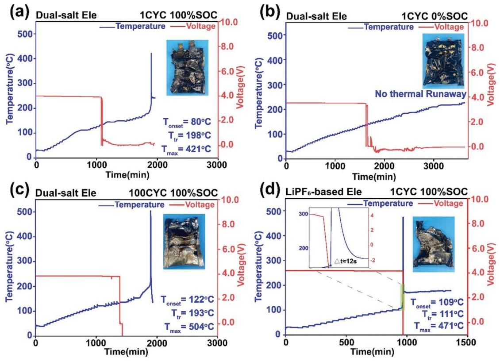
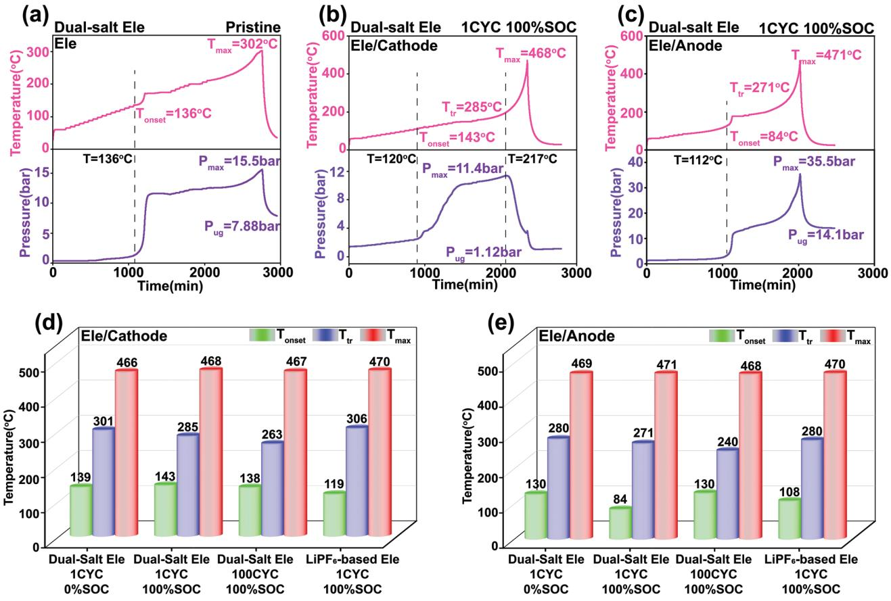
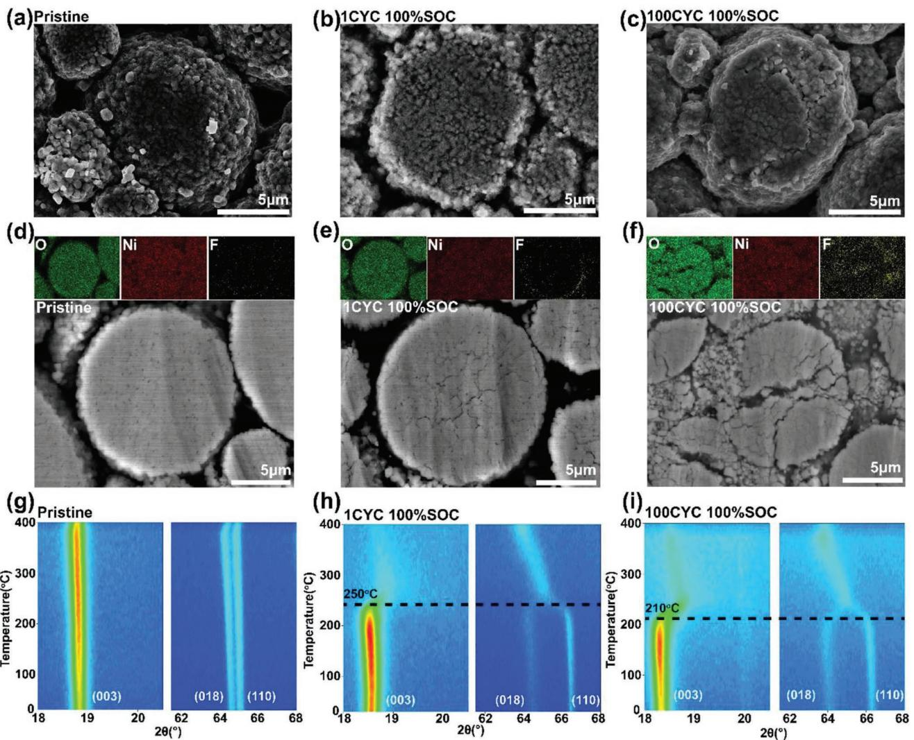
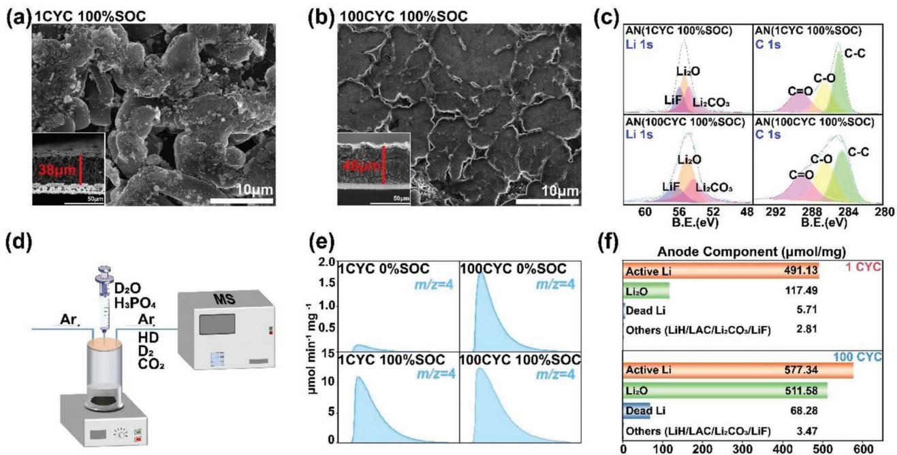
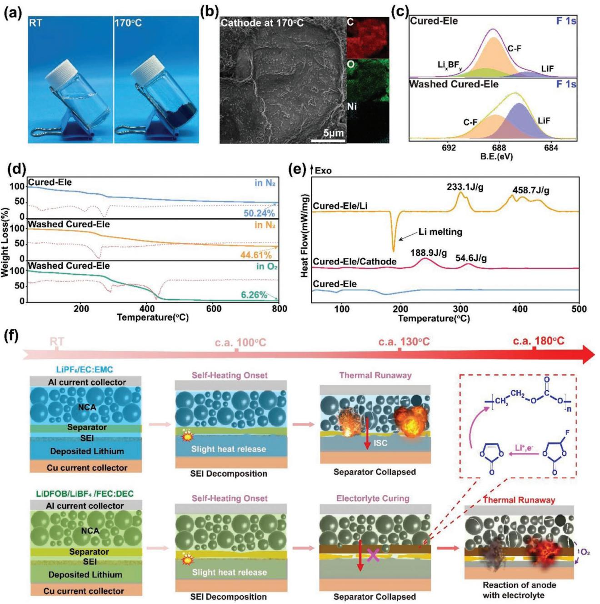

# **Deciphering the Thermal Failure Mechanism of Anode-Free Lithium Metal Pouch Batteries**

*Xiaohu Zhang, Lang Huang,\* Bin Xie, Shenghang Zhang, Zhaoxuan Jiang, Gaojie Xu, Jiedong Li, and Guanglei Cui\**

**Anode-free lithium metal batteries (AFLMBs) are the subject of increasing attention due to their ultrahigh energy density, simplified structure, reduced cost, and relatively high safety, but their thermal runaway performance under abuse conditions has been rarely explored, and a clear understanding of whether the absence of a highly-reactive lithium metal anode is equal to thermal runaway free remains elusive. Herein, by systematically examining the thermal runaway characteristics of a 2.0 Ah AFLMB, it is revealed that under elevated temperatures, discharged anode-free pouch cell is safe while the fully-charged one indeed undergoes thermal runaway, but with a milder intensity than that of a lithium metal battery with the same capacity. Moreover, mechanistic investigations demonstrate that thermal runaway of an AFLMB employing a conventional electrolyte is triggered and dominated by anodeinduced exothermic interactions and the broken separator induced electrodes interaction. Moreover, it is shown for the first time that adding fluoroethylene carbonate in an electrolyte leads to ring-opening repolymerization at 170 °C to form a thermal-stable solid layer between anode and cathode, which inhibits the direct contact of electrodes and effectively postpones violent selfheating. This comprehensive exploration of thermal runaway characteristics and mechanisms of large format AFLMBs sheds fresh light on developing high energy density and safety-enhanced lithium metal batteries.**

## **1. Introduction**

This decade has witnessed the booming development of lithium-ion batteries (LIBs) in varied applications ranging from

X. Zhang, L. Huang, B. Xie, S. Zhang, Z. Jiang, G. Xu, J. Li, G. Cui Qingdao Industrial Energy Storage Research Institute Qingdao Institute of Bioenergy and Bioprocess Technology Chinese Academy of Sciences Qingdao 266101, China E-mail: huanglang@qibebt.ac.cn; cuigl@qibebt.ac.cn X. Zhang Center of Materials Science and Optoelectronics Engineering University of Chinese Academy of Sciences Beijing 100049, P. R. China S. Zhang, G. Cui School of Future Technology University of Chinese Academy of Sciences Beijing 100049, China

The ORCID identification number(s) for the author(s) of this article can be found under https://doi.org/10.1002/aenm.202203648.

#### **DOI: 10.1002/aenm.202203648**

consumer electronic devices, electric vehicles to large-scale grid storage systems.[1] However, the energy density of conventional LIBs is limited to 350 Wh kg−1 , [2] and the ever-growing endurance anxiety stimulates the pursuit of batteries with ultrahigh energy density exceeding 500 Wh kg−1 . The employment of lithium metal anode with ultra-high theoretical capacity (3860 mAh g−1 ), and small gravimetric density (0.534 g cm−3 ), has been recognized as an important route to achieve this great goal.[3] Unfortunately, lithium metal batteries (LMBs) reported in literatures are generally employing excess amount of metallic lithium than it really needed to maintain the electrochemical performance,[2b] which leads to exacerbated lithium/electrolyte parasitic reactions and induces uncontrollable dendrites growth, resulting in severe safety concerns.[4] Besides, reducing the thickness of lithium metal anode to less than 50 µm brings technically challenges in largescale manufacturing and cell assembling processes.[2e,5] To tackle these problems, anode-free lithium metal battery (AF-LMB)

without excess lithium is proposed, which has attracted extensive attention in the research community in recent days.[6–7]

Compared with LMBs, AF-LMBs process several remarkable merits: 1) the absence of lithium anode eliminates the sensitivities from water and oxygen during battery assembly process, simplifying the manufacturing condition and reducing the overall cost;[8] 2) the over-discharge issue of cathode can be alleviated due to all lithium sources come from the cathode;[9] 3) no excess of lithium significantly improves both volumetric and gravimetric energy density of AF-LMBs;[8,10] 4) reducing the lithium content also promote the safety performance of AF-LMBs.[9] Unfortunately, unstable cycle performance and poor cycle life remain the bottlenecks holding back their applications. Great efforts have been devoted to solving these problems. Optimizing electrolytes is the key to prolonging the life span of AF-LMBs. Highconcentration (3 m) LiNO3 salt,[11] lithium Bis(fluorosulfonyl) imide (LiFSI) in fluorinated 1,4-dimethoxylbutane,[12] dualsalts electrolyte,[13] have been developed to tune the interfacial compatibility and modify the electrode/electrolyte interlayers, which greatly promotes their cycling stability. Furthermore, rational design of anode structures, for example, nanoscale Al2O3 or PEO film coating on the current collector,[14] novel current collectors,[8] or artificial solid-electrolyte interface (SEI) with a dense inorganic inner layer,[15] also facilitates uniform Li stripping and plating, improving the long-term cycling performance of AF-LMBs.

However, compared with the booming investigation on developing advanced materials and gaining in-depth understanding of interfacial chemistry of AF-LMBs, the safety characteristics evaluations, which remain the first priority concern when it comes to practical applications, is obviously lagged behind. It should be noted that AF-LMBs are not complete absence of metallic lithium. The charging process inducing lithium plating on anode also produces active and inactive lithium, which forms complicated SEI,[10,16] thus some of the safety issues of LMBs may still apply to AF-LMBs. Yet unlike the well-depicted thermal runway route of commercial LIBs,[17] mechanistic understanding of lithium metal anode on the thermal failure pathways of large format batteries is quite inadequate. To date, researches on thermal runaway (TR) of LMBs mainly focus on the thermal compatibility between metallic lithium anode with electrolytes. Conventional lithium hexafluorophosphate (LiPF6) based electrolyte is reported to present poor thermal stability (<120 °C) with Li metal anode, while employing dual salts of lithium Difluoro (oxalato) borate (LiDFOB) / lithium bis(trifluoromethane sulfonyl) imide (LiTFSI) effectively puts off the onset exothermic temperature to 160 °C.[18] Even replacing the flammable organic liquid electrolyte with all solid-state electrolyte cannot avoid the thermal runaway due to the low melting point and high chemical reactivity natures of metallic lithium.[19] But the addition of LiPO2F2 is proved to effectively impede the interfacial reactions between lithium and solid state electrolyte and delay the thermal runaway.[20] Moreover, the lithium deposition morphology and the induced Li dendrite growth and "dead lithium"[21] are also demonstrated to pose huge influences on the thermal stability and compatibility.[22] However, recent safety explorations of LMBs and AF-LMBs are still limited on their cycling failures and their parasitic interfacial reactions,[4a,23] while in-depth investigation on how they get violent thermal runaway remains unveiled. Therefore, a systematical safety assessment of AF-LMBs is urgently needed to clarify these puzzles, which is vital to guide further battery optimizations and break through the bottleneck of the development high energy anode-free lithium metal batteries.

Herein, the thermal runaway routes of AF-LMB pouch cells employing dual-salt electrolytes of 0.6 m LiDFOB and 0.6 m lithium Tetrafluoroborate (LiBF4) in FEC: diethyl carbonate (DEC) (volume ratio 1:2)) are investigated from electrode material level to whole pouch cell. The effects of Li metal content, electrolyte decomposition, SEI structure, electrodes/electrolyte reactions, gassing, and internal short circuit (ISC) on the thermal runaway route are systematically discussed. It reveals that AF-LMB pouch cells unsurprisingly present better thermal stability than that of LMBs with the same capacity. The thermal stabilities of both electrodes as well as the whole pouch cells deteriorate with increasingly cycling. For AF-LMBs, the reaction between electrolyte and anode is the triggering factor of thermal runaway. What's more, it is unprecedentedly observed that FEC with lithium salts undergoes solidification reaction at the elevated temperatures, which alleviates the vigorous thermal runaway propagation. This work sheds fresh light on understanding the thermal runaway mechanism of AF-LMBs and provides insightful guidance for the optimization strategy for next generation AF-LMBs with enhanced safety, which is a milestone of the development of high energy anode-free lithium metal batteries.

### **2. Results and Discussion**

#### **2.1. Thermal Runaway Characteristics of Pouch Cells**

Evaluating the whole cell thermal runaway performance is of great significance for gaining an overall understanding of the safety characteristics of AF-LMBs. Here, 2 Ah AF-LMB pouch cells are assembled using LiNi0.8Co0.15Al0.05O2 cathode, with 0.6 m LiDFOB/0.6 m LiBF4 in FEC: DEC (volume ratio 1:2) as electrolyte and Al2O3 coated PE (Al2O3@PE) as a separator.[13a] Additionally, to examine the impact of electrolyte on AF-LMBs performance, conventional electrolyte of 1 m LiPF6 in ethylene carbonate (EC): ethyl methyl carbonate (EMC) (volume ratio 3:7) is also employed for assembling the AF-LMB pouch cells. The assembled pouch cells with dual-salt electrolyte exhibit extraordinary cycle performance with 84% capacity retention after 200 cycles between 3.8 and 4.25 V under 1000 kPa, while the capacity retention of AF-LMBs with conventional LiPF6-based electrolyte decays rapidly in the first 60 cycles, demonstrating good chemical compatibility and excellent electrochemical performance of dual-salt electrolyte (Figure S1, Supporting Information). Fully charged AF-LMB pouch cell (4.2 V, 100% SOC) after 1 cycle is tested by accelerating rate calorimeter (ARC) to monitor the cell temperature changes during heating using the typical heat-wait-search (HWS) mode, and parameters including onset temperature of self-heating (*T*onset), self-heating rate (SHR), thermal runaway temperature (*T*tr, defined as the temperature point when SHR reaching 1 °C min−1 ), and maximum temperature (*T*max) are recorded.[24] Fully charged AF-LMB pouch cell presents *T*onset of 80 °C, *T*tr of 198 °C and *T*max of 421 °C, accompanied with two discontinuous exothermic processes at about 80 and 130 °C in the HWS curve (**Figure 1**a). The built-in camera inside the cavity captures that the TR of AF-LMBs undergoes three thermal runway stages: inflating, smoking, and violently burning (Figure S2, Supporting Information). After fierce thermal runaway, only incomplete aluminum-plastic film is retained (inset in Figure 1a; Figure S3a, Supporting Information). It is generally believed that AF-LMBs, as a unique type of LMBs, are safer than LMBs.[4c] According to the HWS curve, LMBs present a similar TR process with the same capacity, exhibiting a lower Ttr of 191 °C, a significantly higher Tmax of 550 °C and more damaged aluminum plastic film (inset in Figures S4 and S3b, Supporting Information) compared with those from AF-LMBs, implying the TR of LMBs is indeed severer (Figure S4, Supporting Information). To thoroughly investigate the effect of lithium content on the TR path, fully discharged AF-LMB pouch cell (discharged to 3.0 V, 0% SOC) is also tested via ARC. The uncharged cell presents increased thermal stability with an

**Figure 1.** Heat-wait-search and voltage curves of AF-LMB pouch cells. AF-LMB pouch cell with LiDFOB/LiBF4 dual-salt electrolyte: a) at 100% SOC after the first cycle; b) at 0% SOC after the first cycle; c) at 100% SOC after 100th cycle; d) AF-LMB pouch cell with LiPF6-based electrolyte at 100% SOC after the first cycle.

intermittent heat release at around 180°C and no thermal runaway until 250°C (Figure 1b). Insets in Figure 1b and Figure S3c (Supporting Information)showing undamaged pouch cells after thermal runaway indicate there is no catastrophic burning or explosion occurring. These discrepancies of TR pathways are due to the different contents of metallic lithium on anode, and high Li metal loadings inevitably decrease the onset self-heating and increase the SHR. Moreover, the fully charged AF-LMB pouch cell after 100 cycles goes severe TR with a Ttr of 193 °C and a Tmax of 504 °C. Long cycling unavoidably leads to inferior thermal stability, while the high onset self-heating point indicates that the cycling aging process could postpone the initial exothermic reactions (Figure 1c). Additionally, it is worth noting that the pouch cell with LiPF6-based electrolyte presents a completely different TR character with a low triggering temperature, a high maximum temperature of 471 °C, and seriously damaged aluminum-plastic film (Figure 1d), illustrating the poor thermal compatibility between conventional LiPF6 based electrolytes and electrodes, which demonstrates that the LiDFOB/LiBF4 dual-salt electrolyte not only exhibits better electrochemical performance but also possesses high thermal stability compared to that from the traditional LiPF6 based one (All thermal runaway parameters of the pouch cells are summarized in Table S1, Supporting Information).

During the ARC test, cell voltages are also recorded and shown alongside the HWS curves. For the 1-cycled 100% SOC pouch cell, the voltage slumps to 0 V due to the internal short circuit (ISC) at ≈136 °C, which is caused by the melting down of PE based separator, evidenced by the "Ramp" tests of pouch cells with cellulose and Al2O3@PE separators (Figure S5, Supporting Information). The ISC taking place about 900 min ahead of the TR indicates the thermal runaway is not ascribed to the ISC-induced anode/cathode reactions in this system. Analogously, for pouch cells after long cycling, the voltage is observed similarly decreasing to 0 V at ≈136 °C, which is also long before the occurrence of thermal runaway. The time interval is about 500 min, much less than 900 min, implying the repeated lithium plating/stripping alters the self-heating characteristics and deteriorates the overall thermal stability of the pouch cell. In sharp contrast, voltage plot of the LiPF6-based pouch cell reveals that the rapid self-heating occurs right after the ISC and it is the interactions of anode/cathode after separator collapse that accelerate the thermal runaway (Figure 1d), demonstrating that different electrolytes present different thermal runaway performance of the AF-LMBs.

#### **2.2. Battery Component Thermal Compatibility**

To acquire an advanced understanding of the rooted mechanism triggering the thermal runaway of the whole cell, separated electrode materials and electrolyte are collected and tested. Specifically, anode with Li plating (An) and NCA cathode (Ca) are carefully dissembled from fully charged and discharged (100%

**Figure 2.** ARC test results of cathodes and anodes with the electrolyte in different cycles. a) Dual-salt electrolyte; b) Dual-salt electrolyte with delithiated cathode after the first cycle; c) Dual-salt electrolyte with Li-plating anode after the first cycle; d) Cell components stabilities and compatibilities of cycled cathode with dual-salt electrolyte or LiPF6-based electrolyte; e) Cell components stabilities and compatibilities of cycled anode with dual-salt electrolyte or LiPF6-based electrolyte. The HWS curves are shown in Figures S7 and S8 (Supporting Information).

SOC & 0% SOC) AF-LMB pouch cell after 1 cycle or 100 cycles in an Ar-filled glove box. For comparison, pristine electrolyte and electrodes are also examined to elucidate their intrinsic thermal stabilities. ARC data of pristine electrolyte demonstrates its selfheating starts at about 136 °C (**Figure 2**a), which is higher than the initial self-heating point of the pouch cell (80 °C), demonstrating that electrolyte itself is not responsible for triggering the exothermic chain reaction during elevated temperature. The gassing-induced pressure change is also presented, and it clearly shows a rapid increase after the *T*onset of 136 °C, which could be attributed to the evaporation of the low-boiling point solvent as well as the reaction produced gaseous species. After cooling to room temperature, the pressure of non-condensable gases (Tug) remains to be 7.88 bar, which is confirmed by MS to be dominated by C2H4/CO mainly generated from the degradation of the electrolyte (Figure S6, Supporting Information). Pristine layered cathode is commonly thermal stable and the pristine NCA/electrolyte HWS curve presents similar parameters to that of the pure electrolyte, while lithium metal shows high reactivity to electrolyte, with a Tonset of 133 °C, and a Ttr of 345 °C (Figure S7a, Supporting Information), implying that the anode metallic lithium does play a vital role in determining the thermal safety perform under abused conditions. Furthermore, delithiated NCA cathode material disassembled from fully charged pouch cell is heated with electrolyte, and the HWS plot exhibits a Tonset of 143 °C and a *T*tr of 285 °C (Figure 2b). In addition, pressure builds up at an early temperature of 120 °C, indicating the decreased thermal stability of the layered cathode after charge. Besides, the pressure curve goes down sharply at the temperature of 217 °C, where the self-heating still ramps up at a high rate. This could be ascribed to the reaction between electrolyte degradation species and the oxygen released from layered NCA cathode structural collapse. On the other hand, it is unsurprisingly to observe that the lithiated anode/electrolyte combination exhibits a low onset heating temperature of 84 °C, which is consistent with the whole pouch cell, indicating that it is the anode/electrolyte interaction that starts the heating process during increased temperatures (Figure 2c). Besides, pure electrolyte/Li metal self-heating initiates the exothermic reaction at 133 °C (Figure S7a, Supporting Information), much higher than that of the lithiated anode/electrolyte, evidencing that the SEI layer formed during cycling triggers the onset selfheating. The *T*tr of anode/electrolyte (271 °C) is dramatically lower than that from cathode/electrolyte (*T*tr = 285 °C), telling that heat releases at anode side are determinant to the whole cell thermal runaway performance. The pressure plot also demonstrates that anode/electrolyte generates more gaseous amount than those from electrolyte and cathode/electrolyte.

Furthermore, the thermal compatibility of electrodes disassembled from 0% SOC & 1-cycled and 100% SOC & 100-cycled pouch cells with electrolyte are investigated as comparison (Figure 2d,e). It reveals that fully charged anode and cathode both present poorer thermal compatibility with electrolyte than those of the discharged ones, due to the delithiation of NCA and lithium plating on anode increase their chemical reactivity and consequently lower the thermal stability. For electrode materials after long cycling process, 100% SOC & 100-cycled cathode/electrolyte shows decreased *T*onset and *T*tr due to the periodic delithiation/lithiation deteriorating the NCA cathode, while the 100% SOC & 100-cycled anode/electrolyte starts initial self-heating at a high temperature of 130 °C (Figure S7c, Supporting Information), unveiling that the repeat SEI broken and regeneration could eliminate some thermally active components and lead to a more stable SEI layer. In comparison, thermal compatibility of electrodes with conventional LiPF6-based electrolyte is also investigated, and the LiPF6-based electrolyte possesses onset self-heating of 108 and 119 °C, thermal runaway temperature of 280 and 306 °C with anode and cathode, respectively (Figure S8, Supporting Information). Interestingly, for AF-LMB pouch cell, the *T*tr is much lower than those from the reaction of electrolyte/electrodes, indicating that the ISC or anode/cathode cross talks also contributed to the exothermic chain reactions during abused conditions.

#### **2.3. Cathode Morphology and Thermal Stability**

To further investigate the morphology and thermal stability of the electrodes, in situ heating XRD measurement and SEM are employed to characterize the materials disassembled from pouch cells after 1 cycle and 100 cycles. Pristine NCA cathode presents a typical layered oxide polycrystalline morphology, with a particle diameter of about 10 µm, and its cross-sectional SEM image confirms the compact and uniform structure inside (**Figure 3**a,d). After the delithiating process, one cycled 100% SOC cathode exhibits flat particle surface due to the electrode roll-pressing prior to pouch cell assembly. No obvious surface cracks are observed, while the cross-sectional image indicates that the delithiation decreases the inner structure integrity and induces slight cracks due to the anisotropic stress from extraction/insertion of lattice lithium during the charge and discharge process (Figure 3b,e). As the cycling time prolongs, the 100 times cycled 100% SOC cathode presents several microcracks on the particle surface, revealing that the periodic lithiation/delithiation leads to irreversible mechanical damage to the cathode particles. In addition, particle pulverization and severe inner crack propagation are clearly observed from the crosssectional view, demonstrating the overall deterioration of the cathode after long cycling (Figure 3c,f). Moreover, F elemental mappings of cross-section indicate that the pristine and 1 cycled 100% SOC cathode are free of electrolyte penetration, while the 100 cycled 100% SOC cathode is severely eroded inside due to the inner cracks, which would accelerate the unfavorable interfacial interactions. To further reveal the thermal stability of the cathode material, in situ heating XRD is employed to investigate the layered cathode phase changes upon elevated temperatures. The intensities of characteristic peak of (003), (018), and (110) remaining unchanged up to 400 °C implies the excellent initial thermal stability of pristine and undelithiated NCA (Figure 3g; Figure S9, Supporting Information). After the delithiation, the 1 cycle and 100% SOC cathode presents a phase transitions at 250 °C (Figure 3h), which corresponds to the initial evolution of layered-spinel-rock salt phase transformations. This phase change process is also accompanied with the release of lattice oxygen as documented previously.[25] It is worth noting that the Ele/Cathode reaction in Figure 2b exhibits a pressure drop at 217 °C, demonstrating that the generated O2 from the cathode reacts with the degradation of gaseous species and decreases the inner pressure. As to the long cycled cathode, the structure integrity further decreases and the phase transformations start at ≈210 °C accompanied by the release of oxygen, which could be attributed to the aggravated mechanical defects as well as the deteriorated interfacial side reactions (Figure 3i).

#### **2.4. Anode Morphology and Composition**

According to the electrodes/electrolyte thermal compatibility results aforementioned, anode active materials play a vital role in determining the thermal runaway self-heating route under abused situations. Herein, the effects of morphology and chemical component evolutions of the plated lithium anode on the thermal stability are investigated. Nondestructive CT scanning of the pouch cells reveals the cycling process leads to loosen inner structure with several plating defects, demonstrating the repeat plating/stripping deteriorates the structure integrity (Figure S10, Supporting Information). After disassembling the pouch cell in glove box, visualized SEM images of the anode electrode with different morphology are presented. Dendrite-free surfaces are both observed for 1cycle and 100 cycles anode, indicating the excellent electrochemical compatibility of the LiDFOB/LiBF4 electrolyte with lithium anode, in line with previous report.[13a] The thickness of metallic lithium after the first plating is 38 µm, while that reaches 46 µm after the 100th charging process, indicating electrochemical inactive Li accumulating on the anode (**Figures 4**a,b). In addition, the discharged anodes after 1 cycle and 100 cycles are also characterized and their thicknesses of Li plating are 10 µm and 40 µm (Figure S11, Supporting Information), respectively, and the discharged anodes presenting much loosen inner structures implies the wide distribution of the "dead lithium" in the anode. To explore the chemical components inside the SEI layer upon cycling, XPS is employed and the spectra indicate the existence of LiF, Li2O, Li2CO3, etc. Larger content of Li2O, CO, and CO is found after 100 cycles, which indicates more Li2CO3 and ROCO2Li (LAC) are formed during repeat charge/discharge (Figure 4c). To further quantify the components difference, D2O and H3PO4 titration experiments with an on-line gas analysis mass spectrometry (MS) system are designed to acquire the specific content of Li, LiH, LAC, and Li2CO3 (Figure 4d) and the testing and calculation method are detailed in the experimental section.[26] The content of metallic lithium determined by D2Otitration is 496.84 µmol mg−1 (1 cycle) and 645.63 µmol mg−1 (100 cycles) in fully-charged anode, while it decreases to 5.71 µmol mg−1 (1 cycle) and 68.28 µmol mg−1 (100 cycles) after the discharging process (0% SOC) (Figure 4e). This reveals a

**www.advancedsciencenews.com www.advenergymat.de**

**Figure 3.** Typical surface SEM images of NCA cathode a) Pristine NCA; b) Delithiated cathode after the first cycle; c) Delithiated cathode after 100th cycle. Cross-sectional SEM images and O, Ni, F mapping results of cathode d) Pristine NCA; e) Delithiated cathode after the first cycle; f) Delithiated cathode after 100th cycle. In situ XRD characterization of dry NCA cathode g) Pristine NCA; h) Delithiated cathode after the first cycle; i) Delithiated cathode after 100th cycle.

larger amount of decomposition is detected in anode after long cycling and also indicates the accumulation of inactive Li upon periodic charge and discharge. The resulting liquid after titration is diluted and tested under ion chromatography (IC) and Inductively Coupled Plasma Optical Emission Spectrometer (ICP-OES) to obtain the concentrations of F− and Li+ for further calculations. The amounts of the chemical components in 100% SOC anode after 1 cycle and 100 cycles are exhibited in Figure 4f (detailed results in Table S2, Supporting Information). Active Li (491.13 µmol/mg for 1 cycle and 577.34 µmol mg−1 after 100 cycles) and inactive Li (5.71 µmol mg−1 for 1 cycle and 68.28 µmol mg−1 after 100 cycles) are the dominant components in anode. The increase of the metallic lithium amount after 100 cycles explains the intensive furious thermal runaway of the long-cycled pouch cell in Figure 1c. Moreover, the long term cycled anode contains larger amount of by-products (LiH, ROCO2Li, Li2CO3, LiF, Li2O), and the inorganic components, such as Li2O (117.49 µmol mg−1 and 511.52 µmol mg−1 for 1st and 100th cycled anode), are much more than that from the uncycled anode. The inorganic species content rich SEI is certainly of higher thermal stability and therefore makes the fully charged 100 cycles pouch cell exhibit a higher onset self-heating temperature compared with that of the one cycled cell shown in Figure 1a,c. The anode composition analysis demonstrates that during the thermal runway, the Tmax is closely related to the metallic Li amount while the self-heating onset is determined by the chemical composition and thermal stability of the formed SEI layer.

#### **2.5. Thermal Reaction Mechanism of Electrolyte**

Except for the chemical and thermal stabilities of the electrodes, the electrolyte also affects the thermal runaway route of

**Figure 4.** Typical SEM images and cross-sectional SEM images of anode after a) the first cycle and b) 100th cycle; c) XPS Li 1s and C 1s spectra of lithiated anodes at the first and 100th cycle; d) Schematic illustration of delicately-designed on-line D2O and H3PO4 titration gas analysis MS system; e) The D2 evolution rate curves after D2O titration on anodes at different states; f) Quantitative analysis of Li-plating anodes after the first and 100th cycle components by titration, IC and ICP-OES. Detailed results are shown in Table S2 (Supporting Information).

pouch cells as depicted above. It is mentioned earlier that an unprecedented liquid solidification is observed during heating the electrolyte to 170°C and above (**Figure 5**a). To further clarify how this phenomenon influences the exothermic reactions inside the pouch cell, mechanistic investigation from the molecular scale is conducted. First of all, different components from the LiDFOB-LiBF4/FEC/DEC electrolyte system are mixed and heated. DEC in combination of LiDFOB or LiBF4 remains liquid at elevated temperatures, and the subsequent 1 H, 11B, and 19F NMR tests indicate only LiDFOB suffers decomposition to form LiBF4 and LiBOB whereas LiBF4 remains unchanged (Figures S12 and S13, Supporting Information).[27] On the other hand, both FEC/LiDFOB and FEC/LiBF4 undergo curing during heating to up 170 °C (Figure S12, Supporting Information), indicating FEC plays a vital role during the heat-induced solidification. Furthermore, heating FEC itself is free of solid, while the incorporation with lithium salts (including LiDFOB, LiBF4, LiTFSI, and LiPF6 with varied concentrations) all leads to the formation of solid black lumps (Figure S14, Supporting Information), which are insoluble even in strong polar solvents (Figure S15, Supporting Information). This confirms that FEC repolymerization at high temperature at the presence of Li+, and the possible reaction route is illustrated in figure 5f, agreeing well with previously reports.[28] Visualized SEM image of the cured electrolyte (named as Cured-Ele) shows that the cured solid is flat shaped and the element mapping implies it contains C, O and F (Figure S16, Supporting Information). Likewise, it can be clearly seen that there are black lumps on the surface of cathode disassembled from AF-LMB pouch cell heated up to 170 °C (Figure 5b). Besides, heating the electrolyte with disassembled anode or cathode (100% SOC) also presents similar curing outcomes (Figure S17, Supporting Information), which would definitely impact the thermal compatibility between electrolyte and electrodes and alter the exothermic chain reactions of the whole cell.

To move one step forward to reveal the chemical composition and the thermal and chemical stability of the cured electrolyte, the solid residuals are washed by DEC and then centrifuged to separate the liquid and remaining solid (named as Washed Cured-Ele) (Figure S18, Supporting Information). NMR spectrum of the centrifuged liquid exhibit the signal peaks of LiBF4 and LiDFOB, indicating that the lithium salts are co-deposited on the solid clumps during the solidification (Figure S19, Supporting Information). For the Washed Cured-Ele, comparison of XPS F 1s spectra of unwashed and washed cured electrolyte confirms the existence of Li salts (Figure 5c). Besides, LiF is also evidenced to exist in the Washed Cured-Ele by the Li 1s spectra and solid-state 7 Li MAS-NMR spectra (Figure S20, Supporting Information). The thermal stability of the Cured-Ele is investigated by TG between 30 and 800 °C at a rate of 5 °C min−1 in N2 atmosphere. Weight loss peaks (red dotted line) of Cured-Ele before 200 °C are attributed to the decomposition of LiDFOB and LiBF4 (Figure S21, Supporting Information). Mass loss at around 250 °C is ascribed to oligomer degradation, which can be found in both Cured-Ele and Washed Cured-Ele, demonstrating that the solidified polymers suffer decompositions at high temperatures (Figure 5d). Moreover, when heating under O2 atmosphere, Washed Cured-Ele presents a new weight loss peak at 450 °C, corresponding to the reaction between O2 and C, H, O containing polymers, and the remaining residual content reducing from 44.61% under N2 heating to 6.26% in O2 atmosphere implies organic elements are the dominant components

**www.advancedsciencenews.com www.advenergymat.de**

**Figure 5.** a) Typical images of dual-salt electrolyte before and after heating and curing; b) SEM and element mapping images of cathode disassembled from AF-LMB pouch cell heated up to 170 °C; c) XPS profiles for the cured electrolyte (purple) and washed cured electrolyte (yellow); d) TG results of cured electrolyte in N2 atmosphere and washed cured electrolyte in N2 and O2 atmosphere between 30 and 800 °C; e) DSC profiles of the cured electrolyte mixed with metallic lithium and delithiated cathode; f) An illustration of the AF-LMBs thermal runaway routes with dual-salt and conventional LiPF6-based electrolytes.

of the cured solid coating (Figure 5d). DSC is employed to further demonstrate the heat-release performance of the Cured-Ele. There is no obvious exothermic peak observed for Cured-Ele itself in N2 atmosphere, depicting that the formed solid polymer compounds contribute little for push up the temperature raise during thermal runaway (Figure 5e). Moreover, electron conductivity measurement indicates that the conductivity of Cured-Ele is 2.432 × 10−9 S cm−1 , which can be considered as electric insulation (Figure S22, Supporting Information). Therefore, for the pouch cell under elevating temperatures, the LiDFOB-LiBF4/FEC/DEC electrolyte undergoes solidification and adheres to the cathode surface to form an electric insulating and thermal stable protective coating, which effectively inhibits the separator collapse-induced ISC and alleviates the consequent exothermic reactions, thus explaining the internal short circuit doesn't trigger rapid thermal runaway in Figure 1a,

while the conventional LiPF6/EC/EMC pouch cell goes violent failure right after the ISC. Besides, thermal compatibility of the cured electrolyte with electrodes is presented, the solidified Cured-Ele mixing with metallic lithium generates two obvious exothermic peaks at 301.1 and 387.37 °C, with enthalpy change of 233.1 and 458.7 J g−1 . As a comparison, the combination of Cured-Ele with delithiated cathode presents exothermic signals at 240.7 and 312.7 °C with the two heat release of 188.9 and 54.6 J g−1 , indicating that this polymer layer shows good thermal compatibility with the cathode materials, which also implies that the inevitable thermal runaway of the LiDFOB-LiBF4/FEC/DEC electrolyte is dominated by the exothermic reactions between anode and electrolyte (Figure 5e). Moreover, the fully charged cathode presents obvious exothermic signals starting at 235 °C (Figure S23, Supporting Information), corresponding well to the phase changes and O2 release point of the delithiated NCA (Figure 3g). In summary, the thermal runaway routes of AF-LMB pouch cells with different electrolytes are elucidated as in Figure 5f. The self-heating is initiated with the heating released from SEI decompositions as well as electrolyte/anode interfacial reactions. For pouch cell with FEC-free LiPF6 electrolyte, the temperature ramping to ≈130 °C leads to breaking down of the polyolefin-based separator, which induces disastrous heat release from the direct contact of anode and cathode and results in rapid thermal runaway. While for pouch cell with FEC, the temperature increase introduces the FEC ring opening and repolymerization, forming a thermal stable and insulating solid coating on cathode, which temporarily prevents the fierce self-heating process. However, the continues temperatures increasing up to 180°C unavoidably lead to exothermic reactions between anode and cured electrolyte, and pouch cell eventually goes thermal runaway along with the O2 release from the phase changes of the layered oxide cathode. Furthermore, to verify the universality of the FEC solidification, LiNi0.8Co0.1Mn0.1O2 (NCM811)||SiOx/Graphite pouch cells employing dual-salt electrolyte and conventional LiPF6-based one are manufactured and tested. Similar re-polymerization is observed for the FEC-based one during thermal runaway, indicating that the FEC resulted-solidification is also applicable in other systems (Figure S24 and Table S1, Supporting Information).

### **3. Conclusion**

In summary, the TR features of AF-LMBs are tested and discussed. AF-LMBs exhibit less severe TR characteristics compared with that of LMBs due to the difference in metallic lithium content and morphology of anode. AF-LMBs with conventional LiPF6 based electrolyte present worse thermal stability than that of LiDFOB-LiBF4/FEC/DEC one. The TR of AF-LMB pouch cells starts from anode side. With multiple state-of-art characterizations, the thermal stability and thermal compatibility of disassembled electrodes and electrolytes are analyzed. Anode reacting with electrolyte is demonstrated to be the decisive factor triggering the TR. More importantly, it is revealed here that for pouch cell of electrolyte with FEC, the temperature increase introduces the FEC ring-opening and repolymerization, forming a thermally stable and insulating solid coating on the cathode, which effectively prevents the internal short circuit, and delays the TR process, while the FEC-free one goes rapidly TR as the direct contact of anode and cathode. This insightful deciphering of TR mechanism provides important guidance for materials and system optimization of next generation AF-LMBs.

# **4. Experimental Section**

The Materials, Pouch cell assembly, Electrochemical Measurements of the pouch cells, Material Thermal Characterization, and Material Compositional and Morphological Characterization are elaborately detailed in the Supporting Information.

# **Supporting Information**

Supporting Information is available from the Wiley Online Library or from the author.

# **Acknowledgements**

X.Z. and L.H. contributed equally to this work. This work was financially supported by the National Natural Science Foundation of China (Grant Nos. 52203283, U22A20440, and 22139001), the Finance Science and Technology Project of Hainan Province (ZDKJ202014), the Natural Science Foundation of Shandong Province (ZR2021QC117, ZR2021QB030).

# **Conflict of Interest**

The authors declare no conflict of interest.

# **Data Availability Statement**

The data that support the findings of this study are available from the corresponding author upon reasonable request.

#### **Keywords**

anode free batteries, dual salts electrolytes, internal short circuits, lithium metal anodes, thermal runaway

> Received: October 27, 2022 Revised: December 7, 2022 Published online: January 4, 2023

[1] a) X. Zeng, M. Li, D. Abd El-Hady, W. Alshitari, A. S. Al-Bogami, J. Lu, K. Amine, *Adv. Energy Mater.* **2019**, *9*, 1900161; b) V. Etacheri, R. Marom, R. Elazari, G. Salitra, D. Aurbach, *Energy Environ. Sci.* **2011**, *4*, 3243.

[2] a) Y. Tian, G. Zeng, A. Rutt, T. Shi, H. Kim, J. Wang, J. Koettgen, Y. Sun, B. Ouyang, T. Chen, Z. Lun, Z. Rong, K. Persson, G. Ceder, *Chem. Rev.* **2021**, *121*, 1623; b) J. Liu, Z. Bao, Y. Cui, E. J. Dufek, J. B. Goodenough, P. Khalifah, Q. Li, B. Y. Liaw, P. Liu, A. Manthiram, Y. S. Meng, V. R. Subramanian, M. F. Toney, V. V. Viswanathan, M. S. Whittingham, J. Xiao, W. Xu, J. Yang, X.-Q. Yang, J.-G. Zhang, *Nat. Energy* **2019**, *4*, 180; c) F. Wu, J. Maier, Y. Yu, *Chem. Soc. Rev.*

**www.advancedsciencenews.com www.advenergymat.de**

**2020**, *49*, 1569; d) R. Wang, W. Cui, F. Chu, F. Wu, *J Energy Chem* **2020**, *48*, 145; e) Z. Xie, Z. Wu, X. An, X. Yue, J. Wang, A. Abudula, G. Guan, *Energy Storage Mater.* **2020**, *32*, 386.

- [3] a) C. Wang, C. Yang, Z. Zheng, *Adv. Sci. (Weinh)* **2022**, *9*, 2105213; b) H. Liu, X. B. Cheng, R. Xu, X. Q. Zhang, C. Yan, J. Q. Huang, Q. Zhang, *Adv. Energy Mater.* **2019**, *9*, 1902254.
- [4] a) Q. Wu, G. Zhang, M. Gao, S. Cao, L. Li, S. Liu, C. Xie, L. Huang, S. Yu, A. J. Ragauskas, *J. Cleaner Prod.* **2019**, *213*, 1096; b) Y. Zhang, T.-T. Zuo, J. Popovic, K. Lim, Y.-X. Yin, J. Maier, Y.-G. Guo, *Mater. Today* **2020**, *33*, 56; c) Y. Tian, Y. An, C. Wei, H. Jiang, S. Xiong, J. Feng, Y. Qian, *Nano Energy* **2020**, *78*, 105344.
- [5] R. Schmuch, R. Wagner, G. Hörpel, T. Placke, M. Winter, *Nat. Energy* **2018**, *3*, 267.
- [6] J. Qian, B. D. Adams, J. Zheng, W. Xu, W. A. Henderson, J. Wang, M. E. Bowden, S. Xu, J. Hu, J.-G. Zhang, *Adv. Funct. Mater.* **2016**, *26*, 7094.
- [7] J. Ju, S. Dong, Y. Cui, Y. Zhang, B. Tang, F. Jiang, Z. Cui, H. Zhang, X. Du, T. Lu, L. Huang, G. Cui, L. Chen, *Angew Chem Int Ed Engl* **2021**, *60*, 16487.
- [8] L. Lin, L. Suo, Y. s. Hu, H. Li, X. Huang, L. Chen, *Adv. Energy Mater.* **2021**, *11*, 2003709.
- [9] W. Yao, P. Zou, M. Wang, H. Zhan, F. Kang, C. Yang, *Electrochem. Energy Rev.* **2021**, *4*, 601.
- [10] Z. Tong, B. Bazri, S.-F. Hu, R.-S. Liu, *J. Mater. Chem. A* **2021**, *9*, 7396.
- [11] R. Rodriguez, K. E. Loeffler, R. A. Edison, R. M. Stephens, A. Dolocan, A. Heller, C. B. Mullins, *ACS Appl. Energy Mater.* **2018**, *1*, 5830.
- [12] Z. Yu, H. Wang, X. Kong, W. Huang, Y. Tsao, D. G. Mackanic, K. Wang, X. Wang, W. Huang, S. Choudhury, Y. Zheng, C. V. Amanchukwu, S. T. Hung, Y. Ma, E. G. Lomeli, J. Qin, Y. Cui, Z. Bao, *Nat. Energy* **2020**, *5*, 526.
- [13] a) R. Weber, M. Genovese, A. J. Louli, S. Hames, C. Martin, I. G. Hill, J. R. Dahn, *Nat. Energy* **2019**, *4*, 683; b) M. Genovese, A. J. Louli, R. Weber, C. Martin, T. Taskovic, J. R. Dahn, *J. Electrochem. Soc.* **2019**, *166*, A3342.
- [14] a) Z. Tu, M. J. Zachman, S. Choudhury, K. A. Khan, Q. Zhao, L. F. Kourkoutis, L. A. Archer, *Chem. Mater.* **2018**, *30*, 5655; b) A. A. Assegie, J. H. Cheng, L. M. Kuo, W. N. Su, B. J. Hwang, *Nanoscale* **2018**, *10*, 6125.
- [15] Q.-K. Zhang, X.-Q. Zhang, H. Yuan, J.-Q. Huang, *Small Sci.* **2021**, *1*, 2100058.
- [16] C. J. Huang, B. Thirumalraj, H. C. Tao, K. N. Shitaw, H. Sutiono, T. T. Hagos, T. T. Beyene, L. M. Kuo, C. C. Wang, S. H. Wu, W. N. Su, B. J. Hwang, *Nat. Commun.* **2021**, *12*, 1452.
- [17] a) L. Huang, G. Xu, X. Du, J. Li, B. Xie, H. Liu, P. Han, S. Dong, G. Cui, L. Chen, *Adv. Sci. (Weinh)* **2021**, *8*, 2100676; b) Y. Li, X. Liu, L. Wang, X. Feng, D. Ren, Y. Wu, G. Xu, L. Lu, J. Hou, W. Zhang, Y. Wang, W. Xu, Y. Ren, Z. Wang, J. Huang, X. Meng, X. Han, H. Wang, X. He, Z. Chen, K. Amine, M. Ouyang, *Nano Energy* **2021**, *85*, 105878; c) H. Zhou, M. Parmananda, K. R. Crompton, M. P. Hladky, M. A. Dann, J. K. Ostanek, P. P. Mukherjee, *Energy Storage Mater.* **2022**, *44*, 326; d) D. Ren, X. Liu, X. Feng, L. Lu, M. Ouyang, J. Li, X. He, *Appl. Energy* **2018**, *228*, 633; e) J. Hou, X. Feng, L. Wang, X. Liu, A. Ohma, L. Lu, D. Ren, W. Huang, Y. Li,
- M. Yi, Y. Wang, J. Ren, Z. Meng, Z. Chu, G.-L. Xu, K. Amine, X. He, H. Wang, Y. Nitta, M. Ouyang, *Energy Storage Mater.* **2021**, *39*, 395.
- [18] Z. Geng, J. Lu, Q. Li, J. Qiu, Y. Wang, J. Peng, J. Huang, W. Li, X. Yu, H. Li, *Energy Storage Mater.* **2019**, *23*, 646.
- [19] R. Chen, A. M. Nolan, J. Lu, J. Wang, X. Yu, Y. Mo, L. Chen, X. Huang, H. Li, *Joule* **2020**, *4*, 812.
- [20] R. Chen, C. Yao, Q. Yang, H. Pan, X. Yu, K. Zhang, H. Li, *ACS Appl. Mater. Interfaces* **2021**, *13*, 18743.
- [21] R. Xu, J. F. Ding, X. X. Ma, C. Yan, Y. X. Yao, J. Q. Huang, *Adv. Mater.* **2021**, *33*, 2105962.
- [22] X. Q. Xu, X. B. Cheng, F. N. Jiang, S. J. Yang, D. Ren, P. Shi, H. Hsu, H. Yuan, J. Q. Huang, M. Ouyang, Q. Zhang, *SusMat* **2022**, *2*, 435.
- [23] X.-R. Chen, C. Yan, J.-F. Ding, H.-J. Peng, Q. Zhang, *J Energy Chem* **2021**, *62*, 289.
- [24] G. Xu, L. Huang, C. Lu, X. Zhou, G. Cui, *Energy Storage Mater.* **2020**, *31*, 72.
- [25] a) S. Choi, A. Manthiram, *J. Electrochem. Soc.* **2002**, *149*, 1157; b) X. Liu, G. L. Xu, L. Yin, I. Hwang, Y. Li, L. Lu, W. Xu, X. Zhang, Y. Chen, Y. Ren, C. J. Sun, Z. Chen, M. Ouyang, K. Amine, *J. Am. Chem. Soc.* **2020**, *142*, 19745.
- [26] G. Xu, J. Li, C. Wang, X. Du, D. Lu, B. Xie, X. Wang, C. Lu, H. Liu, S. Dong, G. Cui, L. Chen, *Angew Chem Int Ed Engl* **2021**, *60*, 7770.
- [27] L. Zhou, W. Li, M. Xu, B. Lucht, *Electrochem. Solid-State Lett.* **2011**, *14*, 1001.
- [28] a) Y. Zhang, D. Krishnamurthy, V. Viswanathan, *J. Electrochem. Soc.* **2020**, 167; b) Z. L. Brown, B. L. Lucht, *J. Electrochem. Soc.* **2018**, *166*, A5117; c) C. Xu, F. Lindgren, B. Philippe, M. Gorgoi, F. Björefors, K. Edström, T. Gustafsson, *Chem. Mater.* **2015**, *27*, 2591; d) Y. Jin, N. H. Kneusels, P. Magusin, G. Kim, E. Castillo-Martinez, L. E. Marbella, R. N. Kerber, D. J. Howe, S. Paul, T. Liu, C. P. Grey, *J. Am. Chem. Soc.* **2017**, *139*, 14992.