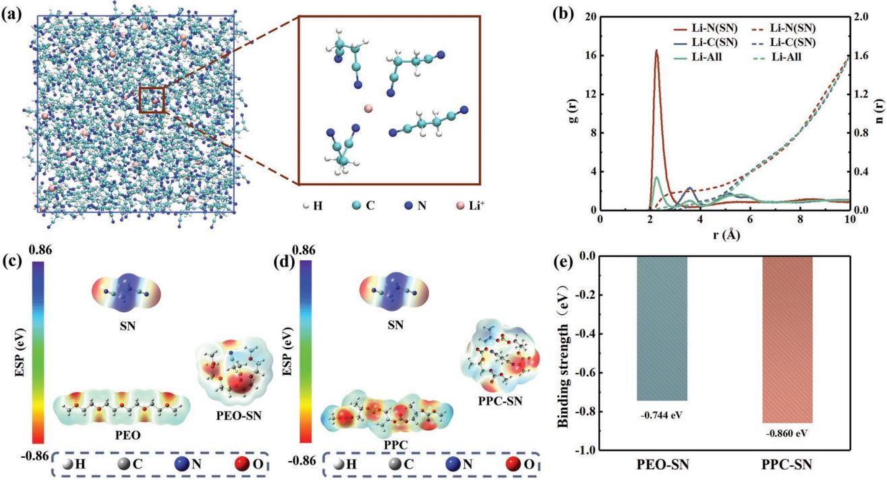
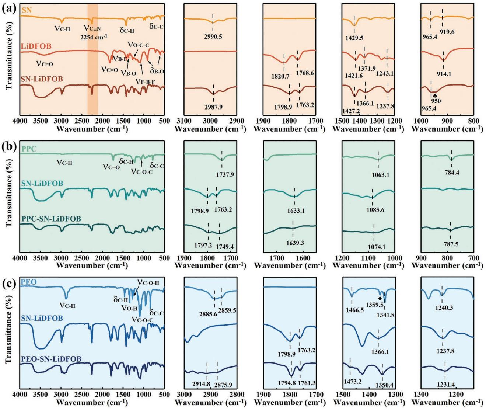
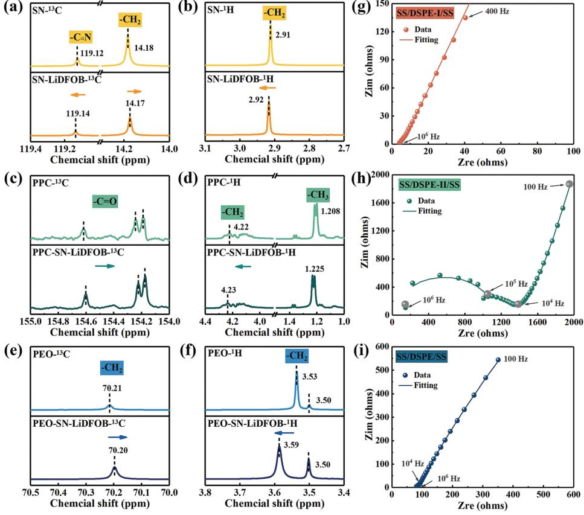
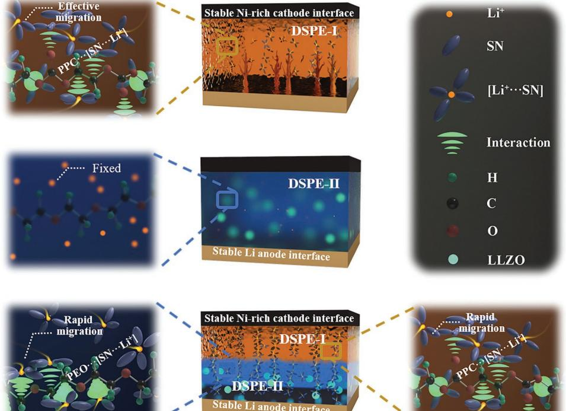
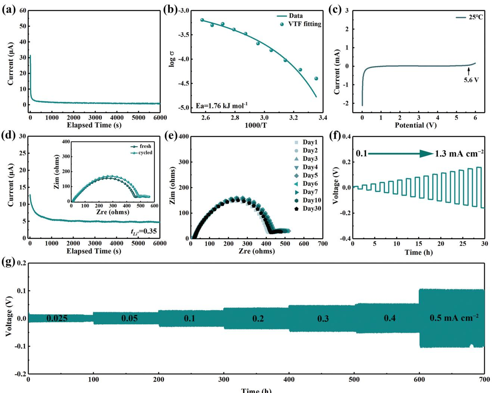
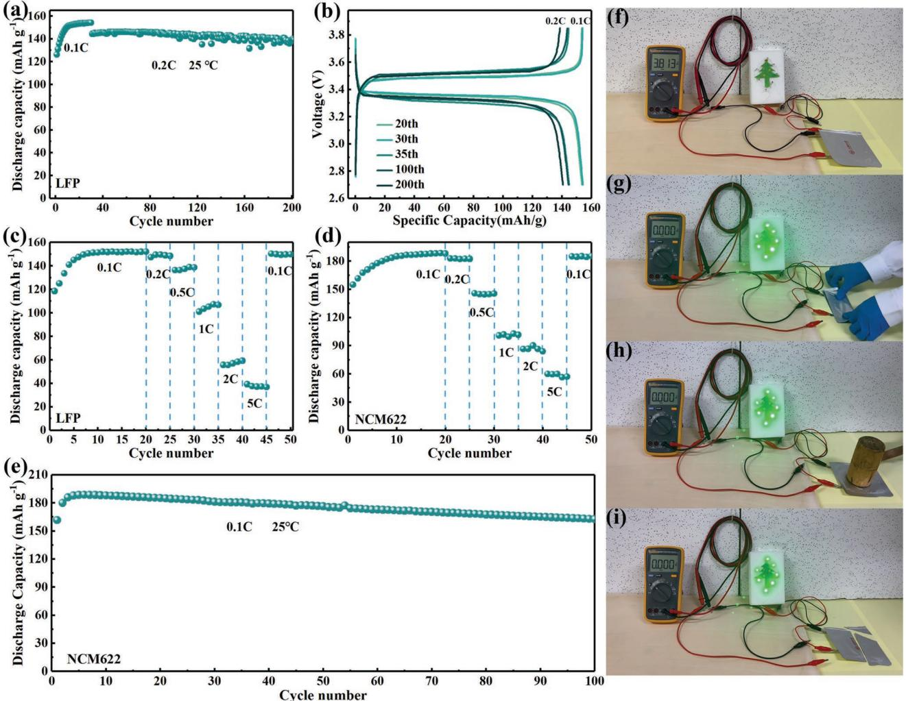

# **Li-Ion Transfer Mechanism of Ambient-Temperature Solid Polymer Electrolyte toward Lithium Metal Battery**

*Su Wang, Qifang Sun, Qing Zhang, Chen Li, Chaoran Xu, Yue Ma,\* Xixi Shi, Hongzhou Zhang, Dawei Song,\* and Lianqi Zhang\**

**The low ionic conductivity and short service life of solid polymer electrolytes (SPEs) limit the application of ambient-temperature polymer lithium metal batteries, which is perhaps a result of the inherent restricted segment movement of the polymer at room temperature. Herein, an ambient-temperature dual-layer solid polymer electrolyte is developed and the related working mechanisms are innovatively investigated. In the strategy, poly(propylene carbonate) (PPC)/succinonitrile (SN) contacts with the cathode while polyethylene oxide (PEO)/Li7La3Zr2O12 is adopted near the anode. Molecular dynamics simulations demonstrate the formation of solvated sheath-like structure [SN···Li+], which demonstrates strong interaction with polymers (PPC···[SN···Li+]/PEO···[SN···Li+]). Further density functional theory calculations show that these structures, allow rapid transport of Li ions through polymer segments. These results are confirmed with Fourier transform infrared spectroscopy and nuclear magnetic resonance. Therefore, the Li-ion transport mechanism for ambient-temperature SPEs can be reasonably revealed. Remarkably, the binding energy between PPC and SN is stronger than that of PEO, which helps avoid the parasitic reaction between SN and Li. A low overpotential of 55 mV is exhibited for Li/Li symmetrical cells after 1000 h. Notably, a capacity retention of 86.3% is maintained for LiNi0.6Co0.2Mn0.2O2/Li cell at 25 °C, implying good application potential in ambient-temperature high voltage lithium metal batteries.**

# **1. Introduction**

Lithium metal batteries (LMBs) with high energy density are desperately desirable for the development of energy storage.[1] Unfortunately, the practical application of rechargeable LMBs based on traditional electrolyte faces a series of seemingly insurmountable obstacles such as safety risks resulted from the flammable liquid organic solvent, the limited energy density, and the uneven deposition of Li ions induced by the uncontrollable dendritic growth.[2] Solid-state electrolytes are expected

D. Song, L. Zhang

School of Materials Science and Engineering Tianjin University of Technology

Tianjin 300384, China

E-mail: mayue@email.tjut.edu.cn; songdw2005@mail.nankai.edu.cn; zhanglianqi@tjut.edu.cn

The ORCID identification number(s) for the author(s) of this article can be found under https://doi.org/10.1002/aenm.202204036.

#### **DOI: 10.1002/aenm.202204036**

to ultimately solve these issues with their intrinsically high safety owing to the nonflammability and high mechanical properties. Without the defects of inorganic solid electrolytes including high brittleness and poor interfacial contact, solid polymer electrolytes (SPEs) presenting the following merits: 1) flexibility and easy scalability for fabricating flexible solid-state Li batteries,[3] 2) high safety with the low risk of combustion and leakage,[4] 3) strong mechanical properties to resist dendrite growth,[5] 4) adaptability with high energy density cathode system,[6] and 5) thermodynamic stability in a wide temperature range.[7]

However, the conventional SPE such as polyethylene oxide (PEO) has the limited chain motion and a low ionic conductivity (10−7 –10−8 S cm−1 ) at room temperature, which requires high working temperature of ≈60 °C and therefore the wide application is restricted.[8] Extensive strategies have been proposed to achieve high-performances, such as molecular structure construct,[9] functional group design,[10] and interfacial engineering.[6a,11] Filler addition has been advanced to improve the ionic

conductivity of SPEs by interrupting the segment regularity and improving the motion of polymer chain.[12] However, the rapid Li ion transfer channels are still in insufficiency within the overall polymer matrix. Succinonitrile (SN) has been used as the additive or plasticizer in polymer electrolyte to improve the ambient performance of SPEs.[13] Some researchers report that SN is conducive to weaken the strong complexation between Li ions and SPEs and therefore the migration of Li ions is promoted.[13a,14] Nevertheless, the specific working principle is still veiled.

Herein, a heterogeneous dual-layer solid polymer electrolyte (DSPE) is developed in this work to clarify the working mechanism of SPEs at room temperature and match with high working potential cathode. Given the high conductivity but the corrosion effect on aluminum collectors of Lithium bis(trifluoromethanesulfonyl) imide (LiTFSI) and the excellent cathode compatibility of lithium difluoro(oxalato) borate (LiDFOB).[15] In as-prepared DSPE, the SN–PPC (poly(propylene carbonate))–LiDFOB (hereinafter referred to as DSPE-I) contacts with cathode. In addition, the PEO–Li7La3Zr2O12–LiTFSI composite electrolyte (hereinafter referred to as DSPE-II) is near lithium anode. The

S. Wang, Q. Sun, Q. Zhang, C. Li, C. Xu, Y. Ma, X. Shi, H. Zhang,

intermolecular interactions between SN and lithium salt are elucidated for the first time by molecular dynamics (MD) simulations and the coordination ([SN···Li+]) is formed between N atom of SN and Li ions. More importantly, the strong interactions between SN and PPC/PEO polymer are further elucidated using density functional theory (DFT), SN···PPC presents a binding energy of −0.860 eV and the value of SN···PEO is −0.744 eV, combining with the formation of [SN···Li+] solvated sheath structure, the ideal binding energy provides potential dynamic for the generation of polymer···[SN···Li+] system, endowing Li ion transport through polymer segment at room temperature. Moreover, SN···PPC presents stronger binding energy than that of SN···PEO, which is conducive to isolate the direct contact between Li anode and SN and therefore the parasitic reactions are prevented. Fourier transform infrared (FTIR) spectroscopy and nuclear magnetic resonance (NMR) are performed extensively to further clarify the specific interactions between SN and PPC/PEO, and it is found that [SN···Li+] solvated structure presents strong interaction with CO groups/CC chains of PPC/PEO. Based on the above results, the assembled LiNi0.6Mn0.2Co0.2O2/Li cell delivers a high discharge capacity of 188.6 mAh g−1 and capacity retention of 86.3% after 100 cycles at room temperature. The construction of DSPE also enables superior interfacial stability with lithium anode, an extremely small overpotential is displayed for Li/Li symmetric cell after 1000 h at 25 °C. Moreover, benefited from the nonflammable property of SN, DSPE presents unprecedented safety performance, which provides a new idea for developing high-performance solid polymer electrolytes.

## **2. Results and Discussion**

Schematic diagram of DSPE synthesis process is illustrated in Figure S1 of the Supporting Information. The intermolecular interaction between SN and lithium salt (LiDFOB) exhibits a solvation sheath-like structure at room temperature according to MD simulations, and the specific solvation structure of [SN···Li+] is displayed in **Figure 1**a. The representative snapshots of SN-LiDFOB show that the ions are uniformly distributed throughout the electrolyte.[16] According to the calculated radial distribution functions (*g*(*r*), solid lines) and coordination numbers (*n*(*r*), dashed lines) in Figure 1b, the dominated peak of *g*(*r*) appears at 2.2 Å for Li+···N (SN), while the coordination interaction between Li+···C is significantly lower, indicating the primary contact of Li ion and N atom of SN. To quantitatively obtain the coordination of SN and Li+, DFT calculations are further conducted. As shown in Figures S2 and S3 of the Supporting Information, the binding energy of SN···Li+ is −4.359 eV, higher than those of DFOB−···Li+ (−2.981 eV), PPC···Li+ (−3.965 eV), and PEO···Li+ (−3.115 eV), indicating the priority of SN in coordination with Li ions. The interaction between SN and Li+ facilitates the dissociation of LiDFOB and the rapid release of more Li ions, which is advantageous to the rapid transfer of Li ions at room temperature.[2a,17]

To further investigate the interaction between polymer matrix (PPC/PEO) and solvation sheath-like structure [SN···Li+], related samples including pure SN, PEO, PPC, PPC···SN, and PEO···SN are systematically analyzed. Local characteristic fragments of PEO and PPC molecules are intercepted to

**Figure 1.** a) Snapshots of SN and Li+ obtained by MD simulation at 25 °C (colors for different elements: white for H, light blue for C, dark blue for N, pink for Li+). b) Calculated radial distribution functions (*g*(*r*), solid lines) and coordination numbers (*n*(*r*), dashed lines) for Li–N (red), Li–C (blue), and Li–all (green). The optimized geometric configurations and electrostatic potential of c) SN, PEO, PEO–SN, and d) SN, PPC, PPC–SN. e) The binding energy of PEO–SN and PPC–SN.

simplify the structure and the composition of system. Electrostatic potential is calculated to exhibit the electronegative and electropositive locus (Figure 1c,d). Obviously, PPC shows higher electronegativity than PEO, meaning that the coordination between PPC and SN is stronger than that of PEO. As shown in Figure 1e, the binding energy of PPC···SN is −0.860 eV, higher than that of PEO···SN (−0.744 eV), which protects Li anode from the erosion of SN. Definitely, these results indicate that the polymer···[SN···Li+] system is generated and provide potential for Li ions to transfer through polymer chains, therefore Li ion transfer paths will be established at room temperature in addition to lower the crystallization of polymer segment (Figure S4, Supporting Information).[18]

To elaborate the intriguing intermolecular interaction deeply, extensive FTIR measurements are carried out. Based on the results of **Figure 2**a, it is clear that the solvated sheath-like structure can be obtained by simply mixing SN and LiDFOB at room temperature. The peak at 2254 cm−1 related to CN from SN molecule increases with the addition of lithium salts, revealing the interactions of CN···Li+, [13a,19] and implying the generation of solvated sheath-like structure [SN···Li+]. A new peak at ≈950 cm−1 is corresponding to the interaction of CC···Li+. More importantly, the absorption peaks of SN at 2990.5 and 1429.5 cm−1 correspond to the stretching and bending vibrations of CH, presenting obvious red shift to 2987.9 and 1427.2 cm−1 for SN–LiDFOB, indicating the formation of hydrogen bonds (CH···M, MO or F) between SN and DFOB− anions.[14b,20] In addition, the red shift of B–O[21] stretching peak from 1371.9 (LiDFOB) to 1366.1 cm−1 (SN–LiDFOB), and the O–C–C stretching peak shifts from 1243.1 (LiDFOB) to 1237.8 cm−1 (SN–LiDFOB), specifically, demonstrating the interaction occurs between CH2 group and B–O as well as O–C–C of LiDFOB.

The interaction between PPC/PEO matrix and solvated SN-LiDFOB complex is further investigated. As shown in Figure 2b, the peak of LiDFOB at 1798.9 cm−1 presents red shift to lower

**Figure 2.** FTIR spectra and detail magnifications of a) SN, LiDFOB, and SN-LiDFOB. b) PPC, SN–LiDFOB, and PPC–SN–LiDFOB. c) PEO, SN–LiDFOB, and PEO–SN–LiDFOB.

wavenumbers (1797.2 cm−1 ) after adding PPC. The absorption peak at 1737.9 cm−1 corresponding to the CO stretching of PPC and the peak of SN–LiDFOB at 1763.2 cm−1 form a broadened peak at 1749.4 cm−1 of PPC–SN–LiDFOB, implying the generation of strong interaction (CO···[SN···Li+]),[22] which is anticipated to establish polymer···[SN···Li+] system and provide transport pathways for Li ions through PPC chains. Moreover, the shifting and the broadening of the peaks at 1633.1 cm−1 (B–F of LiDFOB), 1063.1 cm−1 (COC of PPC), and 1085.6 cm−1 (F–B–F of LiDFOB) in spectra of PPC–SN–LiDFOB illustrate the enhanced lithium salts dissociation under the CO···[SN···Li+] interaction. As the primitive PPC fail to dissociate lithium salt or participate in Li ions solvation directly, the 13C and 1 H NMR spectra of PPC–LiDFOB exhibit negligible shift compared with PPC (Figure S5, Supporting Information). The blue shift of C–C stretching peak from 784.4 (PPC) to 787.5 cm−1 (PPC–SN–LiDFOB) indicates that PPC becomes the host of charge carriers for the Li ion conduction. Similar conclusions can be achieved in the spectra of PEO–SN–LiDFOB (Figure 2c). The CO stretching peaks of LiDFOB at 1798.9 and 1763.2 cm−1 present red shift to lower wavenumbers (1794.8 and 1761.3 cm−1 ) after adding PEO.[23] The shift of CH stretching and bending vibration peaks (2885.6, 2859.5, and 1466.5 cm−1 to 2914.8, 2875.9, and 1473.2 cm−1 ) as well as the shift of multiple peaks in the range of 1200–1400 cm−1 indicate the chemical environment varia-

tion of OH/COH in PEO and the formation of strong interaction in PEO–SN–LiDFOB. The verification of the interaction force in FTIR is consistent with theoretical calculation, indicating the establishment of Li ion transfer paths and therefore the dual-layer electrolyte containing DSPE-II can be operated at room temperature.

NMR spectroscopy is conducted to further systematically verify the working mechanism of DSPE. The 13C NMR peak of CN in SN shifts to lower field (119.12 to 119.14 ppm) in SN–LiDFOB, indicating the reduced electron cloud density around CN and implying that the coordination interaction is more likely to be formed between N atoms of SN and Li+ (**Figure 3**a).[24] The CH2 peak shifts to lower frequency in SN–LiDFOB (14.18 to 14.17 ppm), indirectly indicating the chemical environment variation of CN. The same result can be achieved from the 1 H peak of CH2, which shifts to lower field (2.91 to 2.92 ppm) and confirms the formation of [SN···Li+] solvation structure (Figure 3b). The interaction of PPC with [SN···Li+] solvated structure is shown in Figure 3c. The peak of CO belonging to PPC exhibits more significant displacement to lower frequency in PPC–SN–LiDFOB, indicating the strong interaction of CO···[SN···Li+] and the reduction of the electron cloud density around O atoms. The chemical shift deviations show the opposite tendency in 1 H NMR spectrum (Figure 3d), demonstrating that Li ions are facile to transport along the CO/CC groups of PPC and implying the poten-

**Figure 3.** a) 13C NMR and b) 1 H NMR spectra of SN and SN–LiDFOB. c) 13C NMR and d) 1 H NMR spectra of PPC and PPC–SN–LiDFOB. e) 13C NMR and f) 1 H NMR spectra of PEO and PEO–SN–LiDFOB. Nyquist curves of g) DSPE-I, h) DSPE-II, and i) DSPE.

tial of PPC–SN–LiDFOB to work normally at room temperature.[25] As shown in 13C NMR of PEO–SN–LiDFOB (Figure 3e), the sharp peak belonging to CH2 of PEO shifts to higher field (70.20 ppm), suggesting the reduction tendency of electron cloud density around O atoms and indirectly confirming the interaction between CO and [SN···Li+]. Moreover, in comparison with the 1 H NMR of PEO, the gap of chemical shifts increases in PEO–SN–LiDFOB (Figure 3f), implying the rapid transfer of Li ions through the PEO segments.[13b] These results agree well with the simulation calculation (Figure 1) and FTIR spectroscopic observation (Figure 2), and innovatively confirm the interaction between polymer matrix and [SN···Li+]. Therefore, the rapid Li ions transfer paths are created, making DSPE works well at ambient temperature. To support this assumption, the electrochemical impedance spectroscopy (EIS) curves of stainless steel (SS)/DSPE-I/SS, SS/DSPE-II/SS, and SS/DSPE/ SS cells are examined (Figure 3g–i). On account of the formed solvated structure and its interaction with PPC in DSPE-I, Li ions transfer rapidly in PPC···[SN···Li+] system and therefore a relatively high ionic conductivity of 5.29 × 10−4 S cm−1 is obtained. In sharp contrast, the impedance of DSPE-II layer is up to about 1400 Ω due to the ineffective migration of PEO chain segments at room temperature (3.62 × 10−6 S cm−1 ). Predictably, the ionic conductivity of DSPE greatly increases to 0.74 × 10−4 S cm−1 at room temperature, indicating that PEO···[SN···Li+] is formed and the motion of chain segments is essentially activated.

Therefore, the working mechanism of solid polymer electrolyte at room temperature is summarized in **Figure 4**. The [SN···Li+] solvated structure is formed and presents interaction with PPC in DSPE-I layer. Since the combination of CC/CO···[SN···Li+], the polymer···[SN···Li+] system is generated, and then provides potential for Li ions to transfer through polymer chains. However, Li anode is susceptible to SN component and severe corrosion reactions and uncontrollable growth of lithium dendrites will be resulted. As for DSPE-II, the high-degree crystallization and the sluggish polymer segments hamper the transportation of Li ions at room temperature. After the construction of dual-layer DSPE, the interaction of PEO···[SN···Li+] is further generated and Li ion migration paths are greatly optimized through the CC chains of PEO, the room-temperature operation capability is improved. Significantly, the Li anode is protected from the erosion of SN since SN···PPC presents stronger interaction than SN···PEO.

Electrochemical performance of DSPE is further extensively investigated. The electronic conductivity of DSPE is 4.8 × 10−10 S cm−1 (**Figure 5**a), which is five orders of magnitude lower than the corresponding ionic conductivity, indicating the potential to inhibit Li dendrite growth.[26] The temperature dependence of ionic conductivity can be modeled by Vogel– Tamman–Fulcher equation, and the EIS curves are measured from 25 to 115 °C by assembling SS/DSPE/SS cell (Figure S6, Supporting Information). As illustrated in Figure 5b, the calculated activation energy (*E*a) is 1.76 kJ mol−1 , indicating low energy barrier for Li ions to overcome and the rapid ion migration dynamics.[27] Electrochemical stability window is an indispensable parameter for high working potential LMBs. As shown in Figure 5c, the onset decomposition potential of DSPE at 25 °C is 5.6 V. The outstanding electrochemical stability is attributed to the construction of dual-layer structure and the strong interaction between PPC···[SN···Li+].

Based on the comprehensive interaction between polymer matrix and SN solvated structure, DSPE-I presents immobility

**Figure 4.** Structural schematic illustrations of DSPE-I, DSPE-II, and DSPE at room temperature.

**www.advancedsciencenews.com www.advenergymat.de**

**Figure 5.** a) Time dependent direct current polarization profile of SS/DSPE/SS cell with a constant voltage of 1.0 V. b) Temperature dependent ionic conductivities for SS/DSPE/SS cell from 25 to 115 °C. c) LSV curve of DSPE at 25 °C. d) Current variation with polarization of Li/DSPE/Li symmetrical cell and Nyquist curves before and after polarization in the inset. e) Nyquist curves of Li/DSPE/Li symmetrical cell for different aging times. f) Rate performance test of Li/DSPE/Li symmetrical cell to determine the critical current density with a lithium stripping/plating period of 1 h. g) Voltage profile of Li/DSPE/Li symmetric cell under various current densities at 25 °C.

at room temperature and splendid interface compatibility at 60 °C (Figure S7, Supporting Information). The interactions of PPC···[SN···Li+] and PEO···[SN···Li+] introduce consecutive Li ion transport paths, therefore, a high Li ion transfer number (*tLi*+ ) value of 0.35 is obtained (Figure 5d). To investigate the effect of each layer on Li ions transport kinetics at Li/electrolyte interface, Li/DSPE/Li, Li/DSPE-I/Li, and Li/DSPE-II/Li symmetric cells are assembled to monitor the impedance response at ambient temperature. As shown in Figure 5e, the resistance of Li/DSPE/Li symmetric cell is 415 Ω in the 1st day, then increases slowly and reaches a stable level of 446 Ω on the 5th day due to the formation of passivation layer. A stable resistance variation with negligible increase is obtained even over 30 days. However, the resistance of Li/DSPE-II/Li symmetric cell is higher than 1300 Ω (Figure S8a, Supporting Information), failing to guarantee effective Li ion conduction at room temperature. In sharp contrast, the impedance of Li/DSPE-I/Li symmetric cell continuously increases from 271 to 385 Ω due to the severe corrosion reaction at electrolyte/Li interface (Figure S8b, Supporting Information). These results suggest that DSPE is conducive to enhance Li ion transfer kinetics and protect Li anode from the erosion of SN.

Dynamic electrochemical stability and interfacial stability between DSPE and Li anode are further measured by galvanostatic cycling tests. Cycling performance of Li/DSPE/Li symmetric cell with stepwise increasing current density (from 0.1 to 1.3 mA cm−2 ) is measured to determine the critical current density. As illustrated in Figure 5f, the polarization voltage increases almost linearly with current density, while no short-circuit can be observed up to 1.3 mA cm−2 . Remarkably, these results exceed the values in previous reports for state-of-the-art solid polymer electrolytes.[28] In addition, rate

performance test is performed at current densities of 0.025 to 0.5 mA cm−2 (Figure 5g), and Li/Li cell works perfectly with minor overpotential variation for over 700 h. Typical zoom-in curves are shown in Figure S9 of the Supporting Information, and the long cycling performance is further demonstrated at the current density of 0.05 mA cm−2 with a flat polarization (55 mV) curve during 1000 h (Figure S10, Supporting Information). The excellent performance highlights the transmission path continuity and good interface compatibility with Li anode, illustrating the splendid interface stability and fast dynamics of DSPE. To verify the diffusion kinetic of DSPE in cathode, AC impedance test of LiFePO4 (LFP)/DSPE/Li cell is carried out (Figure S11, Supporting Information), and the diffusion coefficient of Li ions is calculated to be 1.53 × 10−15 cm2 S−1 . The high value indicates the generation of rapid Li ion transfer paths across the electrolyte/electrode interface.[29] In addition to the basic electrochemical properties, the flammability test is also conducted by direct ignition. As revealed in Figure S12 and Videos S1–S3 of the Supporting Information, the liquid electrolyte (LE, 1 m LiDFOB in EC/DMC) and DSPE-II can be easily ignited and the severe combustion sustains even after removing away the flame. By sharp contrast, DSPE is difficult to be ignited but gradually melts even in contact with the flame for 90 s, implying the excellent fireproof potential to improve the battery safety.

Electrochemical performances of DSPE are evaluated in LFP/Li solid-state LMBs at 25 °C and 2.7–3.85 V. **Figure 6**a shows the cycling performance at 0.2 C (1 C170 mA g−1 ) after activated for 30 cycles at 0.1 C. The initial discharge capacity is 126.2 mAh g−1 , and reaches 154.2 mAh g−1 after 30 cycles of activation, indicating that the capacity of LFP can be fully utilized after activation. The final capacity of 140.1 mAh g−1 with the capacity retention of 96% is maintained. Figure 6b shows the related charge/discharge curves. The initial polarization voltage obviously presents a low value of 0.12 V at 0.1 C, and remains to 0.14 V even after 200 cycles. This is attributed to the forceful generation of polymer···[SN···Li+] system, which provides rapid Li ions transport capability

**Figure 6.** a) Cycling performance, b) charge/discharge curves after different cycles, and c) rate performance of LFP/DSPE/Li cell at 25 °C. d) Rate and e) cycling performance of NCM622/DSPE/Li cells at 25 °C. f) The voltage test of LFP/DSPE/graphite pouch cell. The powering LED lamps test of LFP/ DSPE/graphite pouch cell under g) twisting, h) hammer striking, and i) cutting.

at electrode/electrolyte interface. Rate performance is also conducted after an activation process at 0.1 C for 20 cycles (Figure 6c). Discharge capacities of 152, 149, 138, 106, 58, and 39 mAh g−1 are displayed at 0.1, 0.2, 0.5, 1, 2, and 5 C, respectively. A superior discharge capacity of 150 mAh g−1 is delivered when the current density returns to 0.1 C. Furthermore, the long cycling property is also investigated at 1 C. As shown in Figure S13 of the Supporting Information, after the initial active process, a discharge capacity of 115.2 mAh g−1 with the capacity retention of 94.1% is achieved after 100 cycles. The excellent electrochemical performance verifies the effectiveness of DSPE in ambient-temperature solid-state LMBs. Scanning electron microscopy (SEM) and EDS element analysis of cycled electrodes are further tested and shown in Figure S14a of the Supporting Information. The surface morphology of LFP particle is uniform and intact without cracks. DSPE-I partially remains on the surface of cathode, proving that the interface between LFP and DSPE is intimate. Figure S14b–e of the Supporting Information depict the SEM and EDS images of cycled Li anode, a relatively smooth surface without obvious accumulations can be observed, consistent with the outstanding Li/Li electrochemical performance.

Considering the wide electrochemical stability window of DSPE, high-voltage cathode LiNi0.6Co0.2Mn0.2O2 (NCM622) is employed to further reveal the superiority of DSPE. As shown in Figure 6d, the solid-state LMBs also show a decent high-rate performance. The discharge capacities are 188, 182, 145, 101, 87, and 60 mAh g−1 at 0.1, 0.2, 0.5, 1, 2, and 5 C, respectively. When the rate restores to 0.1 C, the specific capacity quickly returns to 185 mAh g−1 . The long-term cycling performance of DSPE at 0.1 C and 3.0–4.3 V is presented in Figure 6e. A discharge capacity of 188.6 mAh g−1 is obtained after activation and a capacity retention of 86.3% is retained after 100 cycles, which reaches the value reported in recent literatures (Table S1, Supporting Information). The smooth charge/discharge profiles illustrate that no side reaction occurs when charged up to 4.3 V (Figure S15, Supporting Information). These results well demonstrate the potential application of DSPE in high-voltage ambient-temperature solid-state LMBs. From the SEM image in Figure S16a of the Supporting Information, the typical single crystal morphology of NCM622 similar with the pristine state is presented with negligible crack, indicating that the integrity of cathode structure is maintained after cycling. Meanwhile, a relatively compact and homogeneous surface with less lithium deposition products is displayed on Li anode (Figure S16b, Supporting Information), demonstrating the effective role of DSPE in regulating Li ion deposition and inhibiting Li dendrite growth, which is closely related to the protection role of DSPE.

To further evaluate the potential application of DSPE, LFP/ DSPE/graphite pouch cell is assembled and the flexibility and the safety are evaluated. The LED array composed seven members can be lit up after fully charged (Figure 6f; Figure S17, Supporting Information). Moreover, the fully charged pouch cell is still able to stably power the LED without internal short circuit after twisting, hammering, and corner-cutting tests (Figure 6g–i). These results strongly indicate that DSPE possesses ultrahigh safety and are expected to be widely applied to ambient-temperature wearable electronics in the future.

# **3. Conclusions**

In summary, a high-performance DSPE for ambient-temperature operated LMBs is designed and the related working mechanisms are extensively investigated. The CN···Li+ interaction between SN and lithium salt is calculated through MD simulation, proving the existence of solvated-like structure [SN···Li+]. The combination of FTIR/NMR, and DFT results demonstrate that the superior Li ion conduction is mainly attributed to the generation of polymer···[SN···Li+] system, therefore SPE can be operated at room temperature by providing abundant Li ions transfer paths through the polymer segments. The assembled LFP/Li cell using DSPE displays excellent cycling performance with a capacity retention of 96% after 200 cycles at room temperature. And NCM622/Li cell delivers a discharge capacity of 188.6 mAh g−1 and a capacity retention of 86.3% after 100 cycles. Notably, a low overpotential of 55 mV for 1000 h and a high critical current density up to 1.3 mA cm−2 at 25 °C are displayed. By virtue of the systematic theoretical evidences and the excellent electrochemical performance of DSPE, this work will enrich the fundamental understanding of ion transport mechanism of SPEs at room temperature. More importantly, the design of advanced electrolytes with ambient operability and high safety will be promoted.

### **4. Experimental Section**

*Materials*: PEO (average Mv ≈ 1 000 000, Aladdin), LiTFSI (99.95%, Sigma-Aldrich), anhydrous acetonitrile (ACN, 99.9%, Sigma-Aldrich), Li7La3Zr2O12 (LLZO, tetragonal phases, HF Kejing), succinonitrile (SN, Aladdin), 1-methyl-2-pyrrolidinone (NMP, 99.5%, Aladdin), 2-Methoxyethyl ether (DME, 99.5%, Aladdin), PPC (average Mn ≈ 50 000, Sigma-Aldrich), and LiDFOB (98%) were purchased from Suzhou DoDoChem Technology Co., Ltd. Polyvinylidene fluoride (PVDF) and LFP were provided by Tianjin EV Energies Co., Ltd. and single crystal LiNi0.6Co0.2Mn0.2O2 (NCM622) was self-prepared by the group.

*Preparation of Dual-Layered DSPEs*: First, DSPE-II was prepared by a solution casting method. PEO and LiTFSI (EO:Li = 16:1) were dissolved in ACN and continuously stirred at 50 °C for 12 h. Then 50 wt% LLZO was added and stirred for another 12 h to ensure the uniform dispersion. The homogeneous solution was poured into polytetrafluoroethylene molds and dried at 60 °C for 12 h in a vacuum oven to obtain the DSPE-II with a thickness of 100–120 µm. The electrolyte was cut into pieces with a diameter of 19 mm and stored in Ar-filled glove box. Subsequently, 0.8 g SN and 0.1 g LiDFOB were magnetically stirred at room temperature ≈6 min (a short time), then the obtained SN–LiDFOB mixture was further stirred at 60 °C for 2 min to obtain a homogeneous transparent mixture. PPC (SN:PPC = 7:3) was added to the above colorless liquid, and the homogeneous viscous substance was obtained by magnetic stirring for 12 h to obtain DSPE-I layer.

*Characterization*: FTIR spectrometer (Frontier Mid-IR FTIR) was carried out to analyze the interaction of polymer functional groups in the range of 4000–500 cm−1 . The 1 H and 13C NMR experiments were performed using AVANCE III 400 MHz spectrometer, and D6C2OS-d6 (containing 0.03% TMS) as solvent at room temperature. The surface microscopic morphologies of the samples were observed via SEM (Quanta FEG 250). X-ray diffraction (Ultima IV) was used to characterize the crystal structure with a scanning rate of 20° min−1 from 10° to 80° (2*θ*). X-ray photoelectron spectroscopy (XPS, Thermo Escalab 250) was employed to detect the surface components. The samples after cycling were thoroughly cleaned with DME solvent and then tested by SEM and XPS. Thermogravimetric analysis (Netzsch, TG 209 F3 Tarsus) was carried out from room temperature to 800 °C at a ramping rate of 10 °C min−1 under Ar atmosphere.

CR2032 coin cells were assembled in order of lithium anode, DSPE-II, DSPE-I (30 µL, 60 °C), cathode electrode in a glove box filled with Ar atmosphere. The SS/SS, Li/SS, and Li/Li cells were assembled in the same order.

*Electrochemical Characterization*: Linear sweep voltammetry (LSV) test was conducted on Li/SS cells at a scan rate of 1 mV s−1 from 0 to 6 V. Electrochemical impedance spectra (EIS) test was performed on SS/ SS cells in the frequency range from 0.1 to 106 Hz with an amplitude of 10 mV in a range from 25 to 115 °C. Ionic conductivity (*σ*) of DSPEs was calculated by Equation (1)

$$
\sigma = \frac{L}{R \times S} \tag{1}
$$

where *L*, *R*, and *S* represent the thickness, the bulk resistance, and the area of the electrodes, respectively. Li ion transfer number ( *tLi* + ) was calculated by Equation (2)

$$
t_{Li^{+}} = \frac{I_s (\Delta V - I_0 R_0)}{I_0 (\Delta V - I_s R_s)}
$$
(2)

where the *I*0 and *I*s values were obtained from the chronoamperometry (CA) measurement (Δ*V* = 0.01 V vs Li/ Li+), *I*0 = initial current, *I*s = steady-state current. The *R*0 and *R*s values were obtained from EIS measurements before and after the polarization of CA, *R*0 = initial resistance, *R*s = steady-state resistance. The electronic conductivity was calculated by Equation (3)

$$
\gamma = \frac{l_s \times L}{S \times U} \tag{3}
$$

where *U* = 1 V, *I*s, *L*, and *S* represent the steady state polarization current, the thickness of SPEs, and the area of the electrodes respectively. The AC impedance of LFP/DSPE/Li cell was tested, and the diffusion coefficient of lithium ion was calculated by Equation (4)

$$
D_{Li^{+}} = \frac{R^{2}T^{2}}{2A^{2}n^{4}F^{4}C^{2}\sigma^{2}}
$$
 (4)

where *D* is the diffusion coefficient (cm2 s−1 ), *R* is the gas constant (*R* = 8.314 J K−1 mol−1 ), *T* is the absolute temperature, *A* is the surface area of the cathode (*A* = 1 cm−2 ), *n* is the number of electrons transferred in the half-reaction (*n* = 1), *F* is the Faraday constant (*F* = 96 500 C mol−1 ), *C* is the concentration of Li ion in solid, and *σ* is the Warburg factor.

LAND CT2001A battery test system was used for electrochemical measurements. The polarization curves of Li/Li symmetric cells were charged and discharged for 2 h in each cycle with a current density of 0.05 mA cm−2. The charge–discharge voltage range was 2.7–3.85 V for LFP cathodes and 3.0–4.3 V for NCM622 cathodes.

*Theoretical Simulation and Calculations: Molecular Dynamics Simulation*: The partial charge of SN molecule was calculated using Gaussian 16 code and the 6–31+g(d,p) basis functions were applied. The OPLSS-AA force field and MKTOP were used to parametrize all atoms, such as the bond parameters, angle parameters, the dihedral angles, and so on. The coordination of SN and Li+ was calculated by MD simulation. The MD simulations were performed in the GROMACS 2021 software package. In all the three directions, periodic boundary conditions were imposed. Leapfrog algorithm was used to integrate the Newtonian equation of motion. The MD simulation was processed in an NPT ensemble and the simulation time is 10 ns.

In NPT simulations, the pressure was maintained at 1 bar by the Berendsen barostat in an isotropic manner. The temperature was maintained by the V-rescale thermostat at 298.15K. The LINCS algorithm was performed for constrain bond lengths of hydrogen atoms. The Particle–Mesh–Ewald with a fourth-order interpolation was used to evaluate the electrostatic interactions and the grid spacing is 1.0 Å, whereas a cutoff of 1.0 Å was employed to calculate the short-range van der Waals interactions. After 10 ns of MD simulations, the radial distribution function and coordination number between Li ion and SN molecules were analyzed.

*Density Functional Theory*: Polymer PEO and PPC were simplified as two oligomer molecules. The geometries of the SN, PEO, and PPC the complex structures of PEO–SN and PPC–SN were all optimized with semiempirical method GFN-xTB. For each complex, one hundred possible complex structures were generated randomly and then searched using Molclus program. These clusters were optimized using xTB program first. After the preliminary structural optimization, the cluster with the lowest energy was selected as the most likely adsorption structure. These selected clusters and isolated molecules were then optimized under the framework of DFT with m062× functional. Single point calculations for these optimized structures with m062× functional and def2TZVP basis set were then performed. All these DFT calculations were performed using Gaussian 16 program suite. The binding free energy of the complex was calculated from the formula: *E*(binding) = *E*(A + B)–*E*(A)–*E*(B)

where *E*(A) and *E*(B) is the energy of isolated molecules, *E*(A + B) is the total energy of the complex structure.

# **Supporting Information**

Supporting Information is available from the Wiley Online Library or from the author.

#### **Acknowledgements**

This work was financially supported in part by the National Nature Science Foundation of China (22005217) and National Key Research and Development Program of China (2018YFE0111600).

#### **Conflict of Interest**

The authors declare no conflict of interest.

#### **Data Availability Statement**

The data that support the findings of this study are available from the corresponding author upon reasonable request.

#### **Keywords**

dual-layer structures, Li-ion conduction mechanism, room temperature operation, solid polymer electrolytes

> Received: November 27, 2022 Revised: February 12, 2023 Published online: March 9, 2023

[1] a) J. M. Tarascon, M. Armand, *Nature* **2001**, *414*, 359; b) W. Xu, J. L. Wang, F. Ding, X. L. Chen, E. Nasybulin, Y. H. Zhang, J. G. Zhang, *Energy Environ. Sci.* **2014**, *7*, 513.

**www.advancedsciencenews.com www.advenergymat.de**

- [2] a) J. W. Xiang, Y. Zhang, B. Zhang, L. X. Yuan, X. T. Liu, Z. X. Cheng, Y. Yang, X. Zhang, Z. Li, Y. Shen, J. J. Jiang, Y. H. Huang, *Energy Environ. Sci.* **2021**, *14*, 3510; b) Z. Lin, T. Liu, X. Ai, C. Liang, *Nat. Commun.* **2018**, *9*, 5262; c) S. H. Wang, J. Yue, W. Dong, T. T. Zuo, J. Y. Li, X. Liu, X. D. Zhang, L. Liu, J. L. Shi, Y. X. Yin, Y. G. Guo, *Nat. Commun.* **2019**, *10*, 4930.
- [3] a) S. L. Liu, W. Y. Liu, D. L. Ba, Y. Z. Zhao, Y. H. Ye, Y. Y. Li, J. P. Liu, *Adv. Mater.* **2023**, *35*, 2110423; b) E. Quartarone, P. Mustarelli, *Chem. Soc. Rev.* **2011**, *40*, 2525; c) L. Fan, S. Y. Wei, S. Y. Li, Q. Li, Y. Y. Lu, *Adv. Energy Mater.* **2018**, *8*, 1702657.
- [4] K. Yoon, S. Lee, K. Oh, K. Kang, *Adv. Mater.* **2022**, *34*, 2104666.
- [5] a) Q. F. Sun, S. Wang, Y. Ma, Y. Zhou, D. W. Song, H. Z. Zhang, X. X. Shi, C. L. Li, L. Q. Zhang, *Energy Storage Mater.* **2022**, *44*, 537; b) Y. P. Pang, J. Y. Pan, J. H. Yang, S. Y. Zheng, C. S. Wang, *Electrochem. Energy Rev.* **2021**, *4*, 169.
- [6] a) H. Duan, M. Fan, W. P. Chen, J. Y. Li, P. F. Wang, W. P. Wang, J. L. Shi, Y. X. Yin, L. J. Wan, Y. G. Guo, *Adv. Mater.* **2019**, *31*, 1807789; b) J. Zheng, M. H. Engelhard, D. Mei, S. Jiao, B. J. Polzin, J. G. Zhang, W. Xu, *Nat. Energy* **2017**, *2*, 17012; c) T. T. Dong, J. J. Zhang, G. J. Xu, J. C. Chai, H. P. Du, L. L. Wang, H. J. Wen, X. Zang, A. B. Du, Q. M. Jia, X. H. Zhou, G. L. Cui, *Energy Environ. Sci.* **2018**, *11*, 1197; d) Y. Ma, Q. F. Sun, Z. Y. Wang, S. Wang, Y. Zhou, D. W. Song, H. Z. Zhang, X. X. Shi, C. L. Li, L. Q. Zhang, L. Y. Zhu, *J. Mater. Chem. A* **2021**, *9*, 3597.
- [7] a) S. J. Xu, Z. H. Sun, C. G. Sun, F. Li, K. Chen, Z. H. Zhang, G. J. Hou, H. M. Cheng, F. Li, *Adv. Funct. Mater.* **2020**, *30*, 2007172; b) Z. Y. Zhang, S. Zhang, S. X. Geng, S. B. Zhou, Z. L. Hu, J. Y. Luo, *Energy Environ. Sci.* **2022**, *51*, 19; c) L. C. Kong, Y. Li, W. Feng, *Electrochem. Energy Rev.* **2021**, *4*, 633.
- [8] a) X. Yang, Q. Sun, C. Zhao, X. Gao, K. Adair, Y. Zhao, J. Luo, X. Lin, J. Liang, H. Huang, L. Zhang, S. Lu, R. Li, X. Sun, *Energy Storage Mater.* **2019**, *22*, 194; b) K. Pan, L. Zhang, W. Qian, X. Wu, K. Dong, H. Zhang, S. Zhang, *Adv. Mater.* **2020**, *32*, 2000399.
- [9] a) R. Bouchet, S. Maria, R. Meziane, A. Aboulaich, L. Lienafa, J. P. Bonnet, T. N. T. Phan, D. Bertin, D. Gigmes, D. Devaux, R. Denoyel, M. Armand, *Nat. Mater.* **2013**, *12*, 452; b) J. Lopez, Y. M. Sun, D. G. Mackanic, M. Lee, A. M. Foudeh, M. S. Song, Y. Cui, Z. N. Bao, *Adv. Mater.* **2018**, *30*, 1804142; c) G. Zhang, Y. L. Hong, Y. Nishiyama, S. Y. Bai, S. Kitagawa, S. Horike, *J. Am. Chem. Soc.* **2019**, *141*, 1227.
- [10] a) X. Judez, H. Zhang, C. Li, J. A. Gonzalez-Marcos, Z. B. Zhou, M. Armand, L. M. Rodriguez-Martinez, *J. Phys. Chem. Lett.* **2017**, *8*, 1956; b) H. Zhang, U. Oteo, X. Judez, G. G. Eshetu, M. Martinez-Ibañez 1, J. Carrasco, C. M. Li, M. Armand, *Joule* **2019**, *3*, 1689.
- [11] W. J. Hyun, C. M. Thomas, N. S. Luu, M. C. Hersam, *Adv. Mater.* **2021**, *33*, 2007864.
- [12] a) M. Liu, S. N. Zhang, E. R. H. Eck, C. Wang, S. Ganapathy, M. Wagemaker, *Nat. Nanotechnol.* **2022**, *17*, 959; b) L. Chen, Y. T. Li, S. P. Li, L. Z. Fan, C. W. Nan, J. B. Goodenough, *Nano Energy* **2018**, *46*, 176; c) M. Liu, Z. Cheng, S. Ganapathy, C. Wang, L. A. Haverkate, M. Tułodziecki, S. Unnikrishnan, M. Wagemaker, *ACS Energy Lett.* **2019**, *4*, 2336; d) K. Yang, L. K. Chen, J. B. Ma, C. Lai, Y. F. Huang, J. S. Mi, J. Biao, D. F. Zhang, P. R. Shi, H. Y. Xia, G. M. Zhong, F. Y. Kang, Y. B. He, *Angew. Chem., Int. Ed.* **2021**, *60*, 24668; e) J. Zheng, M. X. Tang, Y. Y. Hu, *Angew. Chem.* **2016**, *128*, 12726; f) H. Y. Huo, Y. Chen, J. Luo, X. F. Yang, X. X. Guo, X. L. Sun, *Adv. Energy Mater.* **2019**, *9*, 1804004.
- [13] a) A. X. Wang, S. X. Geng, Z. F. Zhao, Z. L. Hu, J. Y. Luo, *Adv. Funct. Mater.* **2022**, *32*, 2201861; b) Y. N. Yang, F. L. Jiang, Y. Q. Li, Z. X. Wang, T. Zhang, *Angew. Chem., Int. Ed.* **2021**, *60*, 24162.
- [14] a) J. Peng, L. N. Wu, J. X. Lin, C. G. Shi, J. J. Fan, L. B. Chen, P. Dai, L. Huang, J. T. Li, S. G. Sun, *J. Mater. Chem. A* **2019**, *7*, 19565; b) Z. L. Hu, F. Xian, Z. Y. Guo, C. L. Lu, X. F. Du, X. Y. Cheng, S. Zhang, S. M. Dong, G. L. Cui, L. Q. Chen, *Chem. Mater.* **2020**, *32*, 3405.
- [15] a) Y. K. Liu, C. Z. Zhao, J. Du, X. Q. Zhang, A. B. Chen, Q. Zhang, *Small* **2023**, *19*, 2205315; b) H. Chen, D. Adekoya, L. Hencz, J. Ma, S. Chen, C. Yan, H. J. Zhao, G. L. Cui, S. Q. Zhang, *Adv. Energy Mater.* **2020**, *10*, 2000049; c) J. Y. Wan, J. Xie, X. Kong, Z. Liu, K. Liu, F. F. Shi, A. Pei, H. Chen, W. Chen, J. Chen, X. K. Zhang, L. Q. Zong, J. Y. Wang, L. Q. Chen, J. Qin, Y. Cui, *Nat. Nanotechnol.* **2019**, *14*, 705.
- [16] S. F. Liu, X. Ji, N. Piao, J. Chen, N. Eidson, J. J. Xu, P. F. Wang, L. Chen, J. X. Zhang, T. Deng, S. Hou, T. Jin, H. L. Wan, J. R. Li, J. P. Tu, C. S. Wang, *Angew. Chem., Int. Ed.* **2021**, *60*, 3661.
- [17] E. E. Ushakova, A. V. Sergeev, A. Morzhukhin, F. S. Napolskiy, O. Kristavchuk, A. V. Chertovich, L. V. Yashina, D. M. Itkis, *RSC Adv.* **2020**, *10*, 16118.
- [18] J. Ming, Z. Cao, W. Wahyudi, M. L. Li, P. Kumar, Y. Q. Wu, J. Y. Hwang, M. N. Hedhili, L. Cavallo, Y. K. Sun, L. J. Li, *ACS Energy Lett.* **2018**, *3*, 335.
- [19] a) T. C. Wen, H. H. Kuo, A. Gopalan, *Solid State Ionics* **2002**, *147*, 171. b) M. Echeverri, N. Kim, T. Kyu, *Macromolecules* **2012**, *45*, 6068; c) C. Wang, H. R. Zhang, S. M. Dong, Z. L. Hu, R. X. Hu, Z. Y. Guo, T. Wang, G. L. Cui, L. Q. Chen, *Chem. Mater.* **2020**, *32*, 9167.
- [20] K. Müller-Dethlefs, P. Hobza, *Chem. Rev.* **2000**, *100*, 143.
- [21] G. V. Zhuang, K. Xu, T. R. Jow, P. N. Ross, *Electrochem. Solid-State Lett.* **2004**, *7*, A224.
- [22] Q. Y. Liu, G. J. Yang, X. Y. Li, S. M. Zhang, R. J. Chen, X. F. Wang, Y. R. Gao, Z. X. Wang, L. Q. Chen, *Energy Storage Mater.* **2022**, *51*, 443.
- [23] H. Q. Gao, Z. A. Zhang, Y. Q. Lai, J. Li, Y. X. Liu, *J. Cent. South Univ. Technol.* **2008**, *15*, 830.
- [24] X. He, Y. X. Ni, Y. P. Hou, Y. Lu, S. Jin, H. X. Li, Z. H. Yan, K. Zhang, J. Chen, *Angew. Chem., Int. Ed.* **2021**, *60*, 22672.
- [25] K. H. Wen, C. Z. Xin, S. D. Guan, X. B. Wu, S. He, C. J. Xue, S. J. Liu, Y. Shen, L. L. Li, C. W. Nan, *Adv. Mater.* **2022**, *34*, 2202143.
- [26] F. D. Han, A. S. Westover, J. Yue, X. L. Fan, F. Wang, M. F. Chi, D. N. Leonard, N. J. Dudney, H. Wang, C. S. Wang, *Nat. Energy* **2019**, *4*, 187.
- [27] a) B. H. Yuan, B. Zhao, Q. Wang, Y. G. Bai, Z. W. Cheng, Z. Cong, Y. F. Lu, F. D. Ji, F. Shen, P. F. Wang, X. G. Han, *Energy Storage Mater.* **2022**, *47*, 288; b) S. G. Qi, S. L. Li, W. W. Zou, W. F. Zhang, X. J. Wang, L. Du, S. M. Liu, J. Q. Zhao, *Small* **2022**, *18*, 2202013; c) F. Fu, Y. Liu, C. Sun, L. N. Cong, Y. L. Liu, L. Q. Sun, H. M. Xie, *Energy Environ. Mater.* **2022**, *0*, 1.
- [28] a) A. N. Wang, J. Li, M. Y. Yi, Y. Y. Xie, S. L. Chang, H. B. Shi, L. Y. Zhang, M. H. Bai, Y. G. Zhou, Y. Q. Lai, Z. A. Zhang, *Energy Storage Mater.* **2022**, *49*, 246; b) X. M. Cai, J. L. Ding, Z. Y. Chi, W. Q. Wang, D. Y. Wang, G. C. Wang, *ACS Nano* **2021**, *15*, 20489; c) D. C. Zhang, Z. B. Liu, Y. W. Wu, S. M. Ji, Z. X. Yuan, J. Liu, M. Zhu, *Adv. Sci.* **2022**, *9*, 2104277; d) Y. Lu, C. Z. Zhao, H. Yuan, X. B. Cheng, J. Q. Huang, Q. Zhang, *Adv. Funct. Mater.* **2021**, *31*, 2009925.
- [29] X. Liu, T. Y. Zhang, X. X. Shi, Y. Ma, D. W. Song, H. Z. Zhang, X. Z. Liu, Y. G. Wang, L. Q. Zhang, *Adv. Sci.* **2022**, *9*, 2104531.